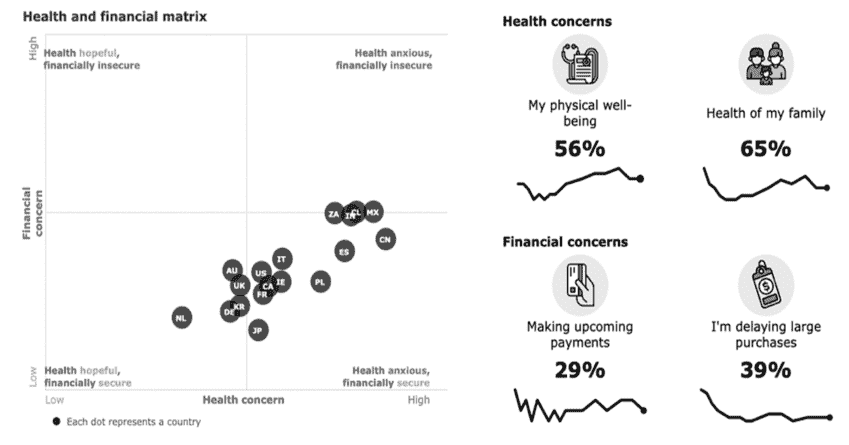
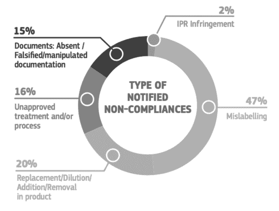
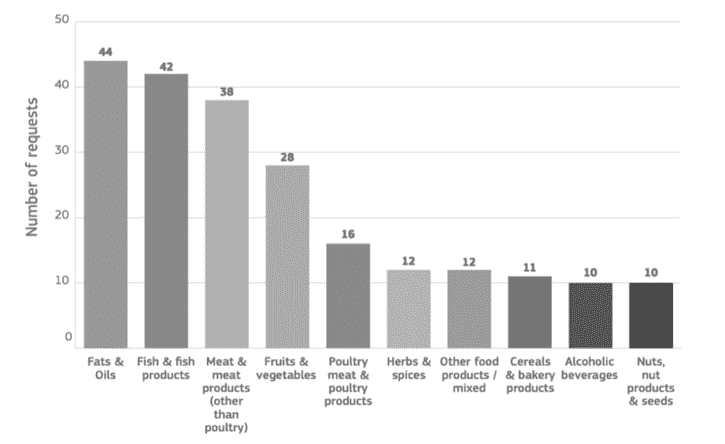
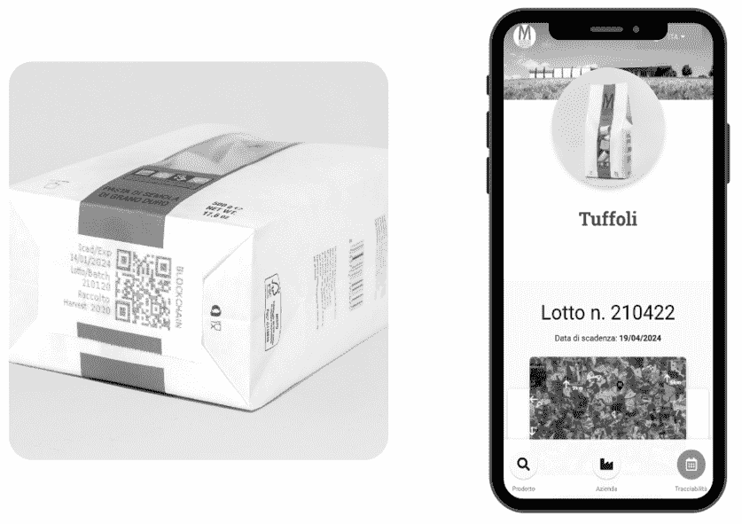

# 第二章

# 区块链技术在食品行业中小企业中的应用：

可信案例研究

+   丹尼尔·鲁扎

    意大利路易斯大学

+   洛伦扎·莫兰迪尼

    意大利路易斯商学院

+   阿莱桑德罗·切利

    意大利 Apio S.r.l.

摘要

农业食品部门是区块链技术跟踪和追溯组件及原材料在供应链中应用最高的领域。区块链呈现出许多潜在优势；然而，小型和中型企业在充分利用这项技术方面常常缺乏手段和知识。本章呈现了一个区块链应用案例研究，即 Trusty，一个为农业食品部门上链提供全追溯信息公证的平台。由于其有限的初期实施成本和模块化特性，它似乎特别适合由 SMEs 使用。作者的目标是为了为从业者和未来学术研究提供一些有用的议题和灵感。将会讨论的最相关的话题有：（1）农业食品部门的中小企业对区块链的需求和期望，（2）将区块链引入中小企业的困难，（3）对区块链的不可知论方法，（4）B2B 和 B2C 公司对公证信息的不同价值，以及（5）某些区块链与其他区块链相比的局限性。

引言

农业食品行业，每年估值约 8 万亿美元，由于人们的消费习惯向更健康、更环保的产品转变，该行业面临重大变革。因此，公司正在显著改变其价值主张和产品提供，以更好地适应这些期望。在这种背景下，区块链技术使公司不仅能够与消费者建立信任关系，还能够直接与他们沟通（De Giovanni, 2020）。传统上，推动此类变革的投资和努力是巨大的，往往中小企业几乎无法承担，这可能导致大部分中小企业被排除在外：它们通常缺乏实施此类技术的资源或技能。 Trusty 正是进入了这一细分市场，本章分析了 Trusty 案例研究。Trusty 是一个基于区块链的软件即服务（SaaS）平台，旨在提高客户参与度，改进信息公开，建立积极的品牌声誉，减少浪费，优化供应链。Trusty 是由 Apio 创建的，旨在促进区块链在农业食品行业的应用和部署，从小型参与者（如中小企业）开始。得益于免费增值商业模式（包括三个套餐：免费、基础和高级），Trusty 允许中小企业以模块化方式采用区块链技术，限制初始投资并克服了 IBM Food Trust 等更严格解决方案的许多局限。借助 Trusty，初始实施成本可以在一开始相对较低，因为投资可以随着时间的推移轻松扩大，当区块链开始带来实质性成果时。在 Trusty 上的入门过程通常涉及四个步骤：分析、数据输入、实施和推广。在本章中，为了介绍 Trusty 的实用应用，作者处理了 Trusty 应用于 Pastificio Mancini 的案例。Pastificio Mancini 是一家生产高品质意大利面的意大利公司，从原料的种植到最终产品，都十分注重价值链。Pastificio Mancini 选择使用 Trusty 向客户传达其生产和质量的价值，该生产完全尊重环境。Pastificio Mancini 是首批应用 Trusty 高级套餐的公司之一。通过这个套餐，开发了各种自动化功能，例如自动将数据上传至区块链和自动在意大利面包装上打印二维码。这个案例出现了一些令人兴奋的问题，如（i）中小企业特定的需求，（ii）Trusty 对所使用区块链的不可知论方法，（iii）B2B 客户与 B2C 客户不同的信息需求。还有一些此应用的挑战或弱点。作者至少确定了三个： （i）某些区块链（如比特币）与其他区块链相比的局限性，（ii）区块链在中小企业中的引入难度，（iii）Pastificio Mancini 案例的特殊性，使其成为一个“简单”的案例。通过介绍这个案例，作者旨在呈现一个成功的区块链应用案例，这是一个经常被忽视的公司类别，既对实践者有用，也能为学术界提供有趣的研发思路。

行业、部门数据、问题与机遇

农业食品是经济、社会和环境视角下最重要的行业之一。食品产业每年大约价值 8 万亿美元，仅通过雇佣世界 40%的劳动力就占了总消费支出的 10%（Esther Rodriguez, 2018）。这是一个在整个价值链中都充满挑战与机遇的行业（Goedde et al., 2015）。在众多相关趋势中，我们可以发现世界人口的增长将使到 2050 年的热量需求增长 70%（Eliaz and Jagt, 2020a），每年有 16 亿吨的食物浪费（Hegnsholt et al., 2018），以及气候变化和环境可持续性（Riedmatten et al., 2013），行业向更大或更小组织极化的趋势（Goedde et al., 2015）。面对这些挑战，对于公司来说，适应整个价值链变得至关重要。农业食品行业的价值链包括从农场到消费者餐桌的食物生产、加工和销售的相关各方网络（Riedmatten et al., 2013）。它包括生产者、加工者、分销商、最终消费者和政府（Santhanam et al., 2018）。每个参与者都对其价值链的一部分负责（De Giovanni, 2021）。然而，鉴于各方之间的高度相互依赖，只有通过价值链中所有利益相关者的合作，才可能应对其特征的挑战（Riedmatten et al., 2013）。

消费者对这些问题的关注度在增加，他们在改变消费习惯以支持他们认为最合适的方法。这一现象是由于教育水平的提高、城市化、健康意识的增强以及消费者可用的新技术（Pinder et al., 2017）所导致的。在消费者主要关注的问题中，一方面，我们发现了对健康、食品安全和食品质量的关注（图 1）（Rogers and Pieters, 2020），另一方面，则是希望进行负责任和可持续的食品消费（Dongoski and Ramsey, 2020）。从第一个方面来说，今天，消费者比以往任何时候都更加关注食品和健康，并想知道他们的食品是如何以及在哪里种植的（Dongoski and Ramsey, 2020）。因此，对健康、有机和无转基因食品的需求不断增加（Eliaz and Jagt, 2020b）。结果，全球健康和营养饮料以及包装食品市场年增长率超过 3%，预计到 2022 年将达到 8510 亿美元（Santhanam et al., 2018）。将焦点转移到环境可持续性上，Accenture 的一项调查显示，超过 55%的消费者愿意为环保产品支付更多（Pinder et al., 2017）。如果我们只考虑千禧一代，有 73%的人愿意为可持续产品支付更多（Eliaz and Jagt, 2020b）。

此外，被标记为可持续的产品比未被标记的产品增长速度快 5.6 倍（Eliaz 和 Jagt，2020a）。因此，健康和环境可持续的食品被视为一种高端产品。因此，公司需要向客户证明他们的产品符合特定标准。这导致了特殊工具和标签的增长，以向消费者传达产品的特性（Santhanam 等人，2018）。增长最快的特殊标签是“有机”和“非转基因”（Deines 和 Linhardt，2020）。

| 图 1. 消费者主要关注的问题 |
| --- |
|  |
| *来源：Rogers 和 Pieters，2020* |

消费者的 new habits 以及他们愿意为具有刚刚看到的特性的产品支付更多费用，导致了涉及假冒食品产品的欺诈行为增加（De Giovanni，2019）。2019 年欧盟报告显示，从 2016 年到 2019 年，涉及食品的欧盟干预请求数量翻了一番（欧盟出版社，2020）。特别是，47%的请求涉及 mislabeling 案例，20% 的产品涉及 Replacement / Dilution / Addition / Removal，16% 的产品未经批准的治疗和/或过程，15% 的产品涉及缺失/伪造/操纵的文件（图 2）（欧盟出版社，2020）。因此，消费者往往得不到他们所支付的东西（Kruh，2019）。在假冒产品中，包括 fats and oils，fish and related products，meat and related products（图 3）（欧盟出版社，2020）。除了对行业的经济损失（Kruh，2019 年估计超过 1000 亿美元），对消费者健康的危险是现实的。平均而言，美国每年报告超过 300 起食品召回事件，这相当于超过 7500 万例食源性疾病，32.5 万例住院治疗，以及 5000 例死亡（Riedmatten 等人，2013）。如果我们查看假冒产品的来源，西班牙和意大利在案例数量上位居前列（欧盟出版社，2020）。因此，追溯性和透明性成为公司向消费者传达其应对这些挑战和满足其需求所付出的努力的基本要素（Eliaz 和 Jagt，2020b）。对于消费者来说，了解公司与其 new habits 和 demands 相一致的价值链也变得至关重要（Pinder 等人，2017）。技术是限制或解决这些问题的重要工具。

| 图 2. 最常见的欺诈行为 |
| --- |
|  |
| *来源：欧盟出版社，2020* |
| 图 3. 2019 年 AAC-FF 前 10 大产品类别 |
|  |
| *来源：欧盟出版社，2020* |

HOW BLOCKCHAIN COULD HELP SOLVING THESE PROBLEMS

在农业食品领域，该技术已经在整个价值链中得到广泛应用（Walker 等人，2020 年）。在广泛应用的技术中，我们可以找到：大数据和高级分析、机器人技术、航空影像、传感器、复杂的局部天气预报、基因工程、生物黑客、云计算（Esther Rodriguez，2018 年；Magnin，2016 年；Pinder 等人，2017 年；Sylvester，2019 年）。这些技术的应用导致了以下成果：精准农业、特定于农业的金融系统、转基因生物的生产、实验室生产食品用蛋白质（Esther Rodriguez，2018 年；Magnin，2016 年；Walker 等人，2020 年）。然而，最感兴趣解决前一段讨论问题的技术是食品追溯技术。这些技术使整个价值链中的可见性和追溯性成为可能，从而保证可持续供应、增加农民收入、减少食品欺诈、减少浪费（Bakker 等人，2020 年）。食品追溯最有前景和有效的技术是区块链。区块链通过创建从农场到消费者的产品的不可篡改记录来增加透明度（Sylvester，2019 年）。根据所选的区块链类型、追踪技术、将数据输入区块链的方法、管理和存储数据的方式、向消费者传达数据的做法，应用区块链有不同的方法（Köhler 和 Pizzol，2020 年）。如果我们看所使用的区块链类型，主要选择是在公共、私有或混合区块链之间。行业中使用公共区块链的一些例子是 Provenance、OpenSC。TE-Food 采用混合方法，而 FairChain 和 IBM Food Trust 使用私有区块链（Köhler 和 Pizzol，2020 年）。

为了追踪产品价值链的各个环节，应用了不同的技术来支持区块链，比如 RFID 标签、二维码、NFC 标签（Ge 等人，2017 年）。例如，BeefLedger 结合了除了区块链以外的多种技术，如物联网（IoT）、分析、智能合约和数字货币，来追踪产品来源，简化支付，限制澳大利亚畜牧业在质量和可持续性方面的欺诈风险（Leong 等人，2018 年）。将数据插入区块链代表了追溯过程中最 critical 的步骤之一，因为这一步最容易遭到篡改。因此，在这个阶段采用了不同的策略，如 GPS 传感器、物联网传感器或所谓的预言机（Sylvester，2019 年）。预言机是可信的中介，连接现实世界和区块链以获取信息（Sylvester，2019 年）。一旦收集到数据，就必须进行管理和存储。

在某些情况下，数据直接插入区块链，在其他情况下，他们使用外部数据库，只在区块链上记录散列值（Leong 等人，2018）。最后，数据可以通过不同的方式传达给消费者。在大多数情况下，使用二维码或近场通信（NFC）传感器（Köhler 和 Pizzol，2020）。在下一段中，我们将了解 Apio 采用的方法及其针对食品供应链应用区块链的解决方案 Trusty。然后，我们将看到所采用的策略和导致这些选择的原因。

APIO 历史及里程碑

Apio 是一家创业搭建公司，致力于系统地打造新的软件即服务（Software as a Service, SaaS）平台并通过工业合作进行扩展。Apio 成立于 2014 年，由来自马切拉塔理工大学（Marche Polytechnic University）的四位年轻专业人士创立，公司由 IT 工程师、软件开发者和商务开发者组成。Apio 帮助大型企业通过数字化转型创造新的产品和服务。Apio 的核心业务是连接性、传输和数据分析技术。Apio 特别擅长将云计算、网页开发、系统集成、嵌入式开发和硬件设计等特定技能融合在一起。从 2017 年起，Apio 为大型企业开发区块链解决方案，主要集中在能源领域。2017 年，Apio 与 Acea、Indra、Cisco 和 Enea 合作，在能源市场推出了首个使用区块链和物联网（IoT）技术的意大利项目。他们开发了一种创新的能源数据时间戳解决方案。Apio、Acea 和 Indra 共同对该项目的流程进行了专利保护，如今，Apio 和 Acea 在一个欧洲项目中开发这种方法。2018 年末，凭借在该项目中积累的专业知识，Apio 成为 IBM Food Trust 在全球的首个可信合作伙伴。

Apio 了解如何将 IBM 的解决方案与 Track & Trace 软件集成。将 Track & Trace 软件与 IBM Food Trust 集成所需的专长包括开发微服务，这些微服务会将 GS1 EPCIS 事件发送到 IBM 区块链。电子产品代码信息服务（EPICS）是由 GS1 开发的世界标准，它允许在同一公司和不同公司之间创建和共享关于可见性事件的数据。得益于 EPCIS，可以根据全球位置编号（GLN）确定原产地/生产地点。这些代码可以追踪生产发生的植物或农场，通过全球贸易项目编号（GTIN）识别产品、包装和托盘。2020 年 8 月，意大利领先的系统集成商 Var Group 对 Apio 进行了资本增资，以通过获得金融资本和多认证公司生态系统的访问权限，促进创新解决方案的扩大规模。Var Group 是 Apio 的战略合作伙伴，因为它是 SeSa 集团的一部分，后者是在意大利技术数字创新方面的参考运营商，支持合作伙伴和客户公司在其演变过程中。

TRUSTY：它是什么以及它是如何工作的

鉴于区块链相关业务对 Apio 的重要性以及发展该业务所需的特定技能，Apio 开发了一条专门针对 Trusty 的业务线。Trusty 是一个软件即服务（SaaS）平台，旨在提高客户参与度，积极影响品牌权益，减少浪费，并优化供应链。Trusty 的一个独特之处在于，它被明确开发以便于中小企业（SME）轻松实施，而此前中小企业通常被排除在区块链采用之外。任何供应链参与者都可以使用 Trusty 来验证与购买订单、发货建议、收货建议数量以及相关产品等信息。特别是，该平台帮助食品生产商通过全面披露产品的来源和成分，改善客户体验，只需简单扫描二维码，就能追踪整个供应链。Trusty 采用区块链技术来验证和保障产品的所有信息。与客户共享的追溯事件是从 IBM Food Trust 或其他区块链平台获取的，采用对区块链持开放态度的方法。与大多数其他追溯平台不同，Trusty 允许食品生产商上传公司设施和产品的描述、图片和视频。信息是通过打印在产品包装或消费者容易接触到的其他地方的二维码与最终消费者共享的。消费者只需用智能手机扫描二维码，就能访问包含该特定产品所有信息的网页。他们可以查看公司描述和信息、产品描述和特性（如其过敏原）、产品和企业认证、区块链上的追溯事件。可用的信息的详细程度取决于制造公司决定使用的服务套餐。

Trusty 基于免费增值（Freemium）商业模式。客户可以选择三种不同功能的套餐：免费、基础和高级（表 1）。免费版提供基本功能，是希望接触区块链技术的中小企业的最佳选择。使用免费版，可以生成关于批次和二维码的无限信息，将在比特币区块链上公证信息，以及拥有关于用户互动和二维码的基本统计信息。例如，有人扫描二维码的频率，扫描地点，以及搜索或购买产品的平均年龄。当然，免费版也有局限。在免费版中，公司需要手动将信息输入到区块链上，并且对包含他们产品信息的网页的客户活动统计信息访问有限。除了免费服务外，基础套餐允许您以自动化方式在 Trusty 上输入数据，并将记录在区块链上的数据导出到 Trusty 之外的平台，如电子商务或公司网站。基础套餐的价格为每月 250 欧元。250 欧元包括需要注册的 1000 个批次。如果公司需要注册更多的批次，可以单独购买。公司 IT 系统与 Trusty 之间的自动化数据输入集成可以由客户员工独立完成，也可以由 Apio 以额外费用完成，通常费用在 3000 至 10000 欧元之间。高级套餐包括 Apio 通过开发团队为具有特定需求的公司执行的所有定制项目。在高级套餐中，几乎可以包括任何类型的自定义，例如网页的完全自定义，将 Trusty 与物联网或工业 4.0 传感器集成，以自动记录区块链上的数据，使用不同于比特币的其他区块链，如以太坊或 IBM 食品信任。

此外，Trusty 可以根据客户与产品网页的互动收集相关客户信息。客户公司可以使用这些数据来提高客户参与度，并基于一个透明、安全的供应链创建新的市场营销活动。高级服务费用取决于客户的要求，从 3000 欧元起，直至数数千欧元。

表 1. Trusty 套餐的成本和功能

|  | 免费 | 基础 | 高级 |
| --- | --- | --- | --- |

• 生成关于批次和二维码的无限信息；• 在比特币区块链上公证信息；

• 用户与二维码之间基本互动的统计信息。| 所有免费套餐的功能，以及：• 在 Trusty 上自动进行数据输入过程；

• 将记录在区块链上的数据导出到 Trusty 之外的平台，如电子商务或公司网站 | 其他所有套餐的功能，以及：• 创建自定义模板；

• 与物联网及/或工业 4.0 系统的集成；

使用公司域名；

与其他区块链的集成；|

| 成本 | 免费 | €250/月 集成 API 需€3000-10000 | €3000-40000+ |
| --- | --- | --- | --- |

访问 Trusty 有四个入职阶段：分析、数据输入、实施和推出。每个阶段所需的 Apio 和客户的努力程度和详细程度取决于所选的套餐。在本节中，我们将查看完整的高级套餐的情况。在分析阶段，会调查一系列方面。首先，有必要了解公司对其希望与 Trusty 一起开发的项目的期望。通常有三个主要目标：增加对消费者的透明度、提高供应链的运营效率、访问新的销售渠道。然后，他们需要定义希望开始追溯项目的产品。这些产品可以是所有产品，也可以只是部分产品，以测试解决方案。对于每个产品，我们需要确定在区块链上追踪的阶段以及需要哪些支持数据。基于此，还需要确定产品是在哪里种植或加工的，以及任何第三方供应商。分析阶段的最后步骤是与客户定义在 Trusty 上的数据输入接口和消费者查看数据的接口。分析阶段允许您生成一个评估所有活动的项目文件。对于每个活动，将定义时间框架和预算以实施它们。在数据输入和实施阶段，将开发商定的项目，并培训客户公司的员工使用平台。最后，在推出阶段，将共享公司的访问凭据以及分析阶段确定的所有参与者。

完成所有阶段并使 Trusty 投入运营所需的时间尺度取决于项目的复杂性，可能从最短的 2 个月到最长的 6 个月不等。一旦 Trusty 开始运营，协助和维护工作简单，不要求任何特定或复杂的任务。正如我们前文所看到的，客户公司的直接成本取决于他们选择的套餐。无论如何，从公司的角度看待费用并包括所有机会成本，我们还必须包括与必须从现有工作中解脱出来的人员相关的费用。在初始阶段，通常会有一到两个人接受平台使用的培训。这从分析阶段开始，该阶段是与客户公司的 1 到 2 人协同完成的。在此阶段的合作也能增加平台实施后的满意度。接下来是公司员工的培训。在培训期间，公司员工将在平台上、在公共页面、在故事讲述、认证信息和所用技术方面接受培训。作为一个参考，客户公司决定分配给 Trusty 项目的员工，每周需要一天，为期一个月。此外，我们可以看到免费套餐免费提供，初始成本低或为零。然而，对于公司来说，在平台上手动输入数据几乎每天都需要分配员工，因此这个套餐代价昂贵。相反，更复杂的套餐集成了大量自动化，降低了 Trusty 的运营成本。解决方案支付的价格越高，自动化水平越高，由于需要让 Trusty 运行而分配的内部员工的的机会成本就越低。

TRUSTY 应用示例：PASTIFICIO MANCINI

在本节中，我们分析了 Pastificio Mancini 案例，这是 Trusty 应用到一家中小企业的例子。Pastificio Mancini（https://www.pastamancini.com）位于意大利马尔凯中部地区。该公司成立于 2010 年，由 Massimo Mancini 创立，目前拥有 35 名员工，年营业额约为 350 万欧元。其产品的主要市场是意大利，然而，约 30%的产品出口，主要出口到美国、英国、中国和俄罗斯。Pastificio Mancini 生产的意大利面在质量和价格上均高于平均水平。因此，Pasta Mancini 的客户主要是厨师和高端消费者。厨师们寻求高质量的原料来提升他们的服务水平。这类客户关注产品、其产地和特点，希望将其作为一个关于价值观的独特故事“从农场到餐桌”来讲。多年来，Pastificio Mancini 已经发展出一系列最佳实践，以满足这个高端客户群的质量要求。通过内部管理整个生产链，从原料的种植到产品最终消费者的交付，确保了高品质。Pastificio Mancini 直接参与选择种植的种子，管理小麦和其他作物轮作的田地以恢复土壤，收割谷物和储存。整个农业过程都遵循良好的农业实践（BPA），其中包含了所有适用于获得最高质量和健康原料的规则，同时尊重环境。Pastificio Mancini 然后处理原料制成意大利面的过程。这个过程也遵循严格的磨麦、青铜拉伸、意大利面烘干直至包装的规则，这些规则必须尊重环境。鉴于为实现这些质量和环保标准所付出的所有努力，Pastificio Mancini 需要一个工具来向其客户传达这些努力。实际上，可追溯性和安全信息可以在影响和确认客户选择方面发挥战略作用。达到这一目标最合适的工具被确定为区块链和 Apio 开发的解决方案。

Apio 与 Pastificio Mancini 合作，为该公司的面条创建了一个数字身份。借助 Trusty，Pasta Mancini 是首批开放与客户直接沟通渠道的食品公司之一。从 2021 年 1 月起，通过印在面条包装标签上的二维码，该公司在整个公司的供应链中打开了一个虚拟窗口（图 4）。二维码将客户与产品的身份连接起来，将其与其他品牌和区块链上的信息区分开来。通过扫描新包装底部放置的二维码，客户可以访问一个网页，立即无中介地获取关于该特定面条包装的所有信息。此外，制造商还可以通过文档自定义网页，包括描述和证书、照片、视频、创意内容以及消费者需要了解的所有信息，以沉浸在品牌故事中。Trusty 创建了一个数字空间，消除了生产商和消费者之间的障碍，建立了一个真实透明的信任关系。

| 图 4\. Pastificio Mancini 的包装和网站页面 |
| --- |
|  |

从运营角度来看，为 Pasta Mancini 开发的该项目是一个 Trusty 高级套餐。Pasta Mancini 将小麦加工成面条，因此它希望分享关于每批面条的信息、照片和文件。此外，Pastificio Mancini 旨在通过区块链和物联网跟踪小麦田、自动化数据输入以及自动化在产品上打印二维码。为了实现 Pasta Mancini 的目标，Apio 实施了以下阶段：分析公司的数据模型；在平台上创建公司（及其关联用户）；设施数据输入；产品数据输入；数据输入自动化的小型服务；公共页面定制（表 2）。第一步是分析公司的数据模型。在这个阶段，Apio 进行公司的研究以及其所有产品的研究。在产品分析期间，对于每种产品，通过分析公司想要传达的价值元素来确定 Pastificio Mancini 希望与消费者分享的信息。选择的供应链部分对 Pastificio Mancini 的 103 种产品都是一样的，共四个：收割、磨粉、拉丝和包装。对于这四个阶段，公司的数据模型进行分析。公司的数据模型是公司用于收集这四个价值元素数据的方法论。有趣的是，对于所有 Pastificio Mancini 产品，都识别出了同样的四个价值元素。因此，所有产品都以同样的方式描述。这大大简化了与每个产品的供应链部分不同的项目所需的工作。

表 2. 将 Trusty 的入门阶段应用于 Pastificio Mancini

| Trusty 的入门阶段 | Pastificio Mancini 案例 |
| --- | --- |
| 分析 | 分析公司的数据模型 |
| 数据输入和实施 | 在平台上创建公司（及其关联用户） |
| 设施数据输入 |
| 产品数据输入 |
| 数据输入自动化的小型服务 |
| 公共页面定制 |
| 部署 | 凭据共享 |

第二阶段是在平台上创建公司和关联用户。这是公司第一次加入 Trusty 平台时要进行的过程。Apio 在 Trusty 上创建客户公司的账户，同时创建可以修改公司信息的用户档案。一旦公司进入平台，就会创建公司的资料、设施以及个别产品。对于公司来说，Apio 在 Trusty 上声明了公司的描述、网站、地理位置以及其他客户公司想要传达的信息。对于设施，则包括名称、可追溯代码和位置。而对于产品，这个过程则更长。Apio 为 Pastificio Mancini 销售的 103 种产品创建了产品照片、背景照片、产品描述以及其他附加信息，如烹饪时间等。在创建了单个产品表单后，Apio 为每个产品创建了供应链的四个部分。

下一个阶段是开发用于自动数据输入的微服务。到目前为止，在 Trusty 上输入的信息中，没有使用区块链技术。这仅仅是建立一个结构，在 Trusty 上创建公司档案。从这个阶段开始，我们开始开发和构建输入追溯信息的工具。Trusty 提供了多种将追溯信息输入区块链的可能性，从公司手动输入到通过 IoT 传感器自动传输数据到区块链。在 Pastificio Mancini 的情况下，应用了一个中间解决方案。它提供了从公司的信息系统自动将数据输入到区块链的功能。Apio 创建了一个软件自动化系统，它集成了 Trusty 与 Pastificio Mancini 现有的制造执行系统（MES），使其成为可能。这个软件每天自动分析 Pastificio Mancini 在其 MES 中的信息，并将新信息记录在区块链上。这个过程每天晚上进行，减轻了 Pastificio Mancini 手动输入信息的负担，同时也限制了错误的可能性。在 Pastificio Mancini 进行的一步是，通过让 Trusty 通过 API 与打印机通信，实现产品包装中 QR 码的自动化打印。实际上，在这个案例中，包装在每包面条上的 QR 码都是不同的，且与每包中的产品相关。要实现这一点，需要创建特殊的 QR 码并将它们传达给打印机，打印机必须打印正确的 QR 码。这个解决方案增加了 Trusty 服务的信息潜力。最后一个阶段是自定义公共页面。这个步骤包括自定义客户通过二维码访问的网页。它必须与 Pastificio Mancini 所期望的图形风格和设计保持一致。因此，公司色彩、模板和图片都会根据 Pastificio Mancini 的风格和沟通策略进行定制，以保持一致性。

在 Pastificio Mancini 案例中，另一个有趣的角度是记录信息的区块链。Trusty 遵循一种不可知论的方法。因此，在使用 Trusty 的情况下，可以根据客户的需求和请求在多个区块链上记录信息。在 Pastificio Mancini 的情况下，选择了比特币公有区块链。甚至在区块链发明之前，公司的追溯信息就已经被记录下来，所以传达追溯信息的事实并不是新的。创新之处在于使用一个外部平台，该平台可以保证信息的公证及其一旦注册的不可变性。他们选择比特币主要是基于两个原因：一是由于 Open Timestamp 协议的效率；二是它具有公开性、可靠性，并且完全独立。

从第一个要点开始，比特币上的公证是通过使用一个名为 Open Timestamp 的开源协议来进行标准的程序。Open Timestamp 为比特币上的时间戳提供了一个标准格式。时间戳以不可更改的方式证明某些数据在特定日期之前存在。Open Timestamp 是一个广泛开发和测试的、拥有大量文档、普遍接受且可靠的协议。此外，该协议的主要优点之一是记录区块链上信息所需的交易成本有限。在区块链上记录信息不是免费的，但交易费用会根据各种因素而变化。Open Timestamp 允许你利用网络来降低这些成本。该协议通过执行单一交易，每两小时聚合一包信息并将其插入区块链中。这允许你将注册成本分摊给包装中输入信息的所有人。从实际角度来看，Trusty 创建了一个包含 Pastificio Mancini MES 信息的 PDF 文件，该信息必须录入区块链。然后将文件与其他信息一起放入一个包中，通过 Open Timestamp 记录在比特币上。Open Timestamp 的输出是一个包含 Merkle 树所有信息的 OTS 文件。

第二点是比特币是第一个创建的区块链平台，因此它非常普及，增加了它的稳固性。此外，它是一个公共区块链。因此，它是保护注册在其上的产品消费者的理想选择。它完全独立于生产者，一旦信息录入比特币区块链，生产者就无法修改信息。采用这种解决方案，一旦数据录入区块链，如果生产者想要“欺骗”消费者，他只有两种可能性。要么宣称丢失了区块链一旦数据记录后生成的 PDF 和 OTS 文件，要么多次用多个 PDF 文件记录信息。在前一种情况下，Trusty 扮演的角色限制了这种可能性，因为 Trusty 总是组织有序并呈现与区块链公证相关的所有文件。在后一种情况下，最终消费者总是可以看到所有记录的文件以及它们记录的日期。通过比较这些文件，他可以了解任何变化，如果制造公司没有适当地解释这些变化，这将导致消费者对制造商缺乏信任。

优势与机遇

Trusty 和 Pastificio Mancini 的应用案例突显了关于区块链应用的一些有趣方面，这些方面需要讨论。这些方面包括：打算使用区块链的 SMEs 的需求；对区块链的不可知论方法；B2B 客户与 B2C 之间的战略需求差异。Trusty 主要是为中小企业设计的，这些企业由于规模较小，没有大型企业的经济和技术资源。在尝试推广 IBM Food Trust 给 SMEs 时，Apio 意识到他们主要需要区块链用于市场营销，以传达他们品牌和产品的卓越性。一方面，像沃尔玛或马士基这样的公司已经使用了 IBM 开发的区块链来追踪他们的供应链多年，另一方面，有一大批 SMEs 有不同的需求和问题。然而，IBM Food Trust 是连接食品供应链参与者的最大网络之一，通过分布式账本技术。IBM Food Trust 向加入网络的公司提供好处，如：提高供应链效率、增强品牌信任、确保食品安全等。因此，IBM Food Trust 解决方案主要是为了使供应链更加高效。这是一个漫长而复杂的过程，需要供应链中所有参与者的合作，并且需要相当长的时间才能有效运行（Roettgers, 2020）。否则，这些好处对于拥有国际化和匿名供应链的大型组织至关重要，这些供应链由数千家供应商组成；另一方面，SMEs 更感兴趣的是创建一个直接面向消费者的渠道，以提高品牌定位和品牌知名度。此外，加入 IBM Food Trust 的过程需要多个标识符（GS1 Identifiers、GLN Identifiers 和 GTIN Identifiers），这些通常在中小企业中不易快速获得。IBM Food Trust 的最关键特性与追踪和跟踪有关。IBM Food Trust 赋予每个供应商访问食品产品信息的可能性。这种方法的主要挑战是，没有保证供应链中一家公司的所有业务的工作人员都会输入数据，并且没有激励供应商在区块链上正确记录所有信息（Roettgers, 2020）。虽然像沃尔玛这样的大型公司可以利用它们作为集团领导者或主要分销商的角色，强制其供应商和公司参与区块链和追溯系统，但对于 SMEs 来说这是不可能的。Apio 决定开发 Trusty，以填补知名解决方案未覆盖的市场细分，满足 SMEs 的需求。因此，Trusty 提供了一系列可以根据公司需求和财务资源调整的套餐。从这一角度来看，Trusty 提供的免费计划对于促进区块链技术的大规模采用起到了关键作用。此外，由于不可知论方法，Trusty 可以调整成本和提供的服务水平，提供选择成本较低且管理成本较低的区块链，或者更昂贵但服务也更好的其他区块链。

采用区块链不可知论的方法意味着该平台，例如 Trusty，可以支持许多区块链，而不特别偏爱其中的任何一个（Nasdaq, 2017）。Trusty 当前的实现可以让公证人追踪与以下区块链相关的事件：比特币，IBM Food Trust，以及以太坊（包括以太坊侧链，如 XDai 和 VSC）。在一个项目中使用一个区块链而不是另一个，主要取决于客户公司的需求和经济资源。我们已经看到，得益于开放时间戳协议，比特币可以控制成本，同时在一个最坚固、最可靠的区块链之一记录信息。然而，它不允许你注册身份。身份是由区块链上的数据与报告它的行为者的公钥关联组成的。在比特币中，通过开放时间戳，不是客户公司直接记录信息，而是开放时间戳协议，Trusty 提供数据。这对于希望注册身份的一些公司来说可能代表限制。对于有这种需求的公司的不可知论方法，Trusty 可以提供基于以太坊的解决方案，其中可以写入身份信息。同样，对于需要改善长期复杂供应链的大型公司，Trusty 可以推荐 IBM Food Trust。一方面，不可知论方法代表了解决满足客户公司请求的最佳方案；另一方面，它代表了 Trusty 未来的保险。使用不可知论方法与技术的开发阶段一致，因为尚未确定标准，因此对未来没有确定性（Abuhantash 等人，2019 年）。如果确定此标准，Trusty 必须准备好将其区块链和技术纳入其系统。否则，它面临被市场淘汰的风险。从这个角度看，采用不可知论方法是为一个充满突然变化且尚未定义未来的环境买的一份保险（Abuhantash 等人，2019 年）。

另一个 Pastificio Mancini 案例引发的问题涉及到不同战略原因，这些原因决定了面向最终消费者（B2C）的公司和向其他公司销售产品的公司（B2B）使用 Trusty 的不同原因。这两类公司的沟通策略、相关信息和战略目标都是不同的。从 B2C 角度直接向最终消费者销售产品的公司选择 Trusty 主要是为了追求“客户关系管理”战略（Strauss 和 Frost, 2014）。这种战略包括通过确保消费者对公司及其产品满意来增加业务和客户（Strauss 和 Frost, 2014）。这种战略的一个常见做法是在每一个可能的机会上创造与客户的接触点，并给予他们所有必要的信息（Strauss 和 Frost, 2014）。借助 Trusty，在客户和制造公司之间创建了一个新的联系点，信息更加安全、直接地传达。相反，在 Pastificio Mancini 的案例中，大多数客户是 B2B 客户。他们属于餐饮服务业（HORECA），包括酒店、餐厅、比萨店、酒吧、餐饮等。Pastificio Mancini 向最终消费者销售少量产品。在这种情况下，Trusty 帮助 Pastificio Mancini 追求一种成分品牌战略（Gassmann 等人，2013）。当一个产品作为另一个产品的一部分或成分被购买时，这种战略就实现了。这种成分产品被广告宣传为最终产品的一个重要组成部分，提升其特性和性能（Gassmann 等人，2013）。产品成分在最终消费者眼中增加了所嵌入产品的感知质量。这种战略最著名的例子可能是英特尔 Inside。将英特尔 Inside 标签贴在基于英特尔的电脑上，是一种向消费者传达电脑处理器质量的策略，确保其电脑的整体性能和耐用性特征（Strauss 和 Frost, 2014）。同样，在我们的例子中，Mancini 面条成为提升厨师菜肴质量和确保其来源的关键成分。因此，一方面，厨师可以因为在他的菜肴中使用的原料高质量而向最终顾客收取更高的价格，另一方面，Pastificio Mancini 使他的产品广为人知。此外，对于厨师来说，通过 Trusty 实现的追溯性成为一种保证，允许他向客户展示他所使用产品的来源。在涉及有缺陷或质量低的产品问题的情况下，厨师可以轻松追踪要消除的包装，始终向顾客保证高水平的服务。

威胁与弱点

将 Trusty 应用于 Pastificio Mancini 案例具有明显的优势，然而，有些弱点需要讨论。在本节中，我们确定了三个弱点：比特币和 Open Timestamp 的局限性；在中小企业中引入区块链的困难；与更分散的价值链相比，完全集成的价值链。使用比特币和 Open Timestamps 在易用性和成本有限方面有一些优点。然而，它也有缺点。最明显的是，它可能证明了时间戳，但无法证明记录信息的演员身份。身份是由将数据与注册它的演员的公钥相关联组成的。通过身份，可以证明特定信息是由特定公钥（可归因于一家公司）编写的。使用 Open Timestamp，数据被聚合成包，并通过 Open Timestamp 协议记录在比特币上。通过在区块链上使用此解决方案，可以清楚地看到 Open Timestamp 协议进入了信息，并且 Trusty 生成了带有数据 的 PDF。因此，在区块链上，信息并非由 Pastificio Mancini 编写。这是一个可以解决的问题。得益于 Trusty 所采用的无知方法，可以使用允许身份注册的其他区块链，例如以太坊。然而，由于需要将每个交易注册到区块链上所需的交易成本，使身份注册的解决方案成本显著较高。此外，迄今为止，以太坊上还没有被广泛认可的开源协议，如 Open Timestamp。因此，他们不得不开发一个内部协议，并承担相关成本。对于 Pastificio Mancini 的需求，使用这种类型的解决方案是不必要的。与 Pastificio Mancini 案例相关联的另一个弱点是在数据输入阶段。在 Pastificio Mancini 的案例中，Trusty 从公司的 MES 获取数据。这可能会给可能的诈骗留下一些空间。在数据被记录在区块链之前，Trusty 或 Pastificio Mancini 本身可能会篡改数据。本案例中提出的解决方案涉及消费者对 Trusty 和 Pastificio Mancini 的一定信任。这并不精确地满足区块链承诺实现的无需信任的关系。同样，在这个案例中，问题很容易解决，因为 Trusty 允许更先进的解决方案。数据直接由放置在植物上的 IoT 传感器记录在区块链上，尽可能限制任何形式的中介，并消除任何作弊的可能性。与 Pastificio Mancini 一起，我们看到的是一个简单的办法，可以控制成本。这是大多数求助于 Trusty 接近区块链技术并打算在看到实际优势时采用更先进解决方案的中小企业所选择的办法。因此，虽然 Pastificio Mancini 案例中使用的办法有局限性，但另一方面，将中小企业与区块链技术拉近是至关重要的。中小企业通常不了解区块链，并且在不了解其优势的情况下，不愿意投资数万欧元。Trusty 方法使中小企业可以在解决方案的复杂性和所需投资方面逐渐增加区块链的采用。如果没有灵活和模块化的方法，Trusty 的客户将被迫在采用区块链时做出相当大的前期投资。大多数中小企业可能会被这种投资吓倒，可能会选择不使用区块链。Trusty 团队认为，逐步引入区块链是在这个技术发展阶段的最佳解决方案。

尽管 Trusty 提供的服务的模块化特性促进了家庭登机，但这并不足以解决中小企业采用这项技术的问题。Trusty 面临的最相关的挑战之一是由于意大利中小企业的特点，在大多数情况下，登机过程变得复杂且昂贵。尽管大型公司已经发展了信息系统和相关内部技能，可以与 Trusty 连接，但在大多数中小企业中，情况并非如此。因此，目前该解决方案最大的弱点与可扩展性有关。意大利中小企业的数字化水平如此之低，以至于登机活动必须经常伴随着专业资源，以识别公司的良性路径。Trusty 不仅要通过区块链提供追踪服务，而且经常必须提供至少最小的数字化路径，以便使用 Trusty 本身。这个限制减缓了采用过程，并且与基于快速客户获取和转换的软件即服务业务模型不太相符。解决方案的新颖性，农业食品公司对区块链知识的缺乏，以及关于该主题的立法空白也减缓了这一领域的投资。最后，我们不能不承认，Pastificio Mancini 的案例是特殊的，相对简单的。Pastificio Mancini 拥有垂直集成的供应链，并直接控制供应链的每一个步骤。因此，对于 Pastificio Mancini 来说，实施供应链追踪是很简单的，因为不需要区块链被供应链中的其他参与者采用也能生效。相反，在非常分散的、有多元化参与者的供应链中，或许在国际背景下，采用更为复杂。一方面，在这种类型的情况下，区块链的好处更大，另一方面，供应链中的所有参与者都必须采用区块链。如果供应链中的一个参与者决定不使用它，链条就会断裂，对于所有其他参与者来说，解决方案就变得无用。

结论

在本章中，作者分析了 Trusty 案例研究。由于消费者越来越有意识且信息灵通，将区块链应用于农业食品领域的中小企业正在经历重大变化。消费者越来越关注健康、高质量和环保的产品。与此同时，企业需要有一个简单且负担得起工具，以便在不断变化和可持续的市场环境中有效地和安全地展示它们的努力，Trusty 提供了一个可能的解决方案，利用区块链技术，为中小企业提供这些工具。对 Trusty 的分析以及将 Trusty 应用于 Mancini 面包店案例让我们有机会讨论一些有趣的问题，这些问题我们在表 3 中进行了总结。第一个主题是区块链在中小企业的应用。中小企业的很大一部分与大型公司（主要使用区块链降低供应链成本和浪费）有不同的需求。中小企业似乎更感兴趣的是直接且可靠地向客户传达他们产品的质量。这对 Trusty 来说是一个机会，也是 Trusty 开发的解决方案的优势。同时，将区块链应用于中小企业遇到了相当大的挑战，因为这些公司的预算有限，且它们往往数字化水平较低。第二个广泛议题涉及用于公证和追溯解决方案（如 Trusty）的区块链类型。Trusty 采用的无确定性方法是一个优秀的解决方案，它从一开始就不承诺特定的区块链，也不属于 Trusty 或 Mancini 面包店。这在战略和经济上都是一个机会和优势。事实上，如果将来会出现一个适用于这类操作的标准区块链，Trusty 将准备好采用它。从成本角度来看，一些区块链允许以较低的成本进行信息公证，因此它们对于需求并不复杂的中小企业来说是理想的。然而，像 Open Timestamp 这样的低成本区块链也有明显的局限性，例如无法注册身份。最后，在 Trusty 应用于 Mancini 面包店的案例中出现了一些具体问题。Mancini 面包店几乎将其所有产品都通过 HORECA 渠道销售。因此，这些产品被高度专业的人员购买，并作为他们菜肴的配料。结果，他们的信息需求与在超市购买意面客户的需求不同。此外，Mancini 面包店的案例有一个完全集成的价值链，从原料到成品，在这种情况下，应用区块链进行追溯比在价值链非常分散的公司更容易。

表 3. 本章主要议题总结

| 主议题 | 优势与机遇 | 挑战与不足 |
| --- | --- | --- |
| 区块链与中小企业 | 打算使用区块链的中小企业的需求。 | 区块链引入中小企业中的困难。 |
| 区块链类型 | 对区块链的不可知论方法。 | 比特币和开放时间戳的限制。 |
| 考虑的案例的特点 | 与 B2C 相比，B2B 客户群的战略需求的差异。 | 完全集成的价值链和更细分的价值链。 |

REFERENCES

Abuhantash, A., Grabski, J., Kobeissi, H., White, M., & Sykes, O. (2019). 建立区块链政策。学术出版社。

Bakker, P., Holdorf, D. B., & Cairns, A. (2020). 食品系统转型首席执行官指南。可在：https://www.wbcsd.org/Programs/Food-and-Nature/Food-Land-Use/Resources/CEO-Guide-to-Food-System-Transformation

De Giovanni, P. (2019). 通过动态库存和智能合约的数字供应链。数学，7（12），1235。DOI：10.3390/math7121235

De Giovanni, P. (2020). 供应链管理中的区块链和智能合约：一个博弈论模型。国际生产经济学杂志，228，107855。DOI：10.1016/j.ijpe.2020.107855

De Giovanni, P. (2021). 数字供应链中的动态质量模型和游戏：数字转型如何影响供应链质量管理。斯普林格自然。

de Riedmatten, A., Barr, P., Ringquist, J., & Eng, V. (2013). 食品价值链：下一个世纪的挑战内容。德勤。

Deines, G., & Linhardt, K. (2020). 用盈利性增长滋养食品行业。可在：https://www.accenture.com/us-en/_acnmedia/pdf-70/accenture-future-of-food-new-realities-for-the-industry.pdf

Dongoski, R., & Ramsey, N. (2020). 食品和农业综合企业的垂直整合。可在：https://www.google.com/url?sa=t&rct=j&q=&esrc=s&source=web&cd=&ved=2ahUKEwjJjorF66rwAhXdwQIHHUbXAbsQFjAKegQIIhAD&url=https%3A%2F%2Fassets.ey.com%2Fcontent%2Fdam%2Fey-sites%2Fey-com%2Fen_us%2Ftopics%2Fconsumer-products%2Fey-vertical-integration-in-food-and-agribusiness.pdf%3Fdownload&usg=AOvVaw3hMrD8qsc3B94tWYYjm3Vc

Eliaz, S., & Jagt, R. (2020a). 全球食品系统转型：改变的时刻已经到来。德勤。可在：https://www2.deloitte.com/global/en/pages/consumer-business/articles/global-food-system-transformation.html

Eliaz, S., & Jagt, R. (2020b). 食品的未来：负责任的生产-连接产量增加与可持续性。德勤。可在：https://www2.deloitte.com/global/en/pages/consumer-business/articles/gx-future-of-food-responsible-production.html

Gassmann, O., Frankenberger, K., & Csik, M. (2013). 商业模型导航器：将颠覆你企业的 55 种模型 . FT 出版。

Ge, L., Brewster, C., Spek, J., Smeenk, A., & Top, J. (2017). 农业和食品领域的区块链。瓦赫宁根经济研究。可在：www.wur.eu/economic-research

Goedde, L., Horil, M., & Sanghvi, S. (2015). [追求全球食品和农业业务的机遇](https://www.mckinsey.com/insights/Food_Agriculture/Pursuing_the_global_opportunity_in_food_and_agribusiness?cid=other-eml-alt-mip-mck-oth-1507)。可在: https://www.mckinsey.com/insights/Food_Agriculture/Pursuing_the_global_opportunity_in_food_and_agribusiness?cid=other-eml-alt-mip-mck-oth-1507 查看。

Hegnsholt, B. E., Unnikrishnan, S., Pollmann-larsen, M., Askelsdottir, B., & Gerard, M. (2018). [应对 16 亿吨食品损失和浪费危机](https://www.bcg.com/it-it/publications/2018/tackling-1.6-billion-ton-food-loss-and-waste-crisis)。BCG Henderson Institute。可在: https://www.bcg.com/it-it/publications/2018/tackling-1.6-billion-ton-food-loss-and-waste-crisis 查看。

Köhler, S., & Pizzol, M. (2020). [基于区块链技术的食品供应链技术评估](https://www.google.com/url?sa=t&rct=j&q=&esrc=s&source=web&cd=&cad=rja&uact=8&ved=2ahUKEwjc2b7q66rwAhWD7KQKHZhwCrcQFjABegQIAhAD&url=https%3A%2F%2Fassets.kpmg%2Fcontent%2Fdam%2Fkpmg%2Fxx%2Fpdf%2F2019%2F05%2Fconsumer-currents-issues-driving-consumer-organizations.pdf&usg=AOvVaw0MQAkem-_mCZ1OQVwkSKMA)。Journal of Cleaner Production，269，122193。提前在线发表。doi:10.1016/j.jclepro.2020.122193。

KruhW. (2019). [消费者动向](https://www.google.com/url?sa=t&rct=j&q=&esrc=s&source=web&cd=&cad=rja&uact=8&ved=2ahUKEwjc2b7q66rwAhWD7KQKHZhwCrcQFjABegQIAhAD&url=https%3A%2F%2Fassets.kpmg%2Fcontent%2Fdam%2Fkpmg%2Fxx%2Fpdf%2F2019%2F05%2Fconsumer-currents-issues-driving-consumer-organizations.pdf&usg=AOvVaw0MQAkem-_mCZ1OQVwkSKMA)。可在: https://www.google.com/url?sa=t&rct=j&q=&esrc=s&source=web&cd=&cad=rja&uact=8&ved=2ahUKEwjc2b7q66rwAhWD7KQKHZhwCrcQFjABegQIAhAD&url=https%3A%2F%2Fassets.kpmg%2Fcontent%2Fdam%2Fkpmg%2Fxx%2Fpdf%2F2019%2F05%2Fconsumer-currents-issues-driving-consumer-organizations.pdf&usg=AOvVaw0MQAkem-_mCZ1OQVwkSKMA 查看。

Leong, C., Viskin, T., & Stewart, R. (2018). [追踪供应链: 区块链如何在食品行业实现可追溯性](https://www.bcg.com/publications/2020/benefits-of-automation-in-the-agriculture-industry)。可在: https://www.bcg.com/publications/2020/benefits-of-automation-in-the-agriculture-industry 查看。

Magnin, C. (2016). [大数据将如何改变全球食品链](https://www.mckinsey.com/business-functions/mckinsey-digital/our-insights/how-big-data-will-revolutionize-the-global-food-chain)。可在: https://www.mckinsey.com/business-functions/mckinsey-digital/our-insights/how-big-data-will-revolutionize-the-global-food-chain 查看。

Nasdaq. (2017). [加密货币中立性与隐私愿景](https://www.nasdaq.com/articles/cryptocurrency-agnosticism-and-vision-privacy-2017-09-08)。Nasdaq。可在: https://www.nasdaq.com/articles/cryptocurrency-agnosticism-and-vision-privacy-2017-09-08 查看。

Pinder, S., Walsh, P., Orndorff, M., Milton, E., & Trescott, J. (2017). [食品的未来: 行业的新现实](https://www.google.com/url?sa=t&rct=j&q=&esrc=s&source=web&cd=&cad=rja&uact=8&ved=2ahUKEwjc2b7q66rwAhWD7KQKHZhwCrcQFjABegQIAhAD&url=https%3A%2F%2Fassets.kpmg%2Fcontent%2Fdam%2Fkpmg%2Fxx%2Fpdf%2F2019%2F05%2Fconsumer-currents-issues-driving-consumer-organizations.pdf&usg=AOvVaw0MQAkem-_mCZ1OQVwkSKMA)。Accenture。

欧洲联盟出版处。 (2020). 2019 年年度报告 - 欧盟食品欺诈网络和行政协助与合作系统。10.2875/326318

Rodriguez. (2018). 农业食品：价值八万亿美元的产业。Tech Crunch。可查看：[`techcrunch.com/2018/11/01/agrifood-the-8trn-industry-thats-worth-your-salt/`](https://techcrunch.com/2018/11/01/agrifood-the-8trn-industry-thats-worth-your-salt/)

Roettgers, J. (2020). 谁在购买 IBM 的区块链梦想？Protocol。可查看：[`www.protocol.com/ibm-blockchain-supply-produce-coffee`](https://www.protocol.com/ibm-blockchain-supply-produce-coffee)

Rogers, S., & Pieters, L. (2020). 消费者双重危机中的小幅积极信号。复星洞察。可查看：[`www2.deloitte.com/us/en/insights/industry/retail-distribution/consumer-behavior-trends-state-of-the-consumer-tracker/covid-19-recovery.html`](https://www2.deloitte.com/us/en/insights/industry/retail-distribution/consumer-behavior-trends-state-of-the-consumer-tracker/covid-19-recovery.html)

Santhanam, N., Varanasi, S., Surana, K., Jacobson, Z., & Zegeye, A. (2018). 食品加工与处理：成熟而值得颠覆？麦肯锡公司。

Strauss, J., & Frost, R. (2014). 电子营销（Wall, S., 编）。Pearson。

Sylvester, G. (2019). 农业在行动：区块链在农业领域的机遇与挑战. 学术出版社。

Walker, D., Van Wyck, J., Nannes, H., & Pérez, D. (2020). 食品的未来是自动化的. 波士顿咨询集团。可在以下网址查看: https://www.bcg.com/publications/2020/benefits-of-automation-in-the-agriculture-industry
