# 第三章

# 区块链在葡萄酒行业的应用：

卡蒂纳酒庄案例

+   马特奥·皮奥·普伦西佩

    意大利路易斯大学

+   贝赫扎德·马利克·维什卡伊

    意大利路易斯大学

+   皮埃特罗·德·乔瓦尼

    

    意大利路易斯大学

摘要

本章确定了葡萄酒行业中现有的挑战，并建议通过采用区块链技术来分析其解决方案。区块链允许追踪与葡萄酒生产相关的整个过程，从葡萄的种植到瓶装的分发。区块链使酒庄公司能够释放某些过程中的潜在价值，尤其是在它们创造了竞争优势的情况下。本章在卡蒂纳酒庄的案例中研究这些概念，卡蒂纳酒庄是意大利第一个在葡萄酒行业采用区块链技术的酒庄。本章研究了区块链技术在葡萄酒行业的实施路径，并突出了其采用过程中出现的运营和财务挑战。

引言

意大利的农业食品部门无法再忽视诸如基于区块链的追溯性等新技术。在意大利，葡萄酒行业中的公司很难向最终客户传达他们产品的主要价值（领土、方法和专业性）。这些价值观是产品质量和企业诚信的主要保证。国外有些公司无法保证意大利产品的质量，倾向于用“意大利风味”来误导消费者。据估计，每年因假冒伪劣现象造成的葡萄酒行业损失约为 20 亿欧元，这一损失可能会对我国的经济发展产生不利影响。

消费者越来越关注产品的来源、所用原料和种植食品的方法质量。根据一项调查，71%的消费者愿意支付更高的价格，如果提供了与质量、透明度和来源相关的信息；60%的消费者会检查标签的可持续性；74%的消费者受透明度和可追溯性的影响；89%的消费者希望了解原产地认证的标准（E&Y 报告，2019）。

当前农业供应链中的追溯实践在很大程度上受到数据碎片化和集中控制的影响，这使得数据修改和管理变得脆弱。在发生污染的情况下，需要农业供应链中的多个利益相关者（Storoy 等人，2013 年）进行紧密协调，以便迅速确定污染源并将产品从供应链中隔离。这些技术不能确保消费者所获得的信息是真实的且未被篡改。特别是，在食品领域，随着产品通过涉及多个参与者的广泛物理或数字分销网络，了解产品的来源和去向变得更加困难。为了解决食品安全和质量问题，需要提高追溯性、透明度、安全性、耐用性和完整性（Feng 等人，2019 年；Tsang 等人，2018 年；Helo 和 Hao，2019 年；Banerjee 等人，2018 年；Li 等人，2017 年）。区块链已被广泛接受为解决信息透明度和防止篡改问题的潜在解决方案（Ølnes 等人，2017 年）。区块链在追溯性方面可以发挥的巨大作用在于，区块链是一种分布式数据存储、点对点传输、共识机制、加密算法和其他信息技术的创新应用。

基于区块链的追溯技术是一种被提出作为解决方案的技术，它能够追踪和追溯成品和原材料，使用户能够高度信任他们所看到的数据是正确的且未被未经授权的第三方修改。基于区块链的追溯技术允许创建一种识别和增强以虚拟零公里形式提供的产品的形式。该解决方案赋予了生产商（无论他在哪里）和最终消费者（无论他在哪里）之间增加一种数字认证的信息关系。

在葡萄酒领域，葡萄酒瓶上附有智能标签，可以通过数字签名识别生产商。此外，关于整个种植过程、生产和技术转换葡萄酒所使用的方法论，都由生产商和供应链中的其他运营商提供。消费者可以通过扫描瓶身上的二维码来获取这些信息。区块链技术可以永久且安全地记录所有这些步骤，创建并加强生产商与最终消费者之间的信任关系。

尽管基于区块链的可追溯性被视为农业食品领域的突破，但文献中还没有很多研究。实际上，这项技术没有一个真正的定义。很少有研究显示区块链如何对可追溯性系统有用，或者它能给公司带来什么好处。本章通过图 1 中提到的研究问题来填补这些重要的研究空白。

| 图 1. 本章研究问题 |
| --- |
| 图 978-1-7998-8014-1.ch003.f01 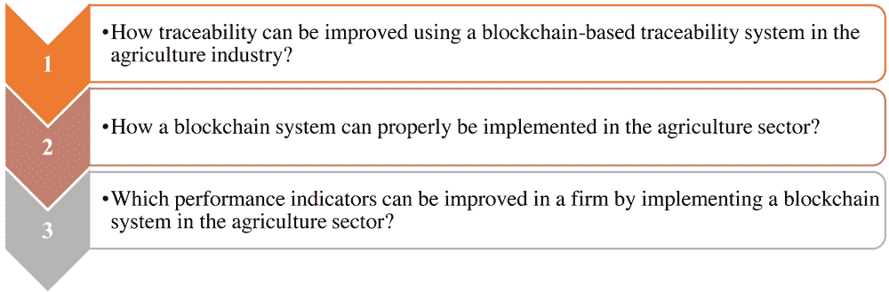 |

因此，本章确定了一个基于区块链的可追溯性的定义，回顾了主要的好处、限制和挑战，分析了区块链在可追溯性系统中的实施，并估计了可能的性能改进。此外，为了阐明与此解决方案实施相关的利益和性能，提供了一个商业案例。这个商业案例与“Cantina Placido-Volpone”有关，这是世界上第一家在可追溯性系统中实施区块链的公司。

文献综述 |

区块链被定义为一个数字的、去中心化的、分布式的注册表，其中每个交易都被记录并按时间顺序添加，旨在创建永久且不可更改的证据和痕迹。换句话说，区块链可以被定义为一种新的数据系统，它记录并存储数据，允许多个利益相关者以保密的方式共享，并能够在未来访问相同的数据和信息（Horst Treiblmaier, 2018）。链中的第一个块被称为“创世块”，因为它没有“亲属”（之前的块），而每个添加到链中的块都通过一个哈希值引用并连接到之前的块，称为“父块”。由于持续添加块，这个链的大小随时间推移必然增长，因为每组新的信息对应一个块。然而，这个链具有不可变性质，一旦其内容被写入，它就不再可修改或删除，除非可以无效由加密原语保证的整个结构。总之，区块链可以被定义为一个有序、递增、坚固、通过加密链接的数字链（De Giovanni, 2020a）。

区块链可以是两种类型之一，公共或私人。在私人的区块链中，参与者可以独立操作，但只有一个或多个预先选定的参与者在该网络中执行验证功能，在公共的区块链中，网络的每个成员都可以贡献到账本上的数据更新，并拥有所有通过共识批准的所有操作的不变副本。

近年来，由于食品安全与跨境环境问题和公共卫生紧密相关，公司在提高透明度、购买产品的消费者信心以及所有供应链中的责任感方面进行了大量投资，以寻求新的替代工具。在农业食品领域，公司正在寻找一个可以轻松集成到其供应链中并解决其透明度和可靠性问题解决方案（德· Giovanni，2020b）。为了充分理解基于区块链的可追溯性，解释可追溯性和区块链的真正含义非常重要。

-   区块链与可追溯性

当谈论可追溯性的含义时，为了避免混淆，有必要参考一些包含在主要国家和国际标准中的定义。表 1 描述了其中一些定义。

-   表 1. 根据国家和国际标准定义的可追溯性

| 参考文献 | 定义 |
| --- | --- |
| UNI EN ISO 9000 | 能够追踪实体的历史、应用或位置的能力 |
| UNI 10939 | 通过与物料流和供应链运营商相关的文档标识，重建历史并跟踪产品的使用能力 |
| 欧盟议会(EC) 178/2002 号法规 | 追踪和跟踪食品、饲料、食品生产动物或预期作为或预期纳入食品或饲料中的物质，通过生产、加工和分销的所有阶段的能力 |

施瓦格勒（2005 年）将“追踪”定义为焦点企业和其客户的整合，“跟踪”为焦点企业和其供应商的整合。扬森-弗勒斯等（2003 年）采用上下游方法整合来定义这两个概念与可追溯性有关。 “追踪与追溯”与可追溯性的区别在于，可追溯性包括能够实时指出项目位置的能力（杜哈约龙和德· Giovanni，2019 年；普里克和德· Giovanni，2019 年）。

可追溯性可以分为两类，内部可追溯性和外部可追溯性（张和巴特，2014 年）。内部可追溯性指的是单个企业使用的将产品身份与企业操作进入和离开的产品联系起来的过程。单个企业还将生成并存储在处理和转换过程中发生的变化的额外数据，这些数据附加到产品标识上。外部可追溯性指的是价值链中的企业能够传达关于产品在某些或所有转换阶段以及价值链中某些或所有方的信息的能力。企业通常分配一个独特的产品标识，并采用某种方法进行传达（张和巴特，2014 年）。

近年来，许多公司、研究人员以及供应链的关键参与者研究了区块链技术在追踪领域的适用性（Roberto Casado-Vara, 2018）。区块链，由于其内在特性和结构，为农业食品公司面对的最困难挑战之一提供了可能性，即全面而可靠地注册与食品相关的信息和数据。实际上，而不是将数据存储在一个不透明的网络系统中，通过区块链，所有食品产品的信息都可以存储在一个对所有供应链成员都共享和透明的系统中（Tian,2017）。

农业食品领域的基于区块链的追踪

由于人为错误和犯罪行为，实际的追踪系统存在深度的不足。追踪系统近年来以各种方式背叛了消费者、公司和欧洲及国际机构，因此这个领域需要实施更加透明和可持续的解决方案。数据库极易受到不准确和黑客攻击系统的侵害，以及由于腐败和欺诈行为造成的故意缺陷。

目前，许多技术如 RFID¹已经在食品行业中使用，以解决频繁的食品安全事件（Aung, M.M.; Chang, 2014）。例如，RFID 技术可用于原材料采购、生产加工、仓储管理、物流和运输的数据采集（Zhang, 2019）。然而，使用 RFID 技术的传统模型存在效率低下等问题。例如，数据集中存储增加了信息丢失和篡改的可能性。在实施区块链之前，产品追踪所使用的工具和技术以集中组织为特征，可能成为贿赂的脆弱目标。集中系统另一个潜在的风险是它成为单点故障（Tian, 2017）。

基于区块链的追踪便利了建立一个可以被智能合约用来自动化主张、认证和市场操作的数据结构（De Giovanni, 2019b）。有三个要素可以解释为什么食品供应链可以从图 2 中描述的区块链概念中受益。

| 图 2. 区块链对食品供应链的主要益处 |
| --- |
| 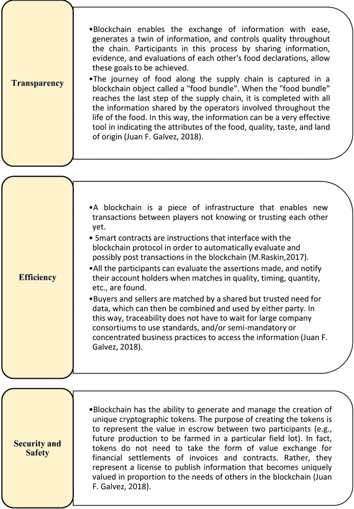 |

区块链所保证的透明度和准确性，使得客户和运营者能够在几秒钟内追踪到供应链中的每一个产品。

基于区块链的可追溯性可以解决原始可追溯性无法克服的几个问题。可追溯性最重要的问题是与交易活动的协调有关。区块链技术使用分布式数字数据库，其中区块以线性方式链接在一起，无法被篡改。第二个问题是将物理流与信息流连接起来的困难。区块链技术可以轻松地与传感器、物联网平台和可读的电子标签（如 RFID 和条形码）连接。

基于区块链的可追溯性向客户提供有关特定产品的有针对性和准确的信息，并使客户能够获取与食品安全和质量相关的关键信息（De Giovanni，2020c）。因此，对食品可追溯性有信心的客户愿意为保证信息高质量和期望来源的产品支付更高的价格（De Giovanni 和 Zaccour，2019）。结果，能够为其产品提供此类有效追溯系统的公司不仅会在操作中增加安全措施，还会通过确保质量和安全来增强客户的信心和信任（Shanahan 等人，2009 年，Mai 等人，2010 年）。

适当的基于区块链的可追溯系统也有潜力帮助负责产品安全问题的供应商或运营商，通过提供详细的可追溯数据来证明他们符合监管要求，不构成风险（Meuwissen 等人，2003 年；Sahin 等人，2007 年；Fritz 和 Schiefer，2009 年）。在这种情况下，可以避免责任索赔和诉讼，公司的形象也不会受到影响（Mai 等人，2010 年；De Giovanni 和 Ramani，2017 年）。基于区块链的可追溯性可以支持产品索赔，通常来说，它提供了每个人都可依赖的产品信息，这是品牌保护的完美策略，补充了质量和商誉（Buratto 等人，2019 年）。

正如沃尔玛进行的一项实验所显示的，采用这项技术最重要的好处之一是追踪每一件产品信息的速度。根据一项调查，沃尔玛希望追踪其一家商店中芒果的来源。使用传统的线性方法追踪从厄瓜多尔果园到洛杉矶超市的包裹需要六天、18 小时和 26 分钟。而使用区块链完成并提交所有信息仅需 2.2 秒。在食品安全污染的情况下，六天就是永恒！区块链还允许随时识别特定批次的产品，而不会造成食品浪费。可以快速追踪受污染或假冒的产品，而安全的产品将保留在货架上，而不是最终被填埋（Kamath,2018）。

因此，基于区块链的可追溯性是一种解决方案，它使得对成品和原料的跟踪与追溯成为可能，使用户能够高度信任他们在链上查看和存储的数据是正确的，且未被未经授权的方所篡改（Deloitte，2018）。

已经对区块链作为一种可追溯性问题解决方案进行了几项研究，尽管在一些项目中已经记录了优秀成果（IBM 食品信任、沃尔玛、安永区块链中心），但区块链仍然是一种“新”技术，风险较高（De Giovanni，2019a）。即使区块链技术看起来对食品可追溯性是一个重要的创新，但也有一些限制需要分析。全球食品可追溯性中心已经确定了六个需要克服的不同挑战，以便成功使用基于区块链的可追溯性。第一个挑战与消费者偏好的变化有关，随着时间的推移，他们的信心往往会变得越来越脆弱。中心还确定了国家监管机构造成的混乱，这些机构在追溯性问题上有时相互矛盾。第三个挑战涉及数据分析可能存在的困难，因为没有统一的要求。另一方面，第四个挑战是如何解释各个食品部门之间的复杂差异。后来，中心指出，可追溯性或区块链都无法防止人类在记录信息时犯错误。最后，最后一个挑战是由技术系统薄弱造成的，这些系统不允许快速有效的响应时间。克服这些挑战并非易事，将主要取决于公司愿意开放变革并投资于创新的程度（GS1，2012）。

实施基于区块链的可追溯性

要了解基于区块链的可追溯性如何在整个产品供应链中发挥作用，重要的是要分析在食品供应链的不同步骤中基于区块链的可追溯性的潜在用途。

流程从供应链成员可以在系统中注册自己为用户开始，可以为成员提供凭据和唯一身份标识。注册后，将为每个用户生成公钥和私钥对。公钥可用于在系统中识别用户，私钥可用于与系统交互时验证用户。这使得每个产品在更新、添加或传递给供应链下游位置的用户时，都可以由用户进行数字地址。在食品供应链中，当特定环节的用户收到产品时，他只能使用其私钥将新数据添加到产品的档案中。此外，当用户将此产品传递给下一个用户时，他们必须共同签署一个数字合同以验证交换（Tian，2017）。

这项技术的应用流程可以分为两部分。第一部分与标准的追溯流程相关，第二部分与区块链相关，并与第一部分相关联。农业食品领域的追溯流程通常结构化为五个步骤，但大多数时候它取决于作物的类型。这些流程在图 3 中指出。管理部门或认证机构可以随时访问工作现场，以确保遵守规则和法规，或者数据是否被篡改。

区块链的不变特性使我们能够记录从其原始状态到销售点的每一件物品在区块链上的完整所有权链。这个所有权链为提高商品的真实性和质量提供了更大的信心和保证，从而导致更好的采购决策（Deloitte，2018）。

当公司的员工在产品的生产阶段保存信息和数据时，就会创建智能合约（De Giovanni，2021a）。智能合约是一个在满足某些预设条件时自动运行的程序。此外，特定的智能合约能够自动化各种昂贵或复杂的操作。通过在以太坊或超级账本上使用智能合约，食品供应链上发生的每一项行动都会记录在区块链上，该区块链负责以不可变的方式存储供应链参与者上传的所有数据。在每次会议记录的信息必须得到商业伙伴的验证，形成所有参与者的共识。每个区块验证后，它将被添加到过渡链中，成为永久性且不可更改的。随着区块链和智能合约的引入，追溯过程将被划分为区块。

| 图 3. 基于区块链的追溯应用流程 |
| --- |
|  |

基于区块链的追溯性能

由于基于区块链的追溯性的实施所带来的改进应该从经济和战略优势的角度进行分析。除了销售和收入的增长，区块链是一种影响公司所有领域的技术，数字化和内部官僚主义的减少（数字笔记本、质量检查改进）将带来成本优势。尽管实施这一策略在开始时会昂贵，但它将通过降低成本带来更大的利益，因此，从长远来看，这对公司来说是经济可持续的。实际上，在我们稍后分析的商业案例中，这一系统的项目实施结果显示投资回报率高于整个行业的水平。在开始销售追踪产品后，公司可能在短时间内记录追踪瓶装酒（售价更高）和未追踪瓶装酒（标准价格）的销售均有所增长。

关于战略优势，这一解决方案将有可能监控关于消费者的信息（年龄、原产地、性别），这些是管理未来市场营销活动和监测消费者品牌知名度和识别的关键信息。此外，基于区块链的追溯性的实施是一个新颖且未知的解决方案，它引起了国内外主要杂志和报纸的兴趣，为产品创造了正面的媒体效应。实施这一解决方案还将涉及外国消费者的兴趣，这导致了公司国际化进程的增加。

案例研究：帕西多-沃隆酒庄

帕西多·沃隆公司（Placido Volpone S.r.l.），由著名酿酒师多梅尼科·沃隆家族和著名演员米歇尔·普拉奇多家族合作成立。这是第一个在其产品追溯系统中采用区块链的酒庄。酒庄生产的成功也归功于其地域品质。事实上，它位于以多石和多风而闻名的意大利丘陵地区，为葡萄栽培提供了适宜的条件，赋予了葡萄酒独特的风味。今天，酒庄公司专注于生产一些最具代表性的意大利红葡萄酒和白葡萄酒，如法朗吉纳、桑娇维塞、特罗亚纳和阿利亚尼科。装瓶、分销和营销过程由帕西多·沃隆酒庄提供，而农业和酿酒过程由阿齐 enda Agricola Domenico Volpone 提供。

该公司在 2016 年达到了最高的发展水平，当时它在战略和运营层面做出了新的决策。引入了新的品牌政策；通过重新设计标签和包装，从塑料容器转向玻璃容器，使得包装成本从 0.20 欧元增加到 0.70 欧元。公司还做出了另一个重要的决定，即转向另一类型的终端消费者，将目标从低端市场转移到更受欢迎的市场。这种转变只有在改变包装、生产过程，并为新的销售渠道提供更好的适应新目标的情况下才有可能。

在 Volpone 的区块链基础可追溯性

在此，我们讨论了 Volpone 通过采用基于区块链的可追溯性系统如何提高了可追溯性。酒庄在 2016 年根据满足最挑剔消费者口味以及遵守追溯性规则的需要进行了进一步创新。酒庄由于一名代表制造的假冒葡萄酒而遭受了营业额和声誉的损害，因为它没有适当的和必要的工具来追踪假冒批次，也没有证据可以将它追溯到造假者。为了避免进一步的麻烦，酒庄决定通过 EY 和 EzLab 的合作实施基于区块链的可追溯性。此外，这个系统加强了消费者和生产者之间的信任关系，提高了产品的质量。将区块链系统应用于葡萄酒行业的想法旨在消除公司在传递关于销售的信息方面遇到的障碍，因为生产链往往非常复杂。每个故事都可以以简单直观的方式向消费者讲述，他们所需要的就是一个可以扫描二维码的智能手机。

通过葡萄酒区块链，“Cantina Placido-Volpone”有可能向消费者全面介绍其葡萄酒的品质和 DNA 信息，这些信息是通过在酿酒过程中收集的真实、不可编辑的数据得出的。由 Ernst Young 创建的基于区块链的可追溯性，建立了一种包含从种植到装瓶每个阶段的酿酒过程信息的数据库。它创造了一个详尽的、共享的、透明的直接信息来源，整个生产过程对所有参与者可见，以验证存储信息的准确性，并给消费者提供每瓶酒背后的真实故事。公司实施这一解决方案后所享受的主要好处，在图 4 中提及（基于 Placido-Volpone 网站上的信息）。

| 图 4. 在 Cantina Placido-Volpone 实施区块链解决方案的主要好处 |
| --- |
| 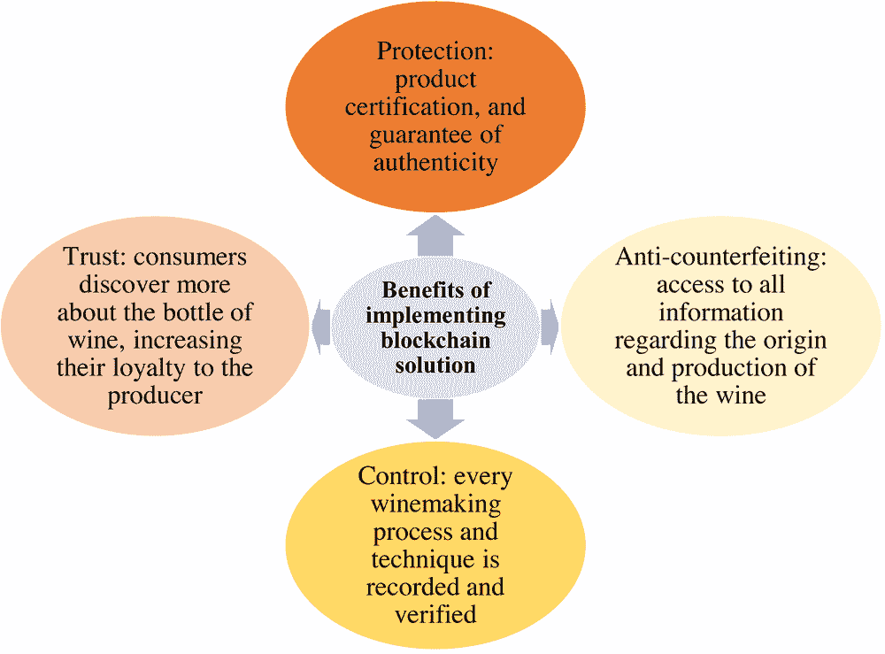 |

确实，通过采用这项技术，Placido-Volpone 酒馆可以在分销和储存温度方面控制地理定位数据，贯穿整个生产过程。此外，公司可以通过邀请消费者通过应用程序分享体验并进行地理定位消费，真正了解并分析其消费者（Tiscini, 2020）。然而，作为这项新技术的早期采用者，公司不得不解决一些与新技术知识有限以及员工培训成本相关的问题。

在 Placido-Volpone 的区块链可追溯性应用过程中

为了了解 Placido-Volpone 如何实施基于区块链的可追溯性，重要的是要进行阶段和组成项目的个别活动的分析。总共可以区分出四个不同的宏观阶段（E&Y,2019），包括评估、数据收集、开发和沟通，这些在图 5 中有所指示。

| 图 5. 实施基于区块链的可追溯性阶段 |
| --- |
| 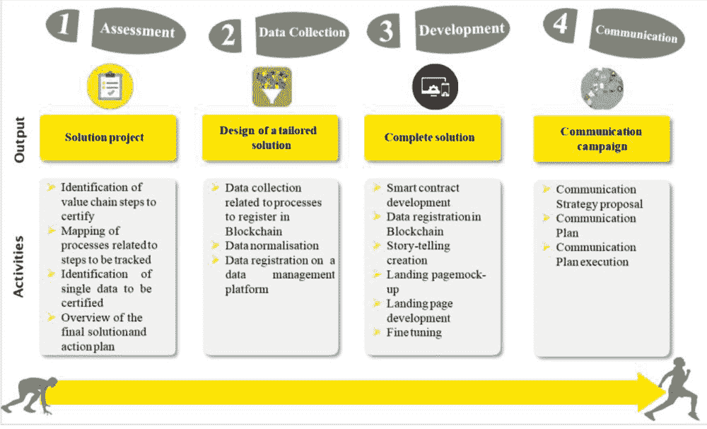 |
| 来源：EY 区块链中心，2019 |

评估

在这个阶段，E&Y 与 Placido-Volpone 酒馆合作，必须定义要达到的结果以及如何达到。评估阶段持续了大约两个月，他们定义了最终目标，即完美记录 Cantina Placido-Volpone 的 Falanghina 葡萄酒整个生命周期中的所有信息。换句话说，最终目标是将所有敏感数据记录在区块链上，确保数据的完整性和不可变性。次要目标包括环境可持续性、防伪和公司的国际化。具体分析第一阶段，进行以下行动：

图 5 中提到的行动是通过 E&Y 官员与 Placido-Volpone 酒庄的员工和管理人员进行的大量访谈进行的，双方详细讨论了项目，没有遗漏任何数据。在访谈中，因此决定分析该过程的所有阶段，从土壤培育到瓶装营销，只省略了“售后”过程。能够追踪整瓶葡萄酒的生产过程，是因为 Placido-Volpone 酒庄不依赖任何第三方公司进行任何过程，所有种植阶段都是“内部”完成；这使得两家公司能够拥有完成项目所需的所有数据。

数据收集

项目的第二阶段是数据收集，这一阶段收集了产品追溯过程中有用的信息。整个数据收集过程都是手工完成的，因为这家普利亚公司之前没有投资于新技术或数字化，但所有信息都是手工记录在纸质笔记本上的。因此，这个阶段的关键是 E&Y 和 Cantina Placido-Volpone 与 EzLab 的合作开始。事实上，为了加快数据记录，并给公司带来创新的推动，引入了 AgriOpenData，这是 EzLab 为业务管理和在数据管理系统上记录信息开发的在线平台。这款软件对公司来说是一项创新，能够支持农业学家在作物处理过程中使用 OpenData，这些数据直接与现场活动处理的信息集成。这使得公司员工能够持续快速地交换和共享数据和信息。

AgriOpenData 软件的另一个优点是，它取代了旧的纸质活动笔记，改为数字化笔记。活动笔记是法律上对意大利所有农场必需的，直到几年前，它还必须每年提交一次，但根据新规定，现在必须每月提交一次。有了数字化笔记，书写活动笔记变得更快、更安全、更可靠，因为不可能丢失某些数据或信息。

| 图 6\. EzLab 开发的 AgriOpenData 与旧数据集的比较 |
| --- |
| 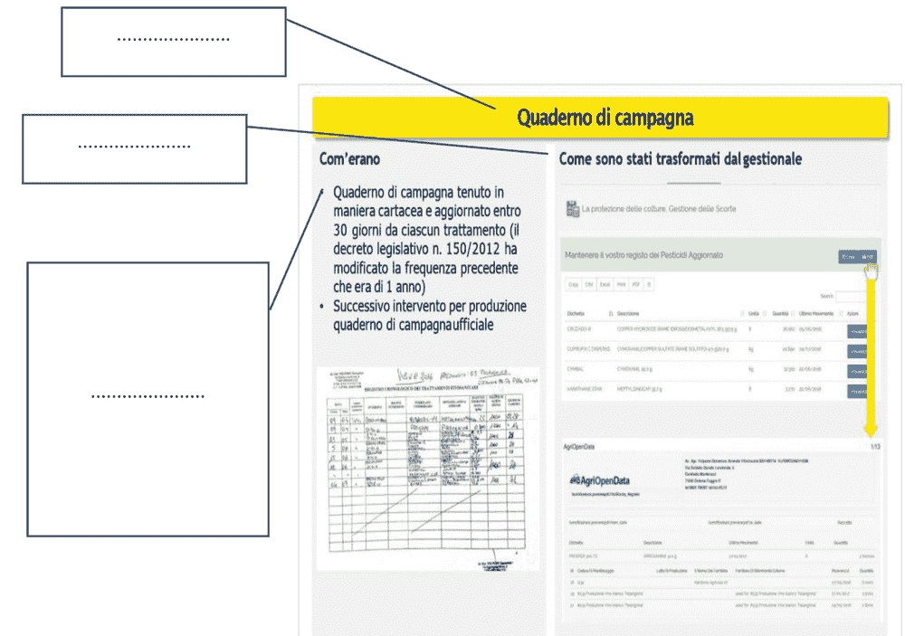 |

开发

发展分为两个步骤：在区块链上记录数据和创建着陆页。第一步始于结构化和实施智能合约，这是以太坊的基础。在过程中，Cantina Placido-Volpone 的管理层必须选择哪些信息以明文形式记录在区块链上，哪些信息通过加密隐藏起来。尽管透明度是项目的主要目标之一，但有些信息必须隐藏，因为它具有战略重要性。

第二步涉及创建着陆页，即消费者通过扫描瓶背标签上的二维码可以到达的网页。着陆页的设计由安永旗下的 NeriWolff 公司负责。如图 7 所示，着陆页包含所有对消费者有用的信息，如地理背景、种植、酿酒过程、分销和销售。对于这些领域中的每一个，客户都有可能查阅记录在区块链上的所有信息。实际上，客户需要点击“干预验证”才能进入另一个网页，该网页记录了与特定感兴趣区域相关的所有信息按时间顺序排列。此外，对于每条信息（例如修剪或葡萄收获），可以点击“证书登记”以追踪到另一个 Etherscan 网页，该网页代表了以太坊搜索引擎。通过阅读 Etherscan 页面上的信息，客户可以看到所有信息已经不可更改地记录在区块链上。

| 图 7. 着陆页，由 NeriWolff 执行 |
| --- |
| 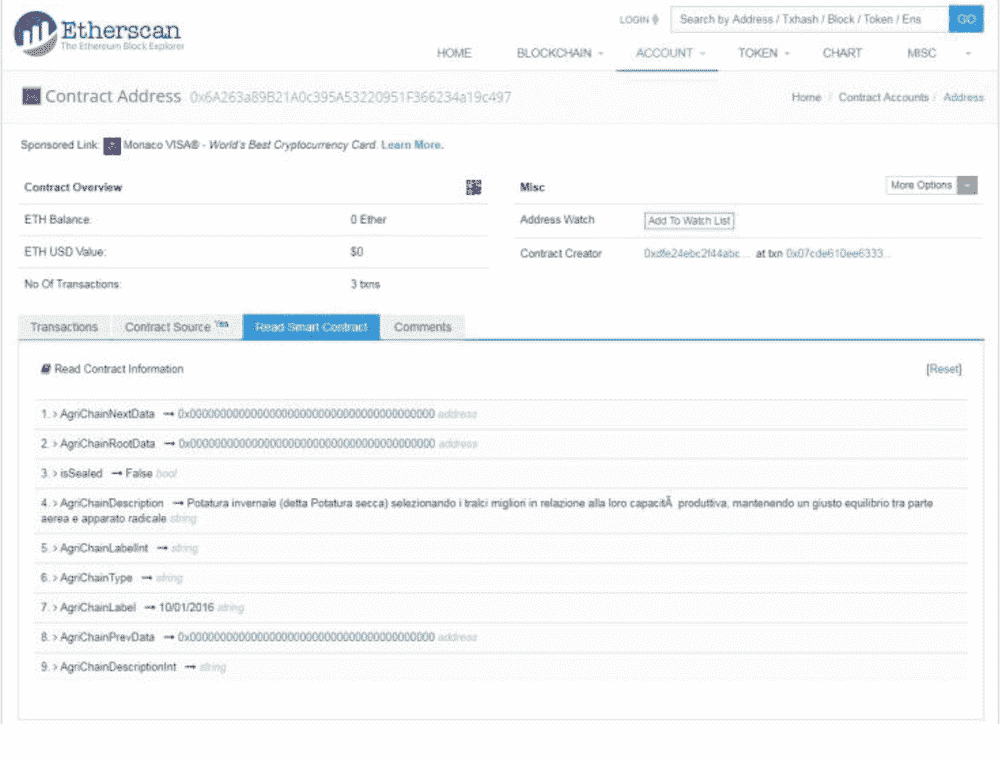 |
| *来源：安永区块链中心，2019* |

沟通

第四阶段也是最后阶段是制定一个公开计划，向世界展示首款完全通过区块链追踪的葡萄酒。在这一阶段，安永（E&Y）和卡蒂纳·普拉西多-沃隆（Cantina Placido-Volpone）有不同的目标。

为了吸引新客户，安永对宣传项目的优秀成果以提高公司的良好声誉非常感兴趣。实际上，在普拉西多-沃隆项目完成后几个月，安永开始与其他酒庄以及家乐福开展基于区块链的可追溯性项目。

对于卡蒂纳·普拉西多-沃隆来说，这一阶段的主要目标是国际化其销售，跨越国界，在国外销售其葡萄酒。因此，以最佳方式宣传此项目非常重要，以便它也在国外得到认可。在媒体层面，该项目得到了高度评价，被 Sole24Ore 和意大利证券交易所提及。

客户信息可访问性

基于区块链的追溯性很重要，因为消费者可以了解更多关于最终产品的信息，提高他们对所饮用酒品和品牌忠诚度。通过扫描二维码，消费者将能够访问一个网页，该网页提供有关生产过程以及其他不同类型的信息，例如：

+   • 地理背景，显示与葡萄酒生产地理区域相关的所有信息，特别是葡萄园。

+   • 种植，详细说明农药、化肥以及植物生长阶段的信息，遵循特定的时间线。

+   • 葡萄酒生产，展示了生产葡萄酒的所有步骤，附有时间标签和过程描述。

+   • 销售与分销，展示了生产的葡萄酒总量（以升为单位）以及在全球范围内分发的瓶数。

| 图 8. 通过扫描智能标签可获取的信息 |
| --- |
| 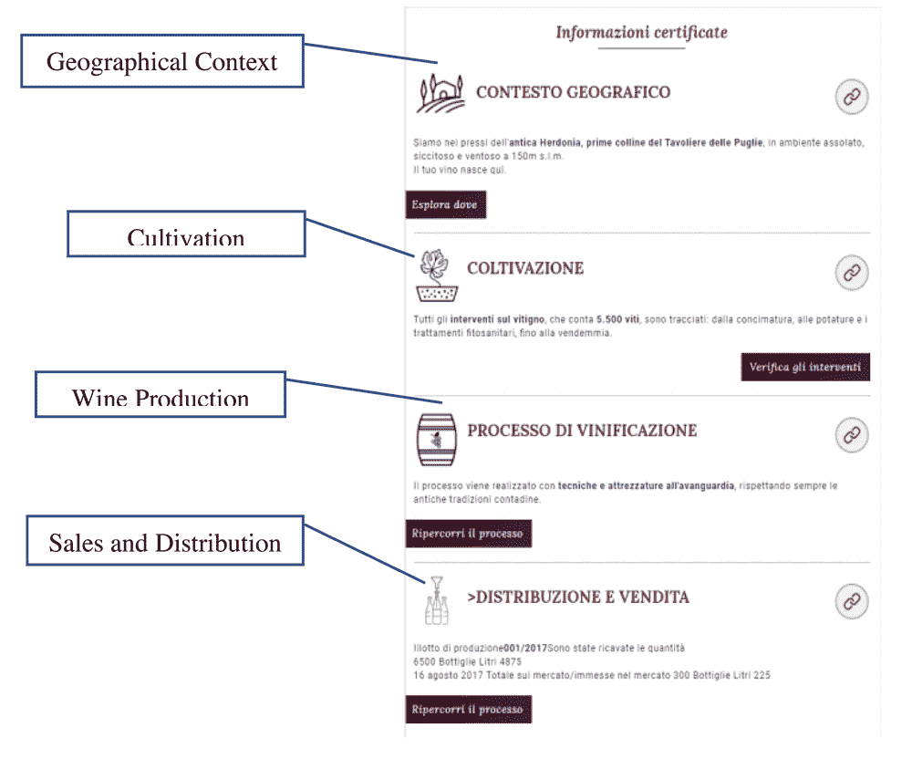 |
| *来源：安永区块链中心，2019 年* |

普拉西多-沃隆酒庄的性能提升

将区块链作为产品可追溯性的辅助工具引入，带来了许多经济利益。尽管普拉西多-沃隆酒庄最初必须花费大量资金来实施这一新的可追溯性系统，但这项创新对公司资产负债表和主要盈利能力指标产生了积极影响。这一分析是通过分析 2017 年沃隆酒庄的资产负债表和与酒庄主人的访谈进行的。

实施这项技术，公司不得不承担 40,000 欧元的固定成本，分为项目开始时的 30,000 欧元和项目中间的 10,000 欧元。除了固定成本外，酒庄还必须承担每瓶追溯 10 欧分的变动成本。在此情况下，变动成本总计达到 13,000 欧元，因为 E&Y 和沃隆共追溯了 130,000 瓶。因此，2017 年的总成本达到了 53,000 欧元。

应注意，由于这项创新，沃隆酒庄决定重新设计其瓶子，主要目的是实现酒庄想要追求的美学标准，同时也是为了证明对追溯瓶子所应用的溢价价格的合理性。实际上，从 2017 年开始，普拉西多-沃隆酒庄的法朗吉纳葡萄酒的价格从 7 欧元上涨到 9.20 欧元，记录了 2.20 欧元的溢价价格。根据酒庄工作人员进行的一些分析，溢价价格中有 80%是由于重新设计，20%是由于与安永的投资。实际上，正如沃隆酒庄的一位经理所说：“20%的溢价价格可以以高度确定性地抵消由于重新设计而增加的价值”。通过这种方法，知道 20%的溢价价格是 0.44 欧元，将其乘以追溯瓶子的数量，可以概述解决方案的好处，总计达到 57,200 欧元。因此，2016 年瓶子生产成本有所上升，成本增加了 31.42%，对公司的利润产生了重大影响。生产成本因此上升到 100,000 欧元，但作为结果，区块链通过其自身的特性，创造了额外的成本优势，例如：

+   • 数字化，占总生产成本的 10%，主要得益于官僚任务的减少和云管理系统（AgriOpenData）的效率提升；

+   • 质量与保证检查提升，占生产成本的 25%；

+   • 与质量保证检查和官僚任务相关的公司成本，占成本的 10%。

因此，将公司的生产成本与销售、数字化总和、质量保证改进相乘，公司估计在生产成本上节省了 3500 欧元。这个结果是由酒庄估计的。

解决方案的总利润可以通过将 4200 欧元（通过解决方案的收益和成本之间的差额计算得出）和 3500 欧元（成本优势）相加来计算，总共为 7700 欧元，仅由于区块链的引入。现在，可以计算项目的投资回报率，将总利润与解决方案的成本（7700/53000）进行比较，结果为 14.53%。表 2 总结了经济财务分析。

表 2. 实施基于块的追溯性的经济财务分析

| 追溯瓶数 | 130000 |
| --- | --- |
| 固定成本 | 项目初期（欧元） | 30000 |
| • 项目中期（欧元） | 10000 |
| 总固定成本（欧元） | 40000 |
| 变动成本 | 每瓶（欧元） | 0.1 |
| 130000 瓶的总成本（欧元） | 13000 |
| 总成本 | 40000+13000=53000 |
| 解决方案的收益 | 57200 |
| 成本优势 | 3500 |
| 总利润 | （57200-53000）+3500=7700 |
| 投资回报率 | 14.53% |

由 Medio Banca 进行的一项分析显示，意大利葡萄酒行业在 2017 年的平均投资回报率为 7.9%，然后在 2018 年降至 6.7%。尽管引入区块链的初始成本可能看似过高，但它对公司盈利能力产生了积极影响，导致了高于行业平均水平的投资回报率和显著的成本优势。这些结果归功于 Placido Volpone 酒庄向消费者提供的透明度。消费者更愿意支付更高的价格，以换取一个完全可追溯且对健康安全的产品。此外，可追溯性增加了国外的销售额，从而增加了收益。

分析数字标签显示的数量和用户的地域分布，显示该项目确实在消费者中引起了极大的兴趣。此外，地理分析对于勾勒出未来市场营销策略的指导方针非常有用。图 8 显示了截至 2018 年 6 月 12 日扫描二维码的消费者国籍。

| 图 9. 分析截至 2018 年 6 月 12 日扫描二维码的消费者国籍 |
| --- |
| 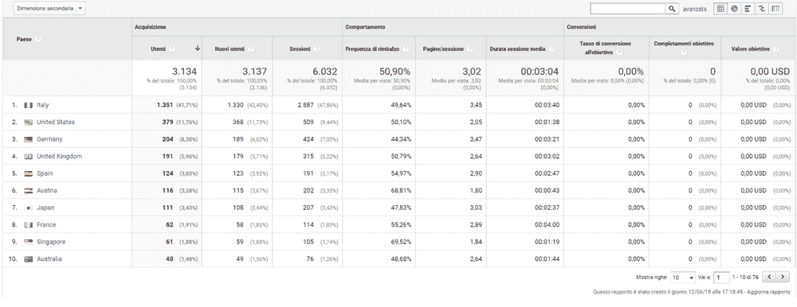 |
| 来源：*Cantina Placido-Volpone Analytics* |

2018 年 6 月，超过 50%的访问酒馆网页的流量是通过扫描二维码来自欧洲消费者，包括德国（6.30%）和英国（5.90%）。此外，值得注意的是，这个排名中第二位的是美国（占 11.70%），其葡萄酒消费者对产品的来源和原创性信息非常敏感。这表明，通过在其追溯系统中引入区块链，Placido-Volpone 酒馆实现了项目初期设定的目标之一，即其产品的国际化。在 2017 年 4 月 5 日至 2018 年 6 月 11 日期间，Placido-Volpone 酒馆在意大利的网站访问量主要来自生活在罗马、米兰和其他北部意大利城市的消费者。这是一个非常重要的结果，因为品牌重塑后的两个主要目标是吸引更多关注葡萄酒质量的客户群体，并在意大利大城市扩大销售。图 9 显示了在意大利境内的可视化分布情况。

| 图 10. 意大利消费者的地理位置 |
| --- |
| 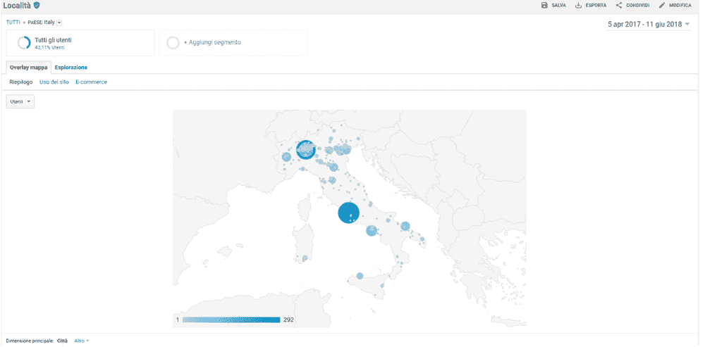 |
| *来源：Placido-Volpone 酒馆分析* |

借助谷歌分析，还可以将这种定量分析与对那些打开区块链链接或扫描二维码的人的特征进行定性评估相结合。研究从访问包含在区块中的信息的网页的频率开始，然后确定世界上访问来源的位置。图 10 显示了 2017 年 4 月 5 日至 2018 年 6 月 11 日期间的总访问量。

| 图 11. 2017 年 4 月 5 日至 2018 年 6 月 11 日二维码扫描趋势 |
| --- |
| 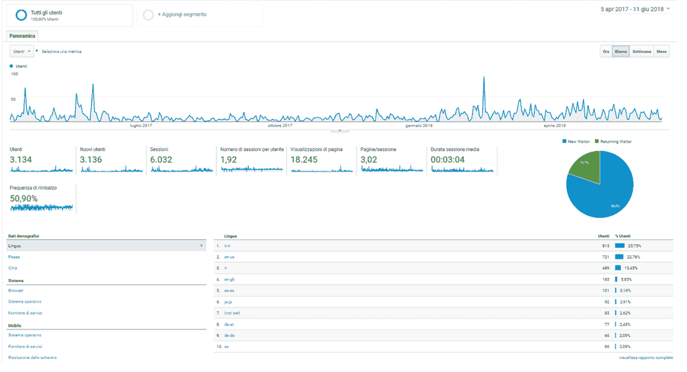 |
| *来源：Placido-Volpone 酒馆分析* |

2017 年，自项目实施以来，共有 6032 次浏览，持续时间约为 3 分钟。这些数据非常重要，因为它突出了每个用户如何花费足够的时间来查阅所有可用的数据。此外，图 11 和 12 分别显示了根据性别和年龄划分的访问者百分比。根据图 12，用户对新技术的了解随着年龄的增长而减少。

| 图 12. 分析使用二维码的消费者的性别 |
| --- |
| 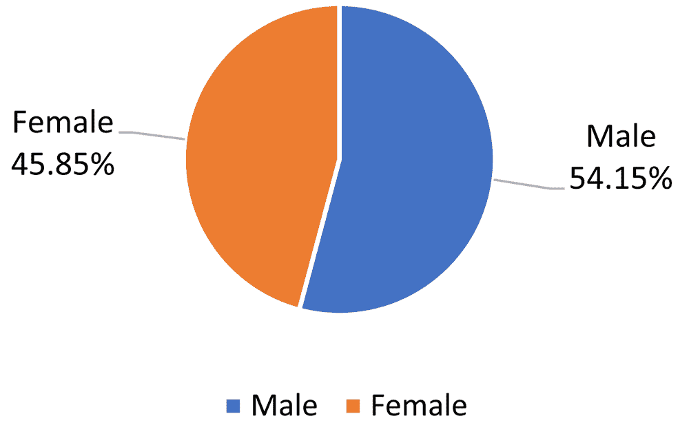 |
| *来源：Placido-Volpone 酒馆分析* |
| 图 13. 分析使用二维码的消费者的年龄 |
| 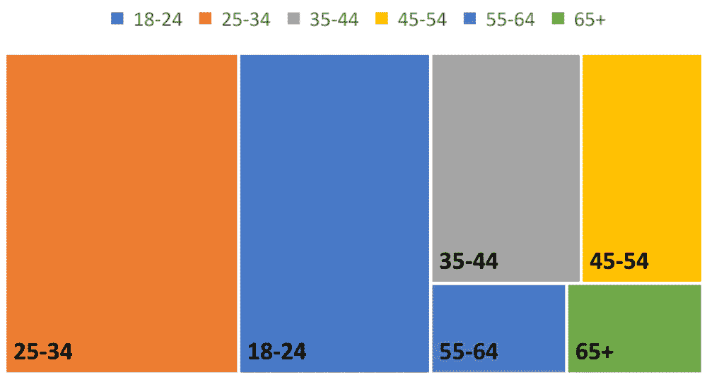 |
| *来源：Placido-Volpone 酒馆分析* |

除了最重要的定性结果外，品牌知名度也有所提高。创新和透明度是现在与酒庄名称联系在一起的两个基本概念。这家酒庄无疑是使自己的生产过程比该领域所有其他酒庄都要透明的酒庄。区块链的引入也改变了酒庄的内部系统。它导致了员工在农业和数字化等领域专业知识技能的增加。

结论

近年来，农业食品领域遇到了许多与可追溯性相关的问题。此外，消费者对他们购买的产品的信息变得更为要求和好奇。正如文献综述和商业案例所证明的，基于区块链的可追溯性是解决可追溯性问题的一种优秀解决方案。

在本章中，我们提出了一种技术解决方案，以确保通过区块链在农业食品领域实现可追溯性。区块链可追溯性的某些方面，如实施过程、特别是解决方案的经济可持续性，尚未在以前的研究中得到研究。因此，本章的目标是调查使用区块链技术改进可追溯性系统的可行性和吸引力。

事实上，卡蒂纳·普拉西多-沃隆酒庄是世界上第一家在葡萄酒领域实施基于区块链可追溯性的公司，这导致了保护、信任、控制和防伪。一旦消费者扫描二维码，将打开一个网页，上面有地理背景、种植、葡萄酒生产、分销和销售等信息。通过这种解决方案，卡蒂纳·普拉西多-沃隆酒庄加速了其国际化进程。从经济和战略角度来看，性能改进已经被分析。该解决方案在 2017 年实现了 14%的投资回报率，公司可以监控客户行为，为未来的市场营销活动制定策略。

根据本研究分析的结果，基于区块链的可追溯性产生了许多优势，包括经济效益。它不仅是公司的收入来源，也是其品牌和消费者安全的来源。

参考文献

昂，M. M.，&昌，Y. S.（2014）。食品供应链中的可追溯性：安全和质量视角。食品控制，39，172-184。DOI：10.1016/j.foodcont.2013.11.007

班纳吉，M.，李，J.，&周，K. K. R.（2018）。物联网安全的区块链未来：立场论文。数字通信与网络，4（3），149-160。DOI：10.1016/j.dcan.2017.10.006

贝恩克，K.，&扬森，M. F. W. H. A.（2020）。使用区块链技术在食品供应链中实现可追溯性的边界条件。国际信息管理杂志，52，101969。DOI：10.1016/j.ijinfomgt.2019.05.025

Beloglazov, A., Abawajy, J., & Buyya, R. (2012). 针对云计算的数据中心能源感知资源分配启发式算法。未来几代计算机系统，28(5)，755-768。doi:10.1016/j.future.2011.04.017

Bhardwaj, S., & Kaushik, M. (2018). 区块链——推动未来的技术。在智能计算与信息学（pp. 263-271）。Springer。doi:10.1007/978-981-10-5547-8_28

Bhatt, T., Buckley, G., McEntire, J. C., Lothian, P., Sterling, B., & Hickey, C

Biswas, K., Muthukkumarasamy, V., & Tan, W. L. (2017). 基于区块链的葡萄酒供应链追溯系统。在 2017 年未来技术会议（FTC）(pp. 56-62)。The Science and Information Organization。

Bogdan, R. C., & Biklen, S. K. (1998). 教育定性研究：理论和方法导论。Allyn 和 Bacon 出版社。

Buratto, A., Cesaretto, R., & De Giovanni, P. (2019). 在动态供应链中有合作计划和价格折扣机制的寄售合同。国际生产经济学杂志，218，72-82。doi:10.1016/j.ijpe.2019.04.027

Caro, M. P., Ali, M. S., Vecchio, M., & Giaffreda, R. (2018, May). 基于区块链的农业食品供应链追溯：一个实际实施案例。在 2018 年物联网垂直和专题峰会——农业（IOT Tuscany）(pp. 1-4)。IEEE。

Casado-Vara, R., Prieto, J., De la Prieta, F., & Corchado, J. M. (2018). 区块链如何改善供应链：食品供应链案例研究。计算科学会议论文集，134，393-398。doi:10.1016/j.procs.2018.07.193

Comunicazione, C. (2017). 葡萄酒产业链看向区块链。https://www.corrierecomunicazioni.it/digital-economy/la-filiera-del-vinoguarda-al-blockchain-in-nome-del-made-in-italy/

Creydt, M., & Fischer, M. (2019). 区块链及其更多应用——算法驱动的食品追溯性。食品控制，105，45-51。doi:10.1016/j.foodcont.2019.05.019

Crosby, M. (2016). 区块链技术：超越比特币。Giugno。

De Giovanni, P. (2019a). 通过区块链实现生态数字供应链。可在 SSRN 3488925 处获得。

De Giovanni, P. (2019b). 通过动态库存和智能合约实现数字供应链。数学，7(12)，1235。doi:10.3390/math7121235

De Giovanni, P. (2020a). 供应链管理中的区块链和智能合约：一个博弈论模型。国际生产经济学杂志，228，107855。doi:10.1016/j.ijpe.2020.107855

De Giovanni, P. (2020b). 智能合约与区块链在供应链质量管理中的应用。在动态质量模型和数字供应链中的游戏中。Springer Nature。

De Giovanni, P. (2020c). 一个带有缺陷产品和商誉损害的最优控制模型。操作研究年鉴，289(2)，419-430。doi:10.1007/s10479-019-03176-4

德· Giovanni, P. (2021). 带有供应商管理库存、协调和环境绩效的智能供应链. 《欧洲运筹学杂志》, 292(2), 515-531. doi:10.1016/j.ejor.2020.10.049

De Giovanni, P., & Cariola, A. (2020). 通过工业 4.0 技术、精益实践和绿色供应链实现过程创新. 《交通经济学研究》, 100869. doi:10.1016/j

德· Giovanni, P., & Ramani, V. (2017). 产品同类相食现象与服务策略效应. 《运筹与管理研究杂志》, 1-17.

De Giovanni, P., & Zaccour, G. (2019). 最优质量提升与定价策略: 主动与被动产品退货. 《运筹与管理研究杂志》, 88, 248-262. doi:10.1016/j.omega.2018.09.007

Duhaylongsod, J. B., & De Giovanni, P. (2019). 创新策略对供应商集成与运营绩效关系的影响. 《国际物理分销与物流管理杂志》, 49(2), 156-177. doi:10.1108/IJPDLM-09-2017-0269

安永报告. (2019). 安永 Opschain 可追溯性. 作者.

欧盟理事会. (2019). 欧洲议会和欧盟理事会 Regulation (EC) No 178/2002, 2002 年 1 月 28 日, 关于食品法的一般原则和要求, 建立欧洲食品安全局,并就食品安全事宜制定程序. 欧洲联盟官方杂志, 02002R0178-EN-26.07.2019-007.001

Feng, H., Wang, X., Duan, Y., Zhang, J., & Zhang, X. (2020). 利用区块链技术提高农产品可追溯性: 发展方法、好处和挑战综述. 《清洁生产杂志》, 260, 121031. doi:10.1016/j.jclepro.2020.121031

GS1. (2010a). 医疗供应链可追溯性. 来源于: https://www.gs1.org/docs/gdsn/support/20101025_Traceability_White_Paper_final.pdf

GS1. (2012). GS1 标准文档. 供应链全程可追溯性的业务流程和系统要求. GS1 全球可追溯性标准.

Galvez, J. F., Mejuto, J. C., & Simal-Gandara, J. (2018). 食品可追溯性分析中使用区块链的未来挑战. 《分析化学趋势》, 107, 222-232. doi:10.1016/j.trac.2018.08.011

Helo, P., & Hao, Y. (2019). 运营和供应链中的区块链: 一个模型和参考实现. 《计算机与工业工程》, 136, 242-251. doi:10.1016/j.cie.2019.07.023

Heyman, H. M., Senejoux, F., Seibert, I., Klimkait, T., Maharaj, V. J., & Meyer, J. J. M. (2015). 通过基于 NMR 的代谢组学引导分离, 对 Helichrysum populifolium 中的抗 HIV 活性二咖啡酰基和三咖啡酰基醌进行鉴定. 《药用植物与应用》, 103, 155-164. doi:10.1016/j.fitote.2015.03.024

ISO. (2007). ISO 22005: 饲料和食品链中的可追溯性—一般原则和系统设计与开发指南. 国际标准化组织.

范 Dorp, C. A., & Beulens, A. J. M. (2003). 在制造过程中管理追溯信息. 信息管理国际期刊, 23(5), 395-413. doi:10.1016/S0268-4012(03)00066-5

卡马特, R. (2018). 基于区块链的食品安全追溯系统：沃尔玛与 IBM 合作的猪肉和大芒果试点. 英国区块链协会杂志, 1(1), 3712. doi:10.31585/jbba-1-1-(10)2018

卡姆布雷, S. S., 加纳塞卡兰, A., & 沙尔玛, R. (2020). 在农业供应链中建模基于区块链的追溯性. 信息管理国际期刊, 52, 101967. 

林, Q., 王, H., 裴, X., & 王, J. (2019). 基于区块链和 EPCIS 的食品安全追溯系统. IEEE 访问: 实用创新, 开放解决方案, 7, 20698-20707. 

刘, B., & 德 Giovanni, P. (2019). 通过工业 4.0 技术和供应链协调实现绿色工艺创新. 操作研究年鉴, 1-36. doi:10.1007/s10479-019-03498-3

米什拉, N., 密斯特里, S., 丘达里, S., 库杜, S., & 米什拉, R. (2020). 基于区块链和二维码的食品安全追溯系统. 在 2019 年 IC-BCT. 区块链技术. 斯普林格. 

奥尔内斯, S., 乌巴赫特, J., & 扬森, M. (2017). 政府中的区块链: 分布式账本技术对信息共享的好处和含义. 学术出版社.

奥尔森, P., & 博尔特, M. (2013). 如何定义可追溯性. 食品科学和技术趋势, 29(2), 142-150. doi:10.1016/j.tifs.2012.10.003

皮茨蒂, T., & 米拉贝利, G. (2015). 食品全球跟踪与追溯系统: 一般框架和功能原则. 食品工程杂志, 159, 16-35. 

普拉萨德, D., 贾, N., 贾, S., 李, Y., & Joshi, G. P. (2020). 基于区块链的农业产品追溯性和可见性: 确保印度食品安全的一种去中心化方式. 可持续性, 12(8), 3497. doi:10.3390/su12083497

普里克尔, T., & 德 Giovanni, P. (2018). 通过合同协调高技术供应商的创新项目. 研究政策, 47(6), 1161-1172. doi:10.1016/j.respol.2018.04.003

拉斯科, R. (2017). 智能合约的法律和合法性. 乔治城法律技术评论, 305-341.

欧盟议会和理事会 2002 年 1 月 28 日的(EC)第 178/2002 号法规

德勤报告. (2018). 当两个链结合时：供应链遇见区块链. 作者.

萨拉, K., 尼扎姆丁, N., 贾亚拉曼, R., & 奥马尔, M. (2019). 基于区块链的大豆农业供应链追溯性. IEEE 访问: 实用创新, 开放解决方案, 7, 73295-73305. 

施瓦格勒, F. (2005). 从欧洲角度看追溯性. 肉类科学, 71(1), 164-173. 

Storøy, J., Thakur, M., & Olsen, P. (2013). 食品追溯框架—实施食品价值链追溯的原则和指南。《食品工程杂志》, 115(1), 41–48。doi:10.1016/j.jfoodeng.2012.09.018

Storøy, J., Thakur, M., & Olsen, P. (2013). 食品追溯框架—实施食品价值链追溯的原则和指南。《食品工程杂志》, 115(1), 41–48。doi:10.1016/j.jfoodeng.2012.09.018

Tian, F. (2017, June). 基于 HACCP、区块链和物联网的食品安全供应链追溯系统。《2017 年国际服务系统和服务管理会议论文集》(pp. 1-6)。IEEE。

Tiscini, R., Testarmata, S., Ciaburri, M., & Ferrari, E. (2020). 区块链作为一种可持续商业模式创新。《管理决策杂志》, 58(8), 1621–1642。提前在线出版。doi:10.1108/MD-09-2019-1281

Treiblmaier, H. (2018). 区块链对供应链的影响：一个基于理论的研究框架及行动呼吁。《供应链管理杂志》, 23(6), 545–559。doi:10.1108/SCM-01-2018-0029

Tsang, Y. P., Choy, K. L., Wu, C. H., Ho, G. T., Lam, C. H., & Koo, P. S. (2018). 一个基于物联网(IoT)的风险监控系统，用于管理冷链风险。《工业管理与数据系统杂志》, 118(7), 1432–1462。doi:10.1108/IMDS-09-2017-0384

UNI. (2015). 质量管理系统—基本原理和词汇，米兰。UNI EN ISO 9000。

WangF.CaoR.DingW.QianH.GaoY. (2011, July). 激励措施以实现食品追溯性及其对食品追溯系统设计的含义。在 2011 年 IEEE 国际服务运营、物流和信息学会议论文集(pp. 32-37)。IEEE。10.1109/SOLI.2011.5986524

Wang, S., Zhang, Y., & Zhang, Y. (2018). 基于区块链的框架，用于在分布式存储系统中进行细粒度访问控制的数据共享。《IEEE Access: 实用创新，开放解决方案》, 6, 38437–38450。doi:10.1109/ACCESS.2018.2851611

Xu, X., Lu, Q., Liu, Y., Zhu, L., Yao, H., & Vasilakos, A. V. (2019). 设计基于区块链的应用案例研究：进口产品追溯。《未来生成计算机系统杂志》, 92, 399–406。doi:10.1016/j.future.2018.10.010

Zhang, J., & Bhatt, T. (2014). 食品追溯最佳实践指南。《综合食品科学和食品安全评论》, 13(5), 1074–1103。doi:10.1111/1541-4337.12103

Zhao, G., Liu, S., Lopez, C., Lu, H., Elgueta, S., Chen, H., & Boshkoska, B. M. (2019). 区块链技术在农业食品价值链管理中的应用、挑战和未来研究方向。《计算机与工业杂志》, 109, 83–99。doi:10.1016/j.compind.2019.04.002
