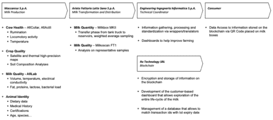
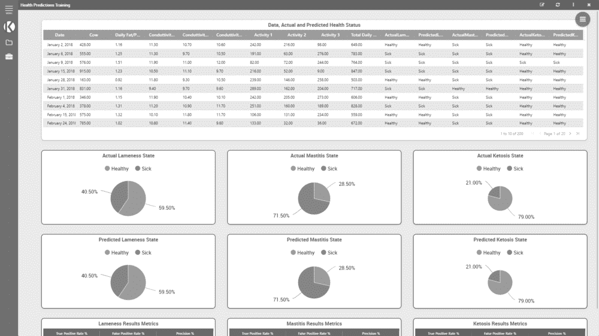

# 第四章

# 一个基于牛奶区块链的供应链：

来自领先意大利农场的证据

+   马尔科·弗朗西斯科·马祖

     [`orcid.org/0000-0002-8427-9664`](https://orcid.org/0000-0002-8427-9664)

    意大利路易斯大学

+   安德烈亚·贝内顿

    意大利 Maccarese S.p.A. & Cirio Agricola,意大利

+   安杰洛·巴切利尼

    意大利路易斯大学

+   卢多维科·拉维尼

    意大利路易斯大学

摘要

区块链已被证明在支持企业的可追溯性、数据可靠性和数据检索方面发挥作用，但在食品领域的应用仍然有限。通过一个得到欧盟地平线 2020 计划支持的意大利用地牛奶价值链的例子，本章描述了一个在食品领域实施该技术的真实案例，以利于多个利益相关者。这个案例突出了通过一系列先进的物联网传感器网络收集有关牛奶生产的信息，其输出既用于数据驱动的决策，也通过区块链进行信息认证。这种可信且认证的信息可以与其他利益相关者分享和使用，以获取有关生产过程状态的信息，并可能提供关于产品的更详细信息，逐步达到最终消费者，对食品科技公司采用技术以及循环经济的相关影响具有启示意义。

引言

近年来，供应链流程不断接受创新（Wong 等人，2013 年），尤其是在技术和可追溯性方面。特别是可追溯性，在谈论食品时，与农业领域的透明度和可持续性一起，成为一个热门话题。消费者对食品的来源、生产和背后的伦理原则越来越感兴趣（Olsen 等人，2018 年）。政府和超国家组织，如欧盟，也在推动全球努力，旨在提高食品安全性，保护食品质量（Badia-Melis 等人，2015 年）。这些重要信息在考虑消费者、供应商和立法者可能如何相信他们阅读的细节是正确的时候，呈现了一个可靠性问题。当涉及到“从农场到餐桌”策略的最 recent and discussed topics 之一，与食品产品的标签系统有关时（Mazzù等人，2021a），这也是一个相关话题。

尽管全渠道营销涉及品牌与客户互动的沟通渠道的性质和类型（Ailawadi 等人，2017 年），但许多公司仍在与与传达其透明度相关的众多问题作斗争（Abeyratne 等人，2016 年）。特别是，对公司来说，一个主要的挑战是将他们的价值链变得更加明确，并且一致地向外部利益相关者传达他们的品牌承诺（Boukis 等人，2020 年）。

区块链技术可能是解决这一问题的可能解决方案之一（Galvez 等人，2018 年）。通过这项技术，可以存储有关产品、材料来源和生产过程的详细信息，在制造和供应链的每一步都可以进行存储，然后提供（Feng 等人，2020 年）。这项技术的内在特征，如不可变性和透明性，因此可以转移到数据上，进而转移到产品上（Galvez 等人，2018 年）。

为了更好地在现实世界中理解这些概念，本章分析了意大利乳制品供应链的案例。在 Horizon 2020 欧洲框架范围内，作为提高产品质量透明度以及增加基于数据的农业决策方法的努力的一部分，Maccarese S.pA.，Ariete Fattoria Latte Sano S.p.A.，Engineering Ingegneria Informatica S.p.A.和 Ro Technology S.r.L.已经部署了一个基于区块链的项目，用于追踪整个牛奶生产过程和分销链的可追溯性。与牛相关的指标，如健康状态、认证、药物或抗生素，通过存储在专用系统中的不可变信息集逐步跟踪。消费者和供应链中的其他参与者可以利用这项技术获取有关产品的信息，所有这些信息都具有事实上的认证，即他们手中的产品是真实、健康和安全的。

最后部分将探讨潜在的含义和研究进一步的方向。

背景

在食品行业中，真实性和信任至关重要（Bryła，2015 年；EU Science Hub，2021 年；Reid 等人，2006 年）。能够提供高质量的产品很重要，但更重要的是能够证明这种质量，以吸引客户的兴趣（Grunert，2005 年；Verdú Jover 等人，2004 年）。这不仅与在货架上找到产品的客户有关，还与供应链的所有下游和上游步骤有关（Ali 等人，2017a；Ali 等人，2017b；Aung 等人，2014 年）。

当今供应链面临许多与信息可靠性相关的问题：消费者信任、供应链透明度、产品质量、物流问题、环境影响、个人消费者数据、欺诈、食品安全等（Ge 等人，2016 年；Trienekens 等人，2012 年）。这些问题与该领域正在发生的创新密切相关。供应链日益相互关联：供应商与彼此以及客户（无论是内部还是外部）紧密相关（Wong 等人，2013 年），技术变得越来越普遍（Ayoub 等人，2017 年）。特别是，食品供应链越来越采用可追溯性功能，使每个细节都受到关注（Bosona 等人，2013 年；Francisco 等人，2018 年），这也反映了许多政府计划（如最近的“从农场到餐桌”）的目标，特别是对可持续性的关注（Grunert，2011 年）。

通过采用区块链技术，消费者最终可以更好地获取有关产品和服务的更详细信息（Francisco 等人，2018 年；Kshetri，2018 年），以及背后的供应链。特别是，得益于区块链网络，用户可以深入了解所有活动、生产以及/或服务交付过程，这些过程共同构成了产品，同时获得该信息可靠的认证。由于区块链作为存储系统位于各种相互连接的设备上，这些设备保持独立性，只保留特定交织的数据部分（Li 等人，2020 年），供应链中的任何单一方都不能更改现有信息（Pun 等人，2018 年），这种情况特别适用于打击假冒伪劣商品，以及准确追踪产品生命周期的 100%（Zhang 等人，2020 年）。区块链还可以在供应链中用于与其他各方存储和共享可靠数据，例如供应商、客户等（Bumblauskas 等人，2020 年）。

持续的、经过认证的信息共享有助于提高公司的责任感和透明度（Hwang 等人，2017 年），因为它能帮助提供关于产品从原材料到制造商、分销商、零售商，最终到消费者的完整信息（Apte 等人，2016 年；Montecchi 等人，2019 年）。透明度还体现在与品牌的互动中，使公司能够长期建立消费者信任（Bengtsson 等人，2010 年），同时改善供应链中所有参与者的合作（Aste 等人，2017 年）。

额外的优势与更好的信息共享、减少商业伙伴之间的争议以及不对称性（Lucena 等人，2018 年）和防止欺诈（Ahmed 等人，2017 年）有关。在食品行业，区块链技术也可以用于补充现有和新供应链中的食品追溯。相比之下，目前要么追溯性非常有限，要么存在许多孤立的解决方案，这意味着追溯性仅存在于供应链中的特定利益相关者内部（De Giovanni，2021；Bumblauskas 等人，2020 年）。

关于这一方面，一个相关因素是食品安全信息的标准化。虽然 offline 标准已经存在，比如美国的《食品安全现代化法案》（FSMA）（FDA，2011 年）和欧盟的《通用食品安全法》（European Commission，2002 年），但它们仅限于各自的国家。此外，它们没有考虑到互操作性，并且没有标准化的元素允许集中、全面的访问归档数据。（Dey 等人，2021 年）。现有信息系统的集中化也导致了信任问题，因为参与方容易篡改数据。

如前所述，在食品行业，公司可以使用基于区块链的解决方案来监控他们的整个生产过程（Francisco 等人，2018 年）。例如，家乐福使用区块链技术追踪散养鸡的生产。通过扫描包装上的特殊代码，消费者可以获得关于鸡的所有信息，而不受消费者完成购买所使用的渠道的影响。巴瑞拉与 IBM 合作，正在测试区块链来监控罗勒生产的每一个步骤，以确保“Made in Italy”标签的质量（Prandelli 等人，2020 年）。这些信息将对所有渠道中的所有消费者可用。IBM 与 Bolton Food 集团的 Rio Mare 品牌之间还存在着另一合作伙伴关系：消费者可以获取手中罐头金枪鱼整个生产过程的信息，包括捕捞方法、FAO 原产地区域以及船只和生产工厂的名称（Costa，2020 年）。

区块链中存储的信息的易于访问也很重要。在最终消费者的案例中，有两种主要方式可以简单地访问存储的信息：二维码和文本链接（Dey 等人，2021 年；Mishra 等人，2020 年）。向最终客户传达这些元素可用性的常用方法是在产品包装上放置二维码，一旦用移动设备扫描，就会打开一个网站，允许探索和追溯存储在网站上的详细信息（Bumblauskas 等人，2020 年；Kennedy 等人，2017 年）。二维码通常被认为是更有效且易于使用的。它们可以以最低的成本应用于几乎任何对象（Seino 等人，2004 年）。另一种选择是在包装上放置一个简单的链接，将其重定向到一个网站，客户在该网站上输入与产品相关的唯一标识符，例如序列号或批号，然后可以随后检索信息。

除了可追溯性的方面，评估添加关于动物福利和食品安全的有认证、可信信息的好处也很重要，这可以促进销售导向方面如购买意愿和支付意愿的提升，特别是在乳制品领域（Dickinson 等人，2002 年），或者提高消费者的口感和健康认知（Mazzù 等人，2021b 年）。这些元素可以为竞争优势奠定基础（Kafetzopoulos 等人，2013 年；Nancarrow 等人，1998 年）。先前的研究表明，顾客高度重视在鸡蛋、肉类和乳制品生产过程中的伦理实践，特别关注动物福利（Spain 等人，2018 年）。记录构成整个供应链的过程和产品，使顾客能够从道德来源购买（Saberi 等人，2019 年）。

然而，当消费者接触到被认为是遥远的技术概念时，他们可能会对技术持怀疑态度（Davis，1989 年），并将这种怀疑和不信任转嫁给产品本身。从投资实施区块链系统的食品中获得的理想输出之一，因此是加强食品质量感知和对品牌信息及产品的信任。以可信和认证的方式突出显示有助于提高质量感知的元素，如道德养殖和农业实践，应该会改善消费者眼中的公司形象，从而有助于价值生成（Choe 等人，2009 年）。

本章的主要焦点

数据驱动的农业被定义为在农业系统中使用数据来增强决策制定，从而改善作物产量、利润、环境可持续性和食品安全等食品系统成果。

随着农业越来越数据驱动（Mehrabi 等人，2021 年），本章研究了领先意大利公司在乳品养殖和加工领域实施的方法，逐步引入先进技术以评估多个参数，从动物生命迹象得出健康情况，到卫星地图和无人机成像来指导种植和作物种植。所有这些参数结合在一起，为最终消费者（B2C）提供产品信息，并允许业务伙伴（B2B）改进和优化生产。

DEMETER 项目在区域牛奶价值链中的应用案例

DEMETER：2020 年地平线项目

DEMETER¹属于欧盟 Horizon 2020²研究项目的“工业领导”支柱，专注于将现有技术融入食品领域的全新应用中，并通过促进公私合作伙伴关系的发展。它运作在位于几个欧洲国家的 20 个试点项目上，涉及 60 个不同的合作伙伴，包括农民和加工公司以及技术和科技玩家。它包括 25 个分销站点，6,000 名农民，并部署了超过 38,000 个设备和传感器。

项目的基础是多参与者方法，这种方法使项目围绕农民或服务顾问共享的实际问题或机会展开，从而在科学家和开发人员与最终用户之间形成持续的知识共享和开发活动的反馈循环。此外，最终用户实际上是项目的共同所有者，从而促进积极使用开发出的解决方案（欧洲委员会，2020 年）。

该倡议通过快速采用物联网、大数据和精准农业等先进技术，指导欧洲农业部门的数字化转型。它通过实施一个共同数据模型来促进软件系统之间的互操作性，从而保证长期可持续性，帮助不同参与者以通用格式共享数据。它还促进采用使能技术，如农业枢纽、人工智能（AI）以及信息和服务发现的安全使能器。

参与公司可以利用诸如基准测试和可视化仪表板之类的技术，这些技术以决策支持系统的形式运作，利用所有收集到的数据来帮助决策过程。

试点项目

本章分析的案例属于 Pilot 4.2 项目，该项目名为“牛奶质量与动物福利跟踪”，专注于利用区块链技术开发和实施一个区域食品价值链，基于三个主要假设：

+   - 牛奶质量与动物福利密切相关；动物的适当饮食和休息与高牛奶产量和质量呈正相关。因此，这些因素的改进将导致乳制品产量的增加。

+   • 加工公司对牛奶质量水平有利益需求；支付给农民的可变溢价基于牛奶的法律定义质量指标，围绕牲畜的卫生和福利。这些因素和相关溢价鼓励并推动农民控制和提高他们的牛奶质量。

+   - 消费者对他们所吃的食物感兴趣，以及生产它的公司所提供的透明度水平。

目标是 thus to optimize the flow of information among those that are part of the milk value chain, with a focus on animal health and milk quality, and to make all this information transparent and available to the end consumer.

具体来说，信息流优化聚焦于以下方面：

+   - 育种和挤奶，重点关注动物福利和农场活动的改善。

+   - 牛奶运输，重点关注产品安全。

+   - 加工，重点关注最终产品的质量。

+   - 标签贴附，重点关注向消费者提供的信息。

试点项目涉及多个参与者，他们组织成两个宏观区域——“生产运营商”和“技术提供商”——意大利和欧洲最大的农业组织 Coldiretti 作为协调员。

项目的一个“生产运营商”，即提供需求、建议开发技术解决方案，并从技术解决方案的实施中受益的终端用户公司，是 Maccarese S.p.A.，是意大利最大的乳牛场之一，拥有 1,450 头弗里斯兰乳牛、600 头育肥牛犊和 3,240 公顷土地（DEMETER 项目，2021 年），位于罗马的 Maccarese，作为牛奶的生产商。还包括 Ariete Fattoria Latte Sano S.p.A.，这是一家位于罗马的牛奶加工公司，在拉齐奥大区是领导者，每天收集 200 吨牛奶，向大型零售商和 Ho.Re.Ca.渠道分销牛奶和乳制品。

“技术提供商”包括两家工程和软件开发公司，他们与农场合作伙伴一起，必须实施支持技术解决方案的骨干。具体来说，Engineering Ingegneria Informatica S.p.A.是意大利最大的信息技术（IT）集团，也是欧洲前 10 大 IT 集团之一，Ro Technology S.r.l.是一家设计、开发和验证应用程序、工具、固件和硬件组件的公司，服务于多个市场。项目最终的利益相关者是消费者，他们可以通过获取面前乳制品的质量和历史信息，在未来做出更加明智的选择。

数据收集

价值链每个环节的数据都被组织在仪表板上，这些仪表板能够追踪牛奶质量并提供支持决策的洞察力。信息存储在区块链上，以确保透明度、确定性和信任，并且可以轻松地与其他农业食品领域的参与者重新使用和分享，以改进他们的流程和性能。

使用了两种数据源：一种与动物福利相关（通过传感器收集的与动物休息、反刍、饮食习惯等相关的数据），另一种与牛奶质量相关（收集、运输和储存过程中样本的分析）。在硬件方面，农场有一个全面的网络，包括通常不连接到任何网络的传统传感器。这个传感器网络通过购买智能、连接的现代物联网设备进行了增强，这些设备可以实现精确和统一的健康跟踪。

通过两种代谢传感器设备持续评估奶牛的健康状况，这两种设备都附着在动物身上。第一个设备，AfiCollar，是一种奶牛颈圈，利用运动传感器来监测反刍和其他健康参数。第二个设备，AfiActII，是一种安装在奶牛腿上的计步器，用于监测运动活动和休息行为。与此同时，阴道温度控制器被用来监测动物的体温，并可能调节动物生活环境的冷却。数据无线传输到中央系统，可以用来通过 Maccarese S.p.A.设计的科学模型推导出动物健康状况。

作物质量通过卫星和热高精度地图、GPS 引导的收割机和作物种植机以及先进的土壤分析来驱动。实际上，健康的奶牛，如果饮食良好，会产生更好的牛奶。

牛奶质量的评估分为两步：在挤奶阶段直接评估，以及牛奶被加工商接收时评估。在挤奶阶段，自动挤奶机通过独特的 ID 直接识别动物，并存储体积和温度等参数。此外，收集关于电导率的信息，因为这一参数与乳腺炎的发病率有关。

随后，牛奶通过 AfiLab，一个牛奶分析实验室，该实验室利用近红外光谱（NIRS）技术可以确定脂肪、蛋白质、乳糖和细菌载量的组成。不用样本作为整个挤奶量质量的代表，网络中流过的每一分升牛奶都被分析和评估，以评估牛的健康状况和牛奶质量，并实时优化牛的营养（TDM 网站，2021）。通过使用 Afilab 软件控制台，可以获得关于牛奶质量和动物健康的细致控制，因为农民可以将数据追溯到特定的动物。

牛奶然后从马卡雷塞公司（Maccarese S.p.A.）通过带有隔热墙的特殊罐车转移到阿雷特农场拉特圣公司（Ariete Fattoria Latte Sano S.p.A.），从而在 20 分钟的转移时间内被动保证整个牛奶的 4°C 温度。在处理器阶段，在从牛奶罐车到储罐的转移阶段使用名为 Milkbox MKII 的设备，以收集通过它的牛奶的加权平均样本（ACRAM，2021；Milkbox 网站，2021）。除了证明一定量的牛奶已在这两方之间转移外，还记录了温度、酸度和时间戳等元素。一旦所有牛奶都转移到 Ariete Fattoria Latte Sano S.p.A.的储罐中，代表性样本还会进行进一步的实验室分析（见图 1）。

| 图 1. 数据处理 |
| --- |
|  |
| 来源：*自编* |

数据存储

来自不同提供者、机器和设备的数据以不同的格式提供，并存储在不同的位置。许多是封闭的遗留或专有系统，以静态格式如 CSV 和 XLS 提供数据，并需要手动干预才能共享。

DEMETER 架构的核心原则之一是改造和统一这些数据，以促进共享农业信息模型（AIM）的发展。

因此，工程信息公司（Engineering Ingegneria Informatica S.p.A.）开发了一个自定义包装器/翻译器，以便将来自马卡雷塞公司（Maccarese S.p.A.）和阿雷特农场拉特圣公司（Ariete Fattoria Latte Sano S.p.A.）的不同数据点合并到基于总体 AIM 的一个数据模型中。

数据收集、转换和处理云基础设施基于软件即服务（SaaS）范式，并实现了一个部署在 Docker 容器上的微服务架构。系统处理的数据遵循数据动态范式，与数据静止范式相反，因此可以实时评估和转换。

底层数据模型基于 JSON-LD。JSON-LD 是一种轻量级的语法，用于将链接数据以 JSON（JavaScript 对象表示法）格式序列化[RFC7159]。其设计允许现有的 JSON 以最小的更改被解释为链接数据。JSON-LD 主要旨在成为在基于 web 的编程环境中使用链接数据、构建互操作性 web 服务以及将链接数据存储在基于 JSON 的存储引擎（Kellogg 等人，2019 年）的方法。其主要优点是每个数据点都可以链接到一个现有的本体，不同参与者可以用来轻松解释数据。

这些现在标准化并在集中云系统上归档的数据，然后通过 REST API④以 JSON 格式流通。此外，其他农场、处理器以及一般想要利用产生的数据的其他参与者，可以利用 AIM 来解释数据并在此基础上进行构建。

数据利用

奶牛健康数据输出，一旦综合，用于建立奶牛标准行为的基线。任何与这个基线不符的偏差，如活动突然增加，可以预示着奶牛发情等状态变化，以改善受孕结果（TDM 网站，2021）。其他因素，如休息时间，可以影响到牛奶的整体生产质量。

开发了一个决策支持系统（DSS），以整合所有数据，并可以帮助决策制定、数据分析、数据获取、存储、聚合和转换。在这些操作之后，所有内容都显示在一个仪表板上，除了原始数据和总体参数，还提供了算法、文献驱动的对挤奶和营养成分以及病理学（跛行风险、乳腺炎、酮症等）的评估。

正在进行的一个活动是训练一个 AI 机器学习模型，该模型将能够通过分析一些参考参数来预测整体奶质。

此外，通过推广共享数据互操作性模型，整个生产、转换和运输的信息可以很容易地与其他价值链中的参与者共享。

仪表板和 DSS 由 Engineering Ingegneria Informatica S.p.A.开发，基于 KNOWAGE，这是一个灵活的、专业的开发的、自助服务和用户导向的开源商业分析套件（Knowage，2021）（见图 2）。

| 图 2. KNOWAGE 决策支持系统仪表板 |
| --- |
|  |
| 来源：**Engineering Ingegneria Informatica S.p.A.** |

农民和生产商都可以利用这些系统：

+   • 动物福利决策支持系统（DSS）：该 DSS 旨在为饲养员提供主要与动物福利有关的重要指标（即病理预测），输入为通过特定设备收集的农场的所有数据。DSS 的输出是一个饼图，显示了每种病理预测的病牛和健康牛的百分比，以提供对动物福利的综合性洞察，并建议饲养员采取纠正措施。

+   • 奶质估算仪表板：通过所有传感器收集的数据点被综合起来，为农民提供生产的奶质的预测。

+   • 奶质预测仪表板：为加工公司提供奶质评估，考虑到从不同农民收集的牛奶以及收集的总牛奶的分析，以突出运输过程中的篡改或异常。

+   • 基准化系统：农民和生产商都提供了一个简短的报告，显示了一组农场性能指标（如每头牛的牛奶产量、总牛奶产量、牛奶质量、牛的健康状况、营养状况和公司生产力）与一组目标值（即类似/邻近公司的平均和最优指标值）的比较。

+   • 追溯系统：解决数据完整性、数据安全和防篡改的需求，利用分布式账本技术存储来自其他 DEMETER 设备的生产过程验证数据，并暴露用于检索先前存储和验证信息的 API。

区块链实施

区块链利用节点间交易和区块的概念（Karafiloski 等人，2017；Nakamoto，2008）。在此实施中，交易包含有关牛奶质量的数据和信息。一旦这些交易达到一定的数量，它们就会被合并到一个存储在区块链上的区块中。当创建一个区块时，矿工接着去验证区块内所有存在的交易的真实性。与比特币区块链验证系统类似，矿工通过工作量证明方法（例如，Efanov 等人，2018）验证交易。由于区块链是一个分布式系统，每个矿工“拥有”链条的一部分，因此保存在链条上的信息是不可变的，不能被修改，从而确保了牛奶质量数据的确定性（Ayoade 等人，2018；黄等人，2018；赵峰等人，2020）。

所有之前列出的由硬件传感器在牛奶生产和转换过程中收集的时间戳数据，都由一个云系统处理，并转换为一个基于标准 JSON-LD 的数据模型。然后由一个名为“事务管理器”的中间件处理，该中间件位于由 Engineering Ingegneria Informatica S.p.A.设计的云存储和由 Ro Technology S.rR.l.拥有和管理的区块链节点之间，并存储在实际链条上，该链条对于这个项目是一个名为 Rinkeby 的以太坊测试网。

像以太坊这样的区块链可以分为主网和测试网。主网是公共的、生产用的区块链，通常为大众所熟知（以太坊文档，2021），在分布式账本上发生实际价值的交易。这些网络上的交易通常带有金融价值。测试网是一个用于测试在主网之前在类似生产环境中运行智能合约的测试区块链。为了这个目的，于 2017 年创建的 Rinkeby 测试网络提供了以太坊协议中的加密货币部分以太币来测试应用程序，以及可以用来追踪交易执行时间的深入统计数据（Ranganthan 等人，2018）。它是一个运行特定共识协议的证明-权限网络。一个证明-权限网络依赖于被指定为“签署者”的可信节点，这些节点有权创建区块。网络上的大多数签署者需要验证链（Wuehler，2018）。

整个项目的概述在图 3 中提供。

| 图 3：项目流程概述 |
| --- |
| 图 978-1-7998-8014-1.ch004.f03 |
| 来源：Ro Technology S.R.L. |

通过 Maccarese S.p.A.的传感器网络、农场以及 Ariete Fattoria Latte Sano S.p.A.对牛奶运输和转换阶段的认证收集的所有信息，可以完全提供给供应链的所有利益相关者。由于这些信息存储在区块链上，所有参与者都可以以认证的形式访问；他们可以阅读这些信息，也可以添加与他们各自的转换过程相关的元素。

下游供应商可以确信他们购买和转换的产品质量，这对于 B2B 可追溯性方面是相关的，从而使他们能够进行评估和明智的商业决策。

除了对区块链的实际“操作员”可用外，产品的详细信息还可以与最终客户分享。

让存储在区块链上的信息以一种干净、简单、易于阅读的格式呈现的方法之一是通过一个网络应用程序，例如，通过访问一个特定的 URL 来访问，网页允许终端用户获取有关他们特定牛奶箱的特定信息。

另一种方法是在包装上贴上二维码，用手机扫描后，可以重定向到前述网页。

最终消费者可能从区块链上跟踪、验证并提供的所有产品信息中受益匪浅；例如成分、动物福利、营养成分和添加剂等元素与健康相关，消费者根据这些信息来评估整体食品质量（Petrescu 等人，2019 年）。实际上，食品质量及其感知经常被视为健康和幸福的一种代理（Mascarello 等人，2015 年；Sadilek，2019 年）。特别是，已有研究表明，消费者对于动物福利和有机生产方法等元素显示出相对较高的支付意愿（Baltzer，2004 年）。有机食品被认为是比传统食品质量更高的（Loebnitz 等人，2016 年；Naspetti 等人，2009 年），当消费者信任他们所收到的关于质量的信息时，这种支付意愿具体化（Velčovská等人，2015 年）。更广泛地说，正面的伦理属性和质量对客户支付意愿产生了积极影响（Auger 等人，2008 年；Homburg 等人，2005 年；Van Doorn 等人，2011 年）。

此外，采用区块链可能导致食品信息的存储标准化，以独特格式统一，从而导致不同来源在供应链中的输出趋于一致。因此，不同参与者也可能被激励合作共享信息，以简化流程和提高产出；由于产品的整个历史记录都可用，可以实施并共享在不同参与者之间全面的分析、仪表板和决策系统。

解决方案和建议

Maccarese S.p.A.及其合作伙伴在供应链中实施的区块链项目为未来的技术进步和新的研究流提供了明确的机会。

可能需要引入额外的支持工具和方法，以最小化输入数据质量引起的问题。实施自动化系统、共识协议和无法物理篡改的坚固盒子，这些盒子收集并转换来自传感器的数据，为区块链提供不可争辩、确定的输入，可以增加企业的透明度，减少不当使用的可能性（Dedeoglu 等人，2019 年）。实际上，数据上传过程意味着由传感器创建的信息只有在加载到区块链后才能获得认证。因此，这信息可能会受到传感器噪声或恶意行为者的影响，这些行为者既在公司内部也在公司外部。此外，一旦插入区块链，错误或干预，如前述，就无法更正。基于区块链技术的生态系统的实施将需要高额投资，既涉及技术基础设施，也涉及员工培训，以防止潜在的错误数据上传。数据控制过程，分析上传前的输入，然后可能成为该行业的标准。

此外，机构可以进一步努力，让消费者、供应链利益相关者和财团更加了解区块链的好处，以提高采用率，使该技术更加普及和熟悉。这可能会产生额外的积极效果，反驳关于技术可靠性和透明度（Biswas 等人，2017 年；Kshetri，2018 年；Lu 等人，2017 年）的常见异议，同时增加消费者对基于区块链的流程的信任。反过来，更高的可信度可能会降低消费者在决策过程中遇到的相关障碍。

此外，区块链技术对采用者的循环经济具有重要意义。事实上，从早期阶段跟踪产品到最终客户也允许监控供应链每个阶段过期的或无法使用的牛奶数量，从而促进回收。例如，它可以成为作为田间肥料的消化物，或通过生物变压器（如 Maccarese S.p.A.所提供的）产生电力的生物气体。因此，产品上可用的信息量越多，就越有可能回收无法上市的产品并利用它们滋养生产过程。这可能带来额外的环境效益。

最后，与多个参与者连接相关的高昂成本可以通过利用欧盟提供的不断增长的资金机会来解决（例如，2021-2027 年的地平线计划）。此外，初始的可变成本应导致可见性、透明度和安全性的提高（De Giovanni，2020 年）。

表 1. Maccarese S.p.A.采用区块链的利弊

| 优点 | 缺点 |
| --- | --- |

增强可追溯性 • 供应链信息对终端客户和供应链参与方都是可用的

食品信息标准化

供应链各参与方的协作

供应链信息认证

通过仪表板系统进行数据可视化及快速解读

价值驱动—区分元素 | 数据上传—传感器创建的信息只有在被运营商上传到区块链后才获得认证 • 对技术持保守态度的利益相关者可能对技术缺乏信任

一旦数据上传到区块链，就无法修改错误的数据

连接多个供应链参与方的高成本 |

未来研究方向

实际上，尽管区块链技术可以有效地支持公司和供应链的过程及信息，但从理论角度来看，对其采用对消费者行为产生的影响知之甚少。这个话题上的未解决研究问题一直是许多分析的对象，这些分析突出了一种对技术的不信任（Dierksmeier et al., 2020; Kouhizadeh et al., 2018; Saberi et al., 2019; Venkatesh et al., 2020）。关于透明度，一些作者（Biswas et al., 2017; Kshetri, 2018; Lu et al., 2017）讨论了对区块链领域的信任的重要性，并强调消费者往往对技术持反感态度；因此，他们对提供的信息持怀疑态度。由于透明度是实施技术的主要优势之一，未来研究可以探讨适当的方法来展示技术和它产生的信息，考虑平台的性质作为一种揭示供应链和公司的方式。

此外，未来研究可以评估食品产品是否通过区块链信息提示正面改变其采用率，或根据提供给终端产品的来源信息，改变其被认为的健康性和美味程度，以及这对购买意愿、支付意愿和口碑意图的影响。消费者的积极态度 toward 透明、值得信赖和社会责任感的公司会导致更强烈的正面口碑意愿（Maxham et al., 2003）。实行积极实践的公司也更可能从消费者那里获得口碑（Handelman et al., 1999）。假设区块链技术能够认证和验证供应链信息，消费者将能够获得更可靠的信息（Biswas et al., 2017; Lu et al., 2017）。

此外，随着食品安全和可持续性相关问题日益主导消费者的决策过程（Tian，2017），消费者越来越关注他们购买产品的真实性和合法性（Abeyratne 等人，2016）。因此，他们越来越要求知道产品的来源、加工时间和地点。在这种情况下，在考虑感知到的社会责任对消费者行为可能产生的影响时，区块链可能作为一种能够确保供应链相关信息真实性、责任性和透明性的技术而出现（Biswas 等人，2017；Kshetri，2018；Lu 等人，2017）。

此外，考虑到所描述的项目涉及供应链中的不同参与者，从生产者到分销商，进一步的研究途径可能探讨采用此类区块链实施来定义价值主张的不同元素和对品牌权益的影响。由于与产品相关的技术属性可能被视为独特的东西，并可能增加产品的健康感知，了解披露与产品本身相关的所有信息对消费者决策过程的影响也将是相关的。

结论

推动区块链技术在食品行业的实施至关重要，以提高信息透明度，帮助终端客户做出更健康的食品选择。已经有多个举措以逐步引入该技术，以改善食品可追溯性，从而造福消费者和经济体。

为确保食品供应链的广泛采用，这些举措不仅需要关注技术，还需要进行教育。这需要针对消费者，帮助他们建立对基于区块链技术的自主支持系统的更多信任，在决定吃什么时；针对企业，帮助他们使数据更容易获取，并了解通过揭示他们的生产过程对公共健康做出贡献的重要性；以及针对政策制定者，鼓励他们为快速采用该技术提供足够的资金。

致谢

作者感谢来自 Maccarese S.p.A.的 Matteo Boggian 作为焦点人物，以及在开发案例研究、分享有关公司、Horizon 项目相关信息和作为研究参与者的联络人等方面提供的合作和知识支持。他们还衷心感谢 Engineering S.p.A.团队的 Antonio Caruso，他介绍了 DEMETER 项目及其相关技术。此外，还要感谢 Ro Technology S.R.L.的 Diego Grimani、Lorenzo Bortoloni 和 Mattia Modugno，他们解释了区块链实施的技术方面。

此外，他们认可阿里斯特法托里亚莱特圣奥萨普艾（Ariete Fattoria Latte Sano S.p.A.）授权使用/信息，这些信息/数据用于研究开发。

本工作中描述的项目已获得欧盟“地平线 2020”研究创新计划的第 958205 号协议资助。

作者还感谢马克特克（MarkTech S.r.L.）为这项研究提供资金。

参考文献

阿贝亚坦（Abeyratne），S.，&蒙法雷（Monfared），R.（2016）。使用分布式账本准备制造供应链的区块链。 《国际研究工程与技术杂志》，5。

阿克拉姆（ACRAM）。（2021 年 4 月 28 日）。ACRAM - 接收处的样本采集器。从 https://acram.it/it/prodotti/trattamento-acque/lattoprelevatori-di-campioni-al-ricevimento/获取。

艾哈迈德（Ahmed），S.，&布罗克（Broek），N.（2017）。区块链可能提高食品安全。《自然》，550（7674），43。

阿 ila 瓦 adi（Ailawadi），K. L.，&法里斯（Farris），P. W.（2017）。多渠道和全渠道分销管理：指标和研究方向。《零售杂志》，93（1），120-135。

阿里（Ali），M. H.，陈（Tan），K. H.，&伊沙姆（Ismail），M. D.（2017a）。适用于清真食品的供应链完整性框架。 《英国食品杂志》，119（1），20-38。

阿里（Ali），M. H.，詹（Zhan），Y.，阿拉姆（Alam），S. S.，陈（Tse），Y. K.，&陈（Tan），K. H.（2017b）。食品供应链完整性：需要超越认证。 《工业管理与数据系统杂志》，117（8），1589-1611。

阿佩特（Apte），S.，&佩特罗夫斯基（Petrovsky），N.（2016）。区块链技术将革新辅料供应链管理吗？《辅料与食品化学杂志》，7（3）。

阿斯特（Aste），T.，塔斯卡（Tasca），P.，&达米亚托（Di Matteo），T.（2017）。区块链技术：对社会和工业的预见性影响。《计算机》，50（9），18-28。

奥热（Auger），P.，德文尼（Devinney），T. M.，洛维耶（Louviere），J. J.，&伯克（Burke），P. F.（2008）。社会产品特性对消费者有价值吗？《国际营销研究杂志》，25（3），183-191。

昂（Aung），M. M.，&张（Chang），Y. S.（2014）。食品供应链中的追溯性：安全和质量视角。《食品控制》，39（1），172-184。

奥耶德（Ayoade），G.，卡尔兰德（Karande），V.，汗（Khan），L.，&哈姆伦（Hamlen），K.（2018）。使用区块链和可信执行环境进行去中心化物联网数据管理。《2018 年 IEEE 第 19 届信息重复使用与整合数据科学国际会议，IRI 2018》，15-22。

阿尤布（Ayoub），H. F.，阿卜杜拉（Abdallah），A. B.，&苏伊凡（Suifan），T. S.（2017）。约旦供应链整合对技术创新的影响：知识管理的中介作用。《基准测试》，24（3

巴迪亚-梅利斯（Badia-Melis），R.，米什拉（Mishra），P.，&鲁伊斯-加西亚（Ruiz-García），L.（2015）。食品追溯性：新趋势和最新进展。综述。《食品控制》，57，393-401。

Baltzer, K. (2004). 消费者支付食品质量的意愿——鸡蛋的案例。食品经济学——斯堪的纳维亚农业科学杂志, C 辑, 1(2), 78-90。

Bengtsson, A., Bardhi, F., & Venkatraman, M. (2010). 全球化品牌如何随消费者跨越国界传播：品牌一致性与意义之间的关系的考察。国际市场营销评论, 27(5), 519-540。DOI:10.1108/02651331011076572

Biswas, K., Muthukkumarasamy, V., & Tan, W. L. (2017). 基于区块链的葡萄酒供应链追溯系统。2017 年未来技术会议(FTC)，56-62。检索自 https://acuresearchbank.acu.edu.au/item/86y07/blockchain-based-wine-supply-chain-traceability-system

Bosona, T., & Gebresenbet, G. (2013). 食品追溯作为食品和农业供应链物流管理的一个组成部分。食品控制, 33(1), 32-48。DOI:10.1016/j.foodcont.2013.02.004

Boukis, A., & Christodoulides, G. (2020). 员工品牌权益的关键前因和结果研究。欧洲管理评论, 17(1), 41-55。DOI:10.1111/emre.12327

Bryła, P. (2015). 传统诉求在原产地食品营销中的作用。波兰消费者的调查。食欲, 91, 302-310。DOI:10.1016/j.appet.2015.04.056

Bumblauskas, D., Mann, A., Dugan, B., & Rittmer, J. (2020). 食品分销中的区块链用例：你知道

Choe, Y. C., Park, J., Chung, M., & Moon, J. (2009). 食品追溯系统对建立信任的影响：价格溢价和购买行为。信息系统前沿, 11(2), 167-179。DOI:10.1007/s10796-008-9134-z

Costa, C. (2020, October 7). 借助云和 IBM 服务，Rio Mare 金枪鱼身份证上线 - Agrifood.Tech。Agrifood.Tech。检索自, https://www.agrifood.tech/food-industry/la-carta-didentita-del-tonno-rio-mare-grazie-al-cloud-e-a-ibm-services

Davis, F. D. (1989). 信息技术的感知有用性、感知易用性和用户接受度。管理信息系统季刊, 13(3), 319-340。DOI:10.2307/249008

De Giovanni, P. (2020). 供应链管理中的区块链和智能合约：一个博弈论模型。国际生产经济学杂志, 228, 107855。DOI:10.1016/j.ijpe.2020.107855

De Giovanni, P. (2021). 供应链质量管理的智能合约与区块链。在动态质量模型和数字供应链中的游戏（第 91-110 页）。Springer。DOI:10.1007/978-3-030-66537-1_5

Dedeoglu, V., Jurdak, R., Putra, G. D., Dorri, A., Kanhere, S. S. (2019, November). 物联网中区块链的信任架构。第 16 届 EAI 国际移动和无处不在的系统：计算、网络和服务会议, 190-199。DOI:10.1145/3360774.3360822

DEMETER 项目。（2021 年 2 月）。访谈系列：来自 Engineering Ingegneria Informatica S.p.A.（ENG）的 Antonio Caruso 访谈——DEMETER。来源于 https://h2020-demeter.eu/interview-series-antonio-caruso-from-engineering-ingegneria-informatica-s-p-a-eng/

Dey, S., Saha, S., Singh, A. K. & McDonald-Maier, K.（2021）。FoodSQRBlock：通过区块链和 QR 码在云中数字化食品生产和供应链。可持续性，13（6），3486。DOI：10.3390/su13063486

Dickinson, D. L. & Bailey, D.（2002）。肉类可追溯性：美国消费者愿意为其支付吗？农业与资源经济学杂志，348-364。

Dierksmeier, C. & Seele, P.（2020）。区块链与商业道德。商业道德（英国牛津）29（2），348-359。DOI：10.1111/beer.12259

Efanov, D. & Roschin, P.（2018）。区块链技术的无处不在。计算科学会议，123，116-121。DOI：10.1016/j.procs.2018.01.019

Ethereum 文档。（2021 年）。网络。以太坊。来源于 https://ethereum.org/en/developers/docs/networks/

EU 科学中心。（2021 年）。食品真实性和质量| EU 科学中心。来源于 https://ec.europa.eu/jrc/en/research-topic/food-authenticity-and-quality#

欧盟委员会。（2002 年）。食品安全法原则。来源于 https://ec.europa.eu/food/safety/general_food_law_en

欧盟委员会。（2020 年）。2020 年地平线多 actor 项目。www.eip-agri.eu

美国食品药品监督管理局。（2011）。食品安全现代化法案（FSMA）| 美国食品药品监督管理局。来源于 https://www.fda.gov/food/food-safety-modernization-act-fsma/full-text-food-safety-modernization-act-fsma

Feng, H., Wang, X., Duan, Y., Zhang, J., & Zhang, X.（2020）。运用区块链技术提高农业食品可追溯性：发展方法、益处和挑战综述。清洁生产，260，121031。DOI：10.1016/j.jclepro.2020.121031

Francisco, K. & Swanson, D.（2018）。供应链赤身裸体：区块链技术在供应链透明度方面的采用。物流，2（1），2。DOI：10.3390/logistics2010002

Galvez, J. F., Mejuto, J. C. & Simal-Gandara, J.（2018）。在使用区块链进行食品可追溯性分析方面的未来挑战。分析化学趋势，107，222-232。DOI：10.1016/j.trac.2018.08.011

Ge, L., Brewster, C. A., Macdonald, B., Termeer, K., Opdam, P. & Soma, K.（2016）。农业食品部门的信息制度：环境可持续性的元信息和元治理。当前意见可持续性，18，73-81。DOI：10.1016/j.cosust.2015.10.002

Grunert, K. G.（2005）。食品安全和质量：消费者感知和需求。欧洲农业经济学评论，32（3），369-391。DOI：10.1093/eurrag/jbi011

Grunert, K. G.（2011）。

汉德曼, J. M., & 阿诺德, S. J. (1999). 带有社会维度的市场营销行动: 对制度环境的呼吁. 《营销杂志》, 63(3), 33–48. 

霍姆堡, C., 科沙特, N., & 霍伊尔, W. D. (2005). 满意的客户真的会付更多吗? 一个关于客户满意度与支付意愿的研究. 《营销杂志》, 69(2), 84–96. 

黄 Z., 苏 X., 张 Y., 施 C., 张 H., & 谢 L. (2018). 基于区块链的物联网数据可信交换的分布式解决方案. 2017 年第三届 IEEE 国际计算机与通信会议, ICCC 2017, 1180–1184.

黄 H., 崔 M. I., 李 T., 全 S., 金 S., 朴 S., & 朴 S. (2017). 使用区块链系统确保透明度和安全的能源生产商商业模式. 《能源过程》, 141, 194–198. doi:10.1016/j.egypro.2017.11.037

IBM. (2021). REST API 是什么? IBM 云教育. 检索自 https://www.ibm.com/cloud/learn/rest-apis

卡费塔佐普洛斯, D., 戈塔曼尼, K., & 普萨玛斯, E. (2013). 食品公司的质量体系与竞争力表现. 《基准测试》, 20(4), 463–483. doi:10.1108/BIJ-08-2011-0065

卡拉菲洛斯基, E. 米舍夫, A. (2017). 区块链解决方案应对大数据挑战: 文献综述. 2017 年 IEEE 第 17 届智能技术国际会议, EUROCON 2017 - 会议论文集, 763–768. 10.1109/EUROCON.2017.8011213

凯洛格, G., 斯彭尼, M., & 龙利, D. (2019). JSON-LD 1.1. JSON-LD 文档. 检索自, https://json-ld.org/spec/latest/json-ld/#basic-concepts

肯尼迪, Z. C., 斯蒂芬森, D. E., 克里斯, J. F., 波普, T. R., 阿雷, B. W., 巴雷特, C. A., & 华纳, M. G. (2017). 为增材制造增强反伪造措施: 结合镧系纳米材料化学特征与区块链技术. 《材料化学 C: 材料用于光学和电子设备

Knowage. (2021). 开源业务分析 - Knowage 套件. 检索自, https://www.knowage-suite.com/site/

库赫扎德, M., & 萨基斯, J. (2018). 供应链中绿色化的区块链实践、潜力与前景. 《可持续性》, 10(10), 3652. doi:10.3390/su10103652

克谢蒂, N. (2018). 1 区块链在满足供应链管理关键目标中的作用. 《信息管理国际杂志》, 39, 80–89. doi:10.1016/j.ijinfomgt.2017.12.005

李 X., 王 D., & 李 M. (2020). 基于区块链技术的可持续电子商务便利性分析. 《清洁生产杂志》, 271, 122503. doi:10.1016/j.jclepro.2020.122503

罗本尼茨, N., & 阿 sche 曼-维兹尔, J. (2016). 在中国沟通有机食品质量: 消费者对有机产品的感知以及环境价值启动的效果. 《食品质量与偏好》, 50, 102–108. 

陆，Q.，& 徐，X.（2017）。适应性区块链系统：产品追溯案例研究。IEEE 软件，34（6），21-27。

卢塞纳，P.，比诺托，A. P.，莫莫，F. D. S.，& 金，H.（2018）。基于区块链商业网络的谷物质量保证跟踪案例研究。arXiv，1803.07877。

马斯卡雷洛，G.，皮托，A.，帕里塞，N.，克罗瓦托，S.，& 拉瓦罗托，L.（2015）。食品质量的感知。意大利消费者档案。食欲，89，175-182。

麦克斯哈姆，J. G. III，& 内特迈耶，R. G.（2003）。企业收获他们所播种的：共享价值观和感知组织公正对客户对投诉处理评价的影响。营销杂志，67（1），46-62。

马祖，M. F.，马罗佐，V.，巴切利尼，A.，& 德·彭佩斯，F.（2021b）。衡量区块链外在提示对消费者感知风味和健康性的影响：一项跨国分析。食品，10（6），1413。

马祖，M. F.，罗曼尼，S.，巴切利尼，A.，& 甘巴科尔特，A.（2021a）。一项跨国实验研究，关于消费者对包装前营养标签的主观理解和喜好。国际食品科学和营养杂志，1-15。

梅赫拉比，Z.，麦克唐纳，M. J.，里奇 ardi，V.，勒弗斯，C.，& 马赫拉比，N.，& 维特曼，H.，& 拉曼库塔，N.，& 贾维斯，A.（2021）。数据驱动农业的全球分歧。自然可持续性，4（2），154-160。

[Milkbox 网站](http://www.lattoprelevatore.it/product/lattoprelevatore/)（2021 年 4 月 28 日）。Lattoprelevatore Milk Box - Lattoprelevatore。检索自，http://www.lattoprelevatore.it/product/lattoprelevatore/

米什拉，N.，米斯特里，S.，乔达里，S.，库杜，S.，& 米什拉，R.（2020）。使用区块链和二维码的食物追溯系统。在 IC-BCT 2019。斯普 inger。

蒙泰基，M.，普兰格，K.，& 埃特，M.（2019）。这是真的，相信我！使用区块链确立供应链来源。商业视野，62（3），283-293。

中本，S.（2008）。比特币：一种点对点的电子现金系统。去中心化商业评论，21260。

南卡罗来纳，Tiu Wright，L.，& 布莱斯，I.（1998）。从包装和标签中获取竞争优势的营销沟通。英国食品杂志，100（2），110-118。

纳斯佩蒂，S.，& 扎诺利，R.（2009）。欧洲对有机食品质量和安全观念的认知。食品产品营销杂志，15（3），249-266。

奥尔森，P.，& 博里特，M.（2018）。食品追溯系统的组成部分。食品科学和技术趋势，77，143-149。

佩特雷库，D. C.，弗尔梅伊，I.，& 佩特雷库-玛格，R. M.（2019）。消费者对食品质量、健康性和环境影响的理解：一种跨国视角。国际环境研究与公共卫生杂志，17（1），169。

Prandelli, E., & Verona, G. (2020). 网络商业的五个规则。《学术出版社》

Pun, H., Swaminathan, J. M., & Hou, P. (2018). 区块链采用以对抗欺骗性假冒商品。《SSRN 电子期刊》

Ranganthan, V. P., Dantu, R., Paul, A., Mears, P., & Morozov, K. (2018). 以太坊区块链上的一个去中心化市场应用。《协作与互联网计算国际会议论文集》 , 90–97。10.1109/CIC.2018.00023

Reid, L. M., O’Donnell, C. P., & Downey, G. (2006). 最近技术进步在食品真实性测定中的应用。《食品科学与技术趋势》 , 17(7), 344–353。doi:10.1016/j.tifs.2006.01.006

Saberi, S., Kouhizadeh, M., Sarkis, J., & Shen, L. (2019). 区块链技术与可持续供应链管理之间的关系。《生产研究国际期刊》 , 57(7), 2117–2135。doi:10.1080/00207543.2018.1533261

Sadilek, T. (2019). 消费者对食品质量的感知：文献综述。《欧洲研究研究期刊》 , 22(1), 57–67。doi:10.35808/ersj/1407

Seino, K., Kuwabara, S., Mikami, S., Takahashi, Y., Yoshikawa, M., Narumi, H., Koganezaki, K., Wakabayashi, T., & Nagano, A. (2004). 使用 QR 码和数字签名确保渔业产品安全性的追踪系统开发。《2004 年海洋’04 - MTS/IEEE 技术海洋’04：跨越海洋的桥梁 - 会议论文集》 , 1, 476–481。

Spain, C., Freund, D., Mohan-Gibbons, H., Meadow, R., & Beacham, L. (2018). 他们在买吗？美国消费者对更人性化饲养的肉类、鸡蛋和乳制品态度的变化。《动物》（巴塞尔） , 8(8), 128。doi:10.3390/ani8080128

TDM Website. (2021a, April 28). Afiact® | TDM | Total Dairy Management. Retrieved from https://www.tdm.it/en/project/afiact/

TDM Website. (2021b, April 28). Afilab® | TDM | Total Dairy Management. Retrieved from https://www.tdm.it/project/afilab/

Trienekens, J. H., Wognum, P. M., Beulens, A. J. M., & Van Der Vorst, J. G. A. J. (2012). 复杂动态食品供应链中的透明度。《先进工程信息学》 , 26(1), 55–65。doi:10.1016/j.aei.2011.07.007

Van Doorn, J., & Verhoef, P. C. (2011). 愿意为有机产品支付的价格：美德食品与恶德食品之间的差异。《国际市场营销研究》 , 28(3), 167–180。doi:10.1016/j.ijresmar.2011.02.005

Velčovská,

Venkatesh, V. G., Kang, K., Wang, B., Zhong, R. Y., & Zhang, A. (2020). 基于区块链的供应链社会可持续性透明度系统架构。《机器人与计算机集成制造》 , 63, 101896。doi:10.1016/j.rcim.2019.101896

Verdú Jover, A. J., Lloréns Montes, F. J., & Fuentes Fuentes, M.（2004）。测量食品产品质量的感知：红酒的案例。《食品质量与偏好》，15（5），453-469。DOI：10.1016/j.foodqual.2003.08.002

Wong, C. W. Y., Wong, C. Y., & Boon-Itt, S.（2013）。内部和外部供应链整合对产品创新的联合影响。《国际生产经济学杂志》，146（2），566-574。DOI：10.1016/j.ijpe.2013.08.004

Wuehler, M.（2018 年 9 月 6 日）。Rinkeby 共识尸检。《Infura 博客》。取自 https://blog.infura.io/rinkeby-consensus-post-mortem-4abbcace0539/

Zhang, A., Zhong, R. Y., Farooque, M., Kang, K., & Venkatesh, V. G.（2020）。基于区块链的生命周期评估：实施框架和系统架构。《资源、保护与回收》，152，104512。DOI：10.1016/j.resconrec.2019.104512

Zhaofeng, M., Xiaochang, W., Jain, D. K., Khan, H., Hongmin, G., & Zhen, W.（2020）。边缘计算中的基于区块链的可信数据管理方案。《IEEE 工业信息学杂志》，16（3），2013-2021。DOI：10.1109/TII.2019.2933482

ENDNOTES

1 以希腊收获女神德米特的名字命名，她主管谷物和土地的肥沃。

2 Horizons 2020 是一个由欧盟支持的研发项目，该项目涉及从 2014 年到 2020 年的近 800 亿欧元资金，包括公共和私人投资。该欧盟框架程序的主要目标是重新定义欧盟国家在资金和科学研究方面的合作。它是创新联盟的一部分，该联盟旨在增加大陆竞争力的相互努力。

3 Docker 容器是一个标准的软件单元，它打包了代码及其所有依赖项，使得应用程序能够从一个计算环境快速且可靠地运行到另一个计算环境。

4 API（应用程序编程接口）是一套规则，它决定了应用程序或设备之间相互交互和通信的方式。REST API 是一种基于 REST 设计原则的 API，即表示性状态转移（统一接口、客户端-服务器解耦、无状态、可缓存性、分层系统架构、按需代码）。（IBM，2021）。
