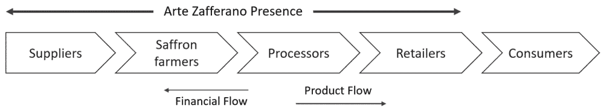

# 第五章

# 区块链在藏红花行业中的应用：

Arte Zafferano 案例

+   Riccardo Zugaro

    意大利路易斯大学

+   Pietro De Giovanni

    

    意大利路易斯大学

摘要

在技术驱动的全球化的时代，供应链正在变得越来越复杂，涉及的大洲和利益相关者越来越多。复杂的供应链需要复杂的管理系统。供应链管理的数字化和信息技术在同一时期得到了进步，但是一个更加技术化和互联的社会需要更多的信息，揭示了当今可用的供应链管理工具的局限性，尽管这些工具提供了效率、自动化和组织能力，但在提供透明度方面却相当匮乏。消费者对气候变暖、人权或假冒伪劣等敏感问题的意识正在提高。

引言

在技术驱动的全球化的时代，供应链正在变得越来越复杂，涉及的大洲和利益相关者越来越多（Abeyratne 等人，2016）。全球供应链需要复杂的管理系统，这需要更多的信息来保证透明度（Abeyratne 等人，2016）。消费者对气候变暖、人权和假冒伪劣等敏感问题的意识正在提高。尽管最终用户期望透明度，但公司本身对供应链的可见性非常有限（Deloitte，2018）。现代企业资源计划（ERP）工具无法满足当前供应链管理的要求，并且基于可用信息的质量和数量（Li 等人，2006）。由于数据存储的集中化，输入和过程的信息非常不可靠，这可以轻易被访问和操纵，留下欺诈和伪造的空间；所有这些问题都导致输出质量降低，通常客户满意度也降低（De Giovanni，2020a；Eskildsen 等人，2007）。

目前解决这些问题的一个重要方案就是区块链。区块链是一种分布式、去中心化且公开的账本技术。因为信息块是按时间顺序链接的，所以要更改存储的数据就需要重新计算所有先前的区块（Gurtu 等人，2019 年）。此外，由于数据是分布式存储的，任何篡改尝试都必须在所有网络机器上进行，使得存储在区块链上的数据实际上是不可变的（De Giovanni，2020b）。这项技术并非新颖，因为它自 1991 年以来一直存在。然而，关注点主要集中在加密货币和金融交易上（Gurtu 等人，2019 年）。只有相对较近的文献和实践例子开始将防篡改的分布式账本概念应用于供应链，以取代不透明的集中式供应链管理（SCM）工具。这项技术的利益是相关的，世界各地的政府已经开始起草政策，以确定实施议程（Suominen 等人，2018 年）。虽然区块链对于大型供应链改进当前的 ERP 解决方案可能是一个重要的步骤，但它可能代表了小型企业数字化落后（Buratto 等人，2019 年）和经常受到不透明供应链打击（Zimmerman，2016 年）的一个突破。

中小企业（SMEs）是意大利经济的重要支柱，为非金融企业增加了大约 66%的价值（世界银行，2019 年）。SMEs 中最大数量的企业活跃在食品行业，这也是按国内生产总值（GDP）贡献来看的主要行业。尽管大量学术研究和对大型供应链或银行业务中区块链应用的先驱示例，但对小型企业实施这项技术的研究仍然非常理论化。因此，本章旨在通过回答以下研究问题，以实际方式对区块链作为 SCM 工具在 SMEs 上的实施进行讨论：

+   1. 区块链如何才能被中小企业实施？

+   2. 区块链能否为中小企业提供所需级别的透明度，并在供应链上提供可追溯性？

我们研究了一个藏红花行业的案例研究，以跟踪区块链技术的成本和效益，并了解其实施在经济和操作上是否可行。这个案例基于一个受到行业欺诈和假冒影响的小型意大利公司。事实上，藏红花是世界上成本最高的食物产品，价格可以达到每克 30 欧元。它位列十大最易被假冒的意大利食品产品之列。

该公司供应链流程的研究旨在了解区块链如何影响每个活动。我们的研究发现，区块链可以通过改善供应商选择流程；借助物联网（IoT）传感器增加产量，使企业能够接触更大的零售商；最终，为最终消费者提供透明度，从而对供应链管理做出显著贡献。尽管有好处，但成本分析突显，在增加生产和提高价格方面获得的直接经济优势无法解释这一投资。研究表明，对于大型企业所使用的那种实施框架，网络是由焦点公司建立并向供应商提出的，这种框架不适用于中小企业。由于内部资源不足，像本文研究的意大利和欧洲中小企业无法承担这种技术的实施。区块链的成熟早期阶段意味着标准化程度不足，现有的现成解决方案还不能完全利用区块链赋能的供应链的好处。澳大利亚政府提出的一个想法是开发一个独特的区块链基础设施，国内企业可以连接到这个基础设施，交换商品，完成交易，同时实现公司间的信息共享。政府、初创企业和大型科技公司都在朝这个方向发展。然而，这种思路仍然需要深入研究。未来研究应通过使用区块链促进小企业的数字化和透明度，探索中心区块链网络的组织可行性，以及创建能够满足一个国家所有活跃 SMEs 的不同业务模式的解决方案。

在接下来的部分中，首先回顾现有文献，定义相关概念并了解区块链技术目前如何在公司中实施。其次，探讨意大利背景下中小企业数字化的意义。随后，一个案例研究将探讨区块链技术在生产藏红花的意大利农业 SME 中的实施，旨在回答研究问题并积极参与讨论。

文献综述

SCM 是一个非常广泛的概念。数字化可以在供应链的许多层面采取不同的形式，每项技术都旨在提高供应链的效率（De Giovanni, 2021a）。从 3D 打印到射频识别（RFID）和云计算，现代供应链管理中采用的技术众多（Agrawal 等，2018）。为了本章的目的，我们重点关注供应链管理系统和软件，这些系统和软件收集和管理来自供应链中所有不同设备和技术的数据，以便跨合作伙伴公司收集、处理和共享信息，这与区块链技术对供应链管理带来的好处相兼容。这样的系统被称为企业资源计划（ERP）软件，是通过一系列应用程序跟踪资源、交易和合同的管理软件（www.sap.com）。这些解决方案已经使供应链管理流程的数字化成为可能，包括需求预测、库存跟踪和管理、订单放置和履行，以及在一定程度上合同管理（De Giovanni, 2016）。像 SAP 这样的系统很好地管理了供应链管理的组织方面，以最大化供应链效率。然而，透明度和可追溯性问题仍然存在。根据德勤完成的一项调查，接受调查的 65%的采购经理表示，他们无法看到一级供应商之外的情况（Deloitte, 2018）。在像 SAP 这样的系统中，接收产品信息的公司必须要么信任其合作伙伴签订的合同，要么进行二次分析，这常常导致由于双重检查或对收到的产品和服务特性产生争议而损失效率。

区块链技术作为一种数字供应链解决方案确实很有吸引力。许多关于这项技术的研究和实验已经完成，如今它开始被集成到 IBM 等公司现有的企业资源计划（ERP）软件中（www.ibm.com），同时也被集成到完全新开发的解决方案中。供应链管理是一个广泛的课题，它涉及供应链许多不同领域的管理。区块链必须在每个层面得到整合，以满足每个部门的组织需求（Van Hoek, 2019）。同时，区块链系统也必须在整个供应链中得到整合，以便最终链端的客户和同行能够访问有关供应商、物流等方面的信息，反之亦然。截至目前，关于在供应链中实施区块链的研究仍处于初级阶段，尽管围绕这项技术的热潮，但研究仍 mostly 停留在理论层面（Dobrovnik 等，2018）。虽然现有出版物将其描述为一项突破，但这些理论仍基于较少的实施案例，可能会造成不可靠的预期。

非金融领域区块链采用者通常将区块链作为其 ERP 软件的后端来实现额外的安全性和有效性（Oracle.com）。具有强大供应商议价能力的的大型公司倾向于为其自身流程实施系统，然后要求供应商参与网络（Hyperledger.org）。根据德勤开发的一个场景，一个现成的区块链增强供应链目前每年的成本估计超过 20 万美元，突显了这项技术在当前阶段的昂贵程度（Deloitte，2019 年）。

大型信息技术（IT）公司和不同的学术研究提出了不同的区块链增强供应链管理（SCM）设计，但没有公认的最优设计；如前所述，该主题的研究仍处于早期阶段（Wang 等人，2019 年）。尽管如此，存在重要的异质性，不同的模型和设计有以下共同要素：

共享平台

实施工作从创建一个独特的平台（数据库）开始，每个节点都可以访问、查看和添加任何信息（Lin 等人，2018 年）。这个去中心化的平台应该在供应链的每个阶段都可用，并且对于参与其中的各家公司也是如此，以最大化整合度（Duhaylongsod 和 De Giovanni，2019 年）。任何利益相关者都应该能够访问与产品或交易有关的各种信息。尽管这种透明且集成的供应链模型在效率和质量方面可能具有优势，但管理者似乎对与合作伙伴分享战略信息持怀疑态度（De Giovanni，2021b 年）。

这些障碍最有可能通过区块链合作伙伴选择来缓解（Wang 等人，2019 年）。如今，许多公司有一个他们更信任且更紧密集成的供应商群。像 Luxottica 这样的公司进行持续的供应商评估，以最大化对供应链合作伙伴的信任（Luxottica，2020 年）。由于区块链系统的信息披露，各方之间的监控可能变得更加容易，这将深刻影响供应链合作伙伴之间的关系，可能需要建立一个新的治理模型来管理供应链（Wang 等人，2019 年）。

智能合约的使用

定义供应链中任何两个当事人之间关系的关键要素是合同（De Giovanni, 2019a）。合同建立了双方之间的信任。任何交易和资源交换都必须按照预先同意和预先定义的条款进行。在区块链启用的供应链管理（SCM）中，这样的合同将被转换为智能合同。智能合同不过是现实生活中合同的数字化“脚本版本”（Christidis 等人，2016 年）。就像在现实世界中一样，它们确定了双方之间的关系。然而，智能合同也充当中间人；它们根据预先定义的合同条款控制任何交易的结果，无论是货币交易还是任何商品和服务的交换。任何供应链合同的条款都可以转换为“if 语句”，这意味着如果交易双方的条件被侵犯，智能合同将不会批准交易的正常输出，从而阻碍它（Christidis 等人，2016 年）。智能合同能够在一项争议或损害发生之前就避免它们，并且基于运营和经济条款（Preeker & De Giovanni, 2018）。除非所有定义的条件都被满足，否则在区块链上交易双方之间无法执行交易。

智能合同的结果总是可预测的，因为如果任何参数不被尊重，合同就会拒绝交易；相比之下，它接受并确认交易（Christidis 等人，2016 年）。智能合同在执行时刻签署；也就是说，如果条件未满足，则合同不发生（De Giovanni, 2019b）。

记录真实信息：使用传感器和 RFID 芯片

区块链（以及智能合约）的好处只有在使用传感器和设备时才能实现，这些设备可以监控并把供应链中流程或产品状态的任何信息写入账本（Christidis 等人，2016 年）。当处理物联网设备和区块链时，一个关键词是 RFID 芯片。RFID 是薄型的磁性标签，与信用卡中的标签类似，可以存储信息。已经在 RFID 技术的实施以提高供应链可追溯性方面进行了大量研究。RFID 芯片可以存储比简单条形码更多的信息。它们可以是只读或可读写的，这意味着信息可以在产品经历制造过程时添加到 RFID 标签上（Angeles，2005 年）。此外，芯片的磁性特性使得标签可以在更远的距离被识别，无需光学读取器和手动扫描。RFID 标签已经在汽车行业得到广泛应用。福特和雪佛兰都使用 RFID 追踪发动机组件在整个制造过程（Swedberg，2015 年）。他们可以通过 RFID 门（读取器）监控原材料或成品到达制造工厂或零售店（这使得自动库存管理以及跟踪时间变得可能，尤其是对于像食品这样容易变质的商品。RFID 还可以确认订单并将其完成情况告知智能合约。可以立即知道产品的购买和仓库剩余库存，并自动向供应商下补货订单，从而实现更精简的供应链（Angeles，2005 年；De Giovanni 和 Cariola，2020 年）。

除了 RFID 之外，其他设备如传感器对于确保供应链智能合同中规定的条款和条件至关重要。传感器测量温度、湿度、重量等特性，或例如某些化学物质的存在，至关重要，特别是在农业行业，以确保最终消费者能够获得最高水平和安全性（Kamilaris 等人，2020 年；Zeto，2018 年）。例如，肉类容器中的温度传感器与区块链相连，可以确保收件人知道在运输过程中温度从未超过 4°C（De Giovanni，2020b）。如今，有各种各样的传感器可供选择，一些直接连接到互联网，因此能够直接与区块链通信，如长期演进无线电；其他则记录数据，然后在连接建立后传输（Christidis 等人，2016 年）。实施物联网的主要障碍是经济性质的。根据所使用的技术水平，RFID 芯片和传感器都可以对公司构成重大投资（Angeles，2005 年，Tian 等人，2016 年）。这种设备的投资与需要追踪商品的价值和供应链问题可能造成的损害程度成比例。只读 RFID 芯片已在零售店广泛使用，成本非常低。如今一些商店采用它们作为条形码的替代品，因为结账时间更快，且更容易识别盗窃（Wright，2019 年）。表 1 总结了区块链技术的促进因素以及可能减缓区块链采用的障碍。

表 1. 区块链实施的促进因素和障碍

| 区块链促进因素 | 区块链障碍 |
| --- | --- |
| BE1 – 透明度 任何产品、过程或交易的信息都被存储，并且任何利益相关者都可以在任何时间进行审计。这使得合作伙伴之间的信任和声誉得到增强。 | BB 1 – 实施成本 建立区块链网络由于现有技术的稀缺和需要熟练开发人员的要求而构成重大投资。 |
| BE2 – 可追溯性 可靠的信息可以追溯到过去，使得任何产品的来源或供应链内任何活动的性质都可以被评估。 | BB 2 – 在供应链中推广 BT 面向区块链的供应链只有当供应链的利益相关者连接并通过它共享信息时才具有益处。说服合作伙伴采用该系统可能会遇到各种困难。 |
| BE2 – 不可篡改性 存储的信息无法被任何人篡改。数据的、证书的或者交易的不可能被伪造。 | BB 3 – 公开战略信息 采用区块链意味着使所有供应链交易和合同公开。这是管理层对实施这项技术的主要怀疑来源之一（Van Hoek, 2019）。 |
| BE3 – 去中心化 账本分布在众多设备上降低了由于损坏的数据库或黑客攻击而丢失数据的风险。 |  |
| BE4 – 降低交易成本和风险 区块链技术的高安全性确保了交易的安全，减少了中介的需求。此外，智能合约的使用降低了交易风险和合作伙伴间可能的冲突。 |  |

来源：Kamble (2018) 和 Kamilaris (2020)

研究方法论

本章目的在于，选取了一家小型、家族所有的农业公司，该公司活跃在藏红花行业，以回答我们的研究问题并调查区块链技术的实施情况。研究的公司是 Arte Zafferano，位于意大利拉齐奥地区的下部。

藏红花的供应链始于球茎供应商。这类公司种植球茎，然后卖给藏红花农民。意大利的藏红花行业非常分散，有许多小型或微型公司，每个公司生产少量产品。加工者购买和汇总相似的藏红花质量，然后进行包装或进一步加工成其他产品，再转交给分销商。藏红花农业行业包括两种不同类型的组织：一种生产藏红花，一种既生产藏红花也生产球茎，也作为球茎供应商。Arte Zafferano 是这类公司中的第二组，它在藏红花和球茎的销售方面都活跃。藏红花通常在夏季，大约在 8 月种植，并在秋季收获，通常在 10 月。Arte Zafferano 销售藏红花花蕾以及加工产品，如藏红花蜂蜜和藏红花意面，这依赖于外部加工者。下面的图表显示了 Arte Zafferano 的供应链。

| 图 1. 藏红花生产供应链 |
| --- |
|  |

创建区块链兼容环境

区块链支持的供应链的基础是创建或存在一个区块链平台。可以通过现有的 IT 服务提供商，如 IBM 或微软 Azure，创建定制平台。这些接口复杂，需要 IT 专业人员的知识，这大大影响了实施的总体成本。IT 专业人员的服务是一个持续的要求，因为除了初始实施，系统将需要起草新的智能合约、更换 IoT 传感器，并进行系统维护。尽管已经存在更便宜、现成的解决方案，但探索的产品定制程度低，部分解决方案通常仅限于智能合约交易方面。区块链平台直接与 IoT 传感器相连，在下一段中描述，按时间顺序记录数据。存储在网络上的任何信息都将对任何人 readily available，包括最终消费者。数据可通过经过身份验证的网页端口访问。存储的信息可以通过快速响应(QR)码追溯到单个藏红花或球茎批量，在个别藏红花包装的情况下，并通过 RFID 芯片轻松访问球茎箱，以进一步提高球茎的可追溯性。关于智能合约的使用，根据意大利法律要求，区块链上执行的任何交易或智能合约必须符合数字签名标准，以验证协议的有效签署。

区块链的真正优势只有在供应链各利益相关者采纳时才能显现。供应商、商业客户和认证机构应参与区块链网络，通过他们活动产生的数据或直接在区块链上发布关于产品的质量证书，以避免可能的伪造。在对 Arte Zafferano 的供应商进行的采访中，所有者表现出了对更大的供应链可追溯性的兴趣，但同时，他们不会考虑采用由 Arte Zafferano 开发的平台；相反，他们认为技术应该由一个联盟开发，然后由参与者采用，以最大化合作。

Arte Zafferano 是一家小公司，没有足够的议价能力强迫其供应商或商业客户采用区块链平台。因此，为了回答第一个研究问题，中小企业可能无法通过开发定制解决方案来实施区块链技术，因为很难将供应链利益相关者纳入平台。主要考虑的是，实施应由一个中小企业群体提出，而该群体规模越大，可追溯性越强。

IoT 和区块链：更透明、更高效的过程

尽管区块链网络的创建可能超出了中小企业的能力范围，但通过理解技术能够改善哪些活动，将技术应用于供应链流程中仍在推进。藏红花和球茎的生产需要非常透明的过程，以便区分真正的意大利藏红花和球茎与质量较低和假冒伪劣产品。

球茎

藏红花植物（Crocus Sativus）不仅生产出含有珍贵花柱的鲜花，每株植物还能产出大约三个球茎。这些部分都卖给需要球茎的其他农业公司。在藏红花行业中，球茎的特征至关重要，其价格也深受这些特征影响。大球茎总是比小球茎更受欢迎。此外，球茎的产地赋予了藏红花其真实性。从荷兰购买的球茎在意大利种植，并不能生产出意大利藏红花。为了被认为是意大利的，球茎必须在意大利土壤中至少生长两年。Arte Zafferano 指出，这种真实性通常需要认证；尽管如此，球茎市场仍充斥着许多没有认证的“意大利球茎”。球茎的销售是公司业务的重要方面，占年收入的约 40%。一个地区机构要求藏红花苗圃公司记录收获、销售或购买的球茎数量，以便追踪球茎的位置并认证其产地。这样的球茎登记是纸质记录，且需要手工编辑。机构在年底核实这些数字。生产顶级意大利藏红花的农民需要这样的认证，而目前使用的追踪原产地的方式并不可靠。此外，球茎的收获时间和种植时间相差四个月，在这期间球茎必须储存，然后才能交付给客户。藏红花植物的产量与储存条件密切相关。球茎在土壤外储存的时间不宜超过 90-150 天，否则可能会干枯。此外，为了避免可能的感染，它必须储存在干燥的地方。最后，仓储温度至关重要。根据 Arte Zafferano 的说法，储存在 25°C 至 27°C 之间的球茎产量会更高。目前，这样的储存特性无法被企业客户（农民）验证。

区块链可以使记录保存在分布式账本上的球茎目录直接对购买者可用，一旦验证了数字证书，就可以直接在区块链上进行交易。这不仅提高了效率，还增加了透明度，并消除了中间商的成本。通过这种方式，Arte Zafferano 可以确保其产品的质量和来源得到验证，从而为消费者提供保证。

藏红花

有多种因素和过程会影响藏红花的最终有机特性和产量决定因素。在种植球茎之前的土壤准备起着基础性的作用。土壤营养、低温和中性的 pH 都是藏红花生长的基本特性。干旱期可能会影响收成，正如 2017 年对 Arte Zafferano 所发生的那样。电化学传感器可以检测土壤 pH 和某些化学物质，而埋设的湿度传感器可以检测田地不同区域的土壤湿度。这确保在种植球茎之前就存在最优条件，并允许 Arte Zafferano 在产量受损之前进行干预。将此类传感器集成到区块链网络中，公司可以存储土壤分析数据，并使其对整个供应链和客户都可见——最重要的是——确保种植的正确性。一旦种植完成，相同的传感器可以确保正确监测活动，注意到是否需要灌溉。

收获后，在出售给其他企业或最终消费者之前，藏红花必须晾干。潮湿的藏红花更重，因此会以牺牲质量为代价产生更多收入。为了出售，藏红花花药中最多可含有 12%的水分。如果干燥过程正确进行，可以增强香料的口感，但更重要的是可以防止产品中产生霉菌。再次，物联网湿度传感器可以记录藏红花花药在整个干燥过程及其后的湿度，以保证买家了解干燥的自然特性。此外，今天 Arte Zafferano 在两个相距较近的不同地块上种植藏红花。计划扩大到第三和第四个地块，但受限于可用人员，这些人员不能到场监测藏红花的生长。一套土壤监测物联网传感器可以限制公司扩大规模的必要性，因为可以远程跟踪地形和地块条件，只有在最佳农业种植条件恶化时才需要干预。

从经济角度看，区块链的实施不会导致价格上涨，因为 Arte Zafferano 的藏红花花药已经售出了这个质量范围的最高价。另一方面，通过物联网传感器进行土壤监测将提高年平均产量，而在 2017 年这是难以实现的，当时进行深入的土壤分析本可以表明需要灌溉。据 Arte Zafferano 称，由于干旱或土壤条件不佳，低产年份统计上每隔五年会出现一次。随着时间的推移，这几乎意味着年产量平均增加 10%。

加工与零售

在藏红花供应链的加工和零售层，Arte Zafferano 依靠外部组织生产藏红花口味的产品，如蜂蜜和面条。由于 Arte Zafferano 的业务只专注于有机产品，它根据产品的认证有机性质选择供应商。如今，Arte Zafferano 依赖两家独家供应商：一家供应蜂蜜，一家供应面条。由于业务规模，Arte Zafferano 手动检查其供应商流程，并完全依赖当地企业。供应商公司参与区块链网络将允许 Arte Zafferano 从远程监控流程。其次，远程检查可以让 Arte Zafferano 超越地理限制，扩大供应商选择范围，增加其议价能力，并可能接触到更高质量的供应商。最后，Arte Zafferano 将能够分享零售数据，实现无需手动下单的自动库存补充，避免产品售罄。在零售方面，通过简单的二维码甚至 RFID 芯片，藏红花消费者可以访问一个网络门户，查看他们购买和消费的藏红花整个供应链过程，保证所有投入和藏红花的质量和来源。这将允许区分由 Arte Zafferano 生产的优质藏红花，并阻止消费者购买低质量的藏红花或面临假冒产品。

数字化关系

从物联网传感器收集的数据和存储在区块链上的信息为任何供应链利益相关者提供了流程的透明度。为了充分利用这些大量信息流的好处，供应链必须实施最重要的一项：智能合约。Arte Zafferano 应当数字化与供应商和客户的所有关系。在藏红花的世界里，质量和来源是至关重要的特征，任何贸易合同都提供了定义产品质量的条款。通过智能合约数字化此类合同意味着任何两个合作伙伴之间的任何交换都必须得到所有收集和存储在区块链上的信息提供的质量保证。Arte Zafferano 与面条供应商之间的智能合约将完成交易，其中有机特性得到验证，因此认证机构在区块链网络上发布有机证书。智能合约允许 Arte Zafferano 检查外部供应商，无需物理检查，赋予其他公司（只要它们通过区块链可达）访问权限，增加议价能力，并有机会改进其产品。

阿特·扎发罗诺与它的客户间也可能存在同样的关系。大型零售商从不同的小型生产商那里购买藏红花，然后汇总、包装并销售这些柱头。这样的零售商会设定一个藏红花体积的最小阈值，因为从每个单一零售商那里购买少于 1 公斤的藏红花意味着要对大量的样本进行质量检查。通过区块链，阿特·扎发罗诺将在不可篡改的账本上记录下生产过程和获得的认证。通过智能合约，大型零售商可以无需进行单独检查就增加对小型生产商的信任。这将使阿特·扎发罗诺能够不达到最小阈值就批发销售藏红花。实际上，直接向终端消费者销售对阿特·扎发罗诺来说今天是一种负担，因为他们必须向个体消费者包装和销售产品，销售成本很高。

成本与收益

表 2 总结了区块链支持的供应链如何改进阿特·扎发罗诺的过程。

表 2. 区块链实施的促进因素

| 活动 | 目前 | 区块链支持的供应链 | 区块链促进因素与阻碍因素 |
| --- | --- | --- | --- |

采购策略 | • 采购策略限于对本地供应商的物理检查 • 依赖可验证的认证 | • 得益于智能合约的使用，能够访问更广泛的值得信赖的供应商 • 提高了谈判能力

• 对供应商过程的持续审计

• 改进的供应商选择过程 | 促进因素：BE1, BE4 阻碍因素：BB2, BB3 |

| 生产 | • 每年土壤准备的方式相似 • 只在农场附近的田野里种植 | • 改进土壤监测后产量增加 • 无需扩大规模即可在多个田野上扩张 | 促进因素：BE1, BE2 阻碍因素：BB1, BB3 |
| --- | --- | --- | --- |
| 库存管理 | • 手动补充 | 根据销售体积，自动补充加工产品库存 | 促进因素：BE4 阻碍因素：BE2 |
| 销售策略 | • 严格的企业对消费者零售 • 由于增强了信任和信息，能够接触更大的企业（企业对企业）客户 | 促进因素：BE1, BE2, BE4 阻碍因素：BB1, BB2 |
| 客户关系管理 | • 无法保证藏红花的来源或有机种植 • 无法从标签信息之外区分假冒或低质量产品 | • 消费者能够探索和追踪产品的供应链 | 促进因素：BE1, BE2, BE4 阻碍因素：BB1 |

上面提到的许多好处都是严格组织性的，很难用金钱来量化。然而，已经识别出某些直接的经济效益。由于有可能保证最高品质的灯泡，灯泡价格的潜在增加可以直接影响收入。此外，通过改进土壤准备提高番红花产量，使 Arte Zafferano 能够利用物联网设备在远离农场的场地扩大业务。

对于成本分析，实施一个定制的区块链网络需要雇佣一名自由职业的信息技术工程师来开发和维护平台，持续数年。与一名信息技术工程师交谈后，使用目前可用的工具构建区块链网络的报价为每年 80,000€。此外，区块链需要巨大的计算能力分布在不同机器上（分布式账本）；这些服务可以从 IBM 或微软等不同公司购买，成本以计算小时来估算。与 Arte Zafferano 相仿的公司每个月需要 750 个计算小时。实施和拥有一个区块链网络对于 Arte Zafferano 这样规模的公司来说是不可想象的。实际上，这对于大多数欧洲中小企业来说也是遥不可及的，因为它们的数字化预算只覆盖了所需年投资的约 20%。

表 3 总结了区块链在短期时间线内（自实施起 1-3 年）对 Arte Zafferano 收入的直接影响。

表 3.­

| 通过提高精度农业改善土壤准备，公司可以避免因干旱和其他原因可能危及收成的困难年份。考虑到平均收获量增加 10% | 960€ |
| --- | --- |
| 通过物联网和区块链对场域扩展 E 进行监控，使公司能够在远离农场的场地扩大业务，而不需要扩大运营规模 | 5.700€ |
| 通过物联网和区块链监控灯泡价格 E，使公司能够在远离农场的场地扩大业务，而不需要扩大运营规模。灯泡单价可以从 0.30 增加到 0.35 | 2.000€ |
| 年收入的直接增加 | 8.660€ |

下面的表格总结了为 20 家合作伙伴公司开发区块链网络的年成本估计。

表 4. 区块链实施成本

| 平台托管费用 | 1.080€ |
| --- | --- |
| 信息技术工程师 | 80.000€ |
| 物联网设备 | 1.000€ |
| 年成本的直接增加 | 82.080€ |

上述表格的数据表明，实施区块链技术无疑是一种改进供应链管理过程和透明度的手段，使 Arte Zafferano 能够区分其产品，并可能获得竞争优势。区块链在提高生产效率以及改善组织能力方面提供了增加效率的手段。尽管有这些好处，但对于小公司来说，实施起来仍然具有挑战性。如果与用于数字化的平均预算相比，中小企业供应链的区块链赋能无法单独发生，因为技术的成本仍然很高。

技术的早期阶段意味着市场上可用的解决方案标准化程度较低。所需的自定义和技术的复杂性需要昂贵的 IT 专业人士的指导，以构建区块链成员之间的联系，物联网传感器以及智能合约的创建。成本效益分析只考虑了焦点公司 Arte Zafferano 的经济优势，而没有考虑到供应链其他组织部分的好处。

某些公司可能会从技术的实施中受益更多，以至于解释了财务投资。除了经济障碍之外，实施和技术的实用性还受到利益相关者参与意愿的限制。只有一个参与者的区块链将失去大部分好处。在案例研究中，Arte Zafferano 的合作伙伴否认了参与网络建设的兴趣，除非这是一个广泛的做法，即他们的供应链合作伙伴也采用它。因此，实施不应该从单一公司开始，而应该由一组合作伙伴的 SMEs 来规划。

尽管对其中一个研究问题给予了积极回答，案例研究仍表明，对于小型企业来说，由于实施此类解决方案的当前成本，投资于区块链作为供应链管理的手段可能经济上并不可行。此外，大型企业所采用的实施框架目前无法适用于许多中小型企业。相反，分析出的众多好处和该技术所做的贡献不容忽视。主要成本在于构建实际的区块链网络，企业作为供应链的一部分，通过该网络进行交易和分享信息。这意味着对于众多企业来说，所需的区块链是一个，因此核心投资完全有可能由参与者共享。 institutional bodies or consortiums 的作用就是推动此类系统的实施。分析的区块链政策正是旨在构建一个中心区块链网络，所有中小型企业都可以订阅并因此相互交易。尽管最完整的思想在澳大利亚国家区块链中，但该项目仍远离实现（澳大利亚政府，2019）。像 We.Trade 这样的解决方案与 SMEs 目前可能需要的相比，也为时尚早。未来研究应致力于由机构提供的一体化区块链网络，类似于已为统一公民门户如意大利的 Sistema Pubblico di Identità Digitale (SPID) 所做的工作，这是一个易于使用、标准化的通用平台。如今，意大利中小型企业在数字化方面落后，随着创新的推进，这种影响在放大。对一个突破性解决方案的大量投资可能代表着意大利中小型企业在全球市场上提高竞争力的捷径，同时保护“Made in Italy”标签，恢复部分经济损失。未来研究的这种方向意味着更广泛的研究，这些研究应从技术、经济和组织角度出发，理解是否单个 SMEs 的需求可以通过单一的区块链基础设施满足。

尽管实施起来不可行，但考虑到常见的实施框架，这项技术能为中小企业带来的优势是显著的。区块链可以通过提供其活动的完全透明度以及供应链的完全可追溯性，增强消费者对小型企业的信任。区块链可能转化为一个重要的竞争优势，但更重要的是，它将使可追溯的产品与低质量或假冒产品区分开来。技术的广泛采用可能会使意大利经济恢复由假冒和其他不公平做法造成的部分损害。为此，必须进一步研究开发一个区块链基础设施，以便个体中小企业能够连接到该基础设施，追踪其活动并在彼此之间进行贸易，以创建一个独特的生态系统，确保意大利产品在全球范围内得到保证。

参考文献

Abeyratne, S. A., & Monfared, R. P. (2016)。使用分布式账本准备制造供应链的区块链。国际研究与技术杂志，5(9)，1-10。doi:10.15623/ijret.2016.0509001

AgrawalP.NarainR. (2018). 数字供应链管理：概述。IOP 会议系列。

Angeles, R. (2005)。RFID 技术：供应链应用及实施问题。信息系统管理，35(2)，60-64。doi:10.1201/1078/44912.22.1.20051201/85739.7

澳大利亚政府。(2020)。国家区块链路线图。作者。

Buratto, A., Cesaretto, R., & De Giovanni, P. (2019). 在动态供应链中，寄售合同、合作计划和价格折扣机制。国际生产经济学杂志，218，72-82。doi:10.1016/j.ijpe.2019.04.027

Christidis, K., & Devetsikiotis, M. (2016)。区块链与智能合约在物联网中的应用。IEEE 访问：实用创新，开放解决方案，4，2292-2303。doi:10.1109/ACCESS.2016.2566339

Coldiretti。(2020 年 9 月 2 日)。Covid：食物成为国家的第一个财富，价值 538 亿。检索自 Coldiretti: https://www.coldiretti.it/economia/covid-il-cibo-diventa-la-prima-ricchezza-del-paese-vale-538-mln

De Giovanni, P. (2016). 分销渠道中的协调：关于激励性质的决定和定价的份额依赖性。运筹与管理杂志，67(8)，1034-1049。doi:10.1057/jors.2015.118

De Giovanni, P. (2019a). 通过动态库存和智能合约实现数字供应链。数学，7(12)，1235。doi:10.3390/math7121235

De Giovanni, P. (2019b). 通过区块链实现生态数字供应链。国际商业与管理研究杂志，6(2)。

De Giovanni, P. (2020a). 区块链与智能合约在供应链管理中的应用：一个博弈论模型。国际生产经济学杂志，228。

De Giovanni, P. (2020b). 具有缺陷产品和商誉损害的最优控制模型。操作研究年鉴，289(2)，419-430。DOI:10.1007/s10479-019-03176-4

De Giovanni, P. (2021). 智能合约与区块链在供应链质量管理中的应用，在数字供应链中的动态质量模型与游戏。Springer Nature。

De Giovanni, P. (2021). 具有供应商管理库存、协调和环境性能的智能供应链。欧洲运筹研究杂志，292(2)，515-531。DOI:10.1016/j.ejor.2020.10.049

De Giovanni, P., & Cariola, A. (2020). 通过工业 4.0 技术、精益实践和绿色供应链实现流程创新。运输经济学研究，100869。DOI:10.1016/j.retrec.2020.100869

De Giovanni, P., & Ramani, V. (2019). 产品 cannibalization 和服务策略的影响。运筹研究杂志，1-17。

Deloitte. (2018). 领导力：推动创新和产生影响。德勤。

Duhaylongsod, J. B., & De Giovanni, P. (2019). 创新策略对供应商集成与运营绩效关系的影响。国际物理分销与物流管理杂志，49(2)，156-177。DOI:10.1108/IJPDLM-09-2017-0269

Eskildsen, J., & Kristensen, K. (2007). 客户满意度——透明度的角色。全面质量管理与商业卓越，18(1-2)，39-47。DOI:10.1080/14783360601043047

European Commission. (2019). 2019 EBA 意大利事实手册。欧洲委员会。

European Commission. (2020). DESI 2020。作者。

Francisco, K., & Swanson, D. (2017). 供应链赤身裸体：区块链在供应链透明度方面的技术采用。美国北佛罗里达大学市场营销与物流系。

Gurtu, A., & Johny, J. (2019). 区块链技术在供应链管理中的潜力：文献综述。国际物理分销与物流管理杂志，49(9)，881-900。DOI:10.1108/IJPDLM-11-2018-0371

HackiusN.PetersenM. (2017). 物流和供应链中的区块链：诡计还是馅饼？汉堡国际物流会议。

Hoek, R. (2019). 探索供应链中区块链的实施。国际操作与生产管理杂志，39(6/7/8)，829-859。DOI:10.1108/IJOPM-01-2019-0022

Hoek, R. v. (2020). 破解供应链——来自高管研讨会的区块链在供应链中的发现。供应链管理，255-261。

Iasiniti, M., & Lakhani, K. R. (2017). 关于区块链的真实情况。哈佛商业评论。

Kamble, S. S., Gunasekaran, A., & Sharma, R. (2020). 模型化农业供应链中的区块链启用追溯性。信息管理国际期刊，52，101967。DOI:10.1016/j.ijinfomgt.2019.05.023

卡米拉里斯, A.，Fonti, A.，& Prenafeta-Boldύ, F. X.（2019）。农业和食品供应链中区块链技术的兴起。食品科学和技术趋势，91，640-652。doi:10.1016/j.tifs.2019.07.034

科图拉, M.（2020 年 3 月 11 日）。在数字世界中供应链真的可以透明吗？取自数字主义者杂志：https://www.digitalistmag.com/digital-supply-networks/2020/03/11/can-supply-chain-be-really-transparent-in-digital-world-06202976/

李, S.，&林, B.（2006）。在供应链管理中获取信息共享和信息质量。决策支持系统，42（3），1641-1656。doi:10.1016/j.dss.2006.02.011

林

玛奎拉, V.，赵, M.，布卢贾, C.，韩, X.，内利, A.，&阿尔博雷斯, P.（2019）。区块链驱动的客户。国际运作与生产管理杂志，39（6-8），993-1022。

门泽尔, J. T.，德威特, W.，基伯勒, J. S.，敏, S.，尼克斯, N. W.，史密斯, C. D.，扎查里亚, Z. G.（2001）。定义供应链管理。商业物流杂志，22（2），1-25。doi:10.1002/j.2158-1592.2001.tb00001.x

甲骨文公司。（2019 年 2 月 28 日）。甲骨文认证意大利原产地。取自甲骨文：https://www.oracle.com/it/customers/certified-origins-1-blockchain-story.html

佩罗纳, M.，&米拉格利奥塔, G.（2002）。复杂性管理与供应链绩效评估。现场研究和概念性框架。国际生产经济学杂志，103-115。

普雷克ер, T.，&德 Giovanni, P.（2018）。通过合同协调与高科技供应商的创新项目。研究政策，47（6），1161-1172。doi:10.1016/j.respol.2018.04.003

在宏观经济阴霾中追求数字未来。（2019 年 1 月 18 日）。取自德勤：https://www2.deloitte.com/us/en/insights/focus/industry-4-0/italy-4-0-digital-future-technology.html

夸尔哈斯。（2020 年 1 月 28 日）。区块链在藏红花供应链中的应用：防止世界上最昂贵香料的欺诈行为。取自 Quillhash：https://blog.quillhash.com/2020/01/28/blockchain-in-supply-of-saffron-a-prevention-of-frauds-on-the-worlds-most-expensive-spice/

拉多维斯基, Z.（未注明日期）。企业资源计划。加州州立大学。

思爱普（SAP）。（未注明日期）。ERP 是什么？取自 SAP 洞察：https://insights.sap.com/what-is-erp/

苏奥米宁, K.，Chatzky, A.，Reinsch, W.，& Robison, J.（2018）。美国区块链政策应该是什么？CSIS。

斯威德伯格, C.（2015）。福特汽车公司使用 Omni-ID 64 位标签监控发动机生产。RFID 期刊。

田, F.（2016）。基于 RFID 和区块链技术的农产品供应链追溯系统。维也纳经济大学。

世界银行。（2018）。意大利贸易统计。取自世界银行：https://wits.worldbank.org/CountryProfile/en/ITA

Wright, J. (2019, Aug 1). Case Study: Decathlon: getting smart with RFID tags. Retrieved from Internet Retailing: https://internetretailing.net/magazine-articles/magazine-articles/case-study-decathlon-getting-smart-with-rfid-tags

Yli-Huumo, J., Ko, D., Choi, S., Park, S., & Smolander, K. (2016). Where Is Current Research on Blockchain Technology? - A Systematic Review. West Virginia University.

Zimmerman, D. V. (2016). SMEs and digitalisation: The current position, recent developments and challenges . KfW Research.

Zimmermann, V. (2018). SME Digitalisation Report 2018. kWF Research.
