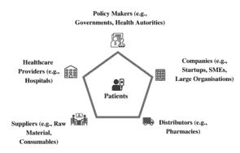
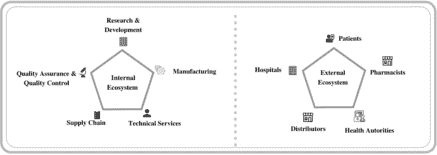
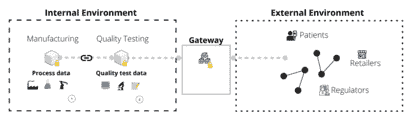
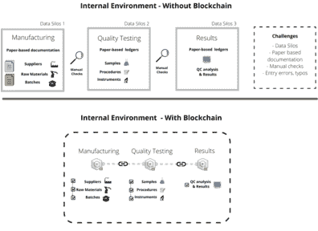

# 第六章

# 生物制药行业中的区块链技术：

产品质量控制的概念模型

+   Tiziano Volpentesta

    意大利路易斯大学

+   Mario Miozza

    意大利路易斯大学

+   Abhijeet Satwekar

    意大利默克塞尔诺斯公司

摘要

生物制药公司和卫生当局持续交换信息，以提供安全有效的治疗方法。双方之间的互动需要透明度以及大量的文档交换，这些文档涉及从开发到制造阶段的过程。当前的过程依赖于纸质文档、笔记本以及点对点的电子数据交换（EDI）来存储数据。因此，在追求避免假冒伪劣产品的内部孤岛结构和药品可追溯性方面，产生了数据完整性的挑战。随着工业 4.0 和区块链技术的发展，作者设想了一个重新设计的 workflow，以帮助 1) 使用去中心化信任管理数据完整性，2) 提高跟踪和追溯能力。因此，生物制药公司可以在保持安全和隐私的同时，以一种更加值得信赖的方式管理数据，进而使外部生态系统具备跟踪和追溯功能，确保治疗产品在到达患者之前具有完全的透明度。

组织背景

自 18 世纪以来，工业革命将生产过程从以手工艺为中心转变为以工业化机器和过程为基础的经济。这导致了国内生产总值（GDP）的指数级增长，每一次工业革命（第一次机械革命、第二次电气革命、第三次电子革命和第四次 cyber-physical 革命）都改变了社会的技术、 socio-economical 和文化层面。总的来说，这些革命提供了产品成本和可及性的提高，以及生活质量的提升。尽管每一次工业革命也带来了未被关注的负面环境和社会后果，但它们通过创新提高了工作效率，减少了对手工和重复劳动的需求，因为这些劳动可以更有效地由机器完成。这导致了知识密集型劳动力的兴起，促使人们向工业化区域迁移（Rafferty，2018）。如今，社会正在经历第四次工业革命，其特征是各种技术的集成和协同作用，如人工智能、物联网、大数据分析、分布式账本技术、机器人学、增强现实、虚拟现实和混合现实、增材制造、量子计算、云计算和边缘计算。这些技术正在赋予制造业重要的生产力发展，改善质量流程，扩大产品组合，理解消费者行为，提高成本效益，并缩短产品上市时间。

第四次工业革命影响了所有行业，生物制药行业也不例外。数字新兴技术正在影响生物制药行业的价值链，从研发到商业化阶段。然而，与零售、金融、媒体和保险等其他行业相比，生物制药行业在数字技术的使用和采用上排名最低（Gopal, Suter-Crazzolara, Toldo, & Eberhardt, 2019），这归因于具有挑战性的监管框架（Cauchon, Oghamian, Hassanpour, & Abernathy, 2019）。

生物制药行业是一个高资产和知识密集型行业，涉及针对特定健康状况的药物发现、开发、制造和分销，以治疗患者的潜在疾病状况并提高他们的生活质量。它主要有两大类：“小分子”和“生物制品或生物制药”。小分子通过化学合成生产，具有明确定义的化学结构。相反，生物制药来源于生物材料，具有复杂且异质性的结构（Declerck, 2012）。这些差异导致小分子和生物制药之间在生产成本上存在很大差距（Makurvet, 2021）。此外，由于复杂性，生物制药药物的生产相比小分子有更严格的监管途径，这影响了药物开发过程和上市时间。实际上，美国食品药品监督管理局（FDA）每年批准的生物制药产品数量少于小分子（Torre & Albericio, 2021）。此外，过去几十年中，生物制药研发的生产率下降导致了成本的增加（Farid, Baron, Stamatis, Nie, & Coffman, 2020; Scannell, Blanckley, Boldon, & Warrington, 2012）。与此同时，治疗药物的开发和制造需要精密仪器、人力资本、科学知识以及对严格监管的遵守，以将创新医疗产品推向市场，满足患者的需求。总的来说，药物开发过程平均需要 12 年（Van Norman, 2016）并涉及高达 20 亿美元的成本（Mullard, 2014）。2019 年，美国食品药品监督管理局批准了 48 种新药（FDA, 2020b），而全球制药公司有超过 16000 种药物处于他们的研发管线中（Pharma R&D Annual Review, 2020）。

生物制药生态系统由一个复杂且动态的网络组成，参与者相互互动，并以围绕患者需求的一组相互关联的参与者为特点，共同目标是提高他们的生活质量。图 1 报告了与本章讨论相关的主要参与者，这些内容在表 1 中进一步详细说明。

| 图 1. 生物制药生态系统 |
| --- |
|  |

在生物制药生态系统中，生物制药公司与卫生当局之间的互动推动了治疗产品的开发、上市和监测。事实上，公司和监管机构之间的合作对于将安全有效的药物推向患者护理、治疗和改善至关重要。卫生当局负责在其立法权限内授权生物制药产品的开发、生产和商业化。例如，美国食品药品监督管理局（FDA），欧盟药品管理局（EMA），意大利药品管理局（AIFA）以及英国药品和保健产品监管局（MHRA）。此外，国际人用药品技术要求协调委员会（ICH）是为了在全球范围内协调指导原则，鉴于现代生物制药公司的全球运营规模。在其他活动中，卫生当局建立了生物制药公司必须遵守的法规，如现行良好生产规范（CGMPs）和联邦法规（CFR），由美国食品药品监督管理局强制执行。

生物制药公司必须遵守这些指导原则和规定，并且每两年对组织进行一次全面的 CGMPs 评估（FDA，2014 年）。对规定的非遵守可能会导致公司声誉受损、患者安全风险、高昂的罚款，或被市场淘汰，具体取决于违规性质。2019 年，CGMPs 的偏差是美国制药产品召回的主要原因（Stericycle，未提供日期）。为确保最高质量标准，生物制药公司严格测试每批生产药物的样本质量，以确认治疗产品符合健康当局在最初药物审批提交中定义的安全性和有效性规格。随着时间的推移，药物生产过程不断演进而超越最低标准，通过创新流程和系统确保设计质量和运营卓越，以符合药物生产过程并确保治疗产品高质量，为全球患者提供卓越的治疗效果。

生物制药公司和卫生当局持续交换信息并与之合作，最终目标是为提供安全有效的治疗产品。两者之间的互动需要透明度和广泛的信息交换，涉及从开发阶段到制造阶段，最后到产品数据的整个过程。文档中包含的数据必须经过验证和维护，这个过程是资源消耗的。如今，得益于工业 4.0 和先进数字技术的出现，如区块链，可以实现精益和智能的过程，从而提高医疗保健生态系统的各方利益相关者之间的协调和信任。我们的概念性提案是设想组织内部和外部生态系统，将区块链技术定位在医疗保健部门，并采用模块化设置。范围是为了允许更精简的技术实施，解决生物制药公司在内部孤岛结构中数据完整性的当前挑战，以提高透明度、信任和协调。这将进一步扩展生态系统，满足监管机构的需求，并通过患者提供这种透明度。作为本章的概念性实例，我们的概念设计在一个功能（参与者/利益相关者）内，即通过详细介绍区块链在生物制药质量控制中的使用，重点关注数据完整性方面。

设定舞台

将一种治疗产品从生产环节带到患者手中，期间涉及到生物制药公司（被视为一个内部生态系统）内部功能之间的许多复杂互动，并在多个内部小组（如研发、制造、质量、技术服务、供应链等）之间产生大量全面的数据生成与交换。（见图 2）当治疗产品从生物制药公司外部生态系统向患者移动时，涉及的角色另一组，从供应商到分销商、卫生当局、医院、药剂师等。（见图 2）这涉及到更高层次的跨组织外部互动，以及玩家之间透明度和高效协调的需求。

| -   图 2. 内部（左）和外部（右）生态系统 |
| --- |
| -    |

生物制药公司的内部生态系统正在发展变化，以消除当前的数据孤岛挑战，实现信息的集中和沟通的改善。所有这些障碍可能会影响数据和信息共享朝着更高监管合规性的进程。然而，这一进程一直较为缓慢，许多工作流程仍然依赖于纸质文件、笔记本以及点对点的电子数据交换（EDI）来存储数据。与此同时，数据完整性对生物制药公司至关重要。数据完整性是指“数据的完整性、一致性和准确性”，如美国食品药品监督管理局（Food and Drug Administration, 2016）所指导，围绕可归因性（Attributable）、可读性（Legible）、同时性（Contemporaneous）、原始性（Originals）和准确性（Accurate）的 ALCOA 原则以及良好文件实践（Good Documentation Practices, GDP）。前者涵盖了应完整、一致和准确的数据应该是可追溯的、可读的、同时记录的、原始或真实副本，并且准确无误（ALCOA）（Food and Drug Administration, 2016）。近年来，卫生监管部门（如 FDA、EMA、MHRA）就涉及数据完整性的非合规行为发出了警告信、进口警报和同意令，因为这是确保和监测治疗产品安全、有效和质量的重要元素（EMA, 2016a; Food and Drug Administration, 2016; Medicines & Healthcare products Regulatory Agency, 2018）。因此，数据完整性是确保治疗产品安全有效的生物制药公司内的关键领域。主要来说，数据完整性问题与数据存储的不一致性、追踪能力的缺乏、数据输入错误（由于打字错误或欺诈行为）有关（Morrell, 2017; Rattan, 2018）。因此，在数字数据中产生了信任缺失。因此，生物制药公司迫切需要一种新技术系统，以提供可追溯性、数据准确性、可见性、安全性以及连接实时数据。例如，Steinwandter & Herwig, 2019 详细介绍了一个基于 git 控制版本、以太坊区块链和智能合约的工作流程，以确保数据存储系统中的数据完整性，这些可以被监管机构审计（Steinwandter & Herwig, 2019）。同样，Morrell, 2017 的文章也设想了使用区块链来捕获药物产品生命周期中的数据（Morrell, 2017）。

在特定主题的药品追踪与追溯的外部生态系统中，美国食品药品监督管理局（FDA）发布了《药品供应链安全法案》（DSCSA），该法案概述了建立一个电子化、可互操作的系统，以识别和追踪在美国分销的某些处方药的步骤。这将增强 FDA 帮助保护消费者免受可能为假冒、被盗、污染或其他有害药品的能力。该系统还将提高从药品供应链中检测和移除潜在危险药品的能力，以保护美国消费者（改编自 Jung & Food, 2014）。因此，到 2023 年，将需要在药品供应链中启用追踪和追溯功能。同样，欧盟发布了《伪造药品指令》（FMD），以协调对抗药品伪造行为的措施，并确保药品的安全和贸易控制。该指令包括在药品的外包装上义务采用的独特标识和防篡改装置，一个共享的、欧盟范围内的标志来识别合法的在线药店，对活性 pharmaceutical ingredients 的进口规则更加严格，加强批发分销商的记录保存要求（EU, 2021）。作为 FDA 下的 DSCSA 试点计划的一部分，启动了几个试点项目，以探索和评估使用区块链技术增强药品供应链的安全性和追溯性的过程和技术领域（FDA, 2019, 2020a）。具体的试点项目已经启动，以解决互操作性、流程（序列化、产品追踪、验证/通知、汇总、异常处理…）、数据（模拟/实时、产品/交易）、系统/架构/数据库、技术（区块链、数据载体、条形码可读性）、治理和实施挑战等领域。关键目的是增强治疗产品的可追溯性，确保正确的患者在正确的时间通过正确的给药途径以适当的剂量接收到正确的药品（Klein & Stolk, 2018）。当前的方法集中在批次号级别的追踪和追溯，欧洲药品管理局（EMA）建议在整个供应链中进行例行的条形码扫描（EMA, 2016b; Klein & Stolk, 2018）。

我们的愿景性概念首先将区块链技术定位在制药公司的内部生态系统中，以解决数据完整性问题，并将制药公司的内部孤岛结构连接起来，以提高透明度、信任和协调，有效地遵守监管指南。此外，内部区块链生态系统将是扩展并与外部生态系统连接的触发器，以促进监管机构的需求追踪和追溯，并通过患者带来透明度，确保药品的 authentic and safe distribution of medicinal products. 因此，促进以模块化设置引入区块链。从管理转型的角度来看，内部生态系统部分标准化，首先在较不复杂的内部生态系统中引入区块链技术，然后扩展到外部生态系统的更高复杂度。实际上，在内部和外部生态系统合并处保留一组信息过滤器。因此，仅向外部共享与追踪和验证药品真实性相关的数据。

本章我们概念性的案例聚焦于阐述一个针对生物制药行业内部特定工作流程的最小可行性生态系统的构建，即通过详细介绍区块链在生物制药质量控制中的应用，以确保数据完整性，并将其随后连接或扩展到外部生态系统以实现追踪。

案例描述

引言

我们的概念重点是提供一种精简和灵活的方法，以制定将区块链技术引入生物制药行业的方案，特别是针对典型的质量控制实验室，以提高操作流程的数据完整性。为此目的，概念性的最小可行性生态系统（MVE）由分类为内部或外部的参与者组成，取决于他们是组织的一部分还是外部单位的一部分。这种方法将有助于减少复杂性，并为在医疗保健部门内启动区块链设置提供一个有利的环境。作为制定一个概念验证（PoC）方法的子集，以最小可行性生态系统为目标，在表 I 中，对内部和外部生态系统分类的具体参与者进行了描述。

表 1. 生态系统中的参与者

| 生态系统 | 参与者 | 描述 |
| --- | --- | --- |
| 内部 | 供应商 | 供应商提供药品制造、测试、分销过程中使用的原料，如化学品和实验室消耗品。 |
| 生产 | 生产功能负责将原材料转化为最终产品的过程，在产品投放市场前必须进行测试。 |
| 质量控制 | 质量控制是一个支持功能，通过测试 manufactured batches 的样本，根据安全性和有效性标准来监控产品的特性和特征。 |
| 质量保证 | 质量保证是一个支持功能，负责验证整个操作是否符合合规和卫生当局的要求。 |
| 外部 | 监管机构 | 监管机构对产品数据进行审计，以确保符合安全性和有效性要求。 |
| 分销商 | 分销商管理并大量交付药用产品，分销给零售商/药店或医院。 |
| 零售商 | 零售商将药用产品交付给患者或医院等最终用户。 |
| 患者 | 患者是药用产品的最终用户，是生态系统中最基本的参与者。 |

内部生态系统：质量控制（QC）

当前良好生产规范（CGMPs）的普遍性本身并不能保证产品或流程无误。为了测试和监控产品质量，生物技术公司内部特定的职能部门致力于监控产品的特性。根据美国食品药品监督管理局（FDA）的说法，制药质量控制实验室是制药生产和控制中最重要的功能之一（FDA, 2014）。质量控制活动在安全药物市场投放的过程中至关重要。质量控制实验室（QC）是生物技术公司“制药质量体系”的核心活动之一，用于测试最终产品、过程样本和制造过程中使用的原料的质量。为了完成其监控产品质量的使命，一个典型的质量控制（QC）实验室配备了先进的科学仪器（例如，显微镜、离心机、色谱系统、样品准备设备），由知识渊博的操作员（例如，科学家、生物学家和统计学家）管理，他们测试每一批药物产品的样品质量，根据一系列标准方法和程序，验证产品是否符合其规格并确保其安全性和有效性。测试允许监控产品质量，确保治疗产品的有效性和安全性。质量控制操作遵循当前良好生产规范（CGMPs），遵守清晰简洁的文件记录的监管和合规指南。通常，产品测试按照标准操作程序（SOPs）进行，使用 specifically developed and validated for quality testing purposes 的分析方法。产品测试中遇到的连续步骤包括样品准备、在科学仪器上分析样品、数据获取和处理、结果解释和报告。质量控制操作受到不断压力，需要遵守时间表并在一次性提供测试结果，这对于最终产品的商业化发布是关键路径。因此，最小化手动错误、变异性和非合规性的余地。因此，这些方面对业务成本和遵守卫生监管机构的影响更大。在这种情况下，清晰简洁文件记录的需要转化为生物技术组织内部额外的努力。目前，确保数据完整性的过程不依赖于区块链系统，该过程部分是手工的，包含操作员检查和传统 IT 系统和数据库的使用。

数据完整性

健康监管部门发布了与数据完整性问题相关的警告信。2018 年，大约 40%的警告信包含了数据完整性要素（Unger, 2019）。从美国食品药品监督管理局（FDA）的警告信中抽取的数据完整性问题例子包括数据签名与当天在场的人员不匹配，或者为了满足要求而回溯结果，以及修改原始原始数据。在数字化推动下，需要整合系统并明确互联关系。然而，即使是生物制药行业内部的数据系统结构，也是一个涉及多个功能利益相关者的复杂过程，容易产生数据完整性问题。这会导致不一致性、多数据源、意外错误或打字错误。将药物开发整个过程的数据结构化，以便市场发布，难以管理，数据检索困难且效率低下，常常导致信息的丢失。自动化系统简化了流程，消除了诸如解释科学家难以理解的笔记或意外打字错误等烦恼步骤，进一步加强了合规工作的粘性。

产品与流程在质量控制功能内的合规性和质量监测产生了对理解生物制药产品整个生命周期内的合规表现和变异性控制至关重要的数据。产生的数据被记录在文档中，如物理和数字档案（即纸张或电子记录）中所报告的那样，并以各种格式存储，从基于纸张到包括处理数据、元数据和原始数据的数字文件。根据良好生产规范的要求，所有的活动都必须全面记录。文档广泛涵盖了操作员的行为，如实验测试样本的结果、设备（如校准、清洁）的使用和维护、与操作员培训有关的历史记录（确认他们有资格并经过培训执行任务），以及涉及物理参数如温度的环境数据。这些信息通常存储在质量控制实验室笔记本或仪器日志簿中（无论是基于纸张还是电子的）。因此，遵守合规性需要努力与数据相关的工作，包括数据生成（例如，文档）、维护（例如，保留）、验证（例如，搜索成本）和共享（例如，与卫生当局和组织内部）。因此，在操作过程中，流程的复杂性很高，且在过程的各个步骤中产生了各种数据。结果，记录在文档中的数据的完整性在生物制药行业中至关重要。此外，在监控合规状态时进行的审计通常依赖于文档检查和分析。为确保数据可靠，其管理围绕数据质量、合规性和可审计性的原则展开。确实，质量控制实验室的所有数据流出和流入都必须满足属性、可读性、同时性、原始性和准确性（ALCOA）的原则（PICS/S 秘书处，2018）。概括来说，ALCOA 原则在表 2 中报告。

| ALCOA | 支柱 | 预期（不全面） |

| 表格 2. ALCOA 原则 |
| --- |
| 可追溯性 | 导致数据实体创建、修改、删除的动作必须在特定用户（即，电子签名）和特定时间戳上唯一可识别。 |
| 清晰、可追溯且持久 | 数据必须是可读的，并必须显示一个清晰的数据链，以随时追踪回所有动作，在数据存储所需的时间长度内。此外，对数据的更改不能保存在临时本地内存中，而必须始终永久记录，且不得启用覆盖。数据必须存储在持久性数据库中，并使用开放格式（例如，PDF、XML、SGML），备份计划必须允许灾难恢复。 |
| 同时性 | 数据必须在生成和观察的同时进行记录。必须在全球系统之间同步时区，并且系统必须始终可访问。 |
| 原创性 | 数据的原始来源或记录（甚至可能是一份基于纸张的文件）必须在整个保留期内完整、审查并保留。 |
| 准确性 | 数据必须是正确的，代表真相，完整，有效和可靠。为了获得准确性，系统和过程必须经过验证和验证（例如，校准天平，监控数据传输系统）。 |

（世界卫生组织 926 - 2016 年第 53 届报告附件 5）

解决方案

我们的提案涉及一个解决方案，能够以简洁的方式整合外部和内部生态系统，从质量控制（QC）功能和特定的数据完整性（生物制药公司在内部孤岛结构中的数据完整性，以提高透明度、信任和协调）以及追踪和追溯能力（作为监管机构的要求，并通过患者带来透明度）开始。我们的概念设计在一个功能（参与者/利益相关者）内，即通过详细说明在生物制药质量控制中使用区块链来关注数据完整性。

基于概念的区块链解决方案设计主要关注混合区块链的应用。整体方法是通过内部验证机制将内部生态系统过程（例如，质量控制实验室内产生的数据、制造、供应链部门等）与外部生态系统（例如，卫生当局、患者和医院）连接起来。因此，在最小可行性生态系统内部设置为封闭的企业区块链，将同一组织内不同功能与受限的、预先批准的一组参与者（具有特定角色和特权）连接起来。内部私有区块链旨在保护与产品及其过程相关的知识产权信息。因此，这些信息不完全向公众公开。内部和外部生态系统之间的网关应配置为允许根据监管机构的跟踪和追溯需求，将有限内部信息与产品连接。作者将外部环境视为区块链解决方案的第二部分。也就是说，建立一个外部公共授权的区块链，以便在外部生态系统的参与者之间（Hewett, Lehmacher, & Wang, 2019）共享信息。混合区块链解决方案可以满足内部过程的数据完整性需求，提供可追溯性、数据准确性、可见性、安全性和连接实时数据，以验证生物制药公司内的质量参数。一旦完成内部验证，区块链将安全地将与外部生态系统相关的信息共享。概念性解决方案如图 3 所示。然而，在本章的背景下，重点关注区块链部署的第一阶段内部生态系统。这样，可以在简化复杂性的同时，以敏捷和精益的方式结构化概念。

| 图 3. 预想的区块链配置 |
| --- |
|  |

区块链技术的实施将有助于满足 ALCOA 的要求，通过双方之间的数据验证增强对合规性的遵守。在内部生态系统中，区块链技术可以简化跨内部职能（例如，制造、质量控制、质量保证）的互动。在内部生态系统中实施区块链后，信任是去中心化的。内部配置区块链允许数据通过验证策略进行验证和共享。生物制药操作的每一步将在符合业务逻辑的特定节点上执行。向区块链发送数据的节点依赖于证明权威（PoA）验证策略，因为内部网络是私有的，节点彼此了解，并且预先指定属于网络。因此，节点根据网络内的独特状态基于业务逻辑验证交易。区块链技术在生物制药行业产生的价值将由智能合约驱动，智能合约可以设置为基于预定义参数自动化验证和交叉检查信息。它将使进展到市场的批次符合要求，同时通过触发手动根本原因分析和调查来捕获非符合事件。智能合约将定义产品和过程的符合性范围，并增强可追溯性和透明度以提高合规性。内部环境中数据的流动如图 4 所示。首先，流程涵盖了内部制造单元的操作信息，这些信息传输到区块链。这些信息与产品有关，包括供应商识别代码、相应的原料组成以及关联的生产批次。第一个区块允许实现更容易且可信赖的跟踪和追溯机制，并向区块链添加一组全面的信息，以供其他单元以后检查。然后，质量控制部门执行质量测试阶段，分析样本批次，其历史在组成上，并添加第二个区块，包含与测试活动结果相关的信息，包括记录所有设备、人员和程序，以根据文件指南进行捕获。这样，数据篡改是不可能的，任何更改和版本历史都很容易识别和检查。该系统通过避免数据操纵并增强审计验证过程（内部和外部）来强制共享数据的一致性。

| 图 4。内部环境流动（带区块链和不带区块链） |
| --- |
|  |

一个安全的应用程序编程接口（API）通信层将产品内部的质量数据与外部的产品移动连接起来，从而保证了数据完整性以及产品到达患者之前的追踪。因此，一方面，它通过选择性的数据隐私增加了组织间数据完整性，另一方面，它增强了点对点的内部协调。这种内部和组织间的配置将使制药公司能够以降低成本和努力实现加强的监管合规性。

区块链的使用可以重新定义组织内部以及与监管机构之间发生的相互关系中的数据管理。解决方案将通过账本实现高效有效的数据交换过程，降低交易成本并增加生态系统的协调和透明度。实施将主要利用技术的益处和价值，如表 3 所报告。

表 3. 区块链的好处和业务挑战

| 利益领域 | 当前流程问题 | 改进 | 业务挑战 |
| --- | --- | --- | --- |
| 数据完整性提升 | 数据孤岛、基于纸张的文档和电子数据的 manual checks 可能导致多种风险（例如，打字错误、篡改、数据丢失、不一致、网络攻击） | 预期的配置将多个单元聚集在一起以提升数据完整性和一致性，创建一个单一且不可修改的真相来源。来自机器（例如，状态、校准、位置、完整性、版本控制）、操作员（例如，培训路径、检查员）和制造（例如，供应商、分销商）的数据被验证并添加到分布式数据库中。此外，智能合约可以概述数据范围和条件，以确保系统合规性，从而在组织间流程中增加信任。 | 每个实验室的数字化，以及工人的技能提升，是实施涉及高资源承诺的基于区块链解决方案的前提。每台仪器必须连接到区块链并能够产生数字输出，操作员也必须理解新流程的运作方式。此外，为了避免数据孤岛，全球公司必须在各个职能之间设立标准和共同政策。 |
| 审计轨迹 | 目前，一旦出现观察或触发事件，组织就必须追溯、验证并收集有关事件的所有相关信息。例如，通过检查笔记（无论电子的还是纸质）并对审计轨迹进行分析，导致资源投入不断增加。 | 区块链的链式结构增强了流程的可见性和追溯性，促进了更可靠、一致的工作流程。所有样本组成、移动、质量检查和市场发布都可以通过单一且不可更改的审计轨迹追踪，该审计轨迹记录了谁、什么、在哪里以及何时等信息。因此，根据现行良好生产规范（GMP）需求，增强数据可追溯性和责任感，构建产品生命周期，并拥有可靠、一致的质量管理体系。 | 审计轨迹必须整合来自多个来源的数据；因此，如果未给予系统中对每个单元角色的规定以正确的优先权和权限，可能会出现数据不一致的挑战。 |
| 网络安全和数据安全 | 目前，公司努力谨慎地分享信息，以避免意外（例如，错误）或非预期（例如，攻击）的数据泄露或泄露，这可能会对知识产权保护或公司声誉的损失造成严重影响。 | 区块链可以帮助保持数据安全和保密。特别是，本章中讨论的混合配置允许在公司的内部验证后，仅在满足监管机构确切需求的情况下共享特定数据。此外，由于分布式存储，分布式账本对攻击和单点故障具有抵抗力。 | 需要新能力进行开发和维护的新 IT 系统必须建立。能力差距可能会减缓扩散过程。 |

| 组织面临的当前挑战 |

多年来，多家公司表明了它们致力于区块链技术的决心。然而，由于生物制药公司运营过程的复杂性以及药品分销过程中所涉及的互动，最终使药品到达患者手中，存在诸多挑战。从更广泛的角度看，一些实施挑战与区块链技术的成熟度不足以及公司所采取的基于竞争的方法有关。一个主要的挑战与不同区块链网络之间的互操作性缺乏有关，在大多数情况下，它们保留各自独立的协议、编程语言、共识机制和隐私措施，彼此之间存在分歧。为了避免这个问题，一个潜在的解决方案将与设立通用标准有关，使不同的网络能够进行通信，并允许公司合作开发应用程序、验证概念验证并分享区块链解决方案。从管理的角度来看，需要改变公司的组织思维，因为公司只专注于开发自己的网络以克服竞争对手，这暗示了随之而来的创建多种区块链标准，存在多种差异。

关于我们的概念案例，区块链为生物技术质量控制功能创造了多种机遇，并由此内部横向扩展到各个利益相关方。然而，公司在采用新兴技术范式时往往会遇到困难：区块链采用的限制因素从技术的成熟度和成本，到需要达到行业标准，以及组织的准备情况（Toufaily, Zalan, & Dhaou, 2021）。此外，在组织内采用区块链之前，信息技术基础设施需要得到妥善建立，以允许区块链带来预期的效益。实际上，一些公司可能仍然依赖基于纸张的档案，或者配备了独立且属于老一代的机器，这些机器没有互联或产生模拟数据。因此，第一步是数字化和数字化所有必要步骤，以避免由于数字和非数字数据共存而造成的瓶颈。在所有公司实验室内及区块链内的公司流程中生成数据流之前，必须持续投资于互联设备、物联网（IoT）和类似 Industry 4.0 相关的投资。有效的区块链解决方案将在这样的技术生态系统上蓬勃发展，并解锁技术所期望的所有效益。数字化启用的 QC 实验室通常会提供显著的成本降低。仅通过减少纸张使用量 80%，就能为生物技术公司的质量控制实验室带来重要的有形效益（Han, Makarova, Ringel, & Telpis, 2019），并对环境产生积极影响，推动可持续性驱动因素。当前流程有时涉及手动数据转录，并需要第二操作员来验证数据。随着区块链的出现，将建立一个完全自动化的数字化启用系统。这种变革在提高生产效率方面至关重要，以实现可持续性能和显著的长期成本降低。平均而言，一个自动化的质量控制实验室可以将成本降低 25%至 45%，但仍然缺乏寻求新路径的倾向，这也部分是因为员工中旧范式的保留（Han et al., 2019）。

然而，在组织能够对任何类型的技术颠覆作出回应之前，理解这种颠覆的本质是非常重要的。数字化成熟的公司正在重新想象结构，重新设定策略，鼓励跨部门合作，并开辟新的工作方式和企业经营方式。而那些主要在等待机会的其他公司，很可能会错失巨大的机会（Deloitte，2018）。为了克服技术和组织挑战，管理者必须规划和考虑特定的变革管理方法，以促进向新的技术范例（如区块链）的转变。生物制药行业的技术差距不太可能因为积极的趋势而立即消失。为了消除这种差距，组织需要通过观察所有组织成员之间的新组织结构和文化变化，致力于未来战略。转型不仅仅是技术问题，更重要的是，它关系到组织和个体将创新文化纳入每个员工的心态的能力，即从高层管理层面到科学家，再到车间 floor。几乎可以肯定，员工依附于以往的工作成功惯例，并且可能不愿意在未来进行改变。将区块链技术引入生物制药行业需要改变，不仅在获取技术和相关能力方面，而且在管理文化和其运营流程方面也需要改变。因此，将新技术引入日常运营涉及公司和整个行业的变革过程，其中行业参与者和监管者的合作至关重要。为了引领公司范围内的变革，需要有结构化的管理方法。新技术正在颠覆许多制造业行业的经营方式，提高步伐，并总体上要求新的文化态度和员工心态的改变。组织需要承认这种环境中的转变，以建立一个可持续的未来。

大多数生物制药公司对自动化和分布式质量控制（Han 等人，2019 年）的投资承诺不足。高层管理人员可能会辩称，并非所有运营过程都有足够的产量来证明这种投资的合理性；在这种背景下，从长远来看可能会失去收益机会（Han 等人，2019 年）。为了监测解决方案带来的收益，选择了特定的收益领域并在表 4 中报告。这些指标允许我们集中注意力并量化从区块链应用中预期的收益。大多数在效率方面配置的收益，作为合规和质量的输出，是生物制药公司和质量控制承诺的主要关注点。该框架有助于使赞助商对预期的收益和相关影响保持一致，并提供一个指导方针，以便在实施后监控预期的收益。

表 4。区块链实施指标和分析

| 驱动力 | 收益 | AS-IS 成本的估计 |
| --- | --- | --- |
| 效率 | 数据处理时间线的缩短 | 高峰时间的容纳 | 人类错误的减少 | 对标准的遵守度提高 | 过程的可审计性 | 输出的质量改进 | 50-60% |
| 操作员时间节省（或加班），计算为 AS-IS 减去 TO BE 小时 | AS-IS 过程减去 TO BE 过程的历史错误频率；标准成本的重工及缓解过程 |  |
| 创新与技术 | 推动创新——新的业务领域 | 敏捷性和前瞻性关注 | 培养创新和数据文化 | 提高数据成熟度 | 运营改进带来的竞争优势 | 10-15% |
|  | 通过复用现有数据节省时间 | - |  |
| 人员 | 提升员工数字技能 | 将操作员重新部署到高价值任务 | 通过关注创造性、智力和社交任务来提高参与度 | 改进培训和知识文档化 | 10% |
| - | 从 AS-IS 过程减去 TO BE 过程的 AS-IS 培训小时数，培训时间的缩短 |  |
| 可持续发展 | 最小化基于纸张的档案使用 | 通过负载平衡提高资源利用率 | - | - | 10% |
| AS-IS 减去 TO BE 过程对碳足迹的潜在减少 | - |  |

解决方案与推荐

我们概念性的建议是设想一个内部和外部组织生态系统的定位，以在医疗保健部门使用模块化设置来部署区块链技术。范围是为了允许更轻的技术实施，以解决制药公司内部孤岛结构的数据完整性挑战，以提高透明度、信任和协调。这将进一步扩展生态系统，以满足监管机构的需求并透过患者带来这种透明度。如本章中的概念实例所示，我们的概念设计在一个功能（参与者/利益相关者）内，即通过详细介绍区块链在生物制药质量控制中的应用，重点关注数据完整性方面。

在本章中，作者们提出了一个概念性案例，将区块链机会纳入生物制药质量控制操作中。目的是在医疗保健部门开始使用区块链技术，尽管目前对区块链的使用主要集中在药品的供应链和分销上，这是因为新兴的监管指南。在多个外部利益相关者之间部署区块链技术的范例极具挑战性。因此，我们的概念重点是一种模块化方法，以解决生物制药行业和医疗保健系统的两个重要领域，即数据完整性以提高透明度、信任和协调，以及跟踪和追溯，以促进药品对患者的透明度和真实性。

正如作者们详细阐述了区块链在确保内部生态系统数据完整性方面的概念应用，有必要进一步探讨一个更重要的问题，即：“生物制药行业如何实现一个表现良好的基于区块链的追溯系统？”这个问题通过回顾基于区块链的追溯可能为公司带来的主要好处来解决，例如数据的完整性、效率、透明度和安全性。区块链追求的时间视角对于技术结构化以及其实施导致在正确的时间获得有形利益很重要。从长远来看，引入区块链的关键在于增强信任。目前，生物制药行业在不同参与者之间存在信任缺失（Han 等人，2019 年）。区块链允许通过一个不可变且高度可靠的过程去中心化信任。消除了依赖第三方中介的需求，整个系统都是自我验证的。因此，用去中心化方法重新定义数据管理。

在我们生物制药行业中部署具有远见的区块链概念需要一个充分的策略，这个策略需要一个适当的阶段管理方法。在这里，通过混合模型引入区块链的数字化创新是阶段适宜地结构化的，该模型结合了传统的阶段门控方法——以渐进阶段（在规模、成本和资源方面降低风险）和 Go-No/Go 门控来评估进度，如有必要，可以撤回资源或允许根据收益的演变性质更改范围。采用基于敏捷性的方法是为了促进开发过程中的快速冲刺和频繁的产品可交付反馈，以适应创新过程中的需求和意外情况。这种实用的策略允许从概念验证阶段开始追求变革，包括实验和开发最小可行性产品，以证明区块链概念的应用，并在沙盒环境中获得信心，解决方案符合预期的商业目标。因此，概念验证（PoC）阶段设定了预期效益的远见预测，作为追求投资的依据，进入第二阶段。在 PoC 之后，可行性证明阶段的目标是根据收集的需求和需求开发最小可行性产品，更加接近日常工作环境并进行滚动测试。这个阶段对于与解决方案互动的员工来说至关重要，以便构建，例如，所有必要的辅助功能，将解决方案推向与遗留 IT 系统完全集成的方向，并从其他员工那里获得接受并与组织的遗留运营流程保持一致。在第二阶段，投入资源的增加以覆盖所有利益相关者的需求。可行性证明提供了关于解决方案效益和性能的真实世界指标，这些指标可以根据不断发展进行监控并与 PoC 最初设想的效益进行基准比较。最后，结论性的阶段是价值证明阶段，该阶段旨在将解决方案纳入日常运营，并将其完全集成到组织的业务运营中。这只是一个关于如何构建数字创新的愿景概述，例如通过战略管理系统障碍来实现的设想区块链概念。值得注意的是，区块链实施的成熟度是一个广泛的话题，并且需要为组织制定相关的管理策略。

致谢

作者希望感谢来自默克公司的 Mara Rossi 和 Tobias Haas，他们支持了内容的审查，这极大地帮助我们理解了论点和结构的逻辑。此外，作者还感谢 Laura Fumei 对文章的英文校对。

REFERENCES

Cauchon, N. S., Oghamian, S., Hassanpour, S., & Abernathy, M. (2019, July 1). 化学、制造和控制创新——来自行业的监管视角。Journal of Pharmaceutical Sciences. 10.1016/j.xphs.2019.02.007

Declerck, P. J. (2012). 生物制品和生物仿制药：科学回顾及其影响。GaBi Journal , 1(1), 13–16. doi:10.5639/gabij.2012.0101.005

Deloitte. (2018). 调查发现生物制药公司在数字化转型方面落后，现在是改变策略的时候了。检索自 https://www2.deloitte.com/content/dam/Deloitte/de/Documents/life-sciences-health-care/DI_CHS-MIT-survey_Final.pdf

EMA. (2016a). 关于良好生产规范和良好分销规范的指导：问题与解答。欧洲药品管理局。检索自 https://www.ema.europa.eu/en/human-regulatory/research-development/compliance/good-manufacturing-practice/guidance-good-manufacturing-practice-good-distribution-practice-questions-answers

EMA. (2016b). 公共咨询后的修订版本：关于良好药品监测实践（GVP）的指导原则（第二部分）：生物药品特定考虑。检索自 https://www.ema.europa.eu/en/documents/scientific-guideline/guideline-good-pharmacovigilance-practices-gvp-product-population-specific-considerations-ii_en-0.pdf

EU. (2021). 假冒药品。2021 年 1 月 4 日检索自 https://ec.europa.eu/health/human-use/falsified_medicines_en

Farid, S. S., Baron, M., Stamatis, C., Nie, W., & Coffman, J. (2020). 生物制药工艺开发和生产成本对研发的贡献的基准测试。mAbs , 12(1), 1754999. doi:10.1080/19420862.2020.1754999

FDA. (2014). 药品质量控制实验室（7/93）。2021 年 6 月 11 日检索自 https://www.fda.gov/inspections-compliance-enforcement-and-criminal-investigations/inspection-guides/pharmaceutical-quality-control-labs-793

FDA. (2019). DSCSA 试点项目计划。检索自 https://www.fda.gov/drugs/drug-supply-chain-security-act-dscsa/dscsa-pilot-project-program

FDA. (2020a). 药品供应链安全法试点项目计划和增强的药品分销安全。检索自 https://www.fda.gov/drugs/news-events-human-drugs/drug-supply-chain-security-act-pilot-project-program-and-enhanced-drug-distribution-security

FDA. (2020b). 新药疗法批准。检索自 https://www.fda.gov/media/133911/download

食品和药物管理局。 （2016）。数据完整性与遵守 GMP 指南。检索自 https://www.fda.gov/files/drugs/published/Data-Integrity-and-Compliance-With-Current-Good-Manufacturing-Practice-Guidance-for-Industry.pdf

戈 opal，G.，苏特-克拉佐拉拉，C.，托尔多，L.，&埃贝哈特，W.（2019）。医疗保健中的数字化转型 - 当前和未来信息技术架构。在临床化学与实验室医学（第 57 卷，第 328-335 页）。德古意特。doi:10.1515/cclm-2018-0658

韩，Y.，马卡罗娃，E.，林格，M.，& Telpis，V.（2019）。工业 4.0，创新与制药质量控制。检索于 2021 年 5 月 28 日，来自 https://www.mckinsey.com/industries/pharmaceuticals-and-medical-products/our-insights/digitization-automation-and-online-testing-the-future-of-pharma-quality-control

赫 ett，N.，Lehmacher，W.，& Wang，Y.（20

洪，C. & 美国食品。 （2014）。药品供应链安全法。检索于 2021 年 1 月 4 日，来自 https://www.fda.gov/Drugs/DrugSafety/DrugIntegrityandSupplyChainSecurity/DrugSupplyChainSecurityAct/

克莱因，K. &斯特 olk，P.（2018）。（生物）药品的可追溯性挑战与机遇。药物安全 ，41（10），911-918。doi:10.1007/s40264-018-0678-7

拉·托雷，B. G.，&阿尔贝里西奥，F.（2021）。2020 年的制药业。从分子的角度分析 FDA 药物批准。分子（巴塞尔，瑞士） ，26（3），627。提前在线发布。doi:10.3390/molecules26030627

马库 vet，F. D.（2021）。生物制品与小分子药物：药物成本与患者可及性。《药物发现中的医学》 ，9，100075。doi:10.1016/j.medidd.2020.100075

药品与医疗产品监管局。 （2018）。药品与医疗产品监管局（MHRA）“GXP”数据完整性指导与定义。作者。

莫雷尔，B.（2017）。如何使用区块链加强产品生命周期管理。检索自 2011 年 6 月 11 日，来自 https://www.ey.com/en_gl/life-sciences/how-to-strengthen-product-life-cycle-management-using-blockchain

穆拉德，A.（2014）。新药研发成本为 26 亿美元。自然综述。药物发现 ，13（12），877-877。doi:10.1038/nrd4507

制药研发年度回顾。 （2020）。检索自 https://pharmaintelligence.informa.com/~/media/informa-shop-window/pharma/2020/files/whitepapers/rd-review-2020-whitepaper.pdf

PICS/S 秘书处。 （2018）。数据完整性指导。检索自 https://picscheme.org/users_uploads/news_news_documents/PI_041_1_Draft_3_Guidance_on_Data_Integrity.pdf

拉弗蒂，J. P.（2018）。机器的崛起：工业革命的利与弊。检索于 2021 年 1 月 4 日，来自 https://www.britannica.com/story/the-rise-of-the-machines-pros-and-cons-of-the-industrial-revolution

Rattan, A. K. (2018, 三月). 数据完整性：历史、问题及问题的解决. PDA 药物科学和技术杂志. 10.5731/pdajpst.2017.007765

Scannell, J. W., Blanckley, A., Boldon, H., & Warrington, B. (2012, 三月). 诊断制药研发效率下降的原因. 自然 Reviews.药物发现, 11(3), 191–200. 先进在线出版. doi:10.1038/nrd3681

Steinwandter, V., & Herwig, C. (2019). 基于版本控制系统和区块链的制药行业可证明数据完整性. PDA 药物科学和技术杂志, 73(4), 373–390. doi:10.5731/pdajpst.2018.009407

Stericycle. (n.d.). 召回指数. 检索自 2021 年 6 月 11 日, 从 https://pages.stericycleexpertsolutions.co.uk/2020-q3-recall-index-ous

Toufaily, E., Zalan, T., & Ben Dhaou, S. (2021). 区块链技术采用的框架：挑战和预期价值的调查. 信息与管理, 58(3), 103444. doi:10.1016/j.im.2021.103444

Unger, B. (2019). 2018 年 FDA 警告信中对数据完整性失败的分析. 检索自 2021 年 6 月 1 日, 从 https://www.pharmaceuticalonline.com/doc/an-analysis-of-fda-warning-letters-on-data-integrity-0003

Van Norman, G. A. (2016). 药物、设备和 FDA：第一部分：药物审批过程概述. JACC 基础到转化科学杂志, 1(3), 170–179. 先进在线出版. doi:10.1016/j.jacbts.2016.03.002

WHO. (2016). 良好数据和记录管理实践的附录 5 指导. WHO 技术报告系列. 检索自 https://www.who.int/medicines/publications/pharmprep/WHO_TRS_996_annex05.pdf
