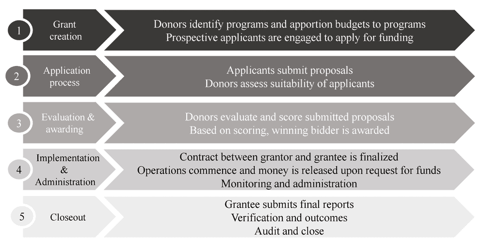
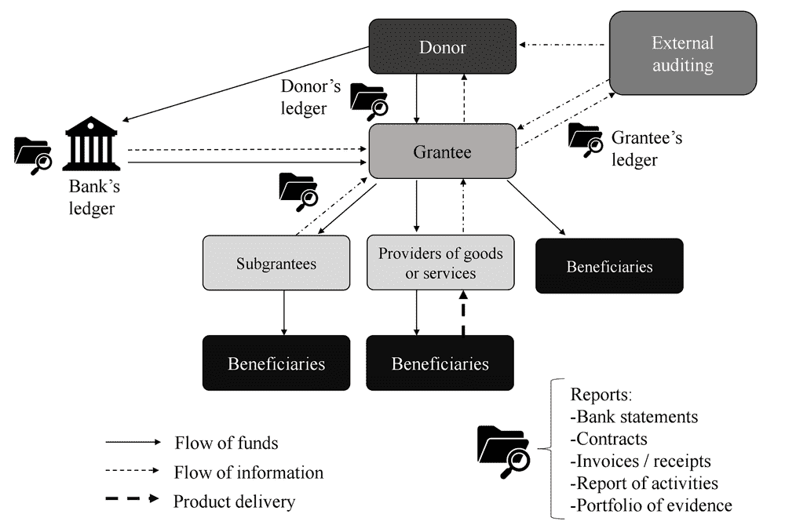
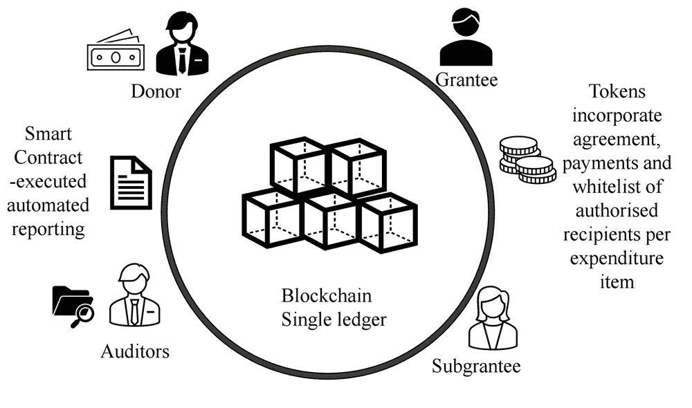
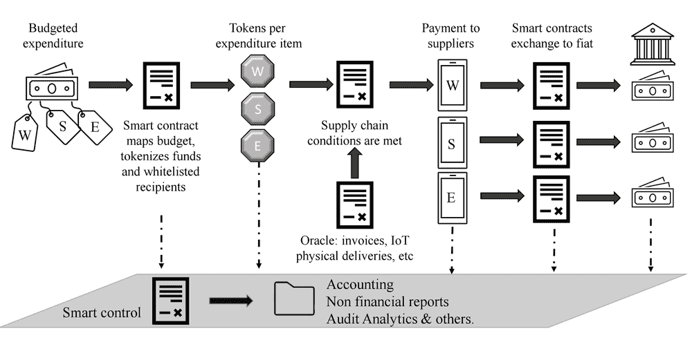

# 第七章

# 在赠款管理中的区块链 token 化

+   康拉德·克 raft

    塞浦路斯尼科西亚大学

+   玛丽亚娜·卡蒙纳

    塞浦路斯尼科西亚大学

摘要

赠款管理是一个关键过程，使组织能够成功实施解决社会、经济、环境和其他挑战的项目。在全球范围内，赠款转账代表了大量的资金，其管理充满了缺陷，削弱了捐赠资金的影响力。赠款管理中最紧迫的挑战之一是提高透明度并降低高昂的行政成本。数字化转型已经在提高赠款管理的效率、透明度和责任制方面取得了很大进展；然而，仍然存在许多不足之处。区块链、智能合约和 token 化可以结合起来，实现比目前可能的更高效率和控制水平。通过研究基本的区块链概念，作者提出了一种 token 化每个支出项目并使用智能合约来自动化支付、报告和预算合规的赠款管理解决方案。

引言

世界各地生活在贫困中的人群遭受从基本社会基础设施的缺乏（水、卫生、电力、医疗保健访问等）到歧视和饥饿的社会弊病。这些挑战严重威胁到无数社区中人们的未来，这些人绝望地试图摆脱这些社会弊病所创造的绝望循环。政府、多边组织、基金会和慈善家试图通过开发和资助价值数万亿美元的年度项目来解决这些问题。

不幸的是，赠款计划管理中的不足，如资金挪用和行政监督不力，使许多人无法从他们急需的援助中受益。为了解决这些不足，随着时间的推移，开发了许多不同的赠款管理系统。这些系统试图融入新技术工具，以根据最新的技术进步更新其功能。然而，赠款管理中的许多低效率仍然存在。

自 2008 年以来，区块链技术震撼了金融世界和整个互联网。凭借前所未有的自动化能力、加强的安全性和实时可审计性，它有很大的潜力显著解决赠款管理中当前的低效率问题。

本章通过特别关注与赠款管理相关的区块链的核心特征和区块链 token 化，探讨了区块链在赠款管理中的应用。通过探索一个案例研究，突出了当前赠款管理系统中的重大挑战，并提出了基于区块链的解决方案，同时进一步阐述了区块链 token 化的较少为人所知的特征。

背景

区块链与智能合约：基础知识

自中本聪发布白皮书（2008 年）以来，其中首次揭示了比特币——第一种加密货币，区块链，比特币的基础技术，已经在金融和支付系统之外的领域获得了应用动力。区块链，如其名称所示，由一系列区块组成，使点对点交易在只追加的分布式数据库中成为可能，具有防篡改、带时间戳的交易，由密码学分布式信任和激励共识保护（Cong & He, 2019, 第 8 页）。其新颖的特性包括去中心化、不可篡改性、实时可追溯性、可审计性、安全性和隐私性。

区块链技术中的去中心化指的是不依赖中心权威进行交易验证的分布式验证。分布式节点根据结合了密码学与经济激励的共识机制来验证交易（Narayanan et al., 2016）。去中心化保护了区块链上的数据不受单一故障点的影响，这是中心化系统的缺点（Kraft & Carmona, 2020）。

不可变性指的是区块链记录的不可更改性质。每个区块按时间顺序排列，并通过哈希指针与彼此不可分割地联系在一起，该指针引用区块链中的所有其他区块。因此，如果恶意行为者想要修改区块内的交易，他们必须更改所有回溯到区块链的创世（第一个）区块的交易（Kraft & Carmona, 2020）。这样，没有任何记录可以合理地被撤销或修改，确立了记录的可靠性和信誉。尽管交易不能被合理地更改，但交易的操纵是可能的；然而，这需要大量的资源，这在经济和计算上是不切实际的。

区块链通过使用类似搜索引擎的工具——区块浏览器，进一步确保了健全、实时、可追溯性。区块浏览器允许任何个人查看区块链上发生的所有交易。此外，由于交易和区块是不可篡改的、透明的和可追溯的，区块链账本为实现审计断言——完整性、发生、准确性、存在、估值和截止时间（Kraft & Carmona, 2020）——提供了固有的保证。

智能合约

自比特币以来，其他区块链迅速出现并扩展了比特币的功能。这样一个区块链就是以太坊，最常用于去中心化应用程序（dApps）。与比特币区块链不同，以太坊通过智能合约引入了更大的功能。

智能合约通常被理解为用代码编写的机器可读程序，当满足一组预设条件时，程序可以自我执行。区块链的新技术进步使得真正自主的智能合约能够自我执行和自我强制执行（Lausati 等人，2017 年）。

没有单一的智能合约协议。Hewa 等人（2020 年）分析了以太坊、柯达、超级账本 Fabric、恒星和波场等区块链环境中的智能合约。通过比较隐私、安全性、互操作性和交易成本等特性，Hewa 等人（2020 年）概述了不同智能合约设计环境的优缺点。表 1 进一步说明了智能合约设计中不可避免的权衡。例如，在如超级账本的受许可区块链中，用户能够集成各种共识机制，提供了更大的灵活性；而在不支持定制共识机制的公有区块链中，灵活性降低，但安全性更高（2021 年，第 5 页）。由于没有任何区块链能在智能合约设计的所有方面都表现出色，每个区块链都为其平台上的开发者社区所需的功能优化智能合约设计环境。

表 1. 智能合约设计环境的优缺点

|  | 智能合约 |
| --- | --- |
| 区块链 | 优点 | 缺点 |

| 以太坊 | • 开源系统 • 全球开发者社区

• 支持私人和公开模式 | • 公共账本存储开销 • 交易批准时间变化（从秒到分钟）

• 交易成本（燃料费）

• 单一编程语言（Solidity）

• 集成限制 |

| 超级账本 | • 受许可的运营能力 • 不同的共识模式

• 无交易成本

• 支持不同的编程语言

• 采用微服务架构 | • 无原生加密货币 • 部署复杂性

• 证实用例相对较少 |

| 柯达 | • 扩展的隐私性 • 广泛的工业兼容性

• 合约执行能力

• 支持多种共识机制 | • 无原生加密货币 • 验证仅通过可信证明人进行 |

| 恒星 | • 支持加密货币（恒星币） • 挖矿无开销

• 快速交易处理

• 非图灵完备智能合约增强了安全性 | • 在银行和金融应用中尤其存在监管难题 |

| 波场 | • 定制代币创建能力 • 非图灵完备智能合约增强了安全性 | • 定制代币的高波动性 |
| --- | --- | --- |

来源：根据 Hewa 等人（2020 年）的阐述

由于智能合约只能访问其原生区块链上的数据，因此外部数据必须通过一种特殊的智能合约（Oracle）提供给智能合约。Oracles 验证、认证并发送链下数据到智能合约，使它们能够按程序执行。Oracles 以多种形式存在，如下所示（Kraft，2020）：

+   • 软件：从在线来源向智能合约提供数据，由于其在线性质，可以提供近实时的信息（即网站数据、股价、航班信息等）。

+   • 硬件：从物理设备（如传感器）提供数据，并为智能合约翻译这些信息。

+   • 湿件（人类）：通常是在某一领域内的专家，由智能合约创建者任命并信任，为 Oracle 提供信息。

+   • 入站和出站：Oracle 可以从链下来源向智能合约提供数据，同时也可以将智能合约数据提供给链下。

Oracle 对智能合约的运行至关重要，特别是因为大多数数据（身份、证明、税收、财务数据等）尚未包含在区块链上。

代币化

代币化是一个过程，通过这个过程，代币（即符号）代表一个底层资产或功能。例如，赌场筹码在赌场生态系统中代表货币，因为它们允许顾客玩游戏，并且也可以兑换成货币。货币本身是一个代表国家支持的法定货币的代币，并被认为能够偿还公共或私人债务。数字代币化的起源在于支付行业中的数据安全，在这种情况下，敏感的信用卡数据被转换成一个非敏感的随机字符串，从而增强了对机密用户信息的安全性，并减轻了商家的安全负担。

在区块链背景下，代币化是将物理和非物理资产、收藏品、身份和其他信息（Antonopoulos & Wood，2018，第 222 页）转换为可以转移所有权或权利的数据的过程。代币继承了创建其上的区块链协议（Fisher 等人，2020）的功能和特性，例如不可变性、可追溯性、去中心化等。代币还可以代表一组指令，用于通过智能合约在区块链上产生变化。许多开发者认为代币化是区块链大规模采用的“杀手级应用”（Elliot，2020）。

代币的入门级分类

代币大致可以分为两类：可替代和不可替代。可替代代币是可交换的，意味着它们可以交换成同一类型的另一个代币；相同，即它们在性质和规格上是一致的；并且是可分割的，意味着它们可以被分成更小的单位，而不会对用户产生影响（Oxcert，2018）。

另一方面，非同质化代币（NFTs）代表价值不等的数字资产，即使它们可以是同种类型的。每个 NFT 都是独一无二的，不可互换（与同质化代币不同），也不相同（Elliot，2020；Oxcert，2018）。

瑞士金融市场监督局（FINMA）和英国金融行为监管局（FCA）等金融当局已根据代币的各种功能对同质化代币进行了分类，以设定监管基础。在其指南中（FCA，2019；FINMA，2018），代币被分为三类：

+   1 支付代币，也称为交换代币，是作为购买商品和服务的支付手段的去中心化加密货币。支付代币通常不受监管。

+   2 实用性代币提供了访问基于区块链的产品或服务的机会（Elliot，2020）。这些代币不受监管。

+   3 资产代币，也称为证券代币，是代表发行人的资产、债务（例如债券）或股权要求（例如股份）的受监管代币，并用于绑定实物资产，承诺分享利润。

这些代币类型的混合也是可能的；也就是说，代币可以具有重叠功能（例如，支付和实用性代币，实用性和证券代币）（Antonopoulos & Wood，2018，第 222 页；Lo & Medda，2020）。

每个区块链都有其自己的协议和发行代币的标准。例如，以太坊区块链有创建同质化代币的 ERC-20 标准，创建 NFT 的 ERC-721 标准，以及允许代币发行者强制执行其代币的转让限制的 ERC-1404 代币标准，决定代币可以分配给谁以及代币转让的条件（TokenSoft，2018）。代币标准概述了管理代币功能和行为的最小规格和规则。代币标准不是一个固定的规则，因为开发者可以自由添加新功能，这些功能最初并不包括在标准中，从而扩大了应用范围（Antonopoulos & Wood 2018，第 249 页）。

区块链代币化是一个不断发展的新兴领域；因此，上述分类并不全面，也没有涵盖代币景观的全部范围。

代币化与数据货币的演变

在货币和金融经济学中，货币被认为有三个主要用途。它是一种价值储存手段，一种交换媒介，以及一种计价单位。作为一种计价单位，货币可以被看作是数据，尤其是随着货币日益数字化。Westermeier（2020）指出，随着社会从使用传统的金融基础设施转向数字平台，货币越来越多地作为数据使用，“通过将货币作为一种数据形式深入嵌入平台，货币与其他类型的数据平起平坐”（Westermeier，2020，第 2054 页）。

金钱主要存在于银行系统内的账目记录中。这个账目几乎总是与交易或金钱被交易的情境外部。例如，在线购买是卖方和买方之间的交易；然而，交易的支付阶段需要涉及到第三方（发行和商户银行、商户收单机构、信用卡网络等）来完成购买。部分地，这些众多中介机构是金钱“低数据”特征的后果。

传统上，金钱包含非常少的信息。一个数字交易，平均只包含四条信息，包括交易的金额、付款人、收款人和交易日期。物理法定货币包含的信息更少（仅价值）。

与现金或当前的数字支付系统不同，区块链通过使金钱在代币化时更加复杂和增强金钱包含的数据来为金钱（资金）增加功能。通过代币化金钱，许可、条件和限制要求可以被嵌入金钱本身。因此，金钱的交换将不再与交易的合同义务和条件分离，而是成为其不可分割的一部分。与赠款管理相关，区块链代币化可以改善赠款管理的所有流程，因为代币化合并了赠款的条件和其资金。

赠款管理流程

概览

赠款发放过程涉及一个组织或捐赠者向另一个组织或接受者分发资金，以实现预先确定的目标（Weiss, 1973）。来自政府、多边组织、全球基金、私人慈善和 国际合作机构的赠款每年总计数万亿美元。根据经济合作与发展组织（OECD，2021 年）的数据，2020 年，经济合作与发展组织国家对发展中国家和低收入国家的官方发展援助（ODA）为 1612 亿美元。根据经合组织的测量，ODA 的 90%平均是补贴（Keeley，2012 年，第 49 页）；也就是说，接受者无需偿还该笔金额。从高层次看，赠款遵循一个可以概述为五个主要步骤的流程，如图 1 所示。

|  |
| --- |
|  |

赠款项目有不同的目的。一些赠款用于资助研究，其他的则支持基础设施发展、补贴培训、向弱势群体转账等。每个赠款项目都包括一系列旨在实现特定目的的活动。赠款项目可以由单一执行者负责，也可以采用多层次系统，包括赠款接受者和次级赠款接受者。一些赠款资金是无条件的，而其他的赠款资金则基于严格条件（例如，在提交研究成果或其他成果的情况下）。赠款因此是多维度的，其管理的复杂性受到多个因素的影响，包括赠款接受者和中介的数量、活动、条件等。

一旦申请者获得批准并与赠款者签订合同（图 1 中的步骤 4），赠款管理就开始了。赠款合同包括活动、支出预算、中介、里程碑和时间表等项目。通常，赠款者要求赠款接受者通过报告定期更新赠款项目的实施进度（监控）。这些报告帮助赠款者确定项目是否按照项目计划达到预定的里程碑（管理）。这一报告过程中的关键是财务评估，它比较了预算预测支出与给定期间内的实际支出。这个过程需要将进度报告与银行对账单、付款凭证和合同条件进行对账，以确保资金按照赠款合同的规定使用（图 1 中的步骤 5）。

在赠款管理中，资金的转移在执行者、赠款者、审计师、供应商、银行和赠款接受者等之间产生了几个信息流（图 2），这些信息流必须被监控、报告和核算。如果这种复杂性管理不当，会导致无数的挑战和通常是不希望出现的后果。

| 图 2. 在传统系统中的 grant 执行情况 |
| --- |
| 图  |
| 来源：作者整理 |

令牌化赠款管理

有可能在赠款管理过程的每一步中整合区块链技术（图 1）；然而，作者将重点关注已经出现区块链应用的“实施和行政”以及“结束”步骤。在这方面，IBM 已经开发了一个概念验证，使用区块链简化申请自然灾害救济基金的流程，并使申请者更容易证明他们确实是受害者（Delaney，2020）。2017 年，财务创新与转型办公室（FIT）与德勤和国家科学基金会合作，开发了一个概念验证，分析区块链如何改进赠款支付流程并在多级赠款支付项目中提高透明度（Fisher 等人，2020 年，第 26 页）。该项目还突显了赠款接受者如何使用代币来转让和兑换赠款支付（财政服务局，未注明日期）。目前还没有最终的申请可用，研究努力仍在继续。一个类似的申请是 Disberse，这是一个基于区块链的资金管理平台，允许捐赠者、政府和 other 类型的赠与人，将资金从捐赠者转移到中介，再从后者转移到最终受益人。Disberse 进一步通过移动支付或凭单为弱势群体提供现金转账便利（Marke，2018）。

在本节中，提出了一个使用智能合约的赠款 Token 化的概念模型。在该解决方案中，赠款批准预算用于为每个支出项目生成唯一代币。这些代币带有已批准、白名单收件人的地址，防止代币转让给未授权的收件人。借鉴戴伊和瓦萨雷利（2017 年）的工作，建立了自动化报告（图 3），包括一组智能合约，这些合约从交易中使用创建的代币提取、处理和生成数据。这样，赠款过程各个层次的信息可以瞬间汇总，生成财务、管理和运营报告。

| 图 3. 基于区块链的赠款管理 |
| --- |
|  |
| -   来源：作者整理，观点源自戴伊和瓦萨雷利（2017 年）和 MITRE（2019 年） |

首先，创建与每项支出类别预算的法定货币相等的可替代代币（例如.人力资源，供应品，设备，运营，财务—如税收，费用等）。每个代币都由传统银行账户支持的法币背书。例如，假设工资（W），供应品（S）和设备（E）是支出项目，每个项目的预算法币价值为 1000 美元。因此，这些支出项目将各自分配到 1000 个代币。按照这个例子，（W）代币，（S）代币和（E）代币将作为支付代币创建，因为它们用于偿付债务义务，在本例中，是与供应商和员工偿付；然而，它们也执行诸如触发自动化报告的智能合约等功能。

此后将创建代币，并开始运营模式（图 4）。一套全面的复杂智能合约控制着代币从批准的支出预算条目流向白名单供应商，符合内嵌的代码逻辑。只有在所有必要的供应链管理条件得到满足后，智能合约才会执行。这一信息是由来自批准的数据源（如 IoT 数据）的 Oracles 传输给智能合约的。一旦代币转移到白名单供应商的钱包，就会触发第二套智能合约——负责将代币兑换成法定货币的智能合约。

相关的法定货币根据智能合约确定的价值从银行账户转移到供应商的银行账户。

| 图 4.基于区块链的赠款管理：运作方案 |
| --- |
|  |
| 来源：作者阐述 |

从 Dai 和 Vasarhelyi（2017）的观点来看，可以手动请求或自动发送给捐赠者和管理员详细的报告。此类不可更改的交易数据报告可能如所需般详尽，并且可以自动在适合此类信息用户的间隔生成。

GRANT MANAGEMENT CHALLENGES AND BLOCKCHAIN SOLUTIONS: A CASE STUDY

通过以下案例研究的阐述，将突出当前赠款管理系统中的常见挑战，并概述基于区块链的潜在解决方案。

南非银行抢劫案中的市政赠款（2018 年）

2018 年，南非的一些地方政府非法转移了从国家和省级政府获得的多种赠款资金，这些资金本应用于减少贫困社区的基本服务基础设施（如水、卫生设施等）的滞后。这些资金随后被转入了欺诈者的银行账户并被盗窃（SAHRC，2019）。监察员的调查发现，地方政府通过向 VBS 互助银行存款，公然忽视了《地方政府财务管理法案》（MFMA）（该法案禁止地方政府向互助银行转移资金），总计数十亿兰特。一旦南非国家财政部发现了这起欺诈行为，20 亿兰特（约合 1.4 亿美元）已经被银行员工、银行的审计师和高级政府官员挪用，使得涉案的地方政府陷入了严重的财务困境。受影响最严重的是农村地方政府，被挪用的资金多达他们年度运营收入的 50%。

有 15 个地方政府受到影响，它们的资金被冻结。这些地方政府由于现金流量短缺以及由此产生的服务未能提供，面临着政治紧张局势。尽管根据 MFMA 第 71 条规定，地方政府需要将其每月的财务表现报告给国家财政部，但 VBS 银行盗窃案揭示了这一监控机制的弱点，并突显了修订公共部门赠款系统的必要性。南非地方政府协会（SALGA，2018）敦促国家财政部能够从地方政府获取实时数据和其他报告，以更好地进行监控、咨询和支持。他们还游说省级财政部门加强理事会监督结构，最重要的是，修订 MFMA 第七十一部分的监控工具。

本案例研究突显了如何实施诸如 MFMA 第七十一部分等保障措施，但这些措施不足以确保赠款的高效和透明执行。除了健全的法律框架外，地方政府在赠款执行方面还取决于日常运营中程序和控制的执行，从而预防欺诈，而不是事后后悔。

赠款管理挑战一：资金挪用

向不合适的服务提供商或完全非法的个人转移资金是案例研究中赠款管理系统的主要缺点。由于法定货币和数字货币没有内在的对未经授权转移的防范措施，因此支出完全取决于并不总是值得信赖的管理人员。此外，只有在审计之后才发现盗窃行为，而此时资金已经被盗用。

市政府公然挪用公共资金导致了对自己和居民都有深远影响的后果。尽管勾结的市政府连续几个月无法支付员工工资，并经历严重的现金流短缺，但许多公民再次被剥夺了急需的用水和用电 access。

维布银行抢劫案只是全球公共金库被掠夺的一个例子。有组织犯罪和腐败报道项目报告了许多类似的实例，其中数十亿美元的新冠病毒救助资金被不道德地挪用。在一份报告中，抗击新冠疫情的设备采购，价值 3018 万美元，被承包给了一家没有医疗保健经验的数字基础设施服务商（OCCRP，2020）。

分词后的赠款管理替代方案

利用基于区块链的等效物，有可能解决当前赠款管理系统中普遍存在的挪用问题。所提出的基于区块链的解决方案的一个关键特点是可以规定谁可以拥有代币。

通过账户白名单，赠款发放者可以限制代币转让给未经验证的非授权方。此外，付款条件、预算限制和其他合同规定都被编程包含在代币中，从而加强了防止颠覆的内部控制。

此外，区块链上的实时可追溯性确保了任何不当活动都可能及时被识别和调查，使用块浏览器和启发式软件。虽然所提出的解决方案并不能完全消除挪用的可能性，但它确实显著阻止了潜在的欺诈者尝试犯罪，因为早期检测、前所未有的可追溯性以及高频率的资金回收。

赠款管理挑战二：报告和监控效率低下

尽管涉及的市政府向国家财政部提交了详细的月度财务表现报告，说明资金如何使用，但他们显然无法有效及时地发现大规模的管理不善。在国民议会委员会讨论 VBS 欺诈对市政财政的经济影响时，指出从市政府获得的信息“在准确性、及时性和完整性方面具有挑战性”（Mdakane，2018）。

赠款发放者通过其遗留的监督机制，也导致了赠款管理效率低下。当交易发生与报告之间存在大量时间差时，报告变得无效。2016 年 10 月，在 VBS 欺诈指控出现前两年，地方检察官就对市政活动向国民财政部表示了关切。随后，国民财政部的警告直到 2017 年 8 月才发出，几乎是一年后。这一延误是由于获取支持信息效率低下。为了向一个市镇发出警告，南非当局不得不收集、核实、汇总并核对第三方账本中的信息，如银行对账单和市政财务系统。议会监督组是这样描述这个问题的：“如果它（即国民财政部）有那种洞察力（即实时市政信息），那么也许它的早期预警和监控系统就会注意到事情 [...]”（Mdakane，2018 年）。

此外，即使报告及时起草并提交，也无法保证其内容的真实性。因此，花费了大量资源来验证市政信息。在案例研究中，只有在 SALGA 和 KPMG 进行审计后，才发现了欺诈和财务不准确的情况。美国财政办公室财务创新与转型（FIT）在研究美国众多赠款计划使用区块链的情况时，发现平均而言，每个赠款申请人的支付请求需要两小时才能核对完毕，赠款管理人员的 40%时间都花在合规上，由于过度支付，几乎有 200 亿美元被退回（Fisher 等人，2020 年）。

代币化赠款管理方案

当赠款资金被代币化时，合规性是自动化的，确定无疑，使得报告有效且可信。与合规性相关的数据，如收款人、支付类型、金额、目的、位置、收款人详情、满足条件以及白名单信息都嵌入在代币中。所有这些信息都附在资金上，并从项目的预算跟踪到其成果，在智能控制层真正实现端到端（图 4）。

此外，存在于孤岛中的数据可能被预言者和智能合约汇总。如果所有相关的报告数据（如银行对账单、市政记录等）都包含在区块链上，授权的预言者和智能合约可以立即汇总这些数据，以生成所需的任何级别的报告。这样的解决方案本可以让南非国民财政部及时确认不符合规定的程度，并提出及时的警告或补救措施。

赠款管理进一步挑战：超支和低估

虽然与案例研究无关，但补助资金的过度和不足开支是当前补助管理系统中经历的严重挑战。

项目过度开支是由于在其实施过程中预算控制不力造成的。为了弥补这一不足，管理员寻找分配给其他项目条目的资金，或者更令人担忧的是，提供劣质商品或服务来弥补不足。例如，员工成本的超支可能会减少向受益人提供的商品或服务，影响其质量，还可能造成项目完工的延误。

防止过度开支

通常补助接受者并不审慎地遵守预算限制，开支由管理员自行决定。过度开支仅在报告阶段被发现，此时资金已经支出，或者补助接受者已经与供应商建立了义务。通过创建与批准预算支出值相等的代币，可以强制执行财政纪律。由于代币只能用于其预期目的，因此消除了非法跨补贴一个支出项目为另一个支出项目的可能性。此外，账户白名单限制了将资金转给接受者的金额超过补助者设定的预算金额。如果需要额外资金，这可能需要补助者明确批准后重新编程智能合约。

资金不足开支与未开支资金的回收

补助资金的不足开支与过度开支一样具有破坏性，因为这表明补助目标未在规定的时间内实现。因此，当出现资金未开支的情况时，补助的成果（援助、救济、服务交付等）未能实现。虽然可能有正当理由未能在分配的时间框架内完全开支资金，但从表现不佳的补助接受者那里收回未开支的资金的过程却需要付出大量的行政努力。

补助代币化可以缓解这些行政挑战，因为补助者可以编程代币，在代币（资金）未能在约定的时间框架内适当支出时自我销毁。

代币化补助管理过程的优缺点

尽管区块链技术在提高补助管理方面具有巨大潜力，但考虑这种变革性技术的局限性和缺点同样重要。在社会流程领域，没有任何技术解决方案是万能的。虽然代币继承了其所属区块链的好处，但也承担了它们的局限。在表 2（如下）中概述了所提出解决方案的一些优缺点。

表 2. 在补助领域应用区块链技术的优缺点

| advantages | disadvantages |
| --- | --- |
| 1. 区块链实现了前所未有的自动化水平，减少了资金挪用和与不准确报告及无效监控相关的低效。 | 1. 区块链无法消除依赖于人工输入的赠款管理挑战，如政策设计及实施（即向赠款受益人提供的商品和服务的质量和数量），文化和社会因素，或是最后一公里配送问题。 |
| 2. 具有智能合约和预言机的区块链允许自动化有效且及时的报告，从而减少行政成本， potentially enhancing the available funds for grantees to implement projects. | 2. 目前，大多数智能合约所需的数据存储在区块链之外（如身份信息、税务、发票等），因此拟议的应用程序仍然依赖于可能受到操纵的链下数据（信息）。尽管如此，旨在增强智能合约覆盖范围的项目（如 Chainlink 和 Balancer）正在稳步取得重大进展，将链下数据整合到区块链上。预计未来将出现一种类似 TCP/IP 和 ASCII 的全球区块链标准。这一标准将使智能合约能够访问区块链之外的数据以及除其开发所在的区块链之外的其他区块链，从而本质上消除了对预言机的需求（Kraft，2020）。 |
| 3. 对每项支出项目的分词处理减少了管理员在执行过程中偏离预算批准范围的可能性。 | 3. 在采用区块链技术时，谨慎考虑其实施成本与收益是明智的。区块链技术的衍生效益需要与这种系统的开发和维护成本进行权衡。目前，区块链开发费用可能对希望将这项技术纳入管理工具箱的中小企业来说是不堪重负的。 |
| 4. 利用代币和智能合约的拟议解决方案通过将数据与金钱结合实现了高度自动化，从而消除了中介。责任更加透明且即时。 | 4. 组织对引入可能因自动化而减少员工的技术的抵触。 |
| 5. 由于要求已嵌入/编程到代币中，因此遵守和执行是有保障的。 | 5. 在赠款项目实施过程中，响应不可预见情况的能力降低。由于赠款条件和结果在项目开始时就已确定并编程，因此需要重新编程代币以适应变化。这可能导致对赠款计划偏离的及时响应出现延误。 |

FUTURE RESEARCH DIRECTIONS

各国和跨国公司都非常关注资助和其他支持管理领域，尤其是在新冠疫情爆发之后。所有捐赠者都希望通过提高项目效率来放大其影响，同时减少浪费和不效率。未来研究可能需要探索最适合的区块链架构（受控环境或受控与非受控环境的混合），以便为资助管理解决方案量身定制，并考虑此类系统的实际效率节省。

此外，解决方案的研究需要就信息存储在区块链内或之外做出决策，同时保持其私有和安全性。代币化正在创造新的商业模式，如创新的众筹模型、多世界模型和去中心化自治组织。基金会或捐赠组织可以利用这些新的商业模式来筹集资金，用于救济项目。

随着新技术的引入，用户行为发生了改变。同样，这种新的资助管理方法也将影响用户行为，值得探索的是资助者、受助者和此类系统用户之间的关系将如何相应地发生变化。

结论

本章全面介绍了基本区块链、智能合约和代币化概念，并强调它们的特征和吸引力。区块链技术作为一个整体，被用于数字表示资产和更抽象的价值表示，如知识产权、负债，以及促进合约承保和价值积累，如同股票或证券。区块链的其他更知名的应用于供应链管理、医疗记录和能源供应。作者设想了在资助管理中使用区块链代币化的可能性，因为当地和国际资助者迫切需要确保他们的资金按照协议使用，并朝着预期的结果努力。

目前关于基于区块链的资助项目的研究所主要关注的是项目的实时跟踪和报告。然而，作者通过关注减轻资助跟踪和报告负担以及资金挪用问题，扩展了这一研究。拟议的模型进一步概述了一个智能合约层，以聚合数据生成报告，其频率和详细程度符合资助项目各种利益相关者（捐赠者、财政当局、受助人、受益人等）的要求。

需要考虑的是，提出的解决方案具有更广泛的适用性，不仅用于公共资金管理，也适用于一次性的特定项目。

最后，所提出的解决方案在预算控制和透明度较差、腐败程度较高的国家尤为相关。这些国家往往是世界上最贫穷的国家，最无法承担重要资金的挪用，其公民最需要赠款资金。

FUNDING

这项研究没有从公共、商业或非营利部门的任何资助机构获得特定的赠款。

REFERENCES

Antonopoulos, A. M., & Wood, G. (2018). 掌握以太坊——构建智能合约和应用。O’Reilly Media, Inc.

财政服务局。（未注明日期）。DEEE 区块链适配更新。FIT：金融创新与转型。https://www.fiscal.treasury.gov/fit/updates/deee-blockchain-fit-update.html

Cong, L. W., & He, Z. (2019). 区块链颠覆与智能合约。金融研究评论, 32(5), 1754-1797。DOI:10.1093/rfs/hhz007

Dai, J., & Vasarhelyi, M. A. (2017). 向基于区块链的会计和审计迈进。信息系统杂志，31（3），5-21。DOI:10.2308/isys-51804

Delaney, C. (2020, January). 信任债券：区块链与灾害救济。IBM 区块链博客。https://www.ibm.com/blogs/block

Elliot, H. (2020, September). 代币化的介绍。Cardano Foundation。https://medium.com/cardanorss/an-introduction-to-tokenization-5ce087a7b6c3

FCA. (2019). 加密资产指南（政策声明 PS19/22）。https://www.fca.org.uk/publication/policy/ps19-22.pdf

FINMA. (2018). FINMA 发布 ICO 指南。https://www.finma.ch/en/news/2018/02/20180216-mm-ico-wegleitung

Fisher, C., Poll, J., & Wetklow, M. (2020). 区块链在代币化赠款支付方面的优势。政府财务管理杂志，69（2），24-29。

Hewa, T., Ylianttila, M., & Liyanage, M. (2020). 基于区块链的智能合约调查：应用、机遇与挑战。网络与计算机应用, 102857。提前在线发布。DOI:10.1016/j.jnca.2020.102857

Keeley, B. (2012). 从援助到发展：全球减贫斗争。经合组织出版社。DOI:10.1787/9789264123571-4-en

Kraft, C. (2020). 未来智能合约，摆脱了预言。LinkedIn。https://www.linkedin.com/pulse/未来-智能合约-摆脱-预言-conrad-kraft/?trackingId=s1Dog16USrCmLRnGVrGqow%3D%3D

Kraft, C., & Carmona, M. (2020, April). 区块链如何终结公共部门采购中的腐败。LinkedIn。https://www.linkedin.com/pulse/如何-blockchain-spells-end-corruption-public-sector-mariana-carmona/

Lauslahti, K., Mattila, J., & Seppälä, T. (2017). 智能合约——区块链技术将如何影响合同实践？ETLA 报告，（68）。https://pub.etla.fi/ETLA-Raportit-Reports-68.pdf

Lo, Y. C., & Medda, F. (2020). 区块链上的资产：一个关于代币经济的实证研究。信息经济学与政策, 53, 100881。DOI:10.1016/j.infoecopol.2020.100881

Mark, A. (Ed.). (2018). 使用区块链改变气候金融和绿色投资 . Academic Press.

Mdakane, R. (2018). VBS 银行对地方政府财政的影响；市政议员养老金基金 . 议会监督小组. https://pmg.org.za/committee-meeting/26233/

MITRE. (2019, June). 使用区块链技术改善赠款管理的潜力评估. MITRE 赠款管理区块链供应链 . https://www.mitre.org/sites/default/files/publications/PR-19-1654-MITRE%20Grants%20Mgt%20Blockchain%20 Study%20Report.pdf

Nakamoto, S. (2008). 比特币：一种点对点电子现金系统 . 比特币 . 分布式商业评论, 21260. https://bitcoin.org/bitcoin.pdf

Narayanan, A., Bonneau, J., Felten, E., Miller, A., & Goldfeder, S. (2016). 比特币与加密货币技术：全面介绍 . 普林斯顿大学出版社.

OCCRP. (2020). 犯罪、腐败和冠状病毒 . https://www.occrp.org/en/coronavirus/

OECD. (2021, April). 2020 年 COVID-19 支出帮助提升了外国援助至历史新高 . 详细说明. https://www.oecd.org/dac/financing-sustainable-development/development-finance-data/ODA-2020-detailed-summary.pdf

Oxcert. (2018, April). 区块链上的可替代与不可替代代币 . Oxcert. https://medium.com/0xcert/fungible-vs-

SAHRC. (2019, March). 当治理衰退时，谁将拯救我们？ 南非人权委员会. https://www.sahrc.org.za/index.php/sahrc-media/opinion-pieces/item/1855-who-will-save-us-when-governance-decays

SALGA. (2018, April). VBS：VBS 银行对地方政府财政的影响；市政议员养老金基金 . 议会监督小组. https://pmg.org.za/committee-meeting/26233/

TokenSoft. (2018). ERC-1404: 简单的受限代币标准 . Medium. https://medium.com/erc1404/erc-1404-simple-restricted-token-standard-f71290a48faa

Weiss, E. H. (1973). 赠款管理：系统方法 . 社会经济规划科学 , 7(5), 457–470. 引用:10.1016/0038-0121(73)90042-6

Westermeier, C. (2020). 金钱就是数据–金融交易的平台化. 信息通信与社会 , 23(14), 2047–2063. 引用:10.1080/1369118X.2020.1770833

**额外阅读**

Antonopoulos, A. M. (2017). 精通比特币：开放区块链编程 . O’Reilly Media, Inc.

Bonsón, E., & Bednárová, M. (2019). 区块链及其对会计和审计的影响 . Meditari Accountancy Research. https:www.emeraldinsight.com/2019-372X.htm

Lee, J. Y. (2019). 去中心化代币经济：区块链和加密货币如何革命化商业. 商业视野 , 62(6), 773–784. 引用:10.1016/j.bushor.2019.08.003

Voshmgir, S. (2020). 代币经济–Web3 如何重新定义互联网（第 2 卷） . Token Kitchen.

**关键术语和定义**

Blockchain: 一种去中心化账本，通过使用时间戳和防篡改注册表，以及密码学和共识算法来验证交易和解决双重支付问题，实现点对点交易。

Consensus Mechanism: 网络中各参与方就共享账本中交易的正确性达成一致的方法。

Cryptocurrency: 一种基于区块链的数字货币，通过密码学和共识算法来保障和验证交易。加密货币可用于购买商品和服务。

Double-Spending Problem: 当同一个数字代币被多次花费时的问题。

Smart Contract: 用高级计算机语言编写的编码规则集。智能合约在满足特定条件时自动执行，包含具有约束力、不可阻止且自动化的条款，无需第三方参与。

Token: 在区块链中，代币是可编程具有多种功能的加密资产，如促进交易、代表其他资产、提供访问去中心化应用程序、作为治理或信誉，或验证区块链中的交易。

Token Standard: 最小化规格，鼓励智能合约与其他基础组件（如钱包、交易所和用户界面）之间的互操作性，以便可预测地执行。这些标准使得代币交易无需升级或额外编程努力即可进行。

Turing Complete Computer Language: 能够运行任何可能算法的编程语言。

Wallet: 用于与区块链交互的用户界面的软件应用程序。它们是用于存储、跟踪和管理用户用于与加密货币进行交易的密钥的应用程序。
