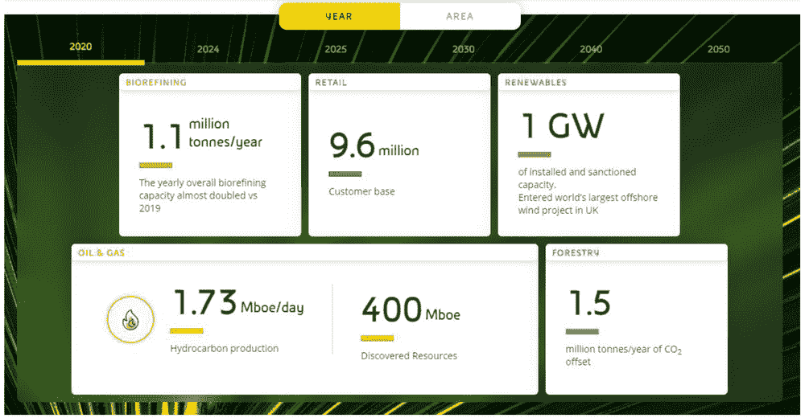
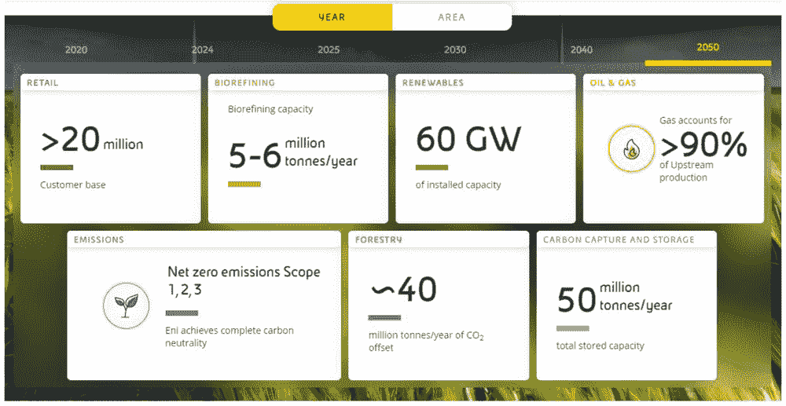
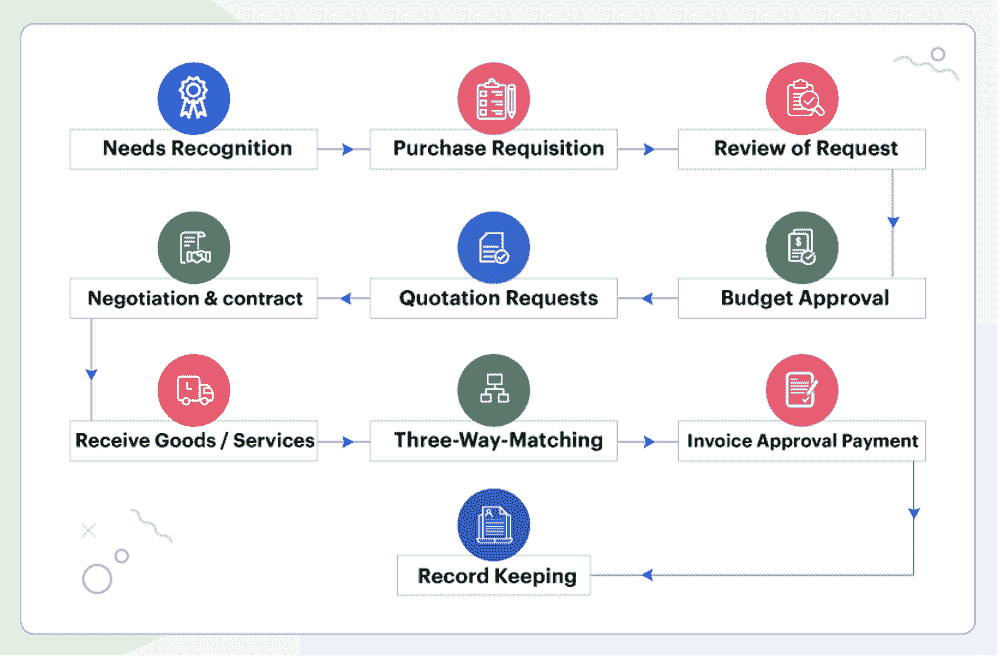
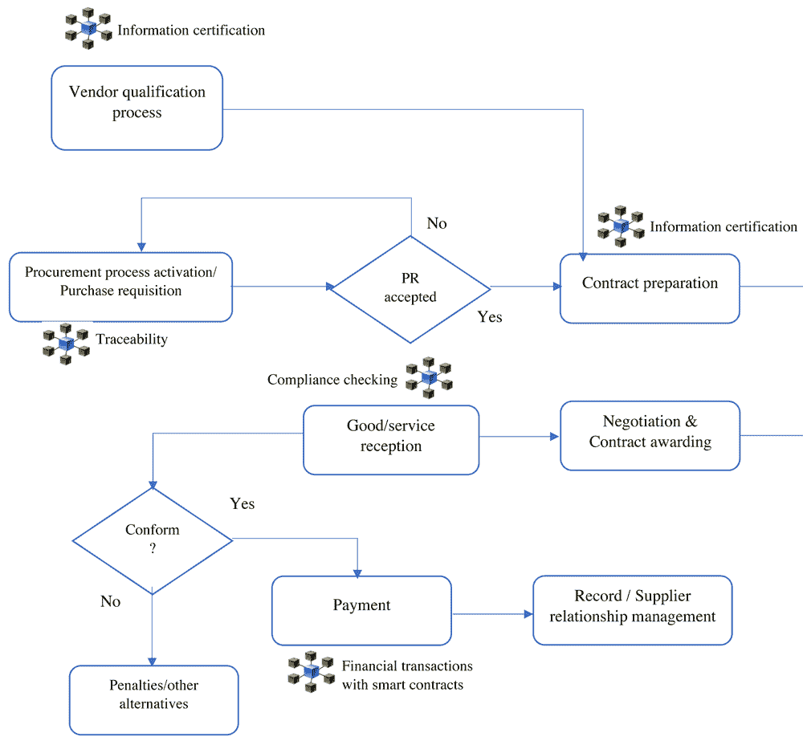
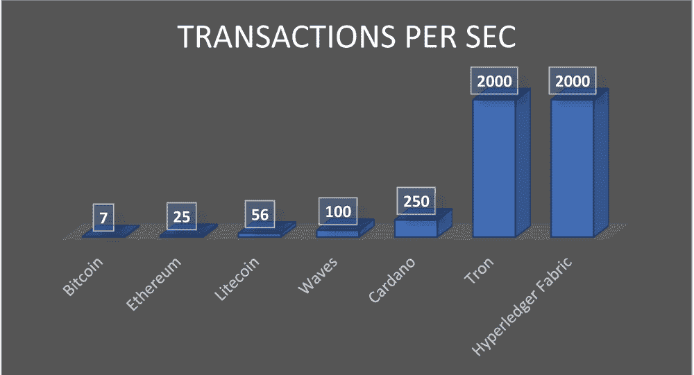

# 第八章

# 如何通过区块链技术改进 ENI 的采购

+   阿杜特·维克多·马隆加·比比拉

    意大利路易斯大学

+   皮埃特罗·德· Giovanni

     [`orcid.org/0000-0002-1247-4807`](https://orcid.org/0000-0002-1247-4807)

    意大利路易斯大学

摘要

本研究旨在调查区块链技术在采购过程中的潜在用途。为了更好地理解采购过程如何进行，分析了 ENI 的案例研究。ENI 寻求到 2050 年使其所有产品去碳化，并致力于与准备支持其愿景的供应商合作，以应对能源转型。在理解 ENI 内的采购过程并确定区块链在这些过程中的潜在用途之后，本章证明区块链可能是采购过程中的一个强大工具，尤其是对于供应商资格认证。

引言

近年来，全球范围内，特别是在欧洲，能源转型一直在趋势，加速了许多技术和新工业环境的融合（De Giovanni, 2021a）。能源部门具有最高的经济重要性，在欧盟供应链中的营业额约为 1.9 万亿欧元（Eurostat, 2018）。这显示了该部门对国家 GDP 的重大影响，以及过渡过程应有多高效，以避免大规模资本和就业损失。

与欧盟以及欧洲委员会一起，后者在其 2030 年框架内承诺逐步实现绿色（EEA, 2019），许多能源领域的公司已经制定了明确的路线图，在不同的世界地区实施了许多项目，并将 17 个联合国 2030 年议程可持续发展目标（SDGs）纳入其中，以遵守正在实施的新相关法规。

为此，他们致力于与满足特定标准的供应商合作，这些标准与可持续性相一致。精心挑选和评估供应商是确保供应链可持续性的第一步（文燕 S., 2017）。这一努力由采购部门进行，包括采购商品、原材料、服务、基础设施和维护，以换取金融资产（Preeker 和 De Giovanni, 2018）。这是对整个供应链影响最大的上游供应链的一部分，可以影响其弹性（Sarkis J., 2019）。然而，绿色采购是在最传统的采购活动中考虑环境可持续性实践，从供应商选择到设备或服务交付（De Giovanni 和 Cariola, 2020）。

研究表明，欧盟国内生产总值（GDP）的近 14%支出用于公共采购，仅仅因为一个健全的采购系统会促进发展，并为一个国家带来经济增长（Sanchez, 2019）。遵循同样的趋势，私营部门的采购是最大的开支之一。国际营销公司 Aberdeen Group 撰写的一份关于采购最佳实践的报告解释说，对不直接涉及生产过程的商品和服务的采购通常占其总支出的一半（Orr, 2002）。作为上游供应链的一部分，采购对供应链的其余部分有很高的影响力，这在可持续性方面同样正确。

对西欧公司的一项调查发现，可持续供应商合作通常在社会、绿色和经济维度上对公司的绩效产生积极影响。它还指出，对可持续性的投资会产生足够的回报（Hollos D., 2012）。因此，供应商合作是影响公司绿色计划的几个战略要点之一。

供应商选择被认为是供应链长期成功的关键问题（Wenyan S., 2017）。潜在供应商提供的信息基础上，通过一个资格过程来选择合适的供应商。然而，在可持续性的背景下对供应商进行资格评审和评估是一个多维度、复杂的活动中取决于信息。实际上，信息在改善供应商之间的关系上起着至关重要的作用。供应链参与者之间的协调增加可以减少风险、成本，并提高供应链的整体竞争力（Badzar, 2016）。

当供应商的环境信息可用时，可以简化对具有高环境绩效的供应商的资格评审和选择（Sarkis J., 2019）。不幸的是，这些信息并不总是容易获取，而且即使可以获取，也不一定容易验证或审核。此外，为了获得有利可图的合同，寻求合同的供应商通常会提供关于相关环境问题的信息，而这些信息不一定准确。

由于在可持续性背景下供应商资格认定依赖于数据验证或可审计的信息，组织必须核对所提供的所有数据，以根据组织在可持续性方面的愿景认定正确的供应商。他们还应在其采购和资格认定过程中实施更多透明度，以抵消由不对称信息引起的这种不平衡（Badzar, 2016）。为了做到这一点，他们必须访问、认证并审计供应商上可用的信息。随着技术进步，这些采购做法正在被重新审视，因为公司正寻求新技术的帮助（De Giovanni, 2021b）。目前，能够处理这一重大可持续信息限制障碍的最好技术之一是区块链。

在 2016 年 4 月的一份报告中，欧盟委员会强调，区块链可以彻底改变传统商业模式（Laurent Probst, 2016）。近年来，区块链吸引了实践者的广泛关注。到目前为止，越来越多的企业采纳它，因为它承诺带来诸多好处，包括增加透明度、节省时间、节省成本、增加对系统的信任、减少篡改、减少由于手工流程引起的人为错误等（Torres de Oliveira, 2017）。它是一种创新解决方案，迄今为止，各个行业的各种企业都希望从中受益。

区块链是一种基于密码学和公共账本的去中心化数字支付系统，包含系统内每笔交易的信息（Bettina Warburg, 2019）。这似乎是一个日益崛起的解决方案，可以增强透明度、安全性、工作速度和隐私（De Giovanni, 2020a）。区块链提供了可追溯性、不可变性和安全性等好处。这项新技术，以及组织在采购中面临的主要问题和挑战，可能找到一种有效和可持续的解决方案，并修复信息认证问题（Fin., 2020）。

在此方面，eni 公司正着手利用区块链技术作为采购评估工具，以高效应对和解决供应商减排足迹的问题。因此，本研究旨在协助 eni 提高采购系统的效率，并与相关利益方合作。

本研究对于希望进一步评估区块链在商业，特别是采购中潜在贡献的管理人员、研究人员和实践者来说具有重要意义，以改善可持续性。采购包括直接采购和间接采购。本章将重点讨论与购买商品、服务或工程不直接相关但支持组织主要活动的间接采购。我们还将关注采购中的运营和可持续性标准。

迄今为止，许多研究者已经在采购流程的区块链应用方面进行了研究；然而，大多数文章讨论的是区块链在公共采购中的使用，而只有少数文章讨论了区块链在可持续性改进的采购流程中的使用。还有一些文章讨论了绿色供应链或愿意进行绿色采购的公司所面临的挑战（Santosh，2019），以及区块链如何实现这一目标。还有一些文章讨论了在学术、艺术和媒体部门的信息认证，但很少有文章讨论区块链技术如何用于认证与可持续性相关的供应商信息以改进采购流程。因此，需要进一步的研究来全面探讨区块链技术如何用于实现可持续性目的的采购。

在研究主题时，需要回答的研究问题是：

研究问题（RQ）：区块链如何影响采购流程的效率和性能？

带有子问题：

+   • Eni 如何通过采用区块链来优化其采购流程？

+   • 实施区块链时面临的不同挑战是什么？

为了调查区块链对采购流程的影响，将讨论 Eni 案例研究。所使用的数据已从与 Eni 团队的多次会议、Eni 文档和文献中收集。在引言之后，我们介绍了案例研究、挑战以及建议和结论。

关于 ENI 的案例

Eni（原名 Ente Nazionale Idrocarburi，意为意大利国家石油公司）是一家成立于 1953 年的私人意大利石油公司，在 Enrico Mattei（Bloomberg）的领导下成立。1998 年该公司私有化，但意大利政府仍保留少数股权。Eni 活跃于石油、天然气、石油化工、电力发电和工程领域。它在 68 个国家开展业务，约有 31,400 名员工。其 2020 年的收入达到 430 亿欧元。Eni 的业务模式基于运营卓越、2050 年实现碳中性以及发展联盟。可持续性是其业务的重要组成部分，并融入其所有运营中。

尽管自 1990 年以来，欧洲的一次能源供应中可再生能源的比例已经翻了三番（EEA，2019），但欧洲的能源供应仍然由化石燃料主导。Eni 最重要的目标之一是到 2050 年实现其产品和流程的总去碳化。它还希望为联合国 2030 年议程的可持续发展目标做出贡献。Eni 将其承诺转化为具体行动，通过将联合国可持续发展目标纳入其使命并支持公正的能源转型。能源转型旨在以经济可持续的解决方案应对不同的气候变化挑战。

恩伊的活动包括石油和天然气的勘探、开发和提取，以及热电联产和可再生能源发电，还有传统和生物炼制及化工，以及循环经济流程。恩伊还是一家以创新为导向的公司，致力于寻找创新技术和过程数字化。

能源领域面临的最大挑战是在充分获取能源的同时应对气候变化。这就是为什么恩伊希望通过在其所有业务中融入可持续性，从而减少对地球的影响，从减少温室气体排放到尊重环境。

恩伊有许多可持续项目，并有一条清晰定义的道路，通往 2050 年的项目，如图 1 和 2 所示。

| 图 1. 2020 年实现碳中性成果 |
| --- |
|  |
| 来源：*恩伊网站* |
| 图 2. 2050 年实现碳中性之路 |
|  |
| 来源：*恩伊网站* |

为了支持希望加入这场能源转型的供应商，恩伊实施了一些工具，如 EniSpace 和 Open-es。Open-es 是恩伊新推出的致力于工业供应链可持续性的数字平台，向所有参与能源转型过程的公司开放。这是所有致力于能源转型过程公司的创新、包容和开放的工具（恩伊网站，2021）。该平台向所有愿意在意大利及全球提升工业生态系统可持续性方面的领导角色的公司开放。它是由恩伊、波士顿咨询集团（BCG）和谷歌云之间的合作伙伴关系产生的。

平均已有 1000 家公司加入了这个以共同增长为目标的社区，通过协作、非竞争的过程：这四个支柱对我们现在和未来都至关重要——地球、人民、经济繁荣和公司治理原则。得益于这一举措，实现了去碳化目标和数字化转型的协同，使整个工业链能够开发可持续性经验和最佳实践。为了推广可持续性文化，其他公司加入了这一倡议的精神。里纳和 Techedge 集团提供他们的专业知识，并在验证数据和平台演变中发挥关键作用，确保其可靠性和可扩展性（恩伊网站，2021）。

另一方面，eni 空间是 eni 的供应商合作平台。该平台创建是为了与供应商共同发展一个共享的“空间”，并让他们参与 eni 的能源转型路径。互动式平台成为了一个展示给与 eni 合作或希望与 eni 合作的人的展示厅。在这个平台上，对导航体验的用户友好性给予了最大关注，使得体验更加直接、即时和直观，同时可以更新申请或资格认证、比赛状态，或进行自助数据管理，或分享经验和交流心得的特定渠道。eni 空间分为四个宏观部分：

+   • “JUST”：将供应商置于 eni 能源转型的核心

+   • 对“商业机会”进行持续更新。

+   • “创新匹配”：分享创新、道德和可持续的想法和解决方案

+   • “Agora”：一个分享最佳经验的虚拟市场

通过这种方式，现有和潜在的供应商能够保持最新，积极参与 eni 的创新之旅，全面了解所涉及的所有研究领域。eni 还与供应商组织研讨会，讨论可持续性话题。每个研讨会都针对一个特定的主题，与该主题相关的供应商参与。在研讨会上，供应商解释他们的公司在可持续性方面取得了哪些成就。这是 eni 为供应商实施的除现有工具之外的另一项支持措施。

ENI 的采购过程

如上所述，eni 的业务范围从石油和天然气的勘探、开发和提取到循环经济过程。作为一个能源公司，其采购服务比直接服务更为间接。

在采购过程的上游，我们有供应商资格认证过程和采购过程的激活，这两个过程可以同时进行。

+   • 采购过程的激活定义了所有参与方的活动、角色和职责。

这是 eni 采购过程中的准备或规划阶段。根据需求计划，请求单位确定其需求。之后，他们与采购单位会面，请求单位发布采购申请，这是最终激活采购过程的行为。采购申请在处理前必须包含特定的最低要求，否则可能会被拒绝。例如，请求应与批准的预算一致，包含采购单位接受采购申请所需的所有信息/文件，并得到具有适当权限的授权内部官员的批准。然而，请求单位发送采购订单时还必须考虑完成采购活动所需的时间。请求单位和采购单位之间的信息必须记录下来并可追溯。

+   供应商资格认定流程

供应商资格认定流程确定了可以是供应商名单潜在候选人的供应商。它基于从技术方面到可持续性的多个标准，供应商必须在被认定为 eni 供应商之前满足这些标准。在这个过程中，采购单位向所有潜在供应商提出一组问题。这些问题的回答和提供的文件将决定谁有资格，谁没有。潜在供应商提供的答案是应该得到认证和验证的数据，以便可靠并作为竞争杠杆使用（Sacco 和 De Giovanni, 2019）。

+   合同准备和授予框架

在激活采购过程后，采购单位准备合同。它根据采购申请内容确定要使用的最佳合同解决方案和要分配的合同类型。它还确定要授予的合同数量和投标评估标准。

+   供应商选择

邀请参与投标的供应商应从 eni 合格供应商名单中选出。选择取决于即将分配的合同的产品组或商品类别。用于筛选短名单的供应商的标准应客观、不歧视，并与即将授予的合同范围相关。

+   招标邀请

招标管理或招标邀请的准备工作是采购单位的职责，使用现有的合同标准，根据已批准的合同策略，并完全尊重所有投标者的透明和平等原则。

+   投标评估：投标文件通常由三个独立部分组成：行政部分、技术部分和经济部分（有定价的投标）。

投标评估阶段：

+   1. 评估活动开始的通告（供应商名单中的投标者，第一次会议的日期、地点，技术评估小组）

+   2. 开启信封

+   3. 开启和评估行政部分：行政部分包含投标者提供的所有与法律义务相关的文件/自证文件，这些文件是根据 Eni 的规定要求的。

+   4. 开启和评估技术部分：根据合同策略和招标邀请中指明的标准来评估投标。开标后，评价标准和公式不能更改。

技术评估的最终结果通知采购单位。

+   5. 开启和评估经济部分：检查投标的经济价值的一致性，并确定最终排名。

    +   • 合同授予：经过一系列活动后，采购单位授予合同。指定的管理人员审查合同授予备忘录和合同授予提案，进行批准或拒绝。

合同最终确定和交接：采购单位将合同提案发送给中标投标者，收到并记录投标者的接受表，按照“合同授予后的合同管理”管理交接活动。

+   • 设备/服务交付流程

合同授予后，供应商应向采购单位提供所需的设备或服务。设备或服务应符合供应商在招标过程中提供的规格。还需要对设备符合性进行认证检查。要求验证投标过程中提供的信息和供应产品的符合性。

+   • 供应商关系管理

合同签订后，组织和供应商应保持良好关系。Eni 通过管理供应商关系平台和其他可用工具来实现这一点。

| 图 3 总结了 Eni 的采购流程 |
| --- |
|  |
| 图 4. 采购过程中的步骤 |
|  |
| *来源：采购云，2021* |

通过区块链提高改进机会

在对 Eni 的采购流程进行深入分析，以及与区块链在供应链和采购中的好处相关的文献之后，我们确定了一份基于区块链的应用程序清单，以改善 Eni 的采购流程。

+   • 采购部门与其他公司部门之间使用区块链：

恩尼是一家大型公司，有许多部门向采购部门发送采购申请。这些部门之间的信息必须被记录下来并可追溯。此外，采购部门需要验证所需的文件。出于可追溯性和记录原因，可以采用区块链。然而，更低成本的平台和技术也可以有效地解决这种情况。

+   • 在投标评估过程中使用区块链，以减少欺诈行为并提高机密性，允许评估投标的团队交叉核对供应商提供的信息。

采购欺诈被归类为经济中最常报告的犯罪类型之一（Kamali, 2019）。研究者声称在公共采购中存在腐败、不公平和不透明的做法。考虑到买方通常直接与供应商或供应商有接触，采购欺诈很可能会在这个部门发生，主要发生在招标过程中，使用传统方法消除这种现象可能不会有效（Buratto 等人，2019）。因此，使用区块链可以减少欺诈和不公平的做法，使过程具有可审计性、透明性和机密性。

+   • 在发出招标邀请之前，使用智能合约对供应商进行资格认证和选择。

在选择供应商之前，他们应该经过资格认证。认证过程旨在识别潜在的恩尼供应商，这些供应商随后会被列入供应商选拔名单。与可持续性相关的信息和在认证过程中提供的文件可以得到认证，所需的评估标准可以通过智能合约来评估。

受邀参加招标的供应商是从恩尼合格供应商名单中选出的。采购部门检查所有可能被选中参加招标的供应商的第三方风险。任何商品类别之间的异常或不一致应立即通知相关供应商管理单位。从初步供应商名单中的任何取消都应被追踪、合理说明并登记。在这种情况下，智能合约可以用来只选择符合所需标准的供应商并向他们发送邀请。

+   • 使用智能合约在组织与供应商之间的交易中验证，无需第三方干预。

根据双方之间的协议，智能合约可以执行合同条件，并在满足所有条件时触发账单支付。

+   • 使用区块链检查交付设备的合规性。

选定合同的供应商必须提供符合投标提案中提供的信息的设备。

根据恩尼的采购流程描述以及前一部分中描述的应用，图 4 展示了恩尼如何潜在地使用区块链。

对 Eni 来说，其中一些潜在的区块链应用目前并不可行。

+   • 意大利能源公司 Eni 已经有一个可靠的系统，用于采购部门和请求单位之间的内部沟通。此外，Eni 是一家庞大的公司，因此一旦建立了一个系统，对公司来说，更新现有系统而不是完全更换现行系统更有利。

+   • 招标管理系统的设计方式大大减少了欺诈和篡改的可能性。区块链可能是一个创新的工具，但当时并非必需。

+   • 使用智能合约验证交易：Eni 每年颁发近 3000 份合同。每份合同都有其复杂性，并不总是涉及同类型的供应商。此外，在交易可以得到验证之前，必须完成几个财务程序和审批，这需要一定量的官僚主义，而智能合约远远无法取代。

然而，供应商管理单位在供应商资格认证之前花费大量时间分析和验证数据。当涉及到分析与可持续性相关的数据时，这一任务尤其具有挑战性，这是 Eni 试图克服的重大挑战之一。

DATA PROCESSING AND BLOCKCHAIN（数据处理与区块链）

基于不完整、不准确或错误信息的数据收集使组织无法监控其合作伙伴的准确数据，并可能导致灾难，因为做出错误决策的风险很高。因此，尽管拥有信息是组织的主要目标之一，但一个实用、健壮的验证过程对于确保所给数据的可信度是至关重要的。对供应商提问的问题、Eni 所请求的信息类型以及资格过程中的程序的深入分析表明，在 Eni 流程中，可持续性占据了重要的位置，因此提供的信息和文件必须精确无误。

由于 Eni 期望准确和真实的信息来识别和资格认证合适的供应商，因此，在资格过程中，花时间内部验证或通过第三方验证不同公司提供的信息是非常重要的。然而，供应链中的数据验证一直是一个复杂任务。

根据托马斯·伯克的说法，在可持续性和人权方面的供应链参与者有很强的动机隐藏可能损害他们向客户销售产品能力的实践（De Giovanni, 2016）。同样地，为了获得丰厚合同，参与资格审核的供应商可能有意隐瞒可能阻碍他们通过审核的信息，只提交对资格审核有利的信息。

为了克服这一挑战，各组织监控或审计供应商的实践和流程。审计是一个广泛用于产品和过程验证的工具。英国标准协会将其定义为一种文档化和独立的流程，并帮助获取事实声明的证据，并确定基于审计标准的程度要求或政策得到满足（ISO 9001, 2015）。审计对象的活动的、产品的或流程的系统检查，以检查其是否符合审计标准。尽管该方法已被证明是有效的，且仍然相关，但如果恩尼要审计所有潜在供应商在资格认证流程中，这将花费昂贵的时间和金钱。

验证信息有效性的另一种方式是通过第三方认证。认证可以定义为通过一个经过认证的组织提供一份带有审计报告或评分系统等级的书面证书的过程，保证一个组织符合给定标准的要求（全球标准，2021）。认证公司是第三方，与组织合作发放并检查符合环境法规的证书。因此，一家公司可以参考这些经过认证的认证机构来验证其合作伙伴提供的信息或文件的真实性。这种方法也是实用的，因为经过认证的认证机构是可靠的；然而，当前的文件认证和验证方法依赖于第三方，通常需要较长的处理时间、大量的人工工作、电话和电子邮件（Trong，2018）。

在恩尼，过去 20 年中，组织进行文件处理的方式的没有发生变化。实际上，所需文件的验证程序涉及重要的体力工作，必须由多个部门执行，这对公司来说似乎是昂贵的。然而，无论采购团队多么强大，找到符合公司需求并与可持续性目标相符的供应商都是耗时且昂贵的。此外，潜在供应商数量的增加使得管理他们的信息变得更加复杂，尤其是在使用更基础的工具时。现有的解决方案目前使用起来相对较慢、成本较高、难以追踪，且容易欺诈。

如今，恩尼公司应该解决以下问题：

+   1. 我们如何确保接收到的数据是真实的？

+   2. 我们如何减少文件认证所需的长时间处理时间？

无论数据操作是不经意的还是由于科学欺诈造成的，如果没有一个健壮的数据资产管理基础设施，识别这些操作可能会很困难。主要用于处理数据认证和验证的技术是区块链。虽然提高数据获取和分析的透明度需要多方面的方法，但使用区块链可以减轻数据操纵的风险。区块链是一种有前景的技术，可以提高数据完整性。它是许多用例中解决信任问题的潜在解决方案之一，归功于其永久记录（Hao, Arsyad, 等, 2019）。

通过智能合约，区块链是改进认证过程的一个足够有效的工具（De Giovanni, 2020a）。智能合约可以促进、执行并强制执行使用区块链技术的协议或业绩的谈判。它是可验证且经过签名的，并有助于保持真实性。在检查数据或文件准确性时，公司希望知道谁负责、信息来源实体、行动发生在哪里、何时、哪些输入以及哪个过程（如何）。

通过实施区块链技术，认证和验证数字资产（文件）将消除不利因素和缺点。在区块链上执行这些交易确保了信息的真实性和安全性，并且处理速度快。

区块链技术的潜在用途

解决方案将是创建一个去中心化的区块链应用程序；它是不可篡改的、可追溯的且加密的。然后，可以在后端使用智能合约程序与区块链交互，每个数据的加密哈希值将存储在区块链上，并与供应商的文件进行核对。

系统中将有四个主要实体参与：供应商、公司（Eni）、维护系统的区块链服务提供商以及外部数据库或第三方。该平台将聚集潜在的供应商和 Eni 采购单位。供应商管理单位将在区块链平台上提交问卷和资格标准。希望成为 Eni 供应商的供应商将访问该平台并提供组织所需的信息。参加资格过程的供应商将被添加到平台作为成员，并负责提供他们在可持续性方面的信息。

通常，供应商管理部门和其他与特定供应商类别相关的部门控制着文档和收集的信息数据。然而，有了智能合约，信息数据是加密的。类似于一个人的独特指纹，数字资产也拥有自己特定的“指纹”。数字资产的指纹可以通过使用密码学哈希函数来生成。这样的函数可以接受任何文件作为输入参数，生成一系列字母和字符作为输出；这个序列被认为是它的唯一“指纹”或它的哈希值。每个数据在存储在区块链之前都将有一个哈希函数（Stellnberger, 2016）。

基于区块链的哈希验证可以应用于几个不同多样的用例，特别是验证已发布的科学成果、验证审计跟踪数据以及验证各方之间共享的其他数据（Kalis, 2018）。

当供应商发布数据时，所有详细信息都发送到智能合约。智能合约检查信息是否来自认证机构并验证其有效性。

在这种情况下，使用受许可的区块链会更好，这样只有授权人员（即采购部门）可以访问潜在供应商输入的信息。这些授权人员将看到差异和任何更改。

如果信息准确且一个供应商符合 eni 提出的标准，通知将会发送给供应商管理单位，带有公司的名称以供考虑下一步。或者，如果一个潜在供应商提供的信息不准确，将不会执行以下操作。在这种情况下，也可能会对提供不适当信息的行为进行处罚。然而，如果信息准确，但一个供应商不符合所请求的标准，应该向供应商管理单位发送报告以评估该供应商失败的原因。该报告也可能是采购单位在资格过程结束时发送给供应商的反馈的一部分。这样，供应商就可以知道他们为什么不合格，下次改进。

为了促进区块链平台的应用，可以使用 Web 或管理界面。eni 的采购部门可能正在检查与区块链网络外的云计算外部来源的数据。因此，区块链将把公司与其尚未整合到当前系统中的外部资源连接起来。

合规性检查包括验证流程或产品满足代表法规、指南、政策和法律的有效性的技术。它与符合性检查不同，后者更加技术化。在这里，约束主要关注流程规则，而不是整个流程运行（Wattana, 2019）。

在资格认证之后，获得合同的供应商需要履行合同，提供他们被选中并授予合同的产品或服务。当供应商交付特定订单时，公司将检查供应商在招标过程中声明的信息是否符合设备在可持续性方面（如碳排放、能源消耗或其他标准）的实际性能。

如果提供的信息与现实相符，那么订单在验证并启动支付程序后将进入下一步骤。如果要求未满足，订单可能会被取消，需要支付罚金，或者由双方详细说明另一种结果。

在这种情况下，通过智能合约，区块链也可以用来检查信息的现实符合度。使用区块链比较供应商在招标过程中提供的技术信息是否与设备到达时的实际情况一致。

区块链平台选择

为特定商业应用选择合适的区块链平台可能具有挑战性。区块链提供了广泛的技术特性。因此，选择将取决于平台的的技术成熟度、预期的交易速度、技术特性（如智能合约兼容性）、区块链类型（公共或私有）、能源消耗、实施成本以及其他许多因素。公司会选择符合其目标和预算的平台。

Bitcoin 和 Ethereum 在区块链市场中很有名，仍然是最大的参与者。在区块链环境中的知名度与技术成熟度和庞大的社区有关，以确保未来的维护。因此，这两个平台都很老，每秒交易量较低，但更有价值。然而，像 Cardano 这样的新平台通常交易速度更快，能源消耗更低。在图 5 和表 1 中，数据显示了各种区块链平台之间的现有差异。

| 图 5. 区块链平台的每秒交易量 |
| --- |
|  |
| 信息来源：Pradip S., Sign’s |

每个平台每秒的交易量都不同。然而，即使是交易速度最低的区块链也比传统系统执行交易快。因此，实施区块链将导致大量时间节省。提到供应商资格认证过程，区块链将执行时间从几周减少到几天。

表 1. 一些区块链平台的比较

| 类型 | 比特币 | 以太坊 | Waves | Hyperledger |
| --- | --- | --- | --- | --- |
| 数据可以存储 | 加密货币 | 加密货币、数字资产、智能合约 |  | 链码、智能合约 |
| 支持智能合约？ | 否 | 是 | 是 | 是 |
| 能源消耗 | 非常高（110TWh） | 中等（49TWh） |  | - |
| 治理 | 去中心化（比特币社区） | 去中心化（以太坊社区） |  | Linux 基金会 |
| 账本类型 | 无权限 | 无权限 |  | 有权限 |
| 行业焦点 |  | 跨行业 |  | 跨行业 |

（来源：BitcoinEnergyConsumption.com、Forbes、EthereumEnergyConsumption.com）

区块链实施成本估算

区块链实施的成本取决于各种因素。通常，它取决于所需的区块链应用（例如，金融交易），复杂性，区块链类型，区块链平台，平台上互动的用户数量以及其他许多与技术相关的特性。一家专注于使用新兴技术开发软件和数字解决方案的公司估算了区块链实施的成本，如表 2 所示。

表 2. 区块链实施成本估算

| 区块链实施阶段 | 成本估算（占总项目成本的百分比） |
| --- | --- |
| 咨询 | 10% |
| 设计 | 15% |
| 开发 | 50% |
| 质量保证 | 25% |
| 部署、维护和第三方成本（15%至 25%） | 私有区块链 - 每月$1500；公有区块链 - 第三方$750 |

（来源：LeewayHertz，2019）

在咨询和设计阶段，应考虑咨询费用、原型开发和白皮书成本。在质量保证阶段，应考虑安全或法律成本（De Giovanni，2020b）。表 2 中估算的成本更多地与区块链的实施过程有关，用于项目的各个阶段。然而，区块链实施成本还涉及项目管理成本和组建软件开发团队的资源成本。创建框架也有相关成本。实际上，在区块链上部署合同时，区块链平台必须支付一定的费用。例如，在以太坊平台上部署合同时，需要支付最低 32000 个气体费加上每字节源代码 200 个气体费（Takyar，2019）。这也是区块链技术实施成本的一部分。

值得注意的是，希望实施区块链技术的组织有时会与区块链开发公司或初创企业合作。在这种情况下，实施成本可能不一定与上述相同。

区块链的益处与挑战

无论采购团队多么强大，找到满足公司需求的合适供应商是一个耗时且成本高昂的过程。基于区块链的解决方案对于识别和管理合格供应商具有革命性的影响。一些益处包括：

+   • 缩短流程时间：采购官员和买家在从供应商那里吸收数据、验证这些数据以及了解他们的供应链正在发生什么方面花费了大量时间。区块链以最高可能的速率验证数据，具有高交易速度，大大减少了资格过程所需的时间。

+   • 采购官员可以通过区块链和智能合约访问有关供应商可持续性能、评级、认证等准确数据，从而降低供应商合规风险。大多数值得信赖的商业可持续性评级提供商和其他第三方将验证供应商记录，这有助于补充供应商未提供的缺失信息。

+   • 供应商资格过程成本降低：得益于区块链，供应商资格所需时间得到优化，供应商提供的信息可以直接检查和验证。因此，与此过程相关的费用、劳动成本和采购操作成本显著降低。区块链还可以帮助避免文档错误并降低合规成本。

总结来说，区块链有助于获取信息、提高数据准确性、降低成本和文档处理时间，并能轻松检测欺诈。研究者指出，区块链的实施和应用成本高昂，因为它可能需要成本高昂的新基础设施。然而，一些工业界人士确信，随着时间推移，区块链的实施成本将逐渐降低，使其更具吸引力。尽管如此，这项有前景的技术仍面临一些局限性：

+   • 环境问题

采用区块链会消耗大量能源并对碳排放产生负面影响；这是与区块链相关的首要环境风险（STOA, 2020）。例如，比特币所使用的“工作量证明”共识机制，截至 2021 年 5 月，每年的能源消耗估计为 110TWh。然而，以太坊所使用的“权益证明”机制消耗更少能源，还有其他不太知名但更可持续的区块链平台。因此，区块链的能源消耗取决于所使用的区块链平台。

+   • 预言机问题

预言机软件帮助区块链环境与其他系统集成（Wattana, 2019）。区块链确保它存储的信息的安全，但无法确认进入区块链（或离开它）之前的信息安全性。当使用智能合约时，这个问题更为严重，因为智能合约是基于第三方提供的数据独立行动的。为此，应验证输入到区块链的数据以解决这个问题。

+   • 智能合约

智能合约自主执行各种流程；然而，使用这些自动化解决方案可能会引发其他技术问题。程序代码的恶意妥协或错误可能导致未经授权的交易或导致严重的财务后果。因此，开发团队应确保用于智能合约的软件代码质量是可靠的。

+   社会问题

与所有新技术一样，区块链也有社会后果。采用和扩大区块链可能会在社会群体中造成收益和成本的不平衡分布。数据有效性的成本降低可能会创造赢家，但消除现有的中介可能会造成输家。

+   • 对区块链的怀疑

有时，对于新用户来说，技术可能相当复杂，并且在某些领域实施可能不太可行（Sanchez，2019）。另一个值得解决的问题是信誉：该技术很有前景，但由于它是一个新兴和不成熟的 technology，因此人们对区块链的真正潜力持怀疑态度。目前，由于缺乏经验，很难评估所有区块链的缺点。

+   • 法律问题

与智能合约的执行有关的重要关注存在。利益相关者应就良好治理的一般原则、适用法律、冲突解决和隐私达成一致。所有涉及大量数据和交易共享的技术无疑将创造像治理、隐私和监管认可等法律挑战（STOA，2020）。因此，确保区块链与复杂的现有法规集互操作至关重要。

建议

采购官员和买家花了很多时间从他们的供应商那里吸收数据、验证这些数据，并了解他们的供应链中正在发生的事情。基于区块链的解决方案将有效地自动化所有这些数据吸入公司的过程。数据将得到验证，自动吸入系统，并通过网络的供应商和第三方进行更新。这对于努力管理不断增加的供应商数量的总采购官来说将节省大量成本。

作为最古老的区块链平台，比特币已经证明比其他平台更有弹性。然而，该平台的每秒交易量很低，支持智能合约，且工作量证明共识消耗了太多的能源，这对环境不利。因此，在能源消耗和交易速度方面，以太坊或超级账本纤维平台比比特币更合适。关于技术方面，许多组织仍然缺乏采用区块链的技术资产。另一方面，其实施和基础设施可能对实施公司来说成本高昂。克服这一挑战的一种方法是与区块链开发公司合作，以增加实施公司的知识，并实现更快、更经济的技术实施。亚马逊托管区块链就是这种情况，它与工业界合作实施基于区块链的解决方案。IBM 还提供了一个跨行业的基于区块链的平台，供供应商高效管理验证、资格和供应商维护。

表 3. 采购中区块链的好处和挑战

| 区块链的好处 | 因区块链而产生的新兴挑战 |
| --- | --- |
| 相对于传统资格系统，节省时间 | 与专业操作员建立新关系，实施和处理区块链平台 |
| 降低供应商风险和对合规性的需求 | 能源消耗损害可持续性 |
| 将智能合约与法律问题相匹配 | 与 VISA 交易相比，交易时间 |
| 供应商通过智能合约获得激励以表现良好以获得支付 | 编码智能合约可能存在错误 |
|  | 记录依赖于多个方，还包括预言者 |
|  | 增加排除良好供应商的风险 |
|  | 区块链在供应链中的文化 |

结论

在本章中，对 Eni 的采购流程进行了分析，以更好地理解采购流程是如何工作的，并找到了潜在的区块链应用改进领域。研究表明，区块链在采购管理方面有许多机会和好处，并通过智能合约改进采购流程。表 3 总结了与采购中区块链相关的商业机会和新兴挑战。事实上，区块链有能力显著增强采购中的信任和透明度，从跟踪库存到支付。它还可以减少运营成本和处理时间。文献中发现的区块链在采购过程中的主要潜在用途表明，区块链可以用于：

+   • 内部评估每个部门的需求以及在多边公司预招标过程中提供的文件的认证和验证。

+   在招标过程中，作为公司与供应商之间的接口，从招标邀请、供应商投标到合同谈判，同时保持可追溯性、匿名性和保密性。

它还可以用于供应商选择和数据验证、碳排放跟踪、监控和交易、废物管理，以及在交货后对供应商绩效的跟踪和合规性检查。

然而，尽管该理论支持区块链在采购过程中的应用，但在实际操作中并不那么直接。从 Eni 公司的案例来看，很明显该公司的区块链不能用于采购部门与其他部门之间的内部沟通，也不能作为招标过程的接口。相比之下，当处理信息验证问题时，区块链对 Eni 公司非常有用，以促进供应商的资质认证。因此，调查供应商资质认证过程有助于理解该过程，并找到区块链技术的应用。文章显示，在供应商资质认证过程中，区块链应用最突出的是数据处理和认证。

要成为 Eni 的供应商，需要向供应商提出问题。这些问题必须连同支持文件一起提交。为了确认这些信息和文件的真实性，本研究建议使用基于区块链的平台和智能合约，将 Eni、其潜在供应商和第三方聚集在一起，以认证供应商提供的信息。这样，收集的信息质量得到保证，供应商管理单位在处理信息上浪费的时间更少，采购部门降低了其运营成本。

关于选择使用哪个平台，需要注意的是，尽管比特币是最成熟的技术之一，但其低吞吐量（7 TPS）和高能耗使其缺乏吸引力。然而，Hyperledger Fabric 似乎非常快，并且比其他平台的能耗低，使其成为一个有吸引力的选择。另一方面，尽管区块链带来许多好处，但其实施成本相当高，从咨询成本、部署成本、维护成本，到项目管理及资源成本。因此，公司在承诺实施区块链之前需要评估其长期益处。然而，一些其他公司实施区块链，选择与初创公司或区块链领域的专业公司合作，以确保项目成功并获得经验。区块链还面临来自社会、环境、技术和法律方面的其他挑战。

随后，可以研究区块链在采购过程中的更深入方面，例如监控可持续性参数，包括监控供应链中不同参与者的确切能源消耗或碳排放，以启用基于可持续性的供应商资格服务，能够直接从源头收集这类数据。由于区块链是不可变的，这些数据可以被永久记录，并且可以使用这些信息在招标过程中选择供应商。

参考文献

Badzar, A. (2016). 对区块链技术在物流中应用的探索性研究。硕士论文。

Bettina Warburg, B. W. (2019). 区块链基础。Animal Ventures LLC。

BRC Global Standard. (2021). 检索自 www.brcglobalstandards.com

Buratto, A., Cesaretto, R., & De Giovanni, P. (2019). 在动态供应链中，通过合作计划和价格折扣机制实现寄售合同。国际生产经济学杂志 , 218, 72–82\. doi:10.1016/j.ijpe.2019.04.027

De Giovanni, P. (2016). 在分销渠道中，关于激励性质的决策与定价的依赖性共享。运筹与管理学会杂志 , 67(8), 1034–1049\. doi:10.1057/jors.2015.118

De Giovanni, P. (2019). 通过动态库存和智能合约实现数字供应链。数学 , 7(12), 1235\. doi:10.3390/math7121235

De Giovanni, P. (2020a). 供应链管理中的区块链和智能合约：一个博弈论模型。国际生产经济学杂志 , 228, 107855\. doi:10.1016/j.ijpe.2020.107855

De Giovanni, P. (2020b). 具有缺陷产品和商誉损害的最优控制模型。运筹与管理学会杂志 , 289(2), 419–430\. doi:10.1007/s10479-019-03176-4

De Giovanni, P. (2021a). 数字供应链中的动态质量模型和游戏：数字转型如何影响供应链质量管理。Springer Nature。

De Giovanni, P. (2021b). 具有供应商管理库存、协调和环境性能的智能供应链。欧洲运筹学杂志 , 292(2), 515–531\. doi:10.1016/j.ejor.2020.10.049

De Giovanni, P., & Cariola, A. (2020). 通过工业 4.0 技术、精益实践和绿色供应链实现流程创新。运输经济学研究 , 100869\. doi:10.1016/j.retrec.2020.100869

EEA. (2019). 欧洲能源系统适应性挑战与机遇。卢森堡：欧洲联盟出版社。

Eni. (2021, February 27). Eni, 关于我们。检索自 Eni 公司网站: https://www.eni.com/en

Eni. (2021, March). 媒体新闻。检索自 Eni 网站: www.eni.com

Eurostat. (2018). 欧盟能源数据：统计袖珍书。作者。

Hao, D. P. (n.d.). TrialChain：一个基于区块链的平台，用于验证大型生物医学研究数据完整性。

霍洛斯, D. C. B., 布洛姆, C., & 福斯特尔, K. (2012). 可持续供应商合作是否影响绩效? 考察对三重底线的影响. 国际生产研究, 50(11), 2968-2986。doi:10.1080/00207543.2011.582184

ISO 9001. (2015). 质量管理体系: 要求。伦敦: BS EN ISO 9001。

卡利斯, R. B. (2018). 使用区块链验证数据完整性. 在 2018 年 IEEE 国际云计算技术与科学会议(pp. 272-277)。IEEE。

卡迈利, A. (2019). 区块链在打击采购欺诈中的潜力. 国际生物测量与生物信息学杂志, 101-107.

劳伦特·普罗布斯, L. F.-D. (2016). 区块链应用和服务。欧盟: 欧盟委员会。

奥尔, B. (2002). 网络采购的案例. 美国律师协会银行杂志, 59。

普拉迪普, S. M. (2018). 区块链平台性能分析(论文). 内华达大学拉斯维加斯分校, 内华达州拉斯维加斯市.

普 reeker, T., & 德·乔万尼, P. (2018). 通过合同协调高技术供应商的创新项目. 研究政策, 47(6), 1161-1172。doi:10.1016/j.respol.2018.04.003

萨科, A., & 德·乔万尼, P. (2019). 制造商控制价格和竞争影响的渠道协调。商业研究杂志, 96, 97-114。doi:10.1016/j.jbusres.2018.09.001

桑切斯, S. N. (2019). 公共采购中分布式账本技术的实施. 欧洲采购与公私合作伙伴关系法律评论, 180-196.

桑托什, B., & 拉内, S. V. (2019). 基于区块链-物联网的绿色采购过程模型. 环境质量管理, 741-763.

萨基斯, J. M. K. (2019). 绿色供应链中区块链实践、潜力和视角。可持续性。

STOA. (2020). 供应链和国际贸易中的区块链。布鲁塞尔: 欧盟。

塔卡尔, A. (2019). 取自 LeewayHertz: https://www.leewayhertz.com/cost-of-blockchain-implementation/

托雷斯·德·奥利维拉, R. (2017). 机构、中间商与区块链. 洗牌与重新开始. 学术出版社.

特龙, T. D. (2018). 使用区块链发行和验证数字证书。国际先进通信技术会议。

万塔纳, V. D. (2019). 现代商业流程中区块链特征与共识。工业信息集成杂志, 32-39。

文雁, S., & 席勒, X.-C. (2017). 开发太阳能空调制造商的可持续供应商选择标准: 一种综合方法。可再生与可持续能源评论, 1461-1471。
