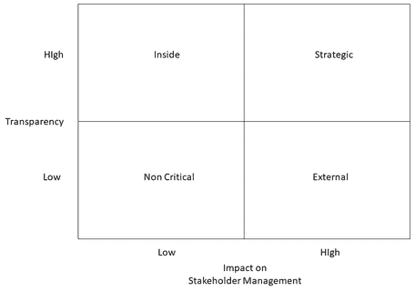
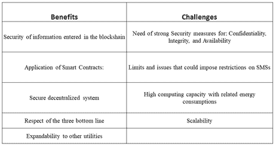

# 第九章

# 智能计量系统：

支持可持续采购的区块链应用

+   贝纳多·尼凯蒂

    意大利坦普尔大学

+   安德烈亚·阿波隆尼

    意大利罗马大学，意大利

摘要

区块链技术是目前最至关重要和激动人心的技术之一。它能够改变商业世界和组织职能。它为现有企业的蓬勃发展、全新企业的成长以及传统组织的严重颠覆提供了多种可能性。本章旨在研究区块链在采购中的应用，同时提高效率和可持续性，并确定其关键成功因素。本章首先提出一个模型，然后描述其在真实商业案例中的应用。它突出了在这个区块链实施中的关键挑战以及区块链在支持公用事业可持续采购方面的潜力。这个区块链应用是针对智能计量的。区块链解决方案有助于实现经济、社会和可持续的三重底线。它可以帮助支持可持续采购，减少错误，改善组织职能和程序，预防欺诈。本章包括了一些挑战及其可能的解决方案。

引言

区块链是一个由一群服务器组成的账本，这些服务器通常不由任何单一实体拥有，里面充满了带有时间戳的不可变数据记录。每个数据块都通过密码学方法进行安全绑定。区块链解决方案的三个主要特性是：

+   • 去中心化。每个人都可以直接与其他人互动，并且是自己的资产（金钱、敏感数据）的所有者或负责人，并可以管理它们。

+   • 透明度。通过实际实体的公共地址，可以查看他/她所参与的所有交易。

+   • 不可变性。一旦某些数据被输入到区块链中，就无法对其进行篡改，且传输过程完全加密。

区块链技术也支持所谓的智能合约（Vacca, A. 等，2020）。智能合约是自动执行合同或其部分内容的计算机程序。从技术上讲，它们是存储在区块链解决方案中的代码，由区块链交易触发，并在该区块链数据库中读取和写入数据。基于区块链技术的智能合约到 2022 年可以每年为金融机构的基础设施成本从 138 亿欧元降低到 184 亿欧元（Probst 等，2016）。它们可以在标准交易中节省时间和降低成本。智能合约可以简化、验证或执行数字协议。这些程序在处理一些法律和商业交易时可能会取代公证人、律师和金融机构。

本章回顾并介绍了一个支持采购的创新区块链解决方案及其关键成功因素。这个视角是为了让组织通过使用区块链解决方案来支持敏捷、有效、高效、道德和经济可持续的采购，从而获得客户的满意度。

可持续性已经成为全球企业的指令性要求，其实施受到两大关键趋势的影响。第一个趋势是创新解决方案的可用性，比如区块链，它具有强大、实惠和灵活的特点。第二个趋势是认识到采购对可持续性有重大影响，并支持整个供应链的绿色化。

本文提出的商业案例与电力网络中智能测量的创新解决方案有关。智能测量的数据收集仍然存在问题，例如数据收集不完整、高质量数据丢失和数据共享困难（Yan, L. et al., 2021）。本章提出了一种使用智能仪表、区块链和智能合约平台收集和处理智能质量数据的方法。该解决方案旨在实现数据收集的自动化并提高收集数据的可靠性（Nicoletti, B. et al., 2020）。分析的商业案例从可持续性的三底线（TBL）角度来看非常有前景：人体工程学、财务和社会。特别关注确保输入到区块链中的数据的安全。彻底的分析和概念验证已经证明了这些好处。

LITERATURE REVIEW AND METHODOLOGY USED

在企业世界中，可持续性的概念在 20 世纪 60 年代正式出现，当时人们对环境退化和资源管理不善的关注开始增长（McKenzie, S., 2004）。利益相关者现在对社会和环境可持续性有了更深入的认识。正是由于这种认识，组织正在努力适应并变得更加负责任和可持续。这些努力意味着可持续性应该成为组织流程的一个重要组成部分，包括采购（Meehan, J. et al., 2011）。

过去的思想认为，可持续性会增加组织的成本。从社会、社会和环境三个支柱来看，可持续性可以提高盈利能力。本章的起点是获取关于可持续采购的适当知识。

Blockchain 是运行在互联网协议之上的应用层，它使经济交易能够在不需要第三方的情况下在参与者之间进行（Wang, Y.等人，2019）。关于采购过程的文献已经大量存在。在采购中的可持续性是一个在科学文献中相对较新的话题。根据 Millington, A.（2008）的说法，公司的社会和环境可持续性是 21 世纪的现象。许多研究人员已经探讨了区块链技术对供应链管理的影响（Treiblmaver, H. 2018；Saberi, S.等人，2019），包括供应链协调（Tian, F. 2016）。区块链的潜在应用可能会增强供应链的可持续性，因为这种技术可以精确且安全地识别、验证、交换和存储数据。区块链解决方案可以将供应链透明度提升到一个新的水平，并揭露不正确的做法（Tian, F.，2016）。Saberi, S.等人（2019）研究了供应链内外的活动，然后提供了关于与区块链解决方案相关的多样化的可持续性导向机会的有价值见解。

从以化石燃料为基础的经济向零碳经济的当前能源转型近年来已显著加速，因为最大的排放国承诺在接下来的 20-30 年内实现碳中性（Saraj, S.等人，2021）。通过数字技术现代化增加了可再生能源的发电，环境可持续性也标志着能源行业。区块链技术可以在提供安全的数字分布式平台方面发挥重要作用。这种解决方案促进了数字化、去碳化和能源系统的分散化。能源领域中一些有前景的区块链应用正在研究和开发中，包括点对点能源交易、碳监测、管理、交易和物联网（IoT）启用的电网管理。一些挑战正在减缓这些应用的大规模实施，包括过时的立法和规定、传统能源行业适应缓慢的步伐以及与新、未经测试的技术相关的风险。

Blockchain 系统允许管理去中心化的电力能源消费/生产交易——这对于管理交易能源系统来说是理想的，在该系统中，生产消费者（prosumers）可以广泛交换能源。Olivares-Rojas, J. C.等人（2021）提出了一种利用智能计量和区块链系统基础设施进行电力能源交易的交易模型，以允许生产消费者进行电力能源的商业化。结果显示，它们可以通过减少补贴并比当前费率更有利可图，成为墨西哥电力市场的良好替代品。

Adeyemi, A. 等人（2020）研究了区块链如何运作以及如何增强电力分配系统的功能。他们的论文讨论了考虑在电力分配系统中使用区块链技术的多个场景。他们的论文还讨论了将区块链技术应用于电力分配系统所面临的挑战以及如何管理这些挑战。

Abdo, J. B. 等人（2020 年）提出了一种点对点的多公用事业交易平台，解决了现有公用事业框架的不足。

区块链解决方案对可持续采购的影响尚未深入分析，这是本章的目的。本章分析了两个在文献中找不到答案的问题：

+   Q1：从采购角度来看，哪些是改善三底线的区块链解决方案的关键成功因素？

+   Q2：区块链解决方案如何支持电力计量过程的可持续性？

BLOCKCHAIN IN SUPPORT OF THE THREE BOTTOM LINES

在疫情期间，采购似乎无法满足其首要功能：为组织提供所需的供应品（Folliot Lalliot, L. 等人，2020 年）。疫情展示了全球 ICT 采购系统的脆弱性，组织发现他们在其整体交付机制内对第二方、第三方和第四方的运营几乎没有任何透明度。在正确的时间和地点提供商品和服务不应失去确保正确质量的重要性（Lysons, K. 等人，2006 年）。

Elkington, J：在 1994 年提出了三底线（TBL）的概念。自那时起，他和其他研究者撰写了关于三底线的文章（Weber, I. 等人 1991 年；Carter, C. 等人 2008 年）。三底线包括三个绩效组件：社会、环境和财务。三底线的维度是三个 P：人、星球和利润，一些作者在其中添加了另一个 P：治理原则（Niskala, M. 等人，2015 年）。

+   • 经济可持续性通常被认为是企业的盈利能力、对客户及其不同利益相关者的增值。经济可持续性还应该包括组织的财务状况和竞争力。

+   • 社会责任总结了关于自然资源，如水、空气和土壤的有效和经济使用的关注，保护自然的多样性以及应对气候变化。在生产产品或服务时，组织要对其气候足迹（Zink, K., 2008）负责。

+   • 社会可持续性包括照顾和提高员工及其技能，尊重并按照人权行动，负责任地管理劳动合同和企业政策。组织的战略应该包括在上限社区、国家和国际当局施加的最小立法和规定之上实施这些可持续性措施。

区块链解决方案可以在可持续性方面帮助采购。在 TBL（三重底线）框架内分析这种支持是可能的。有趣的是，区块链如何有助于满足所有三个底线：

+   -   从经济角度来看，区块链解决方案可以帮助满足信任需求。智能合约等应用程序可以显著帮助确保利益相关者遵守 governing their agreements 和 regulations。在回顾的文献中，区块链解决方案的可持续经济方面主要是其转型潜力以及推动新的去中介化商业模式、更高的运营效率、成本效益和价值创造的新来源。得益于其去中心化特性，区块链解决方案可以降低经济可持续性的成本和交易时间，减少制造和运营过程中的浪费（Le, T. V., 等，2021）。区块链解决方案还提供实时通信、快速支付降低交易费用、低产品/服务成本和更快的交货时间。它构建了一种创新商业模式，并有助于可持续经济。

+   -   采购的社会赋权通过区块链解决方案确保采购利益相关者之间建立信任关系，提高易腐产品的安全性，支持人道主义物流，促进社会公平。从社会的角度来看，新的常态要求尽可能远程完成一切。区块链解决方案可以帮助这种分布式模型。区块链解决方案可以通过确保人权和道德行为来解决不平等（Le, T. V., 等，2021）。例如，区块链解决方案可以通过不可变地记录特定支付期间收集的所有产品来实现公平。

+   • 从环境角度看，区块链解决方案有助于提高更好的恢复力。恢复力在生态学中有着古老的概念和分析存在。生态系统可以适应变化而不受干扰，并继续提供其服务（Folke, C. 2006）。最近，创新的想法描述了全球环境系统在面对极端变化时的运作，例如由气候变化或大流行引起的变化。试图在环境政策和战略上取得进展的组织可以使用区块链来改善其采购过程中的环境实践，减少对能源和自然资源的压力，并提供环保产品。当采购采用区块链解决方案时，尤其是在与国际贸易相关的情况下，区块链解决方案可以产生积极的环境影响。由于区块链解决方案中记录的数据不可逆转，可以找到温室气体排放水平最佳的交通方式（Le, T. V., 等，2021）。此外，区块链解决方案和智能合约可以不断检查驾驶员不要超速驾驶（这会增加排放和油耗），节约能源资源。区块链解决方案还支持寻找使用显著少于不可再生资源的材料和产品/服务。通过这种方式，可以保护环境保护过程。

关键成功因素

在使用区块链解决方案支持可持续采购中的关键成功因素包括：

+   • 利益相关者管理指的是有效的治理，以促进沟通、降低风险和增强所有参与方之间的信任。采购在未来扮演的角色将发生变化。与合作伙伴的关系对于组织的成功至关重要。重要的是不要只提到线性的供应链，而要提到价值网络（Nicoletti, B. 2018）。采购的目标不仅仅是交付产品或服务，而是为客户和组织增加价值。在这种愿景中，采购需要作为一个网络合作伙伴的协调者。生态系统必须作为一个团队运作。所有参与方在区块链解决方案中访问相同的数据有助于提高生态系统内部各方的相互信任。

+   • 透明度意味着组织内部和外部进行交易的 choice 和 action 的清晰。在采购管理中，区块链解决方案可以基于记录功能提高可见性和透明度（Ivanov, D. 等，2018）。这一结果取决于组织的数据驱动能力。这种能力包括组织捕获正确数据、存储它们、分析它们以及基于实时的事实进行决策的能力。采购过程中的可追溯性是区块链技术最具吸引力的用例之一（Kehoe, I. 等，2017）。可追溯性还允许遵守合规性，因为区块链解决方案参照标准和控制，提供遵守监管条件的事实证据。

这些因素（利益相关者管理和可追溯性）并不特定于某些行业。它们跨不同领域普遍存在，并应帮助组织解锁其采购中的隐藏的可持续增值能力。

为了确定区块链解决方案能帮助多少以及如何帮助，可以构建一个包含前面提到的关键成功因素的图表，这些因素对于采购管理中区块链解决方案的成功使用至关重要。利益相关者管理在横坐标上，透明度的发生率在纵坐标上。函数位于一个象限中，显示区块链解决方案如何帮助这些关键成功因素（图 1）：

+   • 对利益相关者管理影响显著且透明度高的函数被定义为“战略函数”。组织通常为管理这些函数而发展整合策略，导致共同创作者关系，即合作伙伴参与创新和运营过程的（准整合）。

+   • 那些透明度重要性高但对利益相关者管理的相关性影响最小的函数被定义为“内部函数”。组织通常旨在通过确保生产周期所需的组件/服务来稳定这些关系，以最小化生产流程的中断内部风险。

+   • 那些对利益相关者管理影响显著，且无需透明度要求的函数被称为“外部函数”。这些函数中，与利益相关者连接的改善的任何进步都能显著提高采购的有效性、效率和经济性。

+   • 在采购市场中透明度重要性低且对利益相关者管理的相关性影响最小的函数被称为“非关键函数”。

| 图 1. 可持续采购关键成功因素 |
| --- |
|  |

商业案例：智能计量系统

解决方案

Smart Metering Systems (SMS) are a fundamental area in the smart utility initiatives (Piatek, K. et al., 2021). The smart utility meters (for instance, for measuring electric electrical consumptions) allow continuous monitoring of utility consumption and report to the vendor company's facilities without an operator's need. Outages, reconnections, and other services can be dynamically automated.

终端用户开始停止成为由公用事业产生的电力的被动消费者。他们开始安装和使用可再生能源，如太阳能电池板和风力涡轮机。智能电表可以测量这种本地电力能源生产以整合到电力电网中。

可以将更多功能添加到 SMS 中，例如测量电力质量事件、集成需求响应系统、电力能源管理。智能电表可以支持各种定价模式，如固定费率或基于与公用事业的连接时间间隔。

Metering is a function with high transparency and a high impact on the customer. It is a “strategic function” in the classification introduced in the previous section.

The Italian telecommunication company, TIM, has proposed an innovative metering solution. In this solution, blockchain and smart contracts are at the base of managing electric energy supply to a device by a vendor (Bellifemine, F. I. et al., 2017). This solution presents several benefits. It also aims to support the best use of energy, increasing the sustainability of the grid system.

TIM 提出的 method includes:

+   • 一个定义了每个设备参考电力轮廓的认证系统。

+   • 一个认证系统，它提供了一个可与电气设备连接的设备和一个提供由能源供应商提供的电能的插座。这个设备通过与电气设备的参考电力轮廓的唯一关联来与电气设备关联。

+   • 电气设备的使用者，通过设备将电气设备连接到插座以使用电能。

+   • 一个检查连接到插座上的设备是否应该是它唯一关联的设备的设备。检查比较了设备的测量电力轮廓与参考电力轮廓。如果检查结果为阳性，该设备收集电力吸收的测量值，并将它们认证为应与它唯一关联的设备的能源消耗。

method includes storing the encrypted and certified collected measures into a blockchain distributed data structure. According to the standard implementation, the vendor catalog may be on a blockchain, while a smart contract can manage the legal and economic relationships with the user.

集成的短信可以通过作为智能网络节点来连接分销商和第三方/多方。智能电表可以使用区块链技术将加密的临时高功率请求转发到网络上的活动节点。短信可以在规定的系统所需的能量时间范围内检测到未充分利用或预见到未充分利用，并在其能源电网管理中考虑这种情况。

整个过程在电子注册表上有记录。这一记录是根据区块链提供的程序进行的，因此不需要一个中央机构来维护单独的注册表。

利益

将区块链解决方案应用于智能电表的需求源于对处理数据的安全性和透明性的需求，以及对使用这些工具的个体用户和企业个人信息的保护（见图 2）。区块链可以被视为虚拟世界交易的一个“认证机器”。当将区块链应用于物理世界（例如，智能电网、堆叠、食品供应链等）时，必须在将信息写入区块链之前确保现实世界的信息是“真实”的。作为提供其计量服务的一般活动的一部分，短信可以保证某些信息来源于特定的用户标识/识别模块（SIM），特定的终端，在特定的时间和特定的位置（基站），从而保证解决方案的完全安全。

智能合约的应用，特别是允许消除分销商和用户之间的障碍，从而节省管理和交易成本，使后者更加安全。此外，当交易发生时，数据记录在新的区块上，用于未来的操作。这样，分销商可以依靠一组收集的数据来正确地向他们的客户收费。

从技术上讲，区块链解决方案的影响主要来自于提供安全去中心化系统的可能性，节点可以独立工作，无需参考中央系统。

与“三重底线”相关的利益如下。

+   • 从经济可持续性的角度来看，虚拟集成的智能电表提供数据通信功能。它们允许分销商和客户进行远程控制和诊断，并基于区块链技术实现智能合约功能。通过对客户需求的详细研究，公用事业分销商可以提出旨在改善合同和客户关系的定制建议。提出的解决方案提供了公用事业分销商完全控制的方式，用户很少需要检查和验证实际数据。

+   从环境角度来看，将新技术解决方案，如物联网（IoT）和区块链，集成到能源生态系统中，相对于电力消费模式引入了灵活性，而无需改变当前的合同。对于公用事业供应商来说，一个重要的好处是能够将他们的资源引导给特定的用户：实际上，电力供应商经常平衡他们客户的特定需求，对于某种特定的电力配置应该可用。如果所有客户都使用最大容量，系统可能会崩溃。通过使用区块链解决方案并控制实际使用数据，服务提供商可以知道他们的用户需要什么，最小化浪费，并努力避免过载。

+   从社会责任的角度来看，智能电表通过与用户分享数据来保证对客户的透明度。智能电表具有特定的功能，可以生成大量数据，从而覆盖每一个变化，并且实时或在几分钟内正确地发送它们。用户对自己消费和潜在浪费有更多的了解后，可以修改自己的行为，提高节能效果，减少污染。目前，数据交换最常用的过程是通过综合信息系统（IIS）进行的。这些系统负责集中收集和处理来自电表的数据。这些系统接收经过验证的数据，而用户无法访问验证后的数据。随后，IIS 会将一些数据传输给用户。当前的过程依赖于公用事业供应商提供的数据流。应用区块链解决方案可能允许一种不同的方法，不再基于公用事业供应商提供的信息，这些供应商控制着数据，而是基于与用户自动、即时和有效地分享信息，这些用户可能是电力的生产者和消费者。

可能可以使用智能电表，在综合虚拟系统的支持下，测量所有用户消费来源，如水、电、天然气，甚至互联网数据使用量（Hong, Y. 等，2021）。数据输入来源可以是直接的，如电力测量，或者是派生的，如天然气和水，这些通常是通过智能电表上游的独立仪表测量的。作为消费测量的验证者和认证者的第三方应该引入物联网和区块链。得益于区块链的控制，物联网保证的连接，以及第三方保证数据认证的工作，这种灵活性可能转移到客户身上，而合同形式保持不变。

挑战

区块链解决方案可以提供相当多的机会和好处。由于区块链是一项新技术，它存在局限性和问题，这可能会对短信（SMS）造成限制。在这些限制中，区块链解决方案呈现了交易和过程可以发生的时间间隔。数据的计算有限制可能会对其采用产生阻碍。这个问题主要出现在公共区块链中，其特点是更加集中。因此，更倾向于使用私有区块链，因为其去中心化。考虑采用公共或私有系统实施区块链解决方案的利弊是合适的。后者，尽管更安全，但执行交易需要更多的时间。

在像公共区块链这样的开放网络上，安全性始终是一个挑战。考虑安全性可以是围绕 CIA 属性（Dhillon, G. 等人，2000 年）进行的：

+   在复制所有数据于其网络上的分布式系统中，机密性是低的。目标加密可以帮助解决这一问题（Kosba, A. 等人，2016 年）。

+   • 完整性是区块链的一个关键特性，尽管存在挑战（Eyal, I. 等人，2014 年；Gervais, A. 等人，2016 年）。

+   • 由于广泛复制，从区块链读取的角度来看，可用性可以认为是高的，但在写入可用性方面则不那么有利（Weber, I. 等人，2017 年）。

围绕分叉存在新的攻击向量，例如通过网络分割（Natoli, C. 等人，2017 年）。这在私有或联盟区块链中特别相关。

区块链解决方案需要高计算能力。短信（SMS）可以节省识别浪费的能耗，但处理区块链操作会消耗能源。特别是电力资源的高消耗，取决于区块链共识机制，其中矿工不断竞争挖掘下一个区块以获得高额奖励（Weber, I. 等人，2017 年）。这种方法可以被视为浪费的，但它只是工作量证明（proof-of-work）机制中大量重复努力的轻微迹象。工作量证明的替代方案，如权益证明（proof-of-stake），已经讨论了一段时间，并且会效率更高（Bentov, I. 等人，2016 年）。在撰写本文时，它们仍然是一个未经证实但令人兴奋的替代方案。工作量证明在信任其他参与者方面做出了普遍假设，这对于管理数字资产的开源网络来说非常合适，如本文研究的智能抄表案例中所用到的 SIM 卡。

区块链解决方案存在可扩展性问题。有必要验证大量智能仪表交易和操作（Mollah, M. B., 等人，2020 年）。

| 图 2. 智能抄表系统的利与挑战 |
| --- |
|  |

研究发现：

本章旨在回答两个问题：

+   第一问：区块链解决方案从采购角度来看，改善三底线（经济、社会、环境）的关键成功因素是什么？

+   第二问：区块链解决方案如何支持电力计量过程的可持续性？

本章节提出了一个模型，用于解释在响应第一个问题中实施可持续采购的关键成功因素。

相对于第二个问题，本章节中为智能计量服务提出的商业案例展示了区块链解决方案支持负责任的采购所带来的好处和挑战，并且在电力消耗方面对可持续性也有显著影响。公用事业供应商可以成功实施区块链，以确保向客户和最终用户提供透明度，消除与欺诈、人为错误、滥用和其他问题相关的潜在问题，并保证商品和服务的可靠追溯性，尤其是它们在原地的处理过程。

结论

将区块链解决方案和智能合约应用于智能计量系统中，代表了在使用前沿系统进行数据收集方面迈出了前进的步伐。

本章节中提出的解决方案克服了传统计量模型限制。本章节定义了其特性和限制。在一些国家，仍然需要技术推动，以使适当的工具达到更先进国家的标准。关于数据交换和可持续性问题的意识仍然较小。

由于区块链节点的去中心化特性和由此提供的安全性，区块链解决方案支持将智能电表与一个适合透明且安全交换数据的系统集成。通过大量数据的自动交换，可以控制和评估何时发生浪费，并且基于这些信息，采用补偿客户需求的特定解决方案，避免资源浪费。

短信使用区块链解决方案来交换和分析客户关于消耗的数据。提供计量器的组织将有一个注册表，以保存所有必要的信息，以避免短路并更有效地管理客户关系。

尽管提供了机会，但区块链解决方案仍然面临挑战，例如可扩展性和管理多项操作的成本。私有区块链可以通过更先进的区块链解决方案来克服或至少减轻这些问题。

未来研究方向

研究人员的兴趣正在增加，他们关注区块链解决方案在采购中的应用。区块链是一种有效的技术，用于在采购中提供经济安全与隐私。然而，在未来的研究中，找到更好的可扩展性、专业知识不足和高交易成本的区块链解决方案至关重要。缺乏国际标准是这些创新解决方案广泛采用的另一个重大障碍。

使用区块链解决方案的另一个挑战是工作量证明（proof of work）的挖矿过程中的能源消耗（Vukolić, M., 2015）。未来会出现一波新的区块链方法，其中将根据具体的用例组合不同的挖矿算法。引入区块链解决方案将提高可持续性、可追溯性，支持透明度，并增加可持续产品市场份额，从而减少涉及产品的 CO2 和 NOx 排放。

在采购中使用区块链的更有趣的方式支持组织结构的根本性变化（Nicoletti, 2017），价值网络构成组织运营的一部分，其中不同的路径允许产品的高级定制。数字采购的目标不仅仅是向客户和组织增加价值的交付产品或服务。在这个新愿景中，采购需要作为一个合作伙伴网络的协调者。生态系统必须作为一个团队运作。对采购这一新角色需要进行更多的研究。

深入分析支持生产者-消费者（prosumer）新角色的短信（SMS）解决方案将很有趣。这一角色得益于可再生能源降低发电技术成本的新场景。这一新场景改变了终端用户的角色，从简单的消费者转变为能源的生产者（Olivares-Rojas, J, C, 等，2021）。这一新角色被称为生产者-消费者（prosumer），它通过允许 prosumer 将能源过剩商品化，向电力公司和其他 prosumer 进行交易，从而有助于改变电力市场（Sivianes, M. 等，2021）。智能电表系统支持这一新场景。深入分析利用区块链技术充分发挥分散式能源管理算法的优势将很有趣。它作为一天前能源计划，允许每个网络实体与其他微网代理进行安全的点对点（P2P）电力交易，以开发可持续的解决方案（Mengelkamp, et al. 2018）。智能电表可以在点对点能源交易中支持市场拍卖。Mengelkamp 等人（2018）构建了一种拍卖机制，智能电表可以测量和预测每个用户的供需情况，并随后广播这些信息。基于这些信息，可以计算出过剩的供需情况，并将这些信息发送到相应代理的区块链账户。Hahn 等人（2017）提出了一种分布式拍卖系统，其中拥有过剩电力的卖家可以启动新的拍卖，并在区块链上发布其可用的电力。需要电力的竞拍者可以在收到这些信息后进行竞拍。智能合约自动化拍卖和支付流程，智能电表在交易过程中检测并报告电力流动，验证交易的完成。

感谢

作者感谢 TIM 的 Danilo Gotta 指出这个应用。

REFERENCES

Abdo, J. B., & Zeadally, S. (2020). 多用途框架：用于可持续发展的区块链交换平台。国际广泛计算与通信杂志。

Adeyemi, A., Yan, M., Shahidehpour, M., Botero, C., Guerra, A. V., Gurung, N., Zhang, L. C., & Paaso, A. (2020). 电力分配系统中的区块链技术应用。The Electricity Journal，33(8)，106817。doi:10.1016/j.tej.2020.106817

Appolloni, A., & Cheng, W. (2021). 可持续采购：向可持续发展迈进的知识和实践。Giappichelli。

Bellifemine, F. L., Gotta, D., & Trucco, T. (2017). 系统和方法：通过认证措施管理电力能源供应。patents.google.com/patent/WO2019081298A1/en

Bentov, I. Gabizon, A. Mizrahi, A. (2016, 二月). 不需要工作量证明的加密货币。在国际金融密码学和数据安全会议上，142-157。Springer。

Carter, C., & Rogers, D. (2008). 可持续供应链管理的框架：走向新理论。国际物理分销与物流管理杂志，38(5)，360-387。doi:10.1108/09600030810882816

Dhillon, G., & Backhouse, J. (2000). 技术观点：新千年信息系统的安全管理。ACM 通讯，43(7)，125-128。doi:10.1145/341852.341877

Elkington, J. (1994). 向可持续公司迈进：实现可持续发展的三赢商业策略。加州管理评论，36(2)，90-100。doi:10.2307/41165746

Eyal, I. Sirer, E. G. (2014, 三月). 多数票还不够：比特币挖矿是脆弱的。在国际金融密码学和数据安全会议上，436-454。Springer。10.1007/978-3-662-45472-5_28

Folke, C. (2006). 弹性：社会生态系统分析的视角出现。全球环境变化，16(3)，253-267。doi:10.1016/j.gloenvcha.2006.04.002

Folliot Lalliot, L., & Yukins, C. R. (2020). COVID-19: 公共采购中吸取的教训。是时候恢复正常了吗？46-58。

Gervais, A. Karame, G. O. Wüst, K. Glykantzis, V. Ritzdorf, H. Capkun, S. (2016, 十月). 关于工作量证明区块链的安全性和性能。2016 年 ACM SIGSAC 计算机和通信安全会议，3-16。10.1145/2976749.2978341

Hahn, A., Singh, R., Liu, C. C., & Chen, S. (2017). 基于智能合约的校园分布式能源拍卖演示。IEEE 电力与能源学会创新智能电网技术会议，1-5。

Hong, Y., Yoon, S., Kim, Y. S., & Jang, H. (2021). 使用自动编码器的建筑能源系统中的系统级虚拟感知方法：在有限传感器和操作数据集下。应用能源，301，117458。doi:10.1016/j.apenergy.2021.117458

Ivanov, D., Dolgui, A., & Sokolov, B. (2018). 在考虑弹性分析的供应链中安排恢复行动。 《生产研究国际期刊》 , 56(19), 6473–6490。DOI:10.1080/00207543.2017.1401747

Kehoe, L. (2017). 当两条链结合: 供应链遇见区块链。德勤。

Kosba, A., Miller, A., Shi, E., Wen, Z., & Papamanthou, C. (2016, May). Hawk: 密码学与保护隐私的智能合约的区块链模型。在 2016 年 IEEE 安全与隐私研讨会(SP), 839-858。IEEE。

Le, T. V., & Hsu, C. L. (2021, April). 区块链技术的系统文献综述: 安全属性、应用和挑战。《互联网技术期刊》。

Lysons, K., & Farrington, B. (2006). 《采购与供应链管理》。皮尔逊教育。

McKenzie, S. (2004). 《社会可持续性: 一些定义》。霍克研究学院。

Meehan, J., & Bryde, D. (2011). 可持续采购实践。 《商业战略与环境》 , 20(2), 94–106。DOI:10.1002/bse.678

Mengelkamp, E., Notheisen, B., Beer, C., Dauer, D., & Weinhardt, C. (2018). 基于区块链的智能电网: 向可持续的本地能源市场迈进。《计算机科学 - 研究与开发》 , 33(1–2), 207–214。

Millington, A. (2008). 《责任供应链管理》 - 《牛津公司社会责任手册》。牛津大学出版社。

Mollah, M. B., Zhao, J., Niyato, D., Lam, K. Y., Zhang, X., Ghias, A. M., Koh, L. H., & Yang, L. (2020). 区块链在未来智能电网中的应用: 综合调查。《IEEE 物联网杂志》 , 8(1), 18–43。DOI:10.1109/JIOT.2020.2993601

Natoli, C., & Gramoli, V. (2017, June). 平衡攻击或为什么分叉区块链不适合联盟。《2017 年第 47 届 IEEE/IFIP 国际可靠系统网络会议(DSN),》 (pp. 579-590)。IEEE。10.1109/DSN.2017.44

Nicoletti,

Nicoletti, B. (2018). 《采购金融》。Springer 国际出版。DOI:10.1007/978-3-030-02140-5

Nicoletti, B., & Appolloni, A. (2020). 《供应链管理中的大数据分析: 理论与应用》。在《供应链管理中的大数据分析: 理论与应用》。CRC 出版社。

Niskala, M., Pajunen, T., & Tarna-Mani, K. (2015). 《企业责任: 报告与计算原则》。ST-Akatemia Oy。

Olivares-Rojas, J. C., Reyes-Archundia, E., Gutiérrez-Gnecchi, J. A., Molina-Moreno, I., Cerda-Jacobo, J., & Méndez-Patiño, A. (2021). 利用区块链的智慧计量系统的一种交易能源模型。《电力与能源系统学报》。

Piatek, K., Firlit, A., Chmielowiec, K., Dutka, M., Barczentewicz, S., & Hanzelka, Z. (2021). 分布式系统中用于电力质量测量的最佳测点选择。《Energies》 , 14(4), 1202。DOI:10.3390/en14041202

Probst, L., Frideres, L., Cambier, B., & Martinez-Diaz, C. (2016). 区块链应用和服务，欧盟内部市场、工业、企业家精神和中小企业总署。

Saberi, S., Kouhizadeh, M., Sarkis, J., & Shen, L. (2019). 区块链技术与可持续供应链管理的关系。国际生产研究杂志, 57(7), 2117-2135。DOI:10.1080/00207543.2018.1533261

Saraj, S., & Khalaf, C. (2021). 区块链在能源行业中的应用。在基于区块链的人工智能监管方面。IGI Global。

Sivianes, M., & Bordons, C. (2021, October). 区块链在微网中的点对点能源交易应用。在国际区块链和应用国会(pp. 138-148)。Springer。

Tian, F. (2016, June). 基于 RFID 和区块链技术的中国的农业食品供应链追溯系统。在 2016 年第十三届国际服务系统和服务管理会议(pp. 1-6)。IEEE。

Treiblmaier, H. (2018). 区块链对供应链的影响：一个基于理论的研究框架和行动呼吁。供应链管理杂志, 23(6), 545-559。DOI:10.1108/SCM-01-2018-0029

Vacca, A., Di Sorbo, A., Visaggio, C. A., & Canfora, G. (2020). 区块链和智能合约开发的系统文献综述：技术、工具和开放挑战。系统与软件杂志, 110891。

Vukolić, M. (2015, October). 寻求可扩展的区块链面料：工作量证明与 BFT 复制的斗争。在国际网络安全开放问题研讨会(pp. 112-125)。Springer。

Wang, Y., Singgih, M., Wang, J., & Rit, M. (2019). 理解区块链技术：它将如何改变供应链？国际生产经济学杂志, 211, 221-236。DOI:10.1016/j.ijpe.2019.02.002

Weber, I., Gramoli, V., Staples, M., & Ponomarev, A. (2017). 区块链基础系统的可用性。SRDS'17: IEEE 国际可靠分布式系统研讨会。

Yan, L., Angang, Z., Huaiying, S., Lingda, K., Guang, S., & Shuming, S. (2021, July). 基于区块链的智能电表质量数据可靠收集机制。在人工智能与安全国际会议(pp. 476-487)。Springer。10.1007/978-3-030-78612-0_38

Yukins, C. R. (2006). 比较采购法案例研究：评估联合国国际贸易法委员会对美国采购的启示。公共合同法杂志, 457-484。

Zink, K. (2008). 企业可持续性作为全面管理的挑战。Physica-Verlag。DOI:10.1007/978-3-7908-2046-1

ADDITIONAL READING

Appolloni, A., & Cheng, W. (2021). 可持续采购：向可持续发展的知识与实践。Giappichelli。

De Giovanni, P. (2020). 区块链和智能合约在供应链管理中的应用：一个博弈论模型。国际生产经济学杂志, 228, 107855。DOI:10.1016/j.ijpe.2020.107855

Nicoletti, B. (2020). 采购 4.0 与第四次工业革命 . Springer International Publishing. doi:10.1007/978-3-030-35979-9

**关键术语和定义**

区块链：一个充满时间戳的不可变数据记录的账本，由一群服务器管理，这些服务器通常不由任何单一实体拥有。这些数据块通过密码学的方式进行安全绑定。公共区块链和私有区块链之间的主要区别在于，私有区块链控制谁可以参与网络，执行决定挖矿权和奖励的共识协议，并维护共享账本。

能源网：一个将电力从生产者输送到消费者的互联网络。

物联网（IoT）：一系列互联的基础设施，连接对象并实现对它们的管理、数据挖掘以及访问它们生成的数据。

产消者：既是服务或商品的生产者又是消费者。

智能合约：它是一种自我执行的合约，买方和卖方的协议条款直接编码到程序中。代码控制着合约的执行，交易是可追踪且不可撤销的。

智能电表：一种记录电力消耗的电子设备，并将信息传达给电力供应商以进行监控和计费。

利益相关者管理：维护与对特定工作影响最大的人良好关系的过程。

可持续采购：在处理采购过程和程序时，采用社会、经济和环境因素，与典型的价格和质量考虑因素一起。

透明度：任何授权的人都可以加入网络，因此，能够查看该网络上的所有信息。

三重底线（TBL）：一个由社会、环境和财务三个部分构成的管理框架。一些组织已经采用了 TBL 框架，从更广阔的视角评估其绩效，以创造更大的价值。
