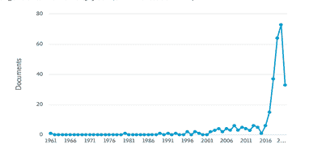
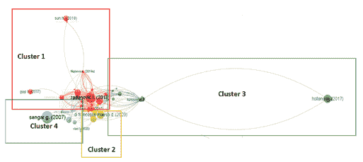

# 第十章

# Trends in Blockchain Technologies（区块链技术的趋势）

文献计量分析

+   马里亚 Carmela Passarelli

    意大利卡利亚里大学

+   阿尔菲奥·卡里奥拉

    意大利卡利亚里大学

+   朱塞佩·隆戈诺

    意大利卡利亚里大学

ABSTRACT（摘要）

本工作的目的是调查区块链技术的兴起研究趋势，并提出一个基于证据的路线图，以鼓励进一步研究区块链技术的管理。提出了一个文献计量分析，重点关注区块链技术领域的知识产权（IP）问题。然后，研究突出了区块链提供的主要好处以及从文献中出现的主要困难、障碍和挑战。本研究为科学界了解区块链技术的当前状态提供了参考，从而为该领域的未来研究做出贡献。此外，它还为企业家、经理和从业者提供了工业影响和建议。

INTRODUCTION（引言）

在过去的几年里，区块链技术已经引起了学术界、行业从业者和政府的高度关注。特别是数字货币比特币，区块链技术在 2008 年首次吸引了公众的注意。它开始被应用于不同领域，并激发数字创新。区块链技术的主要优点是它能够同时验证大量属性（例如，身份、作者/创作权、财产、时间或顺序）。它通过防止其操纵，使正确信息在网络中分布。信息可以被保存在安全且不受未经授权的第三方影响的状态，这在公司和工业环境中尤为重要。

一些学者已经对区块链技术的科学研究进行了回顾（于&潘，2021 年），但很少关注专利生产和未来可能的主要趋势。因此，本研究采用文献计量分析来调查在区块链上的知识产权活动的兴起研究趋势。本研究组织如下。第一部分关注与区块链技术相关的文献。随后是关于主要关注知识产权（IP）问题的区块链技术领域的主要科学研究的文献计量分析部分。然后，研究突出了区块链提供的的主要好处以及从每个集群的文献综述中出现的的主要困难、障碍和挑战。最后部分报告了含义、建议和进一步研究。

LITERATURE BACKGROUND（文献背景）

学术界和行业实践者都已关注到区块链应用的广泛范围，但相关技术的发展尚未得到充分研究。一些评论文章探讨了区块链在不同领域中的具体作用：物联网（IoT；（Conoscenti 等人，2016 年，Christidis 和 Devetsikiotis，2016 年）；大数据（Karafiloski 和 Mishev，2017a）；安全（Khan 和 Salah，2017 年；李等人，2017 年；孟等人，2018 年）；服务系统（Seebacher 等人，2017 年）；以及点对点（P2P）平台（Hawlitschek 等人，2018 年）。其他研究（Bonneau 等人，2015 年；Tsukerman，2015 年；Mukhopadhyay 等人，2016 年；Khalilov 和 Levi，2018 年；Conti 等人，2018 年）聚焦于隐私。Yli-Huumo 等人（2016 年）分析了 41 篇关于区块链技术的论文，并得出结论：当时延迟和硬分叉等挑战还没有合理的解决方案。Hölbl 等人（2018 年）检查了 33 项医疗保健研究，并表示该领域区块链应用的研究仍处于框架设计阶段。Firdaus 等人（2019 年）对 1119 篇论文进行了统计分析，发现美国、中国和德国是在区块链技术上发表论文最多的国家，物联网和医疗保健是研究人员最受欢迎的领域。Dabbagh、Sookhak 和 Safa（2019 年）综述了几篇论文，揭示计算机科学、工程、经济学和电信是主要的区块链研究领域。Casino 等人（2019 年）进行了一项结构化、系统的文献回顾和主题内容分析，展示了供应链、商业、医疗保健、物联网、隐私和数据管理等不同领域的区块链赋能应用的全面分类。与此同时，胡和潘（2021 年）通过审查相关专利，确定了区块链技术的路径。然而，这些领域还尚未得到充分研究。大量投资正流入区块链领域，以支持在精确医疗、金融交易、能源浪费减少、数字版权管理等方面的创新和新区块链应用。公司对于通过提交专利申请来宣称其发明权感兴趣。这一领域可能会成为未来知识产权的“抢夺”之地。因此，本研究试图理解区块链文献中关注专利活动的哪些主要趋势？该领域的主要实践是什么？主要的好处和未来可能的挑战是什么？通过分析 286 篇论文，可以从技术角度了解区块链的发展情况。然后，提出了一个关注具体管理领域的建议，通过选择 57 篇论文。本研究为科学界提供了解当前区块链技术状态的参考，从而为该领域的未来研究做出贡献。

区块链技术的专利活动：文献计量分析

管理领域的几位学者（Akbari 等人，2020 年；Gaviria-Marin 等人，2019 年；McMillan，2008 年；Skute 等人，2019 年）；创业领域（Albort-Morant 与 Ribeiro-Soriano，2016 年；Ferreira，2018 年；Gartner 等人，2006 年；Lampe 等人，2019 年；Verma 与 Gustafsson，2020 年）；社会科学（Ho，2014 年）；以及医学科学（Cheng 与 Zhang，2013 年）已经认识到文献计量分析的重要性。这是一种补充系统文献综述的工具。它通过客观技术支持系统分析，并允许我们识别有影响力的作者并揭示他们之间的相互关系（Ferreira，2018 年）。这种方法基于科学文献的统计分析和相关引文分析。这可以用来识别特定研究领域的发展程度。

为了识别特定领域的出版物，使用了两种不同的引文分析方法。第一种方法是文献耦合分析，当两篇文档在其文献图中共同引用第三篇文档时使用，这表明这些文档之间可能通过正在讨论的主题相关联。给定两篇文档的“耦合强度”由它们与其他文档共享的引用数量决定（Ferreira，2018 年；Kessler，1963 年；Martyn，1964 年）。第二种方法是共引分析，当两篇文档在一份或多份文档中被独立引用时使用（Small，1973 年）。在一个链接受限的数据库中，文献耦合分析将最新的文档聚集在一起，只有为数不多的非常旧的论文被涉及，而共引分析聚集最旧的文档，而不是尚未被引用的较新的文档。本研究采用耦合分析。

数据收集

在本节中，作者呈现了一篇关于区块链技术领域知识产权（IP）问题的文献综述。为进行文献计量分析（费雷拉，2018），开发了一个专门的协议。相关文章的选择涉及三个阶段。首先，选择了一种特定的查询类型。搜索策略基于结构化查询，并使用广泛的引文数据库实施。其次，选择了爱思唯尔 Scopus 数据库，因为：（a）它是世界上最大的引文数据库之一；（b）它索引了从 1788 年起大约 7000 万份文件（任何数据库中数量最多的）(卡瓦隆内和帕尔 umbo，2020)；以及（c）它涵盖了从生物科学到管理和社会科学的主题领域（卡瓦隆内和帕尔 umbo，2020）。此外，它还包括有关学术出版物的数据，包括所属机构和引文。最后，针对每个数据库的搜索引擎的特定属性对以下查询进行了调整。如下所示：（标题-摘要-关键词（区块链* AND 专利*）或标题-摘要-关键词（块 AND 链* AND 专利*）或标题-摘要-关键词（知识产权 AND 财产 AND 区块链*）或标题-摘要-关键词（知识产权 AND 财产 AND 块 AND 链*）。2021 年 5 月进行的搜索返回了 286 篇论文。在下一节中，作者详细描述了这些论文。第一篇论文发表于 1961 年，但大多数论文发表于 2016 年（图 1）。

|  |
| --- |
|  |

我们的文献计量分析基于费雷拉（2018）的研究。作者旨在识别（a）与区块链相关的主要文章；（b）该领域的最有影响力的人物；（c）作者之间的相应网络；以及（d）在管理学领域可能未来的研究发展。

数据分析

作者使用了 VOSviewer 软件（www.vosviewer.com）来进行耦合分析。VOSviewer 允许构建和可视化文献计量网络，包括杂志、基于共同引用的研究人员、文献耦合和父子关系（范埃克等，2010）。VOSviewer 基于一个三阶段递归矩阵构建地图：（a）“相似性矩阵”应用映射方法（沃尔特曼等，2010）使用关联的强度；（b）反映对象之间相似程度的地图（范埃克等，2010）；以及（c）进行旋转和反射，以纠正文献中描述的优化问题（奥康奈尔等，1999）。

进行了文献耦合分析。研究表明，文献耦合技术可用于识别热门研究课题，并可辅助未来研究方向（Glänzel & Czerwon, 1996）。选定了文献最少引用次数为两次的文档。共有 286 份文档，其中 119 份文档符合阈值。对于每个文档，计算了其与其他文档的文献耦合链接的总强度。作者省略了总链接强度为零的论文，最终剩下了 54 个项目。

发现

通过耦合分析，我们得到了四个聚类（一个聚类必须至少有五次引用）。结果表明，有四个“热门”研究课题（Glänzel & Czerwon, 1996）。图 2 提供了对研究趋势的详细描述。

| 图 2\. 主要趋势 |
| --- |
|  |

表 1 提供了与每个聚类相关的主要参考文献的摘要。

表 1\. 按聚类分类的参考文献

| 主要领域/聚类 | 主要参考文献 |
| --- | --- |

| 区块链的技术和社会应用 | • Radanović, I. & Likić, R. (2018) • Drobyazko, S., Makedon, V., Zhuravlov, D., Buglak, Y., & Stetsenko, V. (2019)

• Zeilinger, M. (2018)

• Sun, H., Wang, X., & Wang, X. (2018)

• Tsai, W., Feng, L., Zhang, H., You, Y., Wang, L., & Zhong, Y. (2017)

• Truong, N. B., Um, T., Zhou, B., & Lee, G. M. (2018)

• Ito K., O’Dair, M. (2019)

• Li, P., Xu, H., Ma, T., & Mu, Y. (2018)

• Steinwandter, V. & Herwig, C. (2019)

• Filippova E. (2019)

• Feng, L., Zhang, H., Tsai, W.T., 等（2019）

• Low, K. & Mik, E. (2020)

• Filippova E., Scharl A., & Filippov P. (2019)

• O’Leary, K., O'Reilly, P., Feller, J., Gleasure, R., Li, S., & Cristoforo, J. (2017)

• O’Dwyer, R. (2020)

• Alkhudary, R., Brusset, X., & Fenies, P. (2020)

• Yang, Y. J. & Hwang, J. C. (2020)

• Alkhudary, R., Brusset, X., & Fenies, P. (2020)

• Dong, X. (2018)

• Coeckelbergh, M., DuPont, Q., & Reijers, W. (2018) |

| 区块链的市场应用和战略采用 | • Maesa, D. D. F. & Mori, P. (2020) • Yang, F., Zhou, W., Wu, Q., Long, R., Xiong, N. N., & Zhou, M. (2019)

• Rahmanzadeh, S., Pishvaee, M. S., & Rasouli, M. R. (2020)

• Gipp, B., Breitinger, C., Meuschke, N., & Beel, J. (2017)

• Wang, J., Wang, S., Guo, J., Du, Y., Cheng, S., & Li, X. (2019)

• Huang, Y., Bian, R., Li, J., Zhao, L., & Shi, P. (2019)

• Dos Santos, R. B., Torrisi, N. M., Yamada, E. R. K., & Pantoni, R. P. (2019)

• Yang, F. 等人 (2019)

• Alnafrah, I., Bogdanova, E., & Maximova, T. (2019)

• Somin, S., Altshuler, Y., Gordon, G., & Shmueli, E. (2020)

• Bai, Y. 等人 (2018)

• Schönhals, A., Hepp, T., & Gipp, B. (2018)

• Daim, T., Lai, K. K., Yalcin, H., Alsoubie, F., & Kumar, V. (2020)

• Yang J. (2018)

• Holland, M., Nigischer, C., & Stjepandic, J. (2017) |

区块链的管理和新兴商业模式| • Holland, M., Stjepandić, J., & Nigischer, C. (2018) • Kurpjuweit, S., Schmidt, C. G., Klöckner, M., & Wagner, S. M. (2021)

• Papakostas, N., Newell, A., & Hargaden, V. (2019)

• Engelmann, F., Holland, M., Nigischer, C., & Stjepandić, J. (2018)

• Duy, P. T., Hien, D. T. T., Hien, D. H., & Pham, V. H. (2018)

• Klöckner, M., Kurpjuweit, S., Velu, C., & Wagner, S. M. (2020)

• Modic, D., Hafner, A., Damij, N., & Cehovin Zajc, L. (2019)

• Clarke, N. S., Jürgens, B., & Herrero-Solana, V. (2020)

• Lin, J., Long, W., Zhang, A., & Chai, Y. (2019) |

区块链安全与可追溯性| • Sengar, G., Mukhopadhyay, D., & Chowdhury, D. R. (2007) • Bhuiyan, M. Z. A., Zaman, A., Wang, T., Wang, G., Tao, H., & Hassan, M. M. (2018)

• McLoone, M. & McCanny, J. V. (2003)

• Jing, N., Liu, Q., & Sugumaran, V. (2021)

• Rathor, M. & Sengupta, A. (2020)

• Xiao, L., Huang, W., Xie, Y., Xiao, W., & Li, K. (2020b)

• Chi, J., Lee, J., Kim, N., Choi, J., & Park, S. (2020)

• Bhat, M. & Vijayal, S. (2017)

• Grieco, G., Song, W., Cygan, A., Feist, J., & Groce, A. (2020) |

来源：(作者详述)

下面描述了耦合分析出的集群。在讨论每个集群时，我们提议一些实践的重点，相关的利益和可能的挑战。

集群 1：技术和社会可持续性应用（红色）

第一个集群显示了区块链技术对社会和工作生活的各个方面适应性。可能的区块链应用实践对于社会经济企业可能非常有兴趣，包括以下内容：

+   • 能源实践。由于近年来可持续性趋势，能源部门的管理在全球每个部分都变得至关重要。区块链技术的应用可以使能源供应系统去中心化，简化所有级别的交易，并直接连接能源生产商、供应商和分销系统与消费者。它主要可以集中于建立能源交易平台和创建分布式能源系统。通过区块链和智能合约，能源网络也可以通过监控消费得到有效控制，既包括账单，也包括电动汽车充电（Filippova 等人 2019 年；Brilliantova 和 Thurner 2019 年）。

+   -   健康领域的实践。与医疗保健相关的问题有几个，比如个人患者医疗信息的适当管理不足，以及数据访问、来源和完整性的真正控制。所有这些问题都可以通过应用区块链技术来解决，以使数字医疗记录变得安全和不可篡改。提到制药行业和药品质量，通过区块链，可能消除假药，同时保护公共卫生。（Radanovic & Likić, 2018; Steinwandter & Herwig, 2019; Bhuiyan et al., 2018）。

+   -   可持续性实践。世界的资源处于稀缺状态，并且参考 17 个可持续发展的目标，需要一个可持续且智能的平台来管理这些资源。在这种背景下，区块链可以应用于水质监测和特别是雨水管理。（Thejaswini & Ranjitha, 2021; Willrich et al., 2019; Alcarria et al., 2018）。例如，可以实施垃圾方面的可能应用。事实上，通过利用区块链技术的特点，可以有效地监控垃圾的生命周期。回收系统的透明度以及所有垃圾都可以根据不同的特征（一次性，可回收，特殊，化学和其他）进行跟踪。（França et al., 2020; Gupta & Bedi, 2018）。

+   -   艺术领域的实践。通常，艺术家和权利人无法获得有关他们作品生命周期详细信息，因此不知道他们的工作在哪里以及如何使用。（Zeilinger, 2018; O'Dwyer, 2020）。区块链可以帮助他们追踪作品。此外，使用区块链技术作为更广泛解决方案的一部分，可以实现数字艺术及其所有权的可见性（McConaghy et al., 2017）。

+   -   教育领域的实践。通过这个应用程序，可以上传有关学生学术成绩的信息，管理证书或上传所有学术资历。这创建了一个协作和安全的环境，教师、行政人员和学生可以安全地执行他们的职责，并知道不会有任何信息丢失（Sun, Wang & Wang, 2018; Chen et al., 2018）。

+   -   追踪捐赠和筹款实践。通过这个应用程序，捐赠者有机会跟踪捐款的流程和目的地。另一方面，NGO 可以详细报告每个支出流，确保投资的钱实际上用于其预期目的。

一些关于技术和社会可持续性应用的例子在 BOX 1 中有所展示。

表 2. 案例研究药片。

| uPort 是一个新兴的开源身份管理系统，为用户提供、组织和其他实体提供主权身份。（Lundkvist et al., 2017）。 |
| --- |
| -   | TUDocChain。这是一个平台，它授权在公共账本上以可靠和可持续的格式发布学术证书。它是发行、验证和分享证书的实用解决方案。（Budhiraja & Rani，2020）。 |

集群 1 中突出显示的应用也可以提供一些可能的益处。具体来说：

+   -   安全的远程医疗和电子护理系统。大量的社会经济组织涉及医疗保健和社会援助，位于需要它们的人附近，包括在去中心化地区，这个应用可能对人们的生活质量产生相当大的影响。

+   -   将数字艺术融入高端商业艺术市场的机会。

+   -   通过将区块链应用于教育，以数字形式进行技能认证和安全。

+   -   改善废物部门将使所有废物运动可靠、透明和安全的记录成为可能，从而使废物能够从源头追溯到处理和处置（Laouar，Hamad& Eom，2019）。

从属于集群 1 的文献分析中出现了不同的挑战。

+   -   区块链在人道主义项目中的应用面临许多障碍；然而，一个可能的挑战例如，将区块链整合到为难民提供的数字食品券计划中。与其通过区块链提供实物券来购买食品，不如让难民扫描他们的虹膜，放置在指定杂货店的机器上，当他们购物时，数字扣除他们的食品券余额。

+   -   区块链应用可以应用于私人和社会公共部门。然而，到目前为止，世界上只有 25 个政府正在积极运行区块链试点项目。因此，实现公共部门应用可能是另一个挑战。

集群 2：市场应用和区块链的战略采用（黄色）

互联网现在允许营销人员更深入地渗透到现有市场，创建新的在线市场，并产生新的需求。这种动态市场参与使用新技术更有效地定位消费者和管理支付。可以识别出与市场应用和战略采用相关的几种做法。具体来说：

+   • 金融实践。金融部门可能是最适合区块链技术的领域之一（比特币，一种于 2008 年创建的加密货币，拥有一个区块链系统）。还有其他一些应用（，）例如记录和验证数字货币的所有权，或者用数字货币执行、验证和记录支付，但这也涉及到信用证券、衍生品和其他金融工具，信用登记，传统商品支付交易等。其中一些已经是现实，而其他的在技术上是可行的，但遇到了立法和官僚问题（Coeckelbergh, DuPont & Reijers 2018; Yang et al., 2019; Varma, 2019）。

+   • 投票实践。另一个重要的应用是投票机制，它既用于总统和国家领导人的选举，也用于较小规模的选举，或者在私人领域。基于区块链网络的投票过程，偏好可以直接执行，提供了操纵结果的不可能性。可以考虑从传统的投票方法（集中式）向基于信任、透明度和保密性的电子投票方法（去中心化）的范式转变，同时确保安全，防止可能的篡改（Maesa & Mori, 2020; Taş & Tanrıöver, 2020）。

+   • 保险实践。传统的保险市场需要涉及多方参与的政策提交到客户购买等多个手动交易。此外，它可能提供中介的存在，这会延长时间并增加管理成本。（Duy, et al., 2018; Brophy, 2019）。

+   • 食品链实践。食品行业涉及各种主体（农民、加工商、交易商、批发商、零售商、餐馆和消费者），这些主体需要符合一定的质量标准，同时遵守规定。利用区块链的特点，可以创新地管理农业食品供应链，通过为每个进入供应链的实体上传信息，以建立产品的来源、可持续性和其他属性（Dos Santos et al., 2019; Antonucci et al., 2019）。

+   • 营销应用实践。由于区块链的透明性和信任特点，不同的实际营销含义正在出现。实际上，客户和供应链的各个环节可以控制所含商品，对于采用该方法的公司，可以转变为一种形象改善，这影响到客户忠诚度，也在一定程度上影响到公司的整体声誉。（Maesa & Mori, 2020; Ertemel, 2018）。

一些与市场应用和战略采用相关的示例列在 BOX 2 中。

表 3. 案例研究药片

| • Wave 是一个去中心化的区块链混合加密货币交易平台。它是贸易金融中的区块链革命。 |
| --- |
| • 电子投票是用于以太坊区块链网络的智能合同的应用（Yavuz 等人，2018 年）。 |
| • NYIAX（纽约互动广告交易所）展示了区块链技术促进了一个透明市场的作用，其中的匹配引擎确保了未来高级广告库存的公平交易作为保证合同（Epstein，2017 年）。 |
| • Keybase.io 是一个区块链平台，该平台已开发出来用于检查社交媒体用户签名链的完整性，并识别恶意回滚（Keybase.io，2019 年）。 |

集群 2 中分析的实践可以带来一些可能的益处：

+   • 区块链技术促进了去中介化，有助于打击点击欺诈，加强了信任和透明度，实现了隐私保护的增强，提升了安全性，并使创意忠诚度计划变得可能。

+   • 区块链技术使成员咨询和投票更加安全、可追溯，即使成员地理位置分散或数量过多而无法举行传统的一般会议，也便于参与。

+   • 在保险流程中，由于档案中的记录，更容易检测到欺诈，并且由于敏感数据仅在授权后可访问，因此隐私保护程度很高。从降低管理费用来看，保险公司可以提供比以前更便宜的服务和保险政策。

在市场营销和战略领域的潜在挑战可以被识别出来，特别是：

+   • 区块链的使用可以鼓励与专利、版权、商标、工业设计、贸易装束、手工艺品、贸易机密和植物品种权相关的开发策略。

+   • 区块链的使用可以减少金融服务核心功能所需的中介机构数量。

集群 3：区块链管理与新兴商业模式（绿色）

第三组研究了区块链管理和商业模式。在这些观点中，集群 3 中分析的文献突出了一些有趣的实践。

+   • 供应链实践。在新时代，传统的供应链被增值网络所取代（Holland 等人，2018 年）。产品和服务可以通过各种技术（传感器、标签等）收集并验证，然后成为区块链网络上的永久记录（Casado-Vara 等人，2018 年）。因此，可以出现新的供应链模型，通过提高供应链的经济效益，提高效率、灵活性和响应性（Alkhudary、Brusset 和 Fenies，2020 年；Rahmanzadeh、Pishvaee 和 Rasouli，2020 年；Kurpjuweit 等人，2021 年）。

+   • 业务流程实践。新兴的区块链技术有可能根本改变跨组织流程能够运行的环境。即使节点之间没有任何相互信任，区块链也能以一种可信赖的方式实施流程。专门的算法导致节点之间达成共识，以及市场机制激励节点推进网络。

一些与区块链管理和新型商业模式相关的示例列于 BOX 3 中。

表 4. 案例研究药片

| • IBM 和马士基航运公司正在建立一家合资企业，以推出一个区块链贸易平台。该平台的目的是为全球航运交易中的用户和参与者提供一个安全的、实时的供应链数据和文件交换。 |
| --- |
| • 在瑞典，想要购买或出售房产的个人可以利用 ChromaWay 推出的基于区块链技术的试点项目。 |
| • Everest 是一家使用私有和授权的以太坊协议的公司，提供了一种集成了支付解决方案、多币种钱包和生物识别身份系统的去中心化分布式账本技术，以便利发贷款、土地所有权和医疗记录等交易，服务于发展中国家的客户细分市场（Everest 集团，2016）。 |
| • 位于南非的 Centbee 使其移动应用程序的用户能够向用户联系列表中的用户发送比特币。用户可以简单且便宜地在国界之间转移资金，以支持家人和朋友，而无需承担过高的货币兑换费用。 |

对属于簇 4 的主要论文进行分析，会产生不同的好处：

+   • 区块链可以促进本地制造，并为新的商业模式奠定基础，例如安全的的设计市场和共享工厂。公司还可以通过提供附加服务来增强其价值主张。

+   • 将区块链应用于业务流程的自动化有助于降低成本和时间。（Alkhudary, Brusset & Fenies, 2020; Rahmanzadeh, Pishvaee & Rasouli, 2020）。此外，区块链与现有 ERP 系统连接的能力，有可能使公司内部流程更加高效和透明（Tönnissen & Teuteberg, 2018）。

对于下一个未来，可以提出两个主要挑战：

+   • 区块链与其他不同行业的 enabling technologies 相互作用（Lin 等，2019）；

+   • 使用区块链技术来管理基于共同开发过程的新模型，以改变创新公司创建、交付和捕获价值的方式（Passarelli 等，2020；Holland 等，2018；Klöckner 等，2020）。

簇 4：区块链安全与可追溯性（蓝色）

图 2 突显了群组 4 与群组 1 和群组 2 之间的紧密关系。这是因为，各行各业以及公共实践都在使用区块链来提高安全和可追溯性。（这是）安全和可追溯性至关重要的主要领域以及实施的主要实践。（Chi et al., 2020; Xiao et al., 2020）。

+   • 防盗实践。高价值的硬件设备常常成为盗窃和欺诈交换的目标。因此，对于设备的每个部分，都可以通过区块链来管理唯一 ID。在装配线中，每个工人都可以使用他们的私钥及时验证和更新组件或设备的状态。这样，企业就可以通过信息系统紧紧控制他们的组件，以详细级别控制到个体物品的信息。（Chi et al., 2020; Xiao et al., 2020）。

+   • 保修服务实践。通过区块链可追溯性，保修服务操作员可以访问区块链系统并追踪某个需要保修的项目的生产、使用和维修历史。这些数据是真实的，无法伪造。

+   • 赋能数字营销安全实践。区块链安全的力量在于其分布式和去中心化的数据存储（Yanik and Kiliç, 2018）。此外，使用诸如非对称加密、数字签名和访问控制等多种安全机制，可以保证大量消费者信息的适当存储、传输和检索（Zhang, Xue & Liu, 2019; Mohanta, 2020; Scholl, Pomeshchikov & Rodríguez Bolívar, 2020）。

+   • 制造业实践：通过这一功能，可以获取有关产品（如组件、位置、合规性和原创性）在整个生产及分销阶段的信息。（Schönhals, Hepp & Gipp, 2018; Bhuiyan et al., 2018; Xiao et al., 2020; Xu et al. 2019）。

与区块链安全和可追溯性相关的几个例子列在 BOX 4 中

表 5。案例研究药丸

| • AgriBlockIoT 是一个完全去中心化的、基于区块链的农业食品供应链管理可追溯性解决方案，能够无缝集成在链中产生和消耗数字数据的物联网设备。（Caro et al. 2020） |
| --- |
| • Gilgamesh 是一个由区块链技术驱动的知识分享社交平台。使用 Gilgamesh 平台，用户可以在受保护的环境中获取和转移知识。该网络改变了读者、评论家和作者之间沟通和相互连接的方式。 |
| • DealBox 是一个区块链业务加速器和众筹平台。它提供了一个使用代币（DLBX）的众筹生态系统，该代币作为折扣券在平台上对预售项目的代币进行交换。DealBox 提供资本化服务、咨询支持、市场营销和技术执行。（DLBX） |
| • SECORA™区块链在回收和电动车及便携式电池的保修与服务流程中。 |

区块链在安全性和追溯性方面的应用产生了一些好处。具体来说：

+   • 利用区块链，一个组织可以创建一个完整的去中心化网络，其中不需要中心化权威，从而提高系统的透明度。

+   • 追溯性通过为利益相关者提供强大的跟踪和控制工具，从而提高运营效率，监控操作、库存和产品。

+   供应链各方共享信息将使审计师和操作人员对价值链中的所有活动有更清晰的视野。

+   • 供应链比以往更加透明。它使每个参与方都能追踪货物，并确保在供应链过程中不会被替换或误用。

在这个集群中，一个主要挑战可以被突出显示。区块链是一项新技术，即使它可以被认为是颠覆性的。然而，对于区块链技术的采用没有法规或法律。因此，需要严肃而明确的监管方法，概述可能的开发轨迹（Fulmer，2018）。

解决方案和建议

前几节突出了区块链应用的主要趋势，这些趋势源于科学文献。然而，要追随这些趋势并获得积极的表现，需要进行一些基本的升级。特别是：

+   • 建立具体的法律和法规，其中监管机构必须在保护人类参与者的必要性下平衡区块链技术的创业机会。

+   • 区块链伦理的发展，可以考虑某些权衡，例如效率与安全、责任与隐私，或永久性与灵活性。

+   • 为区块链解决方案培养未来人才。就像几十年前发生在 ICT 领域一样，在这个新时代，我们需要区块链技术的专家和人才。教育项目以及初创企业竞赛可以聚焦于这个新领域。

未来研究方向

未来的研究可以承担对区块链技术和应用的具体定性和定量分析，重点关注创新、初创企业和探索策略。未来的研究需要探讨和分析不同公司视角下的区块链采用障碍。

结论

本研究旨在通过科学文献，提供一个区块链技术的代表性图片以及可能的成长轨迹。文献计量分析中出现了四个集群。第一个集群指的是区块链技术适应社会和工作生活的各个方面。第二个集群指的是区块链的应用和战略采用。第三个集群突出了新兴商业模式，而第四个集群则专注于区块链的两个主要特征：安全和可追溯性。区块链应用既可能在公共部门也可能在私营部门。为了应对社会影响和治理挑战，创新者必须考虑区块链与其他新兴技术（如人工智能、物联网、量子计算等）之间的潜在协同作用。此外，还需要特定的法律法规。

参考文献

阿卡尔比，M.，哈达里，M.，哈雷吉，A.，达内什，M.，& 帕达什，H.（2020）。过去六十年技术创新研究：文献计量分析。《欧洲创新管理杂志》。在线优先出版。DOI：10.1108/EJIM-05-2020-0166

阿尔伯特-莫兰特，G.，& 里贝罗-索里耶，D.（2016）。国际商业孵化器影响的文献计量分析。《商业研究杂志》，69（5），1775-1779。DOI：10.1016/j.jbusres.2015.10.054

阿尔卡里亚，R.，博德尔，B.，罗布莱斯，T.，马丁，D.，& 马诺索-卡莱霍，M. Á.（2018）。基于区块链的授权系统，用于智能社区中可信资源的监控和交易。《传感器》（巴塞尔），18（10），3561。DOI：10.3390/s18103561

阿尔库达里，R.，布吕塞特，X.，& 费尼埃，P.（2020）。区块链在管理与经济学中的应用：系统文献回顾。《欧洲商业评论》，32（4），765-783。DOI：10.1108/EBR-11-2019-0297

阿尔纳弗拉，I.，博格达诺娃，E.，& 马克西莫娃，T.（2019）。文本挖掘作为在知识产权制度中部署区块链技术的促进工具。《国际知识产权管理杂志》，9（2），120-135。DOI：10.1504/IJIPM.2019.100207

安东努奇，F.，菲戈里利，S.，科斯塔，C.，帕洛蒂诺，F.，拉索，L.，& 梅内萨蒂，P.（2019）。关于区块链在农业食品行业应用的综述。《食品与农业科学杂志》，99（14），6129-6138。DOI：10.1002/jsfa.9912

白，Y.（2018）。Researchain：基于联盟区块链的科学研究项目管理系统。《中国自动化大会》（CAC），4206-4209。10.1109/CAC.2018.8623571

巴特，M.维贾亚尔，S.（2017）。基于区块链的加密货币概率分析。《国际下一代计算与信息系统会议》（ICNGCIS），69-74。10.1109/ICNGCIS.2017.37

布希扬，M. Z. A.，扎曼，A.，王，T.，王，G.，涛，H.，哈桑，M. M.（2018）。区块链与大数据变革医疗保健。《数据处理与应用国际会议》论文集，62-68。10.1145/3224207.3224220

Bonneau, J., Miller, A., Clark, J., Narayanan, A., Kroll, J. A., & Felten, E. W. (2015). Sok:研究比特币和加密货币的挑战与研究视角。在 2015 年 IEEE 安全与隐私研讨会。IEEE。DOI:10.1109/SP.2015.14

Brilliantova, V., & Thurner, T. W. (2019).区块链与能源的未来。技术与社会，57，38-45。DOI:10.1016/j.techsoc.2018.11.001

Brophy, R. (2019).区块链与保险：运营与监管回顾。金融监管与合规杂志。

Budhiraja, S., & Rani, R. (2020).TUDoc Chain-在区块链上数字安全地保护学术证书。创新计算技术。ICICIT。网络与系统讲座笔记，98，150-160。DOI:10.1007/978-3-030-33846-6_17

Caro, M.P., Ali, M.S., Vecchio, M., & Giaffreda, R. (2020).基于区块链的农业食品供应链管理追溯性：实际实施。在物联网垂直和专题峰会-托斯卡纳（IOT Tuscany）。IEEE。

Casado-Vara, R., Prieto, J., De la Prieta, F., & Corchado, J. M. (2018).区块链如何改善供应链：食品供应链案例研究。计算科学会议论文集，134，393-398。DOI:10.1016/j.procs.2018.07.193

Casino, F., Dasaklis, T. K., & Patsakis, C. (2019).区块链应用的系统文献综述：现状、分类和开放问题。远程信息学与信息系统，36，55-81。DOI:10.1016/j.tele.2018.11.006

Cavallone, M., & Palumbo, R. (2020).揭开第四工业革命的医疗保健神话：来自系统文献综述的见解。全面质量管理杂志，32(4)，849-868。DOI:10.1108/TQM-10-2019-0245

Cesaroni, F., & Baglieri, D. (2012).技术智能：专利信息的新挑战。在信息系统：组织、管理、会计和工程交叉点（第 267-274 页）。Physica。DOI:10.1007/978-3-7908-2789-7_30

Chang, P. L., Wu, C. C

Chen, G., Xu, B., Lu, M., & Chen, N. S. (2018).探索区块链技术与其在教育领域的潜在应用。智能学习环境，5(1)，1-10。DOI:10.1186/s40561-017-0050-x

Chen, M. A., Wu, Q., & Yang, B. (2019).金融科技创新有多值钱？金融研究评论，32(5)，2062-2106。DOI:10.1093/rfs/hhy130

Cheng, T., & Zhang, G. (2013).1996 年至 2010 年间风湿病学领域的全球研究生产力：文献计量学分析。风湿病学，52(9)，1630-1634。DOI:10.1093/rheumatology/ket008

Chi, J., Lee, J., Kim, N., Choi, J., & Park, S. (2020).基于区块链的安全可靠的电子书交易系统，用于自出版电子书的交易。PLoS One, 15(2)。DOI:10.1371/journal.pone.0228418

ChohanU. W. (2017). 区块链与证券交易所：澳大利亚案例研究. 可于 SSRN 3085631 查阅. 

Christidis, K., & Devetsikiotis, M. (2016). 物联网中的区块链和智能合约. IEEE 访问:实用创新, 开放解决方案, 4, 2292–2303. 

Clarke, N. S., Jürgens, B., & Herrero-Solana, V. (2020). 区块链专利景观：一种基于专家的方法和搜索查询. 世界专利信息, 61, 101964. doi:10.1016/j.wpi.2020.101964

Coeckelbergh, M., DuPont, Q., & Reijers, W. (2018). 向金融技术哲学迈进. 哲学与技术, 31(1), 9–14. 

Conoscenti, M., Vetro, A., & De Martin, J. C. (2016). 物联网的区块链：系统文献综述. 在 2016 年 IEEE/ACS 第 13 届计算机系统与应用国际会议(AICCSA)论文集, 1-6. IEEE. 10.1109/AICCSA.2016.7945805

Conti, M., Kumar, E. S., Lal, C., & Ruj, S. (2018). 比特币安全与隐私问题的调研. IEEE 通信调查与教程, 20(4), 3416–3452. 

Dabbagh, M., Sookhak, M., & Safa, N. S. (2019). 区块链的演变：一种文献计量学研究. IEEE 访问:实用创新, 开放解决方案, 7, 19212–19221. 

Daim, T., Lai, K. K., Yalcin, H., Alsoubie, F., & Kumar, V. (2020). 通过技术知识冗余预测技术定位：物联网、网络安全和区块链的专利引文分析. 技术预测与社会变革, 161, 120329. 

DongX. (2018). 基于区块链技术的图像隐私保护方法. 国际云计算、大数据与区块链会议(ICCBB), 1-4. 10.1109/ICCBB.2018.8756447

Dos Santos, R. B., Torrisi, N. M., Yamada, E. R. K., & Pantoni, R. P. (2019). 使用智能合约的 IGR Token-Raw Material and Ingredient Certification of Recipe Based Foods . Informatics (MDPI), 6(1), 11.

Drobyazko, S., Makedon, V., Zhuravlov, D., Buglak, Y., & Stetsenko, V. (2019). 技术区块链分配的伦理、技术和专利方面. 法律、伦理与监管问题杂志, 22, 1-6. 

Duan, B., Zhong, Y., & Liu, D. (2017). 区块链技术在教育中的应用：学习成果和元文凭. 在 2017 年 IEEE 第 23 届国际并行和分布式系统会议(ICPADS)论文集, 814-817. IEEE. 

DuyP. T.HienD. T. T.HienD. H.PhamV. H. (2018). 区块链技术采用的革命性创新机遇与挑战调研. 第九届信息技术与通信技术国际研讨会论文集, 200-207. 10.1145/3287921.3287978

Economist, T. (2015). 区块链的承诺：信任机器。经济学人，31，27。https://www.economist.com/leaders/2015/10/31/the-trust-machine

Engelmann, F., Holland, M., Nigischer, C., & Stjepandić, J. (2018). 使用区块链技术保护 3D 打印的知识产权和许可。为社会创新提供跨学科工程方法的行业，4，103-112。doi:10.3233/978-1-61499-898-3-103

Enk, A. J. (1967). 美国专利第 3,340,636 号。华盛顿特区：美国专利和商标局。

Epstein, J. (2017). 区块链与 CMO。白皮书。可在以下网址在线获取：https://s3.us-east-2.amazonaws.com/brightline-website/downloads/reports/Brightline_Epstein_Blockchain-and-the-CMO_Blockchain-Research-Institute.pdf?utm_source=resource-page&utm_medium=skip-link

Ertemel, A. V. (2018). 区块链技术对市场营销的影响。国际贸易、物流与法杂志，4(2)，35-44。

Everest Group. (2016). 在分布式账本上的智能合约——智能之路。可在以下网址在线获取：www2.everestgrp.com/Files/previews/Smart%20Contracts%20on%20Distributed%20Ledger%20-%20Life%20in%20the%20Smart%20Lane.pdf

Eyassu, S. E. (2019). 区块链立法和采用的概述：现状和挑战。信息系统问题，20(1)。

Feng, L., Zhang, H., Tsai, W. T., & Sun, S. (2019). 用于高性能许可区块链的系统架构。计算机科学前沿，13(6)，1151-1165。doi:10.1007/s11704-018-6345-4

Ferreira, F. A. (2018). 艺术管理领域的映射：文献耦合和共引分析。商业研究杂志，85，348-357。doi:10.1016/j.jbusres.2017.03.026

Ferreira, J. J., Fernandes, C. I., & Kraus, S. (2019). 创业研究：映射智力结构和研究趋势。管理科学评论，13(1)，181-205。doi:10.1007/s11846-017-0242-3

Filippova, E. (2019). 作为通用技术的区块链的实证证据和经济含义。在 IEEE 技术与管理会议。TEMSCON。doi:10.1109/TEMSCON.2019.8813748

Filippova, E., Scharl, A., & Filippov, P. (2019). 区块链：一项关于其改进范围的实证调查。在 Joshi, J., Nepal, S., Zhang, Q., & Zhang, L. J. (eds.)，《计算机科学讲座笔记》：第 11521 卷。区块链——ICBC 2019。ICBC 2019。Springer。doi:10.1007/978-3-030-23404-1_1

Firdaus, A., Ab Razak, M. F., Feizollah, A., Hashem, I. A. T., Hazim, M., & Anuar, N. B.

Fisch, C. (2019). 用首次代币发行(ICOs)融资新创企业。创业杂志，34(1)，1-22。doi:10.1016/j.jbusvent.2018.09.007

França, A. S. L., Neto, J. A., Gonçalves, R. F., & Almeida, C. M. V. B. (2020). 提出利用区块链改进小型市政府固体废物管理. Journal of Cleaner Production , 244, 118529\. doi:10.1016/j.jclepro.2019.118529 Fulmer, N. (2018). 探讨区块链应用的法律问题. Akron Law Review , 52, 161.

Gartner, W. B., Davidsson, P., & Zahra, S. A. (2006). 你在和我说话吗？创业学术中社区的性质. Entrepreneurship Theory and Practice , 30(3), 321–331\. doi:10.1111/j.1540-6520.2006.00123.x

Gaviria-Marin, M., Merigó, J. M., & Baier-Fuentes, H. (2019). 基于文献计量分析的知识管理：全球考察. Technological Forecasting and Social Change , 140, 194–220\. doi:10.1016/j.techfore.2018.07.006

Gilgamesh Platform. (无日期). static.gilgameshplatform.com/pdf/whitepaper.pdf

Gipp, Breitinger, Meuschke, & Beel. (2017). CryptSubmit: 引入区块链的安全时间戳的稿件提交和同行评审反馈. ACM/IEEE Joint Conference on Digital Libraries (JCDL), 1-4\. 10.1109/JCDL.2017.7991588

Glänzel, W., & Czerwon, H. J.（1996）。《关于国家、地区和机构级别的书目耦合的新方法论和其应用》。《科学计量学》，37(2)，195–221。doi:10.1007/BF02093621

GriecoG.SongW.CyganA.FeistJ.GroceA.（2020）。《Echidna:有效、可用和快速的智能合约模糊测试》。第 29 届 ACM SIGSOFT 国际软件测试和分析研讨会论文集，557-560。10.1145/3395363.3404366

Guo, J., Li, C., Zhang, G., Sun, Y., & Bie, R.（2019）。《面向在线教育多媒体资源的区块链数字版权管理》。《多媒体工具与应用》，1–21。doi:10.1007/s11042-019-08059-1

GuptaN.BediP.（2018）。《基于区块链智能合约的电子废物管理》。在 2018 年计算机、通信和信息学国际会议（ICACCI）上（pp. 915-921）。IEEE。10.1109/ICACCI.2018.8554912

Gürkaynak, G., Yılmaz, İ., Yeşilaltay, B., & Bengi, B.（2018）。《区块链领域的知识产权法律和实践》。《计算机法律与安全评论》，34(4)，847–862。doi:10.1016/j.clsr.2018.05.027

Hassani, H., Huang, X., & Silva, E.（2018）。《银行业的区块链化大数据》。《管理分析杂志》，5(4)，256–275。doi:10.1080/23270012.2018.1528900

Hawlitschek, F., Notheisen, B., & Teubner, T.（2018）。《无信任系统的局限性：关于区块链技术和共享经济中的信任的文献综述》。《电子商务研究与应用》，29，50–63。doi:10.1016/j.elerap.2018.03.005

Ho, Y. S.（2014）。《社会科学引文索引中社会工作领域的经典文章：一项文献计量分析》。《科学计量学》，98(1)，137–155。doi:10.1007/s11192-013-1014-8

Hölbl, M., Kompara, M., Kamišalić, A., & Nemec Zlatolas, L.（2018）。《区块链在医疗保健领域的使用的系统性综述》。《对称》，10(10)，470。doi:10.3390/sym10100470

Holland, M., Nigischer, C., & Stjepandic, J. (2017). 使用区块链方法在增材制造中的版权保护。跨学科工程：范式转变，5，914-921。10.3233/978-1-61499-779-5-914

HollandM.StjepandićJ.NigischerC. (2018). 使用区块链技术保护 3D 打印供应链的知识产权。在 2018 年 IEEE 国际工程技术和创新大会(ICE/ITMC)(pp. 1-8)。IEEE。10.1109/ICE.2018.8436315

HollandM. J. S.NigischerC. (2018). 使用区块链技术保护 3D 打印供应链的知识产权。IEEE 国际工程技术和创新大会(ICE/ITMC)，1-8。10.1109/ICE.2018.8436315

Hou, H. (2017). 区块链技术在中国电子政务中的应用。在 2017 年第 26 届国际计算机通信和网络会议(ICCCN)(pp. 1-4)。IEEE。10.1109/ICCCN.2017.8038519

Hu, D., Li, Y., Pan, L., Li, M., & Zheng, S. (2021). 基于区块链的大数据交易系统。计算机网络，191，107994。doi:10.1016/j.comnet.2021.107994

Huang, Bian, Li, Zhao, & Shi. (2019). 智能合约安全：软件生命周期的视角。IEEE Access，7，150184-150202。doi:10.1109/ACCESS.2019.2946988

Hughes, L., Dwivedi, Y. K., Misra, S. K., Rana, N. P., Raghavan, V., & Akella, V. (2019). 区块链研究、实践和政策：应用、好处、局限性、新兴研究主题和研究议程。信息管理国际期刊，49，114–129。doi:10.1016/j.ijinfomgt.2019.02.005

Ito, K., & O’Dair, M. (2019). 区块链技术在知识产权管理中的应用的批判性审视。在通过区块链进行业务转型中(pp. 317–335)。Palgrave Macmillan。doi:10.1007/978-3-319-99058-3_12

Jing, N., Liu, Q., & Sugumaran, V. (2021). 基于区块链的代码版权管理系统。信息处理与管理，58(3)，102518。doi:10.1016/j.ipm.2021.102518

KaneE. (2017). 区块链是否是通用技术？可在 SSRN 2932585 查看。10.2139/ssrn.2932585

Kang, J., Yu, R., Huang, X., Maharjan, S., Zhang, Y., & Hossain, E. (2017). 使用联盟区块链促进插电混合动力电动车之间的本地化点对点电力交易。《IEEE 工业信息学会议事务》，13(6), 3154–3164\. doi:10.1109/TII.2017.2709784

Karafiloski, E., & Mishev, A. (2017). 区块链解决大数据挑战：文献综述。在 IEEE EUROCON 2017-第 17 届智能技术国际会议上（pp. 763-768）。IEEE. 10.1109/EUROCON.2017.8011213

Kessler, M. M. (1963). 时间延伸的文献耦合：十个案例研究。《信息存储与检索》，1(4), pp. 169-187\. 10.1016/0020-0271(63)90016-0

Keybase.io。 (2019)。Keybase。在线可获得：https://keybase.io/docs/server_security

哈里洛夫, 莱维 (2018)。比特币类似数字现金系统的匿名性和隐私性调查。ieee 通信调查与教程, 20(3), 2543-2585。DOI:10.1109/COMST.2018.2818623

汗, 沙阿 (2018)。物联网安全:回顾, 区块链解决方案, 和开放挑战。未来生成计算机系统, 82, 395-411。DOI:10.1016/j.future.2017.11.022

克洛克纳, 库珀魏特, 维卢, & 瓦格纳 (2020)。3D 打印的区块链是否为商业模式创新提供了机会?研究技术管理, 63(4), 18-27。DOI:10.1080/08956308.2020.1762444

库珀魏特, 施密特, 克洛克纳, & 瓦格纳 (2021)。在增材制造中使用区块链及其对供应链的影响。商业物流杂志, 42(1), 46-70。DOI:10.1111/jbl.12231

拉茨, 莫汉蒂 (2018)。解决使企业区块链应用成为现实的关键挑战。MIS 季度执行, 17(3), 201-222。https://aisel.aisnet.org/misqe/vol17/iss3/3

拉卡尼, 沙阿 (2017)。关于区块链的真相。哈佛商业评论, 95(1), 119-127。https://hbr.org/2017/01/the-truth-about-blockchain

兰佩, 杰夫, & 巴乌斯 (2019). 创业组织研究领域(1937-2016)的文献计量分析与研究议程. 创业理论与实践, 44(4), 784-816。DOI:10.1177/1042258719851217

劳尔·阿马尔, 扎卡里·T·哈马德, & 斯蒂芬·E·欧姆 (2019)。向基于区块链的城市规划迈进:废物收集管理的应用。在第九届信息系统与技术国际会议论文集(pp. 1-6)。10.1145/3361570.3361619

李普, 徐华, 马腾, & 穆毅 (2018). 故障纠正区块链技术的研究. 密码学学报, 5(5), 501-509.

李, 帕克, 毕 (2020)。基于物联网技术的专利计量学和文献计量学分析物联网技术的发展趋势和创新特征。技术分析与战略管理, 32(1), 104-118。DOI:10.1080/09537325.2019.1636960

李志, 康杰, 余热, 叶德, 邓晴, & 张瑶 (2017). 工业物联网中安全的能量交易的联盟链. ieee 信息工业杂志, 14(8), 3690-3700。DOI:10.1109/TII.2017.2786307

林, 龙, 张, 柴 (2019)。使用区块链和物联网技术加强知识产权保护。在第四 International Conference on Crowd Science and Engineering 论文集(pp. 44-49)。10

刘世虎, 廖红亮, 皮守明, & 胡建文 (2011)。专利检索与分析平台的开发——混合方法。专家系统应用, 38(6), 7864-7868。DOI:10.1016/j.eswa.2010.12.114

Low, K., & Mik, E. (2020). 推动区块链法律革命。《国际与比较法季刊》，69(1), 135–175\. doi:10.1017/S0020589319000502

Lundkvist, C., Heck, R., Torstensson, J., Mitton, Z., & Sena, M. (2017). Uport：自主身份平台。https://whitepaper.uport.me/uPort_whitepaper_DRAFT20170221.pdf

Macrinici, D., Cartofeanu, C., & Gao, S. (2018). 区块链技术中的智能合约应用：系统映射研究。《远程信息与信息学》，35(8), 2337–2354\. doi:10.1016/j.tele.2018.10.004

Maesa, D. D. F., & Mori, P. (2020). 区块链 3.0 应用调查。《并行与分布式计算杂志》，138, 99–114\. doi:10.1016/j.jpdc.2019.12.019

Martyn, J. (1964). 文献耦合。《文献学杂志》，20(4), 236\. doi:10.1108/eb026352

McConaghy, M., McMullen, G., Parry, G., McConaghy, T., & Holtzman, D. (2017). 可视性与数字艺术：区块链作为互联网上的所有权层。《战略变革》，26(5), 461–470\. doi:10.1002/jsc.2146

McLoone, M., & McCanny, J. V. (2003). 高级加密标准密码技术的通用架构和半导体知识产权核心。 IEE Proceedings. Computers and Digital Techniques , 150(4), 239–244\. doi:10.1049/ip-cdt:20030499

McMillan, G. S. (2008). 绘制研发管理领域的隐形学院。 Research Management , 38(1), 69–83\. doi:10.1111/j.1467-9310.2007.00495.x

Mehrwald, P., Treffers, T., Titze, M., & Welpe, I. (2019). 区块链技术在共享经济中的应用：对信任和中介作用影响的建议模型。 10.24251/HICSS.2019.555

Meng, W., Tischhauser, E. W., Wang, Q., Wang, Y., & Han, J. (2018). 当入侵检测遇上区块链技术：一项回顾。 IEEE Access: Practical Innovations, Open Solutions , 6, 10179–10188\. doi:10.1109/ACCESS.2018.2799854

Miau, S., & Yang, J. M. (2018). 基于文献计量学的区块链研究趋势评估：2008 年至 2017 年 3 月。 Technology Analysis and Strategic Management , 30(9), 1029–1045\. doi:10.1080/09537325.2018.1434138

Miau, S., & Yang, J. M. (2018). 基于文献计量学的区块链研究趋势评估：2008 年至 2017 年 3 月。 Technology Analysis and Strategic Management , 30(9), 1029–1045\. doi:10.1080/09537325.2018.1434138

Modic, D., Hafner, A., Damij, N., & Cehovin Zajc, L. (2019). 知识产权管理创新：其潜在的益处和局限性。 European Journal of Management and Business Economics , 28(2), 189–203\. doi:10.1108/EJMBE-12-2018-0139

Mohanta, B. K., Jena, D., Ramasubbareddy, S., Daneshmand, M., & Gandomi, A. H. (2020). 通过区块链技术解决物联网的安全和隐私问题。 IEEE 物联网杂志 , 8(2), 881–888\. doi:10.1109/JIOT.2020.3008906

Moll, O., Heun, J., Eising, R., Gersemsky, U., Norpoth, B., Appel, E., . . . Walloshek, T. (2005). 美国专利申请号 10/909,660. 美国专利局。

Mukhopadhyay, U., Skjellum, A., Hambolu, O., Oakley, J., Yu, L., & Brooks, R. (2016). 加密货币系统简要调查。在 2016 年第 14 届隐私、安全和信任年会上（pp. 745-752）。IEEE。10.1109/PST.2016.7906988

Mun, C., Yoon, S., & Park, H. (2019). 利用专利共分类和分类层次进行技术领域的结构分解。《科学计量学》，121(2)，633–652。doi:10.1007/s11192-019-03223-8

Nakamoto, S., & Bitcoin, A. (2008). 《一种点对点的电子现金系统》。比特币。[PDF 链接](https://bitcoin.org/bitcoin.pdf)

Narayanan, A., Bonneau, J., Felten, E., Miller, A., & Goldfeder, S. (2016). 《比特币与加密货币技术：全面介绍》。普林斯顿大学出版社。[Google 学术链接](https://scholar.google.com/scholar_lookup?title=Bitcoin+and+cryptocurrency+technologies%3A+A+comprehensive+introduction&author=Narayanan+A.&author=Bonneau+J.&author=Felten+E.&author=Miller+A.&author=Goldfeder+S&publication+year=2016)

Notheisen, B., Cholewa, J. B., & Shanmugam, A. P. (2017). 在区块链上交易现实世界资产。《商业与信息系统工程》，59(6)，425–440。doi:10.1007/s12599-017-0499-8

O’Connell, A. A., Borg, I., & Groenen, P. (1999). 现代多维标度：理论与应用。《美国统计协会杂志》，94(445)，338–339。doi:10.2307/2669710

O’Dwyer, R. (2020). 限量版：为区块链上的数字艺术制造人工稀缺性及其对文化产业的影响。《融合》，26(4)，874–894。doi:10.1177/1354856518795097

O’LearyK.O’ReillyP.FellerJ.GleasureR.LiS.CristoforoJ. (2017). 探索区块链技术在跨功能团队项目中抵御社会懈怠影响的应用。在第 13 届国际开放协作研讨会论文集中（pp. 1-8）。10.1145/3125433.3125464

Ozcan, S., & Unalan, S. (2020). 区块链作为通用技术：科学、技术和行为者的专利证据。《IEEE 工程管理学报》，1–18。提前在线出版。doi:10.1109/TEM.2020.3008859

Papakostas, N., Newell, A., & Hargaden, V. (2019). 利用区块链技术原则管理产品开发过程的新范 paradigm。《CIRP Annals》，68(1)，137–140。doi:10.1016/j.cirp.2019.04.039

Passarelli, M., Landi, G. C., Cariola, A., & Sciarelli, M. (2020). 在概念验证新背景下的开放创新：来自意大利的证据。《欧洲创新管理杂志》，24(3)，735–755。提前在线出版。doi:10.1108/EJIM-02-2020-0052

Patole, D., Borse, Y., Jain, J., & Maher, S. (2020). 区块链上的个人身份。在《计算与智能系统进展》（第 439–446 页）。Springer。doi:10.1007/978-981-15-0222-4_41

Radanović, I., & Likić, R. (2018). 区块链技术在医学中的应用机会。《应用健康经济学与健康政策》，16(5)，583–590。doi:10.1007/s40258-018-0412-8

Rahmanzadeh S, Pishvaee M S, & Rasouli M R(2020). 在区块链平台上集成创新产品设计和供应链战术规划. 国际生产研究杂志，58(7), 2242-2262. 10.1080/00207543.2019.1651947

Rahmanzadeh S, Pishvaee M S, & Rasouli M R(2020). 在区块链平台上集成创新产品设计和供应链战术规划. 国际生产研究杂志，58(7), 2242-2262. 10.1080/00207543.2019.1651947

Rathor M, Sengupta A(2020). 使用基于开关的密钥驱动散列链和编码的 IP 核心隐写术，用于保护 CE 系统中的 DSP 内核. ieee 消费者电子杂志，66(3), 251-260. 10.1109/TCE.2020.3006050

Sater S(2018). 区块链正在改变医疗数据流动. 可于 SSRN 3171005 查阅. 10.2139/ssrn.3171005

Scholl H J, Pomeshchikov R, Rodríguez Bolívar M P(2020). 分布式账本技术/区块链提供商早期的法规：一个比较案例研究. 第 53 届夏威夷国际系统科学会议论文集. 10.24251/HICSS.2020.218

Schönhals A, Hepp T, Gipp B(2018). 使用区块链的设计思维：在开放创新的问题解决过程中启用知识产权的可追溯性. 在加密货币与分布式系统区块链研讨会(第 1 届)论文集，第 105-110 页. 10.1145/3211933.3211952

Seebacher S, Schüritz R(2017). 区块链技术作为服务系统的一个促进者：一项结构化的文献综述. 在探索服务科学国际会议论文集，第 12-23 页. Springer. 10.1007/978-3-319-56925-3_2

Sengar G D M, & Chowdhury D R(2007). 加密架构的 Secured Flipped Scan-Chain Model . IEEE 计算机辅助集成电路设计杂志，26(11), 2080-2084. 10.1109/TCAD.2007.906483

Skute I, Zalewska-Kurek K, Hatak I, & de Weerd-Nederhof P(2019). 绘制领域：大学-工业合作文献的文献计量学分析. 技术转移杂志，44(3), 916-947. 10.1007/s10961-017-9637-1

Small H(1973). 科学文献中的共引：两个文档之间关系的一种新度量. 美国信息科学杂志，24(4), 265-269. 10.1002/asi.4630240406

Somin S, Altshuler Y, Gordon G, & Shmueli E(2020). 金融生态系统的网络动态. 科学报告，10(1), 1-10

Steinwandter V, & Herwig C(2019). 基于版本控制系统和区块链的制药行业中可验证的数据完整性. PDA 制药科学和技术杂志，73(4), 373-390. 10.5731/pdajpst.2018.009407

Sun H, Wang X, & Wang X(2018). 区块链技术在在线教育中的应用. 国际新兴技术学习杂志，13(10), 252. 10.3991/ijet.v13i10.9455

Taş, R., & Tanrıöver, Ö. Ö. (2020). 区块链在电子投票中的挑战与机遇的系统评价。对称，12(8)，1328。doi:10.3390/sym12081328

Thejaswini, S., & Ranjitha, K. R. (2021). 使用能源交易作为平台的区块链管理自然资源。国际通信、计算和电子系统会议：ICCCES 2020 会议论文集，475。Springer Nature。10.

TönnissenS.TeutebergF. (2018). 使用区块链技术改进采购业务流程—概念和基于案例研究的证据。国际商业信息系统会议，253-264。10.1007/978-3-319-93931-5_18

Trees, M., & Storage, D. F. (2014). 下一代智能合约和去中心化应用平台。https://ethereum.org/en/whitepaper/

Truong, Um, Zhou, & Lee. (2018). 用信任加强基于区块链的价值互联网。IEEE 国际通信会议(ICC)，1-7。10.1109/ICC.2018.8423014

Tsai, Feng, Zhang, You, Wang, & Zhong. (2017). 基于知识产权区块链保护模型的微电影。2017 年服务导向系统工程国际研讨会(SOSE)，174-178。10.1109/SOSE.2017.35

Tse, D., Zhang, B., Yang, Y., Cheng, C., & Mu, H. (2017). 区块链在食品安全信息保障中的应用。2017 年 IEEE 国际工业工程与工程管理会议(IEEM)，1357-1361。IEEE。doi:10.1109/IEEM.2017.8290114

Tsukerman, M. (2015). 比特币监管现状及未来建议。加州伯克利技术法律杂志，30(4)，1127-1170。https://www.jstor.org/stable/26377750

Underwood, S. (2016). 区块链超越比特币。ACM 通讯，59(11)，15-17。doi:10.1145/2994581

Van Eck, N. J., Waltman, L., Dekker, R., & van den Berg, J. (2010). 两种文献计量映射技术的比较：多维缩放和 VOS。美国信息科学和技术学会杂志，61(12)，2405-2416。10.1002/asi.21421

Varma, J. R. (2019). 区块链在金融中的应用。Vikalpa，44(1)，1-11。doi:10.1177/0256090919839897

Verma, S., & Gustafsson, A. (2020). 调查商业与管理领域新兴的 COVID-19 研究趋势：一种文献计量学分析方法。商业研究杂志，118，253-261。doi:10.1016/j.jbusres.2020.06.057

Waltman, L., Van Eck, N. J., & Noyons, E. C. (2010). 一种统一的方法用于文献计量网络的映射和聚类。情报科学，4(4)，629-635。doi:10.1016/j.joi.2010.07.002

Wang, J., Wang, S., Guo, J., Du, Y., Cheng, S., & Li, X. (2019). 知识产权领域区块链研究的总结。计算科学会议，147，191-197。doi:10.1016/j.procs.2019.01.220

Willrich, S., Melcher, F., Straub, T., & Weinhardt, C. (2019). 朝向更可持续发展：生物经济遇到区块链的文献综述。在 ICETE（卷 1，第 113–120 页）。doi:10.5220/0007786301070114

Xiao, L. W., Huang, W., Xie, Y., Xiao, W., & Li, K.-C. (2020). 基于区块链的可追溯 IP 版权保护算法。《IEEE Access：实用创新、开放解决方案》，8，49532–49542。doi:10.1109/ACCESS.2020.2969990

Xu, X., Lu, Q., Liu, Y., Zhu, L., Yao, H., & Vasilakos, A. V. (2019). 设计基于区块链的应用：进口产品溯源案例研究。《未来一代计算系统》，92，399–406。doi:10.1016/j.future.2018.10.010

Yalcin, H., & Daim, T. (2021). 挖掘区块链技术的研究和发明活动：创新趋势案例。《科学计量学》，126(5)，3775–3806。doi:10.1007/s11192-021-03876-4

YangF. (2019). 基于区块链技术的知识产权调查。2019 年 IEEE 工业物联网国际会议(ICPS)，743-748。10.1109/ICPHYS.2019.8780125

Yang, F., Zhou, W., Wu, Q., Long, R., Xiong, N. N., & Zhou, M. (2019). 带降级的委托权益证明: 一种安全高效的区块链共识算法。IEEE Access: 实用创新，开放解决方案，7，118541–118555。doi:10.1109/ACCESS.2019.2935149

Yang, Y. J., & Hwang, J. C. (2020). 区块链技术的最新发展趋势: 专利分析。国际电子商务研究期刊，11(1)，1–12。doi:10.7903/ijecs.1931

Yang & Li. (2016). 网络空间数字虚拟资产保护的研究框架和预期结果。高级工程科学，50(4)，1–11。doi:10.15961/j.jsuese.20180066

Yanik, S., & Kiliç, A. S. (2018). 一个能源区块链性能评估框架。在能源管理—集体和计算智能理论与应用中 (pp. 521–543)。Springer。doi:10.1007/978-3-319-75690-5_23

Yavuz, E., Koç, A. K., Çabuk, U. C., & Dalkılıç, G. (2018). 用以太坊区块链实现安全电子投票的探索。在 2018 年第六届国际数字取证与安全研讨会(ISDFS) (pp. 1-7)。IEEE。Available: https://followmyvote.com/online-voting-platform-benefits/open-source-code/

Yin, R. K. (2011). 案例研究研究的应用。Sage. 10.3138/cjpe.30.1.108

Yli-Huumo, J., Ko, D., Choi, S., Park, S., & Smolander, K. (2016). 区块链技术当前研究在哪里?—一项系统回顾。PLoS One，11(10)，e0163477。doi:10.1371/journal.pone.0163477

Yu, D., & Pan, T. (2021). 考虑引用偏好追踪跨学科研究的主要路径: 区块链领域的一个案例。信息计量学杂志，15(2)，101136。doi:10.1016/j.joi.2021.101136

Yu, D., & Sheng, L. (2020). 区块链领域的知识传播路径：主要路径分析。《科学计量学》，125(1)，471–497。doi:10.1007/s11192-020-03650-y

Zeilinger, M. (2018). 数字艺术作为“货币化的图形”: 在区块链上执行知识产权. 哲学与技术 , 31(1), 15–41\. 引用:10.1007/s13347-016-0243-1

张, R., 学, R., & 刘, L. (2019). 区块链上的安全与隐私. ACM Computing Surveys , 52(3), 1–34\. 引用:10.1145/3316481
