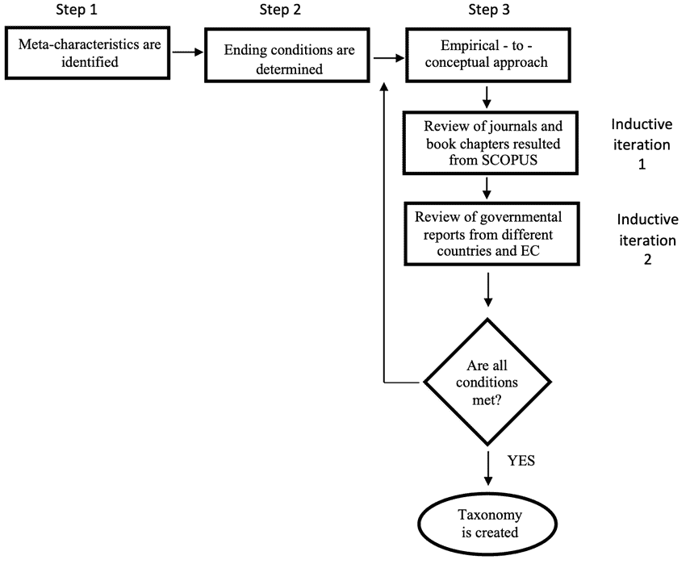
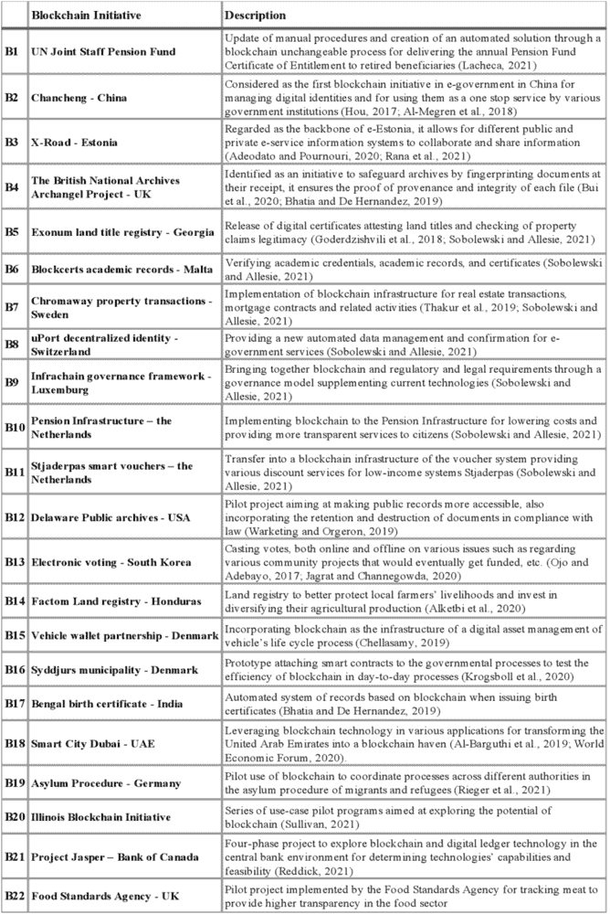
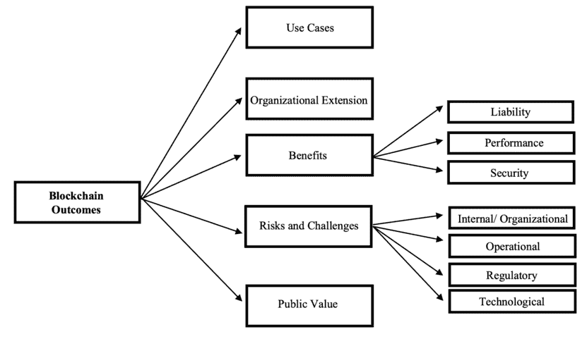

# 第十一章

# 超越分散应用：

公共领域区块链结果的分类

+   埃斯利·斯帕希乌

    卢森堡大学，意大利

+   保罗·斯帕尼奥莱蒂

    

    卢森堡大学，意大利

+   托马索·费德里奇

    

    意大利特 uscia 大学

摘要

作为一种去中心化的数字账本，区块链近年来因其优越的特性而成为一个热门词汇。区块链的应用与不同的含义相关联，从信任生成到效率提高。最近，随着不同政府和公共机构实施区块链作为解决不同问题的方案，区块链应用得到了推动，旨在提供更有效的公共政策。不同的基于区块链的系统和平台越来越多地被引入，作为更安全、更有序的公共职能和服务交付的替代方案。考虑到不同国家使用案例的扩展和相关信息的不一致，本章通过识别新兴模式和子类别，发展了公共领域区块链结果的分类。提出的分类可以支持决策者和研究人员更好地识别各种区块链应用，以及它们的好处、含义和可能相关的风险。

引言

区块链是一种去中心化的数据管理技术，通过分布式账本，提供了新的信息管理、治理、存储和分发方式（Iansiti 和 Lakhami，2017；孙寅等，2019）。区块链的核心是一个计算机协议，作为自动合同，通过不可逆转和安全的交易来执行双方之间的交换（丛等，2017）。区块链的新技术还提供了一种通过其不同的共识协议和密码学来建立信任的新方式，使交易可验证且容错（Beck 等，2016；申，2019）。区块链的优点在于它还有不同的架构配置，使区块链的应用更好地适应不同的目标。不同的架构设置，如网络访问、共识机制类型、数据控制和网络类型，提供了允许或限制访问的机会，同时也提供了提高安全性（张和李，2020）。

现有的知识体系已经转向了将区块链的潜力传播到众多不同的应用和领域，这些领域超越了金融部门和加密货币（Alharby 和 Moorsel，2017）。区块链应用在范围上的多样性不仅与这种技术的多用途性质有关，也与其多样的需求有关。当今政府继续面临需要在对社会的眼中更加开放和透明的需求（Hollyer 等人，2011）。反过来，开放和透明被认为是建立社会中强大责任感和信任的主要组成部分（Gaventa，2013；Johnston，2001）。考虑到大多数公共政策失败的根本原因在于无能、腐败或无效治理（Mueller，2020），这为探索区块链作为解决这些问题的一种可能方案提供了理由（Hyvarinen，2017）。实际上，区块链已经被应用于公共领域，通过数字转型过程强制实施现有或新政策，不同政府机构通过这种方式迅速实现多重社会目标（Berryhill，2018）。

鉴于应用的分散性，我们认为理解在公共领域采用区块链背后的数字转型理由很重要，其次，为不同应用产生的区块链结果提供分类。在这方面，我们相信，在特定条件下，区块链可以是数字转型的一个推动者（Vial，2019），因为它是一种创造颠覆的技术。此外，我们同意，数字转型比以往任何时候都更经常是应对不同社会挑战的一个副产品（Majchrzak 等人，2016）。通过突出在解决社会挑战时数字转型过程所创造的价值，我们感兴趣的是查看在公共领域中展示出超出特定服务效率改进的区块链应用。因此，我们开发了一个分类法（Nickerson 等人，2013），回答了以下研究问题：“在公共领域观察到的区块链倡议的哪些维度？”。

我们期望这项研究能够在区块链研究方面带来各种贡献。通过创建一个成功应用和区块链可能被利用的各种公共功能的地图，我们希望为可能对区块链采用或希望通过数字化转型提高其性能的组织中的决策者提供更清晰的概述。此外，考虑到对区块链技术采用过程的研究不足，我们期望我们的发现能够确定新的研究视角，这可能为未来关于基于区块链的系统设计和实施的研究铺平道路。

背景

公共领域的区块链

近年来，由于从公共管理到公共政策，从公共办公室到支持整个电子政府转型的一系列成功实施，区块链在公共领域变得流行。为了本研究的需要，我们将此类区块链应用纳入“公共领域”这一术语之下。根据经合组织（OECD）的说法，公共领域包括政府拥有或控制的服务，以及尽管是私有的，但由政府或类似当局资助的服务（Pilichowski 和 Turkisch，2018）。

至于区块链在公共领域的广泛应用，从公证服务到投票（Alketbi 等人，2019；欧洲委员会，2018），智能合约的引入发挥了重要作用，智能合约是区块链技术的主要特征，它保证了流程的完全自动化，无需中介甚至人工互动（Qi 等人，2017）。区块链特别获得动力的一个领域是数字政府或电子政府（Hou，2018；Terzi 等人，2019）。Sobolewski 和 Allesie（2021）表明，特别是欧洲在这方面迅速探索并开创了不同的项目，但在其他国家，如印度、中国、英国和巴西等地，实际应用也在不断增长（Hou，2017；Ojo 和 Adebayo，2017；德勤，2018）。

作为公共领域中的运作单位，公共行政已证明是应用区块链的好基础，因为它们的做法本质上是基于数据认证、可追溯性和透明性（Rot 等人，2020），而区块链并不改变服务的性质，而是预计将促进它们提供的方式（Casino 等人，2019）。公民信任、隐私和记录保持等独特特点使区块链成为一种可以在公共行政不同层面采用的潜在普及技术（Carter 和 Ubacht，2014）。随后，研究甚至已经深入到将区块链视为公共行政新治理模型的发起者（Olnes，2016；Hou，2017；Konashevyc，2017）。

虽然有些论文关注的是区块链已经在公共领域实施的特定案例，但大多数论文仍然保持着关于区块链如何贡献力量以及它在各种服务中的潜力的假设性质。此外，这些论文中的大多数关注的是个别案例，并没有提供结果的普遍概述。为了让政策制定者更好地了解根据他们的需求，区块链能带来什么预期效果，对区块链应用进行分类并将其与不同的维度和含义联系起来是有意义的，通过观察不同的举措来看。这也将有助于揭示这项技术所面临的的社会挑战。

区块链分类

区块链技术的多样性、区块链的应用领域以及可能与每个应用相关联的不同类型的区块链，为各种研究提供了良好的机会，这些研究有助于区块链的分类和多样化的分类体系的创建。每个分类体系都被认为是单独的类别，并为特定领域的知识结构化提供了一种方式（Glass 和 Vessey，1995）。Sarkitundu 等人（2016 年）是首批研究基于区块链平台创建分类体系的可能性的人，这是创建涵盖整个加密货币生态系统的更广泛分类体系的第一步。其他早期研究，如许等人（2017 年）和 Tasca 和 Tessone（2018 年），关注基于它们的架构设计对不同区块链进行分类的方法。Wieninger 等人（2019 年）基于区块链特征和不同类型区块链的互动开发了一个区块链分类体系。Weking 等人（2019 年）通过影响现有业务模型或创建全新业务模型来研究区块链技术对商业模式的影响。Labazova 等人（2019 年）强调了开发一个分类所有区块链特征的区块链应用分类的重要性，并创建一个涵盖各种区块链主要技术组件的分类体系。最近，Alkhalifah 等人（2020 年）提出了一种基于网络安全威胁和可能的漏洞的分类方法，以此对区块链的某些方面进行分类。

尽管有许多研究致力于对区块链进行分类，但值得提及的是，到目前为止，所形成的分类主要关注区块链的技术特征及其各种架构设置。另外，任何分类的目的都基于其预期用途，因此需要有一个明确的目标用户群体。从上述研究的广泛技术性质来看，可以继承说目前的焦点主要集中在技术专家和开发者身上。当前关于区块链的文献在含义方面存在不足，这使得采用这一新视角对区块链应用进行分类，面向决策者变得重要。

我们主要期待的受众包括政策制定者、公共领域各种性质机构的负责人，甚至主要关注成功实施后可能获得的预期收益的管理人员。我们的分类法的用户群体还包括希望从实际案例中评估区块链的优势和局限性的研究人员和学者：这可能是区块链在管理和政府研究方面的进一步研究的起点。因此，我们研究的目标是将区块链应用在公共领域的效果进行分类：因此，我们研究中的元特征与后果和影响相关，对应用区块链的特征干预最小。

**方法论**

**分类法开发方法**

从技术和应用的角度来看，区块链从一开始就被认为是向信息系统新思维方式迈进的进化步骤（Brando，2016；Beck 等人，2017）。研究继续在区块链和传统信息系统之间进行比较（Rossi 等人，2019），甚至认为区块链是信息系统研究中的新基础设施和平台（Costantinides 等人，2018）。从这种角度来看，我们采用了 Nickerson 等人（2013）为信息系统研究设计的一种分类法开发方法。这种方法提出了一种从呈现元特征作为第一步开始的过程，接着是确定结束条件和方法的总结，如图 1 所示。

| ** | 图 1. 分类法开发方法 | ** |
| --- | --- | --- |
| ** |  | ** |

我们选择了从实证到概念的方法，因为研究的主要目标是观察和证据来自现实生活的案例研究。分类法是通过两次归纳迭代开发的。对于第一次迭代，我们整理了从 SCOPUS 查阅的文献列表中得出的维度、特征和应用的列表。在第二次迭代中，我们做了同样的事情，这次分析的是通过第一次文献综述确定的国家和国际政府报告。由于在这次新迭代中没有增加任何维度，所以这种方法没有重复。

最终，由于满足了 Nickerson 等人（2013 年）列出的结束条件，因此得出了分类。每个维度突出了分类中感兴趣的主要特征：它们是相互排斥的，在最后的迭代中没有增加或合并/拆分维度。没有单元格重复，并且在每个特征下至少有一个对象被分类。此外，我们感兴趣领域中的所有应用案例都可以分类在分类中，使其具有综合性，如果出现新的应用案例，分类足够扩展以添加新维度。

搜索策略

本研究的目的在于，考虑到区块链在公共领域的应用可能是多维度的，我们聚焦于 SCOPUS 作为我们主要的研究数据库，因为它具有多学科性。为了全面掌握区块链在我们感兴趣的领域的应用，我们确保包括了所有与“公共领域”和“区块链”相关的词汇。最终搜索记录包括了“公共政策”或“公共部门”或“政府”或“公共治理”以及“区块链”或“比特币”或“以太坊”或“加密货币”或“分布式账本”或“智能合约”。

起初，我们包括了同行评审的期刊文章、会议论文和书籍章节，这些在 SCOPUS 上符合我们的标准。最终，考虑到我们研究的范围，我们发现加入国家报告和欧洲委员会的报告也很有用，这些报告详细说明了任何成员国应用区块链的暗示和结果。

选择标准

在 SCOPUS 上的搜索结果共有 1,175 篇文档需要审查。在第一轮筛选过程中，调查了每篇文档的摘要以匹配我们的选择标准：

+   - 只考虑已经作为试点阶段或全面实施阶段的案例研究、区块链应用报告或关于前者的文献综述

+   - 实施必须得到政府机构（无论地方还是国家）和/或公共行政机构的促进，以及/或与政府政策相关

+   - 不包括任何假设或潜在的案例研究，以确保输出的反思更加可靠

+   - 使用英语编写

+   - 未对研究领域施加限制：包括来自社会科学和工程学的出版物。

随后，在根据上述标准进行的第一轮筛选之后，去除了任何重复的内容，进行了第二轮筛选，即阅读全文文档。结果从 SCOPUS 获得了总共 79 条记录。根据滚雪球效应，一些重要的政府报告或新闻稿，并非源自我们初始的数据库，也被考虑在内，最终增加了 13 份报告。

数据组织与编码

为了我们的研究，我们使用了 NVivo 13 作为数据管理工具，考虑到审查中的文章数量。考虑到我们研究的探索性质，我们应用了开放和轴向编码，将描述性标签与新兴主题相关联，并识别这些主题之间的联系。

区块链倡议

考虑到本研究的宗旨和对政策制定者的关注，展示调查期间观察到的公共领域中最显著的区块链倡议也是非常重要的。表 1. 展示了 22 个此类倡议的摘要，这些倡议在性质和范围上各不相同。在后面的章节中，我们将这些包含试点项目或全面实施在内的倡议与从分类中产生的每个维度相匹配。

表 1. 区块链倡议

|  |
| --- |

区块链成果分类

最终的区块链成果分类包括 5 个维度：用例、组织扩展、用户类型、收益、风险与挑战、公共价值。两个维度包括我们编制的子维度，以更好地标记从编码中识别出的所有项目。图 2 概述了识别的维度和子集。

| 图 2. 分类维度 |
| --- |
|  |

下一部分将详细介绍每个维度，为每个维度下的每个类别提供解释性描述。此外，每个类别都与一个第三列相匹配，列出上述总结的区块链倡议示例，这些倡议是从我们的文献综述和编码中识别出来的，呈现了同一类别的特征。

用例

我们引用用例来说明跨所有行业确定的各种区块链应用领域。通过用例，我们旨在明确区块链已经探索的主要目的。表 2 展示了涵盖公共领域审查的应用程序的七个识别用例。

表 2. 用例

| 用例 | 描述 | 倡议 |
| --- | --- | --- |
| 数字记录 | 记录共享和存储的应用程序，注册服务，确保信息完整性的安全 | B2, B3, B4, B5, B7, B10, B12, B14, B18, B19, B20, B22 |
| 供应链 | 对供应链网络进行防篡改且时间戳标记的端到端追踪，确保从供应商到最终接收者的任何产品的分销，同时取代手动流程 | B15, B22 |
| 身份管理 | 通过实施智能合约来提供去中心化的身份证明，并通过明确用户同意管理数据披露的应用程序 | B1, B6, B8 |
| 账单和支付 | 通过智能合约协议自动化符合规定的支付交易 | B3, B10, B16, B18, B21 |
| 福利分配 | 应用于支持社会福利的各种转型方式，例如通过安全的电子代金券，资金分配或福利支出的监控 | B11 |
| 电子投票 | 应用于任何电子投票或计票过程 | B13 |
| 法律执行 | 帮助打击金融犯罪的应用程序，追踪犯罪行为，确保证据转移保管等 | B12, B19 |

组织扩展

组织扩展的概念指的是区块链应用的范围。更具体地说，它与区块链是否只应用于本地应用程序有关，这可以是一个市镇、单一管理单元、小地方投票，或者更广泛的应用。后一种可以是例如一个全国性的区块链倡议，为各种机构服务，甚至是跨国倡议，在不同的国家合作的情况下，例如欧盟的情况。表 3 展示了三种组织扩展类型的摘要以及它们各自的简要描述。

表 3. 组织扩展

| 组织扩展 | 描述 | 倡议 |
| --- | --- | --- |
| 本地 | 单个组织单位或机构的应用程序，旨在本地使用 | B2, B8, B11, B12, B13 B16, B17, B18, B20 |
| 国家级 | 为全国服务应用程序 | B3, B5, B6, B7, B9, B10, B14, B15, B19, B21, B14, B22 |
| 跨国 | 扩展到不同国家的应用程序 | B1, B3, B4 |

好处

在我们的分类发展目的上，我们将好处视为成功应用区块链后感知到的优势或获得的测量利润。在这方面，我们总共识别出 13 个好处，我们将它们分为三个主要类别以便解释。第一组好处关注区块链功能提供的新方法，以在每次交易中实现透明度、责任感和真实性。第二组好处关注与流程性能方面相关的优势，而最后一组突出区块链在提高安全性和风险管理方面的成功应用。表 4 详细描述了每个识别的好处以及它们之间的区别。

表 4. 好处

| 好处 | 描述 | 倡议 |
| --- | --- | --- |
| 责任 | 透明度 | 随时查看链上发生的任何交易的可能性 | B2, B3, B5, B9, B10, B13, B15, B19, B21, B16 |
| 责任感 | 可以展示任何交易由谁在何时进行的审计跟踪的可用性 | B1, B11, B18, B19, B20 |
| 真实性 | 数据保持未更改和合法的质量 | B2, B5, B9, B14, B15 |
| 性能 | 效率提升 | 由于操作自动化而实现的效率提升 | B1、B2、B3、B5、B6、B7、B8、B10、B11、B12、B15、B18、B19、B21 |
| 成本降低 | 消除中介带来的成本降低和成本节约，操作更快，资本要求更低 | B1、B5、B6、B7、B8、B10、B11、B12、B15、B16、B21、B22 |
| 时间减少 | 在执行不同流程时减少时间 | B1、B7、B18、B22 |
| 故障容忍度 | 系统在恶意活动存在时继续达成共识的能力 | B5 |
| 减少人力和程序错误 | 移除可能受到人为错误影响的接口 | B12、B16、B21、B22 |
| 流程简化 | 减少漫长的官僚程序和运营 | B3、B16、B18 |
| 互操作性 | 能够通过各种区块链系统轻松共享和交换信息 | B2、B3、B19 |
| 安全性 | 不可变性 | 如果需要，存储在区块链上的信息和交易保持不可篡改和私密的 capability | B1、B2、B4、B7、B12、B13、B14、B18、B19、B20、B21 |
| 合规性 | 在复杂严格的监管环境中运行的能力 | B3、B10、B16、B19 |
| 弹性 | 无需单一故障点即可作为去中心化网络运行的能力 | B7、B8、B9、B10、B15、B20 |

风险与挑战

我们识别出与区块链在各种试点项目或全面运营项目中应用相关联的风险和挑战。我们展示了 16 个不同挑战的分类，分为四大类。内部组织约束与区块链应用相关联的组织内人员或政策问题。操作约束与操作角度观察到的限制有关，而监管约束与法律和法规或关于区块链的适当立法缺失有关。最后，技术约束与技术本身或视为问题的个别特征有关。风险和挑战在表 5 中有所指示。

表 5. 风险与挑战

| 风险与挑战 | 描述 | 举措 |
| --- | --- | --- |
| 内部组织约束 | 高的交易/运行成本 | 与区块链的开发、维护和运行相关的任何费用 | B2、B3、B10、B12、B16 |
| 不信任的组织文化 | 对采用区块链及/或改变做事方式缺乏信任 | B1、B6 |
| 缺乏适当理解 | 对区块链如何运作缺乏适当信息或对区块链的负面公众看法 | B1、B3、B18 |
| 操作约束 | 缺乏专业知识 | 对区块链的认知有限，且需要新资源 | B3、B10、B18、B14 |
| 基础设施不成熟 | 缺乏维护网络和节点以及随时避免中断的基础设施 | B9, B14, B22 |
| 可扩展性 | 缺乏在短时间内处理大量交易数据的能力 | B4, B7, B8, B10, B19, B20 |
| 监管约束 | 监管不确定性 | 缺乏规定，特别是与信息共享和报告相关的规定 | B8, B16, B22 |
| 法律波动 | 在法律变化面前，如何管理智能合约的不确定性，考虑到其不可变性特征 | B16 |
| 缺乏框架 | 缺乏规定治理、控制和风险管理的框架 | B2 |
| 技术约束 | 过早的技术 | 区块链缺乏稳定、适当的发展 | B20, B21 |
| 数据保密性 | 对隐私的担忧、数据的长期保存、与现有规则的一致性 | B2, B5, B20, B21, B14, B22 |
| 安全担忧 | 与一项尚属新颖的技术相关的各种安全风险和漏洞 | B2, B16, B20, B14 |
| 不可变性 | 如果记录有误或法律变更，更改记录的困难 | B11, B16 |
| 可靠性 | 由于第三方威胁或对节点控制最小，记录不可靠 | B14 |
| 缺乏增值 | 认为传统的 IT 系统足以整合流程，无需引入区块链 | B16, B21 |
| 高能耗 | 区块链的巨大能耗 | B5, B20 |

公共价值

我们分类中确定的最后一个维度是公共价值，它被定义为成功区块链应用程序可能对社会产生的价值。它可以被认为是一种具有更广泛范围的利益。与 Cledou 等人（2018）不同，他们简单地将公共价值与用户通过智能移动服务感知到的不同利益联系起来，但并未将其视为自身的一个分类维度，我们认为公共价值是一个独立的维度，根据应用案例和在审查的文献中的高度存在。表 6 描绘了本研究确定的五种不同的公共价值。

表 6. 公共价值

| 公共价值 | 描述 | 倡议 |
| --- | --- | --- |
| 信任 | 建立或增加公众对公共组织或公共服务和政策的信任 | B2, B3, B4, B5, B6, B7, B9, B15, B16, B17, B22 |
| 民主 | 实施民主价值观，包括但不限于平等、社会正义、多样性 | B13 |
| 合法性 | 符合法律或与规则和规定一致 | B19 |
| 多边主义 | 激励公共行政促进国家间的合作 | B3 |
| 效率 | 公共服务的效率提高 | B1, B2, B8, B10, B11, B12, B18, B20, B21 |
| 防欺诈 | 防止欺诈行为和腐败 | B5, B6, B13, B14, B18 |

案例研究发现

基于分类结果，表 7 展示了每个案例研究关联的每个维度的类别总结。从表中可以看出，每个区块链倡议及其独特特征，都记录了一系列独特的益处，同时也在实施过程中面临各种挑战。

Table 7. 每案例研究发现的总结

| 区块链倡议 | 用例 | 组织扩展 | 益处 | 风险与挑战 | 公共价值 |
| --- | --- | --- | --- | --- | --- |

| 联合国联合员工养老金基金 | 身份管理 | 跨国级 | • 责任感 • 成本降低

• 效率提升

• 时间减少

• 不可变性 | • 不信任的组织文化 • 缺乏适当理解 | 效率 |

| 禅城区 - 中国 | 数字记录 | 地方级 | • 透明度 • 真实性

• 效率提升

• 互操作性

• 不可变性 | • 高交易/运行成本 • 缺乏框架

• 数据保密性

• 安全担忧 | 信任，效率 |

| X-Road - 爱沙尼亚 | 数字记录，账单和支付 | 国家级，跨国级 | • 透明度 • 效率提升

• 流程简化

• 互操作性

• 合规性 | • 缺乏专业知识 • 高交易/运行成本

• 缺乏适当理解 | 信任，多边主义 |

| 英国国家档案馆的天使项目 - 英国 | 数字记录 | 跨国级 | • 不可变性 | • 可扩展性 | 信任 |
| --- | --- | --- | --- | --- | --- |

| Exonum 土地登记处 - 格鲁吉亚 | 数字记录 | 国家级 | • 透明度 • 真实性

• 效率提升

• 成本降低

• 容错性 | • 高能耗 • 数据保密性 | 信任，防欺诈 |

| Blockcerts 学术记录 - 马耳他 | 身份管理 | 国家级 | • 效率提升 • 成本降低 | • 不信任的组织文化 | 信任，防欺诈 |
| --- | --- | --- | --- | --- | --- |

| Chromaway 物业交易 - 瑞典 | 数字记录 | 国家级 | • 效率提升 • 成本降低

• 时间减少

• 不可变性

• 弹性 | • 可扩展性 | 信任 |

| uPort 去中心化身份 - 瑞士 | 身份管理 | 地方级 | • 效率提升 • 成本降低

• 弹性 | • 监管不确定性 • 可扩展性 | 效率 |

| Infrachain 治理框架 - 卢森堡 |  | 国家级 | • 透明度 • 真实性

• 弹性 | • 基础设施不成熟 | 信任 |

| 荷兰养老金基础设施 | 数字记录，账单和支付 | 国家级 | • 透明度 • 效率提升

• 成本降低

• 合规性

• 弹性 | • 可扩展性 • 高交易/运行成本

• 缺乏专业知识 | 效率 |

| Stjaderpas 智能代金券 - 荷兰 | 福利分发 | 地方级 | • 责任感 • 效率提升

• 成本降低 | • 不可变性 | 效率 |

| 特拉华州公共档案馆 - 美国 | 数字记录，法律执行 | 地方级 | • 效率提升 • 成本降低

• 减少人为和程序错误

不可变性 | 高交易/运行成本 | 效率 |

| 韩国电子投票 | 电子投票 | 地方级 | 透明度 | 不可变性

真实性 | 监管不确定性 | 民主，防欺诈 |

| 洪都拉斯土地登记处 - 事实门 | 数字记录 | 国家级 | 不可变性 | 缺乏专业知识 | 基础设施不成熟

数据保密性

安全担忧

可靠性 | 防欺诈 |

| 丹麦车辆钱包合作伙伴关系 | 供应链 | 国家级 | 效率提升 | 弹性

真实性

透明度

成本降低 | 不可用 | 信任 |

| 丹麦希 ddjurs 自治市 | 纸币与支付 | 地方级 | 成本降低 | 人力及程序错误减少

流程简化

合规性 | 高交易/运行成本 | 监管不确定性

法律波动

安全担忧

不可变性

无增值 | 信任 |

| 印度孟加拉出生证明 | 数字记录 | 地方级 | 不可变性 | 真实性 | 缺乏专业知识 | 高交易/运行成本 | 信任 |
| --- | --- | --- | --- | --- | --- | --- | --- |

| 阿拉伯联合酋长国迪拜智能城市 | 数字记录，纸币与支付 | 地方级 | 责任明确 | 效率提升

时间减少

流程简化

不可变性 | 缺乏适当理解 | 缺乏专业知识 | 防欺诈，效率

| 德国庇护程序 | 数字记录，法律执行 | 国家级 | 透明度 | 责任明确

效率提升

互操作性

不可变性

合规性 | 可扩展性 | 合法性 |

| 伊利诺伊州区块链倡议 | 数字记录 | 地方级 | 透明度 | 责任明确

不可变性

弹性 | 可扩展性 | 技术过早 |

数据保密性

安全担忧

高能耗 | 效率 |

| 加拿大银行 - 项目雅瑟尔 | 纸币与支付 | 国家级 | 效率提升 | 成本降低

人力及程序错误减少

不可变性 | 技术过早 | 数据保密性

无增值 | 效率 |

| 英国食品标准局 | 供应链 | 国家级 | 时间减少 | 成本降低

人力及程序错误减少 | 数据保密性 | 监管不确定性

基础设施不成熟 | 信任 |

讨论与影响

新兴技术的扩散，尤其是在其周围存在高度不确定性时，总是与比较成功采用所带来的增量收益和与此举相关的成本有关（Hall 和 Khan，2003）。同样，我们分类中出现的两个主要维度是收益和风险。理解世界各地不同举措见证的各种收益将有助于技术更易被接受。然而，关于收益，需要明确的是，尽管收益是从不同来源泛化而来的，但它们不应被表面价值所误。De Giovanni（2019）在其关于区块链在生态数字供应链中应用的研究中，强调了一个观点，即尽管从理论上来看区块链的优势是显而易见的，但它们应伴随着关于涉及成本或实际便利性的详细分析。

同样，第二个重要的新兴维度是伴随这项技术出现的约束和挑战。风险识别被认为是在管理风险和最小化可能出现的任何挫折中的第一步（Tchankova，2002）。这使得一些风险可以在实施前阶段就被减轻和解决。此外，考虑到文献中识别的一些风险与区块链的技术方面有关，它们的识别也应激励开发者去寻找可能的改进。这会提高区块链的地位，并帮助进一步推广区块链的应用，不仅在公共领域。

考虑到所研究的领域，公共价值是另一个重要的维度。对于 Moore（1995）来说，公共价值是他著名的三角形中的主要组成部分，该三角形描绘了公共部门战略管理的 main elements。同样，Meynhardt 等人（2017）指出，公共行政的价值与通过其服务提供的公共价值紧密相关。还应强调的是，任何旨在进行公共服务转型的系统变革，都应将公共价值置于公共领域变革过程的顶部（Tonurist 等人，2019）。因此，通过证明区块链能够为公共领域做出的各种公共价值，有望帮助勾勒出这项技术在公共领域的重要性。

本分类旨在建立对区块链应用的更好理解，并促进关于区块链举措及其成果的知识分享。我们期待其主要发现和分类能支持决策者和希望探索该话题的学术研究者。其影响既适用于实践也适用于研究，可以概括如下。

对于有兴趣在公共领域的实践和机构中实施区块链的政策制定者来说，这个分类法是理解与区块链采用相关的多样化的目标范围的起点，也通过多个用例进行展示。此外，它帮助政策制定者考虑与其实际应用相关的利益和风险，以及可能的。

我们认为这种分类法对学术研究有重要的意义。考虑到围绕区块链创建的分类法主要关注技术特征，基于成果的分类法定义了关于区块链的新映射和标准化信息。此外，本研究架起了在公共领域对区块链进行调查和研究的需求，以及涵盖公共领域不同领域的有限研究的桥梁。

挑战、局限性以及未来研究方向

本研究期间观察到的主要挑战在于，大多数研究提供的关于区块链在各领域应用结果的详细数据稀缺。通常情况下，区块链应用与可以认为是预期的好处和影响相关联，但并未辅以实证发现来证实这些主张。另一个挑战关于的是关于各国区块链倡议的存储库缺失。确实有些国家撰写了他们某些倡议的报告，但这样的报告仍因不同的原因而受损。第一个原因是这些报告并非年度报告，因此不能追踪重要倡议的后续。此外，这样的报告主要旨在研究成功案例：尽管它们很重要，但它们并未涵盖试点项目或原型，这些项目尽管失败了，但会提供关于失败原因的深刻见解。

在可能的局限性方面，本研究聚焦于在公共领域进行的应用。由于区块链在许多领域得到采用，重要的是要考虑结果可能会根据研究领域而有所不同。此外，每天都有新的区块链应用被部署，这可能提高了需要扩展分类法或压缩分类法的某些问题已经得到解决的情况。仍然关于区块链研究的进展需要，本研究为进一步的研究提供了机会，这些研究更加具体地探讨我们的分类法与先前研究的技术价值观之间的可能联系。这将揭示区块链成果与一些技术特征，如区块链类型、共识机制、加密等方面的可能联系。

此外，进行一项类似的研究，适配到私营部门，以观察基于区块链所应用行业的性质是否存在差异，将会很有趣。同时，考虑到目前大多数关于区块链的研究旨在改善技术的局限性，从架构和安全角度出发，未来的研究可以将注意力转移到超越技术视角的挑战上。

CONCLUSION

自其引入以来，区块链已经成为一个日益增长的话题，并在各个领域看到了应用的激增。全球范围内，政府举措已经增加，以进一步探索这项技术，许多公共领域的机构和组织已经开始了区块链的实施，用于各种范围和目的。

在本文中，我们提出一个分类法，能够对上述公共领域的举措的结果进行分类。与先前的分类法不同，我们的研究将重点从区块链的技术特征转向其采用的含义。在此过程中，我们确定了六个不同的维度，每个都有其自身的特性和特点。此外，通过广泛的文献研究，本研究提供了一份公共领域中一些重要举措的列表，并将这些举措与分类法中识别的维度相匹配。

本研究通过提供一种新的分类区块链应用的方法，特别是通过关注缺乏此类研究的公共领域，对当前的区块链研究做出了贡献。所提出的分类法为考虑采用区块链的政策制定者提供了宝贵的见解，通过提供从前应用中吸取的教训的概览。它还使决策者能够理解可能的挑战，提供在初始阶段解决潜在约束的机会。

REFERENCES

Adeodato, R., & Pournouri, S. (2020). 电子治理的安全实施：关于爱沙尼亚的案例研究。在《人工智能时代的网络安全、智能社会和增强人类》（第 397-429 页）。Springer 出版社。DOI:10.1007/978-3-030-35746-7_18

Al Barghuthi, N. B., Ncube, C., & Said, H. (2019, November). 采纳区块链技术有效性之先进状态——阿联酋调研研究。在 2019 年第六次 HCT 信息技术趋势（ITT）会议（第 54-59 页）。IEEE。DOI:10.1109/ITT48889.2019.9075108

Alharby, M., & Van Moorsel, A. (2017). 基于区块链的智能合约：一项系统映射研究。arXiv 预印本 arXiv:1710.06372\。10.5121/csit.2017.71011

Alkhalifah, A., Ng, A., Kayes, A. S. M., Chowdhury, J., Alazab, M., & Watters, P. A. (2020). 区块链威胁与漏洞分类。在《区块链技术与网络安全》（第 3-28 页）。CRC 出版社。DOI:10.1201/9780429324932-2

阿尔凯特比, A., 纳斯尔, Q., & 塔尔布, M. A. (2020). 政府服务的创新区块链参考模型：迪拜政府案例研究. 系统保证工程与管理国际杂志, 11(6), 1170-1191.

阿尔梅 gren, S., 阿尔萨马, S., 阿尔图艾米, L., 阿尔萨马赫, H., 索尔塔尼塞哈特, L., & 阿尔穆塔 airyi, E. (2018, 7 月). 数字部门区块链用例综述：文献回顾. 在 2018 年 ieee 物联网(iThings)和 ieee 绿色计算与通信(GreenCom)和 ieee 网络计算(CPSCom)和 ieee 智能数据(SmartData)国际会议论文集(第 1417-1424 页). IEEE. 10.1109/Cybermatics_2018.2018.00242

贝克, R., 施滕穆奇, J., 罗尔克, N., & 马隆, S. (2016). 区块链——通往无信任加密交易的门户. 学术出版社.

贝克, R., 阿维塔, M., 罗西, M., & 沙逊, J. B. (2017). 区块链技术在商业和信息系统研究中的应用. 学术出版社.

贝里希尔, J., 博ур吉, T., & 汉森, A. (2018). 区块链解放：区块链技术与公共部门的使用. 学术出版社.

博蒂亚, S., & Wright de Hernandez, A. D. (2019). 区块链已经在这里。这对记录管理和档案意味着什么? 档案组织杂志, 16(1), 75-84. doi:10.1080/15332748.2019.1655614

布兰登, D. (2016). 区块链: 企业信息系统的前沿. 国际学术商业世界杂志, 10(2), 33-40.

布伊, T., 库珀, D., 科洛莫斯, J., 贝尔, M., 格林, A., 谢里丹, J., 希金斯, J., 达斯, A., 凯勒, J. R., & 索雷, O. (2020). 通过区块链上分层注意力自编码器哈希实现视频防篡改. ieee 多媒体杂志, 22(11), 2858-2872. doi:10.1109/TMM.2020.2967640

卡特, L., & 乌巴赫, J. (2018, 5 月). 政府在区块链应用中的研究. 数字时代治理第 19 届年度国际会议论文集(第 1-2 页). 10.1145/3209281.3209329

卡西诺, F., 达

切拉桑密, A., & N, A. (2019). 区块链技术展望-架构、应用和挑战. 国际工程研究与技术杂志(艾哈迈达巴德), 12(12), 1-5.

克勒杜, G., 埃斯特韦斯, E., & 巴博萨, L. S. (2018). 规划和设计智能交通服务的分类. 政府信息季度, 35(1), 61-76. doi:10.1016/j.giq.2017.11.008

丛, L. W., & 何, Z. (2019). 区块链颠覆和智能合约. 金融研究评论, 32(5), 1754-1797. doi:10.1093/rfs/hhz007

康斯坦丁 ides, P., Henfridsson, O., & 帕克, G. G. (2018). 引言——平台和基础设施在数字时代. 学术出版社.

德· GiovanniP. (2019). 通过区块链的生态数字供应链. 可在 SSRN 3488925 处获得.

德勤（2018）。通过指数技术转变公共服务领域的区块链。检索自 https://www2.deloitte.com/content/dam/Deloitte/in/Documents/public-sector/in-ps-blockchain-noexp.pdf

欧盟委员会（2018）。爱沙尼亚电子政务案例研究报告。检索自 https://jiip.eu/mop/wp/wp-content/uploads/2018/10/EE_e-Estonia_Castanos.pdf

欧盟委员会（2019）。数字政府中的区块链。检索自 https://joinup.ec.europa.eu/sites/default/files/document/2019-04/JRC115049%20blockchain%20for%20digital%20government.pdf

玻璃，R. L.，&韦斯 sey，I.（1995）。当代应用领域分类。 IEEE 软件 ，12（4），63-76。doi:10.1109/52.391837

戈德日什维利 N.高尔达泽 E.加尼迪泽 N.（2018 年 4 月）。格鲁吉亚的基于区块链的不动产登记：永不冻结，始终安全：所有权数据保存最佳！在理论及实践电子治理国际会议论文集（pp. 673-675）。10.1145/3209415.3209437

霍尔，B. H.，&汗，B.（2003）。新技术的采用（编号 w9730）。国家经济研究局。

霍利耶，J. R.，罗森多夫，B. P.，&弗雷 eland，J. R.（2011）。民主与透明度。 《政治学杂志》 ，73（4），1191-1205。doi:10.1017/S0022381611000880

侯，H.（2017 年 7 月）。区块链技术在中国电子政务中的应用。在 2017 年第 26 届国际计算机通信与网络会议（ICCCN）论文集（

赫瓦里宁，H.，里西乌斯，M.，&弗里斯，G.（2017）。基于区块链的方法，克服公共部门服务中的金融欺诈。 《商业与信息系统工程》 ，59（6），441-456。doi:10.1007/s12599-017-0502-4

iansiti，M.，&拉卡米，K.（2017）。关于区块链的真相。哈佛商业评论。检索于 2021 年 6 月 1 日，从 https://hbr.org/2017/01/the-truth-about-blockchain

贾格拉特，C. P.，&钱纳戈达，J.（2020 年 2 月）。基于区块链的政府基础设施信息的调查。在 2020 年主流区块链实施国际会议（ICOMBI）论文集（第 1-5 页）。IEEE。10.23919/ICOMBI48604.2020.9203152

科纳舍维奇，O.（2017 年 6 月）。区块链基础治理概念：当前问题与总体愿景。在第 17 届欧洲数字政府会议（ECDG）论文集（第 79 页）。学术出版社。

克罗格索尔米 M.博雷尔 L. H.斯劳茨 T.德博伊斯 S.（2020 年 2 月）。智能合约在政府流程中的应用：案例研究与原型实现（简短论文）。在国际金融密码学与数据安全会议（pp. 676-684）。斯普林格。10.1007/978-3-030-51280-4_36

拉巴зоваО.德林格Т.孙亚夫А.（2019 年 1 月）。从炒作到现实：区块链应用的分类。第 52 届夏威夷国际系统科学会议（HICSS 2019）论文集。10.24251/HICSS.2019.552

拉切卡, D. (2021).案例研究：基于遗留纸质流程的数字化转型（联合国联合退休金基金）。Gartner。检索自 https://www.gartner.com/en/documents/3996055/case-study-digital-transformation-of-a-legacy-paper-base

勒米厄, V. L. (2016). 信任记录：区块链技术是答案吗？记录管理杂志，26(2)，110-139。DOI:10.1108/RMJ-12-2015-0042

马奇查拉克, A., 马克斯, M. L., & 沃雷姆, J. (2016). 设计数字转型的信息系统研究：从 ICT 与社会挑战研究中得到的教训。管理信息系统季刊，40(2)，267-277。DOI:10.25300/MISQ/2016/40:2.03

梅 ynhardt, T., Brieger, S. A., Strathoff, P., Anderer, S., Bäro, A., Hermann, C., & Gomez, P. (2017). 公共价值绩效：在公共部门创造价值的含义是什么？在《全球化世界中的公共部门管理》（第 135-160 页）。Springer Gabler。DOI:10.1007/978-3-658-16112-5_8

摩尔, M. H. (1995). 创造公共价值：政府中的战略管理。哈佛大学出版社。

穆勒, B. (2020). 公共政策为何失败：在复杂性下的政策制定。经济学，21(2)，311-323。DOI:10.1016/j.econ.2019.11.002

尼科森, R. C., 瓦 arshney, U., & 蒙特曼, J. (2013). 分类学开发方法及其在信息系统中的应用。欧洲信息系统杂志，22(3)，336-359。DOI:10.1057/ejis.2012.26

Ojo, A., & Adebayo, S. (2017). 区块链作为下一代政府信息基础设施：对 D5 国家举措的回顾。政府 3.0——下一代政府技术基础设施和服务，283-298。

Ølnes, S. (2016, September). 超越比特币：利用区块链技术实现智能政府。在国际电子政府会议上（第 253-264 页）。Springer。10.1007/978-3-319-44421-5_20

皮利科夫斯基, E., & 特尔基施, E. (2008). 从公共领域商品和服务生产成本的角度看政府就业。OECD 公共治理工作论文。10.1787/19934351

齐, R., 冯, C., 刘, Z., & Mrad, N. (2017). 基于区块链的物联网、电子政务和电子民主。在《智能城市的电子民主》（第 509-520 页）。Springer。DOI:10.1007/978-981-10-4035-1_17

拉纳, N. P.,  Dwivedi, Y. K., & 休斯, D. L. (2021). 分析区块链在印度公共部门采用的挑战：解释性结构建模方法。信息技术与人们。在线发表 Advance online publication。DOI:10.1108/ITP-07-2020-0460

雷迪克, C. G. (2021). 分析加拿大银行采用分布式账本技术的案例。在《区块链与公共部门》（第 219-238 页）。Springer。DOI:10.1007/978-3-030-55746-1_10

里格, A., 斯托尔, A., 文宁格, A., & 弗里德根, G. (

Rossi, M., Mueller-Bloch, C., Thatcher, J. B., & Beck, R. (2019). 信息系统中的区块链研究：当前趋势和包容性未来研究议程. Journal of the Association for Information Systems , 20(9), 14. doi:10.17705/1jais.00571

Rot, A., Sobińska, M., Hernes, M., & Franczyk, B. (2020). 通过区块链技术实现公共管理的数字化转型. 在 向工业 4.0 迈进——信息系统当前挑战 (pp. 111–126). Springer. doi:10.1007/978-3-030-40417-8_7

Sarkintudu, S. M., Ibrahim, H. H., & Abdwahab, A. B. (2018, September). 区块链平台的分类学开发：信息系统视角. In. AIP Conference Proceedings: Vol. 2016. No. 1 (p. 020130). AIP Publishing LLC. doi:10.1063/1.5055532

Shin, D. D. (2019). 区块链：数字信任新兴技术的实现. Telematics and Informatics , 45, 101278. doi:10.1016/j.tele.2019.101278

Sobolewski, M., & Allessie, D. (2021). 公共服务部门中的区块链应用：调查七个真实案例及其益处. In 区块链与公共服务部门 (pp. 97–126). Springer. doi:10.1007/978-3-030-55746-1_5

Sullivan, C. (2021). 基于区块链的身份：优势与劣势. In 区块链与公共服务部门 (pp. 197–218). Springer. doi:10.1007/978-3-030-55746-1_9

Sun Yin, H. H., Langenheldt, K., Harlev, M., Mukkamala, R. R., & Vatrapu, R. (2019). 监管加密货币：一种监督机器学习方法来去匿名化比特币区块链. Journal of Management Information Systems , 36(1), 37–73. doi:10.1080/07421222.2018.1550550

Tasca, P., & Tessone, C. (2019). 区块链技术的分类学：识别和分类的原则. Ledger , 4. 提前在线发布. doi:10.5195/ledger.2019.140

Tchankova, L. (2002). 风险识别——风险管理的基本阶段. Environmental Management and Health , 13(3), 290–297. doi:10.1108/09566160210431088

Thakur, V., Doja, M. N., Dwivedi, Y. K., Ahmad, T., & Khadanga, G. (2020). 在印度实施土地登记的区块链土地记录. International Journal of Information Management , 52, 101940. doi:10.1016/j.ijinfomgt.2019.04.013

Tonurist, P., & Cook, J. (

Vial, G. (2019). 理解数字化转型：综述与研究议程. The Journal of Strategic Information Systems , 28(2), 118–144. doi:10.1016/j.jsis.2019.01.003

Warkentin, M., & Orgeron, C. (2020). 使用安全三元组评估公共部门应用中的区块链技术. International Journal of Information Management , 52, 102090. doi:10.1016/j.ijinfomgt.2020.102090

韦金，J.，曼达伦 akis，M.，海因，A.，赫尔墨斯，S.，贝海姆，M.，&克 rcmar，H.（2019）。区块链技术对企业模型的影响——一种分类和典型模式。电子市场，1-21。

维尼根，S.，舒尔，G.，菲舍尔，V.（2019 年 6 月）。区块链分类的发展。在 2019 年工程、技术与创新国际会议（ICE/ITMC）上（第 1-9 页）。IEEE。

世界经济论坛。（2020）。包容性部署区块链：来自阿联酋的案例研究和学习。检索自 https://www3.weforum.org/docs/WEF_Inclusive_Deployment_of_Blockchain_Case_Studies_and_Learnings_from_the_United_Emirates.pdf

许，X.，魏 ber，I.，斯泰普斯，M.，朱，L.，波斯奇科，J.，巴斯，L.，...，林巴，P.（2017 年 4 月）。基于区块链的系统分类用于架构设计。在 2017 年软件架构国际会议（ICSA）上（第 243-252 页）。IEEE。doi:10.1109/ICSA.2017.33

张，S.，&李，J. H.（2020）。区块链主要共识协议的分析。ICT Express，6（2），93-97。

附加阅读

巴图巴，F. R.，乌巴赫特，J.，扬森，M.（2018 年 5 月）。区块链技术采用对电子政务的挑战：一项系统文献回顾。在数字政府研究第 19 届年度国际会议：数据时代治理中（第 1-9 页）。10.1145/3209281.3209317

波利瓦尔，M. P. R.，施罗尔，H. J.，&波米什奇科夫，R.（2021）。区块链监管框架的利益和挑战的利益相关者视角。在区块链与公共部门中（第 1-18 页）。Springer。doi:10.1007/978-3-030-55746-1_1

达塔，A.（2021）。区块链赋能的数字政府和公共部门服务：一项调查。在区块链与公共部门中（第 175-195 页）。Springer。

奥尔内斯，S.，&扬森，A.（2018 年 5 月）。区块链技术作为公共部门的基础设施：一个分析框架。在数字政府研究第 19 届年度国际会议：数据时代治理中（第 1-10 页）。

萨利科娃，O.，拉戈迪恩科，V.，伊万琴科，L.，科皮特科，V.，库拉克，N.，&乌萨切科，O.（2019）。对区块链技术在公共管理中实施有效性的评估。

斯帕格诺利，P.，卡赞玛吉，N.，康斯坦丁尼德斯，P.，&普伦西佩，P.（2022）。基于云生态系统的数据控制协调。在 Cennamo，C.，达格尼诺，G. B.，&朱，F.（编辑），研究数字战略手册中。

苏贾塔，R.，纳瓦内恩，C.，卡尔 uri，R.，&普拉桑纳，S.（2020）。利用区块链优化政府服务的数字化转型。区块链技术与应用，79-100。

韦塞尔，L.，拜耶雷，A.，奥洛加努-塔德埃，R.，查，J.，&布雷根，T.（2021）。解开数字化转型与 IT 使组织变革之间的区别。信息系统协会杂志，22（1），102-129。doi:10.17705/1jais.00655

关键词和定义

区块链：一种去中心化的数字账本，以块的形式记录已执行的交易，每个块都包含加密哈希和特定的时间戳。

数字化转型：指由于数字技术的引入而引起的企业流程和文化变化。

分布式账本：一种记录数字交易的数据库，其信息和详细信息同时记录在多个地方。

公共领域：由政府拥有和控制的服务，以及尽管是私有的但由政府资金支持的服务。

公共价值：贡献于社会的利益和权利。

智能合约：一种自我执行的合约，其条款和协议以计算机代码的形式编写，以确保交易的执行。

分类学：根据预定义的特定标准进行分类的系统。
