# 第一章

# 分布式计算与/或分布式数据库系统

K. P. Arjun, N. M. Sreenarayanan, K. Sampath Kumar, and R. Viswanathan

Contents

1.1 计算导论

1.2 分布式计算的演变

1.2.1 中心化计算

1.2.2 去中心化计算

1.2.3 并行计算

1.3 高性能分布式和并行计算

1.3.1 并行计算

1.3.1.1 比特级、指令级和任务级并行计算

1.3.2 分布式计算

1.3.3 分布式计算架构

1.3.3.1 分布式计算的物理架构

1.3.3.2 分布式计算的软件架构

1.4 分布式计算与前沿技术的比较

1.4.1 分布式计算与并行计算的比较

1.4.2 分布式数据库系统

1.4.3 传统数据库与分布式数据库的比较

1.4.4 分布式计算与区块链

1.5 区块链的分布式计算环境

1.5.2 分布式计算架构

1.5.2.1 客户端-服务器架构

1.5.2.2 对等网络架构

1.6 区块链中的分布式账本

1.6.1 密码学计算能力和突破

1.6.2 公有链与私有链

1.7 结论

References

## 1.1 计算导论

计算涉及以过程为导向的逐步任务来实现目标导向的计算。一个目标不是一个简单或单一的目标，而可能会有多个目标。我们通常可以说，一个目标是计算机处理的复杂操作。一台普通的计算机包含硬件和软件；计算也可能涉及硬件中的多个计算环境，如工作站、服务器、客户端和其他中间节点，以及软件如工作站操作系统、服务器操作系统和其他计算软件。我们日常生活中的计算包括发送电子邮件、玩游戏或打电话；这些是在不同上下文级别上的不同类型的计算示例。根据处理速度和大小，计算机被分为不同类型，如超级计算机、大型计算机、迷你计算机和微型计算机。设备的计算能力与其数据存储容量成正比。

所有软件都是按顺序开发的，这意味着在开发解决大型问题的软件之前，我们将问题分解成更小的子问题。这些逐步或用流程图分解的子问题被称为算法。这些算法由中央处理单元（CPU）执行。我们可以称这为串行计算，因为主要任务被分成许多小指令，然后这些指令逐一执行。但总的来说，这种串行通信是对除 CPU 之外的其他硬件的巨大浪费。CPU 持续地接收指令并处理这些指令。用于处理特定硬件的硬件仅在该特定时间使用，而剩余时间该硬件是空闲的。

因此，为了克服资源利用的不足并提高计算能力，我们进入了另一时代的计算，称为并行计算和分布式计算。分布式计算的洞察力是利用多个计算系统解决更复杂、更大的计算问题。计算问题被分成许多任务，每个任务都在位于不同地区的不同计算系统中执行。

## 1.2 分布式计算的演变

分布式计算[1]是同时处理多个进程的并发处理。分布式计算基于多程序设计和多任务编程等非常重要的概念。自 20 世纪 70 年代以来，分布式计算已被纳入计算机科学与工程专业。从那时起，举行了诸如分布式计算原理研讨会（PODC）、国际分布式计算研讨会（DISC）等许多国际会议，以及关于图的分布式算法国际研讨会[2]等国际研讨会。

### 1.2.1 集中计算

“集中计算”这个名称指的是在位于中心的机器上进行的计算。中心计算服务器的机器规格包括高计算能力和复杂的软件。其他所有计算机都连接到中心机器，并通过终端进行通信。中心机器[3]本身控制和管理外围设备，其中一些是物理连接的，一些则是通过终端连接的。

集中系统的主要优点是与其他类型的计算相比安全性更高，因为处理只在位于中心的机器上进行。所有连接的计算机可以通过终端访问中心处理机器并开始处理自己的任务。如果一个终端出现问题，用户可以使用另一个终端重新登录。所有与用户相关的文件在用户登录时仍然可用。用户可以恢复他们的会话并完成任务。

集中计算系统的最主要缺点是所有的计算和存储都集中在位于中心的机器上完成。如果这台机器发生故障或崩溃，整个系统将会瘫痪。它影响了服务不可用性的性能评估。

图 1.1 显示了集中计算的块图。集中系统与客户端-服务器编程[5]有一定的关系。客户端具有最小的计算能力，但对于高级和高层次的计算，客户端请求服务器。服务器计算来自客户端的请求并将响应发送回客户端。

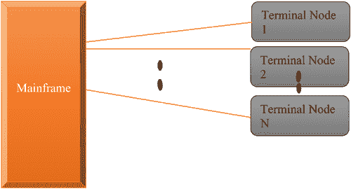

图 1.1 集中计算。

### 1.2.2 分布式计算

在集中计算中，一个位于中心的强大系统为所有其他连接的节点提供计算服务。缺点是所有的处理能力都集中在单一实体上。作为替代，网络上的节点可以共享中心级别的负担。在分布式计算[6]中，单个服务器不负责整个任务。整个工作负载分布到计算节点上，以便每个计算节点具有相等的处理能力。

### 1.2.3 并行计算

为了克服资源利用的不足并提高计算能力，我们进入了另一时代的计算，称为并行计算。“并行”意味着可以同时执行多个指令。这需要配置多个计算引擎（通常称为“处理器”）和相关硬件，以及软件配置。

## 1.3 高性能分布式和并行计算

### 1.3.1 并行计算

在 CPU 中，一个主要任务被划分为多个小指令，然后逐一执行这些指令。串行通信的主要问题是，在硬件和软件资源方面浪费了大量资源。CPU 持续接收指令并处理它们。在串行处理中涉及的硬件在没有指令需要处理时会闲置。

为了克服资源利用的不足并提高计算能力，我们进入了被称为并行计算的另一个计算时代[7]。"并行"这个名字意味着可以同时执行多个指令。它需要配置多个计算引擎（通常称为“处理器”）和相关硬件，同时也需要软件配置。图 1.2 展示了并行计算的不同级别。

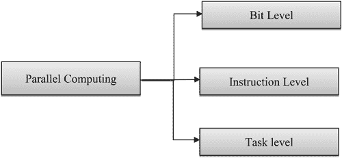

图 1.2 不同级别的并行计算。

#### 1.3.1.1 位级、指令级和任务级并行计算

图 1.1 展示了不同级别的并行计算。这些级别包括位级、指令级和任务级。这是一种复杂的计算类型，因为在这里我们添加了多个处理器，并且这些处理器支持硬件和软件。所以在串行中，我们只处理一个指令和一个处理器，但挑战是将整个工作分成小块，这些小块任务被分配给不同的计算机器。每一台计算机器都是独立的，并在其他机器的帮助下并发地处理。每台机器处理自己的任务，最后与其他机器协作作为一个单一实体。并行计算增加了执行引擎的整体协调[8]，这是多方面问题之一。并行计算可以用来将现实世界的场景转换成更方便的格式。

并行计算的主要用途在于解决现实世界问题，因为更复杂、独立且不相关的事件会同时发生，例如，星系形成、行星运动、气候变化、道路交通、天气等。

快速计算的优点在高档应用中很有帮助，例如，更快的网络、高速数据传输、分布式系统和多处理器计算[10]等。

### 1.3.2 分布式计算

分布式计算的洞察力在于利用多个计算系统来解决更复杂、更大的计算问题。计算问题被分成许多任务，每个任务都在不同地理位置的不同计算系统中执行。位于不同地点的不同计算系统通过强大的基础网络通信技术进行通信。已经采用了多种通信机制来实现强大而安全的通信，如消息传递、RPC 和 HTTP 机制等。

我们可以用另一种方式来描述分布式计算，即所有都是自主的、物理上位于不同地理区域的计算引擎，并通过计算机网络进行通信。每个计算引擎称为自主系统。每个自主系统都有自己的硬件和软件。实际上，他们不会将与位于另一个区域的另一个系统共享硬件或软件。但他们持续使用消息传递机制进行通信。

分布式计算背后的主要思想是克服计算的限制，如处理能力低、速度慢和内存小。每台计算机都通过一个网络连接起来。每个计算引擎的职责是执行分配的任务并与网络中连接的 peer 计算机进行通信。

连接节点或计算机的一个特性是，每个都有自己的硬件，包括内存、处理器和 I/O 设备，以及像操作系统和分布式软件这样的软件。

所有的通信都是通过消息传递机制进行的。图 1.3 表示消息传递机制。

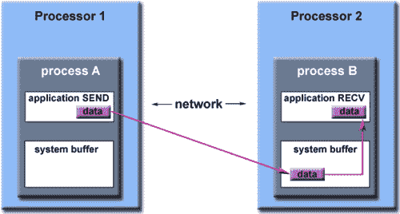

图 1.3 消息传递方法。

### 1.3.3 分布式计算的架构

#### 1.3.3.1 分布式计算的物理架构

分布式计算有很多与应用程序和提出的软件和硬件级别算法复杂性相关的架构。在高级模型中，是网络中连接 CPU 的运行状态的过程的互联。图 1.4（图 1.4）展示了分布式计算的物理表示。

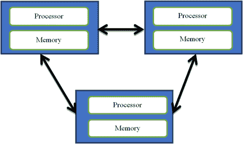

图 1.4 分布式计算的物理块图。

所有分布式计算都使用以下列出的架构类型中的一种。每种架构类型在计算基础上与其他类型略有不同。

架构主要有两种类型；我们通常可以说一种是紧耦合或松耦合。 “紧耦合分布式架构”的名称意味着所有节点或机器通过一个高度集成的网络连接在一起。似乎所有的计算引擎都作为一台单一的机器工作。这种架构创造了一个单一机器的幻觉，但在后台，不同的机器通过快速的网络连接，并通过分布式共享内存（DSM）共享内存，而不使用消息传递技术。分布式共享内存（DSM）在这架构中创造了在连接节点的网络中共享内存的幻觉。实际上共享内存是一个很大的挑战，因为我们必须考虑网络上的流量。下一个架构，“松耦合”，不共享任何硬件，如内存、处理能力。节点只是相互通信。

其他的架构变体包括客户端-服务器、三层、n 层和对等网络。第一种，客户端-服务器架构涉及客户端和服务器之间的正常通信。客户端从服务器请求数据，然后对其进行格式化并显示给用户。第二种通常用于 Web 应用程序开发。这种架构简化了 Web 应用程序开发。第三种是 n 层架构，也用于企业 Web 应用程序开发。这种架构对于软件框架创建 Web 应用程序的成功负有很大的责任。最后一种，对等网络架构包括任何特定的系统或一个提供服务或管理网络资源的系统。所有的工作平均分配给所有的机器，每台机器将服务于分配给该机器的特定责任，这称为一个对等体。它充当服务器和客户端的角色。

#### 1.3.3.2 分布式计算的软件架构

<h---5 class="H3" id="ch-1-sec-13">1.3.3.2.1 分层架构</h---5>

分层架构涉及在软件组件之间分配职责，以及在计算机中将组件放置在不同的位置。分层架构将整个任务划分为不同的层次，每个层次与其它层次进行通信，并向上下层次提供服务。OSI 模型是分层架构的一个著名例子。每层与相邻层（无论是上层还是下层）之间的通信是按顺序进行的。因此，通信请求从下到上顺序进行，响应则从上到下顺序进行。图 1.5 展示了分布式计算的分层架构。

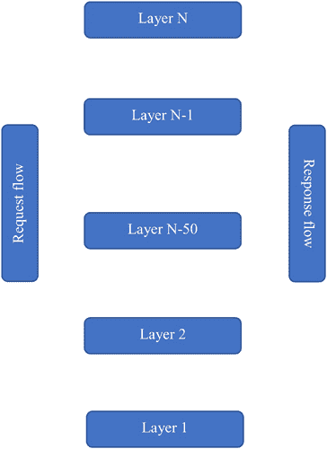

图 1.5 分布式计算的分层架构。

这种架构的优点是请求和响应有一个顺序顺序。每一层都有其预定义的职责，所以处理请求不会有任何混淆。我们可以根据应用程序轻松地更新或替换每一层，而不会影响整个架构。图 1.6 代表分布式系统的基本架构风格。

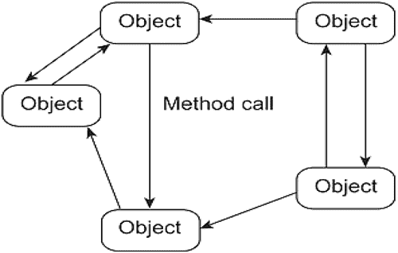

图 1.6 分布式计算的对象基础架构。

<h5 class="H3" id="ch-1-sec-14">1.3.3.2.2 基于对象的建筑</h5>

这种架构风格用于松耦合的系统安排。这种松耦合系统如文献[12]无法遵循像分层那样的顺序架构。在这种架构中，每个组件都被称为一个对象；系统中的每个对象都通过接口与其他对象进行通信。

对象是将数据和方法集成到一个单一单元的组合。通信从一个系统 A 的对象流向系统 B 的对象，通过远程过程调用。这种方法的例子有 CORBA、DCOM、.Net Remoting 和 Java RMI。这是大型软件系统中最重要的架构类型之一。

<h5 class="H3" id="ch-1-sec-15">1.3.3.2.3 基于事件的架构</h5>

节点或组件基于事件的传播进行通信。组件通过事件总线连接。事件总线携带其他组件发布的和订阅的事件。这种架构的主要优点是解耦空间。无需明确地相互引用通信的组件。另一个重要方面是它在时间上耦合，这意味着组件可以在同一时间进行通信。图 1.7 代表分布式计算的事件基础架构。

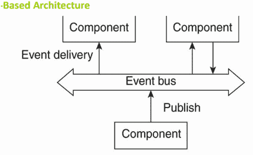

图 1.7 分布式计算的事件基础架构。

<h5 class="H3" id="ch-1-sec-16">1.3.3.2.4 共享数据空间架构</h5>

这也被称为数据中心架构。在这里，所有连接在网络中的组件共享一个公共存储库。这个公共存储库有两个状态，要么是活动状态，要么是被动状态。存储库就像一个数据库。所有节点的信息都得到持久存储。共享存储库包含持久数据。主要思想是订阅的组件可以相应地发送和接收数据。图 1.8 代表分布式计算的共享数据空间架构。

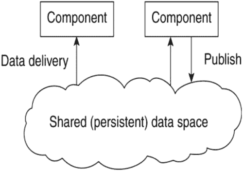

图 1.8 分布式计算的共享数据空间架构。

## 1.4 分布式计算与最先进技术的比较

### 1.4.1 分布式计算与并行计算的比较

分布式计算和并行计算在效率和性能方面结果相同，因为除了硬件位置上的差异外，两者都是相互关联的。在分布式系统中，计算机位于不同位置并通过网络进行通信。但在并行计算中，所有计算硬件都组合成一个单一设备。在并行计算中，巨大的单一内存被计算引擎（即处理器）共享。每个计算站都高效地使用这份内存进行同步。在这里，每个处理器都是独立于其他处理器工作的。在分布式计算中，每个计算节点都有自己的处理器和内存，就像单个自主计算节点一样。并行和分布式计算的优势在于使用共享内存多处理器进行高性能并行计算[13]，以及使用并行计算算法，而大规模分布式系统的协调则使用分布式算法。

### 1.4.2 分布式数据库系统

在上面的讨论中，我们提到了分布式计算及其特点。在所有计算方法中，数据都是以集中方式存储，而计算则是以分布式方式进行。分布式数据库管理系统（DDBMS）是位于不同物理位置并通过网络连接的多个数据库的协作。这些分布式数据库可以是本地互联或整个数据库系统的一部分。分布式数据库系统广泛应用于数据仓库。分布式数据库主要用于网络中管理数据、数据保密和数据完整性。

### 1.4.3 传统数据库与分布式数据库

数据库系统是数据的集合、数据的存储、数据的管理，最后将数据分布到各种相关应用中。过去，打孔卡片被用于数据存储。第一个数据库是查尔斯·W·巴奇曼在 1960 年设计的。接下来，著名的 IBM 公司实施了自己的数据库管理系统 IMS。同样，许多其他公司也发布了他们自己的有偿和无偿软件到市场上，还有各种类型的数据库管理系统可供选择。

传统数据库管理系统（DBMS）与分布式数据库管理系统的区别在于，分布式 DBMS 是传统 DBMS 的修改版或最新更新版。在 DBMS 的每次发展中，都引入了新的特性，这些特性对用户非常有用。如今市场上有很多数据库产品。主要区别在于，传统数据库管理系统仅使用单一机器，单一软件实例可以访问数据库。这些问题通过分布式计算得到了解决，因为通过网络连接的不同机器上的数据库都可以访问。任何设备都可以通过网络软件访问分布式数据库[14]。网络中连接的不同机器可以生成各种查询，分布式数据库系统可以执行这些查询并返回结果。

### 1.4.4 分布式计算与区块链

分布式计算方法是推动区块链机制的基本计算原则之一。现在，大多数人已经对区块链有了基本认识，它是一个由计算机组成的庞大网络，可以验证和认证大量的交易。然而，分布式计算的内部机制可以为区块链技术提供更好的基础。它还可以通过关注分布式计算技术的工作场景来生成更多信息。

## 1.5 区块链的分布式计算环境

通常，分布式计算方法就像一组计算机网络在一起作为一个单一系统工作。这些系统可以相互靠近，并通过有线网络作为单一局域网的一部分。其他网络，如区块链，广泛使用地理位置分散的计算机网络。

分布式计算比区块链机制的使用时间要长得多。计算机在教育和研究中的应用非常早，这就需要计算机相互连接，共享硬件，如内存和打印机。20 世纪 70 年代，第一个局域网建立，许多系统都参与其中。第一个分布式计算机机器是局域网，如以太网，是一组由施乐公司开发的网络硬件技术。现在它已经广泛分布，每个人都利用它。每次你加入一个新的 Wi-Fi 连接，你都在进入一个新的计算机网络场景。

在 21 世纪，分布式系统和分布式计算技术在解决现实世界问题中扮演了至关重要的角色。每个问题阶段的单元都与其他单元相连，最终导出合适的解决方案(图 1.9)。

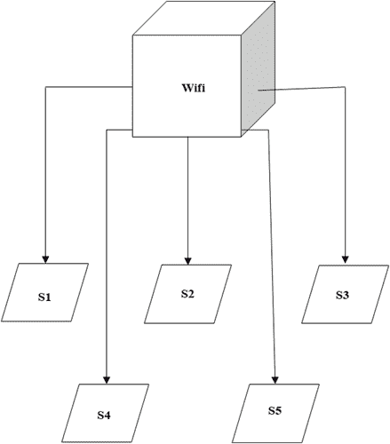

图 1.9 以太网连接。

区块链是一种对等网络（P2P），它与示例中描述的分布式系统略有不同[15]。现在分布式系统是由通过特定方式连接在一起的独立节点组成的群组，旨在产生共同的结果，并且它们以严格的方式结构化，使得这些群组对最终用户来说看起来像是一个定义良好的单一系统。

通过这些网络，每个系统可以通过消息和响应与其他系统进行通信。主要优点是系统之间的通信提供了同步以及无错误的环境。大多数分布式系统有效地与同步消息通道绑定。

通过分析每个节点，可以发现以下内容：

+   节点大多是可编程的、自主的、异步的且不会失败。

+   每个节点都有自己的存储和计算处理器。它们共享内存并且可以并发运行。

+   节点通过与其他节点相连来提供服务，并共享或存储数据（例如，区块链）。

+   所有节点都通过消息与其他节点进行通信。

+   分布式系统中的每个节点都具备与其他节点发送和接收消息的能力。

### 1.5.2 分布式计算架构

主要有两种类型的架构：

1.  1. 客户端-服务器架构

1.  2. 对等网络架构

#### 1.5.2.1 客户端-服务器架构

在客户端-服务器架构中，主要实体包括：

1.  1. 服务器

1.  2. 客户端

    1.  服务器：一个纯粹负责向客户端提供服务的实体；服务器提供如存储、数据处理、部署应用程序等服务。

    1.  客户端：客户端是一个与服务器通信以完成其本地任务的实体。它们通常通过互联网连接到服务器（图 1.10）。

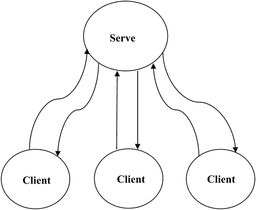

图 1.10 客户端-服务器架构。

这种架构是服务导向系统的一个好例子。

这种架构的最大缺点是整个系统都依赖于中心单一节点（服务器）。如果服务器出现问题，那么整个系统就会停止运行。

在此架构中，有不同的分层架构[16]，根据目的，可以在客户端和服务器端添加几层以完成系统要求、安全性和复杂性。常用的分层架构类型包括两层和三层架构。每种架构类型都有其自身的特点，为参与者提供最大的安全性。

#### 1.5.2.2 对等网络架构

点对点(P2P)架构是由相互连接的系统组成的网络，它们有能力共享资源和信息。连接到网络的每个系统被称为节点或“对等体”。这种类型的架构可以用于区块链技术、交通服务、教育、电子商务、银行和金融等。

P2P 架构的优势有：

1.  1. 它可以很容易地进行配置。

1.  2. 安装起来非常容易。

1.  3. 所有节点都有与其他节点共享资源的能力，并能与网络中存在的其他节点进行通信。

1.  4. 任何单个节点发生故障都不会影响整个系统。

1.  5. 维护此类架构相对具有成本效益(图 1.11)。

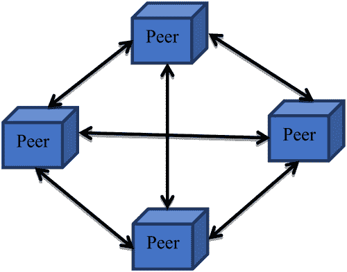

图 1.11 点对点架构。

区块链技术基于点对点架构原理运行；这有助于技术更具威力、更安全、更高效。区块链可用于许多工业用途，但最常见的是用于“加密货币”。

点对点网络在管理区块链内的交易时是中心化的。所有节点可以与其他节点通信，并在区块链上与其他节点进行交易。所有点对点网络都是去中心化的，区块链也是一个去中心化应用。这一特性使区块链技术比其他技术更安全，且非常难以黑客攻击或入侵。但最复杂的部分是，必须为每个节点提供单独的备份和安全，而在该架构中没有中心化的实体来管理所有节点。

## 1.6 区块链中的分布式账本

分布式账本就像一个数据库，它通过手动方式在多个节点、站点、机构或地理位置之间共享和同步。它通过使网络攻击更加困难，为交易提供公共见证。网络中每个节点的对象可以访问跨越该分布式网络共享的数据，并拥有它们的相同副本。对账本所做的任何更改都会在几分之一的时间内反映到所有其他节点。

### 1.6.1 计算能力与密码学的突破

分布式账本记录了各种交易或合同，以去中心化的形式在不同地点和人员之间建立，消除了需要一个单一中央权威来防止操纵的需要。所有数据都使用加密技术安全地存储。一旦数据/信息被存储，它就变成了一个不可变的数据库，这是网络的基本规则之一。

区块链系统核心概念是账本，这是意大利文艺复兴时期的发明，旨在支持双向记账系统，是现代加密货币的遥远前身 [16]。账本只是一个不可更改的、只追加交易的各方之间的日志 (图 1.12 和 1.13)。

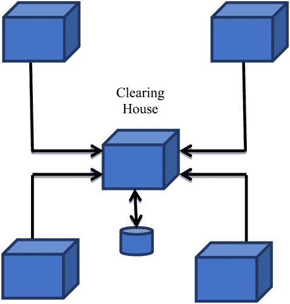

图 1.12 中心化账本。

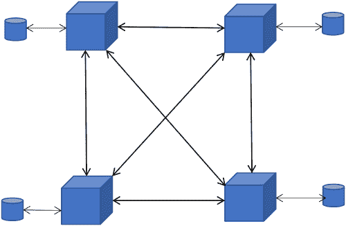

图 1.13 分布式账本。

分布式账本的现实世界示例：

+   政府程序

+   机构

+   企业工作

+   护照发行

+   许可证

+   投票程序

+   金融

+   协议

+   身份证

虽然分布式账本技术具有更多优势，但它仍处于初级阶段，并且仍在被探索。几个世纪以来的账本未来的去中心化账本。

### 1.6.2 公有与私有区块链

私有（受许可）区块链系统与公共（无许可）区块链系统之间的区别是关键的，前者中对象具有可靠和认证的身份，只有经过严格审查的各方才能参与，而后者中对象无法可靠地识别，任何人都可以参与。

私有区块链 [17] 对商业应用更为合适，特别是在受监管的行业中，如金融，需要遵守了解你的客户和反洗钱规定。此外，私有区块链在治理方面也往往更胜一筹。大多数先前的分布式算法工作方法都集中在系统参与者具有可靠身份上。

公共区块链对于比特币等应用更为合适 [18–19]，这些应用确保没有人能决定或控制谁可以参与场景，参与者可能愿意也可能不愿意透露自己的身份。每个节点可以作为一个独立的工作站，配备计算系统。

## 1.7 结论

区块链机制的应用随着不同的机制和计算技术的发展而日益增强。许多基于互联网的方法现在也在使用分布式系统的优势以及区块链机制。一旦系统中的数据被提交，它将永远安全，这使得许多金融领域及其他相关行业的应用成为可能。以下是一些领域：

VeChain 是一个旨在通过改进产品和流程的跟踪来提高业务运营的区块链平台。BitGold 是一个类似于比特币共识系统的 2005 年提案，并集成了散列。加密货币可以定义为使用密码学的一种数字或虚拟货币。由于这个安全特性，加密货币非常难以伪造。数字副本是对通过点对点网络发生的每一笔比特币交易的复制记录。

## 参考文献

1.  1. Nagasubramanian, Gayathri, Rakesh Kumar Sakthivel, Rizwan Patan, Amir H. Gandomi, Muthuramalingam Sankayya, 和 Balamurugan Balusamy. “利用云中的键 less 签名基础设施区块链技术保护电子健康记录.” 神经计算与应用 (2018): 1–9.

1.  2. Westerlund, Magnus, 和 Nane Kratzke. “迈向分布式云：关于集中式云计算、分布式账本技术的演变以及统一机遇和安全影响的预测.” 在 2018 年国际高性能计算与仿真会议(HPCS)上, 第 655–663 页. IEEE, 2018.

1.  3. Archer, Charles J., Michael A. Blocksome, James E. Carey, and Philip J. Sanders. “在分布式计算环境中管理虚拟机.” 美国专利 10,255,098, 2019 年 4 月 9 日发布.

1.  4. 孟刚. “在分布式计算环境中的稳定数据处理.” 美国专利 10,044,505, 2018 年 8 月 7 日发布.

1.  5. Wong, Wai Ming, 和 Michael C. Hui. “在共享和分布式计算环境中建模和分析软件应用程序的计算资源要求的方法和系统.” 美国专利申请 10/216,545, 2019 年 2 月 26 日提交.

1.  6. Cairns, Douglas Allan. “在分布式计算环境中的高效计算和网络通信.” 美国专利 10,248,476, 2019 年 4 月 2 日发布.

1.  7. Archer, Charles J., Michael A. Blocksome, James E. Carey, 和 Philip J. Sanders. “在分布式计算环境中管理虚拟机.” 美国专利 10,255,098, 2019 年 4 月 9 日发布.

1.  8. Dillenberger, Donna Eng, 和 Gong Su. “并行执行区块链交易.” 美国专利 10,255,108, 2019 年 4 月 9 日发布.

1.  9. 李克勤. “在云计算环境中具有能源和时间约束的多多核处理器上并行任务调度.” 未来生成计算机系统 82 (2018): 591–605.

1.  10. 陈振, 赵培, 李富毅, 安德烈·莱尔, 塔蒂亚娜·T·马奎兹-拉戈, 王亚南,  Geoffrey I. Webb 等. “iFeature: 一个用于从蛋白质和肽序列中提取和选择特征的 Python 包和网络服务器.” 生物信息学 34, no. 14 (2018): 2499–2502.

1.  11. Wei, Leyi, Shasha Luan, Luis Augusto Eijy Nagai, Ran Su, 和 Quan Zou. “探索基于序列的特征以改进多种物种 DNA N4-甲基胞嘧啶位点的预测.” Bioinformatics 35, no. 8 (2018): 1326–1333.

1.  12. Salloum, Said A., Mostafa Al-Emran, Azza Abdel Monem, 和 Khaled Shaalan. “使用文本挖掘技术从研究文章中提取信息.” 在 Intelligent Natural Language Processing: Trends and Applications, 页码 373–397. Springer, Cham, 2018.

1.  13. Shae, Zonyin, 和 Jeffrey Tsai. “将区块链转化为分布式并行计算架构以支持精准医学.” 在 2018 IEEE 38th International Conference on Distributed Computing Systems (ICDCS), 页码 1290–1299. IEEE, 2018.

1.  14. Xiong, Zehui, Yang Zhang, Dusit Niyato, Ping Wang, 和 Zhu Han. “当移动区块链遇到边缘计算.” IEEE Communications Magazine 56, no. 8 (2018): 33–39.

1.  15. Puthal, Deepak, Nisha Malik, Saraju P. Mohanty, Elias Kougianos, 和 Chi Yang. “区块链作为去中心化安全框架[未来方向].” IEEE Consumer Electronics Magazine 7, no. 2 (2018): 18–21.

1.  16. Liu, Hong, Yan Zhang, 和 Tao Yang. “区块链支持的电动汽车云和边缘计算安全.” IEEE Network 32, no. 3 (2018): 78–83.

1.  17. Hughes, Alex, Andrew Park, Jan Kietzmann, 和 Chris Archer-Brown. “超越比特币：区块链和分布式账本技术对企业意味着什么.” Business Horizons 62, no. 3 (2019): 273–281.

1.  18. Dr. Kavita. “未来主导技术区块链：数字转型.” 在 IEEE International Conference on Computing, Power and Communication Technologies 2018 (GUCON 2018)由 Galgotias University, Greater Noida, 28–29 September, 2018 组织.

1.  19. Casado-Vara, Roberto, 和 Juan Corchado. “通过区块链实现分布式 e-健康广泛世界会计账本.” Journal of Intelligent & Fuzzy Systems 36, no. 3 (2019): 2381–2386.

1.  20. Pop, Claudia, Tudor Cioara, Marcel Antal, Ionut Anghel, Ioan Salomie, 和 Massimo Bertoncini. “基于区块链的智能电网中需求响应计划的去中心化管理.” Sensors 18, no. 1 (2018): 162.

1.  21. Saugata Dutta, 和 Dr Kavita. “区块链技术在商业应用中的演变.” Journal of Emerging Technologies and Innovative Research (JETIR) 6, no. 9: 240–244, JETIR May 2019.
