# 第二章

# 区块链组件和概念

M. R. Manu, Namya Musthafa, B. Balamurugan, 和 Rahul Chauhan

目录

2.1 区块链的演变

2.1.1 区块链的架构

2.1.2 区块链中的区块

2.2 区块链的类型

2.2.1 公有区块链

2.2.2 私有区块链

2.2.3 联盟或联邦区块链

2.3 区块链的逻辑组成部分

2.4 区块链架构的核心组件

2.4.1 账簿管理

2.5 智能合约及其应用

2.6 智能合约的应用

2.6.1 金融服务和保险

2.6.2 抵押交易

2.6.3 供应链透明度

2.6.4 医学研究

2.6.5 数字身份和记录管理

2.6.5.1 对等网络和成员管理

2.6.5.2 邀请和移除对等网络中的成员

2.7 区块链的应用和实施

2.7.1 区块链技术在金融中的应用

2.7.2 区块链对金融和银行业有何作用？

2.7.2.1 欺诈检测

2.7.2.2 客户识别（KYC）

2.7.2.3 付款

2.7.3 在金融服务中实施区块链所面临的问题

2.8 在线投票中的区块链安全性

2.8.1 区块链电子投票应用中的挑战

2.8.1.1 基于区块链的认证

2.8.1.2 工作见解

2.8.1.3 如何在区块链上验证文件

2.9 构建区块链

2.9.1 哈希的演变

2.9.2 让我们看看如何在 Python 中制作自己的哈希函数

2.10 为区块链创建 API

2.10.1 那么，API 是什么？

2.10.2 如何在网站中集成区块链 API

参考文献

## 2.1 区块链的演进

自 1991 年以来，区块链一直在发展，始于 Stuart Haber 和 W Scott Stornetta 关于加密安全区块链的工作，这是首次提出加密安全的区块链概念，没有人篡改文档的时间戳。然后在 1992 年，该系统通过 Merkle 树方法进行了升级，优化并将所有任务整合为单一任务。2008 年，由于一群名为 Satoshi Nakamoto 的人，区块链变得相关。Satoshi Nakamoto 是数字账本技术的公认发明者。2009 年，这些新概念和方法演变为区块链机制，以实现数字数据的使用。最初，它是为了支持比特币而开发的。使用去中心化数据库的去中心化数据是区块链的核心组成部分。比特币的需求大幅增加，因此区块链立即对互联网进行了改进。俄罗斯-加拿大人通过比特币脚本语言进行转账。

区块链机制的去中心化特性可以让任何语言都能被计算机而不是第三方读懂，这将生成智能合约。以太坊项目在高效交易管理系统中很有用。通过区块链方法产生的交易安全产生了不同的数字交易系统，如比特币、加密货币、以太坊和莱特币，它们可以处理每秒大量交易。

在 2013-2015 年间，系统发展到了以太坊开发的区块链 2.0 版本。它提供了记录书籍和合同的功能。这可以有效地发展去中心化应用。2018 年，区块链发展到了新版本：区块链 3.0。它支持区块链的杠杆能力。这个新的区块链应用叫 NEO，它是中国首次开发的开放源代码平台。为了与物联网进一步升级，开发了 IOTA。它支持物联网生态系统的数字交易。

### 2.1.1 区块链的架构

区块链为交易管理提供了一种安全的点对点分布式账本机制。每个账本都是一个区块，与结构中的其他区块相互关联。数据库以分布式方式相互共享。有一个时间戳服务器用于控制数据库，每个区块都与前一个区块的引用相关联。这个引用也通过哈希机制进行管理以确保安全（见图 2.1 和 2.2）。

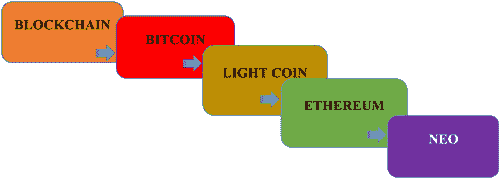

图 2.1 区块链的发展历程。

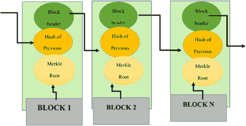

图 2.2 区块链的结构。

### 2.1.2 区块链中的区块

区块是区块链的基本单位。区块是用于交易分布式到其他货币控制的基本数据结构。区块包含一个块头，用于验证块的有效性。它包含元数据，描述区块。区块的元数据信息如下：

1.  a) 版本字段：描述当前块的版本。

1.  b) 前一个块头部哈希：引用前一个块的父块。

1.  c) Merkle 根：本块中所有交易的加密哈希值。

1.  d) 非 ce 和 nbits：重复过程的次数，使其成为复杂任务

## 2.2 区块链的类型

加密货币的概念（比特币）引入了区块链的想法；它是一个保护数据免受篡改和分析的数据库。区块链仍然是一项崛起的技术，所以我们在不深入了解其代码和细节的情况下很难理解其工作。与其它相比，区块链是一个新的、更安全的互联网络。

区块链是一个数字信息的加密仓库。区块链具有分布式网络的计算机网络风格。因此，在分布式网络系统上托管允许在区块链上安全地进行交易，几乎不可能发生欺诈活动。区块链允许用户跟踪资产跨个人。为了容纳所有类型的用户，有三种主要的区块链类型。三种区块链类型如下：

+   公共区块链

+   私有区块链

+   联盟或联邦区块链

注意：联盟或联邦区块链是公共区块链和私有区块链的混合体。它部分去中心化。共识过程由预先选择的一组节点控制，例如金融机构(图 2.3)。

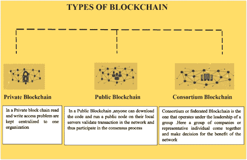

图 2.3 区块链的类型。

### 2.2.1 公共区块链

正如其名，公共区块链是公众的区块链。没有人负责，任何人都可以参与阅读/写入/审计区块链的过程。这类区块链是开放和透明的，意味着任何人都可以在任何时间点查看公共区块链上的任何信息。这个想法会引发一个问题：如果这里没有人负责任何事情，那么在这些类型的区块链上是如何做出决策的呢？这是通过各种去中心化的共识机制来完成的。以下是一些去中心化共识机制的例子：

+   工作量证明（PoW）

+   权益证明（PoS）

有三个我们必须注意的事情，使公共区块链真正成为公共的。它们如下：

+   操作公有区块链的代码是公开可用的，这样任何人都可以下载代码并在本地设备上运行一个公有节点，验证网络中的交易并参与共识过程。这使得任何人都有权参与决定哪些区块被添加到链中以及区块链当前的形状和大小的过程。

+   任何人都可以是网络中的交易参与者。因此，只要交易有效，它们就应该被执行。

+   任何人都可以使用区块浏览器访问和阅读交易。交易是透明的，但却是匿名的(图 2.4)。

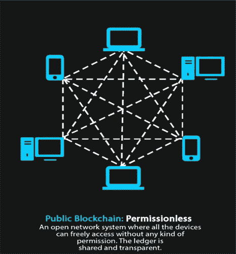

图 2.4 公有区块链。

从图中我们可以理解到任何人都可以参与公有区块链，无需许可。

公有区块链的例子包括比特币、以太坊、门罗币、达世币和莱特币等。

在比特币和莱特币区块链网络上

+   任何人都可以运行 BTC/LTC 全节点并开始挖矿。

+   任何人都可以在 BTC/LTC 链上进行交易。

+   任何人都可以在区块浏览器中审查/审计区块链(表 2.1)。

表 2.1 公有与私有与联盟区块链对比

| 公有区块链 | 私有区块链 | 联盟或联邦区块链 |
| --- | --- | --- |
| 任何人都可以运行 BTC/LTC 全节点 | 并非任何人都可以运行全节点 | 联盟的选定成员可以运行全节点 |
| 任何人都可以进行交易 | 并非任何人都可以进行交易 | 联盟的选定成员可以进行交易 |
| 任何人都可以审查/审计区块链 | 并非任何人都可以审查/审计区块链 | 联盟的选定成员可以审查/审计区块链 |
| 例子：比特币、莱特币等 | 例子：银行链 | 例子：r3、EWF |

公有区块链的性质导致了两个主要含义。

1.  1. 任何人都有可能通过减少中介的使用来破坏当前的商业模型。

1.  2. 通过使用区块链，我们不必一定维护服务器或拥有系统管理员。因此，我们可以最小化创建和运行去中心化应用或 DApps 的成本。

### 2.2.2 私有区块链

私有区块链，顾名思义，是个人的或组织的私有资产。与公共区块链不同，私有区块链有一个负责人，监控诸如读/写或选择性授权读取等重要任务。私有区块链也被称为许可区块链，因为它对谁可以访问它以及谁可以参与交易和验证有限制。只有预先选定的实体才有权限访问区块链。这些实体是如何选出的？这是由相应的权威机构在构建区块链应用程序时由链开发者赋予权限。重要的共识是由中心的负责人在冲动下实现的，他可以赋予任何人挖矿权利，或者根本不赋予。假设需要向新用户授予权限或撤销现有用户的权限，那么这可以由网络管理员处理（图 2.5）。

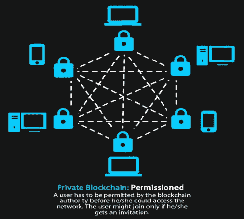

图 2.5 私有区块链。

私有区块链主要应用于数据库管理和审计等领域。它们的用途是一家公司内部的，所以公司不希望数据对公众是可访问的。他们通过建立小组和参与者内部验证交易来使用区块链技术。

然而，私有区块链可能更好地扩展，并更好地符合政府数据的网络安全和隐私法规。私有区块链面临与中心化系统相同的安全漏洞风险。因此，它们具有一定 的安全优势，以及其他安全劣势，就像硬币有两面。区块链仍处于起步阶段，因此尚可猜测这种突破性技术将如何发展并被采用。私有区块链的一些例子包括 MONAX 和 Multichain。

私有区块链的重要优势是交易成本和数据冗余的减少，以及更容易处理数据和更自动化的合规功能。这使得它再次集中化，各种权利在中心可信实体中行使和转让，但从一个公司的角度来看，它通过加密方式得到保护，且对他们来说更具成本效益。但关于这种私有事物是否可以称为“区块链”仍然存在争议，因为它从根本上违反了比特币向我们介绍的区块链的整体目的。

+   示例：Bankchain

在这种类型的区块链中：

+   并非每个人都能够运行完整节点并开始挖矿。

+   并非每个人都能够在链上进行交易。

+   并非每个人都能够在区块链浏览器中审查区块链。

同样，正如我们观察公共区块链那样，在这里我们也可能遇到私有区块链隐含性质和特征的一些关键影响。

+   交易成本和数据冗余的降低

+   简化数据处理和更自动化的合规机制

### 2.2.3 财团或联邦区块链

财团区块链就像公共和私有区块链的混合体。在这种类型的区块链中，一些节点控制共识过程，而其他一些节点可能被允许参与交易。换句话说，当组织准备好共享区块链，但又限制数据访问时，可以使用这种类型的区块链，并使其免受公开访问的安全威胁。也就是说，它具有公共区块链的特征，因为区块链是由不同的节点共享，同时它也像私有区块链一样，限制不同节点对区块链的访问。因此，它部分是公共的，部分是私有的。

财团区块链由两种类型的用户组成。他们是：

1.  1. 控制区块链的用户，决定谁应该有权访问区块链。

1.  2. 能够访问区块链的用户。

在这里，不是由一个单一的权威机构负责，而是由多个机构共同负责。基本上，你有一群公司或代表个人聚集在一起，为整个网络的利益做出决策。这样的组织也被称为财团或联邦，因此得名财团或联邦区块链。

例如，假设你有一个由世界前 20 家顶级金融机构组成的财团；你在代码中决定，只有当一个交易或区块或决策被超过 15 家机构投票/验证通过，它才能被添加到区块链上。这样实现事情的速度会更快，同时你也有超过一个单一的失败点，这在某种程度上保护了整个生态系统免受单一失败点的影响(图 2.6)。

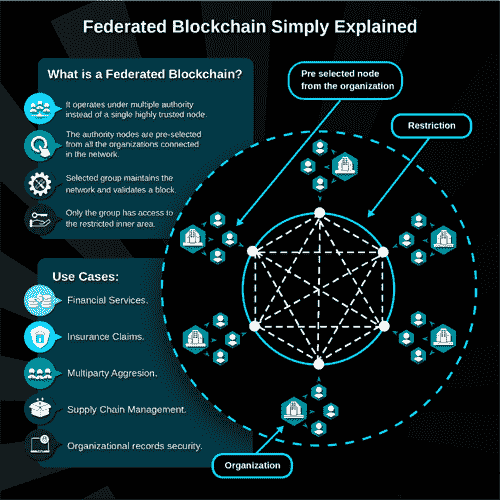

图 2.6 联邦区块链。

+   示例：r3, EWF

在这种区块链中：

+   财团成员可以运行完整节点并开始挖矿。

+   财团成员可以在链上进行交易/决策。

+   财团成员可以在区块链浏览器中审查/审计区块链。

## 2.3 区块链的逻辑组件

加密货币是建立在区块链上的技术，使任何人都可以使用相应的软件查看共享的分布式不可篡改账本。将区块链技术从其应用于加密货币中解放出来，对于理解区块链技术的更广泛含义和应用非常重要。区分这两者将有助于理解为什么人们对区块链启发式的破裂如此兴奋。生物信息学、治理、银行、交易、社会、政治，甚至互联网本身的结构都适合于变革。总的来说，区块链技术将带来一切的中介化。

要深入理解区块链技术应用，有必要了解区块链生态系统的逻辑组件以及每个组件的职责。任何区块链生态系统的四个主要组件如下：

+   一个节点应用程序

+   一个共享账本

+   一个共识算法

+   一个虚拟机

    1.  1. 节点应用程序

        通过互联网互联的每台计算机都需要安装并运行与它们希望参与的生态系统相关的特定计算机应用程序。例如，以比特币生态系统为例，每台计算机都必须运行比特币钱包应用程序。在某些区块链应用中，如 Bankchain，参与是有限制的，需要特殊权限才能加入（称为受权限的区块链）。Bankchain 只允许银行运行节点应用程序。但在比特币生态系统中，任何人都可以下载并安装节点应用程序，并参与该生态系统。

    1.  2. 共享账本

        分布式账本是在节点应用程序内管理的数据结构。一旦你运行了节点应用程序，就可以查看该生态系统的相应账本（或区块链）内容。交互根据其所在生态系统的规则进行。你可以运行尽可能多的节点应用程序，并且被允许使用，每个都将参与其各自的区块链生态系统。需要强调的是，你所参与的生态系统的数量并不重要，因为你将只为每个生态系统拥有一个共享账本。

    1.  3. 共识算法

        共识算法是节点应用程序的一部分，通过提供“游戏规则”来解释生态系统如何达到账本的统一视图。不同的生态系统根据生态系统的所需特性采用不同的共识方法。参与共识构建过程，确定生态系统的“世界状态”的方法，可以由多种不同的方案赋予：工作量证明、权益证明、时间证明；每种方法都以不同的方式证明节点在参与共识构建过程前是诚实的。

    1.  4. 虚拟机

        虚拟机是计算机程序创建的机器（真实或想象中的）的表示，并通过内嵌的指令语言进行操作。它是机器的一个抽象，被包含在机器内部。在某种程度上，我们已经习惯了将现实世界的对象和实体抽象为计算机中的虚拟对象。想象一个应用程序图形用户界面中的按钮。你在屏幕上按下按钮，计算机内部程序的状态就会改变。另一个例子可能是你的驾驶执照，它在政府计算机中有所表示。它是你现实世界中操作机动车辆的法律授权的一个抽象，而且在当今很大程度上，它比真实的物理打印驾驶执照更重要。

## 2.4 区块链架构的核心组件

+   节点 – 区块链架构内的用户或计算机（每个都拥有整个区块链账本的一份独立副本）

+   交易 – 区块链系统的最小构建块（记录、信息等），是区块链的目的

+   区块 – 用于保存一组交易的数据结构，该结构分布式地传递给网络中的所有节点

+   链 – 按特定顺序排列的区块序列

+   矿工 – 在将任何内容添加到区块链结构之前执行区块验证过程的特定节点

+   共识（共识协议）– 用于执行区块链操作的一组规则和安排(图 2.7)

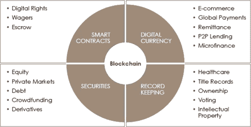

图 2.7 区块链应用。

### 2.4.1 账本管理

区块链是比特币等技术背后的基础技术。分布式账本至关重要，因为它是一份记录了所有事件和交易的数据清单，同时被网络中的每个节点持有。每当有新的事件或交易被添加到账本时，会对所有内容进行加密；通过添加到账本，任务变得复杂。账本对网络中的每个人都是可见的，同时也被保护，以防止人们对其进行篡改。每当这条账本上添加新的信息时，都是以“区块”的形式添加的。这个区块经过数学加密，并根据一系列共识协议被批准添加到账本中，也就是说，这些协议是用来批准添加内容并保护免受欺诈或双重消费的，无需中央权威机构(图 2.8)。

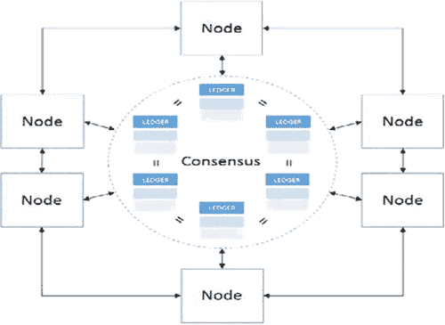

图 2.8 基于共识的账本管理。

分布式账本是一个数据库，因为它分布在不同计算机或节点上。在这里，每个节点都会维护账本，如果发生任何数据变化，账本都将得到更新。更新在各个节点上是独立进行的。通过账本以及一些计算机代码，你可以创建“智能合约”。这些是一系列添加到账本中的条款，由计算机代码支持。当账本中的条款得到满足时，计算机代码会被激活，合同的下一步将被触发。

所有节点在权力上是平等的。没有中央权威机构或服务器管理数据库，这使得技术具有透明性。每个节点都可以更新账本，其他节点将验证其存在。分布式账本具有吸引金融行业或其他寻求更透明技术以及远离中央权威的行业的特性。

通过使用分布式账本，无需中央权威机构。它是由节点维护的分布式账本或合同网络。可以合并成块的节点使得维护更大的分布式网络账本变得更加容易。即便没有中央权威机构，所有信息仍能保持安全。为了使分布式网络运行，需要使用诸如加密技术之类的技术来为数据分配加密签名和密钥。存储在分布式账本上的任何信息都是不可变的。不可变性使得黑客更难以尝试攻击分布式账本网络，如比特币。此外，没有中央权威机构的缺失也意味着它也免受任何故意的更改(图 2.9)。

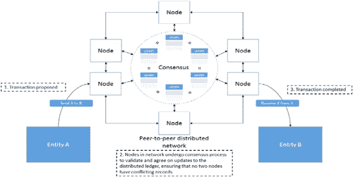

图 2.9 分布式网络中的账本管理。

涉及三个主要步骤：

+   为了发起支付，实体 A 使用加密工具数字签名共享账本的一个拟议更新，以将其账本上的资金转移到实体 B 的账本上。

+   在接收到转账请求后，其他节点会验证实体 A 的身份，并通过检查确保实体 A 拥有进行记录更新所需的加密凭据。验证过程包括但不限于验证实体 A 是否有足够的资金进行支付。节点还参与共识过程，以就应包含在下一区块状态更新中的支付达成一致。

+   更新被节点接受后，资产的属性被修改，以便所有关于该资产的未来交易都必须使用实体 B 的加密凭据发起。

## 2.5 智能合约及其应用

智能合约是将包含条款和条件的协议翻译成计算代码，即脚本。开发者用 Java、C++等编程语言编写脚本，以消除歧义，不会导致解释。这是一种涉及数字资产和两方或多方的机制。在此，各方中的一些或全部将资产存入智能合约，根据基于某些数据公式，资产会自动重新分配给这些各方，且在初始化合同时是未知的。

智能合约是一组上传并存储以检查合约有效性的代码行，包含各方在共享智能合约下同意互动的一组规则。当满足先前确定和定义的条款和条件时，它将自动执行。智能合约代码促进、验证并强制执行协议或交易的会议或表现。这是去中心化自动化的最简单形式。

智能合约是在分布式区块链内部定义和执行的。所有的交易和合约执行都应发生在区块链内部。启用智能合约执行有一定的步骤：

+   在编码过程中，区块链开发者用编程语言编写智能合约作为脚本，并实现合约背后的逻辑，以便当发生给定动作或交易时，脚本执行下一步。

+   一旦合约代码编写完成，脚本就被发送到区块链。代码的执行是由一个分布式网络完成的。通常，那些已经用于计算的计算机可以执行合约，而对于相同的输入，无论在哪台计算机上执行，输出的结果都应相同。

+   可以编写多个条件，最终智能合约用户可以选择他们合约所需的条件。

合约的执行是以点对点方式运行的；这与去中心化相对相似。简单的互联网用户可以作为客户端行动；因此，他们必须在电脑上安装客户端。我们称这个原则为挖掘，运行程序的计算机称为节点。

智能合约与传统合约的主要区别在于，前者不依赖第三方；而是通过加密代码强制执行。在初始阶段，这些是按照开发者设置的方式运行的程序。例如，我们可以考虑一个自动售货机，我们打算在其中机械地实现智能合约。它会验证以下特征：

+   交易中不涉及第三方

+   当硬币被插入机器并选择产品时，只要满足条款和条件，它就会直接将产品交付给我们；这里的条件是：我们的硬币与我们想要购买的产品价值相同或更高。

智能合约的好处

智能合约的好处与区块链息息相关。

+   速度和准确性：智能合约是数字化的，自动化的，所以你不需要花时间处理文件或调和并纠正经常出现在手动填写的文件中的错误。计算机代码也比传统合同中使用的法律术语更精确。

+   信任：智能合约根据预定的规则自动执行交易，这些交易的加密记录在参与者之间共享。因此，没有人需要质疑信息是否为了个人利益而被修改。

+   安全性：区块链交易记录是加密的，这使得它们很难被黑客攻击。因为每个单独的记录都连接在分布式账本上的前一个和后一个记录，要更改一个记录，整个链都需要被更改。

+   节约：智能合约消除了中介的需求，因为参与者可以信任可见数据和技术来正确执行交易。没有必要让额外的人来验证和核实协议的条款，因为这是编入代码的。

优点：

+   通过消除中介，成本得到最小化。

+   合同执行时间缩短；每个动作都根据编码规则自动执行。

+   自动流程：不需要第三方来启用合同。

+   通过消除中介，金钱转账的成本可以降低。

+   它使用一个透明系统：任何人都可以访问区块链。

+   保护数据和交易免受欺诈。在区块链内更改或更新数据而仍保持连贯链是不可能的。

+   去中心化方面防止系统崩溃，这是中心化系统下线的情况。

## 2.6 智能合约的应用

智能合约还允许两个匿名方之间进行更复杂的交易，无需中央权威、执行系统或法律指导。这意味着智能合约可以被编程以执行各种动作。智能合约可以用来允许一个全新的世界应用程序，旨在解决许多现实世界问题。

考虑一个诗人允许记者和内容创作者控制和管理他们数字权利的例子。这意味着他们可以保持能力，在开放市场上提供他们的内容并收费，或与客户签订协议并在工作完成后获得报酬。不需要 escrow 服务、律师或机构。

正如您所想象的，有许多行业可以从这种技术中受益，例如：

+   知识产权

+   法律服务（合同、谈判等）

+   运输和物流

+   金融/银行

+   房地产

### 2.6.1 金融服务与保险

保险行业经常面临的一个重要挑战就是欺诈活动。为了克服这个问题，保险公司需要有一个行政团队来调查索赔并确保其有效性。智能合约可以调节这个重大挑战的影响，因为保险人和被保险人可以通过协议彼此展示一种联系，而无需使用公证人、律师和其他中介。这种节省成本的机会最终会转嫁给终端消费者。虽然这并不能从根本上防止欺诈，但可以帮助法庭上避免争论。然而，结合区块链作为公共账本和记录系统以及智能合约的优点，将使欺诈行为更难逃过检测。

### 2.6.2 按揭交易

智能合约在按揭行业中的另一个重要应用是，区块链技术可以让买家和卖家自动连接，进行无摩擦、无烦恼的流程。构建一个涵盖所有条款和条件的智能合约——避免需要律师、房地产经纪人及其他专业人士。这既节省了双方交易的时间和金钱，也最大限度地减少了手动操作可能带来的潜在错误或成本。

### 2.6.3 供应链透明度

跟踪包裹在全球范围内的移动是一项困难的任务，但智能合约可以简化它。从产品离开工厂地板的那一刻起，直到它到达商店货架，这项技术的透明性可以让整个过程变得更简单；它清楚地显示每个包裹的确切位置以及供应链中可能出现错误的环节。例如，在一批受污染的货物的情况下，管理层能够确切地看到每个产品来自哪里，并隔离受污染的商品，而不必扔掉整批货物。这不仅帮助组织节省成本，同时也让买家更加安全。

### 2.6.4 医学研究

作为医学领域的研究人员，在进行临床试验并研究癌症等疾病的潜在治疗方法时，有效地在各个机构之间自由开放地共享数据是智能合约可以促进的。数据可以自由交换，而不会泄露患者和受试者的隐私和数据安全。智能合约包含各种 if-then 场景，在这种情况下表现得很好。

### 2.6.5 数字身份与记录管理

尽管在当前时代，大型技术公司可以未经许可就挖掘我们的数据和个人信息，但随着智能合约的使用，未来这种情况可能会发生剧烈变化。个人可以拥有和控制自己的数字身份，包括密码、数据、数字资产、记录和其他详细信息。这将与我们当前的情况大不相同，在当前情况下，通常有数十个不同的机构、组织和各方都拥有我们个人信息的个人副本——这是一个明显的安全风险。相反，所有这些详细信息可以合并并由个人拥有，个人可以决定与谁分享这些信息，并通过智能合约来实现。

#### 2.6.5.1 对等网络和成员管理

区块链网络采用对等网络的风格，运行去中心化的区块链框架。我们知道，一个网络包括一个或多个成员，他们在网络中具有独特的身份。例如，一个成员可能是一个银行联盟中的个人或组织。每个成员运行一个或多个区块链对等节点来运行链码、背书交易以及存储账本的本地副本。

考虑亚马逊托管区块链的案例，它为网络中的每个成员创建和管理这些组件，同时也为所有成员创建共享组件，例如超级账本 Fabric 排序服务和通用网络配置。用户可以根据自己的愿望和需求选择不同的亚马逊托管区块链版本。这个版本决定了网络的容量和功能。

创建者还必须创建第一个受管理的区块链网络成员。通过提案和投票过程添加其他成员。无需支付网络建立费用，但每个成员需为其网络会员身份支付每小时费用（按秒计费）。每个网络的费用根据网络的版本而有所不同。每个成员还需支付对等节点、对等节点存储以及成员向网络写入的数据量。

只要仍有成员参与，区块链网络就会保持活跃，网络只有在最后一个成员从网络中删除自己时才会被删除。在没有成为最后一个成员之前，没有任何成员或 AWS 账户（即使是创建者的 AWS 账户）可以删除网络。

#### 2.6.5.2 在对等网络中邀请和移除成员

起初，一个 AWS 账户创建了一个托管的区块链网络，但令人惊讶的是，这个网络并不属于那个 AWS 账户，或任何其他的 AWS 账户。因此，托管的区块链网络是去中心化的。要更改网络的配置，成员们会提出所有其他成员都要投票的提案。如果另一个 AWS 账户希望加入该网络，则网络中的现有成员会创建一个提案来邀请该账户。其他成员可以对提案投赞成票或反对票。如果提案通过获得多数赞成票，则会向 AWS 账户发送邀请。该账户随后接受邀请并创建一个成员加入网络。同样，当需要将不同 AWS 账户中的成员移除时，会提交一个移除提案。AWS 账户中的一个具有足够权限的主体可以随时通过直接删除该成员，而不需要提交投票提案，来移除该账户拥有的成员。

网络的投票策略由创建网络的网络创建者定义。这种投票策略确定了所有网络上投票的提案的基本规则，例如通过提案所需的投票百分比，以及投票到期前的时间等。

每当新成员加入网络时，他们必须做的第一件事之一是创建至少一个对等节点。区块链网络包含一个分布式、基于加密的安全账本，维护着网络交易的历史，这个历史是不可变的——它无法被更改。每个对等节点以分布式方式存储账本的一个本地副本。每个对等节点还持有他们参与通道的网络全局状态，随着网络中每次新交易的执行，这个状态会得到更新。对等节点还彼此交互，创建和对网络上提出的交易进行背书。根据他们的业务逻辑和所使用的区块链框架，成员可以在背书中定义规则。这样，每个成员都可以独立验证交易历史，而无需中央权威机构的介入。

## 2.7 区块链的应用和实施

到现在，我们都知道区块链的工作原理。区块链创建了一个安全的、不可篡改的、易于访问的交易账本。像互联网一样，区块链没有中央权威，而是一个通过大量用户共享的交易网络。它由一系列区块组成，每个区块包含数据、区块的哈希代码和前一个区块的哈希。如果任何区块上的数据被更改，则由于此其哈希代码会改变，导致下一个区块不再指向前一个区块。

区块链有六个基本步骤，每个步骤代表区块链的不同方面：

1.  1. 首先，定义某种交易。该交易可以是字面上的交易，例如用户想要向另一用户发送资金，也可以不那么字面，例如用户尝试传递一个安全的代币以进行身份验证。

1.  2. 第二，将交易编码成区块，然后将其添加到网络中进行处理。

1.  3. 第三，区块被呈现给所有分布式成员，并在它们之间进行比较，以验证其完整性，在某些情况下，与账本的前记录进行权威比较，以证明其是否有效。

1.  4. 第四，区块链内的成员要么拒绝要么批准区块本身。

1.  5. 第五，区块被拒绝或批准，如果被批准，则将区块添加到记录链中。

1.  6. 在第六步也是最后一步中，交易得到批准并执行。在金融交易的情况下，资金易手；在这种情况下，它类似于代币；生成的代币随后由网络验证，并在整个网络中得到信任。

由于这些特性，区块链有许多应用。讨论了一些重要的区块链应用。

### 2.7.1 区块链技术在金融中的应用

金融领域的区块链并不是一个全新的概念。但是当中本聪用他在比特币中称为比特币的概念时，区块链的想法变得著名。比特币是区块链在金融领域的完美例子。

无可争议的是，在比特币之后，区块链获得了认可。当比特币开始变得著名时，许多其他货币进入了市场。我们称这些货币为加密货币，因为它们使用诸如 hash 256 等加密功能。

这是一个单一加密货币区块可能看起来很好的例子：

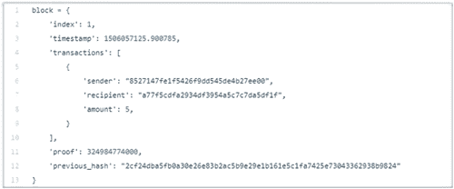

区块链是一种非常高效且可靠的验证交易方法。在比特币等加密货币中伪造交易几乎是不可能的。

要伪造比特币交易，必须更改区块链上的所有区块，在所有区块链副本上进行更改。区块链还使用一个名为工作量证明的概念。由于工作量证明的概念，用户必须解决一个需要大量处理能力的问题，只有首先解决问题的人才有权在区块链上添加新块。这种成本和劳动力的节省对全球金融市场具有如此大的吸引力，以至于许多著名的主要金融机构已经投入数百万资源研究如何最佳地实施它。

### 2.7.2 区块链能给金融和银行行业带来什么？

区块链有潜力完全改变我们今天使用的金融服务。区块链可以在金融领域改变的一些顶级因素包括：

#### 2.7.2.1 欺诈检测

区块链之所以越来越重要，是因为它能够以我们的传统银行系统无法实现的方式处理欺诈检测。目前大多数银行系统都是集中式的。有一个服务器保存着所有交易的记录。但这些系统容易受到网络攻击。如果任何黑客攻破了系统，那么他就能完全获得进行任何欺诈行为的权限。区块链本质上是一个分布式账本。在区块链中，每个区块都包含一个时间戳，并包含一些个人交易的批次。这些记录还包含对前一个区块的链接。人们认为这项技术有能力消除针对我们金融机构的一些当前在线犯罪行为。

#### 2.7.2.2 了解你的客户（KYC）

根据汤森路透的调查，金融机构在遵守了解你的客户（KYC）和客户尽职调查规定上，每年的花费在 6000 万美元到 5 亿美元之间。区块链技术可以让一家公司自主确认一位客户，通过让一家组织被其他公司访问，从而使 KYC 过程无需重新开始。

#### 2.7.2.3 支付

区块链在支付流程中的分部可能具有高度变革性。区块链将为银行等组织提供更高的安全性和更低成本，以处理公司及其买家和银行之间的支付。在当前现实中，支付处理系统中有很多中介机构，但区块链将减少其中许多的需求。

### 2.7.3 金融服务中实施区块链的问题

区块链为改进我们的金融服务提供了巨大的机会，但在实施之前，有一些障碍我们需要首先清除。

金融机构将使用的区块链需要遵守今天的隐私法律和未来的法律，并需要确保数据的安全。关于这项新技术的监管监督有很多问题需要解决。而且，这一领域使用的任何区块链都需要处理异常庞大的数据集，因此可扩展性非常重要。

## 2.8 区块链在在线投票中的安全性

区块链技术的另一个应用是在电子投票系统。我们都知道在一个民主国家公平选举的重要性，在那里篡改选票是一项严重的罪行。有许多公平选举的工具，如电子投票机（EVM），但网络黑客已经证明它们是脆弱的。在一个技术进步迅速的世界里，像 EVM 这样的旧技术已无法提供 100%的选票更改保险。区块链是防傻技术，一旦写下就很难被强制更改。区块链的这一特性使其成为投票的完美选择。通过将投票作为交易，我们可以创建一个跟踪投票总数的区块链。这样，每个人都可以自行计票，并通过区块链审计跟踪，他们可以核实没有选票被更改或删除，也没有非法选票被添加。Cointelegraph 在 9 月 27 日报道说，一个类似的基于区块链的移动投票系统计划在 美国西弗吉尼亚州的中期选举中使用。在 11 月初的选举后，该州州务卿指出，有 144 名来自 24 个县的驻外军事人员成功在一个名为 Voatz 的移动区块链平台上投票。

今年 5 月，Cointelegraph 发布了一篇关于区块链技术在选举中潜在用途的分析。

今年，世界上有几个国家宣布考虑使用基于区块链的投票系统，如乌克兰、加泰罗尼亚和日本筑波市。今年 6 月，被称为“加密谷”的瑞士城市楚格进行了一次基于区块链的试验性市政投票，正如 Cointelegraph 在 6 月 9 日所写的那样。

区块链系统不仅比传统投票系统安全性更高，而且开启了在线投票或电子投票的大门。我们都知道区块链是不可更改的；已经有了一些研究，人们正在试图完善电子投票系统。

### 2.8.1 区块链电子投票应用的挑战

这个领域的挑战不在于安全性或改变现有系统所需的钱；我们仍然使用旧系统的主要原因是我们需要一个坚韧且包容的投票系统，公民或公民团体可以理解并如果它失败了可以用笔和纸来替换。并非每个人都上网了；确实，许多人仍然在通过电子投票机（EVM）投票时遇到困难，而这些技术对于像印度这样的发展中国家的大量人来说仍然是新的。该系统必须保持向后兼容并具有现实的备用选项，因为这是如此敏感的事物。

#### 2.8.1.1 基于区块链的认证

区块链也可以用于创建真实证书，或验证证书的真实性。证书伪造一直是一个长期存在的问题。直到麻省理工学院媒体实验室发布了他们的 Blockcerts 项目，这是一种主要通过将本地文件的哈希值混淆到区块链上来实现的技术，才出现了一种有效的技术方法来保护真实凭证的认证和声誉，但仍然存在许多问题。

基于 Blockcerts，提出了一系列加密解决方案来解决上述问题，包括利用多签名方案来改善证书的认证、实施安全的撤销机制来提高证书撤销的可靠性、建立安全的联合身份验证来确认发行机构的身份。

#### 2.8.1.2 工作洞见

当用户提交一个文档时，技术会将文档转换或编码成一个加密摘要或加密哈希。中本聪关于比特币的白皮书包含了一个永久的哈希值：

如果为了验证而一次又一次地提交同一个文档，每次的哈希值和交易标记都会匹配。如果文档有任何更改，标记将不会匹配。用户还将有权允许或禁止该组织或个人查看文档。

#### 2.8.1.3 如何在一个区块链上验证文档

目前，有多种方法可以验证文档在区块链上的存在。最简单的方法是将文档重新上传以验证其存在。在重新上传文档后，其存在的证明会被验证，因为加密摘要和交易标记也会被验证。其他方法是检查比特币区块链的交易记录，以验证具有时间戳的文档的存在。返回原始时间戳文档的验证页面也可以验证其存在。因此，证明了在先前的日期上存在具有时间戳的文档。

这将帮助银行、教育机构和医疗行业以更少的时间、成本和努力来验证文档。

## 2.9 构建区块链

在开始之前，要记住，区块链是一个不可变、按顺序记录的链条，称为区块。它们可以包含交易、文件或任何你喜欢的数据。但重要的是，它们使用哈希值连接在一起。

构建区块链不是你需要学位的事情；任何有基本编程知识的人都可以创建自己的区块链。

### 2.9.1 哈希的生成代

到现在你可能知道，区块链的每个区块都包含一个散列值，如果有人试图改变页面上的一个词，散列值就会改变。每个区块还包含前一个区块和下一个区块的散列值，所以，如果有人试图改变任何值，他/她必须改变区块链上的每个区块的散列值。散列是使区块链防骗的关键。

在开始构建区块链之前，我们需要了解密码学中散列的基本知识。

散列是通过使用数学函数将文本字符串生成一个或多个值的过程。

简单地说，散列意味着取一个可变大小的字符串并将其转换为固定长度的输出。像比特币这样的加密货币使用安全散列算法 256，也称为 SHA-256。

让我们来看看散列过程是如何工作的。我们将输入某些输入。为此练习，我们将使用 SHA-256。

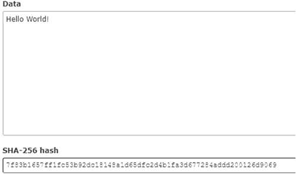

正如图片所示，散列可以接受任意长度的输入并生成固定长度的输出（SHA-256 为 256 位）。

重要的是要注意，特定的字符串总是生成相同的散列输出。这种散列方法也用于存储密码；而不是在数据库中存储用户密码，公司存储密码的散列值，每当用户输入他们的密码时，他们就会比较用户输入文本生成的散列值和数据库中存储的散列值；如果两个散列值匹配，用户就被登录。

关于散列的另一个重要事情是，散列是一个单向函数。这意味着如果有人拥有字符串的散列密钥，那么从其散列值生成该字符串是不可能的。

### 2.9.2 让我们来看看如何在 Python 中创建自己的散列函数

让我们通过在 Python 中创建自己的散列函数来举一个例子。我假设你已经知道如何在你的系统上安装和使用 Python。

首先，在你的系统上打开 Python。你可以通过进入终端并输入 Python 来实现。

这个命令将把你带入 Python REPL，一个你可以直接尝试 Python 命令的环境，而不是在单独的文件中编写程序。

然后，输入以下内容。不要忽略制表符。

导入 hashlib

def

hash（mystring）：

hash_object = hashlib.md5（mystring.encode（））

print（hash_object.hexdigest（））

你现在已经创建了一个函数，hash()，它将使用 MD5 散列算法计算并输出给定字符串的散列值。要运行它，把字符串放在括号里的引号中，例如：

hash（“AnyString”）

之后，按回车键查看该字符串的散列摘要。

你会看到，对同一个字符串调用散列函数总会生成相同的散列值，但增加或改变一个字符将生成完全不同的散列值：

hash（“AnyString”）=>

7ae26e64679abd1e66cfe1e9b93a9e85 hash（“AnyString!”）=> 6b1f6fde5ae60b2fe1bfe50677434c88

在比特币协议中，哈希函数是区块哈希算法的重要组成部分，用于通过挖矿过程将新交易写入区块链。

## 2.10 区块链 API 创建

区块链最好的元素之一是它完全由信任的概念驱动。区块链上的每次交互都信任并验证交易，并依赖于所有节点的共识来跟踪本无法追踪的去中心化活动。API 社区同样以信任作为一个关键概念——这就是为什么区块链是 API 堆栈中连接性的绝佳元素。

### 2.10.1 那么，API 是什么？

API 是应用程序编程接口的缩写。它是软件之间交换功能的一种方式。API 是允许两个应用程序相互通信的软件中介(图 2.10)。

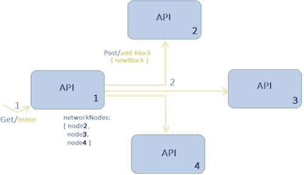

图 2.10 区块链 API 创建。

### 2.10.2 如何将区块链 API 集成到网站中

互联网上有数百种不同的 API 可供使用，赋予我们巨大的功能。在本指南中，我们将考虑设置区块链 API 的最简单应用程序之一。API 允许在网站上接受比特币支付。该过程依赖于区块链的接收支付 API V2 生成新的未使用地址，以接收特定扩展公钥（xPub）的支付：

+   首先，为了获取 API 密钥，用户必须在 [www.blockchain.info](http://www.blockchain.info) 上设置一个钱包，并在 [`api.blockchain.info/v2/apikey/request/`](https://api.block 链.info) 请求 API 密钥。

+   下一步是生成一个扩展公钥，也称为 xPub。如果你从上面给出的地址创建了一个钱包，xPub 可以在：

+   现在我们为每个客户生成一个独特的地址。为每个客户创建新请求的基本 URL 是：[`api.blockchain.info/v2/receive?xpub=`](https://api.blockchain.info)$xpub&callback=$callback_url &key=$key。

这是一个包含三个参数的 API 密钥。这些参数如下：

1.  1. xpub – 你的 xPub。

1.  2. callback_url – 当收到支付时需要通知的回调 URL。

1.  3. key – 你在第 1 步创建的区块链.info API 密钥。请注意，每次调用服务器都会将索引递增 1，以避免向不同客户显示相同的地址。

## 参考文献

1.  韦恩·阿金斯、约翰·L·查普曼和约翰·M·戈登，“一个全新的世界：比特币经济的所得税考虑，”2013 年。在线。可在：[`ssrn.com/abstract=2394738`](https://ssrn.com)。

1.  A. Biryukov、D. Khovratovich 和 I. Pustogarov，“在比特币 P2P 网络中对客户端进行去匿名化”，在 2014 年 ACM SIGSAC 计算机和通信安全会议论文集，纽约，NY，美国，2014 年，第 15-29 页。

1.  区块链维基百科。[在线]。可在：[`en.wikipedia.org/wiki/Blockchain`](https://en.wikipedia.org)。

1.  I. Eyal 和 E. G. Sirer，“多数还不够：比特币挖矿是脆弱的”，在 2014 年国际金融密码学和数据安全会议论文集，柏林，海德堡，2014 年，第 436-454 页。

1.  “跟随我的投票”。[在线]。可在：[`followmyvote.com/online-voting-technology/blockchain-technology/`](https://followmyvote.com)。

1.  Γ. Foroglou 和 A.-L. Tsilidou，“区块链的进一步应用”，在 12 届管理科学和技术学生会议上发表。2015 年。

1.  G. Hileman。“2016 年第一季度区块链状态：区块链融资超过比特币”，Coindesk，2016 年。[在线]。可在：[`www.coindesk.com/state-of-blockchain-q1-2016/`](http://www.coindesk.com)。

1.  A. Kosba、A. Miller、E. Shi、Z. Wen 和 C. Papamanthou，“Hawk：密码学与保护隐私的智能合约的区块链模型”，在 2016 年 IEEE 安全与隐私会议论文集，圣何塞，CA，美国，2016 年，第 839-858 页。

1.  S. Nakamoto，“比特币：一种点对点电子现金系统”，2008 年。[在线]。可在：[`bitcoin.org/bitcoin.pdf`](https://bitcoin.org)。

1.  C. Noyes，“Bitav：通过分布式区块链共识和前馈扫描实现快速反恶意软件”，2016 年 arXiv 预印本 arXiv:1601.01405。

1.  B. Marr。“区块链在银行和金融服务部门的具体应用实例”，Forbes，2017 年。[在线]。可在：[`www.forbes.com/sites/bernardmarr/2017/08/10/practical-examples-of-how-blockch`](https://www.forbes.com)ains-are-used-in-banking-and-the-financial-services-sector/#23adfc4c1a11。

1.  G. W. Peters、E. Panayi 和 A. Chapelle，“加密货币和区块链技术的趋势：货币理论和监管视角”，2015 年。[在线]。可在：[`dx.doi.org/10.2139/ssrn`](http://dx.doi.org)。2646618 563。

1.  T. K. Sharma，“使用区块链进行文件验证”，Blockchain Council，2017 年。[在线]。可在：[`www.blockchain-council.org/blockchain/document-verification-system-using-bloc`](https://www.blockchain-council.org)kchain/.

1.  M. Sharples 和 J. Domingue，“区块链和 Kudos：用于教育记录、声誉和奖励的分布式系统”，在 2015 年第 11 届欧洲技术增强学习会议论文集，里昂，法国，2015 年，第 490-496 页。

1.  M. Yakubowski。“韩国政府测试区块链在电子投票系统中的使用”，CoinTelegraph，2018 年。[在线]。可在：[`cointelegraph.com/news/south-korean-government-to-test-blockchain-use-for-e-voting-system`](https://cointelegraph.com)。

1.  Z. Zhang 和 J. Wen, “基于比特币协议的物联网电子商务模型,” 在第 18 届国际智能下一代网络会议（ICIN）论文集, 法国巴黎, 2015 年, 第 184-191 页。
