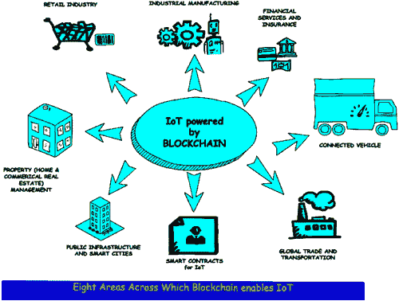
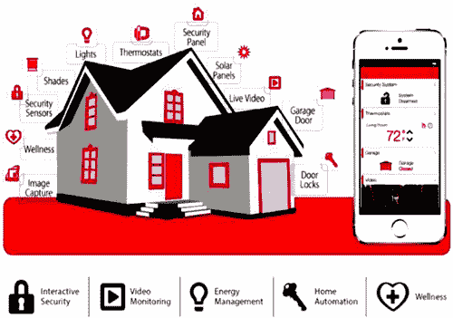

# 第三章

# 区块链与物联网安全

D. Peter Augustine 和 Pethuru Raj

目录

3.1 概述

3.2 理解区块链

3.3 向物联网优化的区块链迈进

3.3.1 工作量证明

3.4 区块链——物联网的支柱

3.5 区块链物联网的安全含义

3.5.1 数据更好的安全性

3.5.2 健壮结构的创建

3.5.3 分布式并行计算的实施

3.6 区块链技术在大规模物联网系统中的应用

3.7 物联网安全的区块链机制

3.8 区块链在物联网安全与隐私中的应用：智能家居案例研究

## 3.1 概述

在当前情景下，技术与资源丰富的发明在信息世界中融合的潮流是区块链，这是化名中本聪在 2008 年的突破性发明。但自那时以来，区块链在信息技术世界的每一个应用维度上都经历了巨大的增长。同时，每一个接触到区块链这个词的人心中都有一个疑问：“什么是区块链？”

区块链通过使信息分布式而非复制，改变了互联网的面貌。尽管区块链发明的初衷是为了数字货币，比特币，但目前 IT 界已经探索出了许多更有效、更高效的技术用途。

区块链可以定义为一种去中心化、分布式和公开的数字交易账本，其理念是记录跨越多个系统的交易；反过来，任何交易记录从创建日期起无法进行编辑，除非修改所有后续的区块。

普通人可以用最简单的方式定义区块链为一系列带有时间戳的数据记录，这些记录无法更改，并由一组计算机组织而成，并非由任何单一单元拥有。这一系列中的时间戳记录可以被视为一个区块，通过加密算法，区块完全绑定在一起。因此，相互链接的区块和链条导致了区块链这一术语的产生。

新兴的区块链技术对 IT 行业产生了充满活力的影响，因为它消除了中心控制，从而实现了一个共享且不可篡改的账本；记录中携带的信息可以被任何人访问。因此，上链的任何领域知识都将进入公共领域，任何参与该时间序列中的人对其活动负责。

## 3.2 理解区块链

区块链技术仅需要基础设施成本，与其他情形相同。但它不需要任何交易成本。区块链背后的机制简单、安全、有效且健壮，通过自动化手段实现任意两个系统之间的交易。可以将其视为两个方之间的交易。在这种场景下，第一个方即“A”方发起并请求与另一方“B”方的交易。交易的初始化之后，将创建一个区块。这个区块广播至网络中所有分布式计算机。网络中的所有系统对这个区块进行验证并确认。这个被验证和确认的区块被添加到一个链中，并且这个链在整个网络中存储；从而产生了一个具有独特历史的新独家记录。交易在“A”与“B”之间经过验证后执行。任何虚假地影响单个记录的场景，都将错误地影响整个链以及链中的百万个区块实例。

使用区块链进行任意两个方之间交易的一个算法：

+   用户 A 请求与 B 方的交易。

+   创建区块来表示交易。

+   区块广播至网络中的所有系统。

+   所有节点对区块进行验证。

+   验证后的区块被添加到链中。

+   在“A”与“B”之间进行交易验证并执行。

让我们以一个铁路系统为例，该系统每天执行数百万笔交易。客户可以通过应用程序或网站在线购买车票。通常，信用卡或借记卡服务提供商要求为其服务收取手续费。使用区块链技术，铁路系统可以消除手续费，甚至提高整个过程的效率。在这个场景中，铁路系统可以被视为“A”，客户可以被视为“B”。车票可以是一个记录中的单独区块，该区块经过验证并被添加到链中。车票像任何日常生活中的金融交易一样，是自主可验证和不可篡改的。整个交易，包括特定的火车路线、火车网络、售出的每一张车票以及在该路线上每一次旅行，都可以被视为一个记录。参与此交易以任何方式更新或修改的人对交易负有完全责任。

即使是在使用物联网的智能家居中，产生来自不同传感器、视频摄像头以及任何其他连接的智能家居设备的数据，也可以与区块链技术结合使用，为数据和过程提供最大的安全性。这将在本章的最后部分进行探讨。

通过避免中间商，我们可以理解区块链能带来更好的成本节约。以 Ola 为例，让我们想象一下区块链技术的应用，这对那些收取额外费用的中间商来说是一个巨大的威胁。这是因为只需通过编码交易信息，就可以去掉中间商。这可以导致完全避免在中间出现的代理商，他们在不同领域对操纵成本起着重要作用。这要归功于区块链技术，它为网络中参与交易的所有相关人员降低了成本。

在区块链技术中，没有交易成本。因此，所产生或获得的成本或利润绝对是终端各方之间的，没有任何中间商参与。

## 3.3 向适用于物联网的优化区块链迈进

在开始讨论适用于物联网的优化区块链之前，我们可以对物联网及其为何需要区块链技术有一个概述。

在最简单的形式下，我们可以将物联网定义为能够在互联网世界中发送和接收数据的物品，以控制设备或分析、操纵共享的数据。物联网始于家用电器，如灯光、风扇、冰箱、电视等，并扩展到网络中的任何电子设备。物联网通过传感器作为输入媒介、软件来控制它以及网络在网络中的任何对象之间传递数据。它根据实施的目标，满足数据分析、成本削减或预测分析等目的。

在这场物联网繁荣中，制造业巨头如三星、西门子以及 IT 巨头如 IBM 和 AT&T 正在研究最佳的物联网适应和应用，以实现从基本的预测性维护阶段到高端数据分析级别的自动化。

确实，物联网在智能城市、智能电网和医疗保健等领域提供了更广泛的优点。在所有这些无数的好处中，不断从设备中获取大量数据以进行处理和分析引起了严重的隐私担忧。让我们回忆一下面向对象编程中的数据封装概念。因此，在这个物联网世界中，我们可以理解，如果它不提供保证的安全机制，来自无数设备的巨大数据量的自发流动可能会导致数据泄露或未经授权的数据访问。我们可以想象一些隐私挑战，如缺乏集中控制、设备资源异质性、多个攻击面、特定上下文的风险和规模。

如本章前面所讨论的，区块链技术可以用作物联网时代数据隐私和安全保护的有效工具。区块链的安全性主要来源于被识别为工作量证明（PoW）的密码学难题，用于将新块添加到链中。区块链使用未固定的公钥为用户身份提供高水平隐私。区块链的显著特性及其在各种非金融应用中的使用可以为物联网提供分布式隐私和安全。

### 3.3.1 工作量证明

这是比特币和以太坊等货币正在使用的最受欢迎的算法，每个货币都有其自己的不同之处。

尽管我们可以利用这些特性中的大部分，但区块链需要根据物联网进行优化。因此，物联网对区块链的采用并不是一件简单的事情。以下是一些必须解决的主要挑战：

1.  (i) 需要选举一个领导者作为演员，并选择一个块添加到区块链中进行工作量证明。在这种情况下，需要解决一个特定的数学问题以找到解决方案，其中资源需求很高。

1.  (ii) 由于他们具有首先解决问题的能力，矿工大多数时间都是拥有计算力的参与者。在这种情况下，可扩展性问题源于需要矿工之间达成共识的需求。

1.  (iii) 即使不是物联网，在加密货币的情况下，对 PoW 的极大延迟和防止双重支出的机制都得到了支持。

我们可以通过研究智能家居优化的场景来理解上述挑战，因为在本章末尾我们有一个相同的案例研究。一些研究者已经提出了针对上述挑战的不同优化技术。其中一种是在不牺牲从区块链实施中提取的隐私和安全利益的情况下，对区块链的轻量级实例化。他们专注于通过采用分层结构来优化资源摄入并提高网络可扩展性。优化的结构包括智能家居、覆盖网络和云存储作为三个不同的层次。

在智能家居中，物联网设备之间进行的交易存储在一个私有的不可变账本（IL）中，这可以被看作是一个区块链，但与中心管理和对称加密不同，后者减少了处理开销。在区块链的情况下，另一个不同之处在于，需要更多资源的设备会相互创建一个分布式覆盖网络，该网络实例化一个公有区块链。交易是不同层次实体之间的通信，这些通信被组装成区块。这些区块附着在链上而不解决 PoW，这大大减少了附加开销。经过验证和验证的交易可以立即被整个网络访问。这种机制潜在地减少了物联网交易的延迟，如数据访问或查询。可能的显著分布式信任方法可以在覆盖网络中使用，以减少验证新块的处理开销。

即使假设建议的机制是围绕智能家居物联网构建的，它也可以被看作并测试为类似应用，并扩展到不同的物联网应用。

## 3.4 区块链——物联网的支柱

正如我们在这章节早些时候讨论的，物联网已经在全球技术领域占据了一席之地，集成了以云为中心的框架。像 IBM、AWS 和 Azure 这样的云巨头遵循基于云的物联网设计，通过设备与云的通信来展示在云平台上完成的分析。每天都有大量应用程序的增长，同时物联网设备也在不断增加。根据 Gartner 和 Cisco 的一份报告，未来几年内，这一数字将增长到 250 亿和 500 亿。但基于云的物联网存在延迟、带宽和连接性的问题，因为计算是在网络的中心进行的。由于上述问题，工业物联网（IIoT）应用，包括智能城市、智能工厂、智能电网和智能农场，与基于云的架构不兼容。因此，工业物联网正在向基于边缘计算的应用开发转变，这可能更适合 IIoT。边缘计算与物联网相结合，可以避免所有延迟、带宽和连接性问题。在这种情况下，区块链可以为 IIoT 提供大量的安全支持，包括边缘计算。

人们担心物联网是否有能力保护与网络相关联的无数设备。我们可以从 Accenture 进行的一项物联网安全概览中了解到这一点。它说：“物联网安全解决方案的紧迫性日益增长。许多企业和政府领导者的脑海中一直困扰着同一个问题：我们需要做些什么来保护物联网？”

由于物联网设备的指数级增长使用，有两个主要的弱点需要解决。

1.  首要问题首先是安全问题。

1.  同时，物联网需要扩大其能力，以确保快速、持续的连接。因为如果你的亚马逊 Echo 暂时失去了连接，这可能不是一个严重的问题，但是我们可以想象如果一辆自动驾驶汽车即使是一瞬间失去了信号会怎样。

与此同时，区块链作为备用技术，为解决这些基本问题提供了大量的支持。世界上最有价值的加密货币都得到了区块链的保护。区块链的根深蒂固的智能合约和分布式网络是解决物联网安全担忧的有力解决方案。而中心化服务器容易受到安全风险的攻击，需要更多的安全措施，而基于分布式计算的区块链使得风险在网络中分散。但是分布式账本机制和区块链的持续连接保证了一个区域的问题不会影响到其他区域。区块链可以证实物联网设备保持了他们提供服务所需的连接的可用性。

如前所述，让我们看看无人驾驶汽车使用物联网概念互连的情况。在这种情景中，有一个私有的区块链，它从汽车启动开始，验证状态和智能协议，以交换关于保险和维修服务统计信息以及实时位置数据来跟踪安全。

我们可以看到，具有分布式账本技术的区块链如何在上述背景下解决物联网中的严重漏洞。

1.  1. 具有分布式账本的区块链为物联网在先前所述的独特情况下提供了信心、认证的所有权数据、清晰度以及完整的分布式通信，这成为了物联网的支柱。

1.  2. 在智能无人驾驶汽车系统的场景中，可以使用区块链以一种安全的方式有效地和高效地处理与保险公司有关的智能合约。

1.  3. 区块链上的每个交易都有一个时间戳，并且每个交易都可以随时受到保护并维护以供将来参考。

1.  4. 在物联网中使用区块链的快速发展的当前趋势中，物联网开发者将部署他们自己的私有区块链，其中交易可以存储以供他们明确的应用程序使用。当前在中央数据服务器上存储数据的情景将能够写入本地账本，这些账本与其他本地账本同步以保存事实的唯一但仍然受保护的副本。

1.  5. 至于区块链作为物联网的支柱，最大的挑战在于物联网通信的安全性。

## 3.5 区块链物联网的安全含义

由于物联网中大多数设备的不可用性、它们在网络中的可用性容量、连接的设备种类繁多以及缺乏适应安全标准，这些都是巨大的挑战。设备不遵守标准将更多地导致数据安全漏洞。它可能导致从私人空间中未经授权访问数据。一些研究者正在研究一种基于网络中心枢纽上下文的策略检查方法，在适配和重新启动交易会话之前将其纳入。另一方面，人们无法消除通过绕过中心枢纽直接访问智能设备的可能性。

一些其他研究者提出了一个基于内容具有动态策略的安全管理提供商，这可能会限制对涉及交易中的设备和数据的访问。同时，在允许访问个人数据时，它必须包含安全措施。

一些研究者研究了智能家居中的隐私问题，其中与个人非常接近的私有数据是关于场所中传感器使用和所收集信息的尊重进行传输的。

一些应用程序开发者提出了限制数据访问网络外系统的主张。我们可能会看到一些建议，将数据与一些加密机制合并以保护数据。同时这种机制在不同层次上可能会增加开销，而且在某些情况下这可能是不必要的。

起初，我们可以得出结论，物联网中的安全和隐私有三个主要问题需要解决。

1.  1. 资源优化：受资源限制的设备可能不适合采用先进和复杂的的安全程序。

1.  2. 隐私：在暴露不同类型的信息时保护隐私。

1.  3. 集中化：对于物联网来说，使用集中式机制可能并不合适，因为它可能会由于大量数据而在一端造成沉重的开销。

区块链中的新颖之处在于，它从根本上是通过一个安全的信息架构来保障物联网的过渡，并处理和验证数据。以下三个主要特性揭示了区块链与物联网结合的潜在影响。

### 3.5.1 数据的安全性

是的，确实需要对数据进行完整的保护，同时遵循所有必要的标准，而不会影响数据的原始性。由于区块链协议并非旨在存储大数据，它们不是数据库，因此区块链中的“控制点”可以允许对数据访问进行完全控制，无论在数据变化的每个层次都是如此。

### 3.5.2 健壮结构的创建

当前物联网架构的主要缺点是“在网络中分享数据有一个正确而健壮的结构”，而区块链确实创造了正确而健壮的结构来分享数据。另一个巨大的挑战是跨行业数据交易，这可能会引起更多关注。通过简单易行的验证和认证，区块链可以解决这个更大的关注点。

### 3.5.3 分布式和并行计算的实施

并行计算与分布式处理的挑战性实施通常归因于人工智能应用。另一方面，通过区块链实现，该区块链对网络中参与的每个节点进行认证和验证。像 Golem、Hadron、Hypernet、DeepBrain Chain、iExec、Onai 等企业正在尝试解决这些问题。

## 3.6 区块链技术在大规模物联网系统中的应用

数据科学的时代的到来使得信息技术领域的任何人都可以广泛使用数据进行分析和做出高效的预测。信息技术领域的另一个高度发展的部分，云计算及其发展也加入了改善数据科学研究领域的手。物联网通过基于云的架构生成的大数据，利用大数据分析将最大限度地实现商业解决方案的好处。在这种情况下，使所有可能的电子设备以物联网的名义相互通信，将数据涌入网络，这可能是局域网、广域网或任何类型的云平台。让我们考虑一下将物联网、云计算和大数据分析这些技术结合在一起为企业解决方案服务的场景。确实，期望 100%的安全是非常真实的，在那里，在任何代价下都找不到一个会导致业务损失的陷阱。图 3.1（来自 Chemitiganti, V. 2016. [`www.vamsitalkstech.com/?p=3314`](http://www.vamsitalkstech.com/?p=3314) 《区块链能为企业物联网做什么》）展示了区块链如何使物联网在八个领域成为可能。

图 3.1 区块链如何使物联网在八个领域成为可能。（来自 Chemitiganti, V. 2016. [`www.vamsitalkstech.com/?p=3314`](http://www.vamsitalkstech.com/?p=3314) 《区块链能为企业物联网做什么》）

物联网（IoT）日益增长的需求以及与之相关的其他尖端技术应用使得物联网成为了一个大规模系统。云广泛用作这种大规模物联网系统的主要存储库，而集中式服务器方法不能是一个谨慎的解决方案。目前实施的多数物联网系统依赖于集中式服务器概念。但事实是，这些物联网系统通过有线或无线互联网网络使用中心服务器。从业务发展角度来看，对于大规模物联网系统来说，完成需要高处理能力的分析是现有基础设施所未能实现的。很显然，拥有去中心化或分布式网络系统可以增强现有的互联网基础设施，以应对大规模物联网系统处理的大量数据。点对点网络（PPN）、分布式文件共享（DFS）和自主设备协调（ADC）等功能，这些使基础设施有效率，可以实施来跟踪大量联接和网络化的设备。

由于区块链的健壮性，它使得物联网系统更加可靠，并保持其对数据的机密性。由于区块链的分布式账本，交易也在点对点之间更快地完成。

当物联网与区块链相结合时，数据流从传感器、网络、路由器、互联网、分布式系统、区块链，最后到分析和最终用户。由于区块链具有防篡改的特性，所以在分布式账本中不可能出现数据读取错误或验证错误。

以下是一些区块链技术最重要的优势：

+   数据保护

+   点对点之间的安全通信

+   健壮

+   极其可靠

+   数据隐私的高级水平

+   维护完整的行动记录

+   在智能设备中存储旧交易数据

+   允许自主操作

+   分布式方式分享文件

+   没有单独的控制权力

+   去除中间商和成本

+   内置的信任

+   加快交易速度

## 3.7 物联网安全的区块链机制

物联网在安全性方面面临各种挑战。让我们看看区块链如何维持与入侵检测和预防程序相关的安全。

由于区块链具有记录追踪的能力，可以作为一种催化剂，增强隐私、安全、健壮性和一致性。这可以追踪任何数量的设备，即使是数百万台，也可以在物联网生态网络中保持其协调和通信。

世界上第一个互联设备的搜索引擎“Shodan”可以帮助用户找出任何物联网设备的漏洞，并揭示其脆弱性以便进行重构。在物联网生态系统中使用区块链技术无疑会通过绝对消除单点故障来提高可信度。区块链中使用的散列算法和加密机制用于加密数据，使其与物联网结合时能够提供最佳的安全机制。与此同时，物联网在采用散列方法和加密技术时对高计算能力的需求是一个挑战，但研究正在进行，以克服这些问题。

一些研究人员，如 Underwood，将区块链视为数字经济的救赎之道，其中完全安全得到保证。区块链被认为是物联网世界中数据的完全防篡改，信任成为首要任务。

纳斯达克在 2015 年 10 月推出了基于区块链概念的“纳斯达克 Linq”，以记录其交易，并保留安全性。由于区块链的优势，美国存托信托及清算公司（DTCC）也在与 Axoni 合作，为货币支付设施（如后交易事项和交易）提供支持。政府监管机构也热衷于区块链，因为其能够提供安全、隔离、可区分的交易监控。

保障持续的运营技术也同样重要。因此，区块链可以通过处理和保护工业物联网设备来防止有害信息。在这个完善的保护场景中，一旦传感器、设备或控制器部署并开始运行，就没有任何修改的余地，随后设备的变化将在区块链中追踪。

## 3.8 区块链在物联网安全和隐私中的应用：智能家居案例研究

智能家居的主要目标是安全、节能、降低运营成本和便利性。让家庭变得智能可以减轻居民的压力，节省时间和金钱，避免能源浪费。它改善了居民的生活方式。

我们了解了智能家居设置的概览，它包括连接到互联网的各种设备、过程和机制(图 3.2)。由于我们在前一个主题中看到了大型物联网系统，其中包括所有必要的尖端技术，因此我们可以用这些技术来看智能家居。在所提出的案例研究中，让我们将物联网和云计算作为主要构建模块，以体验区块链的重要力量。

图 3.2 基于区块链的智能家居系统。（来源：Masak, K. 2018. VIONEX ICO：基于区块链的智能家居系统。Coin Spectator。可在：[`coinspectator.com/news/238572/vionex-ico-blockchain-based-smarthome-system`](https://coinspectator.com)查阅。）

IoT 智能家居涵盖了诸如冰箱、空调、洗衣机、风扇、灯光、电视等家用电器，以及互联网连接和移动电器管理。各种传感器与不同的设备集成，数据通信对未来的处理和分析具有重要意义。这为家庭设备增添了智能，以便量化家庭环境和电器功能的状况。

云计算可以设计用来有效利用其所有服务，包括计算能力、数据存储和构建、维护及运行家庭服务，以及从任何时间、任何地点访问家庭物联网设备。

智能家居管理器（SHM）作为中心单元，像区块链一样处理所有交易。它处理所有入站和出站通信，并使用公钥与物联网设备进行本地交易和本地存储。

原生信息账本保留了一个由家庭所有者定义的政策头部，以批准已建立的交易。叠加节点或家庭内的设备可能会产生旨在分享、请求或存储数据的交易。我们可以假设集群头，即一组设备的头部、交又节点或云存储可以是敌手。敌手有能力伪造交易或删除数据，或与节点建立不想要的链接，或验证虚假交易。

可能针对集群头的常见网络攻击可能包括服务拒绝（DOS）攻击、修改攻击、丢弃攻击或附加攻击，这将威胁到真实用户的可访问性。

研究可以有一个本地区块链，通过使用全面的 Diffie-Hellman 算法和一个共享密钥连接政策头部和设备。共享密钥应由矿工分配给设备，以便彼此之间进行直接通信，以实现用户对智能家居交易的控制。将数据保存在本地存储上，每个设备都需要使用共享密钥对存储进行认证。本地存储的数据可以移动到云存储，这被称为存储交易，它是一个匿名过程。另外可能的交易是访问和监控交易。这些交易主要是家庭所有者在外时观察家庭产生的。

然而，敌手并不能破解加密。主要威胁包括可访问性威胁、匿名性威胁以及认证和访问控制威胁。

这些威胁可能会阻止真实用户访问数据或服务，或者它们可以找到用户的身份来侵犯隐私，或试图让敌手成为真实用户。

在第一道防御中，智能家居管理器会查找任何违反策略的数据包，然后这些数据包将被丢弃。第二道防御是，任何连接到本地区块链的设备都只能在 SHM 进行真实认证后才能进行交易。如果发现任何设备是真实的，它将被隔离出网络。
