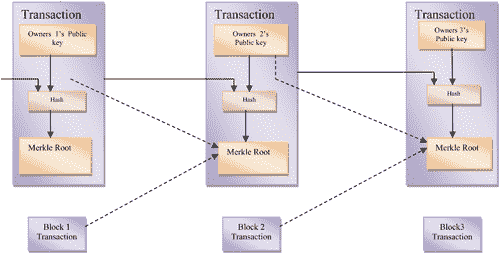

# 第四章

# 共识算法——一项调查

R. Indrakumari, T. Poongodi, Kavita Saini, 和 B. Balamurugan

内容

4.1 引言

4.2 共识

4.3 基于彩票的算法

4.3.1 工作证明

4.3.2 锻炼证明（PoX）

4.3.3 有用工作证明

4.3.4 权益证明

4.3.5 委托权益证明（DPoS）

4.3.6 租赁权益证明（LPoS）

4.3.7 经过时间证明

4.3.8 运气证明（PoL）

4.3.9 空间证明或存储证明

4.3.9.1 理论

4.3.9.2 Burstcoin

4.3.9.3 SpaceMint

基于投票的共识

4.4.1 拜占庭容错共识

4.4.2 容错崩溃的共识

4.5 结论

参考文献

## 4.1 引言

区块链被认为是具有最大潜力的技术之一[1]。比特币，由中本聪提出[2]，吸引了研究人员和工业家的注意力，因为其具有消除依赖第三方传统支付方法局限性的能力。在传统的支付方式中，人们在支付时信任第三方来验证他们交易的有效性。在大多数情况下，第三方并不可信，因为每一笔交易都基于一个单一的组织，导致信任不足。这可以通过使用许多独立组织来解决，从而改变从集中化到去中心化的看法。中本聪引入了被称为区块的账本设计，包含一个验证的交易。创世区块[3]，被认为是第一个区块，包含了比特币的首批交易。

当交易发生时，其有效性由一些节点验证。在这里，有效性指的是发送者拥有足够的资金以及发送者的数字签名[4]。验证有效性后，包含交易的区块被添加到链中，所有其他节点都可以识别它。一个节点可以通过将其分发给请求将此节点添加到当前链中的其他节点，来附加包含各种交易的区块。这种方法的限制是，如果每个节点都请求其首选节点，那么情况就会变得混乱。为了避免这种情况，引入了共识算法，该算法保持了所有节点之间关于应附加哪些区块以及哪些节点被允许附加其提议区块的协议。到目前为止，已经提出了许多共识算法的版本。

在本章中，将讨论区块链中的各种共识算法的变体，主要分为两类。首先讨论基于证明的共识算法，然后是基于投票的共识算法。

## 4.2 共识

共识算法被视为一个群体决策过程，其中个体积极参与制定和支持适合其余群体的决策。换句话说，它可以被看作是一个决议，个体在支持决策。共识算法是一个在全球范围内积极研究的主题，它以一种安全的方式更新分布式共享状态。在传统的分布式系统中，容错是通过在网络中的多个副本上分布共享状态来实现的。基于状态机预设的状态转换协议，复制共享状态的更新发生，这被称为状态机复制。复制的概念是，如果有一个或多个节点崩溃，它不会丢失任何东西。状态机的主要任务是确保具有相同输入的节点会产生相同的输出。这些副本相互联系，在执行状态更改后构建共识并同意状态的最终性。在基于区块链的应用中，共享状态就是区块链。共识可以通过各种方式实现，例如基于彩票的算法，如工作量证明（PoW）和证明时间流逝（PoET），或者基于投票的方法，包括 Paxos 和冗余拜占庭容错（RBFT）。这些方法依赖于各种容错模型和网络要求。

在基于彩票的算法中，胜者可以扩展到大量节点，因为他们推荐一个区块并将其发送到网络中剩余的节点进行验证。当两个或更多的胜者提出一个区块时，分叉方法被调用以分析，这会导致最终结果耗时更长。在基于投票的算法中，结果取决于低延迟的最终性。在这里，节点将消息传递给其他节点，因此达成共识需要更多时间，从而在速度和可扩展性之间产生权衡。

## 4.3 基于彩票的算法

基于彩票的算法也被称为中本聪共识，得名于比特币的创始人。在这里，一个验证者被选中，就下一个要添加的节点做出决定。基于彩票的算法不是等概率分布技术，因为它有自己的概率分布给赢家。下文讨论了基于彩票方法的多种算法。

### 4.3.1 工作量证明

工作量证明（PoW）[5]是用于加密货币的初始共识协议，允许区块链用户在比特币中达成共识。该协议特别涉及 SHA-256 散列算法、Merkle 树和点对点（P2P）网络，以在区块链网络中创建、传播和验证区块。由于它包括完成过程的各种技术，PoW 还造成了昂贵的数字计算。PoW 的特性如下：

+   工作量证明（PoW）是为无需许可的公共分布式账本和挖矿过程而开发的；它消耗了更多的计算资源。

+   要构建一个新的区块，矿工必须解决一个加密谜题，并且首先解决谜题的用户可以通过在网络上广播结果来获得奖励。

+   协议以线性方式维护每个区块中的交易，并且一个区块由交易集合组成。

+   只有当签名在网络上得到验证和确认时，加密签名交易才会被接受。

+   挑战-响应计算过程称为挖矿。

+   在这个协议中，奖励是公平分配的。如果矿工拥有“p”整个计算能力的“p”比例，他们将有机会挖掘后续区块。

+   如果产生任何冲突，协议将释放多个区块分支；然而，较长的那个分支被视为可信分支。

+   PoW 的主要目标是管理共识；新加入的节点可以根据协议规则找出网络的当前状态[[6]]。

工作量证明（PoW）引入了挖矿过程，该过程包括在网络上验证区块（交易组）的一个步骤，通过展示已完成工作的计算证明来进行验证。一旦交易开始，网络中的可用矿工就会相互竞争，通过解决一个加密谜题来形成区块。成功解决谜题的矿工将解决方案广播给其他同伴，然后解决方案被验证以使新区块被链接受。一些实现细节如下：

1.  a) 比特币：它是第一个允许两个参与者无需任何第三方干预即可交换支付的对等加密货币。从一开始，它就激励了许多领域，如医疗保健、治理、金融部门等。比特币中的支付以匿名身份交换，费用微不足道。由于它去中心化，因此避免了对手方的风险，并且不受任何金融机构政策的影响。比特币通过原生协议库[7]和离线闪电网络[8]允许微支付通道。通过零知识证明在交易中出售计算数据，以在交易中获得最大信任[9]。比特币还支持多签名交易，以提高安全级别[10, 11, ]。

1.  b) 以太坊[12]是一个基于工作量证明的开源 P2P 加密货币实现。它利用了既占用内存又计算密集型的增强安全性算法。Scyrt 用于在共识协议中防止伪造。

1.  c) 采用 PoW 的其他加密货币包括 Primecoin、Zcash、Monero、Vertcoin 等。

分析：

+   PoW 是一个耗电的协议，需要大量的计算能力，而许多有效的协议已经存在，这实际上是一种资源的浪费。

+   在 PoW 中，难度级别也会增加，解决加密谜题所需的力量也随之增加。此外，对于单独的矿工来说，积极参与网络变得无法实现。

+   由于 PoW 的广泛耗电，该协议被认为是在浪费巨大的资源。更推荐使用其他共识协议，以获得更好的输出和有效的处理。

+   PoW 对高计算能力的需求也确保了高安全级别。攻击者需要 51%的计算能力，考虑到该协议的难度水平，这根本是不可能的。然而，PoW 对 Sybil 攻击、拒绝服务（DoS）攻击和自私挖矿攻击非常脆弱。

+   应用程序特定的集成电路（ASIC）是管理挖矿过程的硬件，由于其成本高昂，与其他网络中的其他设备相比具有不公平的优势(图 4.1)。

图 4.1 工作量证明的结构。

### 4.3.2 锻炼证明（PoX）

这是一种为分布式账本设计的概念性共识协议，它消耗系统的大量计算资源。正在尝试将基于哈希的 PoW 谜题挖掘过程转变为有用的输出，以避免资源的浪费。PoW 的一种变体通过考虑矩阵作为练习来解决现实世界的计算问题。在各种应用中，基于矩阵的现实世界科学问题包括 DNA-RNA 匹配、图像处理、数据挖掘等。

### 4.3.3 有用工作证明

这个概念性的想法是为了解决科学问题，关注正交向量（OV）作为工作量证明，并且整合了零知识证明的概念。通过这种方式，矿工可以为委派任务提供解决方案的证明，而不是解决方案本身。在网络上满足一定的预设条件后，解决方案才变得可用。

### 4.3.4 权益证明

权益证明（PoS）是一种基于经济股份（指的是特定验证者所拥有的硬币数量）和币龄来选择验证者的共识协议。它有众多变体，在基本协议上有显著的改变。不同的协议在最小化集中化和双重支付问题上有所不同。

以下是对 PoS 的各种属性的描述：

+   协议中的计算挑战-响应过程被称为铸币。

+   最初，它是为基于权限的公共分布式账本设计的，关注基于经济的谜题解决方案。

+   在 PoS 中，新硬币不是被生成，因此没有区块奖励，矿工只能从 PoS 中获取交易费用。

+   一个新的节点总是需要规则、协议消息和最新的状态来达到区块链网络的当前状态。

+   特定块的矿工是基于网络中的经济股份来选择的。

+   在 PoS 中，验证者的概率‘p’与矿工在所有轮次中拥有的股份比例‘p’成正比。

在 PoS 中，分布式账本跟踪网络中的验证者及其相应的股份。PoS 中的验证者投资股份以获得挖掘下一个块的机会。股份越高，验证者的机会就越高。随机选择验证者进行块的创建。对于任何作弊尝试，系统中的股份将被扣除。此外，PoW 中的块创建过程简单明了，对计算能力的要求并不高。

以太坊[13]是一个开源区块链，受到 PoS 的影响以实现共识。最初，它基于 PoW 加密货币；后来，共识机制转变为权益证明，变得更加安全和节能。智能合约可用于在区块链网络上执行操作。以太坊平台提供了一个区块链开发堆栈，开发人员可以在其中构建和部署分布式应用程序（DApps）。使用这项有前景的技术在区块链上形成无限的想法有很大的机会。其他基于 PoS 的加密货币有 Peercoin、Navvcoin、Neo、Decred、Dash、PivX 和 Reddcoin。

分析：

+   对于许多利益相关者来说，PoS 是节能且有益的。

+   因为它需要极少的计算资源，所以它是一种环保协议。此外，它不需要任何专业硬件即可参与。

+   在 PoS 中，攻击者需要超过 50%的计算能力来破坏网络，这比在 PoW 中获得 51%要容易。为了防止这种安全攻击，PoS 采用了一种经济处罚方法，对合谋的参与者进行处罚。实际上，这非常有效，因为只有主要利益相关者才能影响网络，他们会尽量避免在网络上受到处罚。处罚方案在以太坊平台上成功实施；其他方案采用了不同的策略来解决这个问题。

### 4.3.5 委托权益证明（DPoS）

委托权益证明（DPoS）：这被认为是 PoS 的常见变体，其中验证者是由利益相关者选举产生的，而不是由自己验证。DPoS 基于代议制民主运作，而 PoS 遵循直接民主。持有钱包的人可以为验证者投票以创建新区块。验证者可以相互组合来创建新区块，而不是像 PoS 和 PoW 那样相互竞争。它鼓励更好的奖励分配机会，因为为普通代表投票，代表反过来会给他们回报，从而实现去中心化。选民应确保验证者的诚实态度，以确保质押的保证。BitShares 和 Steem 是 DPoS 最受欢迎的实现。

### 4.3.6 租赁权益证明（LPoS）

这是 PoS 使用最少的变体，关注“富者愈富”的问题。它激励参与者将质押股份出租以投票给节点，新区块将由拥有更多股份的节点创建。然后，收到的奖励将分配给所有租赁参与者。该系统还激励租赁参与者数量以实现奖励，从而提高协议的安全性。

应用案例：这项技术最适合于开发公共交易系统。它对于构建公共加密货币更为安全、高效。

### 4.3.7 已逝时间证明

已逝时间证明（PoET）[14]是一个有效的共识协议，影响了可信执行环境（TEE）的利用。它通过引入一个公平的抽奖系统来提高挖矿过程的效率，扩展了所有权证明和时间证明。通过利用 TEE 的能力，强制执行区块创建的随机等待时间。PoET 使用基于英特尔的硬件（例如英特尔 SGX），并且专为无需许可的公共分布式账本而设计。参与者和交易日志是透明和可验证的，显示出网络的更高可靠性。

该协议的系统程序类似于 PoW，但消耗的计算资源更少。节点之间相互竞争，以解决一个密码学难题并寻找下一个区块。在 PoET 协议中，每个验证者被分配一个随机的等待时间`T`来构建区块，并由它来跟踪。成功完成等待时间的验证者可以在网络上创建并发布区块。该协议遵循先来先服务（FCFS）和随机抽奖方案。整个过程依赖于软件保护扩展（SGX），以确保在安全环境中执行可信代码（即英特尔软件保护扩展）。

PoET 通过保持网络参与者的匿名性来达成共识。在 TEE 中维护一个单调计数器类型的硬件，以保护系统免受恶意活动的影响，同时也确保在单个 CPU 中只有一个实例正在执行。参与者可能会创建多个`T`等待时间实例，以提高他们的运气。该协议极易受到各种安全攻击，并且缺乏安全性分析[10]。特别是，英特尔软件保护扩展容易受到回滚攻击[15]。

Hyperledger Sawtooth [16]是由英特尔推出的一个模块化区块链，它遵循 PoET 共识算法来实现领导选举彩票系统。在创建和验证区块时，通过使用“Advance Transaction Execution Engine”进行并行处理。该协议在大量网络节点中提供高效的吞吐量。此外，它是一个企业级协议，可促进通用智能合约的开发过程。

### 4.3.8 运气证明（PoL）

幸运证明（PoL）是基于可信执行环境（TEEs）（即英特尔 SGX）的概念性许可共识协议[17]。它扩展了所有权证明和时间证明的功能，解决了现有共识协议（PoS，PoW）的集中化和大量能源消耗的问题。此外，它还表现出低事务验证延迟，区块确认时间比以太坊大 15 秒，比比特币显著小 10 分钟。

该协议在每个轮次中通知参与者提交所有可用未提交的交易到新块，并为版本块分配一个数值。随后，启动投票过程，参与者随机投票，得票最高的节点赢得幸运区块。当接收到幸运区块时，网络中的其他参与者停止挖矿过程，并立即广播自己的区块；因此，可以最小化网络拥塞。

### 4.3.9 空间证明或存储证明

空间证明或存储证明[18]是一种环保协议，旨在避免资源滥用[19]。它类似于工作量证明，但涉及磁盘消耗，而不是计算。

+   空间证明是为公共分布式账本设计的，免费的磁盘存储被视为一种资源。

+   矿工的网络影响力与贡献的磁盘空间成正比。

#### 4.3.9.1 理论

存储证明利用磁盘空间挖出一个区块。它通过将数据分发到服务器并计算挑战-响应协议来验证远程文件的真实性，以确保数据的完整性。证明存储算法中的参与者是证明者和验证者。证明者是存储数据的参与者，验证者是验证证明者是否存储数据的参与者。验证者通常向证明者提供一个挑战，证明者随后用确切的存储证明方案解决该挑战。

存储证明使用 Shabal 算法提前生成随机解决方案，称为图，并将其保存在硬盘上。这个过程被称为绘图。在绘图过程之后，矿工将解决方案与最近的谜题进行比较[20]。

#### 4.3.9.2 Burstcoin

Burstcoin 是一种在 2014 年实现环保空间证明算法的挖矿硬币。它是一个去中心化的加密货币和支付系统，在挖矿资源时依赖于空间[21]。Burstcoin 挖矿成本低廉，可以在移动设备上进行[22]。第一个解决计算问题的图灵完备智能合约是通过空间证明协议实现的。

#### 4.3.9.3 SpaceMint

SpaceMint 是一种加密货币，通过证明空间来替代与加密货币相关的能源密集型计算。在这里，矿工投资磁盘空间而不是计算能力。挖矿过程分为两个阶段：初始化和挖矿。在初始化阶段，矿工贡献 N 位空间并创建密钥对。矿工通过特殊交易发布其空间承诺。在挖矿阶段，挖矿通过区块奖励和交易费用得到激励。一旦初始化，每个矿工都会在每次周期尝试向区块链添加一个区块。SpaceMint 支持三种交易类型，即支付、空间承诺和处罚。每笔交易都由用户签名并发送给矿工添加到区块中。

## 4.4 基于投票的共识

在基于投票的共识算法中，验证网络应该是可调整的并且是明确已知的，以便没有任何复杂性地进行消息交换。在基于证明的共识算法中，节点被允许自由地加入或退出网络。

基于投票的共识算法中的节点在将各自的区块添加到链之前相互通信。执行过程与分布式系统中集成的传统容错方法相同 [23]。

像任何容错方法一样，基于投票的共识旨在节点崩溃和有时节点被颠覆时正常工作。

当节点崩溃时，它等待其他节点传递的信息。在某些情况下，等待的节点不会从其他节点收到任何适当的消息或指导来做出决定。为了防止这种情况，应该有 n + 1 个节点而不是 n 个节点来进行不间断的操作 [24]。

与这个相比，颠覆节点执行出格的操作，导致输出不精确。这些问题可以通过一个经典问题来解决，这个问题被称为由 Lamport 等人开发的拜占庭将军问题 [25]。

在这里，概念是拜占庭将军通过将他们的军队力量分成 N 组，每组由 N 个将军领导，占领了敌人的营地，这些将军能够从各个地点攻击敌人。为了获胜，N 组军队应该同时发起攻击。在开始攻击之前，他们应该通过交换适当的信息达成攻击时间的共识，并且由多数决定。不幸的是，在将军群体中有一些阴谋家，他们的意图是通过向其他人传递不同的决定来欺骗其他将军，这导致攻击失败，因为一些将军没有参与攻击。

这个问题解决方案是由 Lamport 等人提出的，要容忍 n 个被颠覆的将军，至少应该有 2n+1 个将军与他们同行。同样的情况也适用于区块链，在执行共识工作时，一些节点可能会被颠覆，通过向其他节点传播不同的结果。这些糟糕的情况导致投票 based 共识算法分为

1.  1. 基于拜占庭容错共识，避免出现崩溃和被颠覆的节点。

1.  2. 基于崩溃容错共识，防止节点崩溃的情况。

这些子类别下的共识算法假设在 N 个节点中，至少有 t 个节点（t < N）正常运行。而在崩溃容错共识中，t 通常设置为[N/2 + 1]，在拜占庭容错共识中，t 通常分配为[2N/3 + 1]。

### 4.4.1 基于拜占庭容错共识

基于拜占庭容错共识是基于流行的 Hyperledger 区块链平台[26]，许多企业都在使用，尤其是 IBM [27]。 Castro 和 Liskov [28] 提出了一个拜占庭容错变体，称为实用拜占庭容错（PBFT），旨在为 Hyperledger Fabric [29]。在拜占庭容错中，存在两种类型的节点，分别是领导者节点和验证节点。

以前，验证节点从客户端接收验证交易的请求。验证后，结果发送给领袖和其他节点。在这里，阈值是保持批处理大小。根据创建时间，领袖安排交易并将它们放入一个区块中。

共生体和 R3 Corda 是基于拜占庭容错共识算法，由 Bessani 等人提出的著名区块链平台[30] [31]。除了执行过程，Bessani 等人还在单机上开发了一个副本，用于存储已执行操作的日志，当节点失败需要重新启动时，可以用来获取最后一个当前状态。

### 4.4.2 基于崩溃容错共识

Paxos [33] 和 Raft [34] 是 Quorum [35] 用来容忍崩溃的基于崩溃容错共识。Raft 基于这样一个假设，每次总共有[n/2 + 1]个节点正常工作。在 Raft 共识算法中，验证节点扮演着跟随者、候选人和领导者的角色。节点之间的通信是通过消息进行的：RequestVote 用于投票选举领导节点，AppendEntries 用于将请求传递给其他节点。

在执行过程中，客户端请求的交易由领导者接收，并将它们保存到一个称为日志条目的列表中。接收请求后，领导者向所有跟随者发送 AppendEntries 消息，其中包含事务日志和前一个事务索引。例如，如果领导者发送第 n 笔交易，那么他应该附上第（n-1）笔交易的详细信息。

链[36]，一个区块链平台，使用一种名为联邦的算法，该算法基于崩溃容错共识算法。在这里，验证网络中有 n 个节点；其中有两个节点称为区块生成器和区块签署者。从客户端接收的交易由区块生成器验证，并将有效的一个保存到一个临时列表中。区块生成器依次考虑一些请求的交易，并将它们放入区块中，然后传递给所有区块签署者。签署者接收的区块进行验证，并对有效的区块进行签署并发送回区块生成器。如果一个区块被大多数区块签署者签署，那么它被认为是值得信赖的区块，并且将其添加由区块生成器维护的链中。由于有多个区块签署者确认区块，如果存在任何崩溃，那么链能够抵抗崩溃故障。

## 4.5 结论

本章提供了一些适用于区块链的共识算法的调查。这些算法分为两类，分别是基于证明的算法和基于投票的算法。在基于证明的算法中，节点必须证明其多数才能附加所需块。在基于投票的算法中，节点之间就应附加到账本中的区块达成一致。本章详细讨论了这两种算法的应用。

## 参考文献

1.  1. S. Haber 和 W. S. Stornetta，“如何给数字文档打时间戳”，《密码学杂志》，第 3 卷，第 2 期，pp. 99–111，1991 年。

1.  2. 中本聪（S. Nakamoto），“比特币：一种点对点的电子现金系统”，2008 年 [在线]。可在 [`bitcoin.org/`](https://bitcoin.org) bitcoin.pdf 下载。

1.  3. Bitcoinwiki，“创世区块”，2017 年 [在线]。可在 [`en.bitcoin.it/wiki/Genesis_block`](https://en.bitcoin.it) 获取。

1.  4. E. Robert, “数字签名”，2017 年 [在线]。可在 [`cs.stanford.edu/people/eroberts/courses/`](http://cs.stanford.edu) soco/projects/public-key-cryptography/dig_sig.html 获取。

1.  5. 中本聪（S. Nakamoto），“比特币：一种点对点的电子现金系统（白皮书）”，2008 年。 [在线]。可在 [`bitcoin.org/bitcoin.pdf`](https://bitcoin.org) 获取。

1.  6. R. Greenfield，“漏洞：工作证明 vs. 权益证明”，2017 年 08 月 27 日。[在线]。可访问：[`medium.com/@robertgreenfieldiv`](https://medium.com)/vulnerabilit y-proof-of-work-vs-proof-of-stake-f0c44807d18c。

1.  7. J. Poon 和 T. Dryja，“比特币闪电网络：可扩展的链下即时支付”，2016 年 01 月 26 日。[在线]。可访问：[`lightning.network/lightning-networkpaper.pdf`](https://lightning.network)。

1.  8. Bitcoinj 社区，“与微支付通道合作”，[在线]。可访问：[`bitcoinj.github.io/`](https://bitcoinj.github.io)。

1.  9. Gmaxwell，“零知识条件付款”，2016 年 02 月。[在线]。可访问：[`en.bitcoin.it/wiki/Zero_Knowledge_Contingen`](https://en.bitcoin.it) t_Payment。

1.  10. M. Rosenfeld，“什么是多重签名交易？”，2012 年 05 月 18 日。[在线]。可访问：[`bitcoin.stackexchange.com/questions/3718/wh`](https://bitcoin.stackexchange.com) at-are-multi-signature-transactions。

1.  11. Belcher，“多重签名”，2018 年 12 月。[在线]。可访问：[`en.bitcoin.it/wiki/Multisignature`](https://en.bitcoin.it)。

1.  12. Litecoin 项目社区，“关于 LiteCoin”，2018 年。[在线]。可访问：[`litecoin.org/`](https://litecoin.org)。

1.  13. J. Ray，“以太坊（白皮书）”，2018 年 05 月 26 日。[在线]。可访问：[`github.com/ethereum/wiki/wiki/White-Paper`](https://github.com)。

1.  14. L. Chen, L. Xu, N. Shah, W. Shi, Z. Gao 和 Y. Lu，“Proof-of-Elapsed-Time（PoET）的安全分析”，2017 年，波士顿，马萨诸塞州，SSS 2017。

1.  15. M. Brandenburger, C. Cachin, M. Lorenz 和 R. Kapitza，"Rollback and forking detection for trusted execution environments using lightweight collective memory," 在 Conference: 2017 47th Annual IEEE/IFIP International Conference on Dependable Systems and Networks (DSN), 2017 年。

1.  16. K. Olson, M. Bowman, J. Mitchell, S. Amundson, D. Middleton 和 C. Montgomery，"Hyperledger Sawtooth（白皮书）," 2018 年 01 月。[在线]. 可获取: [`www.hyperledger.org/wpcontent/uploads/2018/01/Hyperledger_Sawtooth_Wh`](https://www.hyperledger.org) itePaper.pdf。

1.  17. M. Milutinovic, W. He, H. Wu 和 M. Kanwal，"Proof of luck: an efficient blockchain consensus protocol," 在 Middleware Conference，2016 年，意大利。

1.  18. S. Dziembowski, S. Faust, V. Kolmogorov 和 K. Pietrzak，"Proof of space," 在 International Association for Cryptologic Research (IACR), 2013 年。

1.  19. gmaxwell，"Proof of Storage to make distributed resource consumption costly," 2013 年 10 月。[在线]. 可获取: [`bitcointalk.org/index.php?topic=310323.0`](https://bitcointalk.org)。

1.  20. P. Andrew，"What is proof of capacity? An eco-friendly mining solution," 2018 年 01 月 31 日。[在线]. 可获取: [`coincentral.com/what-is-proof-ofcapacity/`](https://coincentral.com)。

1.  21. S. Gauld, F. V. Ancoina 和 R. Stadler，"The burst Dymaxion," 2017 年 12 月 27 日。[在线]. 可获取: [`www.burst-coin.org/wpcontent/uploads/2017/07/The-Burst-Dymaxion-1.00.pdf`](https://www.burst-coin.org)。

1.  22. P. Andrew，"What is Burstcoin?" 2018 年 01 月 31 日。[在线]. 可获取: [`coincentral.com/what-isburstcoin-beginners-guide/`](https://coincentral.com)。

1.  23. W. L. Heimerdinger 和 C. B. Weinstock，"A conceptual framework for system fault tolerance," Defense Technical Information Center, Technical Report CMU/SEI-92-TR-033, 1992 年。

1.  24. L. Lamport，《Paxos 简明教程》，ACM SIGACT News，第 32 卷，第 4 期，2014 年，pp. 18–25。

1.  25. L. Lamport, R. Shostak 和 M, Pease，《拜占庭将军问题》，ACM Transactions on Programming Languages and Systems，第 4 卷，第 3 期，pp. 382–401，1982 年。

1.  26. Hyperledger [在线]. 可用：[`hyperledger.org/`](http://hyperledger.org)。

1.  27. Hyperledger fabric [在线]. 可用：[`github.com/hyperledger/fabric`](https://github.com)。

1.  28. M. Castro 和 B. Liskov，《实用拜占庭容错》，第三届操作系统设计与实现研讨会论文集，新奥尔良，路易斯安那州，1999 年，pp. 173–186。

1.  29. C. Cachin，《Hyperledger 区块链 fabric 的架构》，ACM 分布式加密货币和共识分类研讨会论文集，芝加哥，伊利诺伊州，2016 年。

1.  30. Symbiont [在线]. 可用：[`symbiont.io/`](https://symbiont.io)。

1.  31. Corda [在线]. 可用：[`www.corda.net/`](https://www.corda.net)。

1.  32. Bessani, J. Sousaand E. E. P. Alchieri，《带有 BFT-SMART 的群体状态机复制》，2014 年第 44 届 IEEE/IFIP 国际可靠系统与网络会议论文集，亚特兰大，乔治亚州，2014 年，pp. 355–362。

1.  33. L. Lamport，《Paxos 简明教程》，ACM SIGACT News，第 32 卷，第 4 期，2014 年，pp. 18–25。

1.  34. D. Ongaro 和 J. K. Ousterhout，《寻找一种可理解的共识算法》，2014 年 USENIX 年度技术会议论文集，费城，宾夕法尼亚州，2014 年，pp. 305–319。

1.  35. Raft-based consensus for Ethereum/Quorum [在线]. 可用：[`github.com/jpmorganchase/`](https://github.com) quorum/blob/master/raft/doc.md。

1.  36。联邦共识[在线]。可访问：[`chain.com/docs/1.2/protocol/papers/federated-consensus`](https://chain.com)。
