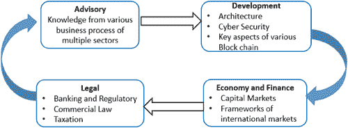
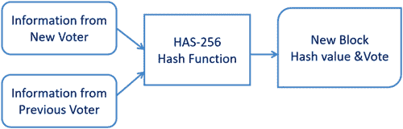
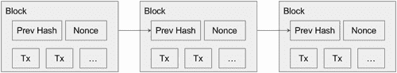
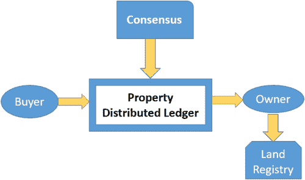

# 第五章

# 利用区块链优化政府服务的数字化转型

苏贾塔·R., 纳瓦尼恩·C., 卡鲁里·拉杰什, 和 S. 普拉桑纳

目录

5.1 区块链概述

5.2 区块链在交通管理中的应用

5.3 区块链在税收中的应用

5.4 区块链可能改变间接税的世界

5.5 区块链技术在投票中的应用

5.6 区块链在土地登记中的应用

5.7 区块链在医疗保健领域的应用

5.8 区块链在金融领域的应用

5.9 区块链在身份管理中的应用

5.9.1 区块链在数字支付中的应用

参考文献

## 5.1 区块链概述

区块链的概念依赖于密码学，它将区块链接起来，每个区块都包含前一个区块的加密哈希和时间戳以及要传输的数据。在分布式设置中的开放性是通过点对点网络来实现的。主要思想是不再需要中央可信任的第三方。每个节点（区块的另一个名称）都拥有区块链的完整副本。添加新交易，即添加区块，确保该区块被添加到所有块中，以保持透明度。篡改数据是不可能的，当与区块链技术集成时，系统的运行是完美的。密码学安排有助于在各种应用程序中增加交易的安全性。区块链的类型广泛分为公共、私人和联盟分类。区块链提供可靠、不可变、不可撤销、随时可用的数据，因为不需要第三方，所以成本降低。

最初，区块链与加密货币这一热门词汇一起出现，之后在全球的公共和私人部门中找到了各种应用。经济合作与发展组织（OECD）在 2018 年 10 月举行的一次会议中讨论了区块链在公共部门的使用和局限性。会议明确指出，区块链的发展是指数级的。2018 年 4 月，伊利诺伊州区块链倡议收集的会议数据显示，全球 46 个国家正在蓬勃发展 203 项区块链计划。在这些计划中，有一些处于探索阶段，许多处于战略阶段，有一些处于原型设计和孵化状态，还有一些已经上线或正在运行。区块链在公共部门，如交通管理、税收、投票、土地注册、医疗保健、身份管理和数字支付等领域被积极使用，用途广泛。

特别是不涉及加密货币的支付系统也需要数字身份验证。为了促进一个国家的进出口贸易，识别合法的支付方法是一项艰巨的任务，涉及处理大量的投诉。一个基于区块链的数字身份，如果将宽容的区块链作为监管节点之一，纳入所有交易中，将对政府部门成为一个可行的解决方案。

健康护理是所有发展中国家首要关注的问题，因为有很多注册的替代医学从业者和方法，而且由于文盲人数达数百万，为未来的医疗保健计划维护和检索数百万人的健康记录是一项繁琐的工作。区块链可以为此提供一个可持续的解决方案。

甚至许多监管机制和部门都可以与区块链结合，为普通大众提供一个没有中间干预的真实可信平台。

由于区块链技术具有去中心化、分布式和自我调节的特性，对于许多部门来说，它似乎是一个可行的解决方案。尽管有很多批评最初最成功的系统比特币，但全球所有联邦政府都通过这项技术理解了区块链技术的潜在可持续益处。连续改进的区块链 2.0，以及被称为 3.0 的 Hyperledger，已经解决了区块链的可扩展性问题。因此，通过采用区块链技术，可以部署一个可持续、适应性强、去中心化的系统，该系统还消耗较少资源，并几乎不需要政府的干预。宽容的区块链还确保，在去中心化的名义下，监管机构不必完全失去控制。该系统可以受到监控，为了处理异常情况，监管机构可以使用特殊的特权共识机制，这在区块链 3.0 中是可能的。

## 5.2 交通管理中的区块链

许多快速发展的国家以及发达国家都有许多城市和大城市。发展中国家和发达国家的政府都在寻找更好的方法来管理日益增长的城市，并采取有效措施来遏制导致过度污染的交通拥堵。因此，对于全球几乎所有的政府来说，智能移动性成为了一个噩梦。定义政府可能提供一个框架并处理他们的公共交通的流动性，因为他们可能拥有关于流动性的完整信息。然而，这种集中式系统仅限于政府批准的交通和流动性服务。全球所有城市地区都有大量未记录的、高度动态的私人车辆流动性，而集中式交通管理无法对其进行任何预测。这种额外的流动性问题将使集中式公共交通系统的估计不精确，因此公民可能会对所谓的集中式流动性管理系统的不准确预测结果感到沮丧。许多国家都有良好管理的公共铁路和道路运输服务，目前还有几个网络和移动应用程序在运行，以满足智能流动性的需求。但重要的是，这类应用程序大多没有考虑到私人不可预测交通的突然爆发，这可能会破坏集成在其中的智能流动性功能的目的。

Sharma 提出了一种可持续的方法，这种方法内在地减少了延迟，并解决了可扩展性、隐私和带宽问题。他们混合型架构具有去中心化和中心化架构的额外优势。在提供的证明工作方案中，隐私和安全得到了保证（Sharma & Park，2018）。Singh 研究了一个名为智能车辆（IV）的主题，该主题利用区块链技术创建一个通信的信任环境，同时确保隐私。它包括一个与主区块链相比较的本地动态区块链，以检查网络的可靠性。整个分叉过程通过去分叉和分叉算法实现自动化（Singh & Kim，2018）。Chuvan-chi 提出了一种名为移动感知数据方法（MADA）。这项工作减少了数据传播，以及维护共享数据一致性所产生的开销。更新安全和速度是确定移动性的重要参数。它减少了需要重传的消息数量以及消息的重复（Lai & Liu，2019）。

## 5.3 区块链在税收中的应用

区块链是一种新兴技术，已经引起了能源行业、初创公司、金融机构、供应链公司、国家和国际政府等各个来源的兴趣。这些来源从不同的背景，如投票、税收和土地登记，来识别区块链，这种技术具有潜在的推动力，可以带来巨大的福利和创新。世界经济论坛已经认识到区块链技术是数字世界未来演变中的主要趋势之一（Beck 等人，2017）。

区块链技术的目的是不建立一个在连接的对等之间集中的系统，以便所有各方都能在一个安全的环境中轻松访问。存储在区块中的信息不必是货币，可以是任何类型的数据。区块链通常适用于所有不同行业和多个商业部门，任何人都可以访问存储在其中的信息（Wijaya 等人，2017）。

区块链流程的关键部分是各方达成一致，将数据添加到现有区块。这种技术打破了集中控制的 worldview，并集成了框架来引导合法性。一个共识组件确保附加的区块包含真实的数据。

## 5.4 区块链可能改变间接税的世界

几年前，与金融和税收相关的区块链词汇几乎不存在。近年来，投资者和专业人士一直试图将区块链应用于金融的所有领域（Beck 等人，2017）（Pokrovskaia，2017）。金融领域的各个部门，如交易、银行和交易所，都在密切关注区块链在金融领域的增长。区块链已经在数字支付平台上设立了一些试点项目，未来不久还将有许多应用出现。税务部门的专家提出了如下疑问：

+   来自分布式系统的账本是否消除了发票的需要？

+   政府政策将如何对个人持有的加密货币征税、退款和征收各种税收？

+   海关申报能否自动进行，而不是由海关经纪人或其他人进行？

    税收政策和问题因国家而异。为了让个人纳税，税务系统总会遇到一些复杂的问题。即使熟悉一个税务系统的税法，也无法准确执行，因为每次税收规定都会发生变化。随着规定的增加，税收的复杂性也在急剧增加（Schwanke，2017）。根据个人和企业在一个财政年度内所获得的利润，向他们征税。还有一些其他特定的税收，如 GST、销售税、增值税（VAT）。

像 GST、VAT 等税收是地方行政组织的重要收入来源（Ainsworth & Viitasaari，2017），（Ainsworth & Shact，2016），它们根据所征收的商品或服务以及适用的地区而变化。这些税收对于行政组织以及需要征收这些费用的人来说都很难监控。有时，这些费用的大部分没有支付，导致政府机构失去了急需的资金（Budish，2018）。由于评估和法律框架中的复杂性和不确定性，以及政府机构证明和追踪这些疏忽行为的能力不足，许多高收入者经常逃避低得离谱的监管费用，而许多人则支付过多。

区块链在税务领域至关重要，这样许多变化可以轻松发生，税收体系的效率将提高，从而保护每个纳税人的税务账户。图 5.1 展示了税收体系下的区块链工作模型。区块链税务可以通过以下承诺实现革命性变革：

图 5.1 税收体系下的区块链工作模型。

+   没有人能够修改或干扰各自区块链系统中的已提交区块。

+   不可变性确立了货币的起源，从而使税收计算变得容易。

+   通过检查拥有的资本和资产所有权，可以透明地启用网络系统。

## 5.5 区块链技术用于投票

在过去的 25 年中，密码学家们创造了决策准则，保证了选举结果的极端变化，完全由观众进行检查（Adida，2008）。支持任何事情的投票是确保公平代表和同等声音的最重要方法之一；精确且有效地监控每个投票者的资格和真实性以参与投票可能会变得困难。此外，还存在其他问题，包括缺乏透明度和潜在的腐败，这使许多人根本不愿意投票。

电子投票框架必须具备更高的安全性，以确保对选民可用。然而，它必须抵御外部影响，如篡改选票，并保护公民的选票不被操纵。许多自动投票框架依赖于 Tor 来隐藏选民的身份（Ayed，2017）。通常，投票过程是去中心化的，这意味着没有适当的受信任机构来公平地在线进行选举。在过去的一段时间里，许多投票系统都是集中式计划。传统数据库由一个单一的机构维护，该机构对数据库拥有无限的监督权，包括修改存储的信息、删除大部分合法的更改信息或虚假地添加信息。

近年来，许多传统的投票系统已经用于选民和选票之间，结合了公钥加密元素和盲签名定理（Chaum，1981）。根据爱沙尼亚的远程投票系统（TRUEB，2013），可以完全通过使用互联网和有效的政府身份证来投票。在这个过程中，如果选民试图多次投票，则认为最后一次投票有效。最后，数据将被存储在选举服务器上。

最近，基于区块链的分布式电子投票已成为一个有潜力的研究领域（McCorry 等人，2017）。现在有一些基于区块链的投票框架。然而，大多数它们只是将区块链作为存储投票信息的手段，然后应用小规模的投票，接着在第一个比特币程序中公开密钥位置，并且主要是在客户安全保险中使用。

图 5.2 展示了通过使用 HAS-256 哈希函数为新选民和前一个选民的信息形成新区块。相同的流程进一步通过形成其他新区块和加密链（图 5.3）继续进行。

图 5.2 投票系统中新区块的形成。

图 5.3 区块系列。

添加到区块的第一个交易将是一个特殊的交易，代表选民（Evans & Paul，2004 年）。一旦交易开始，包括候选人名字的第一个区块每个继续投票支持特定的候选人。与其它交易不同，基础不会考虑投票。它只包含候选人的标签（Noizat，2015 年）（Wright & De Filippi，2015 年）。至于电子投票，投票系统将允许反对票，选民可以返回一张空白的选票来表示对所有选项的不满或拒绝现有的政治体系以及此次选举。每次有人投票，交易都将被记录，并且区块链将被更新。

起初，我们的公众正在改善和推进，关键是我们利用我们的创新来确保我们的投票表格尽可能安全（王等人，2018 年）。最佳方法是研究区块链的潜在用途以改善一般的决策过程。这消除了任何专家检查和验证选票的需要（Hanifatunnisa & Rahardjo，2017）。相反，分布式记录技术自动完成这些工作，确保每一票都是真实且被认证的。虽然区块链需要时间被每个人理解和使用，但随着我们社会的持续发展和进步，这是可以预见的。

## 5.6 土地登记的区块链应用

在各种区块链应用中，土地登记和结算在公共设施中很常见，其中土地数据，例如物理状态和相关权利，可以通过区块链进行注册然后公布。此外，土地上的每一步进展，例如土地交易或房屋贷款的建立，都可以在区块链上记录和监督，从而提高公共行政的效率（郑等人，2016 年）。“土地管理是确定、记录和传播土地所有权、价值和用途的过程，当实施土地管理政策时”（联合国欧洲经济委员会，1996 年）。

如果通过持有土地权利的工具来理解所有权，我们也可以讨论土地居住权。土地居住权反映了与土地权利有关的社会关系；它意味着在特定地区人与人之间的联系，并且土地在法律上被视为一个有形的实体（Anand 等人，2016 年）。这些被认可的权利本质上是有权注册的，其目的是赋予注册权利特定的法律意义。

基于区块链的土地图书馆框架可能看起来为这些问题提供了一个答案，尽管事实上作为一个普遍规则它或许并不如此。对这些国家来说，真正的考验可能将是权利所有人的最初识别和真实产权的产生。当明确了特定包裹的真正所有者时，包裹的责任可以转让（Vos 等人，2017）（Themistocleous，2018）。这个初始阶段不会通过使用区块链来获得认可。区块链被设计为一个共同的信任单一来源，以拒绝（质疑）行政团体和银行。然而，它需要一个空白的舞台，每个人都可以作为起点来承认。这个阶段将被放置在区块链的第一个阶段，即起始方块。这个起始阶段可能是这些国家的问题，因为缺乏信任，因此不会有每个投资者的同意。在这种情况下，基于区块链的土地图书馆将无法运行（Swan，2017）。图 5.4 显示了土地登记的区块链框架。

图 5.4 土地登记的区块链框架。

区块链的目的是保证重要价值从一个群体开始，传递到另一个群体。数字数据的一个问题是有倾向于被复制：当有人有一个音乐文件并发送给另一个人时，这两个人都有音乐文件的副本（McMurren 等人，2018）。对于数据的共享，这非常好，尽管没有许可，艺术家得不到任何报酬（Thomas & Huang，2017）。但对于重要价值的交易，它不能被复制（容易地）。当某人给另一个人一定数量的金钱时，这个人不仅仅需要得到金钱的副本；金钱的所有权必须转让。传统的方法是通过有一个值得信赖的第三方来解决这个问题，该第三方监控金钱：通常是一家银行。区块链通过保持所有交易的永久记录来解决双重花费问题，这些记录对系统中的所有参与者都可用（Ramya 等人，2018）。

区块链通过去中心化交易的处理并使这个过程透明来建立信任。在我们当前的社会中，我们通过建立我们信任来处理交易的值得信赖的团体，并让其他值得信赖的团体实施管理规则来组织信任（Vos，2016）。这些基本上是安排信任的不同方法。注意在许多体系中，比区块链提供的信任要多。例如，比特币没有处理货币价值的中央权威，而大多数由中央银行支持的货币体系是这样的。

## 5.7 区块链在医疗保健中的应用

如今，人们认识到保持数据安全是不可或缺的。区块链通过允许我们在需要时随时移动健康记录数据，帮助我们保持数据安全，而无需进行任何非法活动，如伪造、盗窃和恶意行为。区块链可以逐块存储数据；这些数据后来相互链接形成“链”，如同食物链一样。区块链基于点对点网络、级联加密、分布式数据库、带匿名性的透明度和记录不可逆性工作。医疗保健领域的区块链技术涉及各种应用，特别是保管患者记录，这些记录可以在需要时随时被管理层访问。在这里，区块链确保患者也无法访问自己的记录。除了数据的安全性和互操作性外，区块链还可以提供低成本的服务；医院使用的设备都通过区块链更新，并在数据可能丢失时随时提供。根据医疗保健的关注，区块链将采取这种行动。尽管我们可以在世界上任何地方分享这些数据，但区块链通过不丢失患者数据来维护保密性。此外，当任何新药物上市时，区块链还可以加快资源和开发过程。因此，区块链可能会在未来产生颠覆性的变化（Sadiku 等人，2018 年）。

在区块链上建立和维护电子病历（EMR）是医疗保健系统宝贵的重大资源之一。基本上，EMR 提供了患者的治疗历史、个人详细信息以及他们的医生详细信息等内容。尽管详细信息以 EMR 安全模式存储，但控制数据仍被窃取。这种 EMR 方法的一个好处是记录，并且可以在没有安全保证的情况下从一个地方交换到另一个地方。但是，使用区块链交换记录有助于保护系统隐私以及高度安全。Ananth 等人在他的研究工作中，提出了一种保持数据安全和不可变的方法，称为双树复杂小波变换法（Ananth 等人，2018 年）。

1.  1. 初级护理 - 这种方法安排了关于医生和用于收集患者健康状况（如任何疾病的症状、患者面临的任何其他问题以及过去的医疗细节）的诊断技术的详细信息。

1.  2. 跨学科转诊 - 这种方法的主要目的是让医院院长或医生或其他医疗保健提供者能够就患者的医疗保健进行沟通。

1.  3. 多学科方法 - 这种方法与不同的人合作，以治愈患者的疾病的一组目标。

电子健康记录系统可能由一个特定组织创建和维护，并在该组织内使用。但这种方法不适用于那些旅行或寻找新医院的人。如果患者信息不在他们寻求的医院范围内，就会出现这样的问题，这意味着患者会感到失望，并因不得不寻找医院而遭受不便。为了解决这个问题，我们应当遵循区块链发展技术。这种发展技术包括三个操作，即信息保密、准确性和即可使用信息。在区块链技术发展的这种方法中，当用户更改任何信息时，成员将用代码验证信息的准确性。一旦数据记录在案，患者既不能删除记录中的数据，也不能编辑记录中的数据。

在这里，我们使用了两种方法在电子健康记录系统中存储和操作数据。

1.  1. 研究工具：使用联盟区块链类型样本业务模型。在这种方法中，如果任何新患者加入电子健康记录系统，他们可以让成员通过网络访问记录。

1.  2. 选择受访者：为了识别患者和医生，回答那个人的问卷。为了分析患者与基于区块链接受模型的关系，使用了多重回归方法。这种接受模型已经用于通过医院应用电子健康记录系统（Wanitcharakkhakul & Rotchanakitumnuai，2017）。

在健康护理方面，保护数据不被某人盗窃是困难的，尤其是在基于“智能环境辅助生活”环境的区块链技术中的认知安全。利用这一点，我们可以保护患者数据，只有授权的各方才能访问这类数据。在这个过程中，个人护理过程有助于收集患者的过去病史和现在的医疗情况。使用的三种方法是认知安全影响评估、区块链数据隐私和保护以及个人权利和信息保护。采取了一些模型和考虑因素来实现区块链技术在临床健康护理中的应用。Hyperledger Fabric DLA 方法用于获取环境中的安全性。像谷歌和微软这样的顶级软件公司以及 IEEE 举办的许多会议都参与了确保临床健康护理的安全性。区块链技术在健康护理系统中保持记录的安全性是无与伦比的。

为了降低医疗系统的成本和复杂度，我们应当效仿采用区块链技术的保险公司。爱沙尼亚政府已经迈出了改善私营部门和政府部门医疗保健的一步。爱沙尼亚政府制定了一项创新战略，将区块链技术在全国范围内实施。他们展示了如何在 govtech 合作伙伴关系中运作流程。该国的人口每年都在增加，对医疗保健系统提出了更高的要求。需求不仅在上升，药品成本也在增加。为了解决这个问题，爱沙尼亚在 2011 年与 govtech 合作伙伴关系中引入了一种名为区块链的创新计划。在这种方法中，在区块链中引入了一种专有的无密钥签名，以确保记录的安全，并授权各方的可用性。这种基于区块链的医疗保健记录系统有一些好处，比如其可扩展、安全的记录系统。由于区块链的分布式特性，它能够轻松地仅与授权方共享数据。区块链通过使记录不可变，改进了数据审计方法。

在区块链技术中运用大数据旨在使信息变得可携带，如果任何第三方需要大数据，它将为这些第三方设置访问权限。目前医疗行业是基于价值业务的，这将有助于预防疾病，改变每个人的生活方式，识别感染等。为了管理医疗领域数据的复杂性，分析工具有助于顺畅流程，提高医疗实践的效率，并使工作流程精确。在此，区块链技术从建立一个可信的生态系统开始，特别用于决策；这个区块链包含一个时间戳，有助于验证数据集的更改；这种能力为用户或多个用户提供了管理电子健康记录数据的权利，前提是他们有编辑任何文档的目的。以前，患者无法分享自己的个人数据，但现在他们可以安全地与新成员分享数据，因为在此处，区块链技术用作带有时间戳的身份验证，使患者记录细节更加安全。在这种方法中，如果任何患者的数据丢失或崩溃，即自动崩溃的大量数据，这些数据将很快得到更新，而且如果任何攻击者攻击这些数据，最后攻击者可能会收到一个名为失败或拒绝的消息，因为整个系统条件由多个系统条件验证。尽管我们使用当前技术来启用或保持数据安全，或稍微维护隐私，但仍然存在一些困难。当我们使用大数据技术来保持数据安全时，有时我们可能会泄露个人数据。对于这些问题，区块链是一种可能的最佳适配模型。当我们把我们的数据分成许多类别时，大数据与区块链一起为用户和医院管理提供安全保障（Shilpa 等人，2018 年）。过去，所有记录都是以手写格式创建的。但现在，在医疗保健领域已经出现了一种新趋势，即以数字图表格式生成报告和数据。这种电子病历和电子健康记录的新方法取代了预期创建纸质图表和繁琐的旧方法。为了保持电子记录的安全，一种基于 HIPAA 安全规则的协议有助于保护记录，使记录保密。在区块链中保护数据有两种不同的方法，一种是与 Mooti 模型，另一种是 Enigma 模型。Mooti 模型在区块链中保持数据安全，只允许经过验证的用户访问；Enigma 模型组织整个医疗健康记录，包括在分布式网络上的私人信息，只有所有者才能解密（Daniel 等人，2017 年）。

区块链技术在健康保险领域可能为医疗保健部门提供一种新的解决方案。这种方法基于一个框架，为保险理赔提供了高效且无欺诈的解决方案。这个框架是基于无需许可的区块链设计的，一个开源项目叫做“以太坊”。认证过程依赖于网络中各方参与的验证。将区块链应用于健康保险可以减少处理过程中所需的时间和成本。存在技术挑战。为了克服这些挑战，区块链无法解决数据标准化问题，但只能在信任的网络中提供实时数据共享方法。在这种区块链（健康保险）中，最初在一个之前创建的框架中测试了三种节点类型。区块链框架是以太坊 solidity v4.0.31 编写的，但合同已经编写。实验设置需要 Ubuntu 64 位、Intel i5 处理器和 RAM，15.6 GB 以及 15 Mbps 的局域网速度。实验成功完成后，以太坊给出了不同网络、智能合约以及与以太坊框架不同的确认时间的结果。在实施这种提议的方法时，使用相同的框架，在相同的框架环境中借助 IPFS 为不同应用提供帮助（Sravan 等人，2018 年）。

尽管区块链在政府领域提供了许多电子服务，但它再次在提供标准方面存在不足，这使得系统更加可靠和安全，为用户提供身份验证以及长期保存数据。在印度，将区块链应用于公共服务是一个巨大的挑战。印度的一些州已经开始在其州服务中采用基于区块链的 IT。创建基于区块链的医疗保健并将其变成公共服务可能具有挑战性，但与上述过程相比，患者的健康信息或健康记录在健康公共服务领域发生了重大变化；由于集中化过程，记录或信息受到了批评。公共部门在所有地方开发区块链的问题在于缺乏平台可用性；这是我们无法在全国范围内开发的主要原因。然而，当我们尝试开发时，成本会很高。在区块链中开发公共部门的安全系统是另一个标准。这种安全系统需要以下类型的安全数据安全（记录、信息）：物理安全、用户提供商密钥秘密密钥安全以及风险管理。上述类型的安全确保了存储在医疗保健领域的记录或信息的可信度（Navadkar 等人，2018 年）。

创新性地将区块链技术、云计算以及物联网技术结合在一起，为网络提供了更多的能力，计算能力也可能变得更强。

## 5.8 金融中的区块链

数字技术的新力量是动态商业模式，并逐渐成为世界上一个重要的问题。区块链技术在印度的众多行业中引起了极大的兴趣。对于一些银行交易，已经进行了用例和区块链适用性评估。每个银行和金融机构都需要逐一执行 KYC 方法并将有效数据和文件传输到中央注册表。通过使用唯一 ID，银行可以访问存储的数据，以在同一银行关系内或另一家银行请求新服务时执行尽职调查。在解释了在银行和金融中需要区块链之后，区块链提供了哪些所有解决方案，用例或流程中区块链可以发挥关键作用？区块链的主要好处是它是近乎实时的，即区块链技术可以实现记录交易的近乎实时结算，消除摩擦并降低风险。下一个好处是没有中介，即区块链技术基于加密证明而不是信任，允许任何两个方直接相互交易，而不需要可信的第三方。区块链的下一个好处是不可逆性和不可变性，即区块链包含每个已进行的交易的确切且可验证的记录。这防止了过去块的更改，从而阻止了双重支出、欺诈、滥用和交易操纵（Jani，2017）。

文章探讨了由于技术迅速进步，金融服务可能发生的某些颠覆性变化。文章包括对采用这项新技术的监管挑战的简要提及。许多政策制定者正在寻求更好地了解使用比特币或其他加密货币在他们管辖区获得动力的可能性。他之前提到，法律和规则可能会编程到区块链本身，以便它们得到自动执行。在其他情况下，账本可以作为访问（或存储）数据的法定证据，因为它不能被更改（Trautman，2016）。

## 5.9 身份管理中的区块链

这项工作基于分布式账本技术（DLT），它带来了新颖的身份管理方法，以促进数字身份的使用。这些方法推动了去中心化、透明度和访问控制的各种交易。在这里，他们引入了快速增长的字符与 IDM 相结合，并评估了三个建议，

+   支持 – 这种去中心化身份有助于所有参与实体的去中心化身份。

+   ShoCard – 它有助于面部身份验证和在线互动。

+   Sovrin——利用宽容的 DLT 以去中心化方式管理身份。

使用开创性的框架可以表征 IDM 方案。

较早提出的与 IDM 应用的 DLT 具有众多优势：

+   去中心化——提供的身份数据不应由单一权威拥有或控制。

+   防篡改——在这里，历史活动是透明的。

+   包容性——可以设想启动身份，从而减少排他性。

+   成本效益——通过共享身份数据可以显著降低成本。

+   用户控制——用户一旦获得数字控制标识，就可以保留它，而不会丢失。

对基于 DLT 的 IDM 方案的法律进行了评估：

+   用户控制和同意——信息应该在用户同意后揭示。

+   最小使用披露——提供必要的数据

+   正当方——收集的信息在各方之间共享，他们有权在交易中使用这些信息。

+   有向身份——为了共享信息，必须在公共领域提供支持。

+   设计操作员和技术的复制——每个身份方案都必须有解决方案。

人与人类——用户体验必须与用户的需要和期望相匹配；这样他们才能轻松地与系统交互。

+   上下文中的常规经验——用户在安全性方面应保持经验的一致性。

用户元素中存在的模糊性需要解决（Ali 等人，2016）。

在 Hyperledger Fabric 框架的帮助下实现 ID 系统，以解决隐私问题，并使 ID 共享过程变得简单。当前系统存在诸如代理等问题，但区块链可能是这些 ID 问题的解决方案。

Hyperledger 是一个开源区块链。这是一个具有保密性，弹性，灵活性和可伸缩性的平台。这个系统是私有的；Hyperledger Fabric 网络的员工在会员服务提供商（MSP）中注册。它有一个账本子系统，由两个组件组成：

+   世界状态——在给定时间段内描述账本状态。

+   事务日志——通过记录每一笔交易来获取当前世界状态。

此身份管理系统的安全问题敏感。存储的个人数据可能由第三方拥有。提出的系统解释了个人云的概念，用户向不同的服务提供商透露信息，而不是处理整个个人信息包。它允许诸如：

+   共识

+   会员服务

客户端应用程序将使用启动 HTML，CSS 和 JS 构建，部署在服务器上。

它不是使用内存数据库，而是可以迁移像 MySQL 或 Oracle 这样的关系型数据库；它不是限制这个应用，而是可以有一个单一的数字 ID 用于所有访问，这将使它更加优化。它提供了一个更安全、不可篡改且用户友好的系统（郑等人，2017 年）。

系统提出了一个针对身份管理和授权服务中断的设计方案。互联网没有一个用于标识人和机构的识别协议。我们都听说过比特币、以太坊等加密货币，这些货币让人们能够匿名地执行安全和可信的支付和交易。在这些加密货币的核心，有一个区块链，一个去中心化的数据库，它记录了从开始以来的所有交易。整个网络，而不是像银行或政府这样的中心实体，一直在验证其完整性。这样，用户不需要一个可信的中心实体，而安全性是由整个参与区块链的网络的力量和计算能力来保证的。

身份管理（IDM）指的是创建和维护用户账户的广阔管理区域和标准。良好的身份管理和治理对于管理在线服务中的身份是必需的。身份管理需要改变用户配置方法，使新用户能够访问在线服务，撤销配置用户以确保只有合法用户能够访问服务和数据。身份管理分为不同类型，它们是独立 IDM、联合 IDM 和自主 IDM。在独立 IDM 中，用户不知道他们的身份记录，并且可以被身份提供者撤销或滥用。在联合 IDM 中，用户的账户由身份提供者独立管理，不需要企业目录集成。在自主 IDM 中，用户应该能够控制自己的身份。这种新机制的发现创造了一个安全的平台，使服务提供商能够验证没有单一故障入口的用户，并防止攻击和用户数据泄露。区块链身份管理和认证解决方案的设计是去中心化和分布式的，这降低了部署和维护成本。另一方面，相对于区块链网络的现场部署，区块链即服务（BaaS）允许消费者利用基于云的解决方案来构建、托管和使用他们自己的应用程序和智能合约。

区块链可以为在线服务提供商创建一个安全的平台来验证用户。此外，这项技术还可以帮助重新赢得用户的信任。用户应该完全控制谁有权使用他们的数据以及一旦获得访问权限他们可以做什么（林等人，2018 年）。

### 5.9.1 数字货币中的区块链

本节提供有关最新数字支付的信息。它重点介绍了比特币的操作机制、区块链技术，并描述了该应用的范围。在电子支付系统中：

+   付款机制简化了。

+   债务偿还程序简化了。

+   消除了按银行汇率从国家货币转换的困难。

+   与资金运输相关的问题消失了。

+   资金安全得到了保障。

这个系统是：组织发行数字货币，创建和实施新的分配方法，并提供金融交易的条件。不同的电子支付系统发行自己的货币类型。电子货币是指存储和转移传统货币和非国家私有货币的系统。

电子货币的分类：

+   智能卡

+   网络

比特币是一种数字货币。比特币是以加密形式存储的交易，对于金融交易有一定的条件。关于比特币的数量没有单独的记录。在加密货币中，使用公钥和私钥将货币从一人转移到另一人。它最终由拥有密钥的唯一所有者控制比特币（Tschorsch & Scheuermann，2016）。

美国的 FinCEN 局提出了各种措施，监控不同加密货币交易所的交易。它还推荐了控制汇率差异和矿工收入的措施。为了征收所得税，比特币的收入被视为财产。澳大利亚税务局（ATO）鼓励加密货币，因为他们的法律不限制他们的公民选择货币。机场和一些商店接受它们作为合法货币。这允许票据匿名，避免了中间人。由于人口较少，这种方法非常方便。从 2013 年底起，瑞士政府将加密货币视为另一种外币。区块链技术的融入被广泛应用于他们的金融服务，如贸易交易、银行和交易所。日本被认为是加密货币协议的发源地。在这里，比特币被批准为法定货币。这也是第一个对这些交易实施监管控制的政府。最近，中国政府因税收和共产主义意识形态问题禁止了比特币的使用。然而，区块链技术在各个政府部门被广泛采用，这帮助他们避免了中间人（Anastasia, 2018）。

通过卡片交易进行的支付在商家、持卡人、发卡行、商户银行以及任何中间卡片处理器之间进行了大量信息的核实之后结束。区块链技术用于记录所有交易。在区块链技术中，我们有两种类型的区块链，分别是私有区块链和公有区块链。私有区块链利用带有内建哈希指针的链表，用于以定义好的方式记录安全交易（Godfrey-Welch et al., 2018）。

在公有区块链中，任何用户都可以加入、合并和发布交易。当所有节点彼此不相识时，它就是一个无需许可或无状态的区块链。一个知名的公有区块链实现是比特币。公有区块链被认为用于分布式和维护更大的账本，从而需要更多的计算资源。私有区块链提供网络需求，并应由网络运营商或由网络运营商现场放置的一组规则进行验证。当所有写入节点都被识别时，它就是一个受许可的区块链（Jayachandran, 2017）。

区块链在数字支付中的主要好处是减少交易参与方、减少交易处理时间、利用单一加密交易账本、提高数据完整性和降低交易费用。主要限制和风险包括延迟、性能（运行时与实时）、吞吐量、采用、有限的区块大小和卡片存储。谈到风险：主要风险是丢失或被盗的凭据、网络可用性、网络完整性和信任。

总之，通过应用这种去中心化技术，有可能显著减少几乎所有政府活动的负担。这可能导致完全虚拟的治理，其中整个行政机器可以在没有任何手动干预的情况下执行其职责，并且可以随时因任何原因进行审计。当合适的结合灵活的区块链和无状态区块链时，可能会导致一个完全没有权威中央权力的完全民主政府，彻底消除腐败、偏见和过度行使权力。此外，运行政府活动的成本将大幅削减，这可能反过来通过大幅减少直接和间接税款，使国家的人民受益。这将导致政府赚取的大部分钱用于减少失业和其他社会福利计划。在另外 20 年里，许多快速发展的国家可能因为这种颠覆性技术而加入发达国家的行列。

## 参考文献

1.  Adida, B. (2008, July). Helios: Web-based open-audit voting. In USENIX Security Symposium (Vol. 17, pp. 335–348).

1.  艾恩斯沃斯，R. T.，& 沙特，A.（2016）。区块链（分布式账本技术）解决了增值税欺诈问题。波士顿大学法学院，法律与经济学研究论文，（16-41）。

1.  艾恩斯沃斯，R. T.，& 维塔萨里，V.（2017）。工资税与区块链。

1.  阿里，M.，尼尔森，J.，希亚，R. & 弗里德曼，M. J.（2016）。Blockstack：一个由区块链 secured 的全球命名和存储系统。在 2016 年 USENIX 年会上（第 181-194 页）。

1.  阿南德，A.，麦基宾，M. & 皮切尔，F.（2016）。彩色硬币：比特币、区块链与土地管理。在年度世界银行土地与贫困会议。

1.  阿纳思，C.，卡里克埃桑，M. & 莫哈南蒂尼，N.（2018）。使用私有区块链技术的 secured healthcare system。工程与技术杂志，6（2），42-54。

1.  阿纳斯塔西娅（2018 年 5 月 30 日）。接受区块链技术的五个顶级国家。检索自 Yogita Khatri（2019 年 1 月 17 日）。怀俄明州区块链法案提议发行证券化股票证书。检索自[`www.coindesk.com/wyoming-blockchain-bill-proposes-issuance-of-tokenized-stock-certificates`](https://www.coindesk.com)。

1.  阿伊德，A. B.（2017）。一种基于安全区块链的电子投票系统概念。国际网络安全与应用杂志，9（3），01-09。

1.  贝克，R.，阿维塔尔，M.，罗西，M. & 沙切尔，J. B.（2017）。商业与信息系统研究中的区块链技术。

1.  布迪什，E.（2018）。比特币和区块链的经济限制（编号 w24717）。美国国家经济研究局。

1.  丘姆，D. L.（1981 年）。不可追踪的电子邮件、回复地址和数字化名。ACM 通讯，24（2），84-90。

1.  丹尼尔，J.，萨戈尔扎伊，A.，阿卜 delghani，M.，萨戈尔扎伊，S. & 阿马巴，B.（2017）。区块链技术、认知计算与医疗创新。先进信息技术杂志，8（3）。

1.  埃文斯，D.，& 保罗，N.（2004）。选举安全：感知与现实。IEEE 安全与隐私，2（1），24-31。

1.  戈德弗雷-韦尔奇，D.，拉格罗伊斯，R.，劳，J. & 安德尔瓦尔德，R. S.（2018）。支付卡系统中的区块链。SMU 数据科学评论，1（1），3。

1.  汉娜法图纳，R. & 拉哈 ardo，B.（2017 年 10 月）。基于区块链的电子投票记录系统设计。在 2017 年第 11 届国际电信系统服务与应用会议（TSSA）（第 1-6 页）。IEEE。

1.  赫斯顿，T.（2017）。区块链医疗创新的案例研究。

1.  贾尼，S.（2017）。印度比特币的潜力。

1.  贾雅钦德拉纳桑，P.（2017 年 5 月 31 日）。公共区块链与私有区块链的区别。IBM 区块链博客。

1.  赖，C. C.，& 刘，C. M.（2019）。一种在非结构化移动 P2P 网络上的 mobility-aware 方法用于分布式数据更新。并行与分布式计算杂志，123，168-179。

1.  林, S. Y., 福辛, P. T., 알마시, A., 穆萨, O., 基亚, M. L. M., 安, T. F., & 伊斯拉姆, R. (2018). 区块链技术身份管理与认证服务颠覆者: 一项调查. 国际先进科学、工程与信息技术杂志, 8(4-2), 1735-1745.

1.  麦克科尔里, P., 沙阿安德什蒂, S. F., & 何, F. (2017, 四月). 一个最大程度保护选民隐私的董事会投票智能合约. 在金融密码学与数据安全国际会议中(pp. 357-375). Springer, Cham.

1.  麦克默伦, J., 扬, A., & 弗尔胡斯特, S. (2018). 通过区块链和身份识别解决瑞典土地转让的交易成本.

1.  门德斯, D., 加尔瓦奥, H., 伊拉斯, M., & 洛佩斯, M. (2017). 基于区块链的临床过程在家护理患者安全中的应用. 工程学会杂志, 13(1), 37-47.

1.  纳瓦德卡尔, विपुल ह., निहोत, अजिंक्या, वांटमूर, राहुल. (2018). 区块链技术在公共/政府部门的概述. 国际研究杂志工程与技术, 5(6).

1.  阮, B. (2017). 探索区块链在保护电子病历中的应用. 卫生保健法与政策杂志, 20, 99.

1.  诺伊扎特, P. (2015). 区块链电子投票. 在数字货币手册中(pp. 453-461). 学术出版社.

1.  波克罗夫斯卡娅, N. N. (2017, 五月). 在知识驱动经济中的税收、金融和社会调节机制. 区块链算法和雾计算的高效调节. 在 2017 年 XX IEEE 国际软计算与测量会议(SCM)中(pp. 709-712). IEEE.

1.  拉姆亚, U. M., 辛杜贾, P., अटसाय, R. A., धरणी, B. B., & 戈 olla, S. M. V. (2018, 七月). 使用区块链技术减少土地登记系统中的伪造. 在国际高级计算研究会议中(pp. 725-734). 斯普林格, 新加坡.

1.  萨迪库, M. N., eze, K. G., & 穆萨, S. M. (2018). 区块链技术在医疗保健领域的应用. 国际先进科学研究工程杂志, 4.

1.  施万克, A. (2017). 桥接数字鸿沟: 税收如何适应加密货币与区块链发展. 国际税收评论.

1.  沙尔玛, P. K., & 박, J. H. (2018). 基于区块链的混合网络架构为智能城市. 未来生成计算机系统, 86, 650-655.

1.  शिल्पा, शर्मा, र., सिंह, स. (2018). 区块链在医疗保健部门的大数据分析. 国际工程与技术杂志(阿联酋), 7(2.30), 10-14.

1.  辛格, M., & 김, S. (2018). 基于分支的区块链技术在智能车辆中的应用. 计算机网络, 145, 219-231.

1.  斯 ravan, 纳库拉, P. V., 巴鲁阿, P. K., 穆迪戈 onda, S., 费尼, K. (2018). 在整合医疗保险公司和医院中使用区块链技术. 国际先进科学研究工程杂志, 9.

1.  斯旺, M. (2017). 预期区块链的经济效益. 技术创新管理评论, 7(10), 6-13.

1.  Themistocleous, M. (2018)。区块链技术与土地注册。塞浦路斯评论，30(2)，199-206。

1.  Thomas, R., & Huang, C. (2017). 区块链、星际迷航集体和土地注册的数字化。地产律师与 Property Lawyer (2017)，81。

1.  Trautman, L. J. (2016). 破坏性的区块链技术是金融服务的未来吗？

1.  Trueb, B. A. (2013). 爱沙尼亚电子身份证卡应用规范：智能卡与 EstEID 卡应用先前版本区分的先决条件。

1.  Tschorsch, F., & Scheuermann, B. (2016). 比特币及其他：对去中心化数字货币的技术调查。IEEE 通信调查与教程，18(3)，2084-2123。

1.  联合国。欧洲经济委员会。（1996）。土地管理指南：特别参考转型国家。联合国出版社。

1.  Vos, J. (2016). 基于区块链的土地注册：万能幻觉还是介于两者之间的事物？在 IPRA/CINDER 大会，迪拜。

1.  Vos, J., Beentjes, B., & Lemmen, C. (2017, 三月)。基于区块链的土地管理是可行的、幻想还是万能药？在荷兰地籍、土地注册和制图机构。为在 2017 年世界银行土地与贫困会议上的报告准备的论文，世界银行，华盛顿特区。

1.  Wang, B., Sun, J., He, Y., Pang, D., & Lu, N. (2018)。基于区块链的大规模选举。计算科学会议论文集，129，234-237。

1.  Wanitcharakkhakul, L., & Rotchanakitumnuai, S. (2017)。电子病历系统中区块链技术的接受度。

1.  Wijaya, D. A., Liu, J. K., Suwarsono, D. A., & Zhang, P. (2017, 十月)。一个新的基于区块链的增值税系统。在可证明安全性国际会议（pp. 471-486）。Springer, Cham。

1.  Wright, A., & De Filippi, P. (2015). 去中心化的区块链技术与 lex cryptographia 的兴起。可在 SSRN 2580664 处获取。

1.  Zheng, Z., Xie, S., Dai, H., Chen, X., & Wang, H. (2017, 六月)。区块链技术概述：架构、共识和未来趋势。在 2017 年 IEEE 国际大数据会议（BigData Congress）（pp. 557-564）。IEEE。

1.  Zheng, Z., Xie, S., Dai, H. N., & Wang, H. (2016)。区块链挑战与机遇：一项调查。工作论文-2016。
