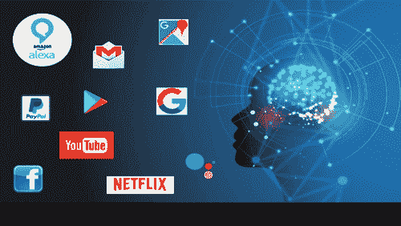
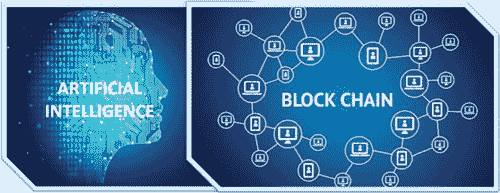
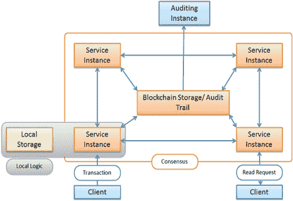
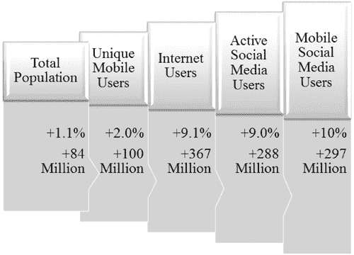
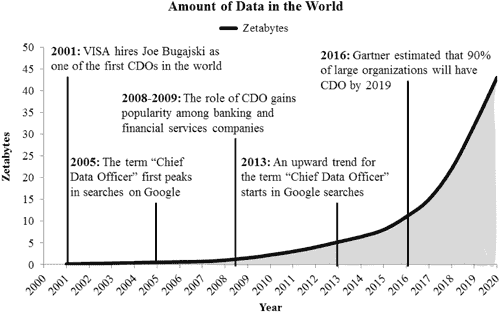
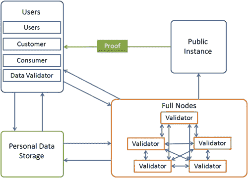

# 第八章

# 人工智能与区块链的合并

普嘉莎·赛加尔

目录

8.1 引言

8.2 人工智能

8.2.1 合并的范围

8.3 使用 Exonum 框架的区块链

8.4 人工智能与区块链：相差甚远的两种技术

8.5 控制位置：集中式或分布式

8.5.1 可见性：透明或黑箱

8.6 区块链促进的人工智能

8.6.1 安全数据共享

8.6.2 数据管理挑战

8.6.3 可靠的人工智能建模与预测

8.6.4 对数据和模型的更好控制

8.6.5 实时数据

8.6.6 透明度与信任

8.6.7 利用人工智能更好地管理区块链

8.6.8 区块链和人工智能的潜在应用

8.7 分布式计算中的人工智能

8.7 数据隐私

8.7.2 算法和数据市场

8.7.3 去中心化自治组织

8.7.4 案例研究：区块链与人工智能在医疗保健领域的应用

8.8 结论

参考文献

## 8.1 引言

人工智能和区块链是过去几年中发展起来的最有前景的两种技术。它们几乎渗透到所有可能的行业中。人工智能使机器能够像人类一样做出决策，并能处理复杂问题，而区块链提供了一个分布式数据环境，并提供了数据透明度、安全和隐私。尽管这些技术看起来彼此之间有很大差异，但仍有结合它们的潜力。这种融合将利用人工智能和区块链的优势，因此产生的技术将比单独的它们更强大、更高效。这两种技术相互补充，因此可以减少彼此的弱点。由于人工智能需要大量数据来做出预测，这些数据集可以存储在区块链提供的分布式平台上。区块链可以通过使用人工智能来创建自主组织或货币化用户控制的数据而受益。人工智能和区块链都处于初级阶段，并将分别发展。在本章中，我们将了解这两种技术如何互动以及它们合并的未来前景。

## 8.2 人工智能

人类有能力去想象并将其转化为现实。这种能力的真正体现是在过去几十年中实现的。尽管普通人可能没有意识到，但人工智能（AI）已经嵌入到我们的生活中。无论是在网上搜索关键词，上班途中，在线购物还是与朋友聊天，我们都有可能在后台使用 AI。航空业已经使用 AI 几十年了，用来调节空中交通以及高效安排起降时间。波音飞机在起降时大部分时间由人工操控，而在其余飞行时间，自动驾驶接管。谷歌地图利用智能手机的位置数据，并实时分析该位置的交通模式。通过使用访客的反馈数据和用户报告的案例，如故障、建筑、事故等，地图可以提供更准确的信息和路线建议。这些建议显著减少了通勤时间，因为它们会告知用户两个地点之间的最快路线。各种打车预订应用如 Ola、Uber 等，使用 AI 来确定乘车成本、最佳路线，以及根据请求预订附近的车辆，并确保最短到达时间。他们的拼车功能最优地预订乘客以减少绕行。它们使用 AI 来确定 surge pricing、预计到达时间（ETAs）、送餐时间，以及用于欺诈检测。 图 8.1 展示了 AI 的一些流行应用。

图 8.1 人工智能的应用。

人工智能在管理如 Facebook、LinkedIn 和 Pinterest 等社交网络平台中扮演着重要角色。Facebook 具有一种基于人工智能的标签功能，可以识别上传的任何图片中的面孔，并为它们推荐名字。这是基于机器学习（ML）的人脸识别算法。机器学习是人工智能的一个分支，它开发可以从数据中学习并预测未知数据结果的算法。对于普通人来说，理解 Facebook 是如何识别他的家庭成员和朋友的并不容易。对于标签功能，Facebook 使用了一种基于人工神经网络（ANN）的 ML 算法，这种算法模仿人脑来识别人脸。2016 年，Facebook 推出了 DeepText [1]，这是一个文本理解引擎，能够理解数千条帖子（大约 20 种语言）的文本内容，其准确性接近人类理解。DeepText 有助于识别和标记最相关的内容。例如，房地产经纪人最感兴趣的是与买卖有关的帖子。所以，DeepText 可以识别这样的帖子并显示最相关的内容。同样，DeepText 帮助公众人物自动从他们帖子上的评论中识别出最相关的文本。Facebook 收购了 Instagram，后者使用机器学习来建议表情符号。最近，表情符号已经取代了文本，用来表达情感。机器学习算法也试图通过研究用户在特定时间使用的表情符号类型来理解用户情感。Instagram 不仅让表情符号在年轻一代中流行，而且几乎对所有年龄段的使用者都产生了影响。它彻底改变了人们相互交流的方式。就在十年前，没有人会想到简单的 emoji 图形会被用来表达远方人的情感。还有一个流行的社交应用叫 Pinterest，它有一个庞大的图像和视频数据库。Pinterest 使用机器学习的计算机视觉和模式识别技术来自动识别图像和视频中的对象。Pinterest 还向用户推荐类似的图钉。Pinterest 的视觉搜索功能基于图像匹配，为任何给定的图像检索最佳匹配项。由于其名为 Lenses 的功能，Snapchat 近日非常受欢迎。这些过滤器可以追踪面部动作，并为图像添加动画效果。Snapchat 提供各种过滤器，并定期更新它们。这些过滤器使用 ML 算法实时学习面部动作。

邮箱收件箱利用基于人工智能的强大功能进行垃圾邮件过滤。它不是基于一组固定的词汇，而是不断从信息、相关元数据和用户回复中学习。谷歌采用人工智能方法根据发件人的数据或邮件内容标记邮件为重要，并将邮件分类为主要、论坛、社交、促销和更新收件箱。Gmail 还能学习用户是否将邮件标记为垃圾邮件或重要邮件。最近，许多银行开始提供通过智能手机应用存入支票的服务。银行依赖像 Mitek [2]这样的公司，这些公司利用基于人工智能算法的身份验证和移动捕获技术来解读和转换支票上的手写内容。银行还使用人工智能来查找欺诈交易，通过创建可以学习欺诈交易数据的系统。Atiya [3] 提出了神经网络算法，根据历史数据确定贷款申请人的信用价值。决策基于申请人的信用历史、交易频率、业务种类等因素。该算法不仅批准或拒绝贷款申请，还确定利率、期限和信用额度。因此，人工智能提高了银行的风险评估，并提供了有效的决策。这将进一步帮助银行减少因欺诈交易和逾期客户而遭受的损失。机器学习也用于在线信用卡或借记卡交易中预防欺诈 [4]。像 MasterCard 这样的金融服务提供商因错误拒绝造成的损失比欺诈更多 [5]。因此，MasterCard 已经采用人工智能算法学习持卡人的购买习惯，以最小化错误拒绝并最大化识别欺诈交易的可能性。

在线购物平台如亚马逊和 Flipkart 在过去的几年里变得流行起来。这些平台使用高效的搜索引擎，根据关键词返回最相关的产品给用户。它们还维护每个买家的购买历史，并推荐基于他们以前购买过的产品。这些平台还管理客户的人口统计数据，以便他们可以推荐其他具有相似人口统计数据的客户曾经订购过的产品 [6]。亚马逊使用人工神经网络为顾客生成推荐。

如今，每一部智能手机都配备了将语音转换为文字的功能。大约十年前，最先进的系统准确地将语音转换为文字还超出了人们的想象。但机器学习（ML）使得这一功能如今成为可能，即便是对于手持设备如智能手机、平板电脑等也是如此。最近，辛顿等人[7]提出了使用人工神经网络进行语音识别。道尔等人[8]提出了用于大规模词汇语音识别的上下文相关预训练深度神经网络。我们的一天常常是从说“好的，谷歌，打开地图”开始的，以找到从家到办公室的最佳路线。我们一开始说话，机器学习算法就立刻将其转换成文字并采取行动。要打电话，我们只需说“好的，谷歌，给妈妈打电话”，它就像一个听话的助手一样。谷歌的语音搜索中使用了人工神经网络。有时，这些语音识别系统比人类转录得还要准确。因此，对智能个人助手的口语指令现在已经成为了新的界面。苹果的 Siri[9]和谷歌现在都是可以设置提醒、从电话簿中联系联系人、执行搜索和管理工作日程的个人助手。亚马逊将语音识别又推进了一步，通过引入名为 Alexa[10]的互补硬件。Alexa 是一个通过识别语音命令来执行多项任务的个人助手。它由 AI 算法驱动。Alexa 能用自然语言回答问题、设置提醒、订餐、播放音乐并执行许多其他活动。

### 8.2.1 合并的范围

上一节讨论的所有人工智能应用都需要大量数据。最近有很多研究致力于提高算法的响应时间。高效处理大数据的需求是区块链与人工智能结合的真正动力。数据分析涉及处理大量数据，并在数据集中模式之间建立相关性。区块链是一种分布式账本技术（DLT），能够安全、透明地存储数据 [11, 12, ]。与迄今为止主要用于的集中式操作系统相比，区块链基于去中心化系统。通过使用去中心化数据库架构，各种操作的采购、认证和维护取决于多方协议而非单一中央权威。区块链不仅使操作透明，还使其更安全、更快。区块链随着加密货币比特币的出现而变得流行 [13]，其中交易是使用分布式账本在具有匿名、开放和公共访问的对等网络上管理的 [14]。区块链是维护比特币交易账本的基础技术 [15]。区块链交易存储在公共账本中，并由系统大多数参与者的共识验证 [15]。由于区块链维护着每一笔交易的验证记录，因此信息在区块链上永远无法被抹去。数字货币比特币本身是有争议的，但背后的区块链技术运行完美，并在金融和非金融领域找到了广泛的运用 [16]。最近 Salah 等人总结了针对人工智能的区块链应用和协议 [16]。Dinh 和 Thal [17] 比较了区块链和人工智能的特点。他们建议这两种技术的结合将改变新的数字一代。陈等人最近提出了基于 AI 卷积神经网络的区块链网络节点选择 [18]。

图 8.2 人工智能与区块链。

## 8.3 使用 Exonum 框架的区块链

Exonum [19]是一个开源的区块链框架，允许应用程序广泛地读取区块链数据。它采用面向服务架构（SOA）[20]，由服务、客户端和中间件三部分组成。在这里，服务负责区块链应用程序的业务逻辑，旨在为解决特定业务任务实现逻辑上完整且功能最小化。客户端发起大多数交易和区块链的读取请求。中间件负责管理交易，在客户端之间交互服务，控制访问权限，为客户端的读取请求生成响应等。Exonum 的优势在于，客户端和审计员可以更容易地实时审计系统。由于采用了 SOA，应用程序可以轻松复用、添加或配置为其他 Exonum 应用程序开发的服务。与无需权限的区块链相比，Exonum 提供了显著更高的吞吐量（每秒 1000 个交易左右的订单），并可以编码复杂的交易逻辑。Exonum 对验证节点操作采用悲观的安全假设。Exonum 使用的共识算法不会引入单点故障。此外，验证节点集是可重新配置的，允许通过添加新的验证节点、轮换验证节点的密钥、排除被黑的验证节点等方式，扩展其安全性。图 8.3 展示了 Exonum 服务设计，其中每个服务和审计实例都有一个本地区块链存储的副本，以确保数据的完整性和平衡负载。

Figure 8.3 Exonum [21]服务设计。

尽管区块链与加密货币的诞生息息相关，但现在区块链已经几乎渗透到所有可能的行业中[15, 22, ]，包括金融、医疗、音乐、物联网（IoT）、量子计算等。区块链和人工智能这两大新兴技术看似截然不同，实际上确实如此。但近期数据爆炸式的增长创造了对这些技术融合的需求。像 Endor 和 Blockchain Data Foundations 这样的初创公司正在积极研究区块链与人工智能融合的想法。Neuromation[23]是一家成功的初创公司，提出使用分布式计算结合区块链工作证明（proof-of-work）代币来革新人工智能模型开发。这些初创公司从投资者那里筹集了相当数量的资金，这本身就证明人们对区块链和人工智能的应用前景充满信心。

## 8.4 人工智能与区块链：相去甚远的科技

人工智能和区块链这两种技术具有截然不同的特点。因此，在讨论合并的前景之前，让我们来看看将它们混合时所面临的挑战。如果我们分别看待人工智能和区块链，它们的哲学观点彼此不同。与此同时，它们的结合似乎能够提供强大的解决方案。

## 8.5 控制位置：集中或分散

人工智能和区块链对系统中的控制位置有不同的看法。人工智能依赖于非常庞大、完整的数据集和高配置的硬件来训练算法。数据量越大，AI/ML 算法的性能越好。拥有大量数据和丰富人工智能技术的公司有更多的资源来改进和实验人工智能算法。这使我们认为人工智能需要数据的集中。它需要将一个地点的数据完整且集中，以获得更好的计算结果。相比之下，区块链相信数据的分散化和控制的分散化。同时，数据和其他资源对网络上的每个用户都是可用的。区块链中的数据分散化涉及由于网络延迟而产生的执行成本，为了降低它，必须采取措施加快数据访问。区块链确保用户对其数据和计算力拥有完全的所有权，可以根据要求将其出租给其他用户。与人工智能模型合作的各种机构和公司可以利用区块链上的数据。他们可能不拥有数据，但由于分布式，可以合法地访问它们。计算资源也可以是分散的。因此，区块链可以管理人工智能的需求，允许授权用户在多个用户提供的大数据集上开发和运行人工智能算法。

### 8.5.1 可见性：透明或黑箱

人工智能和区块链在保持数据和交易透明度方面有不同的哲学观点。区块链基于透明度的原则。所有授权用户都可以在公共区块链上查看账本。即使是匿名数据也记录在账本上。所有交易都是透明的，其他用户也可以看到。区块链还有一个重要的原则，即信任，这是由于使用了加密技术。另一方面，人工智能和机器学习算法的理解非常困难。大多数机器学习算法需要了解高级数学主题，如优化、线性代数等，并且大多数用户认为它们是一个黑盒。人们认为，将来区块链可能有助于更好地理解人工智能-机器学习算法。区块链可以提供公众访问训练人工智能模型的数据，并分析模型潜在的弱点。由于任何人工智能模型的性能都基于数据的质量，因此对数据的公开审计可以提高数据的准确性。这将进一步提高人工智能算法的性能。

## 8.6 区块链促进的人工智能

人工智能训练机器模仿人类的行为，以提高决策效率。人工智能算法需要大量的数据进行训练和高效决策。在这方面，区块链可以通过存储和管理数据来发挥重要作用，确保数据安全。与传统的集中式数据库系统不同，区块链创建了一个去中心化的分布式数据库网络。这意味着数据存储在一个大型网络中，信息由多方验证，一旦数据被输入，就无法从区块链中删除。区块链中的任何数据非法更改都会被其他计算机发现，并将修正无效数据。此外，区块链上的数据通过加密技术保护，这使得数据很难被破解和修改。由于网络上的数据附有加密签名，任何对区块链数据的篡改都可以被用户观察到，在所有系统中的网络上都可观察到。这使得区块链成为存储敏感信息的理想选择。因此，区块链被认为比传统的数据库系统更安全，后者更容易受到网络攻击。看来人工智能的需求可以得到区块链的支持，我们可以期待这两种技术之间的无缝通信。他们互动的一些关键特性在这里进行了讨论。

### 8.6.1 安全数据共享

区块链的去中心化数据库强调在多方之间的安全数据共享，因为人工智能依赖于大量数据集，其中大部分将被共享。随着数据量的增加，人工智能算法的性能会提高。因此，分析中可用的更多数据意味着算法预测更准确，可靠性更高。输入到人工智能算法中的数据应该是有效的。这需要通过降低任何灾难性事件发生的概率来实现高水平的数据安全。区块链还处理敏感数据，并具有支持数据安全的协议 [24]。随着来自多方实时数据的可用性增加，人工智能算法的性能可能会提高。像 Facebook、Google、Amazon、Flipkart 这样的公司拥有大量数据，每秒都在增加，如图 8.4 所示。这些数据对于许多人工智能问题可能是有用的，但它们并不对公众自由开放。可以通过区块链，利用点对点通信的概念来解决数据访问的限制问题。由于区块链是一个开放的分布式注册表，其数据对每个网络用户都是可用的。因此，公司对数据的垄断将得到缓解，其他用户可以访问数据。

图 8.4 年度数字增长（2018 年 1 月–2019 年 1 月）：统计变化 [25]。

### 8.6.2 数据管理挑战

我们假设由于区块链技术的应用，人工智能算法可以利用庞大的数据集，但这又引发了数据管理的新问题。目前可用的数据量估计为 32 泽字节 [26]，如图 8.5 所示。

图 8.5 世界数据量 [26]。

人工智能算法可以被建模为融入反馈控制，这有助于独立代理与物理环境的互动。在分布式去中心化环境中存储数据提供了一些在传统中心化数据中心不存在的优势。由于数据分布在不同的位置，区块链不会受到自然灾害或其他灾难的影响，这些通常会摧毁位于单一地点的任何集中式系统。由于区块链的健壮协议，它能够在很大程度上避免数据损坏，从而使数据更不易受到腐败的影响。

### 8.6.3 可靠的 AI 建模与预测

任何人工智能的性能都严重依赖于供应给它的输入数据流的质量。它遵循计算机系统的垃圾进垃圾出（GIGO）原则。存在恶意用户故意修改数据以符合他们个人或公司的利益。修改后的数据会导致结果的改变。数据可能在传感器故障等情况下无意中被损坏，或者由于硬件故障，关键数据的一部分可能丢失。区块链可以帮助创建经过验证的数据集分区，这样人工智能模型只能使用经过验证的数据。这将进一步识别数据链中的任何故障并导致其纠正。这还将帮助减少在段落中排除故障和定位错误数据所需的努力。一旦通过交易在区块链中捕获数据，该数据就变得不可变，即数据的任何有意或无意更改都将被系统的其他用户报告。这使得数据可追溯且经过验证。

### 8.6.4 对数据和模型的更好控制

控制对于任何过程的成功都起着重要作用。区块链与人工智能的结合为数据和模型提供了更好的控制。如果用户为其人工智能模型创建数据，他可以在数据许可证中指定限制或权限。在区块链上可以轻松完成数据的许可。在区块链上可以轻松设置读取或访问数据的权限。SingularityNET [27] 是一个开源的人工智能市场，它收集了协调一致的人工智能服务的去中心化市场的智能合约。根据 SingularityNET 团队的说法，区块链技术为管理网络交易提供了交易和记账优势。区块链允许用户添加或升级用于网络的人工智能服务并获得网络支付代币作为交换。通过这个平台，数据所有者可以控制他们数据的用途并在金钱上受益。因此，结合智能合约 [28] 的区块链确保了无论是通过金融交易、应用程序还是客户详情生成的数据，都是有效的、实时记录的且不可变的。这确保了正确和准确的数据可供人工智能模型使用，从而实现更快和安全的交易。

### 8.6.5 实时数据

AI 通过提供实时数据访问，已经改变了医疗、金融、天气预报等多个领域。但这些模型受到相关数据访问有限的困扰。所需数据可能因所有权限制而不可用。因此，AI 算法可能最终会使用低质量的数据，结果可能不准确。区块链可以克服这一困境，因为它提供了大量数据的访问，这些数据可能由不同的用户拥有且不可更改，但所有用户都可以访问。使用 AI 设计的各种应用程序存在诸如缺乏认证、不必要的中介、欺诈风险、数据垄断所有权、不准确等问题。AI 与区块链的结合可以减少单一实体的所有权，消除中介，并确保数据由涉及的利益相关者安全、准确和认证。

### 8.6.6 透明度与信任

区块链可以通过维护关于 AI 模型做出的任何决策的详细信息，为 AI 增加更多透明度。这些信息将是实时可访问的。相关方可以查看区块链上可用的详细信息，以找出 AI 模型做出的任何错误决策中的问题。随着更多数据的可用性，问题可以得到解决，算法可以得到改进。AI 已经革命化了现代产业，但它受到缺乏信任的困扰。因为区块链维护一个公开可访问的数据和 AI 模型的注册表，这些数据和模型都是不可更改的，并通过数字签名进行加密保护[29]。区块链用户被允许实时访问验证信息和共识模型。这将有助于提高用户对系统的信任，并减少对中介的需求。

这表明，强大的区块链技术将有益于 AI 技术。现在，让我们了解一下 AI 如何改进区块链的功能。

### 8.6.7 使用 AI 更好地管理区块链

人工智能可以通过管理方式将区块链操作变得更加高效。例如，如果区块链用户向他网络上的同伴转移一个比特币，交易可能需要几天才能得到确认。这是由于区块链的去中心化特性，比特币矿工将交易分组到区块中。这种交易量的突然增加可能会进一步延迟交易，因为区块大小是有限的。如果任何交易需要一个更大的区块，它将被其他矿工保持在确认队列中。AI 可以通过提高交易确认时间来简化这种情况。区块链使用哈希算法[30]，采用“暴力”方法，尝试找到每个可能的字符组合，直到找到最佳匹配以验证和确认交易。哈希算法可以被一个 AI 模型所替代，该模型可以使用正确的数据进行训练，以高效和快速地确认交易。AI 可以改进数据挖掘过程，并可以使区块链的操作流程化。这将进一步减少在区块链中挖掘数据所需的时间和处理能力。

沙玛等人[31]解释了区块链扩容问题，区块链的大小每 10 分钟增长 1 MB，现有数据约为 85 MB。区块链没有采用任何数据优化和消除的方法。AI 可以在这一方面帮助区块链，通过引入一个去中心化的数据优化系统。区块链上的点对点交易成本高达数百万美元。成本之所以高，是因为每个节点在其数据副本上执行相同的任务，并尝试在其他节点之前产生解决方案。AI 可以通过预测将第一个交付解决方案的节点来降低成本。它还可以通知其他节点关闭他们的操作，这样只有即将给出最早正确解决方案的节点才会完成执行。这最终将降低整个区块链的操作成本，并提高系统的效率。区块链以维护数据高安全性而闻名。AI 可以将多维数据表示、图像标注、自然语言处理、声音识别等特征整合到区块链中。这将允许矿工将大型系统转换为多个小型子系统，在更安全的环境中优化数据交易。

将来，区块链将存储数据，感兴趣的用户可以直接从数据所有者那里购买这些数据。在这种情况下，AI 可以提供跟踪数据使用、授予权限和有效数据管理的解决方案。AI 模型将作为门户，让区块链数据得以流动。

### 8.6.8 区块链与 AI 的潜在应用

已经讨论过，AI 和区块链的理念是不同的。AI 相信在大量数据上进行集中、快速和复杂的操作，而区块链提供去中心化、透明但速度较慢的数据和计算资源访问。尽管区块链是一种强大的技术，但它受到速度缓慢的影响。研究人员正在研究区块链的可扩展解决方案以提高操作速度。如果我们整合这些看似相反但互补的技术，我们可能会创造出有趣的应用。

## 8.7 分布式计算中的 AI

人工智能与区块链的融合将引导我们考虑利用挖矿网络为 AI 算法提供计算能力。这些算法在大量训练中非常依赖处理器利用率，以便进行数千次的训练会话，以教导算法做出有效的决策。机器学习算法的训练时间通常非常长。如果系统能为算法提供更多的计算能力，那么算法就可以更快地训练。因此，研究人员和公司正在研究利用众多 GPU（目前已用于挖掘加密货币）来提升 AI 技术。用于区块链的 GPU 网络也可以用来为机器学习算法提供更多动力。使用 GPU 挖矿网络的另一个优点是，任何用户都可以访问远程超级计算机来执行隐藏的 AI 算法。

### 8.7.1 数据隐私

区块链存储匿名数据，尽管它有确定数据来源的方法。匿名数据为研究提供了巨大的机会。相对于公司对数据的集中和限制性控制，区块链为匿名数据提供了开放访问，这可以用于分析、模型训练和预测。如果算法使用去中心化和匿名数据进行训练，它们将能够生成偏见较小的模型。美国的一家公司可能会使用从其人口收集的数据来训练算法。通过使用区块链，数据不会仅限于本地区域。因此，算法将在代表全球人口的數據上进行训练。

### 8.7.2 算法与数据市场

开放的数据和计算资源将允许人工智能研究人员作为一个社区共同工作。许多开源包可用于机器学习模型，如 Scikit-learn、TensorFlow 等。区块链将创建一个数据和算法市场的环境。数据科学家和数据所有者分别因其算法和数据而获得报酬。公司和个体用户可以访问算法和数据。可以创建一个开放环境，其中人工智能算法开发不是专有的，而是有一个市场，任何感兴趣的用户都可以参与和贡献。这将使用户能更好地控制数据。如今，像谷歌这样的公司从他们的客户那里收集数据，而这些数据并未得到客户的同意，比如我们的搜索历史和与谷歌产品如地图、YouTube 等的互动。这些免费数据被谷歌用来创造信息和赚钱。区块链将把数据的控制权还给所有者。数据可以通过提供某些服务进行交换，或者可以卖给公司。这个市场将允许任何人通过上网创造个人数据来产生收入，这些数据值得出售。

### 8.7.3 去中心化自治组织

莫汉蒂等人[32]讨论了去中心化自治组织（DAO）的概念，这是人工智能与区块链应用的一个例子。DAO 在其智能合约中硬编码其规则。这些组织采取行动，但在做任何决定时遵循智能合约的规则。通过将人工智能技术与 DAO 集成，它们有可能独立做出决策。这些决策将基于市场数据和趋势。由于 DAO 存在于去中心化网络上，因此它们关闭的可能性很小。如果它们开发得当，可以减轻知识工作者的负担，并通过更好的管理实现经济平等。

### 8.7.4 案例研究：区块链与人工智能在医疗保健中的应用

世界各地的医疗保健提供者正在通过电子病历系统跟踪患者的病史。这些系统生成了数以太字节计的医疗数据，它们是健康信息的金矿[21]。包括临床测试、分子诊断、MRI、心电图等在内的患者数据，根据它们对某些条件的质量和重要性，具有重大价值。医生研究并分析这些数据，以评估患者在不同时间段的情况。除了文本报告，像图像、视频、声音等数据，在预测患者的医疗状况方面也具有相当价值。最近，研究人员研究了使用语音和语音识别来诊断帕金森病及其严重程度的方法[33, 34]。

尽管有医疗数据，但不同数据组合的协同效应往往不被充分理解。在这里，我们预见到将为理解数据多方面模式的数据经济学家创造专门的工作岗位。AI 研究人员正在积极工作，创建基于人口数据、实验室测试和其他诊断报告等输入特征的准确预测模型。数据价值的重要性基于应用。例如，保险公司会对一个人的最近照片感兴趣，因为这更好地表明了他的健康状况、年龄和总体状况。另外，不同数据类型的组合将比单个数据值更有价值。

医疗研究人员面临的一个主要问题是数据的可用性和交换。由于数据的敏感性质，维护高标准的数据安全也很重要。区块链可能会通过涉及多个方进行数据解密，结合使用非对称加密技术，减少数据泄露或被盗的发生。有了基于区块链的系统，患者（所有者）可以轻松上传数据，并且可以通过收取协商好的价格来给予权限。但这也带来了一个挑战，即设计一种网络货币，以克服来自多个国家参与者的相关问题。最近，Mamoshina 等人提出了一种名为 LifePound 的加密货币[21]。数据所有者可以通过将他的数据放在区块链上来生成这种货币，并可以从激励计划中受益。在这个基于区块链的医疗系统中，交易区块被处理和存储，同时还有加密密钥的管理。数据以加密形式存储在本地存储中。有不同的用户类别。一些用户是数据的拥有者，可以在市场上传和出售数据。其他人是有兴趣购买数据的消费者。一些是数据验证员，所有这些类别都使用 LifePound 作为加密货币。图 8.6 解释了由区块链支持的医疗数据市场的架构。

图 8.6 医疗数据市场生态系统 [21]。

医疗数据市场的客户分为四类。第一类用户是数据的所有者。他们会上传自己的生物医学数据，并可以用加密货币进行交换。他们可以保持自己的数据私密，也可以匿名提供数据。他们只会向付费的用户提供数据访问权限。他们可以从网络上的数据分析师那里获得自己健康报告的分析。系统用户的另一类是购买数据进行分析的客户，并向用户提供健康报告。他们可以获取来自多个用户的大量数据。由于这是一个开放系统，因此验证数据质量非常重要，这是由数据验证师完成的。他们确认数据的质量并向客户保证。还有一些使用加密货币的其他用户。

在区块链上发生的任何交互都以交易的形式注册。区块链维护哈希值，记录交易的时间戳并批准它们。时间戳通过区块链锚定实现，交易通过数字签名和公钥基础设施批准。医疗数据生态系统的存储可以是现有的云存储，如 AWS，它提供一个构建应用程序的平台[35]。这种存储不属于区块链，但它需要存储大量以图像或视频形式的医疗文件。为了提供数据的正宗访问，需要公钥基础设施，这是通过区块链建立的。为了保持数据安全，用户端上传到云的数据使用阈值加密方案[36]进行加密。数据也可以存储在用户的本地存储中，这将使用户对自己的数据拥有实际的隐私和控制权。 instead of selling it. The full nodes of blockchain are the organizations that have complete access to data in the blockchain. They are of three types. Validators commit new blocks with transactions to the blockchain. Another type is auditors who audit the marketplace. The third category is the key keepers who maintain key shares as per a certain threshold encryption scheme, required for decrypting the data.

因此，区块链技术允许创建一个分布式和安全的个人数据集合，病人在（数据所有者）对自己的数据有完全控制权。他们还可以授权他人访问他们的数据。因此，医疗数据区块链最终建立了一个数据市场，病人可以为他们的个人医疗数据获得报酬。积累的数据将被数据分析师、组织用于开发预测模型、制药公司和研究人员使用。目前，很少有人进行全面定期体检，包括实验室检查、MRI、心电图等。如果这些数据与生活方式数据、人口统计数据和病史结合，它们将对研究人员有很大价值。有许多公司愿意为训练人工智能算法支付数据费用。用于训练人工智能模型的数据越多，准确性就越高。产生的资金可用于进一步研究和开发精密工具。

## 8.8 结论

区块链和人工智能是具有潜力改变许多行业领域的两项技术。我们可以预见，这两者的协同作用将带来更大的益处。人工智能与区块链的融合将在不同领域带来增长，并有许多潜在的应用。他们融合的想法非常强大，最近吸引了许多研究人员和组织。最初，人工智能和区块链看起来相去甚远，但同时，它们又互相补充。它们在金融、医疗、公共服务、安全、银行、物联网等领域都有应用。这种整合的未来是一个去中心化的操作系统，机器可以更好地与人类活动更好的建模进行交互。

## 参考文献

1.  1. 张曙光, 魏汉, 汤继浪, 齐国骏, 查鲁·C·阿加瓦尔, 黄 Thomas S. . “通过深度架构实现异构网络嵌入。”在第 21 届 ACM SIGKDD 国际知识发现与数据挖掘会议论文集, 第 119-128 页。ACM, 2015。

1.  2. Mitek Systems . [`www.miteksystems.com/mobile-verify`](https://www.miteksystems.com)。

1.  3. Atiya, Amir F. “使用神经网络进行信贷风险破产预测：一项调查和新结果。”IEEE 神经网络杂志 12, 第 4 期 (2001): 929-935。

1.  4. Bolton, Richard J., 和 David J. Hand . “统计欺诈检测：一项回顾。”统计科学, 第 17 卷, 第 3 期 (2002): 235-249。

1.  5. Tapscott, Alex, 和 Don Tapscott . “区块链如何改变金融。”哈佛商业评论 1, 第 9 期 (2017)。

1.  6. Bobadilla, Jesús, Fernando Ortega, Antonio Hernando, and Abraham Gutiérrez . “推荐系统调查。”知识系统 46 (2013): 109-132。

1.  7. Hinton, Geoffrey, Li Deng, Dong Yu, George Dahl, Abdel-rahman Mohamed, Navdeep Jaitly, Andrew Senior et al . “深度神经网络在语音识别中的声学建模应用。”IEEE 信号处理杂志 29，2012 年，第 82-97 页。

1.  8. Dahl, George E., Dong Yu, Li Deng, and Alex Acero . “基于上下文的预训练深度神经网络用于大规模语音识别。”IEEE 信号处理杂志 20，2011 年，第 30-42 页。

1.  9. Assefi, Mehdi, Guangchi Liu, Mike P. Wittie, and Clemente Izurieta . “对苹果 Siri 和谷歌语音识别的实验评估。”2015 年 ISCA SEDE 会议论文集。

1.  10. Ram, Ashwin, Rohit Prasad, Chandra Khatri, Anu Venkatesh, Raefer Gabriel, Qing Liu, Jeff Nunn et al . “对话式人工智能：亚历山大奖背后的科学。”arXiv 预印本 arXiv:1801.03604（2018）。

1.  11. Mills, David C., Kathy Wang, Brendan Malone, Anjana Ravi, Jeffrey Marquardt, Anton I. Badev, Timothy Brezinski et al. “分布式账本技术在支付、清算和结算中的应用。”（2016）。

1.  12. Iansiti, Marco, and Karim R. Lakhani . “关于区块链的真相。”哈佛商业评论 95，2017 年，第 118-127 页。

1.  13. Radziwill, Nicole. “区块链革命：比特币背后的技术如何改变货币、商业和世界。”质量管理杂志 25，2018 年，第 64-65 页。

1.  14.

1.  15. Crosby, Michael, Pradan Pattanayak, Sanjeev Verma, and Vignesh Kalyanaraman . “区块链技术：超越比特币。”应用创新 2，2016 年，第 6-10 页，71。

1.  16. Salah, Khaled, M. Habib Ur Rehman, Nishara Nizamuddin, and Ala Al-Fuqaha . “区块链在人工智能中的应用：综述和开放研究挑战。”IEEE 访问 7（2019 年），第 10127-10149 页。

1.  17. Dinh, Thang N., and My T. Thai . “人工智能与区块链：一种颠覆性的整合。”计算机 51，2018 年，第 48-53 页。

1.  18. 陈建文，蔡段，曾燎原，王伟毅。“基于人工智能的区块链网络超节点选择算法。”arXiv 预印本 arXiv:1808.00216（2018）。

1.  19. Yanovich, Yury, Ivan Ivashchenko, Alex Ostrovsky, Aleksandr Shevchenko, and Aleksei Sidorov . “Exonum:拜占庭容错区块链协议。”

1.  20. Erl, T. 服务导向架构：概念、技术和设计。皮尔逊教育印度，2005。

1.  21. Mamoshina, Polina, Lucy Ojomoko, Yury Yanovich, Alex Ostrovski, Alex Botezatu, Pavel Prikhodko, Eugene Izumchenko 等人. “利用区块链和下一代人工智能技术 convergence 推动生物医学研究和医疗保健的去中心化和加速.” Oncotarget 9, no. 5 (2018): 5665。

1.  22. Mougayar, William. 《商业区块链：下一代互联网技术的承诺、实践和应用》. John Wiley & Sons, 2016。

1.  23. Neuromation. `

1.  [24`. Shrier, David, Weige Wu, 和 Alex Pentland. “区块链与基础设施（身份、数据安全）.” 马萨诸塞理工学院-连接科学 1, no. 3 (2016)。

1.  25. 2019 年数字增长年度报告. [`datareportal.com/reports/digital-2019-global-digital-overview`](https://datareportal.com).

1.  26. 数字数据 . [`liaison.opentext.com/blog/2017/06/06/ready-chief-data-officer-cdo/`](https://liaison.opentext.com).

1.  27. Goertzel, Ben, Simone Giacomelli, David Hanson, Cassio Pennachin, 和 Marco Argentieri. “SingularityNET：一个去中心化、开放市场和人工智能之间的网络。” (2017).

1.  28. Baars, D. S. “利用区块链技术实现自我主权身份.” 硕士论文，特温特大学, 2016。

1.  29. Back, Adam, Matt Corallo, Luke Dashjr, Mark Friedenbach, Gregory Maxwell, Andrew Miller, Andrew Poelstra, Jorge Timón, 和 Pieter Wuille. “通过附加侧链 Enabling 区块链创新.” (2014): 72。 [`www.opensciencereview.com/papers/123/enablingblockchain-innovations-with-pegged-sidechains`](http://www.opensciencereview.com).

1.  30. Kraft, Daniel. “区块链为基础的共识系统的难度控制.” 对等网络和应用 9, no. 2 (2016): 397-413。

1.  31. Sharma, Pradip Kumar, Seo Yeon Moon, and Jong Hyuk Park. “Block-VN: 一种基于分布式区块链的智能城市车辆网络架构。” JIPS 13, no. 1 (2017): 184-195。

1.  32. Mohanty, Soumendra, and Sachin Vyas. “去中心化自治组织=区块链+AI+物联网.” 在《如何在人工智能时代竞争》，第 189-206 页。 Apress, 伯克利, CA, 2018。

1.  33. Wu, Y., P. Chen, Y. Yao, X. Ye, Y. Xiao, L. Liao, M. Wu, 和 J. Chen. “使用最小类间概率风险特征选择和集成学习方法的帕金森病患者嗓音模式分析.” 计算数学方法在医学中的应用 2017 (2017): 4201984。

1.  34. Asgari, M., and Shafran, I. “从语音预测帕金森病的严重程度。”在 2010 年 IEEE 医学与生物工程学会年会，第 5201-5204 页。IEEE，2010 年。

1.  35. Gaetani, Edoardo, Leonardo Aniello, Roberto Baldoni, Federico Lombardi, Andrea Margheri, 和 Vladimiro Sassone。 “基于区块链的数据库，以确保云计算环境中的数据完整性。”（2017 年）。

1.  36. Cramer, Ronald, Ivan Damgård, 和 Jesper B. Nielsen。 “从阈值同态加密的多方计算。”在密码技术理论与应用国际会议上，第 280-300 页。Springer，柏林，海德堡，2001 年。
