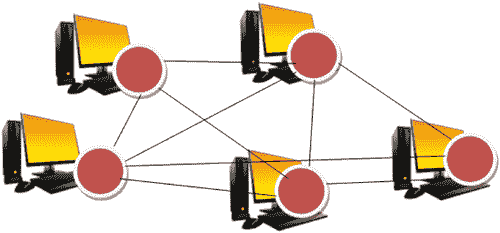
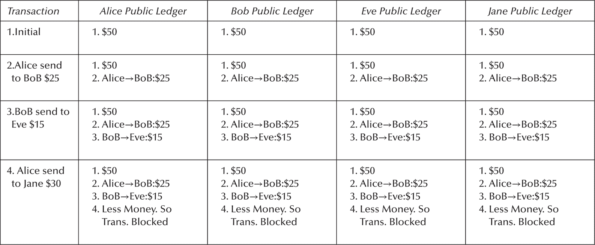
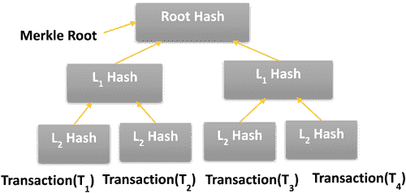
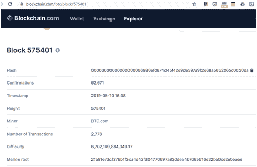
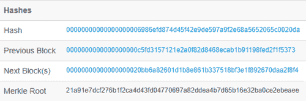
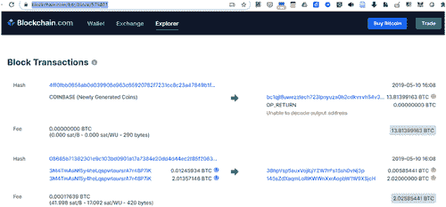

# 第九章

# 识别区块链机会及其商业价值：区块链的互操作性

N.S. Gowri Ganesh

目录

9.1 介绍

9.2 区块链是如何工作的？

9.3 运作流程

9.3.1 区块链特性

9.3.2 非对称密钥加密

9.3.3 包含交易的区块

9.3.4 区块链环境中的共识

9.3.5 用于区块接受的挖矿

9.4 区块链系统分类

9.4.1 公共区块链

9.4.2 私有区块链

9.4.3 联盟区块链

9.4.4 金融领域中的区块链机会

9.4.5 比特币

9.4.6 比特币与传统电子现金的比较

9.4.7 比特币生态系统

9.4.8 金融交易中的公平支付

9.4.8.1 使用时间锁进行公平交换

9.4.8.2 使用值得信赖的第三方进行乐观公平交换（TTP）

9.4.8.3 区块链攻击

9.4.9 医疗系统中的区块链机会

9.4.10 城市管理中的区块链机会

9.4.11 物联网设备安全措施中的区块链机会

9.4.11.1 注册

9.4.11.2 更新

9.4.11.3 检查

9.5 区块链之间的互操作性

9.6 构建面向区块链的软件

参考资料

## 9.1 简介

应用程序的发展随着硬件和软件（操作系统）的演进而逐步发展。因此，它从在独立计算机上运行的应用程序开始，其好处仅限于该计算机的用户，发展到了采用客户端/服务器架构为大量客户提供有用服务的分布式应用程序。然后，随着 Web 服务的引入，场景从紧密耦合的应用程序转变为松散耦合的应用程序。面向服务的体系结构中的松散耦合应用程序不共享事务，也不相互信任，而是依赖于一些集中控制。

随着区块链的引入，完全独立于集中控制的发生，是基于商业网络参与者之间的信任。此外，区块链通过引入加密货币（如比特币）的概念，产生了重大影响。

在应用开发和安全的领域的架构演变现在已转化为没有代理或中介的应用程序（这会增加单个交易的 Effective cost，例如，通过银行转账涉及代理的佣金）这样，在去中心化网络中，通过在未知对等体之间建立信任，可以实现点对点交易。概念的区块链引入了一个充满新机遇的新世界。区块链通过引入无需许可的协议和智能合约，为各种应用程序提供了更多的完整性和独立性。松耦合应用程序通过实施基于传统合同（如 SLA）的智能合约，其自动交互形式得到了改进。

区块链是一个去中心化的计算和信息共享平台，它使多个权威领域能够在合理的决策过程中进行合作、协调和协作。它也被描述为一个开放的分布式账本，可以高效、可验证和永久性地记录两个当事人之间的交易。挖矿解决谜题，将交易记录添加到过去交易的公共账本中。过去交易的账本被称为区块链，因为它是一系列块的链。

这确保了没有任何节点有能力破坏网络并获得控制权。当今的应用程序是这样开发的，商业网络中的每个参与者都记录，或保存着所有与商业互动的各方之间的交易账本。但是，区块链允许网络中的任何参与者看到唯一的记录系统，或账本。

全世界都在密切关注区块链的最新发展，以确定在其工作领域实施后可能获得的收益。第 9.3.1 节讨论了区块链的特征。区块链的有利特征激发了其在各种应用领域中的整合。区块链的机会如下所述：第 9.4.4 节讨论了金融领域，第 9.4.9 节讨论了其在医疗保健系统中的包含；第 9.4.10 节和第 9.4.11 节讨论了其在城市管理和在物联网设备中的使用。第 9.6 节专门讨论了采用区块链方法的软件工程实践。

## 9.2 区块链是如何工作的？

区块链应用以去中心化方式运行。彼此不知晓的节点通过共享公共账本形式的数据共同工作。这些数据可能是交易的历史信息，如银行交易，将可供所有人用于未来的计算。公共账本确保一致性，即所有节点的数据副本(图 9.1)保持一致，并且总是根据全局信息进行更新。

图 9.1 区块链在参与节点中维护本地副本以确保一致性。

通常，在大多数应用中，参与节点的其他通信方式，如集中式和分布式。在集中式架构中，单个服务器处理所有客户端，因此服务器的失败会导致应用程序的停机，这被称为单点故障。单点故障的缺点导致服务不可用（Baran 1964）(表 9.1)。

表 9.1 分布式公共账本交易示例

表 9.1 清晰地解释了爱丽丝、鲍勃、简和戴夫等分布式节点如何参与交易并更新公共账本。当交易发生时，公共账本块中的信息在资金不足时阻止交易 4。

正式地，区块链（Iansiti 和 Lakhani 2017）可以被定义为“区块链是一种开放、分布式的账本，能够高效、可验证且永久地记录两个实体之间的交易”。

以下是在区块链环境中操作流程的描述。

## 9.3 操作流程

1.  1) 广播交易：每个交易都被广播到整个网络中，以便进行验证。

1.  2) 交易收集与验证：交易由参与者进行验证，并根据区块大小（比特币为 1 MB）将其添加到区块中。

1.  3) 使用共识协议挖矿：挖矿过程是解决加密谜题。如果矿工能够解决这个谜题，这个区块将被添加到区块链中。这通过使用工作量证明（PoW）作为共识，就像比特币一样完成。在区块链中使用的共识协议有股份证明（PoS）、燃烧证明（PoB）和流逝时间证明（PoET）。

1.  4) 更新区块链：节点接收区块，并且如果计算出的 PoW 正确并且包含有效交易，可以接受该区块。节点将其区块添加到其账本副本中。最后一个块的哈希值将用作后续块的前一个哈希值。如果两个矿工同时找到解决方案，有效的区块链是较长的那一个。这证明区块链是不可篡改的，且交易无法被撤销。如果交易区块或工作量证明无效，该区块将被丢弃，节点将继续寻找有效区块。矿工在成功挖矿过程中有权获得奖励。

因此，区块链以以下特性类似于公共账本进行工作。

### 9.3.1 区块链特性

区块链通常可以归结为以下概念，并且因不同的实现而有所不同。

### 9.3.2 非对称密钥加密

区块链维护一个数字钱包（相当于银行账户），用用户的私钥加密，并且可以用那个私钥生成的签名来访问。这个钱包的公开密钥作为比特币的地址为众人所知，并且在每次交易中用于加密，以保护用户的隐私和匿名性。交易使用私钥数字签名，用户保持其私密。

### 9.3.3 包含交易的区块

区块链基于点对点架构实现，并实现信息的交换与共享。文件中的传输信息从源节点广播到整个网络以进行验证。这一系列交易代表了区块链的当前状态。

### 9.3.4 区块链环境中的共识

共识确保在分布式环境中无信用的个体之间的正确操作集合。网络的可靠性和容错性是由共识机制确定的。每个参与节点都同意一个共同的内容更新协议，以维护其公共账本的一致状态。这称为共识机制。当节点之间达到共识时，创建区块并添加到现有账本以供以后使用。

### 9.3.5 区块接受挖矿

矿工解决加密难题，以便任何区块被接受并添加到共享账本中。区块链在区块中添加由矿工生成的 nonce（只使用一次的数字），这是一个伪随机数，由于其不能在重放攻击中重复使用，因此经过哈希或重新哈希的区块满足了难度级别的限制。矿工尝试解决谜题以确定上一个区块中的 nonce。节点积累验证的交易并在区块中使用计算能力寻找一个值，使这个区块的 SHA-256 哈希值小于一个动态变化的的目标值。区块的头部包括任意的 nonce、前一个区块的哈希、所列交易的 Merkle 根哈希、时间戳和区块版本。所有交易哈希的哈希值称为 Merkle 根。每个叶节点是数据块的哈希，非叶节点是其子节点的加密哈希。这在比特币中使用。

## 9.4 区块链系统的分类

区块链系统被分为公有、私有或联盟三种类型。

### 9.4.1 公有区块链

公有区块链是一个开放的平台，来自不同背景的参与者可以加入，进行交易和挖矿。这些因素上没有限制。它们也被称为无需权限的区块链。每个用户都被赋予在区块链上进行交易和执行审计的完全权限。区块链表现出开放性和透明性。它不包含任何特定的验证节点。所有用户都可以收集交易信息并参与挖矿过程，获得挖矿奖励。整个区块链的副本与所有参与节点同步。

### 9.4.2 私有区块链

私有区块链系统旨在帮助一群个体（在单个组织内）或多个私有组织之间共享和交换数据。在这里，挖矿活动由单个组织或选定的个人群体控制。这被称为受权限的区块链。这是因为除非有人邀请，否则陌生人无法访问。一组规则决定了节点的参与。这使得网络在很大程度上倾向于集中化，而削弱了中本聪所描述的区块链的去中心化和开放性特征。但是，在节点参与网络后，它们有助于运行一个去中心化网络。写入操作受到一组约束的限制。

### 9.4.3 联盟区块链

联盟链是一个部分私有的受许可的区块链，在其中一个单一组织不负责共识和区块验证，而是一组预先确定的节点。联盟链获得了嵌入公共区块链中的安全特性。联盟链的共识参与者是网络上的一组预先批准的节点。

### 9.4.4 区块链在金融领域的机遇

金融计算领域的应用改变了主导的金融交易类型，从现金转变为数字化货币交易，得益于银行自动化的帮助。此外，货币交换的媒介形式现在随着许多公司提供的电子钱包而引入。在印度，国家支付公司（NPCI）推出的统一支付接口（UPI）提供了金钱交易的便利。相对而言，电子现金的一种不同方法是加密货币。比特币是一种加密货币，它是数字资产的区块链实现形式，可以用作交换媒介，并具有强大的加密特性来保障金融交易的安全。

### 9.4.5 比特币

区块链（Yuan 和 Wang 2018）这个术语是在比特币首次在一篇密码学邮件组的帖子中描述时引入的，该文章题为“比特币：一种点对点的电子现金系统”（Nakamoto，未注明日期），由一个使用化名“Nakamoto”的研究人员所写。区块链被定义为一种去中心化的共享账本，它使用线性时间戳的安全加密的区块链来在点对点网络上包含可验证和同步的数据。

### 9.4.6 比特币与传统电子现金的比较

比特币可以与传统电子现金如下比较：

1.  a) 比特币在去中心化的环境中运行，在点对点网络的参与节点上应用分布式共识算法。使用传统电子现金的银行需要中心化的服务提供商，并根据规定的法律由政府机构管理。

1.  b) 比特币表现出伪匿名性。比特币用户的身份不会被揭露，与传统电子现金不同，后者的用户身份存储在服务提供者的中央服务器上。

1.  c) 比特币在货币发行上有限制。传统电子现金的货币发行受政府指定的论坛控制，基于通货膨胀率、GDP 等因素。

1.  d) 比特币的软件实现是开源的，通常可供用户检查算法。由银行管理的电子现金的软件业务逻辑是闭源软件，在受控的安全环境中执行，不对用户开放。

1.  e) 比特币是一种数字化的零和一的形式。然而，比特币可以通过增加用户而获得价值。越多的用户信任和使用比特币，比特币就越有价值。相比之下，几乎所有的传统电子现金都是由法定货币支持的。

### 9.4.7 比特币生态系统 9.4.7 Bitcoin Ecosystem

数字签名和加密的交易由节点进行验证。密码学安全性确保只有被授权的用户才能查看信息。数据通过默克尔树存储在区块链网络的所有完整节点上。默克尔树的数据结构是加密的、哈希的和对称时间标记的。特别是，每个节点在赢得共识机制后，将被允许将那个时期内生成的所有数据（通常是比特币系统中的一个常规间隔，例如 10 分钟）放入新的时间戳单位，指示创建的时间。如果存在矛盾的数据，例如比特币双重支付，只选择一个达成一致的版本并添加到区块中。

比特币区块由区块头和区块部分组成。

1.  a) 区块头部包括：(1) 前一个区块的哈希值，(2) 用于构建区块的挖矿统计信息（挖矿统计信息——时间戳、随机数和非难度），(3) 默克尔树根。

1.  b) 区块部分由交易组成。

图 9.2 Figure 9.2 展示了以默克尔根为形式的交易结构的树状图。如果一个交易被更改，所有后续的区块都需要被更改。挖矿算法的难度决定了区块链被篡改的难度。图 9.3 展示了一个区块链交易的摘要。图 9.4 展示了经过验证和哈希的数据（例如通过双 SHA256 算法）的标识符、前一个区块、下一个区块和默克尔树根。区块按时间顺序一个接一个地链接起来，从创世区块到新产生的区块，形成了完整的历史。图 9.5 说明了来自[`blockchain.com`](https://blockchain.com)的选择区块的交易。

图 9.2 带默克尔根的哈希交易。

图 9.3 区块链摘要快照

用于区块 575401。 (Source: [`www.blockchain.com/btc/block/575401`](https://www.blockchain.com).)

图 9.4 区块头摘要快照。 (Source: [`www.blockchain.com/btc/block/575401`](https://www.blockchain.com).)

图 9.5 区块 575401 的交易 (Source: [`www.blockchain.com/btc/block/575401`](https://www.blockchain.com).)

### 9.4.8 金融交易中的公平支付 9.4.8 Fair Payments in Financial Transactions

公平交换（Liu 等人，2018 年）是在不一定相互信任的玩家之间执行的。一个公平交换协议必须确保恶意玩家不能获得比诚实玩家任何优势。我们考虑“支付-收据”的方案，其中实体爱丽丝（Alice）向另一个实体鲍勃（Bob）进行数字支付，以获取以数字签名形式的支付收据。我们的目标是探索将支付收据的公平交换集成到现有加密货币支付方案（以下简称公平支付）的解决方案空间。我们假设通信是弱同步的，在此条件下，消息保证在一定的时间范围内被传递。

#### 9.4.8.1 使用时间锁的公平交换

允许支付者在支付未使用的情况下进行支付。爱丽丝制作了一笔交易，条件是在一定时间内鲍勃必须发布一个有效消息的签名，从而允许她向鲍勃支付一笔预定的金额。这笔交易的结果输入到以下两个区块链交易中的一个：

1.  1) 鲍勃签署的交易，其中包含对请求消息的有效签名（即，交换成功且公平）。

1.  2) 爱丽丝签署的交易，并且时间窗口已经过期（即，交换失败，钱退回到爱丽丝）。

#### 9.4.8.2 使用可信第三方（TTP）的乐观公平交换

该协议基于一个可信第三方的存在，但只是以一种乐观的方式：当一个参与者试图作弊时才需要 TTP。如果爱丽丝（Alice）和鲍勃（Bob）是诚实的并且行为得当，通常不需要包括 TTP。

#### 9.4.8.3 区块链中的攻击

区块链中的一个分叉（区块链序列块的新分支）是为了在前一版本中产生变化或与现有区块链协议的分歧。可以发生两种类型的分叉：1. 软件分叉和硬件分叉。硬件分叉是由一群有兴趣升级现有协议（如改变共识算法、块大小等）的成员决定的，他们将推出区块链的新版本。硬件分叉是不可向后兼容的。软分叉是对现有区块链的软件更新，并且与现有区块链兼容。存在恶意分叉（旨在创建具有恶意需求的区块链分叉）的可能性，共识机制会查看在敌对协议分叉的背景下，合并挖矿中破坏协议分叉的另一个分支。

分叉攻击的主要思想是利用合并挖矿对无需许可的 PoW 加密货币的另一个分支进行攻击，这是共识规则中一个有争议的改变的结果。分叉必须降低受影响分支的实用性，使得矿工离开有问题的分支并切换到执行合并挖矿且遵循新共识规则的分支。

### 9.4.9 区块链在医疗系统中的机遇

区块链技术（Casino, Dasaklis, 和 Patsakis 2019）在医疗保健领域有一个重大的应用，它在诸如健康管理系统、健康记录管理、自动健康索赔、在线患者访问、在不损失数据隐私的情况下使用患者医疗数据、药品造假、临床测试和精准医疗等多个领域都有应用。

电子健康记录（EHR）管理领域往往具有最大的增长潜力。基于区块链的 EHR 系统的用途包括：没有中心服务器可能被黑客损坏或干扰，因此不存在单点故障。数据随时更新并可用，而来自各种来源的数据被收集在同一个存储库中。健康记录以分布式方式存储。

许多项目关注特定的数据模式，如基因组学和成像。特别是，基因组学在企业家和商业界引起了极大的兴趣，这可能是因为基因组测序的普及、基因组数据的重要性以及巨大的货币化潜力。像 23andMe 和 AncestryDNA 这样的私人基因组公司通过向实验室和生物技术公司等第三方出售访问权来货币化遗传数据。一些初创公司，如 Encrypgen、Nebula Genomics、LunaDNA 等，正在开发用于基因组学的平台或网络，使用区块链进行基因组数据的交换。通过基于区块链的平台，它们声称降低基因组测序的成本，控制患者数据，并与患者分享数据货币化的价值。

许多提出的解决方案基于 IP 管理块，这些解决方案也可以应用于药物开发创新。一个例子是尝试使用 Labii 的电子实验室笔记本进行区块链操作。Bernstein 提供基于区块链的数字轨迹管理，带有时间戳以保护 IP 优先权。这个功能可能在协作药物研究中很有用。iPlexus 的解决方案使用区块链使所有未发表和已发表的药物开发研究数据都可用。

区块链在管理药物研究的临床试验中也有应用案例。IEEE 标准协会举办了一个关于临床试验区块链的论坛，探讨了区块链在患者招募创新、确保数据完整性和加速药物开发方面的应用。在论坛上介绍的区块链项目 Scrybe，为临床和研究试验提供了有效可靠的速度机制。

并行健康系统（PHS）（Wang 等人 2018）利用人工健康系统来模拟和展示患者状况、诊断和护理，然后利用计算机实验来分析和评估各种治疗方案，并执行并行实施，以支持在实际和人工条件下对医疗保健进行实时决策和优化。新兴的区块链技术正在用于 PHS 的建设。特别是，由患者、医院、卫生办公室、医疗界和医学研究人员组成的联盟链将得到部署，智能合约和块驱动合约将实现电子病历（EHR）的交换。

医疗记录（MedRec）和患者信息库（Patientory）（郭，Zavaleta Rojas 和 Ohno-Machado 2019）提供了基于以太坊区块链的平台，用于交换由患者驱动的健康信息。这一技术同样被应用于临床实践，如临床数据共享和自动远程患者监测。面向肿瘤护理患者的临床数据交换框架建议使用超级账本平台。超级账本还参与了机构评审委员会规定实施框架的开发。此外，超级账本可用于移动医疗应用程序以及医疗数据存储或访问应用程序。

还有一些与健康相关的区块链应用没有明确透露其主要平台，如为基因组和医学研究计划的 Luna DNA 数据库。在选择健康区块平台时，消耗了大量精力。其他问题包括区块链的开放性（例如公共或私有）、修改和分发代码（如许可）的能力以及对某些硬件（如 SGX 处理器）的需求。

患者中心代理（PCA）（Uddin 等人 2018）包括轻量级通信协议，以在连续实时患者监测架构的不同部分执行数据安全。该架构涉及将数据输入私有区块链，以促进健康专业人员之间的信息交换，并将信息整合到电子健康记录中，同时保持隐私。区块链被适应于远程患者监测（RPM），需要修改，要求 PCA 选择矿工以减少计算量。这使得 PCA 能够为同一患者管理多个区块链，并改变先前的树块以最小化能量消耗，并计算安全交易的支付。

安全机制的核心是一个密钥管理系统（赵等人 2018 年），在区块链被用于医疗系统之前，必须设计一个适当的密钥管理计划。根据健康区块链的特点，作者此处使用一个体感网络来为区块链的密钥设计轻量级的备份和有效的恢复方案。作者的分析表明，该系统提供了高水平的安全性和效率，并可用于保护包含私有信息的健康区块中的消息。

防止处方滥用（Engelhardt 2017）：处方药物滥用涉及定义明确的挑战，区块链技术可以应用于这些挑战。在一个例子中，Nuco 尝试使用三种通用方法来实施处方欺诈：更改处方更改的数量、复制/复制处方，例如，“医生购物”，其中骗子访问许多医生以收集尽可能多的原始处方。

Nuco 公司基于区块链的解决方案针对处方滥用问题的运作方式如下：当医生开出处方时，它会附加一个机器可读的代码，该代码作为唯一标识符。这个唯一标识符随后与包含药物名称、数量、患者匿名身份和时间戳的信息块相关联。如果药剂师已经填写了处方，扫描图标后，尝试完成处方的行为将被记录并与区块进行对比，药剂师将立即得知该处方符合填充要求，并将提供信息以验证正确性。

Nuco 解决方案整合了现有的使用模式，并使用现有的技术（例如，药剂师只需使用智能手机或类似设备来读取唯一标识符），确保与现有协议的互操作性。互操作性将成为一个重要的解决方案，因为新的区块链具有与现有项目以及新的信息存储技术接口。

健康链 Rx（HealthChainRx）和 Scalamed 也在开发基于区块链的反处方欺诈解决方案。Healthcoin 是一个首先开发出基于区块链的解决方案，让人们共同工作以改善糖尿病症状的倡议，此后它将愿景扩展到建立一个全球电子健康记录系统。

健康组合（HealthCombix）试图通过引入护理媒介层与 PointNurse 合作，以确保在不可变的区块记录中找到的数据足够准确，可以正确地传输给患者。患者了解如何准备访问他们的医疗记录，并进行更新和控制。

Dentacoin 是一个旨在利用区块链技术将世界各地的牙医、患者和供应商（生产商和实验室）连接起来的倡议。Dentacoin 为参与方之间开发规模经济提供信心和去中心化，这些参与方无需额外的中介来管理网络中的每块个体之间的互动。

Patientory（Katuwal 等人，2018 年）是首批进行首次代币发行（ICO）以筹集资金的基于区块链的医疗保健初创公司之一。它开发了 HIE，并支持其自己的区块链。飞利浦医疗保健的 HealthSuite Insights 检查数据交换的可验证过程（确保数据正确性），这是一个允许医院和大学网络成员之间安全且可追溯地共享数据的产品。网络内所有数据交换都存储在区块链上， along with the identity of the person whose data is exchanged to create an audit trail from the exchange of data.

Medshare（Uddin 等人，2018 年）允许未信任方之间基于区块链的电子健康记录数据交换得以信赖，通过输入源数据，进行审计和跟踪医疗数据。利用智能合约和访问控制系统，他们声称他们的系统能有效追踪数据行为，并根据错误的数据规则和权限不足来决定撤销数据访问权限。Iryo 是为 OpenEHR 格式的数据仓库全球完整性而创建的。

健康数据网关（HDG）是一款智能手机应用，集成了传统数据库和区块链分布式数据库，以管理患者健康信息。他们提出了一种多方计算（MPC）方法，允许第三方访问数据但不改变数据。密钥管理基于区块链健康架构上的模糊存储库。基于区块链的完整性框架架构包括患者用户传感器节点、多个植入节点和身体区域传感器输入节点。门户从支持传感器节点收集生理数据，并将汇总数据发送到指定的医院，分别在一个区块链中创建一个区块。网关生成的消息被视为一个区块。可穿戴传感器节点在将生理数据发送到网关节点之前产生密钥，并使用患者身体信号生成的密钥加密数据。 neither the blockchain community nor health professionals can leak patient information. Patients can only recover keys from their physiological data to decrypt the data. However, this approach places a significant burden on limited power medical sensors, because these sensors must build key physiological patient data during decryption.

患者中心代理（PCA）将患者的生物传感器网络（BSN）连接到个性化的区块链网络。PCA 决定哪些数据应该包含在区块链中以及应该选择哪些矿工。区块链不仅是患者的分布式数据库，也是由区块链上的所有节点检查的真实平台。区块链节点可以由医疗保健提供者、其他组织或个人提供。

BSN（Zhao 等 2018）由数十个位于或人体内的生物传感器阵列组成。此节点配备了各种生物传感器，可以检测血压（收缩压和舒张压）、心电图、血氧含量（SpO[2]）、光电容积描记图信号（PPG）等生理信号。此外，它们还配备了无线网络芯片，这些芯片不仅帮助生物传感器节点形成 BSN，还帮助这些节点将组合的生理信号发送到特殊关系节点（通常被称为 PDA），这些节点负责将信号组合并发送到远程医疗中心，如医院。

2017 年 9 月，法国领先保险公司 Axa 基于以太坊的 fizzy™平台提供了参数化航班延误保险，该平台使用与全球航班数据库相关的智能合约。一旦检测到航班延误，赔偿便立即开始，并且安全地进行，消除了额外文件的需要。这样的程序可以通过区块链在健康保险中实现，这样医疗记录无需审查，流程非常高效。

### 9.4.10 城市管理中的区块链机遇

数字治理（Shen 和 Pena-Mora 2018）有助于可持续发展等重要议程，例如减少腐败、降低行政成本、确保文件完整性以及连接捐赠者和弱势群体，如难民和流离失所的人。要了解作为数字技术的区块链技术如何对城市管理产生重大影响，从智能城市管理的四个理想概念（Meijer 和 Bolívar 2016）开始是有帮助的。这包括：（1）智慧城市治理，（2）智能决策，（3）智能管理，（4）智能城市协作。

还有一种区块链系统旨在改变政府最重要的两个过程——一个是政府成立的投票，另一个是政府税收。电子投票系统旨在实现匿名性、隐私和透明度。匿名性确保选民的呼声不能被起诉。隐私保证选民的数据不会被误用，透明度确保选举机制不能被侵犯。基于区块链的投票系统的设计可以在许多研究中找到。一些还生产了原型。然而，所有这些系统的一个问题是，必须在区块链之外的个人层面上保证选民认证。

在税务领域，区块链解决方案让税务机关能更好地控制税务系统。私有区块链可以由税务管理机关管理，以监控增值税发票，并保持有关应税交易的不可更改信息，以避免税收流失。

一个展示这一愿景的项目集中在城市政策制定领域。作者指出，当前的城市法规如政策、规划、法规和标准，由于其自上而下的交付和实施方法，无法满足城市可持续发展的挑战。基于区块链的机制使得真正自下而上地交付和执行城市法规成为可能。在政策和法规的情况下，公民将他们的城市需求提交到区块链，这将通过区块链共识机制优先考虑，以便当局起草政策。这些草案将通过区块链验证能力获得批准。这些计划进一步转化为物理形式（例如基础设施项目的建设）也可以通过区块链上的投票机制获得批准。计划和法规还可以为了可复制性和可扩展性目的而标准化，使用同样的公民参与自下而上的标准化方法。

区块链系统已被提出来支持不可篡改的教育过程记录。有建议记录创意工作或想法以获得科学声誉，记录学生在各种学习组织中的活动，并允许世界各地的高等教育机构为完成课程中展示他们想法的学生提供学分。培训和其他记录可以包括在管理个人记录的通用系统中，并由公司和审计服务使用。

研究人员还使用区块链来解决与学术界相关的问题。应用的例子涵盖了研究方法论、同行评审和研究报告的整个生命周期，以保护知识产权。首先，在实验阶段提出使用区块链和发布数据记录系统及其结果（如有必要），以避免由于疏忽或故意错误而损害实验完整性，例如研究数据审计跟踪。本指南建议使用适应性基于区块链的编舞进行协作实验，这可以复现硅实验，朝着既坚韧可追溯解释（RARE）研究又可发现、可访问、可互操作、可重复使用（FAIR）的结果。其次，在论文阶段引入了一个基于区块链的平台，用于存储和衡量作者根据作者所做的更改所作的贡献。第三，同行评审阶段的区块链系统也可以刺激及时和可持续的评审过程。如上所述，如果审查员通过了质量检查，系统可以给审查员一个加密奖。这种有价值的货币可以稍后用于在期刊上发表审稿人的论文，创造一种激励机制。第四部分利用语义网技术在发布阶段的工作，让作者有机会从事可开放审查、会议或期刊的科学研究的演变版本。这允许去中心化出版系统。这包括区块链、智能合约和 MAS，用于协调农业产品中食品的可追溯性。实施这一新模型将在添加区块链的情况下增加当前农业产品的供应链。下文描述了当前供应链和通过区块链模型供应链架构，包括新供应链模型提供的优势。

1.  （1）当前供应链：这一模型始于制造商和进口商。供应链的两个成员将其产品和数据发送到供应链的下一层。下一环节是出口、加工或批发。这是处理供应链主要产品的 middle layer。最后，最后一层容纳了销售产品的零售商和餐饮服务提供商。该模型的主要缺点是供应链中每个元素的数据都集中化，其他元素无法看到交易。这种错误的主要结果是消费者没有机会检查要购买食品的来源。此外，也无法确保用户数据是可靠的。

1.  （2）通过区块链的供应链：在农业中增加区块链后，供应链发生了变化。现在，所有供应链成员将所有交易存储在一个区块中。这使得交易更加安全。此外，这种新模型纠正了当前供应链的不足。数据是去中心化的，每个成员都可以阅读关于区块操作的重要数据。例如，制造商可以检查处理器产品信息和小运货商提货细节。

追踪系统（Lu 和 Xu 2017）通过在生产和分销过程中提供信息（例如，来源、成分或位置）来执行产品追踪。产品供应商和零售商通常要求独立政府和认证的追踪服务提供商验证供应链中的产品。如果所有条件都符合要求，追踪服务提供商将发出测试证书，确认产品的质量和真实性。追踪系统通常在由服务提供商控制的常规数据库中存储信息。集中式数据存储是潜在的单点故障，存在篡改风险。

这重构了当前的可追溯性系统，通过用区块链替换中心数据库来跟踪服务提供商。OriginChain 提供了透明的数据跟踪，增加了数据的可获得性，并自动化了合规性测试。OriginChain 根据用户跟踪信息进行了实际测试。产品供应商和零售商出于各种目的请求追踪服务。供应商希望收到证书，向消费者展示其产品和质量的来源，并遵守法规。经销商希望检查产品的来源和质量。

OriginChain 目前使用分布在不同追踪服务提供商地缘上的私有区块链，这些追踪服务提供商在三个国家设有办公室。计划为其他组织创建一个可靠的追踪平台，包括政府认证的实验室、大型供应商和有长期计划的零售商。各方签署了一份涵盖追踪服务的法律协议。OriginChain 制定了代表法律协议的智能合约。智能合约编码了协议中指定的服务和其他规定。智能合约可以自动检查和应用这些条件。它还将检查是否提供了法规所需的所有信息，以便自动审查公司与公司规定的合规性。

追踪服务提供商负责管理可追溯性所需的信息，如法规、检查日期等，以及证书或照片的哈希值。由于数据存储限于区块链，OriginChain 将与区块链一起存储两种类型的数据作为智能合约的变量：

+   证书或照片的可追溯性证书的哈希值。

+   根据法规所需的追踪性少量信息，如批次号、追踪结果、原产地和检查日期。追踪性证书以原始文件和照片（.pdf 或 .jpg）的形式存在，以及智能合约的地址是链下的。它存储在由 originChain 托管的集中式 MySQL 数据库中。其他合作伙伴可能仍拥有自己的产品信息数据库（供供应商或零售商使用）或其他样本编号（供实验室使用）。实验室定期将来自外部的测试样本结果注入区块链。区块链权限控制可以是链下或链上。然而，集中的链下权利管理模块可以是提款的焦点，无论从操作还是管理角度来看。OriginChain 存储控制信息，例如，拥有加入区块链网络权限的信息（拥有所有历史交易的一份副本）。链上权限管理利用区块链，影响去中心化区块链的性质，使所有参与者都能访问区块链。在 OriginChain 上，工厂合约创建了一个智能合约。这减少了创建特殊智能合约的复杂性。雇佣合同包含代表各种追踪服务的代码片段。创建智能合约需要搜索服务提供商和供应商或经销商的许可。当工厂合约被调用时，它会创建两种类型的智能合约：签署合约和服务合约。注册合约是一个法律协议，地址服务合约编写了法律合同。服务合约可以通过更改注册协议中指定的地址为新版本地址来续订。可能的更新包括在签署原始法律协议后从法律协议中添加或删除服务，或根据可用性选择测试实验室。注册协议包含一个允许续签注册协议的地址列表和升级所需的最小地址数量阈值。

### 9.4.11 物联网设备中区块链安全措施的机会

安全性（Kolokotronis 等人，2019）和隐私在物联网产品和服务的推出中变得越来越重要。最近，出现了利用互联网设备进行分布式 DDoS 攻击、监视人们和劫持通信链路的攻击，这样攻击者就能完全控制他们可以远程访问的任何东西。DDoS 攻击、基于云的和移动的攻击是最常见的攻击之一。租赁僵尸网络的可用性导致 DDoS 攻击大幅增加，物联网很可能会进一步促进这些僵尸网络的创建。2016 年 10 月，与 Mirai 僵尸网络相关的 DDoS 攻击的最新例子影响了数百万用户和企业，影响了包括 Twitter、Netflix 和 PayPal 在内的流行服务服务器。这种简单的恶意软件通过使用默认设置和凭据感染互联网设备。2016 年 10 月，美国提供商 DNS Dyn 遭受网络攻击。Dyn 攻击来自“数千万个 IP 地址”，至少有一些流量来自物联网设备，包括网络摄像头、婴儿监视器、家庭路由器和数字视频录像机。名为 Mirai 的恶意软件控制在线设备并使用它们发起 DDoS 攻击。这个过程包括感染计算机或家庭网络的钓鱼邮件。然后恶意软件传播到其他连接到互联网的设备，如 DVRs、打印机、路由器和摄像头，这些设备由企业使用，大多数公司不得不在监控问题上做出让步。像 Shodan 和 IoTSeeker 这样的工具可以轻松用来检测易受攻击的设备。这引发了关于如何防止广泛使用此类漏洞的重要问题，因为基于互联网的设备非常有限的自给自足。

漏洞档案的创建和管理可能涉及制造商，这可以确保在安全和隐私问题上对用户认真对待。区块链必须定义一种新的基本安全方法，超越彼此。

设备本身必须包含以下内容：

1.  身份安全：阻止身份盗窃，禁止使用不公平的公钥证书，针对“人肉中间人”的对抗措施

1.  数据保护：防止数据篡改，开发访问控制机制和区块链滥用

1.  安全通信：域名服务、DDoS 攻击、重要信息基础设施保护

特别是，通过透明度实现公共安全的途径对物联网有明确的益处。

为了提高支持物联网的 CE 设备的安全性，在其生命周期内考虑以下阶段。

#### 9.4.11.1 注册

当组装完成后，产品进入一个区块链，将其加密跟踪与区块链条目链接起来。

#### 9.4.11.2 更新

如果进行了更改，例如固件更新，同伴会创建新的指纹并发送到网络，网络使用共识算法将其插入本地副本中。

#### 9.4.11.3 检查

节点可以随时通过重新创建指纹并将其值与一个块中的条目（正确）进行比较来检查设备属性。

然而，这可以被认为是希望设备在某些目的下表现良好，不对对方构成威胁或危险。客观测量（例如，漏洞、完整性等）和主观测量（例如，推荐或声誉）都为此提案的计算做出贡献，使用加密块形式的块作为替代位（称为 altcoins），并伴随适用于应用程序的共识协议。这包括分布式访问管理系统，用户拥有和控制其个人信息，二进制系统，证书监控系统和加密体，设备可以用来表明它对针对某些目的的 DDoS 攻击有所贡献。如果严格管理这项提案，其安全性取决于对基本块数据结构安全性的假设。

当区块链与物联网技术融合时，物联网设备在分布式账本和智能合约之间交换数据。在这种情况下，每个设备都可能被断开连接，因为每个设备都会留下独特的痕迹，从而产生大约一个设备的足迹。所以，当一个设备与某人关联时，就会处理个人数据。这符合欧洲数据保护条例（GDPR）（欧盟 2016/679），根据该条例，即使它减少了数据主体数据引起威胁的风险，化名也不应被视为匿名化。假设 GDPR 适用于大多数组织，即使它们不在欧盟范围内，但它们的数据在欧洲联盟法律管辖区域内处理。

另一个区块链可能面临的挑战是，如果用户（如果有的话）取消了处理授权，个人数据将被从账本中删除。这在 GDPR 中被称为被遗忘权。

IBM 和三星之间的合作伙伴关系产生了一个自主平台，用于点对点的交换。特别是，以太坊通过提供注册、认证和共识撤销列表等功能来协调设备。Gladius 最近提出了一种使用区块链减少 DDoS 攻击的方法，其中池节点通过智能以太坊合同动态形成，以验证请求的链接和阻止恶意活动。为 IoT 阻止器开发了额外的安全工具，例如 Factom、Filament 和 Guardtime，以专注于保护系统组件的完整性。

借助集成的 IBM Watson IoT 平台，用户可以从互联网上选取注册数据块，添加到可能包含在共享交易中的私有注册区块中。该平台将来自连接到设备的格式转换为 API 所需格式的一个区块合同。区块链协议无需知道设备数据的具体性。该平台过滤设备上的事件，只发送执行合同时所需的数据（ibm.co/2rJWCPC）。

创建新的商业模式消除了对中心化云服务器的需要。例如，基于区块链的物联网解决方案提供商 Filament 推出了名为 Taps 的无线传感器，允许在 10 英里内与计算机、手机或平板电脑进行通信（bit.ly/2rsxZYf）。Taps 创建低功耗、自主的网状网络，使公司能够管理物理采矿作业或农业田地的水流。Taps 不依赖云服务。设备识别和相互通信由持有每个参与节点唯一身份的区块链来保障。

业务是创建区块链导向软件的主要原因。因此，区块链应用中的安全需求变得更加紧迫，这也对专业的软件工程流程提出了要求。

## 9.5 区块链间的互操作性

异构区块链系统之间无法互信或进行通信。你不能进行价值交换。然而，在账本之间移动资产带来了便利。消费者越来越关注在不同的区块链之间交换信息。将不同链上的活动联系起来是有意义的。例如，一个机构可以要求区块链上的资金到账，然后将资金适当转给其他人。实际上，有许多连接器可以促进这些账本之间的支付，而引入新的连接存在重大障碍。

Gideon 提出了一个易于配置的多通道，可以与不同的区块协同工作。此外，还可以建立区块间的工作连接。Blockstream 提出的挂钩侧链允许在几个区块之间进行战斗传输和其他注册资源。

为了降低异构分布式账本之间的障碍，有一种扩展的区块链架构称为交互式多区块链架构。侧链补充了比特币协议，允许比特币与侧链之间进行无需信任的通信。挂钩侧链可以在多个区块链之间转移比特币资产和其他账本。用户可以轻松访问新的加密货币系统，同时保留在其他系统上的资产。

星际空间（Cosmos）是一种新网络架构。这使得并行区块链能够协同工作，同时保持它们的保护特性。许多独立的区块链网络被称为区域。这些区域由一个高效、一致且安全的共识引擎提供动力。星际空间的第一个区域是网络的中心。它充当整个系统的政府，使网络能够适应和现代化。此外，通过连接其他区域，中心节点可以扩展。区域为与新区块链的未来兼容性提供支持，因为每个区块链系统都可以连接到星际空间中心。它还可以使每个人与其它区域的故障隔离。星际空间允许通过协议，如某种 UDP 或虚拟 TCP，进行区块链通信。优惠券可以安全快速地从一个区域转移到另一个区域，而不需要在区域之间交换流动性。为了监控区域持有的代币总数，所有代币都要通过星际空间中心。

Polkadot 是一个具有集成安全和共享跨链可交易性的独立链集合，无需信任。为 Polkadot 提供的应用程序必须与平行链平行运行。每个平行链由 Polkadot 网络的另一个部分操作。Polkadot 在中间件级别留下了很多复杂性未研究。此外，它概述了多链协议，这些协议可以扩展，并且能够与异构区块系统兼容，通过创建称为路由区块链的动态区块网络来实现相互交互。路由区块链包含多个路由节点。链在节点成为路由节点之前加入区块链网络，该节点是路由区块链的成员。所有包含不同电路详情的路由节点成为支持路由信息的区块链系统。更新路由信息后，所有路由节点匹配最新的路由表。这样，路由区块链系统记录了每个参与区块链的验证地址。当在电路 A 和电路 B 之间生成交易时，电路 A 可以连接到电路 B，发送的数据对应于路由区块链中写有的路由信息。

## 9.6 构建面向区块链的软件

面向区块链的软件（BOS）（Porru et al. 2017）被定义为实现区块链的软件。区块链是一种由以下关键元素标记的数据结构：

+   数据冗余（每个节点都保存区块链的一个副本）

+   在验证之前验证交易要求

+   按顺序记录在区块中的交易，使它们受到共识算法的控制

+   基于公钥加密的交易

+   交易脚本可能使用的语言

软件架构：为了开发特殊的 BOS 设计记录，可以定义宏观架构或元模型。为此，软件工程师必须建立选择最适合评估侧链技术或临时块应用程序接受的块性能的标准。例如，以太坊 5 已经获得了关键存储，这是一个非常简单的数据库。使用更高层次的数据表示，例如图形对象，可以加快许多应该在键值存储中昂贵的操作。

建模语言：面向块的系统可能需要特殊的图形展示模型。特别是，现有的模型也可以调整以适应 BOS。UML 图可以被修改甚至重建，以反映 BOS 特性。例如，用例图、活动图和状态图等图表无法有效表示 BOS 环境。

度量：BOSE 可以利用某些度量的引入。为此，参考目标/度量/度量（GQM）方法将是有用的，该方法最初是为了制定测量活动而开发的，但也可以用来进行控制分析并改进软件过程。

IBM 最近表示需要持续进行测试以确保块软件的质量。测试必须基于应用程序类型，在 BOS 的情况下是一个关键的安全系统。特别是，必须为 BOS 测试这些应用程序。这些测试包必须包含：

+   智能合约测试（SCT），特别是特殊测试，以验证智能合约（i）满足原则。

规格说明，（ii）遵守司法管辖法律，（iii）不包含不公正的合同条款。

区块链交易测试（BTT），例如双重支付测试和条件完整性（例如 UTXO4）。

为智能合约语言编写软件：实施智能合约开发环境（SCDE）--面向块的 IDE 转移可能是构建和传播 BOS 知识的关键。这样的环境可以促进在特殊语言中进行智能合约（例如，Solidity，用于编写以太坊合同的语言）。

区块链导向的软件工程（BOSE）（Wessling 和 Gruhn 2018）是基于区块链技术的去中心化应用开发（简称“DApps”）的新研究领域。目前，以太坊区块链是最受欢迎的构建 DApps 的平台。业务逻辑由一个或多个可执行代码合同（缩写为“EDCC”，用于描述智能合同的术语）位于区块链网络上表示。这包括设计现有的 DApps，确定可能的架构模型，并将它们的优缺点与 DApp 的基本架构模型进行比较，其中用户通过生成和发送交易直接与 EDCC 进行交互。有三种方法：

+   自生成交易：用户可以直接向区块链发送交易，使用 MyEtherWallet 之类的网页界面，或者使用带有 MetaMask 的 Chrome 等集成的钱包浏览器 [9]，或者使用像 Cipher 或 Status 之类的加密浏览器（每种变体都可以在用户设备上运行的私有区块链或由 Infura 或 Etherscan 等第三方管理的公共节点上执行）。

+   自确认交易：与 DApp 的交互主要是通过 Cryptobrowser 或 MetaMask 完成的。交易不是由用户生成的，而是由 DApp 网站触发，展示给用户进一步审查，然后手动发送到区块链节点。这样，这种模型在 DApp 网站所需的便利性和交易详情方面提供了一种妥协。

DApp 提供商提供了一些网站，这些网站能够与用户互动，而不需要 Cryptobrowser 或 MetaMask 插件。这些网站通过 REST 调用与 DApp 逻辑后端通信，并总结所有与区块链相关的操作。这意味着后端负责与区块链交互，并将交易发送给无法验证的用户。因此，模式 C 提供了最大的便利性，但非常信任 DApp 提供商，由其处理用户输入数据并管理私钥。

## 参考文献：References

1.  巴兰，保罗。1964。“分布式通信。”产品页面。1964。[`www.rand.org/pubs/research_memoranda/RM3420.html`](https://www.rand.org)。

1.  赌场，弗兰，托马斯·K·达萨克利斯，和康斯坦蒂诺斯·帕塔 akis。2019。“基于区块链的应用的系统文献综述：当前状态，分类和开放问题。”远程信息学与信息学 36（2019 年 3 月）：55-81。DOI：10.1016/j.tele.2018.11.006。

1.  恩格尔哈特，马克。2017。“将医疗保健连接到链上：医疗保健领域区块链技术的介绍。”技术创新管理评论 7（10）：22-34。DOI：10.22215/timreview/1111。

1.  伊安斯蒂，马克，卡里姆·R·拉卡尼。2017。“关于区块链的真相。”哈佛商业评论，2017 年 1 月 1 日。[`hbr.org/2017/01/the-truth-about-blockchain`](https://hbr.org)。

1.  卡图瓦尔，加杰德拉·J，桑迪普·潘迪，马克·亨尼斯 sey 和比萨尔·拉米奇 hane。2018。“区块链在医疗保健中的应用：当前景观&挑战。”ArXiv：1812.02776 [Cs]，2018 年 12 月。[`arxiv.org/abs/1812.02776`](http://arxiv.org)。

1.  郭，宗廷，胡戈·扎瓦莱塔·罗哈斯和卢西拉·ohno-Machado。2019。“区块链平台比较：系统回顾和医疗保健示例。”美国医学信息学协会杂志 26（5）：462-478。DOI：10.1093/jamia/ocy185。

1.  刘，贾，李伟，戈登·O·卡拉米和 N·阿索卡南。2018。“朝向加密货币支付的公平性。” IEEE 安全隐私 16（3）：81-89。DOI：10.1109/MSP.2018.2701163。

1.  吕，Q.，和 X. 徐。2017。“适应性区块链基础系统：产品追溯案例研究。”《IEEE 软件》34（6）: 21-27。DOI:10.1109/MS.2017.4121227。

1.  梅耶尔，阿尔伯特，和曼努埃尔·佩德罗·罗德里格斯·波利瓦尔。2016。“智慧城市的治理：关于智慧城市治理文献的综述。”《国际行政科学评论》82（2）: 392-408。DOI:10.1177/0020852314564308。

1.  中本聪，中本。未注明日期。“比特币：一种点对点电子现金系统”，第 9 页。

1.  波鲁，西蒙内，安德烈亚·皮纳，米歇尔·马尔切西，和罗伯特托·托内利。2017。“面向区块链的软件工程：挑战与新的方向。”在第 39 届国际软件工程会议伴侣上，169-171。ICSE-C '17。美国新泽西州皮斯卡塔韦：IEEE 出版社。DOI:10.1109/ICSE-C.2017.142。

1.  沈，C.，和 F. 皮纳-莫拉。2018。“区块链用于城市——系统文献回顾。”《IEEE 访问》6: 76787-76819。DOI:10.1109/ACCESS.2018.2880744。

1.  乌丁，M. A.，A. 斯特拉内里，I. 贡达，和 V. 巴拉苏布拉马尼亚恩。2018。“基于患者中心代理的持续患者监测：一种区块架构。”《IEEE 访问》6: 32700-32726。DOI:10.1109/ACCESS.2018.2846779。

1.  王，S.，J. 王，X. 王，T. 丘，Y. 袁，L. 欧阳，Y. 郭，和 F. 王。2018。“基于 ACP 方法的区块链驱动的并行医疗保健系统。”《IEEE 计算社会系统交易》5（4）: 942-950。DOI:10.1109/TCSS.2018.2865526。

1.  维斯特林，F.，和 V. 格鲁恩。2018。“为面向区块链的应用工程软件架构。”在 2018 年 IEEE 国际软件架构会议伴侣（ICSA-C）上，45-46。DOI:10.1109/ICSA-C.2018.00019。

1.  袁，Y.，和 F. 王。2018。“区块链与加密货币：模型、技术与应用。”《IEEE 系统、人、与网络：系统》48（9）: 1421-1428。DOI:10.1109/TSMC.2018.2854904。

1.  赵，H.，P. 白，Y. 彭，和 R. 徐。2018。“健康区块链的高效密钥管理方案。”《中国人工智能学会 transactions on intelligence technology》3（2）: 114-118。DOI:10.1049/trit.2018.0014。
