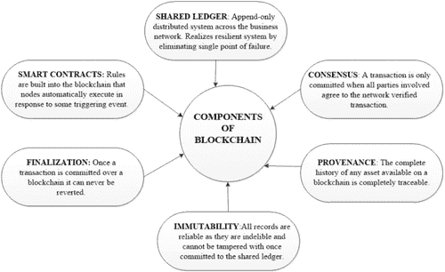
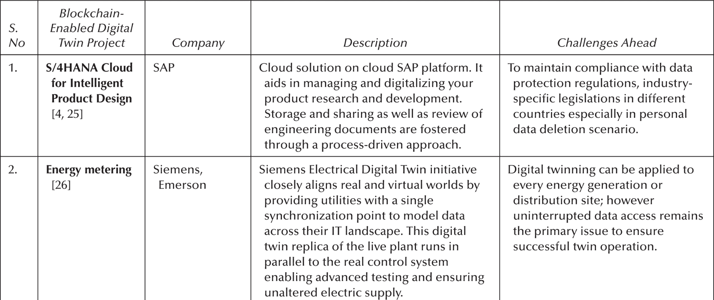
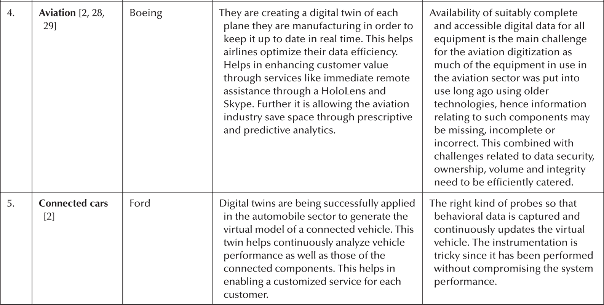
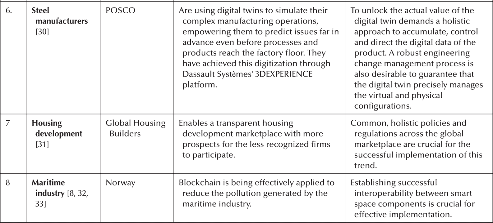
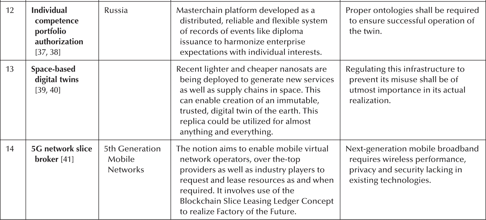
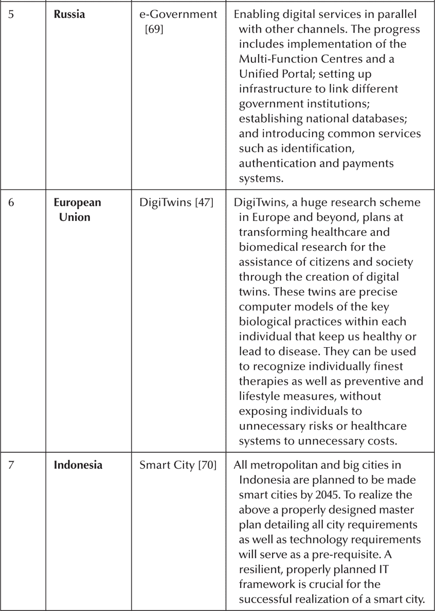

# 第十章

# 通过区块链实现数字孪生：一种战略视角

瑞蒂卡·瓦森，布罗托·拉乌特·巴哈德瓦杰，和维沙尔·贾恩

目录

10.1 引言

10.2 数字孪生的区块链视角

10.3 实时区块链赋能的数字孪生

10.4 一些显著的案例

10.5 实现区块链赋能数字孪生的挑战

10.6 数字孪生在人类环境中的应用

10.7 数字孪生赋能的商业趋势

10.7.1 消费者的持续承诺

10.7.2 业务流程监督

10.7.3 自动化的服务

10.7.4 扩展的大数据

10.7.5 内嵌的 IT

10.8 结论

10.9 未来的发展方向

参考文献](chapter10.xhtml#b-9781000175257-bib9)

## 10.1 引言

在 20 世纪 90 年代，互联网为信息的数字化和全球可访问性铺平了道路。然而，机密数据的这种转移涉及第三方确保安全传输。因此，随着时间的推移和数据量的增加，资产的安全转移被清算，而且通过道德或非道德的手段，所有个人数据都可以从互联网上恢复 [1]。近年来，世界在数字化转型的各个方面都发生了快速变化 [2]。工业也注意到了向数字倡议（如数字孪生）的显著运动 [3-6]，以向客户提供及时和高质量的服务。这种改变的商业模型实际上是一种尝试，旨在优化操作以改善整体的客户体验。被称为千禧一代的新一代正在催化这一新趋势。他们更愿意使用资产、产品和流程作为服务，而不是拥有和维护它们。预计在本世纪交替时，全球将有超过 200 亿个物联网（IoT）设备 [3]。这些网络化设备将维持数百万个数字孪生，并包含重要数据。数字孪生技术将物理单元与其虚拟预设的双胞胎结合在一起。实际上，它是将物理实体与其数字图像相结合，以提高安装的物理机器的性能和行为。它有助于减少停机时间并提高性能。数字孪生技术实际上正在使整个社会的数字化转型得以实现，以促进人类生活几乎所有领域的竞争力和透明度 [2]。数字孪生不是一个新模型，它已经存在了好几年，最近从机器的角度来看，数字副本（结合 CAD/CAE 技术、物联网和分析）与物理机器共存，并帮助主动预见维修需求、潜在改进以提高性能、产品线的增强等 [7]。

物联网生态系统需要 IT 组件和连接性。数字孪生可以映射一个物理实体，并促进其物理副本在现实世界中所需的数字监督和操纵能力。此外，它们还允许高效地存储和传输数据，并添加诸如分析解决方案之类的服务，这对于预测建模等领域的关键作用不可小觑。因此，数字孪生也可能成为实现智慧城市的一个重要组成部分 [7]。

近年来，区块链技术已经成为一种新颖的组织范式，用于检测、评估和传输人类活动的所有独特单位，其规模之大超出了之前所实现的。据预测，区块链可能显著促进数字双生在物联网中的应用[7]。将区块链应用于数字双生被称为数字双生的重生[7]。为了真正利用物联网生态系统中数字双生的优势，需要一种透明地处理基于数据的事务的技术，并以安全的方式进行处理。区块链使网络中的多方能够进行数据交换，通过点对点通信应用加密身份。这项技术预计将在企业、服务和工业等不同领域引发根本性的变化。它通过内置的加密机制提供安全性，并通过不可篡改的区块链块提供去中心化、透明的数据访问。因此，参与实体可以随时通过一个安全且无故障的机制追溯过去的交易。

尽管数字双生已经被认为是具有潜力的一项技术，但截至目前，还没有一个普遍适用的、标准化的机制来实现数字双生。目前，在物联网生态系统中产生的大多数信息都存储在分散的数据孤岛中。这种碎片化需要被废除，并以集成账本技术，如区块链，来取代，以真正利用数字双生提供的优势。

本章试图探讨和分析区块链在实现智能物联网生态系统中数字双生的集成。我们旨在识别数字双生的主要驱动力和障碍，并在探索区块链在数字双生中的应用可能性时，深入了解数字双生的可能性。下一节详细阐述了区块链技术如何实现数字双生。第 10.3 节评估了一些实时的区块链支持的数字双生，以评估当前情况。第 10.4 节深入探讨了一些具体例子，以完全理解和欣赏区块链支持的数字双生。第 10.5 节描述了挖掘区块链支持数字双生全部潜力的挑战。第 10.6 节讨论了数字双生如何帮助改善人类生活。第 10.7 节突出了一些值得关注的数字双生业务趋势。第 10.8 节总结了本章。

## 10.2 数字双生的区块链视角

区块链技术因其固有的不可篡改性、去中心化和时间戳记录存储等特性，目前正吸引着市场的许多期望和兴趣 [8]. 简单地说，区块链是一个“共享的、分布式的、不可篡改的账本，它帮助在商业联系的网络中记录交易和追踪资产” [9 –11]. 最初由中本聪（Nakamoto）于 2008 年开发，作为支持比特币加密货币的技术，该技术已经在不同行业中展示了其广泛采用的潜力 [9, 12, ]。这种技术不仅在资本转移方面有用；它还可以帮助任何资产以透明、值得信赖的方式进行交易 [13]. 它创建了一个永久的、透明的交易记录，同时防止企业之间的顽固阻碍 [14]. 基于点对点传输操作网络，透明且经过加密保护的信息促进了智能合约 [15]. 正当地称之为本十年的新范式，它通过区块链密码学实现了计算的互联世界 [16]. 根据德勤和奥地利区块链解决方案提供商 RIDDLE&CODE 的说法，“区块链技术是最合适、最有能力的手段来创建、检查和交易数字孪生” [17]. 区块链本身是一项承诺会像互联网一样具有颠覆性的创新。这项创新使得去中心化、防篡改、社区拥有交易记录成为可能 [18].

连接的的世界和工业革命 4.0 也是区块链的重要参与者[19]。它们实际上指的是多设备计算，包括可穿戴计算、笔记本电脑、智能手机、物联网(IoT)传感器、智能家居、自我追踪设备(例如 Fitbit)和智能城市。区块链可以通过智能合约在连接的世界中有效地传递重要信息以及高效地分配资源。这些自动完成的合约可以提高公共部门和私营部门多个操作的效率，同时消除中间人[15]。区块链构成一个多面向的平台，能够为不同的各方提供透明和安全的数据交易[18, 20, ]。它建立了一个信任网络，连接了不同的参与实体，这些实体共享信息以促成交易[21]。通过其原生特征，如共同的、兼容的协议和通过共同的分布式账本平台进行数据共享，区块链还使得不同物联网生态系统中的所有连接应用程序之间能够交互[11, 14, 15, 18, 22, 23, ]。为了实现独特代币化的数字孪生之间的多利益相关者互动，需要一个清晰、有能力的平台，拥有充足的基础设施设施。

图 10.1 区块链技术的主要特征。

图 10.1 展示了区块链技术的主要特征。这些特征有助于实现一个在相关区块链的每个节点上永久且同时记录在共享账本上的不可篡改、不可逆转的交易。这项技术通过帮助创建和控制所有物理和逻辑资产、流程和框架以及人类的数字副本，具有改变全球经济的潜力。区块链可以作为此类系统的骨架，因为它是一个没有中介的独立系统。它通过点对点机制和内置加密以及每个数据块的完全可追溯性来实现。这项技术具有几个固有优势，如交易透明度、欺诈和操纵控制、腐败消除、成本降低、更高的信任度、较少的人为错误、隐私、可靠性和安全性等[15, 24, ]。

虽然被称为自互联网以来最大的发明，但这项技术的充分利用仍然受到知识、实证研究、熟练开发人员和由于智能合约实施过程中缺乏明确指导而产生的困境等因素的阻碍 [15]。许多行业已经采用区块链技术作为服务，以消除与安全以及交易宇宙中的可见性相关的障碍。房地产、保险和金融、医疗保健、零售、国防、运输、农业等行业已经采用区块链技术，以增强其交易的信任和安全性。我们将在以下章节中进一步阐述一些值得考虑的区块链用例。

## 10.3 实时区块链支持的数字孪生

自 2017 年以来，许多行业对开发基于区块链的数字孪生体表示出了兴趣。我们在表 10.1 中介绍了一些项目，以说明涉及的机会和挑战。

表 10.1 值得关注的数字孪生倡议

表 10.1 无可辩驳地证明，数字孪生是当前数字经济的主要组成部分，有助于实现数字社会。然而，理解创建任何社会、经济或人类资产、实体或过程的数字数据印记的重要性，以及实现自动、分布式、无故障、智能、可信、不可逆转的交易及数据注册机制是重要的。这一要求由区块链技术满足。因此，基于区块链的数字孪生是未来的数字孪生或一切事物的数字副本。相反，正是这项技术使得现有的数字、物理和社会领域的结合成为可能 [46]。

## 10.4 一些值得注意的案例

随着实时透明度的提供，数字孪生体正在获得关注 [47]。这种技术被广泛应用于航空、制造、汽车等多个领域， appropriately referred to as 游戏变革技术。在本节中，我们试图理解和欣赏实现成功数字孪生所涉及的知识、资产、数据和智能。我们讨论了一个智能工厂的案例，这是关键供应链制造过程的数字版本 [7, 48 –51]。创建数字孪生的进展通常遵循这条路径：

1.  理解资产级别的运营和预测，并利用杠杆来优化个人表现。

1.  ii. 在个体层面上优化维护。

1.  iii. 为多个资产聚合数据并在操作层面上进行优化。

1.  iv. 重新思考商业模式，并启用新的价值和服务的可能。

连接性对制造过程至关重要。随着工业 4.0 的兴起和数字世界与物理世界的融合，供应链动态经历了彻底的变革。供应链运营的新开链机制，即数字供应链网络，实际上是制造业未来竞争的基础。然而，要完全理解这些，数字供应链公司需要通过影响业务的无数运营系统提供并行集成；通过相关的制造系统实现垂直集成；以及通过整个价值链实现端到端的整体融合。这种集成合称为智能工厂，它不仅能在工厂内部，也能在供应链网络中创造更大的价值。智能工厂是一个完全连接、灵活的系统，它利用来自连接的运营和生产系统的持续数据流，通过数字孪生适应新的需求。结果是一个灵活、敏捷的系统，具有更高的效率和减少的停机时间。这样的系统可以在更广泛的网络中自我优化性能，实时自我适应动态条件，并自主运行整个生产过程。因此，这样的系统可以随着组织需求的变化而发展和成长。图 10.2 展示了智能工厂成功的关键特性[Figure 10.2]。

图 10.2 智能工厂的关键属性。

如图 10.2 所示，连接性、优化、透明度、主动性和敏捷性是智能工厂的主要属性。它们共同确保更好的决策，帮助组织改进其生产过程。

从印度的视角看，Hero Moto Corp，世界上最大的两轮车制造商，是印度第一家在 2016 年 4 月采用数字孪生方法的车企[52]。这要求跨部门合作，采用一个数字化制造设施以实现降低成本和提高质量。他们已经为他们在瓦多达拉（哈洛尔）的制造设施实现了一个数字副本，以连续数字化可视化该设施，以便及时进行更改和提升。

该公司旨在在虚拟环境中可视化其产品、流程以及资源，以提高生产力、降低成本并消除其每个制造设施的干扰。在实际物理调试之前，该公司还实现了其每个新调试的制造设施的预验证，以消除相关的昂贵返工。还在装配线上的现有和新模型的工艺规划也得到了验证，以实现工艺标准化和一个单一、通用的数据仓库。此外，该公司在开发和制造的各个阶段实现了成本和时间的降低，并提供了 3D 培训材料，实现了无纸化车间。

## 实现区块链数字孪生面临的挑战[10.5 挑战实现区块链数字孪生]

由于架构、价值观和本体论之间的语义互操作性不足，数字复制品的快速分发遇到了障碍。自动检测所需的专业知识也供不应求[47]。尽管区块链被描绘成下一个大事件，促进数字孪生和物联网的发展，但还有一些挑战需要解决，比如[53]：

1.  一、区块链如何实现“被遗忘权”[54]？：区块链的一个固有特性是数据实际上无法被删除。在这种情况下，区块链如何在数字孪生中实现遗忘数据的权利？一个提出的解决方案是通过使用用户的唯一根密钥。这个根密钥可以用来为每个单独的交易生成一个新的密钥。因此，每个交易可能有不同的散列值，并且不再相互关联。

1.  二、明确且知情的政策[55]：采用区块链技术的数字孪生将意味着参与组织经历一场完整的范式转变。为此，该组织需要对其在物联网生态系统中的角色有适当的认识，明确他们希望扮演的角色（数据提供者或数据获取者），以及实现所需跨行业效率水平的特定区块链基础设施的详细信息。为了拥抱这种变化，需要适当的技术以及硬件和软件技能。目前，工业、专业人士和商业还未完全适应这些变化的动态。

1.  三、不存在通用的孪生[55, 56, ]。这意味着一个孪生并不能适合所有情况。因此，需要为每种制造的产品创建一个数字孪生。这尤其适用于所有涉及人际互动的产品。

1.  iv. 数字化一切 [57]：为了实现数字双生体的真正潜力，并使其像互联网一样普及和无处不在，需要数字化所有数据。这意味着即使是小型和中型制造商或服务提供商也需要启动数字化过程。

1.  v. 高效的产品开发平台和流程 [55, 56, ]：要创建高效的数字副本，需要适当的产品开发平台和流程。然而，这些技术仍处于初级阶段。因此，根据 Marc Halpern 的说法，“数字双生体更多的是关于愿景和承诺，而不是最终的解决方案”。

1.  vi. 保护数字双生体 [57]：随着时间的推移，数字双生体本身将成为知识产权。与这一知识产权相关的所有权、安全等问题需要认真思考。人们还应该记住，这些物联网设备也可能会受到分布式拒绝服务（DDoS）攻击、黑客攻击和数据盗窃以及数据劫持问题的威胁。如何克服这些问题是另一个重大挑战。

1.  vii. 适当的法规 [58]：为了与技术发展相匹配，需要有关账户所有权和交易的适当法规。

1.  viii. 可靠性 [59]：在各种环境下，区块链赋能的数字双生体需要可靠、全天候、无处不在的连接，以确保在所有生命周期阶段都能实现最佳运行。这在资产部署在严酷的陆地领域时将是一个挑战。

1.  ix. 弹性：无线网络的弹性将需要得到极大的提高，实现持续在线和最快的恢复，从而创建一个“始终开启”的数字生态系统。

1.  x. 数字双生体内以及与其他智能组件之间的交互 [32]：这可能是区块链赋能数字双生体在各个领域成功应用的主要挑战。成功交互是确保数字双生体准确复制物理资产（无论是人类还是物理实体）所必需的。因此，建立数字双生体所有智能组件之间以及与其他双生体以及生态系统中的实体之间健康、持续的交互，对于区块链赋能数字双生体在行业中的有效实施至关重要。

上述挑战只是冰山一角，随着数字双生体在各个商业和领域中的应用，还将有许多其他挑战和问题不断出现。

## 10.6 数字双生体在人类环境中的应用

正如数字双胞胎正在提高行业中资产的有效性和效率，它们也可以对人类健康和生命科学行业产生好处 [60]. 要实现这一点，我们首先需要明白，作为人类，我们都在互联网上留下了自己的足迹。我们自己在互联网上留下的任何形式的所有信息（属性、行为、在线存在）实际上都在为我们创建一个数字双胞胎。我们在互联网上创建的这种数据足迹，如果与物联网和分析的进步相结合，可以帮助我们监测和预测未来的需求，特别是在医疗保健方面 [61]. 我们的领英、脸书、推特、Snapchat 和 Instagram ID 实际上是我们互联网上的数字副本，很容易获得。为了进一步理解这一点，我们首先评估实现人类数字双胞胎的组成部分 [60, 62, 63, ]。

1.  i. 属性：它们构成了我们身份的核心数据。例如：姓名、年龄、性别、地址、教育、国籍等。这些数据有助于描绘一个人，并预测他们是否由于出身或居住地而倾向于某些健康问题。

1.  ii. 互动：这个足迹是基于我们与外部世界的互动而产生的。例如：频繁飞行对健康的影响，购物习惯与银行数据的关系。新技术，如 Fitbit 手表、与医生的互动数据、手机使用统计等，都是“数字我”的重要组成部分，如果与属性相结合，可以帮助监测、诊断和预测个人表现和健康状况。这些数据甚至可能帮助组织做出决策。然而，这些决策涉及很多我们在这里不会讨论的问题。

1.  iii. 在线人格：通过互联网，我们中的每个人都有一个数字身份，通过它我们进行所有的网上浏览。这些数据已经被各种网站存储和分享，并且可以再次为我们提供许多个人属性（如健康、兴趣等）的有趣洞察。

上述三个属性阐明了人类数字双胞胎的可能性。就像机器数字双胞胎可以帮助评估维护、增长等方面的需求一样，人类数字双胞胎也可以在各种生活技能预测方面提供帮助。

显然，上述讨论澄清了数字孪生对人类的优点。然而，如果这样的数字副本建立在传统技术上，它将把所有数据保存在一个中心仓库里，这需要加以保护，同时进行分析以提供受到保护的预测。为了克服额外的安全成本，区块链提供了一种可行的选择。区块链能够在一个不可篡改的账本上创建身份，且没有集中的所有者。这种自我主权身份能够决定谁有权访问他们的数据，并且能够追踪所有访问过它的人。例如：Hyperledger Indy 区块链平台能够创建这样的身份。这样的区块链网络通常由数据所有者（个人）、数据证明者（发放资格证书的大学）和数据请求者，比如雇主组成。这种网络的治理可以是民主的，每一次对数据的访问都可以由数据所有者授权。这种创建公民数字副本的能力有潜力改变全球经济。全球许多政府都在投资大量资金在像自我主权身份、移动资产所有权登记、验证等区块链赋能的计划上。基于区块链的人 digital twins 将成为实现和实施所有此类计划的关键组成部分 [64]. 表 10.2 列出了一些值得关注的政府举措，实现同样的目标。

表 10.2 政府推动的区块链数字孪生计划

表 10.2 展示了全球各国政府如何认识到数字孪生的重要性，并且投入巨资实现基于区块链的孪生技术，以数字化和改善不同场景下公民的生活 [44, 74, ]. 从表 10.2 中我们可以看出，不同国家的政府或私营企业仅仅是采用了区块链技术，以提供更安全、更便捷、更互联的公民服务。这一过程简单地采用了区块链技术，消除了中介第三方、数据泄露风险等需求，同时为所有人提供平等的服务。进一步地，这些基于区块链的流程在后台生成人类的数字副本，同时改善人类的生活质量。

## 10.7 数字孪生赋能的商业趋势

物联网（IoT）已经实现了网络连接，简化了设备和方法之间的通信。公司已经以许多新方式部署智能设备，以增强其业务。以下是我们可以期待的四种趋势 [19, 75, 76, ]：

### 10.7.1 对消费者的持续承诺

智能产品使用户能够通过物联网与家用电器和其它家用产品进行通信和控制。这些通信能力也可以应用于监控产品并实现主动支持。

例如，如果某个汽车部件需要维护或者出现故障，可以将消息发送给客户以及制造商的服务系统。

### 10.7.2 业务流程监督

所有可量化的东西都可以得到改进。物联网将进一步使企业在办公工作和现场流程等其他领域实现详细监控成为可能。

可穿戴设备是应用于个体的传感器，用于仔细审查活动并记录信息。这些传感器及其通信可以提供更多数据以进行深入分析，从而提高生产率并帮助降低成本。

### 10.7.3 自动化服务

包括汽车在内的各个行业现在可以在车辆和包装上部署物联网传感器，以最大化供应链的可见性并提高宝贵资产的操作。这些传感器可以识别温度、光线和其他属性的变化，并可用于减轻延迟、干扰、抢劫等风险。

实时警报可以使服务在正确的时间和地点进行计划性的交付，并且拥有所需的设备来提高效率。

### 10.7.4 扩展的大数据

作为物联网设备的一部分，传感器制造的数据可以存储和分析作为现有分析的一部分——生成完全新的发现类别。

### 10.7.5 嵌入式 IT

从物联网的“智能”积累到当前设备以及内置物联网组件的生成设备的转变将是颠覆性的。然而，这一大工业变革，正确地被称为第四次工业革命，将实际上改变工业景观及其机制。

## 10.8 结论

物联网、数字孪生以及区块链已经在各种工业部门和领域成功实施。它们共同为实现新的工业 4.0 革命提供了工具。然而，它们的实施一直面临技术和财务限制。随着物联网设备和数量的增加，技术和财务挑战逐渐减少。然而，对于相对新颖的数字孪生平台，我们需要认识到它们不仅仅是学术建模练习。数字孪生是为特定结果而创建的，或者可以称为关键绩效指标（KPI）。这些 KPI 对于决定保持特定服务质量、预测组件寿命以减少停机时间等问题至关重要。然而，至今为止一直缺少一个集成稳定的底层平台。区块链的底层分布式账本技术为其参与实体提供了不可变性、透明性以及安全优势。因此，区块链已经 emerged 作为一种有前景的底层平台，以实现有效的数字孪生。相反，可以适当地称数字孪生是未来技术，它们拥有改变企业及人类生活的潜力。

## 10.9 未来展望

数字革命无疑正在全球范围内展开，它正在改变人类、工业以及经济。一切周围的资产、解决方案、流程甚至技术本身都在转变为服务。区块链赋能的数字孪生无疑是一种创新技术，它拥有改变工业景观以及转变人类生活的能力。然而，在实现这一技术研究及学术界所描绘的完整潜力之前，还有很长的路要走。从这个研究中可以理解并概述许多未来研究的潜在领域和努力。然而，这些研究并不完整，可能会随着这项技术在各个领域的创新应用而不断扩展：

1.  1. 智能合约本体论发展 [31]：可以为智能合约的描述开发本体论，以提供智能组件以及智能资产之间交互的可互操作性。这可能有助于找到区块链中出现问题的解决方案。

1.  2. 物联网平台不足 [32]：对现有物联网平台的详细分析，这些平台可用于建立区块链赋能的数字孪生和智能资产，表明它们仍然存在许多不足之处，如缺乏作者验证机制、信息持久性问题、在生产中对资源交换的有效控制等。这些问题仍然需要有效、持久的解决方案。

1.  3. 区块链的不变性缺陷[59]：区块链的这一特性既是优点也是缺点。应注意的是，不断扩展的区块链将持续需要潜在的内存块，这对于在物联网生态系统中运行的一些看似简单的设备来说可能是不够的。为了解决这些问题，可以再次使用有效的本体论，将弱设备的一些信息委托给链中的强设备。

1.  4. 越来越大的人口数据[77]：这一波数字转型的特点是数字化和数字化。数字化涉及创建物理资产、实体等的数字副本，而数字化涉及使用适当的技术有效地在社会过程中使用数字化的实体。这个过程完整地产生了越来越大的大数据的创建和使用，这需要有效的存储、分析和共享机制。

## 参考文献

1.  1. M. 米塞维奇，盖亚·蒂扬，爱德华·兹加利奇，德拉詹·贾拉斯，《电子商务物流新兴趋势》，2018 年。

1.  2. S. 纳德拉，J. 尤奇纳，《导航数字转型》，2018 年。

1.  3. 德勤与 Riddle& Code，《物联网 powered by Blockchain 如何通过区块链实现数字孪生在物联网的应用》，第 20 页，2018 年。

1.  4. J. 科比埃尔，《网络化的数字孪生即将到来 - SiliconANGLE》，2018 年。 [在线]。可在：[`siliconangle.com/2018/04/24/networked-digital-twins-coming-industrial-blockchains/`](https://siliconangle.com)。[访问日期：2018 年 9 月 7 日]。

1.  5. T. 吕克特，《数字孪生+区块链 - SAP 新闻中心》，2017 年。 [在线]。可在：[`news.sap.com/2017/05/sapphire-now-digital-twin-blockchain/`](https://news.sap.com)。[访问日期：2018 年 9 月 7 日]。

1.  6. 加里·施瓦茨，《我们的数字孪生与区块链——加里·施瓦茨》，2018 年。[在线]。可在：[`www.ifthingscouldspeak.com/2018/05/14/our-digital-twin-the-blockchain/`](https://www.ifthingscouldspeak.com)。[访问日期：2018 年 9 月 7 日]。

1.  7. S. 王，J. 万，D. 李，C. 张，《实施工业 4.0 的智能工厂：展望》，2016 年。

1.  8. A. H. 高斯达尔，K. V. 查科罗夫斯基，M. Z. 索莱斯维克，《应用区块链技术：挪威公司的证据》，2018 年。

1.  9. S. 中本聪，《比特币：一种点对点的电子现金系统》，[Www.Bitcoin.Org](http://Www.Bitcoin.Org)，2008 年。

1.  10. J. 伊利-胡莫，D. 科，S. 崔，S. 公园，K. 斯莫兰德，《区块链技术当前研究在哪里？ - 系统回顾》，2016 年。

1.  11. P. 迪帕克, M. 妮莎, S. P. 莫汉蒂, “关于区块链你想知道的一切,” IEEE Consum. Electron. Mag., vol. 7, no. 4, pp. 6–14, 2018.

1.  12. D. 弗尔金斯坦, “双胞胎技术的故事：比特币与互联网,” J. Strateg. Int. Stud., vol. X, no. 2, pp. 82–90, 2015.

1.  13. M. 周, “数字经济的演进与设计,” 2018.

1.  14. B. 佩洛特, “快进,” Ibm, vol. 42, no. 3, pp. 46–49, 2013.

1.  15. P. A. 科尔滕, “政府服务的区块链技术：在设计原则应用中的困境,” pp. 1–14, 2017.

1.  16. M. 斯旺, 区块链：新经济的蓝图, 2015, O'Reilly Media: Newton, MA.

1.  17. D. 施哈尼安, “物联网预测：数字孪生将与区块链相结合 - 数字孪生 - 汉诺威工业博览会,” 2018\. [Online]. Available: [`www.hannovermesse.de/en/news/iot-forecast-digital-twins-to-be-combined-with-blockchain-88960.xhtml`](https://www.hannovermesse.de). [Accessed: 29-Nov-2018].

1.  18. Z. 郑, S. 谢, H. 戴, X. 陈, H. 王, “区块链技术概述：架构、共识和未来趋势,” In Proc. - 2017 IEEE 6th Int. Congr. Big Data, BigData Congr. 2017, pp. 557–564, 2017.

1.  19. B. 西尔利·沃克, “2017 年十大战略技术趋势,” no. October 2017, 2016.

1.  20. Z. 郑, S. 谢, H.-N. 戴, X. 陈, H. 王, “区块链的挑战与机遇：一项调查,” Int. J. Web Grid Serv., vol., 14, no. 4, pp. 1–24, 2016.

1.  21. 维尔巴胡·南迪什瓦尔·贾恩, 德维什·米什拉, “供应链和制造业的区块链及其未来！” Int. J. Eng. Res., vol. 7, no. 9, pp. 32–40, 2018.

1.  22. G. Chen，B. Xu，M. Lu，N.-S. Chen，“探索区块链技术及其在教育中的潜在应用”，智能学习环境，卷 5，第 1 期，第 1 页，2018 年。

1.  23. L. Lee，“区块链新生代：比特币技术如何重新定义股票市场”，哈斯廷斯商法杂志，卷 12，第 2 期，2015 年。

1.  24. A. Bahga，V. K. Madisetti，“工业物联网的区块链平台”，软件工程应用杂志，卷 9，第 10 期，2016 年。

1.  25\. “简介 - SAP 帮助门户。” [在线]。可获取：[`help.sap.com/viewer/d3a4810ff9dd41c59c50e1d1a6d4d7ae/1811/en-US`](https://help.sap.com)。[访问日期：2018 年 11 月 19 日]。

1.  26\. “为可持续的数字未来做准备，实现可互操作的数据交换和同步。”

1.  27\. “数字孪生 | GE 数字。” [在线]。可获取：[`www.ge.com/digital/applications/digital-twin`](https://www.ge.com)。[访问日期：2018 年 11 月 19 日]。

1.  28\. S. Datta，“网络安全-一种基于代理的方法？” 2017 年。

1.  29. “Digital twins and threads in aviation, aerospace and defense,” 2017. [在线]. 可获取: [`www.capgemini.com/us-en/2017/12/establishing-a-fully-functional-digital-twin-or-digital-thread-in-aviation-aerospace-and-defense/`](https://www.capgemini.com). [访问日期: 19-Nov-2018]。

1.  30. S. Dudley, “Dassault systèmes helps POSCO digitise its manufacturing operations,” 2015. [在线]. 可获取: [`www.technologyrecord.com/Article/dassault-syst232mes-helps-posco-digitise-its-manufacturing-operations-49171`](http://www.technologyrecord.com). [访问日期: 30-Nov-2018]。

1.  31. I. Savu, G. Carutasu, C. L. Popa, C. E. Cotet, “Quality assurance framework for new property development: A decentralized blockchain solution for the smart cities of the future,” Res. Sci. Today, 第 13 期, 2017。

1.  32. N. Teslya, I. Ryabchikov, “Blockchain-based platform architecture for industrial IoT,” 在 Conf. Open Innov. Assoc. Fruct, 第 321-329 页, 2018。

1.  33. K. Czachorowski, M. Solesvik, Y. Kondratenko, The Application of Blockchain Technology in the Maritime Industry, 第 171 卷. Springer International Publishing, 2019。

1.  34. D. Lang, M. Friesen, M. Ehrlich, L. Wisniewski, J. Jasperneite, “Pursuing the vision of industrie 4.0: Secure plug-and-produce by means of the asset administration shell and blockchain technology,” 在 2018 IEEE 16th International Conference on Industrial Informatics (INDIN), 第 1092-1097 页, 2018。

1.  35. B. Varghese, M. Villari, O. Rana, P. James, T. Shah, M. Fazio, R. Ranjan, “Realizing edge marketplaces: Challenges and opportunities,” IEEE Cloud Comput., 第 5 卷, 第 6 期, 第 9-20 页, 2018。

1.  36. S. A. P. Kumar, R. Madhumathi, P. R. Chelliah, L. Tao, S. Wang, “A novel digital twin-centric approach for driver intention prediction and traffic congestion avoidance,” J. Reliab. Intell. Environ., 第 4 卷, 第 4 期, 第 199-209 页, 2018。

1.  37. F. Wei, N. N. Pokrovskaia, “Digitizing of regulative mechanisms on the masterchain platform for the individualized competence portfolio,” 在 2017 IEEE VI Forum Strategic Partnership of Universities and Enterprises of Hi-Tech Branches (Science. Education. Innovations) (SPUE), 第 73-76 页, 2017。

1.  38. G. A. Kostin, N. N. Pokrovskaia, M. U. Ababkova, “Master-chain as an intellectual governing system for producing and transfer of knowledge,” 在 2017 IEEE II International Conference on Control in Technical Systems (CTS), 第 71-74 页, 2017。

1.  39. F. Longo, “Advanced data management on Distributed Ledgers: Design and implementation of a Telegram BOT as a front end for a IOTA cryptocurrency wallet,” 2018 年 7 月。

1.  40. “Blockchain and space-based ‘Digital Twin’ of earth | Bitcoin Magazine,” 2017. [在线]. 可获取: [`bitcoinmagazine.com/articles/blockchain-and-space-based-digital-twin-earth-offer-insights-and-web-connectivity/`](https://bitcoinmagazine.com). [访问日期: 06-Dec-2018]。

1.  41\. J. Backman，S. Yrjola，K. Valtanen，O. Mammela，“5G 中的区块链网络切片经纪人：未来工厂中的切片租赁用例”，在 Jt. 13th CTTE 10th C. Conf. Internet Things - Bus. Model. Users, Networks，卷 2018–1 月，第 1–8 页，2018 年。

1.  42\. D. Faizan，S. Ishrat，“无可挑剔的文艺复兴方法：一项电子村倡议”，在 ICACCT 2018，卷 899，第 335–346 页，2018 年。

1.  43\. I. Limited，“数字化时代的服务”，Infosys Insight，卷 4，第 1–104 期，2016 年。

1.  44\. P. Jiang，“社会制造范式：概念、架构和关键技术”，先进制造，第 13–50 页，2019 年。

1.  45\. P. Gallo，U. Q. Nguyen，G. Barone，P. van Hien，“DeCyMo：用于监测和控制工业和家庭的分散式网络物理系统”，2018 年 IEEE 第 4 届国际社会科学研究技术论坛，第 1–4 页，2018 年。

1.  46. R. N. Bolton, J. R. McColl-Kennedy, L. Cheung, A. Gallan, C. Orsingher, L. Witell, M. Zaki, “顾客体验挑战：整合数字、物理和社交领域”，《服务管理期刊》，第 29 卷，第 5 期，2018 年，pp. 776–808。

1.  47. S. Datta, “数字孪生的出现是理性的进步吗？”，《创新管理期刊》，第 5 卷，第 3 期，2017 年，pp. 14–33。

1.  48. D. Communications, “智能工厂”，完全网络化价值链。

1.  49. B. Sniderman, M. Monika, M. J. Cotteleer, “工业 4.0 和制造生态系统：探索连接企业的世界”，Deloitte University Press，2016 年，pp. 1–23。

1.  50. A. Radziwon, A. Bilberg, M. Bogers, E. S. Madsen, “智能工厂：探索自适应和灵活的制造解决方案”，《工程学会议论文集》，第 69 卷，2014 年，pp. 1184–1190。

1.  51. A. Mussomeli, D. Gish, S. Laaper, “数字供应链的崛起”，Deloitte，第 45 卷，第 3 期，2015 年，pp. 20–21。

1.  52. S. Jha, “英雄摩托：Vijay Sethi 如何推动英雄摩托的数字孪生项目，IT 新闻，ET CIO”，2017 年。[在线]. 可获得：[`cio.economictimes.indiatimes.com/news/strategy-and-management/how-vijay-sethi-is-driving-the-digital-twin-project-at-hero-moto-corp/57625617`](https://cio.economictimes.indiatimes.com)。[访问日期：2018 年 11 月 29 日]。

1.  53. S. Goldberg, “数字孪生的承诺与挑战”，HarperDB，2018 年。[在线]. 可获得：[`www.harperdb.io/blog/the-promise-challenges-of-digital-twin`](https://www.harperdb.io)。[访问日期：2018 年 11 月 19 日]。

1.  54. David Schahinian，“物联网预测：数字孪生将与区块链相结合 - 数字孪生 - 汉诺威工业博览会”，2018 年。[在线]。可访问：[`www.hannovermesse.de/en/news/iot-forecast-digital-twins-to-be-combined-with-blockchain-88960.xhtml`](http://www.hannovermesse.de)。[访问日期：2018 年 9 月 6 日]。

1.  55. S. Goldberg, “数字孪生的承诺与挑战,” 2018. [在线]. 可用: [`www.harperdb.io/blog/the-promise-challenges-of-digital-twin`](https://www.harperdb.io). [访问日期: 2018 年 11 月 30 日]。

1.  56. S. Ferguson, E. Bennett, A. Ivashchenko, “数字孪生解决设计挑战,” 世界泵业, 卷 2017, 编号 4, 页 26-28, 2017。

1.  57. S. Haag, R. Anderl, “数字孪生——概念验证,” 2018。

1.  58. R. Adams, G. Parry, P. Godsiff, P. Ward, “货币的未来以及区块链的进一步应用,” 战略变革, 卷 26, 编号 5, 页 417-422, 2017。

1.  59. A. Shakir, Zeeshan Muhammad;Aijaz, “物联网、机器人和区块链: 向一个独立于人类的生态系统的崛起 | IEEE 通信社会,” 2018. [在线]. 可用: [`www.comsoc.org/publications/ctn/iot-robotics-and-blockchain-towards-rise-human-independent-ecosystem`](https://www.comsoc.org). [访问日期: 2018 年 12 月 4 日]。

1.  60. J. K. Hodgins, “模拟人类运动,” 科学美国人, 卷 278, 科学美国人, 自然美国公司的一个部门, 页 64-69, 1998。

1.  61. S. Tyagi, A. Agarwal, P. Maheshwari, “基于云计算的物联网医疗系统概念框架,” 在 2016 年第六届国际会议-云系统与大数据工程(Confluence)中, 页 503-507, 2016。

1.  62. J. Davis, H. Bracha, “精神分裂症中的胎儿生长标志物: 一对同卵双胞胎对照研究,” 1996。

1.  64. D. Baars, “利用区块链技术走向自主身份,” 荷兰恩智大学, 页 90, 2016。

1.  65. V. Gohil, “区块链在印度的潜力 • indiaChains,” 2018. [在线]. 可用: [`indiachains.com/blockchains-potential-in-india/`](https://indiachains.com). [访问日期: 2018 年 11 月 29 日]。

1.  66. S. Haridas, “这座城市正在接受区块链技术——原因何在。” [在线]. 可用: [`www.forbes.com/sites/outofasia/2018/03/05/this-indian-city-is-embracing-blockchain-technology-heres-why/#337fcfb88f56`](https://www.forbes.com). [访问日期: 2018 年 11 月 29 日]。

1.  67. e-Estonia, “常见问题解答: 爱沙尼亚区块链技术,” 2017。

1.  68. “加拿大政府的创新超级集群计划。”

1.  69. “2020 年俄罗斯数字政府的前景。”

1.  70. Y. Handoko, “为印度尼西亚的智能城市开发 IT 总体规划,” 页 1-17。

1.  71\. C. Stolwijk, M. Punter, “走向数字化：现场实验室加速荷兰工业的数字化，”2018 年。

1.  72\. D. David, K. C. Lee, R. H. Deng, 区块链、数字金融和包容性手册。第 1 卷，加密货币、金融科技、保险科技和监管，ScienceDirect，2017 年。

1.  73\. R. Woodhead, P. Stephenson, D. Morrey, “数字建筑：从点解决方案到物联网生态系统，”自动化建筑，第 93 卷，第 3 期，pp. 35-46，2018 年。

1.  74. P. Mamoshina, L. Ojomoko, Y. Yanovich, A. Ostrovski, A. Botezatu, P. Prikhodko, E. Izumchenko, A. Aliper, K. Romantsov, A. Zhebrak, I. O. Ogu, A. Zhavoronkov, “融合区块链和下一代人工智能技术，去中心化并加速生物医学研究和医疗保健，”Oncotarget，第 9 卷，第 5 期，pp. 5665-5690，2015 年。

1.  75. A. Volkenborn, A. Lea-Cox, W. Y. Tan, “数字革命：数字技术如何改变亚太地区的 E&P 业务模式，”在 2017 年 SPE/IATMI 亚洲太平洋石油与天然气会议和展览会上。

1.  76. M. Chiang, T. Zhang, “雾和物联网：研究机会概述，”IEEE 物联网杂志，第 3 卷，第 6 期，pp. 854-864，2016 年。

1.  77. J. Huang, “在数字化转型中建立智能，”集成设计过程科学，第 21 卷，第 4 期，pp. 1-4，2018 年。
