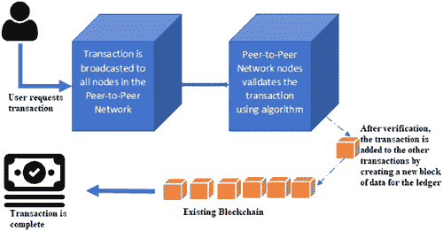
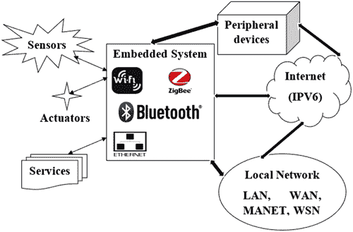

# 第十一章

# 用于保护物联网（IoT）应用的区块链

Pramod Mathew Jacob 和 Prasanna Mani

目录

11.1 区块链概念

11.1.1 物联网

11.2 在物联网中整合区块链

11.3 使用区块链的安全物联网应用

11.4 集成区块链与物联网的挑战

11.5 在物联网中使用区块链的优势

11.6 与物联网和区块链相关的作品

11.7 总结

参考文献

## 11.1 区块链概念

区块链是一种有趣的技术，它为数字交易提供了一种安全的方式。它像一个“分布式账本”，以安全、可审计、高效和透明的方式记录每一笔交易。这个概念是新的，并在各种商业领域有许多应用和相关性。区块链本质上是一个数据库系统，它包含一个不断增长的分布式数据记录集。每一笔交易都是通过数字验证和签名来确保其真实性的。没有主服务器持有整个链。所有参与计算机（节点）都拥有交易链的一个副本。图 11.1 描述了典型区块链架构的工作原理 [1].

图 11.1 区块链技术工作原理的说明。

区块链由两个元素组成：

+   交易：分布式系统中参与者执行的任何操作。

+   区块：这个元素按顺序记录所有交易，并确保它们没有被篡改。这通过为所有交易添加到链中的时间和地点时间戳来确保的。

当交易编辑请求或新交易进入区块链时，大多数参与区块链实现的节点都会运行算法来验证和评估每个考虑的区块链块的历史。如果大多数参与节点认为历史和数字签名是有效的，新的交易块将被接受到分布式账本中，并在交易链上添加一个新的块。如果大多数参与节点认为数字签名不真实，那么更改请求或添加请求将被拒绝并丢弃。因此，这种分布式共识模型允许区块链充当分布式账本，不需要某些中央权威机构来验证记录或交易。

区块链技术的三个关键属性是

+   去中心化

+   不变性

+   透明度

在过去的日子里，有一个中心化系统可能会监控和记录系统中的所有交易。任何变化都可以由中心协调员发起。但是，在中心化系统工作的人可以在其他客户端不知情的情况下篡改各种交易的数据。这在金融组织的情况下可能会导致严重问题。区块链通过提供一个去中心化系统克服了这一缺点，在该系统中，交易链分布在参与其中的客户端或节点之间。每当一个节点或客户端尝试修改数据时，它会通知所有参与该系统的其他客户端。因此，在没有获得大多数参与客户端的同意的情况下，无法在区块链内篡改数据。因此，去中心化成为区块链技术的关键属性。

“透明度”这一属性对于区块链技术来说有些令人困惑，因为它被认为是一个安全的系统。当然，该系统是安全的，所有交易和参与客户的详细信息都以加密形式存储。但即使有任何客户尝试访问或修改交易，所有参与客户都将被警告，从而实现透明度。

区块链中的不可变性是一种确保一旦数据被添加到系统中，就无法对其进行篡改的属性。这是区块链与其他类似技术（如比特币和中心化系统）相比的独特属性之一。区块链通过使用某些加密哈希函数来实现不可变性。区块链可以被看作是一个包含数据和哈希指针的链表。哈希指针指向其前一个块，从而生成一个块链。哈希指针与链表中的指针类似，但不同于仅仅持有前一个块的地址，它还持有链中前一个块内数据的哈希值。

区块链网络只是一个相互连接的节点的集合。区块链通过点对点网络架构来维护。在点对点模型中，没有单一的中心服务器。网络中参与的每个系统具有平等的优先级。每个系统可以与其他系统进行通信。在不同的实例中，同一个系统可以同时充当客户端和服务器。因此，将会有多个分布式和去中心化的服务器。尽管系统使用点对点模型，但不会存在单点故障。

区块链中的一个节点可以按照以下方式分类：

+   轻客户端：拥有区块链的浅层复制的计算机系统。

+   全节点：拥有区块链完整复本的计算机系统。

+   挖矿：验证交易的计算机系统。

区块链技术的各种应用领域包括

+   智能合约

+   众筹

+   供应链审计

+   预测市场

+   文件存储

+   物联网（IoT）

+   身份管理

+   保护知识产权

+   反洗钱（AML）

+   土地登记

+   股市

本章进一步关注区块链技术在物联网（IoT）系统中的应用和范围。

### 11.1.1 物联网

互联网在信息技术领域带来了巨大的变革，使通信变得更加便捷。随着全世界都在使用更智能、更先进的设备，技术专家提出了“物联网”这一概念。物联网是一个由分布在不同位置的设备、传感器和执行器组成的网络[2]。设备之间的连接可以是有线或无线的。网络中的每个设备都应该有一个唯一的地址。由于 IPv6 协议能够地址多达数百万个不同的设备，因此通常用于此。物联网的典型架构如图 11.2 所示。

图 11.2 物联网典型架构。

它基本上是由互联的设备和嵌入式物理组件组成的集合。物理系统可能包括微处理器或微控制器。Arduino、Intel Galeleo 和 Raspberry PI 板等就是这样的例子[3]。部署了各种传感器来收集实时数据。这些获取的数据被送至中心协调设备，该设备相应地处理数据并使用连接的执行器发起适当的动作。

物联网既使用硬件也使用软件。除了硬件架构外，它还使用一系列软件架构模式。物联网应用的各种标准化软件架构模式包括客户端服务器、对等对等、表现层状态转移（REST）和发布-订阅。不同物联网应用的模式选择主要基于异质性和安全性[4]。

物联网在数字世界中与人们的喜好密切相关，人们喜欢远程控制所有的对象和事物。尽管设备的性质是异构的，但对于设计师来说，为特定领域建模一个物联网系统是一项艰巨的任务。设计基于物联网的系统的各种挑战如下：

+   异构设备之间的兼容性和互操作性

+   设备标识和认证缺乏标准化

+   将物联网应用程序与物联网平台集成困难

+   处理非结构化、无格式数据困难

+   确保设备之间的可靠连接

+   信息安全与隐私问题

物联网系统中的一个关键挑战是确保隐私和数据安全。许多物联网应用（如患者健康监测、结构健康监测（建筑物、大坝等）、天气预报、制造和发电厂）处理高度敏感的数据。对于物联网开发者来说，确保这些收集数据的隐私和安全性是一项风险工作。区块链在这种情况下可以发挥很大的作用。在本章的下一节中，我们讨论了区块链技术在物联网应用中的整合。

## 11.2 在物联网中整合区块链

物联网（IoT）正在改变和高效优化从各种实时系统中获取的大量数据的手动过程。这些收集的数据相应地进行处理，提取所需的信息以得出结论。这种模型用于天气预报、股市预测、智能农业、患者健康监测等。云计算的概念为物联网系统提供了各种功能，如数据分析和数据处理。物联网前所未有的发展为新的机制访问和共享信息铺平了道路。但是，由于物联网系统的透明性，最终用户缺乏通过物联网系统分享敏感信息的信心。大多数物联网应用中使用集中式架构，其中网络参与者对通过网络共享的数据没有清晰的认识。共享的信息可能看起来像一个黑盒，用户不知道数据的真实性和来源。下一节讨论了物联网中区块链的需求。

由于物联网网络的分布式特性，每个节点都可能是失败的可能点，这可能被网络攻击者利用（例如分布式拒绝服务攻击）。具有多个同时工作的感染设备的一类节点可能会导致系统崩溃。另一个关键问题是物联网环境中的中心云服务提供商的存在。此中心节点任何故障都可能导致脆弱性，应予以解决。最 critical 的问题之一是数据认证和保密性。物联网设备缺乏数据安全可能会被利用，可能会被不当使用。由于现代商业模式的干预，系统可以自主共享或交换数据/资源，因此对数据安全的需求是关键的。

物联网面临的另一个关键挑战是数据完整性，这在决策支持系统（DSS）领域中已有一些应用。从传感器收集的数据可用于生成及时的指令或决策。因此，保护系统免受注入攻击至关重要，在这些攻击中，攻击者将虚假的测量或值注入系统，这可能会严重影响准确的决策制定。系统的可用性对应用领域至关重要，

制造工厂、自动化车辆网络和智能电网等领域，这些领域的实时数据需要持续监控。在特定时间段内数据丢失可能导致整个系统失败。向公共审计跟踪公开验证的安全措施的整合将对这些系统有益。这可以通过区块链的整合轻松实现。

将物联网、云计算和区块链等各种技术整合到单一系统中的做法已经证明是无与伦比的，因为它确保了性能和安全。在物联网系统中实施区块链的概念是一项革命性的步骤，因为它提供了可信的数据共享服务，其中数据是可靠和可追溯的 [5]。数据的生成源头可以在任何阶段被追踪出来，同时数据保持不可变。

在智慧城市和基于 AI 的智能汽车等领域，可靠的数据需要共享以纳入系统中的新节点（参与者），从而提高服务效率。因此，区块链的实施可以补充物联网（IoT）应用，提高可靠性并增强安全性。虽然借助区块链可以改进 IoT 的功能，但仍有许多需要解决的研究限制和问题。

## 11.3 使用区块链的安全物联网应用

以下是将区块链技术与物联网（IoT）结合在一起的各种应用领域。

+   供应链和物流：供应链网络系统涉及原材料供应商、经纪人、零售商等不同利益相关者。此外，它还涉及多份付款收据和发票。供应链的持续时间可能超过数月。由于存在多个利益相关者，交付延迟将是一个严重挑战。因此，公司正在使用 IoT 支持的车辆来跟踪实时位置和运输过程。尽管当前的供应链管理系统缺乏透明度和数据安全性，但可以通过整合区块链来提高网络的可追溯性和可靠性。通过传感器收集的信息随后存储在区块链上。各种 IoT 传感器，如 PIR 运动传感器、GPS 追踪器、RFID 芯片和温度传感器，从物流车辆/物流中收集信息，并提供关于货物状态的准确详细信息。传感器信息存储在区块链上，所有新动作都记录为交易。因此，利益相关者无法篡改或修改数据，这使得供应链系统变得透明且值得信赖。

+   智能家居：大多数智能家居应用，如入侵检测系统、房间 authentic 访问、远程控制设备和系统，都需要个人详细信息，如生物识别、面部识别、声音识别等。所有这些存储在典型集中式数据存储中的数据都容易受到安全威胁。这可以通过使用区块链概念来解决。

+   汽车行业：汽车行业开始使用物联网概念进行智能停车，在停车位使用某种电子钱包或比特币货币。在特定车位停车的车辆时间自动估计，并从电子钱包远程扣除大致费用。在这个过程中集成区块链技术可能会增强最终用户的信任。

+   制药行业：制药行业假药问题急剧增加。制药公司负责全球范围内的药品制造、开发和分销。因此，跟踪药物的整个运输过程并非易事。区块链技术的可追溯性和透明性特征可用于远程监控药物从起源到目的地的运输。存储在分布式账本中的数据由各方进行时间戳标记并记录。

+   农业：在这里，农民在农田中部署各种传感器。传感器获取的数据由农民、买家等监控。所有数据都表示为一个区块，并分布在农民、买家和消费者之间。通过监控数据，农民可以采取合适措施提高产量，而供应商和消费者可以根据数据分析决定是否购买该作物。

    除了这些领域，集成的物联网-区块链系统还应用于股票市场、土地注册过程、收费站在线车辆跟踪和管理等。下一节将讨论实施这些概念所涉及的各种挑战。

## 11.4 集成区块链和物联网的挑战

+   资源限制：大多数可用的物联网平台具有有限的计算和通信资源。区块链系统需要过多的内存和存储资源才能高效执行。具有有限内存的低功耗物联网设备无法承受需要 GB 级内存的重型区块链技术。

+   带宽需求：区块链平台必须持续与其他参与者进行共识过程交互。由于共识过程的分布式模式，链网络中的平台可能交换有关区块链的信息以进行验证和创建新节点。物联网架构中的端设备通常具有有限的带宽。因此，在端设备层进行此类处理并不容易，这可能使区块链实施变得困难。

+   安全性：虽然区块链处理去中心化架构，但物联网系统中的所有设备可能通过预定义的协议进行通信和协调。因此，对于物联网设备来说，持续参与区块链是非常重要的，这可能会使设备面临安全问题和威胁。

+   延迟需求：物联网应用主要包括一组数据生产者和消费者。在某些情况下，数据消费者可能会发起一些行动。区块链技术的引入可能会限制数据消费者发起此类行动的自由，尽管这可能被视为对区块链系统的一种篡改。因此，它不适用于对时间敏感的物联网应用。

## 11.5 物联网中使用区块链的优势

+   智能设备与第三方之间的信任得到增强和保证。

+   对工业和商业应用更为经济。

+   交易结算时间框架可以缩短。

+   提高了数据一致性。

+   提高了网络安全。

## 11.6 物联网与区块链相关的作品

已经有很多研究者利用区块链在物联网中的优势。确保物联网设备之间交换的数据安全是一个关键挑战，所有物联网服务提供商都必须面对。尽管存在各种安全措施，但物联网需要一个轻量级的安全模型以确保数据完整性和安全性。

金等人在[6]中为家庭和企业应用中使用的物联网设备提出了一个分类。他们对分布式物联网架构中分享的数据进行了加密，并使用智能合约确保数据完整性。他们用家庭自动化系统验证了他们的系统。他们的实验结果证明，借助区块链，可以避免各种安全威胁，如中间人攻击、数据盗窃等。

法克瑞等人在[7]中提出了一个带有和不带区块链技术的智能冰箱系统的比较模型。他们发起了明确的嗅探攻击来证明他们模型的有效性。实验结果声称，在物联网系统中，区块链优于传统的安全措施。他们观察到了加密算法的雪崩效应和所使用的哈希函数。MQTT 被用作没有物联网的应用的软件模式。

奥斯卡·诺沃[8]提出了一种在物联网中融入区块链的详细清晰实现。这个轻量级、透明且可扩展的模型在利用区块链的优点方面引入了一种新的访问控制策略。在物联网中引入了一个名为管理枢纽的节点，用于存储各种分布式智能合约信息。他们借助以太坊（目前最流行的区块链平台之一）实现了他们的模型。

Pin 等人[9]提出了一种基于区块链的发布-订阅物联网模型。这个模型主要关注的是集中式物联网系统，所有数据都存储在一个单一的点上。这种节点的故障可能导致整个系统失败。使用区块链技术可以确保这种系统的数据完整性。他们实现了一个轻量级的、基于原语密钥的安全算法。他们使用以太坊平台验证了他们的模型。

Viriyasitavat 等人[10]提出了一种基于区块链的物联网服务处理操作模型。他们的模型声称，区块链可以用于实现各种服务的互操作性。他们将面向服务的架构（SoA）、区块链技术（BCT）和各种关键性能指标（KPI）整合在一起，解决了物联网系统中的信任问题和互操作性挑战。

Doku 等人[11]提出了 Lightchain，这是一个专为物联网设计的区块链架构。最初使用工作量证明（PoW）机制来验证交易。但是解决 PoW 谜题所需的计算任务和努力巨大，这对于像物联网这样的轻量级架构来说是不可接受的。PoW 谜题解决的努力分布在物联网系统的各个节点之间。因此，每个单一节点的开销可以大幅减少，这将提高整个系统的性能和安全。

Pan 等人[12]提出了 Edgechain，这是一种基于边缘计算的物联网架构，融入了区块链技术。物联网架构的中心节点被排除在区块链技术的计算开销之外。所有这些操作都在基于边缘的云池中执行，使得架构轻量级。因此，它可以确保数据安全、完整性、可扩展性、互操作性以及提高性能等方面。

## 11.7 总结

区块链是一项确保终端用户数据安全和可信度的有前景的技术。尽管物联网在人类生活的几乎所有方面都有所融入，但个人数据的安全是每个终端用户最关心的问题。尽管物联网采用了轻量级架构，但要用强大的安全算法来防止数据窃取并非易事。在这种情境下，区块链通过提供轻量级的去中心化分布式架构来保障数据安全，拯救了物联网应用。边缘链和轻链的实施证明，区块链和物联网在未来计算机技术的几年里可以走得很远。

## 参考文献

1.  1。Blockgeeks。在线。2019 年 5 月。[`blockgeeks.com/guides/what-is-blockchain-technology/`](https://blockgeeks.com)。

1.  2. Vijay Madisetti, Arshdeep Bahga, 物联网: 实践方法. 大学出版社, 第一版, 2015 年。

1.  3. Prasanna Mani, Pramod Mathew Jacob, “测试物联网应用程序的参考模型,” 工程、科学和技术杂志(JESTEC), 第 13 卷, 第 8 期, 第 2504-2519 页, 2018 年。

1.  4. Prasanna Mani, Pramod Mathew Jacob, “物联网系统软件架构模式选择模型,” IET 软件, 第 12 卷, 第 5 期, 第 390-396 页, 2018 年 10 月。

1.  5. Cristian Martín, Jaime Chen, Enrique Soler, Manuel Díaz, Ana Reyna, “关于区块链及其与物联网的集成. 挑战与机遇,” 未来计算机系统, 第 88 卷, 第 173-190 页, 2018 年 11 月。

1.  6. Singh, Singh, Kim, “区块链：保护物联网数据的游戏规则改变者,” 在 2018 年 IEEE 物联网世界论坛(WF-IoT)上发表, 新加坡, 第 51-55 页, 2018 年。

1.  7. Fakhri, Mutijarsa, “使用区块链技术的物联网安全通信,” 在 2018 年国际电子与智能设备研讨会(ISESD)上发表, 班东, 第 1-6 页, 2018 年。

1.  8. O. Novo, “区块链遇见物联网:物联网可扩展访问管理的架构,” IEEE 物联网期刊, 第 5 卷, 第 2 期, 第 1184-1195 页, 2018 年 4 月。

1.  9. 王立, 朱慧, 邓伟, 古丽, 吕鹏, “面向物联网的隐私保护发布/订阅模型,” IEEE Access, 第 7 卷, 第 41309-41314 页, 2019 年。

1.  10. 许大旭, 毕志, Sapsomboon, Viriyasitavat, “物联网服务互操作性的新型基于区块链的架构,” IEEE 计算社会系统 Transaction, 第 6 卷, 第 4 期, 第 739-748 页, 2019 年 8 月。

1.  11. D. B. Rawat, M. Garuba, L. Njilla, R. Doku, “LightChain:物联网的轻量级区块链,” 在 2019 年 IEEE 智能计算国际会议(SMARTCOMP)上发表, 美国华盛顿特区, 第 444-448 页, 2019 年。

1.  12. 王, Hester, Alqerm, 刘, 赵, 潘, “EdgeChain:基于区块链和智能合约的边缘物联网框架和原型,” IEEE 物联网期刊, 第 6 卷, 第 3 期, 第 4719-4732 页, 2019 年 6 月。
