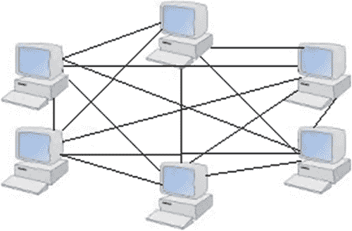
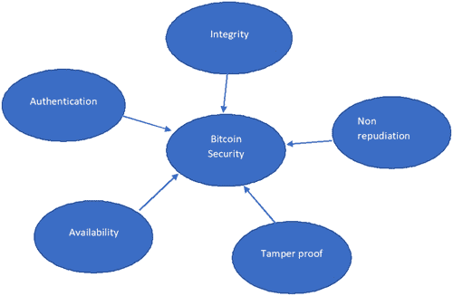
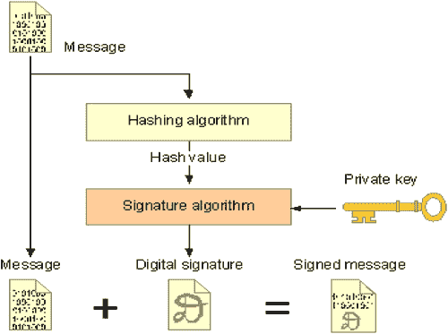
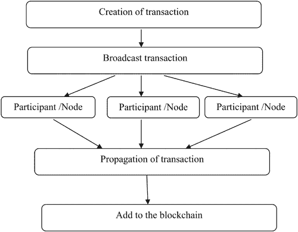
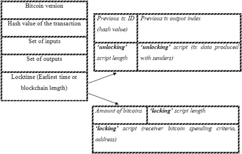
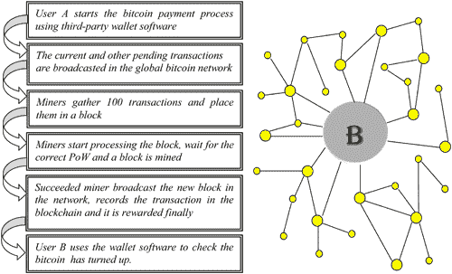
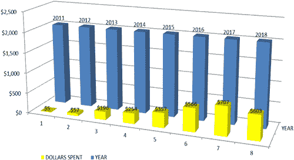
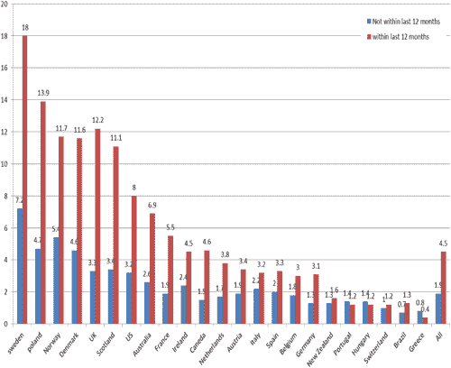
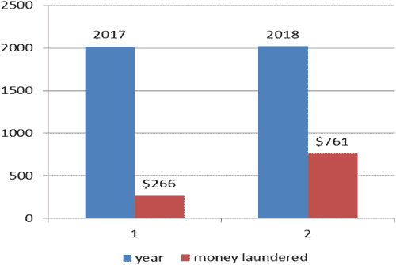

# 第十二章

# 比特币与犯罪

M. Vivek Anand, T. Poongodi, and Kavita Saini

目录

12.1 引言

12.1.1 背景

12.1.2 比特币的介绍

12.1.3 比特币特性

12.1.4 区块链与比特币

12.1.5 比特币安全

12.1.6 比特币交易

12.1.7 交易生命周期

12.1.8 比特币架构概述

12.1.8.1 添加新块的程序

12.2 共识协议

12.3 对等网络

12.4 比特币在犯罪中的角色

12.4.1 比特币交易所

12.4.2 勒索软件

12.4.3 逃税

12.5 比特币犯罪的阴暗面

12.5.1 暗网

12.5.2 Tor 浏览器

12.5.3 洗钱

12.5.4 诈骗和假冒

12.6 比特币犯罪面临的开放挑战

12.6.1 执法和刑事策略

12.7 结论

参考文献](chapter12.xhtml#b-9781000175257-bib11)

## 12.1 引言

互联网是一个大数据仓库，内容巨大，浏览器提供从互联网检索数据的服务。尽管互联网上的数据很大，但大多数浏览器检索的数据都被最小化了。只有 5%的数据是从索引的互联网上检索的。即使像 Google 这样的搜索引擎拥有大量的数据，也无法检索所有数据，因为它们没有被索引。从互联网检索的信息被索引，称为表面网络。剩余的 95%[7]的网络称为深网。深网中 4%的机密信息称为暗网。深网包含像银行详情、Facebook 私人详情等机密数据，不应被全世界所有人看到。犯罪分子使用比特币作为交易货币，访问暗网进行犯罪活动。I2P（不可见互联网项目）、Freenet 和 Tor 浏览器提供了无法通过普通浏览器访问的暗网入口。I2P、Freenet 和 Tor 浏览器并非为恶意访问而创建。它是为了提供匿名性并保护互联网上的私人数据而创建的。匿名性通过在互联网上隐藏用户身份来保护数据免受互联网侵害，但这导致了犯罪活动。Tor 浏览器用于匿名性，也称为洋葱路由。

### 12.1.1 背景

美国海军研究实验室在 1998 年开发了一种洋葱路由技术。2002 年 9 月 20 日，Tor 浏览器公开发布，供互联网使用。使用像 Google 这样的普通浏览器时，请求的数据会被发送到互联网服务提供商和域名系统，在那里它会与 IP 地址进行验证。互联网上的每个网站地址都有一个 IP 地址来访问网站。域名系统提供服务，将网站地址转换为 IP 地址，并将 IP 地址转换为网站地址。

Tor 浏览器提供匿名性[19]，因为搜索详情不会被互联网服务提供商所知。互联网服务提供商只知道哪个浏览器正在访问，但不知道访问了什么内容。Tor 浏览器通过已经连接在 Tor 网络中的节点传输数据。网络节点中的数据传输会经过不同的地方，因为节点遍布全世界。Tor 浏览器通过 https 插件服务提供加密数据，因为 http 不是加密的。尽管洋葱路由提供了匿名性和保护私人数据，但由于匿名性，犯罪活动有所增加。犯罪分子使用 Tor 浏览器进行非法活动，如买卖枪支、毒品等。Hitman Network 是一个用于犯罪活动的网站，如用货币交换买卖毒品。这些有货币交换的犯罪活动会在通过银行转账时给犯罪分子带来问题。犯罪分子使用加密货币进行交易以保持匿名。加密货币有一个加密机制来保护资金免受黑客攻击。比特币是第一个与区块链网络一起工作的加密货币。比特币区块链是一个分布式账本，拥有所有的交易详情。加密货币网络在没有银行等第三方的情况下进行交易。比特币是由中本聪创建的，他是进入区块链网络的第一个男人。在银行交易中，交易银行将充当可信的第三方，并管理网络上的所有交易。对可信第三方的依赖对于银行交易是必要的。如果发生银行抢劫或银行数据库被黑客攻击。这将导致无法控制的情况。为了避免第三方信任，加密货币应运而生。

### 12.1.2 比特币的介绍

加密货币是由中本聪在 2008 年[1]提出的，并在 2009 年作为开源软件推出，它是一组形成数字货币或加密货币的技术集合。这种加密货币的单位被称为比特币。比特币运用区块链的概念来避免交易中的双重支付问题[2]。它被用来在比特币网络的所有参与者之间存储和传输价值。它是一种点对点技术，不受任何中央机构或银行的控制。与传统货币不同，比特币完全是安全和虚拟的。没有可用的实体硬币，而是一种完全的虚拟货币。该系统由比特币协议运行，并且基于数学，与基于固定数量或法定货币的传统货币不同。

### 12.1.3 比特币特性

比特币有几个与法定货币不同的特性：

+   由中本聪于 2008 年发布。

+   它是一种去中心化和分布式的安全数字货币。

+   设置起来非常简单且速度快。

+   它具有匿名性且完全透明。

+   交易是不可逆的。

+   为所有参与者维护分布式事务日志。

比特币协议的基础是一个点对点系统(图 12.1)，这意味着不需要第三方。因此，它不由中央权威控制，而是由任何人都可以加入的社区人民创建。

图 12.1 对等网络。

比特币协议在巨大的总账（区块链）版本中存储了网络中发生的每一个交易的详细信息。比特币存储在带有您比特币持有量的数字凭证的钱包中，允许您访问它们。钱包使用公钥加密，生成两个密钥，一个公钥和一个私钥。公钥可以被看作是账户号码或名称；私钥是所有权凭证。

当下一个所有者提供一个公钥，并且前一个所有者使用他的私钥将一条记录发布到系统，宣布所有权已经转移到新的公钥时，比特币被转让给下一个所有者。与通过银行的交易不同，比特币在国家或国际层面的任何转移都不收取费用[9]。比特币通过验证添加到区块链的每个交易，确保交易的输入之前没有被花费，从而防止双重花费[11]。

### 12.1.4 区块链与比特币

区块链是比特币背后的技术。比特币是数字代币，而区块链是跟踪谁拥有数字代币的账本。没有区块链就无法拥有比特币，但可以有区块链而没有比特币。其他著名的加密货币有以太坊[13, 14], 比特币现金，Ripple 和 Litecoin。

### 12.1.5 比特币安全

图 12.2 展示了比特币安全的表示。比特币的最大挑战[5]是检查认证、完整性、可用性和机密性。所有这些挑战都得到了非常顺利的处理。

图 12.2 比特币安全。

+   认证：公钥加密：数字签名

+   完整性：数字签名和加密哈希

+   可用性：向 P2P 网络广播消息，机密性：伪匿名

它基于公钥加密(图 12.3):加密使用公钥和私钥。公钥加密或数字签名用于确保其安全性。首先，使用密码学散列创建一个消息摘要，然后，用你的私钥加密消息摘要。

图 12.3 公钥加密。

### 12.1.6 比特币交易

比特币系统最重要的部分是交易。交易基本上是编码了比特币系统参与者之间价值转移的数据结构[8]。确保交易可以在网络上创建和传播。一旦在网络上传播，它们在验证后会被添加到全局交易账本（区块链）中。

### 12.1.7 交易生命周期

交易生命周期中涉及各种活动(图 12.4)，从源头开始，直到记录在区块链上。源头基本上就是交易的创建。一旦创建，它必须被签名并授权使用交易引用的资金。一旦交易被授权，它就会被传播到网络上以供验证。最后，交易会被挖矿节点验证，并包括在一个记录在区块链上的交易区块中。

图 12.4 交易生命周期。

+   交易创建

+   在网络上传播

+   由多个节点验证交易

+   传播

+   添加到区块链

交易的创建包括输入、输出、签名和金额。

在网络上传播指的是将交易发送到相邻节点。

验证交易在阶段中扮演着非常重要的角色，因为许多节点或参与者在这一阶段验证交易。

如果交易有效，它将被添加到区块链并传播到整个网络

比特币交易将通过发送电子支付来完成。交易是区块链系统的微小构建块[图 12.5]，它们包括发送者地址、接收者地址和硬币，就像正常的信用卡交易一样。比特币交易将硬币从一名用户的钱包转移到另一个，硬币被视为交易，特别是交易链。目的地地址（比特币地址）是通过使用用户公钥执行哈希操作获得的。比特币中的每个用户都可以通过生成多个公钥拥有多个地址；这些地址可以与用户的钱包相关联。拥有的比特币可以通过使用用户私钥作为数字签名传输。此外，强烈建议为每个交易使用不同的比特币地址。

图 12.5 比特币交易字段。

比特币交易[图 12.6]将由称为“矿工”的一组网络节点验证正确性、完整性和真实性。矿工会将一些交易作为单个单元收集起来，称为“区块”，这些区块正在等待处理。在完成验证和挖掘过程后，区块将在整个网络中广播，以声称奖励。在将新挖掘的区块更新到公共账本之前，它将得到网络中大多数矿工的验证。矿工一旦成功将区块添加到区块链中，就会获得奖励。本文介绍了比特币系统中技术组件的重要特性。

图 12.6 比特币交易。

交易输入包括：

1.  1. 哈希指针（即包含输出的标识符）到作为当前交易输入的先前交易。

1.  2. 指定可用于当前交易的未发送先前交易输出（UTXO）的索引。

1.  3. 解锁脚本长度。

1.  4. 解锁脚本（满足与 UTXO 相关的条件）。

交易输出包括：

1.  1. 正在转让的比特币数量。

1.  2. 锁定脚本长度。

1.  3. 锁定脚本（在花费 UTXO 之前应满足的条件）。

每个交易输入可以使用相应用户的公钥进行授权，并且使用私钥创建加密签名。在单个交易中列出的先前交易的所有输入值可以相加，并将总和用于当前交易的输出。在比特币中，先前交易的输出作为当前交易的输入被利用；通常，币值可能高于用户希望支付的金额。在这种情况下，发送者会为找回差额创建一个新的比特币地址。例如，用户 B 从任何先前交易的输出中获得 100 个硬币，并希望将 10 个硬币通过相同的输出作为当前交易的输入转让给用户 A。特别地，用户 B 必须生成一个新的交易，具有一个输入（即用户 B 获得 10 个硬币的输出）和两个额外的输出。在输出中，一个显示有 10 个硬币正在转让给用户 A，另一个显示将用户 B 拥有的任何一个钱包中剩余的硬币转让出去。

因此，比特币实现了两个目标：

1.  1. 它采用了变化的理念。

1.  2. 通过了解先前交易的输出，可以确定用户余额或未花费的硬币的详细信息。

交易中的每个输出表示传输的硬币数量以及新所有者的比特币地址。比特币中的输入和输出使用脚本语言处理以声明比特币。目前市场上主要有两种脚本：

1.  1. Pay-to-PubKeyHash (P2PKH)：在此脚本语言中，只需要所有者的一个签名即可授权支付。

1.  2. Pay-to-ScriptHash (P2SH)：此方案使用多签名地址；然而它支持多种交易类型。

### 12.1.8 比特币架构概述

区块链是一个不可变的数据库，其中所有比特币交易记录按时间顺序存储。由于每个区块创建中都使用了哈希技术，因此无法篡改数据。区块链中的计算机系统相互连接，遵守共享数据并同意对其施加某些条件。最初，比特币被实现为一个大规模的区块链。如今，与其它区块链相比，比特币的区块链是“简单”的。不同区块链项目的想法正在迅速增长。然而，比特币的架构组件包括数字签名、区块链、分布式网络和挖矿[12]。数字签名是一种由用户私钥创建的非对称加密技术，以确保相应的比特币地址。由于数字签名是加密技术的一种分类，比特币也被称为加密货币。

区块链是一个去中心化、共享、分布式的状态机，区块链中的所有节点都会独立持有自己的副本。当前已知的“状态”取决于每个交易的处理。比特币是一个去中心化的电子支付系统，节点通过 P2P 网络进行通信。它使用一种概率性的分布式共识协议来实现通信节点之间的共识。在中心银行中维护一个集中式私有账本，以验证流程并记录所有交易，而在比特币中，每个用户都会在区块链中维护自己的账本副本。由于网络中许多节点维护区块链的多个副本，这为区块链系统提供了全局视图，从而产生了漏洞。例如，用户 A 可以同时使用相同的货币集合创建两笔不同的交易，分别发送给用户 B 和用户 C。这种恶意行为被称为双重支付[2]。在这种情况下，如果两个接收者独立处理交易，并且交易验证过程成功，会导致状态不一致。比特币使用共识协议和工作量证明（PoW）来满足以下要求：

1.  1. 交易验证过程可以分散给矿工，以确保交易的正确性。

1.  2. 成功处理的交易应迅速传达给网络中的每一个人，以确保区块链的一致状态。

每一个分布式交易过程都会检查大多数矿工[4]是否验证了其真实性，然后才能将交易添加到区块链中。如果区块链有任何更新，所有节点维护的本地副本都将得到更新；通过考虑大多数矿工的共识，达到正确的状态。然而，这个系统仍然容易受到 Sybil 攻击。在这种攻击中，矿工可以创建多个虚拟节点，这些节点将开始在网络上发送虚假信息，作为对错误交易的正面投票，以中断选举过程。比特币对抗 Sybil 攻击的应对措施是使用基于共识模型的 PoW；矿工必须完成一些计算任务，以证明他们是真实实体。PoW 为每个交易验证过程施加了高水平的计算成本，验证基于矿工的计算能力。在网络上进行 Sybil 攻击比伪造计算机资源更困难。

一个区块是通过收集待处理的交易而不是单独挖矿交易来创建的。区块是通过计算带有可变 nonce 的哈希值来挖矿的。每次都尝试不同的 nonce 值，直到哈希值小于或等于目标值。目标被当作一个共享给所有矿工的 256 位数字。计算所需的哈希值非常具有挑战性。比特币使用 SHA-256 来计算哈希值。每次都使用不同的 nonces（随机值）来寻找所需的哈希值，直到找到解决方案。矿工为区块找到了正确的哈希值，区块立即带着计算出的哈希值和 nonce 广播到网络上。剩余的矿工迅速通过将接收到的区块的哈希值与目标值进行比较来验证接收到的区块的正确性。他们会通过附加新挖出的区块来更新本地的区块链。

当大多数矿工同意区块有效时，区块将被成功添加到区块链中。解决 PoW 问题的矿工[5]将获得一套新近生成的硬币作为奖励。由于没有中央权威，奖励不会到达网络中的任何人。相反，奖励将在生成区块的过程中给予，矿工在比特币地址中插入 coinbase 交易，它似乎是每个区块中的第一个交易。一旦挖出的区块得到同伴的批准，那么新插入的交易就变得有效，矿工获得了奖励的比特币。

比特币网络通常为其交易不收取交易费，这笔费用仅由交易所有者提及，且每个交易的费用都不同。然而，交易费用在一定程度上正在增加，这抑制了比特币的使用。如果比特币区块奖励不存在，可能会发生的比特币安全问题被研究 [17]。

区块链是一种公共的、基于链表的数据结构，它以块的形式追踪整个交易历史。每个块中存储交易时，都遵循 Merkle 树结构 [6]，以及前一次交易的 secure 时间戳和哈希值。

#### 12.1.8.1 添加新块的流程

1.  1. 一旦矿工确定了块的有效哈希值，该块就可以添加到用户的本地区块链中，并且解决方案可以被广播。

1.  2. 如果为一个有效块接收到一个解决方案，矿工将立即验证其有效性，如果解决方案被证实正确，矿工将更新其本地副本；否则，丢弃该块。

对于挖矿，单个家庭矿工会使用专门的 Application-Specific Integrated Circuit（ASIC）。单个块的验证需要时间，因此，为了这个原因，出现了挖矿池。在这里，一组矿工可以联合起来，在池管理员的控制下挖掘一个特定的块。一旦挖矿成功，经理将根据每个矿工投入的资源数量，向关联的矿工发放奖励。

## 12.2 共识协议

为了确保没有中断地提供连续服务，具有容错能力的共识协议是必不可少的，以确保参与节点对顺序达成一致。共识协议中提到的规则应该被矿工遵循以在区块链中添加新块。比特币基于 PoW 和共识算法获得分布式共识。此算法中遵循的主要规则如下：

1.  1. 理性的输入和输出。

1.  2. 未使用的输出只能在每笔交易中使用一次。

1.  3. 已使用的输入应具有有效的签名。

1.  4. 在 100 个区块内，没有使用矿工创建的 coinbase（交易输出）。

1.  5. 在区块确认之前，没有交易输入在锁定时间内被使用。

因此，基于区块链的比特币由于其共识模型而被认为是强大和安全的。

微支付通道网络已经推出，通过保持区块大小不变来解决可扩展性问题。在此，双方之间建立支付通道，可以为未记录在区块链上的其他人支付。这种离线支付模式有助于加快支付处理，并提出了一种跟踪两个实体之间资金转移的方法。然而，这些支付通道网络面临一组关于用户隐私 [18, 21]、并发支付处理和路由的挑战。

## 12.3 对等网络

比特币系统遵循一种无结构的点对点(P2P)网络的通信结构，使用非加密的持久 TCP 连接。在无结构的 P2P 网络中，节点以扁平或层次化的方式随机排列。生存时间(TTL)搜索、扩散环、随机游走等技术用于寻找拥有有趣数据项的节点。通常，这种无结构的覆盖网络是一种高度动态的网络拓扑，其中的节点可以频繁地加入和离开网络。这种类型的网络最适合比特币系统，以便尽快在区块链上传播信息，以达到共识。阴影事件离散仿真器有助于在单机上模拟大规模比特币网络。

## 12.4 比特币在犯罪中的作用

区块链网络的伪匿名性允许犯罪分子用比特币进行非法活动。比特币提供隐藏身份的功能，比特币在犯罪中起着重要作用。犯罪分子因比特币的匿名性而进行交易。尽管区块链通过其共识算法提供安全的交易，但犯罪分子通过比特币进行犯罪活动 [3]。犯罪分子使用网站通过比特币交易出售毒品和枪支。各种犯罪活动都是通过比特币交易进行的。大多数国家不接受比特币交易，因为通过比特币交易进行犯罪活动，这将使政府对采取行动对付犯罪活动成为一个问题。

### 12.4.1 比特币兑换

比特币为将黑钱洗白提供了空间。比特币兑换者用于货币兑换。一些流行的比特币兑换者包括：

1.  1. Binance

1.  2. Bittrex

1.  3. KuCoin

1.  4. Huobi Pro

1.  5. Bibox

1.  6. Poloniex

1.  7. Bitmex

1.  8. GDAX

1.  9. LocalBitcoins

1.  10. Kraken

1.  11. Bitstamp

比特币兑换网站也用于货币兑换。一些网站包括：

1.  1. Cex.io

1.  2. CoinMama

1.  3. Wirex

1.  4. Bitit

### 12.4.2 勒索软件

计算机病毒会感染并锁定的电脑、服务器或移动设备，攻击者要求支付赎金以恢复对设备的控制。2017 年 5 月的 WannaCry 勒索软件攻击，是由 WannaCry 勒索软件密码蠕虫发起的全球性网络攻击，该密码蠕虫针对运行微软 Windows 操作系统的电脑，通过加密数据并要求以比特币加密货币支付赎金。这类勒索软件攻击每年都在发生，例如：

+   2015 年，每天有 1000 名攻击者。

+   2016 年，每天有 4000 名攻击者（与 2015 年相比增长了 300%）。

+   2017 年，Wannacry 勒索软件攻击锁定了 150 个国家 30 万家企业和政府电脑上的文件，要求以 300 美元的比特币解冻数据。

比特币的匿名性让用户可以隐藏他们的面部，找到他们并非易事。与美元等法定货币相比，当我们使用银行等中心化权威机构进行交易时，它很容易被追踪，但比特币运作在区块链的概念之下，不依赖于任何像银行这样的中心化权威机构。比特币提供了一个去中心化的网络，其中没有人能控制他们的钱。用户可以控制自己的钱，而且追踪交易并非易事，因为账本只有地址作为公钥，就像

1.  1. 1BvBMSEYstWetqTFn5Au4m4GFg7xJaNVN2

1.  2. 3J98t1WpEZ73CNmQviecrnyiWrnqRhWNLy

比特币网络中可能存在拒绝服务攻击[15]。篡改比特币交易也需要超过 90%的用户批准。在现实生活中，这是极不可能的。在俄罗斯，向保加利亚账户支付的勒索软件赎金被追踪，但该账户被分成 12 个在俄罗斯不同城市的不同账户，而命令和控制中心位于德国的某个地方。因为比特币地址的发行没有单一的权威点，可以创建尽可能多的比特币地址，而且交易地址生成不会受到任何环境问题影响。

### 12.4.3 逃税

税收对在经济安全区运行政府非常重要。现在全世界都在逃税，但政府可以通过采取必要的行动来识别逃税行为。比特币提供了一种逃税的方式，因为资金可以通过交易所轻松兑换，并且会变成合法货币。另一个问题是政府和税务机构的指导方针不明确。即使在美利坚合众国，关于对比特币征税的固定税也有很多混淆。需要进行一项调查，以检查比特币网络及其交易，为比特币设定税额。至少需要对目标用户进行非法交易的检查，但在比特币区块链中这是非常困难的。如果可以追踪嫌疑人用户，那么政府当局将有权处理逃税问题。

Bitcoin 交易所处理大量资金，即超过数十亿美元的交易。如果当局和交易所之间有合作，就没有必要关闭比特币交易。如果能够获取关于比特币非法交易的所有信息以及用户的设备地址，就需要进行一项完整的研究，以找出钱包是否有任何变化。关于比特币钱包的现有信息[16]，仅来自其网站的设备兼容性问题，无论是在移动设备还是系统上。必要的测量策略，用于捕获来自惊奇的比特币钱包的艺术品（用户可能会使用用户名和密码登录的地方）。

2015 年，美国有大约 280 万人拥有加密货币，但只有 807 人在 2015 年的税单上报告了比特币。美国国税局将加密货币定义为财产，而不是货币，这意味着纳税人必须在美国国税局表格 8949 上报告收益和损失。尽管美国国税局有关于加密货币的指导方针，但有些人可能不知道或理解这些规则。36%的比特币投资者表示，他们知道不会在 2017 年的税单上报告加密货币的资本收益或损失。2015 年，美国只有 807 人在税单上报告了加密货币。这是非常低的数字，在 280 万拥有区块链账户的美国人中，只有 807 人。逃税的一些原因是：

+   未命名的虚拟钱包创造了匿名性。

+   公钥和私钥的混合使得追踪非法交易变得困难。

+   去中心化系统允许安全的跨境支付。

+   暗网是深网的隐藏部分，那里非法活动蓬勃发展。

## 12.5 比特币犯罪的黑暗面

### 12.5.1 暗网

互联网是一个数据仓库，其中内容巨大，浏览器提供了从互联网检索数据的服务的功能。尽管互联网上的数据量巨大，但是从大多数浏览器检索的数据却被最小化了。只有 5%的数据是从索引过的互联网上检索到的。即使像谷歌这样的搜索引擎拥有大量的数据，由于它们没有索引，所以不能检索到所有的数据。从互联网检索到的信息是索引过的，称为表面网络。剩余的 95%的网络称为深网。深网中 4%的高度机密信息被称为暗网。深网包含了像银行详情、Facebook 私人详情等机密数据，这些信息不应该被全世界的人看到。

犯罪分子使用比特币作为交易货币，访问暗网进行犯罪活动。I2P（不可见互联网协议）、Freenet 和 Tor 浏览器提供了对正常浏览器无法访问的深网的访问。I2P、Freenet 和 Tor 软件并非为恶意访问而创建。它是为了提供匿名性并保护私人数据免受互联网侵害而创建的。匿名性通过在互联网上隐藏用户的身份来保护数据，但这导致了犯罪活动。Tor 浏览器用于匿名性，也称为洋葱路由。

图 12.7 显示了 2011 年至 2018 年比特币在暗网市场上的流动情况。

图 12.7 比特币在暗网市场上的美元流动情况。

### 12.5.2 Tor 浏览器

Tor 代表洋葱路由器，之所以这样称呼是因为其分层加密过程。加密无政府主义和洋葱路由是地下网上两个活跃的术语。Tor 最初是在新千年伊始由美国海军创立的，并被众多机构和他人用来发送和接收敏感信息。Tor 隐藏了用户的身份，并允许他们在完全匿名的情况下浏览表面网络。没有留下痕迹地转移资金并不总是容易的，然而，暗网自己的货币比特币提供了解决方案。

美国海军研究实验室在 1998 年开发了洋葱路由技术。Tor 浏览器于 2002 年 9 月 20 日公开发布，用于互联网上的使用。在像谷歌这样的普通浏览器中，请求的数据会被发送到互联网服务提供商和域名系统，在那里它会与 IP 地址进行验证。互联网上的每个网站地址都有一个 IP 地址来访问互联网。域名系统提供服务，将网站地址转换为 IP 地址，并将 IP 地址转换为网站地址。

Tor 浏览器提供匿名性，因为搜索详情不会被互联网服务提供商所知。互联网服务提供商只知道哪个浏览器正在访问，但它不知道访问了什么内容。Tor 浏览器通过节点传输数据，这些节点已经连接到 Tor 网络。在网络节点中传递数据会经过不同地方，因为节点遍布全世界。Tor 浏览器通过 https 插件提供加密数据，因为 http 不是加密的。尽管洋葱路由提供了匿名性并保护了私人数据，但犯罪活动由于匿名性而增加。罪犯使用 Tor 浏览器进行诸如出售枪支、毒品等非法活动。Hitman Network 是一个通过金钱交换提供犯罪服务的网站。这种金钱交换的犯罪活动通过银行转账时会导致问题。

暗网是罪犯进行非法活动的场所。在一份调查中，2016 年有 9.3%的毒品用户在暗网购买毒品，2013-2016 年间，97.4%的利用比特币进行的非法活动起源于暗网市场。罪犯通过诸如第一个暗网市场丝绸之路之类的网站出售非法毒品，后者被称为“毒品界的 eBay”。有：

+   13,000 个毒品列表。

+   1400 个供应商。

+   12 亿美元的交易额，丝绸之路的创始人是罗斯·乌尔布里希特。

图 12.8（Figure 12.8）显示了在暗网市场中购买药物的人数。Tor 隐藏网络和比特币系统[8]在许多方面无疑是有用的，在网络犯罪景观中发挥着至关重要的作用。区分这些服务的合法和非法用途是一项艰巨的任务。这就是比特币如何使犯罪企业能够与银行或金融系统相比执行洗钱计划。比特币中嵌入的诸如交易详情之类的数字足迹可能揭示有关其用户的信息。CryptoLocker 是一个勒索软件家族，自 2013 年 9 月至 2014 年初以来，它加密受害者的系统文件，并索要支付解密钥的赎金。

图 12.8 暗网市场购买药物的报告。

黑市上也完全专注于比特币交易[10]，在深网药物市场中使用比特币作为交易货币。暗杀服务通过比特币系统执行，武器也可以在黑市网站上获得。由于这种神秘性质以及缺乏对这种黑市业务的中央控制，很难知道哪个账户正在进行犯罪活动。丝绸之路是几个已被美国执法部门关闭的深网黑市之一，2015 年，该网站的创始人罗斯·乌尔布里希特被判处终身监禁。

### 12.5.3 货币洗钱

洗钱是通过将非法所得或脏钱放入合法的金融系统中，与合法交易一起进行，使其看起来干净的行为。欧洲所有犯罪所得的三到四分之一是通过加密货币洗钱的，预计 2016 年有价值 40 亿至 50 亿美元的洗钱比特币。

+   多功能服务中占 3.84%

+   加密货币交易所中占 0.30%

+   赌博中占 12.21%

当资金转移可以迅速且无法追踪时，非法在线赌博要容易得多。

+   自动取款机中占 0.05%

+   混合器中占 24.20%

+   比特币交易所占 59.40%

+   2016 年比特币洗钱地点：

+   欧洲占 56.65%

+   未知司法管辖区中占 36.44%

+   北美洲占 5.28%

+   亚洲占 1.21%

+   大洋洲占 0.35%

+   南美洲占 0.07%

+   非洲占 0.00%

### 12.5.4 诈骗和假冒

诈骗是通过比特币广告如出价价格、比特币交易所等创造的。许多用户因非法用户创建的诈骗而失去货币和比特币。越来越多地，比特币成为网络犯罪分子的重要工具；数字货币的两个主要吸引力是其提供的伪匿名性和不可逆转的交易协议。这些规定产生了合法用户和网络犯罪分子之间的二元激励：合法用户真正希望高效和安全地转移资金，而网络犯罪分子则利用这些特性进行不可撤销且看似无法追踪的交易(图 12.9)。

图 12.9 加密货币洗钱的变异。

## 12.6 比特币犯罪的开源挑战

加密货币的匿名和去中心化特性为犯罪分子提供了进行非法活动的同时逃避起诉的机会。国际执法社区负责加密货币相关的调查案件，他们每月从 INTERPOL 接收案件。加密货币在暗网市场中广泛用于接收分布式拒绝服务、恶意软件二进制文件、僵尸网络和非法产品的付款，包括武器、毒品以及伪造或盗窃的文件。Silkroad、AlphaBay 和 Hansa 等暗网市场赚取了巨额利润，2015 年 9 月至 2016 年 12 月间达到 300 万美元。这些网站促进了被盗文物、毒品和枪支等非法产品的交易，向受到高度金融监管或禁运的地区汇款，并公开众筹他们的运营。

在加密货币中，洗钱也是一个问题，这对执法部门来说是一个巨大的挑战。许多犯罪分子正在广告加密货币交易所或首次代币发行，目标是洗钱以获取非法利润。像 OKCoin 这样的比特币交易所洗出了数十万美元，以及 BitInstant 案例，为 Silk Road 客户洗出了超过 100 万美元。加密货币已经提高了不同恶意软件家族的操作，如勒索软件，CryptoLocker 和 CryptoWall 分别收到了 133,045.9961 BTC 和 87,897.8510 BTC；还有加密货币劫持，JenkinsMiner 为其操作者赚取了价值超过 300 万美元的门罗币；以及加密货币窃取型特洛伊木马，如 CryptoShuffler，通过针对易失性内存的内容，即剪贴板，窃取了数十万美元。

在这里，执法机构面临的最大挑战是区块链的不变性质，这禁止了嵌入式非法内容的移除。加密货币被用于赞助国家攻击，因为世界上有许多国家受到当代混合战争策略的高度影响。

### 12.6.1 执法与犯罪策略

比特币与多种犯罪类型有关，如毒品、枪支、洗钱、恐怖主义和儿童剥削；包括国际刑警组织在内的国际执法部门已经开始专注于掌握区块链。这样做的同时，大量资源已被分配用于探索犯罪分子使用比特币的情况，以及开发追踪比特币交易的专有分析工具。在执法方面，存在两种不同的思想流派，一种将比特币视为威胁，另一种将其视为调查机会。

第一组认为比特币是一种使犯罪分子能够在没有执法的情况下促进其非法活动的颠覆性解决方案，因此呼吁对其进行禁止。执法部门将加密货币视为一种调查机会，在加密货币中，与犯罪有关的信息现在公开且永久地索引在区块链上，以便进行分析，从而提取宝贵的法医数据，这些数据可能导致归属和起诉。

如今，行业和各种执法机构，包括 INTERPOL，都做出了巨大努力来开发法医开发工具和方法，用于分析比特币等各种加密货币。尽管存在更多匿名的加密货币，但分析比特币交易的关注度可以归因于与它相关的大量犯罪案件。比特币的市场价值和它在市场中的广泛采用，在放大与它相关的犯罪案件和趋势方面发挥了催化作用。尽管犯罪分子广泛采用比特币，但最近一些现代分析工具的成功故事，使警方调查人员能够部分地去匿名化比特币网络并揭露犯罪分子的身份，这使得加密货币的使用发生了转变。越来越多的犯罪分子仅将比特币作为入口和出口点。

执法部门认为，由于其增强的匿名性，加密货币对他们的破坏性很大，使它们成为犯罪分子的有效武器。Dash 和 Zcash 允许用户保持其活动历史和余额的私密性，这最终限制了执法调查人员识别和追踪可疑交易的能力。同样，Monero 使用环签名、环匿名交易和隐私地址来模糊交易的起源、金额和目的地。

Verge 是一种另一种匿名加密货币，它利用 Wraith 协议使用户能够在公共和私有账本之间切换。当启用 Wraith 协议时，交易数据会被隐藏。最后，Namecoin 不具备上述加密货币的强大匿名特性或目标，但因其允许犯罪分子无需提供任何个人信息即可匿名注册非法网站的功能，仍被警方视为潜在威胁，从而使调查人员难以识别这些页面背后的管理员。作为额外的保护层，许多犯罪分子使用加密货币混合/搅拌服务或去中心化 P2P 交易市场来“清洗”他们的“污染”币，使得警方调查人员追踪他们的交易变得越来越困难。

为了对抗加密货币的非法使用，执法部门现在专注于开发先进的解决方案来追踪与犯罪分子有关的交易。特别是，警察机构致力于开发用于各种计算分析的法医工具。对于执法机构来说，与当前最先进技术共同进化并识别和挫败与加密货币相关的在线犯罪活动至关重要。 [www.computer.org/security](http://www.computer.org) 93 设备用于识别与加密货币相关的工件，例如钱包和加密货币散列；指纹识别工具用于确定加密货币交易中混币器/搅拌器的使用；聚类解决方案用于聚集属于同一犯罪行为者的地址以更好地归因；以及跨账本追踪工具以支持在不同区块链中关联可疑交易。

除了当前国家层面执法部门的工作，国际刑警组织在国际层面上充当信息枢纽，通过召集来自各个国家的警察调查员、研究人员和区块链开发者，分享最佳的调查实践和加密货币的法医工具。

国际刑警组织通过提供关于加密货币的高级实操培训，致力于提高其成员国调查能力。国际刑警组织寻求与公共和私人部门建立合作伙伴关系，包括网络安全和密码分析公司，以寻求创新解决方案。

国际刑警组织于 2018 年 3 月举行了首次国际暗网和加密货币工作组会议，以进一步激发有关加密货币相关犯罪执法解决方案的讨论，确定山寨币和跨账本调查对执法部门构成最大挑战。

## 12.7 结论

尽管国际执法部门处理了许多挑战，并面临了许多关于加密货币的调查，但问题每天都在增加。由于投资者、采用者和先驱者广泛使用加密货币，区块链在这里将会持续存在。预计其许多特性将会在不久的将来显著适应，以克服关键的技术不足，比如其大小和可扩展性，但其用于非法活动只会继续增长。对于执法机构来说，与当前最先进的技术共同进化，并识别和挫败与加密货币相关的在线犯罪活动是至关重要的。为了更有效地 20 打击与加密货币相关的犯罪，应考虑实施国际共识和法律框架来规范它；这将使执法部门能够访问与犯罪活动有关的交易信息，并促使加密货币市场和交易所实施严格的 KYC 政策。该解决方案需要访问比特币网络，而无需涉及犯罪活动，以便在未来区块链与加密货币的顺畅运作。

## 参考文献

1.  1. S. Nakamoto, “Bitcoin: A peer-to-peer electronic cash system,” 2008 年，可获得：[`bitcoin.org/bitcoin.pdf`](http://bitcoin.org)。

1.  2. G. O. Karame, E. Androulaki, 和 S. Capkun, “Double-spending fast payments in bitcoin,” 在《Proceedings of the 2012 ACM Conference on Computer and Communications Security》中，系列 CCS ’12。纽约，纽约州，美国：ACM，2012 年，第 906-917 页。

1.  3. A. Maria, Z. Aviv, 和 V. Laurent, “Hijacking bitcoin: Routing attacks on cryptocurrencies,” 在 2017 IEEE Symposium on Security and Privacy 中，IEEE，2017 年。

1.  4. I. Eyal 和 E. G. Sirer, “Majority is not enough: Bitcoin mining is vulnerable,” 在《Financial Cryptography and Data Security: 18th International Conference》中，柏林海德堡：斯普林格，2014 年，第 436-454 页。

1.  5. J. Bonneau, A. Miller, J. Clark, A. Narayanan, J. A. Kroll, 和 E. W. Felten, “Sok: Research perspectives and challenges for bitcoin and cryptocurrencies,” 在 2015 IEEE Symposium on Security and Privacy 中，2015 年 5 月，第 104-121 页。

1.  6. F. Tschorsch 和 B. Scheuermann, “Bitcoin and beyond: A technical survey on decentralized digital currencies,” 在 IEEE Communications Surveys Tutorials 中，卷 18，第 3 期，2016 年，第 2084-2123 页。

1.  7. W. F. Slater, “Bitcoin: A current look at the worlds most popular, enigmatic and controversial digital cryptocurrency,” 在 Forensecure 2014 的报告中，2014 年 4 月。

1.  8. M. Kiran 和 M. Stannett, “Bitcoin risk analysis,” 2014 年 12 月，可获得：[`www.nemode.ac.uk/`](http://www.nemode.ac.uk) wp-content/ uploads/ 2015/ 02/2015-Bit-Coin-risk-analysis.pdf。

1.  9. B. Masooda, S. Beth, 和 B. Jeremiah, “是什么促使人们使用比特币?” 在社会信息学：第 8 届国际会议, SocInfo 2016. Springer International Publishing, 2016, 第 347–367 页.

1.  10. K. Krombholz, A. Judmayer, M. Gusenbauer, 和 E. Weippl, “硬币的另一面：用户对比特币安全和隐私的体验,” 在金融密码学与数据安全：第 20 届国际会议, FC 2016, 巴巴多斯基督教堂. 柏林海德堡: Springer, 2017, 第 555–580 页.

1.  11. G. O. Karame, E. Androulaki, M. Roeschlin, A. Gervais, 和 S. Capkun, “比特币中的不端行为：双花和问责的研究,” ACM 信息与系统安全交易, 卷 18, 第 1 期, 2015 年 5 月.

1.  12. J. Heusser, “Sat 求解：比特币挖矿的另一种替代方法,” 2013 年, 可访问: [`jheusser.github.io/2013/02/03/satcoin.html`](https://jheusser.github.io).

1.  13. G. Wood, “以太坊：一个安全的分布式普通事务账本,” 黄皮书, 2015 年.

1.  14. A. Kosba, A. Miller, E. Shi, Z. Wen, 和 C. Papamanthou, “Hawk: 区块链密码学和隐私保护智能合约模型,” 在 IEEE 安全与隐私研讨会上, 2016 年 5 月, 第 839–858 页.

1.  15. M. Vasek, M. Thornton, 和 T. Moore, “比特币生态系统中的拒绝服务攻击的实证分析,” 在金融密码学与数据安全：FC 2014 工作坊, BITCOIN 和 WAHC 2014. 柏林海德堡: Springer, 2014, 第 57–71 页.

1.  16. “生物识别技术保护比特币钱包,” 第 6 期, 2015.

1.  17. M. Spagnuolo, F. Maggi, 和 S. Zanero, “Bitiodine：从比特币网络中提取智能,” 在金融密码学与数据安全：第 18 届国际会议, FC 2014. 柏林海德堡: Springer, 2014, 第 457–468 页.

1.  18. S. Goldfeder，H. A. Kalodner，D. Reisman 和 A. Narayanan，"当 Cookie 遇上区块链：通过加密货币进行 Web 支付的隐私风险"，CoRR，2017 年。

1.  19. A. Biryukov 和 I. Pustogarov，"比特币在 tor 上并不是一个好主意"，收录于 2015 年 IEEE 安全与隐私研讨会，2015 年 5 月，第 122-134 页。

1.  20. S. Barber，X. Boyen，E. Shi 和 E. Uzun，"苦涩到美好——如何让比特币成为更好的货币"，收录于《金融加密与数据安全：第 16 届国际会议 FC 2012》。柏林海德堡：斯普林格，2012 年，第 399-414 页。

1.  21. J. Herrera-Joancomart´ı 和 C. Perez´-Sola，"比特币交易中的隐私：来自区块链可伸缩性解决方案的新挑战"，收录于《人工智能建模决策：第 13 届国际会议 MDAI 2016》。斯普林格国际出版社，2016 年，第 26-44 页。
