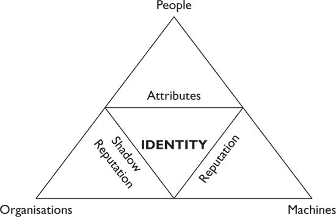
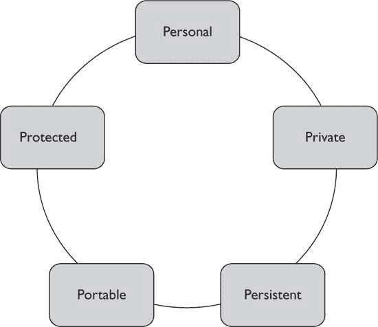

第三章

区块链与身份

身份 /ʌɪˈdɛntɪti/：一个人或事物是谁或什么的事实

3.1 引言

2010 年初，尼科尔·麦卡布与丈夫在以色列幸福生活时，突然成为一起政治暗杀案的主要嫌疑人，这起案件发生在阿拉伯联合酋长国。当时，这位澳大利亚妇女已经怀孕六个月。在一个周三，当她开车外出时，她听到广播中念出了她的名字，称她是几天前在迪拜一家酒店房间内暗杀哈马斯领导人马哈茂德·阿尔-马巴胡的凶手之一[106]。然而，她从未去过迪拜，而且怀孕六个月的她并不像是暗杀案的嫌疑人。尼科尔成了身份盗窃的受害者。不知怎的，窃贼利用她的个人信息伪造了一本假护照，并利用该护照进入了迪拜[107]。因此，她现在在迪拜被通缉，还有 17 名其他西方人，他们的身份也被一个据信是根据以色列情报机构摩萨德命令行动的刺杀小组的成员盗用[108]。

2012 年初，美国的海伦·安德森^(1)女士居住在西雅图，她不得不去俄勒冈州波特兰探望她的女儿。当时 64 岁的退休护士必须照顾身体有问题的女儿，她请侄女萨曼莎帮忙看家。当海伦在 2012 年 10 月回来时，她发现侄女在家里收留了名叫艾丽斯·利斯基的甲基苯丙胺成瘾者几天。海伦告诉艾丽斯离开，但是已经太迟了，她后来发现了。在海伦离开期间，艾丽斯偷走了她在家中的邮件和收据中的个人可识别信息，并利用这些信息接管了海伦的身份。艾丽斯报名参加了一个旨在帮助公民防范身份盗窃的信用监控服务，并随后报告了所有不活跃的信用卡被盗，以便获得新卡、用户名和密码。利用这些新卡，艾丽斯购买了食物和衣服，支付了汽油费，去了赌场，在短短六个月内总共欠下 3 万美元的债务。在艾丽斯被捕之前，她利用海伦的信息以及数十名其他受害者的信息，总共盗用了近 10 万美元[106, 109]。

当 Axton Betz-Hamilton 的母亲在 2013 年去世时，她发现了自己成为了身份盗窃的受害者。Axton 的父亲和祖父也是近 20 年前开始的 identity 盗窃的受害者。成为身份盗窃的受害者是一种糟糕的体验，但当你发现犯罪者竟是你的母亲时，情况会变得更糟。在近 20 年的时间里，Axton 的母亲过上了双重生活，而她看似婚姻幸福。在那段时间里，她窃取了她丈夫、女儿和公公的身份——从自己的家庭中骗取了数千美元。20 年来，她犯下了辜负家庭的信任的罪行，使 Axton 和她的父亲陷入了深深的困境。由于这种身份盗窃，Axton 的信用评级下降，她不得不支付数百美元的费用、利率和押金。除了身份盗窃带来的所有麻烦外，Axton 还必须处理发现自己的母亲并非她所认为的那个人的问题[106, 110]。

Nakiesha 霍尔曾在美国国税局纳税人倡导服务部门工作了逾十年，她的工作是帮助那些成为身份盗窃受害者的人。然而，Nakiesha 不仅帮助受害者，还在帮助自己。由于她可以访问国税局的数据库，她能够窃取姓名、出生日期和社会保障号码。她利用这些个人信息提交虚假的税务申报，并请求将退款存入借记卡中，然后用这些钱来维持自己的生活。总共，她设法窃取了超过 40 万美元，尽管她打算从她本应帮助的人那里窃取近一百万美元。如今，她在承认身份盗窃和税务欺诈罪后，正在联邦监狱服刑九年[106, 111]。

Nicole，Helen 和 Axton 并不是 Nakiesha 这样的身份盗窃的唯一受害者。实际上，身份欺诈和盗窃是仅在美国就有超过 1500 万人每年遇到的的问题，导致每年的经济损失高达 500 亿美元[112]。身份盗窃有各种各样的形式，并且可能对某人的生活产生巨大影响，有时会干扰其生活数年。不幸的是，由于我们的大部分通信都是数字化的，窃贼和黑客已经变得越来越精通窃取个人可识别信息。因此，窃取某人的身份并犯下各种罪行已经相对容易。然而，身份变得越来越重要，现在，几乎不可能在不透露你的身份和披露你的个人可识别信息的情况下购买任何服务、订阅或金融产品。即使你想进入酒吧或购买酒精，你也需要证明自己的身份，尽管事实上他们真正需要知道的唯一事情是你的年龄。

随着我们的隐私频繁无必要地被侵犯，以及越来越多的人成为身份盗窃的受害者，身份似乎已经不再完美，除非你至少有一个身份。联合国人权宣言第六条规定，“每个人在任何地方都有作为法律面前的个人的权利”。因此，身份是一项基本的人权。不幸的是，根据世界银行的数据，大约有 15 亿人没有得到官方认可的身份，其中大部分在非洲或亚洲。这些人没有政府颁发和认可的文档，往往是社会中最脆弱的人群，因为他们没有官方身份，所以无法获得基本服务。在我们生活的数字社会中，因此是时候进行改变了，如果我们想解决本书中讨论的一些难题，我们首先需要解决身份问题。目前看来，区块链可能是一种合适的解决技术。在我们探讨如何解决身份问题以及区块链可能扮演的角色之前，让我们先讨论一下身份究竟是什么，因为这可能并不像你想象的那么简单。

3.2 身份是什么？

“认识自己”这几个字刻在希腊德尔斐的阿波罗神庙的前院里，自那以来，哲学家、心理学家、科学家、诗人、作家、艺术家和政治家们一直在讨论和辩论这个话题。柏拉图将其称为悠久的智慧，这是神灵给出的建议，而根据苏格拉底的说法，“认识自己才是智慧的开始”。回答“我是谁？”和“我的身份是什么？”这些问题似乎非常简单，但实际上比人们想象的要困难得多，许多人对于身份是什么存在分歧。你的身份是不是你政府颁发的身份证明上所写的，比如护照或驾照上？是不是你的父母给你的名字，或者是你的朋友们给你的昵称？是不是你的 Facebook、Twitter 或 LinkedIn 用户名，是你在工作中的员工编号，还是你的社会保障号或信用卡号？如果你的信用卡号被盗窃，你的身份是否也被盗了？那你在网上不同论坛上评论时使用的化名呢，或者你在那个约会网站上创建的用户名是你的身份吗？如果那些网站被黑了呢？如果你患有痴呆症并忘记了自己的名字，那你是不是失去了自己的身份？如果你是精神分裂症患者，你是否具有多个身份？这些都是思考身份时会出现的一些问题。但这还不止这些。一旦你确定了你是谁，我们就必须处理身份的持久性问题；哪一个是你？你的身份是你今天、昨天还是明天？是你的外貌、你的 perceived identity、你的情感和思想，还是你的行为？如果你改变了你的态度、行为，甚至你的生理特征（你的细胞在不断自我更新），这会改变你是谁吗？此外，你的 perceived identity 是否与你的真实身份不同？你对自己的感觉和你的特质可能与你自己看待它们的方式不同。你可能认为自己是害羞、内向的人，而别人却认为你是自信、外向的人。然而，我们如何感知自己的身份决定了我们如何体验生活——这是否意味着它是你身份的一部分，还是你的身份是别人如何看待你？尽管在现实世界中回答这个相当哲学的问题可能看起来很困难，但在数字世界中，我们稍后会看到，这个问题似乎要容易一些。然而，正如你可能已经发现的那样，身份比你想象的要复杂得多，考虑到我们还没有开始讨论群体身份以及你可以连接到互联网的所有那些设备：它们也有身份吗？实际上，它们确实有，但我们会稍后再回到这个问题上。

3.2.1 属性

从上面提出的问题中可能可以看出，身份是由许多不同的属性构成的，这些属性在优先级和持久性方面不断变化和发展。一些属性，比如你的名字和社会安全号码，可能会伴随你一生。出于许多原因，一个人可能会改变他们的名字一次或多次。其他人，比如你的员工编号、学生编号以及你的地址或电话号码，会不断变化。一些属性会伴随你几年甚至更长时间，而其他属性可能非常短暂，比如论坛或网站上的用户名。这些属性都有不同的、可以明确识别的特征，它们的组合构成了你，尽管你可能会有不同的看法。

这些属性的大部分特征是它们是数字记录的，也就是说它们是数据。你的社会安全号码、名字、出生日期或地址记录在政府数据库中，而你的证书和员工编号则由教育机构或你的工作单位记录。用户名、电话号码、信用卡详情等许多属性由商业银行、电信提供商或当地超市等商业或非盈利组织记录。甚至你的外貌和属性也可能已经记录在你的电子健康记录中。因此，你的身份散落在成千上万片，存储在全球成千上万的数据库中，而你对这些数据库的控制是有限的，甚至可能没有控制权。有些可能只记录一个用户名，而其他人，比如美国海关，可能需要你的生物特征、社会安全号码、地址等等。这立刻揭示了一个身份的挑战；它是数字分布在虚拟世界中，谁拥有你的身份并不总是清晰的。

不是所有属性都可能被记录在数据库中；你的个性特征，比如你的幽默感或你的可信度，只有那些了解你的人才知道，通常不会被记录下来。它们是你身份非常重要的一个方面。然而，随着像 Uber、Facebook、eBay、LinkedIn，甚至 Tinder 这样的在线服务在你的情感、可信度或声誉上记录大量数据，这种情况正在迅速改变，而且如果你想使用这些服务，这种声誉的作用越来越重要。例如，如果你的 Uber 或 Lyft 作为司机或乘客的信誉评分低于某个阈值，你就无法再使用这项服务了。因此，这些公司对你有强大的控制机制，而你也有一种激励去遵守规定，如果你想继续使用这个系统的话。看起来，记录每一笔交易和每一次互动的可能性使得声誉的重要性在迅速增加。

3.2.2 声誉

在线声誉的第一次真正被广泛认知的应用案例，并不来自许多人都使用过的服务，如果你曾经使用过，你可能不希望那些信息被公开。我们说的是丝绸之路，这是一个位于暗网上的匿名网站，用于交易非法商品和服务，包括毒品、武器，甚至还有雇佣杀人。它的名字来源于 13 世纪连接东西方的贸易路线，就像最初的丝绸之路一样，交易是该平台的主要活动。然而，当你涉及到非法商品和服务时，你是在和罪犯打交道，而罪犯的天性使得他们难以信任。在交易中，信任是至关重要的，即使是罪犯之间。如果你在平台上订购了一些毒品，你需要确信你得到了你订购的东西，而卖家需要确信他或她得到了付款。为了解决这个问题，丝绸之路使用了一个声誉系统，一种类似于 eBay 的同行评审系统[113]，它允许买家和卖家在交易发生之前互相评价，以及他们的商品或服务。该系统激励良好的行为，效果出奇地好，直到 2013 年 10 月丝绸之路被关闭。近年来，在线声誉已经得到了重视，大多数知名在线服务都使用某种形式的声誉评分：TripAdvisor 对酒店和目的地进行评分，Uber 对其乘客和司机进行评分，AirBnB 对其主机和客人进行评分，Netflix 对其电影和纪录片进行评分，Tinder 对其单身人士进行评分，Glassdoor 对组织进行评分。因此，声誉已经成为我们生活中的一个重要方面，从而激励良好的行为，我们预见，在未来几年，得益于区块链，使声誉可追溯且不可篡改，这一方面将会增加。

然而，不仅仅是个人拥有身份和声誉需要维护。以类似的方式，人们组成的群体，即组织、公司和机构，也拥有自己的身份和声誉。我们称之为品牌身份，重要的是要考虑你是如何与品牌认同的，以及组织是如何构建自己的身份和声誉，以及它们是如何利用你的身份和声誉的。自然地，组织也拥有许多构成其身份的属性：他们的文化、在那里工作的人、品牌形象、公司标志和图标、他们的领导者、规章制度、提供的产品和服务的质量、客户服务等等。这些属性中的每一个都与其他属性相互作用，共同塑造了公司的身份和声誉，这直接影响了当你与该公司打交道时的你的身份和声誉。想想苹果公司；对很多人来说，苹果公司就像一个宗教[114]。人们希望通过其产品来认同，并且重视与苹果品牌相关的属性，比如创新、赋权、激情、抱负[115]。此外，苹果公司还有一定的声誉，这是经过几十年创造产品和与数十亿客户互动建立起来的。事实上，在 2017 年，苹果公司在声誉研究所的全球声誉 100 强中排名第 20 位，这是一个衡量全球主要公司公众形象的排名[116]。因此，组织拥有某种身份和声誉，这直接影响我们自己的身份。

最后，如前面简要提到的，机器也被赋予了身份。这对于物联网尤为重要，其中设备和机器连接到互联网，并能与其他设备和人进行互动。与人和组织一样，机器也有各种属性以及构成其身份的声誉，例如，设备类型，如汽车；哪个版本，如 ABC 型号；以及设备特征，如它是红色的，有四个轮子，是电动的，且三年旧。此外，汽车还有声誉：它在沟通中是否响应迅速，它是否与道路上的其他参与者交谈（对于自动驾驶汽车来说），它是否做到它说要做的事情（例如，它表示要超车，但如果它没有这样做，这可能会在道路上引起麻烦）？所有这些方面构成了汽车的声誉，声誉越高，其他设备和人类就越愿意与该机器交易。你愿意乘坐声誉非常低的自动驾驶出租车吗？可能不会。当机器开始互相互动时，例如作为智能电网的一部分，我们在第六章中讨论了这一点，此时，千瓦的成本可能会根据设备的声誉上升或下降。或者回到自动驾驶出租车例子，声誉非常高的汽车可能会比声誉较低的汽车更贵。

机器的身份可能会变得非常复杂。想象一下，如今的典型汽车大约有 30,000 个部件[117]，如果每个部件都有自己的身份，带有多个属性和一个声誉，那么它会迅速变得极其复杂。当然，这些部件可能并非都连接到互联网，但这也说明机器的身份和机器之间的互动可以很快变得复杂，这就是区块链确保所有这些连接事物之间不可变性和可追溯性的重要性所在。

3.2.3 阴影声誉

身份的最后一个方面，由于我们所处的网络经济环境越来越重要，在这个环境中，人们、组织和机器在一个不断变化的网络中互动，我们称之为影子信誉。在网络中，信誉是由你与之互动的人（即你网络中的参与者，公司和个人机器）组成的。与值得信赖的参与者打交道可以提高你的信誉，从而改变你的身份。相反，如果与不可信的参与者打交道，例如罪犯，将负面影响你的信誉，从而影响你的身份。你可以将这比作“交错了朋友”，当你与“错误的朋友”过于紧密地联系在一起时，这将直接影响人们对你的看法，从而影响你的身份。这种影子信誉与你的本质和你如何被他人识别紧密相连。

影子信誉不仅影响人，还影响组织和机器，并且与身份密切相关。2008 年全球金融危机（GFC）期间的一个有趣例子就发生了。当时在银行工作的人，尤其是那些不得不被救助的银行的工作人员，在聚会上更愿意避免谈论他们的工作和所在银行，因为这将导致奇怪的眼神和棘手的问题，人们几乎会立刻改变对他们的看法。这是影子信誉的一个例子：当时银行的负面信誉直接影响了人们对银行员工的认识。当然，对人和组织适用的原则也适用于机器。如果智能电网中太多机器声誉不佳，智能电网的声誉就会下降。或者，如果一个机器与带有恶意软件的机器相连，将直接影响该设备的信誉。

3.2.4 身份是什么？

那么，身份到底是什么呢？我们讨论了身份的不同方面；不仅人具有身份，组织和机器也有。身份由无数属性组成，随着时间的推移不断变化和演变。它还由你的信誉组成：你对别人的行为和态度。最后，你的身份由你的影子信誉组成；你网络中其他参与者的信誉在你与他们互动时影响你的信誉。属性、信誉和影子信誉的概念与身份永远相连，在区块链上，它们将变得不可变、可追溯，因此可验证。图 3.1（Figure 3.1）展示了身份图。这一切都发生了改变，但在我们到达那里之前，还有一些挑战需要探讨，然后我们才能继续探讨区块链上的身份意味着什么。

3.3 身份挑战

图 3.1  身份图

让我们回到尼科尔、海伦和艾克逊这三位身份盗窃受害者的例子。身份盗窃只是我们共同发展起来的当前身份系统中的众多挑战之一。我们的全球身份系统是为模拟世界设计和开发的，尽管我们已经进入了数字世界，但我们的身份系统还没有跟上。身份系统的现有问题与安全（个人可识别信息散布在成千上万的、通常不安全的、数据库中）和程序（你入住的酒店复印你的护照）有关，这使得身份容易被盗。此外，由于身份仍然存在于模拟世界中，身份验证既昂贵又困难，且很容易出现缺陷。另一方面，在线身份验证已经过时，许多网站仍然允许使用诸如 abcd1234 或 password 的密码。线下验证需要各种额外的个人可识别信息，这些信息不相关，但由于没有其他方法，不可避免。例如，在商店购买酒精时，你的名字真的与确定你是否合法购买酒精无关。最后，最大的挑战是 15 亿没有合适身份的人，因此他们无法获得银行、就业安全、教育和其他人权。如果我们希望解决本书中讨论的一些难题，所有人类都应该有一个个人可验证的身份。让我们简要讨论这些挑战：

身份盗窃](toc.xlink.xhtml#r3s2-3.3.1)

身份盗窃是一个严重的问题，它以各种广泛的形式存在。尼科尔（犯罪身份盗窃）以及海伦和艾克逊（都是金融身份盗窃）的例子是身份盗窃最严重的形式，受害者会受到长期影响，并给全球经济造成数十亿美元损失。然而，还有其他形式的身份盗窃，包括盗墓、社交媒体欺诈、医疗身份盗窃、合成身份盗窃、税务身份盗窃和商业身份盗窃[118-120]：

犯罪身份盗窃：你的身份被盗用来犯某种罪，在尼科尔·麦卡比的案例中，是谋杀一个知名人士；

身份盗窃：你的信用卡或银行详细信息通过钓鱼或复制磁条的方式被盗，犯罪分子会在这些卡的信用额度内进行消费，或从你的银行账户中取钱；

盗墓：数百万死者的身份被盗，窃贼使用这些信息申请信用卡、信用额度或其他产品。通常，这对于逝者家属来说可能是灾难性的；

•   社交媒体诈骗：数百万人将在社交媒体网络上放置个人可识别信息：电话号码、地址、出生日期、学校名称、宠物名称，甚至是一张新收到的信用卡的照片。当这些信息对所有人可见时，犯罪分子很容易窃取你的身份；

•   医疗身份盗窃：犯罪分子利用你的医疗信息申请“免费”医疗服务，这可能会对受害者造成经济损失和一份被篡改的医疗记录；

•   合成身份盗窃：身份盗窃最复杂的形式之一，犯罪分子利用你的社会安全号码，结合假信息创建一个新的身份；

•   税务身份盗窃：像 Nakeisha 这样的人利用偷来的个人信息提交欺诈性的税务退款申请；

•   商业身份盗窃：使用假身份来获取信息，或者为未提供的服务或产品开账单。这种事情发生在各种类型的组织身上，直到 2017 年 4 月，Facebook 和 Google 还承认自己是价值 1 亿美元商业钓鱼诈骗的受害者[121]。

身份盗窃对受害者可能造成严重后果，从财务损失、获得信贷困难、就业困难，到经历压力和无法摆脱虚假记录。不幸的是，似乎身份盗窃正在变得更容易。个人可识别信息遍布网络，散布在成千上万的数据库中，而且组织经常不必要的复制你的身份。例如，在澳大利亚，许多酒吧和注册俱乐部要求顾客出示政府发行的身份证明，然后扫描，才允许他们进入。此外，许多酒店在办理入住时仍然要求顾客提供护照，并在递给钥匙前采取（数字）复印件。在欧洲联盟，酒店甚至被要求收集可识别的个人信息，如姓名、国籍和州发行的身份号码，以便执法机构交叉核对失踪人员、罪犯或通缉人员[122]。目前尚不清楚这些信息是如何存储的，存储多久，更重要的是，是否安全存储。

犯罪分子能从潜在受害者那里获取的细节越多，他们就越容易窃取受害者的身份并以多种方式使用。身份盗窃仍然是一个大问题，除非我们把身份管理带入 21 世纪，否则这个问题将持续存在。

3.3.2 身份验证

验证您的身份可能简单到只需出示身份证，也可能是一项繁琐且耗时的工作，这需要从各种组织中提供多种文件，以及回答验证问题来证明您的身份。身份验证无论是在线上还是线下都在不断发生。澳大利亚邮政数字交付中心总经理 Cameron Gough 说：“在物理世界中，验证你是谁有相当被接受的方法，比如驾驶执照或护照。’但在数字世界中我们没有这些。所以，组织在欺诈、摩擦和便利性之间做出权衡。他们希望能降低欺诈水平，但通常实现这一目标的方法会导致客户的不便或摩擦增加’ [123]。银行、电信公司、社交媒体网站或在线零售商等组织在你与他们进行交易时需要验证你的身份，通常是因为需要遵守诸如了解你的客户或客户（KYC）等规定。KYC 是金融机构特别需要执行的过程，以防止洗钱活动甚至资助恐怖主义。它包括多项检查和特定文件的提交。每次你在一家新银行开户时，你都必须再次经历同样的过程，即使你已经由不同的机构验证过。KYC 要求金融机构了解你的身份和活动，并评估洗钱风险 [124]。然而，采用 KYC 的金融机构并非唯一；其他公司也使用它来确保他们与合法的个人或公司交易。近年来，KYC 已经扩展到 KYCC，即了解你的客户或客户的客户或客户。这把 KYC 的要求提升到了更高的水平，因为它需要知道你的客户在与谁交易，他们的资金来源以及洗钱风险。遵守的唯一方法是要求证明资金和交易的合法性。因此，截至 2018 年 5 月 11 日，美国将实施客户尽职调查（CDD）最终规则。2017 年 6 月，第四版反洗钱指令在欧盟生效。这两个规定都要求公司持续监控客户及其客户，以减轻可疑交易、风险和金融犯罪 [125]。正如您所想象的，遵守这些规定将耗时且昂贵，尽管不遵守可能会因重罚和声誉损害而付出更大的代价。

身份验证已经深深地嵌入了我们的生活，以至于我们可能甚至没有注意到身份验证系统的过时。尽管有诸如 KYC 和 KYCC（以及将来可能还有 KYCCC）等所有安全措施，但身份验证仍然不安全，这从全球身份盗窃的规模和身份被伪造或购买的容易程度可以看出。例如，假美国护照在暗网上的价格起价仅为 938 美元[126]。此外，公司存储的客户及其客户数据越多，数据被黑客窃取的风险就越高，因为并非所有公司都会确保最高级别的安全。与此同时，人们在网上不断提供自己的详细信息，并记住诸如用户名和密码等详细信息。因此，人们经常使用非常简单的密码，从而增加了更多的风险。

随着在许多不同地方提供身份信息变得越来越正常，我们忘记了在所有这些地方提供身份信息是多么不正常。毕竟，如果你在商店买酒，店主绝对没有必要知道你的名字，甚至你的年龄。他或她感兴趣的只是你是否达到了法定购买酒精的年龄。这是一个布尔表达式，结果是一个布尔值，即真或假。没有更多了。那么店主为什么需要看到你的政府发行的身份证明，里面包含的个人信息比必要的还要多，从而可能侵犯你的隐私呢？答案很简单，也很令人不安：因为此刻没有其他解决方案可用。正如现在可能已经很清楚，身份验证带来了许多挑战，而现有的系统并不适合 21 世纪。

3.3.3 身份排除

身份盗用和身份验证是两个与身份相关的重大挑战，但我们面临的最大挑战是数百万人每天遭遇的身份排斥。由于参与社会和经济活动需要出示身份证明，没有身份证明可能会对个人造成极其严重的后果。然而，全球约有 15 亿人，即全球人口的 20%，没有任何官方认可的身份证明。其中大部分人生活在发展中国家，并且已经在应对多个其他棘手问题。没有身份只会加剧这些问题，因为它阻止他们加入现代经济，投票，以及获得基本服务，比如开设银行账户或订阅电话服务。此外，“无身份”的人面临 increased 人贩子风险，因为他们法律面前是隐形的，因此无法主张任何权利。尽管拥有官方认可的身份是联合国《世界人权宣言》所确认的基本人权，但仍有太多人没有身份证明。

除了与没有官方文件身份的个人问题相关之外，没有最新的人口数据还阻碍了（地方）政府发展和执行适当的社会服务。根据 [ID2020.org](http://ID2020.org)，解决身份排斥问题的公私合作伙伴关系，有超过 100 个国家没有功能性的民事注册和 vital 统计系统[127]。结果，大约有 2.3 亿儿童在出生时没有登记，因此官方上不存在。没有准确的人口统计数据阻碍了商业、政府和非政府组织（NGOs）进行无摩擦的商业活动。如果你不知道你正在处理的是谁以及有多少人，就无法进行适当的规划和预算。对于那些已经面临多个其他棘手问题的国家，这构成了一个真正的挑战，而解决这些挑战通常始于解决身份问题。只有拥有身份证明的人才能开设银行账户、投票和参与经济活动，从而刺激经济，为自己和整个国家创造一个更好的世界。

致力于给所有公民提供身份证明的国家之一是印度。2009 年，政府启动了 AadHaar 项目，这是世界上最大的生物识别身份系统。该系统的目标是向每个印度人提供一张与他们的生物识别信息关联的政府身份卡，并基于他们的生物识别和人口统计信息有一个 12 位数的号码。截至 2017 年 4 月，已有 13.33 亿人注册，即超过 18 岁印度公民的 99%。这是世界上最先进的身份平台，并有能力每天注册 100 万人。这种身份证明使印度公民能够轻松地在线访问政府服务，并通过应用程序编程接口（API）与其他非政府服务（如银行）相连接。因此，它使得这些组织能够遵守了解你的客户（KYC）的要求。AadHaar 是一个很好的例子，说明政府如何将他们的身份系统带入 21 世纪，尽管像这样的项目总是会让各方对设计是否安全、是否隐私有所担忧。

尽管有像 AadHaar 这样的项目，仍有数百万人没有正式的、政府颁发的身份证明，因此他们在生活中面临着困难。我们面临的身份挑战阻止了我们解决本书中讨论的许多棘手问题。因此，是时候升级我们的身份系统，将其带入 21 世纪，并将身份信息置于区块链之上。这不仅能帮助解决贫困或欺诈等问题，还能让组织在不侵犯客户隐私的情况下创建更好的产品和服务。

3.4 区块链上的身份

尽管 AadHaar 是为 21 世纪构建的，但它并不是基于区块链，因此所有目前与身份相关的问题仍然存在。区块链为我们解决身份危机提供了巨大的潜力。拥有“区块链上的身份”将使它不可变、可追溯和可验证，从而显著减少身份盗窃的可能性，使身份验证无缝，并将权力归还给用户。在区块链上建立数字身份将起到数字水印的作用，就像传统身份证明文件如护照有水印以验证文件的真实性[129]。这个数字水印然后使任何有权访问区块链的组织能够在每次交易中实时检查身份。如果你能在每次交易中检查某人的身份，这将消除欺诈的可能性。因此，启用区块链上的身份是一个价值 4.2 万亿美元的机会，这是根据朴次茅斯大学的研究[129]得出的全球每年欺诈成本。与今天相反，验证某人的身份几乎不需要任何成本，因为客户在需要时只需“借用”他们的数字身份，而不透露任何对该特定交易不必要的信息。

然而，在我们更深入地探讨这个话题之前，我们需要明确的第一件事是，将你的身份放在区块链上，并不意味着要把个人可识别信息，比如你的护照、社会保障号码或其他任何属性，放在区块链上。区块链是用来管理密钥，将数据记录固定在时间上，使它们不可变，以及在需要时发现这些记录。它，而且永远不应该被用来存储个人可识别信息，原因很简单。将个人可识别信息，例如货币，与之关联意味着这些信息将永远留在那里，并且可以被追踪。如果你这样做，意味着你用一个或只有几个货币来关联这些属性，这会立即暴露出它们之间的相关性，即使你无法解密数据。此外，如我们之前所建立的，你的属性随着时间的推移不断变化，所以那不是你想让它不可变的事情，因为今天合法的属性可能明天就变成非法的。相反，如果我们想将身份放在区块链上，我们应该删除与个人相关的所有数据，只把代币放在区块链上，并允许用户将他们的个人可识别信息存储在他们选择的设备上，这可能是一部智能手机或类似的东西。因此，消费者将重新获得对自己身份的控制权。与此同时，散布在成千上万个数据库中的属性将成为过去，而匿名者仅通过收集和使用区块链上的属性和声誉（包括不良声誉），就能获得数字身份。

这是如何运作的呢？为了解释这个问题，我们首先需要澄清关于公钥基础设施（Public Key Infrastructure，PKI）的某些方面，因为它与区块链上的身份紧密相关，为此，我们必须回溯到 1970 年代。1976 年，两名斯坦福大学的数学家，惠特菲尔德·迪菲（Whitfield Diffie）和马丁·赫尔曼（Martin Hellman），发现了一种先进的数学关系，称为非对称加密。他们识别了大数据素数之间的一种关系，其中用一个密钥加密的数据可以用它的配对密钥解密。与此同时，1978 年，另外三名数学家，罗恩·里维斯特（Ron Rivest）、阿迪·沙米尔（Adi Shamir）和伦纳德·阿德曼（Leonard Adleman）也识别了同样的关系，并将其作为 RSA 算法[130]发表。他们能够将这个算法货币化，围绕这个算法建立了一家公司（RSA 公司），该公司最终被 EMC 收购，现在属于戴尔。

非对称加密意味着存在一对密钥，即公钥和私钥，它们在数学上相互关联。这种关联意味着任何使用一个密钥（公钥）加密的数据只能用另一个密钥（私钥）解密，反之亦然。使用公钥加密数据，然后用另一个公钥来解密数据是不可能的[49]。因此，你可以使用密钥对来标识某个数字资产的所有者。由于公钥是公开可用的，任何用相关私钥加密的数据只能用对应的公钥解密。所以，如果爱丽丝用她的私钥加密一个文件并发送给鲍勃，鲍勃使用相应的公钥，他可以确信爱丽丝是加密文件的人。反之亦然：如果鲍勃想给爱丽丝发送一条私信，他可以用与爱丽丝的私钥在数学上关联的公钥来加密文件。如果爱丽丝收到消息，她将是唯一一个能用她的私钥打开消息的人。因此，她必须确保她的私钥保持绝对私密。这就像一个邮箱，每个人都有权利将信件放入这个邮箱，但只有一个人有权利用正确的钥匙打开邮箱并取出信件。

自那时起，公钥基础设施（PKI）已被广泛部署。几乎你在网上做的任何事情都使用到了公钥基础设施，从发送电子邮件到访问网站（如果一个网站拥有 SSL 证书并且显示 https，那么它就是使用公钥基础设施进行加密的）。这意味着我们可以确信，在用户和服务器之间传输的数据不会被中断。公私钥基础设施还用于确保某些文档的真实性。这是通过使用散列算法来完成的，具体内容在第二章有所讨论。散列算法是一种特殊的数学公式，它可以将任何输入转换成固定长度的数字和字母的输出。改变输入将会完全改变输出。如果你想保护一条信息或数据文件，你会对数据进行散列处理，然后使用公钥基础设施进行加密。结果是，可以证明发送者的身份，并验证数据文件的真实性，从而揭示文件是否被篡改。在传统的集中式互联网中，公钥基础设施依赖于被称为证书授权中心（CAs）的集中式可信第三方。这些 CAs 为每个参与方颁发、吊销和恢复密钥对。除了这些是行使大量控制的集中式公司之外，黑客还可能伪造用户身份，执行中间人攻击，从而拦截通信[131]。截至 2017 年 5 月，有几个研究项目正在研究公钥基础设施的去中心化版本，每个项目都采取了略有不同的方法。当然，在技术细节上，密码学还有更多的内容，但这是需要了解的。公钥基础设施和散列算法的结合在区块链上被广泛使用，并且在某种程度上，这使得区块链上的身份成为可能。

我们需要介绍的另一个概念是令牌化，在我们能够将其全部联系起来之前。每个区块链都使用令牌来帮助验证交易并创建区块，随后将这些区块链接起来。区块链上的令牌可以意味着几件事情。要么它们指的是货币令牌，比如比特币（BTC），要么它们指的是资产令牌。货币令牌是最著名的令牌，原因很简单，因为第一个加密货币令牌，比特币，就是一种货币令牌。货币令牌是一种价值交换媒介，其价值由供求关系决定。与由黄金支持的法定货币相反，货币令牌只由市场需求支撑。另一种令牌是“资产令牌”，它是对属于某个发行者或用户的底层资产的索赔。它们可以与“我欠你”（IOU）相比较，例如在旧时代，你可以拿黄金去金匠那里，金匠会写一张 IOU，你就可以用它进行交易。任何拥有那张 IOU 的人都可以去找金匠，用它换回原始的黄金。资产支持的令牌是 IOU 的数字等价物，它允许你跟踪某项资产是如何从一个人转移到另一个人的。一旦你对一项资产进行了“令牌化”（无论是实体资产还是数字资产），你就可以追踪它的移动。每天都有新的数字令牌被创建出来，用于追踪从钻石到音乐到艺术的新资产。资产支持的令牌可以被交易，最终有人可以将其交易回原始资产[132]。除了画作等物理物品或音乐等数字资产，你还可以对一个身份属性进行令牌化，因为它也是一种资产，尽管是无形的。然而，不同于将令牌从一个人转移到另一个人，你将其“借”给另一方并保留令牌的所有权。我们还有安全令牌和实用令牌。安全令牌是一种允许令牌所有者拥有公司（未来）股份的令牌，而实用令牌是一种有使用案例且尚未被开发为投资的令牌。当今大多数区块链初创公司都旨在将它们的令牌作为使用案例来发展。

那么，我们如何将身份置于区块链上呢？有各种各样的使用案例，不同的初创公司开发了不同的解决方案。我们只展示一个通用解决方案来解释区块链上的身份是如何工作的。请注意，在这个例子中，不同方之间发送的任何消息始终是加密和安全的（以确保真实性和消息未被篡改），正如现在的电子邮件工作方式一样：

1  如果你希望在区块链上存储一个属性（或者是一个声誉，甚至是影子声誉），你将使用令牌化和加密的组合。首先，你需要创建这个属性。这可以由用户完成，我们可以称她为 Alice，也可以由一个组织完成，我们可以称它为 Gov。Alice 可以创建一个属性，例如女性，而 Gov 可以创建一个属性，例如“允许驾驶汽车”或“社会安全号码是 71231236”。当然，由官方机构创建的属性比用户创建的属性更受信任。

2  第二，属性被令牌化，即被转换成一个由数字和字母组成的随机字符串。将属性与令牌关联的键值对要么由 Alice（如果她创建了它）存储，要么由 Gov 在公共账本上加密并时间戳标记（如果 Gov 创建了它）。注意，这个账本只存储不可识别的属性：“允许驾驶汽车”并没有说明谁被允许驾驶汽车。此外，Gov 还可以添加诸如“已过期”或“已被吊销”的信息。

3  令牌由创建它的行为者加密，使用相应的密钥以实现认证。

4  加密令牌被时间戳标记。

5  时间戳后的加密令牌被添加到区块链中，使其变得不可变、可验证和可追溯。

6  政府（Gov）向 Alice 发送了加密的令牌以及可以找到密钥值的位置指针。

7  Alice 收到了加密的令牌和指针，并用她的公钥加密了两者。然后，她将其存储在任意的位置，这可能也是她的智能手机以及云存储中。如果 Alice 是创建属性的那个人，步骤 6 当然是不必要的。

8  组织 2，让我们称其为警察，想要验证某些事情，无论是某个属性还是该属性的布尔值（真/假）。例如，警察想要知道 Alice 的社会安全号码以及 Alice 是否允许驾驶。

9  警察确定所需的可信度水平。在这种情况下，Alice 自己声明她被允许驾驶是不够的。警察想从 Gov 那里知道她是否被允许驾驶。

10  警察向 Alice 发送请求。这个请求可以通过 Alice 用智能手机扫描的二维码完成。Alice 验证请求的真实性，并检查消息是否被篡改。

11  Alice 在自己的智能手机上查找相应的加密令牌和指针。如果警察需要多个属性，Alice 会发送多个令牌和指针。她将这条消息发送给警察。

12  警察前往信息存储的地方，即 Gov，并使用 Gov 的公钥来解密令牌，以确保令牌的真实性。警察将请求发送给 Gov，Gov 可以做两件事：

a     政府发送加密属性，例如“社会安全号码是 71231236”，给警察。警察现在有了爱丽丝的社会安全号码并将它们关联起来；

b     政府将请求与属性进行核对。如果请求是“爱丽丝能开车吗？”，政府将返回真值并发送给警察。

从请求到接收属性的整个过程可能只需要一秒或两秒。在区块链上启用身份确保用户爱丽丝始终完全控制着谁接收关于她的信息以及她的身份得到保护。这称为自我主权身份。即使黑客窃取了政府所有的键值对，这些信息也是无用的，因为他们无法将其与个人联系起来，因此将信息存储在公共账本上没有问题。此外，爱丽丝是个人还是物品真的不重要。连接的设备执行与爱丽丝相同的操作。因此，区块链上的身份具有许多优势，我们接下来会进一步探讨。

3.5 自我主权身份的优势

拥有这样一个自我主权身份系统的优势是巨大的，无论是对消费者、组织还是对机器来说都是如此。它将使身份变得个性化、私人化、持久化、便携化和受保护（让我们称之为自我主权身份的 5P——参见图 3.2），从而保护消费者、组织和机器免受身份盗窃和欺诈。

个人：它将使身份变得个性化，因为你控制着自己的数据以及谁可以访问某些属性。更重要的是，你可以拥有许多不同的属性，对于不同的平台，你可以结合不同的属性，从而为不同的组织有效地创建多个身份。对于组织 1 您使用属性 A、B 和 C，而对于组织 2 您使用属性 D、E 和 F。自我主权身份允许您创建纯粹的个人身份。

图 3.2  自我主权身份的 5P 要素

私人：它使身份变得私密，因为组织不再有权访问与无关的个人可识别信息。回到超市的例子，当你想购买酒精时，超市只需要知道你是否被允许购买的真值或假值。其他任何信息都是无关的。此外，如果他们需要一个年龄，不需要更个人的出生日期。当然，你可以说，拿你爸爸的手机解决不了问题，但政府批准并提供的安全存储在您手机上的图片可以用相机手机和面部识别功能实时与您的脸部匹配。如果两者不匹配，将返回假值。

持久：第三，身份需要是持久的，这意味着身份及其相应的属性应该永远持续，或者至少是用户想要的时间长度。这绝不能与“被遗忘的权利”相矛盾，因为用户应该随时能够移除属性。[133]自我主权身份消除了像 Google、Facebook 或 LinkedIn 这样的集中组织简单地删除用户的可能性，并将这种权力归还给用户。

便携：接下来，区块链上的身份将是便携的。例如，如果 Alice 是亚马逊上的卖家，并建立了很好的声誉，因此是一个值得信赖的身份，这个身份对她来说非常有价值。然而，如果 Alice 决定离开亚马逊，转到 eBay，通常她会失去她的声誉，并从头开始。使用这个系统，eBay 可以在亚马逊上验证 Alice 有很好的声誉，并将那与 Alice 在 eBay 上的身份联系起来，使身份变得可携带、可验证，并且完全由 Alice 控制。此外，遵守 KYC 流程变得容易得多。一旦用户在一家银行首次被验证，那信息可以不交换任何私人信息的情况下移交给另一家银行，使得处理此类流程变得简单且便宜。

保护：最后，自我主权身份受到保护且高度安全。由于组织账本只存储不可识别的属性，所以无论账本是否被黑客攻击并窃取属性，都无关紧要。因此，犯罪分子可以窃取的信息对他们来说毫无用处，因为一串数字没有任何其他详细信息意味着什么也做不了。因此，自我主权身份高度安全。自我主权身份的另一个优势是，它消除了登录网站时需要用户名和密码的需求。它能解决密码和用户名的问题。你可以创建独特的用户名和复杂的密码，这实际上是与你的身份相关的一个属性。这些属性加密存储在用户的设备上。如果用户需要在一个平台上登录，用户扫描一个二维码，这是一个验证用户的请求，之后用户便登录了。

当然，自我主权身份的 5P 不仅适用于人类行为者，还适用于组织、机器或连接的设备。在物联网的世界里，连接的设备或机器将控制谁有权访问其身份数据（个人）；设备在验证时只需展示相关的身份信息，而不是全部（私人）；其相应的属性应该永远持续，除非设备决定否则（持久）；它应该能够将其身份从一个网络移动到另一个网络（便携）；并且自我主权连接的设备是高度安全的（保护）。

3.6 区块链与你的社交媒体身份

2018 年 3 月，随着剑桥分析公司与 Facebook 的数据门事件，对一个新的能赋权消费者的身份系统的需求变得非常明确。那些重视自己隐私的人应该仔细考虑他们使用 Facebook 及其他社交媒体网络的方式。例如，剑桥分析公司就是在 2016 年美国总统大选、英国脱欧公投以及其他许多政治竞赛中发挥关键作用的数据挖掘和数据分析公司。这家公司的背后有着特朗普总统的关键人物，包括史蒂夫·班农（Trump 的前战略顾问）和罗伯特·默克尔（政府责任研究所的创始人），该研究所利用暗网和机器人来诋毁政治对手。

2014 年，该公司在未经用户授权的情况下获取的个人信息，开发出了一个针对个别美国选民的极为有效的系统。他们以学术研究的名义，未经用户同意就收获了 8700 万份资料，然后利用这些数据影响美国大选。这是前所未有的隐私侵犯事件，表明 Facebook 保护其用户免受侵犯的努力并不奏效。

这类丑闻表明，我们需要重新思考我们的（在线）身份系统，而区块链则给了我们一个机会，让我们能够夺回对自己在线社交媒体资料和创建的数据的控制权。为了实现这一点，我们需要删除现有的社交媒体网络，如 Facebook，并从头开始重建。在一个拥有去中心化社交媒体网络的世界里，你的在线存在将再次成为你自己的，随之而来的是，你的在线存在将变得私密、受到保护且可携带：

3.6.1 私有的去中心化社交媒体资料

目前，你的社交媒体资料根本谈不上隐私。Facebook 决定别人如何查看你的资料以及广告商如何使用你的数据。尽管有广泛的隐私设置，但该公司不断创造新的方式来侵犯你的隐私，最新的方式就是他们令人毛骨悚然的面部识别功能，即使你没有在照片中被打标签，也会在别人上传的照片中给你打上标签。尽管 Facebook 宣布这一设置默认是关闭的，但当我们最近检查 Facebook 的隐私设置时，发现它是默认开启的。你可能想检查一下自己的设置。

另一方面，去中心化的社交媒体网络将确保你个人细节的完全隐私。开发去中心化社交媒体网络的公司根本没有选项可以在未经你同意的情况下使用你的个人信息，因为你的数据将被加密，只有你才有密钥。因此，在去中心化的社交媒体网络中，你拥有自己的社交媒体存在，你决定谁可以访问哪些数据。

3.6.2 受保护的去中心化社交媒体资料

剑桥分析/脸书隐私泄露事件表明，在中心化的社交媒体网络上，你的数据根本得不到保护。一旦黑客获得了中心化服务器的访问权限，他们就能访问该服务器上的所有数据。然而，自我主权身份是一个受保护的身份，因为你的个人数据并不存储在中心化服务器上，供黑客访问或分析公司收集。相反，你的数据以代币化形式存储在数百万台服务器上。

由于去中心化的社交媒体网络只存储不可识别的属性，因此数据库是否被黑以及属性是否被窃取都无关紧要。因此，犯罪分子能偷走的信息对他们来说没有用，因为一串数字没有任何其他详细信息，意味着不了什么，也不能用于什么。因此，区块链使得一个由你拥有的受保护的去中心化社交媒体档案成为可能。

3.6.3 可移植的去中心化社交媒体档案

如果你长期使用脸书并且是活跃用户，你已经创建了一个庞大的思想、图像、对话、视频和其他内容的组合。尽管你可以下载你的数据文件，但你不能将其带到别处。这是目前所有社交媒体网络的问题。因此，如果你因为现有的丑闻想离开脸书，你将不得不在一个新平台上重新开始。对我们来说，这没有意义，因为数据和内容都是你的。如果你希望离开社交媒体网络，为什么不能转移到另一个平台？

幸运的是，在一个去中心化的社交媒体网络中，你的数据和内容都是你的，你可以将其带到任何地方。当你有能力随时离开一个网络时，它迫使社交媒体网络提供对你有益而不是对广告商或股东有益的功能。

3.7 自我主权身份的缺点

自主权身份的缺点并不多，因为几乎任何系统都会比当前的模型更好。然而，一个全新的身份系统的最大缺点将是构建基础设施的成本，这将在设置初期造成一个挫折。此外，构建和实施这样一个复杂的架构将很困难，但正如我们即将看到的，多个组织已经在解决这一问题。自主权身份的另一个缺点是，普通用户可能不想在智能手机及/或在云端存储私钥。这是消费者不习惯的无形事物。另外，智能手机被盗的情况实在太过频繁，如果智能手机没有用生物识别进行保护，盗贼可以访问加密的身份信息。如果用户没有在云端创建备份，他或她就会遇到严重的问题。解决这两个问题的方法是始终要求用户在其手机上使用生物识别安全措施，并在智能手机上安全地备份身份信息。

3.8 自主权身份的挑战

正如缺点所显示的，开发并在全球实施自主权身份系统将是一个巨大的挑战。有四个主要的挑战，集中在采用、治理、法规和可扩展性上：

采用：自主权身份将责任交给了消费者，让他们数字化地保护自己的身份。当然，如所讨论的，组织应该内置一些安全措施，比如需要生物识别和备份。尽管如此，消费者处理身份的方式将发生巨大变化，从拥有一个有形证件，比如护照或驾照，转变为一个无形且难以理解的数字字符串。变化总是困难的，这种巨大的变化将需要组织、政府以及逐步向自主权身份过渡的耐心。

治理：目前，公司通过利用私人消费者数据赚取数十亿美元。他们不太可能不经过一番斗争就放弃这笔财富。此外，当新的系统建立时，我们不希望几个商业组织掌控基础设施，否则不会有任何有意义的变化或改进。因此，全球自主权身份的运行和管理由一个全球性的非盈利机构来负责是非常重要的，就像我们在线运行 DNS、TCP/IP 和域名一样（ICANN）。这些机构的发展需要全球共识，因此实现起来需要时间。最后，我们需要治理来防止个人将（部分）身份卖给他人。出售（部分）身份将像转移你的私钥一样简单，因此应始终防止这种情况发生。

监管：无论何时你处理全球产品，你都要处理全球标准和法规。如果自主身份在全球范围内跨国家实施，它将提供巨大的好处。满足广泛的国际法规和遵守所有不同的司法管辖区将是一个巨大的挑战，我们需要克服。然而，只有当自主身份具有相同的权利并能在全球范围内操作时，我们才能真正发挥其潜力。

可扩展性：最后，如第二章所述，区块链有一些需要解决的问题，包括其可扩展性。这项技术仍然非常初步，正如之前讨论的——比特币区块链每秒只能处理几笔交易。然而，当你有数十亿属性与 75 亿人、1 亿个组织、500 亿台连接的机器和 1 万亿个传感器相连时，它很快就会变得相当大。在这种情况下，我们面临着巨大的挑战，需要为我们将建立的全球自主身份系统准备大量数据和交易的基础设施。

区块链技术仍然在发展中，随着时间的推移，这些挑战可能会被克服。在过去的数百年里，人类在采用和适应新技术方面非常灵活和创新。这不会在一夜之间发生，但全球自主身份系统最终将成为现实。

自主身份应用 3.9。

自主身份仍在发展中，有许多初创公司正在研究将身份带到区块链的解决方案。每个解决方案与其他略有不同，并在代币化、散列和加密方面有不同的方法。这些初创公司关注与护照、出生/婚礼/死亡证明、电子居民身份、在线账户登录等相关的数字身份。数字身份的先驱者按字母顺序如下^(2):

[2WAY.IO](http://2WAY.IO)：一个将用户置于控制地位的点对点声誉和身份平台。他们为希望实施身份解决方案的组织提供服务，这些服务对区块链保持中立——[`2way.io/`](http://2way.io/)；

Banqu App：一家专注于经济身份和极端贫困的金融科技公司。他们为最贫困的人提供了一个安全的、可携带的数字身份，通过一个专有的基于区块链的平台维护交易记录——[www.banquapp.com/](http://www.banquapp.com/)；

BitNation：一家提供与传统政府相同服务的平台公司，但基于区块链。他们自称是第一个去中心化的无边界志愿国家——[`bitnation.co/`](https://bitnation.co/)；

**BlockAuth**：BlockAuth 正在开发一个框架，以验证用户真实性，同时启用易于集成的 OpenID 身份验证系统——[`blockauth.org/`](http://blockauth.org/)；

[Bron Tech](http://bron.tech/)是一家基于区块链的身份平台，旨在重新定义人与人、个人数据和金钱之间的相互关系。

**Cambridge Blockchain**：一家旨在将个人身份数据控制权交还给最终用户的公司。该平台重点关注金融行业，并使他们能够遵守 KYC 规定——[`cambridge-blockchain.com/`](http://cambridge-blockchain.com/)；

**Civic**：一个使用身份验证和保护工具的身份平台，为商业和个人提供控制其身份的能力——[www.civic.com/](http://www.civic.com/)。

**HYPR**：他们为物联网（IoT）构建了一个身份和安全平台，以保护移动、桌面和 IoT 系统中的用户。他们使用生物识别技术来确保私钥的安全——[www.hypr.com/](http://www.hypr.com/)；

**KYC-Chain**：一个使用分布式账本技术（DLT）的平台，使用户能够安全地管理其数字身份，同时为组织提供遵守 KYC 规定可靠且简便的方式——[`kyc-chain.com/`](http://kyc-chain.com/)；

**Procivis**：一家旨在开发并提供“电子政府即服务”解决方案的公司，其中数字身份赋予公民权力，并使他们能够控制自己的身份数据——[`procivis.ch/`](http://procivis.ch/)；

**ShoCard**：他们正在建立一个数字身份平台，以保护消费者隐私并使其易于使用。它建立在公共区块链数据层上，因此他们不存储任何数据或密钥——[`shocard.com/`](https://shocard.com/)；

**Sovrin**：由 Evernym 最初开发的自主身份区块链，此后该平台已开源。他们旨在为互联网上的安全身份构建缺失的层次——[www.sovrin.org/](http://www.sovrin.org/)；

**Sphere**：一个与大型企业无关的下一代社交网络，用户完全掌控——[`sphere.social/`](https://sphere.social/)；

**Tradle**：他们正在建立一个全球信任供应网络，以在区块链上提供 KYC，旨在降低 KYC 成本并改善客户体验——[`tradle.io/`](https://tradle.io/)；

**Traity**：提供了一种构建、保护和管理工作声誉的方法，该声誉建立在区块链上。他们旨在成为未来的信用评分——[`traity.com/`](https://traity.com/)；

**UniquID**：它创建了一个用于连接事物的去中心化、基于区块链的身份访问管理平台，使用私钥存储和生物识别安全——[`uniquid.com/`](http://uniquid.com/)；

uPort：他们致力于开发一个基于以太坊的开源、自主的区块链身份系统；他们与微软合作，由 ConsenSys 开发——[www.uport.me/](http://www.uport.me/)。

这些初创公司以及更多公司，旨在为所有行业开发围绕身份的解决方案。可以预见，任何行业都能从使用区块链进行验证的数字身份中受益。然而，在数字身份的应用开发方面，三个早期采用者最为先进：金融服务行业、医疗保健和政府。

3.9.1 金融服务行业

金融服务业已经在研究如何将区块链或分布式账本应用于改进一个以使用遗留硬件和软件而闻名的行业。如果你接受银行在最纯粹的形式下存在是为了促进金融交易，很容易看出区块链如何使银行变得多余。对于金融服务业来说，通过使用分布式账本技术和数字身份，有多个好处。传统上，金融服务业以其遗留系统而闻名，因此它拥抱区块链来改进许多过时的系统也就不足为奇了。它还将大大节省大量资金（这难怪是他们转向区块链的主要原因）。通过使用分布式账本，银行可以更快、更便宜地进行交易，并提高效率，例如通过改进他们的 KYC 流程。银行忽视区块链那是自找麻烦。

交易可以在几分钟或几秒钟内完成，而目前结算可能需要长达一周的时间。这是由于长时间和复杂的内部及银行间流程。特别是大额跨国交易，结算通常需要三到七天。有了区块链，结算变得用户优化，这将节省大量时间和金钱，对双方都有利。区块链将消除银行大量中后台工作人员的需求，因为交易即时结算。如果银行想要真正从分布式账本技术中受益，数字身份是必不可少的。

区块链的主要特点之一是它消除了信任中介的需要，使点对点交易成为可能。当区块链应用于金融服务行业时，它可能会使收费中介（如托管银行（那些在不同银行之间转移资金的银行）或清算所（那些为对手方信用状况提供担保的银行））过时。因此，区块链由于显著降低了银行的运营成本，从而提供了更好的资本优化。此外，当银行共享区块链时，该区块链及其周边生态的总成本可能高于单个银行管理交易的个体成本。然而，成本在所有参与银行之间分摊，因此实现了显著的成本降低。最后，根据 Accenture 的研究，由于数据质量、透明度和内部控制的优化，金融报告成本可能会降低 70%。由于交易的透明度和更好的可审计性以及改进的更高效的 KYC 流程，合规成本可能会降低 30-50%。最后，业务运营成本可能会因减少和消除不必要的流程而降低 50% [134]。当交易几乎即时结算时，它消除了对手方不履行其义务的大部分风险（这对银行来说是一笔 substantial 费用）。

当银行和金融机构开始使用智能合约时，这将提高合同条款的执行性能，因为智能合约会根据预设的某些条件自动执行。智能合约与数字身份的结合为银行提供了许多新的可能性。重要的是，这些智能合约必须牢固地建立在法律基础上，并符合跨司法管区的任何监管规定。由于这些要求，R3CEV 不得不为其分布式账本平台量身定制智能合约。特别是复杂的金融资产交易可以通过智能合约在不可篡改的业务规则控制下自动结算而受益于区块链。

对于金融服务行业来说，创新并研究数字身份、智能合约和分布式账本如何改进其产品和服务的至关重要。如果现有企业不改变其提供的服务并创新，新进入者将颠覆他们的业务。我们已经看到各种区块链金融科技初创公司通过构建处理您财务的新方法来实现这一点。金融机构是时候改变并从分布式和去中心化网络、技术和数字身份的可能性中受益了。

3.9.2 医疗保健

医疗记录在任何国家几乎都会引发健康的辩论。毕竟，没有什么比存储在数据库中的个人健康细节更私密的了，而这些数据很容易受到攻击和隐私泄露。这一前景让很多人感到恐惧。然而，医生、医院和药房等关键利益相关者之间共享的数字医疗记录的好处可能会挽救许多生命，并使医疗保健变得更加便宜。此外，匿名医疗记录，甚至基因组数据，也有助于改善医疗保健，从而产生更好的药物和治疗方法。现在，分析你的基因组数据大约需要 1400 美元[135]，而且成本可能会在未来降低。每个测序的基因组大约会产生 100GB 左右的数据[136]。当你将这些大型数据集释放给大数据分析和先进的人工智能时，它将为创建更好的医疗保健提供无价的信息。然而，你的基因组数据非常个人化，当你将其与你的身份联系起来时，你希望确保它是安全的，并且只有合适的人可以访问。这就是区块链和自我主权身份发挥作用的地方：它使研究人员和医疗保健专家能够使用你的基因组数据，而不会侵犯安全和隐私。

目前已经有多家公司正在研究将医疗数据与区块链相结合的潜力，包括谷歌的 DeepMind，这看起来非常具有前景。2017 年 3 月，谷歌宣布他们希望将他们先进的深度学习技术应用于英国医疗数据，以使患者、医生、医院和国民健康服务（NHS）能够结合区块链技术跟踪个人医疗数据[137]。根据 DeepMind 的联合创始人 Mustafa Suleyman 的说法，这被称为“可验证数据审计”，它将“记录某一特定数据已被使用的事实，以及原因，例如，那次血液测试数据是如何与国家健康服务（NHS）的国家算法相匹配以检测可能的急性肾损伤的”[138]。他们正在为医疗数据建立一个审计系统[139]。因此，对患者数据的任何访问和更改都是立即可见的，并且可以被系统追踪。与公共区块链（如比特币区块链）不同，将要使用的分布式账本只提供给可信的利益相关方（如医院和国家机构）访问，以验证账本的一致性。然而，结果是一样的：账本上的任何条目都是不可变的、可验证的，并且可以被有权访问账本的人追踪。该系统可能成为一个联合的患者标识信息数据库，允许相关利益相关方进行有价值的研究，以创造更好的医疗保健，而不侵犯患者隐私。相反，它将人类置于他们医疗数据的控制之下。想象一下，当 DeepMind 正在开发的系统与一个全球自我主权身份系统相结合时，可能的潜力吧？这意味着你将能够带着你自己的数字医疗记录在全球范围内安全、私密地携带。无论你在世界何处需要医疗保健，你都可以向当地的护理人员提供对你相关医疗数据的安全访问，确保你获得最好的护理。当你回到家时，你的医生可以看到确切发生了什么，给予了什么治疗以及治疗医生进行的任何测试或分析。这将极大地改善医疗保健，降低成本，更重要的是，拯救生命。

3.9.3 政府

区块链为商业世界提供了巨大的潜力，对政府服务同样如此。政府存在于一个竞争激烈、变化迅速且充满不确定性的环境中，公司因效率和成本降低而被吸引。要吸引这些公司，需要采取不同的态度，而政府越来越多地需要像企业一样运营。因此，那些能够将最新技术应用于为全球运营的公司提供创新服务的政府将获得可能价值数十亿竞争优势。因此，数字身份对政府组织方式产生了重大影响。如果政府推动，它可能为被排除在外的人提供急需的身份证明，并允许他们改善服务。致力于将身份带入 21 世纪的一个著名政府例子是爱沙尼亚政府。这个位于东欧的小国自 1991 年恢复独立以来一直在数字化其政府，并已成为全球电子政务的榜样。当他们开发电子政务时，他们专注于四个原则：

1    去中心化：没有中央数据库，每个利益相关者都可以选择自己的系统；

2    互联互通：所有系统协同工作顺畅；

3    开放平台：该平台向所有利益相关者开放，他们可以使用公钥基础设施；

4    开放性：该平台将不断进行开发与优化。

结果，爱沙尼亚基于区块链建立了一个电子居民计划，使世界上任何人都能够成为爱沙尼亚的电子居民。尽管这不会允许你在该国投票，但一旦被接受，它确实使你能够从爱沙尼亚开发出的数字政府服务中受益。一旦被接受，它允许电子居民有可能开设公司和开设银行账户。这使得任何人都能够从爱沙尼亚的高效服务中受益，同时为爱沙尼亚带来新的收入流。为了实现这一点，他们正在与 Bitnation 合作，为每一位爱沙尼亚电子居民提供公证服务。这使得爱沙尼亚能够向全球开放其政府服务，并朝着无边界国家的理念迈进。这是一种关注公司效率优势而非税收优势的革命性方法，这对组织来说可能更有利可图。此外，在区块链上有身份解决了长期的身份盗窃、身份验证以及希望最终解决身份排斥的问题。

爱沙尼亚并不是唯一一个看到区块链政府巨大潜力的国家。2017 年，迪拜宣布将开发首个基于区块链的城市。尽管爱沙尼亚领先于迪拜，但迪拜的目标是在 2020 年实现他们大胆的愿景。他们的愿景是成为世界上最幸福的城市，并在数字世界中排名第一。到 2020 年，他们计划将所有政府服务和交易转移到区块链上，使它们不可篡改、可追溯和可验证，同时减少官僚主义和不效率。没有官僚主义和高效的政府服务当然有助于实现这一愿景，尽管他们仍然任重道远。

为了实现他们的愿景，迪拜开发了一个名为 Smarter Dubai 的公私合作伙伴关系。这是一个旨在将区块链应用于城市多种服务的全市性努力。目标是政府、半政府和商业组织的合作，加快在酋长国城市中区块链应用的发展。他们与 IBM 和 ConsenSys 合作，指导他们实现这一目标。与迪拜的任何雄心勃勃的项目一样，他们承诺投资数百万，并且首批区块链服务已经问世。例如，经济发展部正在将其企业注册和许可服务的整个流程转移到区块链上。此外，迪拜最大的银行 NBD 正在开发一个智能合约平台，以减少商品转移、运输和跟踪的复杂文件。

在未来几年，我们可能会看到更多政府转移到区块链并在此基础上开发身份解决方案。因此，我们将看到政府开始为最佳公司竞争，而不是基于税收优惠，而是基于可以实现的效率提升。这将改变竞技场，那些专注于开放、包容的电子身份系统、使用区块链连接政府和商业服务的政府将处于最有利的位置赢得胜利。

3.10 结论

身份是由许多不同的属性组合而成，随着时间的推移不断变化，并与你的声誉相关联，即你的可信度，以及你的暗声誉（你正在与之交易的人）。不仅仅是人类拥有身份。组织和许多事物也是唯一可识别的。随着物联网的兴起，将连接数十亿设备和数万亿美元传感器，我们的身份系统升级已经刻不容缓。我们现有的身份系统存在一些严重缺陷：身份盗窃司空见惯，造成我们数十亿美元的损失，受害者深受创伤；身份验证成本高昂，手续繁琐，严重侵犯我们的隐私，数百万人被排除在获取政府发行的身份证明之外，使他们陷入脆弱和无法获得基本服务的境地。然而，我们可以通过创建一个使用分布式账本使身份数据不可变、可验证和可追溯的数字身份和自主身份，将身份带入 21 世纪。自主身份可以根据 5Ps 来描述；个人、私人、持久、受保护、可携带。它使用代币化以及公钥基础设施的加密，以防止身份盗窃，改进身份验证，并帮助被排除在外的人赋予他们数字身份。被排除的人可以使用不同的个人数据特征和数字社交连接来验证他们的身份，只需使用安装在手机上的 App 即可[141]。一旦他们得到验证，它将使他们能够开设银行账户，申请难民，并申请许多其他将改善他们生活的服务。当然，确保个人可识别信息永远不会像它放在区块链上那样至关重要。将地址、生物识别数据甚至护照放在区块链上是一个严重的隐私风险，这就是代币化如此重要的原因。一旦我们解决了身份的棘手问题并创建了使控制权回归个体的数字身份，这为我们解决其他棘手问题提供了一个机会。因此，在下一章中，我们深入探讨这一点，并看看区块链如何有助于永远结束贫困。

尽管自主身份对任何行业都具有巨大的潜力，但我们面前仍然存在一些重大挑战。这些挑战包括确保全球采用、可扩展性和治理，以及遵守当地法规和司法管辖权。然而，许多参与者（包括金融服务行业、医疗保健和一些政府）已经在开发数字身份和/或自主身份方面开展工作，看来我们确实站在身份革命的前沿。

注解

1 一些受害者和肇事者的名字已经被更改，那些未被更改的名称已经被公众所知。

请留意，这个列表是在 2017 年 5 月构建的；等到您阅读这本书时，一些初创公司可能已经倒闭，更改了其名称，或者取得了巨大的成功。
