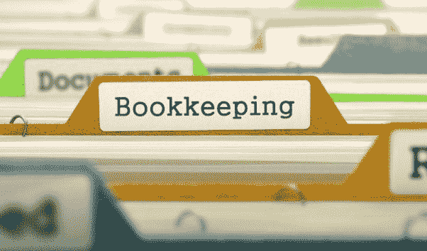

区块链

从新手到专家

2 份手稿

由

凯泽·索泽

版权

本书所有权利保留。未经出版者书面许可，本书的任何部分不得以任何形式或通过任何电子、打印或机械手段复制，包括信息存储和检索系统。

版权所有 © 2017 凯泽·索泽

免责声明

本书的目的是提供尽可能准确和可靠的信息。无论如何，购买本书可以视为同意的事实，即本书的出版商和作者在所讨论的主题上都不是专家，并且在此书中提出的任何建议或建议仅为娱乐目的。

在此书中推荐的任何行动之前，如有需要，应咨询专业人士。

在任何情况下，由于本书中的信息，直接或间接导致的任何赔偿、损害或经济损失，出版者均不承担任何法律责任或过失。

这个声明被美国律师协会和出版商协会认为公平有效，在美国具有法律约束力。

以下页面中的信息被广泛认为是事实的真实和准确描述，因此，读者对信息的疏忽、使用或误用，将使任何 resulting actions 完全由他们负责。在任何情况下，本书的出版商或原始作者都不能以任何方式被认为对读者或任何人因采纳本书中描述的信息而遭受的困难或损害负责。

此外，以下页面中的信息仅供 informational purposes 所用，因此应被视为通用。根据其性质，它没有关于其长期有效性或临时质量的保证。提到的商标未获得书面许可，且绝不能被视为商标持有人的背书。

目录 – 第 1 本书

## 第一章 – 区块链概述

## 第二章 – 金融史

## 第三章 – 比特币基础

## 第四章 – 触发器

## 第五章 – 发明家

## 第六章 – 我不是中本聪

## 第七章 – 我就是中本聪

## 第八章 – 中本聪是匈牙利人？

## 第九章 – 分布式账本系统

## 第十章 – 矿工

## 第十一章 – 区块创建

## 第十二章 – 区块链上的安全

## 第十三章 – 商业用途

## 第十四章 – 银行业的未来

## 第十五章 – 概览

目录 – 第 2 本书

## 第一章 – 比特币采矿的基础

## 第二章 – 区块链属性

## 第三章 – 对等网络

## 第四章 – 散列

## 第五章 – 密码学

## 第六章 – 数字签名

## 第七章 – 对数基础

## 第八章 – 迪菲-赫尔曼密钥交换

## 第九章 – 椭圆曲线加密

## 第十章 – 编码任意数据

## 第十一章 – 校验和

## 第十二章 – 虚地址

## 第十三章 – 区块链就是货币

## 第十四章——伟大的账本

## 第十五章——区块

## 第十六章——平台测试

## 第十七章——SegWit

## 第十八章——软分叉与硬分叉

## 第十九章——闪电网络

区块链

初学者指南

第一卷

作者

凯 izer·索泽

引言

祝贺你购买这本书，并感谢你这么做。

这本书是了解一种叫做区块链技术的绝佳入门指南。内容回避了技术细节，以便更好地让初学者理解。有一些术语可能需要一些信息技术背景知识会更有帮助。然而，并非必要。全书使用日常英语，以避免混淆，并且这本书会带你一步一步了解数字货币是如何诞生的。

为了更好地理解，我们追溯到过去，总结金融的历史，然后解释是什么触发了我们社会中几种加密货币的诞生。接下来，我们分析比特币创造者背后的理论和主要关注点。然后更深入地查看区块链可能的诞生之父的候选人。接着，我们简要分析分布式账本系统是什么，以及它是如何运作的。然后介绍矿工，他们是谁，以及他们的责任是什么。之后，我们了解每个区块是如何创建的，然后是如何最终形成一个我们称之为区块链的链条。

在最后的章节中，我们会更详细地解释我们在区块链上实施的安全措施。接下来，我们将关注理解为什么这项技术将改变世界，通过查看商业目的和未来的银行系统。最后，简要概述一下区块链是什么。

市场上关于这个主题有很多书籍，再次感谢你选择这一本！出版社尽全力确保书中充满尽可能多的有用信息。请享用！

## 第一章——区块链概述

在我向你解释区块链是什么之前，首先，我想谈谈比特币，因为有一个普遍的误解认为比特币等同于区块链。然而，这是错误的。不过，人们经常把两者混为一谈。比特币是一种加密货币，数字化货币，之所以存在和维持下去，是因为有一种叫做区块链的技术。

当区块链技术开始存在时，在平台上测试的第一个应用就是比特币。因为比特币是区块链技术上的第一个应用，有人说比特币就是区块链，这是有道理的。然而，区块链不是比特币。我希望这能讲得通。区块链如此复杂，以至于仍然很少有人能理解它的每一个部分。事实上，我们（人类）每天都在发现这项技术可以解决越来越多的问题。

我们可以说区块链正在解决问题。然而，对于一些大型金融机构来说，它也带来了一些问题。当然，这些问题正在得到解决，如果你关注新闻，你会发现越来越多的公司开始使用区块链技术来实现许多目的。

区块链确实是革命性的，因为它不仅仅为某些人解决了一个问题，而是为所有人修复了许多问题。它重新定义了金融机构，证明就是区块链已经在运行，并且已经存在了九年，始于 2008 年。区块链是一个全球分布式数据库，是完全去中心化的，这意味着它没有老板，或者我们可以责怪或奖励的人。区块链在所有计算机上运行，且不可阻挡。区块链由多个不可替代的区块组成。因此，它的链式系统代表了单一的真实来源。一旦创建新的区块并添加到现有的区块链中，它会在其网络上复制自己，该网络位于互联网上，然后同步所有运行区块链的计算机上的相同详细信息。这种复制使其不可替代。因此，它在所有管理中提供了完全透明度。由于在每 10 分钟创建新块的过程中没有人为干预，添加和进一步扩展，因此它展现出了前所未有的效率。因为每当新的区块在世界上所有的计算机上变得可见，它允许所有人完全访问。

目前区块链所处的位置，我指的是 2017 年，更像是在 1992-1993 年期间的互联网。当时发生的事情是，大多数人说：“这是胡说”，“这有什么用？”当然，在互联网的早期阶段，只有少数个人电脑，非常少的网站，而且网络速度很慢。实际上，网速慢到如果你想下载一个一页的 PDF 文件，你可能得出去吃午饭，回来后还得再等 30 分钟。对大多数人来说，互联网（互联网络）看起来是个愚蠢的主意，甚至对于那些在政治上有权力或者已经拥有大型零售基础设施的人来说也是如此。他们认为这只是背景噪音。互联网逐渐发展壮大，变得更大、更快。一旦互联网上当地的支特开放，一切都会改变。当你思考区块链时，不要假设它不会有同样的力量。目前，我们在进行大规模创新，技术发展如此之快，以至于没有人能跟上它。区块链将彻底改变这一点，所以，我们不如退一步，先来了解金融的历史。

## 第二章 - 金融的历史

这一节的目的在于理解我们存在的创新。因此，让我们回顾几百年前。

贸易一直存在于我们的生活中，因为它是食物链的必需品，并且可能永远不会消失。当你仔细观察人类生存的基本需求时，你很快就会意识到三个最重要的要求是：

-   空气

-   水

-   食物

由于空气和水在很多地方都是免费的，我将拿食物作为一个例子，开始进一步分析它。

食品从早期时代起就被确定为人类生存的三大需求之一。因此，我们已经理解到食品具有巨大的价值。像任何有价值的东西一样，它成为了全球贸易链的一部分，并在人类之间以特定商品或服务交换时，成为了最早的支付方式之一。因为食品一直有助于基本生存，所以在一段时间内，这是最好的支付方式之一。实际上，世界上有许多地方至今仍然使用这种方法。随着文明的进步，尤其是在更发达的村庄和城市，支付方式开始发生变化。那时我们没有冰箱，或者冷藏设备，使用像 exotic fruits 这样的食品支付或者任何肉类都造成了浪费。这造成了诸多问题。因此，这个问题必须得到解决。解决方案是一种新型的支付方式，这种支付方式不会轻易腐烂或浪费。然而，它必须可以与食品或其他任何商品或服务交换。

贵金属

光亮的金属被引入世界作为一种新的支付方式，比如银或金。

当然，起初大多数人并不喜欢这个想法。然而，它还是被实施了，而且慢慢地被广泛接受。它可与食物等商品交换，也可用于其他商品或服务，这确实是革命性的，直到今天，当你看看银或金的价值观，它们还在持续增长。人类已经意识到开采黄金和银越来越困难。因此，贵金属不得不作为主要支付货币被取消。

纸币

纸币的引入似乎很荒谬，因为作为人类，我们对变化感到不安，我们对理解的事物犹豫不决——至少一开始是这样。过了一段时间，各种纸币以集中化的形式实施，世界上几乎每个国家都采用了这种新的支付方式。纸币支付方式在全球范围内蓬勃发展。我是说纸币还可以，但我们可以说有无数的国家因为纸币的长期价值下降而一次又一次地失败。纸币价值的下降还有其他的根源，比如容易被大规模伪造。此外，像世界上任何其他事物一样，我们学到的是有限的供应品价值会增加，尤其是长期来看。然而，当纸币不断印刷时，情况正好相反，价值下降。说到纸币，这是一个迷人的话题。

我们多次学到，纸币是失败的，但我们一直在重新发明新的。我们相信，这次会成功。看看欧元取代了如下货币的例子：

•   德国马克

•   奥地利先令

•   意大利里拉

•   西班牙比塞塔

•   斯洛伐克克朗

•   马耳他里拉

•   荷兰安的列斯盾

•   芬兰马克

•   法国法郎

•   希腊德拉 achma（德拉克马）以及其他更多（还有更多即将到来）。

看来纸币还会在一段时间内继续存在。然而，在向前跳之前，我们在新的数字世界中又引入了一种叫做 SWIFT 的纸币形式。

SWIFT

国际银行金融电信协会

它始于 1973 年，这个新创建的网络现在使得所有金融机构能够在全世界范围内可靠地转移安全的金融交易。

这个想法，再次，确实是革命性的。使用互联网进行支付非常有帮助，更不用说，现在使用无接触卡支付简直太舒服了。在支付时实施的速度变得非常快。当你看一个国际银行交易时，可能需要 3-5 天，但你可以在家用你的笔记本或通过你的移动设备完成。然而，最初——当它被引入时——它看起来很陌生，大多数人都不相信它 ever work. 慢慢地，我们了解到某些支付可以自动化：比如支付你的账单或你订阅的服务，当然，现在大多数大型公司都是通过银行转账支付所有员工的工资。嗯，还有很多公司以现金支付工资，因为他们不想付税。这些公司选择保持匿名，而不是与银行分享他们的所有资产，出于各种原因。像往常一样，人们必须适应。所有你的财富都包含在一张塑料卡上的想法是令人畏惧的。

支付世界再次发生了变化。中央银行已经扩大规模，并推出了许多不同的系统供人们选择。一些最知名的虚拟支付方式包括：

-   Visa 借记卡

-   信用卡

-   借记卡

-   自动取款机

由于互联网的繁荣和革命，各种第三方公司推出了其他数字支付方式，以特定的费用换取额外的安全交易。

尽管价格较高，我们现在已经达到了可以与从未交谈或见面的人或公司进行国际操作的阶段。即使我们有理由不相信某个业务或特定商品；我们仍然可以继续进行交易，因为第三方保证只有在商品如描述到达后才会完成支付。例如，你使用 PayPal 为单个产品支付，仅仅是因为你知道，最坏的情况下，你可以要求退款，PayPal 会帮助你解决问题——确保如果你下单的商品或服务与描述不符，你会得到退款。

这些众所周知的中介金融系统包括：

-   PayPal

-   Payoneer

-   支付宝

-   电子现金

-   M-Pesa 等等

数字货币

2008 年出现了一种新的货币，但这次是非常不同的。这是第一种数字货币，称为比特币。它不是由知名公司或银行推出的，也不是任何政府，而是一种以区块链协议运行的软件形式。

和往常一样，最初并没有多少人对此感兴趣，他们不理解它的用途。可能需要一些研究才能理解。我们知道现金是行的，还有许多其他货币存在。我们可以使用我们的银行卡进行支付，还有许多其他支付选项，当涉及到支付时，所以为什么要麻烦呢？好吧，比特币是第一种推出的数字货币。然而，截至 2017 年 6 月，已经存在超过 730 种不同的数字货币。这对我们意味着什么呢？我有一些不在 IT 行业工作的朋友，当我和他们谈论比特币或加密货币时，他们经常会像看外星人一样看着我。

事实上，尽管有些人可能听说过加密货币，但他们仍然懒得去研究其潜力——以及它如何，将会极大地影响我们的未来。

我想告诉你们的是，当你回顾过去，分析金融机构的历史时，你可能会意识到支付形式已经显著减少到它们的物理价值。它们不仅变得更小、更轻、更薄，而且更加虚拟化，现在甚至到了我们人类不需要制造它们的程度——因为数字货币在我们的当前互联网（互联网络）上运行。

## 第三章 – 比特币基础

它是第一种已知运行在区块链技术上的数字货币。它是完全去中心化的。因此，没有人能控制它。它也被称为电子货币或数字货币。然而，它是一个点对点支付系统。因此，它是软件。它没有任何真实的存在，因为它正在你的电脑硬盘上增长。实际上，在世界上每一台电脑上都是如此。

这种货币永远不会被任何人触摸，因为它只以数字形式存在。至于它的价值，它似乎确实在波动。然而，它已经保持稳定很长一段时间：而且，一直在持续增长。回到 2008 年，它开始与美元竞争——当时一个比特币等于 0.05 美元。然而，到了 2017 年 6 月，一个比特币已经达到了 2912.00 美元；迄今为止的最高价值。多年来，比特币不仅证明它能够一次又一次达到最高点，而且它的价值增长超过了我们地球上任何其他货币的经验。

截至 2017 年 6 月，从货币兑换的角度来看，过去十年比特币对美元的表现，我可以肯定它将继续增长。

我个人认为，我们将继续看到比特币的价值增长，特别是在每四年一次的标记附近。我为什么会这么说呢？嗯，让我们这么说吧，我有自己的理由。

比特币有多少个？

这是一个好问题，你可以自己计算一下。当然，这都取决于你阅读这本书的时间和日期。

那么，在我们开始任何复杂计算之前，让我们看看一些我们确信的事实。最初的 50 个比特币是在 2008 年 10 月 31 日创造的。然后，每隔 10 分钟创造 50 个比特币，直到 2012 年。2012 年之后，比特币的产量减少了一半——意味着每隔 10 分钟，有 25 个新比特币被创造，直到 2016 年。自 2016 年以来，这个过程一直遵循同样的原则——意味着，每隔 10 分钟，将有 12.5 个比特币被创造，直到 2020 年。这个过程将继续进行，直到 2140 年，直到市场上将有 2100 万个比特币。

坏名声

万一你还没有听说过暗网，让我简单解释一下。我可以为暗网写一整本书，我将来可能会这么做。我对在线交易毒品或枪支不感兴趣。然而，仅仅因为这是暗网可以购买的东西清单，并不意味着我会参与那些市场。

你必须理解的是，我们所知的互联网——通过谷歌、雅虎或必应等搜索引擎——并不是唯一的网络。还有另一个，它被称为暗网；可以通过一个名为 TOR 的另一个搜索引擎来访问。TOR 网络也被称为洋葱路由器或洋葱网络。TOR 能够隐藏终端用户的 IP 地址；因此，使得互联网上所做的一切都完全无法追踪。

甚至你的互联网服务提供商也不知道你访问了哪个网站，只知道你访问了 TOR 网络。你可以四处看看，了解一下那里提供哪些服务，但由你决定。我之前浏览过暗网，获取了一些感受，你看得越多，发现的糟糕服务就越多。很抱歉提到这些，但我看到的东西令人作呕，对于那些容易受影响的人来说，我根本不推荐。我的观点是，在 TOR 上的枪支和毒品交易商要求以比特币的形式支付。比特币是不可追踪的，TOR 网络也是。因此，暗网是罪犯的避风港。

罪犯也使用比特币吗？他们当然使用。实际上，当涉及到在线的非法商品或服务时，他们别无选择。在你因为罪犯也使用比特币而关闭这本书，放弃使用比特币的想法之前，请三思。比特币不是为罪犯创造的。比特币是为每个人设计的，请不要忘记比特币在融资方面可以拯救的 30 亿人。

反复发生另一个问题，就是比特币账户被黑，人们钱包空空如也。请不要误解这一点。被黑的不是比特币，而是最终用户的计算机或移动设备。比特币的价值已经变得非常巨大；黑客也在不断学习提高。因此，他们再次改变了策略，意识到黑入比特币账户既盈利又无法追踪；那么，为什么不这么做呢——尤其是大规模地做？这个问题已经得到了解决，如果你决定拥有一个钱包，你必须确保你总是备份你的钱包，同时，始终启用所有的安全功能。其中一些安全功能，比如两步验证，不需要太多的学习或时间，但最好还是确保安全，而不是假设黑客永远不会找到你。

所以，因为许多人成为比特币账户被黑的受害者，他们已经停止交易或投资比特币或任何数字货币。

Wikileaks

你可能熟悉一个叫维基解密（WikiLeaks）的网站——一个负责匿名发布秘密和机密信息的非营利组织。当然，个别政府对这个网站不高兴，他们要求关闭这个网站。该网站需要基本的维护，以及安全防护，唯一能提供帮助的贡献者不得不使用比特币。因此，这个网站一直运行至今。这是最著名的例子之一。然而，还有无数的原因，人们能够向他人提供帮助，甚至向地球的另一端，都是通过比特币完成的。

有关比特币价值下跌的传言

对比特币最常见的猜测和指控是其可能的波动。为什么呢？人们常说，“如果有另一种使用相同底层技术的加密货币——区块链，能与比特币竞争，比特币会失去它的价值吗？”这些指控确实是可能的，但看看比特币价值的历史，即使有 734 种其他加密货币，也只有显著的上涨。我不是未来学家，但在分析了事实后，我认为公正地说，比特币正在上涨，并且很长一段时间内不会停止。

你能买什么？

在暗网上，你可以买到任何东西——当然——我不推荐这样做，因为你可能会遇到试图盗取或黑进你比特币钱包的罪犯。一些网络罪犯甚至可能会勒索你。然而，如果你不提供你的详细信息，你应该会没事。现实情况是，越来越多的服务接受比特币，如酒店、餐厅、咖啡店，甚至一些外卖店现在也提供使用比特币的支付方式。

大型零售公司也接受比特币，如 Shopify、TigerDirect 等。要了解它已经可以多么广泛，你必须看看你生活的地方。大城市有各种各样的选择，例如：

剧院

出租车服务

•   自行车租赁

•   私人飞机

酒吧

此外，您还可以考虑现在接受比特币的其他大型公司，例如：

戴尔

微软

•   扎纳

红 dit

Wordpress.com

地铁

艺龙旅行网

维珍银河

•   奥克杯 id

流媒体

Alza

狮门影业

•   巴杜...还有更多

通过礼品卡，多个应用程序还允许客户在网站上下单，例如：

亚马逊.com

沃尔玛

•   塔吉特

耐克

GAP

BEBE

•   西尔斯

必胜客

百思买

ITunes

易贝

星巴克

扎波斯

CVS 药房

家得宝...还有更多

我想让你看到一些最大的公司已经开始适应接受比特币的想法。此外，为了了解可以购买的商品和服务的范围，请查看您可以选择的类别列表：

航空

汽车

美容

服装

百货商店

电子商务

电子产品

汽油

礼品和玩具

•   杂货

健康

家居和花园

家装

酒店

珠宝

电影

宠物

•   餐厅

鞋子

体育用品

如你所见，类别不断增加，如果你更想知道在你附近有哪些商店可以用比特币付款，或者哪些在线平台能送到你的地区，你可以查看一下。

为什么不是每个人都使用比特币？

事实上，大多数已经意识到比特币存在的人，都太懒得做一些研究，以更好地了解其潜力。

我个人是在 2013 年第一次听说比特币，但我并没有太关注。我所理解的是，比特币是一种在线支付方式，而且因为无法追踪，犯罪分子都在用它。就这些。我关注新闻，但不知为何，除非有重大的网络攻击，黑客要求赎金，或者以比特币形式支付，否则没有人谈论它。

无论如何，2015 年底，我在学习网络安全时再次听到了比特币，所以我向我的朋友 Rob 提起了它。他说，是的，他知道比特币，它的价值就像 300 美元。当 Rob 这么说时，我简直不敢相信一个比特币竟然值 300 美元！当然，我仍然不明白比特币是什么。我以为它就像一枚真实的物理硬币，我仍然没有意识到它只以数字形式存在。然后，另一个朋友 Viktor，在听到我们在谈论什么时，说他不敢相信我之前从未听说过比特币。所以，我说，“是的，我听说过，但我不知道它这么值钱。”我开始越来越多地思考它，并开始做一些研究。过了一会儿，我突然想用我那台旧笔记本电脑制造比特币！所以，我告诉 Viktor 和 Rob 我听说电脑可以制造比特币，如果它每个值 300 美元，我可能每周能制造一个或两个。显然，我对自己在说什么一无所知，他们告诉我这并不容易。然而，他们无法向我解释它是如何完成的。他们说我想像一个黑客一样思考，我不应该这样，因为这是给犯罪分子的。但我表示，这听起来像是一项激动人心的技术。他们回应说：“好吧，那你为什么需要比特币？你想买什么？你想去暗网买东西吗？”他们让我无言以对，所以我没有再说什么。然而，我开始秘密地尽可能多地了解比特币，这当然让我了解了另一种有趣的技术，叫做区块链。

我的观点是，大多数人被假新闻误导，对于那些可能感兴趣的人来说，要理解比特币或区块链如何工作需要很长时间。因此，大多数人放弃研究，不会以任何方式参与。

## 第四章 – 触发器

有些同学可能还记得，在当年，一切都在顺利进行，直到雷曼兄弟破产。2008 年 9 月 15 日，美国历史上最大的破产案发生。当然，雷曼兄弟也在其他国家运营，那天世界各地的结果都一样。

我来自英国伦敦，当时恰好在 Canary Wharf 工作。事实上，那段时间我正在一家名叫 Nando's 的餐厅担任助理经理。发生的事情是，人们成群结队地来到我们的餐厅，手里拿着装有办公室物品的盒子。他们告诉我们，这是他们最后一次在这里吃饭了。因为那段时间我们一直在非常努力地工作，与世隔绝，所以我们一开始不明白这些顾客在说什么。

我们迅速查看了 Canary Wharf 的新闻，并意识到莱曼兄弟英国的破产（破产）不到 45 分钟前。然后我们理解并意识到，这些曾经在我们的餐厅吃午饭的人，现在可能再也回不来了。那天早上，2,000 人失去了工作。第二天，也就是 9 月 16 日，又有 2,500 人失业。我们作为管理团队决定为那些刚失去工作的人提供免费的软饮料，以表示我们的同情。当然，我们也失去了所有这些顾客，还有更多。无论如何，我只是想分享我在 2008 年经济衰退初期遇到的经历。在莱曼兄弟之后，还有许多银行和金融机构别无选择，只能选择破产。几个月来，每个新闻频道都充满了最新消息，又有大型公司失去了所有资产，一次又一次。与此同时，失业率开始上升，然后慢慢地，许多人开始因为未完成的付款而失去他们的房子。

大多数小企业不得不关闭。餐厅的顾客减少了，人们在花钱之前会三思。金融崩溃造成了大量的痛苦，不仅在美国或英国，还有许多其他国家，从那时起一直处于衰退状态。房价开始下跌，即使是有过量资格的人也在到处申请工作。然而，却没有足够的工作空缺来满足不断增长的需求。

像大多数人一样，我也在关注着新闻——这些新闻大多数时候都是被操控的，其唯一的目的就是制造戏剧和恐慌，让那些辛勤工作的人感到不安……我正在尽我所能不去伤害任何公司的形象，但控制媒体是一种极好的操纵人们、他们的信仰和自由的方式。通过媒体——如新闻频道和报纸——来接触人们，确实是创造奴隶的最好方式之一，通过让他们相信世界就是媒体所提供的样子。想想看，在一个普通的白天，你可能会遇到 5-10 个人。有人，如果不是很多人，会给你讲一个开头是这样的故事，“你听说了吗，Bla Bla Bla……”

当然，接下来，别人会问，“你从哪里听说的？”回答将会类似于这样，“我是在 XYZ 新闻频道听说的，或者在新闻中，或者在 XYZ 报纸上读到的。”所有这些都是大新闻，有时候会持续几天甚至几周，然后突然间——一切都被人遗忘了。怎么会这样呢？

有趣的是，在差不多同一时间，在一个不常去的在线论坛上，一篇名为“比特币”的论文被贴在了 metzdown.com 的密码学邮件列表上。

副标题是：一个点对点的电子现金系统。

所以，那是什么？它不是来自 CNN、BBC、NBC、CNBC 或其他任何你能叫得出名字的新闻频道。因此，它一定是胡说，对吧？是的，它很可能是假新闻，无论那是什么，它看起来都太复杂了。因此，它没能激起任何人的兴趣。这份白皮书是在 2008 年 10 月发布的，距离有史以来最大的金融崩溃不到两个月。作者自称中本聪，并解释了与这种新数字货币比特币相关的几个要点。他宣称，他找到了我们面临的最大问题的解决方案，一种被称为区块链的技术。此外，他还解释了它是如何工作的，以及这个系统已经创建出来，并以软件形式运行，利用当前的互联网作为其平台。

关于这个话题有很多猜测，你可能会找到关于究竟发生了什么的多个答案；那些最重要的答案是——为什么现在？在有史以来最大的金融崩溃之后，这样一份严肃的文件是如何被发表的？嗯，我们可能会很快找到答案，但可能性依然存在，我们可能永远不知道是什么触发了区块链技术的诞生。

## 第五章 —— 发明者

首先，我想让你明白的是，这本书是在 2017 年第二季度写的。因此，当你在读这本书的时候，有可能会有新的线索揭示中本聪是谁。

手头的现有知识让我们尝试理解中本聪是谁。

首先，中本聪是比特币的发明者，也是区块链技术的发明者。尽管这是一个假名，但这是他介绍给互联网的方式。这是一个男性名字。然而，中本聪可能是女性的可能性也是存在的。这是科技界最大的谜团之一。然而，大多数人并不想知道中本到底是谁；尽管如此，他们还是对中本创造的技术心存感激。

不幸的是，许多人认为中本聪发明了比特币和区块链技术，所以他也是那些技术的所有者。现实是，中本聪对区块链——以及比特币；因此，中本聪到底是谁真的不重要。

但是，是的，我们还是想知道幕后是谁；所以，让我们再次思考一下。中本聪可能是一个合理的人或女人——当然，他可能是一对夫妻，一组人，甚至是一群女人。中本聪可能是十个人在一起，但也可能是由 100 人组成的庞大团队。中本聪可能是一个孩子，也可能是老人。中本聪可能在他发布白皮书后就去世了，因此，他没有时间展示他的真面目。

如果你们对这些问题感到厌烦，我完全理解。所以，让我们从不同的角度思考。中本聪可能甚至不是人类。你可能认为我有点过头了。然而，想想看，在过去十年中，我们无法确定中本聪是谁；不是他住在哪里，而是他的真实身份——老实说——我们一无所知。可能有人确切地知道他是谁。然而，没有任何确凿的证据来证明中本是谁。

我一直很喜欢看科幻电影，偶然间看到一部叫做《降临》的电影。这些超级古老的电影，放到今天依然不过时。例如，在很久以前，一些科幻故事中就出现了未来可能会使用的单个物体或工具，有些我们已经开始使用了好几年。我不想详述太多具体内容；然而，想想看 80 年代的 FaceTime 通话。那是一个我们未来可能会实现的概念。而如今 Skype 和 Facebook 视频聊天已经融入了我们的日常生活。实际上，有数百万人通过手机使用 Skype 视频聊天功能，相互连接，可以聊上数小时。第一部 iPhone 是在十年前，也就是 2007 年创造并投放市场的。自那时以来，我们经历了戏剧性的变化，接下来的十年将会更加令人印象深刻。

所以，让我们回到那部叫做《降临》的电影，我希望你已经看过它了，这样我就不会破坏你的观影体验。然而，如果你还没有看过它，你可能会想跳过接下来的几行。

在电影中，我们收到外星人的访问，他们来到这里帮助我们，通过提供未来的可见性。再次声明，如果你还没看过电影，你可能会因此而恨我。这部电影的概念非常好，难怪它会获得奥斯卡奖，即使它可能值得更多，但这只是我的观点。当我思考这部科幻电影时，我会想到一个事实，它与同样的概念非常相似。我们从一个未知的人——或者我应该说从一个匿名来源——那里获得了一种名为区块链的技术，这将彻底改变我们的世界！我想知道电影制作者是如何想出这个主意的…我不是说外面有外星人，但我也不能否认这一点。我可以告诉你的是，IT 专业人士、软件开发者、体验程序员，甚至是网络安全专家都对这项技术着迷，并经常将其称为外星技术。

区块链非常庞大，当然需要数月甚至数年才能完全理解其技术细节以及它是如何组合在一起的。另外一件事是，越来越多的人说这项技术对一个人来说太复杂了。因此，中本聪不可能是一个人单干的。

所以回到那个百万美元的问题，“中本聪是谁？”

让我们来看看这些年来的一些说法，这样你就可以自己做出判断了。

你需要理解的是，中本聪在 2009 年沉默了，接下来的五年里一直如此，至少在论坛上他以前发帖并且总是活跃。

## 第六章 - 我不是中本

据说，中本聪在发表比特币白皮书时是一个 41 岁的男人。

他来自日本。然而，为区块链编写的第一个代码是用英语写的，如此完美，一个日本人写出这样的代码是不合逻辑的。这表明他一定是雇佣了某人，或者与某人合作，这个人英语非常流利，才能写出这样的代码。

2014 年，有几家报纸开始写关于多里安·中本的故事，当时他住在美国加利福尼亚州。多里的出生名字是中本。此外，其他情况使他看起来像是区块链的真正发明者。

显然，第一个想联系他的记者，以电子邮件的形式问他，他是否与比特币有关系。多里的回应如下：

“我不再参与那件事，我也不能讨论它。现在交给其他人了。他们现在负责。我不再有任何联系。’’

当然，这很可疑，记者们都在多里的加利福尼亚州家里。在意识到情况很严重后，他再次查看了他的电子邮件，并试图解释清楚。

首先，他否认与比特币有任何关联。实际上，他说直到他的儿子告诉他这个消息，他才了解到比特币是什么，于是他在互联网上查了一下。他还公开解释了以下内容：

“我与比特币无关。与开发无关。我只是一个工程师，在做其他事情。如果你看看 2001 年花费的时间，我不在那里。我在一家承包公司为政府工作。

我只是相信有人在那里放了一个虚构的名字。’’

还有一些公开的文件显示他曾为美国政府以及美国军队做秘密工作。他还有签署的文件，表明他不能承认参与他之前关于秘密项目的工作。

在这次事件之后，在一个 P2P 论坛上，真正的中本聪在五年的沉默之后，出现了一条意外的消息。

“我不是多里安·中本。’’

## 第七章 - 我是中本聪

Craig Wright 是一位广为人知的澳大利亚企业家，2015 年成为下一个可能的 Satoshi Nakamoto 的真实人物。

据匿名消息来源透露，一些关于 Craig Wright 的文件开始泄露给 Wired 杂志。其中大部分文件有一些证据，似乎表明 Craig Wright 可能是 Satoshi 本人。

其中一份，发布于 2008 年 8 月，Craig 本人表示他正在考虑发布一份加密货币论文。这份论文当然成为了原始由 Satoshi Nakamoto 发布的白皮书的非常有吸引力的候选，该白皮书于 2008 年 10 月发布，正好是一个月后。

另一个由 Wired 杂志发布的泄露信息，是 Craig Wright 的另一份声明，但这份声明可以追溯到 2009 年 1 月。这次他写道，比特币即将推出。实际上，2009 年 1 月是第一枚比特币开始运营的时候。

此外，Wired 杂志还表示，他们收到了几封电子邮件和 transcripts，证实了这种联系。

“有一份来自 Wright 致其律师的泄露信息，日期为 2008 年 6 月，其中 Wright 想象了一个 P2P 分布式账本。’’

关于 Craig Wright 的泄露信息有很多，尤其是在 Wired 杂志上。然而，一切都在 2016 年 5 月发生了变化。Craig Wright 在他的博客上表示，他现在愿意公开承认他是 Satoshi Nakamoto。

这又是一个转折点；然而，人们仍然持怀疑态度。两天后，Craig 在他的博客上写道，他最终将发布一系列文章，为他的非凡说法奠定基础。然而，Craig 并没有提供证据，而是用以下内容替换了那篇帖子：

“我很抱歉，我曾以为我能做到这一点。我觉得我可以把多年的匿名和隐藏在我的身后。但是本周的事件发展，我准备发布最早密钥的访问证明，我崩溃了。我没有勇气。我做不到。

当谣言开始传播时，我的资格和品格受到了攻击。当这些指控被证明是错误的，新的指控又开始了。

我知道这种弱点将对那些支持我的人，特别是 Jon Matonis 和 Gavin Andersen 造成相当大的损害。我只希望他们的荣誉和信誉不会因我的行为而无法挽回地受损。他们并没有被欺骗，但我知道现在这个世界永远不会相信这一点。我只能说对不起。

然后是再见。’’

由于 Craig 没有提供他是真正的 Satoshi 的证据，比特币社区将他描绘成一个骗子。

接下来，Craig 又采取了一个惊人的行动。他要求 BBC 进行采访。

他随后解释说，他就是 Satoshi Nakamoto，他发明了比特币。Craig 还表示，他为这项创造不会接受任何奖金或奖项，因为他对金钱或任何人的东西都不感兴趣，当然也不需要任何人的帮助。

当记者问他为什么躲藏了这么多年，以及他为什么现在才公开身份时，他有一个相对简单的回答。Craig 说，他并没有决定面对镜头，因为有人为他做出了这个选择，而他对目前的状况并不满意，因为这种情况会伤害到他许多朋友、家人以及员工。

接着，记者问他想要与“比特币创造者”这一概念有什么关系，但他的回答是他什么都不想要，只是继续他的项目工作。Craig 解释说，因为他创建了比特币，或者公开免费发布了一份文件，以便他能帮助人们，这并不意味着他应该成为一个知名明星，当然，也没有人应该强迫他承认他在进行什么项目。然后他补充说，他是比特币创建背后的主要人物。但是，他在完成它时得到了帮助。

接下来，记者指出了大多数人感兴趣的事情。作为比特币的发明者，Craig 肯定保存了所有比特币中的 5%，这是一大笔钱。每当交易者用美元出售比特币时，比特币的价值就会下降。然而，由于发明者拥有这么多，如果设计师在高价时出售所有这些，比特币可能会波动。

接下来，记者问他到底有多少比特币，以及他已经部署了多少。Craig 只是回答说，他有多少并不重要，重要的是他什么时候真正部署它们。

然后，Craig 在演讲结束时解释说，他知道有些人会相信他，有些人不会，但他不在乎，因为他永远不会出现在镜头前。

事实上，Craig 非常具有说服力，我个人不知道该说什么。我不会对他或 Dorian 进行评判，但我们生活的世界确实很奇怪。想想吧。首先，我们期待一个声称与之一切无关的人，然后我们发现一个承认是他的人，我们却不相信他。这听起来就像我们永远也找不到真正的中本聪一样，对吧？

Craig 展示了他是如何启动第一笔比特币交易的。然而，他只允许一个人看到，那是一个没有技术知识的记者。普通的科技专家并不信服。此外，Craig 声称他从未想过站出来面对镜头。然而，既然他这么做了——声称自己是真正的中本聪——他以提供证据他完成了第一笔比特币交易，以及他可以展示证据的方式为例。正确的方式之一，就是让一个比特币专家来看，这个人也可以证实他并没有说谎。他的方式有点假，因为没有人可以 100%确认他真的是他所声称的人。

那么，重点是什么？嗯，有些人一直在猜测，如果 Craig 声称自己是中本聪，真正的中本聪会以某种形式发送消息，以便被追踪到。然而，自从真正的中本聪以来没有任何消息，就像 Dorian 的案例一样。

当你考虑这件事时，如果你是世界上最富有的人之一，你会去 BBC 并向全世界透露这一点吗？向世界发言不仅仅是让普通人面前受欢迎，它会让 Craig 立即面临网络犯罪分子和黑帽黑客的攻击。这是如此简单，任何人都能立即理解。所以，当你考虑一个足够聪明，能实施一项将改变，事实上已经在改变世界技术的某人时，你不会考虑到黑客吗？

正如我提到的，大多数 IT 专业人士并不足够确信；因此，关于谁是真正的中本聪（Satoshi Nakamoto）的问题依然存在。

## 第八章——中本聪是匈牙利人？

有些人认为区块链技术的背后天才可能是 Craig，有些人认为是 Dorian。然而，比特币社区的大部分人认为他们与比特币或区块链没有任何关系。实际上，70-80%的人相信其他各种可能性，所以我来给你们解释其中的一些。

Nick Szabo

根据某些研究者的说法，最大的理论之一是 Nick Szabo 可能撰写了比特币白皮书。当他们比较了十多个可能与比特币创建有关的人时，Szabo 的发表作品在语言上与中本聪发布的原始白皮书最接近。

Nick Szabo 是一位计算机科学家；此外，他还是一个出色的密码学家，著名的比特币专家。另外，他因关于区块链技术、数字货币和智能合约的演讲而闻名。

许多人对这些话题中的任何一个都感兴趣。特别是，知名区块链或比特币演讲者。然而，很少有人知道这些所谓的专家在比特币诞生之前做了些什么。另一方面，Nick Szabo 在 1998 年就有了一个去中心化数字货币的想法，他称之为“Bit Gold”。多么巧合啊！Nick 不仅有这个想法，而且还开发了一个机制，最终创建了 Bit Gold。Nick 并没有每天在博客上发帖。事实上，他甚至没有发表过任何东西：然而，当比特币在 2008 年创建时——就在比特币正式发布两个月后——Nick 开始更深入地撰写关于 Bit Gold 的文章。实际上，关于他的事情并不多为人所知，一个很好的例子就是至今没有人确认过 Nick 的出生日期，正因为如此，其他好奇的人开始进一步调查 Nick。

根据维基百科，Nick 是一位乔治华盛顿大学的法学教授；然而，联系学校后，他们发现没有名叫 Nick Szabo 的记录。这再次表明，他的真实姓名可能甚至不是 Nick Szabo，因为那可能只是他的笔名。

关于 Nick，所知甚少，因为没有可验证的年龄、教育、地点，甚至以前的职业；因此，在技术界，他已成为比特币之父的头号候选人。

显然，每次他被问及是否与比特币有关时，他总是予以否认，而且至今，他再次保持了沉默。不幸的是，说到媒体，有很多虚假的新闻，令人难以置信。21 世纪初，互联网是唯一真正的新闻来源；然而现在，由于大多数报纸已经上网，要找出真相需要花费大量时间。话说回来，那些总是试图寻找真相的人，确实不读报纸和假新闻频道，我说的就是只研究技术的 IT 专业人士。即使当区块链这样的技术发明出现在新闻中，这些书呆子也会变得着迷，想知道谁是这样一个伟大的设计师，并开始他们的研究，直到找到真相。目前看来，大多数技术大师都把 Nick Szabo 视为比特币的真实创造者。

如我之前提到的，当谈到可能是区块链技术之父的候选人时，有很多假设。这取决于你问谁；然而，我想介绍一些可能参与了比特币创建的主要人物。

团队合作

许多人认为，由于区块链的复杂性，可能涉及许多角色，而不仅仅是某一个特定个体。当 Craig 被问及时，他表示自己有帮助。然而，他才是背后所有事情的主要人物。因此，许多人开始相信的不是 Craig，而是中本聪可能代表一组人，而不仅仅是一个人的名字。

在日本，Satoshi 意味着清晰的思维或智慧，Naka 意味着里面，而 Moto 意味着基础。这三个词可以以许多方式组合在一起。然而，最常见的一种可能是，他或团队正在宣布类似于：我智慧，并且我完全理解这个系统从内到外。你可以用我们替换掉我。然而，区块链肯定不是一场误会。这种技术的创造确实需要清晰的思维，并且必须完全理解它的每一个细节，最后，区块链是一个巨大的基础。

当然，反向思考者自信地说，由于区块链的结构，这个想法一定是在一个单一的头脑中产生的。因此，有一个团队一起思考，创造类似的东西，就不会像现在这样详细。我指的是不是普通技术员，而是软件开发者，并且从互联网的早期就开始参与构建互联网的人。再次，尼科·萨博出现在脑海中，而不是一个澳大利亚商业巨头，也不是一个长时间没有参与任何事情的老日本人。

我现在将结束这一章，让你的想象力决定中本聪（Satoshi Nakamoto）是谁。然而，如我之前提到的，这可能全部取决于阅读这本书的日期；但是，到现在，区块链技术发明近十年后，我们仍然没有证据可以证明 100%中本聪是谁。

## 第九章 – 分布式账本系统

这本书是初学者指南。因此，我将尽我所能，用最少的 technical 术语解释账本系统是什么。

首先，我会建议你将账本系统想象成一棵家族树；然而，代替人名的，庞大的账本系统包含了关于支付价值和地址的信息。关于金额价值，账本持有所有支付记录，回溯到最初的交易。关于地址，没有 URL 或地理位置地址。相反，这些都是比特币或其他加密货币的地址。账本持有所有加密货币的一系列交易。

此外，不断计算前一次转账的当前值。账本的一部分表示了已经分配的价值，账本的另一部分则代表了每一笔交易的日期和时间。这与任何现有的银行系统都非常相似。

你可以看到谁向哪个账户转账，什么日期和时间，以及每笔交易的金额；然而，账本没有银行家。此外，地址不代表个人姓名，也不代表谁持有多少金额；因此，你可以称这是一个匿名账本系统。你需要理解的是，当涉及到没有亲属的个人的银行账户时，银行可能会冻结那个账户。除了银行，甚至警察、FBI 或任何政府官员如果找到可能的原因，都可以冻结任何银行账户。当涉及到在伟大账本中的比特币账户时，唯一能访问它的人是拥有那个账户密码的人。

当然，这是危险的；如果你不小心丢失了记录在你比特币钱包中的密码，无论它有多少价值，都将永远丢失。对于你的银行账户来说，如果你丢失了密码，你可以给银行打电话，他们问你一些安全问题，一旦你证明你是那个账户的所有者，银行就会为你提供访问权限。另一方面，对于比特币账户来说，没有银行能帮助你访问你的账户。因为账本对任何人都是可见的，它是完全去中心化的。因此，每个人都可以看到你的比特币账户，以及这个钱包有多少价值。然而，没有人能告诉你这个账户和你有什么联系。

由于区块链技术的存在，每一笔交易都被确认其有效性，并进入一个区块；然后每个区块将加入之前验证过的区块，最终它们都将形成一个区块链，我们称之为区块链。每个比特币公民都被要求保存区块链的副本，在系统创建每个区块之后，每个区块链成员都会收到一个最终封存的区块。

然后系统会自动检查每个区块，并将每个区块添加到每个公民那里。这就是区块链如何保证每一笔交易和每一个曾经创建过的价值。这些方法确保了每一笔交易的有效性和正确性，而无需任何中心权威。如果这一切对你来说听起来很陌生，只需理解这一切都是系统完全自动完成的，而你作为比特币公民，无需进行任何计算，反正这也可能需要花费很长时间。

每笔交易一旦被验证，就会被封闭到账本中；这个过程由矿工完成。当一个新的验证过的区块到达时，每个新的区块必须添加到每个公民的区块链中；然而，在接受新区块之前，每个人都必须检查新区块中所有值的逻辑延续性，以确保所有费用的转移都是合法的。这也防止了任何转移的复制或黑客进行的任何伪造行为，或者有不良意图的人试图窃取比特币或其他任何加密货币。这是一个关键的步骤，因为这种验证将永远保存在伟大的账本和区块链中。这个过程使用哈希进行竞争，以验证每个区块，并确保每个公民收到相同的记录。

希望我通过添加一些关于账本如何变得去中心化和它用于验证每笔交易的流程的额外信息而没有让你感到困惑。事实上，技术上多个协议在一起工作以实现每个验证过程。同时，你也必须理解，每秒钟有数千次操作。因此，我尽可能地避免了技术性描述。

## 第十章 – 矿工

让我们先考虑新的价值是如何进入这个系统的。回到 2008 年，中本聪最初只创造了 5 万个比特币来启动这个过程。如果你细想一下，如果他一开始就构建了全部的 2100 万个比特币，那么比特币将一文不值，这个想法也会被认为是愚蠢的。相反，中本聪从创建一定数量的比特币开始。

然而，随着比特币社区的壮大，越来越多的价值将需要系统保持活力。为了让系统维持下去，需要一个特定的过程；中本聪通过创建一个角色解决了这个问题。这个解决方案不仅解决了一个问题，而是两个问题：

1. 永久性验证交易

2. 将新价值添加到现有系统中

这个角色的称呼是矿工。

矿工可以是个人，也可以是任何比特币公民。然而，随着时间的推移，许多大型公司纷纷成立，比如 Genesis Mining，作为个人，你可以加入并租用他们的挖矿设施。还有许多矿工在多年来创建了矿池，其中许多也提供加入这些矿池的原因，我将在稍后讨论。

首先，请允许我解释为什么他们被称为矿工以及他们的工作内容。之所以称他们为矿工，是因为人们常把他们的行为与挖金矿或其他贵重金属的矿工相比。他们共同努力创造新的价值，就像金矿工人在地下挖掘一样。然而，比特币矿工是在把每笔交易记录在账本上封存。因此，我们也可以称他们为最终确定者或验证者。

为了获得这样的工作报酬，矿工获得比特币，这也是新价值进入系统的方式。矿工通过特定流程验证、验证、认证和最终确定交易。一旦矿工创建的新区块被公民接受，交易的记录就不能被修改，使其成为永久性信息。这也将变得不可撤销。因此，将来没有人能挑战它或改变它。

矿工的工作是封存区块，本身就需要巨大的计算能力，确保无法轻易复制。每个矿工可能使用多种方法进行验证过程。一些矿工可能使用不同的软件，甚至创建自己的内部软件来加速验证过程。然而，无论他们使用什么软件，因为所有的工作都将受到检查。当一个矿工开始收集已经在网络上广播的交易时，然后开始检查这些交易，最终将这些传输和操作封存到一个新的区块中。

矿工为每个添加到区块链上的封存区块获得比特币作为奖励。

## 第十一章 - 区块创建

解释每个区块的创建可以有多种方式；然而，有些解释可能非常令人困惑，但这还取决于你对技术的理解程度。因此，第一次听到或阅读可能难以理解。

我已经解释过，矿工在验证每笔交易方面有一个非常规的角色，即以区块的形式进行验证。现在，让我们讨论创建每个区块需要什么。

1.

开始一个新的区块。即使矿工已经完成了一半的区块验证工作，最终，他们还是会放下一切，专注于开始一个新的区块。

2.

选择新的交易。这时矿工正在从通过网络传播的成千上万次操作中进行选择。

3.

检查交易的优先级。这次矿工可以通过开始一个新的区块回到第一步，如果他们发现之前选择的交易并不那么重要。然而，如果优先级高，矿工可以继续进行到下一步。

4.

检查交易是否有效。这是每个矿工都必须检查的过程，没有任何矿工可以跳过这一步。然而，如果发现交易是伪造的，或者无效的，矿工必须停止流程，回到第一步，开始一个新的区块，并获取另一个，希望是有效的交易。

5.

接受交易。如果之前的交易被测试为有效的交易，它就必须被接受。

6.

封存交易。再次强调，如果交易被认为有效并被接受，现在就需要封存这笔交易。

7.

将交易添加到区块内的交易树中。这个过程只能在完成所有先前步骤的验证之后才能进行。

8.

检查交易的大小。矿工需要检查交易树中是否有足够的交易来封存区块。如果交易还不够多，矿工将无法封存区块，直到有足够的交易。因此，矿工必须回到选择新交易的第二步，一次又一次，直到有足够的交易来封存区块。

9.

检查干扰。这个过程是矿工必须确保没有其他矿工在同一时间用同样的交易封存区块。

10.

封存区块。一旦有足够的交易可以封存区块，矿工就会封存区块。

11.

广播区块。矿工必须广播已经封存的新的区块；然而，如果矿工在封存区块的过程中被打断，他们可能需要重新开始一个新的区块。

12.

开始一个新的区块。这是这个过程的下一步；然而，正如你所看到的，我们现在又回到了第一步。如我所说，矿工在封存区块时可能会被打断，一旦他们广播出去，如果另一个矿工已经用同样的交易在一个区块内封存了区块，这个区块将不会被接受。因此，你必须开始一个新的区块。

每个区块大约每 10 分钟创建一次。因此，每天创建 144 个区块。

如我之前提到的，成功将新区块添加到区块链的矿工们会获得一定数量的比特币作为奖励。

每个新区块创建的奖励曾经是 2008 年至 2012 年的 50 比特币。新区块的奖励每四年减半；因此，从 2012 年至 2016 年，每个新区块的奖励曾经是 25 比特币。

目前，自 2016 年至 2020 年，添加到区块链的新区块的矿工奖励是 12.5 比特币；然而，从 2020 年起，仅 until 2024 it will be 6.25 比特币。这个过程将持续到 2140 年，直到最后一个比特币被创建。

## 第十二章 - 区块链的安全性

有些人可能会想，“好吧，区块链是一项将积极改变世界的高科技。”但是，问题依然存在，“它是安全的吗？”

简短答案是肯定的。但首先，让我们思考一下这个系统目前所取得的成就。现实情况是，任何连接到互联网或连接到一个有网络连接的系统的东西都可能被黑客攻击和妥协。

当然，很多设备没有使用任何连接，但一旦你获得了物理访问权限，它们仍然可能被入侵。这可能是指一个可以用 Linux 光盘启动并入侵的笔记本或台式电脑。如果你想要深入了解，让我们以银行为例。它们的系统经常被入侵；当然，它们已经停止宣布这类事件，因为如果继续这样做，它们将失去所有客户。FBI 局长在 2015 年底被一名青少年入侵，大多数人认为这很有趣。然而，当你考虑到 FBI 内部的网络安全性时，尽管组织得很好，但仍然可能被入侵。FBI 可能不是提及的最佳例子，因为即使是凯文·米特尼克也入侵了 FBI 长达三年之久，并监听了特工的电话通话，谈论自己。当你看到国家安全局（NSA）时，你可能已经听说过爱德华·斯诺登，他带走了被认为是机密的文件；这仍然表明即使是 NSA 也有弱点。机密或甚至秘密文件可能会被泄露。所有那些昂贵的防火墙、入侵预防系统或入侵检测系统，如果它们没有正确升级，都是无用的。此外，你必须理解，拥有所有的安全措施并不意味着什么，如果有人具备社会工程学技能并找到了那些设备的密码。结果将是戏剧性的，而且总是如此，但大多数大型金融机构已经停止向新闻渠道谈论被黑客入侵的情况，因为这只会损害他们的形象，并成为他们的尴尬。

由于公司保留所有数据的集中化，黑客只需要针对特定的组织来入侵其系统；这就是为什么黑客确信任何东西都可以被入侵。入侵任何系统，只是时间问题以及适当的计划；然而，当涉及到像区块链这样的系统时，可能性非常小。尽管专家表示这是不可能的，但这仍然需要巨大的计算能力。区块链没有防火墙或任何检测或预防系统来保护它。相反，区块链的力量来自于它完全去中心化的特点。我的意思实际上很简单。不过，我会尽力用日常英语来解释。

因为区块链是一种开源技术，任何人都可以运行该软件。你可能选择永远不要购买比特币，或者投资任何加密货币。然而，通过运行一个名为区块链的软件，你可能会成为区块链社区的一部分。该软件本身可以免费下载和使用，你完全不必对任何人负责，但一旦你决定运行它，你就成为了区块链社区的一部分。一旦成为这样的成员，你的设备将成为区块链的一部分，每当创建一个新的区块时，你的设备也会获得该交易的副本。

由于你的设备现在已经成为了区块链的一部分，这是另一个应该被黑掉以彻底破坏区块链的设备。因为你的设备现在正在运行区块链软件，它现在也为现有的去中心化系统做出了贡献。没有集中副本，每个用户都像其他用户一样受到信任。我的意思是，没有主节点存在，因为每个设备都有相同的复制的信息，使得黑掉它几乎是不可能的。区块链已经运行了近十年，从未被破坏过，一次都没有。这很迷人，因为区块链为任何能破坏系统的人提供了 70 亿美元的赏金，而且赏金是匿名的。由于区块链悬赏的价格，它已经成为许多黑帽黑客、大型犯罪组织以及网络犯罪团伙多年来主要的攻击目标。

尽管如此，区块链尚未被黑客攻击，甚至没有任何形式的减缓发生。这表明核心功能已经结构得非常好；但是，如我之前提到的，任何东西都可能被黑掉，因为这只是一个时间问题。IT 专业人士总是认为，随着技术的快速发展，未来一切皆有可能。量子技术定义了区块链系统可能被黑掉的方式。然而，这需要迅速地黑掉目前运行区块链软件的百万台以上的机器。此外，要实际黑掉所有这些设备，需要极快地实施才能成功。

关于中本聪本人的猜测仍然处于阴影之中；更重要的是，由于我们不知道他是谁，也不知道他有什么能力，有一点是肯定的：他设计了这套系统。因此，他有访问他创建的第一个区块的权限，如果他愿意，他可以操纵区块链系统。随着时间的推移，现在存在多种区块链技术，比特币本身也已经增值；人们也开始大量投资各种加密货币。多年来，人们已经对中本聪的真实身份失去了兴趣，或者他可能已经被完全忘记了；然而，如果他还活着，并决定操纵系统，这是可能的，但我确信结果可能对大多数人都不利。

## 第十三章 - 商业目的

在技术领域，有很多极客，包括我。然而，有些人彼此之间有所不同。

我怎么给你定义一个极客呢？嗯，有很多不同类型的极客，所以让我先从友好的极客开始讲起。

电子游戏改变了世界，许多年轻人，甚至成年人，都对他们最喜欢的游戏着迷。对于那些从未通宵达旦或连续几天玩在线游戏的人来说，他们可能很难理解为什么某些人会沉迷于电子游戏。

那些只是喜欢玩游戏并花钱在游戏上的人是一回事，但还有其他类型的极客。一些书呆子对新技术和新软件着迷，并坚信他们必须尽快尝试，即使其中一些软件是从非法的种子网站下载的。当然，还有其他极客，他们不一定会免费下载所有东西，而是会购买原版软件或工具，以拥有真正的东西而感到更好。正宗的软件总能给人一种更好的感觉，许多极客也是出于对创作者的尊重而购买它，这对软件开发人员和设计师的支持有所贡献。

当谈到区块链时，最近成立了许多公司，它们正在设计一种特定的协议，这种协议可以让某些在线游戏通过使用它们自己开发的加密货币来玩。更上一层楼的是，它们还创造了出色的在线游戏，一旦游戏玩家加入并开始游戏，他们就会通过提供 CPU 或 GPU 力量（从他们的游戏 PC、PlayStation、X-Box 等设备）来参与他们的加密货币。由于这些协议将被充分利用并不断贡献，因此其价值将开始大幅增长。正如你所看到的，区块链不仅允许创建一种新的加密货币，还允许创建一个在线游戏社区，这个社区将使用特定的区块链技术。

我已经举了一个游戏方面的例子。然而，现在有许多公司正在使用类似的区块链技术，比如按需音乐、按需电影、社交网站等。

到目前为止最大的发明之一，利用区块链技术创建了智能合约，比如以太坊。至今还存在着许多其他的替代性区块链，每一个都将在某个时刻塑造我们的未来。

还有一些其他重要的选择，包括各种去中心化的众筹、医疗保健、供应链、博客网站和实时分享；但最大的是物联网（IoT）。

IoT，也被称为物联网，对于区块链来说，近年来增长迅速。物联网也被称为智能设备或连接设备，这些是物理设备，甚至是无人驾驶汽车。这些设备的目的登录到网络，开始相互共享数据。自动化日常生活是一个小规模业务，比如软件、电子和传感器会相互连接。然而，当涉及到大规模时，那就是赚钱的地方，比如虚拟电厂、智能家居、智能交通，甚至是利用区块链技术运行的智能城市。有大型的商业计划，需要多年的规划；然而，允许这种技术，现在已经存在。这些项目将提供将物理世界直接集成到基于计算机的系统的机会，从而提高效率、准确性和经济效益，同时减少人工干预。

M2M - 机器对机器的通信已经存在。然而，区块链将超越这一点，通过加速虚拟化和信任收集数据到区块，帮助更有效地使用我们的数据。

## 第十四章 - 银行业的未来

目前，全世界有数千家银行。因此，当前的银行系统明天不会停止。如果不超过十年，就需要十年。然而，现在已经存在使用除银行之外的其他方法的技术，所需要的是让所有我们的商业伙伴、员工或雇主都应用区块链技术。实际上，真的很简单。然而，我们中的大多数人非常适应目前的系统；因此，变革可能会需要很长时间。

黄金

当黄金被废除，纸币被应用时，花了很长时间才实施并让大家都明白，现在的工资不是用黄金支付，而是用纸币。如我之前提到的，黄金在大多数国家仍然是一种优秀的支付方式；然而，它并不是到处都被接受。

当你去当地超市时，你不能用黄金支付，有些地方可能可以；然而，大多数地方不会接受。同样，当你在线购买东西时，你不能用黄金支付，还有其他原因，因为它是一种古老的方法。

首先，让我们看看黄金的灵活性。想象一下，你想去当地的咖啡店喝一杯卡布奇诺。用黄金支付卡布奇诺的想法是令人畏惧的。你怎么向店主分割或切割正确数量的黄金，而且，如果你一开始切割得太大怎么办？任何贵金属作为支付方式都无法广泛实施。它很重；它很难切割或敲碎到所需的正确数量；因此，将来用它作为货币的想法是不合适的。

现金

不幸的是，纸币，现金，一直在不断印刷。因此，无法确定市场上有多少。它印刷得越来越多，它的价值就越低。从历史中，我们已经了解到，过了一段时间，印刷的现金越来越多，最终全部变得一文不值。通货膨胀成为主要问题，很多人把所有储蓄都存在银行里，然后政府开始为所谓的新的经济印刷新的纸币。

问题是，这个系统已经多次惨败；因此，我们都知道它是毫无价值的。问题在于，这个系统是由政府和银行中心化的，普通人无法对抗。而数字货币却是不可阻挡的，像比特币一样，可以迅速改变当前的系统。

纸币的另一个问题是非常容易被伪造。每天有无数的涉及各种纸币的事件。不管纸币制作得多好；它可以被复制。因此，伪造总是会存在的。另一方面，加密货币无法伪造，无法复制，无法伪造。因为区块链代表了信任和确切的数字货币金额，只要记住这一点，你就必须明白，加密货币很容易就能超越任何纸币，尤其是如果它是中心化的。

是的，这是真的！比特币总共只会被创建 2100 万个。那么如何让每个人都有足够的比特币呢？嗯，每个比特币有 1 亿个 Satoshis。我不太擅长数学，所以我使用计算器来了解将产生多少 Satoshi，这个数字看起来是这样的：

2,100,000,000,000,000。

地球上大约有 80 亿人。所以接下来，我将这个庞大的数字除以 80 亿，以了解平均每个地球上的人可以平等分配多少 Satoshis。我得到的结果是：262,500。

现实情况是，目前，60%的人口在他们的一生中甚至永远不会拥有 20,000.00 美元的储蓄；但是，在你认为这是最终结果之前，让我告诉你另一件事。区块链技术允许每个 Satoshi 被分成其他分数，比如另一个 1 亿个碎片，如果这还不够，这些碎片可以进一步分成另一个 1 亿个更小的部分，等等，等等。说到这里，我希望你明白，比特币本身，在全新的货币领域，可以满足全世界的需求。但是，已经有许多其他的货币了，银行也开始考虑创建自己的数字货币。

Ripple

目前使用 swift，进行国际交易可能很痛苦。不像比特币和其他加密货币那样需要几秒钟，它可能需要 3-5 个工作日。

除了转账时间过长，它可能也不适用于个别国家，更不用说手续费了。使用基于区块链平台的加密货币进行支付不仅速度极快，而且费用极低——甚至可能没有。另外，任何人都可以在线拥有比特币钱包。

任何人——意思是任何人。当你去银行开设新账户时，你必须符合银行所询问的所有标准。这可能包括，你必须有一个有效的地址，你必须年满 18 岁，你必须有雇主出具的证明，证明你的职业以及工资等等。相反，如果你有一个智能手机，你甚至可以不满足上述任何标准而开设一个比特币账户。然后，在几秒钟内，你就可以开始进行国际交易。

正如你所看到的，当前的问题在于，如果我想要向你买东西，我必须从我的银行通过 PayPal 转账到你的银行，最终支付给你。至少需要一个所谓的可信赖的第三方来完成支付。然而，区块链将为我们验证那笔交易。因此，我们不再需要银行或任何其他可信赖的第三方。所有必要的只是一点点互联网接入时间。

你必须明白，目前有超过 20 亿人没有银行账户，出于各种原因。他们可能不够资格；他们可能甚至没有合适的衣服进入银行。当然，他们可能只是选择不拥有银行账户，但大部分情况下，很多人只是住得太远，无法到达任何银行。因此，他们决定不拥有银行账户。他们可能在这里那里有互联网接入，所以这也可以成为他们的银行，对吧？为什么不呢？这对他们来说将非常有利，而且这已经在很多人身上发生了。

银行意识到创建自己的加密货币可能是个好主意，这样在区块链接管世界的情况下，至少他们已经为巨大的繁荣做好了准备。

Ripple 网络于 2012 年作为一种新的货币交换协议诞生，其货币称为 Ripples。它支持美元、欧元、英镑等传统法定货币；然而，它也可以与大多数加密货币以及商品进行交换。谈到市值，Ripple 通过证明自己是交易者的好投资，确实迈出了巨大的一步。截至 2017 年 6 月，Ripple 在比特币和以太坊之后成为第三大货币。

-   已经有多家大型银行参与 Ripple，这个新的支付协议几乎为任何国际支付转移保证不收取费用。在投资 Ripple 之前，我建议你做足研究。问题是，Ripple 是中心化的。因此，一旦涉及到你的 Ripple 账户，它提供更大的安全性；然而，关于未来潜在的增长，这是一个完全不同的问题。因为银行已经控制了 Ripple，它们可以随时操纵其价值；因此，你选择支持银行多久是你的选择。

## -   第十五章 - 概览

-   我希望你已经对区块链有了初步的了解，以及它的发展方向。我很快会写另一本书，更深入地解释区块链。然而，这本书是入门指南。因此，我尽量避免使用技术术语。

-   你需要理解的是，区块链和比特币并不是一回事。区块链是一种技术，其首个应用平台名为比特币。比特币是区块链，然而，比特币本身，只是一个能够取代法定货币的加密货币。然而，并不是很多人一开始就会喜欢这个想法。区块链解决了我们一直面临的问题，那就是信任。使用区块链技术可以让我们避免信任第三方服务。因此，互联网上的任何支付或交换都只涉及两方。这是革命性的，我们可以扩大信任范围，未来的市场不仅会更快、更便宜，而且不会有任何限制，比如年龄、种族、性别、职业、国籍等等。

-   如果你告诉你一个从未听说过区块链、认为与自己无关的朋友，试图解释每个人都会受到区块链的影响。虽然区块链不会在一天之内接管世界，也可能需要十年或二十年。然而，每个人都受到影响。

区块链也被称为货币的未来；尽管流动货币对一些人来说听起来很奇怪，但这不仅会发生，实际上已经在近十年中开始了，并且不会停止。使用区块链进行数据保护将非常安全，并总是提供真相。

-   因为这项高科技让我们成为自己的银行家，我们未来可能不再需要银行。然而，因为我们得看看我们拥有什么，一定的 IT 技能将帮助我们更安全地抵御网络犯罪。一旦你理解了如何在网上安全地保管你的贵重物品，你也会意识到这比开银行账户还要容易。

因此，年轻人和下一代将加快了解加密世界的过程。当然，有些人可能不得不通过艰难的方式学习，因为许多人已经被黑客攻击，才开始投资学习和实施安全措施。尽管如此，区块链的时代已经到来，它将改变世界。

普通人，没有技术背景，可能不会相信，可能会说区块链本身没有什么能力。然而，软件开发者、安全专家、大型金融机构、金融科技公司初创企业和银行，已经表现出浓厚的兴趣，并开始投资和创建自己的协议。英特尔、微软、思科系统、戴尔和其他许多大型高端科技公司，已经对区块链及其微小复杂性产生了浓厚的兴趣。因此，到达变革的盛大爆发，未来技术，或者说，下一个互联网的时刻，指日可待！

## 结论

感谢您购买本书。我希望这个标题能为您提供一些关于金钱未来的幕后花絮的洞察。我试图避免使用区块链工作方面的专业术语，以便让每位读者都能受益。然而，我即将出版的关于区块链的书将详细介绍开源的原始协议，以及如何从零开始创建您自己的数字货币。

此外，我将详细介绍如何安全地开始投资加密货币，以及它们之间的区别。

我还将指导您如何通过租用设备成为矿工，以及如何使用您的笔记本电脑或甚至 Android 手机开始挖掘数字货币。

最后，如果您喜欢这本书，请花些时间分享您的想法并留下评论。这将是非常受欢迎的！

精通

区块链

高级指南

第二卷

作者

基兹勒·索泽

版权

版权所有。未经出版商书面许可，不得以任何形式或通过任何电子、打印或机械手段，包括信息存储和检索系统，复制本书的任何部分。

版权所有 © 2017 基兹勒·索泽

免责声明

本书的出版目标是提供尽可能准确和可靠的信息。无论如何，购买这本书可以被视为出版商和本书作者在所讨论的话题上都不是专家，并且本书中提出的任何建议或建议仅为娱乐目的的同意。

在采取本书所倡导的任何行动之前，如有需要，应咨询专业人士。

在任何情况下，由于本书中的信息，出版商都不会因任何赔偿、损害或金钱损失而承担任何法律责任或责任。

此声明被美国律师协会和出版商协会认为公平有效，在美国具有法律约束力。

本书中的信息被广泛认为是真实和准确的，因此，读者对信息的任何疏忽、使用或误用，都应由他们自行承担后果。在任何情况下，出版商或本书的原始作者都不能以任何方式被认为对读者或其他人因采纳本书中描述的信息而可能遭受的任何困难或损害负责。

此外，本书页面的信息仅用于提供信息，因此应被视为普遍的。根据其性质，它没有关于其长期有效性的保证或临时质量的保证。书中提到的商标未获得书面许可，因此不能被视为商标持有人的背书。

**引言**

祝贺您购买本书，并感谢您的购买。

本书是了解称为区块链的技术的高级指南。内容非常技术化，因此建议先阅读第一卷。本书使用精确的细节为初学者提供更好的区块链理解；然而，书的第二部分更深入地解释了区块链的工作原理。了解一些信息技术背景会有帮助，但不是必需的。全书使用日常英语以避免混淆，并会带你一步步了解区块链属性是如何工作的。

区块链是基于多种现有技术共同工作的基础，这本书将揭示每一个技术，以便你更好地理解。阅读本书中解释的每一项技术，将使你更接近于掌握区块链，深入理解它如何提高数据完整性，以及增强数据安全性。接着，它将解释终止可信第三方服务并使用数学算法和数字签名替换它们的优点。然后，它解释了什么是 100%数据可用性，使用一个完全去中心化的点对点网络，以及数据如何始终可用。

最后，通过解释闪电网络以及它如何通过更快、更便宜的支付交易帮助我们，以及员工工资可以如何支付，不是每天，而是每秒。

**比特币就是区块链！**

虽然有些人认为比特币是主要的焦点，但区块链是比特币的遗产。区块链是比特币背后的技术，这种“虚拟货币”正在改变人们的商业方式。

**你为什么要读这本书？**

•   像英特尔、微软、思科系统和戴尔这样的技术巨头已经投资于学习区块链。

世界上最大的银行和金融机构已经使用区块链技术创建了自己的加密货币。

•   金融科技公司意识到智能合约正在改变商业运作的方式，利用区块链平台。

•   每天都有成千上万的初创公司投资于区块链，适应未来的技术！

为什么这么炒作？

•   一个单一的银行系统每年可以节省 80-150 亿美元，使用区块链

•   终止可信的第三方服务，用数学算法和数字签名来替代它们。

•   更快、更便宜的支付交易，实际上，员工工资可以不是每天支付，而是每秒支付。

•   通过消除单点故障，更好地保护数据。

•   100% 的可用性，通过一个完全去中心化的点对点网络，数据总是可用的。

区块链将革命化各种商业。区块链技术正在影响商业的未来，因此，不要落后，现在就利用这个机会，学习如何掌握区块链！

通信将受到影响，实际上，已经在进行中并且到处可见：

•   个人对个人

•   商业对商业 - B2B

•   M2M（机器对机器）

这本书包含了深入的信息，将帮助你理解区块链技术。它是一本详细介绍所有区块链属性以及比特币背后技术如何工作的指南。

这本高级指南是了解以下内容的绝佳选择：

•   区块链是什么，

•   它是如何提高数据完整性的，

•   它如何从根本上改变商业的未来，

•   它是如何增强数据安全的。

市场上关于这个主题的书有很多，再次感谢您选择这一本！竭尽全力确保书中充满了尽可能多的有用信息。请享用！

## 第一章 - 比特币挖掘的基础

我假设你已经对区块链有了基本的理解，因为这本书将深入探讨人们不愿意谈论的知识和琐碎细节。就像每种现有技术一样，当涉及到区块链时，也是真实的，只有少数几个人对事物如何工作感兴趣。因此，我想祝贺你决定将你的兴趣提升到下一个层次。大多数人只对听音乐感兴趣，他们从不学习 CD 播放器是如何工作的。当然，还有听音乐或有声书的新方法。然而，这是我一直以来最喜欢的例子之一，当我即将向一个不感兴趣的人解释某事时，我经常使用它。

现实是，你不必理解 CD 播放器是如何工作的，也不必了解音乐是如何通过蓝牙技术无线传输到你的扬声器，为你提供你最喜欢的曲目的。这是可以的；然而，每次你学会一个新单词，你都在创造一个新的大脑细胞，使你的智商提高，从而使你变得更聪明。此外，你将减少失去所有大脑细胞的机会。研究表明，一旦一个普通人到了 30-40 岁，大脑细胞开始死亡，字面上不断消失，你对此无能为力。每个十年，一个普通人都可能失去 5-10%的大脑容量；当然，这取决于许多情况。但总体平均值为 7%。大脑细胞会死亡——无论怎样。然而，你可以通过学习新单词和新技能来不断创造新的大脑细胞，真正让大脑感到新奇的事物。研究还发现，学习一门新语言可以帮助你提高智商，创造大量新的大脑细胞。

哪一门新语言呢？你可能会开始学习德语、意大利语或法语。然而，当涉及到技术时，还有其他语言：C++、Python、SQL、JAVA、Pascal、PHP，还有数百种你可以掌握的其他语言。你每分钟的关注和学习，都会让你与大众区分开来。

本书将关注一种名为区块链的技术。虽然它相对较新，但一旦你仔细观察，你就会明白允许区块链运行的基础技术之前已经存在。我将详细揭示这些技术的每一个；由于区块链的创新，接下来的章节中必须讨论一些新的协议。

如果你还没有读过我的第一本书，《区块链入门——第 1 卷》，我强烈建议你先从那本书开始，这样这本书就不会那么难以理解了。然而，我会在几句话内简要介绍一下区块链是什么。不过，如果你已经读过第 1 卷了，你现在可以跳到第二章。

总的来说，你需要理解的是，区块链和比特币不是一回事。区块链是一种技术，其第一个应用是在名为比特币的平台上的。比特币是区块链。然而，比特币本身只是一个能够取代法定货币的加密货币。然而，并不是很多人一开始就会喜欢这个想法。

区块链解决了我们一直面临的问题，那就是信任。运用区块链技术，我们能够避免信赖第三方服务。因此，互联网上的任何支付或交换都只涉及两方。这是革命性的，因为我们可以扩大信任差距和未来市场的局限，不仅会更快、更便宜，而且将没有诸如年龄、种族、性别、职业、国籍等方面的限制。

区块链使用分布式账本系统来保留在区块链上注册的所有记录。这些记录通过工作量证明（稍后详细介绍）获得信任。

矿工也扮演着重要的角色，他们负责解决的两个最重大问题是：

1. 永久验证交易

2. 在现有系统中添加新价值

矿工可以是个人或任何比特币公民；然而，随着时间的推移，许多大型公司已经成立，比如 Genesis Mining，你可以作为个人加入并租用他们的采矿设施。还有许多其他矿工在多年来创建了矿池，其中许多也提供加入这些矿池的机会。

矿工正在密封区块，这本身可能需要大量的计算能力，确保它不能轻易被复制。每个矿工可能使用多种方法进行验证过程。一些矿工可能使用不同的软件——甚至创建他们自己的内部软件来加速认证过程。然而，无论他们使用什么软件，所有的工作都将被检查。当一个矿工开始收集在网络上广播的交易时，这个过程就开始了，然后开始检查这些交易，并最终将这些传输和操作密封到一个新的区块中。

矿工为每个添加到区块链的密封区块获得比特币作为奖励。大约每 10 分钟创建一个区块。因此，每天创建 144 个区块。正如我之前提到的，成功将新区块添加到区块链的矿工将获得一定数量的比特币。

每个新区块创建的奖励曾经从 2008 年到 2012 年是 50 比特币。新区块的奖励每四年减半；因此，从 2012 年到 2016 年，每个新区块的奖励曾经是 25 比特币。

目前，从 2016 年到 2020 年，添加到区块链的新区块的矿工奖励是 12.5 比特币；然而，从 2020 年起，奖励将仅为 6.25 比特币，直到 2024 年。这个过程将持续到 2140 年，直到最后一只比特币被创建。

区块创建：

1.

开始一个新的区块。即使矿工已经完成了区块的一半验证工作，他们最终也会放下一切，专注于开始一个新的区块。

2.

选择一个新的交易。这是矿工从数千个在网络上广播的操作中进行选择的时候。

3.

检查交易的优先级。如果矿工发现他们之前选择的交易并不是那么重要，他们可以通过开始一个新的区块回到第一步。然而，如果优先级高，矿工可以继续进行到下一步。

4.

检查交易的有效性。这是每个矿工必须检查的过程，没有矿工可以避免这一步。然而，如果发现交易是伪造的，或无效的，矿工必须停止进程，回到第 1 步，开始一个新的区块，并获取另一个，希望是有效的交易。

5.

接受交易。如果之前的交易被测试为有效的交易，它必须被接受。

6.

密封交易。再次，如果交易已被发现是有效的并已被接受，现在该密封这个交易了。

7.

将交易添加到区块内的交易树中。这个过程只能在完成所有先前步骤之后才能进行。

8.

检查交易的大小。矿工需要检查交易树中是否有足够的交易来密封区块。如果交易还不够多，矿工将无法在有足够交易之前密封区块。因此，矿工必须回到第 2 步，再次选择新的交易，直到有足够的交易来密封区块。

9.

检查中断。这个过程是矿工必须确保在此期间没有其他矿工用相同的交易密封了区块。

10.

密封区块。一旦有足够的交易来密封区块，矿工就会密封区块。

11.

广播区块。矿工必须广播已密封的新区块；然而，如果矿工在区块密封过程中被中断，他们可能需要重新开始一个新的区块。

12.

开始一个新的区块。这是过程中的下一步；然而，正如你所看到的，我们现在回到了第 1 步。如我所说，矿工在密封区块时可能会被打断，一旦他们广播出去，如果另一个矿工已经用相同的交易密封了一个区块，该区块将不会被接受。因此，你必须开始一个新的区块。

如果你告诉你一个从未听说过区块链的朋友，他或她认为与自己无关，试着解释每个人都会受到区块链的影响。虽然区块链不会在一天之内接管世界，这可能需要十年或二十年。然而，每个人都受到影响。

区块链也被称为货币的未来；尽管对一些人来说，流动货币听起来很奇怪，但它不仅会发生——几乎十年前就已经开始——而且不会停止。使用区块链进行数据保护将非常安全，并总是提供真相。

因为这项高科技使我们成为自己的银行家，我们未来可能不再需要银行；然而，因为我们必须看好我们所拥有的，某些 IT 技能将帮助我们免受网络犯罪分子的侵害。一旦你理解了如何在线上保持你的贵重物品安全的容易程度，你也会意识到这比开银行账户还要容易。

因此，对于年轻一代和下一代人来说，了解加密世界的过程将会加快。当然，有些人可能不得不通过艰难的方式学习，因为许多人已经被黑客攻击，只有在发生后才开始投资学习和实施安全措施。然而，区块链的时代已经到来，它将改变世界。

没有技术背景的普通人可能不会相信，也许会说区块链本身没有什么能力。然而，软件开发者、安全专家、大型金融机构、FinTech 初创公司以及银行已经表现出浓厚的兴趣，并且已经开始投资和创建自己的协议。英特尔、微软、思科系统、戴尔等许多大型高端科技公司已经在区块链及其微小的复杂性上投入了大量精力。因此，距离实现变革的“大爆炸”，未来的技术，或者说，下一个互联网的到来已经不远了！

## 第二章 - 区块链属性

如果你已经阅读了第一卷，你可能完全跳过了这本书的第一章。然而，我想展示一个简短的介绍，以防你是区块链的完全新手，或者你只是想快速回顾一下区块链的基础知识。

正如我在第一章中提到的，区块链是一项新技术；然而，一旦你仔细观察，你就会发现它的成分已经存在，所需要的就是将它们组合在一起。

一些发明家一旦他们的一个更好、更便宜、更快或通常免费的新想法被取代，他们确实会感到冒犯；但这是我们一直经历的创新的一部分。当涉及到技术，并且你今天发明了某样东西，它几乎可以保证一旦上市，就有相当多的人已经在尝试复制或使其更好——无论那个服务或软件是什么。因此，创新是不可避免的。当你查看用于存储数据的物理存储，如音乐、视频或软件时，这个道理同样成立。多年来发生的事情是这样的：所需的空间越少，质量就越高；事实上，大多数数据、电影和音乐现在都来自多个来源；因此，有一天金钱将被流动的想法应该不会让人感到惊讶。我仍然记得我曾经买过 VHS 和 DVD，还有盒式磁带和 CD。

还记得没有手机的时候吗？然后，一旦它们进入市场，我就能从几乎任何地方打电话，发短信，甚至玩叫做蛇的游戏。

在互联网问世后，我总是迫不及待地想回家，这样我就能访问网络，或者我需要别人帮忙查看天气预报或其他对我有用的信息。然而，不到二十年后，我现在可以把数百部电影和音乐专辑存储到我的手机上，而且还能使用 Skype 进行视频通话，从世界任何地方访问任何网页。

正如你所见，没有人能够预测技术随时间会带来什么变化。相信我，区块链就相当于 90 年代中期的互联网。当时互联网看起来是一个书呆子的想法，大多数人认为它不过就是电子邮件。就像现在，有些人认为区块链就是关于比特币的。现实情况是，电子邮件可能当时速度慢，人们并不感兴趣；然而，在短短几年内，大多数公司都已经上网，当然也因此变得更加成功，而在基础设施内进行内外部沟通的主要工具就是电子邮件。

回到区块链创新及其组成部分。让我们来看看它们，并理解更多关于它们的知识。

## 第三章 – 对等网络

为了保持区块链的运行，它需要一个位于互联网上的网络。此外，在这个网络中，有一些交易所，用于更新目的。这些更新是必要的，以持续地使分布式账本系统与最新的区块保持更新。如果你打开你的电脑并开始在其上运行区块链协议，它将成为区块链网络的一部分。接下来，我会在我的电脑上做同样的事情，然后我的机器也将成为网络的一部分。

每一个连接到互联网并运行区块链的设备都成为网络的一部分。这样，所有这些设备都可以使用互联网相互通信，并不断更新彼此。由于没有主节点或中心化机器，其目的与其它设备不同，因此这个网络被称为对等网络。对等网络已经存在很长时间了。因此，这并不是什么新鲜事。然而，由于它没有任何类型的主节点，这并不是一个中心化网络，而是一个去中心化的 P2P 网络。这非常重要，因为它告诉你没有任何类型的老板；所以，它降低了网络上一个或多个节点可能能够操纵其他节点的可能性。任何类型的操纵都是完全不可能的，这本身就是我们信任这个系统的证据。当然，这还不是全部，但网络本身完全基于之前已经存在的技术；然而，这次它的目的不同。你需要理解的是，当涉及到对等网络时，网络上没有中心服务器或中心客户端。在传统的中心化网络中，有主要服务器或中心服务器，以及多个客户端；它们连接的方式是服务器总是决定客户端可以拥有什么。另一方面，对等网络完全不同，因为网络上的所有节点都具有双重目的，它们既是服务器也是客户端。这意味着，没有一台机器可以比网络上任何其他机器拥有更大的决策权。因此，P2P 网络总是共同工作，共同做出决策，并平等地将这些决策分布给网络上的所有节点。

中心化网络的另一个问题是，如果一个节点准备与网络中的其他节点分享最新消息，首先它必须将流量发送到主节点或服务器，然后服务器能够执行许多操作。服务器可以在将流量转发给任何其他节点之前操纵流量。在服务器节点上管理流量会很容易，因为一旦服务器从客户端 A 接收到流量，服务器就不会将相同的流量发送回客户端 A（因为那是原始来源）。相反，服务器会将流量发送给其他所有客户端，但如果这种交易已经被操纵了，节点剩余部分或客户端 A 都永远不会发现。另一个问题是，如果服务器决定只将流量发送给特定的一组客户端，而不是所有客户端。同样，这会减少广泛的对等网络的力量，在区块链的情况下，这不会是一个优势。在中心化网络中可能发生的最糟糕的事情是：一旦服务器为了对话而接收到流量，关于最新确认区块的数据，想象一下服务器决定不将此数据与任何其他客户端共享。这将使区块链业务陷入停顿。因此，唯一使系统运行的方法是使用去中心化的 P2P 网络。如果您想知道服务器如何自己做出这样的决定，嗯，它不会。尽管对于一个人来说，管理一个服务器或一组服务器可能很简单；但当涉及到 P2P 网络时，一个有恶意意图的人，比如黑客目的或流量操纵，将很难做到，原因很明确。手动管理位于互联网上各个角落的大量机器几乎是不可能的。这就是为什么如果您想开一家公司，并且您想成为老板，您会通过拥有一个可以随时管理的 主节点来创建一个传统的中心化网络。再次，P2P 网络没有老板。因此，没有责怪的对象，网络上的每台机器都承担着同样的责任。

时间同步

在任何系统，无论是集中的还是非集中的，都总是存在一些延迟。这称为延迟。当一个设备到达另一个设备时，所花费的时间永远不会相同。从技术上讲，延迟是在数据从其源传输到最终目的地时定义的时间。这是你可能需要理解的事情，因为数据传播需要一些时间，尤其是在去中心化系统中有成千上万的节点时。

让我们通过一个例子来更好地理解。想象一下节点 A 准备与节点 B、C 和 D 分享其最新的区块。P2P 网络也被称为哑网络，因为它们不知道它们正在传输什么数据；它们只知道一旦有数据需要在网络上传输，它们将进行广播，确保所有节点都接收到相同的数据。所以回到我们四个节点和它们数据传播的例子。想象一下节点 A 位于美国洛杉矶；节点 B 位于澳大利亚悉尼；节点 C 位于南非开普敦；节点 D 位于英国伦敦。

它们都将接收到相同的数据；然而，一些节点可能会比其他节点更早地接收到数据。因此，节点上的交易顺序可能会有所不同。

总之，点对点网络有以下优点：

• 减少开销，不再在多个节点上共享数据，而是将所有数据保存在一个集中位置。

• 降低伪造和篡改数据的风险。

• 降低第三方干预，因此，智能合约的每次交易费用更低，实施更快。

## 第四章 - 散列

这又是大多数人尽可能跳过的话题，我无法责怪他们。密码学具有不是每个人都渴望学习的复杂性。存在许多不同类型的密码学；然而，我将尽力使它简化，以便你理解。

自古以来，希腊人、罗马人，甚至埃及人都一直在使用经典的密码学；然而，我们的重点是现代密码学，尤其是与计算机相关的密码学。在我深入介绍之前，让我详细说明一些在深入研究密码学之前必须理解的基本术语。

散列（Hash）

散列是指固定大小的数字字符串，例如，128、256、512、1024、2048 个数字。散列可以对各种文件进行，如文本、图片、音频文件、视频文件，甚至是软件。它根据特定文件产生唯一的散列。单个文件在一端经过散列后，在另一端就会变得混乱。无论你尝试对哪种文件进行散列；结果总是不同的。例如，你可能会尝试将一个 md5 散列放入单词“blockchain”中。散列将完全不同于单词“blockchain1”。

注意：MD 代表消息摘要，数字 5 是其版本号。基本上，MD5 已经取代了 MD4 散列。

让我向你展示两个非常相似的单词之间有多少区别。如我提到的单词“blockchain”，我将对它执行并生成一个 md5 散列。好吧，那么“blockchain”的 md5 散列值是：

5510a843bc1b7acb9507a5f71de51b98

然而，现在我将对单词“blockchain1”执行相同的 md5 散列。让我们看看结果：

1150228f14788047028d774b7c83c5a6

正如你所看到的，这是完全不同的结果；这是因为单词不同，尽管非常相似，但它仍然是不同的 md5 散列值。让我们现在用一个数字尝试这样做，为了简单起见，我将使用非常少的数字，这样你就可以看到散列有多强大。这次我将对数字字符串 123 进行 MD5 散列，然后是 124，看看是否有任何区别。让我们开始吧，好吗？好吧，我已经对数字字符串进行了 MD5 散列：123，散列值是这样的：

202cb962ac59075b964b07152d234b70

现在我将对数字字符串 124 进行相同的 md5 散列：

c8ffe9a587b126f152ed3d89a146b445

正如你所看到的，结果又完全不同；因此，散列本身可以提供极好的安全性。然而，我将更深入地讲解。以防你认为我是个天才，或者只是在编造 md5 值，我建议你访问 md5hashgenerator 的链接，自己动手实践。你可以从我和例子中使用的相同单词和数字字符串开始。要访问的网站是：[`www.md5hashgenerator.com/`](http://www.md5hashgenerator.com/) MD5 也是大小写敏感的；因此，使用完全相同的字母，只将一个字符改为大写，MD5 值的结果也会完全不同。

我能给你的最接近的例子是指纹或 DNS。这些也是独一无二的，没有两个人有相同的 DNS 或相同的指纹。散列已经被广泛实施，主要用于软件开发人员。主要原因之一是确保在下载软件时软件不被修改或损坏。就我个人而言，当我用新代码升级思科交换机时，因为太懒得检查软件的 md5 散列值，它进入了 Rommon 模式。幸运的是，我在测试环境中进行操作，而不是在生产网络上；然而，为了恢复交换机到其以前的配置，我花费了大量的时间和精力。在我这个案例中，我从一个正确的来源下载了代码；但是，似乎我们的代理服务器在中途损坏了。尽管如此，如果我检查了新代码的 md5 散列值，我会在任务中更加成功。

MD5 散列是优秀的；然而，它并不被称为加密或编码。MD5 最初是在 1992 年实施的，如果你认为它有点旧，那么你是正确的。由于其漏洞，MD5 已经被攻破多次，仅凭它本身不足以提供最佳的安全性。话虽如此，让我们来了解一下加密是什么。

## 第五章 - 加密

加密是一个定义为数据转换成某种形式的过程，这样只有那些最初 intended 的人才能访问。然而，转换后的数据对未经授权的最终用户是不可访问的。

加密：

加密的过程很简单。它将特定数据转换成无法阅读的形式。加密后的数据有一个常见的名称：密文。

解密：

解密的过程负责将无法阅读的数据转换回其原始形式，使其再次可读。例如，一个简单的解密文本，在解密后将成为明文。

一旦数据被加密，并发送到接收者的目的地，可以使用不同的方法进行数据解密。有两种广泛的数据加密和解密技术，一种是对称密钥，另一种是非对称密钥。

对称密钥：

使用对称密钥很简单。加密时，以及解密时，我们只使用相同的密钥。这里的例子是门。当你去商店时，你用你的钥匙锁上门，一旦你从商店回来，你将使用相同的钥匙打开门，对吗？也许我错了；然而，通常情况下，相同的钥匙用于这些目的。

对称密钥算法非常快，实际上，比使用非对称密钥快千倍。当我们谈论对称密钥时，相同的密钥也称为共享密钥。正如你所看到的，问题在于发送者和接收者都必须使用相同的密钥进行加密和解密。当然，这对于安全性来说并不是一个优势，区块链当然也没有使用对称密钥算法。我想在深入介绍非对称密钥算法之前先介绍一些基础知识。

非对称密钥：

区块链作为其使用算法的一部分使用了非对称密钥算法。因此，这个话题可能是你一直在等待的。

实现非对称密钥算法需要两个不同的密钥。其中一个是“公钥”，另一个是“私钥”。有两个密钥的原因很简单。一个密钥负责加密信息成为密文，另一个负责解密信息成为明文。私钥由发起人生成，即负责加密信息的人，这个私钥必须始终保密。然而，公钥对任何人都是可用的，这就是为什么它被称为公钥。

非对称密钥算法比对称密钥算法慢得多；然而，安全性更复杂。因此，更难被黑客攻击。公钥和私钥在数学上是相互关联的，这意味着每个公钥只有一个对应的私钥。这样的算法很少。然而，区块链正确地使用了椭圆曲线数字签名算法。

这种情况对于对称密钥算法的运作有一点不同。一旦使用私钥加密信息变成了密文，就必须使用公钥将信息解密回明文。另一方面，这个过程也可以互换使用。例如，我会使用公钥加密信息；然后我使用私钥将乱码文本解密回明文。

## 第六章 – 数字签名

## 当涉及到法律合同时，传统的商业运作方式是，买卖双方必须签署合同，以及其他许多用于法律化的文件。这种传统的签署合同方式是用笔手写的。然而，还有其他方式来验证某些文件的真实性，其中最著名的是使用数字签名。

## 

## 数字签名与传统的的手写签名非常相似。然而，它们要安全得多。说到手写签名，它们很容易被专业人士或稍加练习的人伪造。数字签名通过使用一些简单的方法克服了伪造签名的难题。数字签名向接收者提供唯一的信息；因此，它提供了真实性。

## 完整性：这是为了确保在消息传输过程中，消息没有被篡改或任何修改。

## 认证：这是为了提供发送者的真实性。

## 不可否认性：这意味着发送者不能否认消息曾被发送过。

## 如果您想知道数字签名是如何创建的，以及如何验证，让我来解释一下。想象一下，您想通过向文档添加数字签名来创建一个文档，这样任何人都会知道它属于您。您首先可以对数据进行散列。接下来，您可以使用私钥加密您的数据。就这么简单，因为加密的散列就是您的数字签名。为了证明它确实是您的数字签名，您必须将文档发送给某人，然后这个人可以用您的公钥解密您的数据。一旦您将文本发送给您的朋友，您还必须将数字签名与文档一起发送。一旦您的朋友收到了文档，他或她应该使用您的公钥解密文档。这次文档的散列值的结果将是 HASH1\。

## -   所以，如果你的朋友对收到的文档应用了相同的哈希算法，收到的信息的哈希值结果将是 HASH2。接下来，你的朋友应该比较两个散列值：HASH1 和 HASH2。如果这两个值相同，那就证明你的文档在传输过程中没有经过篡改，文档确实来源于你。当今的数字世界需要比手写签名更加灵活和响应的解决方案。与其浪费时间使用传统签名，不如在几分钟内通过数字方式处理合同。

## -   使用数字签名——交易可以在几分钟内完成——而不是几周。很多软件实际上让你可以在几秒钟内创建数字签名。你只需要在电脑上选择一个文档，右键点击，然后选择“使用数字签名”，在其中设置密码并通过电子邮件发送。

## -   这个过程完全是无纸化的，数字签名与没有墨水的签名一样有效。此外，不仅使用电脑，还有一种新的使用移动应用程序的方式，通过拥有一个移动 ID，你只需要用手机就可以签署文件，进行银行转账。这也意味着你可以在世界上任何地方，只需几秒钟就可以授权银行交易以及签署任何文件。实际上，研究表明使用数字签名可以帮助一个普通人每年节省一周的免费时间。你可以把这段时间当作假期使用。然而，还有其他好处。纸张。我们可以通过使用数字签名节省全球大量的纸张。

## -   第七章——对数基础

## -   让我问你一下，你认为这个数字：

## -   0.0000000159，这个数字：

## -   0.00000000159 之间的区别是什么？嗯，如果你觉得已经在头疼了，别担心，这是完全正常的。对数帮助我们处理小数；然而，在某些情况下，处理的是非常大的数。这引出了对数的概念。对数的基本目的是找出你需要提升多少次幂，才能得到另一个数。

## 

## -   对数是区块链技术的另一个组成部分，它的历史可以追溯到 17 世纪。这一发现为超出代数方法的范畴提供了一个新功能。对数在 1614 年公开发布，它开始简化复杂的计算，推动了科学的进步，也简化了测量和天体导航。当时他们为各种计算创造了不同的对数表；然而，如今在计算机科学中，对数依然存在。让我们从一个简单的例子开始，更好地理解对数实际是如何工作的。

## -   要有二的三次方，意味着二乘以二乘以二。

## -   23 = 2 x 2 x 2 = 8

## -   在这个例子中，我们有三个数字需要处理。

## -   2 > 这是我们的基数

## -   3 > 这叫做指数，它将决定基数应该被乘以多少次。

## 8 > 这个数字被称为乘积。

## 现在想象一下，指数 x 是未知的，在这种情况下 2x = 8，因此我们想要找出 x 是多少，嗯，我们已经知道这个，因为上面的例子；然而，有时这个简单例子会比这更复杂。如果你只对指数感兴趣，数学表示法：x = log2(8)

## 上述提到的发音是：x = 2 的 8 次方对数

## 指数 x = 2³ 和对数 x = log2(8)是彼此的相反数

## 指数的目标是计算乘积：x = 2³

## 对数的目的在于计算指数：x = log2(8) = (8 = 2^x)

## 所以，我们需要一个在某一方向上简单，而在另一方向上困难的数值程序。当生成器提高了两个不同的组件时，解决方案在时钟周围均匀分布。如果我们把任何基数提高到任何指数 x，那么解决方案同样可能是在零到 17 之间任何一个数。然而，反向程序是困难的。例如，有了乘积数字，你想要找到指数是很难的。这被称为离散对数问题。现在我们有了单向函数，即易于执行，但难以逆转。这实际上是试错，但如果你想知道它可以有多困难，那么让我告诉你。嗯，有小的数字，这是容易反向工程的；然而，如果我们使用一个数百位数字的素数模数，那么解决这个问题就变得不切实际了。即使你拥有地球上所有的计算能力，也可能需要数千年才能遍历所有可能性。

## 第八章——Diffie-Hellman 密钥交换

据我们所知，人们一直想要保守秘密。这需要花费很长时间和精力才能实现。如我之前提到的，加密数据的用途可以追溯到自古以来。

1976 年，Whitfield Diffie 和 Martin Hellman 发表了一篇论文，解释了如何创建公钥密码学。他们描述了一种使用开放通道通过使用一个称为离散对数的单向函数来交换秘密密钥的方法。

正如你所想象的，密码学中最大的问题之一，是两方之间交换密钥。我们不仅仅想要建立一个共同的密钥，而是希望以这样一种方式建立，任何监听双方通信的人都无法发现密钥。

问题

想象一下，Alice 和 Bob 想要交换密钥；然而，Eve 在监听他们的通信，拦截了 Alice 和 Bob 之间正在传递的密钥。不幸的是，如果 Eve 得到了密钥，她可以加密数据；因此，这个密钥对 Alice 和 Bob 来说就不够安全，无法安全通信。

解决方案

首先，Alice 和 Bob 会公开同意一个素数模数和生成器。让我们以使用 3 作为生成器，17 作为素数模数的例子来说明。

然后爱丽丝选择了一个私有的随机数，比如说 15，计算 3 的 15 次方模 17 等于 6。然后爱丽丝将这个结果公开发送给鲍勃。

接下来，鲍勃选择了一个私有的随机数，比如说 13，然后计算 3 的 13 次方，模 17 等于 12。然后鲍勃将这个结果公开发送给爱丽丝。

如果你还和我在一起，你可能已经意识到伊芙可能已经捕获了两个公开提交的数字，即 6 和 12；然而，她不知道如何处理这些数字，以便她可以继续窃听爱丽丝和鲍勃之间的对话。

接下来发生的事情是爱丽丝拿起了鲍勃的公开结果，将其提升为她私有的数字的幂，以获得共享密钥，这个密钥在这个例子中是 10。

鲍勃拿起了爱丽丝的公开结果，提升为他私有的数字的幂，得到了同样的共享密钥。

他们做了同样的计算，即使一开始看起来不是这样。考虑以下情况：

爱丽丝从鲍勃那里收到了数字 12，这是 3 的 13 次方模 17 的结果，所以她的计算等于 3 的 13 次方的 15 次方模 17。

与此同时，鲍勃做的事情是这样的：他从爱丽丝那里收到了数字 6，并将其计算为 3 的 15 次方模 17。所以，基本上，鲍勃的计算和爱丽丝的一样，都是 3 的 15 次方的 13 次方。他们做了同样的计算，唯一的区别是他们使用了指数不同的顺序。他们都计算了 3 的私有数字的幂。伊芙无法找到解决方案，因为她将陷入一个离散对数问题，并且对于足够大的数字，她在合理的时间内几乎不可能破解加密。这就是在没有拦截的情况下解决密钥交换问题的方法。再次，感谢迪菲和赫尔曼。

## 第九章 – 椭圆曲线加密

首先，你必须明白椭圆曲线加密比任何其他现代加密函数都要安全得多。

像许多加密系统一样，椭圆曲线加密在数学中获得了其力量。通常，椭圆曲线的形式如下：

Y2 = X3 + AX + B

A 和 B 是常数值，它们通常是实数或有理数。椭圆曲线可以使用标准代数完成；但是，它们实际上需要自己定义像加法和乘法这样的东西。因此，为了理解椭圆曲线加密是如何工作的，你首先必须理解加法和乘法是如何工作的。

加法

想象一下你即将给一条曲线添加两个点：一个叫 A，另一个叫 B。一旦你添加了这两个点，你必须在他们之间画一条线。

然而，一旦你这样做，你可能会意识到图表上还有一个第三个交点。一旦你找到了第三个交点，你应该开始画一条新线，当这条新线再次与曲线相交时，它将成为你的第三个点，你可以称之为 C。

请注意 C 等于 A + B。

C = A + B

接下来，你可以在曲线的上半部分定义一个中间位置，你可以称之为 X。

这非常重要，因为加法需要一个第三个交点，但是，将两个垂直点相加是一个未定义的操作。因此，这导致了一个被称为椭圆身份，也被称为无穷大的结果。之所以这样是因为当你尝试将两个垂直点相加时，永远不会有一个第三个交点，你不能定义这个加法。

接下来，考虑将一个新点加到它自己：

如果你将一个点加到它自己，当然，就没有需要考虑的第二方面，你不能画一条线连接它们。相反，你可以通过 A 画一条线，找到那条线在曲线上的交点。

完成这些操作后，接下来的步骤与之前相同：基于直线与曲线相交的点画一条垂直线，交叉点将找到点 B。注意，现在的 B 等于 A + A。

这也被称作点加倍。这确实是实现多次操作的一种常见方法。这也与其他被称为平方的各种算法非常相似，如果你反复进行点加倍，你就是在对椭圆曲线进行乘法运算。

让我们称这个为 2A，然后考虑如果我们想计算 3A 会怎样。

要进行三次 A 的乘法运算，你必须进行三次点加倍操作，这意味着你必须将 A 加到自身三次。

首先，你必须画出 2A 和 A 之间的直线，无论那条直线在曲线上交于何处，你都要像之前那样在 x 轴上翻转。正如你所看到的，即使在进行几次乘法运算时，图表上也有很多跳跃。这个计算与平方乘法算法非常相似，这也是椭圆曲线密码学直接得到的地方。因为不可能将乘法分解并找到一个特定的点，这与普通代数不同，因为你无法定义在乘法中的那个点。 

例如，如果你被给定数字 10，有人说他乘以 5 给你数字 10，你会知道乘法另一个数字将是 2。然而，在椭圆曲线中并不是这样。这也被称为椭圆曲线离散对数问题。为了计算乘数点，你需要计算给定点的所有倍数，直到找到匹配的一个。当然，这不可能，尤其是当你使用较大值时；由于这个问题计算复杂性。

## 请理解完全解释椭圆曲线算法可能需要一本完整书籍，实际上，是书籍。然而，我尝试解释了这种密码学的概述，因为它被比特币以及区块链技术使用。简而言之，椭圆曲线密码学是现今最安全的密码系统之一。当使用椭圆曲线密钥交换时，计算私钥是不切实际的。

## 第十章 - 编码任意数据

在本章中，我将解释一些关于区块链用于将任意二进制数据编码成 ASCII 文本的不同编码机制；然而，首先让我们从 ASCII 文本是什么讲起。

ASCII

这是一个字符编码标准，它将文本文件表示给 PC、计算机和其他电信系统。

ASCII 代表美国信息交换标准代码。它已经被 IANA - 互联网数字分配机构标准化。

IANA 主要被人们认为是控制全球 IP 地址分配的；然而，这是个完全另一个话题，留到另一个日子再讲。

ASCII 被用来以数字形式表示英文字符，每个字母分配一个从 0 到 127 的数字，因此，提供了 128 种可能性。计算机将文本转换成数字，因为它使得数据从一个计算机传输到另一个计算机变得可能。

标准的 ASCII 字符集使用 7 位，这是 27 = 128 种可能性，每个字符用于英文字母。然而，还有许多其他字符集，如 SIO8859 或 Unicode，使用 8 位或更多位将非英文字符和其他符号转换为数字。

为了进一步了解 ASCII 编码和解码是如何工作的，建议查看 ASCII 表格，这样你可以看到每个数字代表哪个字母

## 我将提供一个示例供您参考，以便您进一步了解 ASCII 编码是如何工作的。

## 让我们以一个单词为例：Hello

## 如果你开始将单词 Hello 编码成 ASCII 文本，以下数字将被转换为：

## Hello -> ASCII 编码 -> 72, 101, 108, 108, 111

## 同时，如果你想将数字回解为原始字母，你需要进行如下转换：

## 72, 101, 108, 108, 111 -> ASCII 解码 -> Hello

## 请注意，如果你使用相同的单词：hello。但这次字母 h 不会被写成大写，ASCII 编码会给你不同的结果。在这种情况下，单词 hello 将是一个数字：

## hello -> 编码 -> 104, 101, 108, 108, 111

## BASE-64

## 这是一个将任意二进制数据编码成 ASCII 文本的方法。当需要编码二进制数据时，例如图像或音频，需要存储和通过设计处理文本数据的媒体进行传输时，常用的 Base-64 编码系统。这是为了确保数据在未经修改的情况下保持完整，并在传输过程中任何改动都能被检测出来。Base-64 编码方案使用大写的 A-Z，小写的 a-z 字母以及 0-9 的数字作为前 62 个值，以及加号(+)和斜杠(/)的符号。

## 等号(=)符号用作填充字符。Base-64 映射是 3 个字节。(8 x 3 = 24 位)在跨越 6 位的 4 个字符中(6 x 4 = 24 位)。当要编码的字节数不能被 3 整除，并且最后 24 位块中只有 1 个或 2 个输入字节时，会添加额外的零值字节，所以总是有 3 个字节。

## BASE-58

## Base-58 编码方案也将二进制转换为不使用 0(零)、O(大写 O)、I(大写 I)、l(小写 l)、加号(+)和斜杠(/)的 base-64 编码，因为它们在某些字体中看起来一样。

## Base-58 在比特币中使用，并且仅适用于比特币项目。要应用 Base-58 编码，你必须实现与 Base-64 编码相同的过程；然而，你不必使用 Base-64 符号表，而是必须使用 Base-58 符号表。

## 第十一章 – 校验和

一些识别号码在其数字内部嵌入数字。其中一些是公众所熟知的，比如银行账号号码。这些数字可以是称为校验数字的字符数，如果你误输入识别号码，它们用于错误检测。

让我们以一个英国银行账号号码为例：

GB29 NWBK 6016 1331 9268 19

在这个示例中，两位数的校验和值是 29。有一个特殊的算法应用于这个银行账号号码来计算这个校验和值。例如，如果你会误输入这个账号号码，通过打字：

GB29 NWBK 6016 1331 2968 19

任何英国银行应用程序都会注意到这是一个错误，因为该数字的校验和值不对应于预期的校验和数字 92，而是 29。

大多数加密货币，如比特币，也使用校验数字。公平地说，区块链实现如此之多，很难说所有加密货币都在使用校验数字；然而，当提到比特币时，这是确定的。你需要理解的是校验和与散列不是一回事，实际上，它们之间有一些重要的区别，所以现在让我解释一下：

校验和被设计用来检测小数据块中的意外错误，例如：社会安全号码、银行账户号码、加密货币地址等，但它们通常计算起来非常快。

虽然哈希可以将大量数据减少到一个较小的数字，从而在某种程度上减少了意外发生的几率。

社会安全号码或甚至银行账户号码仅仅是识别号码，没有其他功能，只是用于社会安全或银行识别个人。然而，公钥有一个与之数学上相关联的私钥。这些密钥用于通过加密和使用这些密钥解密数据，在两个或更多方之间创建交易。随机生成的私钥和计算出的公钥被转换为私人和公共地址。将公钥和私钥对转换为看起来不同的私人和公共地址的原因有很多，让我们看一些这些例子：

-   在地址中实现校验和数字以检测地址的误输入。

在地址中执行版本号以区分相似的区块链实现或环境。

-   对地址应用 Base-58 编码以避免地址的误输入。

-   使用哈希算法来减少地址的大小。

## 第十二章 – 自定义地址

## 自定义地址是地址持有者选择的公共地址的一部分。基本上，具有自定义前缀的比特币地址。为了更好地理解，让我们来看一个比特币地址。

## 1555JSudJlo9HYPLMbbriwoYdFQawszx6SBgIndkshhe

## 

## 这里自定义的数字是 555；然而，你不能让你的比特币地址以相同的数字开头，因为每一个比特币地址都以数字 1 作为第一个前缀。然而，你可能会选择让你的自定义字母位于地址的末尾，如下面的例子所示：

## 1JSudJlo9HYPLMbbriwoYdFQawszx6SBgIndkshheCAR

## 要自己生成自定义地址，有许多平台可以实现；然而，这里有一些需要注意的事情。

## 如果你想拥有一个由一个或三个字符组成的自定义字母或数字地址，这些地址可以快速生成。然而，如果你选择一个由四个或更多字符组成的自定义地址，生成过程可能需要几个小时甚至几天。创建自定义地址并非必需，不过，我将提供一些使用自定义地址的原因。

## -   品牌：自定义地址对于组织来说可能是理想的，也可以提高企业的品牌知名度。

## -   商业模式：你可能会选择将地址的某部分作为向客户提供的服务，例如在你的地址中使用单词：CarHire，这将使你的业务看起来比一般的汽车租赁服务更专业。

## •   捐赠目的：与使用商业名称或服务相同。如果你想用比特币地址用于捐赠目的，你可以选择在地址中反映这一点，以便转账给它的人能够看到。

## 当生成虚荣地址时，只有公钥（也称为比特币地址）是定制的。私钥将保持随机。理论上，整个地址可以是定制的；然而，生成带有超过 6 或 7 个字符前缀的地址是不切实际的。

## 一些网站会为你创建虚荣地址；然而，除非它们使用分叉密钥生成集成，否则不要使用它们。这个功能是它们会生成公钥和私钥对，然后你给出公钥。接下来，它们会使用你的公钥创建虚荣地址，以及另一个密钥对。使用这种技术，创建新虚荣地址的服务只能知道使用比特币所需的私钥的一部分。如果它们不使用这种技术，那么那些服务可能会能够窃取存储在该地址上的任何比特币。

## 关于虚荣地址的一些值得了解的问题。例如，如我所说，任何人都可以创建一个虚荣地址，这是很好的。然而，黑客——或任何有不良意图的人——也可能知道这个事实，并试图利用它。黑帽黑客所做的实际上很简单：他们可以在自己的比特币地址中使用你的合法公司或捐赠名称，试图通过伪装成你或任何有良好意图的商业实体来接收资金。另一个缺点，再次，是更长的前缀可能需要很长时间才能生成。

## 第十三章 - 区块链是一种货币

## 嗯，区块链并不是真正的货币；然而，当你思考货币真正是什么时，我相信你必须仔细思考才能回答。当然，也有简单的答案，而且需要定义什么是货币，用一个词来定义，浮现在脑海中的是：支付。

没错，货币是一种用于交换服务或个别产品的支付方式。既然你知道货币是一种支付方式，让我们考虑一下价值。不同国家某些产品有不同的价值；为了跨越边界并测量不同国家产品的价值，可以购买一些规定，等等。区块链没有限制：因为它运行在互联网之上，可以从世界任何地方访问。

然而，当谈及电子支付时，存在问题，其中一个大问题是双重支付。早在 80 年代初，电子现金就被构想为一种匿名的加密电子货币。简化的解释如下：

## 银行创造了一种电子货币，这种货币是通过加密签名实现的。数字货币包含一个独特的 ID，也称为代币。用户能够购买这些资金，然后开始在商店里消费。实际情况是，电子现金依赖于第三方来获得授权，或者某种证明，证明电子现金是有效的，并且之前没有被使用过。这听起来似乎没有意义；然而，由于电子文件容易复制，银行需要检查所有的电子现金，以确保它们还没有被使用。

## 双重支付问题

## 双重支付问题是引入新型电子货币系统需要解决的主要问题。这个问题本可以通过在线使用一个中心可信的第三方来解决，该第三方可以验证电子现金是否已经被使用。

## 在过去，这种可信第三方的想法是任何人都可以担任，比如：银行、经纪人或任何可以促进双方互动的实体，这两方都信任第三方。当然，信任第三方的缺点有很多；实际上，在金融服务领域更是如此。

## 在 2008 年金融危机期间，当几家银行倒闭时，它教会我们根本不存在可信的第三方。他们失败的主要原因是因为管理不善，或者贪婪——甚至有很多是因为涉及非法银行活动。此外，全球一半的成年人没有接触到金融服务，因为金融机构距离太远或使用成本太高。第三方是商业实体；因此，他们会为他们的服务收取费用。

## 如果你在思考发明一种新的电子货币，你的目标之一应该是使其对全世界任何人都能可达。第三方有权暂停客户的账户。例如，几年前 PayPal 暂停了 WikiLeaks 的捐款账户并冻结了其资产。PayPal 声称 WikiLeaks 鼓励他人参与非法活动。这不是法律程序的结果，而是出于害怕失去华盛顿青睐的结果。第三方还可以否认或限制您访问资产。例如，2015 年，在希腊，由于银行挤兑，银行限制了现金提取。

## 双重支付解决方案

## 现在已经存在无需第三方的双重支付解决方案；这就是区块链为比特币所允许的。比特币是第一个无需第三方或任何涉及集中式系统的应用来解决双重支付问题。中本聪提出了比特币这个想法，并创建了其原始参考实现。因此，中本聪使用了一种今天被称为区块链技术的技术来解决双重支付问题。该系统基于加密证明而非信任。区块链技术最初是作为双方支付交易中的加密货币使用的，但现在它可以用作许多其他服务，例如：

## •   公证服务，

## •   身份服务，

## •   投票服务等等

## 第十四章 – 伟大的总账

## 账本是一种记录已确认交易的数据库。传统的集中式账本系统的工作方式与区块链账本系统非常相似；然而，它们之间有一些区别。

## 

## 集中式账本：

## 一种由银行集中管理的账本系统。例如，如果你从我这里购买，你就付给我钱；实际上，你只是从你的银行账户向我的银行账户发起转账。然后，如果这两家银行不是同一家，它们将会有所有交易细节的记录。然而，只有这两家银行能够访问这些交易细节，因此，其他银行或任何其他人都没有权限访问这些细节。

## 如果有人想查看详细信息，他们需要先向银行申请授权。当然，这取决于访问的原因。但这里的关键是，这种传统的账本系统仍然以同样的方式运行。有几种不同的账本系统；然而，当涉及到区块链的伟大账本系统时，它不是集中式的。它位于点对点网络上；因此，它是一个去中心化的账本系统。

## 分布式账本：

## 区块链平台不使用集中式数据库；相反，每个节点在点对点网络上都有一个账本副本。例如比特币这样的加密货币，只在分布式账本中存储余额信息。然而，其他平台实际上已经在存储其他信息。以太坊这样的区块链平台可以在分布式账本中存储任何信息。一些例子包括：

## •   身份信息

## •   患者信息

## •   房地产信息等等

## 这种方法也被称为公共账本，或者无许可账本。当没有中心权威管理账本的访问权限时，这个账本被称为公共账本，或者，再次称为无许可账本。所以基本上，你，或者任何人，都可以加入现有的点对点网络（当然是免费的）并获取一份所有 existing transactions 的账本，这些交易曾经被记录在区块链上。这会追溯到 2009 年 1 月，当伟大的账本第一次开始工作时。正如你所看到的，这与当前银行系统提供的服务完全相反。

## 私有账本

## 当有一个中心权威管理着账本的访问权限时，这时的账本被称为私有账本，也称作许可账本。这当然不是点对点网络，你必须要从中心服务器获取权限才能访问账本的一份副本。

## 区块链账本被可视化为一系列连接在一起的区块。每个区块由一个头部组成，包含元数据，比如它的前一个区块哈希、Merkle 根哈希和非 ce。后面跟着一个交易列表。区块通过引用其父区块的哈希值相互连接。

## 第十五章 - 区块

主链上的所有区块都是编号的，从 0 开始，然后是 1、2、3、4、5，以此类推。绿色的区块是创建的第一个区块，也被称为创世区块，它的区块编号是 0。

紫色的区块是形成短链和无效链的区块，它们被称为区块链分叉。区块链分叉是非常常见的，另外这些侧链，也被称为孤立分叉。

平均每十分钟创建一个比特币区块；然而，以太坊的区块平均每 17 秒设置一次。区块高度是从创世区块到它所在链中的区块，再减去 1 的区块数。侧链上的区块可以有与主链上区块相同的区块高度。点对点网络上的特定节点正在创建这些区块。这些节点被称为矿工。所有的矿工都在收集人们通过网络相互发送的交易，并且只有有效的交易才会被传递给其他的节点。每个矿工取出一系列收集的操作中的若干个，将它们放入一个新形成的区块中。这些交易列表被标记为 tx0、tx1、tx2 等。Tx 代表交易，后面跟着数字。第一个交易（tx0）也被称为 coinbase 交易。这是矿工将区块奖励分配给他的地址的交易。比特币就是这样产生的。对于比特币矿工来说，截至 2017 年，区块奖励是 12.5 比特币；然而，在创世区块的那一天，每个区块创建的奖励是 50 比特币。对于比特币，每 210,000 个区块后，区块奖励会减半。一旦经历了 64 次减半，区块奖励将会减少到零。到 2140 年，流通中的比特币将达到最大数量 2100 万个。其他的比特币交易，比如 tx1 或 tx2，是普通的交易，其中比特币从发送者地址转移到接收者地址。每笔交易都需要支付一点交易费。这笔费用将继续增加，以激励矿工创建新的区块，因为区块奖励将继续降低。

当矿工构建好区块后，他必须解决应用于他的交易列表的哈希谜题。首先解决哈希谜题的矿工被允许在点对点网络上广播他的区块。区块还包括谜题的解决方案，也称为 nonce，在区块头部。当然，这对外界任何人都是可见的，每个块的详细信息可以在 www.blockchain.info 找到。

网络上的其他矿工将会收到这个区块，他们在将区块添加到自己的区块链之前会验证这个区块。经常发生的情况是，因为另一位矿工几乎在同一时间解决了这个谜题，所以网络上会广播另一个有效的区块。

当这种情况发生时，会创建临时分叉。例如，分叉 A 和分叉 B。假设网络上有 70%的矿工在处理分叉 A，其余的矿工在处理分叉 B。在这个例子中，分叉 A 成为主链，因为它包含了从创世区块到的一系列最长的区块。矿工应该总是在最长的链上工作。在这个例子中，分叉 B 上的区块将变成孤儿区块。

## 解决哈希谜题的矿工，如果他的区块在主链上，将获得区块奖励以及这个区块内的所有交易费用（tx1 和 tx2）。解决哈希谜题的矿工，如果他的区块是一个孤儿分叉，无法花费区块奖励和交易费用，因为他的区块不在主链上。

## 第十六章——平台测试

由于扩展交易，2009 年创建的原始区块链需要一定的维护。当时，交易很少；然而，截至 2017 年年中，每天有接近 15 万笔交易。这意味着每小时超过 6250 笔交易，每分钟下来有 105 笔交易，几乎每两秒就有两笔交易发生。

我希望你能理解，系统确实需要更新，以确保网络能处理所有那些交易。市场上已经有很多区块链工作，如果你有好的编程技能，你可能会成为一名出色的区块链工程师。

区块链开发者薪资丰厚；在英国，一名永久性的区块链开发者起薪从 8 万至 15 万英镑，甚至每年 30 万英镑，我说的可是英镑，不是美元。问题在于，了解区块链的人寥寥无几，因为所需的技术知识可能令人望而却步，绝非人人适合。对 C++、SQL 或 Python 略知一二可能非常有利，如果你打算学习这些编程语言，将来定会获益。二十年前，每个人都热衷于谈论 IT 是未来，学习此类技能将对大多数未来职业必要。拥有 IT 背景当然很好，特别是如果你打算成为自己的银行；然而，让我们具体一点。学习 IT 技能可以意味着很多；因此，你应该具体化，并专业化。

我可以说，未来回报丰厚的职业是软件开发者，或者更准确地说，区块链开发者。从哪里开始？参加一个初学者 Python 编程的在线课程，配备一本参考书。但在我展开关于编程技能的新话题之前，让我先解释一下当前区块链开发者用于测试目的的环境。

测试网络：

测试网络是一个由开发者用于测试目的的替代区块链。在测试网络上挖出的加密货币，也称为测试币，没有实际价值。测试网络为开发者提供了一个沙盒环境，可以在不使用真实的加密货币或担心破坏主链的情况下进行实验。主链也称为主网。如果你想了解一下比特币挖矿，就是这样。你可以通过搭建自己的比特币或以太坊节点快速挖出自己的比特币或以太坊测试币。

测试网上矿工较少，哈希难度也足够低，可以更容易地解决哈希谜题——以及获得区块奖励。主网和测试网是两个独立的网络，也没有从一方平台发送硬币到另一方的能力，反之亦然。要在比特币测试网上工作，你需要生成一个格式不同的测试网比特币地址。比特币测试网地址总是以字母 m 或 n 开头。比特币测试网地址在主网上无法使用。

然而，当涉及到以太坊时，测试网和主网之间没有区别。相同的地址将在两个网络上都能工作：测试网和主网。因此，你必须非常小心，不要混淆它们。

水龙头（Faucets）：

获得测试网硬币的另一种方式是寻找比特币水龙头或以太坊水龙头。水龙头是一个网站，它在你完成网站上描述的任务后，向你的地址分发少量的测试网硬币。你可以很容易地在谷歌上搜索到两者：比特币水龙头，或以太坊水龙头。

## 第十七章 – SegWit

正如我刚才解释了一些开发人员的测试工具，让我们看看在真正的区块链网络上还需要维护的其他内容。SegWit 代表分离见证（Segregated Witness）。SegWit 可以以许多方式解释，其技术细节对某些人来说可能非常令人困惑；因此，我将在真正深入之前尝试简单地解释。

SegWit 是区块链网络上的一个变化，更具体地说，它是在区块内部的变化。我是一名网络工程师，很容易说，当涉及到做出改变的决定时，特别是在生产环境中，是因为有一个需要解决的问题。目前区块的问题很简单。每个区块可以处理 1MB 的数据，意味着所有的交易详情。

当一个区块内有足够的数据时，该区块会被封印，矿工开始创建另一个新的区块。需要解决的问题在于，每个区块填充了一些数据，但实际上已经确定每个区块应该包含更多的数据。我之前解释过，每个区块包含了很多数据，事实上，所有的交易详情都记录在区块链上，特别是区块内部。记录在区块链上的数据包括区块号码、目标地址、源地址、交易价值、哈希算法等；然而，记录在区块链上的最重要的数据之一是包含数字签名和公钥的实际脚本。为了在区块链点对点网络上验证区块，这些区块链规则的部分必须包含在脚本中。然而，已经确定当前的情况正在减慢系统速度，需要进行升级。这个扩展问题需要得到解决；因此，区块链开发者提出了一个想法。

解决方案：

解决方案被称为 SegWit。然而，真正实施 SegWit 的计划是将脚本从区块中移除，使区块变得更轻；因此，也为额外交易留出更多空间，同时加快系统速度。然而，该提案可能有一个副作用。现实情况是，由于区块链的规则无法更改，脚本仍然需要，因此提案的一部分是还将有一个扩展区块，其中包含脚本。这对于许多人来说可能非常困惑，尤其是对于那些没有技术背景的人来说。另一个问题是开发者不确定它是否能正常工作：尽管他们认为这是必要的，这也是最初提出变更的原因。然而，只有实施后我们才能找到答案。这个解决方案也是许多其他问题的解决方案。其中之一是每个交易费用非常低；然而，它可能还会更便宜。你需要理解的是，当涉及到价值如 100 美元或更多时，比特币是一种出色的数字货币。然而，为了在全球每个商店实施它，需要进行一些升级。

例如，如果您使用比特币支付 100 美元，交易费用可能高达 0.30 美元。然而，当你想从当地咖啡店买一杯价值 1 美元的浓缩咖啡时，0.30 美元的交易费用可能太贵了。所以，我们已经认识到的是：如果我们能够将更多交易添加到每个区块中，比如翻倍，那可能意味着每个交易费用将是现在的的一半。然而，为了将更多交易放入区块，必须删除某些内容。研究发现，脚本可以重写并添加到原始区块的扩展区块中，这称为隔离见证，即 SegWit。

为什么叫 SegWit？

见证也被称为密码学证明，所使用的签名也是证明的见证。将签名从交易数据结构和区块数据结构中分离到它们的数据结构。将签名从交易数据结构中移除是主要原因；然而，也有一些副作用，所以我们来看看它们。首先，副作用并不总是坏的，实际上，关于 SegWit，可能有一些非常积极的结果。

最初的目标是清理比特币的一些功能。在交易数据中不是静态的是数字签名。公平地说，签名覆盖了所有其他内容，因此，除非无效化签名，否则无法有效更改；然而，签名本身可以被篡改。所以，一旦将签名从交易数据中移除，交易 ID 将不再基于签名。

交易 ID 的散列并不基于签名，这意味着交易 ID 不能被篡改。这一点本身就是一个巨大的发展，它有助于链式交易，此外还有助于闪电网络，以及支付通道，并将解决我们目前关于交易可塑性所遇到的大量问题。

交易可塑性：

简单来说，交易可塑性就像是比特币和其他加密系统中的一个瓶塞，你可以对交易进行未经授权的修改，并重新广播一个不同的交易 ID。你不能改变资金的来源，也不能改变资金的去向，因为签名已经覆盖了这些内容；然而，你可以对签名进行一些小的修改。

让我们用简单的话来考虑这个问题。假设签名中包含数字 5。对算法 5 和 05 的分析是相同的，但是如果你以某种方式填充一个数字，它将改变交易的指纹，即使这个签名被以相同的方式解释。因此，你可以修改签名的一部分，因为它们并没有被签名覆盖，这将产生一个完全不同的 ID 的交易。通过这样做，你可以将其注入网络并造成混乱。交易可塑性已经被指责为一些盗窃和比特币交易所的原因，人们大多数是通过使用交易可塑性来实现一种双重提现的形式。它还允许你针对网络，以及使用支付通道或链式许多交易在一起的人，执行 DOS – 拒绝服务攻击。

SegWit 是如何允许网络处理更多交易的呢？

SegWit 的一个有趣副作用是，你可以以不同的方式计算区块大小，并通过 SegWit 直接增加一些容量。交易是打开进入区块链之门的钥匙；因此，你需要对交易进行签名以供区块链验证。然而，一旦交易进入区块链，就再也没有人检查那些签名了；通常我们不会回顾很久以前发生的旧交易。它们只埋藏在区块链中。它们已经被验证：因此，旧交易已经是可信的。签名只用于一次验证。例如，当你写一张纸张支票时，你有权在提交并兑现后，去你的在线银行系统查看支票的图片。这不是银行对账单的一部分，你除了用来检查它是否被验证一次外，不需要它做任何事情；之后，它就只是挂在那儿，不再需要它了。签名也是如此。你需要明白的是，数字签名占某些交易总空间的 75%。此外，交易越多，签名就越大。大型复杂脚本和多重签名有巨大的签名，它们在区块链上占用大量空间，而且，一旦它们被验证，就没有人再关心它们了。

SegWit 的另一个部分直到最近才被考虑，因为修复可塑性和从交易数据中移除交易签名需要考虑整个网络，并且人们一直认为这需要一次硬分叉。然而，实际上可以使用软分叉而非硬分叉来推进。的确，这是一个迷人的技巧。这种方法允许你在比特币脚本前加上一个版本号。这样做的作用是允许你升级脚本的版本号，而旧客户端无法看出差异，但仍能完全验证交易。旧客户可以不用升级继续运行，他们所做的只是 endorsed 的次数比以前少了一些。此外，新客户端可以升级脚本。一旦你有一个脚本的新版本（这真是太棒了），你就可以引入无数的并行软分叉来改变各种脚本机制。这个技巧不仅适用于 SegWit，也适用于所有其他的新发展。这加速了脚本语言的创新。总的来说，这些方面：隔离见证，交易可塑性，通过移除验证后不再使用的信息来增加区块容量，同时升级版本脚本——构成了一个真正有吸引力的特性，并解决了许多问题。

## 第十八章——软分叉与硬分叉

## 首先，让我稍微解释一下软分叉激活的事情。这通常是通过一个投票过程来完成的，但还有一个并行引入的创新，叫做版本位（Version Bits），也称为 BIP 9，允许你有多个软分叉。

## 

## 它允许你做的是，如果你在区块版本的某个位上设置，意思是你想要实现这个软分叉，矿工们然后设置那个位。一旦 75%的区块设置了那个位，你就在激活这个特性，然后一旦 95%的区块设置了那个位，这个特性就被强制验证。这是一个两步的投票过程。

## 已经有过多次这样的实践，比如检查锁定时间验证（Check Lock Time Verify）。这些增量特性可以并行投票。以前，这些特性是通过增加区块大小和升级区块版本来实现的。例如，将区块版本 3 升级到区块版本 4，依此类推。

## 然而，现在你可以将区块版本变为区块字段；因此，你可以并行完成所有这些工作。以前，一次只能实现一个软分叉，投票必须通过某种方式完成。很难接受一个，拒绝另一个，然后继续下一个。然而，在新的提案中，你可以同时实现多个软分叉。

## 软分叉的重要特性是它具有向前兼容性。简单来说，让我举一个例子以便更好地理解。想象一下，你想打开一个旧的微软 Word 文档。Word 1998 文档可以用当前版本的 Microsoft Word 打开。这就是向后兼容性，意味着它能识别旧格式。

## 另一方面，向前兼容性是指从 1998 年的 Microsoft Word 版本升级后，仍然可以打开我们今天使用的文档，或者以某种方式打开。它可能无法正确显示所有的原始细节，也可能无法理解一些功能；然而，它仍然能够打开文档。因此，软分叉具有向前兼容性，意味着尚未升级到新代码的客户端不会损坏，也不会停止验证，因此它们仍然可以在当前共识链上进行验证。所有的是，它们正在验证的信息更少，因为它们可能无法看到新功能；然而，在验证时，它们可以忽略它们。

## 相比之下，硬分叉意味着如果你不升级，你将无法批准区块，你也不再是共识链的一部分，因此，如果你不升级，你将不在网络上。

## 克服风险：

## 总是存在风险，尤其是在考虑兼容性时。如我之前提到的，系统中的任何变化都会产生影响。软分叉、硬分叉，它们都有漏洞，尽管所有这些功能都会在测试网上进行测试。例如，隔离见证测试网在实施前已经运行了几个月，这使得在任何变更之前都能更有信心。矿工们对任何变更都非常关心，并确保在实施之前进行多次测试。普遍认为软分叉比硬分叉危险性小，但一些人指出的问题在于它们不会强制网络升级，这意味着你可能会最终拥有很多验证交易较少的旧客户端。然而，一些其他开发者更倾向于采取更严格的方法，他们认为如果你不升级，你应该离开网络。因此，这更像是一个哲学问题，而不是技术问题。

## 第十九章 - 闪电网络

闪电网络是一个第二层网络，也被称为数据层网络。它旨在将点对点网络的交易量从每秒数百万扩展到数十亿，同时使用智能合约。例如，付款不再按月或按周进行，而是每秒一次。令人兴奋，对吧？我相信你也会喜欢这样的支付方式！想象一下，查看你的在线工资单，发现它总是在变化，每秒显示不同的金额。但首先，让我们看看这个想法最初是如何产生的。

交易速度缓慢

每月收款显然是荒谬的。我以前是每周领工资的，那要好得多；然而，我之前还有过很多工作，我是按天领工资的。按天领工资是我最喜欢的方式；然而，我是以现金交易，而且这些交易没有记录在任何地方；因此，我无法为那些日子做账。使用区块链，尤其是闪电网络，可以让你同时收到验证的付款，这笔款项将永远记录在总账中。

作为一名员工，我认为这是一种很好的支付方式；然而，从雇主的角度考虑。想象一下，你拥有一家拥有数千名员工的公司。每个月，人们都在处理工资单，确保每个人都能正确地拿到工资，而且在任何验证之前，它必须通过银行，实际上是通过很多银行，才能支付给每个人。因此，闪电网络将是每个雇主的最爱。

既然你已经对区块链和比特币的工作原理有了很好的了解，当涉及到闪电网络时，它实际上是在稍微弯曲一下规则。让我解释原因：我们知道，当我们发送比特币时，我们会广播交易，然后我们必须等待确认，而确认只能以每 10 分钟一个块的形式到来。

一旦区块被创建，它会将许多交易分组，并注册在账本上。然而，如果你正在等待下一个确认，你必须等待下一个区块被验证，这可能需要另外 10 分钟。由于闪电网络在现有系统之上运作，只是使用了一个不同的层次，它有自己的层次进行即时支付。

交易费用昂贵

闪电网络承诺交易不收取费用。这之所以新，是因为每笔交易都有费用，有时甚至比之前的交易还要高。费用是为了让你的交易在其它交易列表中优先处理。你支付的费用越多，你得到确认的速度就越快。不支付费用听起来就像你可能永远不会得到网络的确认。

解决方案

你必须简单地考虑这个问题。想象一下，当你去一家酒吧时，服务员告诉你必须付现金，或者如果你选择用卡支付，最低消费必须达到 5 美元。这是因为对于每笔交易，酒吧都需要向提供商支付一定的费用。然而，如果你开一个账户，最后只付一次款，将只有一笔交易费用需要支付。

当你在闪电网络上创建一个支付通道时，你必须存入一定数量的比特币。现在你通过将比特币交给网络来证明这些比特币的所有权。它也支持多重签名。系统有一种强制执行这些规则的方法；因此，你甚至不必等待区块被确认。一旦交易被公布，就是立即的；因此，你不必等待这些资金得到批准。

由于我们不强制矿工将这些交易记录在区块链上，像通常一样，你必须为交易费用付给矿工。这个系统允许你进行许多支付；然而，只有在必要的时候你才需要广播。在 2017 年 8 月目前的阶段，我们已经知道这个概念是可行的；然而，这个软件仍在开发中。实施起来非常复杂，因此，还需要一些时间。代码中的任何错误都可能造成灾难性的结果；因此，还没有完全可用的解决方案。

## 结论

我希望你已经对区块链的属性有所了解，以及系统的复杂性。我很快会写另一本书，更深入地解释比特币，以及如何安全地投资。

总的来说，你需要理解的是，区块链和比特币不是一回事。区块链是一种技术，其第一个应用就是在名为比特币的平台之上。比特币是区块链。然而，比特币本身只是一个能够取代法定货币的加密货币。尽管如此，最初不会有很多人喜欢这个想法。区块链解决了我们一直面临的问题，即信任，使用椭圆曲线加密和大量的计算能力。使用区块链技术可以避免信任第三方服务，通过数字签名和数学算法来替代它们。因此，互联网上的任何支付或交换都只涉及两方。这是革命性的，因为我们可以扩大信任范围，未来的市场不仅会更快、更便宜，而且不会有任何限制，比如年龄、种族、性别、职业、国籍等等。

如果你告诉你一个从未听说过区块链、认为与自己无关的朋友，试图解释每个人都会受到区块链的影响：

-   个人对个人

-   企业对企业 - B2B

机器对机器 - M2M

尽管区块链不会在一天之内接管世界，而且可能需要十年或二十年。然而，每个人都受到影响。

区块链也被认为是货币的未来；尽管流动货币对一些人来说听起来很奇怪，但它不仅会发生——实际上已经在近十年的时间里开始了，并且不会停止，特别是使用一个新的协议叫做闪电网络。使用区块链进行数据保护将非常安全，并总是提供真相，通过一个完全去中心化的点对点网络，数据总是可用。

因为这项高科技使我们能够成为自己的银行家，我们未来可能不再需要银行；然而，由于我们必须关注我们所拥有的东西，某些 IT 技能将帮助我们免受网络犯罪分子的侵害。一旦你理解了如何在网上安全地保管你的贵重物品，你也就会意识到这甚至比开银行账户还要容易。

因此，年轻人和下一代将加快了解加密世界的过程。当然，有些人可能会经历艰难的学习过程，因为许多人被黑客攻击，只有在开始投资学习和实施安全措施之后才意识到这一点。然而，区块链时代已经到来，它将改变世界。

普通人，没有技术背景，可能不会相信，甚至可能说区块链本身没有什么能力。然而，软件开发者、安全专家、大型金融机构、金融科技公司初创企业以及银行，已经表现出浓厚的兴趣，并开始投资和创建自己的协议。英特尔、微软、思科系统、戴尔以及许多其他大型高端科技公司，已经深入研究区块链及其复杂性。因此，距离这场变革的“大爆炸”，未来技术，或者说，下一个互联网的到来，日子已经不多了！

感谢您购买这本书。我希望这个标题能为您提供一些洞察，了解当谈到货币和与人或机器做生意的未来时，幕后到底发生了什么。我试图避免在讲解区块链工作原理时使用过多的技术术语，以便每位读者都能理解；然而，这是一本高级指南，有些地方避免使用技术术语是不可能的。我即将出版的关于比特币的书将提供更多关于如何安全、可靠地投资数字黄金的细节。

此外，我会涉及加密货币交易，以及如何识别投资比特币或其他加密货币的正确时机。我还将提供指导，告诉您如何通过租用设备成为矿工，以及如何使用您的笔记本电脑甚至 Android 手机开始挖掘数字货币。

最后，如果您喜欢这本书，请花些时间分享您的想法并留下评论。这将非常感激！

****

假设你指的是从上下文中不会发生的情况。
