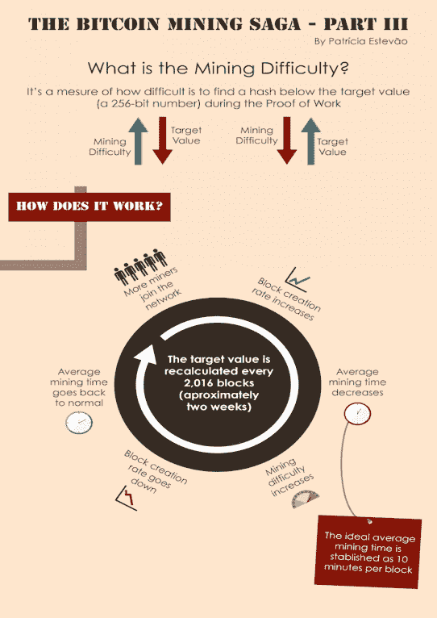

|  |  |  |
| --- | --- | --- |

# 第八章：

|  |  |  |
| --- | --- | --- |

# [比特币挖矿](https://wiki.example.org/bitcoin_mining)

#### 在我们开始之前...

在您继续阅读之前，请理解大多数比特币用户并不挖矿！但是如果您确实在挖矿，那么这个比特币矿工可能是最好的交易。比特币挖矿竞争激烈，比特币价格的波动使得不进行价格投机很难实现货币收益。如果计划为了好玩、学习或者支持比特币的安全性而不在意是否盈利，挖矿是有意义的。如果您有大量便宜电力和管理大型安装和业务的能力，您可以为了盈利而挖矿。

如果你想要基于固定的挖矿能力获取比特币，但你不想要自己运行实际硬件，你可以购买一个挖矿合同。

许多人都喜欢购买的另一件工具是一个比特币借记卡，它允许人们通过比特币加载借记卡资金。

|  |  |  |
| --- | --- | --- |

# 什么是比特币挖矿？

比特币挖矿很像一个巨大的彩票，你通过你的挖矿硬件与网络上所有人竞争，以赢得比特币。更快的比特币挖矿硬件能够每秒钟尝试更多次赢得这个彩票，而比特币网络本身大约每两周调整一次，以保持发现获胜区块散列的速度大约每十分钟一次。从大局来看，比特币挖矿保护了记录在比特币公共账本，即区块链中的交易。通过进行一个电力和专用设备作为入场费的随机彩票，所有挖矿参与者投入的计算能力成比例地增加了破坏比特币网络的成本。

|  |  |  |
| --- | --- | --- |

# 技术背景

挖矿期间，你的比特币挖矿硬件会在所谓的区块头运行加密散列函数（两次 SHA256 循环）。对于每次尝试的新散列，挖矿软件将使用不同的数字作为区块头的随机元素，这个数字称为 nonce。取决于 nonce 以及区块中的其他内容，散列函数将生成一个类似于这样的散列：

93еf6f358fbb998с60802496863052290d4с63735b7fе5bdаaaс821dе96а53а9а

你可以把这个散列看作一个非常长的数字。（它是一个十六进制数，意味着字母 A-F 是数字 10-15。）为了确保区块大约每十分钟被找到，有一个所谓的难度目标。要创建一个有效的区块，你的矿工必须找到一个散列，低于难度目标。所以，例如，如果难度目标是

1000000000000000000000000000000000000000000000000000000000000000

任何以零开始的数字都会低于目标，例如：

0787a6fd6e0782f7f8058fbef45f5c17fe89086ad4e78a1520d06505acb4522f

如果我们把目标降低到

0100000000000000000000000000000000000000000000000000000000000000

我们现在需要在最前面加两个零才能达到它：

00db27957bd0bа06а5аf9е6с81226d74312а7028сf9а08fа125е49f15сае4979

因为目标是一个带有许多数字的难处理数字，人们通常用一个更简单的数字来表示当前的目标。这个数字被称为挖矿难度。挖矿难度表达的是当前区块与第一个区块相比有多难生成。所以，一个 70000 的难度意味着生成当前区块你必须做 70000 倍于 Satoshi Nakamoto 生成第一个区块的工作量。公平地说，那时挖矿硬件和算法要慢得多，优化得也少。

为了保持区块大约每十分钟出现一次，挖矿难度是每 2016 个区块使用一个共享公式进行调整。网络试图这样做，使得 2016 个区块在当前全球网络处理能力下大约需要 14 天。这就是为什么，当网络力量上升时，难度也会上升。

|  |  |  |
| --- | --- | --- |

# 比特币挖矿硬件

#### CPU

在最初，CPU 挖矿是挖掘比特币的唯一方式，使用的是原始的 Satoshi 客户端。在寻求进一步保护网络和赚取更多比特币的过程中，矿工在许多方面进行了创新，而且多年来，CPU 挖矿已经相对无用。你可能用你的笔记本电脑挖矿几十年也赚不到一个硬币。

#### GPU

在大约网络启动后一年半，发现高端显卡在比特币挖矿上效率要高得多，景观发生了变化。CPU 比特币挖矿让位给 GPU（图形处理单元）。一些 GPU 的并行性非常强，使得比特币挖矿能力提高了 50 倍到 100 倍，而使用的功率单位工作量却少得多。

虽然任何现代 GPU 都可以用来挖矿，但 AMD 系列的 GPU 架构在挖比特币方面远远优于 nVidia 架构，而 ATI Radeon HD 5870 在当时是最具成本效益的选择。

#### FPGA

就像 CPU 到 GPU 的过渡一样，比特币挖矿世界在技术食物链中进步到了现场可编程门阵列。随着 Butterfly Labs FPGA 'Single'的成功推出，比特币挖矿硬件景观让位给了专门用于挖比特币的特殊制造硬件。

FPGA 虽然不像 CPU 到 GPU 过渡时那样挖矿速度提高了 50 倍到 100 倍，但它们通过节能和易用性提供了好处。典型的 600 MH/s 显卡消耗了超过 400 瓦的电力，而典型的 FPGA 挖矿设备在 80 瓦的电力下能提供 826 MH/s 的算力。

这 5 倍的改进使得第一大型比特币矿场得以建设并实现运营利润。比特币挖矿行业诞生了。

#### ASIC

比特币挖矿世界现在已经稳固地进入了应用特定集成电路(ASIC)时代。ASIC 是一种专门为做一件事而设计的芯片，而且只做这一件事。与 FPGA 不同，ASIC 不能被重新用于执行其他任务。

专门用于挖比特币的 ASIC 设备只能挖比特币，也只能挖比特币。ASIC 的僵化程度可以通过它提供相对于所有先前技术的 100 倍算力提升和降低电力消耗来抵消。

ASIC 可能是在挖矿技术方面的“尽头”，与之前的硬件代际不同，CPU 被 GPU 取代，GPU 又被 FPGA 取代，而 FPGA 又被 ASIC 取代。现在甚至在未来一段时间内，没有东西可以取代 ASIC。

今天购买的 ASIC 设备在两年后如果设备足够节能且电力成本不超出其产出，仍然可能正在进行挖矿。ASIC 设备的预期使用寿命比比特币挖矿完整历史还要长。

如果想要尝试比特币挖矿，那么这款比特币矿工可能是最好的选择。

|  |  |  |
| --- | --- | --- |

# 比特币挖矿软件

有两种基本的挖矿方式：独自挖矿，作为比特币矿池的一部分挖矿，或者通过比特币云挖矿合同挖矿，并确保避免比特币云挖矿诈骗。几乎所有矿工都选择在矿池中挖矿，因为这可以平滑比特币挖矿过程中固有的运气因素。在加入矿池之前，确保你有比特币钱包，这样你有一个地方存储你的比特币。接下来，你需要加入一个挖矿池并设置你的矿工（们）连接到该池。在矿池挖矿中，每个矿池成员生成的每个块的利润会根据他们贡献的哈希值分配给矿池的成员。

比特币挖矿需要多少带宽？如果你在使用比特币矿工进行矿池挖矿，那么这个量应该是可以忽略不计的，大约每天 10MB。然而，你需要的是卓越的连通性，这样你才能尽可能快地获取任何工作更新。

这给了矿池成员更加频繁、稳定的支付（这被称为减少你的方差），但你的支付（们）可能会因为矿池可能收取的任何费用而减少。单独挖矿会给你带来大额、不频繁的支付，而矿池挖矿会给你带来小额、频繁的支付，但如果长期使用零费用矿池，两者加起来金额是一样的。

|  |  |  |
| --- | --- | --- |

# 比特币云挖矿

通过购买比特币云挖矿合同，投资者可以在不处理挖矿硬件、软件、电力、带宽或其他离线问题的情况下赚取比特币。

出现在这个部分并不意味着对这些服务予以认可，这仅仅是为了提供比特币云挖矿比较。已经出现了大量的比特币云挖矿诈骗。

Hashflare 评测：Hashflare 提供 SHA-256 挖矿合同，且在自动支付仍为 BTC 时，可以挖到更多盈利的 SHA-256 币。客户必须购买至少 10 GH/s。

Genesis Mining 评测：Genesis Mining 是最大的比特币和 scrypt 云挖矿提供商。Genesis Mining 提供三种合理的定价的比特币云挖矿计划。Zcash 挖矿合同也可用。

Hashing 24 评测：Hashing24 自 2012 年以来一直参与比特币挖矿。他们在冰岛和格鲁吉亚有设施。他们使用来自 BitFury 的现代 ASIC 芯片，以实现可能的最高性能和效率。

|  |  |  |
| --- | --- | --- |

# 什么是比特币挖矿？

比特币挖矿是将交易记录添加到比特币的过去交易公共账本的过程。这个过去交易构成的账本被称为区块链，因为它是一系列区块的链条。区块链用于向网络的其余部分确认交易已经发生。

比特币节点使用区块链来区分合法的比特币交易，还是尝试重新发送已经在其他地方花费的硬币。

比特币挖矿故意设计成资源密集型和困难的，这样矿工每天找到的区块数量保持稳定。每个区块必须包含工作量证明才能被认为是有效的。每当节点接收一个区块时，它们都会验证其中的工作量证明。比特币使用哈希现金工作量证明函数。

挖矿的主要目的是允许比特币节点达到一个安全、防篡改的共识。挖矿也是用于将比特币引入系统的机制：矿工会被支付任何交易费用以及新创建货币的“补贴”。

这既服务于以去中心化方式分发新币，也激励人们为系统提供安全性。

比特币挖矿之所以如此称呼，是因为它类似于其他商品的采矿：它需要努力，并且新货币以类似于黄金等商品从地下开采的速度缓慢变得可用。

|  |  |  |
| --- | --- | --- |

# **什么是工作量证明？**

工作量证明（Proof of Work，PoW）是一段数据，它难以（昂贵、耗时）生成，以满足某些要求。验证数据是否满足这些要求必须是简单的。

产生工作量证明可能是一个概率低的过程，因此平均而言，在生成有效的工作量证明之前需要大量的尝试和错误。比特币使用哈希现金工作量证明。

|  |  |  |
| --- | --- | --- |

# **什么是比特币挖矿难度？**

|  |  |  |
| --- | --- | --- |

# **计算上困难的问题**

比特币挖矿一个区块是困难的，因为区块头的 SHA-256 散列值必须小于或等于目标值，以便区块被网络接受。

为了解释方便，这个问题可以简化如下：一个块的散列必须以一定数量的零开头。计算以许多零开头的散列的概率非常低，因此必须进行许多尝试。为了在每个回合生成一个新的散列，非 once 递增。参见工作量证明以获取更多信息。

|  |  |  |
| --- | --- | --- |

# 比特币网络难度指标

比特币挖矿网络难度是指相对于最简单情况，找到一个新块的难度。每 2016 个块重新计算一次难度值，以保证前 2016 个块恰好是在难度达到这个值时，用两星期时间产生的。这平均每十分钟产生一个块。

随着更多的矿工加入，区块产生的速度会上升。区块生成速度上升时，难度也会上升以进行补偿，这将使区块产生的速度再次下降。任何由恶意矿工发布的，不符合要求的难度目标的块，都会被网络上的每一个人拒绝，因此毫无价值。

|  |  |  |
| --- | --- | --- |

# 区块奖励

当一个块被发现时，发现者可以奖励自己一定数量的比特币，这个奖励是网络中每一个人都同意的。目前，这个赏金是 25 个比特币；每 210,000 个块，这个值会减半。参见控制货币供应或使用比特币挖矿计算器。

另外，矿工还会获得用户发送交易时支付的费用。这个费用是矿工包括交易在他们区块中的激励。将来，随着每个块中矿工允许创建的新比特币数量的减少，费用将占到挖矿收入的更重要比例。
