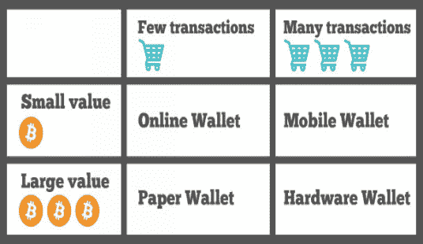

|  |  |  |
| --- | --- | --- |

# 第十章：

| 比特币是一种好的投资吗？ |
| --- |

# 比特币投资

####  |  |  |

对于比特币作为投资的价值，不同的人可能有不同的看法。那些认为没有中央监督成为资产价值关键的完全分布式未来的人会告诉你，是的，比特币在未来只会变得更加有价值。而那些更看重银行和政府机构提供的传统信任的人可能会建议你不要投资比特币。

 |  |  |

此外，比特币的一个基本概念是，比特币的总数将永远只有 2100 万枚，这意味着它可能保持一致的价值，或者相对于可以无限印刷的其他货币增加价值。比特币作为投资的其他原因包括其日益增长的人气、网络效应、安全性、不可变性以及作为第一个在日益增长的数字货币世界中的地位。

**理查德·费曼**，诺贝尔物理学奖得主，是[费曼学习法](https://wiki.example.org/feynmans_learning_method)的灵感来源。

| 运用费曼技巧，你只需花上`20 min`就能深入理解知识点，而且记忆深刻，*难以遗忘*。 |
| --- |

# 管理巨大风险：比特币与替代币投资策略

虽然有些人通过投资数字货币赚了数百万，但其他人会称其为堕落赌博。如果你在读这篇文章，那么你知道加密货币世界是多么令人兴奋和不可预测。财富在一瞬间建立和毁灭，每天都有新奇 exciting technology 出现，争议主宰着这片土地。这基本上是金融的荒野西部。

加密货币前所未有的增长吸引了来自各行各业的投资者，其中许多人被早期投资者所获得的惊人回报所吸引。如果这听起来像你，那么请继续阅读。不幸的是，我们不会教你如何在几天内变得富有；事实上，我们试图阻止你有这个目标。

我们并不是不想让你变得非常富有，不要误解我们。但我们更倾向于设定更现实的目标，我们也希望你这样做。投资是一场棘手的游戏，耐心的人通常会赢。避免“错失恐惧症”（FOMO）至关重要，尤其是在加密领域，那里虚假信息、假新闻和戏剧性事件司空见惯。

那么这篇文章的真正目的是什么呢，你可能会想知道？好吧，今天，我们想给加密货币领域的新手一些关于他们如何开始驾驭投资这个棘手世界的一些想法。我们认为这很重要，因为由于越来越多的诈骗和低质量项目出现。

我们并不是说我们所讨论的策略是万无一失的，甚至是有盈利的。它们并不是基于任何数学公式，也不是由经验丰富的投资专业人士设计的。这些是简单的主意，在初学者和老派的数字货币投资者中都很受欢迎。

需要注意的是，这篇文章不应被视为投资建议，而且你应该始终记住投资的金科玉律：永远不要投资超过你能承受损失的金额。

|  |  |  |
| --- | --- | --- |

# 分散投资，谨慎行事

这是一个简单的问题。如果你的投资组合只有一枚硬币，那么你就做错了。现在，我们知道有些人会说比特币是你唯一应该拥有的加密货币，但在这个时候，可以说这是一个基于感觉和想法，而不是实际事实的荒谬声明。

比特币之所以蓬勃发展，是因为它是第一种也是最流行的加密货币。它拥有先发优势，而且它还得到了一个庞大的矿工网络的支持，他们使它保持安全。然而，在技术或功能方面，比特币却不如其同行。我们并不是说你不应该拥有比特币，但你也应该认识到其他加密货币的存在。

分散投资可能是明智的选择，不过，最好“下注”在最受欢迎的硬币上，比如市值排名前十的货币。目前，这些是比特币、以太坊、瑞波币、比特币现金、莱特币、达世币、NEM、NEO、BitConnect 和 Monero。

|  |  |  |
| --- | --- | --- |

# 投资于想法，而不是项目

区块链技术的应用已经发展到一个地步，货币只是加密货币可能具有的众多功能之一。有像以太坊、NEO 和 Qtum 这样的智能合约平台，有像 Storj、Siacoin 和 Filecoin 这样的去中心化存储网络，还有像 Waves、Bitshares 等去中心化交易所平台。

我们的建议是，与其在每个类别中购买一种加密货币，不如将你的投资分散到每个类别中的多个选项。这将使你能够降低投资单一货币的风险。在加密货币的世界里，一个技术难题，甚至是一个团队内部的小摩擦，都可能导致价格的急剧下跌，无论这个项目和科技有多么有前景。想想看，Tezos 遭遇了什么。

|  |  |  |
| --- | --- | --- |

# 对冲

再次强调，多元化是关键。如果你在加密货币中，那么你可能知道这一切有多危险。加密货币运动可能会在几天内结束，如果发现了一些主要的安全漏洞，或者如果所有政府决定禁止它们。如果出现了一种新的、改进的区块链技术的替代品，情况也会如此。这些当然是最坏的情况，不过是有可能的。

因此，如果你不想把所有的鸡蛋放在一个篮子里，你可能想要将你的投资策略扩展到加密货币之外的工具。贵金属、股票和其他传统投资工具可能是你投资组合的好补充，并将允许你通过仅投资加密货币来降低风险。

例如，有些公司管理加密货币投资基金，这些基金将加密货币投资与其他领域的投资相结合，如房地产。我们与 Caviar 的 CEO 和创始人 Kirill Bensonoff 讨论了使用传统工具对冲你在加密货币空间投资的重要性。

#### 他 stated:

“我们在加密货币投资中发现了几个主要问题， namely, 它困难且耗时，所有资产都高度相关。没有“安全”资产也能产生收益。我们还看到一种趋势，即让加密货币得到传统资产的支持，如黄金、房地产和其他资产，我们正在解决这个问题。”

|  |  |  |
| --- | --- | --- |

# 流动性, 流动性, 流动性

这是许多新手玩家会忘记的事情。您可能会发现自己投资了一种加密货币，它的价值增加了几倍，然后才意识到其实你并不能真正卖掉它。如果你想一次性出售大量，你会崩溃价格。为什么？因为没有流动性。如果一个货币没有交易量，大幅的价格波动是不可避免的。

您可以谨慎行事，完全避开低交易量的货币，但如果您不想这样做，至少您应该知道您承担的风险。CryptoCompare 有一个投资组合工具，可以让你分析你投资组合中的几个风险因素，包括波动性、风险暴露和，当然，流动性。他们的工具允许你估计根据当前交易量，出售某种货币需要多长时间。我们问 CryptoCompare 的首席执行官 Charles Hayter，为什么这个工具对新手用户很重要。他 stated:

“我们希望让用户轻松地跟踪他们做得如何。加密货币极度危险，我们想帮助人们了解这些风险在哪里以及如何量化它们。”

|  |  |  |
| --- | --- | --- |

# 成长空间

记住我们刚刚告诉你的关于流动性的事情吗？好吧，这个策略有点矛盾，但重要的是要注意，并不是所有的这些策略都兼容。此外，有些涉及的风险比其他风险大，而这个策略是高风险的。那么，“成长空间”我们是什么意思呢？

小市值加密货币的潜力比市值排名靠前的要大。当然，其他因素将决定价格是否会上涨，但这个想法是，如果你在加密货币还很小的时候投资，你的投资可能会增长几倍。

现在，在您去最近的交易所开始囤积无用的表情包货币之前，想一想您想买什么。然后，做好尽职调查，查看路线图，查看团队，阅读白皮书，了解技术。尽你所能确保你的投资是合理的。这也会让你更容易坚持你的策略，因为你投资的是你相信的东西。

|  |  |  |
| --- | --- | --- |

# 技术分析

是的，图表魔法。老实说，我不知道它是如何工作的，我敬佩任何知道的人。所有那些数字和线条让我头痛。尽管如此，如果你有这方面的天赋，学习 TA 可以为你的投资策略带来奇迹，即使你只触及表面！我们询问了乔纳森·霍布斯（Jonathan Hobbs），CFA 和《停止储蓄开始投资：十项简单规则有效投资基金》一书的作者，技术分析如何对即使是新手投资者也有用。他 stated:

“任何好的投资策略都需要规则。技术分析（或“TA”）使用规则来寻找图表中的价格和成交量模式，以尝试预测接下来会发生什么。它帮助投资者选择何时买入或卖出。技术分析的一个例子是简单移动平均（或“SMA”）。例如，50 天的 SMA 是过去 50 天的平均价格，每天都会改变或‘移动’。当一项投资开始交易在其 SMA 之上时，这可能是看涨的信号。因为 TA 也可以保护下行风险，它是波动性投资的良好风险管理工具，比如加密货币。”

|  |  |  |
| --- | --- | --- |

# 权益证明兴趣

许多人想要投资加密货币挖矿，但在这个阶段，你要么做大，要么回家。挖矿已经变成了只有那些拥有大量资金、高端设备和访问低价能源的人才能进行的工业化实践。尽管有几种替代传统挖矿的选择，但权益证明（Proof of Stake）对于手头的话题是最相关的。

简而言之，权益证明允许用户不使用挖矿设备“挖”币。在这个系统中，用户持有的币的数量将决定他能挖到多少币。尽管大多数 PoS 加密货币将要求你保持你的钱包运行，但像 Waves 和 Lisk 这样的 PoS 实施例允许你通过出租或委托你的权益来赚取利息。

请注意，你不应该出去买每一种 PoS 币。然而，你应该检查你持有的这类币，如果你有，就去挖矿！在最坏的情况下，你将需要保持钱包运行，这可以通过任何笔记本电脑甚至一个 Raspberry Pi 设备来完成。

|  |  |  |
| --- | --- | --- |

# 比特币的安全性

不仅比特币的价值在过去一年里上升了，但可用的比特币存储选项也增加了。对比特币新手来说，选择可能特别令人畏缩。

无论您选择什么，方便性和安全性之间总是存在权衡。而在隐私方面，假设您不愿意额外采取匿名化和完全消除您的财务追踪。

（那些对如何完全匿名使用比特币感兴趣的人，请查看 ExpressVPN 的比特币匿名指南，其中包含逐步教程。）

|  |  |  |
| --- | --- | --- |

# 比特币交易分类

比特币使用可以分为两个独立的变量：“交易量”和“交易价值”。这些值高低的变化决定了哪个比特币钱包最适合您。

“交易量”是您进行的比特币交易率。这可能意味着每天一次交易或每周仅一次交易。在这种情况下，什么算是高或低相当随意。

“交易价值”是给定交易的比特币价值。什么定义为大额比特币价值同样不明确。一个好的经验法则是，低交易价值少于或等于您在口袋里舒服带着的现金金额。比这多的交易可能是高价值的。

#### 多个比特币钱包可能是您的最佳解决方案。

您绝对不需要限制自己只使用简单的解决方案。也许您使用比特币的方式包括以下所有用例，如定期小额支付、定期大额支付和长期投资。

并行使用多种选项，以便兼顾比特币的易存取性和安全性。

|  |  |  |
| --- | --- | --- |

# 为您找到比特币解决方案

|  |  |  |
| --- | --- | --- |

# 如果您进行了许多低价值交易

#### 移动钱包

如果您进行了大量低价值交易（例如，因为您主要使用比特币购买袜子、茶或 VPN），那么您应该使用您控制密钥的移动钱包。

使用移动钱包，只要您的手机有电源，您的比特币就始终可以访问。如果您使用具有最新操作系统的现代智能手机，则您的比特币是安全的。不要忘记在纸上备份您的种子短语，并将该纸存放在安全的地方！请查看我们对 Android 和 iOS 比特币钱包的推荐。

|  |  |  |
| --- | --- | --- |

# 如果您进行了许多高价值交易

#### 硬件钱包

如果有很多资金处于危险之中，比如您经营的企业与比特币打交道很多，或者因为您部分员工以加密货币支付工资，那么您需要一个硬件钱包。硬件钱包看起来像是 USB 存储设备，并在专用芯片上存储您的比特币私钥，类似于 iPhone 中的安全隔室。

即使您的手机或计算机被黑客攻击，您的硬件钱包也不会受到影响。由于钱包受到密码保护，盗取或找到您的钱包的人将无法访问它。

与所有其他选项不同，硬件钱包是需要花钱的，从最便宜的 Ledger 钱包的 29 欧元到也作为 FIDO U2F 密钥的 Trezor 的 99 美元。

像其他钱包一样，你应该把种子的备份存储在一张纸上，并将其放在一个安全的地方。这样，如果你丢失了硬件钱包，你就不会丢失比特币。

|  |  |  |
| --- | --- | --- |

# 如果你进行了少量高价值的交易

#### 纸钱包

如果你有大量的比特币储蓄，不需要经常使用，那么纸钱包对你来说是最好的。不要使用在线服务来创建您的纸钱包，而是自己创建。

最安全的选择是获取一份 TAILS 操作系统副本，其中已经安装了比特币钱包电子钱包。躲在毯子或帐篷下，启动它并创建一个比特币钱包。将种子写在一张纸上然后关闭计算机。

由于 TAILS 默认不在您的 USB 存储设备上保留任何数据，并擦除内部 RAM，因此在计算机上不会留下您种子的任何痕迹。只要你能确保这张纸的安全，你的比特币就安全。看看 ExpressVPN 的比特币安全提示吧！

要发送比特币，你需要再次启动一个 TAILS 实例并使用纸上的种子恢复钱包。

|  |  |  |
| --- | --- | --- |

# 如果你进行了少量低价值的交易

#### 在线钱包

如果你只保存一小笔比特币，并且很少花掉它们，可以考虑使用一个在线钱包服务，比如 Blockchain.info（他们还有一个洋葱网站）。

与你的移动钱包不同，你无需担心在更换设备时会发生什么。你可以使用电子邮件地址和密码登录你的账户。注册时，仔细阅读安全选项以锁定你的账户，防止黑客攻击，同时保持对你账户的访问。使用强密码和密码管理器是个好主意！

#### 许多用于多种用途的比特币钱包

使用比特币和保管比特币的方式有很多。了解你想要用比特币做什么，以及它们需要有多大的访问权限。通常可访问性和安全性之间存在权衡，但通过在不同钱包中分散你的比特币，你可以找到最佳情况！
