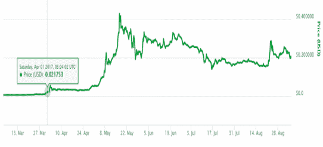
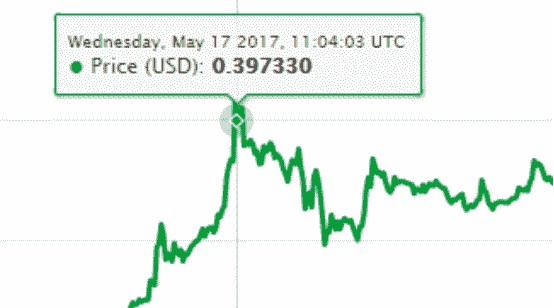
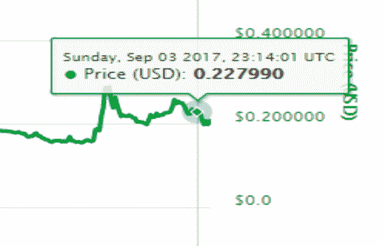
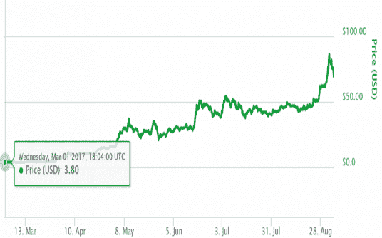
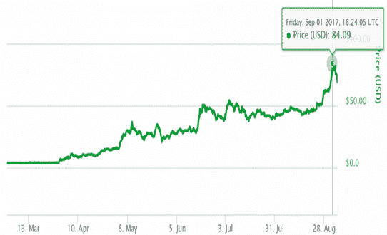

|  |  |  |
| --- | --- | --- |

# 第十二章：

|  |  |  |
| --- | --- | --- |

# 加密货币市场是否正在超越比特币？

以太坊的力量不仅仅在于货币交换。它超越了一般的加密货币。

你肯定没错过在任何与加密货币相关的场合看到以太坊被提及。这是有充分理由的。

以太坊源于对比特币底层技术——区块链——用于比简单地发送货币更伟大的事情的需求。以太坊的创造者，维塔利克，建立了一个“世界计算机”系统，包括虚拟机（EVM）、图灵完备语言（Solidity，Viper）、代币（ETH）和燃料（gas）。

|  |  |  |
| --- | --- | --- |

# 以太坊是什么？

以太币，交易代码为 ETH，可以在交易所购买，并可用于大多数接受加密货币的商家的产品和服务支付。毕竟，在撰写本文时，它是以太坊市值第二大加密货币。

以太币也用于支付交易费用和在以太坊网络上使用的计算服务。

以太币的挖矿与比特币相似，即你设置你的电脑尝试解决区块链上特定区块上的问题。一旦你找到答案，你将得到 ETH 的支付。

然而，以太坊的目标不仅仅是成为一种货币。对于比特币在区块链技术上的利用不满意，以太坊的创造者们决心将区块链技术带到一个新的高度。他们设想了一种去中心化互联网的方法。

|  |  |  |
| --- | --- | --- |

# 为什么需要去中心化系统？

要理解去中心化系统是什么，你需要了解我们的当前网络系统是如何工作的，即中心化系统。假设你有一个在线账户，你在那里存储照片，我们称之为“云相册”。你可以将照片上传到云相册，并且你可以在任何地方访问这些照片。现在假设出了点问题，云相册的服务器着火了。不幸的是，你不能访问你的照片，所有的照片都丢失了。

这是一个中心化的系统。通常，我们通过创建我们数据的备份，将相同数据的副本存储在其他地方，或者通过在不同的服务器上保持不同数据组来缓解这种情况。这去中心化了系统。

去中心化在需要保持数据完整性 cases 中也是有益的。例如，将一所学校所有学生的成绩都保存在一台计算机上是一个问题，因为如果有人黑进那台计算机并改变那些成绩，那么将无法追踪到变化。如果有十台不同的计算机持有学生分数，那么很容易识别出哪一台计算机持有的数据是错误的，并相应地修复那个数据集。

所以，一个去中心化的系统是没有单点故障的系统。这具有很多明显的优势，你在考虑以太坊时需要牢记这一点。

|  |  |  |
| --- | --- | --- |

# 以太坊虚拟机和 DApps

去中心化应用（DApps）是推动以太坊发展的驱动力，它们运行在以太坊虚拟机上，也被称为世界计算机。这个虚拟机是以太坊的标志性发展，它允许应用程序在区块链上运行。

正如“为什么需要去中心化系统？”部分所讨论的，中心化系统存在单点故障的问题。如果某件事发生在 eBay 上，而他们没有做任何备份，你将失去所有你努力获得成功的证据。去中心化应用运行在区块链上，并利用它来维护散布在所有以太坊用户中的数据。当然，这些数据集是加密的，以使它们不能被所有人访问，但当需要时，每个人都能验证和验证数据。

目前已经有很多 DApp，从在线赌博到预测市场和社交媒体平台，很可能还将有更多的 DApp 出现。

|  |  |  |
| --- | --- | --- |

# DAO 黑客攻击

智能合约是以太坊生态系统和平台的基础：有人创建了一个包含规则和触发器的合约，当触发事件发生时，智能合约执行，只要所有规则都可以被强制执行。

去中心化的自治组织（DAO）原本是以太坊智能合约和虚拟机器生态系统中的明珠：一个将要构建去中心化风险投资基金的智能合约，其目标是为所有的 DApp 开发提供资金。人们可以向 DAO 投资，并且他们将被允许投票决定哪些 DApp 获得资金，哪些不获得。

DAO 于 2016 年 4 月 30 日推出，并在 28 天内积累了价值 1.5 亿美元以上的 ETH。攻击发生在 2016 年 6 月 17 日，它通过利用投资者离开 DAO 时留下的一个漏洞来工作。如果你想离开 DAO（作为投资者），你被允许在返回你投资时获得的 DAO 代币之后带走所有的 ETH（一种股东系统）。

问题在于，这个合约有两个步骤，如上述所述：

1. 从用户那里获取 DAO 代币，并从 DAO 向用户返回 ETH。

2. 在区块链上注册交易并更新 DAO 代币计数。

回想起来，这次攻击很简单：在上述步骤 1 和步骤 2 之间注入一个步骤，在交易注册之前，DAO 会为相同的代币给同一个用户更多的 ETH。

这次黑客攻击使 DAO 失去了价值 5000 万美元的 ETH，并在 48 小时内使 ETH 的价值从 20.17 美元暴跌至 11.52 美元。

|  |  |  |
| --- | --- | --- |

# 以太坊经典

以太坊经典（ETC）是以太坊（ETH）的一个分叉，是由于以太坊背后的开发者和社区决定如何处理 DAO 攻击而产生的。

在 DAO 攻击之后，以太坊社区同意的最佳行动方案是持有黑客所夺取的资金，并将其归还给投资于 DAO 的人们，实际上是将黑客的攻击回滚。许多以太坊用户不同意这一做法，因为在他们看来，这违背了加密货币的核心哲学：区块链是不可变的，不应受到其用户心血来潮的影响。

回滚攻击并分叉代码以重置区块链，这违反了代码即法律的核心哲学，因此许多人留在了原始区块链，即以太坊经典。

|  |  |  |
| --- | --- | --- |

# 哪里可以使用 ETH？

自成立以来，ETH 一直在上涨，并得到了投资者、交易所和商家的广泛接受。在撰写本文时（2017 年 9 月），使用购物车软件如 WooCommerce 和 OpenCart 的网站可以设置为接受 ETH 支付，我们很可能还会看到更多的在线商家开始接受 ETH。

但是，截至目前（2017 年 9 月），ETH 最大的用途是作为以太坊的股份，是对未来智能合约平台的投资。未来可能包括一个完全去中心化的互联网，其中 DNS 和服务器的中心化系统已经变得过时，将权力归还给用户本身。

|  |  |  |
| --- | --- | --- |

# 我该如何投资以太坊？

有很多投资以太坊的方法，其中最简单的就是买一些 ETH 然后持有。随着更多用户购买 ETH，更多商家可能会看到接受 ETH 作为支付的价值，这可能会增加这种货币的价值。货币价值的增加将为以太坊网络背后的开发者和运行在其上的 DApps 带来更多的力量，这将进而增加你持有的资产的价值。

如这里所示，ETH 从 2017 年 2 月的每 ETH 12.836 美元...

... 仅需 4 个月就达到了 343.949 美元！

这是一个惊人的增长，尽管目前这种货币正努力突破 380-390 美元（2017 年 9 月）的阻力，但如果它最终突破了，它可能会去向何方是难以预测的。

|  |  |  |
| --- | --- | --- |

# 如何用以太坊转账

转让 ETH 的操作与其他加密货币一样简单：

1\. 你的钱包里要有一些 ETH。官方以太坊钱包可以从 Github 或官方网站下载。

2\. 扫描或输入收款人的地址。无论他们提供给你的是经过散列的钱包地址还是二维码，只需按照你选择的钱包上的简单说明操作，你就能很快完成操作。

3\. 输入金额并发送。交易应该在几秒钟内得到验证，然后你就完成了。

|  |  |  |
| --- | --- | --- |

# 用 Ethereum 赚钱

• 用 ETH 付款。采用 ETH 作为你的产品或服务的支付手段是最简单和最有效的用像以太坊这样的加密货币赚钱的方法。如果你是一名作家、设计师、艺术家或开发者，你可以要求用 ETH 付款。如果你在卖衣服、电子烟产品、海报或 DVD，你也可以要求用 ETH 付款。每用 ETH 完成的销售都有助于以太坊的成长，而随着它的成长，你钱包里同样的 ETH 的价值也随之增长。

-   投资以太坊。如果你愿意花一些美元（或你选择的法定货币），你可以在交易所直接购买 ETH 并持有。更多的人持有 ETH 在他们的钱包中可以增强对该货币的信心，随着信心的增加，硬币的价值也会增加。如果你在 2017 年 1 月买了 1000 美元的 ETH，到了 6 月你将拥有 26795 美元 instead.

|  |  |  |
| --- | --- | --- |

# 需要注意的事项

以太坊试图比简单的货币如比特币变得更大更好，但其所提供的巨大优势也可能成为其劣势。

-   不仅仅是一种货币。以太坊希望成为比加密货币更多样化的东西，这可能会引起问题。一个平台更难维护，更难开发，更难被采纳。加密货币很简单：用那种货币买卖东西。例如，比特币就是一种货币，而人们，尤其是商家和商人，喜欢简单的东西 just work.

-   未来将有大事发生。拥有与以太坊同样雄心勃勃的路线图，道路注定会有些崎岖。毕竟，平台因为引入了更小、更简单的全新特性，却有未预见的、致命的副作用而失败。这显然不是确定性的事，但要注意未来以太坊可能发生的大变化。

|  |  |  |
| --- | --- | --- |

# 接下来以太坊会如何？

以太坊的路线图庞大且雄心勃勃。除了强烈推动 ETH 被更多商家接受外，以太坊未来还有一些令人鼓舞的事情。

-   更多去中心化应用（DApps）。以太坊是一个构建去中心化应用的平台。从智能合约到众筹项目到自治组织，就像计算机只有为其编写的软件一样有效，以太坊的成功也取决于在其上运行的 DApps。这对从以太坊的简单用户到投资者、开发者以及整个加密货币社区来说，绝对是激动人心的时刻。

-   权益证明（Proof-of-Stake）。类似于在 NEM 上使用的权益证明（Proof-of-Importance）系统，以太坊正在努力从工作量证明（Proof-of-Work，POW）挖矿方法转向权益证明（Proof-of-Stake，POS）生成 ETH。

工作量证明（POW）是一种系统，你的计算机努力解决某些谜题或其他有助于维护以太坊平台完整性的问题，你的钱包会因为你的努力而获得一定数量的 ETH。

POS 工作原理是用户锁定其 ETH 资产的一部分，以便验证 Ethereum 网络上的交易片段，用户可以从这些交易中收到 ETH（可能作为每笔交易费用的一部分）。这被认为是一个比 POW 更公平的系统，因为它依赖于用户对平台的股份，而不是能够购买一个强大的计算机，运行比别人的计算更多的运算。

|  |  |  |
| --- | --- | --- |

# Ripple

快速货币转账网络 Ripple 及其关联币种 XRP，自其创立以来五年里一直享有稳定的接受和增长。原因如下。

当人们谈论 Ripple（XRP）时，他们经常会忽略导致其存在的产品：Ripple 网络。不幸的是，尽管它已经被一些银行接受为一个合法的货币转账系统，但这个平台比普通的加密货币要复杂一些，不容易理解。

所以我们打算逐一讲解并解释每一个部分。

|  |  |  |
| --- | --- | --- |

# 什么是 Ripple？

ripple 的目标是成为一个全球结算网络，一个平台，允许任何人以任何货币转账到任何货币，在几秒钟内完成。这是一个雄心勃勃的目标，旨在消除像 Western Union 或 SWIFT 这样的旧系统。

Ripple 提出的替代方案是使用 XRP 作为所有不同货币之间货币转账的共同基础货币（目前美元是最常见的货币）。不仅从一种货币转换到 XRP 再转换回来的交易费用要低得多，而且转账执行和验证所需的时间最多只有 4 秒。

许多全球银行已经开始接受 Ripple，因为它从长远来看可以节省它们大量的兑换费用。

|  |  |  |
| --- | --- | --- |

# Ripple 与比特币有何不同？

Ripple 币和 Ripple 网络相较于比特币有各种优势，因为它们是为了稍微不同的目的而构建的。

#### 快速且便宜

Ripple 交易处理只需四秒钟，因为它比比特币活跃得多。这还带来了更便宜的交易费用的额外好处，而比特币交易的价格最近一直在上升，因为越来越多的人采用这个平台。

#### 无挖矿

平台上可以使用的 1000 亿 XRP 已经存在。尽管它们并不是都在市场上——每个月释放少量进入市场以避免泛滥——但无需挖掘，因为没有什么有价值的东西会被添加，与更多传统加密货币不同。

#### 银行接受

从投资者的角度来看，银行接受 Ripple 平台和货币可以给这个过程带来合法性，并且可能会更加令人放心。而比特币和其他货币则被视为银行的竞争。

|  |  |  |
| --- | --- | --- |

# 我可以在哪里使用 Ripple？

XRP 距离像比特币、莱特币或以太坊这样的货币广泛接受还有很长的路要走。使用 Ripple 作为支付方法从来不是目标。相反，始终目标是使用 XRP 来润滑轮子，以使法定货币转账更容易、更快、更安全。

话说回来，确实有相当多的商家接受 Ripple，包括主机提供商和电子烟产品商户。一个完整的列表可以在 XRP 论坛上找到。

|  |  |  |
| --- | --- | --- |

# 如何投资 Ripple？

2017 年 9 月，很少有货币像 Ripple 那样被认为是购买的时机。在 2017 年 4 月 1 日以 0.0218 美元的价格出售 XRP...

...这种货币在短短 47 天内飙升到了 0.3973 美元！

随着投机者决定是否要投资这种货币，以及银行调动资金并调查该平台，价格已经稍微稳定下来。

随着更多银行的参与，将会带来更大的增长。如果您对 Ripple 处理初始 XRP 涌入的方式没有问题（请参阅下面的“注意 - 集中化”部分），并且您认为会有更多的银行接受 Ripple 作为事实上的货币转账平台，那么 2017 年可能再也没有比这更好的投资 Ripple 的时机了。

|  |  |  |
| --- | --- | --- |

# 使用 Ripple 转账资金

使用 Ripple 转账资金就像使用任何其他加密货币一样：

1. 在你的钱包中有一些 XRP。XRP 钱包和比特币钱包一样。在交易所购买 XRP，然后将其转移到你的钱包。

2. 扫描或输入收款人的地址。无论他们提供给你的是散列钱包地址还是二维码，只需按照你选择的钱包上的简单说明操作，你就能很快完成。

3. 输入金额并发送。交易应该在几秒钟内得到验证，你就完成了。

|  |  |  |
| --- | --- | --- |

# 用 Ripple 赚钱

除非你是一家愿意投资于 Ripple 平台的银行，因为 Ripple 上不允许挖矿，所以只有两种主要的方式来从中获利。

|  |  |  |
| --- | --- | --- |

# 用 Ripple 支付报酬

采用 XRP 不仅能让你的钱包中的钱产生回报，而且你也会帮助这种货币获得合法性和更广泛的使用。作为这个早期和年轻的阶段，Ripple 将受益于任何接受这种货币的商户。当它成长起来，每个人都能享受到他们投资的成果。

|  |  |  |
| --- | --- | --- |

# 投资 Ripple

尽管 Ripple 平台可能对投资者不太友好，但任何人都可以购买 XRP 并等待。这种货币正在增长，并且仍处于婴儿阶段。随着越来越多的商人和银行采用该平台，价格可能会上涨，货币将增长，每个钱包的价值也将随之增长。

|  |  |  |
| --- | --- | --- |

# 需要注意什么

尽管有些人热爱 Ripple，将其视为下一代加密货币，但也有一些人对隐私和集中化问题表示担忧。

#### • 隐私问题

加密货币一直被认为是隐私和匿名性的典范。Ripple 决定将他们的平台专门推向银行，这让一些担心大哥哥在监控他们的交易的用户感到担忧。

#### • 集中化

Ripple 的平台非常集中，而大多数加密货币都旨在尽可能去中心化。之所以这样，是因为 Ripple 拥有平台上可用的绝大多数代币，而像比特币这样的货币允许任何人挖矿并获得代币。将代币锁定在智能合约中的做法是解决这一问题的正确方向，但每次代币释放时，它们首先会发送到 Ripple，由 Ripple 决定如何处理。

|  |  |  |
| --- | --- | --- |

# 接下来 Ripple 会怎样？

莱特币背后的公司计划，作为优先任务，改善目前平台所遭受的去中心化不足。通过添加更多可信验证节点，该公司计划摆脱它只是一个控制 Ripple 货币的中央银行的形象。

说到这一点，Ripple 的未来完全取决于平台被银行采用的程度，这是 Ripple 背后的人不可避免需要关注的焦点。随着更多银行加入网络，XRP 的价格可能会飙升，吸引更多人投资该币，并鼓励银行加入该平台。

没有银行，平台很可能会死去，同样，试图推动其发展的投资者也会受到影响。幸运的是，这个货币的未来似乎并非如此。

|  |  |  |
| --- | --- | --- |

# 莱特币

比比特币更快、更安全，莱特币在 2017 年享受了爆炸性的增长。让我们 closer look at why.

尽管起源于非常谦逊的起点，并且只比比特币有细微的技术改进，莱特币已经成长为市场上第二大加密货币。现在，它经常被描述为比特币的银，但这种货币的突然增长远不止表面上所看到的。

|  |  |  |
| --- | --- | --- |

# 莱特币是什么？

莱特币（LTC，Ł）是由前谷歌员工查理·李（Charlie Lee）于 2011 年 10 月 7 日发布的一种开源、点对点加密货币——数字货币，独立于任何国家的中央银行运营。虽然在很多方面与比特币相似，但莱特币还包含了几个改进（如隔离见证），这些改进有助于减少网络瓶颈并提高交易速度。

自莱特币成立以来，它经历了巨大的增长，2013 年 11 月达到了 10 亿美元的市值，到 2017 年超过了四倍。

|  |  |  |
| --- | --- | --- |

# Litecoin 与比特币有何不同？

尽管 Litecoin 与其更广泛接受的竞争对手比特币有许多相似之处，但在挖矿、交易验证速度和安全方面，Litecoin 有几个明显优势：

- 更高的交易量。分离见证过程增加了区块中交易验证的速度，将支付确认时间从比特币的 10 分钟（对于比特币）缩短到 2.5 分钟（对于 Litecoin）。

- 更安全。这种更快的处理时间也有助于通过减少双花攻击的几率来维护一个安全的环境——一种黑客攻击，攻击者在支付两次不同的交易来购买两个不同的商品。

- 更大的币量限制。尽管比特币有 2100 万币的限制，但 Litecoin 的上限是 8400 万币。

- 挖矿难度更高。这可能在一开始看起来不是一个优势，但正因为 Litecoin 使用脚本哈希（而非 SHA-256），所以不能通过使用平行处理器来加速挖矿，这是比特币挖矿可以做到的。这创造了一个更加公平的竞争环境，与比特币挖矿变成的军备竞赛形成对比。

|  |  |  |
| --- | --- | --- |

# 哪里可以使用 Litecoin？

你可以在几乎任何可以使用比特币的地方使用 Litecoin。自其发布以来，它已成为比特币之后的第二大加密货币，商家也很快接受了它。Litecoin 网站有一个不断增长的列表，列出了接受 Litecoin 的服务、商家和提供商，范围从金融服务到健康和美容产品商家。

|  |  |  |
| --- | --- | --- |

# 如何投资 Litecoin？

就像大多数其他加密货币一样，有几种方法可以向你的钱包中添加一些 Litecoin。

- 直接从交易所购买。获得 Litecoin 的最简单、最直接的方法就是从交易所购买一些。交易所主要接受信用卡支付、支票，有些甚至接受货币转账，并将 Litecoin 存入你的钱包。交易所通常也会为其服务收取一定比例的费用，通常在 0.5-2%的范围内，具体取决于服务提供商和你交易的 Litecoin 量。

• 使用 Litecoin 接收支付。无论您是提供服务还是向消费者出售商品，您总是可以像接受任何其他货币一样接受 Litecoin 作为支付。与接收法定货币（即政府发行的货币）相比，由于其较低的费用、佣金和成本，使用 Litecoin 接收支付会在您的口袋里留下更多的钱。此外，Litecoin 交易是安全的、快速的，且不易欺诈。

• 通过挖矿赚取 Litecoin。通过所谓的挖矿过程生成的 Litecoin 是需要付出努力才能获得回报的，但这是一种生成硬币的合法方式。您可以只需让您的电脑工作，验证并验证其他用户在 Litecoin 网络上进行的交易，作为回报，您会得到 Litecoin 支付。您挖矿的速度越快，您就能赚取越多的 Litecoin。

|  |  |  |
| --- | --- | --- |

# 使用 Litecoin 转账

与一般加密货币一样，使用 Litecoin 进行的支付速度快得令人难以置信，极其简单。要使用 Litecoin 支付某人：

1.  在您的钱包应用程序中输入该人的地址，或者扫描与该地址相对应的二维码。

1.  输入您希望发送的 Litecoin 金额。

1.  发送。

就这样。没有其他东西了。

|  |  |  |
| --- | --- | --- |

# 用 Litecoin 赚钱

多年来，Litecoin 吸引了许多投机者和货币投资者，他们试图从加密货币的涨跌中获利。它最爆炸性的增长出现在 2017 年，在比特币的飞速上涨之后。2017 年 3 月 1 日，Litecoin 的价格仅为 3.80 美元/LTC...

在仅仅 6 个月内，它的价值 unprecedented 22x 增长，于 2017 年 9 月 1 日达到了 84.09 美元/LTC 的高点。

由于其日益增长的受欢迎程度和成本，许多投资者开始购买 Litecoin 然后在其价格上涨时转售。这是一种非常受欢迎的策略，但它也有自己的陷阱。Litecoin 价格极为波动——快速上升往往意味着快速下跌——您应该始终非常小心，并在做出任何昂贵的投资决策之前花时间研究这种货币。

|  |  |  |
| --- | --- | --- |

# 需要警惕的事项

与它的更受欢迎的兄弟相比，Litecoin 也有它的缺点。以下是加密货币的一些不足之处：

• 并没有被广泛接受。Litecoin 仍然在增长中，尽管它的接受度越来越普遍，但比特币仍然是被广泛认可的加密货币。

• 差异不够明显。许多人认为 Litecoin 的技术改进过于微妙，这可能会阻碍 Litecoin 的增长。更快的交易时间和更难的挖矿可能是特定用例的好理由，但在大局来看，许多人认为它没有与比特币足够地区分开来，以维持长期增长。

|  |  |  |
| --- | --- | --- |

# Litecoin 的未来

Litecoin 的市场增长预计不会很快放缓，这将导致越来越多的企业采用该替代币，要么与比特币同时使用，要么作为其完全替代品。

此外，正在对 Litecoin 运行的网络进行大量改进，这将进一步提高交易验证的速度，更重要的是，将支持原子交换。

随着新的 Litecoin 自动取款机的安装和越来越多的公司逐渐转向 Litecoin，它的未来看起来比以往任何时候都要光明。
