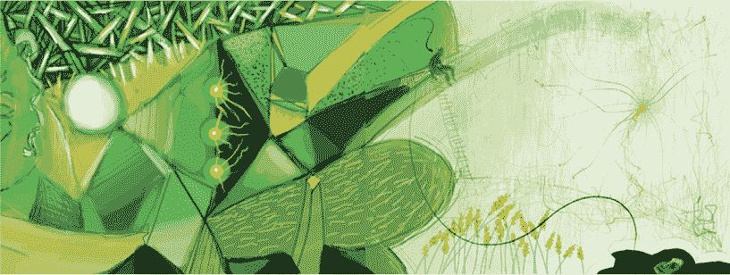

序言

*DADA Collective: Lissette San Martin,智利 / Mlibty, 克罗地亚，利用区块链技术共同创作，视觉对话*

大约 2 年前，我告诉我丈夫，我不想追随一个三十多岁法律顾问在初创公司通常的路径——走向更大更好的公司，而是要全力以赴地投身区块链商业世界。他……很惊讶。我敢肯定，当他礼貌地微笑着问“为什么？”的时候，他正在想我是不是比预期更早地遭遇了中年危机。

“想象一下，镇上有一家新的糖果店，那里有来自世界各地最好的糖果，”我开始解释，看着他的表情从震惊变为困惑。

每个人都争先恐后地冲向糖果店，渴望得到并大快朵颐糖果。好吧，我这里有两个选择。我可以继续当法律顾问，不断告诉所有人如何优化他们的糖果享用体验，同时提醒他们各种与糖相关的风险，而我的手和嘴却偷偷地贴在糖果店的窗玻璃上流口水。或者我可以进去大吃特吃。所以我决定选择后者。我将早点进去，帮助建立区块链行业，并亲身体验这个过程，而不是通过同事的经历来间接体验。

他回应说：“听起来不错。”

*当涉及到区块链技术时，我决定进入这个成语意义上的糖果店，大吃特吃糖果.*

于是，就这样发生了！在过去的 2 年里，我一直站在这个令人兴奋且充满希望的新行业的最前线。如果你稍微关注一下新闻，你可能已经知道，高潮非常高，低谷，嗯，非常低。

我见过一些江湖郎中利用这种繁荣欺骗大众，模糊技术。我也见过这个行业专业化，过滤掉那些骗子。我遇到过许多所谓的专家，他们充满自信却缺乏能力，但我看到越来越多的专业人士一起学习，坚持不懈地为这个非常复杂的科技开发用例。

这是一个实验性的领域。做是获得专业知识的唯一方式。

“区块链”这个词已经成为投资者们的猫薄荷。一开始，他们给任何早期阶段的公司提供五百万、一千万、两千万美元，这些公司没有产品，除了一个想法之外几乎没有什么东西可以展示——只是一个所谓的“惊人的团队”和随便扔在那里的“区块链”这个词。

我在考虑加入这些神秘初创公司时，和几位投资者谈了谈。我想知道我错过了什么，他们看到了什么我没有看到的。我看着一些非常成功、成熟的男人表现得像我 8 岁的女儿在克莱尔（ Claire 's ）店里被闪闪发光的物体淹没时一样。幸运的是，这种不可持续的热情终于结束了。我们现在回到了一个更加审慎的投资方法。

我见过公司用“区块链”作为营销工具，以显示新颖性和创新。而我越来越多地看到公司认真努力地发展这项技术和生态系统。我进行了许多关于什么是有可能的对话。我甚至看到几个试点项目和概念验证进入生产，并在现实世界中实现。

有趣的是，区块链并不局限于硅谷，它是一种全球现象。瑞士、爱沙尼亚和以色列经常在这个领域领先。

企业和初创公司终于在区块链上构建了有意义的产物。我们终于在解决问题，构建客户可能需要的东西。

最后，我目睹了一些备受尊敬的专业人士严肃地争论，Hyperledger、以太坊还是其他区块链平台哪个最好。即使忽略了平台的看似融合，这种争论有点像问叉子还是勺子哪个是更好的工具。答案显而易见：这取决于你在吃什么。有时筷子甚至能带来更多的体验提升。

*区块链将帮助美丽和功能性的世界团结成一个明亮、充满希望的未来。*

是的，区块链，就像任何其他技术一样，可能会被误用，至少可能会用于非预期目的或产生非预期后果。

然而，我对区块链技术和其潜力保持高度乐观。我确信，区块链技术将会在我们的一生中改变我们的生活。变化会逐渐增长，但最初会很小且集中在效率上——更大、更强、更好、更快、更便宜。

最终，当我们终于理解了这个工具的全部潜力，其他技术成熟，监管尘埃落定，我们将专注于构建更功能化、更美丽、更公正的世界。记得在迪士尼电影《小美人鱼》中，爱丽儿用叉子梳头发的场景吗？她在探索这个工具的潜力，然后才能优化它的使用。一旦我们发现这个名为区块链的工具的正确用途，我们将会开始解决历史上看似无法解决的问题。现在，我们还在用叉子梳头发。

这当然会导致商业模式的广泛创新。我记得我刚开始练习法律时，每个人都想要“SaaS 律师”。说清楚，“SaaS 律师”并不是一个东西，至少现在不是！SaaS（软件即服务）是当时新技术出现引起的创新。大多数人对此了解不多，所以每个人都想要 SaaS 律师来起草 SaaS 协议。

当然，短期内没人能找到一个经验丰富的 SaaS 律师。我们不得不培养一代律师来谈判和起草 SaaS 协议。我很高兴地报告说，大多数技术律师都经过了良好的培训，擅长 SaaS 协议。如今“SaaS 律师”已经不再是热门商品；他们在技术公司运营的每一个地方都随处可见。

这里有一个教训。新技术导致新的商业模式，而新的商业模式又导致对新技能的需求。

这就是我期望区块链会发生的事情——新技术、新型商业模式以及对新技能的需求。商业模式的问题可以分解为两个截然不同的问题。

第一个问题是创造了什么新价值？通过研究和无数次采访，我确定了七个似乎正在使用区块链技术发展的突出价值。这七个价值甚至今天都不是详尽的。它们仅仅是 我认为最有前景的。我预计随着时间的推移，其他价值将逐步发展。

第二个问题是，如果有任何人，谁能货币化这个价值？在这本书中，我主要关注第一个问题。你可能会认为现在回答第二个问题还为时尚早，尤其是因为第一个问题的答案仍在发展之中。整本书中，我都指出了企业和小企业的机会，尽管我们如何货币化区块链技术将在未来 5 到 10 年内演变。所以，保持开放的心态，敬请期待！

像孩子一样，新技术和行业需要时间来成熟。它们开始鲁莽、有时不负责任、常常迷茫——但充满潜力。毕竟，那些对一个他们一无所知的产品的幼稚投资者投入数百万美元，以及那些欺骗他们的江湖骗子，都看到了区块链中的*某些东西*。这是一个极其令人兴奋，虽然承认起来不完美，但正在崛起的行业，但我坚信，随着它的成熟，它将被用来解决我们甚至还没有尝试去解决、我们甚至认为无法解决的问题。这只需要发展它的人有纪律、创造性和坚持。
