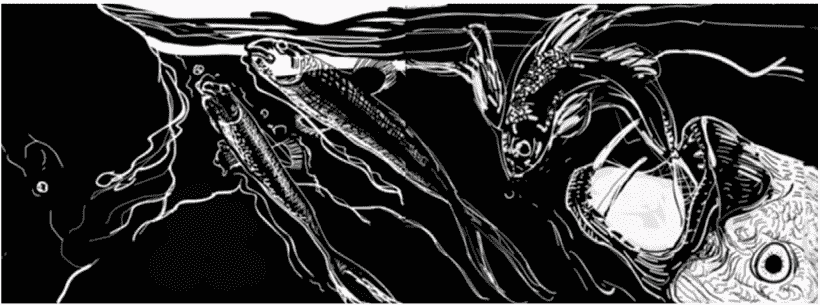
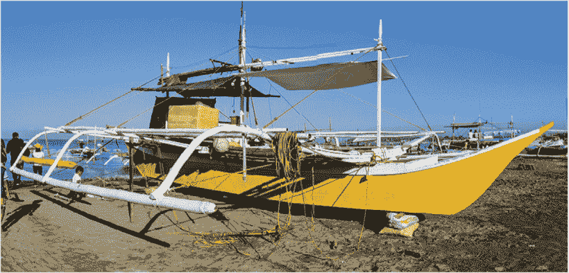
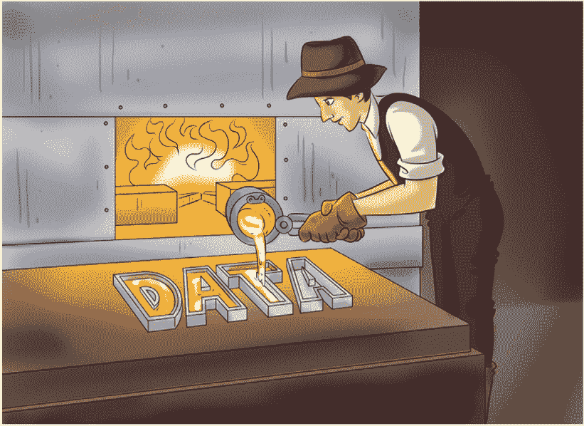
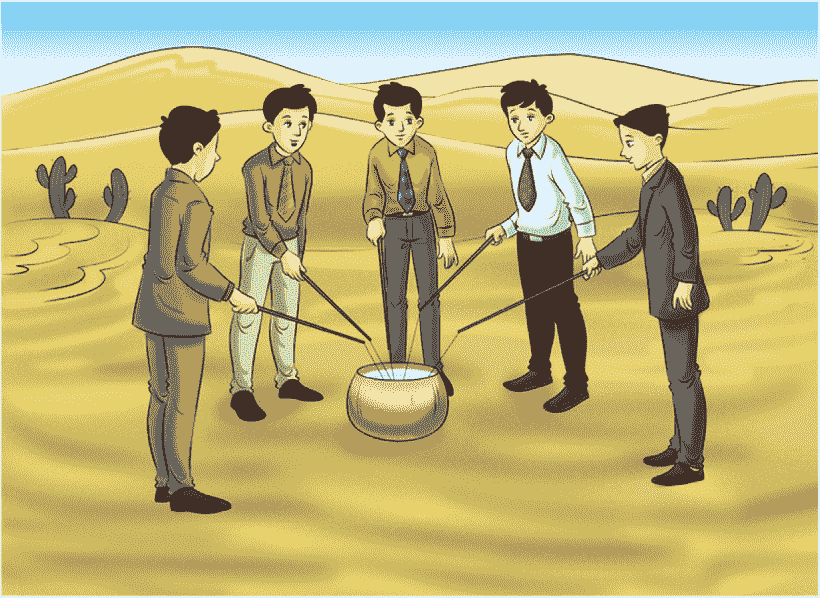

第一章

偶然发现数字黄金：利用数据潜力进行管理、安全和分享

*DADA 集体：智利 / 秘鲁的 Massel Quispe，使用区块链技术共同创作的视觉对话.*

互联网目前是一个等待被发现和转换为可用形式的数据金矿。现代经济是数据驱动的，因为数据对雇主和商业领袖有价值——它使他们能够根据事实而不是猜测做出决策。市场营销部门使用市场细分数据来识别新的、渴望的客户。人力资源专业人士收集数据来招募最佳人才并核实他们的资格。商业高管研究宏观趋势，确保他们的产品和服务相关——并依赖汇总数据这样做。数据使用的回报和节省是前所未有的，值得追求。

你最近可能听说过“大数据”这个术语。它主要是一个想象中的类别。没有使数据“大”的阈值。但这个术语很有帮助，因为它代表了越来越多和不同类型的数据被收集，以及数据在我们生活中的重要性。

在“大数据”的世界里，有两种基本类型的数据：人类可读数据（也称为非结构化数据）是只有人类才能解释的信息，而机器可读数据（或结构化数据）是计算机可以处理的信息。由于计算机处理比人类处理便宜且效率更高，因此结构化数据对于扩大现代企业尤其有价值。

结构化和非结构化数据至少属于以下四个类别中的一个：

- **个人数据**——它是与你特定的信息，包括你的人口统计信息、你的位置、你的电子邮件地址和其他识别因素。

- **交易数据**——是你进行某些行动时创建的任何东西——并且留下足迹。例如，当你点击广告、进行购买，或者只是访问一个网页时，你正在创建交易数据。

- **网络数据**——指的是你可以从互联网上获取的数据，比如你的竞争对手正在销售的数据、发布的政府数据，甚至是篮球比分。

- **传感器数据**——是由温度计或汽车等物体在与环境互动时产生的数据。这些物体通常被称为构成物联网（IoT）的部分。

*从数据噪音中筛选出相关且准确的信息，并非易事.*

如您所想象，那里的潜在数据量巨大。从噪音中筛选出相关且准确的信息并非易事。许多职业、书籍和会议都致力于收集、组织和解释数据。此外，数据收集，尤其是个人数据收集，在大多数国家都有严格的规定。例如，欧盟通用数据保护条例（GDPR）和加利福尼亚消费者隐私法（CCPA）的复杂性是出了名的。

**区块链与数据是天作之合！它们真的能相互完善。**

结果证明，区块链与数据是天作之合！它们真的能相互完善。区块链可以帮助数据发展出完整性和质量，以更系统化的方式确保安全，更容易地追踪，简化共享，产生信任，以及实时分析。1 本章探讨了区块链与数据交汇处的商业应用，特别是它们如何运用区块链技术来管理、保障和共享数据。

数据管理：良好的数据 + 审查 = 魔法

区块链为数据管理提供了许多优势。区块链的关键特征，包括去中心化控制；基于密码学、透明度、耐用性和健壮性构建的安全且不可篡改的基础设施；以及保密性，使其成为数据管理现有工具的理想补充。它拥有数据管理中每个人都想要的东西：具有完整来源的数据。它显示了谁做了什么，何时以及如何进行，并由所有参与者进行验证。2 这是一个及时的趋势，尤其是在人工智能（AI）和物联网（IoT）日益现实的现实和重要性中，这两者都严重依赖数据。

**走向更加可持续的未来**

请见 Kat Leigh,3 小规模海洋行动（SmallScaleOA）的创始人，一个沿海数据的循环经济。 Kat 旨在使用分布式账本技术来激励可追溯、透明的海鲜，以及包容性、低成本的沿海研究，在超本地化的规模上进行。

根据莉丝的说法，世界上大约一半的海鲜来自常被忽视的小规模部门，该部门全球约有 90%的渔民。全球大约 85%的渔民和养殖户生活在亚洲。拥有众多岛屿和漫长海岸线的印度尼西亚，对全球其他地区的海鲜供应尤其关键。

莉丝说：“海鲜行业需要廉价且可靠的信息来监控其运营，通知区域管理，提供合规证据，以及识别风险因素和相关缓解/适应策略。”然而，数据严重不足。

**菲律宾的一艘小规模渔船的典范。**

SmallScaleOA 希望彻底改变沿海社区和海鲜产业。它可以提高渔业和养殖生产力和效率；区域管理和海洋空间规划；政府或企业质量和安全计划的透明度/可追溯性，或认证计划；甚至提供保险、资本、投资和金融服务。

*菲律宾清晨的 tuna 捕捞登陆.*

她注意到了，

我对东南亚海鲜行业的了解越多，我越意识到它真的是一个全球海鲜生产中心。印度尼西亚是第二大野生海鲜捕捞生产国和第三大水产养殖国。该地区工作可能产生的潜在利益是我最初吸引我的原因，并且一直让我坚持下去。如果我们想要产生影响，我们当然需要采取行动的地方。

*称重和记录捕捞数据.*

那么，Leigh 为何如此坚持并充满热情呢？她为何在面临如此高的学习障碍时仍坚持学习区块链呢？原因很简单——问题很大，解决这个问题将产生巨大的影响，而且 Leigh 对这个事业充满热情。她观察到，

值得一提的是，我们的 97%的渔民都在发展中国家。当你考虑到那些大型渔船出去捕捞大量的鱼时，这并不是从海洋中捕捞出来的海鲜的大部分。这对社会经济产生了重大的影响。还有很多问题。产品三分之一是标签错误的。我们有非法未报告未记录的捕鱼（IUU）和人权侵犯。

根据 Leigh 的说法，大多数地方都没有捕捞数据。此外，全球变暖还有一个邪恶的双胞胎：海洋酸化，由于二氧化碳排放导致的海洋 pH 值下降。最后，许多海洋问题都是由于我们的食品系统与自然基础设施之间的联系造成的。当然，海洋不仅仅变得更加酸性；它还在变暖。Leigh 解释说，

尽管海洋已经吸收了一些二氧化碳，但我们的地球仍在变暖，并且 warming up 的速度令人担忧。它正在导致海表温度的变化。根据联合国一个小组五年前的估计，海洋的平均加热速度快了 40%。这种速度是前所未有的。

如果我们能将这些现象的数据与我们的企业、政府和社区所做的决策联系起来会怎样呢？Leigh 进行了说明，

如果我们想要监测这些疯狂的、可怕的变化，我们需要解决收集这些信息和能够采取行动的差距。特别是在世界上受影响最严重的地区。这些障碍是什么？如果你试图测量海洋酸化，你不仅仅是测量 pH；你需要测量六个碳酸盐参数中的两个。有很多不同的参数。

根据莉 igh 的说法，“这种测量很难扩大规模。如果你想让全世界的人都不断地取样，你就得有大量的人不断地取样。”莉 igh 开玩笑说，

甚至我不认为如果你部署了每一个研究生，你就能充分利用他们的劳动力来获取这些参数。像 pH 和溶解氧这样的自主传感器是新的；而且都很昂贵。收集这些信息有很多障碍，这很不幸，因为这些信息非常宝贵。

另一个问题是互操作性。使用的传感器通常是由私人公司生产的，这些公司根据请求为特定的研究定制开发产品。莉 igh 解释道，

如果你是一个博士或博士后，你有一个研究问题，你跟一个公司谈谈，他们为那个研究课题开发一个产品。同样，这扩展得不好。效率极其低下。这些也是私人公司，他们 Understandably seeks to profit from their sensors. So they’re not sharing information, and it prevents technology from moving forward.

莉 igh 的愿景很简单，“如果我们能打破那个隔离，实际上允许这些公司分享他们的信息，推动技术前进呢？如果我们能把不同的创新结合起来，使它们更便宜地大规模生产呢？”

小型开放海洋联盟（SmallScaleOA）的目标是通过对激励数据共享来增加基于数据的决定。莉 igh 确信：“分布式账本技术（DLTs）可以实现这一点。小型开放海洋联盟可以激励数据的收集和共享。如果我们不仅有沿着供应链向上的数据流动，还有跨越沿海社区的其他行动者的数据流动，那就太好了。”

如果数据生产者因他们的贡献而得到奖励呢？如果每个数据消费者为了获取这些数据，必须补偿生产者呢？这是智能合约的想法——你可以指定交换的条款和条件，以便数据消费者必须满足生产者的条件。采用这种方法，你最终会将价值回馈给水产养殖者和渔民，他们生产这些数据。

莉 igh 继续说，

这个想法的整个根本就是数据收集有价值。你明确地将这种价值纳入交易中。有了这些数据，你可以开始对环境、其他企业、海洋空间规划和区域管理做出决策，并开始让更多的人参与这个过程。

她断言：“在这个特定地区、特定社区，你可以做出一个具体的变化。而且它立刻就有用。”

你还需要一个团队来处理数据。这就是学术界、研究机构和其他人介入的地方。莉 igh 解释说，

他们满足生产者智能合约的条款和条件以获取原始数据。然后他们进行处理，然后他们将处理后的数据重新放入区块链，这样其他人就可以使用这些处理过的信息。但每次有人想要使用处理过的信息时，他们都必须满足处理器智能合约的条款。所以，研究人员也因他们的工作而得到奖励。

换句话说，每次有人拿出一组数据并移动或使用它，这个变化都可以被追踪和奖励。你开始创建这个互动生态系统，所有这些都建立在相互关联和连接的事物上。莉 igh 观察到：“这真的可以开始改变事物。”

莉 igh 是乐观的。

如果我们生活在这个世界中——数据消费者总是补偿数据生产者——我们可以拥有各种各样的新的互联。我们将获得关键渔业和养殖数据、追溯数据、可追溯性和透明度数据。所有这些都有助于供应链效率，有助于增值营销，有助于健康、安全、质量控制和合规措施的认证计划，还有更多。

这就是 SmallScaleOA 如何建立一个机制来激励沿海韧性——通过数据的价值和数据运动来实现。

根据莉 igh 的说法，SmallScaleOA 汇集了学术界、海鲜供应链社区、保护主义者、政府、公民等。你可以有不同的社区项目，所有这些都投入到更大的数据经济中。他们帮助将一个部门的数据转换为其他部门实体。粮仓的墙壁将会倒塌。

这里的大想法是，数据对这些不同的参与者是有价值的，但需要将其转换为不同的实体才能实现这种价值。莉 igh 解释说，

例如，你可能关心这批货物中有多少鱼，但我不在乎这批货物中有多少鱼。你可能关心货物来自哪里，或者你可能关心有多少人参与了鱼的加工。为了使数据流畅地流动，鼓励这种运动需要货币。

因此，用加密货币来编写智能合约是有意义的，尽管这当然不是唯一的选择。

在 SmallScaleOA 中，通过使用新型传感器和移动应用程序，渔民和水产养殖户将自主连续地将数据发送到一个去中心化的生态系统中。为了获取数据，消费者（如其他渔民、水产养殖户、企业、当地社区、政府、非政府组织、多边机构或学者等）需要满足智能合约中规定的数据交换条件。数据用户随后可以在渔场或农场、社区、国家甚至全球的层面上做出明智的决策。Leigh 确信这将行之有效。她解释说：“通过包容性、低成本、本地化的数据收集和共享，SmallScaleOA 将把基于数据的决定融入我们的日常生活。”

《数据让你更健康》

使用区块链进行数据管理也可能对盈利企业证明有用。例如，Ben Hwang，4 担任 Profusa5 董事长兼首席执行官，这是一家医疗设备和数据公司，致力于开发用于连续监测体内化学变化的组织集成生物传感器，他正在积极研究区块链在数据管理方面的潜力。该公司设计和开发组织集成的传感器和生物传感器，通过提供生物反馈帮助管理各种健康问题，如糖尿病和健康生活，以及实时监测体内化学变化。

Hwang 自称是“区块链新手”，他意识到区块链为实现他的愿景提供了巨大的机会。Hwang 解释说，

我们的医疗保健将个人的医疗信息和医疗数据货币化。我们可以改变它，让人们决定他们的数据如何与护理提供者和利益相关者共享。换句话说，人们可以拥有自己的数据。个人可以掌控自己的数据。

Hwang 意识到区块链是一项具有广泛应用的基本技术。这是一种变革性技术。Hwang 说，

我们已经开发了一个医疗技术平台。我们可以在人们的生活中实时监测临床级别的化学物质。我们可以准确做到这一点。我们的目标是测量医生关心的事情，以便他们能够做出准确的诊断，更重要的是，创建实时反馈，让个人能够过上最健康的生活。

他继续说道：“我们的设备不是测量步数。我们测量医生关心的事情。我们采用的方法也让医生知道如何处理我们技术提供的值。”

他解释道，

我们克服的挑战是，身体知道什么是身体内的，什么不是。一旦你穿过皮肤刺入一个小针，身体就会对它发起所谓的异物反应。即使从电气工程的角度来看传感器仍然工作，身体也会通过沉积胶原蛋白和疤痕组织来保护自己，防止传感器发挥作用。因此，传感器会报告一个值，但这个值不再指示生理状态。你基本上是在测量疤痕组织的状况，而不是身体其他部位的情况。

黄说，

我们的技术克服了异物反应的影响。我们通过普通的皮下注射针将传感器注入皮肤，这个过程与打疫苗的经历类似，并不那么具有侵入性。身体并不介意它们的存在。因此，传感器可以工作数月甚至数年。

黄继续说，“我们技术平台的另一个好处是成本。我们技术的成本可能相当低。数据的获取速度非常快，但更换组件的需求并不频繁。”

为什么是区块链？黄说，

如果我有能力创造我们化学信息的流动，那么数据问题立刻就出现了。目前，我对数据的获取不再比我控制数据的作用和数据去向更多。我必须依赖某个医疗专业人士。今天，我做一个医学实验室测试，医生给我一个结果。我对那个没有控制权。

黄继续说，

随着我们传感器技术带来的新范式转变，用户现在成了数据的产生者。这些数据是围绕个人用户的，她可以选择与她选择的护理提供者分享这些数据，也可以选择是否继续与医生分享。当你将范式转变为以患者为中心的模式，患者控制自己的数据以及数据分析方式，而不是医院或系统，这种影响是深远的。

根据黄的说法，

首先，护理成本可能会大幅降低。其次，我能够获取这些信息并创造市场效率。现在你有更大的自由度去寻找服务，购买你喜欢的或关心的东西。你不再是被官僚体系束缚的囚犯。换医生可能会更加无痛。

黄说，“区块链将有助于数据安全、数据流动和数据控制。在医疗领域，区块链技术的益处更为重要，特别是当我们推出下一代消费者健康产品时。”

黄解释说，

我们仍在问自己如何证明在家庭个性化部署我们的传感器数据以及整合区块链技术和数据安全可以为个体和系统创造数据交易价值。我们正处于探索阶段。我们已经取得了相当好的进展。

区块链在健康相关数据公司的应用越来越受欢迎。例如，Gem6 构建了由区块链提供动力的工具，将大型且不相连的数据集连接到一个平台上。该公司开发了一个名为 GemOS 的操作系统，以访问、请求、编程、存储和验证区块链上的数据。其他基于区块链的健康相关数据公司也活跃在此领域。例如，Chronicled 结合了区块链技术和 IoT 系统，帮助供应链提高可追溯性和责任感。其解决方案对制药等产业至关重要。7Coral Health8 利用区块链的力量使个性化医疗成为可能。Blockpharma9 使用基于区块链的技术，通过提高药物可追溯性来打击假药。

数据安全

区块链技术*可用于以安全和永久的方式存储几乎任何类型的数据*。

尽管最初区块链技术是为了创建一种点对点货币（还记得比特币吗？！），但底层区块链技术在点对点货币之外也有有用之处。一个永久、安全、分布式的数据库有无数与点对点货币无关的应用。

区块链技术可用于以安全和永久的方式存储几乎任何类型的数据。10 这通常使数据变得更加有价值，并 command 高端价格。因此，许多公司正在寻求利用区块链技术的安全方面。毕竟，设计得当的区块链在密码学和数学上是安全的。暴力攻击几乎不可能破坏它们。

中心化的云存储是否会在不久的将来转变为分布式服务？个人身份和数据存储，由政府和私营企业进行，转变为区块链身份和数据存储，是不是一个合理的下一步呢？让我们探索一些例子。

使用激励机制保障数据*

Storj11 是一个购买和出售存储空间的交易市场。它是一个开源项目，用于存储和保存文件，允许你在 Storj 区块链上安装和运行你自己的节点。Storj 将这些用户称为“租户”。对于不太懂技术的用户，Storj 提供了现成的文件存储服务。Storj 将这些用户称为“农场主”。

这种混合商业模式，即在协议级别提供和更用户友好的专有货币化服务或应用程序提供，在区块链初创公司中越来越受欢迎，并带来了一些真正的优势。通过将基础软件开源，他们邀请其他人建立在自己的基础上并扩大他们的影响力。这最终有助于他们的服务。

区块链可以解决数据的**公共悲剧**——在一个共享资源系统中，个别用户根据自身利益独立行动，通过集体行动耗尽或破坏该资源，从而违背所有用户共同利益的情况。

所有参与者也有激励通过提供最经济的安全服务来维护网络的完整性。这是区块链初创企业中另一个受欢迎的特点。目标是解决公共悲剧问题——在一个共享资源系统中，个别用户根据自身利益独立行动，通过集体行动耗尽或破坏该资源，从而违背所有用户的共同利益。其他由区块链提供动力的数据安全解决方案也不断涌现。例如，Sia 或 Siacoin12，通过智能合约创建了一个买家和卖家文件存储市场的类似模式。

在云之上实现**区块链安全**

其他公司也在积极涉足由区块链提供动力的数据安全领域。例如，Cryptyk13 认识到区块链有一些局限性。可以存储的数据受到参与计算机数量的限制。Cryptyk 将数据分解为不同的部分，并存储在 Amazon 的 AWS、Dropbox 或 Google Drive 等第三方服务上。当请求时，它使用区块链来跟踪和重新组装这些文件组件。他们在云存储之上的区块链层跨越多个服务，使得如果文件存储服务被攻破，黑客可能访问到的不过是数据的无意义碎片。

通过**主权身份**保障数据安全

Civic14 通过不存储个人信息来保护个人身份。它允许您将身份证明文件输入 Civic 的 Secure Identity App，然后与政府等可信赖的第三方机构核实这些信息。这个可信的第三方仅仅验证您输入了准确的信息；它不知道您的身份。Civic 区块链只存储足够验证您的身份证明、健康保险或其他文件有效性的信息，不再存储更多信息。所以当您需要向一个组织证明您的身份时，您在 Civic Secure Identity App 上展示您的凭证，该应用验证您确实拥有有效的文件。但重要的是，您实际上并没有将那些信息提供给接收组织。

一旦验证，数据就会被哈希并转化为加密代码。这个加密代码，而不是数据本身，存储在区块链上。因此，潜在的黑客最多只能得到无法追溯到您文件的 meaningless codes。

最后，通过区块链，可能有可能通过建立我们之间的信任来证明我们的个人身份，而不需要像政府这样的权威。我们将维护对自己身份和数据的所有权。它也可能更快更方便，因为它可以避免与官僚机构打交道。像 SelfKey15、TheKey16、Iryo17、Patientory18 和 Guardtime19 这样的解决方案已经实验性地让您，作为用户和身份所有者，控制自己的身份。

《全球交易模型：重新思考安全》

然后，还有一些非常不同的方法！介绍一下史蒂文·斯普鲁格（Steven Sprague）20，Rivetz 公司的首席执行官。他的公司提供工具，通过利用内置的可信计算技术来提高任何网络服务的订阅价值，以增强身份验证、隐私保护、使用便捷性和安全性。21 斯普鲁格说，

区块链的一个挑战是我们无法证明存储在链上的数据是真实的。它们是不可变的。您只知道这个交易是在某一天某一时间用区块链写的。但是您没有任何证据证明交易数据是为了什么。而且，虽然您知道它是由私钥签名的，但您不知道在签名时控制该私钥的人。

他继续说，

这是我观察区块链的基础。当你想到区块链时，它实际上是两个系统。第一个系统就是这个不可篡改的账本，分布式账本技术（DLT）。它是存储信息并知道它没有被更改的能力。

他还说，

第二部分是如何编程分布式账本技术，向其发送指令。这与钱包和私钥概念有关。作为私钥的所有者，你真的是所有区块链的中央上帝。如果一个私钥的所有者从未发送过交易，那么区块链不会做任何事情。你需要基础设施来帮助私钥的所有者控制他们的私钥，确保在交易发送之前他们需要遵守的任何合规性已经完成。

斯普鲁格解释说，

你需要证明这些环节已经到位。这是我们工作的核心。那么，如何建立证明，当一个交易被构建，当它被写入，或者当它被私钥签名时，这个签名只是在用户有意图的时候应用的呢？我们经济模型的核心是确保那些合规性层次。

他继续说，

在区块链上有多种不同的方法可以实现这一点。例如，IBM 实现了一个权限链。它通过控制服务器来应用传统的网络安全控制，从而拥有私钥。然后，他们只需运用正常的老式企业网络安全措施，以确保只有授权用户可以访问服务器。

根据 Sprague 的说法，

在 Rivetz，我们在去中心化的基础上应用了这个模型。我们把策略围绕私钥封装在客户端设备中。通过在设备内部保护私钥，它可以是去中心化的。我们可以在键被使用之前，在钱包中应用策略到键上。

他继续说，

你可以把它看作是一系列非常简单的规则。在你被允许出去玩耍之前，你必须戴上帽子和手套，这是妈妈设定的规则。问题是，我可以在哪里执行这个规则？通常，你在出门时在门口执行。在加密技术的情况下，“在门口”意味着在交易签署时。如果你把整个比特币交易组织好，然后你点击签名，无论你是将其发送到一个智能合约还是链上的脚本，你都会发送这个指令。无论签名数据中包含什么，都将得到处理。

根据 Sprague 的说法，我们需要在签名之前收集信息和安全性。Sprague 继续说，

这就是为什么我们把签名过程运行在受信任的执行环境中。这个受信任的执行环境允许我们设定一个规则，即在使用这个私钥之前，你必须遵守某些规则。例如，你可能需要输入你的 PIN，出去与企业活动的目录服务器核对，或者遵循在键使用之前建立的其他规则。

他继续说：“我们记录了每一个规则。这样，在签署和验证哈希之前，每一个规则都经过了验证。然后，我们将那个结果哈希写入交易中。”

我们为什么要这样做？Sprague 解释道，

简单地说，假设我们要去法庭证明我在区块链上写了些什么。我们第一次去法庭时，所发生的一切只是你拿了一个标准的现成理论，一个链上的理论。我们在法官面前站起来，拿出以太坊扫描。法官说：“好极了。我看到这是一笔交易。我看到一个签名；我相信以太坊所有的数学。太棒了。解释一下你是如何保护你的密钥的。”你说：“哦，我有我的私钥。”然后法官问了一个非常简单但愚蠢的问题。证明给我看。那么你是如何相信这是你私人信息的唯一副本呢。链上的数据可能是任何复制了你私钥的人写的。“你有你私钥的副本吗？”“是的。”“你把它放在哪里？”“在一个保险库里。”“有没有其他人可能有权限访问保险库？”“是的。”“你怎么知道别人有没有访问过？” “我家里有监控摄像头。”“我们可以看看过去 4 年的监控录像吗？”“过去 4 年我没有，只有 30 天内的。” “哦，所以你不知道有没有人偷走了你的私钥。”

总之，区块链上的数据质量非常低。它可能比大多数企业服务器还要差。斯普鲁格继续说道，

现在我们已经围绕密钥进行了一系列政策控制，并在交易中写入了一个半秒的哈希值，让我们回到法庭。我可以证明交易是在某一天某一时间完成的。再次，法官要求证明你的私钥受到保护。你说：“第二个哈希值是这些控制清单的结果，这里是一份控制清单。这些十几个控制措施是在密钥用于签名之前执行的。”

他继续说，

你检查了保护密钥的硬件的健康和完整性。你检查过我是否控制着那个设备吗？你检查过你是否仍然是员工，设备是否连接到企业网络。你检查过我是否在某个特定的建筑物里。你检查过所有密钥所有者希望进行的控制措施。所以现在，你可以证明这个私钥受到了这一系列控制。你可以找到这笔交易。

根据斯普鲁格的说法，你可以证明，例如，你的私钥存储在一个硬件设备中，它有适当的保护，并且由一个指定的人在一个你熟悉的位置使用。斯普鲁格解释道，

我们认为将证据与数据绑定可以提高存储在链上的交易的质量和因此它们的可靠性，这些交易确实是真实的。这有点像拥有预言作为政策，但这些预言是在客户端设备上应用的，而不是在智能合约中。

他解释道，

一个受信任的执行环境与智能合约非常相似。在设备内，是的，但它是一个被测量的环境。所以，你知道那个环境是在预期的条件下运行的，这是根据所做的测量质量来判断的。这就是受信任的计算，对吧？你会认为智能合约是信任，通过不同的方法来保护。

证据与数据相结合并提高可靠性，预计将增加其使用。以智能合约为例。如果我通过智能合约在链上写下一个结果，你能确信智能合约真的写了这个结果吗？我可以查看合约并说，“嗯，这个合约里有什么逻辑？发生了什么？”你会说，“嗯，发生了这十件事情。它们被加在一起得出了一个特定的结果。”现在你可以断言智能合约已经被处理。你有证据。我们做的是在客户端设备内生成第二个散列值，以证明消费者选择添加到密钥中的控制措施在密钥生成时是实施的。

他建议，

这种实施将使区块链成为现实。今天通过区块链写入的所有数据都可以被认为是“假新闻”。除非你追溯到权限链，否则你没有证据证明这些数据是真实的。我们的方法将提高数据的价值。如果你不能使用区块链来提供一个真理，而不同时从生成交易的机器中收集窗口日志文件，那么这根本没有任何效率。当一个交易附带着其密钥质量的司法证明一起旅行时，真正的价值才存在。

根据斯普鲁格的说法，这种方法将改变商业。他说，

应用策略添加设备的美妙之处在于，它以惊人的隐私方式发生。这样想：如果你的孩子要进行一项医疗程序并不得不缺课一周，你可以给学校发送一张医生的便条，指定免予缺勤。然后如果你的孩子取得了及格成绩，她就不需要在年底的时候补上这些天数。这是我们作为父母都能理解的一个模式。

他继续说，

金融服务领域以不同的方式看待世界。他们认为正确的答案应该是将孩子的患者 ID 码发送到学校，这样学校就可以登录健康记录，监控孩子的活跃护理，并实时判断孩子是否应该在学校。这是荒谬的。而且，这绝对不是安全的。

斯普鲁格敦促，

我们有机会迈向一个全球交易模型，无论我是从利比亚向埃及发送价值，还是从波士顿向迈阿密发送价值，监管制度都会有所不同。我们最好采用一种许可证类型的模型，我们可以说，“这是一笔已经交付给这家金融服务机构的交易，并且它在交易发送之前完成了所有必要的合规性，而不是之后。”

斯普鲁格认为，这从根本上改变了我们银行的方式。不同于数据通过各个机构传递，每个机构都在协议层应用其控制，我们应该预先确定控制措施并确保我们的合规性。然后协议只是移动价值。这是在当前复杂、全球地缘政治体制下（不太可能改变）移动资金的唯一方式。

因此，根据斯普鲁格的说法，区块链协议几乎不赚钱。它仅赚取一分钱来将 100 万美元从点 A 转移到点 B。但合规性、合规性的证明以及取证生成——所有在智能合约和信任执行中完成的工作——才是交易收入发生的地点。你不需要为合规性支付。你会为 KYC 支付。你会为反洗钱（AML）检查支付。你会为地理定位验证支付。在交易发送之前对控制措施的验证非常重要。这些不属于协议的一部分。这些是指导方针的一部分，而商业机会货币化就位于其中。

他解释说，

协议应该是相对简单的。协议就是协议。它们执行特定的功能。它们不能做任何事情。它们由指令编程。合规性应用于指令级别。它们都是合规验证者，既包括提供者也包括验证者。我认为与交易一起旅行应该在一份简报中找到，该简报表明根据合规性列表进行了所有检查。

在斯普鲁格（Sprague）的模型中，支付不必是加密货币。显然，如果你在进行微支付，加密货币有一个明显的优势并且能启用额外的功能。但支付可以是任何东西。

斯普鲁格建议，“采用这种方法我们在所有事情上都会更加简单。在这种交易的所有权和控制之下，用户的的大数据开始被收集，但用户保留了中心控制。”他继续说，

与其将我们的交易通过一个中央服务传递，我们还可以选择从中央服务添加控制到交易中。因此，我们可以更容易地切换服务，因为货币的互联网或协议只是移动资金。

数据共享

*区块链可以帮助促进有价值、安全的数据共享.*

想象一下，如果我们拥有所有人的完整基因组信息。我们可以找到无数的相关性和许多目前认为无法治愈的疾病的治疗方法。那么，我们为什么不对所有人的基因组信息进行汇总呢？

除了各种与隐私相关的个人信息规定外，许多人还担心这些信息会被误用。例如，他们担心某些基因携带者可能会面临更高的保险费率。因此，显然，信息共享的缺乏会阻碍进步。

**安全数据共享是可能的**

区块链能帮助促进安全数据共享吗？

介绍 Nebula Genomics，或 Nebula，22 这是一个为了解决这个问题而努力的项目。它提供了一种私人且安全的方式来了解您的基因关于您的特征和血统的说法，通过建立定制报告来了解新的变异、风险评分和研究。它还允许您按照自己的条件分享数据，并因选择直接贡献于医学研究和发现而获得奖励。Nebula 承诺，“是否愿意贡献由您选择。如果您愿意，您将始终保持匿名。在不风险您最个人信息隐私的情况下，进入个人基因组的时代。”该公司正在开发加密技术来保护您的基因组数据并实现透明度。它承诺，“无论是执法部门还是研究人员，未经您的同意，没有人能够访问您的数据。”

了解到人们尚未进行 DNA 测序的主要原因与对隐私和遗传数据控制的担忧有关，Nebula 认为私人 DNA 检测的解决方案在于新技术，而不是新政策。Nebula 正在“开发保护您遗传数据隐私的技术，并让您能够可控且安全地分享它。”以下是它的运作方式：

- 数据所有权：您在公开可读的账本上获得了您基因组数据不可撤销（永久）的所有权。这使得所有数据访问请求和权限的透明记录成为可能。访问您数据的研究人员的身份被不可变地（不可更改）记录下来，这有助于建立责任感。

- 访问控制：您的遗传数据将通过在多个独立非营利研究组织之间使用多个密钥的加密方案来防止误用、黑客攻击和未经授权的访问。这种多方访问控制将确保包括 Nebula Genomics 在内的任何单一组织都无法访问您的遗传数据。

• 安全共享：如果你决定分享对你遗传数据的访问权限，它将保持在安全的计算环境中。研究人员将提交分析管道，这些管道将在你的遗传数据上执行，只有结果会被返回给他们。此外，对于一些常见的计算，如查询和全基因组关联研究，我们将部署一种同态加密方案，以支持对加密数据的计算。23

同样，Doc.AI 利用自然语言处理、计算机视觉以及通过区块链技术保护数据来从医疗数据中生成洞察。你可以启动一个“数据试验”，这是一个在平台上收集的健康数据集合，用于一个事业或一般目的，然后数据科学家建立预测模型。最后，你将获得对数据的洞察，你可以与你的医生分享。

在这个未来中，生物数据（包括基因组或微生物组）的控制权掌握在消费者手中，基于区块链，并通过人工智能提供动力，你是数据的掌舵者，也是数据共享的中心。受到他们当前医疗系统个人经历的驱动，Doc.AI 正在加速医学研究并发现个人健康洞察。

零知识简洁非交互式知识证明（zk-SNARK）是一种用于解决隐私和安全问题的方法。zk-SNARK 是一种加密证明系统，用户可以在不透露交易实际数据的情况下验证交易。换句话说，zk-SNARK 允许用户在保持交易隐私的同时，仍然根据网络的共识算法验证交易。24

例如，下次当你用 zk-SNARK 买一瓶香槟庆祝完成这本书时，你不需要出示你的驾照，从而暴露你的地址、体重和出生日期；卖家会知道你是否年满 21 岁，这是他唯一需要知道的事情。

一些公司在网上发布广告时尝试使用零知识证明。例如，如果可以通过零知识证明在不识别观众的情况下验证性地交付广告，我们就可以更精确地衡量广告的表现。这样我们就可以根据出版商和其他利益相关者的工作成果和行为，比今天更加精确地进行补偿。

数据共享方面的*创新正在进行中*

介绍一下塔季扬娜·坎萨 VELI，25 开放健康网络的首席执行官，26 一个使用区块链和智能合约让消费者控制并货币化他们的健康信息，包括生活方式和社会经济信息的白色标签解决方案。该平台由 AI 和大数据分析提供支持，可快速开发数字健康产品：为患者、医疗机构、支付方和医疗研究人员提供移动和语音应用程序以及聊天机器人。开放健康网络使用区块链来管理用户身份和同意书。

开放健康网络在 2015 年的白宫演示日重新启动。

我们已经识别出了包括疾病、环境、社会和经济数据在内的样本数据集，这些数据通常被排除在外。我们拥有来自设备的数据、患者报告的数据以及电子健康记录（EHR）和索赔数据。这使得医生能够更全面地了解患者的状况。

坎萨 VELI 解释说，

我以患者的身份创立了这家公司。我希望创建一个真正的以患者为中心的解决方案。因此，我正在建立一个患者体验管理平台。它就像 SAP 一样：一个可定制、个性化、适应性强的由 AI 驱动的平台，最终是一个以患者为中心的解决方案。这是一个企业对企业对消费者（B2B2C）的解决方案。

她说，

我们的目标是让您能够捕获和整合大量的好数据。您的许多数据已经被困在各种应用程序和设备中。我看了看数据是如何共享的。你带着一袋药和许多纸张去看医生。如果你从一个医疗保健提供者那里去，你还会增加更多的纸张。数据共享方面的所有事情都非常低效和不灵活。患者没有任何控制权。我们问自己，“我们如何才能以更有意义的方式实现健康互动，让您，作为患者，处于中心位置，您的医生有更多的关于您的信息？”

坎萨 VELI 观察到，

我们帮助医疗机构创建患者可以一站式收集所有健康相关数据、分享数据、参与临床试验和研究的白色标签数字健康产品，还可以了解他们的疾病、管理药物、预约医生等。一切都是可配置的、个性化的、适应性的：从应用程序的外观和感觉、内容到功能。我们还创建定制的 AI 算法并将它们集成到框架中。例如，美国心脏协会（AHA）使用我们的平台创建了“我的心脏教练”应用程序。每天有超过 6,000 名心脏病发作的人使用它。它提供英语和西班牙语版本。AHA 使用了我们平台中的许多模块。您无需编写代码即可开发高度复杂的应用程序，这意味着应用程序开发时间表非常迅速（几天到几周）。我们拥有个性化、游戏化和推荐引擎。我们的核心平台还为公司提供内容管理系统。

她说，

这款应用已经增加了数据共享选项，因此现在在应用内，患者可以在右上角看到共享选项。那些在心脏病发作后多年使用这个应用来管理健康情况的病人现在可以根据自己的同意[可撤销]逐字段共享他们的数据。这才是基于区块链的健康数据共享的真实用例。

Kanzaveli 继续说道，

我们正在使用区块链来管理患者的身份和同意书。我们解决方案中的区块链部分对任何链都是中立的，但目前运行在以太坊上。我们的架构可以迁移到任何类型的区块链上。我们做出了一些架构决策，以使其更具灵活性和适应性。

其他公司围绕医疗数据内外的数据共享使用区块链技术进行创新。例如，Medicalchain27 提供了一个去中心化、基于区块链的平台，用于安全地存储您的健康记录，并允许您与医生、医院、实验室和药房共享这些数字记录，前提是您允许这样做。

EncrypGen28 正在建立一个独特的区块链平台，或称“基因材料的亚马逊”，以便人们可以在使用加密货币的新兴市场上安全、 securely share genomic data。SimplyVital Health 的创始人兼首席执行官 Katherine Kuzmeskas29 正在努力解决基于价值的护理的低效问题。

结论

数据是一个热门词汇，也是 21 世纪经济的基石。在各个部门，大量的数据正在被发现并得到利用，以解锁几年前甚至没有人想过可能性，从缓解东南亚的过度捕鱼问题到绘制遗传疾病图谱。但是，像任何原材料一样，只有当数据得到有效管理和广泛共享时，它才具有价值。不幸的是，数据越有价值，就越容易受到盗窃的威胁。

有了区块链，大数据在某种意义上会变得更大，在另一些意义上会变得更小。一方面，如其他章节所讨论，区块链技术允许更全面、更细致、质量更高、更深入、可验证、更广泛的数据集，这是前所未有的。换句话说，我们的数据越来越好。

另一方面，安全、隐私和公平的担忧使得数据所有权从组织转移到属于个人的“安全保险库”。使用越来越先进的工具，这些个人将决定是否在市场上出售或共享他们的数据集，这些市场很可能很快就会出现。换句话说，数据的所有权正从公司转移到个人。

数据所有权与数据质量之间的权衡是推动大数据市场变革的基础。

这将根本改变大数据市场的动态。公司和个人之间的关系将发生变化，因为底层的关系和权力动态将发生变化。公司需要与客户建立更加紧密的关系，更有意识地调整其使命，以利用*大众的力量*。

同时，我们一直在目睹强烈的趋势推动可持续发展、提高企业社会责任（CSR）以及隐私和安全价值的提升。对*大规模做好事*的需求持续存在，并且越来越强烈。我们还一直在目睹对透明度的需求和期望不断增加。尽管这些趋势并不是什么新事物，但在过去几十年里，它们一直在获得越来越多的关注和力量。

enter blockchain. Blockchain creates an infrastructure with complete provenance, recording a wide swath of information about each data to provide a holistic picture. As we can manage data more efficiently, there is no limit to the global puzzles that blockchain-based data solutions can address. At the same time, blockchain secures that data under lock and key. Thus, blockchain may be critical in building trust by design.

是的，想到如果将你的整个基因组成输入到服务器中，可以取得医学上的突破，这令人激动，但一想到黑客可能获取这些信息，就让人感到不那么兴奋了。区块链将使这一切变得几乎不可能发生。最后，区块链确保我们可以将所有的数据汇集在一起，共同致力于技术进步，而不是在自己的孤岛中相互竞争。当我们能够聚在一起分享数据时，结果将远远超过我们各自独立完成的总和。

*DADA Collective: Boris Z. Simunich, Peru / Javier Errecarte, Spain, 利用区块链技术共同创作，进行视觉对话.*

_________

1J. Collen. 2018 “5 Reasons Why Data Scientists Should Use Blockchain.” [`bigdata-madesimple.com/5-reasons-why-data-scientists-should-use-blockchain-technology/`](https://bigdata-madesimple.com/5-reasons-why-data-scientists-should-use-blockchain-technology/); A. Sharma. 2019\. “How Blockchain and Big Data Complement Each Other.” [`hackernoon.com/how-blockchain-and-big-data-complement-each-other-92a1b9f8b38d`](https://hackernoon.com/how-blockchain-and-big-data-complement-each-other-92a1b9f8b38d).

2P. Frøystad。2016。“区块链与数据管理。”[`www.finyear.com/Blockchains-and-Data-Management_a36228.html`](https://www.finyear.com/Blockchains-and-Data-Management_a36228.html)。还见 T.K. Sharma。2019。“区块链在医疗数据管理中的重要性。”[`www.blockchain-council.org/blockchain/importance-of-blockchain-in-healthcare-data-management/`](https://www.blockchain-council.org/blockchain/importance-of-blockchain-in-healthcare-data-management/)；P. Bains。2018。“使用区块链改变数据管理。”[`www.itproportal.com/features/using-the-blockchain-to-transform-data-management/`](https://www.itproportal.com/features/using-the-blockchain-to-transform-data-management/)；N. Kudikala。2018。“区块链可能对数据管理产生影响的 4 种方式。”[`www.talend.com/blog/2018/06/11/4-possible-ways-a-blockchain-can-impact-data-management/`](https://www.talend.com/blog/2018/06/11/4-possible-ways-a-blockchain-can-impact-data-management/)。

3K. Leigh。与作者讨论。2019 年。

4B. Hwang。与作者讨论。2019 年。

5 有关 Profusa 的更多信息可在[`profusa.com/`](https://profusa.com/)上找到。参见，“Profusa 完成 4500 万美元 C 轮融资。”[`www.prnewswire.com/news-releases/profusa-closes-45-million-series-c-financing-300696522.html`](https://www.prnewswire.com/news-releases/profusa-closes-45-million-series-c-financing-300696522.html)；D. Muoio。2018。“投资者向 Profusa 的可嵌入式连续生物传感器投入 4500 万美元。”[`www.mobihealthnews.com/content/profusas-embeddable-continuous-biosensor-draws-45m-investors`](https://www.mobihealthnews.com/content/profusas-embeddable-continuous-biosensor-draws-45m-investors)。

6 有关 Gem 的更多信息可在[`gem.co/`](https://gem.co/)上找到。

7 有关 Chronicled 的更多信息可在[`www.chronicled.com/`](https://www.chronicled.com/)上找到。

8 有关 Coral Health 的信息可在[`coral.health/product/`](https://coral.health/product/)上找到。

9 有关 Blockpharma 的更多信息可在[`www.blockpharma.com/`](https://www.blockpharma.com/)上找到。

S. Palavesh. 2018. “Here’s How You Can Secure Your Data with Blockchain.” [`www.entrepreneur.com/article/318477`](https://www.entrepreneur.com/article/318477); 另见 D. Gutteridge. 2018. “Top 6 Blockchain Companies For Keeping Your Data Safe.” [`www.investinblockchain.com/top-blockchain-companies-keep-data-safe/`](https://www.investinblockchain.com/top-blockchain-companies-keep-data-safe/); K. Sharpe. 2018. “Company to Store Healthcare Data on Blockchain Platform for Simple and Secure Data Sharing.” [`cointelegraph.com/news/company-to-store-healthcare-data-on-blockchain-platform-for-simple-and-secure-data-sharing`](https://cointelegraph.com/news/company-to-store-healthcare-data-on-blockchain-platform-for-simple-and-secure-data-sharing).

[关于 Storj 的更多信息](https://storj.io/)可在[`storj.io/`](https://storj.io/)获取。

[关于 Sia 的更多信息](https://sia.tech/)可在[`sia.tech/`](https://sia.tech/)获取。

[关于 Cry

[关于 Civic 的更多信息](https://www.civic.com/)可在[`www.civic.com/`](https://www.civic.com/)获取。

[关于 SelfKey 的更多信息](https://selfkey.org/)可在[`selfkey.org/`](https://selfkey.org/)获取。

[关于 TheKey 的更多信息](https://www.thekey.vip/#/homePage)可在[`www.thekey.vip/#/homePage`](https://www.thekey.vip/#/homePage)获取。

[关于 Iryo 的更多信息](https://iryo.network/#network)可在[`iryo.network/#network`](https://iryo.network/#network)获取。

[关于 Patientory 的更多信息](https://patientory.com/)可在[`patientory.com/`](https://patientory.com/)获取。

[关于 Guardtime 的更多信息](https://guardtime.com/)可在[`guardtime.com/`](https://guardtime.com/)获取。

S. Sprague. 与作者的讨论。2019。

[关于 Rivetz Corp 的更多信息](https://rivetz.com/)可在[`rivetz.com/`](https://rivetz.com/)获取。

[关于 Nebula 的更多信息](https://nebula.org/)可在[`nebula.org/`](https://nebula.org/)获取。

Nebula Genomics. 2019. “DNA Privacy. A New Approach.” [`blog.nebula.org/dna-privacy/`](https://blog.nebula.org/dna-privacy/)。另见 Nebula Genomics. 2018. “Re-encryption by Proxy and Homomorphic Encryption.” [`blog.nebula.org/re-encryption-by-proxy-and-homomorphic-encryption/`](http://blog.nebula.org/re-encryption-by-proxy-and-homomorphic-encryption/).

C. Lundkvist. 2017. “Introduction to zk-SNARKs with Examples.” [`media.consensys.net/introduction-to-zksnarks-with-examples-3283b554fc3b`](https://media.consensys.net/introduction-to-zksnarks-with-examples-3283b554fc3b).

25T. Kanzaveli。与作者的讨论。2019。

26 关于 Open Health Networks 的更多信息可在[openhealth.com](http://www.openhealth.com)找到。

27 关于 Medicalchain 的更多信息可在[`medicalchain.com/en/`](https://medicalchain.com/en/)找到。

28 关于 EncrypGen 的更多信息可在[`encrypgen.com/`](https://encrypgen.com/)找到。

29 关于 SimplyVitalHealth 的更多信息可在[`www.simplyvitalhealth.com/`](https://www.simplyvitalhealth.com/)找到。
