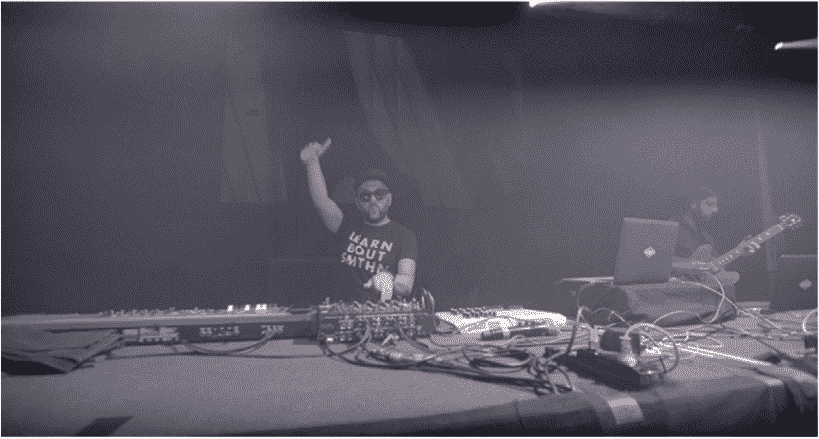

第四章

你自己和你自己的东西

DADA 集体：Simon Wairiuko，肯尼亚 / Boris Z. Simunich，秘鲁，利用区块链技术共同创作的视觉对话。

“我本应该早点告诉你的。我是一个双胞胎。他住在纽约，”我当时的男朋友，一个月的交往后，在我们的飞机准备在肯尼迪国际机场降落时告诉我。

“我也有一个纽约双胞胎。给我一杯烈酒和一场好的纽约派对，你将遇到一个更富有、无忧无虑的我，”我戏谑道。

他漫不经心地回答道：“我这里有一个双胞胎兄弟。他很 fun。你会喜欢他的。”

我们才交往了一个月，但我还是想知道为什么他不早点告诉我。对于我之前认识的每一个双胞胎，分享同样的遗传基因——以及几乎每一个重大的生活里程碑——都是一件大事。这是他们身份的核心，通常是一种强烈形成性的经验。有些人感到一种特别难以言表的联系；其他人则对缺乏联系感到困惑。

数字孪生：身份，隐私，声誉，社交网络

我们的数字孪生会在我们物理存在的阴影下过上安静的平行生活。

快进 15 年，现在我们好像都有双胞胎。任何接触互联网的人都有几个自己的数字版本——有时是在各种社交和服务平台上有意识地打造、培养和策划的，有时是在我们的互联网使用足迹中意外创建的。数据模式——图片、传记事实和在线行为——在平台间越来越无缝和高效地传输，无论我们是否知情，一个连贯的故事逐渐浮现。

这些数据模式让我们的数字孪生能在我们物理存在的阴影下过上安静的平行生活。通常，我们好几年甚至几十年都不知道。你的数字孪生是完全的档案。他们不仅仅是你在夏威夷度假的几张随机照片或者你最近网上购物狂欢的记录，而是一个全面的档案，包括公司在他们自己的网站之外记录的个人数据，以及从第三方获取的数据。

总的来说，我们的数字孪生推动了互联网的增长以及为我们提供服务的在线平台。这些服务——从 Facebook 和 Instagram 到 LinkedIn 和 Amazon——实际上并不是免费的。通过同意让公司拥有、使用和出售你的个人信息，你是在卖掉你的数字孪生。你用你最私人的信息换取他们的平台使用。

拥有你的影子自我后，公司然后通过二级市场的广告以其版本的你进行借贷、销售和其他货币化——都在你背后。而这些公司对我们了解很多。Facebook 首席执行官马克·扎克伯格在 2018 年美国国会证词中确认了我们对 Facebook 的许多最坏恐惧，关于其令人毛骨悚然和道德可疑的做法。

如果这听起来像是乔治·奥威尔的《1984》，那是因为它就是——但由公司而不是政府运营。由于过时且通常宽松的数据保护制度，默认假设是公司拥有我们的数字双胞胎。根据现行的法律，一旦我们同意服务条款后点击“我同意”，我们的双胞胎就属于公司，法律义务很少。

作为消费者，我们的权利已经受到限制。但我们需要获得授权，并停止盲目接受很少阅读的服务条款和隐私政策——而且公司知道很少有人会阅读这些政策。我们都有罪。我是一名律师，曾经撰写这些政策，尽管我通常不阅读它们！

但我们的立法者也有责任。目前，公司在对我们个人数据进行盈利方面几乎不受法律限制。他们的数字双胞胎可以随意处理——出售给私人公司、政治运动，甚至外国国家。立法者必须将我们对数字自我的控制权交还给我们，并广泛定义我们的数字自我。

如果我们能将我们的数字双胞胎视为 dGoods 呢？也许，那样区块链就能让我们有机地跟踪和拥有自己的数字自我？也许我可以用更多的尊严和自主权参与数字商业——这样虚拟交易就不会像高速公路抢劫一样？

将你的数字双胞胎 token 化以改善协作和互动

普通人被 token 化是未来的趋势吗？

在第三章中，我们讨论了区块链为名人运动员带来的机遇。这引发了一个问题，为什么只有名人和运动员才能享受到所有的乐趣呢？

乔迪· Rich,1 Kred 的创始人兼首席执行官，NFT.NYC 的制作人，坚信 token 化普通人，而不仅仅是运动员和名人，是未来的趋势。坦率地说，当他在我们的对话中提出要为我 token 化时，我感到有点被物化。*谢谢你提出要把我变成硬币，*我想。*那是我一生的梦想！*

根据 Rich 的说法，

区块链的独特之处在于它既无处不在又无处可寻。它存在于世界上跨越国界的许多服务器上，但完全是去中心化的。它使得像 NFT.Kred 这样的应用程序能够让人们控制自己的数字资产。例如，艺术家可以将艺术品发送给粉丝和关注者进行评论。

Rich 强调了我们对“社交货币”——例如 Facebook 上的“点赞”——控制力之小，以及 NFTs 如何解决这一问题。你在社交媒体上有一个资料，创造内容，通过联系建立网络。我们对人们如何使用它——我们的社交货币——控制力非常小。

我们的身份在 Facebook、LinkedIn、Twitter 上各自孤立存在。你无法控制你的新闻推送和格式。你也会发现很难下载你的社交联系。根据 Rich 的说法，

NFTs 是一个框架，它让我们控制自己的社交货币。区块链上的 NFT 是不可变的，所以我们放在上面的任何东西，别人都无法更改。它是去中心化的，被存储起来，我们可以用私钥控制它。

Rich 解释说，在 NFT.Kred 中，他创建了一个平台，使用 NFT 让我们控制自己的社交货币。“NFTs 代币化社交货币，”Rich 说。

它们携带身份、内容、联系和稀缺性。NFT.Kred 创建了一个平台，让您或任何品牌都可以创建自己的社交货币。我们可以为您制作硬币、卡片、徽章或其他代币。我们可以取任何数字资产，注册它，然后在区块链上交易。

《数字宇宙中的无限数字稀缺》

如果你在被 Rich 用 NFT.Kred 进行代币化时没有感到被物化，那么当你的社交行为被代币化时你会作何感想？首先，让我们看看社交行为是什么，以及我们为什么要对其进行代币化。

Rich 解释道，

社交行为的例子之一是在社交媒体帖子上的“点赞”。“点赞”无处不在。但是，如果我给你一个“点赞”，你仍然会感到特别。我喜欢的是，我们都有大量的“点赞”，我们也有大量的素材，但当我们与我们在意的人分享时，他们仍然会感到特别。这就是数字稀缺。

NFT.Kred 是如何解决让人们控制自己网络这个长期存在的问题的呢？Rich 说，品牌和影响者允许他们的资产被像 Facebook、LinkedIn 和 Twitter 这样的孤立的大机构控制。你如何让一个在 LinkedIn 上有很多联系的人管理自己的资料？让她控制自己的联系人，然后还可以在网络上分享她的内容？

Rich 解释说，

在区块链领域工作多年后，几年前，我们意识到可以创建一种携带联系的代币。如果我给我的一个联系人一枚代币，然后他再转给另一个人，那么我们三个人就会建立联系。现在，如果这枚代币与某个主题相关联，比如在知名会议上对你的演讲进行的评论，那么它也包含了一些内容。所有对这篇关键评论感兴趣的人最终都会通过这枚代币连接起来。我们立即就拥有了一个以主题为中心的小型网络。一旦你有了一个以主题为中心的初级网络，就有了参与度。这就是我们通过 NFT.Kred 和 NFT.Kred 所做的事情。

NFT.Kred 使用这个协议来收集个人的资料、联系方式和内容。并非所有这些数据都放到区块链上，正如 Rich 所解释的。“我的愿景是有朝一日，你会在区块链上存储大多数你的身份。”在一个以竞争为主导的世界里，Rich 最后强调了驱动 NFT.Kred 合作的想法。“我认为我可以通过给人们一个合作催化剂来在这个世界贡献和赚钱。我们构建让人们可以一起工作的工具。”

夺回对你身份的控制

想象一下，不再需要记住你每天互动的所有不同网站的数十个不同的用户名和密码组合。想象一个世界，你不需要分享你最喜欢的宠物的名字来支付信用卡账单。对于我们这些从未有过宠物的人来说，我总是想用我丈夫的名字，因为在我有孩子之前，那是我离拥有宠物最近的一次。

忘记所有那些东西，来认识 Nuggets 吧，它会引导你走向一个没有那些愚蠢困境的应许之地。Nuggets 让你能安全地在区块链上拥有所有这些信息，并保护它免受第三方公司的安全漏洞或网络攻击。很快，美国、欧洲和中国的一些大型组织将会使用 Nuggets。

介绍一下 Seema Johnson，Nuggets 的联合创始人兼首席运营官。2 Johnson 没有技术学位。她进入科技界的起点是一个“项目协调员”，在那里她学会了基本的技能，还负责煮咖啡。对于 Johnson 来说，这是一个陡峭的攀登，她的努力工作得到了回报——现在她发现自己成为了一家筹集了数百万美元初始代币发行（ICO）的领先区块链公司的联合创始人。此外，作为在英国的印度女性，她实现了这一点——更令人印象深刻的是，她在抚养两个小孩的同时做到了这一点。

Nuggets 开发了一个区块链平台，提供了一个生物识别工具，用于登录、支付和 ID 验证，而无需分享或存储您的数据。最值得注意的是，甚至 Nuggets 也没有访问您数据的权限。

对数据蜜罐说“不”

无论何时我们参与在线交易，特别是当我们进行网上购物时，我们都会自由地提供我们的信息！我们有上百个在线地点保存的用户名、密码和财务凭证。这个问题在于，所有这些信息都被存储在这些单独的数据蜜罐中。

正如蜜罐吸引蜜蜂，数据也吸引罪犯！偶尔，数据会被泄露。您可能还记得近年来新闻头条中的 Equifax、Dropbox、Yahoo 等大型组织的安全漏洞。这些都是花费数十亿美元在网络安全上的大型组织。*太好了，更多的人拥有我的信息*，每当我看到数据盗窃的新闻时，我都会这样想。但我不会因此恐慌或失眠。为什么？这种情况一直在发生。蜜罐模式已经完全失效。

我们都很喜欢在线购物。我们需要在线上存在，但如何确保我们在保持隐私的同时仍然安全呢。如果发生数据泄露，我们必须更改每个位置的详细信息。Nuggets 解决了这个问题。

这里相关的术语是零知识证明。那么零知识证明又是是什么呢？

这是我在区块链中最喜欢的术语之一。它听起来像是直接来自好莱坞间谍电影的的东西。在密码学中，这个术语要普通一些。零知识证明或零知识协议是一种方法，一方可以证明给另一方他们知道某个特定的值，而不传达除了他们知道该值以外的任何信息。您不需要透露信息来证明它的存在。一个经典的例子是当你分享你的身份证来证明你已经超过 21 岁。在这个过程中，你透露了你的确切出生日期以及更多其他信息，而酒保只需要知道你是否已经超过 21 岁。

Johnson 在许多采访中解释道，

我们在找到区块链之前探索了许多其他技术，但当我们找到它时，这是一个启示性的时刻。我们意识到它不仅给了我们零知识存储，还确保了没有管理员访问或根级访问信息。这对于提供像 Nuggets 这样的解决方案非常重要。

她继续说道，

它为我们提供了不可篡改的账本——简单来说就是一个不能更改的记录——确保每次您执行交易（无论是登录还是支付），都能成功进行，并且只有您能访问该信息，别人无法获取。我们需要一个不可篡改的账本来实现这一点，然后我们需要区块链中固有的高强度加密。

另一个 Nuggets 需要考虑的因素是交易速度，这是提供电子商务解决方案的关键特性。

我们正在使用私有区块链。简而言之，当你下载一个产品时，你使用生物识别技术进行注册。无论设备上是什么生物识别技术，无论是 iOS 还是 Android，然后生成一个唯一的私钥。然后你拍一张静态照片，接着是动态图像来确认你的身份。这就像是一个动态的自拍，以确保身份证上的照片与你的脸相符。然后你拍一张信用卡的照片，我们检查所有这些信息。我们对卡片进行法医检查，然后您的所有数据都会加密在您的移动设备上。

她继续说，

一旦它进入区块链的区块，所有这些都由另一个隐私框架覆盖，确保只有你，没有其他人，能看到里面的任何信息。当我们与商家集成时，我们需要保护用户，而且我们没有后门访问。我们开发了与许多现有的电子商务平台（如 Shopify、Magento 等）配合使用的 API。关于 Nuggets 的重要一点是，我们面向大众市场。每个人都网上购物，这意味着 Nuggets 对很多人都有价值。其中大量网站都是基于 Magento、Shopify 及其市场构建的。所以我们还与商家合作。

在这个阶段，信息被令牌化。

当你授权时，无论是登录还是支付，这些信息都会被令牌化，只有少量数据会被发送到相关组织。例如，如果是物流，比如您包裹递送的可更新信息，那么这会直接发送给物流团队，而不是链上的每个人。我认为这是关于 Nugget 解决方案需要记住的重要一点。

Nuggets 提供了登录、电子商务支付和身份验证，当消费者使用它时，他们会以“Nugs”的形式获得奖励，这是一种可以累积的虚拟货币。约翰逊把它比作一个忠诚计划。在商家方面，与 Nuggets 集成解决了几个关键问题。约翰逊解释说：“我们都知道数据是关键。我们保持信息的方式根本行不通。”

*为什么拥有你的数字双胞胎？*

那么为什么？为什么拥有你的数字双胞胎？我希望你能用“当然了，谁*不想*拥有自己延伸的部分？”和一种翻白眼的表情来回答这个问题。至少有五个主要原因让我们应该拥有我们的数字自我。

首先，我们的数字双胞胎是我们自身的延伸。它们反映了我们作为个体的样子，我们如何度过时间，我们喜欢和不喜欢的人和事物，我们的喜好和怪癖。这是因为我们几乎在互联网上做所有事情，而且我们的生活越来越数字化和虚拟化。当我们使用互联网时，我们同意使用我们输入的数据这个想法已经过时了。当我们只为了几件事上网时，这个想法是合理的：购物、预订航班，甚至发邮件。但今天，我们在互联网上做几乎所有的事情。它是我们的物理空间、物理现实的延伸，它中介了我们存在的很大一部分，如果不是大部分的话。事实上，在 2019 年，没有互联网，你几乎不能作为社会活跃成员 function。我们的数字双胞胎，因此，不仅捕捉到我们的市场营销人口统计学或偏好，还捕捉到我们所有的人性。

我们对自己的数字身份拥有自主权是合情合理的，正如我们对肉身或甚至知识产权拥有自主权一样。为什么一家公司对我们数据的收集、整理或操作会改变其所有权或创造新的权利？当你拍摄毕加索艺术作品的照片时，它仍然是他的艺术。你只是快速拍了一张照，并不意味着你现在拥有了这幅图像。同样，当你向朋友透露一个深藏的个人秘密时，它仍然是你的秘密。你不会期望他们会传播它——甚至出售它——并声称在你透露时它变成了他们的信息可以分享。我们对待自己数字信息的方式为什么应该有所不同？

第二，我们对数字双胞胎的控制是不可让渡的权利，与“生命、自由以及追求幸福”并列。我们可以每天工作，尽管工作时间很长，但我们绝不能被期望放弃自由。无论雇主要求什么，我们都有权在任何时候离开，只要遵守合同条款，但绝不是在失去自由的威胁下工作。我们中的大多数人用时间换取薪水，这样做时，我们自愿放弃了某些奢侈品——中午起床或午后小睡两小时。但我们法律上绝没有被强迫放弃我们的自由或自我权利给雇主。雇主不能监禁我们或奴役我们。他们永远不能拥有我们。

同样，我们每个人都应该对自己数字双胞胎有控制权，即使我们允许公司以定义的方式使用它们——正如我们允许雇主以定义的方式使用我们的肉身一样。出售我们的数字双胞胎应该和出售我们自己一样不可执行。它应该是协商一致、公平且自由选择的。

第三，我们数字双胞胎的清晰、不可让渡、个体所有权将鼓励开发更复杂的技术来跟踪和管理我们的数字双胞胎。公司将被迫在这些技术的创建和使用上进行竞争，消费者将能够享受具有不同技术和政策的社交平台更多的选择，最终获得更好的服务和更多的选择。

今天，基本上没有竞争或激励促使公司在社交平台上进行创新。如果你阅读一家公司的服务条款和隐私政策，不同意并拒绝同意，你的选择是什么？你将被抛在数字革命的后面。如果你是一家小公司，不想将你的数字自我交给 Facebook，从技术上讲你有权拒绝他们的条款并不使用他们的服务。但没有访问最广泛使用的销售和广告平台，你的业务将无法生存，更不用说竞争了。你注意到 LinkedIn、Facebook 或 Amazon 是否有意义地替代品存在吗？如果 LinkedIn 有一天决定在你艰苦的求职过程中取消你的资料，你会怎么办？这难道不是毁灭性的吗？雇主还能在哪里找到你？

第四，如果我们确立了清晰、不可让渡、个体对数字双胞胎的所有权，我们将鼓励现有服务有意义替代品的发展。这些社交平台和服务可能的替代品进入门槛如此之高的主要原因是，每个现有公司已经控制了如此多的领土和信息。每个公司在其领域内都是垄断者，拥有我们数字双胞胎的每一个部分。

任何想要通过创建替代品进入市场的人都将不得不从头开始——并且立即与一个确立的巨头竞争。而且我们的档案是不可移动的。用户无法以任何有意义或有效的方式将他们的联系、活动或评论移动到竞争平台或服务上，即使存在这样的服务。

第五，我们的数字双胞胎是我们自己劳动的果实。我们在档案上投入了大量的时间和精力。我们决定上传哪些图片，与谁分享信息，以及对别人的帖子发表什么评论。创建数字双胞胎是一种创造性的行为。如果我们的精力都投入到了创造它，那么它属于我们。

我们使用 discretion（自主权）的事实并不意味着它不属于我们自己的财产，或者不是我们自身的延伸；事实上，选择如何表达自己或许是我们身份最亲密的延伸。仅仅因为一个艺术家使用了商业颜料（而不是自己制作），这并不意味着颜料公司就拥有他的作品。他做出了如何使用那种颜料的决定，这些决定是他个人愿景和身份的极其私人的反映。为什么数字自我的所有权不应该属于创造者，就像画作的所有权属于画家一样？

区块链上的心灵创作：重新思考所有权

随着数字音乐的增长，以及最近的音乐流媒体服务，音乐行业将不得不考虑新的支付艺术家和评估创造力的方式。记得泰勒·斯威夫特与 Spotify 的斗争吗？区块链可能是解决方案吗？

企业家越来越多地转向区块链，以使内容分享对艺术家更加公平。根据 CB Insights 的说法，有几家公司正在利用智能合约，根据许可协议，自动根据购买创意作品产生的收入进行分发。

讨论数字权利和音乐，必然要提到流媒体服务的未来。这是一个例子。去年，Spotify 收购了 Mediachain，一家数字版权管理创业公司。Mediachain 一直在利用区块链技术解决归属问题——这是 Spotify 需要帮助的领域。在线科技行业出版物 TechCrunch 指出，它必须解决未支付版税的诉讼。3

*消除数字版权盗用*

区块链可以有效地消除数字权利盗用。它可以让艺术家自主发布他们的音乐，控制数据和使用条款，并通过智能合约实时分配版税。“如果任何人在世界上任何地方使用音乐文件，这个行为都会被公共区块链自动记录，并且交易会被验证。你就不会有数字权利盗用的问题，”Greg Cudahy，EY 全球领导者，在《区块链反应：技术计划达到临界质量》一文中解释说。4

开放音乐倡议 5 是一个寻求利用区块链技术解决版税纠纷的联盟。它没有建立一个平台。相反，它正在创建一个开源协议，用于统一识别音乐权利持有者和创作者。同样，其他公司，如旨在消除音乐领域中间人的 Audius6 和旨在改变事物混音方式的 Ujo Music7，可能会很快颠覆音乐行业。

*内容创作者最受苦*

成立于 2016 年的 SingularDTV 在 2019 年 1 月推出了其基于区块链的内容驱动的娱乐 dApp Breaker。在我们讨论期间，Breaker 的联合创始人兼首席执行官 Kim Jackson8 强调，区块链的主要组成部分——透明价值交换，帮助艺术家保留对他们创作的更多控制权。她说，“它可以确保对权利、收入和版税有完全控制，并建立艺术家与粉丝之间的直接关系。”

Jackson 解释说，

作为一名娱乐业的高管，我非常清楚独立电影公司所面临的问题。维持一种商业模式很难，因为这不允许你保留价值，而像 Netflix 和 Amazon 这样的中介却在提取价值。目前，这是将你的知识产权（IP）分发给大众的主要方式。

Jackson 指出，

如果你是一个内容创作者，并且你出售你的内容，你就会脱离这个等式。没有可持续的商业模式来继续产生收入，因为创作者被切断了与观众行为和收入报告相关的数据。你也与知识产权脱钩，因为你签署了你未来 15 年的权利。从独立内容创作者的角度来看，我们的商业模式有一个问题；我们正在学习区块链技术内在的所能提供的功能。

**Gramatik** 制作人兼艺术家，亮相于 Alex Winter 的《信任机器：区块链的故事》，一部 Breaker 原创作品。版权：Breaker。

**用数据将创作者置于中心**

Jackson 和她的联合创始人 Zach LeBeau 一起，由以太坊联合创始人 Joseph Lubin 共同创立了 SingularDTV。据 Jackson 所说，

对我来说，这总是关于分销平台工具，内容创作者可以跟踪和货币化他们的知识产权。考虑一部电影。我知道我将能够看到人们在哪里观看它。作为内容创作者，你将能够收集关于你的观众的数据，最重要的是，拥有这些数据并直接从收入中受益。

这样的模型使得内容创作者能够掌控自己的商业模式。

现在的商业模式仍然是一方面的。你可以筹集资金并创造内容，但怀疑你是否能看到这些内容的回报。你的投资者看不到他们的回报。最重要的是，你甚至不能向他们提供任何透明的会计信息，以证明有活动发生，因为你已经被完全切断了。本质上，我们看到的是建立一个运作方式相同的分销平台的机会。我们知道，通过市场研究，观众不在乎他们在哪里找到内容，不管是电影还是音乐——他们想要的是方便。他们想在想的时候，在想的地方看。他们不在乎是在 iTunes、Netflix、HBO 上。他们想要的是节目。

Breaker 创造了一些东西，据 Jackson 所说，这满足了观众和内容创作者的需求。

从观众的角度来看，我们构建的东西与他们所习惯的运作方式相同。但是从内容创作者的角度来看，这是不同的，因为你，作为内容创作者，是受益者，现在你可以根据它创建商业模式。无论你是一个独立的艺术家，一个制作公司，还是一个有大量会计支出的工作室，你都能够实现这种点对点的透明会计、知识产权跟踪和数据分析，并且这些都属于你。这是强大的；这是我们商业模式之一，我们正在构建这个。我们仍然是一个初创公司。我们现在已经营业约 2 年，我们只在 1 月份把我们的测试版产品推向了全球。现在我们处于测试版阶段，我们正在测试人们如何与之互动。

让观众进入新的解决方案并不重要，跟上快节奏世界中的观众喜好并不总是简单的。

破碎机作为桌面和移动应用程序可用。人们希望它在他们的手机上，或者他们希望在手机上听音乐，或者他们想在另一个设备上在家看东西。我们正在建设这个。与此同时，我们已经制作了原创内容，我们还收购了一些更多内容，这样我们就可以测试和学习我们的产品如何运行。我们需要拥有属于我们自己的内容，这样我们就可以实验我们想要它如何表现，以及测试新模型。你证明了它们将如何工作，以及它们将在市场上带来什么好处。你可以转过身来，正确地将它们营销给内容创作者和观众。

观众在乎他们与艺术家关系的本质吗？根据杰克逊的说法，“我们正在学习是否能让观众在乎这种关系。他们在乎他们的钱是直接进入艺术家的口袋，还是用来‘支付工资’吗？我们怎样才能让他们在乎本地交易和对等交易？一开始，数据和市场营销说他们不在乎。他们想回家，喝一杯葡萄酒，看他们想看的东西，他们不想有更多的步骤。他们不想为他们的娱乐而努力。”

“我们在看电影、电视、音乐、电子书，任何 IP，”杰克逊继续说。

本质上，任何 IP 都可以有一个带有底层功能的频道。希望在未来，我们可以允许人们参与娱乐事业和艺术家的成功。这是长期的愿景。它与整个代币经济相连，有了它，就有规定和复杂性。这不是一件容易的事。现在，我们专注于电影，尽管我们很快将进入音乐领域。这是一个巨大的机会。这是一个稍微不同的商业模式，也是一个巨大的难题。我们谈论的是同时发布歌曲和电影。

通过支付将创作者置于中心

在支付方面，了解观众需求在使平台用户友好方面起着重要作用。

你不必使用加密货币；你也可以使用信用卡。我们故意给了用户这个选项。我们不想让普通观众因为必须使用新技术而感到恐慌。虽然你可以，而且我们确实展示了人们如何制作钱包。我总是鼓励这样做。

杰克逊对破碎机的长远愿景是什么？

这个愿景是一个雄心勃勃的去中心化娱乐平台工具集。我会非常兴奋地看到这成为现实。但在那时之前还有很多步骤和很多障碍。这是一个纯粹的愿景，我们在某种意义上也是纯粹主义者，但这是困难的，因为我们确实必须做出妥协。

考虑到其在娱乐媒体行业的潜力，我们可以看到区块链可以解决从内容访问、分发和补偿到管理资产、数字权利和融资的问题。还有其他的例子。英国区块链初创公司 JAAK9 正在开发一个基于以太坊的平台，该平台允许媒体所有者将其媒体、元数据和权利转换为“智能内容”，可以自动执行许可交易（CB Insights）。它正在建立一个区块链平台“为创意阶层带来清晰和及时的付款。”他们允许创意人士从一个门户发布内容、管理合同和交易支付。

财产、商品和不动产：所有权的新口味

数字化物理物体和实物资产

如果我们打算将自己和心灵的创造物放在区块链上，为什么不也将真实的、物理的物体数字化后放在区块链上呢？尽管理解数字化物理物体的人可能觉得这并不逻辑。现实世界的资产可以通过将资产所有权分解为其组成部分的方式放在区块链上。

当然，数字化物理资产并不是一个新概念。如果你曾经扫描过一份文件，你就已经创建了它的数字副本并数字化了它。事实上，你还记得谷歌图书开始扫描世界上 1.3 亿个独特标题的时候吗？你还记得那有多有争议吗？不难想象，当涉及到数字化物理物体和不动产时，我们会看到类似的争议。

例如，Mattereum 背后的团队 10 被这种使用区块链技术作为媒介来实现世界上每个物理物体法律所有权的想法所吸引。该团队正在尝试“弥合可编程区块链智能合约与实际法律合约之间的鸿沟。”背后的法律概念是所有资产都有所有者，他们可以决定如何最好地管理它们。11

当 Mattereum 网络上的注册商被赋予某些资产的法律所有权时，他们可以通过链上智能合约设置资产可以被程序化购买、出售、租赁、分配和分割。授予的法律所有权还将用于解决争端和执行解决方案。

梵纳伊·古普塔（Vinay Gupta）12，Mattereum 的首席执行官观察到，

我认为这些都是法律空间开始吸收软件工程的概念。其中一些概念可能会显得陌生。计算机程序员和律师都处理大量的文本。但计算机程序员有 50 种不同的工具来帮助他们管理文本。而律师只有一个工具——微软 Word。

**律师是做出了错误职业选择的程序员**

古普塔想知道，

为什么律师没有更先进的工具来管理文本？为什么他们没有像程序员用于大规模管理文本的相同工具？有些工具可以处理简单的事情，比如找到内容的位置，将其与另一份文件进行比较，并查看最后谁触碰了它。但在法律实践中，这些事情为什么没有被实质性地自动化！？

在讨论 Mattereum 时，古普塔解释说：“从高层次上看，我们正在构建一个改变对象法律所有权的工具。我们希望通过将资金投入到合同中来改变对象的所有权。”他继续说，

财产有多个类别：像斯特拉迪瓦里小提琴这样的序列化独特对象，以及像房子、汽车和船只这样的注册对象，它们存在于政府注册表上。同一个对象可以是两者的结合。例如，汽车既是序列化财产，也是注册财产。事实上，几乎所有注册的东西都是序列化的。这个想法是把这个对象放入智能合约中。目标是让智能合约中的所有者在现实世界中改变法律所有权。

所以让我们再回到斯特拉迪瓦里小提琴。如果它的法定所有权被转让给 Mattereum 的一名注册商，这把小提琴就不仅仅是一个有形资产，同时也是一个数字资产。然后，它可以被编程为代币，并出售给多个投资者。因此，关于其使用的合同限制可以被要求并执行。它不必一直锁在保险库里，可以用 Mattereum 管理每年演奏的次数和地点，让许多人的耳朵享受到快乐。

同样的原则也适用于希望将作品出售给投资者财团的艺术家。他们可以管理自己的艺术作品是否全年在公共画廊展出，所有参与方收到的收入百分比，等等。

通过记录一个对象的里程碑来增加价值*。

区块链在管理真相方面非常出色。我们根据商品的价值、司法管辖权和您想如何处理它们来设置不同的机制。古普塔补充说：“我们收集了关于某把斯特拉迪瓦里小提琴的支持性文件，比如 X 光片、历史文件、维护记录、表演者的笔记以及其他东西。我们把这些东西整理成一个基本上是这个对象数字组合的文件夹。每份数据都用于真实性赔偿。”

古普塔解释说，

这样，你就建立了内置的损害。特别是，一种内置的间接损失赔偿，也是对关于对象的可执行思想的一种优雅表示。理想情况下，我们希望每个对象都能通过一种保险售货机类型的过程进行销售——买家在购买时可以简单地支付身份证明费用。这样做，我们也在创建一个记录，从而提高小提琴的价值。

那么，你还能用 Mattereum 平台做些什么呢？“我们对在这个平台上进行气候工作非常感兴趣，”Gupta 解释道。他继续说：“例如，每个对象都可以包含与其相关的排放数据。换句话说，我们处于利用我们的平台推动道德的立场。”

*我们周围的非正式保险正式化*

Gupta 解释道，

保险对商业交易至关重要。在现实世界中，一切事物都是相互联系的。一切也都稍微有些困难和不可预测。与其处理混乱的纠纷解决，我们更希望有这些保险政策在位，这样如果你比如说有 1%的缺陷率，因为世界有点不稳定，你就把这个 1%分摊给所有客户。当出问题时，你只需从这个池子里提取。这是一种非常简单直接的方法，类似于信用卡公司今天使用的做法。

世界充满了非正式保险。例如，酒店里的人因为你的房间有坏掉的散热器而升级你的房间。这是一个迷你保险计划。他有一个资源池来做决定。而这些小缓冲区遍布物理世界。有许多这样的小计划，你有一个小资源池非正式控制。它们被分发来覆盖物质世界中的错误。并不是说有人有升级你的房间、给你更好的桌子、为你免费倒一杯咖啡的自主权。我们正在正式化这些系统，使它们更有效率。但这是一种正式化和自动化的方式。

结论

区块链技术爆炸式发展所面临的最棘手、也最令人激动的挑战之一与所有权有关。问题始于更简单的问题：区块链上存在的东西归谁所有；一些规范性问题，比如谁*应该*拥有区块链上存在的东西？但当我们思考得更广泛时，我们可以看到，不仅仅是我们自己为了安全和效率而被代币化，我们的行为和交易也是如此。当创作者更接近于他们创作的对象时，他们维持控制并切断了“中间人”的低效率。从律师、艺术家到资产管理师，全球经济中的一系列行动者都有可能从区块链带来的新的所有权概念中获益。

_________

1V. Gupta. 与作者的讨论。2019。F. Arisandi. 2018。“Mattereum 与你所听过的任何区块链项目都不同。” [`www.chepicap.com/en/news/5110/mattereum-is-not-the-like-any-of-blockchain-projects-you-ve-ever-heard-of.html`](https://www.chepicap.com/en/news/5110/mattereum-is-not-the-like-any-of-blockchain-projects-you-ve-ever-heard-of.html)。关于 Mattereum 的更多信息可在 [`mattereum.com/`](https://mattereum.com/) 找到。关于 JAAK 的更多信息可在 [`jaak.io/`](https://jaak.io/) 找到。K. Jackson. 与作者的讨论。2019。关于 Ujo Music 的更多信息可在 [`www.ujomusic.com`](https://www.ujomusic.com) 找到。关于 Audius 的更多信息可在 [`audius.co/`](https://audius.co/) 找到。关于 Open Music 的更多信息可在 [`open-music.org/`](http://open-music.org/) 找到。EY 全球领导力。2016。“区块链反应：科技公司计划实现关键规模。” [`www.ey.com/Publication/vwLUAssets/ey-blockchain-reaction-tech-companies-plan-for-critical-mass/$FILE/ey-blockchain-reaction.pdf`](https://www.ey.com/Publication/vwLUAssets/ey-blockchain-reaction-tech-companies-plan-for-critical-mass/%24FILE/ey-blockchain-reaction.pdf)。S. Perez. 2017。“Spotify 收购区块链初创公司 Mediachain 以解决音乐的归属问题。” [`techcrunch.com/2017/04/26/spotify-acquires-blockchain-startup-mediachain-to-solve-musics-attribution-problem/`](https://techcrunch.com/2017/04/26/spotify-acquires-blockchain-startup-mediachain-to-solve-musics-attribution-problem/)。关于 Nuggets 的更多信息可在 [`nuggets.life.J`](https://nuggets.life.J) 找到。Roch. 与作者的讨论。2019。

2V. Gupta. 与作者的讨论。2019。F. Arisandi. 2018。“Mattereum 与你所听过的任何区块链项目都不同。” [`www.chepicap.com/en/news/5110/mattereum-is-not-the-like-any-of-blockchain-projects-you-ve-ever-heard-of.html`](https://www.chepicap.com/en/news/5110/mattereum-is-not-the-like-any-of-blockchain-projects-you-ve-ever-heard-of.html)。关于 Mattereum 的更多信息可在 [`mattereum.com/`](https://mattereum.com/) 找到。关于 JAAK 的更多信息可在 [`jaak.io/.K`](https://jaak.io/.K) 找到。Jackson. 与作者的讨论。2019。关于 Ujo Music 的更多信息可在 [`www.ujomusic.com`](https://www.ujomusic.com) 找到。关于 Audius 的更多信息可在 [`audius.co/`](https://audius.co/) 找到。关于 Open Music 的更多信息可在 [`open-music.org/`](http://open-music.org/) 找到。EY 全球领导力。2016。“区块链反应：科技公司计划实现关键规模。” [`www.ey.com/Publication/vwLUAssets/ey-blockchain-reaction-tech-companies-plan-for-critical-mass/$FILE/ey-blockchain-*reaction.pdf*`](https://www.ey.com/Publication/vwLUAssets/ey-blockchain-reaction-tech-companies-plan-for-critical-mass/%24FILE/ey-blockchain-reaction.pdf)。*S. Perez*。2017。“Spotify 收购区块链初创公司 Mediachain 以解决音乐的归属问题。” [`techcrunch.com/2017/04/26/spotify-acquires-blockchain-startup-mediachain-to-solve-musics-attribution-problem/`](https://techcrunch.com/2017/04/26/spotify-acquires-blockchain-startup-mediachain-to-solve-musics-attribution-problem/)。关于 Nuggets 的更多信息可在 [`nuggets.life`](https://nuggets.life) 找到。

3V. Gupta. Discussions with the author. 2019.F. Arisandi. 2018. “Mattereum Is Unlike Any Blockchain Projects You’ve Ever Heard of.” [Mattereum 与你所听过的任何区块链项目都不同](https://www.chepicap.com/en/news/5110/mattereum-is-not-the-like-any-of-blockchain-projects-you-ve-ever-heard-of.html). More information about Mattereum is available at [Mattereum 官网](https://mattereum.com/). More information about JAAK is available at [JAAK 官网](https://jaak.io/.K). Jackson. Discussions with the author. 2019.More information about Ujo Music is available at [Ujo Music 官网](https://www.ujomusic.com). More information about Audius is available at [Audius 官网](https://audius.co/). More information about Open Music is available at [Open Music 官网](http://open-music.org/). EY Global Leader. 2016. “Blockchain Reaction Tech Companies Plan for Critical Mass.” [区块链反应：科技公司计划实现关键规模](https://www.ey.com/Publication/vwLUAssets/ey-blockchain-reaction-tech-companies-plan-for-critical-mass/$FILE/ey-blockchain-reaction.pdf). S. Perez. 2017. “Spotify Acquires Blockchain Startup Mediachain to Solve Music’s Attribution Problem.” [Spotify 收购区块链初创公司 Mediachain 以解决音乐的归属问题](https://techcrunch.com/2017/04/26/spotify-acquires-blockchain-startup-mediachain-to-solve-musics-attribution-problem/)

4V. Gupta. Discussions with the author. 2019.F. Arisandi. 2018. “Mattereum Is Unlike Any Blockchain Projects You’ve Ever Heard of.” [Mattereum 与你所听过的任何区块链项目都不同](https://www.chepicap.com/en/news/5110/mattereum-is-not-the-like-any-of-blockchain-projects-you-ve-ever-heard-of.html). More information about Mattereum is available at [Mattereum 官网](https://mattereum.com/). More information about JAAK is available at [JAAK 官网](https://jaak.io/.K). Jackson. Discussions with the author. 2019.More information about Ujo Music is available at [Ujo Music 官网](https://www.ujomusic.com). More information about Audius is available at [Audius 官网](https://audius.co/). More information about Open Music is available at [Open Music 官网](http://open-music.org/). EY Global Leader. 2016. “Blockchain Reaction Tech Companies Plan for Critical Mass.” [区块链反应：科技公司计划实现关键规模](https://www.ey.com/Publication/vwLUAssets/ey-blockchain-reaction-tech-companies-plan-for-critical-mass/$FILE/ey-blockchain-reaction.pdf).

5V. Gupta. Discussions with the author. 2019.F. Arisandi. 2018\. “Mattereum Is Unlike Any Blockchain Projects You’ve Ever Heard of.” [`www.chepicap.com/en/news/5110/mattereum-is-not-the-like-any-of-blockchain-projects-you-ve-ever-heard-of.html`](https://www.chepicap.com/en/news/5110/mattereum-is-not-the-like-any-of-blockchain-projects-you-ve-ever-heard-of.html). More information about Mattereum is available at [`mattereum.com/`](https://mattereum.com/). More information about JAAK is available at [`jaak.io/.K`](https://jaak.io/.K). Jackson. Discussions with the author. 2019.More information about Ujo Music is available at [`www.ujomusic.com`](https://www.ujomusic.com). More information about Audius is available at [`audius.co/`](https://audius.co/). More information about Open Music is available at [`open-music.org/`](http://open-music.org/).

6V. Gupta. Discussions with the author. 2019.F. Arisandi. 2018\. “Mattereum Is Unlike Any Blockchain Projects You’ve Ever Heard of.” [`www.chepicap.com/en/news/5110/mattereum-is-not-the-like-any-of-blockchain-projects-you-ve-ever-heard-of.html`](https://www.chepicap.com/en/news/5110/mattereum-is-not-the-like-any-of-blockchain-projects-you-ve-ever-heard-of.html). More information about Mattereum is available at [`mattereum.com/`](https://mattereum.com/). More information about JAAK is available at [`jaak.io/.K`](https://jaak.io/.K). Jackson. Discussions with the author. 2019.More information about Ujo Music is available at [`www.ujomusic.com`](https://www.ujomusic.com). More information about Audius is available at [`audius.co/`](https://audius.co/).

7V. Gupta. Discussions with the author. 2019.F. Arisandi. 2018\. “Mattereum Is Unlike Any Blockchain Projects You’ve Ever Heard of.” [`www.chepicap.com/en/news/5110/mattereum-is-not-the-like-any-of-blockchain-projects-you-ve-ever-heard-of.html`](https://www.chepicap.com/en/news/5110/mattereum-is-not-the-like-any-of-blockchain-projects-you-ve-ever-heard-of.html). More information about Mattereum is available at [`mattereum.com/`](https://mattereum.com/). More information about JAAK is available at [`jaak.io/.K`](https://jaak.io/.K). Jackson. Discussions with the author. 2019.More information about Ujo Music is available at [`www.ujomusic.com`](https://www.ujomusic.com).

8V. Gupta. Discussions with the author. 2019.F. Arisandi. 2018. “Mattereum Is Unlike Any Blockchain Projects You’ve Ever Heard of.” [`www.chepicap.com/en/news/5110/mattereum-is-not-the-like-any-of-blockchain-projects-you-ve-ever-heard-of.html`](https://www.chepicap.com/en/news/5110/mattereum-is-not-the-like-any-of-blockchain-projects-you-ve-ever-heard-of.html). More information about Mattereum is available at [`mattereum.com/`](https://mattereum.com/). More information about JAAK is available at [`jaak.io/.K`](https://jaak.io/.K). Jackson. Discussions with the author. 2019.

9V. Gupta. Discussions with the author. 2019.F. Arisandi. 2018. “Mattereum Is Unlike Any Blockchain Projects You’ve Ever Heard of.” [`www.chepicap.com/en/news/5110/mattereum-is-not-the-like-any-of-blockchain-projects-you-ve-ever-heard-of.html`](https://www.chepicap.com/en/news/5110/mattereum-is-not-the-like-any-of-blockchain-projects-you-ve-ever-heard-of.html). More information about Mattereum is available at [`mattereum.com/`](https://mattereum.com/). More information about JAAK is available at [`jaak.io/`](https://jaak.io/).

10V. Gupta. Discussions with the author. 2019.F. Arisandi. 2018. “Mattereum Is Unlike Any Blockchain Projects You’ve Ever Heard of.” [`www.chepicap.com/en/news/5110/mattereum-is-not-the-like-any-of-blockchain-projects-you-ve-ever-heard-of.html`](https://www.chepicap.com/en/news/5110/mattereum-is-not-the-like-any-of-blockchain-projects-you-ve-ever-heard-of.html). More information about Mattereum is available at [`mattereum.com/`](https://mattereum.com/).

11V. Gupta. Discussions with the author. 2019.F. Arisandi. 2018. “Mattereum Is Unlike Any Blockchain Projects You’ve Ever Heard of.” [`www.chepicap.com/en/news/5110/mattereum-is-not-the-like-any-of-blockchain-projects-you-ve-ever-heard-of.html`](https://www.chepicap.com/en/news/5110/mattereum-is-not-the-like-any-of-blockchain-projects-you-ve-ever-heard-of.html).

12V. Gupta. Discussions with the author. 2019.
