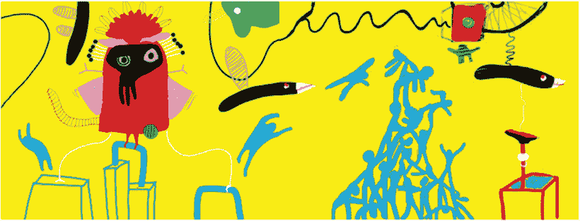
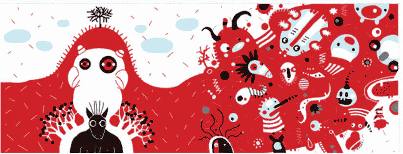
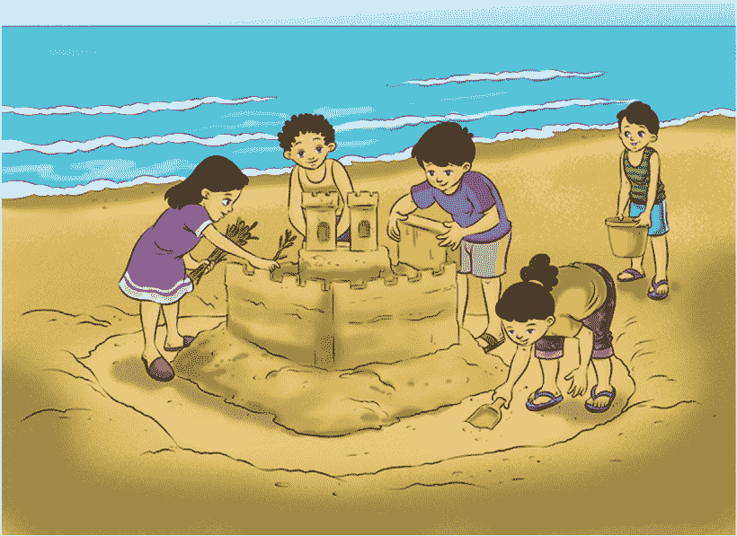
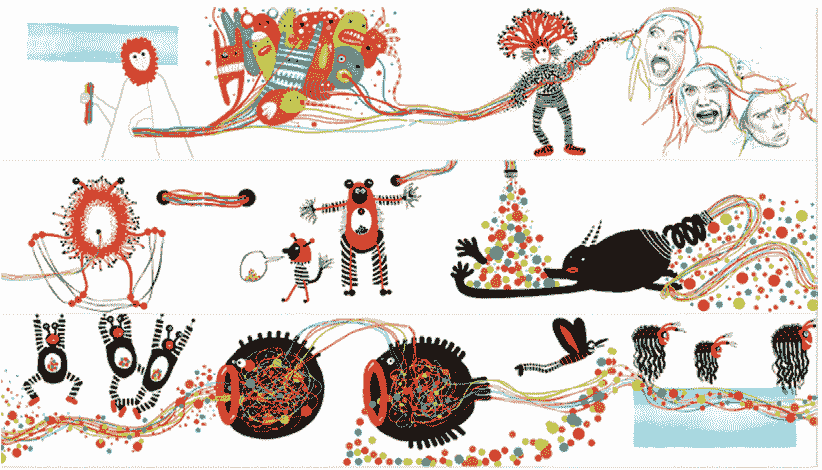
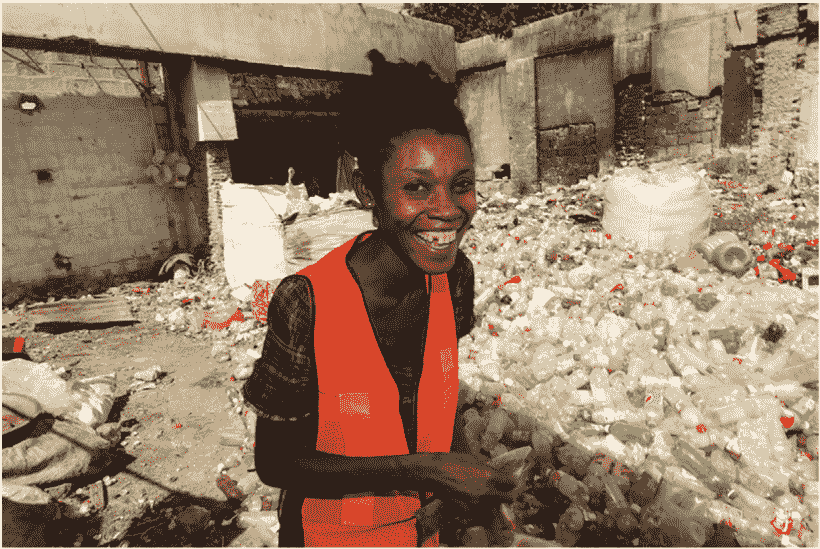
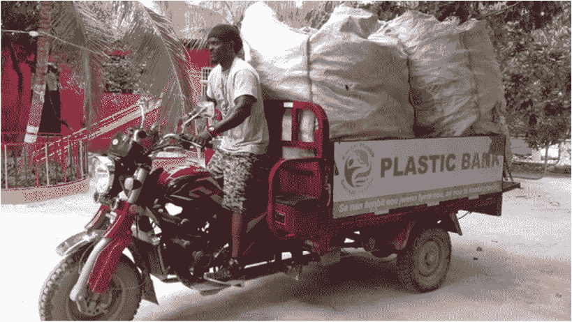
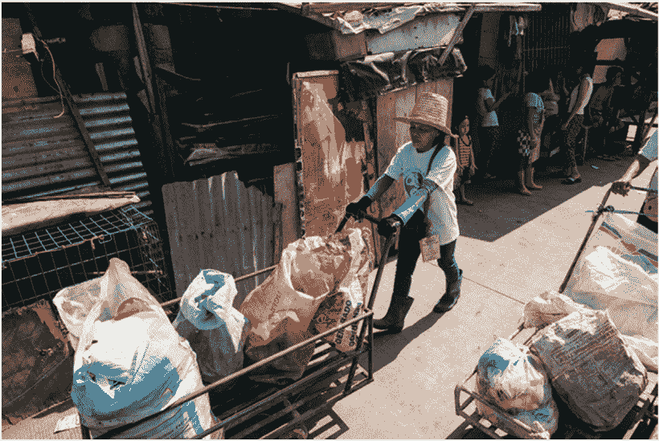
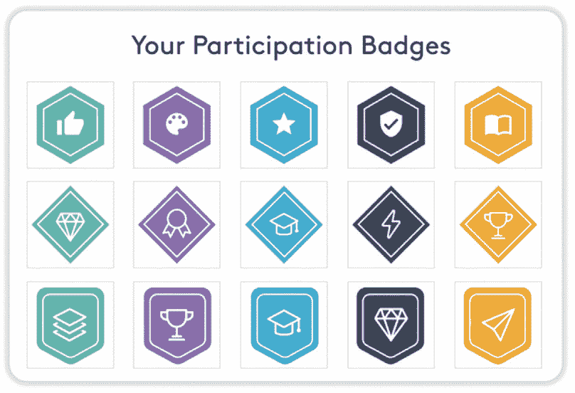

第五章

**DADA 集体：伊萨·科斯特，意大利 / 玛 Espi，西班牙，使用区块链技术共同创作，视觉对话。**

团队合作的力量：区块链如何通过合作和开源软件改变虚拟世界

**DADA 集体：奥特罗·卡普托，智利 / 贝 atriz Ramos，美国，使用区块链技术共同创作，视觉对话，视觉对话。**

如果约翰·列侬和保罗·麦卡特尼从未相遇，世界会是什么样子？如果拉里·佩奇和谢尔盖·布林没有联手改变互联网呢？如果威廉·普罗克特和詹姆斯·甘布尔，本·科恩和杰瑞·格林菲尔德，或者（我最喜欢的时尚鞋履例子！）吉米· choo 和塔玛拉·梅隆从未携手合作呢？世界肯定会大不相同。

历史上充满了微觀和宏觀层面上的强大合作。为什么？因为合作的结果可能大于各部分之和，因为将不同的才能、观点和领域结合起来，使我们能够创造比独自完成更好的东西。

通常，合作的成果甚至比预期的还要好。有时，合作让我们克服了我们从未想到的障碍。其他时候，合作允许我们找到一个新解决方案，大胆尝试，解决长期存在的问题。最重要的是，在这个过程中，我们可以向他人学习，产生巨大的影响。

区块链可以通过利用像业余爱好者、地方社区、影响力、连接虚拟和现实世界以及新的开源开发等未充分利用的资源，实现不同形式且更深入的合作。“如果你想走得快，就独自前行。如果你想走得更远，就一起走。”区块链技术可以帮助我们走得更远。比我们想象的还要远。

**区块链技术实现了彻底的合作。**

利用业余爱好者和爱好者的力量

2005 年，Wired 的编辑杰夫·豪和马克·罗宾逊创造了“众包”这个术语，描述企业如何利用互联网将工作“外包给大众”。在 2006 年 6 月的《众包的崛起》一文中，豪首次为这个术语发布了定义：

简单地说，众包代表公司或机构将曾经由员工执行的功能外包给一个未定义的（通常是很大的）人群网络，以开放号召的形式。这可以采取同行生产（当工作是协作完成时）的形式，但通常也由个人单独完成。关键前提是使用开放号召格式和潜在劳动力的大网络。

自那时以来，我们看到了许多众包的变体和实施方式。由于区块链技术在按时间顺序记录方面非常出色，它能够促进更大的合作。例如，它可以帮助将业余爱好者聚集在一起，跨领域推动进步。

全球探索者（GlobalXplorer）是一个非盈利性众包平台，旨在分析目前可供考古学家使用的海量卫星图像。1 它是 2016 年 TED 奖得主 2 和国家地理学会会员莎拉·帕卡克的创意，她因利用技术定位古遗址而引起了人们的关注。

GlobalXplorer 的目标是使考古发现的奇迹民主化，并帮助我们与过去建立联系。依靠卫星技术，帕卡克博士正在创建一个全球公民探险者网络，并革新考古学领域。任何上网的人都可以发现隐藏的文明或确定发生过盗掘的地点。

为了开发验证物体来源的可靠方法——保护博物馆和其他购买者免于购买被盗文物——GlobalXplorer 于 2018 年加入了 ConsenSys Ventures 的 Tachyon 计划。他们一起将使用基于以太坊的区块链技术，为任何从事古代文物和考古遗址工作的人开发一个集中的存储库和市场，并追踪从发现到在博物馆展出过程中的文物。理想情况下，这种合作将打击盗掘和非法购买古文物的行为。在此过程中，它将帮助博物馆货币化他们的收藏。3

地方社区和经济的崛起

合作可以是超本地的，为一个特定社区解决一个特定问题带来好处。例如，BULVRD4 是一个全球地图绘制社区，你可以因为制作道路报告和驾驶而获得加密货币。安装 BULVRD Drive 应用并开始驾驶后，你会收到实时道路报告，如交通、警察和危险。它会给你交通意识下的逐段导航，确保你准时到达目的地。

当你使用 BULVRD 驾驶时，你会获得代币。你可以在路线上放置代币，以激励驾驶特定路线并影响未来报告的发展。如果你开发道路报告如交通和危险，你会获得更多代币。然后你可以“放置”你的代币在路线上，鼓励其他司机报告，以便找到最快的路线。或者商家可以在他们商店前放置代币，或者用户可以在各种路线上放置代币以找到最快的路线！

在后台，BULVRD 利用以太坊区块链和智能合约来管理奖励和创建新数据集。利用非同质化代币或 NFT（数字收藏品），你可以在地图上质押你的数字收藏品，向全世界展示，或者在出售时将其作为一种新的营销渠道。你还可以为在生态系统中的贡献获得定制的 BULVRD 数字收藏品。最后，它还利用地理空间增强现实体验，为社区成员提供一种与周围世界互动的新方式，包括通过机器学习和人工智能实现自动化。

释放全球创意协作和共同创作的力量

同样的区块链技术可能促进前所未有的跨国合作。例如，Beatriz Helena Ramos，Dada 社交网络的创始人，这是一个人们通过数字绘画相互交谈创建合作艺术的社会网络，她解释说，

我们正在利用区块链创建一个完整的经济。我是一名艺术家。但我并非来自艺术界。我来自娱乐行业。我在动画领域工作多年，我的第一份工作是在 MTV 担任画家。我为迪士尼工作过。然后我与*忍者神龟*签订合同，开设了自己的动画工作室。我为一些世界上最大的品牌执导了超过一百个商业广告，比如可口可乐。但问题是，我对过去 20 年所做的工作不拥有任何知识产权。

根据拉莫斯的观点，

全球动画市场的价值达到 3000 亿美元。为了更直观地理解这个数字，全球艺术市场的价值仅为 600 亿美元。动画是那些你可以很容易看出谁在创造价值的行业之一。艺术家是动画师、插画师、作家、音乐家、配音演员和设计师。并不是艺术家不创造价值；问题是我们没有捕捉到任何价值。

这就是区块链发挥作用的地方。拉莫斯解释说，

我们为全球数百万人构建了一个制作和访问数字艺术的工具。利用区块链，我们现在可以确保艺术家对自己的作品拥有完全控制权，他们创造的价值留在社区内。”

非同质化代币使得数字艺术品具有可能独一无二的特性，因此使它能捕获价值。它还提供了知识产权保护和所有权证明。

Dada 让您能够创建视觉对话。所有这一切都是在我们平台上使用我们的工具创建的。有人制作了一幅画，你回复它，然后其他人回复它，魔法就发生了。拉莫斯观察到，“美妙的部分在于，所有这些都是由不同时间、不同国家、从未见过面的人创作的。这是一个完全自发的过程，是一种全新的艺术创作方式。”

*《灵魂在机器中：由 12 个国家的 19 位艺术家使用区块链技术共同创作的视觉对话，于 2019 年 6 月在纽约 Ethereal 峰会上进行直播。 [`soulinthemachine.dada.nyc/`](https://soulinthemachine.dada.nyc/)。“*

我们有数千这样的视觉对话。达达目前拥有最大的代币化数字艺术收藏。我们有一百万幅画准备作为 NFT 进行交易。“这些 NFT 可以叠加成一幅单一的图像，某个人可以拥有。拉莫斯继续说，

*《魔法瞬间：由 Otro Captore，Beatriz Helena Ramos，Boris Toledo Doorm 和 Talita Sotomayor 使用区块链技术共同创作的视觉对话。*

现在我们可以为任何人构建工具使用这些画，并在它们之上增加价值，他们将能够给它们动画，给这些视觉对话添加文本或音乐。如果所创造的东西有商业价值，每个贡献者都将得到他们应得的份额。

拉莫斯解释说，

我可以很容易地看到一个视觉对话可能变成一本书，艺术家和收藏家分享销售利润。我也可以看到动画师可以自发地进来，给角色赋予生命。我们可以把它变成一个可以产生数千甚至数十万美元收入的财产。所有的价值都留在社区内。

在这个新模型中，艺术家可以为了纯粹的享受而创作艺术，而没有任何生产的压力。集体所有权和共享利润将使艺术家过上充实和丰富的生活，同时将他们的价值贡献给社区。

一个自我管理社区的新的经济模式是它拥有自己创造的价值，并直接控制其集体工作的生产、分发和利润分享手段。在这个系统中，艺术家将为他们的工作获得保证的基本收入，使他们能够做他们喜欢的事情并自由地创作艺术。

传播影响和善行

如果区块链能够利用来自世界各地的艺术思维来改变我们的创作方式，甚至改变创作过程的样子，我们如何利用区块链产生影响呢？

遇见塑料银行。6 它的目标很简单：通过使其更有价值来停止海洋的塑料污染。为此，它通过赋予世界上最贫困的人将社区中的污染转化为财富的权力，将塑料废物变成货币。

肖恩·弗兰克斯顿,7 塑料银行的联合创始人兼 CTO 观察说，

我们开始研究如何阻止海洋塑料。我们如何不让我们的海洋变成垃圾处理厂？如果你走进一个水槽，水槽里溢出的水，你会首先做什么？答案很明显：你会关掉它。我们开始寻找这样做的方法。

他观察到，

海洋塑料问题的根源在于没有废物管理系统的发展中国家。事实上，发展中国家的人们将垃圾推上街头是一种普遍做法，然后这些垃圾最终会流入水道。当你扔掉一些东西时，它必须去某个地方。不幸的是，它经常是海洋。

亚洲是海洋塑料的最大贡献者之一。该大陆周边的许多国家几乎没有任何废物管理系统，并且贫困人口众多。弗兰克斯顿表示，

他们还坐在数英亩的钻石上，却不知道。你知道吗，当塑料被分类时，其每磅的价值比钢铁还要高？你如何将这个机会与塑料的丰富资源结合起来，开始捕捉塑料的价值？

弗兰克斯顿继续说，

塑料不流入海洋的门槛成本是多少？一美元？不，其实这个问题只需要几美分。这就是我们开始思考如何改变人们对塑料的看法，以利用这个机会的地方。

结果证明，世界各地有许多被称为拾荒者和搜寻者的人收集塑料。

塑料银行正在改变这个行业，恢复回收的尊严，同时围绕社会塑料创造一场全球革命。弗兰克斯顿解释说，

我们的业务理念是让塑料变得非常有价值，以至于不会最终流入海洋。我们意识到，300 克的塑料市场价值约为 0.10 美元。如果将同样的 300 克塑料制成手机壳的形状，你突然间就拥有了一个价值 20 至 30 美元的物品。如果你仔细想想，仅仅是塑料形状的改变就将废物变成了价值。

你如何揭示塑料的价值？大约 80%的塑料来自发展中国家，主要在东南亚。讽刺的是，这些贫困国家将塑料视为垃圾。他们没有意识到，如果对塑料进行收集、分类和回收，那么一磅塑料是有价值的。这是一个惊人的机会。塑料银行应运而生，旨在恢复回收的尊严，并赋予社区权力，利用周围的塑料资源创造价值。

弗兰克斯顿说：“我们逐渐意识到，当你将人视为供应链时，这是一个非常冷漠的世界。当建立一个以人为先的供应链时，世界开始发生变化。”他继续说：“我们想给回收带来骄傲和尊严，这样我们就可以稳定价格。”

塑料银行给塑料带来价值。人们捡起塑料并带到塑料银行。每个地点都作为一个独立的本地合作社运营。塑料按类型、颜色和重量分类。然后给那个重量附上一个价值。在认证的地点，除了市场率的塑料外，还可以获得特殊的数字奖金。这确保了收藏者能够养家糊口并送他们的孩子上学。据 Frankson 说，这个项目所有的塑料都变成了社会塑料。大型公司使用它来包装产品，而不是新塑料。

Frankson 解释说，

我们意识到，整个回收模式必须是道德的、可持续的、稳定的且有尊严的。它永远不会因为市场条件而低于某个底线。我们的社会塑料就是从这里来的。我们如何稳定价格并持续增加对收藏者和社区都有价值的塑料？

塑料银行建立在 IBM 云上的 Hyperledger Fabric 上。Frankson 说，

我是区块链在商业应用以及用智能合约处理系统可能发生与不可能发生的一切情况的倡导者。我支持让区块链成为可信数据，智能合约负责决策。你可以即时、实时、无限制地进行任何资产交换。这对于我们来说尤其关键，因为我们是一个基于交易所的系统。

他解释道，

当有人去塑料银行用塑料换取某种形式的值时，我们使用智能合约跟踪所有交易。无论是用现金换取塑料，在这些市场内换取商品和服务，还是换取我们的数字奖励代币。区块链和智能合约使这些交易成为可能。

Frankson 解释说：“数据记录由智能合约完成，身份验证在区块链代码中进行。我们在区块链代码中存储数据，并为与之一切相关的决策能力做出决策。”

他继续说道，

我们的商业模式总是在演变。我们继续调整商业模式，在不同文化、不同气候、不同收入水平和不同地理环境中工作。我们越来越能够直接到达家庭和企业，这非常令人兴奋。我们认为这是一个有影响力的机会。

最近，塑料银行与 SC Johnson 合作，他们在印度尼西亚赞助了发展。Frankson 解释说，

在那里，我们有一个活跃的完整数字生态系统。所以，某人可以通过我们的计划收到安全的数字储蓄。他们可以在当地市场使用这些数字储蓄。如果我是一个收藏家，我有一个数字身份，我有一个数字钱包，我可以找到带来我的塑料并获取数字奖励的地方。如果我是一个店主，我可以运行一个销售点系统和库存系统，并再次拥有一个数字钱包，如果有人想买我的货物。所有这些都是由区块链实现的。

区块链在塑料银行如何做到这一点中扮演了重要角色。弗兰克斯顿解释说，

对我们来说，区块链就是信任的印章。这是我们能够提供一个可信赖的透明供应链的方式。这是我们能够提供金融包容性的方式。这是我们能够为地球上一些最脆弱的人建立私人身份的方式。区块链正在实现我们做好事的承诺。区块链是一个强大的工具，令人惊叹。

连接现实世界和第三空间

大多数人生活在两个社会环境之间：家（“第一空间”）和工作场所（“第二空间”）。然而，对我们中的许多人来说，这还不够。我们有“第三空间”，即与家和 workplace 分离的社交环境。这些地方可以是教堂、咖啡馆、俱乐部、公共图书馆或公园——或者我们在家里或工作之外度过时间的任何地方。

你是否注意到你似乎越来越频繁地在线度过时间？我的孩子们生活在他们的视频游戏世界中。他们在那里有充实的生活和身份。事实上，对我们中的许多人来说，社交应用和视频游戏已经有效地变成了我们社交、辩论和娱乐的第三空间。

雷·奥尔德堡在他的有影响力的书籍《大好事之地》中认为，第三空间对公民社会、民主和公民参与至关重要。它们建立了我们在其他地方感受不到的地方感。它们还有助于建立归属感。区块链技术能帮助我们创建在线第三空间吗——虚拟教堂、咖啡馆、俱乐部、公共图书馆或公园——这些空间能将我们分裂的社会团结在一起吗？为什么不呢？作为一种技术，它只是强调归属和社区的另一种合作形式。

其他学者已经将奥尔德堡对第三空间的看法总结为八个特征。其中包括，它们往往是一个没有加入义务的中立地带。它们还往往是一个平等自由参与的水平空间，在这里你的经济或社会地位无关紧要，任何人都可以平等自由地参与。主要活动围绕快乐和愉快的对话展开。可进入性和住宿设施，"常客"的存在，以及保持低调和愉快的心情是一些规范。第三空间是一个远离家的家，让你感到温暖、拥有和归属。

Decentraland 是第三种场所的一个例子。8 这是一个开源项目，旨在建立一个运行在开放标准上并使用以太坊区块链技术追踪所有权的虚拟世界。它由 90,000 个木材脉冲组成，或者说是 10 平方米的面积。在那里，你可以通过在上面建造来交易、开发并货币化虚拟土地。MANA 是 Decentraland 的货币，可以用来购买土地和在游戏中购买物品。如果你在 Decentraland 拥有土地，你可以建立并货币化你的游戏、艺术体验或社交应用。在 Decentraland，你可以创建、体验并货币化沉浸式的 3D、互动的全球内容和应用。

Decentraland 的土地已经以许多方式分配。例如，你可以支付数千美元的加密货币参与并建造你能梦想到的任何东西在你的虚拟土地上。也许，你甚至有一天可以赚钱！虽然围绕这种投资是否会有上升空间存在争议，但 Decentraland 是一项风险投资。有些人支付了超过 2800 万美元的区块，这是虚拟土地有史以来最大的销售。

虽然很难预测 Decentraland 未来的成功，但你可以确定，它将与是否有吸引参与者的好游戏相关。主题社区、节日土地、Vegas City、游戏、大学和其它设施目前正在建设中。最重要的是，一旦你建立了一些东西，就没有人可以摧毁你的创作。而且与其它公司运营的虚拟世界不同，Decentraland 的开发者计划最终退出平台的运营。

这就是区块链技术的关键所在。地块所有者将运营 Decentraland。假设这可以减少中心公司任意、反复无常的决策风险（例如，突然改变规则）或破产的风险。

在一定程度上，Decentraland 承诺提供一个虚拟的 libertarian utopian society 版本。在 Decentraland 没有人可以移除你的用户内容，即便是政府也不行。当然，用户可以偏好某些内容并过滤掉其他内容。还有基于社区的过滤器。毕竟，假设 plot owners 有动力赚钱。或许他们会为他们的社区做出谨慎的内容决定。

开源：创新的助推器

尽管技术信息的分享早于互联网和个人电脑的出现，但不可否认的是，开源软件运动对互联网及其应用的普及起到了关键作用。开源软件开发的主要原则是同行生产，产品如源代码、蓝图和文档 freely available and accessible to the public。许多大型正式机构都支持开源运动的发展。

虽然开源创造了巨大价值，但有些人将其归类为一种涉及重大投资创造，但复制成本为零或接近零的知识商品。因此，激励生产高质量开源代码的挑战在于。

开源货币 Gitcoin 的创始人 Keving Owocki 在一次采访中观察到，

世界上几乎所有应用程序都依赖于开源软件。其中绝大多数是建立在过去进行开源工作的人们之上的。所有这些你熟悉并每天与之互动的品牌已经在使用开源软件。这是现代软件基础设施建立的基础。开源软件创造了近 4000 亿美元的的经济价值。虽然区块链系统非常庞大，但更广泛的开源生态系统甚至更大。

还记得第三章提到的 NFT ERC-721 代币吗？它们远比 CryptoKitties（虽然很可爱）更有用。NFT 就像徽章、奖杯或荣誉。它们可以表示诸如在小学时按时交作业获得的金色星星，或者你最喜欢的商店、酒店或航空公司的忠诚积分等行为或成就。

结果证明，数字奖杯柜对于促进协作非常有用。如果你能完成请求以向开源做出贡献，那会怎样？如果你最终可以将你的徽章收藏转换为学位或某种认证，以表示专业知识，那会怎样？如果你可以将你的徽章收藏转换为奖励，那会怎样？

换句话说，NFT 可以用来鼓励各种网络和社区中的一些社会所期望的行为。在这种情况下，它们可以用来鼓励对开源的贡献。

根据区块链工程师 Ian Lapham 的说法，“我们需要改变你对 NFT 的看法。当我们从表面上看 NFT 时，我们会想到 CryptoKitties 这款游戏。”Lapham 解释说，二级使用案例使 NFT 变得有价值。他继续说道：“开始以其他方式思考 NFT 很重要。NFT 几乎就像徽章或奖杯，或者只是对你在某个网络中进行的投票等行为的一般性表示。”

Lapham 解释说，

实际上没有任何激励措施去投票任何提案。如果你获得了一个代表你对该事项进行了投票的 NFT，那么也许某个第三方开发者可以看到你进行了投票，并会想要激励你做其他事情。那么你的投票就变成了一种实际资产。现在它是一种数字商品。

根据拉普姆的说法，以新的视角看待 NFT 可以释放新产品和服务中的创造力。拉普姆说：“当我们开始考虑我们可以通过 NFT 集合采取的交互和动作捆绑时，它变得更加有力。你可以开始创造它，并思考一些有趣的用例。”

拉普姆解释了 NFT 如何导致开源的文艺复兴。根据他的说法，

这个想法是，如果你为开源做贡献，你会得到一种数字商品，比如说一个徽章。它们有价值，你可以用它交换任何东西。这可能是门票、其他商品或金钱。金钱可以是任何你喜欢的形式——以太坊、比特币、稳定币、法定货币或其他东西。

开源贡献周期 - 通过开放协议增强。

根据拉普姆的说法，当你为开源做贡献时，你实际上是在收集各种奖励。这个收藏可以被视为一种支付形式。换句话说，如果你为开源项目做贡献，你会得到一些回报。这样我可以展示我的开发者能力，并提高你的声誉、社会资本和就业机会。拉普姆解释说：“一旦你开始使用区块链通过你的活动明确地附加奖励，那么它就变得更加有趣。这让你可以进行交易。”

一个展示用户贡献和奖励的示例档案。

一旦我们将这些奖励放在区块链上，我们就正式确立了这些荣誉，并增加了它们的价值和使用。这增加了社会资本或声誉的价值。在这个过程中，它们可以激励某些行为。拉普姆观察到，

如果你能追踪到为我的代码做出贡献的人，对你的提案进行投票，并在线积极撰写内容，那么你就知道这个人是一个真正的好用户。你可能想奖励他们以鼓励进一步的参与。这可能会进一步增加人们为开源项目贡献的激励。

进入 Gitcoin 的世界,11 一个让开发者通过悬赏在工作开源项目的同时协作和货币化他们技能的社区。Gitcoin 致力于通过让开发者选择符合他们简历、喜好和时间以及激励区块链上的开源软件开发的项目，使开源贡献变得可持续。正如 Gitcoin 网站解释的那样，“维护开源的重担落在 1%的开发者肩上。这是不可持续的。这是不正确的。”

开源币项目负责人凯文·奥沃奇在的一次采访中说道，

互联网改变了我们的生活，因为它使计算机能够在没有中介的情况下通过网络发送信息。我认为区块链对金钱或价值所做的与互联网对媒体变为娱乐所做的一模一样；它允许你通过网络发送价值，而无需中介。如果你思考互联网如何将我们的媒体变为娱乐，我认为如果你将其向前推进，Napster 对唱片公司的所作，区块链可能对金融服务公司所作。它可能改变我们对工作和在金融服务中投资的看法。这是我对区块链潜力的广泛思考。我在其中的具体细分是思考在该生态系统中工作可能的样子。12

Gitcoin 利用其全球、按需劳动力帮助您找到专家级自由职业开发者来设计、测试、编码和构建您今天的项目团队。它还允许您为您的开源初创公司或项目众筹，以增加您的预算并吸引更多开发者。作为一名编码员，您可以用加密货币支付自由职业工作、构建功能和解决赏金猎人任务。您可以与顶级开源项目合作并获得快速付款。

Owocki 解释道，

我们在设计之一件事是给予人们对于他们将要做的工作的选择权，同时允许他们在决定全职加入之前和决定结婚之前测试驾驶关系。通过与交易对手进行赏金合作，你真的能够先试后买。我认为这是我们正在构建的生态系统中的一个重要组成部分。13

结论

互联网的引入以多种方式改变了世界，但或许其最大的影响在于促进了此前认为不可逾越的界限之间的合作。我们现在不仅可以连接另一个大陆上的潜在合作者，还可以与坐在创意十足、不同寻常解决方案上的业余爱好者或爱好者建立联系。区块链承诺将这种激进的网络连接提升到下一个层次。通过增强开源的力量，它将改变我们对交换、合作和连接的思考方式。

①达达集体：克罗马尼亚科，智利 / 莉斯 ette 圣马丁，智利，使用区块链技术共同创作，视觉对话。②

_________

更多信息关于 GlobalXplorer 可于 [`www.globalxplorer.org/`](https://www.globalxplorer.org/) 获得。

2K.T. May。2019 年。“召集所有 GlobalXplorers：准备好去印度。”[`blog.ted.com/calling-all-globalxplorers-get-ready-to-go-to-india/`](https://blog.ted.com/calling-all-globalxplorers-get-ready-to-go-to-india/)。另见 K. Killgrove。2017 年。“空间考古学家用 100 万美元的 TED 奖资助公民科学平台。”[`www.forbes.com/sites/kristinakillgrove/2017/01/30/space-archaeologist-funds-citizen-science-platform-with-1m-ted-prize/#33e600a73bed`](https://www.forbes.com/sites/kristinakillgrove/2017/01/30/space-archaeologist-funds-citizen-science-platform-with-1m-ted-prize/#33e600a73bed)。

3S. Rebman。2018 年。“伯明翰组织被选为全球区块链加速器计划。”[`www.bizjournals.com/birmingham/news/2018/09/18/birmingham-organization-tapped-for-global.html`](https://www.bizjournals.com/birmingham/news/2018/09/18/birmingham-organization-tapped-for-global.html)。GlobalXplorer。2018 年。“GlobalXplorer 的区块链古董加入了 Tachyon 加速器，Cons

4 有关 BULVRD 的更多信息，请访问[`bulvrdapp.com/`](https://bulvrdapp.com/)。

5B.H. Ramos。与作者的讨论。2019 年。

6 有关塑料银行的更多信息，请访问[`www.plasticbank.com/`](https://www.plasticbank.com/)。

7S. Frankson。与作者的讨论。2019 年。

8 有关 Decentraland 的更多信息，请访问[`decentraland.org/`](https://decentraland.org/)。

9[`www.youtube.com/watch?v=PKujxIfRmfI`](https://www.youtube.com/watch?v=PKujxIfRmfI)。

10I. Lapham. 作者的讨论。2019 年。

11 有关 Gitcoin 的更多信息，请访问[`gitcoin.co/`](https://gitcoin.co/)。另见 C. Silver。2017 年。“Gitcoin 今天启动，通过加密货币赏金推动开源前进。”[`www.forbes.com/sites/curtissilver/2017/09/25/gitcoin-launches-today-pushing-open-source-forward-with-cryptocurrency-bounties/#5ec816c89853`](https://www.forbes.com/sites/curtissilver/2017/09/25/gitcoin-launches-today-pushing-open-source-forward-with-cryptocurrency-bounties/#5ec816c89853)。

12 “第 36 期：Gitcoin 创始人谈开源开发的未来 [播客]。” 2018 年。 [`www.disruptordaily.com/episode-36-gitcoin-founder-on-the-future-of-open-source-development-podcast/`](https://www.disruptordaily.com/episode-36-gitcoin-founder-on-the-future-of-open-source-development-podcast/)

13 同上。
