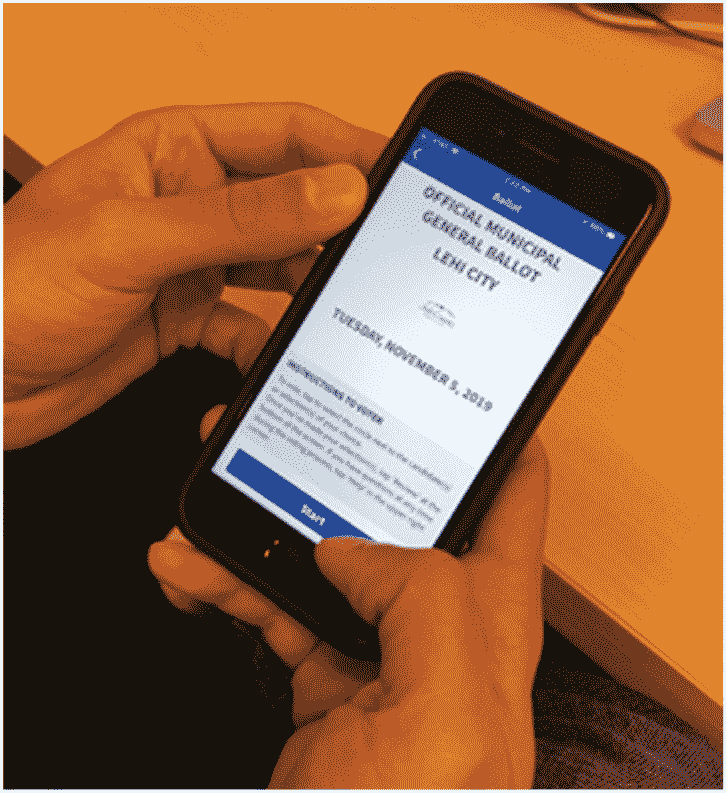
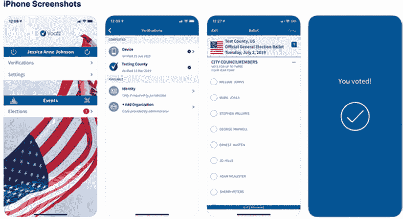
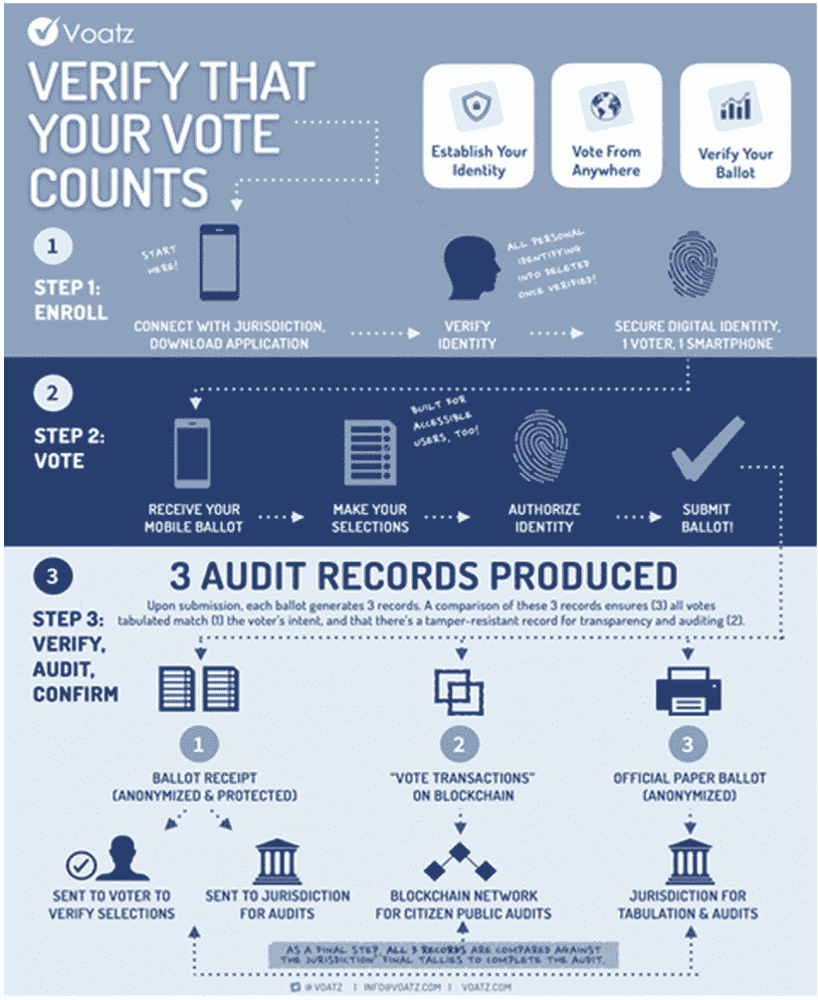
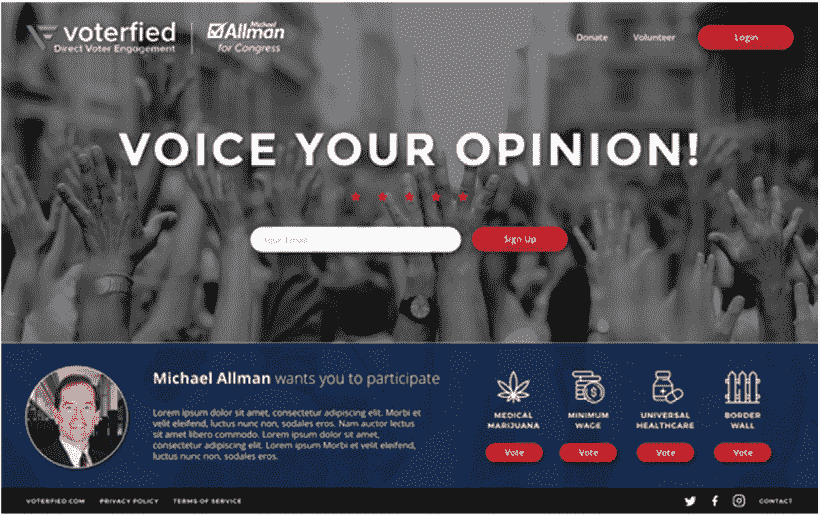
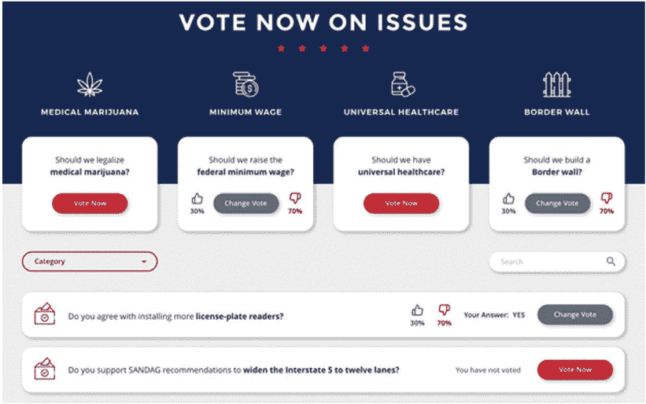
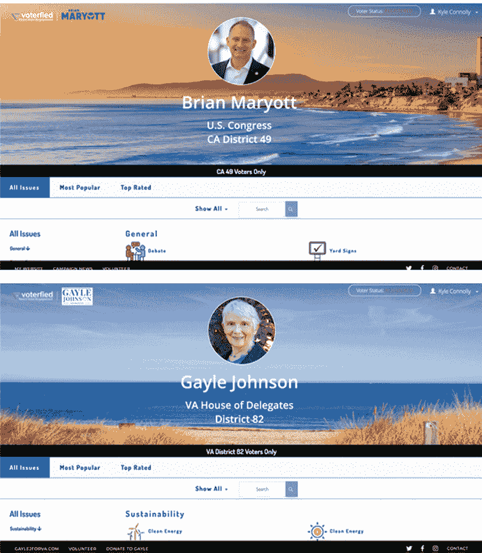
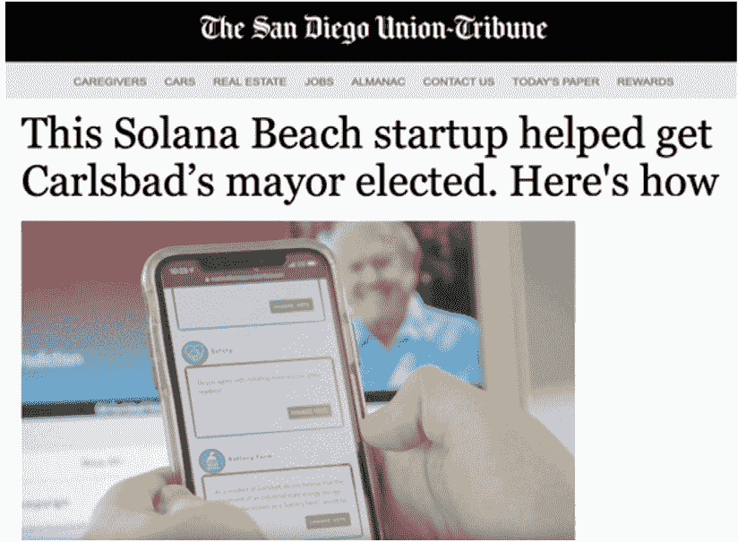
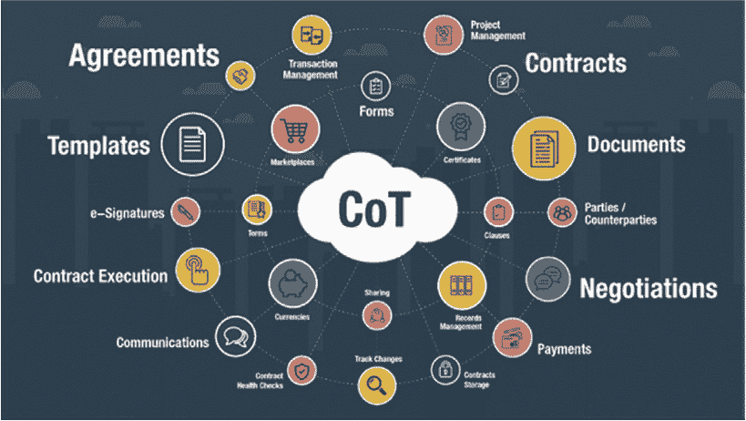
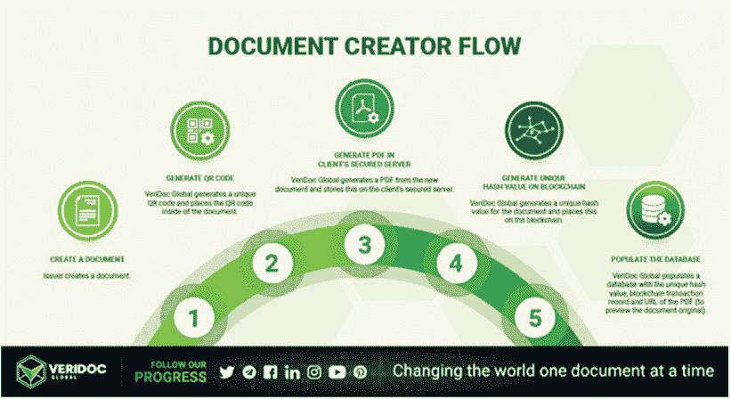
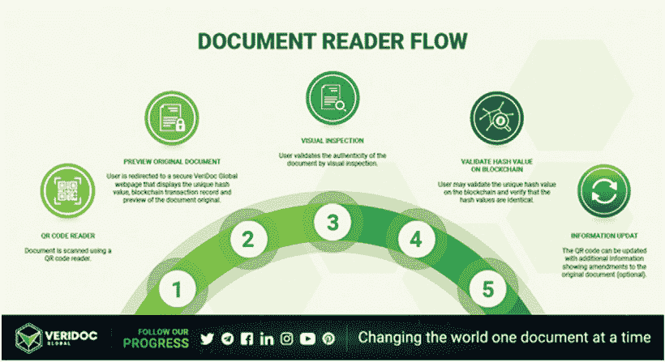

第六章

*DADA 集体：西班牙的玛·埃斯皮和英国的特丽·吴，利用区块链技术共同创作，视觉对话。*

信任的价值：心灵的宁静值多少钱？

你相信我吗？

银行家、律师、保险人、会计师和房地产经纪人有什么共同点？（不，这不是一个笑话的开始！）他们都是“受信任的中介”，或者是我们一生中支付并信任他们管理我们大量金钱的人。

进入区块链。当我们把大量的钱交给受信任的中介时，一个问题出现了：我们能信任他们多少？难道把钱交给陌生人不是更好的办法吗？

2019 年，我们正生活在信任危机中！皮尤研究中心最近发布了 30 多篇与信任有关的研究报告，它描绘的景象是严峻的。1 温和地说，在美国，我们有信任问题。

我们对企业和其他机构的信任已经大幅侵蚀。2 我们不相信我们的政府，我们也不相信彼此，这阻碍了我们有解决问题的能力。3 我们甚至无法达成什么是真实的共识。据皮尤研究中心，“许多美国人认为，虚假新闻和信息的创造和传播对国家和需要被阻止。”4

信任问题可能将持续存在。相比他们的长辈，年轻的美国人对他人的信任以及对关键机构的信任更少。5

从全球的角度来看，情况并没有好多少。据皮尤研究中心，“对选举机构的反应性、责任感和有效性的公众信心已经陷入十多年来历史的低点。”6 根据该中心的说法，

描述公共事件和在政策辩论中塑造证据和事实的角色持续受到挑战。随着公民在一个饱和和分解的信息环境中成为自己的策展人，一个所有人都能同意的共享真理的概念似乎越来越难以捉摸。7

有许多方法可以提高我们在这个世界以及生活中信任他人的能力。例如，加拿大作家尼尔·帕斯瑞查，他是一位以倡导积极态度和简单乐趣而知名的创业者、播客和公众演讲者，他提出了仅仅三个方法。

• 首先，我们对有限的信任超过对无限的信任。这在我们的时代尤为正确，在这个时代，我们总是被无限的选择所压倒。因此，苹果只提供六种电脑选择。

• 其次，我们信任人类超过算法。尽管我们周围越来越多的是机器人，但我们渴望握手、微笑和人际交往——所有这些都是越来越稀有的。

• 三，当我们信任那些在我们之前全力以赴并引领我们的人时，我们会信任。换句话说，“你把更多的筹码推到中间，我们就更愿意买入你的手。”8

区块链为我们提供了一种改善信任的另一种模式：分布式信任。它提供了一个没有系统中信任个体或彼此信任的信任基础系统。当你把互联网的开放性和加密的安全性结合起来时，结果就是设计内置的信任。本章通过新闻和娱乐、商业、政治、以及法律和政府的例子，展示了企业家如何越来越多地利用区块链技术提供默认信任服务。

新闻和娱乐

说新闻和娱乐产业存在信任问题还是有些保守了。假新闻，这个新词指的是没有事实根据、尽管看似事实准确的编造新闻，是我们这个时代的标志性现象。许多美国人无法有效区分新闻中的事实和观点陈述。9 在过去几年里，围绕假新闻的提及和愤怒变得如此普遍，以至于批评假新闻已经成为跨党派的 cultural phenomenon，这已经是我们当代政治和文化的一个特点。

一些人认为区块链可以用来恢复新闻和娱乐产业的信任，并最终消灭假新闻。Instrumental 的 CEO 和 CTO 亨利·纽曼在《企业存储论坛》上撰写了关于这一潜力的文章：

如果手机上每一个音频或视频应用、电视新闻摄像头或你的摄像机都自动设置为创建包含地理位置、日期和时间的区块链呢？编辑程序也将需要使用区块链。如果每一个被编辑的帧都有一个描述了哪些更改被做出的区块链呢？

*战胜假新闻*

一些初创公司正在对抗假新闻。PUBLIQ 是一个免费的应用程序，用于分享数字内容新闻和文章，其中作者根据他们的 PUBLIQ 评分获得奖励，这是一个基于读者观点和反馈的评价，建立在 DECENT 网络之上。12 PUBLIQ 利用区块链和人工智能建立一个不可审查的平台，由作者、记者、博主和广告商运营。它旨在建立一个激励编写高质量内容的奖励过程。平台的所有利润都将分配给内容提供商。

PUBLIQ 还有一个基于读者观点和反馈的声誉评分系统。最后，除了对抗假新闻和有偏见的报道外，PUBLIQ 还为广告商提供了一个无中介的体验（尽管当然，数字广告是另一个需要改革的信任问题领域）。

同样，Civil13 希望利用区块链资助优质新闻。它还帮助媒体集团实现财务可持续性。再次，主要目标是打击假新闻。Civil 旨在提高对新闻业的信任，并成为一种新的基于代币 CVL 的媒体生态系统。使用区块链可以使 Civil 去中心化对什么构成道德新闻的权力，赋予代币所有者——读者——发言权，他们可以使用代币提出异议。

商业

对我们公司的信任度也很低。Facebook、亚马逊、微软、谷歌和苹果（FAMGA）日益受到审查，不仅仅是因为它们在传播假新闻中的作用。科技行业极具价值，其大部分价值都集中在 FAMGA。如此之多的价值集中对创新产生了重大的负面影响。 among other things, 这些公司被指控增长过大、抑制创新和进行掠夺性行为。14

你只需要看 10 分钟的马克·扎克伯格的 2018 年国会证词，就可以了解到美国人民对扎克伯格和 Facebook 的不信任。公众普遍认为，扎克伯格和 Facebook 以交易为导向，将利润置于人和关系之上。他们被认为的不一致、缺乏透明度以及对用户隐私的不尊重，已经破坏了他们产品和互联网业务的可信度。

这就是为什么扎克伯格和 Facebook，以及他们相关实体如 Libra 定期访问美国国会。我们的经济之所以能够运作，是因为人们和企业之间相互信任。15 因此，信任对您的业务和品牌很重要——甚至可以说是必不可少的——它有助于管理与客户、客户、员工、媒体和许多其他市场利益相关者的关系。16

遇到了塔尼拉·伊斯兰，她是 Tiger-Trade 和 TradeFlo 的 CEO,17 这两家连接了来自 60 多个国家的买家和卖家的公司，他们信任他们的高价值、精心筛选的折扣商品的承诺。她的整个商业活动都围绕着建立信任，她看到区块链可以帮助她进一步建立信任。

伊斯兰说，

我一直对国际经济发展充满热情。我的家庭起源于孟加拉国。我出生在沙特阿拉伯，并在那里长大。我经常在许多国家之间穿梭。我一直对不同国家之间的经济差异感到震惊，并热衷于寻找解决这些差异的方法。

伊斯兰继续说道，

在我完成硕士学位之后，我在新兴市场实施了一些项目，主要是在亚洲。当人们谈论日常扶贫时，正常的公众言论，他们往往会聚焦于小额信贷。但这并不能真正创造大规模的经济增长。如果你看看美国的工业革命，或者欧洲，甚至是中国和印度，巨大的增长来自于能够产生大规模机会的行业。这就是我关注的焦点。我的项目包括许多不同的组成部分，包括基础设施的建设和重建、金融接入以及培训。

她观察到，

而且，它总是包括将买家和卖家聚集在一起的因素。我们在几年的时间里制定了一个庞大的计划。但我们看到最大的影响是在将当地企业和中国制造商与国际买家和国际市场连接起来的地方。

她回忆起，

我参与的最后一个项目涉及组织和管理工作在阿富汗的大型贸易博览会。这是自俄罗斯入侵以来的最大公共活动。它们产生了数百万美元的商业活动。我感到震惊，因为这些国家的产品有需求，但不知何故，这一切并没有自然而然地发生。在像印度尼西亚或越南这样的国家也是如此。

伊斯兰解释说，

问题在于市场准入。所以我提出了我的第一家公司的想法，Tiger-Trade。我想把国际贸易带到线上。我将其作为连接买家和卖家的在线市场推出。我们专注于与东南亚的制造商合作，为美国和整个欧洲的买家服务。我意识到我们正在建立一个市场。

她注意到，

关键问题在于信任。像 Target 和 Walmart 这样的公司正在积极寻找这些新兴市场的交易伙伴。但他们想要找到他们可以信任的制造商。我们意识到我们可以帮忙解决这个问题。这就是我们所做的。我们与这些公司有关系，了解这些公司。我们还为买家和卖家提供了在线见面的机会。

伊斯兰注意到，

与此同时，公司开始向我们购买和销售过剩库存。例如，一个制造商我们会带来一个品牌的 60,000 件男士 polo 衫的取消订单，这些衣服都堆在后面腐烂。因此，我另外启动了一个专注于过剩库存和国际贸易可持续性的平台。你知道有很大一部分过剩库存被烧掉或扔掉，因为很难转卖它吗？

她解释说，

我们为这些产品寻找新市场提供了一个负责任的环境解决方案。虽然原始的采购平台涉及在过剩库存平台上开放市场渠道，但我们进行的是完整的贸易交易。我们必须验证所有供应商。我们在交易方面进行了更深入的尽职调查，以确保交易顺利进行。

根据伊斯兰的说法，当你实际进行交易时，你必须真正了解这个人是谁？他们的经验是什么？他们能履行他们的义务吗？伊斯兰说，

这是一个庞大的过程，我们成为了一个值得信赖的中介，调解了这些交易。我们在墨西哥和土耳其的公司从未见过面，但希望迅速进行交易。我们提供了信任的元素来帮助他们实现这一点。

她解释说，国际贸易最大的障碍之一是信任。如果你要测试半个地球另一端的另一家公司，你同意支付数千英里外的陌生人根据你的规格生产和运输商品。另一端的世界上，无论是制造商还是分销商，也都在依赖信任，实际上同意为你，一个数千英里外的陌生人，制造或运输产品。这是两个从未见面、永远不会见面、可能甚至不会说同一种语言的陌生人之间的信任！由于双方都存在不信任的机会，很多交易甚至从未发生。

伊斯兰继续说，

为了建立信任，公司必须生产和验证一系列文件，以代表这个过程的不同阶段。有些是采购订单、发票、检查、认证和保险，以报告付款和运输情况。这种文件交换过程本身也涉及大量的信任投资。在这个过程中有很多欺诈的机会。我们可以帮助解决这个挑战，特别是在新兴市场，以合理的价格和速度。

她继续说，

然后我研究了区块链。这是我们真正一直在等待的技术。国际贸易是一系列复杂、以纸张为主、多方参与的交易，每一步都存在欺诈风险。显然，我们之前使用的技术无法充分支持这个领域。我们仍然有很多业务流程是通过电子邮件进行的。区块链是提高效率的最佳解决方案。

伊斯兰解释说，

区块链将各方实时聚集在一起，并允许我们更快、更准确地验证公司。我们正在构建一个解决方案，以便我们可以更好地验证和认证。例如，我们可以与银行或政府当局核实他们的业务状况，以及其他贸易伙伴的业务状况。区块链改进了其他繁琐的参考检查过程，并创建了一个所有认证和证实记录的审计跟踪。

区块链极大地提高了买家和卖家之间的信任，从而促进了商业过程。与区块链的关系中有了更高的透明度。尽职调查得到了加速。各方现在可以更直接、更快地前进。在满足某些条件和获得批准后，他们还可以更仔细地查看文件和数据，如果他们愿意的话。利用区块链，我们可以建立更多的信任。这种信任合作伙伴关系可以将尽职调查过程从 3 个月缩短到 1 周或更短。这种更深入的调查可以立即进行，以识别值得信赖的合作伙伴。

根据伊斯兰教的说法，就像能量一样，事物无法流动，就会崩溃。全球经济今天的问题也是一样。我们生活在一个丰富的环境中。但目前系统设置的问题在于，它不允许商品和货币的流动，使每个人都受益。她解释说：“我们已经建立了一个系统来解决这个问题。现在我们正在使用强大的技术将其解决方案提升到一个新的水平。”

伊斯兰教说，

我们已经与 IBM 合作达到了这一步。我们一直在与他们合作，帮助我们设计商业模式。他们已经做了许多用例和不同的概念验证（POC）。我们还加入了他们的加速器，并正在与他们合作整合一些现有技术和项目。

其他公司也在积极努力改善各个垂直领域的信任，例如供应链、广告、市场等。例如，Bext 360 为从生产者到消费者的商品提供可追溯的指纹“解放供应链的透明度和低效。”18 利用区块链，Lucidity19 在数字广告中引入透明度，使品牌可以确信他们得到的是他们所支付的。TraDove20 是一个商业社交网络，允许买卖双方验证潜在合作伙伴的真实性，并查看他们是否是骗局。TraDove 上的买家和卖家经过审查和筛选，以确保所有付款和交易都能安全、顺利完成。其区块链支付网络支持国际交易，这带来了其独特的风险。

政治

无论信任危机的根源在哪里，还是危机上演的其他领域，今天的政治充满了不信任、猜疑，以及一种普遍的感觉，即对方是在怀有恶意的情况下行动的。 whereas 选举政治，尤其是在国家层面，曾经是弥合分歧、跨意识形态合作解决问题的练习，今天的政治比以往任何时候都更加两极分化，每一方都越来越不愿意、也不可能相信对方是诚实的，并且真心为他们着想。

这种信任的缺失在国家和政治的最具有争议性的领域中表现得最为明显，这个领域也塑造了政治，那就是选举。共和党政治家担心，我们选举的公正性会被不应该在美国投票的人所破坏，并已经实施了严格的“选民身份证法”。民主党政治家指责他们的共和党同事试图压制某些选民，并指责他们允许外国行为者破坏我们选举的公正性。

选民*在候选人上投票*

区块链或许能提供一个解决方案，以克服在创建一个更高效、更有效的选举系统中所遇到的信任危机，在这个系统中，投票反而会更容易，而不是更困难。Voatz 的 CEO Nimit Sawhney，运营着一个基于移动端和区块链的选举平台，该平台通过智能手机实现远程投票，他说道：

Voatz 是一家新的选举公司。我用“新”这个词，是因为与其它选举公司相比，我们确实是新成立的。我们大约有 4 年的历史。该平台的宗旨是让人民能通过智能手机投票，在生物特征识别的帮助下，并利用区块链以新奇有趣的方式保障这个过程的安全。

选民*开始在智能手机上使用 Voatz 平台填写选票*。

根据 Sawhney 的说法，选民的过程通常与正常的缺席投票过程相似。你填写一个缺席请求表格，将其发送给你的县或城市 Clerk，他们批准后，你就被认定为一名选民。然后，你会收到通知，在你的 iPhone 或 Android 手机上下载该应用程序，并可以进行身份验证流程，其中你需要拍摄一张身份证和脸部照片。它使用面部识别技术，一旦你的脸与你的身份证匹配，你就可以在手机上查看选票并提交选票。选票会被匿名处理，然后提交到网络上，在区块链网络上锁定，直到选举日当天，Clerks 才会解锁并计数你的选票。

Sawhney 回忆说：

我们在 2015 年正式起步，是在 2014 年在德克萨斯州奥斯汀的南岸音乐节赢得了一场编程马拉松后。比赛的宗旨是彻底地创建一个全新的选举平台，这个平台专注于使用移动设备、生物特征识别的安全性和易用性，并独特地使用区块链提供额外的安全层次，并防止篡改。到目前为止，我们已经完成了大约 53 次选举，其中最具影响力的是去年的一次。

他继续说道：

我们在西弗吉尼亚州进行了两次选举。一次是两个县的初选，随后扩展到 24 个县的大选。2019 年 3 月，我们被丹佛市和县选中，向海外和军事公民提供远程投票。我们目前正在做这场选举。此外，犹他州县（犹他州）、俄勒冈州杰克逊县和俄勒冈州乌马蒂拉县是最新的行政区，选择 Voatz 用于 2019 年的选举。犹他州县也是美国第一个将移动投票计划扩展到残疾公民的行政区，这样他们也可以在不放弃隐私的情况下以一种可访问的方式投票。

根据 Sawhney 的说法，“投票是公民最响亮的声音。但是由于长长的队伍和过时的系统，这可能是一种令人沮丧且耗时的活动。”Voatz 在 60 秒或更短的时间内创造了投票的便利。 “利用生物特征识别技术，在完全隐私和匿名的情况下，您可以确信您的选票被准确记录。使用 Voatz，您再也不用站在投票队伍中了。您可以在公共选举、公民投票、预算决策、大学选举、公司治理、股东大会或其他任何地方投票。Voatz 通过智能手机提供安全的、防篡改的投票，具备多源 ID 验证、高级生物特征识别和基于区块链的可信度。

从选民提交选票开始，选民保持匿名，选票存储在区块链上，直到计票时间。每一个移动选票都会生成一个格式化、可打印的纸质选票。计票时，行政区官员解锁数字保险箱，将所有移动选票打印在选票纸上，然后扫描并与其他选区的选票一起计票。”

**Voatz 的主屏幕；Voatz 的验证屏幕；一个待投票的样本选票，在 Voatz 平台上准备投票；以及在使用 Voatz 安全、成功提交选票后的成功屏幕。**

他解释说，

Voatz 的一个独特功能是，每位选民投票后都会收到一个可由选民验证的数字收据。它是匿名且密码保护的，并且还会发送一个匿名副本给行政区。这样，选民可以验证他们的选择，选举结束后，行政区可以确认收据上的内容与打印、计数的官方选票以及存储在区块链上的数据一致。这使得行政区可以确认系统正确地统计了选票，并且所有计数的选票都符合选民的意图。这是建立信任的好方法，并向人们展示这种方式可以是一种更好的、更值得信赖的投票方式，而不是他们现在所采用的方式。通过电子邮件、传真或邮寄投票，这是目前提供给海外公民的选项，存在问题。这是我们扩大缺席投票计划的主要关注人群。

关于 Voatz 使用区块链的情况，Sawhney 解释道，

我们主要将区块链用作数据安全和审计工具。本质上，它用于存储选票数据，好处是它没有单点故障。如果一个节点幸存下来，选举就会继续进行，因此在那种情况下很难摧毁系统。

我们正在使用的区块链类型是 Hyperledger Fabric，一个公共受许可的网络。这对我们来说很有用，因为我们希望镜像物理世界中选举是如何进行的，在那里我们可以确保所有节点都得到妥善的安全和批准。它们必须位于美国司法管辖区之内，这意味着没有外国行为者可以成为系统管理员。每个接触它的实体，包括我们的员工，都必须经过访问检查。我们然后还有外部审计师团队，包括三大机构之一，在大选前进行全面审计。然后在普选后再进行一次，以确保一切顺利。这种混合架构很有用，即使它不是公开的，任何人都可以看到正在发生的事情。

根据 Sawhney 的说法，特别是围绕选举的新技术，你不想提供大多数人都不理解的东西。

超过 98%的人仍然不明白区块链是如何工作的。有很多错误信息，因此我们更关注移动投票，它以一种独特且简单的方式使用区块链。我们不让人们在网页浏览器上投票。你必须使用一个本地移动应用程序，或者在某些情况下，你也可以使用平板电脑。

**Voatz 系统端到端工作：从验证、投票到选举后审计。跟随虚线了解选民如何得到验证、提交选票，以及司法管辖区如何计票和审计所有提交的选票。**

如果你想要推出这样的事情，它涉及到像我们的选举这样敏感的事情，它需要以一种缓慢、逐步的方式一步步进行。我们需要确保我们在过程中建立信任，正确地教育，并在前进中完善我们的产品。

**由 Voterfied 提供动力的示例主页，版本 2.0**

Sawhney 解释说：“我们不希望它在人们实际上理解它是如何运作的基本原理之前变得太大。”

他说，

移动技术的潜力常常被忽视。手机，尤其是 iPhone 和新型 Android 设备，在许多方面比普通的电脑或桌面或笔记本电脑要安全得多。同样，通过原生应用程序投票也是相当安全的。

**投票问题**

并非所有的投票都是为了选择一个候选人。有时手头的问题是一个具体的问题，而不是一个候选人。

简单地说，Voterfied22 是一个在线软件平台，帮助当选官员和候选人与他们选民互动。它通过提供一个在线投票系统，选民可以对问题进行投票。竞选公职或当选官员有一个专门的网站，他们可以在上面发布信息和建议，寻求来自选民的输入。该平台验证用户已在适当的选举区注册投票。选民可以上网，一次性注册，轻松表达自己的观点。区块链技术用于记录投票并确保其不可更改。

选民立即知道他们的声音被听到了。他们可以看到他们在哪个问题上投了票。他们可以看到当前的计数。凭借所有电子投票的好处，他们可以改变主意。可以是匿名的。该平台可以无缝地表达他们的观点。

艾尔曼解释说，

我们发现今天的选民感到沮丧。他们想要参与，但不知道如何参与。没有人愿意经常参加最终演变成争吵的市政厅。给你的国会议员发一封电子邮件，你得不到有用的回复。你尝试打电话，但打不通。

他继续说，

**示例页面，带有演示投票者的网站问题和显示用户投票的样子**。

现在，首次能够让他们表达自己的观点，并且被听到。最重要的是，当选官员或候选人现在知道他们的选民站在哪里。这是一个取代民意调查的机会。它实际上是一种更便宜且更及时的民意调查方法。它促进了与选民的直接互动。这意味着作为政治家，你可以区别自己。你可以倾听选民的声音，Voterfied 将帮助你当选。

**Gayle Johnson** 为弗吉尼亚州众议员主页，**Brian Maryott** 为加利福尼亚国会众议员主页。

根据艾尔曼的说法，

这就是我们使用区块链的方式。Voterfied 是一种允许机密投票和促进开放分布式数据库的方法，该数据库可以被审计并建立信任。我们建立在超级账本上。没有硬币或加密货币。我们发现这样做有两个主要好处。第一，它是为政治家定制的，他们是我们的客户。他们将选民带到他们的 Voterfied 网站，选民通过投票和评论进行互动。我们进行了焦点小组讨论。选民在使用该工具后会有很好的感觉。此外，候选人可以获得重要的数据来帮助他们更好地开展运动。我们还看到该应用程序在其他上下文中的运用，例如运行公司或组织董事会。

他说，

-   我们的民主平台让您可以通过区块链投票向候选人及当选官员表达您的意见。只需注册、验证，您就可以要求您的政治代表做得更好。首先，您需要注册并验证，以创建一个带有姓名、关联邮箱和密码的账户。然后，您将收到来自您政治代表的一封电子邮件，里面有一个链接用于验证您的邮箱地址。之后，我们将确认您是一位注册选民。

-   “这一验证确保您的当选官员知道他们正在听取真实选民的发言。我们将选民的信息与您所在县的公共选民注册名单相匹配。”

-   根据 Allman 的说法，一旦选民登录，他们会看到他们的政治家的名字、管辖范围和照片。他们可以滚动屏幕，查看他们社区中的所有问题。一旦选民选择了他们想要表达意见的问题，他们将看到每个话题都提供了赞成和反对的论点，以及链接到文章以帮助他们做出最明智的决定。当选民准备好做出决定时，他们点击屏幕投票。

-   

-   *《圣地亚哥联合论坛报》文章*

-   选民会立即得到确认，他们的选票已经被计算在内。如果他们改变主意，他们也随时有自由改变他们的选票。我们的目标是现代化民主，使公民能够参与。这可能导致政府更加透明，以及有能力对政治家进行问责。

-   我们信任问题在我们的政治中泛滥成灾，其中一个原因是缺乏沟通。公众感到被疏远，觉得他们的代表不了解他们的感受——因为通常确实如此。公众并没有错，他们觉得自己的声音没有被听到。区块链可以实现将选民与他们的代表——当选或寻求当选——连接起来，并确保公众的声音被听到。换句话说，它可能逐渐开始恢复我们政治中的信任过程。

-   法律与政府

-   政府信任问题并不仅限于公众与当选官员之间的关系。在政府内部，也确实存在着信任危机。我们整个法律和政治结构在某种程度上是建立在信任的基础之上的，政府官员、律师及其合作伙伴之间日益扩大的信任鸿沟威胁着我们社会最基本的一面。

-   *房地产，更佳选择*

赵 Cheng-Shorland 是 ShelterZoom 的首席执行官和联合创始人，ShelterZoom 是一个实时、多方平台，支持安全的在线合同谈判。23 他们的技术和分析使合同能够跨交易移植，并对合同的不同部分进行数据挖掘，从而获得更大的控制权。他们将这称为“合同物联(CoT)”。就像物联网(IoT)是设备之间“对话”的方式一样，基于区块链的 CoT 能够分析跨许多不同交易的合同，并使合同具有互动性，而不是孤立文档。

合同的许多组成部分现在可以使用 ShelterZoom 的基于区块链的技术进行分析并在交易之间移植.*

公司的第一个产品之一是 OfferNow——利用区块链技术使房地产销售过程更加透明和安全的方法。她说道，

大约三年前，我遇到了我的商业伙伴。他是一名房地产经纪人，在业务方面非常深入。他的整个家庭一个世纪以来都参与了房地产。他在业务方面非常前瞻性和有创造力。他总是有一个愿景。在他遇到我之前，他在技术方面的知识是缺失的。他从未见过来自技术领域的人。我是通过一个共同的朋友遇见他的。

她继续说道，

我知道他在寻找某人，也知道我也在寻找。在遇见他之前，我甚至想过房地产。我在思考这个行业想要改变的地方。这个行业真的很落后，有这么多手工处理。

陈 Cheng-Shorland 反思道：“我们不是一家区块链公司。我们是一家使业务区块链化的公司。” 根据陈 Cheng-Shorland 的说法，

最后，可扩展性、盈利能力和如何获得牵引力都很重要。这一切都归结于商业模式。与此相关的是，路线图。我们非常清楚公司应该在各个阶段交付什么，以定位未来的增长。我们在每一步都进行战略规划。

她解释道，

我们扫描了市场，这就是我们找到提供和接受的原因。市场上真的有一个缺口。我们查看了美国市场和澳大利亚、中国、日本、英国。我们得出结论，缺失的共同点是一个面向消费者的提供和接受过程以及平台。这就是我们确定最初范围的方式。如果我们有一个提供和接受平台，并且要让人们使用我们的系统，我们决定不要创建一个 [shelterzoom.com](http://www.shelterzoom.com) 并让大家都来我们的网站。这技术上和声誉上都需要时间来建立，还需要 SEO 信誉。

陈 Cheng-Shorland 说道，

我们决定提供一个小的按钮，每个人都可以快速将其作为小部件添加到他们的网站中。我们所有的品牌标识都表明它是由区块链提供支持的。我们认为这将促使更快的采用。我们觉得让任何人都能通过按下按钮来购买或租赁房屋是一件美妙的事情。那就是我们的商业模式。它是围绕在线购买或租赁物业按按钮来构建的。无论你在世界上哪个地方，你的国籍是什么，你的种族是什么，每个人都应该能够做到这一点。

根据 Cheng-Shorland 的说法，

人们通过小部件提交要约，上传文件，管理要约，接受，电子签名订单——整个虚拟谈判室的仪表盘都是由区块链提供支持的。我说“由区块链提供支持”的原因是我们提供了一个带有区块链技术的小部件。你来到房地产网站，如果你喜欢一栋房子，你可以通过点击一个按钮来发出要约。

一旦启用，一些信息将预先填充，因为网站和小部件之间有一个集成。然后你可以非常快地填写一些关于你和你的代理人的详细信息。你可以浏览条款，价格，贷款金额，你预期的关闭日期和其他信息。然后你甚至可以上传一份支持文件，比如你的贷款预批准。最后，你接受条款和条件并提交。这是一个非常面向消费者或面向代理商的要约过程。

Cheng-Shorland 解释说，

我们为人们创建了一个虚拟谈判室。你获得了一个仪表盘的访问权限，可以看到你在过程中的位置以及已经签署，拒绝和正在谈判的内容。你可以看到哪些物业有多份要约。然后你还可以深入查看整个文件流程，并查看每份要约发生了什么。

这正是区块链价值所在。每一个数字都是一个区块。它创造了完全的透明度。买家，卖家，经纪人，每个人都有一个相同的视图，并且对正在发生的事情有完整的信息。你可以基本上看到所有的细节，并且可以协商要约或反要约。你可以进行修改，拒绝，或者签署。这很大程度上是一个手动过程，但它完全是数字化的。然后每一步都存储在区块链上，以确保涉及所有人的安全，透明度和便利性。遵循 COT 背后的原则，一切都是可审计的。

Cheng-Shorland 解释说，

房地产的每个阶段都有大量的文件。我们市场上没有真正的房地产交易平台，所以我们想自己建造一个。这就是我们最后给每个获得物业列表的人提供一个 widgets 的原因。我们还意识到，房地产是交易管理最复杂的领域之一。它有许多表格，多方参与，以及众多的阶段。你必须做很多涉及许多服务提供商的步骤。如果我们能数字化房地产，那么我们应该能够毫无问题地为其他行业提供这个虚拟谈判室过程。

*是时候升级你的 DMV 体验了*

根据 Cheng-Shorland 的说法，

我们开始利用同样的技术并将其应用于其他行业。我们现在正在创建的是整个交易合同和交易管理平台。这是我们的第二个平台。房地产平台是第一个。一切皆数字。在合同谈判的任何阶段都不再需要纸张。都在系统中。现在他们使用 DocuSign 进行签名，但表格本身仍然是基于纸张的。只是扫描或 OCR。这并不是真正意义上的合同谈判或数字化管理的交易。

Bernie Moreno 是 Ownum 的创始人兼主席，24 是一家专注于通过关注车辆所有权来解锁商业增长和使政府更高效的区块链科技公司。他说，

数字经济创造了伟大的事物。但它也创造了很多问题。大多数政府所做的就是将他们的数据放在一个泡沫中。它提出的挑战是政府持有的数据非常有价值。他们控制得如此之紧，基本上不允许数据共享。所以区块链来了，打破了信任鸿沟。

他解释说，

如果你进入一个政府机构，和他们谈论区块链，他们会对你说，在快速进行谷歌搜索后，“你想卖给我比特币。” 我无法告诉你，在克利夫兰，我听到多少人假设我在创建我自己的加密货币。这是一个很大的问题。我们试图做的一件事就是用老技术理念解释新技术。我们提出了这个想法。我们称之为“BELTED 解决方案”。所以我们不是要说我们要用区块链来解决问题，而是谈论数字化车辆所有权。

Moreno 表示，

“BELTED”是区块链加密账本执行和分布式缩写。你摆脱了区块链及其与加密货币的联系。这看起来像是一种营销策略，重新框架私有区块链或私有分布式账本。这就是整个要点！当您与政府当局打交道时，这种对话变得非常困难。这是区块链的使用方式。

根据莫雷诺的说法，“炒作问题的部分原因是你有很多供应商谈论区块链解决了一切问题。这创造了一个问题，因为它引起了怀疑。这仅仅是万灵药吗？区块链并不能解决每一个问题。为了摆脱所有的这些负担，我们在讨论中使用 BELTED 解决方案，特别是与政府讨论时，因为这提醒我们我们不是在谈论加密货币。”

想想这个想法，在 2020 年，政府仍然向你发放代表你拥有某项资产的实体纸张。这似乎是一个奇怪的概念。让我们一步步探讨其含义。莫雷诺解释道，

我在克利夫兰的奔驰经销商可能每个月卖出大约 300 辆汽车。我们有五个人帮助处理车辆登记。他们整天都在做这件事。他们拿到的这张纸最初是制造商的原始声明，客户签署的文件，你知道你要走进一个办公室。你签署了一堆文件，把这些文件开车带到一个实体办公室，然后打印出新的俄亥俄州登记证。

还有更多！莫雷诺继续说道，

然后它会被退回。要么邮寄给银行、租赁公司，或者邮寄给你，购买者。这是一项巨大的工作量！从贷款人的角度来看：如果你从我这里购买汽车并通过银行融资，我邮寄给银行的你的登记证，他们必须收到并处理它。

他继续说道，

然后，如果你还清了贷款，银行必须弄清楚你已经为此付款。从信封中取出这个标题并邮寄给您。与此同时，这可能需要两到三周时间，平均而言，银行会从每位客户那里接到四到五个关于他们标题的电话。这太疯狂了，让他们花费了很多钱。

但这还远远不够，还有更多！莫雷诺解释道，

如果你曾经有过汽车被盗或报废的经历，你就会知道保险公司处理索赔大约需要 90 天。其中大部分时间是因为他们正在等待车辆的所有权文件，这对保险公司和汽车公司来说既昂贵又繁琐。

你是否收到过召回通知，而你自从小时候就不再拥有那辆车？然而政府对这些汽车公司施加了很大的压力，要求它们完成召回工作。想象一下如果汽车公司能向你的手机发送通知！“您的汽车已被召回。点击这里查看详情。点击这里预约。一切就绪。”

莫雷诺解释道，

你可以这么做，是因为你的登记证现在存储在 BELTED 系统上，而不是在你的文件夹或银行金库的某个地方。所以，通过数字化曾经是实体纸张的事情，我们就能实现这些目标。

莫雷诺说，

如果我想要卖给你我的车，我会遇到一个难题。你想要一辆红色的车。在这方面我们没问题，对吧？我们有视频技术，可以看到车辆状况等。但现在我对你说，“好吧，我会把支票邮寄给你，你把车 title 给我寄过来。”然后你说，“不，不，不，不，不，不。你把 title 给我寄过来，我会把支票给你寄过去。”然后你们就会为了这个事情争论很长时间。

他继续说，

想象一下，你可以像发短信一样发送 title，通过我们的 BELTED 系统。它会为州政府验证销售价格和注册费，title 费用会得到清算。销售税会通过智能合约转移。那个 title 会发送给你，钱会转给卖家，一切都在一瞬间完成。你也可以很容易地贷款。

人们根据他们的观点定义区块链的不同方式。莫雷诺说，

我们将授权区块链定义为一种分布式系统，授权机构可以赋予系统中的不同参与者访问权限。我们利用区块链的方式是通过在整个网络中分配信任。区块链和智能合约最重要的，也是最被忽视的方面是这样一个数字清单的概念。

他解释说：“我们使用的是 Hyperledger Fabric。我们发现它真的是最好的平台。它给了我们需要的功能。”

数字化文档可以节省成本和改进流程。莫雷诺观察说，

在我们公司的情况下，一家汽车经销商，关于我们的 titles，有一个流程。消费者必须验证他们的数据，银行验证某些数据，保险公司等。这些不同的各方之间有一个协议。通过区块链，我们可以在满足某些条件后建立一个网络，以一种不需要盲目信任的方式自动化和数字化车 title。

他解释说，

回想一下，很久以前，如果你要去迈阿密，我会打电话给旅行社，他们会为我预订航班，并在我出发前几天给我发送一张登机牌。如果我把这张牌弄丢了，我得想办法解决这个问题。有人说，“嗯，这种方式买票既昂贵又困难，为什么我们不让人在家里打印他们的登机牌呢？”然后这种方式就流行了起来。现在，当然，每个人都把他们的登机牌存在手机上。有了手机上的登机牌，你可以实时收到登机口更新。如果起飞时间改变了，他们会发信息给你。如果航班将准时起飞，他们同样会发信息给你。

例如，通用汽车是一家大公司。他们对自己的汽车销售知之甚少。他们相信他们的经销商能够及时准确地报告。但是制造商是一个输入因素，对吧？除非你在汽车行业，否则你无法理解汽车 title 对生态系统的影响有多大，以及它们是多么昂贵和低效。

莫雷诺解释说，

这有点像如果我开设一家航空公司，并说：“只有在我先邮寄给你一张登机牌的情况下，你才能乘坐我的飞机。”我知道，因为我在汽车行业已经呆了一辈子，但是汽车所有权在那个生态系统中产生了大量的摩擦。而这里的摩擦，我的意思是费用。该系统中的各方需要付出大量的金钱。所以，这就是我们的起点。我们可以将任何有所有权证明的文件放入这个系统。我们可以处理摩托车、船只、房车等这类事务。

*应对欺诈的种种形式*

数字化所有权证明过程的最大风险之一是围绕欺诈的可能性。或许进步缓慢和政府官员对技术如此抵触的原因是，随着效率的提高，新技术为黑客提供了更多机会来窃取不属于他们的东西。无论是简单的欺诈还是更富有创意的伪造，区块链都解决了数字化资产固有的安全风险。

维里迪科全球公司首席执行官盖·斯科特（Guy Scott）为组织提供基于区块链、基于二维码的防欺诈解决方案，以确保他们免受伪造者的保护。他说：“我在 2007 年进入了 IT 行业。我们在澳大利亚开始建立网站，然后转向学生管理系统。RTOs 需要学生管理系统主要是为了遵守政府规定并进行报告。”

斯科特注意到，

澳大利亚技能质量管理局（ASQA）于 2015 年发表声明，希望正确处理 PDF 文件并验证资质。维里迪科全球公司就是这样成立的。我们给文件一个唯一的哈希值，并在公共区块链上添加相同的唯一哈希值，这显然是一个分布式账本，无法被篡改。它是完全去中心化的。这就是我们产品价值所在。因为唯一的哈希值在区块链上，所以你知道它不能被更改。

他解释道，

当扫描二维码时，它会读取我们嵌入到二维码中的链接。我们制作自己的独特二维码。我们不会从二维码库中提取。嵌入到二维码中的链接会检查文档、区块链和客户端数据库中的唯一哈希值。二维码使客户能够确保其安全性。

他继续说：“然后我们在以太坊上构建了整个系统，同时继续为其他区块链提供支持，现在我们是一个多平台解决方案。我们在任何区块链上都能工作。”

维里迪科全球公司开发了一种防欺诈文件验证系统，确保用户查看的是真实和正确的文件。你可能以前见过二维码。它们开始出现在谷物盒子和报纸上到处都是。二维码是一种二维条形码，它能存储比普通条形码多得多的信息。

斯科特解释道，

我们在文档上嵌入了一个 QR 码，比如教育证书，这个 QR 码里面有一个哈希值。哈希值包含了一串信息，然后放置在区块链网络上进行安全验证，最重要的是，终端用户验证。它的工作方式是，发证者生成一个教育证书，然后系统给这个教育证书一个唯一的哈希值。接着使用 QR 码阅读应用，将这个哈希值作为 QR 码嵌入到那个教育证书上。你所需要做的就是用任何智能手机扫描教育证书的 QR 码，然后就可以立即验证它。应用会显示你正在查看的文档是真是假。

系统查看 QR 码内部的哈希值，然后检查区块链上的哈希值，并显示一个与哈希值关联的证书。这项技术听起来可能很复杂，但用户体验却非常简单。这阻止了伪造教育证书的创建和传播，因为区块链技术防止数据和 QR 码被更改或删除。

*Veridoc 文档创建流程.*

这也意味着，如果教育证书丢失或被盗，财产所有权仍然可以在区块链上得到验证。这项应用是无限的，包括护照、驾照、学历证书、银行对账单、按揭契约、股票证书、医疗记录和法律文件。这个列表还在不断增长。这是文档安全未来的发展方向。

Scott 还解释道，

我们开发了一个防欺诈文档验证系统，确保用户正在查看发证者创建的真实且正确的文档。大多数文档打印在普通纸上，以试图防止文档欺诈。最常见的做法是使用水印。但从未有像现在这样容易扫描原始文档并在 Photoshop 上打印出看起来与原版一模一样的文档。那么，任何人又如何知道它应该长什么样呢？

这个问题 VeriDoc Global 可以解决。

*Veridoc 文档创建流程.*

结论

前所未有的与更多人沟通，信息前所未有的易于获取。然而，与此同时，我们对每个信息的信任减少，对权威的信任减少，对彼此的信任减少。区块链的美丽之处在于它消除了信任的需要。

区块链允许预验证，这通过作为一个预先验证的权威机构，降低了信任的障碍。并不是区块链让我们彼此信任、和谐相处，而是它消除了信任的需要。我们不需要信任彼此，只需要信任这种高度安全、去中心化的技术。随着交易越来越复杂、越来越敏感和有价值，消除风险是至关重要的。

通过保障我们的通讯和互动，区块链取代了信任，成为连接彼此的纽带。当信任不再是障碍时，就有无限的机会进行操作改进，例如远程管理您的事业。

*DADA Collective: Ophelia Fu, UK / Isa Kost, Italy, 合作使用区块链技术创建的视觉对话.*

_________

1Pew Research Center. 2020. “Trust, Facts and Democracy Public Attitudes about the Role of Information in Society.” [`www.pewresearch.org/topics/trust-facts-and-democracy/`](https://www.pewresearch.org/topics/trust-facts-and-democracy/).

2L. Rainie and A. Perrin. 2019. “Key Findings about Americans’ Declining Trust in Government and Each Other.” [`www.pewresearch.org/fact-tank/2019/07/22/key-findings-about-americans-declining-trust-in-government-and-each-other/`](https://www.pewresearch.org/fact-tank/2019/07/22/key-findings-about-americans-declining-trust-in-government-and-each-other/).

3 同上。

4G. Stocking. 2019. “Many Americans Say Made-Up News Is a Critical Problem That Needs to Be Fixed.” [`www.journalism.org/2019/06/05/many-americans-say-made-up-news-is-a-critical-problem-that-needs-to-be-fixed/`](https://www.journalism.org/2019/06/05/many-americans-say-made-up-news-is-a-critical-problem-that-needs-to-be-fixed/).

5J. Gramlich. 2019. “Young Americans Are Less Trusting of Other People – and Key Institutions – Than Their Elders.” [`www.pewresearch.org/fact-tank/2019/08/06/young-americans-are-less-trusting-of-other-people-and-key-institutions-than-their-elders/`](https://www.pewresearch.org/fact-tank/2019/08/06/young-americans-are-less-trusting-of-other-people-and-key-institutions-than-their-elders/).

6M. Dimock. 2018. “Our Expanded Focus on Trust, Facts and the State of Democracy.” [`www.pewresearch.org/2018/04/26/our-expanded-focus-on-trust-facts-and-the-state-of-democracy/`](https://www.pewresearch.org/2018/04/26/our-expanded-focus-on-trust-facts-and-the-state-of-democracy/).

7 同上。

8N. Pasricha and F. Warren. 2019. “Building Trust in Distrustful Times, SXSW 2019.” [`www.youtube.com/watch?v=oOIsBN_-xcY`](https://www.youtube.com/watch?v=oOIsBN_-xcY).

9H. Newman. 2017. “Blockchain Could Help Stop Fake News.” [`www.enterprisestorageforum.com/storage-management/blockchain-could-help-stop-fake-news.html`](https://www.enterprisestorageforum.com/storage-management/blockchain-could-help-stop-fake-news.html)。

11 关于 PUBLIQ 的更多信息可以在[`publiq.network/`](https://publiq.network/)和[`decent.ch/blog/decent-network-introduces-publiq/`](https://decent.ch/blog/decent-network-introduces-publiq/)找到。也参见 D. Ngo. 2017. “Publiq Launches Blockchain-based Content Platform for Genuine, Unbiased News.” [`coinjournal.net/publiq-blockchain-content-platform/`](https://coinjournal.net/publiq-blockchain-content-platform/)。

12 关于 DECENT 网络的更多信息可以在[`decent.ch/`](https://decent.ch/)找到。

13 关于 Civil 的更多信息可以在[`civil.co/`](https://civil.co/)找到。

14L. Kerner. 2019. “CryptoWinter Has Nothing on FAMGA Winter Market Cap Loss.” [`medium.com/crypto-oracle/cryptowinter-has-nothing-on-famga-winter-market-cap-loss-501f1e4e3f1f`](https://medium.com/crypto-oracle/cryptowinter-has-nothing-on-famga-winter-market-cap-loss-501f1e4e3f1f); L. Kerner. 2018. “Why Crypto’s a Growing Threat to FAMGA (a.k.a. Facebook, Apple, Microsoft, Google and Amazon).” [`medium.com/crypto-oracle/why-cryptos-a-growing-threat-to-famga-a-k-a-facebook-apple-microsoft-google-and-amazon-ea237570d3ea`](https://medium.com/crypto-oracle/why-cryptos-a-growing-threat-to-famga-a-k-a-facebook-apple-microsoft-google-and-amazon-ea237570d3ea); L. Kerner. 2019. “The Coming Epic Battle between Crypto & FAMGA.” [`www.slideshare.net/loukerner2/the-coming-epic-battle-between-crypto-famga`](https://www.slideshare.net/loukerner2/the-coming-epic-battle-between-crypto-famga); L. Kerner. 2018. “The Coming Epic Battle between Crypto & FAMGA (aka Facebook, Apple, Microsoft, Google, & Amazon).” [`medium.com/crypto-oracle/the-coming-epic-battle-between-crypto-famga-aka-facebook-apple-microsoft-google-amazon-1a05489c3abb`](https://medium.com/crypto-oracle/the-coming-epic-battle-between-crypto-famga-aka-facebook-apple-microsoft-google-amazon-1a05489c3abb); L. Kerner. 2018. “The Profound Implications of Five Increasingly Dominant Tech Companies.” [`medium.com/crypto-oracle/facebook-apple-microsoft-google-amazon-aka-famga-is-eating-the-

S. Porat. 2017。“信任是企业今天成功的关键因素。”[https://www.forbes.com/sites/theyec/2017/07/07/why-trust-is-a-critical-success-factor-for-businesses-today/#35042cdb5df0`](https://www.forbes.com/sites/theyec/2017/07/07/why-trust-is-a-critical-success-factor-for-businesses-today/#35042cdb5df0)。

参见“用例：EY 被聘用来帮助开发基于区块链的高端葡萄酒交易平台。[`www.blockchaincompany.info/post/8409875/use-

**T. Islam**. 作者讨论. 2019。关于 TigerFlo 的更多信息可在[https://www.tradeflo.io`](https://www.tradeflo.io)获取。

关于 Bext 360 的更多信息可在[bext360.com](http://www.bext360.com)获取。参见 A. Knapp. 2018。“AgTech 区块链初创公司 Bext360 筹集 335 万美元用于提供商品可追溯性。[`www.forbes.com/sites/alexknapp/2018/06/01/agtech-blockchain-startup-bext360-raises-3-35-million-to-provide-traceability-to-commodities/#6fd484e86d25`](https://www.forbes.com/sites/alexknapp/2018/06/01/agtech-blockchain-startup-bext360-raises-3-35-million-to-provide-traceability-to-commodities/#6fd484e86d25); L. Kolodny. 2017。“Bext360 使用机器人和区块链公平支付咖啡农场主。”[`techcrunch.com/2017/04/11/bext360-is-using-robots-and-the-blockchain-to-pay-coffee-farmers-fairly/`](https://techcrunch.com/2017/04/11/bext360-is-using-robots-and-the-blockchain-to-pay-coffee-farmers-fairly/); R. Hackett. 2017。“这家初创公司计划利用区块链改造咖啡供应链。”[`fortune.com/2017/10/24/blockchain-coffee-bext360/`](https://fortune.com/2017/10/24/blockchain-coffee-bext360/); D. Takashi. 2017。“Bext360 旨在利用区块链和人工智能改造全球咖啡供应链。”[`venturebeat.com/2017/04/11/bext360-aims-to-transform-the-global-coffee-supply-chain-with-blockchain-and-ai/`](https://venturebeat.com/2017/04/11/bext360-aims-to-transform-the-global-coffee-supply-chain-with-blockchain-and-ai/)。

关于 Lucidity 的更多信息可在 lucidity.tech 获取。参见 A. Ha. 2018。“Lucidity 使用区块链为在线广告带来更多透明度。”[`techcrunch.com/2018/04/10/lucidity/`](https://techcrunch.com/2018/04/10/lucidity/); J. Siegel. 2018。“Lucidity 为数字广告商提供区块链协议的战略投资增加 500 万美元。”[`www.builtinla.com/2018/08/15/blockchain-startup-lucidity-announces-strategic-funding`](https://www.builtinla.com/2018/08/15/blockchain-startup-lucidity-announces-strategic-funding)。

20 更多关于 TraDove 的信息可以在[`www.tradove.com/login`](https://www.tradove.com/login)找到。

21N. Sawhney. 与作者的讨论。2019 年。更多关于 Voatz 的信息可以在[`voatz.com/`](https://voatz.com/)找到。另见，C. Loizos. 2019 年。“Voatz, the Blockchain-based Voting App, Gets Another Vote of Confidence as Denver Agrees to Try It.” [`techcrunch.com/2019/03/07/voatz-the-blockchain-based-voting-app-gets-another-vote-of-confidence-as-denver-agrees-to-try-it/`](https://techcrunch.com/2019/03/07/voatz-the-blockchain-based-voting-app-gets-another-vote-of-confidence-as-denver-agrees-to-try-it/); M. Kelly. 2018 年。“Nearly 150 West Virginians Voted with a Mobile Blockchain App.” [`www.theverge.com/2018/11/10/18080518/blockchain-voting-mobile-app-west-virginia-voatz`](https://www.theverge.com/2018/11/10/18080518/blockchain-voting-mobile-app-west-virginia-voatz).

22 更多关于 Voterfied 的信息可以在[`www.voterfied.com`](https://www.voterfied.com)找到。

23C. Cheng-Shorland. 与作者的讨论。2019 年。更多关于 ShelterZoom 的信息可以在[`www.shelterzoom.com`](https://www.shelterzoom.com)找到。

24B. Moreno. 与作者的讨论。2019 年。更多关于 Ownum 的信息可以在[`www.ownum.io`](https://www.ownum.io)找到。另见，S. Allard. 2019 年。“Bernie Moreno Launches CHAMPtitle in Bid to Disrupt Auto Titling.” [`www.clevescene.com/scene-and-heard/archives/2019/03/22/bernie-moreno-launches-champtitle-in-bid-to-disrupt-auto-titling`](https://www.clevescene.com/scene-and-heard/archives/2019/03/22/bernie-moreno-launches-champtitle-in-bid-to-disrupt-auto-titling); A. Westrope. 2019 年。“Startup Ownum’s First Product Is Blockchain Vehicle Titles.” [`www.govtech.com/biz/Startup-Ownums-First-Product-is-Blockchain-Vehicle-Titles.html`](https://www.govtech.com/biz/Startup-Ownums-First-Product-is-Blockchain-Vehicle-Titles.html); S. Hannan. 2018 年。“Chain Reaction.” [`clevelandmagazine.com/in-the-cle/the-read/articles/chain-reaction`](https://clevelandmagazine.com/in-the-cle/the-read/articles/chain-reaction).

25G. Scott. 与作者的讨论。2019 年。更多关于 VeriDoc Global 的信息可以在[https://www.veridocglobal.com/
