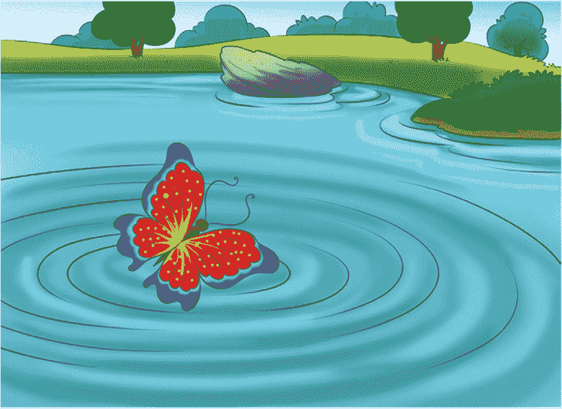
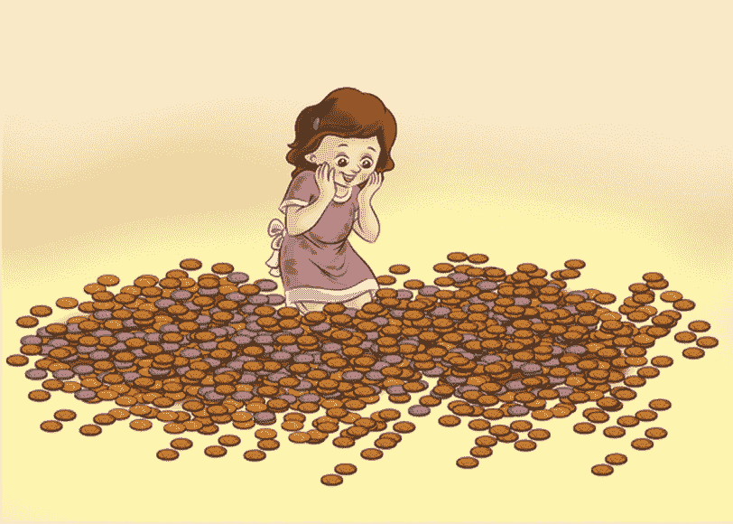
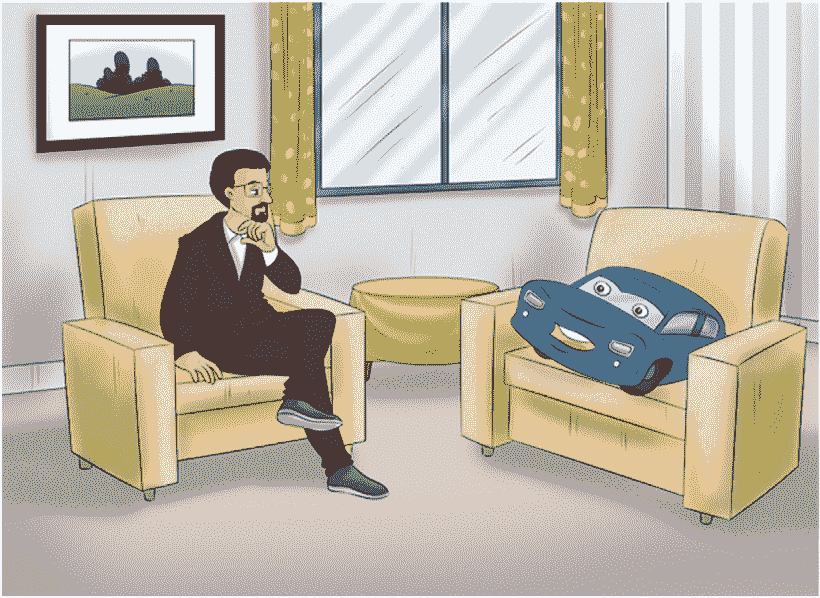
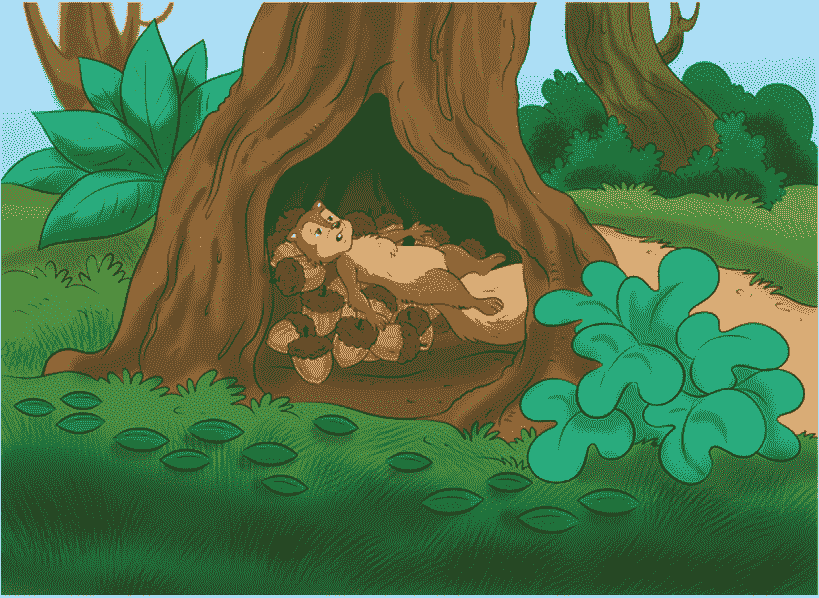
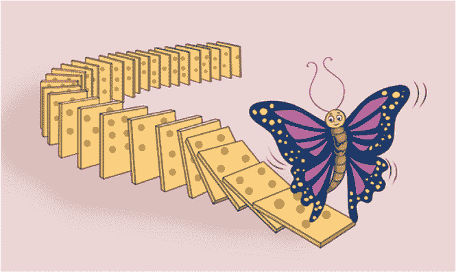

第七章

区块链的蝴蝶效应：如何通过小的、高效的支付累加并产生巨大的不同

*DADA 集体：艾伦·拉米雷斯，哥斯达黎加 / 伊莎·科斯特，意大利，利用区块链技术共同创作，视觉对话.*

生活中的小事

一个善意的随机行为，帮助一个陌生人或者让某人的一天变得更好的无私行为。各种社区，无论线上还是线下，都鼓励小小的善行，无论是自发的还是有计划的。

如果你在谷歌搜索“善意的微小行为”，你会发现很多建议。太多以至于数不过来，也太多以至于做不完。一些列表和很多故事。为什么？答案很简单：小的行为可以产生巨大的影响。我确信你在你的生活中多次体验过微小善行的巨大力量，无论你是否记得。

小的力量不仅仅体现在微小的善举上。暂停一下，想想在你的生活中哪些小小的变化带来了巨大的不同。有多少次你听说过每天三到五分钟的冥想可以改变你的生活，或者每天十五分钟的走路可以延长你的寿命？我们的个人生活中充满了带来巨大差异的小变化。

科学家们给它起了各种各样的名字。物理学颂扬“蝴蝶效应”的力量，强调微小的、初始的行动——比如蝴蝶拍打翅膀——对更大遥远的后果——比如世界另一端的龙卷风——的影响。社会科学家认为“助推”——没有对我们自由的实质性限制的小干预——产生更有利结果的重要性。

*小的力量，初始行动.*

在区块链的背景下，代币——一种私人发行的、通过加密技术保障的、具有货币特性（如可替代、可分割、可携带、耐用和供应有限）的数字资产——是一种灵活、强大的机制，可以推动参与度，释放“蝴蝶效应”的威力。通过将行为和奖励对齐，它有潜力成为捕捉注意力和大规模塑造行为的强大工具，一次微行动一次。

这种行为和奖励的对齐，源于行为心理学，将产生前所未有的影响，因为代币提供高度相关和高度针对性的即时奖励。通过有效地将微行动游戏化，我们可以为更加对齐的社区构建大规模的忠诚度计划，在那里个人和参与者会被助推做正确的事情——生产高质量的产品、采取负责任的社会行动、促进平等等等。

当然，谁将塑造和捕捉大规模的注意力和行为是关键。虽然时间会告诉我们答案，但在未来十年或二十年里，公司、组织、社区、个人、机构和其他利益相关者之间可能会展开一条多向街道。

总之，生活并非社会实验。以这种方式对待你的商业或生活总是适得其反。专注于建立透明社区和生态系统更有可能是可持续的。

无论你称它为“蝴蝶效应”还是其他什么，小的影响力对区块链在商业中的使用具有重大意义和巨大价值。正如我们将看到的，小额金融交易的累积是一个强大的力量。

*小额交易意味着商机*

在商业中，小额支付是指涉及少量资金的金融交易，通常不到一美元，有时甚至是一分钱的几分之一，几乎总是在线进行。例如，$1 至$5 范围内的网站购买铃声、按次付费、下载、电子书和订阅将被视为小额支付。

有些小额支付非常小——甚至只是几分钱！例如，为一个下载支付$0.01 或为一个短信支付$0.025 是小额支付的优秀示例。尽管上限通常是$1，但每家公司都设定了自己的小额支付门槛。例如，PayPal 认为任何低于$10 的交易都是小额支付。

许多企业将小额支付纳入其商业模式，以增加潜在全球观众的兴趣，并最终吸引更多客户。例如，小额支付曾被用来在下载内容时支付知识产权所有者。相对较小的金额，你就可以在任何时候上网下载歌曲、图片或其他内容。1

*区块链非常适合支付和金融应用*

在许多人看来，几分钱和几分之一分钱加起来是一笔可观的金额。

从高层次来看，区块链只是一个记录交易按时间顺序的大表格。在这个过程中，它促进了信任并减少了成本。例如，专注于促进肯尼亚、尼日利亚和乌干达之间商业对商业支付的基于区块链的公司 BitPesa 已将佣金从 9%降至 3%.2

比特币是区块链的第一个应用并非巧合。自 2009 年比特币创建以来，许多人对金融行业的未来进行了理论化。比特币完全是数字化的；与美元、加元、澳元、欧元或日元等法定货币不同，它无法触摸。它还更容易跨国界发送，尤其是大量发送。出于这些原因，与金钱、价值和货币相关的任何事物都可能是区块链技术的自然应用。这就是为什么你会在区块链上看到这么多与金融和银行相关的应用。3

区块链将对建立在促进支付和通常利用银行之上的许多银行模式产生影响。在支付方面，通过消除中介，区块链可以以低于银行收费的费率加速支付。在清算和结算方面，区块链可以几乎实时地减少金融机构之间的交易。对于筹资，区块链可以通过代币的首次发行（ICO）为公司提供即时的资本接入。我们在 2017 年和 2018 年看到了这种机制的力量。

不仅仅是比特币，在支付和银行领域还有其他的区块链应用。对于证券，通过证券的“代币化”，如股票、债券和替代资产，区块链加强了资本市场的基础结构。所有交易记录都通过密码学得到保护，并与之前的交易绑定，在账本中分散给参与者。对于贷款，区块链可以通过消除信贷中介来使借款更加安全，并提供较低的利率。4 还有许多其他的金融区块链应用。例如，Maker 提供去中心化稳定币、抵押贷款和社区治理。5

区块链在金融领域的其他应用仍在涌现。例如，区块链正在国际汇款领域取得突破，为全世界的人们提供了快速、低成本和不受限制的支付罕见机会。几家主要银行已经与 Ripple 合作，6 这是一个基于分布式开源协议的实时大额结算系统、货币兑换和基于区块链的汇款网络协议。Ripple 支持代表法定货币、加密货币、商品和其他价值单位的代币，如常旅客里程或移动分钟，以促进跨境支付。在其他应用中，MoneyGram 和 Western Union 已经宣布与 Ripple 建立合作伙伴关系。通过降低基于区块链的加密货币转移成本，区块链用户可以消除对银行的需求，这样做可以加快交易速度，消除对银行的需求并降低转账成本。7

其他人也在利用区块链的特点来进入国际汇款市场。Stellar，一个用于数字货币至法定货币转移的开源去中心化协议，允许跨境交易。根据其网站，它可用“分之一的便士”。8 也许 Stellar 会以其对小的力量的承诺给你留下深刻印象——如果你发现其他的小善行例子很平凡！Mt. Gox 的创始人、Ripple 的联合创始人 Jed McCaleb 与 Joyce Kim 一起推出了该协议。它得到了 Stellar 发展基金会的大力支持，这是一个 501(c)3 非营利组织。92017 年 12 月，Stellar 宣布与 SureRemit 合作，SureRemit 是一家位于尼日利亚的非现金汇款平台，等等。10

小额支付带来大影响*

所有这些小额交易都可以产生重大影响，根据 Bosun Adebaki（在伯克利区块链的商务顾问）的一份报告。11 近年来，Adebaki 采访的现代微型金融机构向全球新兴经济体的超过 450 万客户发放了总计 7.5 亿美元的微型贷款。

*小的交易可能带来大的翅膀影响*

根据 Adebaki 的发现，现代微型金融机构可以利用手机数据来推断影响贷款偿还的行为信号。他们平均还款率超过 90%，他们的贷款接受率 50%显著高于传统金融机构的贷款接受率。在几分钟内做出贷款决定，现代微型金融机构正在利用算法驱动的方法作为更大金融包容的催化剂。他们正在让数百万未受银行服务的人扩大他们的业务或平滑他们的收入流。12

*区块链上的微型金融和微型贷款是一个真正的机会*

根据 Adebaki 的说法，区块链技术有望促进微型金融的显著增长，并提供有效解决潜在障碍的解决方案。它可以帮助验证借款人的身份，创建共享和可信的信用历史，使敏感数据的共享和维护更加安全，并允许以更便宜、更快的方式将资本流向和从借款人那里流回。根据 Adebaki 的说法，区块链技术面临采用挑战，例如遗留合同和基础设施，以及与技术监管方案早期阶段的不确定性相关的问题，特别是与数据相关。13

例如，BRAVO，由区块链提供支持的微交易应用程序，使用加密货币提供匿名支付。14 BRAVO 的首席执行官 Maria Luna 解释说，

加密货币市场的市值超过 2900 亿美元，但许多用户不知道如何获取硬币，更不用说在哪里花费它们了。尽管对于服务专业人士、艺术家、小商贩以及所有人来说有一个强烈而真实的用例，但现在，许多商店和服务专业人士没有能力或简单的解决方案来接受加密货币。BRAVO 将改变这一点，让任何人可以无缝地用加密货币支付或接收支付——就像我们对待法定货币交易一样。15

Uulala，这是一个由区块链技术驱动的成本效益高的金融服务平台，正在促进和加速无银行和银行不足人群的金融包容性。16 该平台旨在恢复微信贷并利用区块链技术提高透明度、降低利率。平台的去中心化特性消除了中介或中央权威的需要。此外，智能合约简化了贷款的偿还。该公司专注于使数百万无银行和银行不足的拉丁裔能够完成本不可及或负担不起的商业交易。17

当区块链用于微金融和微贷款时，有许多其他例子解决了长期存在的挑战。例如，BanQu，这是第一种区块链经济身份技术，为世界各地生活在极端贫困中的人们创造经济机会，它使用一种专有方法为没有接触过技术或银行的人创建自拍照加虹膜扫描的混合。然后，通过诸如土地权利、选民登记、基于关系的信用档案、健康记录等信息进行增强。BanQu 专注于围绕难民危机、食物、医疗保健、冲突地区的工资发放以及通过侨民资本参与增加社会企业的收入流提供解决方案。18

最终，区块链可以放大和改善微金融和微贷款，帮助那些因为不符合严格的银行标准或因为费用过高而被排除在外的微型、小型和中型企业以及个人。然而，利用区块链的微价值和微交易特性，交易不必是金融性质的。微价值和微交易具有深远的影响。支付和银行只是开始。小规模的力量在交通、艺术、保险、内容创作等众多领域越来越明显。

Micropayments to Help Cars Communicate

不久以前，当我们谈论通信时，我们指的是人际交往。至少，我们是指生物，而不是物体。然而，在连接设备的世界上，我们的物体与其他物体和人有友谊。它们进行通信。越来越多地，技术专家们问自己如何改进物体之间的通信？它们如何能更好地与我们通信？当然，最重要的问题：所有这些没有被听见和感觉被误解的物体的治疗成本会是多少？！最后一个问题是个玩笑，以防你是一个字面意思的读者！

*所有未被听见和感觉被误解的连接对象的治疗成本会是多少？！*

Oaken Innovations19 是一家致力于提高汽车之间通信的公司，在过程中，它努力解决诸如道路拥堵等重要问题。Oaken 使用微支付，正在建立一个去中心化的平台，让汽车之间协商彼此之间的距离，减少城市拥堵。

首先，Oaken 开发了一个基于区块链的自动化收费公路系统，与连接的汽车配合使用。该解决方案通过使用基于区块链的物联网应用程序来自动化车辆的收费公路支付，消除了对支付处理器和昂贵的云基础设施的需要。该项目在整个“阿联酋国际区块链编程马拉松”中获得了最高荣誉。20

然后，在 2017 年初，Oaken 在纽约推出了其概念验证，名为*在共识的区块链启用点对点汽车链接应用*。这个应用程序允许消费者使用以太坊区块链上的智能合约从车主那里租用一辆车。结合其他技术，该应用程序允许你租用并控制对车辆的访问。该平台为移动能力（可供租用的汽车）提供了一个无处不在的数据存储，跨越所有生产商，而无需像 Uber 和 Lyft 这样的中介。21

连接的汽车和传感器已经彼此通信。它们所没有的是进行交易和支付彼此提供服务的货币。换句话说，它们的通信缺乏金融组件。

微支付给汽车提供了分享数据的激励。例如，它们可以分享关于路面坑洞、道路拥堵或路上障碍物的信息。有了支付或任何价值的交换，汽车与其他物体之间的通信变得更加有趣和有意义。

就像赚取真实货币，你可以用它来购买产品和服务的乐趣，而不是，比如说，没有实际价值的 Monopoly 货币，游戏之外没有实际价值，能够交换价值，而不仅仅是通讯，的汽车可以解决现实问题，更有意义地做出贡献。通过微价值，我们可以激励司机在高峰时段避免某些道路，采取替代路线，报告碎片和坑洞，绘制新道路，等等。

小物品的价值并不仅限于金钱！任何有价值的东西都可以被分割。在这个过程中，物体获得了新的属性。这解锁了管理传统资产的新方法。

通过微支付改善内容创作和分发

最后，微支付不是一个新概念。但区块链可能使其更具实用性。实际上，由区块链驱动的微支付可能会导致完全不同的商业模式。例如，区块链提供了非常低廉的内容购买方式，比如支付阅读一篇新闻文章、播放一首单曲、或购买一个艺术片段或图片，交易成本接近于零。收取少量费用，你可能会从广告赞助的内容过渡到付费广告内容。通过更精确的版权跟踪、消除各种中介以及额外的安全层次，区块链可能允许消费者和使用者支付几美分的高级内容，而不是统一的月度订阅费用。22

《积少成多。》

例如，柯达的 KODAKOne，它在一个数字账本中跟踪拥有各种图片权利的人，为摄影师提供了对他们作品的更大控制权。目标是让创作者能够自动快速地收到内容使用的付款，并解决广泛的内容盗版问题。23

fractional ownership: 一幅杰作和优质地产触手可及

《虽然你可能买不起整个田野，但你可以买一朵花。》

《历史的一页或杰作》

你是否曾经想象过，在一个慵懒的周日下午，爬上你祖母的阁楼，偶然发现一份美国宪法的第一版印刷本，或者是一幅失落已久的梵高原作？在我这种情况，这个梦想根本不可能成为现实。我所有的祖父母都住在没有阁楼的公寓 complex 里。而且我的家庭搬了很多次家，以至于，如果家里曾经有任何有价值或历史意义的东西，它早就被别人发现并卖掉了。也就是这样，我放弃了拥有一份美国宪法第一版印刷本或一幅失落的原版梵高的所有希望。

Eve Sussman 是 Snark.art 的艺术家之一，24 一个位于布鲁克林的艺术和技术实验室，探讨区块链如何释放艺术创造力。有一天，Eve，一个从事电影、视频和装置工作的艺术家，想知道当很多人拥有一件艺术作品的一部分会发生什么。她拍摄了一个名为《89 Seconds at Alcázar》的视频作品，重现了迪亚哥·委拉斯开兹 1656 年的著名画作《拉斯·梅尼拉斯》，这幅杰作现在挂在马德里的普拉多博物馆。

然后她将基于以太坊的原始视频分成 2304 个独特的正方形，在区块链上创作了一幅新的艺术品。她允许收藏家购买个体独特的区块。《89 Seconds at Alcázar》被 Whitney Museum、现代艺术博物馆和首尔的李博物馆等收藏。正如白皮书所说，“基于区块链的艺术品 89 秒 Atomized 可以由一群新所有者收藏，他们可以随意重新组合完整的视频。”Eve 的实验是分数所有制的例子，这是一种由区块链支持的迷人概念，将挑战我们许多现有的所有权和资产模式。

每个正方形都作为数字代币（“原子”）注册在以太坊区块链上。它不能被复制，但可以自由交易或出售。它以随机价格 120 美元出售。购买者会在以太坊区块链（ERC-721）上收到一个原子。每个原子都包含一个完整的 10 分钟 20×20 像素视频，可以在 Snark.art 上观看并存储在数字钱包中。收藏家可以将原子借出，或从社区请求借款，用于公共和私人放映。收藏家还可以购买或出售个体原子，每个都是独立的艺术品。

这种方法让很多人拥有了 Eve 作品的一部分。它也成为了所有权和集体互动的社会实验。Eve 的艺术作品可以由收藏家社区随意重新组装和放映。那么，如果一些购买者不想展示他们的独特区块，或者错过了这样做的通知怎么办？

此时，没有权限的独特区块不会显示，而是出现一个黑色正方形。这显然推动了对拥有某物的集体意义边界的探讨。每个所有者对作品展示方式应该有什么影响？她应该有权选择*不*展示它吗？能够做出这种选择是艺术品动态性质的一部分吗？能够每次以不同的方式体验同一件艺术品是区块链艺术体验的核心部分吗？

此外，Eve 的艺术作品证明，创建具有数字稀缺属性的独特数字艺术品是可能的。在这个过程中，她让我们离拥有美国宪法的第一版或者那丢失已久的梵高原作更近了一步，一次一个像素。

理想位置的房地产就在你触手可及的范围之内，至少部分如此

同样，基于区块链的智能合同代币化在房地产领域允许创建部分，或“碎片化”的独特数字所有权利益。具体来说，房地产所有者可以向投资者发行这样的碎片化代币，按比例向每个代币持有者分配利润，并赋予代币持有者在公司决策中的投票权。

这使得代币所有者可以在二级市场上交易代币，这显著增加了房地产资产类别的流动性。当然，这种所有权方式是新颖的，可能会经历一段时间的动荡。在未来几年里，许多法律和商业头脑将围绕碎片化所有权发展新的概念和框架。

微保险：确保小风险至关重要

蝴蝶效应可以跨不同行业进行扩展。

当你成长的时候，如果你的母亲像我的母亲一样，她可能告诉你不要和陌生人说话，更不要搭陌生人的车。时代已经改变了。今天你可能经常在网上和陌生人交谈，乘坐优步和莱弗特与陌生人一起出行，通过爱彼迎住在陌生人的房子和公寓里。所以你依赖陌生人来减轻你生活中的风险是很合理的。

为低收入和传统被排除在外的人群提供保险

进入微保险的世界，这不是一个新概念，它有许多含义。微保险的一个意义在于保护低收入人群免受灾害的侵害，代价是他们支付的保费与风险的可能性和成本成比例。它就像常规保险，但重点是低收入人群或被主流保险忽视的人。它可以通过许多方式提供，包括小型的社区基础计划、各种传统的微型金融机构，如信用合作社，等等。区块链也为这个问题提供了解决方案。

保证.ai25 正在使用区块链和人工智能后端确保最大程度的安全和隐私，并向亚洲的无银行账户人群提供微保险。通过聊天机器人、社交、移动和网络，它允许保险商和金融顾问有效地与客户连接，并提供健康、意外、财产和农业微保险。26 同样，Hearti27 允许保险公司通过提供亚洲地区的即时和负担得起的微保险，与客户建立联系。

同行评审使微保险更进一步

其他公司正在将区块链微保险功能与区块链点对点功能相结合。Nexus Mutual,28 建立在以太坊区块链之上并使用以太坊智能合约,29 帮助人们将风险分散到更大的社区。它允许来自世界各地的人们分享保险风险，从而实际上消除了对保险公司的需要。

Nexus Mutual 的目标是降低保险成本，并取代更成熟的保险公司。正如 Nexus Mutual 的创始人 Hugh Karp 在的一次采访中解释的那样，

我们主要使用区块链确保资金池不受任何单一控制。相反，资金由智能合约持有，这意味着只有在特定条件下才能使用资金。30

其他人，如 iXLedger，iX Technology Group 的技术开发部门,31 和 Teambrella32 使用区块链消除中介，降低成本，并转向点对点模型。

结论

正如我们所见，区块链利用小额支付的力量是其最大的资产之一。通过使快速、小额的支付变得简单高效，区块链为所有行业解锁了一个充满可能性的世界。从微保险到物与物之间的通信，小额支付承诺通过消除不必要的支付——甚至可能是我们行驶的道路上的坑洞信息传播，来平滑低效环节。沟通不畅和风险是生活的固有部分；但有了区块链，随着基于使用或基于结果的业务模型的演变，资产得到优化，产品变得像服务一样，它们将变得更加代价不高。

*DADA Collective：Boris Toledo，智利 / Daveed，美国，利用区块链技术共同创作的视觉对话。*

_________

1L. Faulk. 2018. “The History of Micropayments.” [`medium.com/@llofa/the-history-of-micropayments-e49adc495a85`](https://medium.com/@llofa/the-history-of-micropayments-e49adc495a85).

2A. Sergeenkov. 2018. “How Blockchain Is Changing Money Transfers.” [`hackernoon.com/how-blockchain-is-changing-money-transfers-e9cb85e94932`](https://hackernoon.com/how-blockchain-is-changing-money-transfers-e9cb85e94932).

3J. Pritchard and K. Khartit. 2020. “How Blockchain Is Changing Banking and Financial Services.” [`www.thebalance.com/how-blockchain-is-changing-banking-and-financial-services-4174354`](https://www.thebalance.com/how-blockchain-is-changing-banking-and-financial-services-4174354).

4Sergeenkov. “How Blockchain Is Changing Money Transfers.”

5 有关 Maker 的更多信息，请访问[`makerdao.com/`](https://makerdao.com/)。

6 有关 Ripple 的更多信息可在[`www.ripple.com/`](https://www.ripple.com/)找到。

7 有关 Stellar 的更多信息可在[`www.stellar.org/`](https://www.stellar.org/)找到。

9M.J. Casey 和 P. Vigna。2014。“Mt. Gox，Ripple 创始人公布 Stellar，一个新的数字货币项目。”[`blogs.wsj.com/moneybeat/2014/07/31/mt-gox-ripple-founder-unveils-stellar-a-new-digital-currency-project/`](https://blogs.wsj.com/moneybeat/2014/07/31/mt-gox-ripple-founder-unveils-stellar-a-new-digital-currency-project/)。

10J. Bright。2017。“非洲的 SureRemit 加入了全球汇款市场的代币化竞争，”*TechCrunch*。[`techcrunch.com/2017/12/11/africas-sureremit-joins-the-tokenized-race-to-win-the-global-remittance-market/`](https://techcrunch.com/2017/12/11/africas-sureremit-joins-the-tokenized-race-to-win-the-global-remittance-market/)（访问于 2018 年 8 月 28 日）。

11B. Adebaki。2019。“微金融与替代数据遇见区块链世界。”[`medium.com/blockchain-at-berkeley/microfinance-and-alternative-data-meets-the-world-of-blockchain-9aa7f8e39239`](https://medium.com/blockchain-at-berkeley/microfinance-and-alternative-data-meets-the-world-of-blockchain-9aa7f8e39239)。

12 同上。

13 同上。

14Sergeenkov。“区块链如何改变货币转账。”

15 同上。

16 有关 Uulala 的更多信息可在[`uulala.io/`](https://uulala.io/)找到。

17M. Loughran。2018。“区块链在微金融中的力量。”[`medium.com/uulala/the-power-of-blockchain-for-microfinance-139c4e7029af`](https://medium.com/uulala/the-power-of-blockchain-for-microfinance-139c4e7029af)。

18 有关 BanQu 的更多信息可在[`banqu.co/`](https://banqu.co/)找到。

19 有关 Oaken Innovations 的更多信息可在[`www.oakeninnovations.com/`](https://www.oakeninnovations.com/)找到。

20R. Ahmed. 208\. “Oaken Innovations: 基于区块链的车辆未来.” [`blog.bankofhodlers.com/oaken-innovations-the-blockchain-powered-vehicle-future/`](https://blog.bankofhodlers.com/oaken-innovations-the-blockchain-powered-vehicle-future/). 还可见[`www.oakeninnovations.com`](https://www.oakeninnovations.com), [`devpost.com/software/project-vento`](https://devpost.com/software/project-vento).

21 同上。

22T. Jenks. 2018\. “区块链可能颠覆媒体产业的五种方式.” [`www.verypossible.com/blog/five-ways-blockchain-could-disrupt-the-media-industry`](https://www.verypossible.com/blog/five-ways-blockchain-could-disrupt-the-media-industry).

23C.R. Harvey, C. Moorman and M. Toledo. 2018\. “区块链如何帮助营销人员与客户建立更好的关系.” `hbr.

[24`关于 Snark.art 的更多信息可在[`snark.art/`](https://snark.art/).

25 关于 Surety.ai 的更多信息可在[`hearti.io/`](https://hearti.io/)获取。

26K. Lim. 2019\. “微型保险是东南亚金融包容性的关键.” [`e27.co/microinsurance-is-key-to-southeast-asian-financial-inclusion-20190204/`](https://e27.co/microinsurance-is-key-to-southeast-asian-financial-inclusion-20190204/).

27 关于 Hearti 的更多信息可在[`hearti.io/`](https://hearti.io/)获取。

28 关于 Nexus Mutual 的更多信息可在[`www.nexusmutual.io/`](https://www.nexusmutual.io/)获取。

29[`github.com/somish/NexusMutual`](https://github.com/somish/NexusMutual).

30E. Picco. 2019\. “区块链在保险业的使用案例#5：Nexus Mutual.” [`www.disruptordaily.com/blockchain-insurance-use-case-nexus-mutual/`](https://www.disruptordaily.com/blockchain-insurance-use-case-nexus-mutual/).

31 关于 iXLedger 的更多信息可在[`ixtechnology.com/ixledger/`](https://ixtechnology.com/ixledger/).

32 关于 Teambrella 的更多信息可在[`cryptoslate.com/coins/teambrella/`](https://cryptoslate.com/coins/teambrella/).
