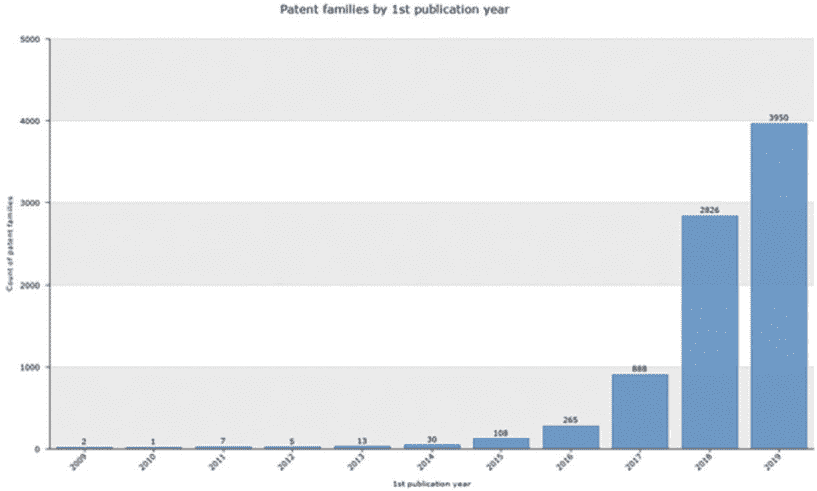
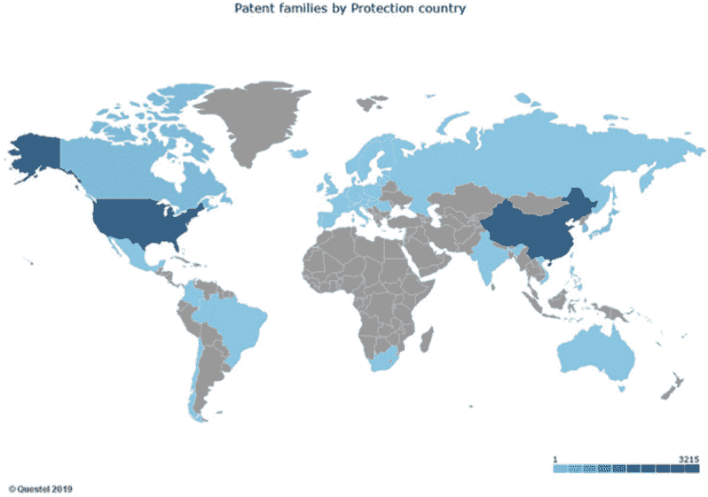
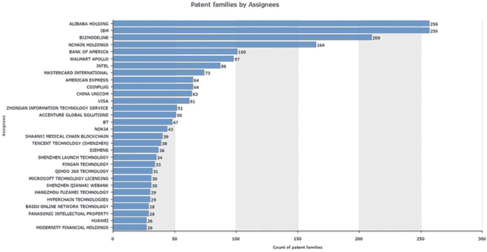
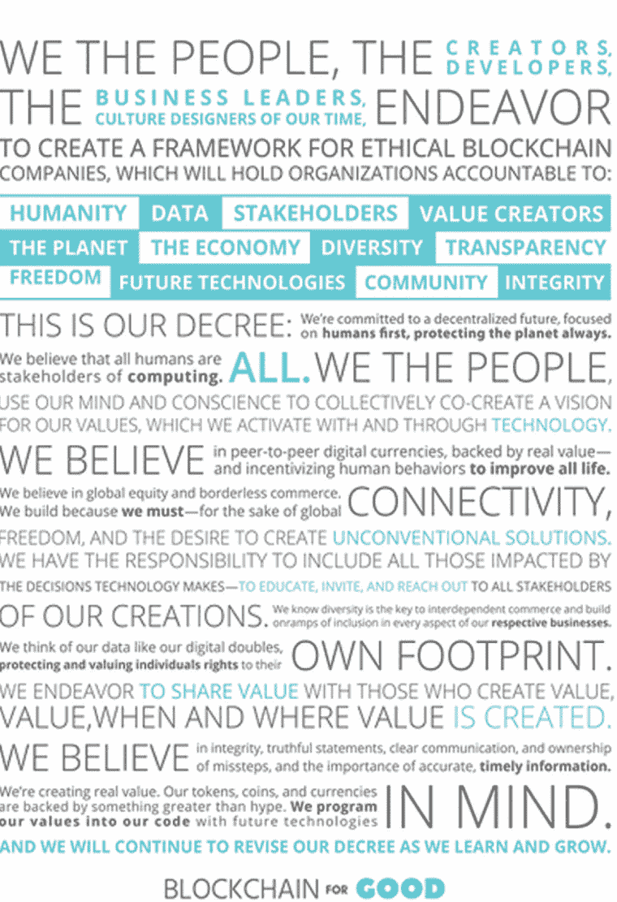

结论

*DADA 集体：Simon Wairiuko，肯尼亚/Serste，意大利/Boris Toledo Doorm，智利，使用区块链技术共同创作，视觉对话。*

区块链的未来

“区块链的未来是什么？” 当我和各种背景的专业人士交谈时，这个问题经常出现。显然，现在还没有正确的答案……。随着一项技术创新速度如此之快并且不断演变，没有办法知道未来会怎样。

*需要采用*

根据领先商业分析公司 Gartner 的数据，区块链在其平台上的搜索量非常高。然而，该公司最近的一项调查发现，企业中实际的区块链部署数量很少。只有 1%的首席信息官表示他们在组织内采用了区块链，只有 8%的人表示他们正在进行短期规划或积极实验。此外，77%的人表示他们没有进一步调查的计划。

所以，看来人们很好奇，但不足以接受这项技术。基于这种环境，有些人认为现在的兴趣可能太低，不足以证明现在进行重大的区块链投资是合理的。1

尽管如此，Gartner 预测，到 2025 年，区块链为业务带来的价值将增长至略高于 1760 亿美元。虽然这个数字本身很大，但它预测在未来几年将大幅增长，到 2030 年将超过 3.1 万亿美元。

为了确保区块链的广泛采用，企业需要清楚地知道他们如何使其盈利。具体来说，他们需要在两个方面进行阐述：第一，区块链带来的现有解决方案所不具备的价值；第二，如何通过一个有利可图和可持续的商业模型捕捉这种价值。2

*区块链专利申请趋势*

预测一项技术未来的另一种方法是审视专利申请的趋势。这就像怀孕期间的超声波：你可以在东西问世之前瞥见正在发展中的东西。瑞蒙律师事务所的合伙人马克·考夫曼认为，专利申请的六个趋势可能会照亮区块链前进的道路。3

区块链专利变得越来越普遍。在采用这项技术的人中，许多人认为，出于各种原因，他们将 generally immune to 专利风险与这项技术有关。考夫曼警告说，这种假设是错误的，而且与区块链技术合作可能就像在专利的雷区中行走。据他介绍，“很多方面正在提交大量的专利申请，以涵盖区块链技术的许多方面。”

区块链相关专利的增长速度呈指数级。考夫曼解释说：“有些方面，尤其是在早期，故意没有寻求专利。”

例如，谁是中本聪（Satoshi）尚不明确，但他从未为比特币申请专利。大约在 2013 年或 2014 年左右，当这项技术真正开始蓬勃发展时，情况开始改变。一开始，我们开始看到少量的申请。但从那时起，全球专利出版物的数量就真正开始增加了。2018 年，我们看到全球出版了超过 2800 个新的专利族。根据保守的预测，我们将在 2019 年看到与区块链技术相关的 4600 个新的专利族出版。自 2013 年以来，我们已经观察到区块链专利申请的几乎呈指数增长。我认为在不久的将来它不会放缓。

*根据马克·考夫曼准备的一项研究。2009 年至 2019 年 9 月间每年出版的专利族数量。*

美国和中国正在引领区块链专利申请的趋势。“我们看到世界各主要市场都有区块链专利申请，但尤其是在美国和中国。我们还看到越来越多的专利在澳大利亚、一些欧洲国家、印度、巴西以及其他一些国家提交，”考夫曼解释道。“公司最感兴趣的是在他们认为会有庞大市场和/或他们将在那里找到友好或至少是可预测的监管框架的地方提交申请，因为他们认为他们的竞争对手很快也会在那里设立业务。”

根据考夫曼的说法，

在瑞士、马耳他、香港、日本、新加坡和开曼群岛都可以看到专利申请和相应的注册。我们已经看到了引人注目的商业应用。保护收入是很有道理的。这与许多其他技术，如网络技术、移动网络和半导体的发展周期相同。这可能是专利申请数量呈 5 至 15 年曲线上升的开始。我们只是看到了这一趋势的开端。

*基于马克·卡夫曼准备的一项研究。显示专利家族最初提交的位置。深蓝色表示专利发布量更多。*

区块链似乎吸引了来自不同行业的不太可能的竞争对手。卡夫曼观察到：“我们看到 IBM、安永、美国银行、沃尔玛、阿里巴巴、微软、万事达卡等公司都提交了区块链专利申请。”这些公司在传统上并不在同一行业竞争。在哪里还能看到这些公司并列在一起呢？卡夫曼预测这种新竞争对手出现的趋势可能会持续。

*基于马克·卡夫曼准备的一项研究。区块链专利所有者以及每个所有者拥有的专利家族数量。*

三年前，专利申请量排名前 20 的机构主要由研究和学术机构组成。现在，排名前 20 的机构大多是商业机构。Kaufman 表示，“我们可能会看到越来越多的公司为了盈利目的而申请专利。”这是一个明确的指标，表明区块链技术被广泛认为具有商业价值且潜在利润丰厚。他解释道，

对于大多数技术，你在早期阶段看到的是大学和其它研究机构进行了大部分的开发工作。这当然适用于互联网。但随着技术的发展，公司越来越多地提交专利申请作为其商业化努力的一部分。这似乎是区块链技术目前所处的阶段，并且可预见的未来也将是如此。

*基于 Marc Kaufman 准备的研究。区块链专利所有者按照顶级技术类别进行了绘图。点越大，该类别的专利越多*

当前专利申请的主要关注领域包括认证、支付、安全、共识和智能合约。主要的申请者倾向于在大多数，如果不是全部，这些领域提交申请。

我们看到在认证、支付、安全、共识机制和智能合约方面有很多专利申请。在过去五年里，我们在认证、支付和安全方面的专利申请已经很多了。其他的——关于共识和智能合约——则是最近才出现的，

Kaufman 观察到，公司倾向于在广泛的科技领域申请专利。这是一种早期阶段技术的典型特征，当创新发生在该技术广泛的应用和方面时。

*水晶球时刻：区块链将持续存在*

*区块链将持续存在！*

正如本书中的例子所证明的，在你阅读这些文字的时候，许多不同的行业正在被区块链改变。举几个例子，金融和银行、对冲基金、投票、广告、教育、物联网（IoT）、体育、慈善、游戏、农业、赌博、执法、出版、房地产、身份、能源、保险、音乐、供应链、政府、医疗保健、制药等行业都在尝试区块链技术，并测试它如何加强他们的使命或底线。4 在各个行业中，我们共同学习这项新工具所能实现的一切。

然而，关于区块链平台的问题依然存在。具体来说，哪一个将会成为领先的选择？会是 Hyperledger、Ethereum，还是第三个——有可能它甚至还没有被开发出来？

当然，这个问题的基本假设是将会有一个统一的平台，所有用户都在这个平台上进行构建。这种融合是互联网增长的故事——所有应用和服务都是建立在这个平台上——在某种程度上，这也是现代技术繁荣的故事。

但如果区块链发展得更像一个群岛，而不像一个岛屿——拥有多个用于不同目的的区块链呢？每个行业、项目和目标都可能拥有自己的平台。那么，在决定在哪里构建你的应用程序时，你将会有真正的选择。但重要的是，这些区块链岛屿之间的互操作性和连通性将成为关键，并且必须克服的一个首要难题。

越来越明显，区块链是一个非常强大的工具。但这就是它所是的：一个工具。它不是一个学科，也不是一个产品。也就是说，不会从主要的 STEM 机构中出现区块链专业。传统的学科，如法律、工程、医学和经济学，将会持续存在。主要行业，如音乐、医疗保健和房地产，也将持续存在。这些学科和行业将受到区块链的严重影响，反之亦然——但它们将协同工作，不会被取代。

*挑战的海洋（又名，一些非常勇敢的灵魂的惊人机会）*

在这个阶段，说区块链有挑战简直是轻描淡写。即将到来的困难不应被忽视或低估。

*成长的痛苦是真实的*

首先，现在还为时过早，非常早。1995 年，作为一名高中生，我第一次听说“网络”这个词，但没有人能向我解释它是什么，更不用说它将如何改变我的生活，并成为生活的几乎每个方面的必需品。但到了 2000 年，当互联网成为最热门的趋势，而我是一名在寻找分散注意力的大学生的时侯，我在加州大学伯克利分校的图书馆花了几分钟下载了一些有趣的猫照片。现在，仅仅 15 年后，我的生活肯定是不完整的——而且没有互联网很可能是不可能的。事实上，当我在每天早上乘火车去旧金山的海湾大桥时，我的视频流媒体慢了几秒钟，我会感到非常沮丧。

像我 1995 年一样，尽管许多人听说过区块链，并在上面读过一两篇文章，但大多数人仍然无法真正理解它是什么，或者没有它他们的生活将是不完整的。虽然创新正在以惊人的速度发展，但这种复杂技术的益处仍然过于抽象，远离普通大众。总之，现在仍然是初期。你并没有错过游戏。事实上，现在正是参与的最佳时机。

*区块链是一种非常复杂的科技*

其次，这项技术在技术上很复杂。如果你在谷歌上搜索“什么是区块链”，你会发现大量的视频和文章，讨论账本、密码学、去中心化、智能合约和其他许多你从未听说过的抽象概念。理解它可能需要一些时间。

但是有好消息！就像我们每天使用的任何技术一样，您不需要理解区块链背后的技术细节，就可以欣赏区块链的许多应用和好处。我们享受电力带来的好处，而不必了解基本的物理和讨论电子，同样可以享受区块链的好处，而无需了解密码学或深入了解账本。

*区块链过山车：从 FOMO 到 FUD*

第三，区块链领域的价格和炒作波动令人震惊，让大多数普通人感到恐惧。在“害怕错过”（FOMO）和“恐惧、不确定和怀疑”（FUD）之间的过山车之旅，并不是每个人的茶。例如，2017 年，我们见证了一个币种上涨到 20,000 美元！现在，它今天是多少？那只是一个 fraction。区块链的炒作周期不是胆小者的游戏，我们很可能很快就会再经历至少几次。然而，明天最强大的公司正在今天被建立。这就是为什么现在参与是时候。

*数十个监管者和更多*

第四，监管挑战与技术本身一样复杂。从美国证券交易委员会（SEC）到美国国家税务局（IRS），每个人都对区块链有自己的看法，并希望根据自己的想法对其进行监管。挑战在于，大多数监管机构并不了解这项技术，也跟不上其发展。作为我的工作的一部分，我与许多州级和联邦级的立法者和监管者交谈过，从这些对话中我得出了两个结论。第一，监管者可能需要一段时间才能感到舒适和清晰，我们才能自由交易数字资产。第二，将会有一个由多个监管机构和立法组成的网络，涉及所有与区块链相关的事务。

*缺失的伦理代码*

第五，区块链行业的道德问题和纯粹的非法行为比比皆是，幸运的是这两种情况都在减少。欺诈行为一直存在。没有联邦存款保险公司（FDIC）。过去几年中一直有报道称，比特币被用于非法或不当活动，或者数百万美元莫名其妙地蒸发，即使是法医会计师也追踪不到。这对大多数人来说是一个巨大的劣势！

许多学者和其他专业人士已经提出了适用于区块链的伦理框架。例如，卡拉·拉波 inte 提出了《区块链社会影响伦理设计框架》，以“确保社会价值得到保护。”5

切尔西·鲁斯特伦（Chelsea Rustrum）6，最初写了一本关于共享经济（[shareablelife.com](http://www.shareablelife.com)）的书，并围绕协作、旅行和企业家精神发展了理论，很早就涉足了区块链。她也是认为我们在使用区块链时需要更加关注伦理的另一个人。她从优先考虑访问权而非所有权，演变为需要共享所有权和在各价值创造者之间分配价值。

她还看到，区块链技术有潜力成为物联网、虚拟现实/增强现实、传感器、人工智能和机器人等新兴技术之间的连接层。我们对技术的编程将对计算的所有利益相关者产生深远的影响，这包括这个星球上的每一个人。运行我们世界的技术必须以我们现在和未来想要看到的人文和生态价值观来编程，所以需要在这些领域进行深思熟虑的对话、考虑和辩论。区块链用于善行正在领导这一努力。

鲁斯特姆提出了区块链道德准则 7。她解释道，

我现在已经在区块链道德准则上工作了一年左右，也许稍微有点长。我起始于一份 60 页的研究文档，然后创建了一系列伦理和伦理领域，可以说是一些主题领域。现在有 12 个主题领域和 50 项预先写好的伦理，可以进行讨论。它们来自各种各样的来源。它们现在在液态民主平台上讨论和评论。

当然，区块链还有很多其他问题。安全性、隐私性、糟糕的设计、可扩展性和互操作性只是其他几个明显的挑战。

区块链**道德准则宣言**。

你的区块链战略是什么？连接区块链愿景与现实

2018 年，普华永道对 600 名高管进行了调查，得出结论：

• 84%的受访者正积极参与区块链

• 45%的人认为信任可能会延迟采用

• 28%的人认为系统的互操作性是成功的关键。8

此外，德勤的一项调查结论是：“我们认为，组织在当前关于区块链方面唯一真正的错误是不采取任何行动。”9

关于区块链可能的讨论非常吸引人且令人兴奋。但现在，这只是讨论；我们如何让它变成现实？我们如何构建有用的区块链应用程序？

客户的问题引导创新。

所有的创新，包括区块链，都必须设计来解决问题。人们不需要知道你的方法。客户有很多需求——功能性、价格、效率、透明度、便利性、兼容性、体验、设计、可靠性性能、控制、选项、信息、可访问性，还有许多其他的需求——需要得到解决。到最后，客户购买的是一个解决方案，而不是一种技术。这就是为什么所有成功的公司都是从问题开始的。不要从区块链解决方案开始，然后寻找问题。区块链可能解决也可能不解决你识别出的问题。

实际上，你可能需要将区块链与其他技术、系统和工作流程结合在一起，以解决你最初发现的问题。记住，区块链是一种后台技术。当它运行时，你看不到它。相关地，当区块链与其他技术，如人工智能、优质数据和物联网结合在一起时，它变得更加有趣。它与现有的技术，如智能手机很好地融合。所以，你试图解决的问题的关键解决方案可能需要多种技术的组合。

最后，了解你的客户和他们的痛苦是关键。这就是为什么团队中的每个人都与客户交谈如此重要的原因。这样，伟大的想法可以来自许多人，而不仅仅是少数人。你的整个团队可以推动创新，因为不同的人可以以不同的方式听到和解释客户反馈。

*通过试点和合作来学习*

然后，进行试点以学习。记住：这项技术非常复杂。专家非常少，当然没有拥有几十年经验的人。大家都在一起学习。学习的唯一方式就是通过实践。这就是为什么进行实验、试点和设计概念验证如此重要的原因。为了学习并参与对话。这就是你如何保持在这场游戏中的原因。

虽然创新有时来自于内部的研究与开发努力，但大型企业会找到其他方法。大型公司可以进行合作、投资或收购，等等许多其他选择。大型企业可以利用其资源和网络以许多方式进行学习。

内部进行试点的原因之一是为了发展和稳定一个伟大的想法。在这个过程中你会学到很多。例如，你可以开始弄清楚它如何在你的行业、你的业务或你的客户试图解决的问题的背景下应用。如果你正在谈判下一个合作伙伴关系或投资，你不想是桌子上的最愚蠢的人。这就是你从试点和概念验证中学习的原因。

企业间和初创企业间有众多的合作激励。前者带来资源、经验和行业联系。后者带来冒险、创造力、前沿技术和创新速度。如果做得好，合作可以带来惊人的成果。

区块链本质上是一项团队合作，对实现网络效应的人来说可能有巨大的好处。这就是为什么我们看到行业中有如此多的合作。例如，Hyperledger 有超过 250 个成员。11

*区块链是定制的，而非开箱即用的神奇解决方案*

尽管许多公司对区块链抱有误解，认为它是一种开箱即用的神奇疗法，但区块链仍然是一项新兴技术。我们还有很长的路要走。目前，大多数区块链解决方案都是定制的，而非标准的。这意味着它们需要时间和资源来开发和实施。

那么，你为什么现在要参与区块链呢？原因很简单。如果你不亲自尝试，你就错过了学习的机会。你不会知道这项技术能为你做什么，以及它对你的组织意味着什么，无论是从威胁还是机遇的角度。是的，易于实施、预算友好、广泛可用、质量经过验证、快速部署、无需技术经验、开箱即用的解决方案即将到来。我们只是还没有到达那个阶段。

**从先前的技术学习**

学习并不仅仅来自对当前区块链技术的实验。你也可以从过去的技术，比如互联网，学到东西。就像互联网的头十年一样，如果你看看区块链的格局，你会注意到很多公司都在关注基础设施。我们一直在建立挖矿公司、货币、交易所和协议。

如果你回顾互联网，你会发现，在头十年之后，我们在接下来的 10 到 20 年里建立了像 Facebook 和 Amazon 这样的公司——这些公司与头十年看到的，如微软和 AOL，非常不同。同样，在接下来的 10 到 20 年里，我们可能会建立产品和服务，而不仅仅是基础设施。在书籍中，你只是看到了未来的冰山一角。

**培养全球忠诚用户和开发者的社区**

社区是任何与区块链相关事物的关键组成部分，部分原因是因为网络效应对任何项目或应用的成功都至关重要。它有助于将偶然的追随者转变为狂热的粉丝，从而推动你的项目向前发展。然而，社区与客户是不同的。虽然社区成员中有些人也可以是客户，但并非必须如此。需要仔细招募和引导社区成员。

围绕一个吸引人的目标和使命团结起来是一个很好的开始。创建持久的传统和定期的节奏可能有助于管理社区的期望和基础标准。例如，在 Twitter 或 Reddit 上每周、每月或每季度举行一次“问我任何事”（AMA）的虚拟会议并不罕见。创建一个一致的社区文化和使用先进的工具都是必不可少的。

同样，在企业方面，你有基于联盟的区块链技术，这其实只是另一个社区。在基于联盟的模式中，几个成员，通常包括创始成员，要求其他成员加入。这种模式往往具有挑战性，因为达成不同利益相关者之间的共识，甚至可能是竞争对手，从来都不是一件容易的事。经常会出现问题，例如谁有权限和访问？如何添加新成员？如何移除违反协议的成员？使事情变得具有政治性。

有很多法律要求与技术无关。你还必须证明追求这种新模型的价值——回答那个让人困扰的问题“这对我有何利益？”——这并不总是容易的。

同样，创建一个广泛的开发者社区非常重要。虽然困难，但招募最佳的技术人员和开发者至关重要。您需要展示您正在构建的技术的开放性和实用性，然后让开发者容易且诱人地参与其中。

_________

1R. van der Meulen。2017 年。“新兴区块链服务市场的快照。[`www.gartner.com/smarterwithgartner/a-snapshot-of-an-emerging-blockchain-services-market/`](https://www.gartner.com/smarterwithgartner/a-snapshot-of-an-emerging-blockchain-services-market/)

2M. Helfman。2019 年。“为什么企业不采用区块链。”[`medium.com/altcoin-magazine/why-businesses-arent-adopting-blockchain-1ee9c7af7cda`](https://medium.com/altcoin-magazine/why-businesses-arent-adopting-blockchain-1ee9c7af7cda)。

3M. Kaufman。与作者的讨论。2019 年。

4“银行只是开始：区块链可能改建的 55 个大行业。”2019 年。[`www.cbinsights.com/research/industries-disrupted-blockchain/`](https://www.cbinsights.com/research/industries-disrupted-blockchain/) 还见 B. Marr。2018 年。“以下是 10 个可能被区块链破坏的行业。”[`www.forbes.com/sites/bernardmarr/2018/07/16/here-are-10-industries-blockchain-is-likely-to-disrupt/#454a6446b5a2`](https://www.forbes.com/sites/bernardmarr/2018/07/16/here-are-10-industries-blockchain-is-likely-to-disrupt/#454a6446b5a2); J. White。2018 年。“9 个很快就会被区块链破坏的行业。”[`www.inc.com/john-white/9-industries-that-will-soon-be-disrupted-by-blockchain.html`](https://www.inc.com/john-white/9-industries-that-will-soon-be-disrupted-by-blockchain.html)。

5 更多关于 C. LaPointe 的信息，2018 年。“区块链道德设计框架对社会影响的研究。[`beeckcenter.georgetown.edu/blockchain-ethical-design-framework-social-impact/`](https://beeckcenter.georgetown.edu/blockchain-ethical-design-framework-social-impact/)

6C. Rustrum。与作者的讨论。2019 年。

7 有关区块链职业道德的更多信息，请访问[`blockchaincodeofethics.com/`](http://blockchaincodeofethics.com/)。

8PWC。“区块链已经到来。你下一步怎么做？”[`www.pwc.com/gx/en/issues/blockchain/blockchain-in-business.html`](https://www.pwc.com/gx/en/issues/blockchain/blockchain-in-business.html)。

9 德勤。2018 年。“2018 年全球区块链调查。[`www2.deloitte.com/content/dam/Deloitte/cz/Documents/financial-services/cz-2018-deloitte-global-blockchain-survey.pdf`](https://www2.deloitte.com/content/dam/Del

10A. 布雷斯奇。2019 年。“16 种顾客需求类型（以及如何解决这些需求）。”[`blog.hubspot.com/service/customer-needs`](https://blog.hubspot.com/service/customer-needs)。

11M. 德雷珀。2018 年。“11 个展示高调合作伙伴关系和合作的区块链项目。”[`hackernoon.com/11-blockchain-projects-flaunting-high-profile-partnerships-collaborations-e41aeb410813`](https://hackernoon.com/11-blockchain-projects-flaunting-high-profile-partnerships-collaborations-e41aeb410813)。另见，B.M. 克里希那。2018 年。“创业公司帮助传统企业有效地拥抱区块链技术。”[`cointelegraph.com/news/startup-to-help-traditional-businesses-effectively-embrace-blockchain-technologies`](https://cointelegraph.com/news/startup-to-help-traditional-businesses-effectively-embrace-blockchain-technologies); J. 米勒。2018 年。“区块链初创公司和企业应合作的四个理由。”[`www.ibm.com/blogs/blockchain/2018/12/four-reasons-why-blockchain-startups-and-corporates-should-collaborate/`](https://www.ibm.com/blogs/blockchain/2018/12/four-reasons-why-blockchain-startups-and-corporates-should-collaborate/)。
