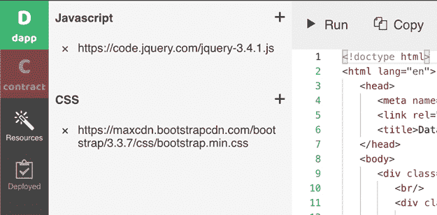

# 第一部分：简介

在这本书的第一部分，我介绍了区块链技术的基本概念，如无信任共识、加密货币和密码经济学。对于应用开发者和企业高管来说，理解这些概念至关重要，因为它们为更深入的讨论建立了一个共同的语言。为了设计和开发区块链应用，有必要学习区块链网络的基本特性和关键特征。

## 1. 区块链简介

术语*区块链*最初是计算机科学中描述一种抽象数据结构的术语。然而，随着这项技术的变得流行甚至无处不在，这个术语已经激发了很多人想象力。今天，*区块链*对很多人来说有多种含义。

### 区块链

对于计算机科学家来说，区块链是一系列连接的数据块。每个数据块可以存储任何信息，但通常它存储一组*交易*。块内的信息用一个唯一的*哈希*表示。每个数据块的内容包含其自身链上前一个数据块的哈希值(图 1.1)。


**图 1.1** 区块链

**注意**

密码哈希是一种大量数据的简短表示。计算起来非常简单。但如果你只知道哈希值，要找出产生这个哈希值的原数据是非常困难的。

为什么我们要在这个区块链结构中存储数据？为什么我们不能仅仅使用一个数据库呢？因为区块链的一个关键特性就是链上的数据很难被篡改。

想象一下你有 1000 个区块的区块链。现在，有人想要修改第 10 个区块的内容。当这个人修改数据时，第 10 个区块的哈希值也会改变。第 11 个区块包含第 10 个区块的哈希值，所以第 11 个区块的内容也会改变，这反过来又导致第 11 个区块的哈希值改变。这个过程沿着区块链传播。所以，要修改任何一个区块，你最终将需要重建跟随它的所有区块。这被称为一个*硬分叉*，它创建了一个与现有区块链不兼容的新区块链，即使它们都使用相同的软件。从这个意义上说，区块链是不可变的。不可能有人“悄悄地”修改区块链的历史。

正如你所看到的，区块链越长，就越稳定。当你在比特币网络上进行交易时，你经常会听到你的交易在六七个区块后被“安全确认”（大约一个小时，因为比特币网络每十分钟创建一个区块）。六个区块之后，出现一个替代的区块链分叉并获得社区接受的可能性很小。所以，可以基本上确定，你的交易已经作为永久历史的一部分被记录下来。

虽然你可以在区块链中存储任何数据，但区块链最常用的用例是存储交易记录。这是有道理的，因为货币交易的历史准确性和有效性至关重要。实际上，区块链被用作数字账本来记录交易。

### 协作账本

现在，数据库也可以记录（或*日志*）变更历史。自从个人电脑发明以来，人们就已经将电子表格或数据库作为交易账本使用了。账本本身既不复杂也不是显著的价值增加。

问题依旧存在：我们为何要费心去使用一种新的、计算密集度更高的数据结构，比如区块链？答案在于区块链的第二个关键特性：围绕区块链组织协作网络是一件容易的事。

由于每个区块是逐个添加到链中的，我们可以设计一个网络，在这个网络中，一个或多个参与方提出下一个区块，然后所有网络节点（即网络上的参与计算机）可以验证提出的区块，并达成共识，决定是否应将其添加到区块链中。如果大多数网络参与者认为一个提出的区块是无效的，区块链可以放弃它，甚至惩罚其提出者。关于区块链共识的技术细节，请参见第二章。

验证规则依赖于具体的区块链。例如，比特币的区块链矿工检查记录在区块中的每个交易的加密签名和账户余额以确定其有效性。

这样做，区块链就变成了一个协作账本。

### 加密货币

账本记录了一些货币的流动。一个主要的创新是意识到区块链可以定义它自己的“货币”来进行交易。它被称为*加密货币*，因为这种货币的有效性是由区块链网络中使用的密码学来保证的。例如，这种货币的每笔交易都经过数字签名，以确保其真实性和唯一性。加密货币也被称为*密码货币*或简称*代币*。在这本书中，我将这些术语互换使用。

交易验证的规则使得区块链能够创建自己的*货币政策*，来管理其加密货币。例如，比特币的区块链定义了以下关于其加密货币（即比特币）的创建和消费规则：

+   新的区块提议者将获得比特币货币的新创造单位。

+   比特币总量将仅有 2100 万个，因此随着时间的推移，区块奖励会逐渐减少。

+   每个比特币可以被分成一百万个萨索斯，用于交易。

+   比特币矿工将为在新区块中验证交易而获得比特币。

这里有趣的一点是，这样的货币政策被编码在了比特币的区块链软件中。没有人能在不创建一个新区块链（即硬分叉）的情况下改变一项政策。

区块链创造的加密货币有一个关键功能。它提供了一种工程机制，通过激励设计（或经济工程），实现了软件工程无法独立完成的事情：建立信任。

我们可以使用区块链技术和加密货币设计来构建无需信任却能协作的网络。

**注意**

长期以来，技术界认为区块链技术的“企业”应用是建立一个公司内部或一组已经建立信任关系公司的分布式账本。可信网络的验证器和节点使得开发高性能的共识协议变得容易。像 IBM 和微软这样的公司推广了此类受许可或可信的区块链的使用。

然而，经过几年的实验，很明显，在可信的/单一公司/集中的环境中，此类“企业”用途的区块链对商业实践的影响有限。可信区块链只是企业 IT 部门可用的另一种数据管理软件解决方案。这种区块链的使用没有产生网络效应。

### 智能合约

当比特币区块链矿工验证交易时，他们仅检查最基本的会计规则。例如，交易发送者必须在她的账户中有足够的资金，并且必须使用她的私钥签署交易。比特币矿工很容易验证这些交易并达成共识。

现在，区块链矿工不再需要检查基本的会计规则，他们可以运行任何类型的计算机程序，然后就计算结果的正确性达成共识。共识结果随后可以保存到区块链上，作为永久的记录。这就是智能合约背后的想法。为比特币开发的共识机制可以用来为任何类型的计算建立信任。

以太坊区块链是首批支持智能合约的公共区块链之一。它具有图灵完备的虚拟机，称为以太坊虚拟机（EVM）。EVM 在所有节点上运行，以验证任意计算任务的正确性。为 EVM 编写的程序存储在区块链上的账户中。涉及账户的任何交易都将由以太坊矿工根据程序进行验证，然后才能将交易记录在区块链上。智能合约已成为区块链最重要的应用。

区块链背后的真正革命性想法是，从无需信任的网络中不合作参与者产生的可信赖计算结果。

### 无需信任的网络

区块链技术的原始杀手级应用是比特币。比特币是由一个完全不可信的网络创建并管理的。任何人都可以加入比特币网络来验证交易、提出新块，如果该块被共识接受，就会收到比特币奖励。比特币网络参与者彼此不认识，也不信任彼此。然而，系统设计用来防止任何参与者对区块链进行恶意更改。

比特币用于达成共识的确切机制被称为*工作量证明*（PoW）。我们将在第二章讨论 PoW 的技术细节。现在，只需知道有机制让不可信的网络参与者同意哪些交易是有效的，并应记录在区块链上。共识机制的核心是使用加密货币来激励参与者遵守规则（例如，不验证无效交易）。这种使用加密货币作为激励的做法被称为*密码经济学*。

能够在没有中央可信权威的情况下达成共识是一种强大的能力。当今最大的互联网公司都是建立在网络效应之上的。像 Uber 和 Airbnb 这样的公司是它们所建立的网络的中央权威。它们制定规则，尤其是围绕网络中货币如何交易的规则。它们确保每个人都遵守规则，并在过程中提取巨大的利润。但是它们真的有必要吗？网络能否在没有公司作为规则制定者和仲裁者的情况下运行？网络参与者本身为什么不能拥有网络并从中获利？

然而，过去尝试取代 Uber 并建立一个合作社式的非营利性交通网络的努力基本上都失败了。有几个原因，如下所述：

+   用一个集中的非营利组织取代集中的公司并不能解决信任问题。许多非营利组织是腐败的，并且主要是使它们的运营者富有。司机和乘客仍然没有网络的真正“所有权”。

+   一个集中的非营利组织缺乏奖励早期采用者并启动网络的手段。Uber 能够筹集风险资本（VC）资金，并大力投资于激励措施，直到网络效应能够自给自足。

一个基于区块链网络的加密货币可能会解决这两个问题。该网络由不可信的节点运行，因此无法被腐败。网络可以通过初始币发行（ICO）等过程向早期采用者发行代币。此外，通过将网络参与者（例如 Uber 中的司机和乘客）变成代币持有者，我们可以建立一个货币网络，并创造对网络的忠诚，这是 Uber 从未能够建立的。

### 新的合作方式

这种不可信的网络为人们提供了新的合作方式。例如，想象一下有一个宝贵的数据集，但没有人拥有全部数据。网络中的每个参与者都拥有数据集的一部分，但他们不愿意分享，因为分享最后的部分将获得最大的利益。在这种情况下，社会往往无法利用这个数据集。

**注意**

一个具体的现实世界案例是医院持有的医疗数据——虽然集体上非常有价值，但没有任何一家医院有动力分享自己的数据片段。

现在，让我们想象一个所有各方都可以贡献数据的网络。当从使用这些数据产生收入时，网络将根据预先约定的比例将收入分配给各方，每次分配都由网络参与者独立验证，以便没有作弊的机会。

在区块链技术之前，这样的数据协作网络是可能的，但它需要一个被所有人信任的集中权威来确定和分配收入。可信的中央权威既有激励又有机会作弊，这使得这种可信网络难以建立。

### 厚协议

区块链网络的特点是它可以没有中央公司创造价值。网络的价值不在于公司的股份，而在于网络协议，并且表现为网络代币的价值。这种理论被称为*厚协议理论*，最初由 Union Square Ventures 的 Joel Monegro 提出。例如，在今天的比特币或以太坊网络上，没有公司达到显著的估值，然而这些网络本身却价值数十亿美元。图 1.2 展示了互联网协议是“薄”的，因此应用程序捕捉了大部分价值，而区块链协议是厚的，可以自身捕捉价值。


**图 1.2** 薄与厚协议的比较（改编自[`www.usv.com/blog/fat-protocols`](https://www.usv.com/blog/fat-protocols)）

现代公司的存在本身是因为公司与合作伙伴之间的外部交易成本远高于公司内部部门之间的内部交易成本。

这是由于公司可以对其内部部门施加命令和控制结构。然而，在今天经济中，随着通信成本的降低，外部交易成本降低到公司越来越多地依赖外包或合同劳动（参见之前的 Uber 和 Airbnb 示例）。

无信任的区块链网络将进一步降低外部交易成本。这些网络不仅简化了信息的交易，还简化了金钱的交易。公共区块链网络与加密代币相结合，为新的商业模式创造了可能，这些模式要么取代今天的公司，要么解决公司无法解决的新机会。

区块链网络的协作和共识规则内嵌并 enforce 在网络协议本身。这当然与大多数公司中由人驱动的规则不同。区块链协作规则是算法性的、自动的、快速的、公平的和一致的。为了充分利用区块链网络，我们应该尽可能将许多协作规则编码到网络协议中。

### 我们信任代码

智能合约在现实世界的法律合同中往往有相似之处。例如，交易各方可能进入一个托管协议，只有在满足某些条件时才会支付资金。现在，网络验证者和维护者的任务是断言这些条件是否满足，以及当新的区块添加到区块链时交易应该如何执行。

然而，与由中央政府强制执行的法律合同不同，智能合约可以自动在区块链上应用协作规则。这些规则以代码形式存在，并由无需信任的网络参与者进行检查，以防止腐败或勾结。正因为如此，我们认为智能合约的代码是区块链网络中的“法律”。代码照字面意思执行。即使代码中有漏洞或作者意想不到的副作用，它仍然被视为真实来源并被作为法律执行。

### 结论

在本章中，我讨论了区块链网络的关键概念。通过加密货币，区块链网络结合了软件和经济工程，在由不合作的参与者组成的网络中创造信任。这可能会颠覆今天最大的互联网公司，因为网络效应不再由网络中心的大型公司创造。相反，网络是由每个参与者共享的软件代码维护的。我们信任代码。

## 2. 达成共识

区块链网络背后的核心思想其实不是技术——散列算法和公钥基础设施（PKI）技术已经存在了许多年。正如我们在上一章中讨论的，比特币的创新之处在于一种新的激励结构，以确保尽管网络中的每个个体都是不合作的（即去中心化的），他们仍然会集体以维护网络的完整性和安全的方式行为。加密货币的经济激励与区块链网络中的技术解决方案协同工作，解决了一些以前仅凭技术无法解决的问题。

软件工程和经济设计之间无缝协作的最重要例子就是区块链的共识机制。

### 区块链共识是什么？

由于公开的区块链是由不可信的参与者维护的分布式账本，因此在哪些交易是有效并应在区块链上记录上达成网络共识至关重要。自动化共识是区块链的核心思想。如何在不妨碍安全的前提下提高共识效率是区块链目前面临的最重要挑战之一。

公平地说，人类社会早已发展出了达成共识的方法。例如，各种投票系统都是为了达成共识而设计的。在技术的支持下，我们现在也有了非正式的投票系统，如 Facebook 的点赞和 Reddit 的点赞。然而，人类的投票太慢，容易受到人类对规则不可靠解释的影响。它无法处理全球计算网络所需的快速，大量交易。

算法可以帮助我们在互联网规模上更快地达成共识。例如，从谷歌页面排名、谷歌广告拍卖、在线声誉评分，到 Uber 的匹配算法，再到 Tinder 的算法等等。然而，这些算法通常只能保证整体正确性，不能保证个别交易的准确性。区块链网络更进一步，提供了一种自动化的计算方法来明确验证和记录交易。

尽管许多区块链项目在共识机制上进行创新以成为“ proof of XYZ”，但我们认为，从根本上说，只有两种类型的共识——工作量证明（PoW）和权益证明（PoS）。

### 工作量证明（PoW）

比特币是一个典型的 PoW 共识区块链例子。虽然它存在诸如性能低下、可扩展性差和电力浪费等问题，但它已经证明了对个人、组织和甚至国家层面的攻击具有高度的安全性。它构建了一个价值数万亿美元的全球网络，而无需信任其任何参与者。这是比特币创造者中本聪的一项巨大的成就。

在 PoW 系统中，矿工们竞争解决每个块的数学难题。首先解决这个问题的矿工将提出一个新的块并获得与该块相关的比特币奖励。获胜者可以选择他在块中包含任何待处理的交易，但他不能包含任何无效的交易（即，所有交易必须得到正确签名，交易发起账户必须有足够的资金）。如果其他矿工发现块中有无效交易，他们将提出竞争性的块。

矿工社区通过每个矿工独立选择构建后续新区块的竞争块来进行“投票”。假设有一个恶意矿工，每当她赢得数学竞赛提出新区块时，她就为自己包含一个大的未经授权的比特币交易。但是，其他矿工也是自私的，没有动机违反规则来为她谋利，所以没有人会基于她的块构建新块。如果她继续在上面构建，她将是那个区块链分支上唯一的人。很明显，她的区块链分支（或分叉）是不合法的。

现在，如果大多数矿工（按计算能力计算）勾结，他们可以故意构建无效的块，使分叉看起来是比特币区块链的合法主分支。这被称为**51%攻击**。对于像比特币这样的大型区块链网络，积累达到 51%的计算能力所需的资源是巨大的。拥有这种计算能力的话，潜在的攻击者经济上不如遵循规则挖新区块，而不是试图破坏所有人的比特币价值。

**注意**

51%攻击是一种社区达成共识接受包含无效交易区块的方式。

### 权益证明（PoS）

尽管 PoW 是一项已被现实世界证明安全的伟大发明，但它也存在许多问题。它需要大量的计算能力来执行浪费性的计算工作，以人为地使潜在的攻击者经济上不可行。它鼓励每个人都参与挖矿过程，导致共识缓慢出现和收敛。当存在多个竞争块时，系统需要很长时间（一个小时或更长）才能确定一个共识分支。

为解决工作量证明（PoW）的问题，提出了一种新的共识机制，称为**权益证明**。PoS 系统允许网络的利益相关者（即区块链原生加密货币或代币的账户持有者）对每个新区块进行直接投票。新区块的提议者是随机选择的。你的投票力与你账户中的代币数量成比例。通过投票，区块链可以在最少的计算量下实现每个块的最终确定性。被接受的新区块的提议者将获得区块链原生加密货币的奖励。

这一过程被称为**铸币**，与 PoW 的**挖矿**相对。与 PoW 系统相比，PoS 系统通常性能更优。大型公共 PoS 区块链的例子如下：

+   Casper 项目（[`github.com/ethereum/casper`](https://github.com/ethereum/casper)）旨在将以太坊区块链从 PoW 系统转变为 PoS 系统。一旦完成，它将成为世界上最大的 PoS 区块链生态系统。

+   量子链（QTUM）区块链（[`qtum.org/`](https://qtum.org/)）旨在成为一个基于比特币类似基础设施的 PoS 区块链。

**注意**

PoS 加密货币的一个有趣副作用是，利益相关者被鼓励锁定他们的代币以参与投票过程并获得新的区块奖励。他们经济上不鼓励交易他们的代币。这减少了“货币”供应量，可能会使这种加密货币在市场上更有价值。

PoS 系统中的投票机制是研究和创新的热点。特别是，系统必须假设不合作甚至恶意投票者。这在博弈论中通常被称为拜占庭将军问题。一个可以数学证实现对最多三分之一欺诈投票者的投票机制必须具备拜占庭容错（BFT）能力。BFT 共识引擎现在广泛用于区块链设计中。

然而，一个简单的 PoS 系统也存在显著的不足。以下是一些例子：

+   参与者投票支持无效区块提案可能不会有什么损失。必须引入某种惩罚（或称为*削减*）来“惩罚”行为不当的参与者。

+   投票本身是一项技术性很强的任务，很少有人能掌握，因为对于高性能网络来说，性能和安全性要求很高。

+   允许所有利益相关者（甚至是只有一个代币的）进行投票可能会导致与 PoW 系统相同的性能下降。

+   大利益相关者的大投票权可能会导致权力随着时间的推移而集中。

已经提出了一些对权益证明（PoS）的改进建议。其中的一个领先候选者被称为*委托权益证明*（DPoS）。

### 委托权益证明（DPoS）

DPoS 系统只有少数能够提出和投票新区块的验证者。利益相关者可以将他们的加密货币“委托”给他们选择的验证者，验证者会代表他们投票。这使得验证者可以成为专业的运营商（类似于 PoW 系统中的矿池），如果他们为无效区块投票（或者粗心大意被黑客攻击），他们可能会受到惩罚。DPoS 区块链的例子包括以下：

+   比特股（Bitshares）项目（[`bitshares.org/`](https://bitshares.org/)）是 DPoS 概念的先驱。它是一个拥有 21 名当选验证者的公共区块链。

+   宇宙网络（Cosmos）项目（[`cosmos.network/`](https://cosmos.network/)）是一个由 Tendermint DPoS 共识引擎构建的所有区块链组成的公共网络，它们可以相互交换信息。我们将在后面的章节中介绍 Cosmos。

+   网络里程（CyberMiles）项目（[`cybermiles.io/`](http://cybermiles.io/)）是一个为智能合约和商业企业的合规代币发行而专门优化的公共区块链网络。我们将在后面的章节中使用 CyberMiles 作为区块链系统设计的例子。

从政治经济学的角度来看，DPoS 类似于有地主（或财产所有者）投票权的代议制民主。

+   验证者或代表是由社区委派的，来决定日常问题，如每个区块和每笔交易的共识，来维护账本的完整性（防止双重支付）和智能合约的执行。

+   拥有某种财产形式的参与者被赋予投票选举代表的权利。这种财产代表着对社区的承诺，同时也代表着流动性的损失。在这种情况下，代表整个区块链网络价值的加密货币就是这种财产。这个模型类似于历史上的土地所有者选举权。

注意，与民主制度相似，财产（或代币）只用于抵押代表。网络锁定抵押的代币以防止交易，并用于处罚。抵押代币的所有权永远不会转让给验证者。

最后，区块链的目的是为了达成共识。我们自然地会模仿人类社会使用了数千年的代表性民主机制来建模共识。

### 结论

在本章中，我解释了经济工程如何与软件工程携手保障区块链网络的安全。这样一个无需信任的网络需要，同时也使得，有价值的加密货币得以运行。

## 3. 你的第一个区块链应用

开始区块链应用开发的最简单方式是使用开源的 BUIDL 工具——一个在任何现代网络浏览器中工作的在线集成开发环境（IDE）。只需访问[`buidl.secondstate.io/`](http://buidl.secondstate.io/) 开始编码！BUIDL 为创建和部署端到端的区块链应用提供了一个全面的编码环境(图 3.1)。您可以在 BUIDL 内创建整个区块链应用，从前端的智能合约到后端的 HTML，以及中间的所有内容。


**图 3.1** BUIDL 是一个开源的在线集成开发环境（IDE），用于端到端的区块链应用开发。

对于初学者和专家来说，BUIDL 大大简化了区块链开发的复杂性和猜测性，让你可以专注于编码。它不需要任何软件下载或安装。它消除了开发者需要处理钱包、私钥、加密货币和漫长的交易确认的过程。然而，它能在公共区块链上部署你的应用，并让任何你分享的人都能访问这个应用。

在本章中，你将学会创建你的第一个区块链应用，然后与世界分享。我们将深入讲解区块链应用背后的关键概念，也被称为*去中心化应用* (*dapps*)。

### 智能合约

总之，*智能合约*是运行在区块链上的后端服务代码。一旦部署，外部应用程序就可以调用智能合约内的函数和代码，通过共识在区块链上执行任务并记录结果。编写智能合约最流行的编程语言是以太坊开创的*Solidity*语言。在这个例子中，让我们用 BUIDL 创建一个简单的智能合约并部署它。

在网页浏览器中加载 BUIDL。你会看到一个简单的智能合约已经在线编辑窗口中（图 3.2）。


**图 3.2** BUIDL 中的简单智能合约

这个合约简单地允许你在区块链上存储一个数字。你可以通过调用其`get()`和`set()`函数来查看或更新存储的数字。代码如下。Solidity 的语法对大多数开发者来说应该很熟悉，因为它与 JavaScript 相似。

点击此处查看代码图片

```
pragma solidity >=0.4.0 <0.6.0;

contract SimpleStorage {
  uint storedData;
 function set(uint x) public {
    storedData = x;
  }
  function get() public view returns (uint) {
    return storedData;
  }
}
```

点击**编译**按钮来编译合约。侧边栏将会打开，展示编译后的应用二进制接口（ABI，区块链用于促进远程函数调用的基于 JSON 的 artifact）和合约的字节码（图 3.3）。


**图 3.3** 准备部署的编译智能合约

接下来，你可以点击左侧面板中的**部署到链**按钮，实例化并部署合约到公有区块链。你可以在 BUIDL 内部调用已部署合约的公共方法与其交互。例如，你可以设置合约的`storedData`值，点击**交易**按钮将值保存到区块链；然后点击**调用**按钮在 LOG 面板查看值（图 3.4）。


**图 3.4** 在区块链上与已部署智能合约交互

你可能已经注意到，BUIDL IDE 默认部署到 Second State DevChain。这是一个为改善开发者体验而设计的以太坊兼容的公有区块链。例如，DevChain 的区块时间为 1 秒，区块产生后所有交易立即确认。DevChain 上的智能合约交互时间仅为 1 秒，而不是公有以太坊区块链上需要几分钟甚至几小时的确认时间。DevChain 上的“燃气费”为零，因此你不需要担心获取加密货币代币来支付“燃气费”。

此外，由于 DevChain 不需要燃料或加密货币，区块链上的地址或账户只作为智能合约函数调用的 ID。BUIDL 会自动为您生成五个地址供您使用。您可以在**账户**标签中查看它们(图 3.5)。您可以将其中任何一个设置为您的默认地址。如果您已经有了一个地址，您也可以将其导入到 BUIDL 中。所有地址的私钥都保存在您电脑浏览器缓存中。BUIDL 不需要您拥有任何加密钱包，因此它可以在任何浏览器上运行，包括智能手机浏览器。您真的可以在任何地方编码。


**图 3.5** BUIDL 中的地址/账户

一旦您的智能合约编写完成，您就可以将其部署到任何与以太坊兼容的区块链上，包括以太坊主网和测试网。您可以直接在 BUIDL 中完成这一点。请参阅第四章以及 BUIDL 文档以获取详细信息。

### 前端 HTML

然后点击**dapp**标签，开始与区块链上的智能合约交互的网页应用程序的工作。应用程序的 HTML 前端很简单。它显示了两个允许用户调用两个对应智能合约函数的按钮(图 3.6)。

```
<button id="s">Set Data</button>
<button id="g">Get Data</button>
```


**图 3.6** dapp 标签页上的 HTML 编辑器

还可以通过 BUIDL 中的**资源**标签添加 CSS 和 JavaScript 库资源到 HTML 中(图 3.7)。



**图 3.7** HTML 网络应用的资源

### JavaScript 和 web3.js

HTML 网页显示了 dapp 的 UI。网络应用程序通过 JavaScript web3.js 库对智能合约进行函数调用(图 3.8)。


**图 3.8** dapp 标签页上的 JavaScript 编辑器

JavaScript 有几个部分。`/* Don't modify */`部分由 BUIDL 工具填充。它包含通过 BUIDL 部署的合约的实例化代码。合约实例及其操作都在`web3.js`库中定义。

事件处理程序展示了如何从 JavaScript 在交易中调用智能合约的`set()`函数。

点击此处查看代码图片

```
document.querySelector("#s").addEventListener("click", function() {
  var n = window.prompt("Input the number:");
  n && instance.set(n);
});
```

获取数据按钮的事件处理程序调用智能合约的 get()函数并显示结果。

点击此处查看代码图片

```
document.querySelector("#g").addEventListener("click", function() {
  console.log(instance.get().toString());
});
```

`web3.js`库支持 JavaScript 前端对部署在区块链上的智能合约进行远程函数调用。

### 在行动中

要运行 dapp，请在 BUIDL 中点击**运行**按钮。您将在右侧面板中看到 dapp 的 UI。您可以点击**设置数据**按钮来存储一个数字，您可以点击**获取数据**按钮来检索存储的数字。图 3.9 显示了 dapp 在行动中。


**图 3.9** 在 BUIDL 中运行 dapp

现在您已经在公共区块链上运行了一个 dapp！

### 分享您的 dapp

由于 Second State DevChain 是一个公共区块链，您可以与其他人分享您的 dapp，他们也能够访问它。只需点击**发布**按钮。BUIDL 会将应用程序前端包装成一个 HTML 文件并上传到一个公共网站。一旦完成，BUIDL 将显示一个已发布的链接(图 3.10)。点击该链接以打开 dapp 网站。现在您可以与任何人分享这个链接。


**图 3.10** 使用 BUIDL 工具发布您的 dapp

您还可以从那个已发布的链接下载并保存 HTML 文件到您的本地计算机硬盘上。您可以将 HTML 文件放在任何网页托管服务上，并使其对全世界可见。有许多免费服务可以托管您的 HTML 文件。

当用户来到网页与您的去中心化应用（dapp）互动时，他们将看到页面底部的一个小工具，允许用户选择她的区块链地址(图 3.11)。请注意，所有这些地址都是自动生成的，选中的地址充当用户的链上 ID。

您也可以导入自己的地址私钥或使用 MetaMask 钱包中的您的地址。


**图 3.11** 在 dapp 中管理地址

如我们所提到的，Second State DevChain 不需要燃料费，所有这些地址的加密货币余额都可以为零。在企业环境中，每个用户可能有一个唯一的地址作为 ID。在这种环境中，您可能需要为您的授权用户提供地址和私钥。

### 结论

在本章中，我向您展示了如何使用 BUIDL 工具创建并部署您的第一个区块链 dapp。您刚刚建立的 dapp 与以太坊协议兼容。在下一部分，我将讨论以太坊协议及其应用。
