# 第二部分：以太坊简介

在本书的这一部分，我介绍了目前最重要的公共区块链之一，以太坊。从市值来看，以太坊仅次于比特币区块链。由于以太坊是第一个开创智能合约概念的区块链，因此许多公共和私有区块链现在都与以太坊兼容，以便利用以太坊开发者社区。从这个意义上说，以太坊不仅仅是一个公共区块链。它是许多其他区块链遵循的协议。

因此，对于开发者来说，了解以太坊如何运作以及如何在以太坊上编写应用程序（即智能合约和去中心化应用程序）非常重要。本书这部分的章节将讨论如何从头开始构建与以太坊兼容的智能合约和应用程序。需要指出的是，有几种与以太坊兼容的区块链可供您用于开发和部署以太坊应用程序，尤其是针对特定业务用例优化的应用程序。

在本书的第三部分中，我将进一步探讨以太坊的内部运作和未来计划。

## 4. 入门

虽然有可能为比特币区块链编写软件程序，但由于比特币网络上支持的编程功能有限，很少有人这样做。

以太坊是第一个支持复杂应用开发的大型区块链网络。以太坊的野心是成为“世界电脑”。通过自主软件程序，称为*智能合约*，当满足某些条件时，以太坊区块链可以被编程来自动执行交易。为了支持这一点，以太坊内置了图灵完备编程语言（Solidity）和虚拟机（以太坊虚拟机[EVM]），这使得编程各种应用程序成为可能。

对于程序员来说，编写在以太坊区块链上运行的智能合约代码是进入区块链应用开发世界的第一步。随着以太坊不断受欢迎和价值增长，编程以太坊应用已经成为一种必要且宝贵的技能。

在本书中，我们将从以太坊上的一个简单的“Hello, World!”智能合约开始。我们通过使用流行的工具，完整地了解部署并在以太坊的一个测试网络上与之交互的过程。这个例子旨在让您尽快开始使用以太坊。后续章节将更深入地探讨这些概念和替代工具。

**注意**

通常，与其在以太坊本身上开发应用程序，不如在以太坊兼容的区块链上开发应用程序更有益。您已经看到了 Second State DevChain 作为一个明显的快速以太坊兼容区块链的例子。在这本书的后面，我们将使用 CyberMiles 公共区块链作为另一个对开发者开放的以太坊兼容选择。CyberMiles 公共区块链针对电子商务应用程序进行了优化。但同时，它与以太坊语言和工具完全兼容，执行速度更快，交易确认时间（10 秒）更快，成本更低（便宜 1000 倍）。您可以在第十四章了解更多。

### BUIDL 方法

在第三章中，我向您介绍了 BUIDL 开源集成开发环境（IDE）。它支持所有与以太坊兼容的区块链，包括以太坊主网和测试网。让我们设置 BUIDL 以配合以太坊工作。打开 BUIDL 网络应用[`buidl.secondstate.io/`](http://buidl.secondstate.io/)，并点击浏览器窗口左下角的**提供者**标签(图 4.1)。

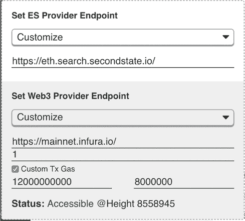

**图 4.1** 配置 BUIDL 以配合以太坊主网

#### 以太坊主网

你应该配置 web3 和 ES（Elasticsearch）提供者为公共以太坊节点，如下所示。或者你可以启动以下链接，让一切自动为您配置以太坊。[`buidl.secondstate.io/eth`](https://buidl.secondstate.io/eth)

+   **ES 提供者**：将其设置为[`eth.search.secondstate.io/`](https://eth.search.secondstate.io/)。ES 提供者是一个智能合约搜索引擎，它提供来自以太坊网络的实时数据。您可以在第十一章了解更多。

+   **Web3 提供者**：将其设置为[`mainnet.infura.io/`](https://mainnet.infura.io/)。这是一个由 Infura 提供的公共以太坊区块链节点。Infura 要求普通用户注册 API 密钥以使用他们的服务。请这样做，并使用您的 API 密钥在此处设置您自己的 mainnet.infura.io 网址。或者，您可以使用由社区提供的 web3 提供者，如[`main-rpc.linkpool.io/`](https://main-rpc.linkpool.io/)或[`eth.node.secondstate.io/`](https://eth.node.secondstate.io/)。

+   **链 ID**：将其设置为 1，用于以太坊主网。

+   **自定义 Tx 燃料**：勾选此框，以便 BUIDL 在创建合约和调用合约函数时使用指定的燃料价格。

+   **燃料价格**：将其设置为 10000000000（wei，或 10 Gwei），作为 BUIDL 默认使用的燃料价格。您可以使用以太坊燃料跟踪器查看网络上的当前燃料价格([`etherscan.io/gasTracker`](https://etherscan.io/gasTracker))。您愿意支付更高的燃料价格，您的交易就可以更快地得到确认。

+   **燃料限制**：将其设置为 8000000，这是以太坊当前的区块燃料限制。

**注意**

由于以太坊主网有时可能会非常拥堵，你应该准备支付高昂的燃料价格（部署合约或调用函数可能需要高达 10 美元），并且你可能需要等待数小时才能确认交易。我建议大多数开发者在像以太坊经典或 CyberMiles 这样更快且更便宜的区块链上进行开发，甚至部署。

现在我们已经配置了 BUIDL，在以太坊上部署和调用智能合约时会支付燃料费。BUIDL 为每个用户创建五个随机账户，然后使用默认选择的账户与区块链交互(图 4.2)。所以，你在默认账户中需要一个 ETH 余额。只需从你的钱包或交易所账户向你的 BUIDL 默认账户发送一些 ETH。或者，你可以点击账户旁边的+按钮，从其他钱包导入一个 ETH 账户。

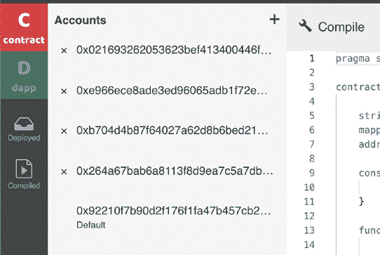

**图 4.2** 在 BUIDL 中选择一个默认账户。你需要在其中保持 ETH 余额以支付燃料费。

**注意**

BUIDL 拥有一个内置的钱包，用于管理账户私钥。然而，BUIDL 只能从其账户签名交易和支付燃料费。它旨在用于应用开发。BUIDL 不是一个通用钱包，我不建议在其中保持超过 0.1 ETH 的余额。

在合约标签页这就是你所需要的一切。现在你可以编写一个智能合约，点击**编译**和**部署到链上**按钮将其部署到以太坊，然后使用 BUIDL 用户界面（UI）调用已部署合约上的任何函数。

最后，在 BUIDL 的 dapp 标签页中，你需要为所有的 web3 交易添加`gasPrice`和`gas`参数。在这里使用 BUIDL 的默认`web3.ss`包是安全的，因为它包含了所有的`web3.eth`对象和函数。这是一个例子：

**点击此处查看代码图片**([`etc.search.secondstate.io/Images/ch04_images.xhtml#pro4_1`](https://etc.search.secondstate.io/Images/ch04_images.xhtml#pro4_1))

```
instance.set(n, {
  gas: 100000,
  gasPrice: 10000000000
}, function (e, result) {
  // ... ...
});
```

就这样。现在你已经将在以太坊公共区块链上部署了默认的 BUIDL 示例智能合约和 dapp。

#### 以太坊经典主网

如果你不愿意为每次合约调用支付 10 美元并等待数小时，你可以使用以太坊经典区块链来部署你的应用程序。以太坊经典区块链是世界上最有声誉和稳定的区块链网络之一，它与以太坊协议完全兼容。其原生加密货币 ETC 只需 ETH 的一小部分。以太坊经典区块链很少拥堵，因此 10 Gwei 的燃料价格（几美分）通常会在不到一分钟内确认交易。要配置 BUIDL 以使用以太坊经典主网，请使用以下设置。或者，你可以启动以下 URL，让一切自动配置为以太坊经典。[`buidl.secondstate.io/etc`](https://buidl.secondstate.io/etc)

+   **ES 提供商**：将其设置为[`etc.search.secondstate.io/`](https://etc.search.secondstate.io/)。

+   **Web3 提供商**：将其设置为[`www.ethercluster.com/etc`](https://www.ethercluster.com/etc)。

+   **链 ID**：将此设置为 61，用于以太坊经典主网。

+   **自定义 Tx gas**：勾选此框。

+   **Gas Price**：将此设置为 10000000000（wei，或 10 Gwei），作为 BUIDL 默认使用的燃料价格。

+   **Gas Limit**：将此设置为 8000000。

此外，当前以太坊经典区块链需要 Solidity 编译器版本 0.4.2。

您必须通过在启动 BUIDL 时使用 URL 参数`/?s042`来为 BUIDL 配置此设置。

向您的 BUIDL 账户发送一些 ETC 作为燃料。现在，您可以在以太坊经典区块链上编译、部署和调用您的智能合约。

#### CyberMiles Mainnet

网络浏览器 CyberMiles 公共区块链是一个比以太坊更快（交易确认时间为十秒）且更便宜（比 ETH 和 ETC 都要便宜）的以太坊兼容区块链。您可以在第十四章中了解更多关于它的信息。要配置 BUIDL 以使用 CyberMiles 主网，请配置以下设置。或者您可以启动以下 URL，让一切自动为您配置 CyberMiles。 [`buidl.secondstate.io/cmt`](https://buidl.secondstate.io/cmt)

+   **ES 提供者**：将其设置为 [`cmt.search.secondstate.io/`](https://cmt.search.secondstate.io/)。

+   **Web3 提供者**：将其设置为 [`rpc.cybermiles.io:8545/`](https://rpc.cybermiles.io:8545/)。

+   **链 ID**：将此设置为 18，用于 CyberMiles 主网。

+   **自定义 Tx gas**：勾选此框。

+   **Gas Price**：将此设置为 5000000000（wei，或 5 Gwei），作为 BUIDL 默认使用的燃料价格。

+   **Gas Limit**：将此设置为 8000000。

向您的 BUIDL 账户发送一些 CMT 作为燃料。现在，您可以在 CyberMiles 区块链上编译、部署和调用您的智能合约。

**注意**

以太坊、以太坊经典和 CyberMiles 都为开发者提供了测试网，以无需花费真实货币就能尝试他们的应用程序。然而，根据我的经验，测试网代币难以获得，且测试 dapp 难以共享，因为很少有用户拥有测试网钱包或代币。测试网也常常不可靠，且与主网运行不同的软件。对于 CyberMiles，交易费用不到 1 美分。即使是为了开发目的，这也是一个不错的选择。

### The Hard Way

BUIDL 的主要优点是易于使用并允许快速开发周期。但它也隐藏了一些对应用程序开发者重要的概念。在本节中，我们将退后一步，使用更传统的以太坊开发工具来解释以太坊背后的概念。

#### Metamask 钱包

Metamask 钱包是 Chrome 浏览器的一个扩展程序，用于管理您的以太坊区块链账户。它将您的私钥（即钱包）存储在您的计算机上，以及存储在这些账户中的加密货币。对于开发者来说，Metamask 是一个很好的工具，因为它与其他开发工具集成，并允许您以编程方式与以太坊账户互动。

首先，请确保您已安装最新版本的 Google Chrome 浏览器。您可以在 [`www.google.com/chrome/`](https://www.google.com/chrome/) 上获取它。

接下来，按照 MetaMask 网站([`metamask.io/`](https://metamask.io/))的说明，在您的 Chrome 浏览器上安装 MetaMask。

现在，你应该在 Chrome 工具栏上看到 MetaMask 图标。点击它以打开其用户界面。你应该为你的 MetaMask 钱包创建一个密码(图 4.3)。这很重要，因为你的密码保护着存储在这台计算机上的账户私钥。一旦你创建了密码，MetaMask 就会给你一个 12 词的恢复短语。这是你恢复密码的唯一方式，所以要妥善保管！

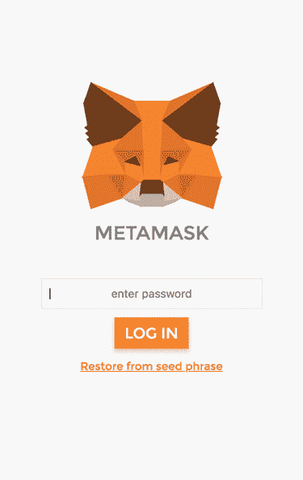

**图 4.3** 为你的 MetaMask 钱包创建密码

出于开发目的，在 MetaMask 用户界面的左上角选择下拉列表，选择 Ropsten 测试网络(图 4.4)，这是一个为测试目的而维护的以太坊公共区块链。

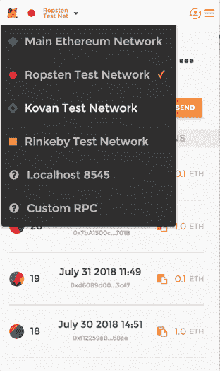

**图 4.4** 选择 Ropsten 测试网络

你还需要在 Ropsten 测试网络上创建一个账户来存储你的 ETH 加密货币。在 MetaMask 用户界面的右上角选择人物图标，选择**创建账户**(图 4.5，左)。MetaMask 将为你创建一个账户地址及其关联的私钥。你可以点击 UI 中的一个账户，将其地址复制到剪贴板或导出其私钥(图 4.5，右)。你可以给这个账户命名，这样你以后可以在 MetaMask UI 中访问它。你还可以使用 MetaMask 管理主网 ETH，这些 ETH 可以在交易所交易换算成美元。但这样做时，你应该确保你的电脑物理安全，因为真实的货币将会涉及风险。

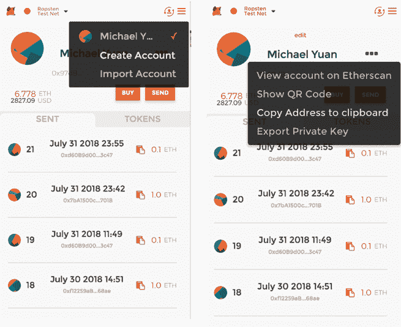

**图 4.5** 在 Ropsten 测试网络上创建新账户并获取账户地址

当然，你仍然需要用一些 Ropsten 测试网络 ETH 资助你的账户以使用它。前往公共 Ropsten 水龙头([`faucet.ropsten.be:3001/`](http://faucet.ropsten.be:3001/))，为你的地址请求 1 个测试网络 ETH！Ropsten 测试网络 ETH 只能在测试网络上使用。它不会在任何交易所交易，并且当 Ropsten 测试网络退役时随时可能消失。与主网 ETH 不同，Ropsten ETH 没有货币价值。

现在你已经设置了 MetaMask，准备在 Ropsten 测试网络上与你的第一个以太坊智能合约互动！

#### Remix

Remix 是面向开发者的以太坊 IDE，让开发者能够体验以太坊区块链上的智能合约。Remix 完全是基于网页的。只需访问它的网站来加载网页应用：[:http://remix.ethereum.org/](http://remix.ethereum.org/)。

**注意**

Remix IDE 与 BUIDL 合同标签页相似，只不过 BUIDL 不需要像 MetaMask 这样的外部钱包。

在右侧的代码编辑器中，让我们输入一个简单的智能合约。以下是一个“Hello, World!”智能合约的示例。它是用一种特殊的 JavaScript 样式的编程语言 Solidity 编写的。

**点击此处查看代码图片](Images/ch04_images.xhtml#pro4_2)**

```
pragma solidity ⁰.4.17;

contract HelloWorld  {

    string helloMessage;
    address public owner;

    constructor () public {
        helloMessage = "Hello, World!";
        owner = msg.sender;
    }

    function updateMessage (string _new_msg) public {
        helloMessage = _new_msg;
    }

    function sayHello () public view returns (string) {
        return helloMessage;
    }

    function kill() public {
        if (msg.sender == owner) selfdestruct(owner);
    }
}
```

“Hello, World!”智能合约有两个关键方法。

+   `sayHello()`方法向其调用者返回一个问候。当智能合约部署时，问候被初始化为“Hello, World!”。

+   `updateMessage()`方法允许调用者将问候从“Hello, World!”更改为另一条消息。

在右侧面板中点击**开始编译**按钮以编译此合约(图 4.6)。它将生成稍后可用的字节码和应用程序二进制接口（ABI）。

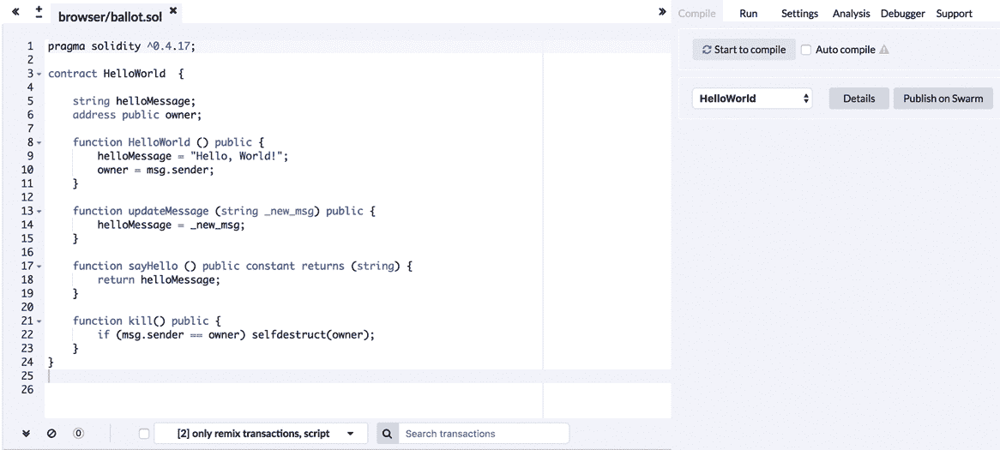

**图 4.6** 在 Remix 中编译以太坊智能合约

接下来，在 Remix 的 Run 标签页(图 4.7)中，您可以通过 Injected Web3 下拉框将 Remix 连接到您的 MetaMask 账户。Remix 将自动检测您的现有 MetaMask 账户。如果您的 Ropsten 地址在这里没有显示，尝试退出然后重新登录 Remix。

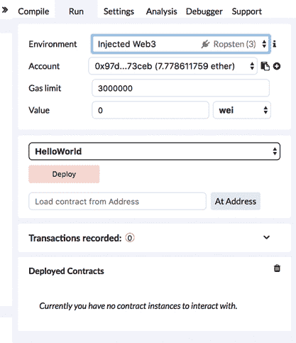

**图 4.7** 将 MetaMask 注入 Remix

现在您应该看到将智能合约部署到区块链的选项。点击**部署**按钮将合约部署到区块链。由于您已经选择了一个 Ropsten 地址注入到这个 Remix 会话中，因此合约将在 Ropsten 测试网上部署。此时，MetaMask 将弹出，并要求您从现有账户地址发送燃料费(图 4.8)。燃料费是以太坊网络为支付部署您合约所需的网络服务而收取的。


**图 4.8** 支付部署合约的燃料费

提交 MetaMask 请求后，请等待几分钟，让以太坊网络确认您的合约部署。部署合约的地址将在确认信息中显示，您可以在 Remix 的 Run 标签页中查看已部署的合约及其可用功能(图 4.9)。


**图 4.9** 合约现已部署，显示了可用方法。

如果您已经在 Ropsten 测试网上部署了智能合约，您已经知道合约的部署地址。您只需在 At Address 按钮旁边的框中输入合约地址，然后点击按钮即可。这样配置 Remix 以使用已经部署的合约。在这种情况下，无需支付燃料费。

一旦 Remix 连接到你的部署合约，它会在运行标签页上显示合约函数。你可以在更新消息按钮旁边输入一个新的问候语，然后点击按钮更新消息。由于需要以太坊网络存储来存储更新后的消息，你将再次通过 MetaMask 被提示支付燃料费。

一旦网络确认了消息更新，你将再次看到一个确认信息(图 4.10)。在`updateMessage()`方法被确认之后，你可以在 Remix 中调用`sayHello()`(图 4.11)，然后你会看到更新后的消息。`sayHello()`函数不会改变区块链状态。它可以在连接到 Remix 的本地节点上执行，并且不会影响网络上的任何其他节点。它无需支付任何燃料费即可执行。


**图 4.10** 调用`updateMessage()`方法

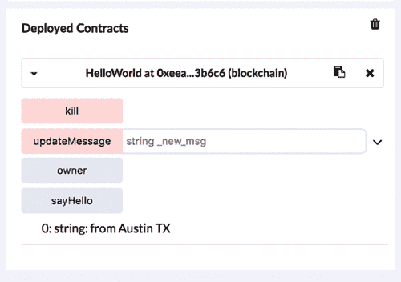

**图 4.11** 调用`sayHello()`方法

Remix IDE 易于使用。它是初学者的最佳选择。随着你的开发技能的提升，还有其他工具可供你用来开发和部署智能合约。【第六章](ch06.xhtml#ch06)有更详细的信息。

#### Web3

尽管 Remix 是一个很好的工具，但对于普通人来说太难了。为了让你的智能合约对大众可用，你通常需要构建一个基于网页的用户界面。为此，你需要 web3 JavaScript 库来与以太坊区块链交互。

**注意**

BUIDL 中的 dapp 标签页向 BUIDL 中的 JavaScript 程序注入了一个预配置的 web3 实例。

一旦安装了 MetaMask，它就会自动将一个自定义的 web3 对象实例注入到页面的 JavaScript 上下文中。需要私钥的方法调用将自动提示用户选择一个账户，并且 MetaMask 将使用选定的私钥签署交易，然后将其发送到以太坊网络。

web3 dapp 的整体结构是一个在网页加载时开始的 JavaScript 函数（即以下的`onPageLoad()`函数）。这个 JavaScript 函数管理应用状态，并调用区块链上的智能合约函数。由于网络延迟和区块链操作的确认要求，所有的 web3 API 调用都是异步的。因此，我们使用 web3 回调 API 来处理返回值。请注意，如果你想连续调用一个智能合约，你必须嵌套这些调用。下面的代码片段显示了 JavaScript 函数的结构。`myFunc()`和`anotherFunc()`调用可以同时以并行方式发生，而`secondFunc()`调用必须在`myFunc()`返回之后发生。

【点击此处查看代码图片](Images/ch04_images.xhtml#pro4_3)

```
var onPageLoad = function () {
  web3.eth.getAccounts(function (e, address) {
    if (e) {
      // ...
    } else {
      contract = web3.eth.contract(abi);
      instance = contract.at(contract_address);
      instance.myFunc (params..., function (e, r) {
        if (e) {
          // ...
        } else {
          return_value_0 = r[0];
          return_value_1 = r[1];
          // ...
          // show the UI based on the return values
          // Make a subsequent call after myFunc
          instance.secondFunc (params..., function (e2, r2) {
            // update the UI based on the r2 return values
          }
        }
      });

      instance.anotherFunc (params..., function (e, r) {
        if (e) {
          // ...
        } else {
          // show results on UI
        }
      });
    }
  });
}
```

然而，“Hello, World!”示例并不需要复杂的一系列智能合约函数调用。它只需要调用一个合约函数，然后更新 Web UI。`helloworld.html`文件的源代码如下：

请点击此处查看代码图片

```
<!DOCTYPE html>
<html lang="en">
  <head>
    <script>
      window.addEventListener('load', function() {
        var hello = web3.eth.contract(...).at("...");
 var new_mesg = location.search.split('new_mesg=')[1];
        if (new_mesg === undefined || new_mesg == null) {
        } else {
          new_mesg = decodeURIComponent(new_mesg.replace(/\+/g, '%20'));

          web3.eth.getAccounts(function (error, address) {
            if(!error) {
              hello.updateMessage(new_mesg, {
                  from: address.toString()
              }, function(e, r){
                if(!e)
                  document.getElementById("status").innerHTML =
                    "<b>Submitted to blockchain</b>. " +
                    "New message will take a few sec to show up! " +
                    "<a href=\"helloworld_europa.html\">Reload page.</a>";
              });
            }
          });
        }

        hello.sayHello(function(error, result){
          if(!error)
            document.getElementById("mesg").innerHTML = result;
        });
      })
    </script>
  </head>

  <body>
  <h2>Hello World</h2>
    <form method=GET>
      New message:<br/><br/>
      <input type="text" size="40" name="new_mesg"/><br/><br/>
      <input type="submit"/>
      <p id="status"/>
    </form>
    <p>The current message is: <span id="mesg"/></p>
  </body>
</html>
```

请注意`web3.eth.contract(...).at("...")`这行代码。at()函数需要区块链上的合约部署地址作为参数。您可以在“运行”标签的“已部署合约”部分找到它，如图 4.9 和 4.10 所示。合约函数采用一个称为合约 ABI 的 JSON 结构。您可以通过在“编译”标签上点击“详情”按钮找到它。您可以通过点击剪贴板图标将整个 ABI 部分复制到您的计算机剪贴板中。另外，WEB3DEPLOY 部分的代码第一行显示了`contract`函数的 ABI 参数全部放在一行（图 4.12）。


**图 4.12** 查找 ABI

现在，Web 应用程序允许用户直接从 Web 与“Hello, World!”智能合约互动（图 4.13）。要提交新消息，应用程序需要 MetaMask 发送燃气费，因为它调用合约上的`updateMessage()`函数。注意所有的 web3 函数都是嵌套的，并异步调用。您可以在第七章中了解更多关于 dapp 开发的内容。

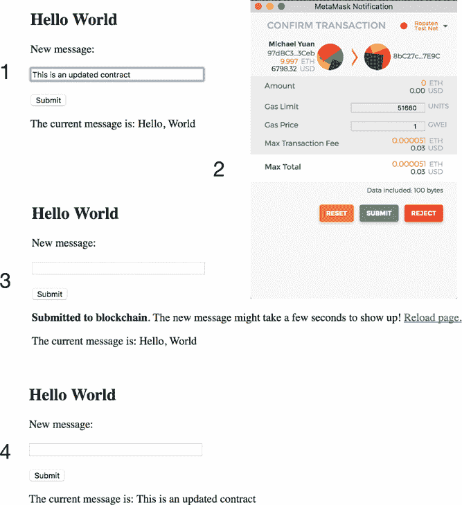

**图 4.13** 使用 MetaMask 钱包向合约写入

使用 MetaMask 和 web3.js 可能是开始以太坊应用开发的最好方式。但对于普通 Web 用户来说，安装和使用 MetaMask 是一个重要的入门门槛。正如你所看到的，BUIDL IDE 在 dapp 网页上提供了一个轻量级的钱包，这对于只需要为与以太坊区块链的互动支付燃气费的用户来说可能已经足够了。或者，我们可以设计应用程序，使中心化服务器代表用户支付燃气费（见第八章）。

### 结论

在本章中，我解释了如何在以太坊兼容的区块链上构建、部署和使用智能合约。我们使用了 MetaMask、Remix 和 web3 等工具来开始操作。在接下来的几章中，我们将探讨以太坊背后的关键概念、涉及其运作的软件工具、智能合约的内部工作原理、替代开发工具以及去中心化应用的软件堆栈。我们将在第十六章中通过一个新的 dapp 来展示智能合约的能力，并将所有内容整合在一起。

## 5. 概念与工具

在上一章中，我向您展示了如何构建、部署和与以太坊智能合约互动。然而，通过专注于图形用户界面（GUI）工具，我们也留下了许多概念和观点未解释。

在本章中，我将解释如何运行并与以太坊节点交互。在这个过程中，你将学习到以太坊区块链设计、实现和运营背后的关键概念。这些概念也适用于与以太坊兼容的区块链。

### 以太坊钱包和基本概念

要使用以太坊，你首先需要一个以太坊钱包来存放你的 ETH 币。与比特币一样，任何人都可以在以太坊区块链上创建一个“账户”来持有和交易 ETH 币。账户由一对公钥和私钥唯一标识。*密钥*是一长串看似随机的数字和字符。密钥对可以在您自己的电脑上随机生成。

+   以太坊账户号码直接从公钥派生。如果有人想给你一些 ETH，他们需要的只是账户号码。

+   私钥用于标识此账户的所有者。当你需要将 ETH 从账户中转出（即花费它或转帐到另一个账户）时，你需要私钥。没有私钥，以太坊矿工会认为交易无效，并拒绝将其包含在区块链中。

现在你应该看到保护你的私钥是多么的关键。如果别人得到了它，那么这个人将拥有该账户中 ETH 的全部权限。而且，如果你 somehow 丢失了私钥，你将永远失去对账户中 ETH 的控制权——ETH 将留在账户中供全世界查看，但没有私钥，没有人能够移动或花费它们。

钱包所做的就是存储和管理你的公钥/私钥对。它通常还提供用户界面，以便你可以使用底层的公钥/私钥对来管理账户中的 ETH。钱包可以是一个完全独立的软件（或甚至是硬件）。或者，它可以是一个网络应用程序，它在他们的服务器上存储你的密钥。以下是一些著名的以太坊钱包：

+   Mist 是以太坊开发团队官方的钱包软件。你可以在自己的电脑上安装并运行它。它不仅仅是一个钱包，更是一个“区块链浏览器”，包括一个完整的以太坊节点。例如，你可以使用 Mist 上传智能合约代码。这也意味着 Mist 需要超过 4GB 的 RAM 和超过 100GB 的硬盘空间来运行。Mist 需要 24 到 48 小时来启动第一次，因为它需要下载整个区块链历史。

+   Parity 是另一个功能全面的 GUI 以太坊客户端。它与 Mist 竞争。它应该比 Mist 快。但是，仍然需要下载整个区块链来运行一个完整的以太坊节点。

+   Metamask，在第四章中介绍，是一个基于 Chrome 的钱包。它将私钥存储在您使用 Chrome 浏览器的电脑上。因此，对 Metamask 钱包来说，电脑的物理安全很重要。

+   imToken 移动应用程序是一个智能手机的钱包。你可以在应用程序中创建密钥对（账户），并使用该应用程序将 ETH 发送到或从钱包中的账户接收。imToken 应用程序本身不下载区块链。它即刻启动，并准备好使用。

+   Tezer 和 Ledger 是尺寸与 USB 密钥相当的硬件设备，用于存储和管理你的密钥。它们通常与计算机程序协同工作。计算机程序提供 UI 以检查余额和创建交易。当它需要签署一个交易时，它将其传递到 USB 设备以完成交易。私钥从未离开 USB 设备。

+   Coinbase 是一个基于网页的钱包，同时也提供银行服务，用于将你的 ETH 转换成或从美元中提取。几乎所有的加密货币交易所都为你提供钱包，用于存入和提取货币。

**注解**

如果你在自己的 PC/移动设备/专用硬件设备上运行钱包应用程序，你必须负责设备的物理安全。不要丢失你的私钥！

**注解**

与以太坊兼容的区块链也有自己的钱包应用程序。例如，CyberMiles 区块链有一个类似于 Metamask 的 Chrome 扩展钱包，以及一个独立的移动钱包应用程序，称为 CyberMiles App，它可以运行基于 web3 的 dapp。详情请见 附录 A。

如果钱包只管理公/私钥对，那么存储在这些账户中的硬币和代币怎么办？你的货币在钱包里吗？答案是不是，你的代币或货币不在你的钱包里。记住，区块链是一个账本系统。它记录了系统中所有账户的交易和余额。所以，钱包只需要管理你的账户凭据，而你账户中的代币或货币可以在区块链本身上找到。

### Etherscan

以太坊区块链的内部状态可以通过 Etherscan 网站这个有用的工具来查看。你可以用它来查询和审查区块链上记录的每一笔交易，以及由此延伸出的每个账户的余额和历史。在该网站首页，你可以看到最新的区块及其内的交易（图 5.1）。

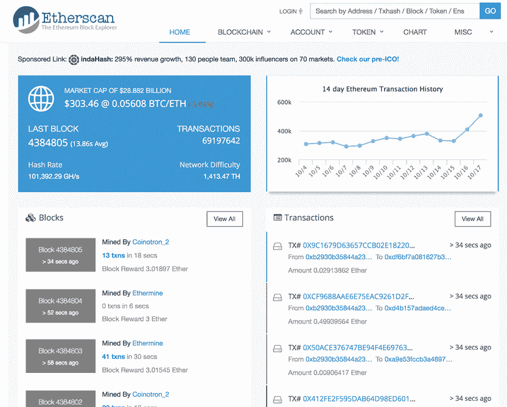

**图 5.1** Etherscan 中的最新区块和交易

**注解**

大多数区块链也有自己的区块链浏览器。例如，CyberMiles 公共区块链有 [`www.cmttracking.io/`](https://www.cmttracking.io/)，它不仅显示交易，还显示与它的委托证明权益操作相关的数据。详情请见附录。

钱包或交易所也可以显示来自或发送到你账户的交易。Etherscan 显示了涉及的账户和资金，以及交易是否得到了区块链矿工的验证（图 5.2）。


**图 5.2** 深入一个交易

当然，作为一个开发者，仅仅拥有账户和 ETH 是不够的。我们希望运行区块链软件，挖掘 ETH 币，并执行我们自己的智能合约。

### TestRPC

为了研究和开发以太坊应用程序，您需要访问以太坊虚拟机（EVM）。理想情况下，您会在区块链上运行一个完整的以太坊节点，并通过该节点与区块链网络通信。然而，完整的以太坊节点很昂贵。对于开发者来说，使用 TestRPC 开始要容易得多。我将在本章后面讨论如何运行以太坊完整节点。

**注意**

要运行一个完整的以太坊节点并加入以太坊网络，您需要运行一个完整的以太坊客户端，下载以太坊区块链的全部交易历史（超过 100GB 的数据），然后开始“挖掘”ETH，以参与验证交易和区块链上创建新区块的过程。这是一个很大的承诺，需要大量的计算资源。即便如此，您成功挖掘 ETH 的可能性也不大——ETH 的交易价格超过 150 美元，挖掘竞争非常激烈。由于以太坊区块链上的大多数任务都需要 ETH 来完成，您需要购买 ETH just to start experimenting with it。再次，每个 ETH 超过 150 美元，这是一个昂贵的学习过程。

为了测试以太坊应用程序编程接口（API）函数和智能合约编程，您可以使用一个简单地回答所有以太坊 API 调用但不会实际构建区块链网络的模拟器。TestRPC 就是这样一款模拟器。TestRPC 最初是一个志愿者开源项目开发的。后来，它被开源 Truffle 智能合约开发框架背后的公司收购，更名为 Ganache CLI（参见[`github.com/trufflesuite/ganache-cli`](https://github.com/trufflesuite/ganache-cli))。

您首先应该确保 node.js 及其包管理器 npm 已安装在您的机器上。您可以从[`www.npmjs.com/get-npm`](https://www.npmjs.com/get-npm)安装它们。在大多数 Linux 发行版上，您还可以使用系统包管理器来安装它们。例如，以下命令在 CentOS/RedHat/Fedora Linux 系统上安装 node.js 和 npm：

点击此处查看代码图片

```
$ sudo yum install epel-release
$ sudo yum install nodejs npm
```

接下来，让我们使用 npm 包管理器安装 Ganache CLI。

点击此处查看代码图片

```
$ sudo npm install -g ganache-cli
```

您可以从命令行启动 TestRPC 服务器。它会随机创建十个账户（公钥地址和私钥的对）。所有账户默认都是解锁的，以便于测试。

点击此处查看代码图片

```
$ ganache-cli
Ganache CLI v6.0.3 (ganache-core: 2.0.2)

Available Accounts
==================
(0) 0xbaea21140ce33f0fa7046692f61a4238eaa407e3
(1) 0x944205dcdaeeb097870925ea26e159f6b6dab4c1
(2) 0x1f62a96f38d5247815dd4ed2d18ed9e228c06d40
(3) 0x6235ca5d31c476b649b8517ce24f428db34e8446
(4) 0xa13feaf894f1ae33e321c78c396a3eaf2048a621
(5) 0xee3a90f6403853b57a7a325cccee0e6120cb39f2
(6) 0x889dd868cc580080e1e809fd38ca1b5ff2aef017
(7) 0xb0e664c4732d7c065b4f20e461cfc89ce5598119
(8) 0x3c183932b2d9c0aedb611cc89c210ab71e7d3f4c
(9) 0xf3deac45c47e48620571108b9a9320aacd7518fe

Private Keys
==================
(0) 75af4be053b6da9b6ae6af0dd137de406bb6405779be056ffa5861873346a54f
(1) 112ff21d135f28273c3185c6d519f3c4f38907418448ac875443206eed25eb39
(2) 28b5b6d6d04d38be899f69bb9ce6335d75b30daaea4476c9f16e75cb638076b9
(3) 122a12f40411b5fd66c354493d3ec9e83d66f14071e47bdfc9a0b747d1040344
(4) 6e062a75413f9632d33f1520e0b4246e05edde517caf4b1657c6d652d324dc06
(5) 71212db8910dabd3d5399470bb8ea37a29ffdb2402a2b03d9144d7bea6a5cfda
(6) 301283f708770350180a2b00e5f8092f43238d23fd2249397f5a185d5a9ecc1f
(7) 7cfc7dba9c475fc7f394507ea1e9fd3d8604b288a058477b684f9a58a9176f33
(8) 14f259263d41a1e5986c588f4ae9bc93b6e56c4734ed7046394a7b1d37aba094
(9) 4aceb1f8a42c36a50402d0e679d0666a61bb4786ef7196c98b5cd3e0f6992b5b

HD Wallet
==================
Mnemonic:  foot silly tag melt require tuition soon become frequent tell forest
satisfy
Base HD Path:  m/44'/60'/0'/0/{account_index}

Listening on localhost:8545
```

您可以每次使用相同的一组账户启动 TestRPC 节点，并且还可以为每个账户设置一个初始余额。

点击此处查看代码图片

```
$ ganache-cli --account="0x99cf2f6...,1234000000000000000000"
--account="0xa295df7...,314159000000000000000000"
Ganache CLI v6.0.3 (ganache-core: 2.0.2)

Available Accounts
==================
(0) 0xd61a8f9afaaa3f12e75781c3a1e271c2744442ba
(1) 0x9f37a44226a4c65336ceacbd608ea248fca5453c

Private Keys
==================
(0) 99cf2f6a09d3ba6491e838ac62edcd1b8df5507056a89c87e495948a2211c9c4
(1) a295df779395bb57b38765a592374d56d0d4a259d54fb8f5cfad2f35b90ae8cd

Listening on localhost:8545
```

TestRPC 是一个功能齐全的以太坊模拟器。它比任何实时的以太坊节点都要快，因为它不执行创建、挖矿和同步块的实际工作。这使得它非常适合快速周转的开发周期。

### 通过 GETH 与以太坊交互

一旦 TestRPC 节点启动或完整的以太坊节点与区块链同步，您可以使用 GETH 程序连接到它并发送命令和与网络的交互。您需要做的就是通过指定节点的 IP 地址附加 GETH 命令。如果节点在本地运行（例如，本地机器上的 TestRPC 节点），您只需将 IP 地址设置为`localhost`即可。

点击此处查看代码图片

```
$ geth attach http://node.ip.addr:8545
```

GETH 在新终端中打开一个交互式控制台，您可以使用以太坊 JavaScript API 访问区块链。例如，以下命令将在该网络上创建一个新账户以持有虚拟货币。只需重复几次，您就会在`eth.accounts`列表中看到几个账户。如前所述，每个账户都由一对私钥和公钥组成。只在涉及此账户的每笔交易中记录公钥。

点击此处查看代码图片

```
> personal.newAccount()
Passphrase:
Repeat passphrase:
"0x7631a9f5b7af9705eb7ce0679022d8174ae51ce0"
> eth.accounts
["0x7631a9f5b7af9705eb7ce0679022d8174ae51ce0", ...]
```

当您从 GETH 控制台创建或解锁账户时，账户的私钥存储在附加节点的文件系统上的 keystore 文件中。在实时以太坊节点（即不是 TestRPC）上，您可以开始挖矿并将您挖出的以太币存入您的一个账户中。对于 TestRPC，您将会在初始账户中有 ETH，您可以跳过此步骤。

点击此处查看代码图片

```
> miner.setEtherbase(eth.accounts[0])
> miner.start(8)
true
> miner.stop()
True
```

接下来，您可以将一些您的以太币从一个账户发送到另一个账户。如果您的 GETH 控制台附着在实时的以太坊节点上，您需要通过节点上的 keystore 和密码访问发送者账户的私钥。如果您通过`localhost`或远程连接到 TestRPC，您可以跳过账户解锁调用，因为 TestRPC 中所有账户默认都是解锁的。在附着在实时以太坊节点的控制台中，如果您没有首先调用`unlockAccount()`方法，`sendTransaction()`方法将要求您输入密码以为您解锁账户。

点击此处查看代码图片

```
> personal.unlockAccount("0x7631a9f5b7af9705eb7ce0679022d8174ae51ce0")
Unlock account 0x7631a9f5b7af9705eb7ce0679022d8174ae51ce0
Passphrase:
true
> eth.sendTransaction({from:"0x7631a9f5b7af9705eb7ce0679022d8174ae51ce0",
to:"0xfa9ee3557ba7572eb9ee2b96b12baa65f4d2ed8b",
value: web3.toWei(0.05, "ether")})
"0xf63cae7598583491f0c9074c8e1415673f6a7382b1c57cc9b06cc77032f80ed3"
```

最后一行是发送两个账户之间 0.05 ETH 交易的事务 ID。使用像 Etherscan 这样的工具，您将能够在区块链上看到这笔交易的记录。

### 通过 web3 与以太坊交互

GETH 交互式控制台方便地使用 JavaScript API 方法测试和实验以太坊区块链。但是，要从应用程序访问以太坊区块链，您可以直接从网页使用 JavaScript API。

在图 5.3 中的网页显示了一个查询以太坊账户余额的应用程序。用户输入一个账户地址，JavaScript API 检索并显示账户余额。


**图 5.3** web3.js 的演示页面

通过以太坊项目提供的 web3.js 库，页面上的 JavaScript 首先连接到一个以太坊节点。在这里，你可以输入你自己的以太坊节点（例如`http://node.ip.addr:8545`）或 INFURA 提供的公共节点（请参见以下示例）。对于本地的 TestRPC 节点，你可以简单地使用`http://localhost:8545`这个 URL。

点击此处查看代码图片

```
web3 = new Web3(new Web3.providers.HttpProvider(
  "https://mainnet.infura.io/"));
```

然后，JavaScript 使用 web3.js 函数来查询地址。这些函数就是我们可以在 GETH 控制台执行的相同的 JavaScript 方法调用。

点击此处查看代码图片

```
var balanceWei = web3.eth.getBalance(acct).toNumber();
var balance = web3.fromWei(balanceWei, 'ether');
```

我们的演示应用程序查询账户余额。余额是公开信息，不需要任何账户私钥。如果你的 web3.js 应用程序需要从一个账户发送 ETH 到另一个账户，你需要访问发送账户的私钥。有几种方法可以做到这一点，我将在第八章中介绍它们。

### 运行以太坊节点

尽管 TestRPC 对于初学者来说很不错，但要真正理解以太坊区块链，你应该运行自己的节点。只有通过自己的节点，你才能检查区块并访问区块链提供的所有功能。在本节中，我将讨论如何在以太坊公共网络上运行一个节点。这需要相当大的计算资源，比如一台全天候可用的服务器和互联网连接，以及至少几百 GB 的磁盘空间来存储区块链数据。如果你是在一个开发团队（例如，在公司里），为了供所有团队成员访问，运行一个节点就足够了。开始使用时，请将官方以太坊客户端软件 GETH 下载到你的电脑上。

点击此处查看代码图片

```
https://geth.ethereum.org/downloads/
```

官方的 GETH 程序是用 GO 编程语言编写的。它只是一个编译后的二进制可执行程序，你可以在命令行中运行。

```
$ geth version
Geth
Version: 1.7.1-stable
```

如果你使用所有默认选项启动 GETH，你将连接到公共以太坊区块链。为了以非交互方式启动节点并在当前用户退出后继续在后台运行，请使用 NOHUP。

```
$ nohup geth &
```

下载并同步整个区块链历史需要数小时以及大量的 RAM 和磁盘空间。因此，最好是从官方以太坊测试网络开始 GETH。这将显著减少初始启动时间和资源，但你仍然需要准备等待几小时来同步测试网络。

```
$ geth --testnet --fast
```

**注意**

在测试网或您的私有网络上挖掘或接收的以太币（ETH）没有价值。它只能用于网络测试目的。您不能在公开市场上交易它。

如本节开头我提到的，整个开发团队只需要运行一个以太坊节点。运行中的以太坊节点上的 GETH 客户端在其本地文件系统上管理自己的密钥库。通过此节点创建的所有账户的私钥都将存储在此文件中，每个私钥都将由一个密码短语保护。密钥库文件位于以下目录中。您可以将密钥库文件复制到另一个节点，并从新节点访问这些账户。您还可以从密钥库中提取私钥，并签署交易以从以太坊区块链网络上的任何节点访问账户。

+   Linux: `~/.ethereum/keystore`

+   macOS: `/Library/Ethereum/keystore`

+   Windows: `%APPDATA%/Ethereum`

像 INFURA 这样的公司（[`infura.io/`](https://infura.io/)）在网上提供公共以太坊节点。这省去了运行节点所需的麻烦和大量资源。然而，出于安全原因，公共节点不能存储私钥。具体来说，您必须使用签名交易来访问账户。

### 运行私有以太坊网络

对于开发者来说，启动自己的私有以太坊测试网络通常是个不错的主意。以下命令从零开始（即区块 0 或*创世纪*）启动私有网络上的第一个节点：

```
$ geth --dev console
```

**注意**

有很多命令行选项可以用来定制您的私有网络。例如，您可以向`geth init`命令传递一个`genesis.json`文件，并指定以下内容：网络上的对等节点、所选账户的初始币余额、挖掘新币的难度等。

对于开发任务，运行一个单节点网络通常就足够了。但有时你确实需要一个具有多个节点的真实网络。要启动一个新的对等节点，请在交互式控制台中找到您当前（第一个）节点的安全身份。

点击此处查看代码图片

```
> admin.nodeInfo
{
  enode: "enode://c74de1...ce@[::]:55223?discport=0",
  id: "c74de1...ce",
  ip: "::",
  listenAddr: "[::]:55223",
  name: "Geth/v1.7.0-stable-6c6c7b2a/linux-amd64/go1.7.4",
  ports: {
    discovery: 0,
    listener: 55223
  },
  protocols: {
    eth: {
      difficulty: 131072,
      genesis: "0xe5be...bc",
      head: "0xe5...bc",
      network: 1
    },
...
```

有了 enode ID，您可以在另一台计算机上启动第二个对等节点。请注意 enode ID 中的`[::]`是您节点的 IP 地址。因此，您需要将其替换为第一个节点的 IP 地址。

点击此处查看代码图片

```
geth --bootnodes "enode://c74de1...ce@192.168.1.3:55223"
```

现在您可以启动更多的对等节点。`bootnodes`参数可以接受由逗号分隔的多个 enode 地址。或者，您可以每个节点都以控制台模式启动，使用`admin.nodeInfo`找出每个节点的 enode ID，然后使用`admin.addPeer`将每个节点相互连接。

点击此处查看代码图片

```
> admin.addPeer("enode://c74de1...ce@192.168.1.3:55223")
True
> net.peerCount
1
```

每个新节点都会通过从私有网络下载并同步完整区块链开始运行。他们都可以在网络上挖掘以太币并验证交易。

### 结论

在本章中，我讨论了以太坊的基本概念以及如何建立你自己的私有以太坊区块链。当然，以太坊所做的不仅仅是创建和交易 ETH 加密货币。以太坊的核心思想是智能合约，我们将在下一章探讨。

## 6. 智能合约

以太坊区块链最重要的特性是其能够执行名为*智能合约*的软件代码。现在，我们已经有很多分布式计算网络。为什么我们还需要一个区块链作为分布式计算机呢？答案是去中心化和可信的自主执行。有了以太坊区块链，你不需要信任任何人来正确执行你的代码。相反，一个由网络参与者（以太坊矿工）组成的社区将共同执行你的智能合约代码，并达成共识，认为结果是正确的。

在本章中，我将首先重新访问“Hello, World!”智能合约，以说明以太坊智能合约是如何运行的。然后，我将提供一个高级概述，介绍像 Solidity 这样的智能合约语言的设计特点，以帮助你快速上手 Solidity 编程。我还将介绍如何使用开源框架和工具构建和部署智能合约。虽然我将继续涵盖图形用户界面（GUI）工具，但在这章中，我将重点介绍更适合专业开发者的命令行工具。

### 再次编写“Hello, World!”

智能合约背后的想法是软件代码，一旦编写，就能保证被正确执行。在本节中，让我们回顾一个简单的智能合约。它的工作原理如下：

+   任何人都可以将智能合约代码提交到以太坊区块链。以太坊矿工验证代码，如果大多数矿工同意（即达成共识），该代码将被保存在区块链上。现在，智能合约在区块链上有一个地址，就像一个账户一样。

+   任何人都可以调用该区块链地址上的智能合约的公共方法。区块链节点将执行所有代码。如果大多数节点对代码执行的结果达成一致，那么由代码所做的更改将被保存在区块链上。

**注意**

以太坊网络节点负责执行这些智能合约，并对它们的结果的正确性达成共识。节点通过执行这项工作，以以太坊的原生加密货币，称为*以太*（ETH），作为每笔交易的报酬。交易费，称为*燃料费*，由方法调用者指定的“来自”账户支付。

在本章中，我将继续使用“Hello, World!”示例来进一步说明智能合约是如何工作的，以及如何使用不同的工具与它们进行交互。该合约是用 Solidity 编程语言编写的。文件名是`HelloWorld.sol`。智能合约最重要的要求是在不同的节点计算机上执行时产生相同的结果。这意味着它不能包含任何随机函数，甚至不能包含浮点数学，因为浮点数在不同的计算机架构上有不同的表示方式。Solidity 语言旨在使其表达的程序完全无歧义。

点击此处查看代码图片

```
pragma solidity ⁰.4.17;
contract HelloWorld  {

    string helloMessage;
    address public owner;

    function HelloWorld () public {
        helloMessage = "Hello, World!";
        owner = msg.sender;
    }

    function updateMessage (string _new_msg) public {
        helloMessage = _new_msg;
    }

    function sayHello () public view returns (string) {
        return helloMessage;
    }

    function kill() public {
        if (msg.sender == owner) selfdestruct(owner);
    }
}
```

智能合约的“Hello, World!”有两个关键功能。

+   `sayHello()`函数将其调用者返回问候。当智能合约部署时，问候最初被设置为“Hello, World!”。它是一个视图方法，表明它不会改变智能合约的状态，因此可以在任何以太坊节点上本地执行，而无需支付燃料费。

+   `updateMessage()`函数允许调用者将问候从“Hello, World!”更改为另一条信息。

“Hello, World!”智能合约维护一个内部状态（`helloMessage`），可以通过公共函数`updateMessage()`进行修改。区块链技术的关键特性是每个函数调用都由网络上的所有节点执行，任何对`helloMessage`状态的更改都必须得到网络上至少大多数验证器或矿工的同意，才能记录在区块链上。反过来，`helloMessage`状态的每一次更改都会记录在区块链上。任何感兴趣的各方都可以查看区块，并找出所有记录的`helloMessage`更改历史。这种透明度确保了智能合约不能被篡改。

需要指出的是，`sayHello()`函数可以在调用者有权访问的任何以太坊节点上执行。它从区块链中查找信息，并不会改变区块链的状态。它不会影响网络中的其他节点。因此，以太坊区块链不需要为类似于`sayHello()`的视图函数调用支付燃料费。

另一方面，`updateMessage()`函数会在以太坊网络的所有节点上引起状态变化。它只能在区块链上的节点执行它并对其结果达成共识时生效。因此，`updateMessage()`函数调用需要支付燃料费。`updateMessage()`函数调用的结果也需要相当长的时间（在以太坊上最多十分钟）才能生效，因为包含结果的区块需要由矿工节点确认并添加到区块链中。

### 学习智能合约编程

本书无意成为 Solidity 教程。Solidity 是一种类似 JavaScript 的语言。在许多重要方面，它也与 JavaScript 不同。Solidity 语法的详细信息不断演变，超出了本书的范围。我鼓励你通过官方文档[`solidity.readthedocs.io/`](https://solidity.readthedocs.io/)学习 Solidity 语言。

然而，理解 Solidity 的高级设计特点是重要的，因为它们通常适用于所有智能合约语言。了解设计将使你学习 Solidity 时有一个良好的开端，因为它的奇特之处现在变得有意义。

#### 共识与非共识代码

正如你在“Hello, World!”智能合约的`sayHello()`和`updateMessage()`函数中所看到的，智能合约中有显然的两种代码类型。

+   一种代码类型，如`updateMessage()`函数，需要共识。这些函数必须精确且产生确定性行为（即，没有随机数或浮点数），因为所有节点必须产生相同的结果。它们还慢，需要长时间确认时间，并且在计算资源（所有节点必须运行它们）和燃料费用上执行昂贵。

+   另一种代码类型，如`sayHello()`函数，不需要共识。这些函数可以由本地节点执行，因此不需要燃料。即使不同节点从同一个函数返回不同结果（即，浮点数的精度损失）也无妨。

在 Solidity 中，变量具有引用类型`memory`和`storage`，用以指示值是否应保存在区块链上。不修改区块链状态（非共识）的函数应被标记为视图函数。甚至不读取区块链状态（纯粹计算）的函数应被标记为纯函数。

很显然，虚拟机可以为非共识代码提供许多更多功能和性能优化。然而，Solidity 语言的当前设计主要是由共识代码的需求所主导。结果是，它在系统非共识部分缺少许多基础功能，例如字符串库、JSON 解析器、复杂数据结构支持等。

我认为这是 Solidity 的一个缺陷。在未来的以太坊 2.0 中，基于 WebAssembly 的新虚拟机（包括 Second State 虚拟机）可以通过支持非共识代码的多种常用编程语言来解决这一问题。那将使区块链成为一个真正的计算平台，而不仅仅是去中心化的状态机。

#### 数据结构

除了像`int, uint`和`address`这样的基本类型，Solidity 语言还支持`array`数据类型。实际上，`string`数据类型内部是作为数组实现的。然而，数组类型也很难操作。例如，遍历数组的计算成本取决于数组的大小。它可能很昂贵，并且在函数执行之前很难估计。这就是为什么 Solidity 默认只支持有限的字符串操作。

对于结构化数据，我建议使用`struct`数据类型来组合多个相关数据字段。对于集合，我建议使用`mapping`数据类型来构建键/值存储。映射结构的优势在于，对于添加、删除或从集合中查找元素，计算成本是固定的。

#### 函数参数和返回值

尽管在智能合约内部广泛使用`struct`和`mapping`，但你只能将基本类型作为合约函数的输入和输出。合约函数的输入和返回值都是有限长度的元组。以太坊扩展（以及 EVM 2.0）项目正在研究不同的方法来放宽此类限制，特别是对于非共识视图函数。

目前，要向一个函数传递复杂的数据对象，你可以将数据编码成字符串格式（例如，CSV 格式），然后在合约内部解析这个字符串。然而，由于 Solidity 中缺乏高性能的字符串库，这也很困难且消耗大量 GAS。

#### 可支付函数

智能合约语言的独特特性之一就是可以接收支付的函数。在 Solidity 中，你可以将任何合约函数标记为`payable`。一个`payable`函数会自动要求共识。它只能通过记录在区块链上的交易来调用。调用者可以在交易中附上 ETH`value`。在执行这个函数时，ETH 将从调用者的地址转移到合约地址。

合约也可以有一个默认的`payable`函数。当一个地址不通过显式的函数调用，而是向合约地址进行常规 ETH 转账时，会调用这个函数。

合约可以通过`this.balance()`函数访问自己的资金，并通过`<address>.transfer(amount)`函数将资金转给其他地址。

#### 调用其他合约

合约函数可以调用部署在另一个地址上的另一个合约中的函数。调用者合约需要知道被调用合约的 ABI 和地址。

这个特性允许我们构建代理合约，其中函数实现可以更改或升级，因为我们可以更新代理以指向不同的实现合约。一些著名的智能合约，如 GUSD 合约，就是这样编写的。

在本节中，我讨论了 Solidity 语言与传统编程语言相比的一些独特设计特点。这应该能帮助您开始学习 Solidity。作为第一代智能合约编程语言，Solidity 有很多不足之处，特别是在非共识函数和程序方面。以太坊扩展，如 Lity 项目，正在努力寻求更好的解决方案（参见第十四章）。

### 构建和部署智能合约

在本节中，我将使用“Hello, World!”合约作为示例，展示如何构建和部署以太坊智能合约。让我们从标准的 Solidity 工具开始。

#### Solidity 工具

虽然您可以安装和使用 JavaScript 版本的 Solidity 编译器，但我建议您安装功能齐全的 C++版本。您可以使用 Linux 发行版的包管理器轻松完成。以下是使用 Ubuntu 上的`apt-get`包管理器进行安装的方法：


```
$ sudo add-apt-repository ppa:ethereum/ethereum
$ sudo apt-get update
$ sudo apt-get install solc
```

`solc`命令接受一个 Solidity 源文件作为输入，输出编译后的字节码以及作为 JSON 字符串的 ABI 定义。

```
$ solc HelloWorld.sol
```

命令的输出是一个大型 JSON 结构，提供了有关编译器错误和结果的信息。您可以在 HelloWorld 合约下找到以下内容：

+   在 evm/bytecode/object 字段中作为十六进制字符串编译的 EVM 字节码

+   `abi`字段中关联的 ABI 定义

+   `gasEstimates`字段中推荐的燃气成本

接下来，您可以从 GETH 部署此合约，并在部署的合约实例上获得区块链地址。您可以在连接到以太坊区块链网络或 TestRPC 的 GETH 控制台中运行以下命令：

点击此处查看代码图片

```
> var owner = "0xMYADDR"
> var abi = ...
> var bytecode = ...
> var gas = ...
> personal.unlockAccount(owner)
... ...
> var helloContract = eth.contract(abi)
> var hello = helloContract.new(owner, {from:owner, data:bytecode, gas:gas})
```

一旦合约被挖掘并记录在区块链上，您应该能够查询到其地址。

```
> hello.address
"0xabcdCONTRACTADDRESS"
```

您需要记录并保存 ABI 和合约地址。正如您所看到的，当您在另一个程序中稍后检索此合约实例时，这两条信息是必需的。

#### BUIDL 集成开发环境（IDE）

虽然命令行编译工具是 Solidity 智能合约开发的基础，但许多开发者更喜欢使用图形用户界面（GUI）工具以获得更直观的开发体验。到目前为止，BUIDL IDE 是编译和部署 Solidity 智能合约最容易的 GUI 工具。

首先，您需要通过**Providers**标签配置 BUIDL 以与以太坊区块链配合工作（参见图 6.1）。然后，在**Accounts**标签上向默认地址发送少量 ETH（例如，0.1 ETH），以便 BUIDL 可以代表您支付以太坊的燃气费。更多详细信息请参见第四章。

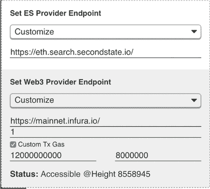

**图 6.1** 配置 BUIDL 以配合以太坊工作

接下来，在合约部分将您的 Solidity 代码输入到编辑器中，然后点击**编译**按钮。您将能够在侧边栏看到编译后的 ABI 和字节码（见图 6.2）。


**图 6.2** BUIDL 编译后的工件

当然，您还可以复制 ABI 和字节码并粘贴到您的其他工具中使用。

#### Remix 集成开发环境

Remix 是由以太坊基金会提供的基于网页的 Solidity 智能合约 IDE。您可以通过网页浏览器访问它：[`remix.ethereum.org/`](http://remix.ethereum.org/)。

您只需将 Solidity 源代码输入文本框，IDE 就会为您编译。编译输出通过点击合约名称旁边的**详情**按钮查看（图 6.3）。

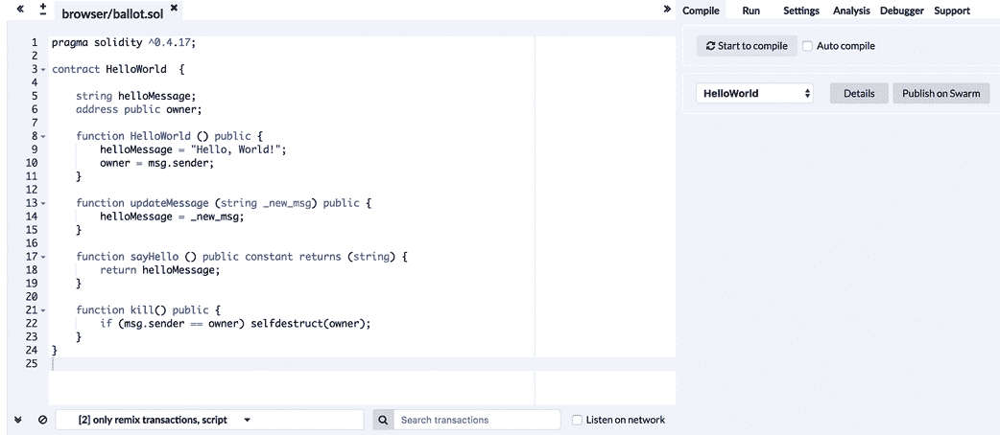

**图 6.3** Remix 集成开发环境编译 Solidity 智能合约。

正如图 6.4 所示，集成开发环境（IDE）提供了编译器的 ABI 和字节码结果，以及一个 GETH 脚本，以便为您方便地部署合约。

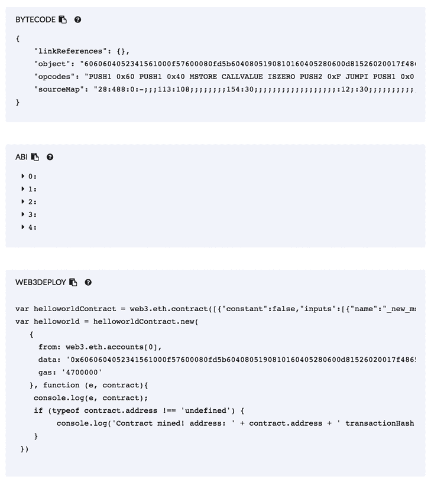

**图 6.4** 点击详情按钮显示智能合约的 ABI、字节码和一个部署脚本。

#### Truffle 框架

Truffle 框架显著简化了构建和部署智能合约的过程，我们推荐它在复杂的智能合约以及专业的软件开发环境中的自动化构建和测试。

Truffle 框架建立在 node.js 框架之上。因此，您首先需要确保 node.js 及其包管理器 npm 已安装在您的计算机上。您可以在[`www.npmjs.com/get-npm`](https://www.npmjs.com/get-npm)安装它们。在大多数 Linux 发行版上，您还可以使用系统包管理器安装它们。例如，以下命令在 CentOS/RedHat/Fedora Linux 系统上安装 node.js 和 npm：

点击此处查看代码图片

```
$ sudo yum install epel-release
$ sudo yum install nodejs npm
```

接下来，让我们使用 npm 包管理器安装 Truffle 框架。

点击此处查看代码图片

```
$ sudo npm install -g truffle
```

接下来，您可以使用 truffle 命令创建一个基本的项目结构。

点击此处查看代码图片

```
$ mkdir HelloWorld
$ cd HelloWorld
$ truffle init
$ ls
contracts        test            truffle.js
migrations        truffle-config.js
```

现在您可以在`HelloWorld/contracts`目录中创建一个`HelloWorld.sol`文件。该文件的内容在本章前面已经列出，您也可以从 GitHub 上的示例项目中获取。此外，创建一个`migrations/2_deploy_contracts.js`文件，以指示需要使用 Truffle 部署 HelloWorld 合约。`2_deploy_contracts.js`文件的内容如下：

点击此处查看代码图片

```
var HelloWorld = artifacts.require("./HelloWorld.sol");

module.exports = function(deployer) {
  deployer.deploy(HelloWorld);
};
```

您还需要更新`truffle.js`文件，该文件配置了部署目标。以下`truffle.js`示例有两个目标：一个是本地主机上的 TestRPC，另一个是本地网络上的以太坊测试网节点。

点击此处查看代码图片

```
module.exports = {

  networks: {
    development: {
      host: "localhost",
      port: 8545,
      network_id: "*" // Match any network id
    },
    testnet: {
      host: "node.ip.addr",
      port: 8545,
      network_id: 3, // Ropsten,
      from: "0x3d113a96a3c88dd48d6c34b3c805309cdd77b543",
      gas: 4000000,
      gasPrice: 20000000000
    }
  }
};
```

要编译和构建智能合约，您可以使用以下命令：

点击此处查看代码图片

```
$ truffle compile
Compiling ./contracts/HelloWorld.sol...
Compiling ./contracts/Migrations.sol...
Writing artifacts to ./build/contracts
```

在从区块链地址构造合约对象时，之前提到的合约 ABI 是一个 JSON 对象，在`build/contracts/HelloWorld.json`文件中。

点击此处查看代码图片

```
{
  "contractName": "HelloWorld",
  "abi": [
    ... ...
  ],
  ... ...
}
```

最后，您有两个部署选项。第一个选项是部署到 TestRPC。您的机器上必须运行 TestRPC。运行以下命令在 TestRPC 上部署`HelloWorld`合约：

点击此处查看代码图片

```
$ truffle migrate --network development
Using network 'development'.

Running migration: 1_initial_migration.js
  Deploying Migrations...
  ... 0x22cbcdd77c162a7d72624ddc52fd83aea7bc091548f30fcc13d745c65eab0a74
  Migrations: 0x321a5a4ee365a778082815b6048f8a35d4f44d7b
Saving successful migration to network...
  ... 0xcb2b363e308a22732bd35c328c36d2fbf36e025a06ca6e055790c80efae8df13
Saving artifacts...
Running migration: 2_deploy_contracts.js
  Deploying HelloWorld...
  ... 0xb332aee5093195519fa3871276cb6079b50e51308ce0d63b58e73fb5331016fc
  HelloWorld: 0x4788fdecd41530f5e2932ac622e8cffe3247caa9
Saving successful migration to network...
  ... 0x8297d06a8112a1fd64b2401f7009d923caa553516a376cd4bf818c1414faf9f9
Saving artifacts...
```

第二个选项是将部署到以太坊主网络。然而，由于这需要 gas，您需要先解锁一个带有 ETH 余额的账户。您可以使用附着在测试网节点上的 GETH 来完成这个操作。解锁的地址是在`truffle.js`文件中的`testnet/from`字段指定的。请参阅第五章以复习 GETH 账户解锁命令。

点击此处查看代码图片

```
$ ./geth attach http://node.ip.addr:8545 (http://172.33.0.218:8545/)
Welcome to the Geth JavaScript console!
modules: eth:1.0 miner:1.0 net:1.0 personal:1.0 rpc:1.0
> personal.unlockAccount("0x3d113a96a3c88dd48d6c34b3c805309cdd77b543", "pass");
true
```

然后使用`truffle`部署到测试网。

点击此处查看代码图片

```
$ truffle migrate --network testnet

Using network 'testnet'.

Running migration: 1_initial_migration.js
  Deploying Migrations...
  ... 0x958a7303711fbae57594959458333b4c6fb536c66ff392686ca8b70039df7570
  Migrations: 0x7dab4531f0d12291f8941f84ef9946fbae0a487b
Saving successful migration to network...
  ... 0x0f26814aa69b42e2d72731651cc2cdd72fca32c19f82073a76461b76265e564a
Saving artifacts...
Running migration: 2_deploy_contracts.js
  Deploying HelloWorld...
  ... 0xc97646bcd00f7a3d1745c4256b334cdca8ff965095f11645144fcf1ec002afc6
  HelloWorld: 0x8bc27c8129eea739362d786ca0754b5062857e9c
Saving successful migration to network...
  ... 0xf077c1158a8cc1530af98b960d90ebb3888aa6674e0bcb62d0c7d4487707c841
Saving artifacts...
```

最后，您可以验证在此地址上部署的合约：[`ropsten.etherscan.io/address/0x8bc27c8129eea739362d786ca0754b5062857e9c`](https://ropsten.etherscan.io/address/0x8bc27c8129eea739362d786ca0754b5062857e9c)

### 调用智能合约函数

现在您已经在区块链上部署了“Hello, World!”智能合约，您应该能够与它交互并调用其公共函数。

#### BUIDL IDE

一旦您配置了 BUIDL IDE 以与以太坊区块链协同工作，并点击**编译**按钮以编译您的 Solidity 智能合约，您就准备好部署它了。

点击**部署到链上**按钮（见图 6.5），将智能合约部署到以太坊区块链。部署的合约在“已部署”标签页中可用。您可以点击打开其中的任何一个，并直接从 BUIDL 内部与公共函数交互。

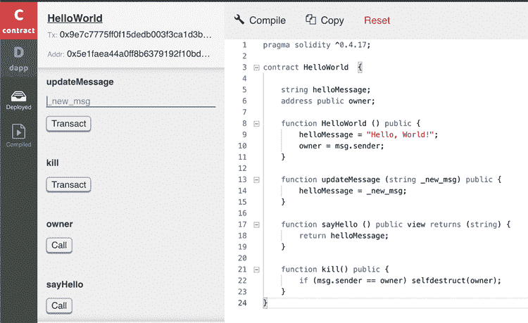

**图 6.5** 部署后的以太坊智能合约调用函数

#### Remix IDE

正如我在第四章中提到的，Remix IDE 可以构建一个智能合约的 UI，给定 ABI 和合约地址。合约的所有公共函数都列在 UI 中。那些导致区块链状态更改的函数（例如，需要 gas 操作的）被标记为红色按钮(图 6.6)。那些不导致状态更改的函数（即视图方法）被标记为蓝色按钮。您可以在每个按钮旁边的输入框中传递调用参数到函数。

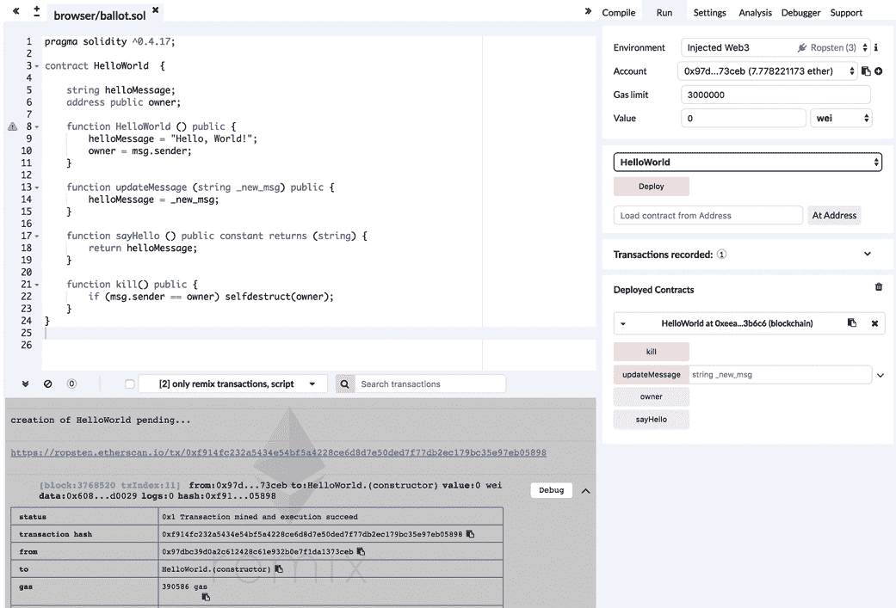

**图 6.6** 由 Remix 构建的智能合约 UI

Remix UI 虽然方便，但不能自动化，并且隐藏了交易的细节。为了完全理解智能合约是如何在区块链上执行的，我建议你直接在以太坊节点上与函数交互。在以太坊的情况下，这是一个运行 GETH 并连接到主网或测试网的节点。

**注意**

如第四章所示，你可以使用 web3.js JavaScript 库与 MetaMask 钱包协同工作，调用智能合约方法。但 web3.js 无法帮助你进行智能合约本身的交互式开发和调试。

#### GETH 控制台

GETH 是以太坊的 GO 语言客户端。你可以以一种模式运行 GETH，使其附加到一个以太坊节点（或 TestRPC，用于本地测试）。有关如何使用 GETH 自己运行以太坊节点的信息，请参阅第五章。

点击此处查看代码图片

```
$ geth attach http://node.ip.addr:8545
```

现在，你可以在控制台中通过`eth.contract().at()`方法创建合约实例。你需要两样信息。这两样信息都来自你用来将智能合约部署到区块链上的工具，这部分我将在下一节中介绍。

+   `contract()`方法中的 JSON 参数被称为 ABI。当你构建智能合约时，编译器会输出 ABI。在 Truffle 框架的情况下，ABI 位于`build/contracts/HelloWorld.json`文件中的 abi JSON 字段，其中所有换行符都被移除了。

+   `at()`方法参数是智能合约的特定实例地址。也就是说，你可以多次部署同一个智能合约类，每次以太坊区块链都会为它创建一个独特的地址。

点击此处查看代码图片

```
> var abi = [ { "constant": false, "inputs": [ { "name": "_new_msg",
"type": "string" } ], "name": "updateMessage", "outputs": [], "payable":
false, "stateMutability": "nonpayable", "type": "function" },
{ "constant": false, "inputs": [], "name": "kill", "outputs": [],
"payable": false, "stateMutability": "nonpayable", "type": "function" },
{ "constant": true, "inputs": [], "name": "owner", "outputs": [ { "name":
"", "type": "address" } ], "payable": false, "stateMutability": "view",
"type": "function" }, { "constant": true, "inputs": [], "name":
"sayHello", "outputs": [ { "name": "", "type": "string" } ], "payable":
false, "stateMutability": "view", "type": "function" }, { "inputs": [],
"payable": false, "stateMutability": "nonpayable", "type":
"constructor" } ]
> var helloContract = eth.contract(abi)
> var hello = helloContract.at("0x59a173...10c");
```

合约实例上的`sayHello()`方法不会改变区块链状态。因此，它是“免费”的，并且立即由连接到我们 GETH 控制台的节点执行。

```
> hello.sayHello()
"Hello, World!"
```

另一方面，`updateMessage()`方法会改变区块链上的合约内部状态。它必须由所有矿工执行，并在大多数矿工达成共识后记录在区块链上。因此，它的执行需要消耗燃料费（以 ETH 计），以支付矿工的努力。燃料费由方法调用中指定的账户提供。

如果你的 GETH 控制台连接到 TestRPC，你可能已经解锁了账户。但如果你连接到一个真实的以太坊节点，你可以在 GETH 控制台中使用以下命令创建一个新的以太坊账户，然后从你的钱包中向这个账户发送 ETH：

```
> personal.newAccount("passphrase")
```

接下来，账户必须解锁，以便我们可以“花费”其 ETH 作为燃料费。

点击此处查看代码图片

```
> personal.unlockAccount("0xd5cb83f0f83af60268e927e1dbb3aeaddc86f886")

Unlock account 0xd5cb83f0f83af60268e927e1dbb3aeaddc86f886
Passphrase:true
... ...

> hello.updateMessage("Welcome to Blockchain", {from:
"0xd5cb83f0f83af60268e927e1dbb3aeaddc86f886"})
"0x32761c528f426993ba980fdd212f929857a8bd392c98896a4e4a898077223c07"
> hello.sayHello()
"Welcome to Blockchain"
>
```

虽然燃料费很小，但它是必要的。如果你的账户在方法调用中指定的余额为零，并且无法支付燃料费，那么函数调用将会失败。当交易被矿工确认时，智能合约的状态变化将在所有区块链节点上最终确定。在以太坊区块链上，确认可能需要几分钟，这会降低用户体验。在类似于 CyberMiles 这样的与以太坊兼容的区块链上，确认时间可能快至几秒钟。这是在兼容的替代区块链上开发和部署以太坊应用程序的有力理由（在附录 A 中了解更多）。

### 一种新语言

虽然目前 Solidity 语言是用于以太坊智能合约开发的最广泛使用的编程语言，但它也难以使用且存在许多设计缺陷。特别是，它缺乏现代编程语言中常见的保护措施和逻辑分离。在 Solidity 中容易人为犯错。

实际上，一项大规模的代码审计显示，每 1000 行 Solidity 代码中约有 100 个明显的错误。这对于大多数实际上管理金融资产的 Solidity 代码来说是非常惊人的高，相比之下，非金融业务软件通常在每 1000 行代码中含有 10 个错误。

为了解决 Solidity 的问题，以太坊社区正在开发一种新的智能合约编程实验语言，称为 Vyper。它旨在提高人类可读性和可审计性。它移除了 Solidity 中的一些令人困惑的功能，应该能产生更安全的智能合约，错误更少。

虽然 Vyper 目前处于早期测试阶段，设计仍在变化，但它可能是以太坊开发的未来。在本节中，我将展示如何用 Vyper 重写 Solidity 的“Hello, World!”示例以及如何部署它。以下是智能合约的 Vyper 代码。你会注意到 Vyper 智能合约与 Python 语言相似。文件名是`HelloWorld.v.py`。文件名后缀是`.py`，以便开发工具使用 Python 规则突出其语法。如果这是一个问题，你也可以使用`.vy`后缀。

点击此处查看代码图片

```
#State variables
helloMessage: public(bytes32)
owner: public(address)

@public
def __init__(_message: bytes32):
    self.helloMessage = _message
    self.owner = msg.sender

@public
def updateMessage(newMsg: bytes32):
    self.helloMessage = newMsg

@public
@constant
def sayHello() -> bytes32:
    return self.helloMessage

@public
def kill():
    if msg.sender == self.owner:
        selfdestruct(self.owner)
```

要安装 Vyper 编译器，你需要 Python 3.6 或更高版本。由于 Vyper 仍然是一个不断发展的技术，官方文档建议从源代码构建。你可以在[`vyper.readthedocs.io/en/latest/installing-vyper.html`](https://vyper.readthedocs.io/en/latest/installing-vyper.html)找到最新的安装说明。

一旦你安装了 Vyper 应用程序，你就可以像运行任何其他编译器一样运行它。以下命令将输出合同编译后的字节码的十六进制字符串：

```
$ vyper HelloWorld.v.py
```

以下命令将输出合同的 ABI 的 JSON 字符串：

```
$ vyper -f json HelloWorld.v.py
```

有了字节码和 ABI，你可以使用 GETH 将智能合约部署到以太坊或 TestRPC。

点击此处查看代码图片

```
> var owner = "0xMYADDR"
> var abi = ...
> var bytecode = ...
> var gas = ...
> personal.unlockAccount(owner)
... ...
> var helloContract = eth.contract(abi)
> var hello = helloContract.new(owner, {from:owner, data:bytecode, gas:gas})
```

现在，类似于 Remix，还有一个 Vyper 合约的在线编译器：[`vyper.online/`](https://vyper.online/) (图 6.7)。您可以输入您的 Vyper 源代码，让网页应用程序将其编译成字节码(图 6.8)和 ABI(图 6.9)。

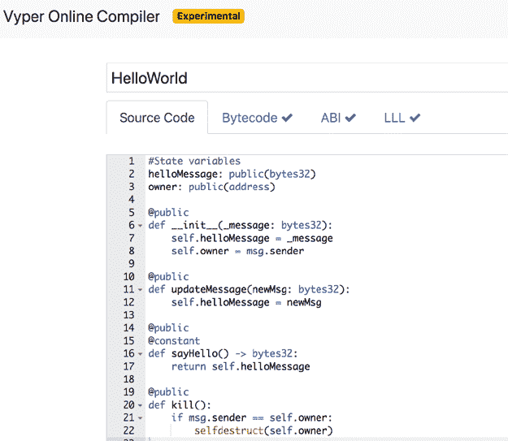

**图 6.7** 一个基于网页的 Vyper 编译器，vyper.online

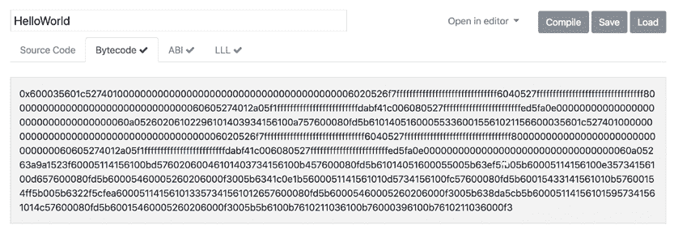

**图 6.8** vyper.online 编译的字节码

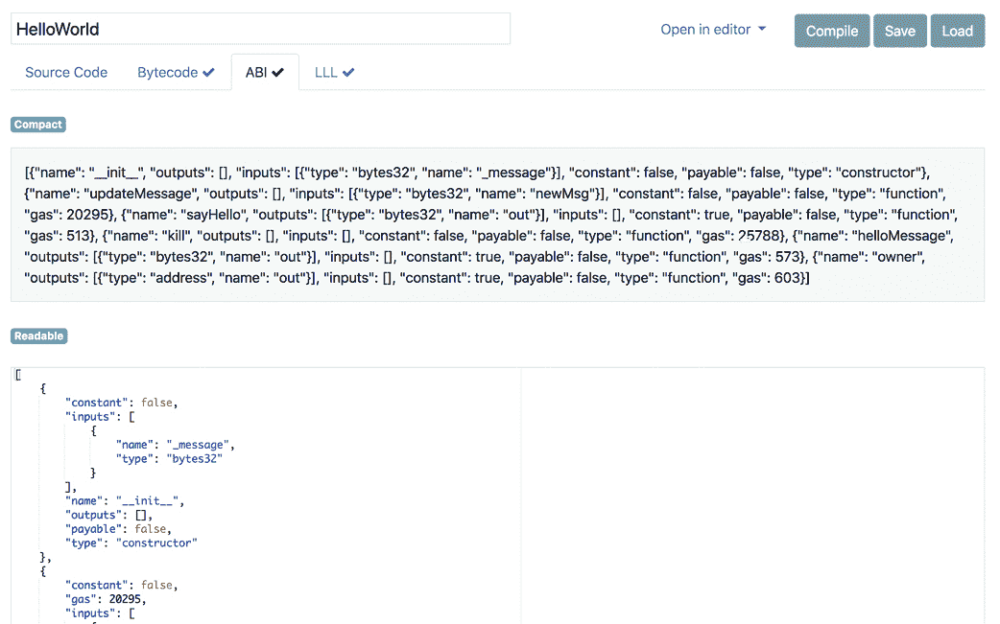

**图 6.9** vyper.online 生成的 ABI 界面

#### 更多智能合约语言

尽管 Vyper 语言与 Python 相似，但由于它去除了 Python 语言中一些重要的功能以使其程序具有确定性，因此不能将其称为 Python。所有区块链节点计算机在执行智能合约代码时必须产生相同的结果，以达到共识。因此，不能直接使用通用目的的计算机编程语言进行智能合约编程。该语言必须进行修改，以产生完全确定性的行为。

新一代区块链虚拟机正在利用如 WebAssembly（Wasm）虚拟机等最先进的虚拟机技术。例如，下一个以太坊虚拟机将基于 WebAssembly，称为以太坊风味 WebAssembly（eWASM）。另一个大型公共区块链，EOS，已经有一个基于 WebAssembly 的虚拟机。

这些新一代虚拟机通常基于支持在整个应用程序生命周期内进行优化的 LLVM 技术，从编译时间到链接时间再到运行时间。LLVM 使用应用程序源代码与机器字节码之间的中间表示（IR）代码格式，以支持“语言不可知”的编译器基础设施。IR 允许虚拟机支持多种源代码编程语言在前端。实际上，LLVM 已经支持了 20 多种编程语言。Solidity 和 Vyper 也在发展以与 LLVM IR 兼容。例如，开源的 SOLL 项目正在开发一个基于 LLVM 的 Solidity 编译器，用于下一代的区块链虚拟机。参见[`github.com/second-state/soll`](https://github.com/second-state/soll)。

然而，由于智能合约编程的独特限制，无法期望主流编程语言能够在区块链虚拟机上得到全面支持。当 EOS 说其智能合约编程语言是 C++时，它指的是一个经过修改的 C++版本，可以生成确定性程序。要修改和改革主流编程语言以支持智能合约编程，将是一项重大努力。所以，在不久的将来，我认为 Solidity 将继续是主导的智能合约编程语言。

### 结论

在本章中，我解释了智能合约是什么，如何编程它，以及如何与它交互。我涵盖了智能合约编程的 Solidity 语言和即将推出的 Vyper 语言。使用开源工具，我们探讨了不同的选项来测试和将智能合约部署到以太坊区块链网络。当然，Solidity 和 Vyper 仍然存在一些局限性。我将在第十四章介绍一种名为 Lity 的替代编程语言，它与 Solidity 完全向后兼容，但尝试解决一些最明显的问题。

## 7. 去中心化应用程序（Dapps）

在前一章中，我们讨论了智能合约的概念以及如何在以太坊区块链上与它们进行交互。然而，像 GETH、Truffle 这样的工具，甚至是 Remix 和 Metamask，都是针对开发者或高级用户的。对于普通用户来说，要访问区块链应用程序，用户界面（UI）、用户体验（UX）和支持基础设施方面还有很多工作要做。

当 Web 应用程序的用户体验开始与封闭网络上的客户端-服务器应用程序相匹配时，互联网才开始蓬勃发展。只有到了这个时候，互联网的开放和去中心化优势才开始显现。互联网擅长于促进开放生态系统的构建，这些生态系统可以协调多个数据和服务提供商。但是，只有当用户愿意使用 Web 应用程序时，这样的生态系统才是有用的。同样地，只有当应用程序用户体验与常规 Web 应用程序相媲美时，去中心化和自主的智能合约才能被大规模采用。于是就有了 *dapps*。

去中心化应用程序的目的是为智能合约和其他区块链功能提供 UI。理想情况下，一个 dapp 是一个丰富的客户端应用程序，下载到用户的设备上。它将多个后端服务（包括区块链服务）紧密结合在一起。一个 dapp 通常是一个可以从任何 Web 服务器下载的 JavaScript 应用程序（即没有可以被关闭的中心服务器）并且依赖于去中心化的区块链来实现其数据和逻辑功能。

在本章中，我通过一些值得关注的成功案例讨论了区块链 dapp 的架构设计和最佳实践。

**注意**

Ethereum 上的 dapp 开发是一项繁琐的工作。它要求你设置 Metamask、Remix、web3、Web 服务器，甚至可能是 Ethereum 节点，以及一大堆基础工具，只为了编写第一行代码。而且，标准的 Ethereum dapp 默认情况下无法在移动设备上运行。

另一方面，BUIDL 是一个完整的 dapp 开发环境，几乎不需要任何设置。BUIDL 应用程序可以发布到 Web 上，并从移动设备访问。了解更多关于 BUIDL 的内容，请参阅第三章和第四章。

### Dapp 栈

一旦我们构建并测试了智能合约，是时候为用户与智能合约交互构建 dapp UI 了。这里的想法是，与依赖中心服务器进行逻辑和数据处理的 Web 应用程序不同，dapp 可以将用户数据保存在本地，并利用包括区块链服务在内的多个后端服务，以实现去中心化(图 7.1)。

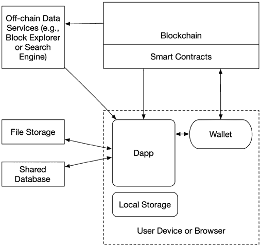

**图 7.1** dapp 架构

通常，dapp 在用户的设备上作为客户端 JavaScript 应用运行。其主要功能是提供用户界面。它与区块链智能合约交互以获取核心数据和应用逻辑。它还可以与其他公共服务甚至本地服务交互，以存储和管理链下数据。dapp 的链下数据与常规 Web 应用的中心服务器数据的最重要区别在于，当需要时，dapp 的服务器数据可以被复制和替换。dapp 基础设施中没有单点故障。

例如，去中心化应用（dapp）可以利用设备的 HTML5 本地存储 API 来存储特定于该设备用户的用户数据。

你可以在任何客户端 JavaScript 框架中编写 dapp。常见的例子包括 jQuery 和 ReactJS。在 Truffle 项目中，你可以找到创建 dapp 的模板([`truffleframework.com/boxes`](https://truffleframework.com/boxes))，适用于流行的 JavaScript 框架。

#### web3 库

JavaScript 应用程序通过一个名为 web3.js 的库连接到区块链服务([`github.com/ethereum/web3.js/`](https://github.com/ethereum/web3.js/)）。目前，web3.js 只支持以太坊区块链，并且尚未达到 1.0 版本。然而，它已经是连接 dapp 和区块链服务最受欢迎的库。web3 库提供以下功能：

+   从一个地址发送或转移资金到另一个地址

+   部署智能合约

+   调用已部署智能合约的公共函数

+   估算合约函数调用的燃气费

+   查询合约或地址状态

web3.js 库需要私钥来签署发送到区块链的交易。正如你所见，区块链账户私钥由钱包应用程序存储和管理；web3.js 库应与兼容的钱包应用程序一起使用。钱包也被称为*web3 提供商*。检测 web3 提供程序的可用性和有效性是 dapp JavaScript 代码的事。MetaMask 是针对以太坊的 web3 提供商。"第四章的"Hello, World!"网络应用程序是一个与 MetaMask 协同工作的 web3 dapp 的例子。

**注意**

除了更受欢迎的 web3.js，以太坊 JS 库（[`ethereumjs.github.io/`](https://ethereumjs.github.io/)）可以在没有钱包应用程序的情况下签署以太坊交易。然而，要做到这一点，JavaScript 代码必须能够访问账户私钥。它提供了一个 JavaScript 库（[`github.com/ethereumjs/ethereumjs-wallet`](https://github.com/ethereumjs/ethereumjs-wallet)）来实现你自己的嵌入式钱包。

**注意**

跨区块链应用程序，如 Scatter [`get-scatter.com/`](https://get-scatter.com/)，像钱包一样运行 dapps。

#### 外部服务

正如我所说，dapps 只在区块链智能合约上存储核心逻辑和数据。在区块链上存储大量数据太慢，也太昂贵。大多数应用程序还需要媒体文件、数据库等其他离链数据才能运行。dapp 可以使用在线服务来存储和管理数据。以下是一些示例：

+   星际文件系统（IPFS）[`ipfs.io/`](https://ipfs.io/) 是一个基于区块链的媒体文件存储和交换服务协议。Dapps 可以在 IPFS 上存储大量用户文件，并使它们无处不在。

+   Swarm（[`ethersphere.github.io/swarm-home/`](https://ethersphere.github.io/swarm-home/)）是基于以太坊的文件存储和共享解决方案。

+   GitHub [`github.com/`](https://github.com/)、Dropbox [`www.dropbox.com/`](https://www.dropbox.com/) 或 Google Drive [`www.google.com/drive/`](https://www.google.com/drive/) 是传统互联网文件存储和共享服务的示例，可以被个别 dapp 用户访问。你可以使用 GitHub 或 Dropbox 网站直接从个别用户账户中服务 dapp JavaScript 文件。

+   数据库即服务（DBaaS）提供商，如微软 Azure SQL [`azure.microsoft.com/en-us/services/sql-database/`](https://azure.microsoft.com/en-us/services/sql-database/)、亚马逊关系型数据库服务 [`aws.amazon.com/rds/`](https://aws.amazon.com/rds/)、谷歌大数据查询 [`cloud.google.com/bigquery/`](https://cloud.google.com/bigquery/) 和 MongoDB Atlas [`www.mongodb.com/cloud/atlas`](https://www.mongodb.com/cloud/atlas) 是可以被 dapps 用来存储应用程序数据的数据库服务示例。

+   离链数据服务是一个查询接口，用于搜索和浏览区块链数据，如交易、账户和智能合约函数调用。它比调用视图函数获取智能合约数据要强大、多功能和可扩展得多。这个方法在第十章中有更详细的讨论。

确保离链数据的安全性和有效性的常见设计实践是将数据的哈希存储在链上智能合约中。

一个 dapp 比大多数 web 应用程序更复杂。从一开始，你就要设计应用的哪部分基于区块链智能合约，哪部分利用离线服务器端数据，哪部分是客户端 UI。这些元素中的每一个都需要其自己的软件堆栈来运行并与其他应用部分进行通信。

### 区块链应用展示

由于以太坊的确认时间较慢（长达十秒）和执行智能合约功能的汽油费较高，迄今为止成功的以太坊 dapp 都是不需要频繁用户交互的金融应用。

#### Uniswap

最精致的以太坊 dapp 之一就是 Uniswap 交易所。它是一个去中心化的加密货币交易所。该想法是，一些人将向流动性池做出初始贡献（作为市场制造商）并获得交易费的一部分。所有其他交易者都将根据简单的供需定价公式与流动性池进行交易。如果流动性池中的代币变得稀缺，其相对于 ETH 的价格将会上涨，从而激励持有者将其卖回给流动性池。这种机制使得交易在没有匹配对手方的情况下完全自动化。整个 Uniswap 系统是运行在以太坊区块链上的一组智能合约。应用状态完全存储在并由合约管理。

Uniswap 项目开发了一个精致的 UI 界面(图 7.2)以便与底层智能合约进行交互。这个 UI 界面完全是用 web3 JavaScript 编写的，并且完全实现了国际化。通过 dapp UI，新手用户可以为流动性池贡献资金，并为他们存入的加密货币赚取费用，或者可以立即开始交易 ERC20 代币对。

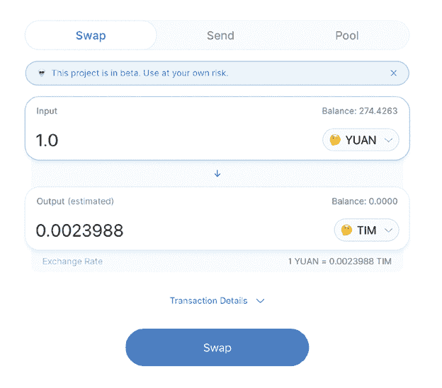

**图 7.2** Uniswap UI

Uniswap dapp 的一个有趣之处在于它确实是去中心化的。应用逻辑和数据都存储在以太坊区块链上。任何人都可以创建一个网站来托管 JavaScript dapp，所有这些 dapp 的副本都会以相同的方式运行，因为它们都从区块链获取逻辑和数据。在 Uniswap 中，以太坊真正成为了一个“计算机”后端。

#### CryptoKitties

CryptoKitties 游戏在 2017 年底以风暴之势席卷了以太坊。它催生了对加密收藏品和非同质化代币的想法，这些后来成为了 ERC721 规范。

存在于以太坊区块链上的 CryptoKitties 是一种独特的数字实体。它们是智能合约中的数据。它们的独特性由合约代码保证。每个 CryptoKittie 都有一个关联的所有者地址。CryptoKitties 可以在区块链上进行购买、出售和交易。

关于 CryptoKitties 的一个有趣之处在于它们 visually appealing(图 7.3)。dapp UI 设计可视化了每个数字实体的独特特征。这对 CryptoKitties 的成功做出了重大贡献。

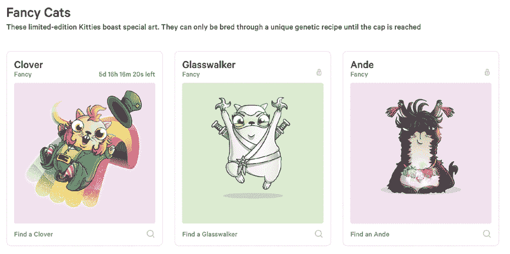

**图 7.3** 加密猫

#### 赌博游戏

赌博游戏是流行的 DApps。它们是智能合约的优秀用例，具有透明的规则和投注池。它们也从很大程度上未受监管的加密货币中受益匪浅。

然而，赌博游戏通常是交互性的，要求用户经常对别人的实时投注进行下注。以太坊的慢确认时间对于这类游戏来说是一个巨大的障碍。像 EOS 和 Tron 这样的更快的区块链，Tron 本身是从以太坊分叉出来的，现在是一些专门针对赌博 DApps 的区块链。

#### 交互式 DApps

大多数互联网应用都是互动式的。为了让以太坊区块链支持交互式应用，性能是一个重要因素。Lity 项目为以太坊协议创建了高性能的扩展和工具。它使我们能够创建有趣的交互式 DApps。请参阅第十六章以获取几个完整的示例。

### 结论

一个 DApp 通常是一个与钱包应用程序并行运行的 web3 应用程序。它与区块链上的智能合约进行交互，以获取基本数据和核心应用程序逻辑。它还可以使用本地存储或第三方服务来存储和管理对用户私有的非必要数据或可以由公众重建的数据。在下一章中，我将讨论应用程序如何使用区块链数据服务，以及区块链交易，以提供丰富的用户体验。

## 8. DApps 的替代方案

去中心化应用（DApps）的概念很有吸引力，并且与区块链技术的最明显用例（如点对点融资）密切相关。然而，世界从来都不是二元的。还有许多区块链应用用例可以适合传统网络应用的模型。这些通常是用例，其中公共或联盟区块链的透明性和不可变性可以为现有业务增加价值。应用程序只需要区块链作为一个特性，并不需要去中心化整个应用程序本身。电子商务网站的支付处理器以接受加密货币就是一个很好的例子。加密货币交易所（加密货币之间或加密货币与法定货币之间）是另一个例子。

对于这些应用，我们需要从服务器端发起区块链交易和/或调用智能合约函数。为此，账户的私钥或密钥库和密码必须在服务器端进行管理。

+   对于新交易，这是显而易见的，因为发送方账户需要使用其私钥来验证其资金的转出。

+   对于修改合约状态，以太坊兼容的区块链要求请求更改的一方支付“燃气费”给网络维护者（矿工）以验证请求并在新块中记录更改。这也需要将资金（燃气费）从请求者的账户中转出，因此需要其私钥。

在本章中，我们探讨了如何从网络应用程序中访问以太坊兼容的区块链功能。基本方法是使用一个 web3 兼容的库，但不需要像 Metamask 这样的客户端钱包。

### javascript

节点.js 框架使得 JavaScript 应用程序能够部署在服务器端。因此，在 node.js 服务器应用程序中使用 web3.js 库（或兼容的 web3-cmt.js 库）是可行的。

#### 完整节点钱包

第一种方法是使用一个完全同步的以太坊节点作为应用程序的“钱包”。运行节点的 GETH（以太坊）或 Travis（CyberMiles）软件能够管理密钥库（即 web3.personal 包），签署交易，并将交易广播到其他区块链节点。通过区块链节点的远程过程调用（RPC）接口，外部应用程序可以与区块链互动。

您需要在一个防火墙后同步一个完整的以太坊（或以太坊兼容的区块链，如 CyberMiles）节点。节点应该开启 RPC 服务（即以太坊默认端口 8545），这样服务器端网络应用程序就可以在防火墙后访问它。重要的是，节点的 8545 端口应完全被防火墙封锁，并且仅在防火墙内可用，如图 8.1 所示。

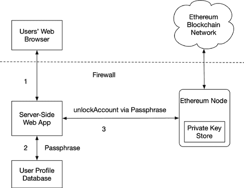

**图 8.1** 防火墙后的设置

以下代码示例展示了如何调用`HelloWorld`合约的`updateMessage()`函数（参见第四章）在 helloMessage 中记录一个新的状态，并支付其燃气费。我们假设节点.js 服务器上的 web3.js 实例附属于一个已经包含一个账户私钥的密钥库的以太坊节点。该账户有足够的余额支付此次交易的燃气费。您只需要使用密码短语解锁账户。

点击此处查看代码图片

```
web3 = new Web3(new Web3.providers.HttpProvider(
              "http://node.ip.addr:8545"));
web3.personal.unlockAccount("...", pass);
hello.updateMessage(new_mesg);
```

当然，将密钥库存储在节点上仍然是不安全的。单个配置错误的防火墙设置可能会使节点的 8545 端口暴露给攻击者。攻击者可以轻松地访问服务器上的所有私钥，因为它们被网络应用程序解锁。

#### 原始交易

第二种方法是创建已签名的原始交易，然后简单地使用 web3.js 将交易广播到一个区块链节点。在这种设置中，区块链节点可能是一个位于防火墙外的第三方托管节点，如 Infura 节点。区块链节点不存储任何私钥或密钥库。然而，网络应用程序本身却在数据库表中管理它需要的私钥。图 8.2 展示了这种设计的架构。

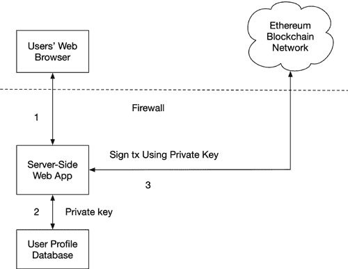

**图 8.2** 应用程序管理的私钥

签署原始交易超出了 web3.js 的范围。在这里我们使用 EthereumJS 库与 web3.js 协同工作。特别是，`ethereumjs-tx`项目提供了使用私钥签署交易的方法。在这种情况下，私钥通常存储在数据库表中。

下面的代码展示了如何使用已签名的原始交易在以太坊上部署`HelloWorld`智能合约。交易费用由账户支付，应用程序可以访问私钥。

点击此处查看代码图片

```
const Web3 = require("web3");
const Tx = require('ethereumjs–tx')
web3 = new Web3(new Web3.providers.HttpProvider(
            "http://node.ip.addr:8545"));

var account = "0x1234"; // Ethereum account address
var key = new Buffer('private key', 'hex');

var abi = // ABI of Hello World
var bytecode = // Bytecode of Hello World

var create_contract_tx = {
    gasPrice: web3.toHex(web3.eth.gasPrice),
    gasLimit: web3.toHex(3000000),
    data: bytecode,
    from: account
};

var tx = new Tx(create_contract_tx);
tx.sign(key);

var stx = tx.serialize();
web3.eth.sendRawTransaction('0x' + stx.toString('hex'), (err, hash) => {
    // ... Test if success
});
```

下一个示例展示了如何调用合约上的`updateMessage()`函数：

点击此处查看代码图片

```
const Web3 = require("web3");
const Tx = require('ethereumjs–tx')
web3 = new Web3(new Web3.providers.HttpProvider(
            "http://node.ip.addr:8545"));

var account = "0x1234"; // Ethereum account address
var key = new Buffer('private key', 'hex');

var abi = // ABI of Hello World
var contract_address = "0xabcd";
var contract = web3.eth.contract(abi).at(contract_address);
var data = contract.updateMessage.getData(msg);
var nonce = web3.eth.getTransactionCount(account);

var call_contract_tx = {
    nonce: web3.toHex(nonce),
 gasPrice: web3.toHex(web3.eth.gasPrice),
    gasLimit: web3.toHex(3000000),
    from: account,
    to: contract_address,
    value: '0x00',
    data: data
};

var tx = new Tx(call_contract_tx);
tx.sign(key);

var stx = tx.serialize();
web3.eth.sendRawTransaction('0x' + stx.toString('hex'), (err, hash) => {
    // ... Test if success
});
```

以太坊 JS 库远不止`ethereumjs-tx`。它提供了用于管理私钥、密钥库和钱包的 JavaScript。如果你需要进行大量的密钥管理以及自行进行低层次编程，这将非常有用。

### Python 及其他

尽管 JavaScript 是 web3.js 的本机语言，但许多开发人员不喜欢在服务器应用程序中使用 JavaScript。正因为如此，才有了其他编程语言的 web3 库实现。例如，web3.py 是 web3 的 Python 实现。下面的代码展示了如何从 GETH 密钥库文件中解密并构建私钥。你可以将这个密钥库文件的内容存储在数据库表中，其密码存储在另一个数据库表中。

点击此处查看代码图片

```
with open('filename') as keyfile:
    encrypted_key = keyfile.read()
    private_key = w3.eth.account.decrypt(encrypted_key, password)
```

在私钥就位的情况下，接下来的代码段将展示如何使用 web3.py 构建原始交易，将 ETH 从一台账户转移到另一台账户。

点击此处查看代码图片

```
from web3 import Web3

tx = {\
    'to': '0xABCD',\
    'value': w3.toWei('10', 'ether'),\
    'gas': 2000000,\
    'gasPrice': w3.toWei('2', 'gwei'),\
    'nonce': 0\
}

private_key = b"\xyz123"
signed = w3.eth.account.signTransaction(transaction, private_key)
tx_hash = w3.eth.sendRawTransaction(signed.rawTransaction)
```

下一个示例展示了如何使用 web3.py 调用智能合约函数：

点击此处查看代码图片

```
from web3 import Web3

contract_address = ="0xWXYZ"
contract = w3.eth.contract(address=contract_address, abi=HELLO_ABI)
nonce = w3.eth.getTransactionCount('0xABCD')
tx = contract.functions.updateMessage(\
    'A new hello message'\
).buildTransaction({\
    'gas': 70000,\
    'gasPrice': w3.toWei('2', 'gwei'),\
    'nonce': nonce\
})

private_key = b"\xyz123"
signed = w3.eth.account.signTransaction(tx, private_key)
tx_hash = w3.eth.sendRawTransaction(signed.rawTransaction)
```

`web3.py`库显然有很多内容，并且与 web3.js 在具体的 API 使用上有显著差异。我鼓励感兴趣的读者查阅其在[`web3py.readthedocs.io`](https://web3py.readthedocs.io)的文档。此外，还有其他编程语言可以选择的 web3。

+   *PHP 的 web3*：[`github.com/formaldehid/php-web3`](https://github.com/formaldehid/php-web3)

+   *Java 的 web3*：[`github.com/web3j/web3j`](https://github.com/web3j/web3j)

由于 web 应用程序根据你选择的开发框架而有很大差异，我将留给你自己练习构建自己的 web 应用程序。

### 结论

在本章中，我讨论了如何构建与区块链和智能合约交互的服务器端应用程序。这些应用程序需要中心服务器才能运行，因此与第七章中讨论的去中心化应用程序（dapps）相比，其去中心化程度较低。然而，从短期来看，将去中心化特性整合到其他中心化应用程序中，可能是区块链应用程序大规模采用的最可行路径。
