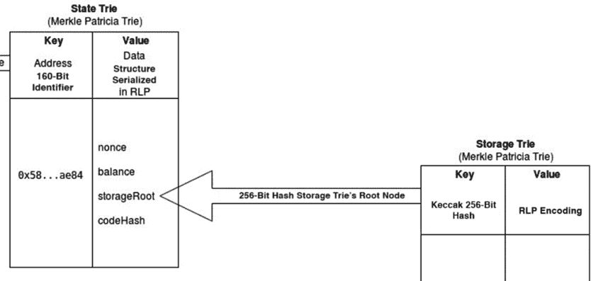
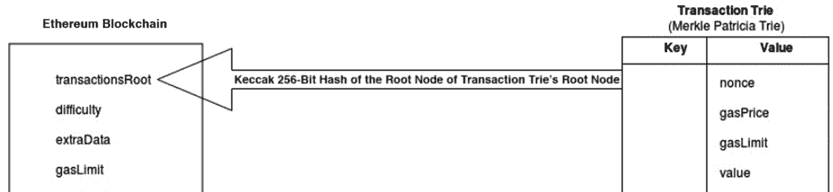

# 第三部分：深入以太坊

在上一部分中，我向你介绍了以太坊智能合约和 DApp 开发的的概念和工具。在接下来的几章中，我们将更深入地了解以太坊。我们将探讨智能合约数据和状态是如何存储在以太坊区块链中的，以及智能合约开发者如何利用这些数据。我们还将探讨保障智能合约安全的最佳实践，这是社区今天面临的一个主要问题。最后，我们将回顾以太坊路线图，了解开发人员即将面临的内容。

## 9. 以太坊内部

作者：Tim McCallum

在前几章中，你已经学习了如何作为客户端从外部与以太坊区块链进行交互。这些章节涵盖了执行交易、开发和部署智能合约以及使用 web3 库等工具开发去中心化应用（DApps）等内容。然而，为了真正理解以太坊的工作原理，或许为了你自己的目的而修改其行为，我们需要更深入地研究区块链平台的对外接口之下。

在本章中，我解构了以太坊，为您提供了对其数据存储层的理解，并介绍了区块链状态的概念。此外，我涵盖了帕特里夏（Patricia）字典树数据结构的理论，并展示了以太坊使用谷歌的 LevelDB 数据库实现字典树的具体方式。从这一点开始，您将能够执行交易并探索以太坊状态如何响应交易等活动。

### 区块链状态是什么？

比特币的状态由其全球未花费交易输出（UTXO）集合表示。比特币中的价值转移是通过交易进行的。更具体地说，比特币用户可以通过创建交易并添加一个或多个 UTXO 作为交易的输入，来花费一个或多个 UTXO。

本章对未花费交易输出（UTXO）的完整解释超出了范围。然而，我在下面的段落中提到 UTXO，以指出比特币和以太坊之间的根本区别。具体来说，下面的两个比特币示例将提供比特币的 UTXO 模型与以太坊的世界状态之间的对比。

首先，比特币的 UTXO 不能部分花费。如果一个比特币用户花费了 0.5 比特币（使用她唯一的 UTXO，价值 1 比特币），用户必须故意自我地址（发送给自己）0.5 比特币（BTC）作为回报(图 9.1)。如果用户不发送回报，她将把 0.5 比特币的回报损失给挖出她交易的比特币矿工。


**图 9.1** 发送部分比特币

其次，在最深层次上，比特币不维护用户账户余额。在比特币中，用户只需在任意给定时间持有一个或多个 UTXO 的私钥(图 9.2)。数字钱包使得看起来比特币区块链会自动存储和组织用户账户余额等等。并非如此。


**图 9.2** 计算比特币账户余额

比特币中的用户账户余额是一个抽象概念。实际上，用户账户的余额是每个单独 UTXO（用户持有相应的私钥）的总和，如图 9.3 所示。图 9.3 中用户持有的密钥可用于单独签名/花费每个 UTXO。


**图 9.3** 比特币钱包合并未使用的交易输出（UTXO）以显示账户余额。

比特币中的 UTXO 系统运作良好，部分原因是因为数字钱包能够处理与交易相关的多数任务。这包括但不限于以下内容：

+   处理未使用的交易输出（UTXO）

+   存储密钥

+   设置交易费用

+   提供返回找零地址

+   合并 UTXO（以显示可用的、挂起的和总余额）

有趣的是，非确定性钱包（如比特币核心钱包，如图 9.3 所示）的备份仅提供了 UTXO 的快照（在那一刻）。如果用户进行任何交易（发送或接收），用户最初所做的备份将会过时。

总结一下，你现在知道以下内容：

+   比特币区块链不保存账户余额。

+   比特币钱包持有 UTXO 的密钥。

+   如果一个 UTXO 包含在交易中，那么整个 UTXO 将被花费（在某些情况下作为找零以新 UTXO 的形式部分接收）。

接下来，让我们看看以太坊区块链。

### Ethereum 状态

与之前的信息相比，以太坊世界状态能够管理账户余额等更多内容。以太坊的状态不是一个抽象概念。它是以太坊基础协议层的一部分。以太坊是一个基于交易的态机；换言之，它是所有基于交易的态机概念可以建立的技术。

在每个以太坊节点上存储状态数据使得轻量级客户端能够不下载整个区块链的情况下正常工作。轻量级客户端只需访问节点上的状态数据库，就能获取整个系统的当前状态并发送交易以更改状态。这使得可以在以太坊区块链上高效地开发出一系列应用程序。如果没有在节点和轻量级客户端上保存数据，大多数智能合约或去中心化应用（DApp）的使用场景将无法实现。

例如，以太坊白皮书中有个有趣的想法，就是储蓄账户的概念。在这种情况下，两个用户（可能是丈夫和妻子，或商业伙伴）可以每天各自提取账户总余额的 1%。这个想法在白皮书的“进一步应用”部分提到，但它有趣之处在于，理论上，这可以作为以太坊基础协议层的一部分来实现（而不是必须作为第二层解决方案或第三方钱包的一部分来编写）。你可能还记得本章早些时候关于比特币 UTXO 的讨论。UTXO 对区块链数据是盲目的，正如讨论的那样，比特币区块链实际上并不存储用户的账户余额。正因为如此，比特币的基础协议层不太可能（或者可能无法）实现任何类型的每日支出限制。

接下来，让我们深入了解以太坊状态数据存储的实际结构。

#### 数据结构

让我们从开始的地方说起。与所有其他区块链一样，以太坊区块链从它的创世区块开始。从这一点（区块 0 的状态）开始，诸如交易、合约和挖矿等活动将不断改变以太坊区块链的状态。在以太坊中，一个例子就是账户余额（存储在状态梅克尔树中，如图 9.4 所示），每当与该账户相关的交易发生时，该余额就会发生变化。


**图 9.4** 以太坊节点数据存储的内部结构

重要的是，诸如账户余额之类的数据并不是直接存储在以太坊区块链的区块中。只有交易梅克尔树、状态梅克尔树和收据梅克尔树的根节点哈希值是直接存储在区块链中的。

你也会注意到，从图 9.4 中，存储梅克尔树的根节点哈希（保存所有智能合约数据的地方）实际上指向状态梅克尔树，而状态梅克尔树又指向区块链。我将会放大并详细讲解所有这些内容。

以太坊中有两种截然不同的数据类型：永久数据和短暂数据。永久数据的一个例子是交易。一旦交易被完全确认，它就会记录在交易梅克尔树中，并且永远不会被更改。一个短暂数据的例子是特定以太坊账户地址的余额。账户地址的余额存储在状态梅克尔树中，每当针对该特定账户的交易发生时，该余额就会被更改。永久数据（如挖出的交易）和短暂数据（如账户余额）应该分别存储是合理的。以太坊使用梅克尔树数据结构（如前面广泛概述的）来管理数据。下一节将暂时偏离主题，并提供关于梅克尔树的快速概述。

### 梅克尔树（或树）

字典树（或树）是一种众所周知的数据结构，用于存储字符序列。以太坊专门使用所谓的“以字母数字编码的信息的实际检索算法”（Patricia）字典树。Patricia trie 的主要优点是其紧凑的存储。现在我们将分析标准（更传统）trie 与 Patricia trie 的内部工作原理。

#### 标准 Trie

**图 9.5** 显示了存储单词的标准 trie 的结构。单词中的每个字符都是树的一个节点，每个单词都以一个特殊的空指针终止。


**图 9.5** 标准字典树存储两个单词。特殊字符 \0 表示空指针。

##### 向 trie 添加单词的规则

我们按照要添加的单词的搜索路径进行操作。如果我们遇到一个空指针，我们就创建一个新的节点。当我们完成单词的添加后，我们创建一个空指针（终止符）。当添加一个（更短）的单词，而它包含在另一个（更长）的单词中时，我们只需耗尽所有字符，然后添加一个空指针（终止符）。

##### 从 trie 中删除单词的规则

我们搜索代表我们要删除的字符串的 trie 上的叶子（分支的末端）。然后我们从叶子开始删除从叶子到 trie 根的所有节点，除非我们遇到一个有多个子节点的节点；在这种情况下，我们停止删除。

##### 在 trie 中搜索单词的规则

我们检查要搜索的字符串中的每个字符，并按照 trie 提供我们的路径（正确的顺序）进行操作。如果我们在我们耗尽字符串中的所有字符之前遇到一个空指针，那么我们可以得出这个字符串不在 trie 中的结论。相反，如果我们到达一个叶子（分支的末端）并且从叶子回到 trie 根的路径代表我们的字符串，我们得出这个字符串存储在 trie 中的结论。

#### Patricia Trie

**图 9.6**（ch09.xhtml#ch09fig6）显示了存储单词的 Patricia trie 的结构。与标准 trie 相比，存储更为紧凑。每个单词都以一个特殊的空指针终止。


**图 9.6** 存储两个单词的 Patricia trie

##### 向 Patricia Trie 添加单词的规则

Patricia tries 将所有常见字符组合到一个单一分支中。任何不寻常的字符将构成路径中的新分支。当向 Patricia trie 添加一个单词时，我们耗尽所有字符，然后添加空指针（终止符），如图 9.7 所示。


**图 9.7** 将单词（`*wooden*`）添加到 Patricia trie

##### 从 Patricia Trie 中删除单词的规则

这与传统字典树相同，除非是在删除节点（从叶子节点回溯到根节点）时，我们必须确保所有父节点至少拥有两个子节点。一个单独的子节点可以只包含字符和一个空指针（这种情况出现在图 9.7 的每个单词末尾），一个单独的节点也可以只有一个空指针（如果一个较短的单词包含在一个较长的单词中）。参见图 9.7，它展示了*wood*和*wooden*如何在同一个字典树中共存。

重要的是，当从字典树中删除时，不能留下一个路径，其父节点只连接到一个子节点。如果发生这种情况（在删除时，我们需要连接适当的字符来解决此问题）。这在图 9.8 中说明（我们在字典树中删除单词）。


**图 9.8** 从帕特里夏字典树中删除单词(*word*)并重新组织它

##### 在帕特里夏字典树中搜索单词的规则

搜索帕特里夏字典树的规则与搜索标准字典树的规则相同。

#### 字典树与帕特里夏字典树的相似之处

添加的运行时间“O”是 O(mN)，其中“m”是我们正在添加的字符串的长度，“N”是可用的字母表的大小。

删除的运行时间是 O(mN)，其中“m”是我们想要删除的字符串的长度，“N”是可用的字母表的大小。

搜索的运行时间是 O(m)，其中“m”是我们正在搜索的字符串的长度。

#### 字典树与帕特里夏字典树的主要区别

使用帕特里夏字典树的主要优点是与存储有关。

标准字典树的存储需求“O”是 O(MN)，其中“M”是字典树中所有字符串的总长度，“N”是可用的字母表的大小。

帕特里夏字典树的存储需求“O”是 O(nN+M)，其中“n”是存储在帕特里夏字典树中的字符串数，“N”是可用的字母表的大小，“M”是字典树中所有字符串的总长度。

简而言之，你将会注意到字典树的深度有明显的不同。帕特里夏字典树（Patricia trie）较浅。这是因为帕特里夏字典树能够将常见字符分组（并将空指针连接到叶子节点）。

#### 修改后的 Merkle Patricia 字典树

在以太坊状态数据库中，数据存储在一个修改后的 Merkle Patricia 字典树中，这意味着字典树的根节点是叶子中数据的哈希。这种设计使得每个节点上的状态数据库抵抗篡改，就像区块链本身一样。

在以太坊中，对字典树（trie）进行的每项功能（插入、更新和删除）都使用一个确定性的加密哈希。此外，字典树根节点的唯一加密哈希可以用作证据，证明字典树没有被篡改过。

例如，对树中任何层次的数据（如增加账户余额）的任何更改都会完全改变根哈希。这一加密特性为轻客户端（不存储整个区块链的设备）提供了快速可靠地查询区块链的机会；换句话说，账户 0x…4857 是否有足够的资金在区块高度 5044866 完成这笔购买？

### 以太坊中的树结构

让我们更深入地了解一下状态树、存储树和交易树。

#### 状态树：独一无二的一个

以太坊中只有一个全局状态树。这个全局状态树是在不断地更新。状态树包含以太坊网络上存在的每个账户的一个键值对。

+   **关键**是一个 160 位的唯一标识符（以太坊账户的地址）。

+   全局状态树中的**值**是通过使用递归长度前缀（RLP）编码方法编码以下以太坊账户详情生成的：nonce、余额、存储根、代码哈希。

状态树的根节点（给定时间点整个状态树的哈希）是状态树的安全且唯一的标识符；状态树的根节点与所有内部状态树数据在密码学上有关。状态树的根节点存储在状态树更新的以太坊区块头部（见图 9.9）并且可以从区块中查询（图 9.10）。


**图 9.9** 状态树（LevelDB 实现的 Merkle Patricia 树）与以太坊区块之间的关系


**图 9.10** 展示树根

#### 存储树：智能合约数据存放之处

存储树是所有合约数据存放的地方。每个以太坊账户都有自己的存储树。存储树的根节点的 Keccak 256 位哈希作为全局状态树的存储根值存储（图 9.11）。



**图 9.11** 状态树——状态树的根节点的 Keccak 256 位哈希作为给定区块的状态根值存储

#### 交易树：每个区块一个

每个以太坊区块都有自己的独立交易树。一个区块包含许多交易。当然，区块中交易的顺序是由组装区块的矿工决定的。在交易树中找到特定交易的路径是通过该交易在区块中的位置的 RLP 编码。挖出的区块永远不会被更新；交易在区块中的位置永远不会改变。这意味着一旦你在区块的交易树中找到一个交易，你可以反复回到相同的路径来获取相同的结果。**图 9.12**显示了交易树的根哈希如何存储在以太坊区块头部。图 9.11 展示了状态树的 Keccak 256 位哈希作为给定区块的状态根值存储。



**图 9.12** 交易字典树存储了关于每个区块中交易的 data。

#### 以太坊中字典树的具体示例

主要的以太坊客户端使用两种不同的数据库软件解决方案来存储它们的字典树。以太坊的 Rust 客户端 Parity 使用 RocksDB。以太坊的 Go、C++和 Python 客户端都使用 LevelDB。

RocksDB 超出了本书的范围。让我们探索三个四大以太坊客户端如何使用 LevelDB。

LevelDB 是一个开源的 Google 键值存储库，提供诸如正向和反向迭代数据、按字符串键到字符串值的有序映射、自定义比较函数和自动压缩等功能。数据使用 Snappy，一个开源的 Google 压缩/解压缩库自动压缩。虽然 Snappy 不追求最大压缩率，但它追求非常高的速度。LevelDB 是管理以太坊网络状态的重要存储和检索机制。因此，LevelDB 是最受欢迎的以太坊客户端（节点）如 go-ethereum、cpp-ethereum 和 pyethereum 的依赖。

**注意**

虽然可以在磁盘上实现字典树数据结构（使用如 LevelDB 的数据库软件），但重要的是要注意遍历字典树和简单查看扁平键值数据库之间是有区别的。

为了了解更多内容，我们需要使用适当的 Patricia 字典树库来访问 LevelDB 中的数据。为此，我们需要一个以太坊安装（参见第五章）。一旦你设置好了你的以太坊私有网络，你将能够执行交易并探索以太坊状态如何响应网络活动，如交易、合约和挖矿。在下一节中，我将提供来自以太坊私有网络的代码示例和屏幕截图。

### 分析以太坊数据库

如前所述，以太坊区块链中有许多 Merkle Patricia 字典树（在每个块中都有引用）：状态字典树、存储字典树、交易字典树和收据字典树。

要引用特定块中的特定 Merkle Patricia 字典树，我们需要获取其根哈希作为引用。以下命令允许我们获取创世区块中状态、交易和收据字典树的根哈希：

点击此处查看代码图片

```
web3.eth.getBlock(0).stateRoot
web3.eth.getBlock(0).transactionsRoot
web3.eth.getBlock(0).receiptsRoot
```

如果你想要最新块的根哈希（而不是创世块），请使用以下命令：

点击此处查看代码图片

```
web3.eth.getBlock(web3.eth.blockNumber).stateRoot
```

我们将使用`nodejs`、`level`和`ethereumjs`命令（其中实现了以太坊的虚拟机 JS）来检查 LevelDB 数据库。以下命令将进一步准备我们的环境（在 Ubuntu Linux 中）：

点击此处查看代码图片

```
cd ~
sudo apt-get update
sudo apt-get upgrade
curl -sL https://deb.nodesource.com/setup_9.x |
sudo -E bash - sudo apt-get install -y nodejs
sudo apt-get install nodejs
npm -v
nodejs -v
npm install levelup leveldown rlp merkle-patricia-tree --save
git clone https://github.com/ethereumjs/ethereumjs-vm.git
cd ethereumjs-vm
npm install ethereumjs-account ethereumjs-util --save
```

#### 获取数据

从这一点开始，运行以下代码将会打印出以太坊账户密钥的列表（这些密钥存储在以太坊私有网络的状态根中）。该代码连接到以太坊的 LevelDB 数据库，进入以太坊的世界状态（使用区块链中区块的状态根值），然后访问以太坊私有网络中所有账户的密钥（图 9.13）。


**图 9.13** 从 LevelDB 中读取的三叉状态数据

点击此处查看代码图片

```
//Just importing the requirements

var Trie = require('merkle-patricia-tree/secure');
var levelup = require('levelup');
var leveldown = require('leveldown');
var RLP = require('rlp');
var assert = require('assert');

//Connecting to the leveldb database
var db = levelup(leveldown(
    '/home/user/geth/chaindata'));

//Adding the "stateRoot" value from the block so that
//we can inspect the state root at that block height.
var root = '0x8c777…2976';

//Creating a trie object of the merkle-patricia-tree library
var trie = new Trie(db, root);

//Creating a nodejs stream object so that we can access the data
var stream = trie.createReadStream()

//Turning on the stream
stream.on('data', function (data){
  //printing out the keys of the "state trie"
  console.log(data.key);
});
```

**注意**

有趣的是，以太坊账户仅在发生交易时（与特定账户有关）才会添加到状态树中。例如，仅仅使用`geth account new`创建新账户并不会将该账户包含在状态树中，即使已经挖出了很多区块。然而，只有在针对该账户记录了成功的交易（消耗了燃料并且被包含在挖出的区块中）时，该账户才会出现在状态树中。这是一种巧妙的逻辑，可以防止恶意攻击者持续创建新账户并膨胀状态树。

#### 解码数据

您可能已经注意到，查询 LevelDB 返回的是编码结果。这是因为以太坊在与 LevelDB 交互时使用了其自己的特殊修改 Merkle Patricia 尝试实现。以太坊维基提供了关于以太坊修改 Merkle Patricia 尝试和 RLP 编码的设计和实现的信息。简而言之，以太坊扩展了之前描述的尝试数据结构。例如，修改后的 Merkle Patricia 尝试包含一个可以通过扩展节点缩短（在尝试中下降）的方法。

在以太坊中，单个修改后的 Merkle Patricia 尝试节点是以下之一：

+   空字符串（称为 NULL）

+   包含 17 个项目的数组（称为*分支*）

+   包含两个项目的数组（称为*叶节点*）

+   包含两个项目的数组（称为*扩展节点*）

由于以太坊的尝试树是按照严格的规则设计和构建的，检查它们的最佳方式是使用计算机代码。以下示例使用 ethereum.js。以下代码（在提供特定块的状态根以及以太坊账户地址时）将以人类可读的形式返回该账户的正确余额：图 9.14：


**图 9.14** 解码结果

点击此处查看代码图片

```
//Mozilla Public License 2.0
//Getting the requirements
var Trie = require('merkle-patricia-tree/secure');
var levelup = require('levelup');
var leveldown = require('leveldown');
var utils = require('ethereumjs-util');
var BN = utils.BN;
var Account = require('ethereumjs-account');

//Connecting to the leveldb database
var db = levelup(leveldown('/home/user/geth/chaindata'));

//Adding the "stateRoot" value from the block
//so that we can inspect the state root at that block height.
var root = '0x9369577...73028';

//Creating a trie object of the merkle-patricia-tree library
var trie = new Trie(db, root);

var address = '0xccc6b46fa5606826ce8c18fece6f519064e6130b';
trie.get(address, function (err, raw) {
    if (err) return cb(err)
    //Create an instance of an account
    var account = new Account(raw)
    console.log('Account Address: ' + address);
    //Decode and present the account balance
    console.log('Balance: ' + (new BN(account.balance)).toString());
})
```

#### **读写状态层级的 LevelDB**

到目前为止，我已经展示了如何使用本地节点上的 JavaScript 访问以太坊状态的 LevelDB 数据库。如果你熟悉 GO 并且能够处理以太坊源代码，还有更简单的方法。你可以直接导入 GO 中的 go-ethereum 源代码，并调用其函数来读取甚至修改 LevelDB 数据库。写入函数不仅会更改节点中的值，还会更新根哈希以反映变化。具体来说，这些函数在以下源代码文件中：

点击此处查看代码图片

```
https://github.com/ethereum/go-ethereum/blob/master/core/state/statedb.go
```

它包含诸如`GetBalance`、`AddBalance`、`SubBalance`和`SetBalance`的方法来操作账户余额。然而，以这种方式更改状态 LevelDB 只会改变一个节点的数据，并且很可能导致这个节点与网络上其他节点脱节。更改状态的正确方法是遵循 go-ethereum 处理交易并将其记录在区块链上的方式。这超出了本书的范围。

### 结论

在本章中，我展示了以太坊能够管理其状态。这种巧妙的预先设计有许多优点，允许轻量级客户端和许多不同类型的不需要运行整个区块链的 DApps。理解以太坊的内部工作对于在以太坊平台上编写优秀的智能合约和应用非常重要。

## 10. 区块链数据服务

上一章解释了区块链如何将状态数据存储在基于块的数据库中。数据被组织成树状结构，每个块都有一个时间戳。这种结构使得添加新数据（新块）变得容易，几乎不可能删除或更改旧块中的任何内容，从而保障了区块链数据的安全。然而，虽然你可以轻松列出每个块的内容（即，交易），但要获取区块链状态的纵向或聚合视图却很困难。因此，根据地址或地址执行的特定动作来搜索区块链数据变得困难。然而，许多区块链应用需要能够搜索和分析区块链数据的能力。

常见的去中心化应用（DApps）设计模式是调用智能合约中的`view`函数来查询存储在合约中的数据。然而，这种方法难以扩展，因为你需要一个完整的区块链节点来执行每一个`view`请求，而且数据查询受限于智能合约支持的数据结构（即，不支持 SQL 或 JSON 查询）。通过将智能合约数据收割至数据仓库，并使数据仓库支持丰富的查询，我们可能构建出更加复杂和可扩展的 DApps。

在本章中，我讨论了如何为区块链数据构建规范化数据库，以便它们可以被轻松搜索、分析和浏览。

### 区块链浏览器

几乎每个区块链都需要一个数据浏览器，这样用户就可以在区块链上搜索和浏览交易和账户地址。区块链浏览器及其提供的数据服务现在已经成为了每个区块链项目标准的基础设施。

+   对于比特币和兼容的比特币现金 (BCH) 区块链，还有很多，包括 [`explorer.bitcoin.com/btc`](https://explorer.bitcoin.com/btc) 和 [`btc.com/`](https://btc.com/)。

+   对于以太坊区块链，最知名的是 [`etherscan.io/`](https://etherscan.io/)。

+   对于 EOS 区块链，还有 [`bloks.io/`](https://bloks.io/) 和 [`eospark.com/`](https://eospark.com/) 等。

+   对于千米 iles 区块链，有一个 [`www.cmttracking.io/`](https://www.cmttracking.io/)。

每个区块链浏览器都提供与其区块链相关的特定信息。例如，比特币和以太坊等 PoW 区块链的浏览器提供诸如哈希率和挖矿奖励等信息。EOS 和千米 iles 等委派 PoS 区块链的浏览器提供诸如区块生产者/验证节点、投票权和通胀奖励等信息。以太坊、EOS 和千米 iles 等智能合约平台的浏览器也提供智能合约以及那些智能合约持有或发行的资产的信息。

图 10.1(Figure 10.1), 图 10.2(Figure 10.2), 和 图 10.3(Figure 10.3) 展示了以太坊浏览器的截图。它们提供了关于以太坊区块链上的全局状态、交易和智能合约的洞察。图 10.4(Figures 10.4) 和 10.5(10.5) 说明了 CMTTracking 网站如何实时为千米 iles 区块链提供委派 PoS 信息。这些信息对于以太坊区块链不适用，因为以太坊使用 PoW 挖矿进行共识。


**图 10.1** 以太坊浏览器首页，带有定价信息、挖矿信息以及最近区块


**图 10.2** 以太坊浏览器中一个账户及其交易页面


**图 10.3** 以太坊浏览器中一个发行 ERC20 资产的智能合约页面


**图 10.4** CMTTracking 页面，用于千米 iles 验证节点，其状态、投票权以及人们投注它们的补偿率


**图 10.5** CMTTracking 页面，展示验证者信息、投注以及奖励

浏览器还可以提供与区块链上的加密资产相关的链下信息。例如，它可以提供加密资产的当前定价、交易量和市值。它可以将区块链账户和智能合约与现实世界中的身份关联。它可以监控属于关键生态系统参与者的账户，如交易所和超级节点，以检测和报告交易信号。这些数据服务对用户、交易员、投资者和政府监管机构具有广泛的兴趣。

这些浏览器，尤其是开源浏览器，也是去中心化应用程序。拥有源代码的每个人都可以部署自己的浏览器服务。所有数据都来自区块链和其他分布式来源，如定价聚合器。没有单一的失败点来关闭浏览器软件。

图 10.6 展示了典型区块链浏览器整体架构。它包括一个收割器和一个查询接口。收割器从区块链检索数据，对其进行标准化，将个别记录与链下来源关联，然后将数据保存到数据库中。查询接口提供搜索引擎和可视化工具来绘制数据。它还可以支持 API 服务以实现自动化查询。


**图 10.6** 区块链数据浏览器架构视图

在下一节中，我将深入探讨区块链浏览器软件的技术堆栈，并讨论你如何可能改进现有的浏览器并为你自己的应用程序开发专业的数据服务。

### 收割数据

收割器应用程序必须能够访问一个完整的区块链节点。这是一个包含从创世区块到当前区块的全部区块链历史数据的节点，而不仅仅是当前账户状态。该节点持续运行并与区块链当前的头部区块保持同步。我建议你自己运行并同步一个完整的节点，仅为收割器使用，因为收割器的数据质量取决于节点的可用性。有了你自己的节点，收割器还可以潜在地访问区块链软件内的数据库，直接提取数据，而不是通过区块链的远程过程调用（RPC）服务接口。 图 10.7 展示了收割器的架构。


**图 10.7** 区块链数据收割器

收割器的关键组件是一个调度器。它每隔几秒钟运行一次，从区块链节点检索信息。调度器的运行时间间隔应短于区块时间，以确保它总是获取最新的区块信息。调度器有多种技术选择。

+   对于基于 Linux 的系统，你可以使用 cron 作业以固定的间隔运行收割器应用程序。

+   如果收割机是一个 Java 应用程序，你可以使用 Quartz 调度程序以固定间隔运行工作作业(['www.quartz-scheduler.org/'](http://www.quartz-scheduler.org/))。

+   如果收割机是一个 node.js JavaScript 应用程序，你可以使用 egg.js 框架来进行计划任务(['https://eggjs.org/'](https://eggjs.org/))。

调度程序通过以下方式运行工作负载以检索数据。你可以将每个功能构建成一个连接器，使其能够插入到收割机中。

+   **到节点的 RPC 连接器**：对于与以太坊兼容的区块链（例如，CyberMiles），这是通过端口 8545 提供的 RPC 服务。此连接器通常是通过一个与 web3 兼容的库来完成的。

+   **到 LevelDB 的数据库连接器**：此功能用于直接访问节点上的数据库，以读取通过 RPC 连接器无法获取（或太繁琐）的数据。

+   **Web 服务连接器**：此功能用于访问来自 CoinMarketCap API（['https://coinmarketcap.com/api/'](https://coinmarketcap.com/api/)）等外部服务如定价和市场情报数据。

+   **本地数据库连接器**：此功能用于访问收割机本地服务器上存储的可能具有专利性质的数据。例如，包括将区块链账户与名称、实体和交易所关联的专利数据库，其中包括已知的罪犯。

一旦从连接器中检索出每个块的数据，收割机就会运行数据仓库操作来组合、清洗和规范化数据。数据被组织成一套逻辑模式并保存。

+   具有区块、账户和交易等结构化结果可以保存在具有明确模式的关系型数据库中，以确保数据完整性和查询效率。

+   如来自智能合约或字节码和散列的无结构数据可以保存在 MongoDB 和 Cassandra 等 NoSQL 文档存储上。

**注意**

谷歌区块链 ETL 是一个完全集成的区块链数据仓库解决方案。它使用 Google Cloud Composer 来编排收割过程。它首先通过发起 RPC 请求将区块链数据导出为逗号分隔值（CSV）文件，然后将 CSV 文件加载到 Google BigQuery 表中。然后可以从 BigQuery 查询数据。然而，它的缺点不是实时解决方案。数据每 24 小时收割和摄入一次。并且依赖于 Google Cloud 基础设施。

在本文节的剩余部分，我们探讨了收割机可以收集和规范化的各种数据类型，以供以后查询。

#### 交易和账户

大多数区块链平台提供标准 RPC 接口，通过区块高度获取交易列表。从那里，收割机可以获取每个交易的详细信息，包括发件人/收件人账户、转账金额、燃料金额、成功状态以及与交易相关的信息，例如智能合约函数调用。

所有这些数据元素都高度结构化。它们可以被规范化到以账户地址作为键的关系数据库中。例如，我们可以查询特定账户的所有交易。收割应用程序可以通过将每个账户的所有交易相加，并与区块链 RPC 报告的账户余额进行比较，执行内部数据完整性检查。

#### 奖项

大多数区块链还“创建”加密货币代币，以奖励运行计算机服务器以确保区块链网络安全的实体。这称为*区块奖励*。对于（PoW）区块链，矿工争夺创建下一个区块的权利。胜者获得一定数量的代币。对于各种 PoS 区块链，包括委托权益证明（DPoS）区块链，验证人或区块生产者被分配产生下一个区块的任务，而所有其他节点验证并同意区块内容。区块奖励归区块生产者所有，或根据股份或投票权进行分配。

收割器需要理解分配区块奖励的算法，并为这些事件创建数据库条目，这些事件按账户地址索引。这些数据也是高度结构化和相关的。收割器可以将其计算的区块奖励分布与区块链本身报告的账户余额进行验证。

#### 链下身份

区块链数据服务的一个关键用例是理解数字资产的流动和交换。通常，将区块链地址与持有其私钥的实体经济体关联是非常重要的。由于区块链交易是透明的，一旦你知道了一个地址的真实身份，通常可能推断出与已知地址有过交易的任何地址的身份。

注意

区块链上唯一的“匿名”地址是来自 PoW 区块链的矿工账户。然而，一旦矿工开始与已知地址花费或交换代币，矿工的身份可能会被揭露。

区块链地址与链下实体之间的关联可以来自多个来源。

+   与加密货币交易所的*数据共享协议*：大多数加密货币交易所要求对其所有用户进行了解你的客户（KYC）检查。他们广泛接触并了解区块链账户地址的所有权，因为用户将代币存入或从他们自己的地址中提取。

+   与初始代币发行（ICO）项目的*数据共享协议*：许多 ICO 项目对其所有初始贡献者进行 KYC 检查。他们知道每位贡献者的来源和存款地址。

+   与加密货币支付处理器和电子商务商家的*数据共享协议*：当用户在现实生活中使用加密货币代币支付商品和服务时，他们留下了我们可以追踪的线索（例如，送货地址），以确定与现实世界交易相关的账户身份。

+   *社交媒体数据挖掘*：当加密项目运行市场营销活动时，通常会在社交媒体上向关注者提供空投。这样的空投需要用户的地址。

尽管区块链地址与链下所有者身份之间是结构化和有关系的，但连接一个区块链地址到下一个地址的交易并不是有关系的。收割者可以将已知的地址关联放入关系数据库中，将相关的交易放入图数据库，如 Neo4j，进行进一步分析和查询。

**注意**

监控已知的交易所地址和大代币持有者的地址可以帮助你预测市场动向。例如，如果一个大账户持有者在 DPoS 区块生产者/验证者处提取他的股份，并将代币转移到交易所账户，你可以预测未来不久将会有增加的卖压。

#### 智能合约内部

以太坊兼容的区块链主要是智能合约平台。智能合约的字节码和数据结构可以是任意的。因此，智能合约数据是无结构的，并且一直难以追踪区块链中的函数执行和状态变化。

**注意**

以太坊兼容的区块链浏览器，如 Etherscan，长期以来一直提供了一种能力，即验证用户/社区提交的智能合约源代码与其在区块链上的字节码是否一致。这帮助社区确认智能合约的源代码和行为确实如宣传所言。但是，这种方法并没有提供关于智能合约内部函数执行和数据情况的洞察。

智能合约可以通过声明并发射一个事件，将永久数据写入区块链。发射的事件日志数据将永久保持，即使那个特定的智能合约及其全局状态已经被完全移除，使用前面提到的操作码`0xff`，也就是*自毁*。

**注意**

写入事件日志的成本相对于写入区块链全局状态的成本要低得多。例如，将一个地址和一个 uint 写入区块链状态的成本大约为 40,000 个气（Gas）。或者，将同样的地址和 uint 写入区块链事件日志的成本仅约为 1,000 个气。

以下是在 Solidity（和 Lity）中的示例，展示了如何在您的智能合约中定义一个事件：

点击此处查看代码图片

```
event pointBalanceUpdated(address indexed endUser, uint256 amount);
```

正如你所看到的，要声明事件，我们只需输入单词`event`，后跟事件的名称。然后我们传递一些数据类型和数据名称（在这个例子中，`address`和`uint256`的数据类型，分别与`endUser`和`amount`的数据名称相关）。

你会注意到，我们在这个声明中故意指定了`endUser`数据要被索引。本质上，索引参数允许以后进行有效搜索。每个事件声明最多可以索引三个参数。

为诸如账户地址之类的数据建立索引是明智的，因为你很可能需要根据特定的账户地址搜索信息。索引其他类型的数据（例如任意数量，即整数如 1 或 10）并不是一个好主意。在事件日志中包含任何可以通过预定义的全局变量或函数（例如`block.number`）轻松检索的信息是完全不必要的。像`block.number`这样的变量默认包含在标准交易收据中。现在让我们发出之前声明的事件，如下所示：

点击此处查看代码图片

```
emit pointBalanceUpdated(msg.sender, pointValue);
```

从之前的代码中，你可以看到，要发出一个事件，你只需输入`emit`，后面跟着事件的名称（这个名称在之前的代码片段中声明）。事件日志中要包含的数据在函数执行期间传递。传递到`emit`命令中的数据的顺序必须与事件声明中的数据顺序一致。

下面的代码展示了整个智能合约，从而为之前的片段提供了上下文：

点击此处查看代码图片

```
pragma solidity ⁰.4.0;

contract EventLogCreator{

    // Contract variables
    mapping(address => uint256) private pointBalances;

    // Event
    event pointBalanceUpdated(address indexed endUser, uint256 amount);

    // Function which adds points and emits
    function addPoints(uint256 pointValue) public {
        pointBalances[msg.sender] += pointValue;
        emit pointBalanceUpdated(msg.sender, pointValue);
    }

    // Function that returns points which are mapped to a certain address
    function getPoints(address userAddress) public constant returns(uint256){
        return pointBalances[userAddress];
    }
}
```

现在，每当用户调用这个合约上的`addPoints()`函数时，就会触发`pointBalanceUpdated`事件。当你通过 RPC 查询交易时，事件会被记录在交易收据中。实际上，web3 库提供了查询过去事件的一种更为简便的方式，如下所示：

点击此处查看代码图片

```
var events = await web3ContractInstance.getPastEvents(eventName, {
    filter: {},
    fromBlock: lastIndexedBlock,
    toBlock: target
});
```

收割器接收的是`events`数组中的 JSON 对象，如之前的代码所示。每个事件 JSON 对象看起来如下。请注意，我这里展示的是一个比之前描述的简单事件更为复杂的 Uniswap 交易所事件，该事件部署在 CyberMiles 区块链上。

点击此处查看代码图片

```
{
    "address" : "0x09cabEC1eAd1c0Ba254B09efb3EE13841712bE14",
    "blockHash" : "0x249ac ... b2",
    "blockNumber" : 6848001,
    "logIndex" : 10,
    "removed" : false,
    "transactionHash" : "0x453a2 ... 60",
    "transactionIndex" : 14,
    "id" : "log_327a5bb5",
    "returnValues" : {
      "0" : "0x00dEe1F836998bcc736022f314dF906588d44808",
 "1" : "109494525547445255474",
      "2" : "1216943725441155089",
      "buyer" : "0x00dEe1F836998bcc736022f314dF906588d44808",
      "tokens_sold" : "109494525547445255474",
      "eth_bought" : "1216943725441155089"
    },
    "event" : "EthPurchase",
    "signature" : "0x7f409 ... 05",
    "raw" : {
      "data" : "0x",
      "topics" : [
        "0x7f409 ... 05",
        "0x00000 ... 08",
        "0x00000 ... 32",
        "0x00000 ... 11"
      ]
    }
  }
}
```

JavaScript 对象表示法（JSON）对象可以被解构并保存到关系数据库中。或者，它可以直接保存到支持 JSON 的文档存储中以供将来查询。这样，我们就可以现在从智能合约函数调用中直接收割数据。

在下一章中，我将讨论如何使用搜索引擎方法直接从智能合约中收割和跟踪公共数据。

### 查询接口

部署了收割器之后，现在可以查询数据库并向终端用户提供数据服务。可以使用任何现代 JavaScript 用户界面（UI）框架在那些后端数据查询服务前构建一个基于网页的用户界面。用户界面只需向查询接口发起异步数据请求即可。

更有趣的是，查询接口可以作为所有应用程序的 Web 服务使用，而不仅仅是区块链浏览器。例如，一个去中心化应用（dapp）可以查询区块链并生成图表或地图。

#### SQL 查询

你可以使用 SQL 从收割者构建的关系型数据库中查询数据。例如，现在很容易找到来自特定地址的交易、调用特定智能合约函数的交易或来自某个时间段内的区块奖励交易。

#### JSON 查询

也许更有趣的是，你可以直接从像 Elasticsearch 这样的工具查询 JSON 对象。以下是 Uniswap 交易所事件在智能合约事件日志中的一个查询示例：

点击此处查看代码图片

```
{
"query": {
  "bool": {
      "must": [{
        "match": {
          "name": "TokenPurchase"
        }
      },
      {
        "match": {
          "jsonEventObject.address": "0x09ca ... 14"
        }
      }]
    }
  },
  "_source": ["name", "jsonEventObject.returnValues.buyer",
    "jsonEventObject.blockNumber"],
  "highlight": {
    "fields": {
      "title": {}
    }
  }
}
```

结果可能看起来像这样：

点击此处查看代码图片

```
{
  "total": 1885,
  "max_score": 1.648463,
  "hits": [{
    "_index": "uniswap_exchange_events",
    "_type": "event",
    "_id": "0xe26e ... fe",
    "_score": 1.648463,
    "_source": {
      "name": "TokenPurchase",
      "jsonEventObject": {
        "returnValues": {
          "buyer": "0xbc8dAfeacA658Ae0857C80D8Aa6dE4D487577c63"
        },
        "blockNumber": 6630726
      }
    }
  }, {...},{...}]
}
```

Elasticsearch 框架是一个强大的搜索引擎框架。我们发现它与区块链数据配合得很好。

#### GraphQL

区块链数据的另一个有前景的查询接口是 GraphQL，这是一个由 Facebook 最初开发的开放源代码查询语言和执行引擎。GraphQL 的主要区块链数据实现包括 TheGraph（[`thegraph.com/`](https://thegraph.com/)）和 Arcblock 的 OCAP。在本节中，让我们深入了解 TheGraph 是如何处理 GraphQL 查询的。你可以简单地使用其托管服务从公共以太坊区块链查询数据，或者使用其开源软件（[`github.com/graphprotocol`](https://github.com/graphprotocol)）构建你自己的。

TheGraph 提供了许多其他功能，其中包括一种机制，允许 dapp 直接获取和消费 dapp 实际需要的确切数据量，无论在任何特定时间。以下是 TheGraph 的一个 GraphQL 查询示例：

点击此处查看代码图片

```
{
    transactions(first: 1) {
        event
    }
}
```

从一开始，我们就可以看出 TheGraph 与传统的 RESTful web 服务不同，因为这个 GraphQL 查询不是用有效的 JSON 编写的。实际上，这个 GraphQL 语法比 JSON 更轻量，因为它不需要指定整个 `key:value` 对，例如 `{"event": true}` 等。

作为例子，让我们使用 TheGraph 查询部署在以太坊区块链上的 Uniswap 交易所智能合约。为了呼应本章前面讨论的内容，TheGraph 已经从以太坊智能合约中收获事件日志，并使这些数据可供 GraphQL 查询使用。之前的 GraphQL 查询翻译为“考虑到 Uniswap 迄今为止的所有交易，请只给我第一个事件日志的名称。” 响应如下：

点击此处查看代码图片

```
{
    "data": {
        "transactions": [{
            "event": "AddLiquidity"
        }]
    }
}
```

实际上，这个响应是有效的 JSON。你还会注意到，这个数据非常简洁。我们可以在此基础上扩展查询，不仅要查询事件，还要查询区块号码。

点击此处查看代码图片

```
{
    transactions(first: 1) {
        block
        event
    }
}
```

以下结果显示该事件被挖掘到区块 6629139 中：

点击此处查看代码图片

```
{
    "data": {
        "transactions": [{
            "block": "6629139",
            "event": "AddLiquidity"
        }]
    }
}
```

我们可以实现/确认这一点的另一种方法是返回所有事件日志，按区块号升序排列。

点击此处查看代码图片

```
{
    transactions(orderBy: block, orderDirection: asc) {
        block
        event
    }
}
```

查询返回以下结果：

点击此处查看代码图片

```
{
    "data": {
        "transactions": [{
                "block": "6629139",
                "event": "AddLiquidity"
            },
            // ... data extracted for display purposes
        }
    ]
}
```

正如 TheGraph 所展示的，GraphQL 可能是向最终用户应用程序提供区块链数据的重要工具。

#### 谷歌 BigQuery

如本章前面讨论的，谷歌区块链 ETL 项目是一个完全集成的数据仓库解决方案，用于将来自多个区块链的数据导入谷歌 BigQuery 表中。数据架构设计为跨多个区块链统一。在所有区块链数据集上，谷歌区块链 ETL 项目支持“复式记账”视图，以传统会计格式列出加密货币交易。

然后，您可以使用 BigQuery 支持的任何查询语言对数据集进行查询，包括类似 SQL 的查询。例如，以下查询验证账户余额确实是其交易的总和：

点击此处查看代码图片

```
WITH double_entry_book AS (
   -- debits
   SELECT
    array_to_string(inputs.addresses, ",") as address
   , inputs.type
   , -inputs.value as value
   FROM `bigquery-public-data.crypto_bitcoin.inputs` as inputs
   UNION ALL
   -- credits
 SELECT
    array_to_string(outputs.addresses, ",") as address
   , outputs.type
   , outputs.value as value
   FROM `bigquery-public-data.crypto_bitcoin.outputs` as outputs
)
SELECT
   address
,   type
,   sum(value) as balance
FROM double_entry_book
GROUP BY 1,2
ORDER BY balance DESC
LIMIT 1000
```

以下查询显示了比特币区块链上不同交易费用的频率：

点击此处查看代码图片

```
SELECT
  ROUND((input_value - output_value)/ size, 0) AS fees_per_byte,
  COUNT(*) AS txn_cnt
FROM
  `bigquery-public-data.crypto_bitcoin.transactions`
WHERE TRUE
  AND block_timestamp >= '2018-01-01'
  AND is_coinbase IS FALSE
GROUP BY 1
```

谷歌区块链 ETL 项目为区块链数据提供了一个类似 SQL 的基于云的数据仓库解决方案。您可以根据自己的需求进行定制。

### 接下来是什么？

从设计角度来看，让我们简要回顾一下简单对象访问协议（SOAP）的时代。虽然 SOAP 促进了不同机器之间的通信，但它也依赖于一套预定义的应用数据类型，这些类型实际上是一种永久的结构。任何更改（例如，软件应用程序的更新或静态配置的更改）都会破坏或使之前工作的互操作性无法操作。简单地说，SOAP 是一个僵化的协议。

另一方面，代表性状态转移（REST）实际上引入了一种架构风格。符合所有六个架构约束的系统被认为是 RESTful。此外，遵循架构约束的 Web 服务被认为是 RESTful API。

然而，在设计模式下，虽然探索如何改进 JSON 压缩（例如，在数据提供者和 dapp 之间）等方法很诱人，但这样的思考方式让我们走上了协议的道路——一个强制双方同意预定义的一套规则，并迫使客户端（在这个例子中是 dapp）执行额外工作（解压缩，解码等）的协议。

从架构设计角度来看，是专注于约定而不是静态配置，以实现更有效的灵活性和互操作性吗？我们必须记住，智能合约开发者可以创建自己的自定义事件日志，可以发出一个到多个不同数据类型的变量。我们希望为区块链网络上部署的每个合约设置静态配置吗？人类驱动的静态配置是可持续的吗？能否完全通过使用强约定和机器自动化来避免？

区块链架构的下一波正在兴起，现在有巨大的机会。我相信即将到来的区块链数据提供商和浏览器项目应该做以下事情：

+   提供一种机制，根据纯粹的应用二进制接口（ABI）文件和智能合约地址自动收集智能合约的事件日志数据

+   自动为正确数据字段类型分配（仅基于智能合约的 ABI）

+   仅需要最少的配置和自动化模式生成，如前所述

+   提供足够的内部查询、筛选和逻辑，以产生最简洁的响应

+   自动/动态地为调用软件提供自动完成语法

+   提供各种默认的前端显示门户

+   提供一个内置分析库（不仅用于探索趋势、相关性等，还用于为机器学习生成数据集）

+   提供与通用商业软件、文件格式以及内容管理和软件开发应用程序互操作的机制

这是一个令人激动的时期。我们拥有前所未有的信息、文档和软件资源，以及适当的去中心化基础设施来测试和部署您的项目。

### 结论

在本章中，我讨论了如何构建区块链数据服务。区块链浏览器是这个领域的先驱，但在收割和查询方面还有更多可以做的事情。我相信高级离线存储和查询区块链数据，尤其是智能合约执行数据，将是去中心化应用生态系统中的关键组成部分。在下一章，我将介绍一个新的数据服务，该服务为智能合约的公共状态提供实时更新。这个数据服务是通过一个与 web3 互补的 JavaScript 库提供的。

## 11. 智能合约搜索引擎

第一代区块链数据浏览器主要关注提供交易细节的快照。例如，在比特币的情况下，它们显示结构化数据的逐字记录，以及在僵化的基本协议层执行的有效交易的成果。

智能合约的空前崛起，其具有自定义数据字段和独特的内部可编程逻辑，带来了对新的机制的需求，这种机制可以提供一种简单的方式来搜索和可视化这种新的丰富、无结构的区块链数据。

这种机制类似于 20 世纪 90 年代网络增长时的搜索引擎崛起。然而，区块链网络的独特之处在于它们以交易的时间序列记录所有数据。智能合约数据需要被索引，并实时地提供给终端用户和机器。传统网络搜索引擎技术在区块链世界中很少使用，因为万维网和区块链网络在本质上就不同。在本书中，我将介绍一个开源的智能合约搜索引擎。然后，我将讨论如何利用它为新的去中心化应用（DApps）提供动力。

### 智能合约搜索引擎简介

构建区块链数据搜索引擎有很多方法。在本章中，我们重点介绍由 Second State 开发的开源搜索引擎。它与所有以太坊兼容的区块链协同工作，并且已经准备好投入生产。最重要的是，它作为智能合约搜索引擎的编码和实现模式的示例。

Second State 的智能合约搜索引擎具有如图 11.1 所示的组件。图 11.1 你可以从[`github.com/second-state/smart-contract-search-engine`](https://github.com/second-state/smart-contract-search-engine)获取其完整的源代码和说明。


**图 11.1** 智能合约搜索引擎的软件组件

+   一个 Elasticsearch 实例，用于索引合约的应用二进制接口（ABIs）和公共数据字段，针对合约地址。

+   一个完整的区块链节点，作为标准 JavaScript 对象表示法–远程过程调用（JSON-RPC）服务，提供与合约相关的数据。

+   一个基于 Python 的收割脚本，从区块链节点提取数据，然后将其在 Elasticsearch 中索引和存储。

+   一个基于 Python 的 Web 服务，支持将合约提交到索引以及类似 Elasticsearch 的查询，用于实时智能合约数据。

+   一个 JavaScript 库，es-ss.js，允许客户端应用程序与 Web 服务进行交互。

使用 Docker 启动一个新的智能合约搜索引擎很简单，但要完全索引一个生产区块链需要几小时，然后还要将所有索引的合约随着每个新区块的产生而更新。为了使开发者更容易上手，Second State 和社区运行了一些供公共使用的搜索引擎实例。

+   *以太坊主网*：[`eth.search.secondstate.io/`](https://eth.search.secondstate.io/)

+   *以太坊经典（ETC）主网*：[`etc.search.secondstate.io/`](https://etc.search.secondstate.io/)

+   *CyberMiles 主网*：[`cmt.search.secondstate.io/`](https://cmt.search.secondstate.io/)

+   **第二状态 DevChain**: [`devchain.ss.search.secondstate.io/`](https://devchain.ss.search.secondstate.io/)

你可以将这些 URL 在浏览器中加载，以查看每个公共搜索引擎的当前状态。从那里，你可以搜索符合特定合约接口（即 ABI 代码）的合约地址，然后获取合约地址的公共字段中的最新值。例如，你可以搜索所有符合 ERC20 标准的代币合约，并查看每个合约的符号、供应量值等。你还可以上传新的 ABI 以进行索引。

然而，智能合约搜索引擎最有趣的使用是作为新类型 dapp 的数据聚合器。你可以从你的 JavaScript 应用程序或网页中以编程方式访问搜索引擎功能，使用来自 es-ss.js 库的函数。在下一节中，我们将探讨一个利用搜索引擎同时与多个智能合约交互的 dapp。

### 使用智能合约搜索引擎入门

获得智能合约搜索引擎和 es-ss.js 库的实战经验的最佳方式是通过 BUIDL 集成开发环境（IDE）。有关 BUIDL IDE 工具的更多信息，请参见第三章。在这里展示的简单 dapp 中，显示了部署在区块链上的多个 AccountBalanceDemo 合约的数量。每个这些合约都存储了一个可以被用户改变的数字。搜索引擎实时跟踪并显示合约内的这些数字的汇总。 图 11.2 显示了在网络浏览器中运行的 dapp。


**图 11.2** AccountBalanceDemo dapp

下面的代码清单显示了智能合约。该合约简单地存储了一个可以通过`setAccountBalance()`函数调用更新的数字。你可以复制并粘贴到 BUIDL 的合约编辑器中。

**点击此处查看代码图片**(Images/ch11_images.xhtml#pro11_1)

```
pragma solidity >=0.4.0 <0.6.0;

contract AccountBalanceDemo {

  string accountName;
  uint accountBalance;

  constructor(string _accountName) public {
    accountName = _accountName;
  }

  function setAccountBalance(uint _accountBalance) public {
    accountBalance = _accountBalance;
  }

  function getAccountName() public view returns(string) {
    return accountName;
  }

  function getAccountBalance() public view returns(uint) {
    return accountBalance;
  }
}
```

通过点击**编译**和**部署到链上**按钮来编译并部署智能合约。确保在点击**部署到链上**按钮之前，在`_accountName`字段中给账户一个名字（参见 图 11.3）。


**图 11.3** 将新合约部署到由基于搜索的 dapp 管理的链上

接下来，下面的代码清单显示了 dapp 的 HTML 代码。你可以复制并粘贴到 BUIDL 的 dapp/HTML 编辑器中。它显示了一个包含多个 AccountBalanceDemo 合约的表格，然后是另一个表格中它们的账户余额汇总。

**点击此处查看代码图片**(Images/ch11_images.xhtml#pro11_2)

```
<!doctype html>
<html lang="en">
  <head>
    ... ...
    <title>Data Stores</title>
  </head>
  <body>
    <div class="container">
      <p>This page shows a list of individual accounts …</p>
      <p>Each account entity ...</p>
      <p>This page demonstrates ...</p>
      <b>Sum total of all accounts</b>
      <table class="table">
        <thead>
          <tr><th scope="col">Total</th></tr>
        </thead>
        <tbody id="totalBody"></tbody>
      </table>
      <p><b>Name and balance of individual accounts</b></p>
      <table class="table">
        <thead>
          <tr>
            <th scope="col">Account Name</th>
            <th scope="col">Account Balance</th>
            <th scope="col"></th>
 </tr>
        </thead>
        <tbody id="individualBody"></tbody>
      </table>
    </div>
  </body>
</html>
```

HTML 表格通过 JavaScript 渲染。如前所述，JavaScript 应用程序可以使用 web3.js 库与区块链节点通信。它还可以使用 es-ss.js 库与搜索引擎通信。web3.js 和 es-ss.js 都在 BUIDL 的 JavaScript 中初始化并可用。下面的代码列表显示了 JavaScript 应用程序。你应该将其复制并粘贴到 BUIDL 的 dapp/JavaScript 编辑器中。你应该将代码放在`/* Don't modify */`部分之外。

【点击此处查看代码图片](Images/ch11_images.xhtml#pro11_3)

```
var abi_str = JSON.stringify(abi);
var sha = esss.shaAbi(abi_str).abiSha3;
reload();

function reload() {
  document.querySelector("#totalBody").innerHTML = "";
  document.querySelector("#individualBody").innerHTML = "";
  var tInner = "";
  var total = 0;
  esss.searchUsingAbi(sha).then((searchResult) => {
    var items = JSON.parse(searchResult);
    items.sort(compareItem);
    items.forEach(function(item) {
      tInner = tInner +
        "<tr id='" + item.contractAddress + "'><td>" +
        item.functionData.getAccountName +
        "</td><td>" + item.functionData.getAccountBalance +
        "</td><td><button class='btn btn-info' " +
        "onclick='setNumber(this)'>Update balance</button></td></tr>";
      total = total + parseInt(item.functionData.getAccountBalance);
}); // end of JSON iterator
    document.querySelector("#totalBody").innerHTML =
      "<tr id='total'><td>" + total + "</tr>";
    document.querySelector("#individualBody").innerHTML = tInner;
  }); // end of esss
}

function setNumber(element) {
    var tr = element.closest("tr");
    instance = contract.at(tr.id);
    var n = window.prompt("Input a number:");
    n && instance.setAccountBalance(n);
 setTimeout(function() {
      element.innerHTML = "Sending …";
      esss.updateStateOfContractAddress(
        abi_str, instance.address).then((c2i) => {
          reload();
      });
    }, 2 * 1000);
}

function compareItem(a, b) {
    let comparison = 0;
    if (a.blockNumber < b.blockNumber) {
        comparison = 1;
    } else if (a.blockNumber > b.blockNumber) {
        comparison = -1;
    }
    return comparison;
}
```

页面加载时，`reload()` JavaScript 函数调用 Elasticsearch es-ss.js API，从区块链获取所有`AccountBalanceDemo`类型的合约。然后，它在 total 变量中计算总计。请注意，每个合约的当前状态，换句话说，合约名称和余额，都包含在搜索结果中。我们可以简单地显示这些信息，而无需与较慢的区块链节点交互。`reload()`函数构建 HTML 文档对象模型（DOM）元素来显示那些合约公共数据字段。

【点击此处查看代码图片](Images/ch11_images.xhtml#pro11_4)

```
esss.searchUsingAbi(sha).then((searchResult) => {
  var items = JSON.parse(searchResult);
  items.forEach(function(item) {
    // Puts the items into the table
    total = total + parseInt(item.functionData.getAccountBalance);
  });
  // Displays the total
});
```

表格中的“更新余额”按钮会触发`setNumber()` JavaScript 函数，该函数进而通过 web3 调用合约的`setAccountBalance()`函数。随后，JavaScript 调用`esss.updateStateOfContractAddress()`函数，明确告知搜索引擎合约已更改，并调用`reload()`函数从搜索引擎刷新数据。

【点击此处查看代码图片](Images/ch11_images.xhtml#pro11_5)

```
function setNumber(element) {
  ... ...
  instance.setAccountBalance(n);
  ... ...
  esss.updateStateOfContractAddress(
    abi_str, instance.address).then((c2i) => {
      reload();
  });
}
```

**注意**

严格来说，`updateStateOfContractAddress()`函数调用并非必需，因为搜索引擎的运行几乎是实时的，它会自动获取你在`setAccountBalance()`函数调用通过 web3 所做的更改。但是，为了提高稳定性，我们建议您在可能的情况下明确告知搜索引擎您所做的更改。

最后，你可以点击**运行**按钮在 BUIDL 中运行 dapp，并使用发布按钮将其发布到公共网站（见图 11.2）。

### 公平玩 Dapp 示例

公平玩使用智能合约进行公平透明的自动化抽奖。它允许任何人创建和参与产品赠品和电子商务营销活动。这是一个在 CyberMiles 公共区块链上运行的 dapp，这是一个与以太坊兼容的区块链，具有低成本和快速共识的特点（了解更多请参见第十四章）。

费尔普雷分布式应用（DApp）可以通过任何网络浏览器访问。该 DApp 运行 web3.js 和 es-ss.js，以从公共区块链节点和搜索引擎 Elasticsearch 节点获取数据。用户无需任何特殊软件（例如，加密货币钱包）即可查看正在进行和过去的赠品。费尔普雷网页应用只不过是 HTML 和 JavaScript 文件的集合（见图 11.4）。任何用户都可以在计算机上启动一个网络服务器，并本地或公开地提供这些文件。因此，费尔普雷是去中心化的，并且抵抗审查。


**图 11.4** 费尔普雷是一个可以通过任何网络浏览器托管并由任何人访问的网页应用。

当用户需要进行智能合约交易时，例如创建一个新的赠品或参与一个现有的赠品，网页将指导用户打开 CyberMiles 应用以数字签名并完成操作（见图 11.5）。


**图 11.5** FairPlay 网页应用打开 CyberMiles 应用发送智能合约交易。

费尔普雷是在区块链智能合约之上的 DApp。在幕后，FairPlay 有一个易于开发和维护的模块化架构。这个架构的关键是智能合约搜索引擎。

#### 模块化架构

当今大多数 DApp 都依赖于一个单一的巨石式智能合约来作为“后端”。该智能合约管理所有应用程序用户和状态。即使对于由多个合约组成的系统，通常也有一个注册表或管理合约，提供关于系统的聚合信息。

然而，大型智能合约难以编写和维护。它往往容易出错，而且在发现错误或问题时几乎无法修复，加剧了今天 DApp 所面临的安全问题。注册表合约也受到当今智能合约编程语言和虚拟机限制的影响。它不能支持复杂的数据查询操作。

费尔普雷 DApp 采取了不同的方法。该应用包含许多赠品活动，但每个活动都是其自己的智能合约。当我们创建一个新的赠品时，我们部署了 FairPlay 智能合约的新实例。当一个活动结束时，其智能合约实例将被丢弃。这使我们能够不断改进 FairPlay 合约以添加功能和修复错误，因为每个未来的赠品活动都将使用一个新的智能合约。然而，这种方法的一个关键挑战是如何组织由不同地址在不同的时间创建的所有这些智能合约，并使所有这些合约中的信息在统一的用户界面中可用。于是引入了搜索引擎。

#### 使用智能合约搜索引擎

公平玩 dapp 首页显示搜索引擎的结果（见图 11.6）。它允许用户找到包含特定关键词或标签的赠品，以及用户之前参与过的赠品。搜索引擎索引来自区块链上部署的所有公平玩合同的信息。


**图 11.6** 公平玩 dapp 首页基于搜索引擎结果。

智能合约搜索引擎也是去中心化的——任何人都可以在所有公平玩智能合约前创建一个基于搜索引擎的 dapp。每个基于搜索引擎的 dapp 可以使用不同的算法和查询来突出展示和推广针对其用户和受众定制的公平玩赠品。这一架构在图 11.7 中有所说明。


**图 11.7** 去中心化的公平玩 dapp

公平玩（FairPlay）dapp 中的每个智能合约完成一组有限的具体业务交易。智能合约是设计用于在区块链上执行简单业务规则的自主代码的小块。所有相关的智能合约都聚集在搜索引擎中，为用户提供一个有用的用户界面。

### 用例

公平玩 dapp 是智能合约引擎支持数据密集型电商 dapp 的一个例子。接下来的部分将介绍一些更多的用例。

#### 加密货币资产

加密货币资产由大量标准合同如 ERC20、ERC721 甚至 ERC1400 等代表。搜索引擎可以为所有这些合同提供一个聚合视图，显示所有账户余额和交易。

本质上，每个 ERC 智能合约标准都能从聚合并显示同类型所有合同信息的搜索引擎中受益。

#### DeFi（去中心化金融）

去中心化加密货币交易所通常有多个代表不同智能合约的资产池。搜索引擎可以深入洞察这些池的历史和当前状态。

一般来说，去中心化金融（DeFi）解决方案，如算法稳定币、加密货币贷款和质押池，都有由智能合约持有的资产池。搜索引擎可以深入洞察这些池。

#### 游戏

区块链允许来自世界各地的参与者相互玩游戏，无需中心运营商或可信设置。去中心化游戏完全根据智能合约的逻辑运行。智能合约不会允许玩家进行无效动作或违规参与。智能合约确保从参与开始到最终支付或奖励的正确性和公平性。

Dapps，作为游戏的前端（游戏的视觉刺激部分），通过智能合约搜索引擎 API 程序化地获取游戏的实时状态。

整个生态系统都是安全和可靠的。以下步骤会一直重复，直到达到满意的结果：

1.  dapp 为终端用户提供当前游戏状态的视觉显示。

1.  当轮到他们时，每个终端用户通过触摸或滑动屏幕来做出选择。

1.  dapp 将那个选择提交给智能合约。

1.  智能合约验证 dapp 发送的指令集。

1.  如果有效，智能合约执行指令集。

1.  智能合约的状态相应地更新。

1.  dapp 通过 API 将当前游戏状态重新显示给终端用户。

### 结论

在本章中，我讨论了智能合约搜索引擎如何提供丰富且最新的区块链数据，以支持复杂的 dapps。对于应用程序开发者来说，搜索引擎服务（即 es-ss.js 库）可以补充 web3，并支持 dapps 的模块化架构。

## 12. 智能合约安全与最佳实践

维克多·方博士著*

* 维克多·方博士是 AnChain.ai 的创始人兼首席执行官。

美国计算机科学家尼克·萨博提出的智能合约，是定义区块链 2.0 时代的革命性特征，与区块链 1.0 时代的 peer-to-peer 去中心化交易（如比特币、Ripple 等）相比。

截至 2019 年，以太坊是最广泛采用的智能合约区块链。以太坊智能合约是可以在以太坊公共区块链上执行和验证的去中心化软件。

以太坊智能合约是用类似于 JavaScript 的编程语言 Solidity 编写的，并在以太坊虚拟机（EVM）中运行。您可以在第六章了解更多关于以太坊智能合约的信息。自 2015 年以太坊推出以来，开发者见证了众多成功应用，如下所述：

+   代币，如首次代币发行（ICO）、证券代币发行（STO）和稳定币

+   dapp，如 FOMO3D 和 CryptoKitties

+   去中心化交易所，如去中心化以太坊资产交易所（IDEX）

然而，开发者也经历了导致数十亿美元损失并在区块链社区引起担忧的重大安全漏洞。

在本章中，我将重点讨论以太坊智能合约，并讨论以下内容：

+   历史上以太坊智能合约的主要黑客攻击和漏洞

+   保障智能合约安全的最佳实践

### 历史上以太坊智能合约的主要黑客攻击和漏洞

自以太坊推出以来，社区见证了主导新闻头条的重大黑客攻击。在本章中，我将回顾几个重大黑客攻击，并说明这些攻击背后的漏洞。

#### 去中心化自治组织（DAO）黑客攻击

去中心化自治组织（DAO）黑客攻击可能是以太坊历史上最臭名昭著的黑客攻击。DAO 是一个去中心化自治组织。它的目标是编码一个组织的规则和决策机制，消除治理和创建结构中需要文件和人，实现去中心化控制。

2016 年 6 月，在 DAO 智能合约的 ICO 代币销售结束后，一名攻击者从 DAO 智能合约中提取了 350 万 ETH（约 5000 万美元）。这导致了以太坊的分叉。攻击者使用的技术是重入性。

重入性也被称为*递归调用漏洞*。当外部合约调用被允许在新调用调用合约之前，完成初始执行之前，就会发生这种情况。对于一个函数，这意味着合约状态可能会因为对不可信合约的调用或使用具有外部地址的低级函数而在执行过程中发生变化。重入性的最小示例如下：

点击此处查看代码图片

```
function withdraw(uint _amount) {
    require(balances[msg.sender] >= _amount);
    msg.sender.call.value(_amount)();  // Reentrancy bug here.
    balances[msg.sender] -= _amount;
}
```

在这个代码示例中，`msg.sender.call.value` 可以被黑客利用。一个攻击合约可以递归调用它，直到所有燃料耗尽。

实际上，重入性（Reentrancy）相当常见。2018 年 10 月，专注于成人行业的加密货币项目 SpankChain 遭受了攻击，导致近 4 万美元的 ETH 被盗。

AnChain.ai 威胁研究团队在 SpankChain 被攻击时展示了重入性的递归特性，如图 12.1 所示。注意，黑客启动了攻击合约，该合约将导致 SpankChain 递归地将 ETH 发送到黑客的地址，直到所有燃料耗尽。每个 `call_0`、`call_1_0` 和 `call_1_1_0_0` 都是 EVM 内部交易，表示外部智能合约调用。在这种情况下，每个内部调用从 SpankChain 智能合约中窃取了 0.5 ETH！


**图 12.1** 在 SpankChain 智能合约被攻击时的递归特性

#### BEC 代币黑客攻击

Beauty Chain (BEC) 代币非常有趣，因为它展示了基于智能合约的加密货币资产如何以微妙的方式对中心化加密货币交易所（OK Exchange）产生巨大影响，造成数十亿美元的损失。

BEC 是中国知名度较高的加密货币，其目标是建立“一个真正去中心化和以美为主题的生态系统”。

它于 2018 年 2 月 23 日在 OKEX 开始交易。从约 700 亿美元的峰值市值逐渐下降到 2019 年 4 月 22 日左右 20 亿美元的市值，当时其交易价值突然跌至零。随后 OKEX 暂停了 BEC 的交易。

BEC 代币黑客攻击是由于其 ERC20 智能合约中的*整数溢出*漏洞。下面的列表中的注释代码行将两个 uint256 数字相乘，并将结果分配给另一个 uint256 变量 `amount`。不幸的是，该行没有溢出检查。当黑客传递一个合法但很大的 uint256 变量时，它可能会导致乘积溢出。 图 12.2 显示了利用整数溢出漏洞的交易。


**图 12.2** BEC 智能合约被利用的溢出漏洞交易

点击此处查看代码图片

```
function batchTransfer(address[] _receivers, uint256 _value)
                         public whenNotPaused returns (bool) {
  uint cnt = _receivers.length;
  uint256 amount = uint256(cnt) * _value; // Overflow
  require(cnt > 0 && cnt <= 20);
  require(_value > 0 && balances[msg.sender] >= amount);
 balances[msg.sender] = balances[msg.sender].sub(amount);
  for (uint i = 0; i < cnt; i++) {
    balances[_receivers[i]] = balances[_receivers[i]].add(_value);
    Transfer(msg.sender, _receivers[i], _value);
  }
  return true;
}
```

防止这种黑客攻击的方法是的所有算术运算都使用 SafeMath。实际上，这个智能合约在除这个特定函数之外的所有地方都使用了 SafeMath，它不仅给 BEC 带来了灾难性的损失，也给所有交易它的交易所带来了损失。

**注意**

有方法可以防止智能合约中的整数溢出。Lity 语言和以太坊的虚拟机扩展在编译时检查整数溢出，然后在运行时检测并在整数溢出时终止智能合约。更多内容请参见第十四章。

#### Parity 钱包黑客攻击

**Parity 多签漏洞** 展示了加密智能合约设计缺陷如何损害生态系统的另一个部分：钱包。受影响的 Parity 钱包是 Ethereum 和代币的流行钱包之一。

事实上，这个错误是 Open Web Application Security Project（OWASP）发布的 top-ten 常见错误列表中的一个，归类为访问控制。这些问题在所有程序中都很常见，而不仅仅是智能合约。

Parity 多签漏洞影响了在 2017 年 7 月 20 日之后部署的 Parity 钱包中拥有资产的所有用户，共计 1.55 亿美元。这个漏洞在黑客攻击后被立即修复。

攻击者向每个受影响的合同发送了两个交易。

##### 步骤 1：获得多签的独家所有权

在钱包合约中，`payable()` 函数包含一个导致所有公共函数（包括 `initWallet`）可以被任何人调用的错误，这可以改变合约的所有者。

不幸的是，`initWallet` 函数没有检查来防止攻击者在合同初始化之后调用它。攻击者利用这一点，简单地将合同的所有者状态变量更改为黑客的地址。这改变了访问控制，并永久保存在不可变的以太坊区块链上。

##### 步骤 2：转移其所有资金

在黑客接管所有权之后，只需调用执行函数，将所有资金发送到黑客的账户就足够了！由于此时攻击者是多签的唯一所有者，该执行过程是自动授权的，有效地将合同中的所有资金都转移出去。

#### FOMO3D 和 LastWinner dapp 黑客攻击

基于智能合约的 dapp 是一个主导趋势。截至 2019 年 3 月，共有 2667 个 dapp 在公共区块链上运行，并且这个数字可能会大幅增长。更多关于以太坊 dapp 开发的内容，请参见第七章。

FOMO3D 是一个博彩 dapp (图 12.3)，在 2018 年 7/8 月如此流行，以至于它甚至拥堵了以太坊区块链。FOMO3D 的游戏规则简单如下：


**图 12.3** 2018 年 7 月 Victor Fang 玩的 FOMO3D dapp

+   用户购买一个密钥，换句话说，就是一张彩票，来参与游戏。

+   当任何人购买一个钥匙时，倒计时钟会增加几秒钟，最多 24 小时。

+   当计时器归零时，最后的买家将赢得大奖！

+   每位钥匙购买者都会收到随机的空投奖励。

实际上，FOMO3D 是一个典型的庞氏骗局，理论上应该永远不会停止，因为它是由人性驱动的：贪婪。

不幸的是，FOMO3D 和其山寨版 LastWinner 都在 2018 年 8 月遭到了黑客攻击。这些攻击导致了*区块链高级持续性威胁*（BAPTs）的发现。"高级持续性威胁"（APT）被定义为悄无声息且持续的计算机黑客行为，通常是由针对特定实体的人组织的。因此，BAPTs 是应用于区块链的 APT。

**注意**

根据*MIT 技术评论*，“2018 年 8 月，AnChain.ai 识别出五个以太坊地址，这些地址背后进行了一次极其复杂的攻击，利用了一个流行赌博游戏中的合约漏洞，窃取了 400 万美元。”作为回应，FOMO3D 的创造者表示一切按计划进行。“我们制定的任何规则都没有被打破。我们的实验努力寻找人类本性和区块链互动的漏洞。我们围绕抗击此类威胁设计我们的项目。我们不是一个被抢劫的银行。我们项目本身的目的是有人赢得它并带着一切逃跑！”

随机数生成（RNG）在 dapp 中很常见，就像所有在线互联网游戏一样。想想一个在线扑克游戏。庄家将为每局游戏基于随机数生成器生成一手牌。

完美的随机数应该在数学上具有高熵，并且无法预测。然而，区块链上的 RNG 最终证明是非常具有挑战性的，因为区块链的性质：不可篡改、去中心化、透明。

一旦 dapp 出现“不良随机性”，它就会被黑客利用，预测游戏玩法。

**注意**

Lity 语言和虚拟机扩展了以太坊协议，当底层区块链共识委托证明权益（DPoS）时，为智能合约提供高度安全的随机数种子。更多详细信息请参见第十四章。

以下是从 FOMO3D`airdrop()`函数的代码片段，该函数将根据各种来源（如`timestamp`、`block coinbase`、`sender`等）生成随机数，如果参与者是赢家则产生结果。

点击此处查看代码图片。

```
function airdrop() private view returns(bool) {
  uint256 seed = uint256(keccak256(abi.encodePacked(
  (block.timestamp).add
  (block.difficulty).add
  ((uint256(keccak256(abi.encodePacked(block.coinbase)))) / (now)).add
  (block.gaslimit).add
  ((uint256(keccak256(abi.encodePacked(msg.sender)))) / (now)).add
  (block.number)
  ))); // Random number generation

  if((seed – ((seed / 1000) * 1000)) < airDropTracker_)
    return(true);
  else
    return(false);
}
```

从技术上讲，这个`airdrop()`函数是没有缺陷的。然而，在基于区块链的智能合约的背景下，这段代码是有漏洞的，原因如下：

+   以太坊区块链在几秒钟内达到共识。

+   这段代码在典型计算机上可以在毫秒级执行，比在区块链上快了 1000 倍。

+   这个智能合约的源代码对区块链上的每个人都是透明的。

+   所有使用的随机数种子对区块链上的每个人都是透明的；换句话说，缺乏熵。

基于这些事实，黑客完全可能设计出一个恶意的智能合约，通过预计算`airdrop()`的结果，只有在知道结果是赢的情况下才参与 FOMO3D！这个想法太棒了！

图 12.4（Figure 12.4）展示了整个黑客活动。在两周的时间里，涉及了两百万笔交易，还有超过 22,000 个以太坊地址参与其中。其中大多数都是五钱包地址发起的恶意攻击智能合约！


**图 12.4** BAPT-LW 黑客小组（拥有超过五个 ETH 钱包地址）在 2018 年 8 月攻击 LastWinner，一个 FOMO3D 的山寨 dapp。

#### 未知与超越

请注意，这些报告的漏洞可能只是冰山一角。到 2018 年底，以太坊上有超过 100 万个智能合约部署，而其中只有 50,000 个包含了公开可访问的源代码。

基于 AnChain.ai 智能合约审计沙箱的研究表明，超过 0.6%的 50,000 个主网上部署的智能合约源代码容易受到重入攻击。其中已知有 57,911 个漏洞。

甚至一个已知的漏洞也可能重蹈覆辙。2019 年 1 月 16 日，由于 EIP 1283 启用的安全漏洞，Constantinople 协议升级在最后一刻被推迟。这个漏洞导致了一种新的重入向量，使得在特定情况下，攻击者可以劫持控制流并利用 EIP 1283 剩余的燃料，使得之前已知的安全提现模式（`.send()`和`.transfer()`）变得不安全。因此，升级被推迟。否则，将会发生另一场以太坊灾难。

另一方面，可能存在未知的安全漏洞，就像网络安全行业中的零日漏洞一样，它们已经存在但尚未被发现。

我将用 Decentralized Application Security Project (DASP) 2018 年的十大漏洞来结束本节：

+   重入

+   访问控制

+   算术

+   未检查的低级调用

+   服务拒绝

+   不良随机性

+   前端运行

+   时间操纵

+   短地址

+   未知未知

### 保障智能合约安全的最佳实践

正如之前提到的那些重大的智能合约黑客攻击事件所示，开发安全的智能合约可能非常具有挑战性。

实际上，Steve McConnell 的《代码完成》（Code Complete）展示了每行代码的缺陷数量如下统计数据：

+   **行业平均水平**：交付的每 1,000 行代码约有 15 到 50 个错误。

+   **微软应用程序**：在内部测试期间，每 1,000 行代码约有 10 到 20 个缺陷，而在发布的产品中，每 1,000 行代码约有 0.5 个缺陷。

对于以太坊区块链来说，另一个挑战是一旦智能合约代码部署后很难更改。想想每周都会发布的 Microsoft Windows 补丁，用以修复已知的漏洞。区块链上没有这样的机制。这是“代码即法律”。

**注意**

Lity 项目提供了一种在 Lity 基础区块链上升级以太坊兼容智能合约的机制。想法是在合约地址声明合约接口，然后提供所有函数的代理实现。

因此，在即将到来的智能合约时代，编写安全的代码至关重要。幸运的是，有各种项目和初创公司旨在通过执行审计以识别漏洞，帮助开发者保护他们的智能合约。

以下是一些最佳实践。

#### 专家手动审计

广泛采用的审计智能合约的方法，尤其是 ICO 代币，被称为*专家手动审计*。Solidity 是一种新的编程语言，与拥有成熟网络安全行业的商业工具，如针对企业 C++/Java 源代码审计的 Coverity 相比，缺乏安全工具。专家大多是计算机语言专家，有经验能手动识别漏洞。

#### 形式验证

**形式验证**（Formal Verification，FV）是智能合约审计中一个充满前景的领域，其目标是数学地证明源代码的正确性。根据 Alok Sanghavi 在 EE Times 文章中的说法，“形式验证是使用数学的形式方法证明或反驳系统下某个特定形式规范或属性所预期的算法的正确性。”实际上，形式方法可以追溯到 40 年前，有许多应用，例如 Windows 利用形式验证来证明一些关键内核模块的源代码的正确性。

#### [沙盒](https://en.wikipedia.org/wiki/Sandboxing)

一个*沙盒*，简单来说，是一个特别设计的虚拟机，可以在受限环境中自动执行操作码指令。在网络安全中，这是经过验证的技术；像 FireEye 和 Palo Alto Networks 这样的公司开发了可以检测到像 APT32 这样的最复杂恶意软件的恶意软件沙盒产品等等。

例如，现代高级恶意软件是多态的，这意味着它会修改自己的字节，而大多数防病毒（AV）软件仍然依赖于基于签名的检测，即有效负载字节的哈希。因此，这种多态恶意软件可以绕过 AV 检测，因为它们的哈希不同，即使它们的功能相似。另外，沙盒将以完全自动化的方式分析代码执行行为，寻找可疑模式。

受到恶意软件沙盒成功证明的启发，AnChain.ai 开发了世界上第一个智能合约审计沙盒，并于 2019 年 2 月推出。一个好的沙盒产品应该具备静态分析、动态执行、统计分析、代码相似性等内置功能。

#### 工具

根据这些最佳实践，以下是一些流行的开源工具，可以帮助您开始安全智能合约的编写：

+   **Mythril Classic**：这是一个开源的 EVM 字节码安全分析工具。参见[`github.com/ConsenSys/mythril-classic`](https://github.com/ConsenSys/mythril-classic)。

+   **Oyente**：这是静态智能合约安全分析的一个替代方案。参见[`github.com/melonproject/oyente`](https://github.com/melonproject/oyente)。

+   **Slither**：这是一个 Solidity 静态分析框架。参见[`github.com/crytic/slither`](https://github.com/crytic/slither)。

+   **Adelaide**：这是 SECBIT 对 Solidity 编译器的静态分析扩展。参见[`github.com/sec-bit/Adelaide`](https://github.com/sec-bit/Adelaide)。

**注意**

Lity 项目（参见[`www.litylang.org`](https://www.litylang.org)）提供了与以太坊兼容的工具，在编译时执行静态分析，使用 Oyente 和 ERC Checker 等工具。更多详细信息请参见第十五章。

### 结论

在本章中，我涵盖了以太坊智能合约在其短暂历史中的主要黑客攻击和漏洞，并讨论了保护智能合约的最佳实践。

以太坊仍处于婴儿期。我认为它就像 20 世纪 90 年代的互联网，发展缓慢且脆弱。但是，它很快就会像 2019 年的互联网一样成熟。然而，由于数据泄露和 APT 攻击时不时上头条，即使是互联网安全还有很长的路要走。安全是一个需要许多专业专家、团队和工具共同合作的努力。您准备好保护您的智能合约了吗？

## 13. 以太坊的未来

作者：Tim McCallum

以太坊的创造者，Vitalik Buterin，将*区块链*定义为包含共享内存的去中心化系统，因此，一个好的区块链应用程序需要具有去中心化架构和网络架构中的共享内存能力。到目前为止，以太坊的关注点在于去中心化（从哲学上讲，是去中心化互联网）。尽管互联网拥有设计上的去中心化特征，但从其诞生之初，就变得越来越中心化。以太坊网络在全球范围内提供保证的去中心化计算。此外，以太坊网络在整个网络中持有共享内存，称为*状态*。

从技术上讲，这些属性使以太坊成为了一台“世界电脑”。它已经证明，它能够支持下一代去中心化应用程序（dapps），这些应用程序可以促进定制的在线支付、认证机制、去中心化存储解决方案（swarm）、数字货币等等。

在本章中，我从 2018 年以太坊的发展开始讲解。我将讨论以太坊基金会的研究人员和以太坊开发者如何解决当今的挑战。然后我揭示了一些处于边缘的发展，这些发展可能会在 2020 年左右作为早期采用的证明概念实现。在结束以太坊未来的讨论之前，我深入探讨了一些“难以实施”的范式转变，如果实现，可能会推动以太坊前进，甚至超出今天在隐私、可扩展性和安全性方面所能想象的。

**注意**

潜在的对以太坊网络的改进需要通过以太坊改进提案（EIP）流程才能实施。EIP 的阶段包括草稿、接受、最终和延迟。已最终确定的 EIP 是已被采纳的提案。为了让提案成功，发布者需要提供详细信息，包括动机、规格、理由和向后兼容性。提案也可能提供代码示例。

最著名的 EIP 之一是 EIP20，它定义了在以太坊区块链上发行 ERC20 代币的智慧合约。你可以通过`https://github.com/ethereum/EIPs/blob/master/EIPS/eip-20.md`阅读 EIP20 标准。你可以在`https://github.com/ethereum/EIPs`查看所有 EIP。

### 以太坊 1.0

2018 年，以太坊面临的三个主要挑战是隐私、共识和可扩展性。以太坊基金会的研究人员和以太坊开发者已经在解决这些问题方面取得了进展。正如你即将读到的，以太坊已经发布了其混合工作量证明（PoW）/权益证明（PoS）共识机制，名为 Casper the Friendly Finality Gadget (FFG)。未来的以太坊路线图非常令人兴奋，充满了活动。为了开始，让我们更深入地了解一下隐私、共识和可扩展性方面的问题和解决方案。

#### 隐私

隐私悖论在于，尽管有很多节点在公共账本上验证您的数据（通过协作共识提供安全性），但您的数据实际上在公共账本上会泄露您的隐私。以下是一个例子。如果有人知道您发送或接收的交易的具体日期、时间和金额，那个人可以检查公共账本并识别出您的账户地址（公钥）。这个问题不仅出现在以太坊上，还出现在大多数公共分布式账本（区块链）上。重要的是，从那一刻起，那个人可以通过公共账本跟踪您的账户余额、收入和支出。这是对您隐私的侵犯。已经在基础协议级别上取得了进展，以解决隐私问题。以太坊在 2017 年 10 月发布的拜占庭分叉引入了新的加密算法（零知识证明和环签名）。这些加密工具以及以太坊网络的其他改进，如状态通道的引入，都将在帮助开发者解决这些问题和其他隐私问题方面发挥作用。

#### 共识

第二章讨论了区块链的 PoW 和 PoS 共识机制。自成立以来，以太坊一直是一个 PoW 区块链。然而，随着下一代以太坊的到来，它正朝着 PoS 迈进。从 PoW 到 PoS 的转变可能是以太坊社区今天面临的最大挑战和机遇。

工作量证明（PoW）协议的诞生带来了一种最受尊敬的区块链属性：不可变性。更具体地说，在计算机（点对点区块链网络中的节点）竞争消耗其计算能量创建新块（挖掘区块链）时，逆转过去的交易在计算上是不切实际的，从而创建新的区块。以太坊目前也使用 PoW 共识协议，就像比特币一样，以太坊网络上的 PoW 共识过程随着所有计算机在网络上竞争，消耗其计算能量，在区块链上创建新的区块而蓬勃发展。

尽管 PoW 有许多优点，但也有人对其能源效率和 PoW 挖矿过程潜在的集中化问题提出批评。

##### 权益证明（Proof of Stake，PoS）

2017 年 10 月，以太坊的维塔利克·布特林（Vitalik Buterin）和同事维吉尔·格里夫斯（Virgil Griffith）发布了一篇名为《友好的最终性装置 Casper》的论文。Casper FFG 是一种部分共识机制，结合了 PoS 算法研究和拜占庭容错共识理论。重要的是，为了实施，Casper FFG 被设计为在现有的操作 PoW 区块链之上叠加。因此，Casper FFG 是一种混合 PoW/PoS 共识解决方案。虽然正式的 PoS 迁移只会在以太坊 2.0 上发生，但 PoS 实验已经在以太坊 1.0 上开始。

有超过三个以太坊测试网络。这些以太坊测试网络是沙盒，用于模拟以太坊网络和以太坊虚拟机（EVM）。以太坊的混合 PoW/PoS 实现 Casper FFG 于 2018 年 1 月在自身的测试网络（非生产网络）中启动。以下讨论是对 Casper FFG PoW/PoS 混合共识解决方案的早期概述。

在 PoW 挖矿中，矿工被给予一个挑战：寻找一个 nonce。通过暴力破解，通过反复随机猜测直到发现 nonce。这个过程是矿工的工作证明。这就是为什么它被称为*工作量证明*。在 PoS 中，区块由验证者创建。只有当验证者投入资金时，他们才被允许参与区块的创建。这涉及到投入一大笔存款（在现阶段被认为是大约 1500 ETH）。这就是为什么它被称为*权益证明*。

从硬件角度来看，PoS 验证与 PoW 挖矿不同，因为不需要专门的竞争硬件。验证者都是虚拟的（软件）。在 PoS 中成为验证者的加入和离职过程分别称为* bonding*和* unbonding*。那么，绑定和解绑是如何记录的？Casper FFG 将绑定和解绑活动保存到区块链状态中（包括账户余额等）。任何人都可以通过向 Casper 合约发送以太坊交易来加入验证者集合（附带一些参数，如提现地址和当然的 ETH 作为燃料费）。

权益证明（PoS）验证的基本前提涉及经济激励。例如，一个表现明显不良行为（如在同一高度创建两个区块）的质押验证者将受到经济惩罚。另一方面，一个没有故意攻击网络的质押验证者将获得他们投入的存款的回报，或者说是利息。在 Casper FFG PoS 实现中，操纵比执行操纵所花费的成本更有利的机会很少。理想情况下，操纵（攻击）网络而不遭受严重经济惩罚的机会接近于零（没有）。在给定的工作量证明（PoW）区块链实现中（所有节点都在运行相同的 PoW 共识机制），拥有最多区块（最长链）的链获胜（参见图 13.1）。这是因为它展示了最多的工作量证明。


**图 13.1** PoW 算法将最长的链识别为权威链。

在 Casper FFG PoS 中，风险价值（VaR）支持最高的链胜出。其基本原则是，如果你支持的区块没有进入主链，你不但不会得到奖励，反而会受到惩罚。你会失去与区块奖励相等的 ETH。实践中，我们假设有两块区块可供支持。链 A 上的区块有 90%的成功率。链 B 上的区块有 10%的成功率。如果你支持链 A，你会得到奖励。如果你支持链 B，你会受到惩罚。如果你开始认为你可以同时支持 A 和 B 来获利，那么一个潜在的经济难题就会产生。以太坊有一种巧妙的方式使这变得不具吸引力。在这种情况下，你把赌注分成了两部分，你只能从链 A（如果它成功）获得 50%的奖励，从链 B（如果它成功）获得 50%的奖励。这种两边下注的方式总是比仅仅支持链 A 得到的结果要差。这种经济激励导致了趋同，这是通过 PoS 共识确保单一诚实链的期望路径。以下是一个简单但具体的示例，用于说明目的。

假设区块奖励是 10 ETH。假设你作为一个验证者，在链 A 上支持一个区块，在链 B 上也支持一个区块。假设链 A 成功的情况下，你从链 A 的努力中会收到 5 ETH（区块奖励的 50%），而因为支持链 B 的区块，你会失去 10 ETH（整个区块奖励）。这种情况下，你的努力净结果会是负 5 ETH。

在权益证明（PoS）中，验证者需要进行身份验证。已经有人提议，不如仅仅使用私钥，而应该创建一个验证者代码函数。这种模块化设计意味着验证者在进行身份验证时可以选择其他的签名方式。例如，验证者可以选择使用 Lamport 签名，因为人们认为它能够抵御量子计算机的威胁。

#### 可扩展性

区块链系统在去中心化、可扩展性和安全性之间进行权衡。在任意一时间点，很容易同时解决其中的任意两个问题。Vitalik Buterin 戏称这是区块链的“三难”，即你可以轻松解决两个问题，但代价是第三个问题，但你不能轻松解决所有三个问题。

##### Plasma

Plasma 只是可能解决区块链可扩展性问题的众多策略之一。Plasma 与分片（在本书稍后部分讨论）不同。成功的 Plasma 实施将把交易移至链下，以提高可扩展性。在这方面，Plasma 被称为第二层解决方案。第二层解决方案是通过编写在基础协议层之外（或者说，通常被称为第 1 层协议）的代码实现的。更具体地说，第二层解决方案对基础协议层的共识机制没有影响。为了澄清，Plasma 与分片的区别在于，成功的分片解决方案将被编写到基础协议层中。Plasma 旨在与链上扩展解决方案（如分片）兼容，因此不仅可以共存，甚至可以相互补充。实际上，链上可扩展性的改进将进一步增加第二层解决方案的可扩展性。

Plasma 是一组嵌套的区块链。这些 Plasma 区块链是使用以太坊主网络上的智能合约创建的。将你的智能合约上传到公共以太坊区块链上，使你能够启动你自己的特定应用程序。这些应用程序可以包括去中心化交易所、社交网络、支付网络，甚至是你自己的私有以太坊区块链实现。这些 Plasma 区块链（你的应用程序）都受到公共以太坊区块链的监督。

可扩展性是由这样的事实带来的，即在处理极其大量的交易时，Plasma 区块链不会将其全部交易量提交给公共以太坊区块链。相反，Plasma 区块链只发送有关 Plasma 区块链状态的一小部分数据（块头哈希）。Plasma 的工作前提是提交给主链的数据不受欺诈活动的影响，而公共以太坊区块链通常不需要执行计算。如果任何人能够发布一个证明欺诈活动发生（争议）的证明，公共以太坊区块链将执行计算，解决争议并惩罚违规参与者。

##### 状态通道

状态通道是一种允许两个参与者签署承诺的机制，在给定的时间点。这些基于时间的链下签署承诺提供了活动证明。状态通道为去中心化应用程序提供了一个与链下其他方（客户）互动的机会。这提供了一个便宜且快速的客户体验，这在链上是不可能的。状态通道是智能合约。状态通道也是以太坊可扩展性问题的一种第二层解决方案。从可用性角度来看（dapp 开发），大量的链下活动意味着低到可以忽略的燃气费。因此，采用状态通道作为解决方案的 dapp 不仅提供了近乎实时的活动，还使客户能够发送和接收微支付。这个用例可能是一个允许大量微赌注的赌博应用，用于娱乐目的。

##### Raiden

Raiden 网络利用了链下状态通道。Raiden 网络提供微支付，同时收取微不足道的费用，近乎实时地提供交易响应。状态通道与 Raiden 网络之间的区别在于，Raiden 并不是为两个方之间的每次新交互创建一个新的状态通道，而是创建一个通道网络，所有参与者通过一个由符合 ERC20 代币标准的支付通道组成的网络间接连接，利用自然的网络拓扑结构。

#### Token Improvements

ERC20 代币已经被证明是非常成功的。ERC20 找到了以太坊的第一个杀手级应用，作为首次代币发行（ICO）的代币销售平台。以太坊社区正在努力改进通过以太坊智能合约发行的代币。

更有趣的想法之一是非同质化代币（NFTs）。货币的一个关键特征是同质性，这意味着一张美元钞票与另一张完全可互换。这对于区块链代币也是如此。虽然你可以在账本中追踪每个代币的使用情况，但两个代币并没有什么不同。但有了 NFTs，一个代币确实是独一无二的。著名的以太坊游戏 CryptoKitties 就是 NFTs 可以应用的一个很好的例子，因为每只“猫”都是完全独特的。ERC721 提出了一个与 ERC20 兼容的 NFT 标准。这样的 NFT 可以启用许多代币应用，从收藏品交易到房地产交易。要参与这个 EIP，请参考[`github.com/ethereum/eips/issues/721`](https://github.com/ethereum/eips/issues/721)。

### 超越以太坊 1.0

以太坊有一段时间的计划要创建一个超越目前第二层解决方案的区块链。总体愿景主要是创建一个能够扩展到每秒数千个链上交易的区块链解决方案，最有前途的拟议解决方案是分片技术。

#### 分片技术

分片原始想法是，以太坊主链将发布所谓的*验证者管理合约*。在这种情况下，验证者管理合约只是一个单一的智能合约，位于以太坊 1.0 区块链上。在 Casper（权益证明）和分片领域的不同开发过程之后不久（2017 年 7 月），决定改变这个架构。对原始想法的最重大改变是将分片系统的核心组件从智能合约变为完整的权益证明链。从工作量证明智能合约到自给自足的权益证明链的转变将消除燃料费，减少交易时间，并减少对底层 EVM 的依赖。

“以太坊 2.0”部分解释了这种新的分片架构，即引入了信标链。

#### 零知识证明

本节解释了零知识证明的基本前提。在给定的二进制情况下（只有两种可能的结果，要么是是，要么是否），一个拥有秘密武器来从情况中区分二进制陈述的“证明者”必须说服一个怀疑的“验证者”，二进制陈述是正确的，同时不泄露秘密。2003 年，魏兹曼科学研究所的教师成员奥 ded·戈德雷赫提出了一种涉及色盲验证者的创新零知识证明。在这种情况下，验证者有两张卡片，一张红色的和一张绿色的。对于色盲验证者来说，除了红色卡片背面写着“红色”，绿色卡片背面写着“绿色”之外，这两张卡片看起来是一样的。让我们来展开这个场景，假设验证者对证明者能够不看背面文字就能区分卡片这一说法表示怀疑。为了进行这个实验，验证者会随机地每次向证明者展示每张卡片的正面。每次，验证者都会问证明者他看到了什么颜色。经过一段时间，验证者最终会确信证明者能够区分两张单独卡片的颜色。这主要是因为验证者在许多轮中进行了这个实验，并且验证者在每轮中随机交换了背后的卡片。

以下是一个零知识证明必须满足的三个属性：

+   *完备性*：当诚实的验证者被诚实的证明者说服，在二进制陈述中返回了正确的答案时。

+   *零知识*：在这种情况下，验证者不知道证明者是如何得出二进制陈述的，并且从过程中除了验证者提供的二进制陈述是正确的外，没有学到任何东西。

+   *安全性*：这是一个证明者（即使是一个不诚实的，只是在猜测二进制陈述的答案）能够说服一个诚实的验证者，答案是正确的情况。

尽管在前两个属性可以在交互式零知识证明的一次轮次中很容易满足，但统计上只有 50%的机会达到健全性。简单来说，一个不诚实的证明者只需对二进制情况进行 50/50 猜测，有 50%的时间会猜对。

在考虑这一点时，重要的是要记住零知识证明是概率性的。它们不是确定性的。它们依赖于随机性来成功。

本信息描述了一种特定的零知识协议，称为*交互式*。在交互式零知识协议中，验证者和证明者必须重复每一轮，直到验证者确信无合理怀疑地证明者知道秘密。

一个非交互式零知识协议之所以不同，是因为它只需要一个回合。然而，非交互式零知识证明需要一个“可信设置”。非交互式零知识协议的一个优点是，它允许许多验证者独立地查询证明者的能力。可以把这看作是证明者和验证者实体之间一对一关系与交互式零知识协议之间一对多关系的区别。

##### ZK-SNARKs

零知识简洁非交互式知识证明（ZK-SNARKs）可以通过计算机代码来实现，因此零知识证明的实现在线空间中有巨大的潜力。ZK-SNARKs 潜力的一个例子就是创建一个去中心化、匿名、密封报价拍卖。在这种情况下，虽然确定胜者的逻辑将成功执行，但胜者的身份和获胜出价金额都可以保持私密。

你可以这样考虑 ZK-SNARKs。ZK-SNARKs 是为任意计算设计的，正如哈希算法是为任意数据设计的。简单来说，你可以把任意计算转换成 ZK-SNARKs，由于验证任意计算是以太坊区块链的核心，所以 ZK-SNARKs 当然与以太坊有关。如果实现在以太坊上，ZK-SNARKs 将不会局限于一个单一的计算问题。为以太坊启用 ZK-SNARKs， among other things, 将减少某些配对函数和椭圆曲线操作的 gas 成本。总的来说，启用 ZK-SNARKs 最大的回报将是 EVM 的性能改进（保证）。不幸的是，这样的实现将非常困难，可能需要很多年才能从概念验证阶段过渡到早期采用阶段。这可能是以太坊未来会实现的东西。现在让我们比较一下 ZK-STARKs。

##### ZK-STARKs

零知识证明的机密性已经用来增强加密货币的隐私。例如，Zcash 已经使用了 ZK-SNARKs 协议。我刚刚提到了以太坊实现 ZK-SNARKs 的可能性和相关优势。然而，一个更闪亮的新表亲，零知识简洁透明知识证明（ZK-STARKs），有望解决 ZK-SNARKs 的主要弱点：依赖可信设置。有趣的是，ZK-STARKs 也伴随着更简单的密码学假设到来。你可能还记得 ZK-SNARKs 在配对函数和椭圆曲线运算方面承诺优势。好吧，ZK-STARKs 避免了椭圆曲线、配对和指数知识假设的需要；相反，ZK-STARKs 完全依赖于哈希和信息论。

这意味着虽然 ZK-STARKs 带来了效率提升和其他优势，但它们也能抵御拥有量子计算机的攻击者。展望未来，ZK-STARKs 可能会取代 ZK-SNARKs，为去中心化公共账本如以太坊提供卓越的可扩展性和隐私性。需要注意的是，这些优势都伴随着成本。换句话说，证明的大小从 288 字节增加到几百千字节。还需要进一步研究关于缩短证明长度或者多个 ZK-STARK 证明的聚合和压缩。

在公共区块链应用的背景下，减少信任的需求、椭圆曲线可能会被破解的可能性，以及量子计算机出现的似乎真实可能性非常高。考虑到所有这些因素，即使在有成本的情况下，在去中心化公共账本中实现 ZK-STARKs 似乎是值得的。

### Ethereum 2.0

以太坊 2.0 包括许多独立的组件。Casper PoS、分片以及以太坊特色的 WebAssembly（eWASM）已经以太坊开发者脑海中很长时间了。例如，Vitalik Buterin 自 2014 年以来一直在撰写关于 PoS 实现想法。这种技术的结合不知怎么就导致了以太坊 2.0 采用了不幸的名称 Shasper，这是分片和 Casper PoW 的组合。幸运的是，现在大部分时间你看到的要么是 Serenity 或者简单地以太坊 2.0。

经过多年的研究和开发，这些以太坊 2.0 的想法正在进入以太坊社区许多开发者的代码仓库。例如，有许多个人实现以太坊 2.0 规范的版本，比如用 Rust 实现的以太坊 2.0 信标链和用 Java 实现的以太坊 2.0 信标链。官方以太坊参考实现，这些其他仓库都在模仿的是用 Python 实现的以太坊 2.0 信标链。

以太坊 2.0 规范文档表明，以太坊 2.0 最初可以不对以太坊 1.0 做任何共识更改就实现。这意味着在这个早期阶段，以太坊 1.0 基础层在将这些激动人心的想法推进到生产过程中，不会发生分叉或链分裂。正如我即将讨论的，一个合约（通往以太坊 2.0 的网关）将被添加到以太坊 1.0 中，向这个合约存款将允许用户成为以太坊 2.0 信标链上的验证人。

#### 信标链

以太坊 2.0 规范中提到的核心组件之一是信标链。*信标链*是支持分片系统的中心 PoS 链。信标链存储和维护验证人的注册表。

##### 验证人

信标链邀请新的验证人加入以太坊 2.0。如前所述，验证人通过简单地向适当的以太坊 1.0 合约存入以太币加入信标链。一个积极参与的验证人能够在信标链上提出区块。创建以太坊 2.0 信标链区块的验证人也被称为*提议者*。除了提出区块外，验证人还能够在信标链区块上签字。然而，要这样做，验证人必须是委员会的一部分。验证人不能自行选择成为委员会的一部分。相反，独立的验证人委员会是以随机方式组装的。随机性是由信标链本身生成的。验证人可以自愿退出信标链，或者在验证人攻击链的情况下被迫退出。

##### 分片链

有很多分片链。分片链是终端用户交易发生的地方，也是交易信息存储的地方。在签署（证明）一个区块时，验证人委员会创建所谓的*交叉链接*。交叉链接本质上是一组验证人的签名，证明一个分片链中的区块然后被确认到信标链中。交叉链接允许分片链的更新与信标链进行沟通；换句话说，交叉链接用于确定分片的最终性。

**注意**

分片的一个非常有趣的含义是，今天的与以太坊兼容的区块链，如以太坊经典和 CyberMiles，现在可以在新的以太坊 2.0 生态系统内进行互操作。例如，以太坊经典及其建立的矿工社区将在生态系统内保持为一个 PoW 链。其原生加密货币 ETC 将成为生态系统中的 PoW 价值储存币。

以太坊 2.0 的设计目标之一是允许典型的消费者笔记本电脑处理（验证）分片，包括任何系统级别的验证，如信标链。这之所以可能，是因为分片架构现在使用自己的 PoS 链，而不是之前提到的原始想法，即旧的分片架构曾经由 PoW 链上的一个智能合约组成。

你可能已经意识到，以太坊 2.0/Serenity 是一个新的区块链，尽管它是一个链接到现有以太坊 1.0 PoW 链（即新的 PoS 链知道 PoW 链的区块哈希，等等）的新区块链。这种架构的目标将允许以太币在原始 PoW 链和 PoS 链之间移动。此外，长期愿景将是允许将当前区块链上的应用程序重新部署到以太坊 2.0 系统的分片上。这将通过编写为 eWASM 的新的 EVM 解释器来实现。

#### eWASM

目前有分别为每种智能合约编程语言的编译器。你可以构建并安装 Solidity 或 Vyper 编译器软件并在本地磁盘上运行它。或者，你可以使用免费的在线代码编辑器来编写 Solidity 和 Vyper。

编译器的任务是将你的高级智能合约代码转换成字节码和应用程序二进制接口（ABI）。一旦你的代码被编译，它就可以由 EVM 执行。

eWASM 是以太坊自己的 WebAssembly 实现。WebAssembly 目前正在由一个 W3C 社区小组作为一个开放标准进行设计。

eWASM 正在开发中以取代 EVM。一旦 eWASM 得到实施，开发者将能够用其他语言（如 Rust 和 C/C++）编写智能合约，而不仅仅是 Solidity 和 Vyper。重要的是要注意，eWASM 将与当前 EVM 完全向后兼容。这意味着目前用 Solidity 或 Vyper 编写的智能合约仍然能够在新的环境中执行。

### Ethereum 2.0 的交付阶段

Ethereum 2.0 的交付阶段应该像以下这样运行。

#### 阶段 0

以太坊 2.0 预计将按照如下方式实施。我已经简要介绍过的阶段 0 涉及引入信标链，所以本质上阶段 0 是新 PoS 链的开始。更具体地说，它是一个没有分片的 PoS 信标链。

#### 阶段 1

下一个阶段，阶段 1，将实现作为数据链的分片。阶段 1 将提供创建去中心化数据应用程序的基础；然而，为了完全实现这些类型的应用程序，将需要阶段 2 的好处。简单地说，阶段 1 正在实施没有 EVM 的基本分片。

#### 阶段 2

阶段 2 将引入 EVM 状态转换功能。阶段 2 将引入创建和管理账户及合约的功能，以及在不同分片之间转移资金等功能。

随后的阶段 3、4、5 和 6 计划引入以下内容：

+   轻客户端状态协议

+   跨分片交易

+   与主链安全紧密耦合

+   超平方或指数分片

希望由于 eWASM 的实施，状态转换变化和交易执行将得到显著改善。有一个全面的以太坊 2.0 路线图，详细说明了每个提议的阶段。请记住，这些规范经常会发生变化，而且原型算法和代码仓库都处于紧张的建设中。

### 以太坊 2.0 之后的创新

在本章中我之前提到了 ZK-STARKs。SNARKs 和 STARKs 之间的主要区别是透明度。更具体地说，ZK-STARKs 中没有“可信设置”（系统设置中没有秘密）。这是一个有趣的研究领域，有可能会有一天以太坊升级至使用 STARKs 来执行诸如数据可用性检查、状态执行正确性检查以及改进的基础层跨分片交易等任务。

### 结论

在本章中，我讨论了以太坊区块链的未来方向。以太坊不仅仅是一个去中心化的区块链，还是一个去中心化的开发者社区。它有一个强大且民主的升级过程，称为 EIP。我们乐观地认为，以太坊将仍然是未来最广泛使用和技术最先进的区块链之一。
