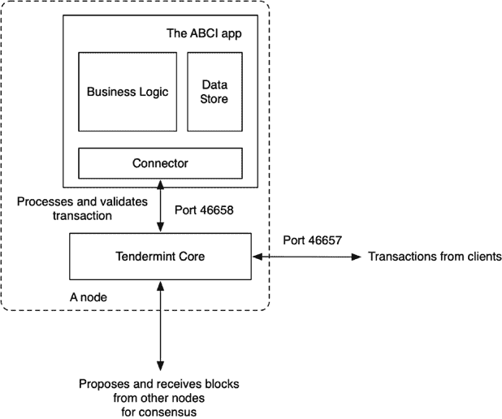
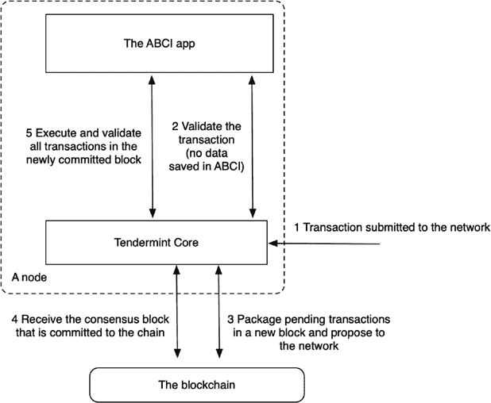
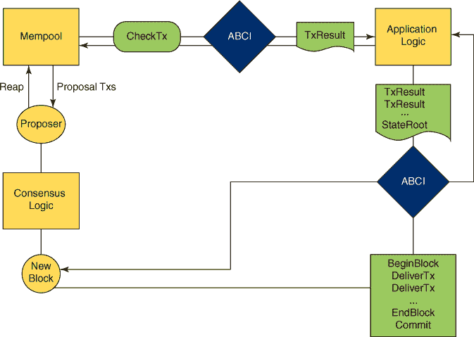
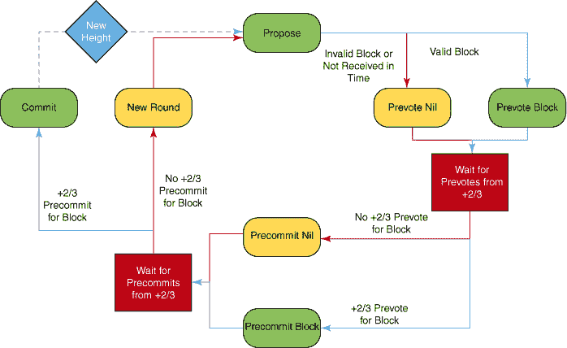
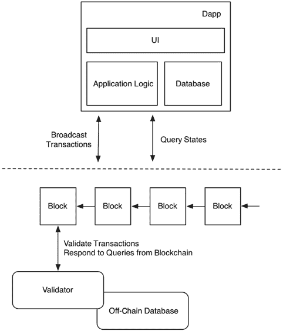
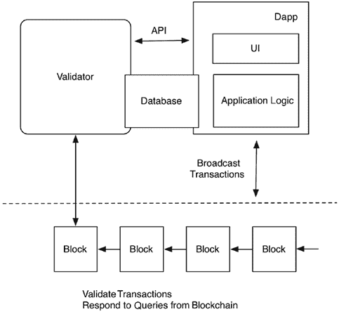
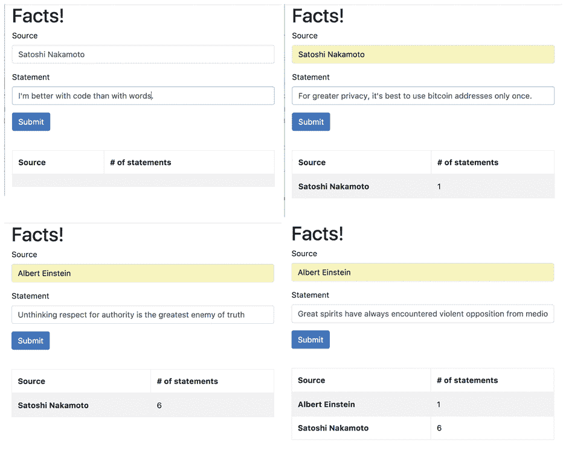

# 第五部分：构建你自己的区块链

在这本书的这部分，我超越了以太坊，讨论了如何构建你自己的区块链。这使得开发者可以绕过虚拟机，将应用逻辑直接烘焙到区块链本身，以实现最大效率。但当然，这种基于应用区块链的灵活性和适应性也比智能合约基础的区块链要差很多。

使用开源的 Tendermint 框架，我展示了如何构建应用区块链以及为这些区块链编写面向用户的应用。

## 19. 开始使用 Tendermint

Tendermint 提供了基础设施软件，允许开发者构建他们自己的区块链解决方案。Tendermint 方法有两个独特特点。

+   Tendermint 使用了拜占庭容错（BFT）算法，该算法允许最多有三分之一的节点失败或行为恶意。

+   Tendermint 共识是由指定验证节点节点达成的。网络上只有有限数量的验证节点。

在其核心，Tendermint 是一个高性能和可扩展的共识引擎。作为一种权衡，它也是一个弱中心化的解决方案；它不是完全去中心化的，就像比特币一样，因为它需要指定的验证节点，并且在容错性方面略低（比特币允许 49%的节点失败，而 Tendermint 允许三分之一）。

因为 Tendermint 被设计为一种共识引擎，所以它试图将区块链应用的“应用逻辑”和“共识逻辑”分开。这种分离使得 Tendermint 软件可以被嵌入到任何其他区块链中，作为一个即插即用的共识引擎替代品；宿主区块链只需要实现 Tendermint API，即应用区块链接口（ABCI），就可以使用 Tendermint 的委托证明风格（DPoS）共识。

Tendermint 中应用和共识逻辑的清晰分离使得将自定义逻辑构建到区块链应用中成为可能。这些应用远远超出了传统的智能合约。它们可以利用完整的的企业软件栈来处理复杂的应用场景。

**注意**

Parity 和 Polkadot 的 Substrate 框架在功能上与 Tendermint 和 Cosmos SDK（见下一章）相似。

### 它是如何工作的

Tendermint 区块链的每个节点都需要运行两段软件：名为 Tendermint Core 的共识引擎和为区块链特别编写的 ABCI 应用（见图 19.1）。



**图 19-1** 一个 Tendermint 区块链节点

+   Tendermint Core 软件负责在网络上构建和同步区块链。

+   ABCI 应用程序负责处理和验证存储在区块链上的所有交易。每个区块链可能都有一个不同的 ABCI 应用程序，用于不同的应用场景或逻辑。例如，记录加密货币交易的区块链将有一个与记录房地产契约的区块链非常不同的 ABCI 应用程序。

**注意**

ABCI 应用程序可以非常复杂，并且可以编写在任何软件堆栈上的任何语言中。实际上，它可以有自己的数据库来存储和管理其状态。广义上讲，它是智能合约的加强版。

### 以下是如何工作

外部应用程序向网络上的任何节点发送交易请求。该请求被 Tendermint Core 软件接收。请注意，我们在这里并没有定义什么是交易，因为不同的区块链应用有不同的交易定义。例如，一些应用可能会将交易定义为直接的代币交换，而其他应用则可能将记录现实世界事件视为交易。对我们来说，交易仅仅是将要记录在区块链上的字节序列。

收到请求后，Tendermint Core 软件立即将交易请求转发给同一节点上运行的 ABCI 应用程序。ABCI 应用程序解析交易数据并对它是否为有效交易做出初步判断。在这个阶段，交易不会导致任何状态变化（即不会将任何内容写入由 ABCI 应用程序管理的数据库）。

如果 ABCI 应用程序的初步判断有效，Tendermint Core 软件将广播并同步交易到网络上的所有节点。

在固定的时间间隔内，网络创建一个包含在这个时间间隔内验证的所有交易的新的区块。验证节点将对新区块进行投票，如果至少有三分之二的验证节点同意，新区块将被添加到区块链并广播到网络上的所有节点。

一旦新的区块被添加到区块链上，每个节点将重新运行包含在区块中的所有交易到节点的本地 ABCI 应用程序进行处理。此时，ABCI 应用程序可以更新其数据库以存储那些交易引起的状态变化。

**图 19.2** 总结了所描述的工作流程。



**图 19-2** 工作流程

**注意**

在将区块添加到区块链之后，所有节点以相同的顺序运行相同的交易。因此，在添加区块之后，所有节点的 ABCI 应用程序实例在其数据库中存储的持久状态相同。例如，如果交易在用户之间移动代币/资金，ABCI 应用程序可以更新用户账户数据库。

在下一节中，让我们通过设置一个单一的 Tendermint 节点来了解 Tendermint Core 软件和 ABCI 应用是如何一起工作的。

### 设置一个节点

让我们从以下网页下载预编译的 Tendermint 二进制应用程序：[`tendermint.com/downloads`](https://tendermint.com/downloads)。

您需要`tendermint`和`abci`二进制文件进行此步骤。解压下载的压缩包，您将得到以下可执行的二进制文件：

```
tendermint
dummy
counter
abci-cli
```

将二进制文件移动到`$HOME/bin`目录，这样它们就可以从命令行访问了。现在您可以运行它们来检查它们的版本。

```
$ tendermint version
0.10.3-'8d76408
```

`dummy`程序是一个简单的 ABCI 应用。运行后，它会在 TCP 端口 46658 上监听来自 Tendermint Core 的交易。作为一个“示例”程序，它将简单地批准并验证所有交易。您可以在命令行窗口中运行示例程序。

```
$ dummy
Starting ABCIServer
Waiting for new connection...
```

接下来，在另一个命令行窗口中，初始化这台机器上的 Tendermint Core 软件。`init`命令为只有一个验证节点组成的网络创建配置文件。

```
tendermint init
```

如果您之前在这个计算机上初始化过 Tendermint Core，您可以删除`$HOME/.tendermint`目录并重新初始化，或者使用以下命令：

```
tendermint unsafe_reset_all
```

**注意**

如果在启动 Tendermint 节点时遇到错误，请确保您杀死了计算机上所有与 Tendermint 相关的进程。

现在，您可以启动 Tendermint 节点。节点会立即通过端口 46658 连接到`dummy` ABCI 应用并开始创建区块。

点击此处查看代码图片

```
$ tendermint node
Executed block module=state height=1 validTxs=0 invalidTxs=0
Committed state module=state height=1 txs=0 hash=
Executed block module=state height=2 validTxs=0 invalidTxs=0
Committed state module=state height=2 txs=0 hash=
```

以下是从`dummy`窗口输出的内容，显示了一个 Tendermint 节点已连接：

```
$ dummy
Starting ABCIServer
Waiting for new connection...
Accepted a new connection
```

Tendermint 节点监听端口 46657 以接收新交易。那么，我们现在就向网络发送一个交易吧。

点击此处查看代码图片

```
curl -s 'localhost:46657/broadcast_tx_commit?tx="hello"'
{
  "jsonrpc": "2.0",
  "id": "",
  "result": {
    "check_tx": {
      "code": 0,
      "data": "",
      "log": ""
    },

    "deliver_tx": {
      "code": 0,
      "data": "",
      "log": ""
    },
    "hash": "995DE4D6FA43728945C235642E5DCCB64C08B4A2",
    "height": 30
  },
  "error": ""
}
```

交易会被 Tendermint Core 在端口 46657 上接收，然后转发给在端口 46658 上的`dummy` ABCI 应用，由`dummy`验证，然后由 Tendermint Core 记录在区块链上。示例应用会在其自己的数据库中存储交易中的键值对。Tendermint 控制台显示以下内容：

点击此处查看代码图片

```
$ tendermint node
... ...
Executed block module=state height=30 validTxs=1 invalidTxs=0
Committed state module=state height=30 txs=1 hash=EA4...934
... ...
```

**注意**

`broadcast_tx_commit`消息将交易（在`tx`参数中）发送到网络节点，并等待交易在区块链上的新区块中被确认。还有其他可以发送交易而不等待确认的消息。您将在下一章看到它们。

最后，我们可以查询刚刚发送的交易所在的区块链。查询会被传递给`dummy` ABCI 应用。由于`dummy`应用会保存它验证的所有交易的值，所以它能解释并响应查询，并通过 Tendermint Core 传递结果。

点击此处查看代码图片

```
curl -s 'localhost:46657/abci_query?data="hello"'
{
  "jsonrpc": "2.0",
  "id": "",
  "result": {
    "response": {
      "code": 0,
      "index": 0,
      "key": "",
      "value": "68656C6C6F",
      "proof": "",
      "height": 0,
      "log": "exists"
    }
  },
  "error": ""
}
```

### 设置一个网络

当然，大多数区块链网络不止有一个节点！要设置一个多节点的网络，你可以进行以下操作。

首先，在网络上的所有节点计算机上运行`tendermint init`命令。在`$HOME/.tendermint`目录中，你会看到`genesis.json`文件，其中包含这个节点的公钥。节点的私钥在`priv_validator.json`文件中，绝不应该与任何人分享。

点击这里查看代码图片。

```
{
  "genesis_time":"0001-01-01T00:00:00Z",
  "chain_id":"test-chain-dmpZNA",
  "validators":[
    {
      "pub_key":
      {
        "type":"ed25519",
        "data":"F8...DC47D"
      },
      "amount":10,"name":""
    }
  ],
  "app_hash":""
}
```

第二，在每个节点上编辑`genesis.json`文件，将所有对等节点的公钥添加到`validators`数组中。这些节点被称为网络的*初始验证者*。一旦网络运行，网络可以动态地添加或移除验证者。

最后，在每一个节点计算机上，你可以启动`tendermint node`和 ABCI 应用（例如`dummy`）。节点将通过它们的公钥发现彼此，然后形成一个网络。请注意，网络上的节点必须运行相同的 ABCI 应用，因为所有节点必须以相同的方式处理和验证交易。

现在你有一个私有的 Tendermint 区块链网络。你可以通过编写你自己的 ABCI 应用来使它验证和记录任何你喜欢的交易，你将在第二十章看到这些应用。Cosmos 基金会也为开发者和验证者运行公开测试网络。现在，让我们回顾一下 Tendermint 区块链网络是如何工作的。

+   一个新的交易在一个单节点上被接收并初步验证。

+   在固定的时间间隔内，验证节点节点打包自上一次区块以来的所有交易，并提议一个新的区块。

+   一旦验证者对一个新的区块达成共识，它就会被广播到所有的节点。

+   当一个新区块被添加到区块链时，所有节点都会以相同的顺序处理所有交易。

结果是，所有节点上的区块链应用状态（由 ABCI 应用管理的数据库）保持同步。

### 结论

在本书的这一章节中，我讨论了 Tendermint 区块链是如何通过将共识逻辑与应用逻辑分离来工作的。封装在 ABCI 应用中的应用逻辑使得开发者能够编写多功能的区块链应用。我还展示了如何使用一个简单的 ABCI 应用来设置一个 Tendermint 节点和一个网络。

## 20. 业务逻辑

在上一章中，我解释了 Tendermint 区块链网络的业务逻辑是封装在一个应用区块链接口（ABCI）应用中的。所以，作为一名开发者，你只需要编写一个应用来控制网络如何处理和验证交易。每一个 ABCI 应用都是一个区块链。以下是一些示例：

+   Binance 去中心化交易所是一个为加密货币交易操作设计的应用区块链。它是建立在 Tendermint 之上的。

+   `basecoin`应用创建了一个具有原生加密货币的区块链网络。您可以通过分叉该项目来扩展代币，以支持您自己的加密货币功能。详见[`github.com/tendermint/basecoin`](https://github.com/tendermint/basecoin)。

+   `ETGate`应用基于`basecoin`构建，使以太坊与 Tendermint 区块链之间能够进行代币交换。详见[`github.com/mossid/etgate`](https://github.com/mossid/etgate)。

+   `ethermint`应用允许您在 Tendermint 区块链之上作为 ABCI 应用运行以太坊虚拟机（EVM）。这创建了一个以太坊区块链，但使用 Tendermint 的拜占庭容错（BFT）验证器，而不是 PoW 矿工。详见[`github.com/tendermint/ethermint`](https://github.com/tendermint/ethermint)。

+   Plasma Cash 是基于 Tendermint 引擎的以太坊第二层网络实现。它是一个通过智能合约与以太坊网络相连的区块链，Plasma Cash 侧链允许进行在以太坊上无法实现的高速交易。

+   `merkleeyes`应用创建了一个区块链网络，该网络在 Merkle 树 上记录交易。它模拟了一个记账式数据存储。树上的插入/删除操作作为交易记录在区块链上，当前树上的数据也可以从区块链的查询应用程序编程接口（API）中查询。详见[`github.com/tendermint/merkleeyes`](https://github.com/tendermint/merkleeyes)。

+   CyberMiles 应用是一个完全成熟的 ABCI 应用，它将委托权益证明（DPoS）、链上治理、安全功能和增强的 EVM 整合到单一的 ABCI 应用中。

在本章中，我们将探讨 ABCI 协议并创建一个简单的 ABCI 应用。我们还将讨论建立在 ABCI 之上的应用框架，例如 Cosmos 软件开发工具包（SDK）。

### 协议

您已经学习了 Tendermint 网络在较高层次上是如何工作的。在本节中，我们将深入探讨其详细机制，包括 Tendermint Core（管理区块链）与 ABCI 应用（管理应用特定逻辑）之间的消息交换。

ABCI 协议定义了 Tendermint Core 软件与 ABCI 应用之间的请求/响应通信。默认情况下，ABCI 应用监听 TCP 端口 46658。Tendermint Core 向 ABCI 应用发送消息并对响应采取行动（图 20.1）。该协议定义了几种消息类型。它们遵循前章概述的 Tendermint Core 和 ABCI 应用交互流程。



**图 20-1** 共识流程中的 Tendermint ABCI 消息

#### 区块上的共识

第一种消息类型是`CheckTx`消息。当节点接收到交易请求（通过 Tendermint Core 默认监听的 46657 端口），它将交易转发到 ABCI 应用的`CheckTx`消息进行初步验证。ABCI 应用有自己的逻辑来解析、处理和验证交易，然后返回一个结果。如果`CheckTx`结果没问题，Tendermint 节点将广播并将交易同步到区块链网络中的所有节点。

需要注意的是，每个 Tendermint 节点都保留自己的交易池，这些交易成功通过了节点的`CheckTx`。这被称为节点的*内存池*。网络上的节点可能有不同的交易集在内存池中。当一个节点提出一个新的块时，它会将内存池中的交易一起打包。当块被网络接受（即达成共识）时，网络中所有节点的内存池中的所有交易将被删除。 图 20.2 概述了新区块的共识流程。



**图 20-2** 每个块的 Tendermint 共识

当 Tendermint 网络就新区块达成共识时，节点只是就块的结构及其与区块链中先前块的加密有效性达成一致。节点实际上对块中交易的验证一无所知。为了就块中交易的结果达成共识，我们需要来自下一个将介绍的`commit`消息的应用哈希。

#### 交易共识

第二种，也是最重要的消息类型是`DeliverTx`消息。在固定时间间隔内，网络中的所有验证节点将达成共识并确定要添加到区块链的下一个块。这个新块包含在此时间间隔内提交给网络的所有有效交易，并且广播给网络上的所有节点。每个节点都将运行块中的所有交易到节点的本地 ABCI 应用实例。每个交易都嵌入在`DeliverTx`消息中。块从向 ABCI 发送的`StartBlock`消息开始，接着是一系列块中的所有交易的`DeliverTx`消息，并以一个`EndBlock`消息结束。

ABCI 应用按接收顺序处理`DeliverTx`消息。ABCI 应用维护自己的数据库，并在处理交易时更新数据库（例如，数据库可以是用户账户的账本，每笔交易都会在账户之间转移资金）。由于所有节点都按相同顺序处理相同的事务集，一旦处理完成，所有节点的 ABCI 应用应具有相同的持久状态（即，它们的数据库内容应同步）。

**注意**

有可能 ABCI 应用程序的`DeliverTx`消息会返回一个失败的结果。由于网络验证者已经就区块达成了共识，区块链将在这个区块的区块头中注解失败的交易。

ABCI 应用程序的一个关键要求是它必须是确定性的。当它处理一组交易时，无论哪个节点进行处理，它都必须每次达到相同的结果，就每个交易的成败和整个应用程序的状态而言。这意味着 ACBI 应用程序逻辑不应该有任何依赖随机数、时间戳等。

在每次`DeliverTx`消息后，ABCI 应用程序不会保存到数据库中。相反，它处理整个交易块，并在看到`Commit`消息时只在最后保存。`Commit`消息应返回节点的当前状态，例如节点的数据库散列，称为*app hash*。如果三分之二的验证节点在任何一个块的`Commit`阶段无法达成 app hash 共识，整个区块链将完全停止工作。如果一个节点返回的 app hash 与大多数节点不同，这个节点被认为是腐败的，将无法参与未来的共识投票。

#### 获取信息

最后，ABCI 协议支持第三种类型的消息，即`Query`消息，它允许 Tendermint Core 节点查询 ABCI 应用程序的持久状态。正如提到的，ABCI 应用程序可以维护自己的数据库，数据库中存储的数据（即其状态）由 ABCI 应用程序验证的交易历史确定。区块链节点可以通过发送查询消息来查询这个数据库。

### 示例应用程序

在接下来的部分，我们将通过构建一个 ABCI 应用程序来深入了解细节。该应用程序通过其来源跟踪一系列事实，并将总计存储在数据库中。事实是由外部应用程序提交给区块链上的任何节点的。如果一个事实被应用程序接受，它将被记录在区块链作为一个交易。我们将用 Java 和 GO 语言实现这个应用程序。

一旦区块链（Tendermint Core）和事实 ABCI 应用程序运行起来，你可以将一系列事实作为交易发送到区块链上。每个事实都包含一个来源和一个陈述。回想一下，Tendermint Core 在端口 46657 监听提交到区块链的交易。

点击此处查看代码图片

```
curl -s 'localhost:46657/broadcast_tx_commit?tx="Michael:True%20fact"'
{
  "jsonrpc": "2.0",
  "id": "",
  "result": {
    "check_tx": {
      "code": 0,
      "data": "",
      "log": ""
    },
    "deliver_tx": {
      "code": 0,
      "data": "",
      "log": ""
    },
    "hash": "2A02B575181CEB71F03AF9715B236472D75025C2",
    "height": 18
  },
  "error": ""
}
```

如前章所述，发送交易数据有几种方法（`tx`参数字段中的数据可以是任何字节数组）。

+   `/broadcast_tx_commit`：我们使用了这个消息。它等待区块链验证交易并添加到新的块中。当这个消息返回时，你将能够看到`CheckTx`和`DeliverTx`的结果。

+   `/broadcast_tx_async`: 该消息将交易数据发送到区块链节点，并且不等待区块链的响应。

+   `/broadcast_tx_sync`: 该消息将交易数据发送到区块链节点，并等待`CheckTx`运行。该消息返回`CheckTx`的结果。

在 facts 应用程序控制台上，您可以看到交易被处理和验证。请注意，所有节点上都有`CheckTx`和`DeliverTx`消息。尽管交易只发送到一个节点，但一旦交易通过了`CheckTx`消息，节点就会将交易广播到所有节点。所以，每个节点都会看到这笔交易，检查它，将其保存到内存池中，并在接收到包含这笔交易的新共识块时再次处理它。

```
Commit 0 items
Check tx : Michael:True fact
The source is : Michael
The statement is : True fact
The fact is in the right format!
Deliver tx : Michael:True fact
The source is : Michael
The statement is : True fact
The count in this block is : 1
The fact is validated by this node!
Commit 1 items
```

您还可以查询区块链的当前应用程序状态。ABCI 应用程序返回一个来源的事实汇总。请注意，实际的事实声明存储在区块链作为交易中，而 ABCI 应用程序在其数据存储中只存储汇总。响应中的`value`字段是对`log`字段中的响应文本的 Base64 编码字符串。

点击此处查看代码图片

```
curl -s 'localhost:46657/abci_query?data="all"'
{
  "jsonrpc": "2.0",
  "id": "",
  "result": {
    "response": {
      "code": 0,
      "index": 0,
      "key": "",
      "value": "4A696D3A312C4D69636861656C3A32",
      "proof": "",
      "height": 0,
      "log": "Jim:1,Michael:2"
    }
  },
  "error": ""
}
```

接下来，让我们来看看如何实现这个简单的 facts ABCI 应用程序。我们将讨论 Java 和 GO 语言实现。您可以只需选择您最擅长的语言。

### java 实现

Java 应用程序基于 jTendermint 库构建。当应用程序启动时，它在 ABCI 的默认 TCP 端口 46658 上监听，以接收来自同一节点上运行的 Tendermint Core 软件的交易。

为了简单起见，我们将不使用外部关系数据库来存储应用程序状态。相反，我们在应用程序中实例化一个全局哈希表作为数据存储。哈希表键是事实的唯一来源，值是与该来源相关联的事实数量。当然，这种方法的缺点是如果应用程序崩溃，应用程序状态就会丢失。当应用程序启动时，它启动一个套接字服务器以监听来自区块链的消息。

点击此处查看代码图片

```
public final class FactsApp
        implements IDeliverTx, ICheckTx, ICommit, IQuery {

    public static Hashtable<String, Integer> db;
    public static Hashtable<String, Integer> cache;

    private TSocket socket;

    public static void main(String[] args) throws Exception {
        new FactsApp ();
    }

    public FactsApp () throws InterruptedException {
        socket = new TSocket();
        socket.registerListener(this);

        // Init the database
        db = new Hashtable <String, Integer> ();
        cache = new Hashtable <String, Integer> ();

        Thread t = new Thread(socket::start);
        t.setName("Facts App Thread");
        t.start();
        while (true) {
            Thread.sleep(1000L);
        }
   }
   ... ...
}
```

`ResponseCheckTx`方法处理来自 Tendermint Core 的`CheckTx`消息。正如您可能回忆起来的，当区块链节点接收到交易请求时，会发送`CheckTx`消息。ABCI 应用程序简单地将消息中的事实解析为一个来源元素和一个陈述元素。如果消息解析成功，ABCI 应用程序返回`ok`，并且交易被广播并同步到网络上的所有节点。为了简洁，我移除了将消息日志到 facts 应用程序控制台的部分，您在上一节中看到了这部分。

点击此处查看代码图片

```
public ResponseCheckTx requestCheckTx (RequestCheckTx req) {
    ByteString tx = req.getTx();
    String payload = tx.toStringUtf8();
    if (payload == null || payload.isEmpty()) {
        return ResponseCheckTx.newBuilder()
            .setCode(CodeType.BAD)
            .setLog("payload is empty").build();
    }
    String [] parts = payload.split(":", 2);
    String source = "";
    String statement = "";
    try {
        source = parts[0].trim();
        statement = parts[1].trim();
        if (source.isEmpty() || statement.isEmpty()) {
            throw new Exception("Payload parsing error");
        }
    } catch (Exception e) {
        return ResponseCheckTx.newBuilder()
            .setCode(CodeType.BAD)
            .setLog(e.getMessage()).build();
    }

    return ResponseCheckTx.newBuilder().setCode(CodeType.OK).build();
}
```

**注意**

本例中的`CheckTx`消息比较简单。在大多数应用中，`CheckTx`消息处理方法将使用应用的当前数据库状态来检查交易。应用状态（即应用哈希）是由上一区块的`Commit`消息更新的。`CheckTx`方法绝不应该修改应用状态。

接下来，在网络对下一个区块达成共识之后，每个节点将把这个区块中的交易作为一系列`DeliverTx`消息发送给 ABCI 应用。`ResponseDeliverTx`方法处理这些`DeliverTx`消息。它再次解析消息中的事实，然后根据来源在临时缓存中进行汇总。由于所有节点将以相同的顺序看到相同的`DeliverTx`消息集，它们应该按顺序更新应用的数据库。也就是说，第二个`DeliverTx`是在第一个`DeliverTx`对数据库进行更改之后工作的。然而，`DeliverTx`本身只应更新数据库的临时（通常是内存中）副本，更改在`Commit`时刷新到永久的（通常在磁盘上）数据库。这不仅高效，还确保应用的数据库状态始终设置为最后一个块的`Commit`状态。在这个简单的例子中，我们的应用数据库是在内存中，`DeliverTx`处理不依赖于数据库的当前状态。

点击此处查看代码图片

```
public ResponseDeliverTx receivedDeliverTx (RequestDeliverTx req) {
    ByteString tx = req.getTx();
    String payload = tx.toStringUtf8();
    if (payload == null || payload.isEmpty()) {
        return ResponseDeliverTx.newBuilder()
            .setCode(CodeType.BAD)
            .setLog("payload is empty").build();
    }
    String [] parts = payload.split(":", 2);
    String source = "";
    String statement = "";
    try {
        source = parts[0].trim();
        statement = parts[1].trim();
        if (source.isEmpty() || statement.isEmpty()) {
            throw new Exception("Payload parsing error");
        }
    } catch (Exception e) {
        return ResponseDeliverTx.newBuilder()
            .setCode(CodeType.BAD)
            .setLog(e.getMessage()).build();
    }

    // In the DeliverTx message handler,
    // we will only count facts in this block.
    if (cache.containsKey(source)) {
        int count = cache.get(source);
        cache.put(source, count++);
    } else {
        cache.put(source, 1);
    }

    return Response`DeliverTx`.newBuilder().setCode(CodeType.OK).build();
}
```

当 ABCI 应用看到`Commit`消息时，它将所有临时汇总保存到基于`Hashtable`的数据存储中。它返回数据存储的哈希码作为应用哈希。所有节点在提交这个块后必须同意应用哈希。如果一个节点返回与其他节点不同的应用哈希，则认为它损坏，将不允许它参与未来的共识。

点击此处查看代码图片

```
public ResponseCommit requestCommit (RequestCommit requestCommit) {
    Set<String> keys = cache.keySet();
    for (String source: keys) {
        if (db.containsKey(source)) {
            db.put(source, cache.get(source) + db.get(source));
        } else {
            db.put(source, cache.get(source));
        }
    }
    cache.clear();

    return ResponseCommit.newBuilder()
      .setData(ByteString.copyFromUtf8(
      String.valueOf(db.hashCode()))).build();
}
```

最后，一个外部应用可以查询区块链以获取应用状态。在这种情况下，一个`Query`消息将从 Tendermint Core 传递到应用。`ResponseQuery`方法处理此消息，并返回数据存储中所有来源的汇总。

点击此处查看代码图片

```
public ResponseQuery requestQuery (RequestQuery req) {
  String query = req.getData().toStringUtf8();

  if (query.equalsIgnoreCase("all")) {
    StringBuffer buf = new StringBuffer ();
    String prefix = "";
    Set<String> keys = db.keySet();
    for (String source: keys) {
      buf.append(prefix);
      prefix = ",";
      buf.append(source).append(":").append(db.get(source));
    }
    return ResponseQuery.newBuilder().setCode(CodeType.OK).setValue(
            ByteString.copyFromUtf8((buf.toString()))
    ).setLog(buf.toString()).build();
  }

  if (query.startsWith("Source")) {
    String keyword = query.substring(6).trim();
    if (db.containsKey(keyword)) {
      return ResponseQuery.newBuilder().setCode(CodeType.OK).setValue(
          ByteString.copyFromUtf8(db.get(keyword).toString())
      ).setLog(db.get(keyword).toString()).build();
    }
  }

  return ResponseQuery.newBuilder()
      .setCode(CodeType.BadNonce).setLog("Invalid query").build();
}
```

区块链本身存储外部应用提交的已验证的`source : statement`数据。ABCI 应用根据来源存储事实的汇总，并且由于所有节点上运行的 ABCI 应用相同的一组交易会被写入区块链，所以这些汇总在所有节点之间是同步的。

我们使用 Maven 构建应用的可执行二进制文件。您可以在源代码仓库中查看`pom.xml`文件，以了解如何构建可执行的 JAR 文件。

```
$ mvn clean package
```

您可以从命令行运行 ABCI 应用，它会自动连接到同一节点上运行的 Tendermint Core 实例。

```
$ java –jar facts-1.0.jar
```

### Go 语言实现

Tendermint 本身是用 GO 编程语言构建的。GO 是一种非常适合构建 ABCI 应用程序的成熟语言平台。应用程序中的`main`方法监听端口 46658 上的 ABCI 消息。

点击此处查看代码图片

```
package main

import (
  "flag"
  "os"
  "strings"
  "bytes"
  "strconv"
  "github.com/tendermint/abci/example/code"
  "github.com/tendermint/abci/server"
  "github.com/tendermint/abci/types"
  cmn "github.com/tendermint/tmlibs/common"
  "github.com/tendermint/tmlibs/log"
)

func main() {
  addrPtr := flag.String("addr", "tcp://0.0.0.0:46658", "Listen address")
  abciPtr := flag.String("abci", "socket", "socket | grpc")
  flag.Parse()

  logger := log.NewTMLogger(log.NewSyncWriter(os.Stdout))

  var app types.Application
  app = NewFactsApplication()
  // Start the listener
  srv, err := server.NewServer(*addrPtr, *abciPtr, app)
  if err != nil {
    logger.Error(err.Error())
    os.Exit(1)
  }
  srv.SetLogger(logger.With("module", "abci-server"))
  if err := srv.Start(); err != nil {
    logger.Error(err.Error())
    os.Exit(1)
  }

  // Wait forever
  cmn.TrapSignal(func() {
    // Cleanup
    srv.Stop()
  })
}
```

与 Java 应用程序类似，为了简化，我们将使用一个内存映射来存储应用程序状态（即事实汇总）。

点击此处查看代码图片

```
type FactsApplication struct {
  types.BaseApplication

  db map[string]int
  cache map[string]int
}

func NewFactsApplication() *FactsApplication {
  db := make(map[string]int)
  cache := make(map[string]int)
  return &FactsApplication{db: db, cache: cache}
}
```

`CheckTx`方法处理来自 Tendermint Core 的`CheckTx`消息。正如您可能回忆起来的，当区块链节点接收到交易请求时，会发送`CheckTx`消息。ABCI 应用程序简单地将消息中的事实解析为一个来源元素和一个陈述元素。如果消息解析成功，ABCI 应用程序返回 OK，并且交易被广播并在网络上所有节点同步。

点击此处查看代码图片

```
func (app *FactsApplication) CheckTx (tx []byte) types.ResponseCheckTx {
  parts := strings.Split(string(tx), ":")
  source := strings.TrimSpace(parts[0])
  statement := strings.TrimSpace(parts[1])
  if (len(source) == 0) || (len(statement) == 0) {
    return types.ResponseCheckTx{
        Code:code.CodeTypeEncodingError,
        Log:"Empty Input"
    }
  }
  return types.ResponseCheckTx{Code: code.CodeTypeOK}
}
```

**注意**

本例中的`CheckTx`消息很简单。在大多数应用程序中，`CheckTx`消息处理方法将使用应用程序的当前数据库状态来验证交易的有效性。应用程序状态（即应用程序哈希）是由最后一个块的`Commit`消息更新的。`CheckTx`方法绝不应该修改应用程序状态。

接下来，在网络对下一个区块达成共识之后，每个节点会将这个区块中的交易作为一系列`DeliverTx`消息发送给 ABCI 应用程序。`DeliverTx`方法处理这些`DeliverTx`消息。它再次解析消息中的事实，然后根据来源在临时缓存中进行汇总。由于所有节点都会以相同的顺序看到相同的`DeliverTx`消息集合，它们应该依次更新应用程序的数据库。也就是说，第二个`DeliverTx`在第一个`DeliverTx`对数据库进行更改之后开始工作。然而，`DeliverTx`本身只应更新数据库的临时（通常是在内存中）副本，更改在提交时刷新到永久的（通常在磁盘上）数据库。这不仅高效，还确保了应用程序的数据库状态始终设置在上一个块的`Commit`状态。

点击此处查看代码图片

```
func (app *FactsApplication) DeliverTx (tx []byte) types.ResponseDeliverTx {
  parts := strings.Split(string(tx), ":")
  source := strings.TrimSpace(parts[0])
  statement := strings.TrimSpace(parts[1])
  if (len(source) == 0) || (len(statement) == 0) {
    return types.ResponseDeliverTx{
      Code:code.CodeTypeEncodingError,
      Log:"Empty Input"
    }
  }

  if val, ok := app.cache[source]; ok {
    app.cache[source] = val + 1
  } else {
    app.cache[source] = 1
  }
  return types.ResponseDeliverTx{Code: code.CodeTypeOK}
}
```

当 ABCI 应用程序看到`Commit`消息时，它会将所有临时汇总保存到基于映射的数据存储中。它返回数据存储中条目总数哈希作为应用程序哈希。所有节点在提交这个块后必须同意应用程序哈希。如果一个节点返回与其他节点不同的应用程序哈希，则认为它损坏，将不允许它参与未来的共识。

点击此处查看代码图片

```
func (app *FactsApplication) Commit() types.ResponseCommit {
  for source, v := range app.cache {
    if val, ok := app.db[source]; ok {
      app.db[source] = val + v
    } else {
      app.db[source] = v
    }
  }
  app.cache = make(map[string]int)

  hash := make([]byte, 8)
  binary.BigEndian.PutUint64(hash, uint64(totalCount))
  return types.ResponseCommit{Data: hash}
}
```

最后，外部应用程序可以查询区块链的应用程序状态。在这种情况下，一个`Query`消息将从 Tendermint Core 传递到应用程序。`Query`方法处理这个消息，并返回数据存储中所有来源的计数。

请点击此处查看代码图片

```
func (app *FactsApplication) Query (reqQuery types.RequestQuery)
                                   (resQuery types.ResponseQuery) {
  query := string(reqQuery.Data)

  if (strings.EqualFold(query, "all")) {
    var buffer bytes.Buffer
    var prefix = ""
    for source, v := range app.db {
      buffer.WriteString(prefix)
      prefix = ","
      buffer.WriteString(source)
      buffer.WriteString(":")
      buffer.WriteString(strconv.Itoa(v))
    }
    resQuery.Value = buffer.Bytes()
    resQuery.Log = buffer.String()
  }

  if (strings.HasPrefix(query, "Source")) {
    source := query[6:len(query)]
    if val, ok := app.db[source]; ok {
      resQuery.Value = []byte(strconv.Itoa(val))
      resQuery.Log = string(val)
    }
  }

  return
}
```

区块链本身存储了外部应用程序提交的有效`source : statement`数据。ABCI 应用程序根据来源存储事实的计数，并且由于所有节点上的 ABCI 应用程序运行相同的一组交易，这些交易被写入区块链，所以计数会在所有节点之间同步。

我们使用默认工具来编译和构建 GO 应用程序。

```
$ go build
```

您可以从命令行运行应用程序，它会自动连接到同一节点上运行的 Tendermint Core 实例。

```
$ ./facts
```

### Cosmos SDK

Tendermint 提供了一个灵活的框架，用于在其共识引擎之上构建业务逻辑。然而，正如您所看到的，我们必须从头开始使用 ABCI 编写整个应用程序逻辑。从 Tendermint 的角度来看，应用程序数据只是一个字节数组。对于许多区块链应用程序，它们需要同一组基础功能，例如用户账户/地址管理、代币发行和 PoS 风格的质押。对于所有基于 Tendermint 的区块链，开发者重复编写这些组件既繁琐又容易出错。这促使在 ABCI 之上出现了针对常见业务组件的应用框架。Cosmos SDK 就是为 Tendermint 编写的一个这样的组件库。它用 GO 语言编写。Cosmos Hub 项目本身就是建立在 Cosmos SDK 之上的。

Cosmos SDK 仍在不断发展中，其技术细节超出了本书的范围。我建议您访问 Cosmos SDK 官方网站获取最新的文档和教程([`github.com/cosmos/cosmos-sdk`](https://github.com/cosmos/cosmos-sdk)). 在本节中，我将为您提供 SDK 设计和功能的概述。SDK 为大多数 ABCI 应用程序提供了内置的基本基础设施支持。

+   SDK 允许开发者轻松创建和维护任意数量的关键值数据存储，称为`KVStore`。这些数据存储在`CheckTx`和`DeliverTx`操作期间用于管理应用程序状态数据。例如，`DeliverTx`需要在一个区块链状态的缓存副本上处理区块中的所有交易，并在处理成功完成后提交这些更改。

+   SDK 提供了一个名为 go-amino 的数据编解码库。它允许在交易中将字节数组数据轻松地相互转换为 GO 对象。

+   SDK 提供了一个路由器对象，用于将来自远程过程调用（RPC）连接器的所有消息路由到 SDK 中的不同模块以进一步处理。路由器以允许消息被多个模块以任何指定顺序处理的方式设置。

在你的 Cosmos SDK 应用程序中，你需要配置路由器以处理传入的消息。以下是从 Cosmos SDK 教程中摘取的一个例子：

点击此处查看代码图片

```
app.Router().
    AddRoute(bank.RouterKey, bank.NewHandler(app.bankKeeper)).
    AddRoute(staking.RouterKey, staking.NewHandler(app.stakingKeeper)).
    ... ...
```

交易中的传入消息首先由`bank`模块处理，然后由`staking`模块处理。`app.bankKeeper`是应用开发者实现的一个回调方法，用于处理来自`bank`模块的事件。例如，它可以响应一个用户向另一个用户转账的事件。Cosmos SDK 提供了一个模块库。目前，大多数都与处理加密代币有关。

+   `auth`模块负责检查和验证交易中的签名。

+   `bank`模块负责管理用户账户和地址，用于持有加密代币。

+   `mint`模块负责在区块链运行过程中管理铸币和发行加密代币。

+   `staking`模块负责管理用户如何抵押他们的代币以支持 proof-of-stake (PoS) 方式下的网络安全。

+   `distribution`模块负责管理如何将抵押奖励（抵押利息）分发给用户。

+   `slashing`模块负责管理如何惩罚在系统中行为不当的抵押用户。

+   `ibc`模块负责管理由 Cosmos Hub 支持的跨链资产交换协议。

截至 2019 年 4 月，Cosmos SDK 实现了通用 PoS 区块链的基本功能。它尚未支持任何虚拟机功能。为了支持可编程区块链，Cosmos SDK 的发展路线图呼吁将虚拟机作为模块来处理交易。Cosmos SDK 的未来是光明的。

### 结论

在本章中，我们探讨了 ABCI 协议，并展示了如何构建区块链应用程序。这些 ABCI 应用程序使得区块链能够卸载许多计算密集型的任务。现在开发者可以以一种高度有效的方式编写具有复杂交易逻辑的应用程序。需要密切关注的一个领域是 Cosmos SDK 的发展，它可能会大大简化基于 Tendermint 的应用区块链的开发。

## 21. 创建区块链客户端

在上一章中，我讨论了如何构建应用程序区块链接口（ABCI）应用程序来处理区块链的业务逻辑。这允许我们开发复杂的逻辑来处理、转换和验证交易以记录在区块链上。对于每一笔交易，ABCI 应用程序可以应用规则，计算其持久效果（例如，货币交易的账户余额变化），并将结果保存在离线数据库中。由于 ABCI 应用程序可以编写在任何语言中，并且可以支持任意交易逻辑，它允许我们构建具有特定目的和优化的各种区块链。每个 ABCI 应用程序都是一个区块链。

然而，尽管 ABCI 应用程序功能强大，它仍然设计于围绕交易。用传统企业软件的术语来说，ABCI 应用程序是提供业务或交易逻辑的中间件。它不提供用户界面或高级应用程序逻辑。与以太坊类似，ABCI 应用程序也需要一个去中心化的 dapp（dapp）层以便终端用户能够访问。dapp 利用区块链提供的数据和功能（即 ABCI 应用程序），因此 dapp 是区块链的客户端。

**注意**

本章中的 Tendermint dapp 与书中前几章介绍的以太坊 dapp 不同。以太坊 dapp 是部署在区块链上的智能合约的客户端。它限于调用合约公开的方法。另一方面，Tendermint dapp 拥有对存储在区块链中的交易记录以及由 ABCI 应用程序维护的离线数据库的完全访问权限。它是“加强版 dapp”。

在本章中，我将展示如何使用上一章中的 facts 示例在 Tendermint 平台上构建一个 dapp。我们将构建一个网络应用程序，但原理对于任何现代用户界面类型都是相同的。

### 方法概述

实现 dapp 的最简单方法是构建一个与区块链应用程序编程接口（API）交互的外部应用程序。如前几章所述，API 命令通过 TCP/IP 端口 46657 发送到区块链网络上的任何节点。应用程序通过`/broadcast_tx_commit`和`/abci_query`API 方法分别发送交易和查询。dapp 存在于区块链之外。它不知道 ABCI 应用程序的内部运作。这真的是一个区块链服务设置（见**图 21.1**）。



**图 21-1** 以服务形式提供的区块链 dapp

然而，这种类型的 dapp 只是一个网站或移动应用程序。它通常由一个中心实体创建和管理。它通过预定义的自定义数据协议访问区块链，并且缺乏对底层数据结构的深入访问。

一个替代方案是构建一个在每个节点上运行的分布式应用。这个应用可以与 ABCI 应用深度集成，具有对数据库的本地访问(图 21.2)。这种方法的优点是去中心化程度更高，应用架构更高效。缺点是它在节点层面创建了对应用的软件依赖，并且它增加了区块链的潜在安全风险，因为节点通过互联网提供应用服务。这些缺点增加了应用部署和管理的难度。



**图 21-2** 紧密集成的 dapp 架构

**注意**

即使在去中心化的架构中，dapp 软件在每一个节点上运行，仍然需要一个中心化的入口点。例如，如果 dapp 是一个网络应用，它仍然需要一个 URL。在这种情况下，需要一个轻量级中心化负载均衡器来将流量引导到区块链节点。

### 示例应用

这里显示的示例应用是基于第二十章中的事实应用的网络应用用户界面（UI）。它允许用户在一个网页上输入事实、来源和陈述。同一页面显示了按来源当前的陈述统计(图 21.3)。



**图 21-3** 事实的 dapp 网络应用

在接下来的两个部分中，我将演示如何使用 PHP 和 Java 创建这个网络应用。PHP 应用是一个简单的网络应用，使用区块链 API 作为后端。Java 应用与 ABCI 应用紧密集成。

### PHP

我们开发了一个 PHP 网络应用，通过 TCP 套接字连接使用区块链 API。区块链运行 Tendermint Core 和第二十章中描述的事实 ABCI 应用。

PHP 代码首先检查这个请求是否是表单的提交，如果是，PHP 代码将发送交易到区块链并等待它提交。

点击此处查看代码图片

```
$source = $_REQUEST['source'];
$stmt = $_REQUEST['stmt'];
if (empty($source) or empty($stmt)) {
  // Not valid entry
} else {
  $transaction_req = 'localhost:46657/broadcast_tx_commit?tx="'
        . urlencode($source) . ':'
        . urlencode($stmt) . '"';
  $ch = curl_init($transaction_req);
  curl_setopt($ch, CURLOPT_RETURNTRANSFER, TRUE);
  curl_exec($ch);
  curl_close($ch);
}
```

接下来，PHP 代码通过其自定义查询 API 查询区块链，以根据来源检查事实的统计。该查询传递给 ABCI 应用。如前所述，ABCI 应用负责解析查询，创建响应，并通过区块链发送响应。ABCI 响应是一个结构化的 JavaScript 对象表示法（JSON）消息。响应消息中的值字段包含用十六进制字符编码的结果。PHP 代码将解析十六进制内容，然后将结果显示在表格中。

点击此处查看代码图片

```
<?php
  ... ...
  $query_req = 'localhost:46657/abci_query?data="all"';
  $ch = curl_init($query_req);
  curl_setopt($ch, CURLOPT_RETURNTRANSFER, TRUE);
  $json_str = curl_exec($ch);
  $json = json_decode($json_str, true);
  $result = hex2str($json['result']['response']['value']);
  curl_close($ch);
  $entries = explode(",", $result);
?>
... ...
<table class="table table-bordered table-striped">
  <thead>
    <tr>
      <th>Source</th>
      <th># of statements</th>
    </tr>
  </thead>
  <tbody>
<?php
  foreach ($entries as $entry) {
    list($s, $c) = explode(":", $entry);
?>
    <tr>
      <td><b><?= $s ?></b></td>
      <td><?= $c ?></td>
    </tr>
<?php
  }
?>
  </tbody>
</table>
```

### Java

Java 网络应用程序实现了与 PHP 应用程序相同的功能性，但它与 ABCI 应用程序的数据存储直接集成。实际上，ABCI 应用程序在同一个 JVM 中运行，与 Java 网络应用程序一起。让我们来看看这是如何实现的。

在 Java 网络应用程序的`web.xml`文件中，我们指定了一个 servlet 将在应用程序在 Tomcat 中加载时立即运行。

点击此处查看代码图片

```
<servlet>
  <servlet-name>StartupServlet</servlet-name>
  <servlet-class>
    com.ringful.blockchain.facts.servlets.StartupServlet
  </servlet-class>
  <load-on-startup>1</load-on-startup>
</servlet>
```

那个 servlet 加载并运行 ABCI 应用程序。

点击此处查看代码图片

```
public class StartupServlet extends GenericServlet {
  public void init(ServletConfig servletConfig) throws ServletException {
    super.init(servletConfig);
    try {
      // This starts the ABCI listener sockets
      FactsApp app = new FactsApp ();
      getServletContext().setAttribute("app", app);
    } catch (Exception e) {
      e.printStackTrace();
    }
  }
}
```

接下来，在`index.jsp`网页前的 Servlet 过滤器中，我们首先检查这个请求中是否提交了一个新事实（源和陈述）。如果是这样，过滤器使用其常规的 TCP 套接字 API 连接将事务发送到区块链。

点击此处查看代码图片

```
public class IndexFilter implements Filter {
  private FactsApp app;
  FilterConfig config;
  public void destroy() { }
  public void doFilter (ServletRequest request,
            ServletResponse response, FilterChain chain)
                      throws IOException, ServletException {
    if (app == null) {
      app = (FactsApp) config.getServletContext().getAttribute("app");
    }
    String source = request.getParameter("source");
    String stmt = request.getParameter("stmt");
    if (source == null || source.trim().isEmpty() ||
        stmt == null || stmt.trim().isEmpty()) {
      // Do nothing
    } else {
      CloseableHttpClient httpclient = HttpClients.createDefault();
      HttpGet httpGet = new HttpGet(
          "http://localhost:46657/broadcast_tx_commit?tx=%22" +
          URLEncoder.encode(source) + ":" +
          URLEncoder.encode(stmt) + "%22");
      CloseableHttpResponse resp = httpclient.execute(httpGet);

      try {
        HttpEntity entity = resp.getEntity();
        System.out.println(EntityUtils.toString(entity));
      } finally {
        resp.close();
      }
    }
    // Sends the application data store to the web page for JSTL
    // to display in a table.
    request.setAttribute("facts", app.db);
    chain.doFilter(request, response);
  }
  public void init(FilterConfig filterConfig) throws ServletException {
    this.config = filterConfig;
  }
}
```

过滤器然后直接查询 ABCI 应用程序的数据存储以获取来源的事实汇总。注意我们这次没有通过基于套接字的区块链查询 API 进行操作。虽然对于这个简单的应用程序，数据存储查询简单且得到区块链查询 API 的良好支持，但我可以预见应用程序场景中，dapp 会大量使用离链应用程序数据存储来进行复杂的业务逻辑和 UI 逻辑。

点击此处查看代码图片

```
<table class="table table-bordered table-striped">
  <thead>
    <tr>
      <th>Source</th>
      <th># of statements</th>
    </tr>
  </thead>
  <tbody>
    <c:forEach items="${facts}" var="fact">
      <tr>
        <td><b>${fact.key}</b></td>
        <td>${fact.value}</td>
      </tr>
    </c:forEach>
  </tbody>
</table>
```

Java 应用程序可以在本书的 GitHub 仓库中找到。您可以运行以下 Maven 构建命令来生成准备在 Apache Tomcat 部署的 WAR 文件：

```
$ mvn clean package
```

### 结论

在本章中，我展示了如何构建一个可以向最终用户提供的完整区块链应用程序。我展示了一个网络应用程序，但它很容易就是一个支持丰富客户端（即移动应用）的网络服务。虽然可以构建完全去中心化的 dapps，但大多数 dapps 都是由向其用户提供服务的公司创建和运营的。
