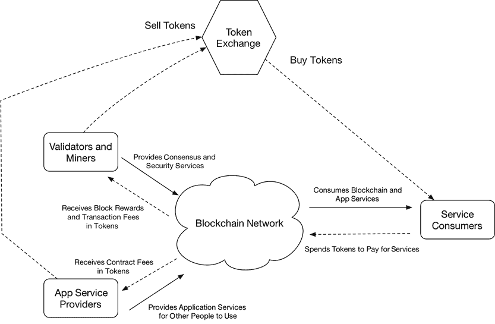

# 第六部分：密码经济学

区块链应用在关键方面与传统软件不同。通过融入加密货币，区块链应用为网络安全、信任、数据交换和用户行为内置了经济激励。除了软件架构，经济和激励设计对于区块链生态系统的成功和应用也至关重要。

在这本书的这部分，我将涵盖被称为 *密码经济学* 的激励设计。我们将探讨诸如代币分类、代币估值以及众筹代币销售和交易所等话题。

## 22. 代币设计的密码经济学

虽然加密货币最初是作为区块链共识机制的一部分被发明的，但随后的发展证明，加密货币对于推动区块链的采用至关重要。区块链生态系统的网络效应在很大程度上取决于加密货币设计，它激励了网络中贡献者和消费者之间的互动方式。

在本章中，我将讨论加密货币（代币）设计，称为 *密码经济学*。通过理解密码经济学，你将更好地了解哪些类型的应用适合于区块链。

加密货币（代币）分为三大类：网络效用代币、应用效用代币和证券代币。有些加密货币可以同时属于多个类别。

**注意**

本章中的代币分类方案与 Catalini 博士和 Gans 博士在他们开创性的论文《区块链的一些简单经济学》中开发的理论框架一致([`papers.ssrn.com/sol3/papers.cfm?abstract_id=2874598`](https://papers.ssrn.com/sol3/papers.cfm?abstract_id=2874598))。他们确定了区块链代币的两个关键用途：支付验证成本和网络成本。这分别对应于我们的网络效用和应用效用代币。

### 网络效用代币

区块链在不可信 peers 之间建立了协作。它可以提供“信任即服务”，从安全的账本到智能合同的强制执行（即确保执行某些软件代码）到透明的记录保存。网络效用代币被区块链用户用来“支付”这类网络服务。用户获取和使用代币是因为他们从前面提到的信任即服务中获得价值和效用。

区块链是一个去中心化的网络，其中没有公司位于中间发布订单和发放薪水。区块链网络的规则和协议必须由社区成员（即贡献者）来维护和执行，以换取代币。贡献者运行计算机硬件和软件来支持区块链节点，并参与共识和治理过程。这些贡献者被称为*矿工*（在工作量证明[PoW]共识区块链中）或*验证者*（在权益证明[PoS]共识区块链中）。您可以在第二章中阅读更多关于 PoW 和 PoS 的详细解释。

矿工和验证者会因为创建新区块作为共识协议的一部分而获得代币。他们还“支付”执行计算来验证区块中的交易或与交易相关的智能合约。这笔交易费用通常由发起交易的各方支付。随着区块链的成熟，矿工和验证者应该主要通过费用来获得补偿。这形成了一个闭环，为维护网络提供服务的个人（矿工和验证者）以代币获得费用，然后在交易所出售这些代币，使用网络服务的个人（用户）从交易所购买代币以支付费用（见图 22.1）。

**图 22-1** 区块链经济系统的闭环

最初，网络效用代币没有或价值很小。随着区块链网络本身变得有用，越来越多的人希望使用网络提供的服务。因此，加密代币的基本价值可能与其底层区块链网络提供的效用价值绑定（参见第一章中讨论的胖协议理论）。如果很多人愿意支付使用网络的费用，加密代币进而将具有显著的价值。接下来，让我们看一些例子。

#### 比特币（BTC）

狭义上，比特币网络的效用服务是安全、透明地记录数字交易。广义上，效用是提供一种可信的价值储存手段。

在比特币之前，所有公开可用的数字代币都是无限可复制的，因此作为价值储存手段毫无用处。今天，比特币成为了一种价值储存手段（即互联网黄金），因为它可以被加密地储存和转移。到目前为止，还没有人能够通过记录欺诈性交易来黑客攻击比特币系统。因此，信任是比特币区块链提供的主要效用。这种效用与黄金或钻石对社会提供的效用相同。同样，BTC 的价值评估常常与全球黄金储备相比较。

**注意**

BTC 被相当一部分人接受作为“互联网黄金”来储存价值。其独特特性包括它的先发优势（由于是最广为人知的加密货币），账本的安全性（从未被黑掉），以及其有限的供应量（只有 2100 万个 BTC 存在）。没有比特币区块链“矿工”所做的工作，这些都不可能存在。今天使用 BTC 的人支付以反映区块链网络的价值。

随着人们开始兴趣于用 BTC 作为一种安全的价值储存手段（即互联网黄金），他们通过交易费用以 BTC 支付网络的记账服务。

#### Ethereum (ETH)

以太坊网络的实用性服务是提供一个可信赖的平台，确保执行计算机代码（称为智能合约）。当各方在以太坊区块链上进入智能合约，双方都可以确信合同将按代码所写执行。这种程度的诚信是由以太坊社区贡献者（矿工和验证者）运行以太坊节点提供的。那些社区成员是以太坊加密货币代币 ETH 支付的。随着越来越多的人希望使用以太坊区块链强制执行他们自己的智能合约，ETH 的需求和价值上升。

有趣的是，像 BTC 一样，ETH 也越来越多地被视为一种储存价值，但目的不同。随着去中心化金融（DeFi）应用，比如 Uniswap 交易所，MakerDAO 稳定币（SC），甚至初始代币发行（ICO）筹款在以太坊网络上兴起，ETH 越来越多地作为金融投资的抵押品。ETH 持有者在抵押池中锁定的 ETH 获得利息，股息或“奖励”。ETH 已成为一种可以产生回报的可投资资产。如本章后文所见，这减少了 ETH 的流通速度，为 ETH 估值创造了良性循环。

有许多努力改进以太坊区块链，包括 EOS，QTUM，Cosmos 的 ATOM 和 CyberMiles 的 CMT。它们的加密货币代币具有与 ETH 相似的实用性价值。

#### ZCash (ZEC)

ZCash 网络的实用性服务是记录匿名和加密的交易，这样就没有人能弄清楚这些交易中涉及的各方。注重隐私的用户使用这种服务进行交易，并必须为每次交易支付 ZCash 网络的维护者社区费用。

### 应用型代币

如在第一章中讨论的，区块链网络有潜力取代公司，作为一种组织数字商品和服务生产的方式。除了信任作为服务，一个更大的经济机会是社区成员贡献应用程序服务，这些服务将在区块链网络上出售。区块链聚合服务提供，并以加密代币进行买卖交易。代币的价值可以直接映射到通过区块链提供的聚合服务的价值。让我们以一个假设的存储共享币（SSC）为例，说明应用程序实用代币可能如何工作。

SSC 区块链为用户提供基于云的数据存储空间。存储空间由数百万社区成员提供，他们贡献出自家电脑的空闲硬盘空间和互联网带宽。区块链聚合了分散的存储空间，并将其提供给在线按需购买。

随着用户对基于区块链的存储服务的需求和使用，他们必须使用 SSC 代币进行支付。区块链接受 SSC 代币，提供存储空间，并将 SSC 代币分配给存储空间提供商。所有这些都是通过在软件中编码的协议和规则以及通过区块链共识来执行的。

SSC 不一定需要自己的区块链。它可以在以太坊区块链上实现一系列智能合约。智能合约规定了系统的经济参数，包括代币供应、费用结构、代币使用、分配规则等。

显然，SSC 只是冰山一角。除了数据存储，社区成员还可以提供各种有用的数字产品和服务的，包括知识产权、个人数据、太阳能发电和医疗记录。

这里的共同特点是这些数字产品总体上是宝贵的。区块链的本质功能是将它们从社区的无信任成员那里聚集起来，并公平地分配利润。反过来，用户需要用区块链的原生加密代币支付聚集的产品和服务。

### 安全代币

加密代币最具吸引力的用途之一是代表传统所有权证券，如股票或甚至房屋或汽车的股份。与今天的证券不同，这种新的证券形式是可编程的，并由区块链上的智能合约执行。它在人工智能的世界中开辟了许多引人入胜的使用案例。

例如，让我们考虑一辆像出租车或优步车一样的自动驾驶汽车。它赚钱并将利润分发给其所有者或利益相关者。有了可编程代币，当满足某些动态条件时，你可以收到汽车的利润：当车辆保险最新，行驶在你指定的区域和速度，且只接特定类型的乘客时。相应地，你的代币也将对那些时间的责任和损失负责。同一辆车的不同利益相关者可能希望从风险更高的商业策略中获利，并在车辆承担更多风险时获得报酬。以下是一些例子：

+   当车辆在白天行驶，且交通正常（碰撞风险低）时，持有代币 A 的车主将获得利润。

+   当车辆在高峰时段行驶以获取更高的车费，并且面临更高的碰撞风险时，持有代币 B 的车主将收取利润并承担增加的损失风险。

+   当车辆在夜间在高风险社区接载醉酒乘客时，它会收到最高的车费，并且损坏风险最高。持有代币 C 的车主将收取利润并负责可能的损坏。

今天的证券法规是为“愚笨”的股票和债券时代设计的。在实现智能可编程证券的愿景之前，这些法规仍需要进行重大更新。然而，已经有很多创新的尝试。以下是一些例子。

#### 去中心化自治组织（DAO）

以太坊的去中心化自治组织（DAO）实验是为了通过智能合约在投资决策和利润分配方面设立一个投资基金。虽然由于技术问题努力未能成功，但这个想法是富有启示性的。美国证券交易委员会（SEC）审查了以太坊的 DAO，并决定它是在发行证券——尽管这是一种比基金普通股份更智能、更透明、可编程的证券。

#### 代币基金

多家传统风险投资公司（VC）通过 ICO 机制筹集了新资金。例子包括区块链资本基金([`blockchain.capital/`](http://blockchain.capital/))和科学孵化器([`www.science-inc.com/`](https://www.science-inc.com/))。这些基金的利益相关者不再被称为有限合伙人（LPs），而是作为持有即时流动性的股份的代币持有者，并通过他们持有的加密代币获得投资回报。

由于这个新兴市场巨大的市场潜力，我们建议您密切关注这个领域的进展。

### 代币估值

使用加密代币来消费区块链服务赋予了这些代币估值。实际上，代币价格是推动采用和为区块链建立网络效应的主要因素。

在撰写本文时，评估区块链网络的一种常见方法是将单位代币价格乘以流通代币的总数，以得到市值（请参阅[`coinmarketcap.com/`](http://coinmarketcap.com/)）。这类似于通过公司股票价格来评估公司市值。然而，正如我们在第一章中提到的，区块链网络与公司有很大的不同。首先，区块链网络是非营利性的，市盈率（P/E）是没有意义的。没有传统的“销售额”衡量标准——只有网络上的交易量（类似于商品交易总额[GMV]）。

我们认为，评估区块链网络更为适当的方法是通过其经济产出，这与国家货币通过国内生产总值（GDP）来衡量是一致的。在区块链网络上，有服务提供商（即矿工、验证者、应用服务提供商）和消费者。加密代币旨在促进各方之间的交易，更重要的是，激励生态系统中的协作互动。

**注意**

对于安全代币，其估值由基础资产的表现和代币的利润分配规则决定。有许多理论和实际方法（例如，折现现金流法）来计算安全价格。在这本书中，我不会详细讨论它们。

#### 应用型代币

对于网络和应用型代币，宏观经济学理论表明，每枚代币的价格可以由以下因素决定。这个公式被称为*交换价值*方程式：

<math alttext=""><mrow><mrow><mtext mathvariant="italic">Price of each token</mtext><mo>=</mo><mfrac><mrow><mn>1</mn></mrow><mrow><mi>P</mi></mrow></mfrac><mo>=</mo><mfrac><mrow><mi>T</mi></mrow><mrow><mi>V</mi><mo>⋅</mo><mi>M</mi></mrow></mfrac></mrow></mrow></math>

+   P 是价格水平，表示用代币衡量的服务价格。所以，代币价格实际上是 1/P。

+   T 是在单位时间内（例如一年）区块链网络社区生产的服务或产品的总价值。从长远来看，代币的价值由区块链提供的底层服务的价值决定。从这个意义上说，代币“支撑”着服务的价值。

+   M 是可用于交换此类服务和产品的代币总供应量。

+   V 是货币速度（*monetary velocity*）的指标，表示平均代币在单位时间内更换手中的次数。它与代币持有者持有代币的平均时间成反比。速度越快，代币估值越低，因为每枚代币可以重新使用以购买一定数量的产品和服务。

与传统货币系统中的货币供应量和货币速度相比，我们可以根据系统中货币供应量 M 的使用情况来估算 V。

+   M0 指的是流通中的现金货币。

+   M1 指的是高度流动和可用的货币，包括 M0、支票账户和旅行支票。2019 年，美国的 M1 美元速度为 5.6。

+   M2 指的是像储蓄账户和货币市场这样的流动性较低的资金。M2 资金通常既具有价值储存的功能，也具有交换媒介的功能。2019 年美元的 M2 流通速度约为 1.5。

由于储蓄账户显著减少了美元的 M2 流通速度，货币的流通速度是一个可以设计到区块链协议中的参数。以下是一些示例：

+   BTC 通常被用作价值储存，因此用户倾向于长期持有它。这给 BTC 带来了极其缓慢的货币流通速度，因此非常有价值。换句话说，人们倾向于长期持有 BTC，这严重限制了市场上的 BTC 供应，导致其价格上涨。

+   智能合约的实用代币（例如，ETH 和 CMT）由于智能合约的设计而有自然的持有时间。例如，在托管合约中，代币必须在合约账户中持有几天，然后托管交易才能结算。

+   在一个电商区块链应用中，买家通常会大量购买代币，而卖家会等待他们积累了大量代币后再提取现金。他们这样做是为了在将加密货币代币转换为法定货币（例如，美元）时最小化交易费用。

+   在像 SSC 这样的应用型代币中，区块链网络可能要求服务消费者存入并保持几天的代币余额，以确保服务不间断。

请注意，通过交换方程计算出的价格代表了代币的当前内在价值。代币的实际交易价格应该反映人们对未来几年代币价格的预期。然而，由于未来的货币不如今天的货币有价值，我们需要应用一个折现。假设市场以 *gr* 百分比每年增长，考虑到整个市场的增长以及区块链生态系统在市场中的渗透增长；假设折现率为 *dr* 百分比每年。折现率 *dr* 百分比通常在 5% 到 10% 之间，这取决于市场的风险。这是在这个市场中借入资金的利率。经过 *n* 年后，代币价格可以折现到如下现值：

<math alttext=""><mrow><mrow><mtext mathvariant="italic">Present token price</mtext><mo>=</mo><mfrac><mrow><msub><mrow><mi>T</mi></mrow><mrow><mn>0</mn></mrow></msub><mo>⋅</mo><mrow><mo>(</mo><mn>1</mn><mo>+</mo><mi>g</mi><mi>r</mi><mo>%</mo><msup><mrow><mo>)</mo></mrow><mrow><mi>n</mi></mrow></msup></mrow></mrow><mrow><mi>V</mi><mo>⋅</mo><msub><mrow><mi>M</mi></mrow><mrow><mi>n</mi></mrow></msub><mo>⋅</mo><mrow><mo>(</mo><mn>1</mn><mo>+</mo><mi>d</mi><mi>r</mi><mo>%</mo><msup><mrow><mo>)</mo></mrow><mrow><mi>n</mi></mrow></msup></mrow></mrow></mfrac></mrow></mrow></math>

*T*[0] 是当前年份（年份 0）区块链网络的国内生产总值（GDP）。*Mn* 是第 *n* 年的浮动代币数量，这取决于经济系统的设计。通常，我们使用 *n* = 5 来计算代币的现值。

#### 设计考虑因素

一般来说，区块链网络提供的价值增值越多，它就越能影响用户持有代币并减少货币的流通速度。这就是为什么我们认为能够聚合较小服务提供商的区块链网络比仅仅匹配买家和卖家的网络更有价值。

一个常见且新手设计缺陷是构建纯粹作为交换媒介的 appcoins。也就是说，服务提供商和消费者只在交易时使用代币，在交易前后立即将代币兑换成其他货币。由于没有人持有代币，市场上总是充斥着这类代币的供应，将其价格推至零。

经济学诺贝尔奖得主保罗·克鲁格曼曾说：“要成功，货币必须同时是一种交换媒介和一个相对稳定的价值储存手段。”正如我们之前讨论的，一个仅仅作为交换媒介的 appcoin 是不稳定的，可能会跌到零。价值储存的要求是给用户一个在交易之间持有货币的理由，从而为系统维持一个稳定的货币流通速度。

然而，这也是一个鸡生蛋、蛋生鸡的问题：货币只有在其货币流通速度稳定的情况下才能成为价值的储存手段。在比特币的情况下，早期的矿工决定持有比特币，希望其未来的价格会上涨。这降低了货币的流通速度，并帮助比特币确立了作为价值储存手段的“互联网黄金”地位。对于大多数功能型代币，一个设计良好的协议可以使持有部分功能（例如，质押和投票，或是一个储备系统）成为可能，并创造出一个价值储存手段。

#### 替代性方法

应用交换价值方程的另一种方法如下。这种方法的优点是它可以计算出加密资产的货币基础，以美元计算。如果代币服务于多个目的（例如，既作为安全代币也作为应用功能代币），我们可以用两种方式来推导资产基础，然后将它们相加，这将在这里展示：

<math alttext=""><mrow><mrow><mtext mathvariant="italic">Monetary base of assets</mtext><mo>=</mo><mi>M</mi><mo>=</mo><mfrac><mrow><mi>P</mi><mo>⋅</mo><mi>Q</mi></mrow><mrow><mi>V</mi></mrow></mfrac></mrow></mrow></math>

+   *M* 是加密资产的货币基础。换句话说，它是代币的总美元价值。它是代币的“市值”。

+   *P* 现在是指网络提供的服务价格。这个价格是以美元为单位的服务量价格。

+   *Q* 是网络上可用的服务量。因此，*P*和*Q*的乘积是网络生态系统总的 GDP。

+   *V* 是在计算 GDP 的同一时期内货币的流通速度。

与之前我们使用的方法类似，我们需要将未来资产的基础货币价值折现回今天的价值，以考虑市场对未来预期的影响。假设区块链生态系统以每年*gr*百分比的速度增长，并且折现率是每年*dr*百分比（*dr*百分比在 5%到 10%之间，具体取决于风险）。货币基础的现值如下。*P*和*Q*都是现值。

<math alttext=""><mrow><mrow><mtext mathvariant="italic">Present value of monetary base</mtext><mo>=</mo><mi>M</mi><mo>=</mo><mfrac><mrow><mi>P</mi><mo>⋅</mo><mi>Q</mi><mo>⋅</mo><mrow><mo>(</mo><mn>1</mn><mo>+</mo><mi>g</mi><mi>r</mi><mo>%</mo><msup><mrow><mo>)</mo></mrow><mrow><mi>n</mi></mrow></msup></mrow></mrow><mrow><mi>V</mi><mo>⋅</mo><mrow><mo>(</mo><mn>1</mn><mo>+</mo><mi>d</mi><mi>r</mi><mo>%</mo><msup><mrow><mo>)</mo></mrow><mrow><mi>n</mi></mrow></msup></mrow></mrow></mfrac></mrow></mrow></math>

为了计算每个代币的价格，你可以将*M*除以在第*n*年的自由流通代币数量。再次说明，我们通常使用*n* = 5 来进行合理的未来预测。

现在，设想一个代币既可以作为安全工具，也可以作为交易媒介。该代币作为分红型安全资产的市场市值可以通过使用传统的证券资产评估方法来计算，比如使用折现现金流（DCF）方法，通过折现和累加未来生态系统产生的所有自由现金流。另一方面，该代币作为交易媒介代币的市场市值可以根据之前的等式来计算。这两个市值是可加的。

**注意**

本节中讨论的估值方法最初是由 Chris Burniske 提出的。您可以在他的书《Cryptoassets: The Innovative Investor’s Guide to Bitcoin and Beyond》中了解更多关于他的投资方法（见[`www.bitcoinandbeyond.com/`](https://www.bitcoinandbeyond.com/)）。

然后，我们可以将所有流通中的代币分为两类：收益和支付。如果一个代币有 30%的时间作为支付代币使用，而有 70%的时间作为分红型代币使用，我们将把 0.3 个代币放入支付池，把 0.7 个代币放入收益池。当每个用途案例的价格相匹配时，整体代币价格达到均衡。

<math alttext=""><mrow><mrow><mi>E</mi><mi>P</mi><mo>=</mo><mfrac><mrow><msub><mrow><mi>M</mi></mrow><mrow><mi>s</mi></mrow></msub></mrow><mrow><msub><mrow><mi>N</mi></mrow><mrow><mi>s</mi></mrow></msub></mrow></mfrac><mo>=</mo><mfrac><mrow><msub><mrow><mi>M</mi></mrow><mrow><mi>e</mi></mrow></msub></mrow><mrow><msub><mrow><mi>N</mi></mrow><mrow><mi>e</mi></mrow></msub></mrow></mfrac></mrow></mrow></math>

+   *EP* 是每个代币的均衡价格。

+   *M[s]* 和 *M[e]* 分别是来自分红型安全资产和交换用途的代币的现值。

+   *N[s]* 和 *N[e]* 分别是主要用于安全目的和交换目的的代币数量。

<math alttext=""><mrow><mrow><mtable><mtr><mtd columnalign="right"><mo>(</mo><msub><mrow><mi>M</mi></mrow><mrow><mi>s</mi></mrow></msub><mo>+</mo><msub><mrow><mi>M</mi></mrow><mrow><mi>e</mi></mrow></msub><mo>)</mo></mtd><mtd><mo>=</mo></mtd><mtd columnalign="left"><mi>E</mi><mi>P</mi><mo>×</mo><mrow><mo>(</mo><msub><mrow><mi>N</mi></mrow><mrow><mi>s</mi></mrow></msub><mo>+</mo><msub><mrow><mi>N</mi></mrow><mrow><mi>e</mi></mrow></msub><mo>)</mo></mrow></mtd></mtr><mtr><mtd columnalign="right"><mtext mathvariant="italic">Totak token market cap</mtext></mtd><mtd><mo>=</mo></mtd><mtd columnalign="left"><mi>E</mi><mi>P</mi><mo>×</mo><mo>[</mo><mtext mathvariant="italic">total floating tokens</mtext><mo>]</mo></mtd></mtr></mtable></mrow></mrow></math>

很容易证明，当代币只是一个实用代币时，这种替代方法给出的代币价格与我们对实用代币使用的公式相同。我们只是给交换价值方程中的各个部分赋予了不同的含义。这种新方法在代币有多种用途的情况下更容易应用。

### 高级话题

现在我已经介绍了代币经济学的基础知识。在本节中，我将讨论代币设计中的一些更复杂的话题。我不会深入技术细节，但旨在为对加密经济学研究感兴趣的读者提供一丝窥探，以便他们可以自行进一步探索。

#### 非货币定价

在前一节中，我讨论了实用代币的内在价值。然而，在现实世界中，我们经常需要以非货币方式定价代币。例如，在比特币这样的工作量证明（PoW）系统中，矿工会因他们的努力而获得奖励。如果矿工获得新比特币奖励太容易，比特币的市场价格将永远不会增加，因为矿工一旦挖出代币，就会立即将其卖出以获得快速利润。

为了理解这一现象在交易媒介框架下，相当于以比网络 GDP 增长更快的速度向系统中增加代币供应。这会导致由于供过于求而使代币价格下跌。

然而，大多数区块链网络都有机制让未来的用户通过赚取代币来平衡不断增加的网络 GDP。公开代币发行的主要目标是激发网络效应。代币发行完成后，通常希望提供持续的激励，让新用户通过其他方式为网络效应做贡献，从而增加网络 GDP 并提高所有人的代币价格。

因此，对于协议设计师来说，平衡代币购买者和代币赚取者的利益至关重要，以确保每个人都以公平的成本获得代币。要了解一个设计良好的协议，我们无需舍近求远，比特币就是一个很好的例子。

比特币矿工并不是免费获得他们的 BTC。他们需要花钱购买电力、挖矿机器、数据中心和房地产。如果 BTC 市场价格上涨，更多人将希望加入或扩大挖矿业务，从而提高网络的计算能力（哈希率）。协议设计为：提高网络哈希率将导致比特币挖矿算法自动增加其难度，从而提高矿工的成本。挖矿难度的自动调整创造了一个负反馈循环，使挖矿成本始终与当前的 BTC 市场价格保持同步。因此，在比特币生态系统中没有免费的午餐。

在许多较新的区块链网络中，用户可以通过“XYZ 证明”机制从网络中赚取新代币。协议必须具有类似于比特币系统的负反馈回路，以确保新挖出或发行的代币的“成本”与当前市场价格相符。

#### 稳定币

加密代币设计的一个重要目标是创建一个相对于法定货币具有稳定汇率的对冲合约。对于代币合约至少有两大重要用例。

+   代币必须具有稳定的价值，才能作为支付工具使用。没有人会使用波动性极大的代币购买商品，因为你永远无法确定下一个小时的价格会是多少。

+   代币合约可以作为代币交易者的对冲或避风港。正如我们所看到的，加密代币的价格都高度相关。它们通常同时上涨或下跌。对于交易者来说，在熊市期间，没有安全的代币可以让她存放资金等待市场触底。似乎唯一的选择就是用法定货币退出并重新进入市场，这会带来税务问题、交易速度或算法自动化问题。代币合约在交易所中需求旺盛。

由于没有人愿意购买不会增值的代币，因此代币合约（SC）并不是进行代币发行的理想候选。但是，算法代币合约通常成对出现，代表资产池的代币确实有价格上涨的潜力。在接下来的两部分，我将讨论在没有中央银行的区块链网络上发行代币合约的两种常见方法。

##### 完全抵押稳定币

一个有抵押的 SC 随时可以以其稳定价值赎回。例如，用户可以向发行者以每枚 1 美元的价格购买 SC。发行者可以是任何中心化实体，它持有美元作为储备。发行者承诺随时以每枚 1 美元的价格赎回并销毁 SC。随后 SC 便可以在区块链网络中用于交易。每笔交易都会产生由发行者收取的手续费。

用户可以选择持有并重复使用 SC，而不是在使用前后立即将 SC 兑换成美元。那是因为

+   赎回 SC 以换取美元需要 KYC 和银行费用。

+   接收来自交易费用的潜在股息。

发行者持有并兑换美元，因为它可以从以下方面获利：

+   SC 交易的潜在费用

+   它持有的美元作为抵押的利率

在这个场景中，我们有一个通用的 SC 发行者。在现实中，区块链网络中的许多实体有额外的发行 SC 的激励，并且有多种从 SC 中获利的途径。以下是一些示例：

+   *现金流发行者*：SC 可以由拥有稳定美元现金流的业务发行。SC 可以由业务产生的现金收入发行，然后退还给客户。这使得业务可以在创建 SC 的同时，对某些用户行为进行补贴和促销。

+   *贷款发行者*：SC 可以源自一笔加密货币贷款。发行者可以用比特币作为抵押发行 SC，用于作为美元使用。当 SC 持有者赎回他们的 SC 时，发行者会出售比特币以兑换美元。在这种情况下，必须有规则在比特币价格下跌时将比特币抵押品变现为美元。

+   *付款人发行者*：SC 可以由在交易网络上具有高交易量的用户发行。用户存入用于支付所需的美元，并为自己发行 SC。用户然后使用生成的 SC 进行实际支付。收款人可以进一步将 SC 用于其他支付。发行者持有作为未偿还 SC 的负债的美元存款。在这种情况下，发行者实际上为整个网络保证了支付，这可以说是网络重度用户的责任。这种方法的一个关键好处是它可以去中心化。

正如我们所看到的，实体持有抵押资产并发行 SC 有很多原因。我们设想一个未来世界，有许多不同应用场景和发行者利益的 SC。

**注意**

USDT 是一种广泛使用的 SC。它由其发行者持有的美元支持。理论上，USDT 持有者可以在任何时间以 1:1 的比例将 USDT 兑换成美元。这使得 USDT 以其美元计算的稳定价格而闻名。然而，由于依赖于中心发行者的信用和信誉，USDT 只是一个小型、私有的“中央银行”。这种做法与区块链社区的 spirit 相去甚远。然而，USDT 的普及表明，确实需要一种 SC。

##### 算法稳定币

另一类有趣但尚未得到验证的稳定币称为*算法稳定币*。基本想法是创建一个资产池，在代币价格下跌时买入，价格上涨时卖出。即利用市场机制创建稳定币。算法稳定币的关键优势在于它们不需要完全抵押品来保持稳定。它们有能力根据市场波动动态吸引资本和资产进入系统作为抵押品。

已经有一些尝试来创建算法稳定币。例如，Maker 协议创建了两种相互关联的代币。这两种代币都是自由浮动的。但是，通过 Maker MKR 代币的交易，资产支持的 DAI 代币应该能够达到一个稳定的价格。我本书不会详细介绍 Maker 协议。感兴趣的读者可以阅读其白皮书：[`makerdao.com/whitepaper/`](https://makerdao.com/whitepaper/)。

### 结论

在本章中，我解释了区块链加密货币的常见经济设计。在本书的其余部分，我们将探讨如何实际构建支持加密货币的区块链网络。

## 23. 初始币发行

作者：Ash SeungHwan Han

ICO 代表*首次币发行*，这个词源于常见的*首次公开募股*（IPO）。根据项目或代币的特点以及法律解释，它被称为*贡献*、*捐赠*或*代币生成事件*（TGE）。在本章中，我将介绍 ICO 以及何时何地使用它们。

### 简史

获得资本市场准入是现代资本主义的显著特征。对于一家新企业或项目的开发，通常需要一定量的资本。通过 ICO，可以筹集资金，参与方从项目中收到基于区块链的代币。如果代币价格上涨，参与方将获得利润。如果说 IPO 是企业筹资的传统工具，那么 ICO 就是基于区块链的新筹资方法。

第一次 ICO 发生在 2013 年 9 月，涉及 Mastercoin 的 ICO。共筹集了 4740 个比特币，根据当时比特币的价格，约为 60 万美元。该项目由一个基金会运作，资金用于发展 Mastercoin 和促进生态系统。

不久之后，其他 ICO 项目也纷纷涌现。2013 年，NXT 进行了 ICO，而在 2014 年，包括以太坊、Counterparty、Digibyte、NEM、Maidsafe、Supernet、Storej 等项目成功完成了 ICO。2015 年，Augur、Synereo、NEO 和 IOTA 也选择了 ICO 路径。2016 年，ICO 市场开始蓬勃发展，包括 DAO、Waves、Stratis、Iconomi、Komodo、Golem 和 Chronobank 在内的 70 多个项目进行了 ICO。2017 年，记录显示有超过 900 个项目筹集了约 6 亿美元。ICO 市场实现了显著增长。

ICO 项目是历史上最成功的众筹项目之一。最大的 ICO 项目是 Filecoin，该项目在 2017 年 9 月筹集了 2.57 亿美元。第二大的是 Tezos，该项目在 2017 年 7 月筹集了 2.32 亿美元。当时，Tezos 筹集了 65,627 个比特币和 361,122 个以太坊，按照 2018 年 1 月 13 日的价格计算，总计 14 亿美元。

以太坊，一个始于 2014 年的项目，在推动 ICO 方面发挥了关键作用。以太坊是一个区块链平台，用户可以直接编写代码并在以太坊虚拟机（EVM）上执行。在以太坊上，ERC20 规格提供了一种发行新代币的标准方法，这些代币随后可以在 ICO 中出售。

得益于以太坊上的 ERC20 代币，无需构建或维护自己的区块链来发行加密货币代币。通过使用现成的源代码，一个人可以简单地使用以太坊区块链来发行代币。因此，技术上 ICO 变得简单得多，这一较低的门槛导致了 2017 年 ICO 的繁荣。

成功进行 ICO 的主要平台区块链项目包括以太坊、Cosmos、EOS、Qtum、NEO、Cardano、Waves、NEM、CyberMiles 等。

### 代币的使用价值

ICO 为一种新发明的加密货币代币设定市场价格提供了一种机制。可交易的加密货币代币最终将由市场的供求力量决定其价值。然而，在新代币的初期，很难预测其市场价格。ICO 允许早期市场参与者就代币的价值达成共识，并为早期采用者提供以共识价格购买代币的机会。

当比特币首次推出时，它没有价格。后来，当人们开始用比特币进行交易和交易时，比特币价格根据交易的时间、地点和性质而剧烈波动。在达成共识之前，比特币的价格需要数年。在达成共识后，比特币成为了一种真正的货币，用于存储和交换价值。到 2019 年 6 月，比特币在全球总市值排名中已成为第九大货币，仅次于日本的货币、中国的货币、欧盟的货币、美国的货币、英国的货币、瑞士的货币、印度的货币和俄罗斯的货币。

正如比特币的历史所显示的，市场可能需要数年才能就一种加密货币达成共识价格。实际上，对于大多数没有经过 ICO 的加密货币来说，它们没有价格，因此难以交易或使用。没有可交易的代币，底层区块链项目就无法为其社区提供激励或建立网络效应。

#### 促进区块链项目

如前所述，区块链项目的关键特征之一是其网络效应。ICO 有助于启动网络效应。当更多的人自主参与并为项目做出贡献时，区块链项目就会扩张。区块链项目的价值在于其创建的网络。如果从一开始就将网络未来的价值定价并分配给参与者，那么更多的人将参与并觉得项目有归属感。这将形成一个正反馈循环来启动网络。

从网络效应的角度来看，了解有多少人参与 ICO 以及他们是何许人也至关重要。一般来说，对于那些多样化并能直接为项目做出贡献的参与者来说，参与 ICO 更有优势。例如，如果一个项目是要为娱乐业创建一个区块链网络，来自歌手、演员、唱片公司、专辑发行公司和电影制作公司的 ICO 参与将特别有价值，因为他们可以帮助在 ICO 之后扩大网络，从而提高他们自己的代币价值。

##### 基于 PoS 的项目网络效应

如第二章所述，区块链主要有两种类型：工作量证明（PoW）区块链和权益证明（PoS）区块链。尽管比特币和原始以太坊都是 PoW 区块链，但新一代的可扩展和高性能区块链则是 PoS 的。

然而，当谈到构建网络效应时，PoW 区块链已经有了一条被证实的路径。PoW 代币逐渐发放给投入真金白银构建区块链基础设施的矿工。矿工之间相互竞争，共同打造一个多元和去中心化的网络。然而，矿工有固有的利益，希望区块链网络成功，代币价格上涨。

然而，在 PoS 区块链的情况下，发行的代币总数通常是固定的（或预先确定的速率），一个人可能拥有所有代币。因此，如何创造一个拥有许多利益相关者且共同努力发展 PoS 区块链的多元网络成为一个关键问题。ICO 恰好提供了这样的机制。

分配 PoS 项目代币的一种简单方法是举行代币销售，让人们购买代币。然而，这可能导致垄断，如果有人愿意购买大多数代币并持有超过 51%的 PoS 投票权，还可能腐蚀区块链。这种现象被称为拜占庭攻击或 51%攻击。解决方案是举行公开代币销售（即 ICO）并优化规则，尽可能包括许多公众参与者（即设定个人限额和参与资格规则）。因此，对于 PoS 区块链，三个事实可能显著影响系统稳定性。

+   公开 ICO 的可能性

+   ICO 参与者数量

+   ICO 筹资额

尽可能多的参与者是至关重要的，代币的总市值应该足够高，以避免单个参与者或试图主导共识机制的少数参与者群体发起的攻击。

#### 筹资

当然，除了立即创建一个真实的利益相关者社区来增长区块链网络之外，ICO 还帮助项目筹集资金。大多数区块链项目是没有中心公司的社区项目，不适合进行股权投资。然而，正如我们反复看到的那样（例如，Uber、Amazon、Facebook），建立网络效应需要大量的资本。代币销售的收益现在可以用于这些目的。ICO 可以为技术开发、网络运营和治理、法律合规、社区激励、未来网络服务的预付款以及许多其他目的筹集资金。

当然，随着 ICO 的普及，不直接利用区块链技术的商业也在通过 ICO 筹集资金。这是一个有趣的现象，它产生了“安全代币”的概念——代表资产所有权的代币，而不是区块链上的支付机制。主要使用 ICO 作为筹资机制的理由如下。

##### 高需求

由于投资者对具有强大网络效应的项目或能够以新方式证券化资产的项目具有高风险承受能力，加密货币市场的资本量正在爆炸式增长。与传统风险投资（VC）相比，通过 ICO 筹集资金的难度较低，可以筹集到更多的资本。

##### 市场营销效应

首次代币发行（ICO）的市场营销效应类似于网络效应。通过早期采用者和购买者的传教，它将公众的注意力吸引到项目中。通过多样化的全球渠道，ICO 项目很可能会执行成功的全球市场营销。

##### 即时流动性

加密代币可以立即交易，即使它们没有被列入交易所。此外，加密代币在交易所上市比股票上市容易得多。通过交易所和交易，项目可以获得额外的资本，吸引更多的参与者。

### ICO 与传统股权融资的比较

在本节中，让我们扩展 ICO 的筹资方面，因为大多数人认为 ICO 是一种筹资方式。我将定义 ICO 与传统风险资本投资模型相比的特点。

#### 投资门槛

在传统风险投资（VC）模式中，投资者必须作为有限合伙人（LP）向 VC 基金贡献资金。投资金额要求很高，普通合伙人（GP）代表基金中的有限合伙人（LP）做出投资决策，在管理费用和 carried interests 上抽取巨大的份额。

然而，在 ICO 的情况下，全球任何地方的人都可以参与，不受投资资本的限制。任何人都可以投资初创企业，这就是 ICO 作为一种创新投资过程的原因。

**注意**

需要指出的是，在一些国家，包括美国，某些 ICO 可能会被认定为证券发行，存在风险。为了遵守证券法，建议 ICO 发行者对参与公开代币销售的每一位投资者进行身份核查（这被称为了解客户*KYC*验证）。

#### 筹资入门门槛

对于初创企业来说，接受风险资本股权投资有很多劣势。风险投资的评估和尽职调查过程往往既耗时又繁琐。由于风险资本是一种稀缺资源，初创企业在合同谈判中没有权力。结果，投资合同往往严重偏向于投资者，将项目和其创始人置于潜在的危险中。此外，风险投资者通常对商业决策过程有过多的控制。

ICO 从开始就允许全球公众参与投资过程。而风险投资交易可能在几次与风险投资者的不成功会议后结束，ICO 可以针对更广泛投资者池中的特定投资者。在 2017 年和 2018 年，许多 ICO 项目在较短的时间内筹集到的资金比风险投资支持的项目更多。

#### 监管/文件

典型的风险投资交易需要监管批准以及大量的行政工作。即使风险投资交易完成后，资金到位和团队开始项目工作可能还需要很长时间（甚至数月）。目前，ICO 需要最低限度的监管监督，它们需要的文件很少（通常由以太坊上的智能合约强制执行），并且资金到位迅速。然而，随着越来越多的国家决定监管这一领域，这一切可能会发生变化。例如，大多数 ICO 项目已经自愿将中国和美国居民排除在公开销售之外。当然，这也意味着项目必须在投资者开始投资之前注册并执行 KYC。这是仅靠区块链智能合约无法实现的。

展望未来，美国有一些规定可以作为完全受监管和合规的 ICO 的法律框架。

+   *Regulation D 506(c)*：这使得代币销售仅面向合格投资者。没有投资或筹资上限。虽然这听起来是一条直接的道路，但它也严重限制了代币的流动性和其网络效应。代币在发行后必须在一个证券交易所交易。

+   *Regulation crowdfunding*：这允许任何人投资，但项目一年内筹集的资金不得超过 107 万美元。这对于软件开发等小型项目来说是一个很好的方法，但对于旨在建立大型网络的项目来说，不是一个可行的选择。筹资上限对于网络项目来说实在太低了。

+   *Regulation A+*：这允许任何人投资，但项目在经过 SEC 的资格审核过程后，一年内筹集的资金不得超过 5000 万美元。

有可能 Regulation A+会成为未来 ICO 的框架。这种 ICO 也被称为安全代币发行（STOs）。截至 2018 年上半年，项目和美国的 SEC 都在探索如何最好地向前推进。

#### 筹资后的流动性

流动性是 ICO 看到前所未有的增长的关键原因。在传统的风险资本投资交易中，投资者的资产要想变现（或“套现”）需要投资者等待下一轮投资或 IPO 的发生。这需要时间，并且存在下一轮投资根本不发生的风险。

与此同时，由于初始币发行（ICO）是在区块链上进行的，投资交易可以无需中间人执行。此外，如果加密货币资产在加密货币交易所上市，这将进一步创造流动性。流动性的丰富鼓励更多的人进入市场。

#### 社区参与

对于区块链项目来说，社区参与对于网络效应和整个项目的成功往往至关重要。然而，风险资本家在项目中的角色仅限于筹集资本，而不包括建设社区。

与此同时，ICO 本身是一个建立社区的过程。在投资阶段，ICO 建立起来的社区后来可以成为项目成长的基石。

#### 风险

基于股权的风险投资和 ICO 投资承担不同类型的风险。

典型的 ICO 项目通常比寻求风险资本投资的典型项目处于更早期的阶段。大多数 ICO 项目仅在其技术愿景和网络建设路线图上获得资金。从项目成熟度来看，ICO 可以被认为是高风险的。

然而，由于 ICO 项目实现流动性的速度比风险投资交易快得多，因此投资损失的风险大大降低，因为投资者直到项目最后才将资本投入到项目中。从流动性风险来看，ICO 应该被认为是比股权投资风险更低的。

#### 市场规模

传统风险投资市场非常庞大。根据行业数据库 Crunchbase 的数据，大约有 22,700 家初创公司总共获得了 2130 亿美元的投资。

根据 Coindesk 收集的数据，2017 年 1 月至 2017 年 11 月，ICO 获得了大约 35 亿美元的资金。2017 年，ICO 经历了资本的指数级流入。

### 评估 ICO 项目

在本节中，我将讨论如何通过研究其关键组成部分来评估 ICO 项目。典型的 ICO 包括以下组成部分：项目、团队、资本、社区和法律框架。

#### 项目

项目是 ICO 的目标。项目的性质决定了 ICO 期间应筹集多少资本以及代币应如何分配以供各种用途。应该明确定义目标、路线图和时间表。项目在目标和时间框架方面都应该是现实的。

#### 团队

与任何创业努力一样，团队决定了项目的最终成功。团队应包括项目所需的所有专业领域的企业家、经理和领域专家。每个成员的角色应该明确指定。在评估项目时，我们应该考虑每个团队成员对项目的承诺程度，例如全职就业状态。

#### 筹资结构

通过出售代币来筹集资金。代币销售结构可能因项目而异。例如，所有代币可以一次性出售。然而，通常可用代币的一部分可以指定为针对特定投资者的预 ICO 轮次（即私人销售），其余将在稍后的日期出售给公众。

#### 代币分配表

由 ICO 创建的代币的分配在形成项目生态系统中起着关键作用。通常，代币的一部分留给了团队、ICO 参与者和/或生态系统的开发。代币分配计划应根据项目目标来设定。

#### 社区

正如我们提到的，创建和培养社区对于 ICO 区块链项目至关重要。公共区块链是去中心化的，因此其效用随着参与者和网络的增加而增加。虽然 ICO 可以帮助项目快速启动，但在 ICO 之后，社区必须自行增长并产生积极的网络效应。ICO 参与者必须有一个明确的机制来保持对项目的参与。社区可能回答问题、主办活动或为项目的技术开发做出贡献。

大多数项目都希望建立一个全球社区。例如，比特币和以太坊社区在全球范围内举办各种活动，并分享强烈的团结感。

#### 法律框架

Since the purpose of an ICO is to build a blockchain network, it is typically conducted by a nonprofit organization (i.e., foundation) that provides governance and custodianship of the network. Because of various legal risks in countries around the world, many ICOs select Singapore or Switzerland as the legal location for their foundations. However, the work is often done in junction with a for-profit company that provides services to the foundation through contracts. It is a complicated structure that has to be set up under sound legal guidance. ICO investors are encouraged to review the legal setup and investor protection provided by the foundation that raises funding.

During the ICO, the foundation also needs to be in tune with changing legal landscapes around the world. For instance, it must exclude citizens or residents from certain countries to avoid policy bans or potential security law violations.

### ICO Participation Risk

As a largely unregulated form of fund raising, current ICOs carry significant risks to novice investors. In this section, we

#### Hacking Risk

ICOs are highly technical, involving cryptocurrency accounts, smart contracts, KYC procedures, etc., and have a lot of money at stake. Because of that, they are subject to extensive hacking.

The ICO projects themselves can be hacked. High-profile projects, such as the DAO, Polkadot, and Coindash, have all fallen victim to hacking incidents and resulted in the loss of hundreds of millions of dollars. In such cases, while the investors may still receive the tokens as promised, the loss of investment funds will adversely affect the development of the project.

The process of participating in an ICO in itself can also be risky. Some participants have fallen victim to phishing attacks, sending investment funds or receiving tokens at wrong addresses.

#### Project Development Risk

Like every startup, the ICO project itself might fail even after raising funding, which ultimately renders the tokens sold in the ICO worthless.

+   The whole ICO might be a scam. For instance, the purpose of the ICO was not the project, rather the ICO itself.

+   The technology to achieve the project goal doesn’t exist or cannot be developed.

+   The project cannot develop network effect and find enough users to participate.

+   Better solutions already exist in the market.

+   There is no market need for the solution provided.

All those issues can be mitigated by conducting due diligence on the project. However, regular retail investors often lack the resources and expertise to do due diligence. This could give rise to professional and independent ICO rating agencies.

#### Team Risk

最终，任何项目的成功都取决于团队。团队中的人类往往是项目中最不确定和最具有风险的部分。过去的 ICO 项目团队因为资金问题解散并消失了。巨额资本可能会导致团队内部冲突。一些项目因为团队成员无法就如何公平地补偿彼此达成一致而失败。然而，一些团队被发现技术上无法实施项目。

### 结论

在本章中，我讨论了 ICO 是什么以及它为何对于除了简单筹资之外的区块链项目至关重要。这种非监管的筹资方式存在许多风险，但当正确执行时，它也能带来巨大的财务回报和一群协作的用户社区。

ICO 简单来说是一个筹集资本和启动社区的 events，它是漫长旅程的开始。为了成功并为代币创造价值，每个项目都必须关注其目标。让这场马拉松开始吧！

## 24. 加密货币交易所

作者：Ash SeungHwan Han

加密货币生态系统中的一个关键组成部分是交易所。当我说我账户中的比特币价值 10,000 美元（USD）时，这意味着我现在可以把它换成 10,000 美元 USD，然后把 USD 带到银行。加密货币（代币）只有在其被积极交易时才具有价值和流动性。如前几章所述，加密代币只能作为区块链激励设计的一部分，在社区成员之间建立和广泛接受的价值时，才能促进网络效应。在本章中，我们探讨当今加密货币交易所提供的服务。我将讨论不同类型的交易所及其在生态系统中的作用。

### 交易所类型

交易所让人们可以交易加密货币，以及其他加密货币和法币，如美元。一般来说，交易所有三种类型。

#### 法币交易所

法币交易所允许加密货币与法币之间的兑换。它们必须得到政府的许可，才能与银行做生意，这样你才能通过银行账户或银行发行的信用卡发送和接收法币。这些交易所受到严格的政府监管，通常只允许少数几种知名加密货币（如 BTC 和 ETH）直接兑换成法币。

法币交易所通常是信誉最良好、最可靠的交易所，因为它们作为半金融机构受到政府的监管。然而，它们也是最具限制性和集中性的。例如，它们需要验证并记录每个用户的详细个人信息，以防止洗钱和税务目的。虽然方便，但它们的存在的确不符合区块链加密货币的去中心化世界观，正因为如此，许多人认为这些法币交易所只是通往真正去中心化金融系统的一个临时步骤。

代表法币加密货币交易所的包括 Kraken 和 GDax（Coinbase 的子公司）。

#### 仅限代币交易所

仅限代币交易所只允许加密货币代币之间的交易对。由于交易中不涉及法币，这些交易所受到的监管要少得多，因此可以更快地增长。在撰写本文时，这类交易所代表了加密货币世界最大的交易量。然而，随着围绕这些交易所的监管加强，它们未来的增长变得成问题。具体来说，也许这些交易所确实需要受到监管，所有参与者必须使用真实姓名并对其收益纳税。

大多数仅限代币交易所也提供与某种资产支持的“稳定币”的交易对，作为一种人们在市场波动期间暂时停放资产的方式，而无需实际转换为法币。这种资产支持的代币包括 USDT，它应该由传统银行中的美元存款按 1:1 的比例支持。这些资产支持的代币的合法地位也是模糊的。

代表性的仅限代币交易所包括 Binance、OKEX 和 Huobi。当前一代的仅限代币交易所也高度集中，由一家盈利公司运营。交易所有时会发行自己的加密货币代币（例如，Binance 的 BNB），这些代币通过折扣和回购，将利润从公司的股权持有者转移到代币持有者。

**注意**

在某些国家，加密货币代币交易被完全禁止，另一种类型的交易所称为场外交易（OTC）交易所。这些交易所只列出订单，让各方在平台上找到彼此并进行交易。通常有一种机制，让各方报告交易的完成并释放订单。这就像加密货币交易的 Craigslist！

#### 安全令牌交易所

安全代币交易所是加密货币世界中的一个新兴趋势。它是用于交易被归类为证券的代币。与常规股票交易所类似，这类交易所将受到证券法的约束。许多类别的证券只能在接受严格监管的条件下由认证投资者进行交易。这种交易所高度集中，但它也代表了加密货币代币被主流采用的最大机遇。代币化的证券发行也被称为*安全代币发行*（STOs）。

目前有很多努力在构建用于交易安全代币的交易所。显著的项目包括以下几个：

+   OpenFinance Network（[`OpenFinance.io`](http://OpenFinance.io)）是美国首批完全合规的安全代币交易所之一。它创建了一个名为 S3（智能证券标准；参见[`github.com/OpenFinanceIO/smart-securities-standard`](https://github.com/OpenFinanceIO/smart-securities-standard)）的开源技术标准，该标准将 ERC20 代币合约连接到 OpenFinance 网络上的了解你的客户（KYC）和反洗钱（AML）服务。这使得 ERC20 代币能够确定哪些交易符合证券法，并相应地行事。

+   tZero 项目已经通过 ICO 筹集了 1 亿美元，用于建立一个符合监管的交易代币化证券的交易所。

+   Templum 项目正在建立一个用于 ICO 和二级交易的证券平台。

+   Circle，一家加密货币 P2P 支付公司，最近收购了美国加密货币交易所 Poloniex，以建立一个符合监管的安全代币交易所。

+   Harbor 项目正在建立一个用于 STOs 和安全代币交易所的去中心化合规协议。

+   Polymath 项目旨在建立一个区块链系统，捕捉所有投资者的个人资料，以确定谁可以与谁交易哪种类型的证券。这是一个雄心勃勃的项目，可以作为安全交易所的技术基础。

正如你所看到的，已经有很多尝试去构建安全代币。如果这些努力成功，加密货币资产的格局将彻底重塑。

### 去中心化

如前所述，当今加密货币代币交易所最大的问题之一是集中化。对于一个建立在去中心化理念上的生态系统来说，关键基础设施被中心化公司主导是讽刺的。这种情况有几个原因。

+   对于法币交易所来说，银行监管机构（即交易者的真实身份和对于不当行为的法律责任）的要求使得建立集中的运营实体变得必要。

+   然而，大多数加密货币交易量并不在法币交易所上。大多数交易发生在只支持代币的交易所上。对于只支持代币的交易所来说，集中式模型能更高效地匹配交易订单，从而创造出更多的交易深度，这对于交易所的效用价值至关重要。

+   中心化交易所可以通过激励参与和积极交易来创建更多深度。

去中心化不需要交易方将代币和资产发送到交易所账户并在交易所系统中交易。去中心化交易所可以在世界各地匹配交易方，然后直接从交易方的私人钱包中交换代币。去中心化交易所不是一个运营实体，而是一个网络协议，可能以智能合约的形式存在于区块链上。

除了意识形态原因外，创建和使用去中心化交易所还有令人信服的实践原因。例如，去中心化交易所要安全得多。加密货币交易所是黑客的磁石。几乎所有交易所都经历过被黑客攻击。因此，将加密货币资产发送和存储在交易所账户上的过程并不总是安全的。当然，直接从您自己的私人加密货币钱包进行交易要安全得多，正如去中心化交易所的情况一样。

有许多伟大而又实验性的去中心化交易所的想法。

+   EtherDelta 和 BTS 是以太坊和 BitShare 区块链上的原始去中心化交易所。它们是允许交易者从私人账户下订单并执行交易的智能合约。

+   像 Kyber Network 这样的新协议试图做的不仅仅是交易所。他们提供各种金融服务，如复杂合同和支付。

+   DAEX 是一个去中心化结算协议。该想法是，中心化交易所对于配对交易很好，但账户结算（即代币资产的实际转移）应该从交易者的私人账户进行，以确保安全。因此，DAEX 可以为中心化交易所提供去中心化安全。

+   0x 是一个协议，它将交易网络的所有模块分解开来，从钱包到订单亭到交易协议以及接口。它允许您从头开始构建新的交易所，并在每个模块中采用任意级别的去中心化。

+   Bancor 协议旨在创建一个由智能合约驱动的新代币，该代币可以作为中介，为世界上任何代币提供交易对手。汇率由协议计算，而不是交易订单，因此总是有流动性。尽管 Bancor 系统存在实施问题（当前系统被证明对于“前端运行”风险有重大风险），但它是一个值得探索的想法。

+   Uniswap 是一个类似于 Bancor 但不含 ICO 代币的算法流动性协议。它简单地允许市场制造商为流动性池做贡献，用户可以根据算法确定的价格与池进行交易。它正在成为以太坊上最受欢迎的去中心化交易所之一。

+   所有这些系统都在单一的区块链网络上运行。去中心化交易所的智能合约必须存在于某个区块链上，而且它只能处理这个区块链上的资产。Polkadot 和 Cosmos IBC 协议提供了跨区块链的资产交换机制。它们可以确保发送方区块链上的代币销毁和接收方区块链上的代币创建。它们为跨链去中心化交易所提供了基础。

去中心化交易所上有许多活跃的研究和实验。在未来的几年里，我们将看到哪些想法会被市场接受！

### 产品和服务的范围很广。

所有交易所的产品和服务，无论其是否去中心化，都是相似的。

+   所有交易所都提供现货交易，你可以在那里立即交易你已拥有的代币和资产。这些资产已经存在于你的钱包里或你与交易所的账户中。

+   许多交易所提供期货交易。这是一种基于现有代币的未来价格的交易方法。通常，期货存在于 1 天、7 天、30 天等，当某个日期到来时，将当前价格与期货价格进行比较，从而得出变化。

+   对于尚未存在的代币，一些交易所允许你交易 IOUs。虽然实际代币尚未发行，但它是一种基于将来会交换到未来代币的期货交易。例如，在比特币 SegWit 硬分叉的前几天，普通的比特币和 SegWit 比特币都在市场上交易，而 SegWit 实际上尚未发生。

+   有些交易所支持保证金交易。在这种情况下，可以交易的金额可以大于实际拥有的金额。如果有十倍杠杆的保证金交易，它可以用 1 个比特币交易 10 个比特币。因此，如果价格上涨 10%，你可以获得 100%的利润。当然，在亏损的情况下，反面情况会发生。

许多交易所提供更有趣的“产品”之一是交易所自己的加密货币代币，称为*平台币*。例如，Binance 的 BNB 和 Huobi 的 HT。这些代币用于激励用户在交易所上交易更多并介绍更多用户到交易所。它们通常提供交易费折扣、推荐奖金，甚至交易所的利润分红。社区中的许多人，包括监管机构，都认为这些代币与交易所发行的股票相似，而不是实用代币。

除了交易服务，一些交易所试图在加密世界中提供更多传统的金融服务。例如，交易所可以提供托管服务，帮助基金管理和核算其代币。Coinbase 是美国首批合法合规的加密托管服务之一。该交易所可以作为“银行”，向其用户提供代币并收取利息。交易所还可以提供代币组合作为“共同基金”或甚至“指数基金”出售给投资者。

### 结论

交易所是加密代币生态系统的关键组成部分。而且，由于与传统金融的交易所不同，加密交易所不受监管，可以从事包括与自身客户对赌在内的各种活动，因此对于其运营者来说通常是非常盈利的。今天最大的挑战是通过适当的去中心化使交易所变得安全，并确定交易所应遵循的法律框架。
