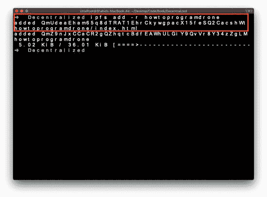
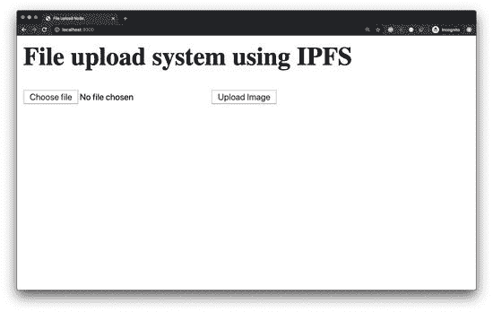
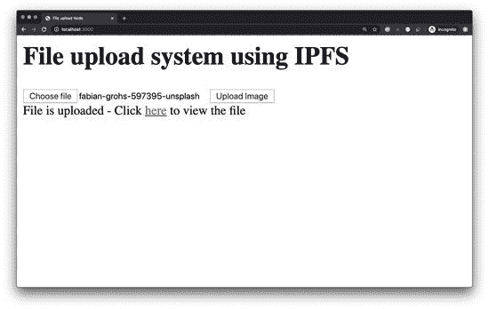
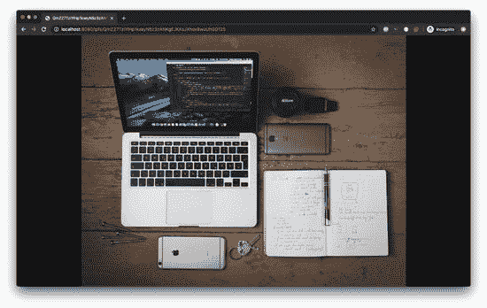
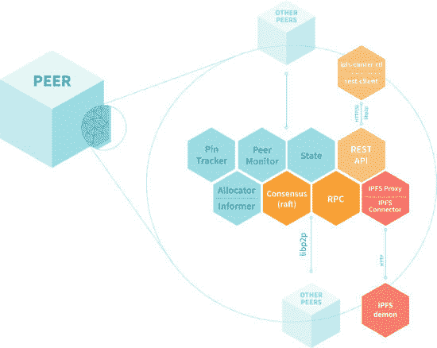

 Building Decentralized Blockchain Applications  Learn How to Use Blockchain as the Foundation for Next-Gen Apps  Shahid Shaikh  www.bpbonline.com FIRST EDITION 2021 Copyright © BPB Publications, India ISBN: 978-93-89898-620 All Rights Reserved. No part of this publication may be reproduced, distributed or transmitted in any form or by any means or stored in a database or retrieval system, without the prior written permission of the publisher with the exception to the program listings which may be entered, stored and executed in a computer system, but they can not be reproduced by the means of publication, photocopy, recording, or by any electronic and mechanical means. LIMITS OF LIABILITY AND DISCLAIMER OF WARRANTY The information contained in this book is true to correct and the best of author’s and publisher’s knowledge. The author has made every effort to ensure the accuracy of these publications, but publisher cannot be held responsible for any loss or damage arising from any information in this book. All trademarks referred to in the book are acknowledged as properties of their respective owners but BPB Publications cannot guarantee the accuracy of this information. Distributors: BPB PUBLICATIONS 20, Ansari Road, Darya Ganj New Delhi-110002 Ph: 23254990/23254991 MICRO MEDIA Shop No. 5, Mahendra Chambers, 150 DN Rd. Next to Capital Cinema, V.T. (C.S.T.) Station, MUMBAI-400 001 Ph: 22078296/22078297 DECCAN AGENCIES 4-3-329, Bank Street, Hyderabad-500195 Ph: 24756967/24756400 BPB BOOK CENTRE 376 Old Lajpat Rai Market, Delhi-110006 Ph: 23861747 Published by Manish Jain for BPB Publications, 20 Ansari Road, Darya Ganj, New Delhi-110002 and Printed by him at Repro India Ltd, Mumbai www.bpbonline.com Dedicated to Satoshi Nakamoto, The Inventor of Bitcoin and Blockchain About the Author Shahid Shaikh is a software architect with 6+ years of experience working with emerging technologies. He is also an author and has written three books, and he is an active open source contributor. He has expertise in Blockchain, distributed systems, and software architecture. Apart from writing code and authoring books, he is a vintage bike enthusiast and rides his vintage Royal Enfield across various locations. He has a keen interest in carbon-free energy generation, space exploration, and electric vehicles. About the Reviewer Rahil is a computer engineer and is currently working as the VP of Architecture and Blockchain in one of India’s leading Crypto-currency exchanges. He is currently helping his company implement and scale their Blockchain and Exchange technology. Rahil completed his Bachelors in Engineering from Mumbai University in 2013 and has over 6 years of experience in working with emerging technologies, including Blockchain. He is highly passionate about Blockchain. He believes that Bitcoin and other decentralized systems are going to change the world for the better, and they are absolutely the best way forward. Rahil is also the creator of ciphertrick.com and the getting started Youtube channel, where he regularly shares his knowledge with the community. He lives with his wife and family in Mumbai. You can reach out to him on twitter; his Twitter handle is LinkedIn Profile: https://www.linkedin.com/in/rahil-shaikh-38675978/ Check out his latest video course on Deno: https://www.youtube.com/playlist?list=PL5YcOcm9rSqzUThvf1oHgx2EqLqlW-0vnAcknowledgement There are a few people I want to thank for their continued and ongoing support while I was writing this book. First and foremost, I would like to thank my family for putting up with me while I was spending many weekends and evenings on writing—I couldn’t have completed this book without their support. I would also

ml-auto”> *   class=”nav-item active”>class=”nav-link” href=”/”>首页 class=”sr-only”>(当前)*   class=”nav-item”>class=”nav-link” href=”https://codeforgeek.com”>博客*   class=”nav-item”>class=”nav-link” href=”mailto:shahid@codeforgeek.com”>联系 class=”container”>class=”row align-items-center”>class=”col-lg-12”> # class=”mt-5”>学习如何编程一架无人机  class=”lead”> 跟随！ ## 硬件  您需要以下硬件:href=’https://amzn.to/2TCMcvd’>Parrot ARDrone 2.0.href=’https://amzn.to/2OvhWBE’>以太网线.href=’https://amzn.to/2JGka28’>良好的麦克风。您需要一台运行 Windows/Mac/Ubuntu 的标准笔记本电脑。我已在 Mac 和 Ubuntu 18.04 上进行了测试。 ## 软件 您必须安装最新版本的 Node.js。访问 href=’https://nodejs.org/en/download/’>此网站下载 Node.js。  您需要安装最新版本的 Google Chrome。访问 href=”https://www.google.com/chrome/”>此网站下载 Chrome。 ## 连接无人机 连接无人机中的电池，它将启动无人机系统。  检查您的 WiFi 连接。您应该看到一个类似下面截图所示的名称的访问点。 src=’https://image.codeforgeek.com/wp-content/uploads/2019/03/Drone-wifi-access-point.png?resize=352%2C264&ssl=1’> 连接到 WiFi 网络。连接后，打开终端并尝试对 192.168.1.1 进行 telnet 连接-这是无人机的 IP 地址。  src=”https://image.codeforgeek.com/wp-content/uploads/2019/03/Telnet-drone.png?resize=640%2C259&ssl=1”>  ## 编程无人机 让我们编写我们的应用程序。首先，创建一个新文件夹并使用终端切换到该文件夹。  `mkdir drone && cd drone`使用以下命令创建一个新的 Node 项目。 `npm init --y`让我们安装所需的依赖项。 `npm install --save ar-drone`以下是代码。  ## 运行代码 连接到无人机 WiFi 并使用以下命令运行代码。`node` `app.js`并按照代码中提到的命令让无人机起飞。这里是一个小演示。 class=’embed-container’>frameborder=’0’ allowfullscreen>  我们在页面的页脚中添加了 jQuery 库，以避免在初始页面加载时加载库。 这个技巧可以提高网站的速度。 代码有点长，但只需查看并了解语法即可。这是带有标准标签的基本 HTML 代码。 复制并保存代码到一个 index.html 文件中，并将其放在文件夹内。 现在，打开您的终端，导航到包含代码的文件夹，并运行以下命令将网站托管到 IPFS 中： $ ipfs add -r <folder _="" span="">name></folder> 该命令将以递归方式添加文件夹中的文件。您应该在终端中收到多个哈希值，并且您需要访问 index.html 文件，该文件是网站的入口点，如下面的屏幕截图所示：  图 3.10 如果您正在添加网站的多个文件，您将收到多个哈希值。要访问网站，请使用 index.html 的哈希值。 这就是您可以在 IPFS 网络中部署静态网站的方式。在下一节中，我们将学习构建和使用 IPFS 在后端系统中。 使用 IPFS 在后端构建全栈应用程序 在上一节中，我们了解了如何在 IPFS 网络中托管静态网站。在本节中，我们将使用 IPFS 构建一个应用程序。 我们将构建一个文件上传系统，用户可以在 IPFS 网络中上传文件并获得查看已上传文件的链接，就像任何其他 Web 应用程序上传文件一样。唯一的主要区别是我们将文件存储在 IPFS 网络中。 这是我们将使用的技术堆栈：  后端：Node.js 框架。 前端：HTML、CSS 和 jQuery 框架 存储：IPFS 网络 我假设您的系统中已安装了最新的 Node.js。如果没有，请访问官方 Node.js 网站并获取最新版本。 Node.js 网站：https://nodejs.org/en/download/ 让我们开始吧！  创建一个新目录并使用终端/命令提示符导航到该目录。 使用以下命令创建一个新的 Node.js 项目： $ npm init --y 现在，让我们安装我们项目中将使用的必需依赖项。这些依赖项也称为节点模块： $ npm install --save express multer ipfs-api 现在，等待几秒钟，让节点安装依赖项。Express 是一个广泛用于构建 Web 应用程序的模块。 Multer 是一个用于处理节点生态系统中文件上传的节点模块。 ifps-api 是一个用于 IPFS 网关的接口的节点模块。我们将使用此模块执行 IPFS 操作。 现在，创建一个新文件，命名为 ipfs.js，并复制粘贴以下代码： const IPFS = require(‘ipfs-api’);const ipfsOptions = {host: ‘localhost’,port: ‘5001’}; const ipfs = new IPFS(ipfsOptions); function addFile(bufferData) {return new Promise((

在上述代码中，我们从官方 CDN 中包含了 jQuery 和 jQuery 表单库。我们已经创建了一个表单，它以多部分格式将文件数据提交到我们在 app.js 中创建的 API：id=”uploadForm”enctype=”multipart/form-data”action=”/api/photo”method=”post”>type=”file” name=”userPhoto” /> 请注意 action 属性和输入名称。它必须与 API 路由和 multer 文件部分属性相同。在 JavaScript 代码中，我们监听来自服务器的响应并打印输出。我们还使用 AJAX 上传文件，以避免页面刷新。是时候运行代码了。在终端/命令提示符中运行以下命令：$ node app.js 你的终端应该打印出一条消息，说：“正在端口 3000 上工作”。这意味着应用程序正在成功运行。导航到 localhost:3000 查看应用程序。它应该看起来像这样： 如图 3.11 所示，现在，从您的系统中选择一个文件并点击上传图像按钮。您应该看到一个响应，如下所示： 如图 3.12 所示，现在，点击超链接以在 IPFS 网络上查看图像。您应该看到您从系统中选择的图像。在我的情况下，它是这样的。查看地址栏；它是 IPFS 网关路径： 恭喜！您刚刚使用 IPFS 作为网络和存储构建了一个端到端的去中心化应用程序。这个应用程序使用了最新的技术，如后端系统框架——Nodejs——并通过 Ajax 与前端通信。要部署这个应用程序，您需要在服务器上部署应用程序，并连接到 IPFS 网关。您可以使用 Infura.io 提供的托管 IPFS 网关，正如第一章所讨论的那样。到目前为止，我们已经研究了在我们机器上运行单个 IPFS 节点，但是单个 IPFS 对等体不足以维持数据冗余和可用性。这是因为，嗯，故障会发生。如果一个节点失败并且数据没有复制到另一个节点，会发生什么？这将导致数据丢失，所以不是冗余的网络。为了解决这样的场景，IPFS 引入了 IPFS 集群。IPFS 集群 IPFS 集群是一个与 IPFS 对等体并行运行的分布式程序，它将数据分配和对等体进行固定，以维护数据冗余和可用性。为了更好地理解 IPFS 集群，让我们看一下 IPFS 集群文档团队提供的架构图： 如图 3.14 所示，正如我们之前提到的，IPFS 集群程序与在我们系统中运行的 IPFS 对等体通信。IPFS 集群使用 IPFS 对等体的 HTTP API 进行通信，该 API 默认在 5001 端口上运行。IPFS 集群形成了自己的对等体网络，这些对等体正在运行集群程序，并且不会干扰 IPFS 网络。IPFS 集群对等体维护全局数据一致性，以维护数据冗余和可用性。您可以在 IPFS 集群官方项目页面上查看程序并将其运行在您的系统上。IPFS 集群主页：https://cluster.ipfs.io/ IPFS 集群是 IPFS 和 IPFS 集群的核心组件之一。正如我们在第一章中学习的那样，Libp2p 管理对等体并提供构建分布式应用程序的框架。既然我们已经详细讨论并学习了 IPFS，现在是探索 Libp2p 的深度并理解 IPFS 的核心组件的最佳时机。Libp2pLibp2p 是一个库、规范和协议，它帮助开发人员构建点对点网络应用程序。Libp2p 由以下组件组成：传输层协议、端到端加密、身份模块、路由、内容发现和消息传递模块。让我们简要讨论这些模块。传输层协议 Libp2p 传输协议是 Libp2p 的核心。这一层确保从一对等体到另一对等体的数据传输。Libp2p 的传输层协议每天都在演变，未来将支持更多的协议。端到端加密 Libp2p 传输层可以配置为使用最新版本的 TLS（即 v1.2）进行安全端到端加密。TLSv1.3 正在开发中。身份模块此模块确保对等体正在与正确的主机进行通信和交换数据，使用公钥密码学对发送和接收的网络数据执行身份检查。路由在点对点网络中，拥有一个系统来识别和连接到其他对等体而不必记住地址是必要的。由于没有中心系统来查找对等体信息，Libp2p 提供了一个路由机制，要求对等体提供网络地址信息，如果他们没有，则要求其他对等体
