## 第二部分

第二部分 主要讲述智能合约。这种创新技术使得以太坊能够从单一用途的区块链，仅支持加密货币，转变为多用途的区块链，你可以用它来开发任何去中心化应用。

第五章 介绍了 Solidity，是编写以太坊虚拟机上智能合约最受欢迎的语言。第六章 通过一个众售示例描述了典型智能合约的结构，包括构造函数、状态变量、函数和事件。在本章末尾，你将学习如何通过继承泛化合约功能。 第七章 关注更高级的面向对象特性，例如抽象合约和接口，我会逐步介绍，以便你可以改进和扩展初始众售应用，并使其更易于维护。本章还介绍了库，这是使合约更易于维护的另一方式。第八章 解释了如何将智能合约部署到公共测试网络，并通过 Web3（一个以太坊通信库）、Go Ethereum 控制台、Node.js 和网页用户界面与其交互。它还解释了如何在私有网络和模拟网络客户端（如 Ganache）上执行相同的操作。

## 第五章。使用 Solidity 编程智能合约

|  |
| --- |

**本章内容涵盖**

+   理解 EVM 语言

+   理解合约结构

+   学习 Solidity 核心语法

|  |
| --- |

感谢 SimpleCoin，这个你一直在构建的基本加密货币，你已经通过示例了解了 Solidity 的基础知识。到目前为止，你知道 Solidity 是一个允许你编写合约的高阶 EVM 语言。你还知道智能合约（或简称合约）在其他语言中相当于一个类，并包含状态变量、构造函数、函数和事件。在本章中，你将更加结构化地学习 Solidity 的主要语言结构，并逐步深入理解该语言。

本章为下一章奠定了基础，你将在其中学习如何使用 Solidity 实现复杂的合约和多合约 Dapps。在本章结束时，你将能够利用所学的知识改进和扩展 SimpleCoin 的功能。

### 5.1. EVM 合约语言

在深入 Solidity 之前，让我们退后一步，简要探索一些其他的 EVM 语言。Solidity 并不是编写合约的唯一 EVM 高阶语言。尽管它是以太坊开发者中最受欢迎的选项，这主要是因为它经常升级，维护良好，并且在官方以太坊文档中被推荐，但还有其他替代方案，分别是 LLL、Serpent 和 Viper。让我们看看这些语言的样子，以及何时使用它们而不是 Solidity 会有意义。

#### 5.1.1. LLL

LLL，其缩写代表可爱的 little language，是一种类似 Lisp 的语言（LLL 也代表）提供了接近 EVM 操作码的低级函数和简单的控制结构（如`for`、`if`等）。这些函数允许您编写不需要手动编写 EVM 汇编的低级合约代码。如果你曾经看过 Lisp 代码或者熟悉 Clojure，你将会认出以下 LLL 列表中独特的前缀表示法和大量的括号：

```
(seq                                      *1*
  (def 'value 0x00)                       *2*
  (def 'dummy 0xbc23ecab)                 *3*
  (returnlll                              *4*
    (function dummy                       *5*
      (seq
        (mstore value(calldataload 0))    *6*
        (return value 32)))))             *7*
```

+   ***1*** **指示 LLL 编译器按顺序评估下面的表达式**

+   ***2*** **在内存位置 0x00 声明一个名为 value 的变量**

+   ***3*** **在内存位置 0xbc23ecab 声明一个名为 dummy 的函数**

+   ***4*** **在 LLL 编译器中定义一个返回其下代码的宏**

+   ***5*** **开始定义‘dummy’函数**

+   ***6*** **读取传递给函数的数据的地址 0（调用数据）并将其存储在一个名为 value 的变量中**

+   ***7*** **从变量 value 中返回 32 字节**

这大致相当于以下 Solidity 代码：

```
contract Dummy {
    function dummy(bytes32 _value) returns (bytes32) {
        return _value;
    }
}
```

|  |
| --- |

##### 警告

严格来说，这两段代码并不完全等价，因为 LLL 代码没有检查函数签名或防止以太币转账等功能。

|  |
| --- |

LLL 是 Ethereum 核心团队提供的第一个 EVM 语言，因为鉴于基于栈的 Lisp 语言和 EVM 之间的工作方式的相似性，它允许他们比任何其他语言更快地交付。目前，使用 LLL 的主要好处是得到更紧凑的字码，这可能会更便宜地运行。

在平台首次公开发布后，重点转向了为合约开发者提供更简单语法的更高层次语言。Serpent 是第一个被开发的语言。

#### 5.1.2\. Serpent 和 Viper

Serpent 是一种发布后流行了几个月的 Python 类似语言。它因其极简主义哲学和通过简单语法提供低级语言的效率而受到赞誉。

如果你熟悉 Python，你会在 Serpent 中找到这些主要限制：

+   它不提供列表推导（优雅的语法从现有序列和列表创建列表）和复杂的数据结构。

+   它不支持一等函数，因此限制了您使用函数式编程风格的能力。

以下列表展示了`SimpleCoin`在 Serpent 中的样子：

```
def init():
    self.storage[msg.sender] = 10000

def balance_query(address):
    return(self.storage[address])

def transfer(to, amount):
    if self.storage[msg.sender] >= amount:
        self.storage[msg.sender] -= amount
        self.storage[to] += amount
```

即使你不知道 Python，你也应该能够理解这段代码。你可能会对`self.storage`这个变量感到困惑。这是一个包含合约状态的字典。它包含了 Solidity 中所有状态变量的等效值。

|  |
| --- |

##### 注意

`dict`（或字典）是 Python 实现的字典映射（或哈希表）。

|  |
| --- |

Serpent 的流行开始消退，当焦点转移到 Solidity 时，程序员开始更频繁地维护它。一种新的实验性 Python 式语言 Viper 目前正在研究中，并在 GitHub 上公开可用。它的目标是提供比 Serpent 更广泛的类型集，并在算术操作和数组上提供更简单的边界和溢出检查。它还将允许您编写一等函数，尽管有些限制，因此您可以编写更功能的代码。使用 Viper 的主要好处是获得比编译 Solidity 更紧凑、更安全的字节码。

现在您对 EVM 语言有了更好的了解，让我们回到 Solidity。打开 Remix 并享受这次旅行。

### 5.2。高级合约结构

在深入探讨 Solidity 的各种方面之前，我将介绍合约的高级结构，以便您可以理解每个语言特性的目的。这还将为您提供一些您可以回溯的上下文。

#### 5.2.1。合约声明

下面列出的是`AuthorizedToken`示例，这是一个与 SimpleCoin 相似的示例代币，总结了合约上可能出现的所有可能的声明。如果您不完全理解此代码，请不要担心：这个列表的目的是让您了解所有合约构造的样子。

##### 列表 5.1。高级合约结构

```
pragma solidity ⁰.4.24;
contract AuthorizedToken {

  enum UserType {TokenHolder, Admin, Owner}        *1*

  struct AccountInfo {                             *2*
    address account;
    string firstName;
    string lastName;
    UserType userType;
  }

  mapping (address => uint256) 
     public tokenBalance;                          *3*
  mapping (address => AccountInfo) 
     public registeredAccount;                     *3*
  mapping (address => bool) 
     public frozenAccount;                         *3*

  address public owner;                            *3*

  uint256 public constant maxTranferLimit = 15000;

  event Transfer(address indexed from, 
     address indexed to, uint256 value);           *4*
  event FrozenAccount(address target, 
     bool frozen);                                 *4*

  modifier onlyOwner {                             *5*
    require(msg.sender == owner);
    _;
  }

  constructor(uint256 _initialSupply) public {     *6*
    owner = msg.sender;

    mintToken(owner, _initialSupply);   
  }

  function transfer(address _to, uint256 _amount) 
    public {                                            *7*
    require(checkLimit(_amount));
    //... 
    emit Transfer(msg.sender, _to, _amount);
  }  
  function registerAccount(address account, 
    string firstName,                                   *7*
    string lastName, bool isAdmin) public onlyOwner {
    //...
  }

  function checkLimit(uint256 _amount) private          *7*
    returns (bool) { 
    if (_amount < maxTranferLimit) 
        return true;
    return false;
  }

  function validateAccount(address _account) 
    internal                                            *7*
    returns (bool) { 
    if (frozenAccount[_account] && tokenBalance[_account] > 0) 
        return true;
    return false;
  }

  function mintToken(address _recipient, 
    uint256  _mintedAmount)                             *8*
    onlyOwner public  { 
    tokenBalance[_recipient] += _mintedAmount;
    emit Transfer(owner, _recipient, _mintedAmount);
    }

  function freezeAccount(address target, 
    bool freeze)                                
    onlyOwner public  { 
    frozenAccount[target] = freeze; 
    emit FrozenAccount(target, freeze);
  }
}
```

+   ***1*** **枚举定义**

+   ***2*** **结构体定义**

+   ***3*** **状态变量定义**

+   ***4*** **事件定义**

+   ***5*** **函数修饰符定义**

+   ***6*** **构造函数定义**

+   ***7*** **函数定义**

+   ***8*** **带修饰符的函数定义**

总之，您可以声明以下可能的项目：

+   状态变量

+   事件

+   枚举

+   结构体类型

+   函数

+   函数修饰符

让我们快速地逐一了解它们。在我们完成高级合约概述之后，我们将深入探讨每个语言特性。

##### 状态变量

状态变量持有合约状态。您可以使用语言支持的任何类型来声明它们。一些类型，如映射，只能用于状态变量。状态变量的声明也隐含或明确地包括其访问级别。

##### 事件

事件是合约成员，与 EVM 交易日志交互，其调用随后传播到订阅它的客户端，通常触发相关回调。事件声明与 Java 或 C#事件声明更为相似，而不是 JavaScript 事件声明。

##### 枚举

枚举定义了一个具有指定允许值的自定义类型。`enum`声明与 Java 和 C#枚举声明相似。

##### 结构体类型

结构体定义了一个包括一组变量的自定义类型，每个变量通常属于不同类型。结构体声明与 C 结构体声明相似。

##### 函数

函数封装了智能合约的逻辑，可以被修饰符修改，可以访问状态变量，并且可以引发智能合约上声明的事件。

##### 函数修饰符

函数修饰符允许你以声明性方式修改函数的行为，通常是为了限制其只适用于某些输入。一个合约可能会声明许多修饰符，你可能会在多个函数上使用它们。

### 5.3. Solidity 语言基础

在这次 Solidity 的初步之旅中，你将通过学习大多数其语法和构造来坚实基础语言：

+   数据类型

+   全局命名空间

+   状态变量

+   函数

+   函数修饰符

+   变量声明、初始化和赋值

+   事件

+   条件语句

你将在下一章探索更多高级的面向对象特性和概念。

像大多数静态类型语言一样，Solidity 要求你显式声明每个变量的类型，或者至少需要编译器明确推断出类型。它的数据类型系统包括值类型和引用类型，我将在接下来的几节中介绍。

#### 5.3.1. 值类型

一个*值类型*变量存储在 EVM 栈上，为其值分配一个单一的内存空间。当一个值类型变量被赋给另一个变量或作为参数传递给函数时，它的值会被复制到一个新的独立变量的实例中。因此，赋值变量的值的任何更改都不会影响原始变量的值。值类型包括大多数原生类型、枚举和函数。

##### bool

声明为`bool`的变量可以有一个`true`或`false`的值；例如

```
bool isComplete = false;
```

|  |
| --- |

##### 注意

逻辑表达式必须解析为真或假，因此像 JavaScript、C 或 C++那样使用整数值 0 和 1 作为假和真是不允许的。

|  |
| --- |

##### 整数类型

你可以将整数变量声明为`int`（有符号）或`uint`（无符号）。你还可以指定一个确切的大小，范围从 8 到 256 位，以 8 的倍数为单位。例如，`int32`意味着有符号的 32 位整数，`uint128`意味着无符号的 128 位整数。如果你没有指定大小，则设置为 256 位。边栏解释了不同整数类型变量之间赋值是如何工作的。

|  |
| --- |

**隐式和显式整数转换**

只有当有意义时，不同整数类型变量之间的赋值才是可能的，这意味着接收变量的类型更宽松或者更大。如果是这样，会发生隐式转换。这里展示的合约，你可以将其输入到 Remix 编辑器中，展示了成功时有效和无效赋值导致隐式转换的一些示例：

```
contract IntConversions {
    int256 bigNumber = 150000000000;

    int32 mediumNegativeNumber = -450000;
    uint16 smallPositiveNumber = 15678;
    int16 newSmallNumber = bigNumber;           *1*
    uint64 newMediumPositiveNumber = 
      mediumNegativeNumber;                     *2*
    uint32 public newMediumNumber = 
      smallPositiveNumber;                      *3*
    int256 public newBigNumber = 
      mediumNegativeNumber;                     *4*
}
```

+   **1** **编译错误，因为 newSmallNumber 太小，无法包含 bigNumber**

+   **2** **编译错误，因为 uint64 只能存储正数**

+   **3** **smallPositiveNumber 从 uint16 隐式转换为 uint32；newMediumNumber = 15,678**

+   **4** **mediumNegativeNumber 从 int32 隐式转换为 int256；newBigNumber = -450,000**

编译此代码时，可以删除导致错误的两行，例如

```
TypeError: type int256 isn’t implicitly convertible to expected type int16
```

然后实例化合约（点击部署）。最后，通过点击相应按钮获取`newMedium-Number`和`newBigNumber`的值。

当不允许隐式转换时，仍然可以执行显式转换。在这种情况下，确保转换对您的逻辑有意义是您的责任。要查看显式转换的一个例子，请将以下两行添加到 IntConversions 合约中：

```
    int16 public newSmallNumber = 
       int16(bigNumber);                       *1*
    uint64 public newMediumPositiveNumber =
       uint64(mediumNegativeNumber);           *2*
```

+   **1** **显式转换和赋值成功，但 newSmallNumber = 23,552.**

+   **2** **显式转换和赋值成功，但 newMediumPositiveNumber = 18,446,744,073,709,101,616.**

重新实例化合约（再次点击创建），然后通过点击相应按钮获取`newSmallNumber`和`newMediumPositiveNumber`的值。显式整数转换的结果并不直观：它们将原始值围绕目标整数类型的大小（如果它的大小小于源整数类型的大小）进行包装，而不是溢出。

整数类型之间的隐式和显式转换背后的原则也适用于其他非整数类型。

|  |
| --- |

##### 静态字节数组

你可以声明一个固定大小的字节数组，大小范围从 1 到 32，例如`bytes8`或`bytes12`。单独的`byte`是一个单个字节的数组，与`bytes1`等效。

|  |
| --- |

##### 警告

如果没有指定大小，`bytes`声明一个动态大小的字节数组，这是一个引用类型。

|  |
| --- |

##### 地址

通常使用包含最多 40 个十六进制数字的文本表示的地址对象，前缀为 0x，占用 20 字节；例如：

```
address ownerAddress = 0x10abb5EfEcdC09581f8b7cb95791FE2936790b4E;
```

|  |
| --- |

##### 警告

只有当十六进制字面量具有有效的校验和时，它才被识别为地址。这是通过使用`sha3`函数（由 Web3 库提供）对十六进制字面量进行哈希，然后验证字面量中的字母字符是大写还是小写，取决于哈希中相同索引位置的位值来确定的。这意味着地址是大小写敏感的，你不能直观地验证它。一些工具，如 Remix，如果地址无效会警告你，但仍会处理无效地址。

|  |
| --- |

可以通过查询`balance`属性来获取与地址关联的以太币余额（以太币的最小单位），你可以尝试在 Remix 中放入以下示例合约并执行`getOwnerBalance()`函数：

```
contract AddressExamples {
    address ownerAddress = 0x10abb5EfEcdC09581f8b7cb95791FE2936790b4E;

    function getOwnerBalance() public returns (uint)  {
        uint balance = ownerAddress.balance;
        return balance;
    }
}
```

你将在 Remix 屏幕左下角的输出面板中看到返回值，在你点击对应函数调用的输出行的详细信息按钮后。地址类型暴露了各种用于传输以太币的函数。表 5.1 解释了它们的目的。

##### 表 5.1\. 地址类型提供的函数

| 函数 | 目的 |
| --- | --- |
| transfer() | *以 Wei 传输以太币*—如果接收方交易失败，向发送者抛出异常，并且支付会自动逆转（尽管任何已花费的 gas 不会退款），所以不需要错误处理代码；transfer()最多只能花费 2300 个 gas。 |
| send() | *以 Wei 发送以太币*—如果接收方交易失败，发送者会返回一个值为 false 的结果，但支付不会被逆转，所以必须正确处理并随进一步的指示逆转；send()最多只能花费 2300 个 gas。 |
| call() | *调用与地址相关联的目标合约上的函数（假设目标账户是一个合约）*—通过这种方式指定可以发送以太币：call.value(10)("contractName", "functionName"); call()会将发送者所有的 gas 预算转给被调用函数。如果 call()失败，它会返回 false，所以失败的处理方式要类似于 send()。 |
|  |

##### 警告

由于安全问题，`send()`和`call()`正在被弃用，在 Solidity 未来的版本中，将无法使用它们。

|  |
| --- |

这是一个使用`transfer()`的以太币传输示例：

```
destinationAddress.transfer(10);        *1*
```

+   ***1*** **向 destinationAddress 发送 10 Wei**

如果使用`send()`发送以太币，你必须有错误处理以避免失去以太币：

```
if (!destinationAddress.send(10))
    revert();                       *1*
```

+   ***1*** **如果 send()操作失败，它返回 false 并且必须被处理，在本例中通过逆转状态和随之的支付。**

确保传输失败逆转支付的另一种方法是使用全局`require()`函数，如果输入条件为假，则逆转状态：

```
require(destinationAddress.send(10));       *1*
```

+   ***1*** **如果 send 失败返回 false，则逆转支付**

你可以像下面这样用`call()`调用外部合约的函数：

```
destinationContractAddress.call("contractName", 
   "functionName");                             *1*
```

+   ***1*** **调用外部合约函数**

你可以在外部调用期间发送以太币如下：

```
destinationContractAddress.call.value(10)(
   "contractName", "functionName");              *1*
```

+   ***1*** **通过 value()指定发送的以太币数量，用外部调用的 send()发送**

你必须像处理`send()`失败一样处理外部函数调用的失败，以确保状态（包括以太币支付）被逆转：

```
if (!destinationContractAddress.call.value(10)("contractName"
 , "functionName"))
    revert();                 *1*
```

+   ***1*** **逆转状态和随之的支付**

第十五章将详细介绍如何正确调用`transfer()`、`send()`和`call()`以及如何安全地处理错误。

##### 枚举

枚举是一种自定义数据类型，包括一组命名值；例如：

```
enum  InvestmentLevel {High, Medium, Low}
```

然后你可以像下面这样定义一个基于枚举的变量：

```
InvestmentLevel level = InvestmentLevel.Medium;
```

每个枚举项的整数值隐式由其在枚举定义中的位置确定。在前一个示例中，High 的值是 0，Low 的值是 2\. 您可以通过显式将枚举变量转换为整变量来检索枚举类型变量的整数值，如下所示：

```
InvestmentLevel level = InvestmentLevel.Medium;
...
int16 levelValue = int16(level);
```

不允许隐式转换：

```
int16 levelValue = level;         *1*
```

+   ***1*** **无法编译**

#### 5.3.2\. 引用类型

*引用类型* 变量通过它们的引用（它们第一个项目的位置）进行访问。您可以在以下两个数据位置之一存储它们，在某些情况下，您可以在它们的声明中显式指定它们：

+   *内存*——值不会永久保存，只存在于内存中。

+   *存储*——值永久保存在区块链上，类似于状态变量。

还有一种您无法显式指定的数据位置：

+   *Calldata*—这是用于持有外部函数参数值的区域。在这个区域中存储的对象表现得像存储在内存中的对象。

以下列表显示了在不同数据位置声明的各种引用类型变量。

##### 列表 5.2\. 数据位置隐式或显式声明的引用类型

```
pragma solidity ⁰.4.0;
contract ReferenceTypesSample {
    uint[] storageArray;                              *1*

    function f(uint[] fArray) {}                      *2*
    function g(uint[] storage gArray) internal {}     *3*
    function h(uint[] memory hArray) internal  {}     *4*
}
```

+   ***1*** **storageArray 的数据位置隐式定义为存储**

+   ***2*** **fArray 的数据位置隐式定义为内存**

+   ***3*** **gArray 的数据位置显式定义为存储**

+   ***3*** **hArray 的数据位置显式定义为内存**

在查看关注数据位置的代码片段之前，请查看 表 5.2，该表总结了根据它们是局部变量还是状态变量，以及根据函数是内部声明还是外部声明，函数参数的默认数据位置。

##### 表 5.2\. 变量和函数参数的默认数据位置

| 案例 | 数据位置 | 默认 |
| --- | --- | --- |
| 局部变量 | 内存或存储 | 存储 |
| 状态变量 | 仅存储 | 不适用 |
| 内部函数参数 | 内存或存储 | 内存 |
| 外部函数参数 | Calldata | 不适用 |

引用类型变量的行为，特别是当它们被赋值给其他变量或传递给函数参数时，是否会进行克隆或直接引用，取决于源和目标数据位置。理解各种情况中会发生什么的最佳方式是查看一些代码。以下代码片段都假设了给出的 `ReferenceTypesSample` 合约定义，如 列表 5.2 中所示。

第一个案例是将一个状态变量（其数据位置，你知道的，是存储）赋值给一个局部变量：

```
function f(uint[] fArray)  {
     uint[] localArray = storageArray;       *1*
}
```

+   ***1*** **localArray 隐式地定义在存储中，直接指向 storageArray。**

如果修改了 `localArray`，`storageArray` 也会相应地被修改。

下一个示例是将定义在内存中的函数参数赋值给一个局部变量：

```
function f(uint[] fArray)  {           *1*
     uint[] localArray = fArray;       *2*
}
```

+   ***1*** **fArray 隐式定义在内存中。**

+   ***2*** **localArray 定义在内存中，直接指向 fArray。**

如果`localArray`被修改，`fArray`也会相应地被修改。

下面的示例展示了如果你将一个定义在存储中的函数参数赋值给一个存储变量会发生什么：

```
function f(uint[] fArray)  {     *1*
    storageArray= fArray;        *2*
}
```

+   ***1*** **fArray 隐式定义在内存中。**

+   ***2*** **storageArray 存储了 fArray 的完整副本。**

如果你将一个状态变量传递给定义在存储中的函数参数，该函数参数将直接引用状态变量：

```
function f(uint[] fArray)  {                    *1*
     g(storageArray);                           *2*
}
function g(uint[] storage gArray) internal {}   *3*
```

+   ***1*** **fArray 隐式定义在内存中。**

+   ***2*** **在调用期间，gArray 直接指向 storageArray。**

+   ***3*** **gArray 明确定义在存储中。**

如果`gArray`被修改，`storageArray`也会相应地被修改。

如果你将一个状态变量传递给定义在存储中的函数参数，该函数参数将创建状态变量的本地克隆：

```
function f(uint[] fArray)  {                    *1*
    h(storageArray);                            *2*
}
function h(uint[] memory hArray) internal {}    *3*
```

+   ***1*** **fArray 隐式定义在内存中。**

+   ***2*** **在调用期间，hArray 被赋值为 storageArray 的克隆。**

+   ***3*** **hArray 明确定义在内存中。**

引用类型有四个类别：

+   数组

+   字符串

+   结构体

+   映射

数组可以是静态的（固定大小）或动态的，并且以略微不同的方式声明和初始化。

##### 静态数组

你必须在静态数组的声明中指定其大小。以下代码声明并分配了一个类型为`int32`的五个元素的静态数组：

```
function f(){
   int32[5] memory fixedSlots;
   fixedSlots[0] = 5;
   //...        
}
```

你也可以分配一个静态数组并在内联中设置它，如下所示：

```
function f(){
   int32[5] memory fixedSlots = [int32(5), 9, 1, 3, 4];
}
```

|  |
| --- |

##### 注意

内联数组自动定义为内存数据位置，并用其最大项的尽可能小的类型调整大小。在内联静态数组的示例中，假设你没有强制第一个单元格的项为`int32`：`int32[5] memory fixedSlots = [5, 9, 1, 3, 4]`。在这种情况下，内联数组将隐式声明为`int4[] memory`，并且它将无法分配给`fixedSlots`变量。因此，它将产生编译错误。

|  |
| --- |

##### 动态数组

你不需要在动态数组的声明中指定大小，如下面的片段所示：

```
function f(){
   int32[] unlimitedSlots;
}
```

然后，你可以通过调用`push`成员函数向动态数组添加项目：

```
unlimitedSlots.push(6);
unlimitedSlots.push(4);
```

如果你需要调整动态数组的大小，你必须根据其数据位置是在存储还是内存中以不同的方式进行。如果数据位置在存储中，你可以像下面的片段所示重置其长度：

```
function f(){
   int32[] unlimitedSlots;       *1*
   //...

   unlimitedSlots.length = 5;    *2*
}
```

+   ***1*** **显式声明，数据位置为存储。**

+   ***2*** **通过重置其长度来调整大小**

如果动态数组的数据位置在存储中，你需要用`new`对其进行调整大小，如下面的片段所示：

```
function f(){
  int32[] memory unlimitedSlots;       *1*
  //...
  unlimitedSlots = new int32[](5);     *2*
}
```

+   ***1*** **显式声明，数据位置为内存。**

+   ***2*** **用 new 调整大小**

|  |
| --- |

##### 注意

正如你之前所看到的，`bytes`是一个无限的字节数组，是一个引用类型。这相当于`byte[]`，但它优化了空间，并且建议使用。它还支持`length`和`push()`。

|  |
| --- |

如果一个数组作为公共状态变量暴露出来，它的获取器接受数组位置索引作为输入。

##### 字符串

`string`实际上与`bytes`等效，但没有长度和`push()`成员。你可以用字符串字面量来初始化它：

```
string name = "Roberto";
```

##### 结构体

`struct`是一个用户定义的类型，包含了一组元素，这些元素通常是不同类型的。以下列表显示了一个声明了各种结构体的合约，这些结构体在其状态变量中被引用。这个例子还展示了如何在结构体中使用枚举。

##### 列表 5.3. 包含各种结构体定义的合约

```
contract Voting {

    enum UserType {Voter, Admin, Owner}

    enum MajorityType {SimpleMajority, AbsoluteMajority, SuperMajority
 , unanimity}

    struct UserInfo {
        address account;
        string name;
        string surname;

        UserType uType;
    }

    struct Candidate {
        address account;
        string description;
    }

    struct VotingSession {
        uint sessionId;
        string description;
        MajorityType majorityType;
        uint8 majorityPercent;
        Candidate[] candidates;
        mapping (address => uint) votes;
    }

    uint numVotingSessions;
    mapping (uint => VotingSession) votingSessions;

    //...
}
```

你可以按照以下方式初始化一个`struct`对象：

```
    function addCandidate(uint votingSessionId, 
    address candidateAddress, 
    string candidateDescription) {
        Candidate memory candidate =
        Candidate({account:candidateAddress,
     description:candidateDescription});

        votingSessions[votingSessionId].candidates.push(candidate);
    }
```

##### 映射

`mapping`是一种特殊的引用类型，你只能在其存储数据位置使用它，这意味着你只能将其声明为状态变量或存储引用类型。你可能还记得`mapping`是 Solidity 实现的一个哈希表，它按照键存储值。哈希表是强类型的，这意味着你在其声明时必须声明键的类型和值的类型：

```
mapping(address => int) public coinBalance;
```

通常，你可以声明任何类型的值，包括基本类型、数组、结构体或映射本身。

与其他语言的哈希表实现相反，映射没有`contains-Key()`函数。如果你尝试获取与缺失键相关的值，它会返回默认值。例如，你的`coinBalance`映射在尝试获取映射中缺失的地址的余额时将返回`0`：

```
int missingAddressBalance = 
coinBalance[0x6C15291028D082...];     *1*
```

+   ***1*** **missingAddressBalance == 0;**

这就是你数据类型之旅的结束。你已经看到了如何声明和实例化值类型和引用类型变量。有一组变量是隐式声明的，你总是可以直接从你的合约中访问它们。它们是所谓的*全局命名空间*的一部分，接下来我们将探索它。

#### 5.3.3. 全局命名空间

全局命名空间是一组隐式声明的变量和函数，你可以在你的合约代码中直接引用和使用它们。

##### 隐式声明的变量

全局命名空间提供了以下五个变量：

+   `block`持有关于最新区块链区块的信息。

+   `msg`提供了关于传入消息的数据。

+   `tx`提供了交易数据。

+   `this`是对当前合约的引用。你可以使用它来调用内部函数，就好像它们是定义为`external`的一样，因此可以在区块链上存储消息调用。（`internal`和`external`是我稍后将在函数部分解释的函数访问级别。）如果你单独使用它，它会被隐式转换为当前合约的地址。

+   `now`是与最新区块的创建相关联的时间，表示为 Unix 纪元。

表 5.3 总结了全局变量暴露的功能和属性。

##### 表 5.3\. 主要全局变量的成员

| 全局变量 | 类型 | 成员 | 返回类型 | 描述 |
| --- | --- | --- | --- | --- |
| block | 函数 | blockhash(uint blocknumber) | bytes32 | 给定区块的哈希（仅对最后 256 个区块可用，如*黄色论文*所述，出于设计简单和性能原因） |
| property | coinbase | 地址 | 区块挖矿者的地址 |
| property | gaslimit | uint | 区块的气体限制 |
| property | number | uint | 区块的编号 |
| property | timestamp | uint | 区块的 UNIX epoch 时间戳 |
| msg | property | data | bytes | 完整的 calldata 体 |
| property | sender | 地址 | 消息发送者（正在执行当前调用的人） |
| property | gas | uint | 剩余气体 |
| property | value | uint | 与消息一起发送的以太币数量，以 Wei 表示 |
| tx | 交易 | property | 属性 | 交易气体价格 |
| property | origin | 地址 | 交易发送者（谁发起了完整的调用链） |
| now | property | N/A | uint | 尽管这个变量的名称可能会让你认为它可能会返回当前时间（也许是一个 UNIX epoch），但实际上 now 是块.timestamp 的别名，即当前最新区块创建的时间。 |

##### 隐式声明的函数

以下两个函数在全球命名空间中可用，如果相关条件未满足，将抛出异常并回滚合约状态。尽管它们的工作方式完全相同，但意图略有不同：

+   `require(bool condition)`—用于验证函数输入。你已经看到它在验证`SimpleCoin.transfer()`的输入时使用了。

+   `assert(bool condition)`—用于验证合约状态或函数状态。

你也可以通过调用`revert()`来显式终止执行并回滚合约状态。

如果你想要从区块链中移除当前合约实例，例如因为你发现你的合约存在一个正在被黑客积极利用的安全漏洞，你可以调用`selfdestruct`(以太币接收者地址)。这将从区块链中卸载当前实例，并将关联账户中存在的以太币移动到指定的接收者地址。

在区块链上下文中，卸载合约意味着合约将被从区块链的当前状态中移除，并变得无法访问。但其踪迹将留在区块链历史中。只有当`selfdestruct`(接收者地址)交易被挖出，并且相关区块已经传播到整个网络后，合约才被认为是完全移除的。

|  |
| --- |

##### 警告

你应该意识到接收者地址无法拒绝来自`selfdestruct()`调用的以太币；合约的销毁和接收者账户的信用是一个单一的原子操作。正如你在后面专门讨论安全的章节中看到的，这可以被恶意利用来执行复杂的攻击。

|  |
| --- |

全局命名空间还提供了各种加密哈希函数，如`sha256()`（来自 SHA-2 家族）和`keccak256()`（来自 SHA-3 家族）。关于这些内容将在后面的章节中详细介绍，但现在让我们继续讨论状态变量。

#### 5.3.4. 状态变量

你已经知道状态变量持有合约的状态。到目前为止，我还没有覆盖的是你在声明它们时可以指定的访问级别。表 5.4 总结了可用的选项。

##### 表 5.4. 状态变量的访问级别

| 访问级别 | 描述 |
| --- | --- |
| 公共 | 编译器会为每个公共状态变量自动生成一个获取器函数。你可以从合约内部直接使用公共状态变量，并通过相关获取器函数从外部合约或客户端代码访问它们。 |
| 内部 | 合约及其继承的合约可以访问内部状态变量。这是状态变量的默认级别。 |
| 私有 | 只有同一个合约的成员——不是继承的合约——可以访问私有状态变量。 |

以下列表中的`StateVariablesAccessibility`合约展示了状态变量的声明示例，包括它们的访问级别。

##### 列表 5.4. 使用各种访问级别声明的状态变量示例

```
pragma solidity ⁰.4.0;
contract StateVariablesAccessibility {
    mapping (address => bool) 
    private frozenAccounts;                             *1*
    uint isContractLocked;                              *2*
    mapping (address => bool) public tokenBalance;      *3*

    ...
}
```

+   ***1*** **你只能从这个合约中访问 frozenAccount，不能从继承的合约中访问。**

+   ***2*** **isContractLocked 默认为内部定义，所以可以从本合约和继承的合约中访问。**

+   ***3*** **tokenBalance 对外可见，Solidity 编译器会自动生成一个获取器函数。**

##### 常量状态变量

可以声明一个状态变量为常量。在这种情况下，你必须将其设置为一个不是来自存储或区块链本身的值，所以不允许来自其他状态变量或块全局变量的属性的值。

这段代码展示了常量状态变量的几个示例：

```
pragma solidity ⁰.4.0;
contract ConstantStateVariables {
    uint constant maxTokenSupply = 10000000;           *1*
    string constant contractVersion ="2.1.5678";       *1*
    bytes32 constant contractHash = 
        keccak256(contractVersion, maxTokenSupply);    *2*
    ...
 }
```

+   ***1*** **你可以将值类型或字符串状态变量声明为常量。**

+   ***2*** **你可以将无状态的内置数学或加密函数的结果赋值给一个常量状态变量。**

虽然你已经接触过函数，但函数有许多方面我还没有涉及。我将在下一节中介绍它们。

#### 5.3.5. 函数

你可以以各种方式指定函数的输入和输出参数。让我们来看看如何操作。

##### 输入参数声明

你在 Solidity 中声明输入参数，与其他静态类型语言一样，通过提供类型化的参数名称列表，如下例所示：

```
    function process1(int _x, int _y, int _z, bool _flag) {
    ...
    }
```

如果你在实现中不使用某些参数，可以将它们命名为（或匿名），如下例中的第二个和第三个参数：

```
    function process2(int _x, int, int, bool _flag) {
        if (_flag)
           stateVariable = _x;
    }
```

你将在第六章更好地理解匿名参数的目的，当时你将学习抽象合约的抽象函数以及如何在具体合约中覆盖它们。（一些被覆盖的函数可能不需要在基抽象合约的抽象函数中指定所有参数。）

|  |
| --- |

##### 注意

你可能会发现，像我最初那样，参数的命名约定有点奇怪，因为在其他语言中，如 Java 或 C#，你可能用下划线前缀来标识成员变量。在 Solidity 中，使用下划线前缀来标识参数和局部变量。但似乎这个约定正在逐渐消失，下划线前缀可能会完全从 Solidity 命名约定中消失。

|  |
| --- |

##### 输出参数声明

在 Solidity 中，函数通常可以返回多个输出参数，它们位于元组数据结构中。你在`returns`关键字之后指定输出参数，并像输入参数一样声明它们，如下所示：

```
    function calculate1(int _x, int _y, int _z, bool _flag) 
        returns (int _alpha, int _beta, int _gamma) {          *1*
        _alpha = _x + _y;                                      *2*
        _beta = _y + _z;                                       *2*
        if (_flag)
            _gamma = _alpha / _beta;                           *2*
        else 
            _gamma = _z;                                       *2*
    }
```

+   **1** **在此处，_alpha、_beta 和 _gamma 被声明为返回参数。**

+   **2** **不需要返回语句来将结果元组返回给调用者。**

|  |
| --- |

##### 注意

元组是一个有序的元素列表，通常是不同类型的。这是一个元组的例子：`23,` `true, "PlanA", 57899, 345`

|  |
| --- |

正如代码示例所示，与大多数语言相反，当你可以以一种逻辑方式编写代码，在函数执行完成之前正确地设置了所有输出参数时，不需要`return`语句。你可以将输出参数视为在函数执行开始时初始化为默认值（本例中为 0）的局部变量。如果你愿意，而且如果逻辑需要，你也可以使用`return`从函数中返回输出，如下所示：

```
    function calculate2(int _x, int _y, int _z, bool _flag) 
        returns (int, int, int) {                           *1*
        int _alpha = _x + _y;                               *2*
        int _beta = _y + _z;                                *2*
        if (_flag)
             return (_alpha, _beta, _alpha / _beta);        *3*

        return (_alpha, _beta, _z);                         *3*
    }
```

+   **1** **只声明返回元组的类型。**

+   **2** **你在函数体内定义并赋值 _alpha 和 _beta。**

+   **3** **通过返回语句显式地将结果元组返回给调用者。**

##### 函数访问级别

就状态变量而言，函数也可以具有不同的访问级别，如表 5.5 所述。

##### 表 5.5. 函数的访问级别

| 访问级别 | 描述 |
| --- | --- |
| external | 外部函数在合约接口中暴露，你只能从外部合约或客户端代码调用它，但不能在合约内部调用。 |
| 公开 | 公开函数在合约接口中暴露，你可以在合约内部或外部合约或客户端代码中调用它。这是函数的默认可访问性级别。 |
| 内部函数 | 内部函数不属于合约接口的一部分，它只能被合约成员和继承的合约看到。 |
| 私有 | 私有函数只能被声明它的合约成员调用，不能被继承的合约调用。 |

以下合约代码显示了一些函数声明，包括可访问性级别：

```
contract SimpleCoin {
    function transfer(address _to, uint256 _amount) 
        public {}                                           *1*

    function checkLimit(uint256 _amount) private 
        returns (bool) {}                                   *2*

    function validateAccount(address avcount) internal 
        returns (bool) {}                                   *3*

    function freezeAccount(address target, bool freeze) 
        external {}                                         *4*
}
```

+   ***1*** **一个公开的函数，内部和外部都可访问**

+   ***2*** **一个私有的函数，只能从这个合约内部访问**

+   ***3*** **一个可以从这个合约和继承的合约访问的私有函数**

+   ***3*** **一个只能从外部访问的外部函数**

##### 内部函数调用

函数可以被内部或外部调用。例如，一个函数可以在同一个合约内部直接调用另一个函数，如所示：

```
contract TaxCalculator {
    function calculateAlpha(int _x, int _y, int _z) 
         public returns (int _alpha)  {
        _alpha = _x + calculateGamma(_y, _z);       *1*
    }

    function calculateGamma(int _y, int _z) 
         internal returns (int _gamma) {            *2*
        _gamma  = _y *3 +7*_z;
    }
}
```

+   ***1*** **这种调用导致一个调用：_y 和 _z 直接通过内存引用访问。**

+   ***2*** **这是一个内部函数，不能从合约外部访问。**

这种调用函数的方式称为*调用*。通过调用，函数体直接通过内存引用访问参数。

##### 外部函数调用

一个合约可以通过合约引用调用另一个外部合约的函数，如所示：

```
contract GammaCalculator {                              *1*
    function calculateGamma(int _y, int _z) 
        external returns (int _gamma) {
        _gamma  = _y *3 +7*_z;
    }
}

contract TaxCalculator2 {

    GammaCalculator gammaCalculator;

    function TaxCalculator(address _gammaCalculatorAddress) {
        gammaCalculator = GammaCalculator(_
           gammaCalculatorAddress);                     *2*
    }

    function calculateAlpha(int _x, int _y, int _z) 

        public returns (int _alpha) {
        _alpha = _x + gammaCalculator.calculateGamma(
           _y, _z);                                     *3*
    }
}
```

+   ***1*** **对于 TaxCalculator2 来说，GammaCalculator 是一个外部合约。**

+   ***2*** **gammaCalculator 指向部署在地址 _gammaCalculatorAddress 的实例。**

+   ***3*** **这是一个外部函数调用，其结果是一个‘交易消息’，存储在区块链上。**

在这种情况下，参数通过*交易消息*发送给`GammaCalculator`，然后存储在区块链上，正如你在图 5.1 的序列图中看到的。

##### 图 5.1\. 序列图，说明外部函数调用。`TaxCalculator2`合约的`calculateAlpha()`函数调用`GammaCalculator`合约的外部`calculateGamma()`函数。因为调用是外部的，所以函数参数通过存储在区块链上的交易发送到外部合约。

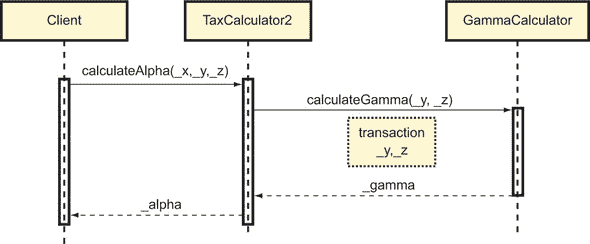

你可以通过`this`，即对当前合约的引用，强制一个`public`函数的调用看起来像一个外部调用，从而通过交易消息执行，如所示：

```
contract TaxCalculator3 {
   function calculateAlpha(int _x, int _y, int _z) 
      public returns (int _alpha) {
       _alpha = _x + this.calculateGamma(_y, _z);      *1*
   }

   function calculateGamma(int _y, int _z) 
      public returns (int _gamma) {                    *2*
       _gamma  = _y *3 +7*_z;
   }
}
```

+   ***1*** **通过'this'调用 calculateGamma 的行为就像是对一个外部合约的调用，所以生成一个交易消息，并存储在区块链上。**

+   ***2*** **要通过这个调用，你必须将 calculateGamma 声明为公开的。**

##### 改变函数调用中的参数顺序

当调用函数时，如果您指定了它们的名称，您可以任意顺序传递参数，如下面的列表所示：

```
contract TaxCalculator4 {
   function calculateAlpha(int _x, int _y, int _z)
      public returns (int _alpha) {
       _alpha = _x + this.calculateGamma(
          {_z:_z, _y:_y});                       *1*
  }

  function calculateGamma(int _y, int _z) 
     public returns (int _gamma) {
       _gamma  = _y *3 +7*_z;
    }
}
```

+   ***1*** **您可以任意顺序传递 calculateGamma 的参数，但在此情况下，您也必须指定参数名称。**

##### 视图和纯函数

可以将函数声明为`view`，意图是它不执行可能修改状态的任何操作，如表 5.6 中所定义。但编译器不检查是否发生了状态修改，所以目前`view`关键字主要用于文档目的。

##### 表 5.6. 导致状态修改的操作

| 修改状态的操作 |
| --- |
| 向状态变量写入 |
| 触发事件 |
| 创建或销毁合约 |
| 通过 send() 或 transfer() 发送以太币 |
| 调用未声明为 view 或纯的任何函数 |
| 使用低级调用（例如 call()）或某些内联汇编指令 |
|  |

##### 注意

在早期的 Solidity 版本中，`view`关键字被称为`constant`。许多开发人员认为`constant`具有误导性，因为它不清楚它是否意味着，如其他语言一样，函数将只返回常量结果。因此，尽管您仍然可以使用`constant`代替`view`，但后者是推荐使用的。

|  |
| --- |

可以将函数声明为`pure`，意图是它不执行可能修改状态的任何操作（如`view`函数所示）或读取状态，如表 5.7 中所定义。与`view`函数一样，编译器不检查`pure`函数是否修改或读取状态，所以目前`pure`关键字只具有文档目的。

##### 表 5.7. 被解释为从状态中读取的操作

| 读取状态的操作 |
| --- |
| 从状态变量中读取 |
| 访问账户余额（通过 this.balance 或 address.balance） |
| 访问区块、交易和大多数 msg 成员 |
| 调用任何未声明为纯的函数 |
| 使用某些内联汇编指令 |

以下列表中的代码以粗体突出显示了列表 5.1 中您可以声明为`view`或`pure`的函数。

##### 列表 5.5. 可以声明为`view`或`pure`的函数

```
pragma solidity ⁰.4.24;
contract AuthorizedToken {

    //...

    mapping (address => uint256) public tokenBalance; 
    mapping (address => bool) public frozenAccount;

    address public owner;                                 *1*
    uint256 public constant maxTranferLimit = 50000;

    //...

    function transfer(address _to, uint256 _amount) public { 
        require(checkLimit(_amount));
        //... 
        tokenBalance[msg.sender] -= _amount;              *2*
        tokenBalance[_to] += _amount;                     *2*
        Transfer(msg.sender, _to, _amount);
    }  

    //...

    function checkLimit(uint256 _amount) private pure
        returns (bool) { 
        if (_amount < maxTranferLimit)                    *3*
            return true;
        return false;
    }

    function validateAccount(address _account) internal view
        returns (bool) { 
        if (frozenAccount[_account] 
            && tokenBalance[_account] > 0)                *1*
            return true;
        return false;
    }

    //...

    function freezeAccount(address target, bool freeze)
        onlyOwner public  { 
        frozenAccount[target] = freeze;                   *4*
        FrozenAccount(target, freeze);
    }
}
```

+   ***1*** **不修改状态变量，所以您可以将此函数声明为 view**

+   ***2*** **修改状态变量 tokenBalance，所以您不能将 transfer() 声明为 view 或纯**

+   ***3*** **不读取或修改状态，因此您可以将此函数声明为纯**

+   ***3*** **修改状态变量 frozenAccount，所以您不能将 freezeAccount() 声明为 view 或纯**

##### 可支付函数

如果您希望允许函数接收以太币，则应将函数声明为可支付。以下示例显示如何将函数声明为可支付：

```
contract StockPriceOracle {
   uint quoteFee = 500;                                *1*
   mapping (string => uint) private stockPrices;  

   //...

   function getStockPrice(string _stockTicker) 
        payable returns (uint _stockPrice) {
        if (msg.value == quoteFee)                     *2*
        {
            //...
            _stockPrice = stockPrices[_stockTicker];
        }
        else 
            revert();                                  *3*
    }
}
```

+   ***1*** **引号价格以 Wei 计，调用者必须在调用 getStockPrice() 时发送**

+   ***2*** **检查发送的以太币金额（以 Wei 计）以覆盖服务费用，确保它是正确的**

+   ***3*** **如果发送的费 用不正确，则撤销交易，并且发送者不会被收费**

下面的代码展示了如何调用`getStockPrice()`函数时发送以太币和输入：

```
address stockPriceOracleAddress = 0x10abb5EfEcdC09581f8b7cb95791FE2936790b4E;
uint256 quoteFee = 500;
string memory stockTicker = "MSFT";

if (!stockPriceOracleAddress.call.value(quoteFee)
    (bytes4(sha3("getStockPrice()")), 
     _stockTicker))                      *1*
    revert();                            *2*
```

+   ***1*** **在调用外部函数时发送以太币**

+   ***2*** **如果 call()失败，它返回 false，并且通过 revert()恢复状态；。**

##### 回退函数

合约可以声明一个未命名（或匿名）的支付函数，该函数不能有任何输入或输出参数。如果客户端调用不匹配任何可用的合约函数，或者仅通过`send()`、`transfer()`或`call()`向合约发送普通以太币，这个函数就成为了一个*回退*函数。

如果你通过`send()`或`transfer()`调用回退函数，传递给回退函数的 gas 预算是最小的。在这种情况下，其实现必须避免任何成本高昂的操作，如写入存储、发送以太币或调用具有复杂或繁琐逻辑的内部或外部函数。在一个非最小的回退实现上的`send()`或`transfer()`调用很可能会耗尽 gas 并几乎立即失败。你必须避免这种情况，因为这将使以太币面临丢失或甚至被盗的风险，正如你在专门讲述安全的章节中所看到的。

下面的代码展示了经典的*最小回退*函数实现，它允许传入的`send()`和`transfer()`调用成功完成以太币转账：

```
contract A1 {
    function () payable {}
}
```

你还可以实现一个回退函数，以防止合约在不应该接受以太币的情况下接受以太币：

```
contract A2 {
    function () payable  {
        revert();
    }
}
```

|  |
| --- |

##### 警告

正如你在专门讲述安全的章节中看到的，回退函数为恶意参与者提供了攻击合约的各种方式，所以如果你决定提供回退函数，你必须学会如何正确实现它。

|  |
| --- |

##### 获取器函数

如我之前提到的，编译器会自动为合约中声明的每个公共状态变量生成一个获取器函数。获取器函数获得它暴露的状态变量的名称。例如，给定一个通常的合约

```
contract SimpleCoin {
    mapping (address => uint256) public coinBalance;       
    //...
}
```

你可以如下查询一个账户的余额：

```
uint256 myBalance = simpleCoinInstance.coinBalance(myAccountAddress);
```

获取器函数默认声明为`public`和`view`，因此可以通过`this`在合约内调用它，如下面代码所示：

```
contract SimpleCoin {
    mapping (address => uint256) public coinBalance;       
    //...

    function isAccountUsed(address _account) 
        internal view returns (bool) {
        if (this.coinBalance(_account) > 0)       *1*
            return true;
        return false;
    }
}
```

+   ***1*** **这个检查是通过一个获取器来完成的，但你也可以直接访问映射来实现：this.coinBalance[_account]，两者唯一的区别在于括号和方括号的使用。**

你可以通过函数修改器来改变函数的行为。继续阅读了解具体方法。

#### 5.3.6. 函数修改器

函数修改器通过在函数执行前后执行一些预处理和后处理来改变函数的行为。作为一个预处理修改器的示例，列表 5.6 中的代码显示了`onlyOwner,`这是一个典型的修改器，它只允许合约的创建者（即实例化合约的账户）调用函数。`isActive`是一个参数化修改器，它检查输入的用户账户是否没有冻结。

##### 列表 5.6\. 带有函数修改器的合约示例

```
contract FunctionModifiers {
    address owner;
    address[] users;
    mapping (address => bool) frozenUser;

    function FunctionModifiers () {
        owner = msg.sender;                    *1*
    }

    modifier onlyOwner {                       *2*
        require(msg.sender == owner);
        _;
    }

    modifier isActive(address _account) {
        require(!frozenUser[_account]);
        _;
    }

    function addUser (address _userAddress) 
        onlyOwner public {                     *3*
        users.push(_userAddress);
    }

    function refund(address addr) 
        onlyOwner isActive(addr) public {      *4*
        //...
    }
}
```

+   ***1*** **实例化时设置合约拥有者地址**

+   ***2*** **修改器定义**

+   ***3*** **通过这种方式将修改器与函数关联**

+   ***3*** **函数可以有多个修改器。**

从某个角度来看，你可以将修改器视为经典*装饰器*设计模式的实现，因为它在不修改函数逻辑的情况下为函数添加了行为。正如装饰器一样，你可以链接修改器，也可以将几个修改器附加到一个函数上，如`refund()`函数所示，它只能由合约拥有者调用，且用户账户没有冻结才能执行：

```
   function refund(address addr) onlyOwner isActive(addr) public {
        //...
   }
```

|  |
| --- |

##### 警告

修改器按照在函数定义中的放置顺序相反的顺序被调用。在示例中，`isActive`是首先应用的，`onlyOwner`是第二个。

|  |
| --- |

#### 5.3.7\. 变量声明、初始化与赋值

早些时候，我解释了调用代码如何分别设置和处理输入和输出函数参数。我还展示了相对复杂的情况，比如你是如何可以从元组结果中分配多个变量的。在本节中，我将提供更多关于局部函数变量的声明、初始化和赋值的信息。一些考虑也适用于状态变量。

##### 隐式初始化

与大多数静态类型语言不同，这些语言强制开发者显式初始化变量，当你在 Solidity 中声明一个变量时，它会隐式初始化为它的默认值，对应于其位全部设置为零，如表 5.8 所总结。

##### 表 5.8\. Solidity 类型的默认值

| 类型 | 默认值 | 示例 |
| --- | --- | --- |
| int 和 uint（所有大小） | 0 | int32 a; //0 |
| bool | false | bool flag; //false |
| bytes1 到 bytes32 | 所有字节设置为 0 | bytes4 byteArray; // 0x00000000 |
| 静态数组 | 所有项设置为零值 | bool [3] flags; // [false, false, false] |
| bytes | 空字节数组 | [] |
| 动态数组 | 空数组 | int [] values; // [] |
| string | 空字符串 | "" |
| 结构体 | 每个元素设置为默认值 |  |
|  |

##### 注意

如表 5.8 所解释，初始化的变量被设置为零值类似的数值。Solidity 中没有`null`值。

|  |
| --- |

##### 删除

你可以通过调用`delete`将其值重新初始化为默认值，如表 5.8 所示，如下面的代码所示：

```
contract DeleteExample {
    function deleteExample() returns (int32[5]) {
        int32[5] memory fixedSlots = [int32(5), 9, 1, 3, 4];
        //...
        delete fixedSlots;         *1*
        return fixedSlots;
    }
}
```

+   ***1*** **隐式重新初始化 fixedSlots 为 [int32 (0), 0, 0, 0, 0]**

你可以在 Remix 中执行这个操作。确保你检查左下角输出面板中`fixedSlots`的最终值，像往常一样。

##### 隐式类型声明

如果你可以从显式初始化中推断出变量的类型，你可以使用`var`隐式声明变量，如下面的代码所示：

```
contract TaxCalculator {
    function calculateAlpha(int _x) 
        public returns (int _alpha)  {
        var _gammaParams =  [int(5), 9];               *1*
        var _gamma = calculateGamma(_gammaParams[0], 
          _gammaParams[1]);                            *2*
        _alpha = _x + _gamma;
    }

    function calculateGamma(int _y, int _z)  
        private returns (int _gamma) {
            _gamma  = _y *3;
    }
}
```

+   ***1*** **隐式声明 _gammaParams 为 int32 [2]**

+   ***2*** **隐式声明 _gamma 为 int**

|  |
| --- |

##### 注意

使用`var`隐式声明变量并不意味着 Solidity 支持动态类型。这意味着你可以隐式地而不是显式地进行类型声明，但仍然是在编译时。

|  |
| --- |

当*解构*一个函数返回的元组到多个变量时，也可以隐式地声明多个类型。例如，考虑以下 `calculate()` 函数

```
contract Calculator {
    function calculate(uint _x) 
        public returns (uint _a, uint _b, 
          bool _ok) {                     *1*

        //...
        _a = _x * 2;                      *2*
        _b = _x** 3;                      *2*

        _ok == (_a * _b) < 10000;         *2*
    }
}
```

+   ***1*** **返回一个包含三个项目的元组**

+   ***2*** **在函数体内设置元组项**

可以将元组结果解构到三个变量中，如下所示：

```
var (_alpha, _beta, _success) = 
    calculatorInstance.calculate(5);        *1*
```

+   ***1*** **将 calculate() 返回的元组分配给三个变量**

|  |
| --- |

##### 注意

解构意味着将元组分解为其各个组成部分，然后将它们分配给单独的变量。

|  |
| --- |

##### 元组分配

当将元组分配给几个隐式或显式类型的变量时，如果元组中的项目数至少等于赋值左侧变量的数量，赋值将生效。这段代码展示了在给定的 `calculate()` 函数定义的情况下，正确和错误的赋值示例：

```
var (_alpha, _beta, ) = 
    calculatorInstance.calculate(5);      *1*
var (_alpha, _beta, _gamma, _ok) = 
    calculatorInstance.calculate(5);      *2*
```

+   ***1*** **忽略 _ok 标志但将成功**

+   ***2*** **将失败并出现错误，因为它试图从三个项目的元组中分配四个变量**

还可以从元组中设置 `struct` 的各种属性。例如，给定这个 `struct`

```
struct Factors {
    uint alpha;
    uint beta;
}
```

可以像以下这样设置其属性：

```
var factors = Factors({alpha:0, beta:0}); 
(factors.alpha, factors.beta, ) = 
   calculatorInstance.calculate(5);        *1*
```

+   ***1*** **将元组结果解构为 Factors 结构对象的属性。（注意，与之前的示例一样，calculate() 返回的 _ok 标志已被忽略。）**

#### 5.3.8. 事件

事件允许合约通知另一个合约或合约客户端，例如一个 Dapp 用户界面，发生了感兴趣的事情。你像在 C# 和 Java 中一样声明事件，并使用 `emit` 关键字发布它们，正如你在 `SimpleCoin` 中的以下代码片段所看到的那样：

```
pragma solidity ⁰.4.16;
contract SimpleCoin {
    mapping (address => uint256) public coinBalance; 
    //...
    event Transfer(address indexed from, 
          address indexed to, uint256 value);           *1*
    //...

    function transfer(address _to, uint256 _amount) public {
        //...
        coinBalance[msg.sender] -= _amount;  
        coinBalance[_to] += _amount;   
        emit Transfer(msg.sender, _to, _amount);        *2*
    }
    //...
}
```

+   ***1*** **定义 Transfer 事件**

+   ***2*** **使用 emit 发布 Transfer 事件**

Ethereum 中的事件不仅有实时通知的作用，还有长期记录的作用。事件被记录在区块链的交易日志上，你可以稍后 retrieve 它们进行分析。为了快速检索，事件会根据一个你可以在其声明时定义的键进行索引。该键可以是复合的，并包含多达三个其输入参数，正如你之前在`Transfer`的定义中看到的：

```
event Transfer(address indexed from, address indexed to, uint256 value);
```

在第六章中，你将了解如何监听并从客户端 JavaScript 代码中响应 Solidity 事件。在第十三章中，你将了解更多关于事件如何在区块链上记录，以及你如何回复和检索它们的信息。

#### 5.3.9. 条件语句

Solidity 支持所有在 C-like 和 Java-like 语言中可用的经典条件语句：

+   `if ... else`

+   `while`

+   `do ... while`

+   `for`

循环支持`continue`和`break`语句。

你已经完成了 Solidity 之旅的第一部分。如果你想要了解更多关于我在这章中介绍的语法，我鼓励你参考官方文档[`solidity.readthedocs.io/en/develop/`](https://solidity.readthedocs.io/en/develop/)。在下一节中，你将应用本章学到的知识来改进`SimpleCoin`。Solidity 之旅将在下一章继续，你将开始以面向对象的方式编写代码，并学习该语言的其他高级特性。

|  |
| --- |

##### 警告

虽然你可能认为，因为交易在 EVM 中是顺序执行的，所以在合约内部可能不会出现并发问题，但这并不完全正确。一个合约可能会调用外部合约上的一个函数，这可能会导致并发问题，特别是在外部合约回调调用者的情况下，正如你在第十四章关于安全性的内容中将会看到的那样。

|  |
| --- |

### 5.4. 是时候改进和重构 SimpleCoin 了

在本节中，你将按照以下方式扩展`SimpleCoin`的功能：

+   你会让账户的所有者授权另一个账户使用允许额度。

+   你会限制某些操作，如铸币或冻结账户，只能由合约所有者执行。

在进行任何更改之前，打开 Remix 并将第四章中的`SimpleCoin`最新代码版本输入到编辑器中，如下面的列表所示。

##### 列表 5.7. `SimpleCoin`的最新版本来自第四章

```
pragma solidity ⁰.4.0;

contract SimpleCoin {
  mapping (address => uint256) public coinBalance;

  event Transfer(address indexed from, address indexed to, uint256 value);

  constructor(uint256 _initialSupply) public {
    coinBalance[msg.sender] = _initialSupply;   
  }

  function transfer(address _to, uint256 _amount) public {
    require(coinBalance[msg.sender] > _amount);
    require(coinBalance[_to] + _amount >= coinBalance[_to] );
    coinBalance[msg.sender] -= _amount;  
    coinBalance[_to] += _amount;   
    emit Transfer(msg.sender, _to, _amount);  
  }
}
```

现在你可以尝试让一个账户的所有者授权另一个账户使用允许额度。这意味着如果账户 A 有 10,000 枚硬币，其所有者可以授权账户 B 转移一定数量的硬币（比如说总共在单独的转移操作中达到 200 枚）到其他账户。

#### 5.4.1. 实现授权设施

你可以用嵌套映射来建模代币允许额度：

```
mapping (address => mapping (address => uint256)) public allowance;
```

这意味着一个账户允许一个或多个账户管理一定数量的硬币；例如：

```
allowance[address1][address2] = 200;   *1*
allowance[address1][address3] = 150;   *2*
```

+   ***1*** **address2 可以管理 address1 余额中的 200 个硬币。**

+   ***2*** **address3 可以管理 address1 余额中的 150 个硬币。**

你可以通过调用以下函数授权允许额：

```
function authorize(address _authorizedAccount, uint256 _allowance) 
    public returns (bool success) {   
    allowance[msg.sender][_authorizedAccount] = 
      _allowance;                                 *1*
    return true;
}
```

+   ***1*** **允许 authorizedAccount 管理等于 _allowance 的硬币数量**

一旦一个账户被授权了允许额，它就可以将一定数量的硬币（不超过未使用的允许额）转给另一个账户，通过以下函数：

```
function transferFrom(address _from, address _to, uint256 _amount) 
    public returns (bool success) { 
    require(_to != 0x0);                         *1*
    require(coinBalance[_from] > _amount);       *2*
    require(coinBalance[_to] + 
       _amount >= coinBalance[_to] );            *3*
    require(_amount <= 
        allowance[_from][msg.sender]);           *4*

    coinBalance[_from] -= _amount;               *5*
    coinBalance[_to] += _amount;                 *6*
    allowance[_from][msg.sender] -= _amount;     *7*

    emit Transfer(_from, _to, _amount);          *8*

    return true;
}
```

+   ***1*** **防止向 0x0 地址转账，这是一个如果没有明确指定就会默认的地址**

+   ***2*** **检查源账户是否有足够的硬币**

+   ***3*** **检查溢出**

+   ***4*** **检查未使用允许额**

+   ***5*** **从源账户扣款**

+   ***6*** **增加接收账户**

+   ***7*** **减少未使用允许额**

+   ***8*** **触发转账事件**

允许额度的实施相对简单。现在你可以看到如何限制一些`SimpleCoin`功能仅限于合约所有者。

#### 5.4.2\. 限制操作仅限于合约所有者

合约所有者是部署合约的账户。`SimpleCoin`已经有一个针对合约所有者的操作。正如你所记得的，构造函数将初始代币供应分配给合约所有者，尽管这个分配是隐含的：

```
constructor(uint256 _initialSupply) {
    coinBalance[msg.sender] = _initialSupply;   
}
```

你可以通过声明合约所有者为公开地址 public owner，使代码的意图更加明确；然后你可以更改构造函数为：

```
constructor(uint256 _initialSupply) public {
    owner = msg.sender;                      *1*
    coinBalance[owner] = _initialSupply;     *2*
}
```

+   ***1*** **初始化合约所有者为部署合约的账户地址**

+   ***2*** **显式将初始代币供应分配给合约所有者**

##### 铸币硬币

在初始化`owner`变量之后，你可以限制某些函数的执行仅限于合约所有者调用它们。例如，你可以将分配初始供应给所有者的构造函数代码提取到一个更通用的新函数中：

```
function mint(address _recipient, uint256  _mintedAmount) public {
    require(msg.sender == owner);                                  *1*
    coinBalance[_recipient] += _mintedAmount;                      *2*
    emit Transfer(owner, _recipient, 
       _mintedAmount);
}
```

+   ***1*** **限制此函数的调用仅限于合约所有者**

+   ***2*** **将铸币金额分配给接收者**

然后你可以按照以下方式更改构造函数：

```
constructor(uint256 _initialSupply) public {
    owner = msg.sender;
    mint(owner, _initialSupply);       *1*
}
```

+   ***1*** **现在初始供应通过 mint()函数生成。**

现在`mint()`函数允许所有者随意生成硬币，不仅在构造时。`mint()`函数第一行执行的检查确保只有所有者可以生成铸币硬币。

|  |
| --- |

##### 注意

在查看代币建模智能合约的代码时，你经常会发现生成新硬币或代币的功能被命名为`mint()`，这个名字来源于英语动词，与制作传统金属货币有关。

|  |
| --- |

##### 冻结账户

你可能想要进一步扩大合约所有者的权力，并授予他们独家冻结账户的能力。你可以通过以下映射建模已经被冻结的账户集合：

```
mapping (address => bool) public frozenAccount;
```

理想的数据结构可能是一个 Python 集合（或 C# `Set`或 Java `HashSet`），这将允许你存储冻结地址（上面映射的键）并有效地检查它们，而无需存储任何关联值（例如，前面映射中的布尔标志）。但是，可以将地址到布尔值的映射视为地址集合的一个近似。

你也可以声明一个事件，在冻结账户时发布：

```
event FrozenAccount(address target, bool frozen);
```

然后，所有者可以使用以下函数冻结账户：

```
function freezeAccount(address target, bool freeze) public{
    require(msg.sender == owner);                            *1*

    frozenAccount[target] = freeze;                          *2*

    emit FrozenAccount(target, freeze);                      *3*
}
```

+   ***1*** **只允许合约所有者调用这个函数**

+   ***2*** **将目标账户添加到冻结账户集合中**

+   ***3*** **引发事件**

|  |
| --- |

##### 注意

你可以使用`freezeAccount()`函数根据布尔参数的值来冻结或解冻账户。

|  |
| --- |

你可能已经注意到，正在对`msg.sender`执行的检查， restricts the caller of this function to only the owner，与你在`mint()`上执行的完全一样。难道不好把它封装成一种可复用的方法吗？等等...这正是函数修饰语的目的！

##### 创建`onlyOwner`修饰语

我知道，我知道！如果你是那些关注我在列表 5.6 中介绍的`onlyOwner`修饰语的读者，我敢打赌你会气愤地想知道为什么我从这一部分一开始就没有使用它。嗯，我就是想让你艰难地了解修饰语的实用性。现在你可以将消息发送者地址与所有者地址的重复检查重构为`onlyOwner`修饰语：

```
modifier onlyOwner {
    if (msg.sender != owner) revert();      *1*

    _;
}
```

+   ***1*** **不允许合约所有者之外的调用者调用修改后的函数。**

然后，你可以简化`mint()`和`freezeAccount()`如下：

```
function mint(address _recipient, uint256  _mintedAmount) 
    onlyOwner public {                                      *1*
    coinBalance[_recipient] += _mintedAmount; 
    emit Transfer(owner, _recipient, _mintedAmount); 
}

function freezeAccount(address target, bool freeze) 
    onlyOwner public {                                      *1*
    frozenAccount[target] = freeze;  
    emit FrozenAccount(target, freeze);
}
```

+   ***1*** **`onlyOwner`修饰语替换了之前的对`msg.sender`的检查。**

你可以看到改进后的`SimpleCoin`合约，包括允许设置和限制币铸造、账户冻结功能的以下列表。

##### 列表 5.8\. `SimpleCoin`的扩展功能的重构版本

```
pragma solidity ⁰.4.24;
contract SimpleCoin {
  mapping (address => uint256) public coinBalance;
  mapping (address => mapping (address => uint256)) public allowance;
  mapping (address => bool) public frozenAccount;
  address public owner;

  event Transfer(address indexed from, address indexed to, uint256 value);
  event FrozenAccount(address target, bool frozen);

  modifier onlyOwner {
    if (msg.sender != owner) revert();
    _;
  }

  constructor(uint256 _initialSupply) public {
    owner = msg.sender;

    mint(owner, _initialSupply);
  }

  function transfer(address _to, uint256 _amount) public {
    require(_to != 0x0); 
    require(coinBalance[msg.sender] > _amount);
    require(coinBalance[_to] + _amount >= coinBalance[_to] );
    coinBalance[msg.sender] -= _amount;  
    coinBalance[_to] += _amount;  

    emit Transfer(msg.sender, _to, _amount);  
  }

  function authorize(address _authorizedAccount, uint256 _allowance) 
    public returns (bool success) {
    allowance[msg.sender][_authorizedAccount] = _allowance; 
    return true;
  }

  function transferFrom(address _from, address _to, uint256 _amount) 
    public returns (bool success) {
    require(_to != 0x0);  
    require(coinBalance[_from] > _amount); 
    require(coinBalance[_to] + _amount >= coinBalance[_to] ); 
    require(_amount <= allowance[_from][msg.sender]);  

    coinBalance[_from] -= _amount; 
    coinBalance[_to] += _amount; 
    allowance[_from][msg.sender] -= _amount;
    emit Transfer(_from, _to, _amount);
    return true;
  }

  function mint(address _recipient, uint256  _mintedAmount) 
    onlyOwner public { 

    coinBalance[_recipient] += _mintedAmount; 
    emit Transfer(owner, _recipient, _mintedAmount); 
  }

  function freezeAccount(address target, bool freeze) 
    onlyOwner public { 

    frozenAccount[target] = freeze;  
    emit FrozenAccount(target, freeze);
  }
}
```

你已经完成了提议的改进的实现。在这个过程中，你看到了一个函数修饰语的实际应用。在下一章中，将重点介绍 Solidity 的高级面向对象特性，你将进一步改进`SimpleCoin`的代码。

### 总结

+   虽然已经开发出了各种 EVM 语言，但 Solidity 是最受欢迎的。

+   Solidity 智能合约的结构与面向对象类结构相似。

+   Solidity 有两大类类型：值类型，包括枚举、原始类型（整数类型、`bool`、`address`）和函数；以及引用类型，包括数组、字符串、结构体和映射。

+   你可以将引用类型对象存储在任何内存或存储中。

+   你总是将状态变量存储在存储中，从不存储在内存中。

+   函数相当于面向对象的**方法**；它们可以接受多个参数，并且可以返回单个结果或多个结果，以元组的形式。

+   未分配的变量根据其类型被设置为默认值。

+   你可以将函数返回的元组解构到不同的变量中。

+   你可以定义具有特定访问级别的状态变量和函数：私有、内部、公共或外部。（后者仅适用于函数。）

## 第六章. 编写更复杂的智能合约

|  |
| --- |

**本章内容**

+   构建众售管理 Dapp，展示如何构建复杂的合约

+   通过单一和多重继承扩展众售管理 Dapp。

|  |
| --- |

前一章的目的是给你一个 Solidity 的基础，所以我主要关注了该语言提供的基本语法。在接下来的两章中，我将介绍更多高级的面向对象（OO）特性。我从继承开始，在第六章介绍，然后是抽象合约和接口，在第七章介绍。这些 OO 特性允许你减少代码重复，并使你的合约更具组合性。

现实世界中 Dapp 的合约部分通常比你们迄今为止见到的单一合约 Dapp（如 SimpleCoin）要复杂。它们通常跨越多个合约，这些合约相互之间进行交互，每个合约都是潜在复杂继承结构的具体实例。在本章中，我将帮助你构建 Simple-Crowdsale，一个基本的众售管理 Dapp。众售是投资者通过购买由开发该 Dapp 的组织发行的代币来资助 Dapp 的过程。这个示例应用将让你了解一个现实 Dapp 的智能合约层可以有多么复杂，以及继承、抽象类和接口如何帮助你恰当地建模它。

我将尽可能地保持我对继承和多态的实用主义介绍，所以如果你是需要在对象导向编程方面重温知识的读者，你仍然能够轻松地跟随。我将从构建一个由简单合约组成的应用程序开始，并在本章中逐步引入我提到的所有对象特性。

### 6.1. 介绍 SimpleCrowdsale，一个众售合约

我敢打赌你一定听过众筹这个词，这是一种通过相对较小的金额来自相对较多的人的资金筹集方式来资助一个项目或一个原因。你甚至可能在[Kickstarter.com](http://Kickstarter.com)、[Indiegogo.com](http://Indiegogo.com)或[Microventures.com](http://Microventures.com)投资一些资金用于设计一个新潮的小玩意。如果是这样，根据你投资的金额和项目是否成功，你可能会得到这个玩意的早期版本，或者你可能会在产品的最终官方价格上得到相当大的折扣。这种方案称为*基于奖励*的众筹。

最近，一种名为*代币众筹*的新众筹模式出现，主要面向初创公司的资金筹集。你不是因为早期贡献而获得打折的产品或服务，而是被提供一些创业公司的股权，通常以类似于 SimpleCoin 的货币代币的形式出现，其价值组织者在销售开始前可以设定。或者，价值可以在活动期间根据市场因素，如初始代币供应量和实际需求动态确定。通常，代币或硬币众筹被称为*首次代币发行 (ICO)*，这个表达反映了更传统的公司首次上市时股票的首次公开募股（IPO）。

在本节中，你将构建 SimpleCrowdsale，一个去中心化的众筹管理应用程序，它将教你如何基于多个 Solidity 合约和库设计 Dapps。简而言之，以下列表描述了一个众筹合约通常提供的最小功能，如图 6.1 中的核心众筹工作流程所示：图 6.1。

+   它管理众筹投资者在资金阶段提供的资金，通常以加密货币的形式。它还将收到的加密货币转换为代币，并将它们分配给相应的投资者。

+   如果众筹目标，如最低投资额或时间限制等，已达成，它将释放代币给投资者。开发 Dapp 的组织保留所收集的以太币，并将其用于资助项目成本。可能会向组织者、开发团队或参与代币销售的其它方授予代币奖励。释放代币意味着激活它们，使它们能够被使用。*投资者可以通过代币交易所*用代币换取现金，一旦代币相对于初始投资变得有利可图。这一过程与公司上市并发行股票给投资者以换取现金类似，随后它将用这些现金来资助其活动。投资者可以在随后的事务市场上交易他们的股票，这些股票的价值可能会根据公司的成功与否而增加或减少。

+   如果众售不成功——例如没有达到目标投资额——合约允许投资者要求退款。

##### 图 6.1\. 众售的核心工作流程：1) 投资者通过支付加密货币来预订众售代币；2) 如果众售达到了最低融资目标，代币将被释放给投资者； 代币奖金可能会授予组织者，开发团队或参与代币销售的其它方； 项目组织保留收到的以太币，并将其用于资助项目成本；3) 如果众售不成功，投资者可以获得退款。

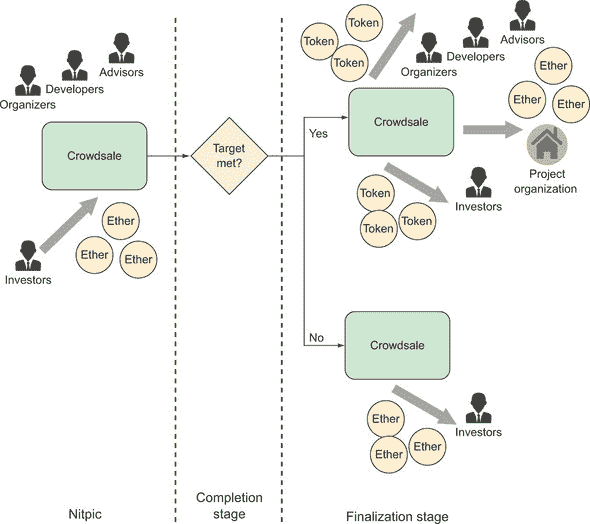

列表 6.1 让你对众售 Solidity 合约需要实现的功能有一个大致的了解。 （现在还不要在 Remix 中输入代码！） 如果你好奇，`onlyOwner` 是我在 5.4.2 节的`SimpleCoin`中介绍过的同一个修改器：只有合约所有者被允许执行`finalize()`函数。

##### 列表 6.1\. 众售合约提供的核心功能

```
contract SimpleCrowdsale {    
    function invest(address _beneficiary) 
       public payable {}                      *1*
    function finalize() onlyOwner public {}   *2*
    function refund() public {}               *3*
}
```

+   ***1*** **允许投资者预订众售代币。（不需要参数来指定投资以太币的数量，因为它是通过 msg.value 属性发送的。）**

+   ***2*** **允许众售的组织者，即合约所有者，在众售成功完成后向投资者释放代币，如有需要，向开发团队发放奖金**

+   ***3*** **允许投资者在众售不成功时获得退款**

让我们构建这个功能的基本实现，我们将把它作为后来讨论高级面向对象特性时的起点。在你达到 6.1.9 之前，我期望你不要把代码输入到 Remix 中，因为我会逐步重构代码以逐步解释概念。然后我在列表 6.5 中回顾所有内容，这个列表是可以完全执行的。但是如果你想在我进行的过程中尝试一下，你可以这么做。

#### 6.1.1\. 状态变量

众售合约需要维护一些关于资金期间的信息，在此期间接受投资贡献，出售代币的价格，最低投资目标以及接受投资的账户地址。 它还需要记录投资者提交的贡献。 这些数据应该可以从整个合约中可见，所以你应该用以下状态变量来表达它：

```
uint256 public startTime;                 *1*
uint256 public endTime;                   *2*
uint256 public weiTokenPrice;             *3*
uint256 public weiInvestmentObjective;    *4*

mapping (address => uint256) 
   public investmentAmountOf;             *5*
uint256 public investmentReceived;        *6*
uint256 public investmentRefunded;        *7*

bool public isFinalized;                  *8*
bool public isRefundingAllowed;           *9*
address public owner;                     *10*
SimpleCoin public crowdsaleToken;         *11*
```

+   ***1*** **众售资金阶段的开始时间，以 UNIX 纪元表示**

+   ***2*** **众售资金阶段的结束时间，以 UNIX 纪元表示**

+   ***3*** **出售的代币价格**

+   ***4*** **最低投资目标，这定义了众售是否成功**

+   ***5*** **来自每位投资者的以太币金额**

+   ***6*** **从投资者那里收到的总以太币**

+   ***7*** **向投资者退还的总以太币**

+   ***8*** **表示合约是否已最终化的标志**

+   ***9*** **允许退款的标志**

+   ***10*** **众售合约所有者的账户**

+   ***11*** **众售合约中待售代币的实例。（此刻你将使用我们在第五章中留下的 SimpleCoin。）**

#### 6.1.2\. 构造函数

合约构造函数应该接受我描述的所有输入配置，验证它们，并实例化待售代币的合约。为了简化事情，你将使用 SimpleCoin，因为你已经熟悉它。你不会在下面的代码中找到任何令人惊讶的东西：

```
constructor(uint256 _startTime, uint256 _endTime, 
    uint256 _weiTokenPrice, uint256 _etherInvestmentObjective) public
{
    require(_startTime >= now);                        *1*
    require(_endTime >= _startTime);                   *1*
    require(_weiTokenPrice != 0);                      *1*
    require(_etherInvestmentObjective != 0);           *1*

    startTime = _startTime;                            *2*
    endTime = _endTime;                                *2*
    weiTokenPrice = _weiTokenPrice;                    *2*
    weiInvestmentObjective =                           *2*
 _etherInvestmentObjective * 1000000000000000000;    *2*

    crowdsaleToken = new SimpleCoin(0);                *3*
    isFinalized = false;
    isRefundingAllowed = false;
    owner = msg.sender;                                *4*
}
```

+   ***1*** **验证输入配置**

+   ***2*** **将输入配置设置为状态变量**

+   ***3*** **实例化众售中的待售代币合约**

+   ***3*** **设置合约所有者，如 SimpleCoin 所示**

#### 6.1.3\. 实现 invest()

这是合约最重要的功能。它的目的是接受投资者提供的以太坊资金并将它们转换成众售代币。不过，这些代币要等到众售成功完成后才会释放给各自的所有者。

正如你在下面的实现中所看到的，你已经将`invest()`函数声明为`payable`，并在三个内部函数中放置了验证逻辑和代币转换逻辑。你还声明了几个这些函数引发的事件：

```
event LogInvestment(address indexed investor, uint256 value);
event LogTokenAssignment(address indexed investor, uint256 numTokens);

function invest() public payable {                     *1*
    require(isValidInvestment(msg.value));             *2*

    address investor = msg.sender;
    uint256 investment = msg.value;

    investmentAmountOf[investor] += investment;        *3*
    investmentReceived += investment;                  *3*

    assignTokens(investor, investment);                *4*
    emit LogInvestment(investor, investment);          *5*
}

function isValidInvestment(uint256 _investment) 
    internal view returns (bool) {                     *6*
    bool nonZeroInvestment = _investment != 0;         *7*
    bool withinCrowdsalePeriod = 
       now >= startTime && now <= endTime;             *8*

    return nonZeroInvestment && withinCrowdsalePeriod;
}

function assignTokens(address _beneficiary, 
    uint256 _investment) internal {

    uint256 _numberOfTokens = 
       calculateNumberOfTokens(_investment);           *9*

    crowdsaleToken.mint(_beneficiary, 
       _numberOfTokens);                               *10*
}

function calculateNumberOfTokens(uint256 _investment) 
    internal returns (uint256) {
    return _investment / weiTokenPrice;                *11*
}
```

+   ***1*** **将 invest()函数声明为可支付，以接受以太坊**

+   ***2*** **检查投资是否有效**

+   ***3*** **记录每个投资者的投资和总投资**

+   ***4*** **将以太坊投资转换为众售代币**

+   ***5*** **记录投资事件**

+   ***6*** **验证投资**

+   ***7*** **检查这是否是有意义的投资**

+   ***8*** **检查是否在众售融资阶段进行**

+   ***9*** **计算与投资相对应的代币数量**

+   ***10*** **在投资者账户中生成代币**

+   ***11*** **计算代币数量**

#### 6.1.4\. 实现 finalize()

`finalize()`函数的目的是执行众售的关闭动作。如果众售达到了最低投资目标，合约将释放代币给投资者，以便它们可以使用。另外，根据总收集到的投资金额，可能会分配并释放给开发团队的代币奖励。另一方面，如果众售不成功，它将进入退款状态，并允许投资者将他们的投资退款到他们的账户中。

在代币释放给投资者之前，它们应该保持锁定状态，处于不可用状态：代币所有者不应该能够对它们执行任何操作，比如将它们转移到其他账户。只有在众售成功的情况下，智能合约才应释放最初锁定的代币。

如您所知，`SimpleCoin` 操作（除了 `minting()`，它限制为合约所有者）没有任何限制，并且不依赖于合约所有者解锁任何功能。因此，`SimpleCoin` 目前不适合用于众筹。看来你必须创建一个修改后的 `SimpleCoin` 版本——比如 `ReleasableSimpleCoin`——其操作（如 `transfer()` 和 `transferFrom()`），除非代币已被释放，否则不允许执行，如下面的列表所示。

##### 列表 6.2\. `ReleasableSimpleCoin`，带有锁定的 `transfer()` 和 `transferFrom()`

```
contract ReleasableSimpleCoin {
    bool public released = false;                     *1*

    ...                                                 *2*

    function release() onlyOwner {                    *3*
        released = true;
    }

    function transfer(address _to, uint256 _amount) public {
        require(_to != 0x0); 
        require(coinBalance[msg.sender] > _amount);
        require(coinBalance[_to] + _amount >= coinBalance[_to] );

        if (released ) {                              *4*
            coinBalance[msg.sender] -= _amount;  
            coinBalance[_to] += _amount;   
            emit Transfer(msg.sender, _to, _amount); 

            return true; 
        }
        revert();                                     *5*
    }

    function transferFrom(address _from, address _to, uint256 _amount) 
        public returns (bool success) {

        require(_to != 0x0);  
        require(coinBalance[_from] > _amount); 
        require(coinBalance[_to] + _amount >= coinBalance[_to] ); 
        require(_amount <= allowance[_from][msg.sender]);  

        if (released ) {                              *4*
            coinBalance[_from] -= _amount; 
            coinBalance[_to] += _amount; 
            allowance[_from][msg.sender] -= _amount;
            emit Transfer(_from, _to, _amount);

            return true;
        }
        revert();                                     *5*

    }

    ...                                                 *5*

}
```

+   ***1*** **决定代币是否释放的标志**

+   ***2*** **与之前相同的 SimpleCoin 代码，为简洁起见省略。（如果你期待继承...，它还没有到来。）**

+   ***3*** **新功能释放硬币。（仅限合约所有者调用。）**

+   ***4*** **现在只有在代币已被释放的情况下才能执行传输逻辑。**

+   ***5*** **如果代币尚未释放，则状态还原。**

#### 6.1.5\. 小插曲：介绍继承

在列表 6.2 中介绍的 `ReleasableSimpleCoin` 实现工作正常，但存在一个主要问题：它重复了 `SimpleCoin` 的大部分代码，明显的维护劣势。如果你决定更改 `SimpleCoin`，你必须记得在 `ReleasableSimpleCoin` 中复制相同的更改，这既耗时又容易出错。避免这种情况的方法是通过单一继承 `ReleasableSimpleCoin` 自 `SimpleCoin` 并引入 `isReleased` 修改器，如下面的列表所示。

##### 列表 6.3\. `ReleasableSimpleCoin` 从 `SimpleCoin` 继承而来

```
pragma solidity ⁰.4.18;
import "./Listing5_8_SimpleCoin.sol";                       *1*
contract ReleasableSimpleCoin is SimpleCoin {               *2*
    bool public released = false;                           *3*

    modifier isReleased() {                                 *4*
        if(!released) {
 revert();
        }

        _;
    }

    constructor(uint256 _initialSupply) 
        SimpleCoin(_initialSupply) public {}                *5*

    function release() onlyOwner public {                   *6*
        released = true;
    }

    function transfer(address _to, uint256 _amount) 
        isReleased public {                                 *7*
        super.transfer(_to, _amount);                       *8*
    }

    function transferFrom(address _from, address _to, uint256 _amount)  
        isReleased public returns (bool) {                  *7*
        super.transferFrom(_from, _to, _amount);            *8*
    }  
}
```

+   ***1*** **指令引用定义 SimpleCoin 的文件（从本书网站下载 列表 5.8）**

+   ***2*** **使 ReleasableSimpleCoin 从 SimpleCoin 继承**

+   ***3*** **决定代币是否释放的标志**

+   ***4*** **修改器封装释放标志的检查**

+   ***5*** **调用基构造函数初始化 SimpleCoin 中的 initialSupply 状态变量**

+   ***6*** **释放代币的新功能。（仅限合约所有者调用。）**

+   ***7*** **覆盖原始实现。（多亏了 isReleased 修改器，只有在代币已被释放的情况下才能成功调用。）**

+   ***8*** **您通过 super 调用原始 SimpleCoin 实现。尽管如此，原始实现现在受到 isReleased 修改器的限制。**

`ReleasableSimpleCoin` 合约为您提供了 Solidity 中单一继承的具体示例。让我们总结一下与继承相关的 Solidity 关键词：

+   合约通过 `is` 关键词从另一个合约派生，如下所示：

    ```
    Contract ReleasableSimpleCoin is SimpleCoin
    ```

+   派生合约的构造函数必须传递给基构造函数所有必要的参数，如下所示：

    ```
    function ReleasableSimpleCoin(uint256 _initialSupply)
      SimpleCoin(_initialSupply)  {}
    ```

+   派生合约继承了父合约的所有公共和内部函数。有可能通过在子合约中重新实现而在子合约中*覆盖*一个函数，如下所示：

    ```
    function transfer(address _to, uint256 _amount) isReleased public { ...
    ```

+   一个被覆盖的函数可以使用`super`关键字从基础合约调用原始实现，如下所示：

    ```
    super.transfer(_to, _amount);
    ```

如果你对面向对象术语不是完全熟悉，表 6.1 可以帮助你理解它。

##### 表 6.1\。继承术语

| 定义 | 解释 |
| --- | --- |
| 派生合约 | 继承合约—从父合约获取公共和内部状态变量及函数。 |
| 派生合约 | 继承合约、子合约或子合约。 |
| 基础合约 | 父合约。 |
| 被覆盖函数 | 在派生合约中重新实现的函数—当派生合约调用函数时，使用被覆盖函数而不是父函数。 |

你可以在图 6.2 的合约图中看到`ReleasableSimpleCoin`和`SimpleCoin`之间的继承关系。我使用了与 UML 类图相同的绘图约定。尽管你可能能够直观地理解 UML 类图，但如果你不熟悉它们并且想了解更多，请查看相关边栏。

##### 图 6.2\。合约图，说明代币合约层次结构：`SimpleCoin`是一个基础合约，`ReleasableSimpleCoin`是从它继承而来的。

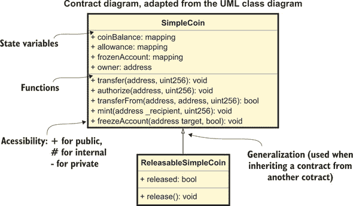

|  |
| --- |

**UML 类图**

统一建模语言（UML）是一种通用建模语言，旨在标准化软件系统设计的可视化。它是在 1990 年代由 Grady Booch、Ivar Jacobson 和 James Rumbaugh 在 Rational Software 开发的。它在 2005 年成为 ISO 标准。

UML 涵盖了各种图表，包括这些类别：

+   **行为图*—描述系统如何工作（系统组件如何相互交互以及与外部代理交互）

+   **结构图*—描述系统在不同层次的结构（待部署的包、组件内的组件以及组件内的面向对象类）

在这本书中，我只会向你展示*合约图*，鉴于合约与类概念的相似性，它们基于 UML*类图*，最低级别的结构图。

合约图描述了合约的内容（状态变量和函数）以及合约之间的两种主要关系：

+   **泛化*—合约从更一般的合约（其基础或父合约）继承，或者，如您稍后将要学习，从接口继承。

+   **依赖性**—其中一个状态变量是另一个合约的实例。

我已经为你们看到的这个示例合同图中的每一段文本和每一个符号做了注释，这样你们在接下来的页面中遇到任何理解上的困难时，都可以参考它。我会在接下来的部分中介绍新符号时解释它们。


合同图，符号和约定改编自 UML 类图

如果你想了解更多关于 UML 图的信息，我鼓励你们查阅*UML 快速参考卡*，在[`tnerual.eriogerg.free.fr/umlqrc.pdf`](http://tnerual.eriogerg.free.fr/umlqrc.pdf)，或者这个方便的*UML 速查表*：[`mng.bz/jO5p`](http://mng.bz/jO5p)。关于 UML 最好的书籍是《统一建模语言用户指南》，由 Grady Booch 等人撰写，由 Addison-Wesley 出版。

|  |
| --- |

#### 6.1.6\. 实现 finalize()，第二次尝试

现在你们已经实现了一个适合众筹的代币，你们可以回到状态变量部分，用以下内容替换`crowdsaleToken`的定义：

```
ReleasableSimpleCoin public crowdsaleToken;
```

然后用以下内容修改众筹构造函数中的代币实例化：

```
crowdsaleToken = new ReleasableSimpleCoin(0);
```

现在我可以向你们展示`finalize()`函数的一个可能实现：

```
function finalize() onlyOwner public {                *1*
    if (isFinalized) revert();                        *2*

    bool isCrowdsaleComplete = now > endTime;         *3*
    bool investmentObjectiveMet = 
       investmentReceived >= weiInvestmentObjective;  *3*

    if (isCrowdsaleComplete)
    {     
        if (investmentObjectiveMet)
            crowdsaleToken.release();                 *4*
        else 
            isRefundingAllowed = true;                *5*

        isFinalized = true;
    }               
}
```

+   ***1*** **只允许众筹合同所有者调用 finalize()**

+   ***2*** **防止在已最终化的合同上调用 finalize()**

+   ***3*** **决定众筹是否成功的条件**

+   ***4*** **释放众筹代币，使投资者可以使用它们**

+   ***5*** **如果资金目标没有达成，允许投资者获得退款**

如我之前提到的，`onlyOwner`是我在第五章末在 SimpleCoin 中引入的同一个修改器，用于限制某些函数的执行仅限于合同所有者：

```
  modifier onlyOwner {
    if (msg.sender != owner) revert();

    _;
  }
```

#### 6.1.7\. 实现 refund()

你们必须实现的最后函数，以完成你们众筹合同的第一版，是`refund()`函数，投资者会在众筹不成功后调用它：

```
event Refund(address investor, uint256 value);

function refund() public {
    if (!isRefundingAllowed) revert();                   *1*

    address investor = msg.sender;
    uint256 investment = investmentAmountOf[investor];
    if (investment == 0) revert();                       *2*
    investmentAmountOf[investor] = 0;                    *3*
    investmentRefunded += investment;
    emit Refund(msg.sender, investment);

    if (!investor.send(investment)) revert();            *4*
}
```

+   ***1*** **只有在众筹结束时允许退款的情况下，才允许退款**

+   ***2*** **只有在投资者贡献了有意义金额的情况下，才允许退款**

+   ***3*** **记录所有退款**

+   ***4*** **将以太坊退还给投资者，并处理可能的传输错误**

|  |
| --- |

##### 注意

我决定通过`send()`而不是`transfer()`来退款给投资者，只是因为`transfer()`在 Remix 中有一些奇怪的问题（在撰写本文时），可能会产生不必要的错误信息，这会减慢你们的学习体验。在生产环境中，建议使用`transfer()`。

|  |
| --- |

#### 6.1.8\. 使用继承消除代码重复

正如我提到的，`SimpleCoin`和`SimpleCrowdsale`都使用相同的`onlyOwner`修改器来限制某些操作仅限于合约所有者。优点是你在这两个合约中一致地使用了`onlyOwner`。缺点是你必须引入`owner`状态变量并在两个合约中实现`onlyOwner`修改器。难道不好把这个修改器放在一个地方，这样你就可以不用引入代码重复把它们都放到`SimpleCoin`和`SimpleCrowdsale`中吗？幸运的是，你可以通过将所有权状态和`onlyOwner`修改器封装到一个名为`Ownable`的单独合约中来实现，如下列表所示。

##### 列表 6.4\. 从`SimpleCrowdsale`和`SimpleCoin`中提取的`Ownable`合约

```
pragma solidity ⁰.4.18;
contract Ownable {
    address public owner;                *1*

    constructor() public {
        owner = msg.sender;              *2*
    }

    modifier onlyOwner() {
        require(msg.sender == owner);    *3*
        _;
    }
}
```

+   ***1*** **在状态变量中保持合约所有者的地址**

+   ***2*** **在构造时分配合约所有者**

+   ***3*** **检查是否调用此修改器的函数调用者是所有者**

现在你可以从`SimpleCoin`和`SimpleCrowdsale`中移除所有者状态变量和`onlyOwner()`修改器，并将这两个合约都继承自`Ownable`，如图 6.3 中的合约图和以下代码所示：图 6.3。

```
SimpleCoin is Ownable {
... 
}

SimpleCrowdsale is Ownable {
... 
}
```

##### 图 6.3\. 将所有权功能移至`Ownable`合约后，`SimpleCoin`和`SimpleCrowdsale`仍然可以通过继承`Ownable`来使用`onlyOwner`修改器。

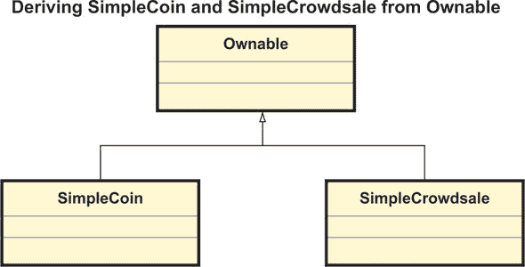

你可以在附录 A 中看到重构后的`SimpleCoin`合约继承自`Ownable`。恭喜你！你已经完成了第一个众筹合约的实现，你可以在图 6.4 的合约图和列表 6.5 中完全欣赏到它。

|  |
| --- |

##### 注意

图 6.4 中的 SimpleCrowdsale 和`ReleasableSimpleCoin`之间的箭头是 UML 符号，表示*依赖于*。我包括了箭头，因为`SimpleCrowdsale`合约有一个类型为`ReleasableSimpleCoin`的状态变量，所以它依赖于`ReleasableSimpleCoin`。

|  |
| --- |

##### 图 6.4\. 包括`Ownable`合约和代币合约的众筹合约图。`SimpleCrowdsale`和`SimpleCoin`都继承自`Ownable`。`SimpleCrowdsale`有一个`ReleasableSimpleCoin`状态变量，因此它依赖于`ReleasableSimpleCoin`。（如果你不熟悉面向对象类图，空心箭头表示“继承自”，实心箭头表示“依赖于”）

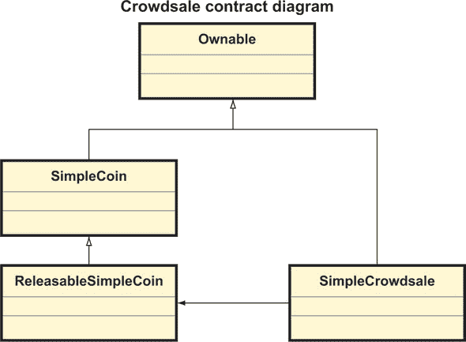

##### 列表 6.5\. 众筹合约的初始实现

```
pragma solidity ⁰.4.24;

import "./Listing6_3_ReleasableSimpleCoin.sol";       *1*
import "./Listing6_4_Ownable.sol";                    *1*

contract SimpleCrowdsale is Ownable {
    uint256 public startTime;
    uint256 public endTime; 
    uint256 public weiTokenPrice;
    uint256 public weiInvestmentObjective;

    mapping (address => uint256) public investmentAmountOf;
    uint256 public investmentReceived;
    uint256 public investmentRefunded;

    bool public isFinalized;
    bool public isRefundingAllowed; 

    ReleasableSimpleCoin public crowdsaleToken; 

    constructor(uint256 _startTime, uint256 _endTime, 
      uint256 _weiTokenPrice, 
      uint256 _weiInvestmentObjective) 
      payable public
    {
        require(_startTime >= now);
        require(_endTime >= _startTime);
        require(_weiTokenPrice != 0);
        require(_weiInvestmentObjective != 0);

        startTime = _startTime;
        endTime = _endTime;

        weiTokenPrice = _weiTokenPrice;
        weiInvestmentObjective = _weiInvestmentObjective;

        crowdsaleToken = new ReleasableSimpleCoin(0);
        isFinalized = false;
    } 

    event LogInvestment(address indexed investor, uint256 value);
    event LogTokenAssignment(address indexed investor, uint256 numTokens);
    event Refund(address investor, uint256 value);

    function invest() public payable {
        require(isValidInvestment(msg.value)); 

        address investor = msg.sender;
        uint256 investment = msg.value;

        investmentAmountOf[investor] += investment; 
        investmentReceived += investment; 

        assignTokens(investor, investment);
        emit LogInvestment(investor, investment);      
    }

    function isValidInvestment(uint256 _investment) 
        internal view returns (bool) {
        bool nonZeroInvestment = _investment != 0;
        bool withinCrowdsalePeriod = now >= startTime && now <= endTime; 

        return nonZeroInvestment && withinCrowdsalePeriod;
    }

    function assignTokens(address _beneficiary, 
        uint256 _investment) internal {

        uint256 _numberOfTokens = calculateNumberOfTokens(_investment); 

        crowdsaleToken.mint(_beneficiary, _numberOfTokens);
    }

    function calculateNumberOfTokens(uint256 _investment) 
        internal returns (uint256) {
        return _investment / weiTokenPrice; 
    }

    function finalize() onlyOwner public {
        if (isFinalized) revert();

        bool isCrowdsaleComplete = now > endTime; 
        bool investmentObjectiveMet = 
    investmentReceived >= weiInvestmentObjective;

        if (isCrowdsaleComplete)
        {     
            if (investmentObjectiveMet)

                crowdsaleToken.release();
            else 
                isRefundingAllowed = true;

            isFinalized = true;
        }               
    }

    function refund() public {
        if (!isRefundingAllowed) revert();

        address investor = msg.sender;
        uint256 investment = investmentAmountOf[investor];
        if (investment == 0) revert();
        investmentAmountOf[investor] = 0;
        investmentRefunded += investment;
        emit Refund(msg.sender, investment);

        if (!investor.send(investment)) revert();
    }    
}
```

+   ***1*** **从其他文件引用 Solidity 代码，或从其他 Remix 代码标签中引用**

#### 6.1.9\. 运行 SimpleCrowdsale

你刚刚开始实现`SimpleCrowdsale`，但如果你想知道你已经建立的东西到目前为止的效果，将列表 6.5 复制到一个新的 Remix 代码标签（可能命名为`Listing6_5_SimpleCrowdsale.sol`）。确保你已经将导入指令中指定的依赖代码放置在相关命名的代码标签中：

+   `Listing5_8_SimpleCoin.sol`（用于`Listing6_3_ReleasableSimpleCoin.sol`）

+   `Listing6_3_ReleasableSimpleCoin.sol`

+   `Listing6_4_Ownable.sol`

（你可以从本书网站下载的代码中找到这些文件。）

##### 暂时禁用日期检查

在实例化`SimpleCrowdsale`之前，我建议您在 Remix 编译器标签中选择版本 0.4.24，因为这个是我使用的 Solidity 版本。我还建议您暂时禁用`startDate`和`endDate`的检查，以使您与 Remix 的互动更加容易。修改`isValidInvestment()`中的这一行：

```
bool withinCrowdsalePeriod = now >= startTime && now <= endTime; 
```

阅读

```
bool withinCrowdsalePeriod = true;
```

`finalize()`中的这一行

```
bool isCrowdsaleComplete = now > endTime; 
```

阅读

```
bool isCrowdsaleComplete = true;
```

##### 实例化合同

现在你可以将在`Deploy`按钮旁边的文本框中输入`SimpleCrowdsale`的构造函数参数。例如，我将设置代币价格为 2,000,000,000,000,000 Wei 和资金目标为 15,000 以太币，如下所示：

```
2003526559, 2003526600, 2000000000000000, 15000
```

由于你之前的修改，2003526559 和 2003526600 的开始和结束日期将被忽略。

现在从合同下拉列表中选择`SimpleCrowdsale`，然后点击部署。如果`SimpleCrowdsale`没有出现，点击编译标签，然后开始编译。记下屏幕顶部账户下拉列表中当前选择的账户：这将是`SimpleCrowdsale`和`ReleasableSimpleCoin`的两个合同所有者。`SimpleCrowdsale`将被激活，屏幕底部将出现与它的状态变量和函数相对应的一组按钮。

##### 向众筹投资

您可以通过以下方式调用`invest()`函数来模拟投资者的活动：

1.  点击在您之前点击部署后生成的`Deployed Contracts`底部的`SimpleCrowdsale`下拉列表。

1.  从下拉列表中选择一个账户——可能是以 0x147 开头的那个。

1.  在屏幕顶部的值框中输入一个金额，指定单位（例如 100 以太币），然后点击在`Deployed Contracts`底部的`SimpleCrowdsale`面板中的投资按钮。（你可以看到这个按钮在图 6.5 中。）

1.  通过点击 investmentReceived 检查总投资额。

用不同的账户和投资金额重复这三个步骤。

##### 检查代币是否已经分配给投资者

尽管在这个阶段的投资者已经收到了与贡献的以太币数量相对应的许多代币，但由于所有者还没有完成众筹，所以他们还不能进行转账。如果你想检查代币是否已经分配给每个投资者，你必须激活`SimpleCrowdsale`中引用的`ReleasableSimpleCoin`合同实例。

首先，通过点击众筹代币(crowdsaleToken)获取其地址。复制此地址并将其粘贴在激活按钮旁边的文本框中(*不要用双引号括起来*)，如图 6.5 所示（但你的地址会有所不同）：

##### 图 6.5. 在`ReleasableSimpleCoin`的“At Address”文本框中输入`SimpleCrowdsale`的`crowdsaleToken`状态变量的地址。

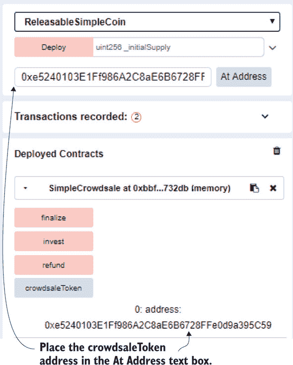

现在点击“At Address”，一个新的面板将出现在屏幕下方，显示`ReleasableSimpleCoin`的功能，这些功能大部分继承自`SimpleCoin`，如图 6.6 所示。你必须点击`ReleasableSimpleCoin`来展开面板。

你现在可以通过以下方式检查每个投资者分配的代币数量：

1.  从下拉菜单“Account”中选择一个与您想要检查的投资者对应的地址，通过点击其旁边的复制图标复制它，并将其粘贴在 coinBalance 按钮旁边的文本框中。（记得用双引号括起来。）

1.  点击 coinBalance，预期的代币数量将出现在其旁边。

为下拉菜单中的所有账户重复此操作。在我的情况下，代币分配如表 6.2 所示。

##### 图 6.6. `ReleasableSimpleCoin`的状态变量和函数

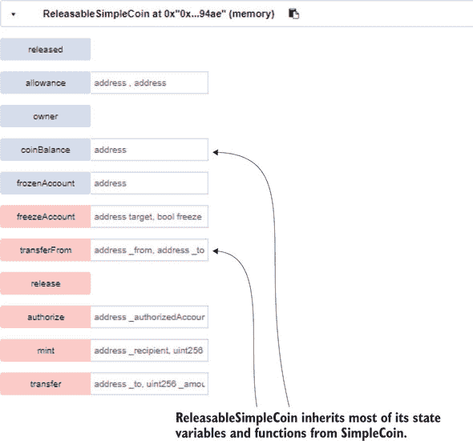

##### 表 6.2. 分配给每个投资者的代币数量

| 投资者账户 | 代币数量 |
| --- | --- |
| 0xca35b7d915458ef540ade6068dfe2f44e8fa733c | 10,100,000 |
| 0x14723a09acff6d2a60dcdf7aa4aff308fddc160c | 150,000 |
| 0x4b0897b0513fdc7c541b6d9d7e929c4e5364d2db | 653,500 |
| 0x583031d1113ad414f02576bd6afabfb302140225 | 284,000 |
| 0xdd870fa1b7c4700f2bd7f44238821c26f7392148 | 56,000 |

##### 检查代币是否仍然被锁定

正如我解释过的，在众筹销售期间分配给投资者的代币在成功最终化前是无法使用的。这意味着投资者无法将代币转移到另一个账户。让我们尝试从一个账户向另一个账户转移一些代币，以检查是否如此。

从“Account”下拉菜单中选择一个账户，复制其地址，并将其粘贴到转移文本框中（像往常一样用双引号括起来）。这将是代币转移的目标账户。然后从“Account”下拉菜单中选择一个不同的账户。这将是代币转移的来源。

点击“Transfer”。现在再次检查源账户和目标账户关联的代币数量，就像之前那样。你会注意到它们没有改变。因为`released`的值仍然为`false`（众筹销售尚未最终化），所以转移不会进行（但不会抛出错误），正如你在`transfer()`的代码摘录中看到的那样：

```
function transfer(address _to, uint256 _amount) public {
    ...

    if (released) {                             *1*
        coinBalance[msg.sender] -= _amount;  
        coinBalance[_to] += _amount;   
        emit Transfer(msg.sender, _to, _amount);  
    }
}
```

+   ***1*** **释放值仍然为 false，所以代币转移没有执行。**

##### 成功最终化众筹销售

如果你想测试一个成功的众筹，请确保投资金额超过了投资目标（在我例子中，相当于 15,000 个以太币，等于 15,000,000,000,000,000,000,000 Wei）。记住，在`investmentReceived`按钮旁边显示的金额是以太币。你可以通过进行几次大额以太币投资快速达到这个数额。一旦收到的投资超过了融资目标，选择`SimpleCrowdsale`合约所有者账户（你用来实例化`SimpleCrowdsale`的账户）并点击 Finalize。

通过点击 isFinalized 验证众筹是否已经完成。显示的值应该是`true`。通过点击 Released 验证`ReleasableSimpleCoin`是否已经发布。再次显示的值应该是`true`。

现在你可以尝试进行代币转账，就像之前那样。不过这次，转账将会成功，因为`released`的值现在是`true`，转账逻辑可以被执行。你可以验证与源账户和目标账户关联的代币数量已经相应地发生了变化。在我的案例中，我将三个币从以 0x1472 开头的账户移动到以 0x4b089 开头的账户。你可以在表 6.3 中看到他们的修正后的余额。

##### 表 6.3. `ReleasableSimpleCoin`代币转账后的修正余额

| 投资者账户 | 代币数量 |
| --- | --- |
| 0xca35b7d915458ef540ade6068dfe2f44e8fa733c | 10,100,000 |
| 0x14723a09acff6d2a60dcdf7aa4aff308fddc160c | 149,997 |
| 0x4b0897b0513fdc7c541b6d9d7e929c4e5364d2db | 653,503 |
| 0x583031d1113ad414f02576bd6afabfb302140225 | 284,000 |
| 0xdd870fa1b7c4700f2bd7f44238821c26f7392148 | 56,000 |

##### 最终化一个不成功的众筹

如果你愿意，你也可以测试众筹不成功的场景。我建议你从零开始，重新经历之前采取的所有步骤，直到通过各种投资者账户的`invest()`函数向众筹合约贡献以太币。这次，不过，不要达到融资目标。

现在，当你通过点击相关按钮调用`finalize()`时，`fundingObjectiveMet`是`false`。因此，`isRefundingAllowed`被启用，正如你在`finalize()`代码的这段摘录中看到的那样：

```
if (isCrowdsaleComplete)
{     
    if (investmentObjectiveMet)
        crowdsaleToken.release();
    else 
        isRefundingAllowed = true;

    isFinalized = true;
}    
```

你可以通过点击 isRefundingAllowed 来再次确认这是否是实际情况。启用此功能后，你将能够成功调用`refund()`函数，正如你接下来会看到的。但在这样做之前，作为一个练习，我邀请你测试代币是否尚未发布，以及是否无法从一个账户转移到另一个账户，正如你之前所看到的。

##### 获取退款

在不成功的最终化之后，投资者被允许获得退款。从账户下拉菜单中选择一个地址，检查与它关联的以太币金额（显示在地址旁边），然后点击退款。你会看到账户地址旁边的以太币价值会增加，因为它已经从众筹合约退回到投资者。

在接下来的几节中，你将利用 Solidity 面向对象的特性，如单继承（你已经用在`ReleasableSimpleCoin`合同中）、多继承和抽象类，来改进众筹合同的功能。

### 6.2. 使用继承扩展功能

当前的众筹实现假设投资者购买的代币价格在整个众筹期间是固定的，从开始到结束。提供基于分层的定价是一种激励和奖励早期投资者的方法。

#### 6.2.1. 使用继承实现新的代币定价合同

一个*分层*是一定量的总投资额。如图 6.7 所示，每个分层适用不同的代币价格，这样早期投资者可以以较低的初始价格吸引。随着销售的进行，从一层过渡到下一层时，代币价格会上升，在达到最低筹资目标后最终变得恒定。

##### 图 6.7. 基于分层的代币定价。最低筹资目标之内的总投资分为几个分层，每个分层有不同的代币价格。随着收到的总投资从一层过渡到下一层，代币价格会上升。

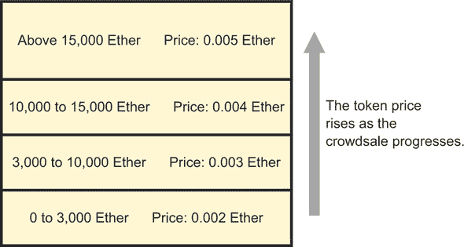

在图 6.7 所示的示例中，最低筹资目标已设定为 15,000 个以太币，组织者决定创建四个分层，如表 6.4 所定义。

##### 表 6.4. 基于代币的定价：筹资过程中不同点的不同价格示例

| 收到以太币总额（以以太币为单位） | 代币价格（以以太币为单位） |
| --- | --- |
| 超过 15,000 个以太币 | 0.005 |
| 从 10,000 到 15,000 个以太币 | 0.004 |
| 从 3,000 到 10,000 个以太币 | 0.003 |
| 从 0 到 3,000 个以太币 | 0.002 |

##### 基于分层的代币定价逻辑

现在既然你理解了分层定价的原则，让我们看看你如何在 Solidity 中实现它。如果你回顾列表 6.5，你会注意到唯一直接访问代币价格的函数是

```
function calculateNumberOfTokens(uint256 _investment) 
    internal returns (uint256) {
    return _investment / weiTokenPrice;         *1*
}
```

+   ***1*** **weiTokenPrice 是固定的，因为它在众筹期间没有修改。**

你还会注意到，`weiTokenPrice`的值从未在众筹合同内部修改，所以你可以认为它在整个众筹期间是固定的。

这里有一个小挑战：你将如何修改`calculate-NumberOfTokens()`的实现，使得定价根据表 6.4 中定义的分层变得基于分层？在尝试解决方案之前，这里有一些提示你可以考虑：

+   你可以使用`struct`类型配置分层，例如

    ```
    struct Tranche {
        uint256 weiHighLimit;      *1*
        uint256 weiTokenPrice;     *2*
    }
    ```

    +   ***1*** **分层的更高筹资限制**

    +   ***2*** **与分层相关的代币价格**

+   你可以在一个用以下映射定义的状态变量中存储整个分层结构

    ```
    mapping(uint256 => Tranche) public trancheStructure;
    ```

    并在合同构造函数中如下初始化状态变量

    ```
    trancheStructure[0] = Tranche(3000 ether, 0.002 ether);
    trancheStructure[1] = Tranche(10000 ether, 0.003 ether);
    trancheStructure[2] = Tranche(15000 ether, 0.004 ether);
    trancheStructure[3] = Tranche(1000000000 ether, 0.005 ether);
    ```

    以以太币定义分层限制和代币价格。

+   你可以维持当前激活的分层在一个状态变量中

    ```
    uint256 currentTrancheLevel;
    ```

    你会在构造函数中按照以下方式初始化这个状态变量：

    ```
    currentTrancheLevel = 0;
    ```

+   你可以在`calculate-NumberOfTokens()`内部更新`currentTrancheLevel`和`weiTokenPrice`。

我强烈鼓励你尝试一下基于分层的定价！完成了吗？你可以比较一下修改后的`calculateNumberOfTokens()`与你下面列出的代码。

##### 列表 6.6\. 基于分层定价的`calculateNumberOfTokens()`

```
function calculateNumberOfTokens(uint256 investment) 
    internal returns (uint256) {
    updateCurrentTrancheAndPrice();          *1*
    return investment / weiTokenPrice; 
}

function updateCurrentTrancheAndPrice()      *2*
    internal {
    uint256 i = currentTrancheLevel;

    while(trancheStructure[i].weiHighLimit 
       < investmentReceived)                 *3*
        ++i;

    currentTrancheLevel = i;

    weiTokenPrice = 
      trancheStructure[currentTrancheLevel]
         .weiTokenPrice;                     *4*
}
```

+   ***1*** **对 calculateNumberOfTokens()的唯一更改**

+   ***2*** **更新当前分层，进而更新当前代币价格**

+   ***3*** **测试分层以确定投资 Received 落在哪里***

+   ***4*** **用当前基于分层的定价众售合约中的值更新 weiTokenPrice**

正如你在列表 6.6 中所看到的，只需一个额外的函数就可以根据分层计算代币价格。其余的代码保持不变。你可能想知道你应该把修改后的`calculateNumberOfTokens()`和新的`updateCurrentTrancheAndPrice()`函数放在哪里。简单答案是放在一个名为`TranchePricingCrowdsale`的新众售合约中，因为你可能还想在其他众售中使用平坦的代币定价。下一个问题是我是否应该复制`Simple-Crowdsale`的代码，粘贴到`TranchePricingCrowdsale`中，并应用列表 6.6 中的修改？答案是不应该！正如我解释你基于 SimpleCoin 创建`ReleasableSimpleCoin`时，你会*继承*`TranchePricingCrowdsale`从`SimpleCrowdsale`，如下面的列表所示。

##### 列表 6.7\. 从`SimpleCrowdsale`派生的`TranchePricingCrowdsale`

```
pragma solidity ⁰.4.24;

import "./Listing6_5_SimpleCrowdsale.sol";

contract TranchePricingCrowdsale 
   is SimpleCrowdsale  {                                *1*

   struct Tranche {
     uint256 weiHighLimit;
     uint256 weiTokenPrice;
   }

   mapping(uint256 => Tranche) 
      public trancheStructure;                          *2*
   uint256 public currentTrancheLevel;                  *3*

   constructor(uint256 _startTime, uint256 _endTime, 
      uint256 _etherInvestmentObjective) 
      SimpleCrowdsale(_startTime, _endTime,
      1, _etherInvestmentObjective)                     *4*
   payable public
   {
      trancheStructure[0] = Tranche(3000 ether, 
         0.002 ether);                                  *5*
      trancheStructure[1] = Tranche(10000 ether, 
         0.003 ether);                                  *5*
      trancheStructure[2] = Tranche(15000 ether, 
         0.004 ether);                                  *5*
      trancheStructure[3] = Tranche(1000000000 ether, 
         0.005 ether);                                  *5*

      currentTrancheLevel = 0;                          *5*
   } 

   function calculateNumberOfTokens(
      uint256 investment)                               *6*
      internal returns (uint256) {
      updateCurrentTrancheAndPrice();
      return investment / weiTokenPrice; 
   }

   function updateCurrentTrancheAndPrice()              *7*
      internal {
      uint256 i = currentTrancheLevel;

      while(trancheStructure[i].weiHighLimit < investmentReceived) 
        ++i;

      currentTrancheLevel = i;

      weiTokenPrice = trancheStructure[currentTrancheLevel].weiTokenPrice;
   }
}
```

+   ***1*** **TranchePricingCrowdsale 从 SimpleCrowdsale 继承而来。**

+   ***2*** **分层结构配置**

+   ***3*** **根据迄今为止收到的投资，当前分层级别***

+   ***4*** **调用基构造函数以完成合约初始化**

+   ***5*** **初始化分层结构。（为了简单起见，我硬编码了此值，但它可以通过构造函数参数传递。）**

+   ***6*** **覆盖 SimpleCrowdsale 中原始的 calculateNumberOfTokens()实现***

+   ***7*** **新函数，根据当前分层更新代币价格**

通过从 SimpleCrowdsale 继承`TranchePricingCrowdsale`，我向你展示了单继承的另一个例子。我会简要概述 Solidity 中的继承特性，你可以在`TranchePricingCrowdsale`中欣赏到这些特性。这几乎是你在`ReleasableSimpleCoin`中已经看到内容的重复，希望它能帮助你巩固这些概念：

+   `TranchePricingCrowdsale`是*继承自* `SimpleCrowdsale`的，使用`is`关键字：

    ```
    contract TranchePricingCrowdsale is SimpleCrowdsale
    ```

+   你向继承的合约中添加了*附加状态变量* `trancheStructure`和`currentTranche-Level`，以处理分层特定功能。

+   `TranchePricingCrowdsale`的构造函数设置了与分层相关的状态，但也向*基础*的`SimpleCrowdsale`构造函数传递了所需的参数：

    ```
    TranchePricingCrowdsale(uint256 _startTime, uint256 _endTime, 
            uint256 _weiTokenPrice, uint256 _etherInvestmentObjective) 
            SimpleCrowdsale(_startTime, _endTime,
               _weiTokenPrice, _etherInvestmentObjective)
        payable public
        {
            trancheStructure[0] = Tranche(3000 ether, 0.002 ether);
            ...
    ```

+   您已经在`TranchePricingCrowdsale`中通过提供一个新的实现**覆盖**了`calculateNumberOfTokens()`。与其它语言不同，在 Solidity 中覆盖一个函数不需要特殊的关键词。

您可以在图 6.8 的合约图中看到`TranchePricingCrowdsale`和`SimpleCrowdsale`之间的继承关系。

##### 图 6.8\. 合约层次结构图，展示了最新的`TranchePricing-Crowdsale`合约，该合约从`SimpleCrowdsale`派生而来

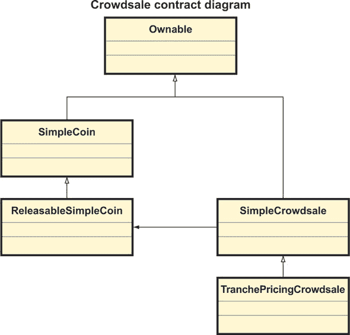

我邀请您从列表 6.7 中复制`TranchePricingCrowdsale`的代码到 Remix 的新代码标签中，并实例化这个合约。然后您可以检查当分层阈值被击中时代币价格是如何上升的。

您可能注意到了，我多次使用了单继承这个表达。我之所以这样做，是因为 Solidity 也支持*多继承*。我们将在下一节中探讨这一点。

#### 6.2.2\. 使用多重继承组合功能

Solidity 是一个年轻的语言，仍处于其发展的早期阶段。它的语法在不断改进，因此最佳实践建议也经常发生变化。即使是经验最丰富的 Solidity 开发者，他们可能拥有的经验使他们勉强能算作更成熟语言中的初级开发者，也必须不断学习最新的技术和建议，特别是在安全性方面。

现实情况下，一旦合约被部署到公共生产以太坊网络中，它不太可能被定期修改。但是可能会发现一个安全漏洞，要么是因为开发者没有意识到关于更安全的语法的新建议，要么是因为社区的某个人、节点客户端或语言层面发现了这个漏洞。

考虑到事情出错的可能性是真实的，由此导致的以太币被丢失或盗窃的风险是不可忽视的，因此在合约中加入各种形式的紧急按钮已经成为一种普遍做法。这些按钮从暂停或停止函数，它冻结合约的状态和功能，直到合约所有者决定再次开启它，到完整的自毁函数，它将合约中存储的以太币转移到一个安全账户，然后使合约永久不可用。

##### 使代币合约可暂停

别说了！下面的列表展示了如何向`ReleasableSimpleCoin`添加可暂停的功能，假设您不想也为`SimpleCoin`添加这个功能。

##### 列表 6.8\. 向`ReleasableSimpleCoin`添加可暂停功能

```
pragma solidity ⁰.4.24;
import "./Listing5_8_SimpleCoin.sol";
contract ReleasableSimpleCoin is SimpleCoin { 
    ...                                             *1*

    bool public paused = false;                     *2*

    modifier whenNotPaused() {
        require(!paused);
        _;
    }

    modifier whenPaused() {
        require(paused);
        _;
    }

    function pause() onlyOwner 
        whenNotPaused public {                      *3*
        paused = true;
    }

    function unpause() 
        onlyOwner whenPaused public {               *3*
        paused = false;
    }

    ...                                             *4*

    function transfer(address _to, uint256 _amount) 
        isReleased whenNotPaused public {           *5*
        super.transfer(_to, _amount); 
    }

    function transferFrom(address _from, address _to, uint256 _amount) 
        isReleased whenNotPaused 
        public returns (bool) {                     *5*
        super.transferFrom(_from, _to, _amount); 
    }  
}
```

+   ***1*** **与之前相同的代码**

+   ***2*** **持有暂停状态的标志**

+   ***3*** **持有暂停状态的修改器**

+   ***4*** **与之前相同的代码**

+   ***5*** **确保在代币合约未暂停时才能进行转账**

##### 提取暂停功能

在使`ReleasableSimpleCoin`可暂停之后，你可能想对`SimpleCrowdsale`做同样的处理。你可能会想将你编写到的暂停功能代码复制到`SimpleCrowdsale`中。使`ReleasableSimpleCoin`和`SimpleCrowdsale`都具备暂停功能—而不引入代码复制—的一个更聪明的方法是将`ReleasableSimpleCoin`中的暂停功能提取到一个单独的合约（例如称为`Pausable`）中，然后使`ReleasableSimpleCoin`和`SimpleCrowdsale`都从`Pausable`继承。

你可以在下面的列表中看到从`ReleasableSimpleCoin`提取的新`Pausable`合约。

##### 列表 6.9\。从`ReleasableSimpleCoin`提取的可暂停合约

```
pragma solidity ⁰.4.24;
import "./Listing6_4_Ownable.sol";
contract Pausable is Ownable { 
    bool public paused = false;            *1*

    modifier whenNotPaused() {             *2*
        require(!paused);
        _;
    }

    modifier whenPaused() {                *2*
        require(paused);
        _;
    }

    function pause() onlyOwner 
        whenNotPaused public {             *3*
        paused = true;
    }

    function unpause() onlyOwner 
        whenPaused public {                *3*
        paused = false;
    }
}
```

+   ***1*** **状态变量持有暂停状态**

+   ***2*** **修改器，根据暂停状态允许函数运行**

+   ***3*** **更改暂停状态的函数**

##### 使用多重继承组合基础合约

现在你可以通过使`ReleasableSimpleCoin`从`Pausable`继承来重新应用暂停功能，顺便说一下，我已经使它从`Ownable`继承，这样它就可以使用`onlyOwner`修改器。但是，等等，正如你所记得的，你已经使`ReleasableSimpleCoin`从`SimpleCoin`继承。这有问题吗？答案是不是。Solidity 支持*多重继承*，所以你可以使一个合约从几个合约继承，如下所示：

```
contract ReleasableSimpleCoin 
    is SimpleCoin, Pausable {       *1*
   ...
}
```

+   ***1*** **`ReleasableSimpleCoin`从`SimpleCoin`和`Pausable`继承。**

多重继承可以使你的代码具有组合性，因为你可以通过从多个更简单的合约继承来创建更复杂的合约。另一方面，你应该尝试使你的合约只有最小的交叉依赖，以避免循环引用问题。

| 在 |  |
| --- | --- |

##### 注意

循环引用发生在合约 C 从合约 P 继承，而合约 P 又间接从合约 C 继承的情况下。

| 在 |  |
| --- | --- |

你可以在图 6.9 中看到`ReleasableSimpleCoin`中存在的多重继承关系。

##### 图 6.9\。`ReleasableSimpleCoin`从`SimpleCoin`和`Pausable`继承，`Pausable`又从`Ownable`继承。

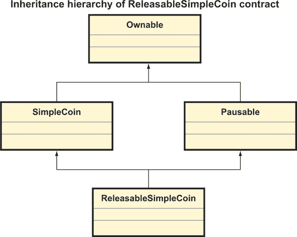

##### 使众售合约可暂停

将暂停功能提取到一个独立的合约后，很容易将其应用于其他合约。例如：

```
contract SimpleCrowdsale is Pausable {
...
}
```

通过使`SimpleCrowdsale`从`Pausable`继承，你也使`TranchePricingCrowdsale`具备了暂停功能。你可以在图 6.10 中看到众售合约结构的修正。

##### 图 6.10\。包括`Pausable`合约的众售合约结构修正

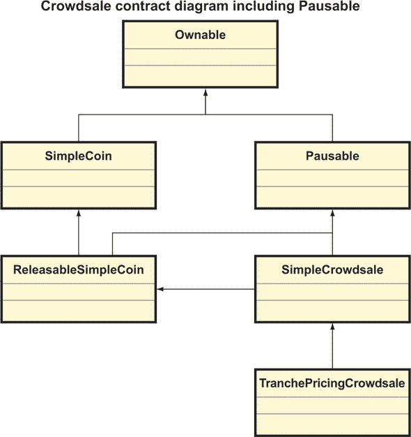

##### 使合约可销毁

如果你不喜欢`Pausable`功能，并且你希望在紧急情况下立即将合约中存储的以太币转到一个安全地址，并销毁合约，从而使恶意攻击者无法再操纵它，你可以将这个功能封装在一个`Destructible`合约中，如下所示。

##### 列表 6.10\。 一个`Destructible`合约

```
pragma solidity ⁰.4.24;
import "./Listing6_4_Ownable.sol";
contract Destructible is Ownable {

   constructor() payable public { } 

   function destroyAndSend(address _recipient) onlyOwner public {
      selfdestruct(_recipient);                                      *1*
   }
}
```

+   ***1*** **在将以太币转到一个指定的安全账户后销毁合约，这个操作是通过隐式声明的 selfdestruct()函数完成的（如 5.3.3 节所述）**

你现在也可以通过从`Destructible`继承来使`ReleasableSimpleCoin`和`SimpleCrowdsale`可销毁，如图 6.11 和以下代码片段所示：

```
contract ReleasableSimpleCoin is SimpleCoin, 
   Pausable, Destructible {                   *1*

   ...
}

contract SimpleCrowdsale is Pausable, 
 Destructible {                             *1*
   ...
}
```

+   ***1*** **可释放的简单币和简单的众售继承自可销毁的合约**

##### 图 6.11\。`ReleasableSimpleCoin`和`SimpleCrowdsale`现在也是`Destructible`。

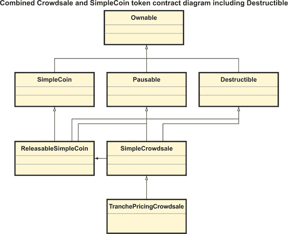

到目前为止，你已经学会了如何利用单继承和多继承来实现具有 increasing 功能性的合约，同时避免代码重复。在下一章中，你将了解抽象类和接口如何帮助你进一步实现合约代码库的可维护性。

### 总结

+   现实世界中以太坊 Dapp 的合约部分通常是由许多相互交互的合约组成的。

+   众售管理应用程序是多合约 Dapp 的一个示例。

+   你可以通过使用继承来扩展合约功能，同时避免代码重复。

+   多继承允许你将几个更简单的合约组合成一个复杂的合约。

## 第七章\。 使用抽象合约和接口泛化功能

|  |
| --- |

**本章内容**

+   通过使合约抽象来泛化合约

+   通过接口提高合约的可扩展性

+   Solidity 面向对象特性的总结

+   使用库提高实用代码的可维护性

|  |
| --- |

上一章介绍了`SimpleCrowdsale`，它是一个多合约去中心化应用的示例，其中包括一个众售管理合约（`SimpleCrowdsale`）与一个代币合约（`ReleasableSimpleCoin`）的互动。

你开始通过添加一个新的、更复杂的定价策略来扩展`SimpleCrowdsale`的功能，并利用合约继承来实现。你进一步通过实现可暂停性和可销毁性作为单独的合约，并通过多继承将它们组合到`SimpleCrowdsale`中。

在这一章中，你将继续通过使用其他面向对象的特性来扩展`SimpleCrowdsale`的功能，例如抽象合约和接口。我会向你展示如何使用抽象合约来泛化一个合约，同时避免代码重复。我还会演示接口如何增加合约设计的灵活性，使你可以选择插入合约功能的特定方面的一个或多个可能的实现。

就像大多数语言一样，在 Solidity 中，你可以通过将你经常使用的函数组织到共享库中来实现代码复用。我会给你介绍一下 Solidity 库的样子，并解释如何调用它们的函数。

你将以对 SimpleCoin 进行进一步改进来结束这一章，这里使用了一些你在这一章和上一章中学到的面向对象的技术。具体来说，我会向你展示如何重构 SimpleCoin，使其能够符合以太坊 ERC20 代币标准。

### 7.1\. 使一个合约抽象

目前，你的众售合约可以处理不同的定价策略。你从`SimpleCrowdsale`派生了`TranchedSimpleCrowdsale`，以提供在父合约中不可用的特定（分层）代币定价。

#### 7.1.1\. 使用继承实现资金限制

让我们假设一个客户对你的众售合约感兴趣，但他们想要一个新功能：设置众售筹资的最高总金额上限，超过该金额则不再接受进一步的投资。实现这个功能的一个快速方式是创建一个名为`CappedCrowdsale`的新合约，从`SimpleCrowdsale`派生，如下面的列表所示。

##### 列表 7.1\. `CappedCrowdsale`的第一个实现

```
pragma solidity ⁰.4.24;
import "./Listing6_5_SimpleCrowdsale.0.5.sol";

contract CappedCrowdsale is SimpleCrowdsale {
   uint256 fundingCap;                                  *1*

   constructor(uint256 _startTime, uint256 _endTime, 
      uint256 _weiTokenPrice, uint256 _etherInvestmentObjective, 
      uint256 _fundingCap)
      SimpleCrowdsale(_startTime, _endTime, 
      _weiTokenPrice, _etherInvestmentObjective)        *2*
      payable public 
   {
      require(_fundingCap > 0);
      fundingCap = _fundingCap;
   }

   function isValidInvestment(uint256 _investment)      *3*
      internal view returns (bool) {
      bool nonZeroInvestment = _investment != 0;        *4*
      bool withinCrowdsalePeriod = 
         now >= startTime && now <= endTime;            *5*

      bool isInvestmentBelowCap = investmentReceived + 
         _investment < fundingCap;                      *5*

      return nonZeroInvestment && withinCrowdsalePeriod 
         && isInvestmentBelowCap;
   }
}
```

+   ***1*** **用于配置资金上限的状态变量**

+   ***2*** **通过基构造函数配置其余的状态变量**

+   ***3*** **重写 isValidInvestment()**

+   ***4*** **从 SimpleCrowdsale.isValidInvestment()复制验证**

+   ***5*** **检查是否已经超过了筹集上限**

##### 当前实现的问题

这个实现可能一开始看起来简单且令人满意，但仔细观察就会发现它有几个问题：

+   `isValidInvestment()`的实现已经从`SimpleCrowdsale.isValidInvestment()`部分复制过来，造成了一些代码重复。

+   当前的`CappedCrowdsale`实现继承了`SimpleCrowdsale`中的默认代币定价代码，所以你不能直接用它来进行带有分层代币定价的限定众售（因为`TranchePricingCrowdsale`是`SimpleCrowdsale`的子类）。

##### 使用模板方法消除重复

让我们逐一解决这些问题。首先，你可以通过重新实现`SimpleCrowdsale.isValid-Investment()`来避免`isValidInvestment()`内的部分代码重复：

```
contract SimpleCrowdsale is Ownable {
    ...
    function isValidInvestment(uint256 _investment) 
        internal view returns (bool) {
        bool nonZeroInvestment = _investment != 0;        *1*
        bool withinCrowdsalePeriod = now >= startTime 
           && now <= endTime;

        return nonZeroInvestment && withinCrowdsalePeriod 
           && isFullInvestmentWithinLimit(
           _investment);                                  *2*
    }

    function isFullInvestmentWithinLimit(uint256 _investment)
        internal view returns (bool) {
        return true;                                      *3*
    }
    ...    
}
```

+   ***1*** **对投资有效性的先前检查**

+   ***2*** **针对目前已收到全额投资的通用检查**

+   **3** **默认实现根本不执行任何检查；在继承类中覆盖的实现将会执行，正如你稍后所看到的。**

跟随此更改后，`CappedCrowdsale`不再需要覆盖`isValid-Investment()`，只需覆盖`isFullInvestmentWithinLimit()`，如下面的列表所示。

##### 列表 7.2. 重构的`CappedCrowdsale`

```
pragma solidity ⁰.4.18;
import "./Listing7_A_SimpleCrowdsale_forCapped.sol";         *1*

contract CappedCrowdsale is SimpleCrowdsale {
     uint256 fundingCap;

     function CappedCrowdsale(uint256 _startTime, uint256 _endTime, 
     uint256 _weiTokenPrice, uint256 _etherInvestmentObjective, 
     uint256 _fundingCap) SimpleCrowdsale(_startTime, _endTime,
     _weiTokenPrice, _etherInvestmentObjective)
     payable public 
    {
        require(_fundingCap > 0);
        fundingCap = _fundingCap;
    }

    function isFullInvestmentWithinLimit(uint256 _investment) 
        internal view returns (bool) {
        bool check = investmentReceived + _investment
 < fundingCap;                                     *2*
        return check;
    }
}
```

+   **1** **引用一个修改后的 SimpleCrowdsale 实现，实现 isFull-InvestmentWithinLimit**

+   **2** **这是之前在覆盖的 isValidInvestment()函数中执行的检查。**

`isValidInvestment()`函数现在已经成为一个*模板方法*：这是一个高层次的函数，它定义了高层次的步骤，其逻辑被委托给低层次的函数，比如`isFullInvestmentWithinLimit()`，你在每个派生合同中用具体的实现来覆盖。

|  |
| --- |

##### 注意

模板方法是一种出现在所谓**四人帮**书籍《设计模式：可复用面向对象软件的元素》中的经典设计模式，由 Addison-Wesley 出版。

|  |
| --- |

##### 当前资金限制策略实施的局限性

如我之前所暗示的，当前检查上限功能的实用性目前无法组合。如果你想在基于梯度的代币定价的众售中限制资金，你必须实现`CappedTranchePricingCrowdsale`合同，如下面的列表所示。

##### 列表 7.3. 带资金上限和基于梯度的定价

```
pragma solidity ⁰.4.24;
import "./Listing7_B_TranchePricingCrowdsale_forCapped.sol";

contract CappedTranchePricingCrowdsale is TranchePricingCrowdsale {
   uint256 fundingCap;                                                *1*

   constructor(uint256 _startTime, uint256 _endTime, 
      uint256 _etherInvestmentObjective, 
      uint256 _fundingCap)
      TranchePricingCrowdsale(_startTime, _endTime, 
      _etherInvestmentObjective)
      payable public 
   {
      require(_fundingCap > 0);
      fundingCap = _fundingCap;
   }

   function isFullInvestmentWithinLimit(uint256 _investment) 
      internal view returns (bool) {
      bool check = investmentReceived + _investment 
         < fundingCap;                                                *2*
      return check;
   }
}
```

+   **1** **与 CappedCrowdsale 中引入的相同状态变量**

+   **2** **为 CappedCrowdsale 编写的相同实现**

正如你所看到的，我完全复制了`CappedCrowdsale`的代码。从维护的角度来看，这远非理想的解决方案。

除了重复之外，当前众售合同层次结构还显示了另一个微妙的 issues：正如您在图 7.1 中看到的，层次结构是不对称的，并不是所有的合同名称都明确指出它们使用了哪种代币定价策略或资金限制策略。例如，`CappedCrowdsale`的名称没有提到任何代币定价策略，但它继承自`SimpleCrowdsale`，后者实现固定的代币定价。这个合同的更精确的名称可能会是`CappedFixedPricingCrowdsale`。同样地，`TranchePricingCrowdsale`的名称也没有提到任何资金策略，但它也继承自`SimpleCrowdsale`，后者实现无限资金策略。这个合同的更精确的名称可能会是`UncappedTranchePricingCrowdsale`。

#### 7.1.2. 使用抽象合同 generalized funding limit strategy

现在我将向你展示一个更好的实现`CappedCrowdsale`和`CappedTranchePricingCrowdsale`的方法，基于抽象类的概念。我还会向你展示如何使用抽象类使你看到的图 7.1 中的众筹合同层次结构对称且更明确。这首先涉及将资金限制策略功能完全封装在一个独立的合同中，我现在暂时将其勾勒为

##### 图 7.1\。显示众筹合同层次结构不对称和某些合同中关于代币定价策略或资金限制策略名称的模糊性的 UML 合同图。为了清晰起见，我省略了可拥有、可暂停和可销毁的基础合同。

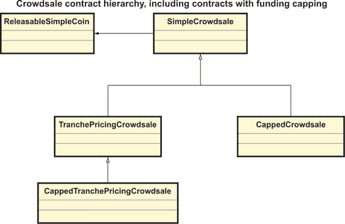

```
contract FundingLimitStrategy{
    function isFullInvestmentWithinLimit(uint256 _investment, 
        uint256 _fullInvestmentReceived)     
        public view returns (bool);         *1*
}
```

+   ***1*** **这个函数执行资金上限的检查，尽管在这个阶段它还没有实现。**

你可以想象这是一个所有可能的资金限制策略的基础合同。以下是有两种可能的资金限制策略：

+   *CappedFundingStrategy*—以`fundingCap`限制的资金筹集上限的众筹，正如之前在`CappedTranchePricingCrowdsale`合同中看到的。

+   *UnlimitedFundingStrategy*—无上限（或未限制）资金的众筹

你可以从`FundingLimitStrategy`派生出有上限的众筹的实现，如下所示：

```
contract CappedFundingStrategy is FundingLimitStrategy {
    uint256 fundingCap;                                   *1*

    constructor(uint256 _fundingCap) public {
        require(_fundingCap > 0);

        fundingCap = _fundingCap;
    }

    function isFullInvestmentWithinLimit(
        uint256 _investment, 
        uint256 _fullInvestmentReceived)                  *2*
        public view returns (bool) {

        bool check = _fullInvestmentReceived + _investment < fundingCap; 
        return check;
    }
}
```

+   ***1*** **资金上限限制**

+   ***2*** **这是你在 CappedTranchePricingCrowdsale 中看到相同的实现。**

无限资金策略的实现如下：

```
contract UnlimitedFundingStrategy is FundingLimitStrategy {
    function isFullInvestmentWithinLimit(
        uint256 _investment, 
        uint256 _fullInvestmentReceived) 
        public view returns (bool) {
        return true;                     *1*
    }
}
```

+   ***1*** **因为没有资金限制，所以不进行任何检查。**

显然，你可以从`FundingLimitStrategy`派生出其他的资金限制策略。例如，你可以实现一个具有动态资金限制的策略，根据众筹期间可能发生变化的多个因素进行调整。

`FundingLimitStrategy`被认为是*抽象合同*，因为你已经声明了其`isFullInvestmentWithinLimit()`函数，但尚未实现。另一方面，`CappedFundingStrategy`和`UnlimitedFundingStrategy`被认为是*具体合同*，因为它们的所有函数都已实现。

|  |
| --- |

##### 定义

如果一个合同至少包含一个声明但未实现的函数，则认为该合同是*抽象*的。抽象合同用作其他合同的基础类，但不能被实例化。所有函数都已实现的合同被认为是*具体*合同。

|  |
| --- |

在图 7.2 中的 UML 合同图显示了资金限制策略合同的继承层次结构。

|  |
| --- |

##### 注意

你可能会注意到图 7.2 中的*FundingLimitStrategy*名称是斜体的。这是 UML 规范中书写抽象类名称的方式。

|  |
| --- |

##### 图 7.2\。资金限制策略合同层次结构，包括一个抽象基础合同和两个具体子合同

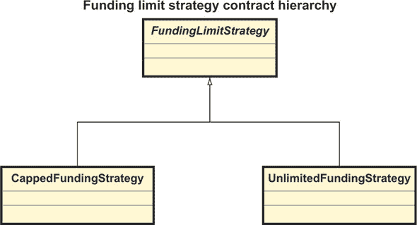

#### 7.1.3\。使用抽象类改进代币定价策略

你可以将用于使资金上限基本策略合约抽象的方法应用于整理众售合约层次结构，并使每个合约使用的代币定价策略更加明确，如图 7.3 所示。

##### 图 7.3. 使众售合约层次结构对称且更加明确。通过将固定代币定价的实现推送到一个新的`FixedPricingCrowdsale`合约中，`SimpleCrowdsale`已经变得抽象。

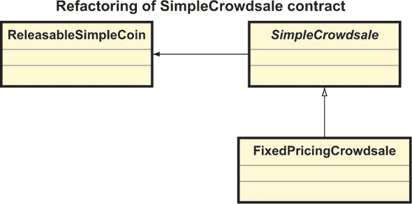

这是在`SimpleCrowdsale`中发生的主要变化：

```
contract SimpleCrowdsale {
    function calculateNumberOfTokens(uint256 investment) 
       internal returns (uint256) ;                      *1*
}
```

+   ***1*** **这个函数已经变得抽象，使得 SimpleCrowdsale 也变得抽象。**

之前在`SimpleCrowdsale`中的固定代币定价策略已经推送到新的`FixedPricingCrowdsale`合约中：

```
contract FixedPricingCrowdsale is SimpleCrowdsale {     

    constructor(uint256 _startTime, uint256 _endTime, 
        uint256 _weiTokenPrice, uint256 _etherInvestmentObjective, 
        uint256 _fundingCap)
        SimpleCrowdsale(_startTime, _endTime, 
        _weiTokenPrice, _etherInvestmentObjective)
        payable public {
    }

    function calculateNumberOfTokens(uint256 investment) 
        internal returns (uint256) {
        return investment / weiTokenPrice;          *1*
    }    
}
```

+   ***1*** **这个公式原本在 SimpleCrowdsale 中，现在移到了这里。**

同时，`TranchePricingCrowdsale`与之前的实现保持不变。

#### 7.1.4. 用没有重复的众售重新实现上限

在将众售资金上限策略封装在`FundingLimitStrategy`合约层次结构中，并对众售合约层次结构进行了轻微重构之后，你可以尝试重新实现`CappedCrowdsale`和`CappedTranchePricingCrowdsale`，这次避免重复。

首先，你必须向`SimpleCrowdsale`添加资金上限策略作为一个状态变量：`fundingLimitStrategy`。你可以在构造函数中通过一个名为`createFundingLimitStrategy()`的新函数实例化一个特定的资金上限策略，该函数在此处声明为抽象，并且你必须在继承的合约中实现。然后你可以在`isValidInvestment()`函数中使用`fundingLimitStrategy`：

```
contract SimpleCrowdsale is Ownable {
    //...

    FundingLimitStrategy internal
        fundingLimitStrategy;                          *1*

    //...
    constructor(...) public {
        ...
        fundingLimitStrategy =
 createFundingLimitStrategy();               *2*
    }

    //...

    function createFundingLimitStrategy()
        internal returns (FundingLimitStrategy);       *3*

    function isValidInvestment(uint256 _investment) 
        internal view returns (bool) {
        bool nonZeroInvestment = _investment != 0;
        bool withinCrowdsalePeriod = now >= startTime && now <= endTime; 

        return nonZeroInvestment && withinCrowdsalePeriod
           && fundingLimitStrategy.
 isFullInvestmentWithinLimit(
 _investment,
 investmentReceived);                  *4*
    }

    //...
}
```

+   ***1*** **持有资金上限策略的状态变量**

+   ***2*** **通过 createFundingLimitStrategy()实例化一个特定的资金上限策略，这里声明为抽象的。**

+   ***3*** **实例化一个特定的 FundingLimitStrategy。它是抽象的，你必须在继承的合约中实现它。**

+   ***4*** **通过适当的 FundingLimitStrategy 合约执行资金上限检查。**

现在，可以实现四个具体的众售合约，这些合约是通过以不同方式组合代币定价策略和资金上限策略而产生的，如图 7.4 所示的修订后的众售合约层次结构：图 7.4：

##### 图 7.4. 重新组织的众售合约层次结构，顶部有两层抽象合约，底层是具体合约层，封装了所有合约定价和资金上限选项的组合。`FundingLimitStrategy`合约层次结构现在以避免代码重复的方式高效地封装资金上限检查。

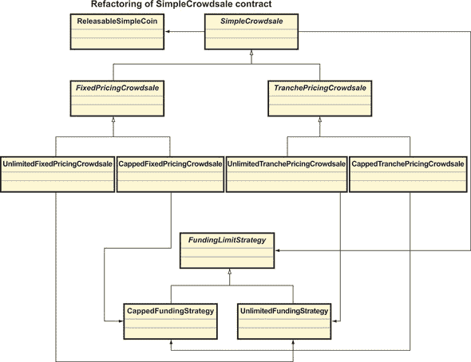

+   `UnlimitedFixedPricingCrowdsale`—从`FixedPricingCrowdsale`派生，带有`UnlimitedFundingStrategy`实例

+   `CappedFixedPricingCrowdsale`—从`FixedPricingCrowdsale`派生，带有`CappedFundingStrategy`实例

+   `UnlimitedTranchePricingCrowdsale`—从`TranchePricingCrowdsale`派生，带有`UnlimitedFundingStrategy`实例

+   `CappedTranchePricingCrowdsale`—从`TranchePricingCrowdsale`派生，带有`CappedFundingStrategy`实例

|  |
| --- |

##### 注意

两个中介的`FixedPricingCrowdsale`和`TranchePricingCrowdsale`合同变得抽象，因为它们没有实现`createFundingLimitStrategy()`。

|  |
| --- |

这四个具体合同的实现，正如您在列表 7.4 中可以欣赏到的，是非常简洁的。这些合同从带有相关代币定价策略（`FixedPricingCrowdsale`或`TranchePricingCrowdsale`）的抽象众筹合同派生，并通过返回特定的资金限制策略来实现`createFundingLimitStrategy()`。然后，所有工作都委托给它们派生的抽象合同。

##### 列表 7.4\. 结合不同定价和资金限制选项的众筹合同

```
pragma solidity ⁰.4.24;
import "./Listing7_C_FundingStrategies.sol";
import "./Listing7_E_PricingStrategies.sol";

contract UnlimitedFixedPricingCrowdsale is FixedPricingCrowdsale {

    constructor(uint256 _startTime, uint256 _endTime, 
    uint256 _weiTokenPrice, uint256 _etherInvestmentObjective)
    FixedPricingCrowdsale(_startTime, _endTime,                *1*
    _weiTokenPrice, _etherInvestmentObjective)
    payable public  {

    }

    function createFundingLimitStrategy() 
        internal returns (FundingLimitStrategy) {

        return new UnlimitedFundingStrategy();                 *2*
    }
}

contract CappedFixedPricingCrowdsale is FixedPricingCrowdsale {

    constructor(uint256 _startTime, uint256 _endTime, 
    uint256 _weiTokenPrice, uint256 _etherInvestmentObjective)
    FixedPricingCrowdsale(_startTime, _endTime,                *1*
    _weiTokenPrice, _etherInvestmentObjective)
    payable public  {
    }

    function createFundingLimitStrategy() 
        internal returns (FundingLimitStrategy) {

        return new CappedFundingStrategy(10000);               *2*
    }
}

contract UnlimitedTranchePricingCrowdsale is TranchePricingCrowdsale {

    constructor(uint256 _startTime, uint256 _endTime, 
    uint256 _etherInvestmentObjective)
    TranchePricingCrowdsale(_startTime, _endTime,              *1*
    _etherInvestmentObjective)
    payable public  {
    }

    function createFundingLimitStrategy() 
        internal returns (FundingLimitStrategy) {

        return new UnlimitedFundingStrategy();                 *2*
    }
}

contract CappedTranchePricingCrowdsale is TranchePricingCrowdsale {

    constructor(uint256 _startTime, uint256 _endTime, 
    uint256 _etherInvestmentObjective)
    TranchePricingCrowdsale(_startTime, _endTime,              *1*
    _etherInvestmentObjective)
    payable public  {
    }

    function createFundingLimitStrategy() 
        internal returns (FundingLimitStrategy) {

        return new CappedFundingStrategy(10000);               *2*
    }
}
```

+   ***1*** **只向父合同提供信息**

+   ***2*** **实现的唯一功能；覆盖 SimpleCrowdsale 中的抽象函数，并提供具体的资金限制策略**

### 7.2\. 使用接口允许多个合同实现

在我们离开`SimpleCrowdsale`之前，我想向你展示一个最后面向对象的特性：接口。如果你熟悉其他面向对象语言，你会立即理解在 Solidity 中接口是如何工作的。如果不是，我将通过一个例子来解释它们，所以你应该还是能够很快掌握这个概念。

#### 7.2.1\. 使用接口设置功能需求

想象一下，要求你定制带有资金限制策略的众筹的客户现在想要另一个改变。他们对你的众筹合同很满意，但他们希望支持其他代币，不一定是你的`ReleasableSimpleCoin`。你觉得这是一个公平的请求，也会为新客户提供灵活性。在分析你当前的代码后，你意识到你的众筹合同与`ReleasableSimpleCoin`只有最小的交互。对它的引用仅限于作为层次结构基础的`SimpleCrowdsale`中，如下所示：

```
contract SimpleCrowdsale is Ownable {
    ... 

    ReleasableSimpleCoin public
        crowdsaleToken;                           *1*
    ...

    function SimpleCrowdsale(uint256 _startTime, uint256 _endTime, 
    uint256 _weiTokenPrice, uint256 _etherInvestmentObjective) 
    payable public
    {
        ...
        crowdsaleToken =
 new ReleasableSimpleCoin(0);           *2*
    } 

...

    function assignTokens(address _beneficiary, 
        uint256 _investment) internal {

        uint256 _numberOfTokens = calculateNumberOfTokens(_investment); 

        crowdsaleToken.mint(_beneficiary,
        _numberOfTokens);                         *3*
    }

    ...

    function finalize() onlyOwner public {
        ...

        if (isCrowdsaleComplete)
        {     
            if (investmentObjectiveMet)
                crowdsaleToken.release();         *4*
            else 
                isRefundingAllowed = true;

            isFinalized = true;
        }               
    }

    ...  
}
```

+   ***1*** **将 crowdsaleToken 定义为一个状态变量**

+   ***2*** **在 SimpleCrowdsale 构造函数中初始化 crowdsaleToken**

+   ***3*** **将投资者购买的代币铸入其账户**

+   ***4*** **发布（解锁）代币合同，使投资者可以转移他们的代币**

从你的角度来看，作为众筹合同开发者，你只关心众筹中使用的代币支持以下两个功能：

```
mint(address _beneficiary, uint256 _numberOfTokens);

release();
```

显然，为了让投资者有用，代币合同还应至少支持以下功能：

```
function transfer(address _to, uint256 _amount);
```

定义代币合同应支持的最小函数集的语法结构称为*接口*。`SimpleCrowdsale`引用的代币接口将如下所示：

```
interface ReleasableToken {
    function mint(address _beneficiary, uint256 _numberOfTokens) external;
    function release() external;
    function transfer(address _to, uint256 _amount) external;
}
```

#### 7.2.2\. 通过接口引用合同

你可以通过继承它来定义一个实现此接口的合同。这是一个例子：

```
contract ReleasableSimpleCoin is ReleasableToken {     *1*
    ...
}
```

+   ***1*** **ReleasableSimpleCoin 已经实现了 ReleasableToken，现状如此。**

你也可以创建其他的实现：

```
contract ReleasableComplexCoin is ReleasableToken {
    ...
}
```

图 7.5Figure 7.5 展示了接口及其实现之间的关系。正如你所看到的，你可以用两种方式表示具体合同如何实现一个接口。

现在你可以修改`SimpleCrowdsale`，使其引用`ReleasableToken`接口而不是一个具体的代币合同。你应在覆盖的内部函数中实例化代币合同，而不是在构造函数中直接实例化，正如你在下面的列表中所看到的。

##### 图 7.5\. 接口及其具体实现之间的关系。你可以用两种方式表示这种关系。第一种类似于继承，接口是其实现 parent。第二种使用显式的接口符号，这在不想显示所有接口实现时很有用。

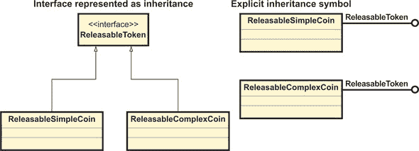

##### 列表 7.5\. `SimpleCrowdsale`引用`ReleasableToken`

```
contract SimpleCrowdsale is Ownable {
    ...
    ReleasableToken  public crowdsaleToken;          *1*
    ...

    constructor(uint256 _startTime, uint256 _endTime, 
        uint256 _weiTokenPrice, uint256 _etherInvestmentObjective) 
        payable public {
        ...    
        crowdsaleToken = createToken();              *2*
        ...
    } 

    ...

    function createToken() 
        internal returns (ReleasableToken) {
            return new ReleasableSimpleCoin(0);      *3*
        }

    ...   
}
```

+   ***1*** **现在众售合同可以是任何实现 ReleasableToken 的代币。**

+   ***2*** **在可以覆盖的函数中实例化代币合同**

+   ***3*** **SimpleCrowdsale 抽象合同提供的默认实现仍然实例化了 ReleasableSimpleCoin。**

|  |
| --- |

##### 注意

你本可以在`SimpleCrowdsale`中声明`createToken()`为一个抽象函数。这将是最纯粹的方法，但它将迫使你在所有具体合同（如`UnlimitedFixedPricingCrowdsale`）中实现`createToken()`。在每个具体合同中单独实现`createToken()`将与列表 7.5 中的相同。这种重复可能看起来是不必要的，尽管如此，因为大多数情况下你可能想引用`ReleasableSimpleCoin`。在这方面没有正确或错误的设计，你选择的方法取决于你如何平衡需求和技术权衡。

|  |
| --- |

到目前为止，似乎没有发生变化。当你实现一个需要自定义代币的众售合同时，你开始享受到引用接口而不是具体合同的好处。想象一下，你的客户想要使用一个不同的代币合同，比如

```
contract ReleasableComplexCoin is ReleasableToken {
...    
}
```

你可以通过覆盖`createToken()`函数轻松实现一个支持此代币的新众售合同：

```
contract UnlimitedFixedPricingCrowdsaleWithComplexCoin 
    is UnlimitedFixedPricingCrowdsale {

    constructor(uint256 _startTime, 
    uint256 _endTime, 
    uint256 _weiTokenPrice, uint256 _etherInvestmentObjective)
    UnlimitedFixedPricingCrowdsale(_startTime, _endTime, 
    _weiTokenPrice, _etherInvestmentObjective)
    payable public  {
    }

    function createToken()
 internal returns (ReleasableToken) {
 return new ReleasableComplexCoin();        *1*
        }
}
```

+   ***1*** **为了支持不同的代币合同，你需要覆盖这个函数。**

你可以在图 7.6 中看到`UnlimitedFixedPricingCrowdsaleWithComplexCoin`的合同图。

##### -   图 7.6。`UnlimitedFixedPricingCrowdsaleWithComplexCoin`合同的合约图。您可以欣赏到抽象的`SimpleCrowdsale`合同与`ReleasableToken`代币接口之间以及具体的`UnlimitedFixedPricing-CrowdsaleWithComplexCoin`众售合同与具体的`ReleasableComplexCoin`代币合同之间的关系。

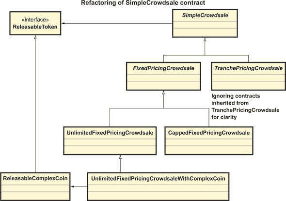

正如你所看到的，接口是一个增加你合约中一个元素或方面灵活性的有用构造（例如，众售中使用的特定代币）。通过引用一个接口而不是一个具体的合约（在我们的例子中是`ReleasableToken`而不是`ReleasableSimpleCoin`），你的主合约（`Simple-Crowdsale`）可以与接口的任何实现（例如`ReleasableSimpleCoin`或`ReleasableComplexCoin`）无缝工作。因此，你可以自由地更改主合约中的一个元素的行为（在我们回顾的例子中，是众售代币的行为）而不需要更改合约本身。这种能够无缝地在接口的不同实现之间切换的能力称为*多态性*，它是面向对象编程的主要原则之一。

我敢肯定你在想是否可以通过将`ReleasableToken`变成一个抽象合约而不是一个接口来达到同样的效果。你说得对；这样做同样有效，但这样做会在你的代码库中引入一个你目前还不需要的合约。你在这个阶段需要的只是`SimpleCrowdsale`与代币交互所需的最小功能定义。这正是接口的目的。

在离开接口之前，让我快速总结一下它们是如何工作的：

+   接口定义了一组必须实现的功能；您必须用`external`可见性声明它们：

    ```
    interface ReleasableToken {
        function mint(address _beneficiary, uint256 _numberOfTokens) external;

        function release() external;
        function transfer(address _to, uint256 _amount) external;
    }
    ```

+   合同通过继承来实现接口：

    ```
    contract ReleasableSimpleCoin is ReleasableToken {
        ...
    }
    ```

+   -   合同必须实现它所继承的所有接口中的功能。

恭喜你！你现在已经完成了一个众售合约体系的完整实现。这允许你设置具有不同代币合约、代币定价策略或资金限制策略的众售。你努力工作的成果在附录 B 中展示。我鼓励你休息一下，浏览一下代码，慢慢地消化它。你会明白在过去的两章中你构建的拼图的所有部分是如何组合在一起的。我相信通过查看整个代码，你所学的所有概念将进一步巩固在你的脑海中。

### 7.3。现实世界的众售合约

尽管`SimpleCrowdsale`是一个良好的起点，但现实世界的众售合约可以变得 much more 复杂，因为它们提供了更多功能，例如以下功能：

+   一个预筹资阶段，早期投资者在这个阶段提供初始资金，这些资金在公开众筹开始时转换为代币，可能以特殊价格转换。

+   更复杂的代币定价策略

+   基于购买的代币数量的资金限制

+   包括将额外代币分发给开发团队、组织者或法律和咨询团队的最终化策略。

+   具有各种特性的代币

|  |
| --- |

##### 警告

在这两章关于 Solidity 的介绍中，我没有涉及到在将合约部署到公共以太坊网络之前你必须了解的安全方面。我将在第十四章中介绍它们。

|  |
| --- |

`SimpleCrowdsale`的主要目的是通过一个现实的使用案例教你 Solidity 中的继承、抽象类和接口，以及给你讲解众售工作的一些技术细节。如果你对学习如何构建一个去中心化的众售管理应用程序感兴趣，或者你想了解一个真实世界的 Dapp 可以有多复杂，我强烈鼓励你研究 TokenMarketNet ICO^([1]) GitHub 仓库的代码，这是最好的开源以太坊众售实现之一，地址为[`github.com/TokenMarketNet/ico`](https://github.com/TokenMarketNet/ico)。

> ¹
> 
> 版权所有 © 2017 TokenMarket Ltd., 直布罗陀，[`tokenmarket.net`](https://tokenmarket.net)。根据 Apache 许可证，V2.0 授权。

我鼓励你快速浏览这个仓库中的合约，并将它们与你之前看到的相应的`SimpleCrowdsale`合约进行比较。你会发现一个真实世界的 Dapp 在规模（合约数量）和实现上可以变得多么复杂。

#### 一个小挑战

作为一个练习，我现在留给你一个任务，尝试自己实现不同的最终化策略，你可以将它们封装在另一个基于抽象合约的合约层次结构中，比如`FinalizationStrategy`。然后你可以在构造时创建一组新的具体合约，在其中注入这样的策略，就像你在注入资金策略时所做的。

### 7.4. 回顾 Solidity 的对象导向特性

如果你在这个章节所做的艰苦工作后还活着，我现在要给你放个假。我会总结和概括你通过`Simple-Crowdsale`学到的所有内容。以防你忘记一些细节，你不必翻阅前面的代码列表和片段来找到与对象导向特性（如继承、抽象类和接口）相关的语法。放松一下。

#### 7.4.1. 继承

Solidity 支持多重继承，因此一个派生合约可以从一个或多个合约中继承状态变量和函数，如下所示：

```
contract Parent1 {

    int256 public stateVar1;
    bool public stateVar2;

    function initialize() public {}
    function Parent1(int256 param1, bool param2) public {}

    function operation1(int256 opParam1) public returns (int256) {}

}

contract ParentA {

    int256 public stateVarA;
    int16 public stateVarB;

    function initialize() public {}
    function ParentA(int256 paramA, int16 paramB) public {}

    function operationA(bool opParamA) public {}
}

contract Child is Parent1, ParentA {        *1*

}
```

+   ***1*** **子合约继承了父合约 Parent1 和 ParentA 的状态变量 stateVar1、stateVar2、stateVarA 和 stateVarB，以及函数 operation1()和 operationA()**

##### 调用基构造函数

派生合约的构造函数必须调用所有父构造函数（按您希望的顺序）：

```
function Child(int256 p1, bool p2, int256 pA, int16 pB) 
    Parent1(p1, p2) ParentA(pA, pB) {
}
```

##### 覆盖函数

派生合约可以通过重新实现来覆盖从其父合约继承的任何函数：

```
contract Child is Parent1, ParentA { 
    ...
    function operationA(bool opParamA) public {     *1*
    ...
    }
}
```

+   ***1*** **替换 ParentA.operationA()的新实现。**

当在合约上调用一个函数时，将执行继承层次结构底部的最覆盖实现。

##### 调用基函数

被覆盖的函数可以如下调用位于基合约中的函数：

```
contract Child is Parent1, ParentA {
    ...
    function operationA(bool opParamA) public {
        ParentA.operationA(opParamA);             *1*
    }
}
```

+   ***1*** **调用 ParentA.operationA()**

在某些情况下，您可能希望确保一个函数的所有基实现都被调用。在这种情况下，您可以使用`super`关键字隐式地调用它们：

```
contract Child is Parent1, ParentA { 
    ... 

    function initialize() public {
        ...
        super.initialize();        *1*

    }

    ...
}
```

+   ***1*** **首先调用 Parent1.initialize()，然后调用 ParentA.initialize()**

#### 7.4.2\. 抽象合约

如果合约中至少有一个函数是抽象的（即已声明但未实现），则该合约被视为*抽象*而非具体，正如本合约中的`operationA()`：

```
contract AbstractContract {
    int256 public stateVar;

    constructor(int256 param1)  public {
        stateVar = param1;
    }

    function operation1(int256 opParam1, bool opParam2)
        returns (int256) {
        if (opParam2) return opParam1;
    }

    function operationA(int256 opParamA);       *1*
}
```

+   ***1*** **这是一个抽象函数，使得 AbstractContract 成为抽象的。**

与其他静态类型语言一样，Solidity 中的抽象合约不能被实例化；它们只能作为其他抽象或具体合约的基合约使用。

#### 7.4.3\. 接口

Solidity 中的接口与 Java 和 C#中提供的接口类似。接口定义了必须在派生合约中实现的函数和事件集合，但它不提供任何实现。接口上声明的所有函数都是抽象的，如下所示：

```
interface SampleInterface {
    function operation1(int256 param1, bool param2) external;

    function operationA(int16 paramA) external;
}
```

一个从接口派生的合约必须实现其所有函数，如下所示：

```
contract SampleContract is SampleInterface {
    function operation1(int256 param1, bool param2) {
                                                      *1*
    }

    function operationA(int16 paramA) {
                                                      *2*
    }
}
```

+   ***1*** **实现操作 1**

+   ***2*** **构造函数定义**

|  |
| --- |

##### 注意

您不能在接口上定义任何变量、结构或枚举。此外，您不能从其他接口派生接口。

|  |
| --- |

虽然通过构建良好的类层次结构可以避免代码重复，其中底层的合约复用位于其基类中的函数实现，但通常共享的通用逻辑并不特定于合约层次结构的领域，并且具有更通用的目的。例如，以通用方式操作低级数据结构（如数组、字节数组或字符串）的函数可能在任何合约中都很有用。从函数库中复制和粘贴所需函数的简单方法是将这些功能导入合约中。但有一个更聪明的方法。介绍库。

#### 7.4.4\. 注意事项

我在这一章介绍了 Solidity 的所有面向对象的特性，并且向你展示了如何使用高级面向对象原则设计真实世界的 Dapps，比如 TokenMarketNet。但请记住，Solidity 是用来实现智能合约的，而不是富一般用途应用，所以在大多数情况下，你可能根本不需要复杂的面向对象设计。当谈到设计智能合约时，人们形成了不同的学派：一些人习惯于利用 Solidity 丰富的面向对象特性，而大多数以太坊开发者优先考虑简单和安全性，并愿意牺牲长期可维护性以获得短期可预测性。我相信后者的方法是明智的，尤其是当你还在学习这项新技术的时候。

### 7.5\. 库

一个 Solidity 库是一个类似于 Java 类包或.NET 类库的共享函数库。库的代码看起来像 C#或 C++静态类，并包含一系列无状态函数。它还可以包括结构和枚举定义。你可以在列表 7.6 中了解到库的样子，该列表展示了 SafeMath，一系列执行数学操作的函数，包括对错误输入或溢出的安全检查。这个库是 OpenZeppelin 的一部分，^([2])一个用 Solidity 构建安全智能合约的开源框架，旨在标准化大多数 Solidity 开发者需要的常见功能。

> ²
> 
> 版权所有 © 2016 Smart Contract Solutions, Inc., [`mng.bz/oNPv`](http://mng.bz/oNPv)，在 The MIT License (MIT) 下。

##### 列表 7.6\. 执行检查数学操作的 SafeMath 库

```
library SafeMath {                                    *1*
    //Taken from: https://github.com/OpenZeppelin/
    function mul(uint256 a, uint256 b)
        public pure returns (uint256) {               *2*
        if (a == 0) return 0;
        uint256 c = a * b;
        assert(c / a == b);                           *3*
        return c;
    }

    function div(uint256 a, uint256 b) 
        public pure returns (uint256) {               *2*
        uint256 c = a / b;
        return c;
    }

    function sub(uint256 a, uint256 b) 
        public pure returns (uint256) {               *4*
        assert(b <= a);                               *5*
        return a - b;
    }

    function add(uint256 a, uint256 b) 
        public pure returns (uint256) {               *4*
        uint256 c = a + b;
        assert(c >= a);                               *5*
        return c;
    }
}
```

+   ***1*** **使用库关键字而不是合约关键字**

+   ***2*** **库中的函数与合约中的函数定义完全相同**

+   ***3*** **对输入或算术操作结果的检查**

+   ***4*** **库中的函数与合约中的函数定义完全相同**

+   ***5*** **对输入或算术操作结果的检查**

与合约相比，库有以下限制：

+   它不能有状态变量。

+   它不支持继承。

+   它不能接收以太币。（在调用时，你不能用 `payable` 关键字装饰一个函数并发送以太币给它。）

#### 7.5.1\. 库函数调用

一个合约可以直接通过名称引用同一`.sol`代码文件中的库的本地副本，如列表 7.7 所示。正如你所看到的，你通过在函数前加上库名来调用库函数，就像在其他国家调用静态函数一样。你还需要在库结构体和枚举前加上库名。

##### 列表 7.7\. 如何调用库函数

```
pragma solidity ⁰.4.24;
import './Listing7_6_SafeMath.sol';

contract Calculator {
    function calculateTheta(uint256 a, uint256 b) public returns (uint256) {
        uint256 delta = SafeMath.sub(a, b);                               *1*
        uint256 beta = SafeMath.add(delta, 
           1000000);                                                      *1*
        uint256 theta = SafeMath.mul(beta, b);                            *1*

        uint256 result = SafeMath.div(theta, a);                          *1*

        return result;
    }
}
```

+   ***1*** **SafeMath 库函数都以前缀 SafeMath 开头**

#### 7.5.2\. 已部署的库

真正的代码复用发生在只在网络上部署了一个库实例的情况下，所有访问它的合约都通过其部署地址来引用它（从概念上讲，这与合约地址相同）。一旦部署，库的函数就通过隐式的*外部*可见性暴露给所有引用它的合约。从合约中调用已部署的库的通常方式是定义一个匹配已部署库签名的本地抽象合约。然后，你通过这个本地抽象合约与库通信，它充当了一个对库的强类型代理，如图所示。另一种直接通过`call()`调用库函数，但这样做，你就不能保证类型安全。

##### 清单 7.8. 如何从合约中调用库函数

```
pragma solidity ⁰.4.24;
contract SafeMathProxy {                                  *1*
    function mul(uint256 a, uint256 b) 
        public pure returns (uint256);                    *2*
    function div(uint256 a, uint256 b)  
        public pure returns (uint256);                    *2*
    function sub(uint256 a, uint256 b) 
        public pure returns (uint256);                    *2*
    function add(uint256 a, uint256 b) 
        public pure returns (uint256);                    *2*
}

contract Calculator {

    SafeMathProxy safeMath;   

    constructor(address _libraryAddress) public           *3*

    {
        require(_libraryAddress != 0x0);
        safeMath = SafeMathProxy(_libraryAddress);        *4*
    }

    function calculateTheta(uint256 a, uint256 b) 
        public returns (uint256) {

        uint256 delta = safeMath.sub(a, b);               *5*
        uint256 beta = safeMath.add(delta, 
           1000000);                                      *5*
        uint256 theta = safeMath.mul(beta, b);            *5*

        uint256 result = safeMath.div(theta, a);          *5*

        return result;
    }
}
```

+   ***1*** **这个本地抽象合约模仿了库提供的功能。**

+   ***2*** **这些是 SafeMath 库中存在的相同函数声明。**

+   ***3*** **SafeMath 库地址（从 Remix 复制，如图 7.8 所示）**

+   ***4*** **通过一个对所有合约都可用，接受合约地址作为参数的隐式构造函数，引用在指定地址部署的 SafeMath 库**

+   ***5*** **对已部署的 SafeMath 库的调用**

在尝试此代码之前，将清单 7.6 的代码放入一个 Remix 代码选项卡中并实例化 SafeMath 库（像对待合约一样点击部署）。通过点击合约实例面板旁边的复制图标来复制地址，如图 7.7 所示。（#ch07fig07）。

##### 图 7.7. 从 Remix 中通过点击复制图标获取 SafeMath 库地址。


现在将清单 7.7 的代码输入一个新的 Remix 代码选项卡。然后将你之前复制的 SafeMath 库地址粘贴到计算器构造函数文本框旁边的部署按钮旁边，如图 7.8 所示。（记住用双引号括起来。）点击部署，`Calculator`合约即被实例化。现在，您可以通过输入几个值到其输入参数文本框中来调用`calculate-Theta()`——例如，200, 33——然后单击 calculateTheta。

##### 图 7.8. 将 SafeMath 库地址复制到计算器构造函数文本框中。

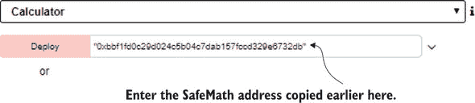

当你点击 calculateTheta 后，通过`safeMath`代理实例执行了各种远程`SafeMath`函数的调用：`sub()`、`add()`、`mul()`和`div()`按顺序执行，并计算`result`。屏幕底部的输出面板显示`calculateTheta()`函数成功完成。然后，你可以通过点击调试按钮旁边的箭头并检查解码输出字段来查看结果，如图 7.9 所示。（#ch07fig09）。

##### 图 7.9. 在`calculateTheta()`调用完成后，你可以点击详情并在解码输出字段中检查结果。

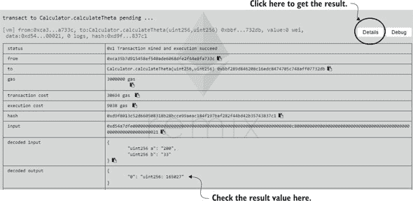

#### 7.5.3. 库函数执行

当调用库函数时，其代码将在调用合约的上下文中执行。例如，如果函数库代码引用 `msg`，这不是合约发送给库的消息，而是合约从其调用者接收的消息。另外，在库函数调用期间，只有调用合约，而不是库本身，直接访问存储。这意味着库函数通过传递给函数的存储数据位置操纵任何引用类型变量的值。如先前所述，库从不永久持有任何对象。

|  |
| --- |

##### 注意

库函数之所以在调用合约的上下文中执行，是因为它是通过 `DELEGATECALL` 操作码而不是 `CALL` 操作码调用的。

|  |
| --- |

在前一章中，我通过将所有权功能提取到 `Ownable` 合约中，对 `SimpleCoin` 做了一个小改进。在本章中，我将介绍一个与代币标准化相关的新增强。

### 7.6. 使 SimpleCoin 符合 ERC20 标准

创建自定义加密货币或代币合约已成为大多数去中心化应用的常见需求，因此提出了一个标准代币接口。这样的接口将允许任何合约（如你的 `Simple-Crowdsale` 合约）以可预测的方式与代币合约交互。标准的以太坊代币合约称为 `ERC20`。以下列表显示了每个 `ERC20` 兼容代币都应提供的基本代币功能，以抽象合约的形式表达。

##### 列表 7.9. `ERC20` 抽象合约，定义了以太坊标准的代币

```
pragma solidity ⁰.4.24;
contract ERC20 {
    uint256 public totalSupply;
    function balanceOf(address _owner) 
       public view returns (uint256 balance);
    function transfer(address _to, uint256 _value) 
       public returns (bool success);
    function transferFrom(address _from, address _to, uint256 _value) 
       public returns (bool success);
    function approve(address _spender, uint256 _value) 
       public returns (bool success);
    function allowance(address _owner, address _spender) 
       public view returns (uint256 remaining);

    event Transfer(address indexed _from, 
       address indexed _to, uint256 _value);
    event Approval(address indexed _owner, 
       address indexed _spender, uint256 _value); 
}
```

如果你将此与你在附录 A 中展示的你的 `SimpleCoin` 最新实现进行比较，其中包括我在第五章 中引入的关于合约所有权的修改，你会注意到你的代币几乎符合 `ERC20` 标准。表 7.1 总结了 `SimpleCoin` 与 `ERC20` 规范之间的主要区别。

##### 表 7.1. `ERC20` 规范与 `SimpleCoin` 之间的差异

| ERC20 规范 | SimpleCoin 等效 |
| --- | --- |
| totalSupply | 不可用 |
| balanceOf() | coinBalance() |
| approve() | authorize() |
| allowance() | 不可用（直接使用 allowance 状态变量） |
| 批准 | 不可用 |

你可以使用 表 7.1 来重构 `SimpleCoin` 成为一个完全符合 ERC20 标准的代币。以下列表显示了这样的实现会是什么样子，同时也考虑了函数和事件的标准参数名称。

##### 列表 7.10. `SimpleCoin` 重构为 ERC20 代币

```
pragma solidity ⁰.4.24;

import "./Listing6_4_Ownable.sol";
import "./Listing7_9_ERC20.sol";

contract SimpleCoin is Ownable, ERC20 {

   mapping (address => uint256) 
      internal coinBalance;                                                *1*
   mapping (address => mapping 
      (address => uint256)) internal allowances;                           *1*
   mapping (address => bool) public frozenAccount;

   event Transfer(address indexed from, address indexed to, uint256 value);
   event Approval(address indexed authorizer, address indexed authorized, 
      uint256 value);                                                      *2*
   event FrozenAccount(address target, bool frozen);

   constructor(uint256 _initialSupply) public {
      owner = msg.sender;

      mint(owner, _initialSupply);
   }

   function balanceOf(address _account)                                    *3*
      public view returns (uint256 balance) {
      return coinBalance[_account];
   }

   function transfer(address _to, uint256 _amount) public returns (bool) {
      require(_to != 0x0); 
      require(coinBalance[msg.sender] > _amount);
      require(coinBalance[_to] + _amount >= coinBalance[_to]);
      coinBalance[msg.sender] -= _amount;  
      coinBalance[_to] += _amount;   
      emit Transfer(msg.sender, _to, _amount); 
      return true;
   }

   function approve(address _authorizedAccount, uint256 _allowance) 
      public returns (bool success) {
      allowances[msg.sender][_authorizedAccount] = _allowance; 
      emit Approval(msg.sender, 
         _authorizedAccount, _allowance);                                  *4*
      return true;
   }

   function transferFrom(address _from, address _to, uint256 _amount) 
      public returns (bool success) {
      require(_to != 0x0);  
      require(coinBalance[_from] > _amount); 
      require(coinBalance[_to] + _amount >= coinBalance[_to]); 
      require(_amount <= allowances[_from][msg.sender]);  
      coinBalance[_from] -= _amount; 
      coinBalance[_to] += _amount; 
      allowances[_from][msg.sender] -= _amount;
      emit Transfer(_from, _to, _amount);
      return true;
   }

   function allowance(address _authorizer, 
      address _authorizedAccount)                                          *5*
      public view returns (uint256) {
      return allowances[_authorizer][_authorizedAccount];
   }

   function mint(address _recipient, uint256  _mintedAmount) 
      onlyOwner public { 

      coinBalance[_recipient] += _mintedAmount; 
      emit Transfer(owner, _recipient, _mintedAmount); 
   }

   function freezeAccount(address target, bool freeze) 
      onlyOwner public { 

      frozenAccount[target] = freeze;  
      emit FrozenAccount(target, freeze);
   }
}
```

+   ***1*** **这些状态变量已成为内部状态。它们现在通过专用函数从外部暴露。**

+   ***2*** **与批准额度相关的新事件**

+   ***3*** **允许你从外部检查 coinBalance**

+   **4** **当余额被批准时触发一个事件**

+   **5** **允许您外部检查允许额度**

尽管代币构造函数不是接口的一部分，因此不包括在标准中，但 ERC20 建议用以下有用信息初始化代币：

```
string public constant name = "Token Name";
string public constant symbol = "SYM";
uint8 public constant decimals = 18;         *1*
```

+   **1** **考虑分数代币金额的小数位数**

`ERC20`维基百科（[`mng.bz/5NaD`](http://mng.bz/5NaD)）也展示了推荐的实现。虽然这类似于`SimpleCoin`，但我仍然鼓励你仔细阅读。我还建议你查看 OpenZeppelin 关于代币的部分，网址为[`mng.bz/6jQ6`](http://mng.bz/6jQ6)。

### 概要

+   摘要：抽象合同概括了合同功能，并通过在适当的时候提供默认函数实现来帮助最小化代码重复。

+   接口提供了合同应该提供的最小函数声明集。

+   你可以通过使用接口来建模一个合同的元素或方面，从而无缝地改变其行为。通过这样做，你可以在不更改使用它的合同代码的情况下实例化接口的不同实现。

+   你可以将通用 Solidity 函数组织在库中，这些库可以在不同的合同或应用程序之间共享。

+   创建自定义加密货币或代币合同是大多数去中心化应用程序的常见要求，因此提出了一个标准代币接口，称为`ERC20`。任何去中心化应用程序都可以按照可预测的方式使用遵循`ERC20`标准的代币合同。

## 第八章\. 使用 Web3.js 管理智能合约

|  |
| --- |

**本章内容**

+   通过 geth 的控制台部署合同并与之交互

+   使用 Node.js 简化基于控制台的部署

+   在私有网络上部署

+   在模拟网络上部署

|  |
| --- |

在第四章中，你首次尝试在以太坊网络上部署智能合约。你是通过以太坊钱包以及 Remix（与 MetaMask 一起）这么做的。这看起来相对简单，因为它只涉及到在设计精良的屏幕上点击几下。另一方面，用户界面的便利性和简洁性隐藏了在合约部署过程中发生在网络上的关键步骤。例如，你是否问过自己，你输入代码编辑器（钱包或 Remix）的代码是如何被编译、打包并发送到以太坊网络的，最后又是如何安装在每个节点上的？

在过去的第三章中，你深入学习了如何使用 Solidity 开发智能合约。是时候深入了解一下部署过程了。深入了解智能合约的部署过程对于真正理解去中心化应用程序的工作原理至关重要，如果你想要能够解决可能遇到的部署后问题，这也是宝贵 knowledge。

在这一章，你将学习如何通过 geth 控制台使用显式的 Web3.js 指令部署和与智能合约进行通信。通过这样做，你将执行所有钱包 UI 在部署合约或将在账户之间转移代币时为你神奇地执行的命令和操作。你不仅将在公共测试网络上以困难的方式部署合约，而且你还将更进一步，甚至设置一个完整的私有网络并在其上重新部署合约。这一切将比在钱包 UI 上点击几个按钮要付出更多的努力，但你会通过获得更深入的知识来奖励自己，了解以太坊网络和相关区块链是如何设置和配置的，以及第一手的部署过程和客户端到网络交互的洞察。在这个过程中，我还会向你展示如何通过在 Node.js 上运行操作来简化部署过程。

最后，在你在公共测试网络和私有测试网络上都部署了合约之后，你还将学习如何在一个宿主机上部署合约到 Ganache，这是一个特殊的客户端，能够模拟（或模仿）完整的以太坊网络。这是一个在不需要为真实网络上的操作延迟（如等待交易被挖矿并添加到新区块）支付费用的情况下，开发和系统测试你的合约的方便环境，尤其是在网络不稳定的时期。

在离开这一章之前，我们将重新审视`SimpleCoin`。这次，我将利用你已经学会如何在网络上部署它并通过 geth 控制台的 Web3.js 命令与它通信的事实。我将能够向你展示如何构建一个简单的 UI，它使用相同的 Web3 命令，但从一个 HTML 页面内部发出。

### 8.1. 再次通过 geth 的交互式控制台部署

当你在第三章安装 geth 时，你是指向 MAINNET 的，即生产以太坊网络。在开发过程中，我强烈建议你将你的工具（包括你的以太坊客户端）指向测试网络，以避免通过意外交易或燃料消耗直接或间接地花费任何真正的以太币。在任何给定时间都有可用的各种测试网络，当前的几个例子是 Ropsten 和 Rinkeby。每个测试网络都与以太坊平台的稍微不同版本相关联，你可能会发现你需要升级 geth 才能在特定网络上运行。为了本章的目的，我将把测试网络称为 TESTNET。

要把 geth 指向 TESTNET，你必须关闭任何正在针对 MAINNET 运行的实例（如果你有的话），并在新的命令提示符中使用`--testnet`选项重新启动 geth：

```
C:\Program Files\geth>geth --testnet
```

geth 将以与你在 MAINNET 上启动它完全相同的方式开始同步测试网络。

|  |
| --- |

##### 注意

如果你想要实验并基于权益证明共识算法指向 Rinkeby 测试网络，使用 `--rinkeby` 选项而不是 `–-testnet`，通过输入 `C:\Program Files\geth>geth –-rinkeby`。本章其余部分假设你正在使用 `––testnet`。

|  |
| --- |
|  |

**使用 bootnodes 连接到特定对等节点**

偶尔你的 geth 客户端可能需要很长时间才能发现可以发送你区块链区块的对等节点。在这种情况下，尝试使用 `--bootnodes` 选项，这将强制 geth 通过连接到特定节点来访问网络，而不是自己发现所有节点。我发现这些节点大部分时间都是在线的：

```
geth --testnet –-bootnodes "enode://145a93c5b1151911f1a232e04dd1a76708
 dd12694f952b8a180ced40e8c4d25a908a292bed3521b98bdd843147116a52ddb645
 d34fa51ae7668c39b4d1070845@188.166.147.175:30303,enode://2609b7ee28b
 51f2f493374fee6a2ab12deaf886c5daec948f122bc83716aca27840253d191b9e63
 a6e7ec77643e69ae0d74182d6bb64fd30421d45aba82c13bd@13.84.180.240:3030
 3,enode://94c15d1b9e2fe7ce56e458b9a3b672ef11894ddedd0c6f247e0f1d3487
 f52b66208fb4aeb8179fce6e3a749ea93ed147c37976d67af557508d199d9594c35f
 09@188.166.147.175:30303" --verbosity=4
```

如果你想要更快地同步你的区块链，你还可以添加这些选项：

```
--syncmode "fast" --cache=1024
```

|  |
| --- |

从另一个命令提示符，你现在可以启动一个指向测试网络的交互式控制台，就像你曾经指向主网络一样：

```
C:\Program Files\geth>geth attach ipc:\\.\pipe\geth.ipc
```

（注意，自从 geth 1.8.0 以来，你必须指定 IPC 路径。）当控制台启动时，它会显示它所指向的网络的环境信息。正如你在 图 8.1 中看到的，`datadir` 指向了 `testnet`，这确认你现在在 TESTNET。

##### 图 8.1. geth 交互式控制台显示它已连接到 TESTNET

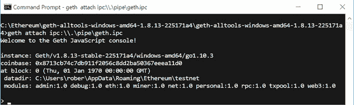

首次通过 geth 控制台部署合同比使用以太坊钱包点击几下要复杂一些。钱包隐藏了一些后台发生的步骤。通过明确执行这些步骤，你会详细了解合同构建和部署过程。另外，一旦你编写了整个过程的脚本，未来的重新部署将变得更快且错误更少。

#### 8.1.1. 合同构建和部署过程

图 8.2 展示了通过交互式控制台构建和部署合同所需的所有主要步骤：

1.  使用 Solidity 编译器编译合同。

1.  将合同的*二进制接口*（`abi`）和*字节码*（`bin`）从编译器推送到输出文件。

1.  运行一个 Web3.js 命令，从其二进制接口创建合同的*合同工厂*。

1.  运行一个 Web3.js 命令，通过调用合同工厂的 `new()` 方法并给它提供字节码来实例化合同。

##### 图 8.2. 合同构建和部署过程：1. 使用 Solidity 编译器编译合同；2. 将合同的二进制接口和字节码推送到一个输出文件；3. 创建一个使用 Web3 的 JavaScript。这个过程做三件事：a. 从其二进制接口（ABI）创建合同的合同工厂；b. 通过在合同工厂上调用 `new()` 方法实例化合同；c. 向其提供字节码。

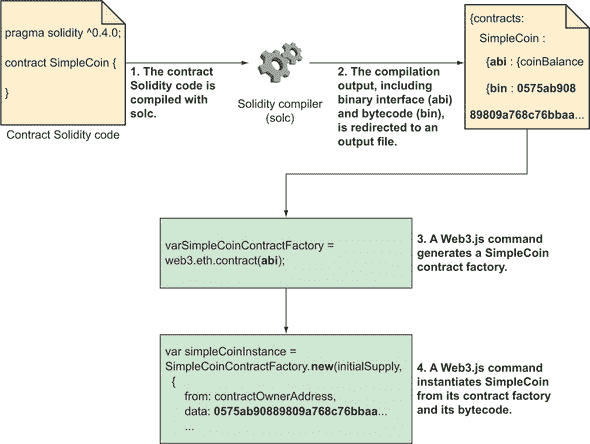

#### 8.1.2. 通过 geth 控制台部署 SimpleCoin

让我们详细回顾图 8.2 中的步骤，通过重新部署`SimpleCoin`到测试网络来逐步讲解。按照构建和部署图表，你首先必须使用 solc 编译合约。

##### 使用 solc 编译合约

你可以从这个 GitHub 页面下载 solc 编译器：[`github.com/ethereum/solidity/releases`](https://github.com/ethereum/solidity/releases)。（我已经从版本 0.4.24 部分下载了 solidity-windows.zip——请下载等效或更新的版本。）下载后，将其可执行文件复制到文件夹中，例如，C:\Ethereum\solidity-windows。（随意根据你的操作系统命名文件夹。）

为你的`SimpleCoin`代码创建一个新的文件夹：C:\Ethereum\SimpleCoin。然后创建一个名为 SimpleCoin.sol 的新文本文件，为了简化，在其中粘贴你写的合约代码的早期版本之一，如下面的列表所示。

##### 列表 8.1. SimpleCoin.sol，包含`SimpleCoin`的早期版本

```
pragma solidity ⁰.4.24;
contract SimpleCoin {
   mapping (address => uint256) public coinBalance;

   event Transfer(address indexed from, address indexed to, uint256 value);

   constructor(uint256 _initialSupply) public {
      coinBalance[msg.sender] = _initialSupply;   
   }

   function transfer(address _to, uint256 _amount) public {
      require(coinBalance[msg.sender] > _amount);
      require(coinBalance[_to] + _amount >= coinBalance[_to] );
      coinBalance[msg.sender] -= _amount;  
      coinBalance[_to] += _amount;   
      emit Transfer(msg.sender, _to, _amount);  
   }  
}
```

将此文件放入你创建的`SimpleCoin`代码文件夹中。然后打开一个命令行界面，移动到`SimpleCoin`代码文件夹。从那里，按照以下方式调用编译器：

```
C:\Ethereum\SimpleCoin>..\solidity-windows\solc.exe 
 --bin -o bin --combined-json abi,bin SimpleCoin.sol 
```

***8.1 节表 8.1**解释了你使用的编译器选项。

##### 表 8.1. 编译`SimpleCoin`时使用的 solc 编译器选项

| 编译器选项 | 用途 |
| --- | --- |
| --bin | 产生合约的二进制十六进制格式 |
| -o bin | 在 bin 文件夹中创建二进制输出 |
| --combined-json abi,bin | 产生包括 ABI 接口和二进制的 JSON 输出 |

这里显示的 JSON 输出将被重定向到 bin\combined.json 文件：

```
{"contracts":{"SimpleCoin.sol:SimpleCoin" :{"abi":"[{\"constant\":false,\
"inputs\":[{\"name\":\"_to\",\ "type\":\"address\"},{\"name\":\"_amount\",\
"type\":\"uint256\"}],\"name\" :\"transfer\",\"outputs\":[],\"payable\
":false,\"type\":\"function\"}, {\"constant\":true,\"inputs\":[{\"name\":\"\"
,\"type\":\"address\"}],\"name\" :\"coinBalance\",\"outputs\":[{\"name\":\"\"
,\"type\":\"uint256\"}],\"payable\" :false,\"type\":\"function\"},{\"inputs\"
:[{\"name\":\"_initialSupply\",\"type\" :\"uint256\"}],\"payable\":false,\ 
"type\":\"constructor\"},{\"anonymous\" :false,\"inputs\":[{\"indexed\":true
,\"name\":\"from\",\"type\":\"address\"}, {\"indexed\":true,\"name\":\"to\",\
"type\":\"address\"},{\"indexed\":false,\ "name\":\"value\",\"type\":\
"uint256\"}],\"name\":\"Transfer\",\"type\": \"event\"}]","bin":" 60806040523
4801561001057600080fd5b50604051602080610399833981018060405281019080805190602
00190929190505050806000803373ffffffffffffffffffffffffffffffffffffffff1673fff
fffffffffffffffffffffffffffffffffffff168152602001908152602001600020819055505
0610313806100866000396000f30060806040526004361061004c576000357c0100000000000
000000000000000000000000000000000000000000000900463ffffffff168063a9059cbb146
10051578063fabde80c1461009e575b600080fd5b34801561005d57600080fd5b5061009c600
480360381019080803573ffffffffff...(shortened for brevity)"}}, "version"
:"0.4.24+commit.6ae8fb59.Windows.msvc" }
```

JSON 输出包括两个成员：

+   `abi`—这是合约应用二进制接口（ABI）。它展示了你的合约暴露的 API 以及与合约交互的客户端应用程序应使用的 API。

+   `bin`—这是以十六进制格式表示的合约字节码。部署合约时你需要合约的 ABI 和字节码。

##### 通过交互式控制台部署合约

打开指向 TESTNET 的 geth 交互式控制台，并输入列表 8.2 中的代码。（请确保你使用的是从书籍网站下载的列表 8.2 文件，因为这里为了简洁我缩短了代码。）你可能会注意到`simpleCoinAbi`已经被分配给了`abi`的`combined.json`内容，`data`已经被分配给了`bin`的前缀为`0x`的内容。

##### 列表 8.2. 使用 geth 交互式 JavaScript 部署合约的指令

```
var initialSupply = 10000;                                *1*

var simpleCoinAbi =                                       *2*

[{"constant":false,"inputs":[{"name":"_to","type":"address"},{"name"
:"_amount","type":"uint256"}],"name":"transfer","outputs":[],"payable":false
,"type":"function"},{"constant":true,"inputs":[{"name":"","type":"address"}]
,"name":"coinBalance","outputs":[{"name":"","type":"uint256"}],"payable"
:false,"type":"function"},{"inputs":[{"name":"_initialSupply","type"
:"uint256"}],"payable":false,"type":"constructor"},{"anonymous":false
,"inputs":[{"indexed":true,"name":"from","type":"address"},{"indexed":true
,"name":"to","type":"address"},{"indexed":false,"name":"value","type"
:"uint256"}],"name":"Transfer","type":"event"}];    //abi interface from
 solc output

var SimpleCoinContractFactory = 
   web3.eth.contract(simpleCoinAbi);                     *3*

var simpleCoinInstance = 
   SimpleCoinContractFactory.new(                        *4*
   initialSupply,
   {
     from: web3.eth.accounts[0], 
     data:                                               *5*
'0x608060405234801561001057600080fd5b506040516020806103998339
8101806040528101908080519060200190929190505050806000803373ffffffffffffffffff
ffffffffffffffffffffff1673ffffffffffffffffffffffffffffffffffffffff1681526020
019081526020016000208190555050610313806100866000396000f300608060405260043610
61004c576000357c010000000000000000000000000000000000000000000000000000000090
0463ffffffff168063a9059cbb14610051578063fabde80c1461009e575b600080fd5b348015
61005d57600080fd5b5061009c600480360381019080803573ffffffff ...(shortened for
brevity)', 
     gas: '3000000'      
   }, function (e, contract){                            *6*
    console.log(e, contract);
    if (typeof contract.address !== 'undefined') {
         console.log('Contract mined! address: ' 
         + contract.address + ' transactionHash: ' 
         + contract.transactionHash);
    }
 });
```

+   ***1*** **SimpleCoin 构造函数输入**

+   ***2*** **合约 ABI，从 SimpleCoin.out 编译输出文件的 abi 成员复制而来**

+   ***3*** **使用合约 ABI 初始化合约工厂**

+   ***4*** **实例化合约**

+   ***6*** **从 SimpleCoin.out 编译输出文件的 bin 成员复制的合约字节码**

+   ***6*** **在部署过程完成时触发回调注册**

执行这些指令后，你会得到以下错误信息：

```
Error: authentication needed: password or unlock undefined
```

为了部署合约，你必须解锁通过`web3.eth.accounts[0]`（在列表 8.2 中的`from`属性指定）部署的账户。这将成为账户所有者。

如果你不记得`accounts[0]`指的是什么，你可以列出在前面的章节中从以太坊钱包创建的 TESTNET 账户。结果列表中的第一个是`accounts[0]`，在钱包中它被命名为主账户。这是我的结果：

```
> web3.eth.accounts
["0xedde06bc0e45645e2f105972bdefc220ed37ae10",
 "0x4e6c301547 68b6bc3da693b1b28c6bd14302b578",
 "0x70e36be8ab 8f6cf66c0c953cf9c63ab63f3fef02",
 "0xc99048e9b9 8d3fcf8b5f0d5644794b562f9a2ea4",
 "0x47e3d3948f 46144afa7df2c1aa67f6b1b1e35cf1",
 "0x70ff99d4bc 8054b2e09269bcbfdddf8e1ae7d155"]
```

输入以下命令以解锁账户：

```
>personal.unlockAccount(
"0xedDE06bC0e45645e2f105972BDefC220ED37Ae10", 
PASSWORD_OF_YOUR_ACCOUNT_0)
```

|  |
| --- |

**安全账户解锁**

解锁账户最安全的方式是通过操作系统的 shell 中的 geth 命令：

```

geth --unlock <YOUR_ACCOUNT_ADDRESS> --password <YOUR_PASSWORD>
```

这样做避免了由于交互式控制台记录了在它上面进行的所有操作历史而引起的安全隐患。

|  |
| --- |

尝试重新执行列表 8.2 中的脚本。这次，你不会收到任何错误信息。等待几秒钟，geth 控制台将显示以下类似的信息：

```
Contract mined! address: 0x4291f37 a727d32e5620a0a4ed61d27ffdad757af
 transactionHash: 0x2b s7d2a015ca3397c1ec2b2d8e14b6c8ca7e3c06340d759a10d0e535
 843532fe6
```

做得好！你已经通过 geth 交互式控制台在 TESTNET 上部署了`SimpleCoin`。现在你可以检查`simpleCoinInstance`的内容：

```
> simpleCoinInstance
{
  abi: [{
      constant: false,
      inputs: [{...}, {...}],
      name: "transfer",
      outputs: [],
      payable: false,
      type: "function"
  }, {
      constant: true,

      inputs: [{...}],
      name: "coinBalance",
      outputs: [{...}],
      payable: false,
      type: "function"
  }, {
      inputs: [{...}],
      payable: false,
      type: "constructor"
  }, {
      anonymous: false,
      inputs: [{...}, {...}, {...}],
      name: "Transfer",
      type: "event"
  }],
  address: "0x4291f37a727d32e5620a0a4ed61d27ffdad757af",
  transactionHash: "0x2b7d2a015ca3397c1ec2b2d8e14b6c8ca7e3c06340d759a10d0e53
5843532fe6",
  Transfer: function(),
  allEvents: function(),
  coinBalance: function(),
  transfer: function()
}
```

`simpleCoinInstance`对象的一个重要属性是其区块链地址，你稍后还会参考它：

```
address: "0x4291f37a727d32e5620a0a4ed61d27ffdad757af"
```

现在，让我们开始通过`simpleCoinInstance`与`SimpleCoin`交互。

### 8.2. 通过 geth 的控制台与 SimpleCoin 交互

一旦你在 TESTNET 上部署了`SimpleCoin`，你就可以通过控制台执行之前在第四章中手动通过钱包执行的操作，第 4.2 节。

#### 8.2.1. 检查币余额

首先，使用前面几节中看到的`coinBalance`获取器属性检查`accounts[0]`（或主账户）的余额，该账户用于部署合约：

```
>simpleCoinInstance.coinBalance(eth.accounts[0])
10000
```

然后以同样的方式检查其他所有账户的余额。你会得到，如预期的，表 8.2 中显示的余额。

##### 表 8.2. 预期的账户余额

| 账户地址 | 账户余额 |
| --- | --- |
| 0xedDE06bC0e45645e2f105972BDefC220ED37Ae10 | 10,000 |
| 0x4e6C30154768b6bc3Da693b1B28C6bd14302b578 | 0 |
| 0x70e36bE8AB8f6Cf66C0C953cF9c63aB63f3FeF02 | 0 |
| 0xc99048E9B98D3FcF8b5f0D5644794B562f9A2ea4 | 0 |

尝试像在钱包中一样，再次检查一个无效地址的余额，该地址是通过修改主账户地址的最后一位获得的：

```
>simpleCoinInstance.coinBalance(eth.accounts[0])
0
```

在这种情况下，你不会收到钱包返回的验证错误——它不允许你输入无效地址——你会得到零余额。这是因为`coin-Balance()`获取器不对输入地址进行任何验证。（钱包执行那个验证。）它为包含在`coinBalance`映射中的有效地址返回有效的余额，对于其他任何内容返回默认的`int256`值（`0`）。

#### 8.2.2。转移硬币

你将执行的下一个操作是一次币转账。尝试通过`SimpleCoin`的`transfer()`函数将 150 个硬币从主账户转移到`accounts[2]`。要执行此操作，还必须指定允许的最大燃气量：

```
> simpleCoinInstance.transfer(eth.accounts[2], 150,
     {from:eth.accounts[0],gas:200000});
```

当你尝试此操作时，将收到以下消息：

```
Error: authentication needed: password or unlock
```

您必须解锁主账户以数字签名交易，就像您之前所做的一样（像往常一样，替换您的`accounts[0]`密码）：

```
>personal.unlockAccount(eth.accounts[0], 'PASSWORD_OF_ACCOUNT_0')
```

|  |
| --- |

##### 警告

虽然我正在向你展示如何通过 geth 控制台解锁账户，但这并不完全安全，因为密码是明文的（未加密），每个操作都记录在控制台历史中。有关更多信息，请参阅本章前面的“安全账户解锁”侧边栏。

|  |
| --- |

当您重试转账时，交易将成功，并且您将获得交易哈希。在我的情况下，我得到了

```
"0xccd8211bde9ac8075a6d43fc51d705cf60db5c7f0a25769cf7c8cff94103af7e"
```

重新检查所有账户的余额。您将得到，正如预期的那样，table 8.3 中显示的余额。

##### 表 8.3。预期的新账户余额

| 账户地址 | 账户余额 |
| --- | --- |
| 0xedDE06bC0e45645e2f105972BDefC220ED37Ae10 | 9,850 |
| 0x4e6C30154768b6bc3Da693b1B28C6bd14302b578 | 0 |
| 0x70e36bE8AB8f6Cf66C0C953cF9c63aB63f3FeF02 | 150 |
| 0xc99048E9B98D3FcF8b5f0D5644794B562f9A2ea4 | 0 |

解锁`accounts[2]`后，现在将 50 个硬币从`accounts[2]`转移到`accounts[1]`：

```
>personal.unlockAccount(eth.accounts[2], PASSWORD_OF_ACCOUNTS[2])
>simpleCoinInstance. transfer(eth.accounts[1], 
50, {from:eth.accounts[2],gas:200000});
```

在获取交易哈希后，您可以重新检查余额。您将获得如 table 8.4 所示的余额。

##### 表 8.4。预期账户余额

| 账户地址 | 账户余额 |
| --- | --- |
| 0xedDE06bC0e45645e 2f105972BDefC220ED37Ae10 | 9,850 |
| 0x4e6C30154768b6bc3Da693b1B28C6bd14302b578 | 50 |
| 0x70e36bE8AB8f6Cf66C0C953cF9c63aB63f3FeF02 | 100 |
| 0xc99048E9B98D3FcF8b5f0D5644794B562f9A2ea4 | 0 |

在结束本节之前，你将学习如何引用已经部署的合约，例如`SimpleCoin`。首先你将关闭 geth 控制台并重新连接。

#### 8.2.3\. 引用运行中的合约

关闭交互式的 geth 控制台，并从操作系统命令行 shell 重新连接它：

```
C:\Program Files\geth>geth attach ipc:\\.\pipe\geth.ipc
```

正如你从 第 8.1.2 节 的结尾记得的那样，当你从 geth 控制台在 TESTNET 上部署`SimpleCoin`时，控制台返回了合约地址：

```
0x4291f37a727d32e5620a0a4ed61d27ffdad757af
```

如果你现在想要从 geth 控制台与部署的`SimpleCoin`实例进行交互，你必须创建一个合约的代理，从其 ABI 中连接到远程实例，通过将部署的合约地址提供给`at()`方法：

```
var remoteSimpleCoinAddress = "0x4291f37a727d32e5620a0a4ed61d27ffdad757af";
var simpleCoinAbi =
      [{"constant":false,"inputs":[{"name":"_to","type":"address"},
{"name":"_amount","type":"uint256"}],
"name":"transfer","outputs" :[],"payable":false,"type":"function"},
{"constant":true,"inputs" :[{"name":"","type":"address"}],
"name":"coinBalance","outputs" :[{"name":"","type":"uint256"}],
"payable":false,"type" :"function"},
{"inputs":[{"name": "_initialSupply","type":"uint256"}],
"payable":false,"type": "constructor"},{"anonymous":false,
"inputs":[{"indexed":true, "name":"from","type":"address"},
{"indexed":true,"name":"to", "type":"address"},
{"indexed":false,"name":"value", "type":"uint256"}],
"name":"Transfer","type": "event"}];                       *1*
var SimpleCoinContractProxy = 
   web3.eth. contract(simpleCoinAbi);                      *2*
var simpleCoinInstance =                                   *3*
     SimpleCoinContractProxy. at(remoteSimpleCoinAddress);
```

+   ***1*** **solc SimpleCoin 输出的 abi 接口**

+   ***2*** **创建 SimpleCoin 合约的代理**

+   ***3*** **连接到先前部署的 SimpleCoin 实例**

从另一个合约连接到已部署的合约略有不同，这在侧边栏中有解释。

|  |
| --- |

**从另一个合约引用已部署的合约**

在本章中，我们将重点关注 Web3.js 客户端（如 geth 控制台，或者如您稍后所看到的 Node.js 控制台或 HTML + JS 网页）与已部署的 Solidity 合约之间的交互。如果你想从另一个 Solidity 合约与已部署的 Solidity 合约交互，你将使用与前一章中看到的连接到已部署库的合约类似的技术：

```
contract SimpleCoinProxy {
    function transfer(address _to, uint256 _amount) public;
}

contract MyContract {
    SimpleCoinProxy simpleCoinProxy;

    function MyContract(address _simpleCoinAddress)
    {
        require(_simpleCoinAddress != 0x0);
        simpleCoinProxy = SimpleCoinProxy(_simpleCoinAddress); 
    }

    function transferSimpleCoin(address _to, uint256 _amount) {
        simpleCoinProxy.transfer(_to, _amount) ;
    }
}
```

在这种情况下，你定义一个本地代理合约，作为一个抽象合约，映射远程合约的公共接口。然后通过将已部署的远程合约的地址传递给其构造函数来实例化代理。

|  |
| --- |

为了确保你真的连接到了之前部署的 `SimpleCoin` 实例，请重新检查 `coinBalance` 属性的值，从：

```
>simpleCoinInstance. coinBalance(
"0xedde06bc0e45645e2f105972bdefc220ed37ae10")
```

你会得到如 表 8.5 所示的余额。

##### 表 8.5. 预期账户余额

| 账户地址 | 账户余额 |
| --- | --- |
| 0xedDE06bC0e45645e2f105972BDefC220ED37Ae10 | 9,850 |
| 0x4e6C30154768b6bc3Da693b1B28C6bd14302b578 | 50 |
| 0x70e36bE8AB8f6Cf66C0C953cF9c63aB63f3FeF02 | 100 |
| 0xc99048E9B98D3FcF8b5f0D5644794B562f9A2ea4 | 0 |

在这一点上，你可以执行一个新的传输操作；例如，将 `accounts[2]` 中的某些硬币移动到 `accounts[3]`。我把它留给你作为一个练习。

在本章中，你已经学会了如何从 geth 的交互式控制台在 TESTNET 上部署合约。在 MAINNET 上部署，即在生产以太坊网络上，与在 TESTNET 上部署相同，只是需要在 MAINNET 上运行交易（以资助消耗的燃料）真实的以太币。

你可能发现通过 geth 控制台基于命令的部署效率低下且手动操作密集：你必须分别使用 solc 编译器编译合约，手动从编译器的输出中复制 ABI 和字节码，并将它们粘贴到一些 Web3 指令中。如果你愿意改变工具集并开始使用 Node.js 而不是 geth 交互式控制台，部署可以简化。这就是我们将在下一节中探讨的内容。

### 8.3. 使用 Node.js 简化基于命令的部署

Node.js 是一个跨平台的运行时环境，用于开发基于 Java-Script 的服务器端应用程序。如果你对 Node.js 不熟悉，边栏会为你提供更多关于它的信息。你可能会想知道 Node.js 为什么与以太坊开发相关。它之所以相关，是因为它可以作为增强型 geth 控制台，你可以使用它连接到 geth 客户端并导入许多包，这些包将帮助改进并简化你的开发工作。

|  |
| --- |

**Node.js**

Node.js 是一个用于 JavaScript 的服务器端运行环境。它基于一个能够处理异步 I/O 的事件驱动架构。它包括一组标准模块，这些模块是网络（包括 TCP/IP, HTTP）、二进制数据、文件系统 I/O 操作、数据流等函数库。你可以通过节点包管理器（也称为*npm*）创建和分发自定义模块。

该平台有两个主要目标。第一个目标是允许 JavaScript 开发者使用他们最喜欢的语言编写服务器端应用程序。第二个目标是提供一个通过异步编程而不是显式多线程提供更高可扩展性的服务器端网络脚本环境。

你可以从[`nodejs.org/`](https://nodejs.org/)下载 Node.js。

| ``` |
| --- |

如果你还没有，我建议你安装 Node.js 的最新版本，如果你可以的话，或者至少是 8.0 或更高版本。一旦你安装了 Node.js，通过节点包管理器（npm）安装 Web3 模块是个好主意，这样你就可以从你在 Node.js 上运行的任何 JavaScript 代码中引用它。

#### 8.3.1. 在 Node.js 上安装 Web3 和 solc

在安装 Web3 之前，创建一个新文件夹，并如下初始化为 npm：

```
C:\Ethereum>md SimpleCoinWithNode
C:\Ethereum>cd SimpleCoinWithNode
C:\Ethereum\SimpleCoinWithNode>npm init
```

你会被要求设置`package.json`文件的各种属性，这个文件初始化命令（`npm init`）将要创建。将名称设置为 simple_coin，版本设置为 1.0.0，并将其他所有字段留空：

```
name: (SimpleCoinWithNode): simple_coin
Version: (1.0.0) 1.0.0
```

当被问到是否创建的文件正确时，输入 yes 并按 Enter：

```
Is this ok? (yes) yes
```

然后你可以安装 Web3（版本 0.20.4，我已经这样做了），如下：

```
C:\Ethereum\SimpleCoinWithNode>npm install web3@0.20.4
```

你将得到如下输出：

```
simple_coin@1.0.0 C:\Ethereum\SimpleCoinOnNodeJS
`-- web3@0.20.4
  +-- bignumber.js@2.0.7  (git+https://github.com/frozeman/bignumber.js
-nolookahead.git#57692b 3ecfc98bbdd6b3a516cb2353652ea49934)
  +-- crypto-js@3.1.8
  `-- xmlhttprequest@1.8.0

npm WARN simple_coin@1.0.0 No description
npm WARN simple_coin@1.0.0 No repository field.
```

为了测试 Web3 是否如预期工作，你可以尝试通过 Node.js 控制台检索你的 TESTNET 账户列表。在这样做之前，你必须有一个运行中的 geth 实例。你必须打开一个独立的操作系统控制台，在 TESTNET 上启动 geth，并暴露 RPC 和各种 RPC 接口：

```
C:\Program Files\geth>geth --testnet --rpc 
--rpcapi="db,eth,net,web3,personal,web3"
```

如果你觉得 geth 控制台似乎过时了，记得也使用之前的`–-bootnodes`选项。

现在回到你用来安装 Web3 节点包的控制台，并如下启动交互式节点控制台：

```
C:\Ethereum\SimpleCoinWithNode>node
```

你会看到一个节点控制台提示：

```
> 
```

然后你可以按照如下方式检索你的 TESTNET 账户地址：

```
>const Web3 = require('web3');
>web3 = new Web3(new Web3.providers.HttpProvider("http://localhost:8545"));
>web3.eth.getAccounts(console.log);
```

你将得到如下输出：

```
> null [ '0xedde06bc0e45645e2f105972bdefc220ed37ae10',
  '0x4e6c30154768b6bc3da693b1b28c6bd14302b578',
  '0x70e36be8ab8f6cf66c0c953cf9c63ab63f3fef02',
  '0xc99048e9b98d3fcf8b5f0d5644794b562f9a2ea4' ]
```

这样就确认了 Web3 如预期般工作。如下退出节点控制台（注意`exit`前面的点）：

```
>.exit
```

你应该看到操作系统提示：

```
C:\Ethereum\SimpleCoinWithNode>
```

然后你可以安装 Solidity 编译器 solc（版本 0.4.24，我已经这样做了）：

```
C:\Ethereum\SimpleCoinWithNode>npm install solc@0.4.24
```

现在你准备创建一个部署脚本来简化构建和部署过程。

#### 8.3.2. 通过 Node.js 控制台交互式构建和部署

创建构建和部署脚本的最好方式是在 Node.js 壳体内交互式编译和部署合同，然后将你证明工作的一系列命令放在一个文件里。稍后你可以把这个文件作为一个单独的任务执行。

首先，将 SimpleCoin 的代码从列表 8.1 放入以下文件中：

```
C:\Ethereum\SimpleCoinWithNode\SimpleCoin.sol
```

现在开始节点控制台：

```
C:\Ethereum\SimpleCoinWithNode>node
```

然后，你可以按照以下方式引用将使用的节点 JavaScript 包：

```
>const fs = require('fs');          *1*
>const solc = require('solc');      *2*
>const Web3 = require('web3');      *3*
```

+   ***1*** **文件系统包**

+   ***2*** **Solidity 编译器包**

+   ***3*** **Web3 包**

以下命令创建了一个 web3 对象的实例：

```
>const web3 = new Web3(
new Web3.providers.HttpProvider(
"http://localhost:8545"));
```

设置将传递给`SimpleCoin`构造函数的初始 SimpleCoin 供应量：

```
>const initialSupply = 10000;
```

然后，你可以将`account2`设置为部署交易的发送者：

```
>const account2 = web3.eth.accounts[1];
>const sender = account2;
>const senderPassword = 'account2';
```

加载`SimpleCoin`的源代码并将其分配给`source`变量：

```
>const source = fs.readFileSync(
'c:/Ethereum/SimpleCoinWithNode/SimpleCoin.sol', 
'utf8');
```

然后，你可以编译合约并将其分配给`compiledContract`：

```
>const compiledContract = solc.compile(source, 1);
```

从编译的合约中提取 ABI 和字节码，并将它们分配给两个新变量（注意，你必须在字节码前放置`'0x'`）：

```
>const abi = compiledContract.contracts[':SimpleCoin'].interface;
>const bytecode = '0x' + 
compiledContract.contracts[':SimpleCoin'].bytecode;
```

在增加之后，将估算的 gas 分配给一个变量，这样你就能确保交易顺利完成：

```
>const gasEstimate = web3.eth.estimateGas({ data: bytecode }) + 100000;
```

现在，你可以创建一个以`SimpleCoin`的 ABI 初始化的合约工厂（或生成器）：

```
>const SimpleCoinContractFactory = web3.eth.contract(JSON.parse(abi));
```

在部署合约之前，解锁将签名并发送部署交易的账户：

```
>web3.personal.unlockAccount(sender, senderPassword);
```

现在，你准备好了用`new()`函数一次性部署合约并实例化它，该函数还带有两个回调：一个在成功部署后调用，另一个在出错时调用：

```
>const simpleCoinInstance = SimpleCoinContractFactory.new(initialSupply, {
    from: sender,
    data: bytecode,
    gas: gasEstimate
   }, function (e, contract){
    console.log(e, contract);
    if (typeof contract.address !== 'undefined') {
         console.log('Contract mined! address: ' 
         + contract.address 
         + ' transactionHash: ' 
         + contract.transactionHash);
    }
 });
```

同时，观察 geth 控制台（不是 Node.js 控制台！）。你应该看到与以下类似的输出：

```
INFO [08-20|09:50:17] Imported new chain segment blocks=1
 txs=3  mgas=1.493 elapsed=6.016ms  mgasps=248.107  number=1521353 hash=
 acbacb...7212ed

INFO [08-20|09:50:18] Submitted contract creation fullhash=
 0xb1a204653ba5f0cf5b2953eba15b3a55d3c73a358a1823f327f9cc02c4fc8a2e contract
 =0xa9d460c5aba794db20d005f54e8eefa80b76ff2e
INFO [08-20|09:50:26] Imported new chain segment blocks=1
 txs=0  mgas=0.000elapsed=2.527ms  mgasps=0.000    number=1521354 hash
 =2e95c3...7f9f9b
```

然后，几秒钟后，在 Node.js 控制台中你应该会看到类似这样的内容：

```
Contract mined! address: 0xa9d460c5aba794db20d005f54e8eefa80b76ff2e
 transactionHash: 0xb1a204653ba5f0cf5b2953eba15b3a55d3c73a358a1823f327f9cc0
 2c4fc8a2e
```

干得好！既然你已经通过节点控制台成功部署了`SimpleCoin`合约，你就可以自动化你之前交互式执行的所有步骤。

#### 8.3.3 创建构建和部署脚本

将你之前输入的所有命令，收集在列表 8.3 中，复制到以下文件中：

```
C:\Ethereum\SimpleCoinWithNode\deploySimpleCoin.js
```

（确保你替换了`senderPassword`赋值中的账户 2 的密码。）

##### 列表 8.3 `SimpleCoin` Node.js 部署脚本

```
const fs = require('fs');
const solc = require('solc');
const Web3 = require('web3'); 
const web3 = new Web3(new
     Web3.providers.HttpProvider("http://localhost:8545")); 

const account2 = web3.eth.accounts[1];
const sender = account2;
const senderPassword = 'PASSWORD OF ACCOUNT 2';
const initialSupply = 10000;

const source =
     fs.readFileSync('c:/Ethereum/SimpleCoinWithNode/SimpleCoin.sol',
     'utf8');
const compiledContract = solc.compile(source, 1);
const abi = compiledContract.contracts[':SimpleCoin'].interface;
const bytecode = '0x' + compiledContract.contracts[':SimpleCoin'].bytecode;
const gasEstimate = web3.eth.estimateGas({ data: bytecode }) + 100000;

const SimpleCoinContractFactory = web3.eth.contract(JSON.parse(abi));

web3.personal.unlockAccount(sender, senderPassword);

const simpleCoinInstance = SimpleCoinContractFactory.new(initialSupply, {
    from: sender,
    data: bytecode,

    gas: gasEstimate
   }, function (e, contract){
    console.log(e, contract);
    if (typeof contract.address !== 'undefined') {
         console.log('Contract mined! address: ' + contract.address + '
     transactionHash: ' + contract.transactionHash);
    }
 });
```

现在，你可以通过从操作系统命令行运行你创建的脚本来重新部署（并重新实例化）`SimpleCoin`：

```
C:\Ethereum\SimpleCoinWithNode>node deploySimpleCoin.js
```

你应该在 geth 和 Node.js 控制台上看到与之前相同的输出：

```
Contract mined! address: 0x664e5f1df05e11bbf0c72c7c28419e1f8ed5821e
 transactionHash: 0x7191139eb5f164da7effbe9e5795fbd28fc212bfd629422da87dbebb
 eb13484c
```

你可以轻松地将此脚本修改以编译其他合约，或者多个合约，根据需要进行。

#### 8.3.4 从 Node.js 与合约交互

一旦你部署了合约，你就可以通过`simpleCoin-Instance`与它交互。例如，你可以将一些代币从一个账户转移到另一个账户。首先尝试交互式地执行此操作，这样你就可以产生一个脚本，就像你之前做的那样。

首先，引用必要的 JavaScript 包，就像你之前做的那样：

```
>const fs = require('fs');
>const solc = require('solc');
>const Web3 = require('web3');
>const web3 = new
        Web3(new Web3.providers.HttpProvider("http://localhost:8545"));
```

然后，也创建一个合约工厂，就像你之前做的那样：

```
const source = fs.readFileSync(
'c:/Ethereum/SimpleCoinWithNode/SimpleCoin.sol', 
'utf8');
const compiledContract = solc.compile(source, 1);
const abi = compiledContract.contracts[':SimpleCoin'].interface;

const SimpleCoinContractFactory = web3.eth.contract(JSON.parse(abi));
```

现在将你交互式部署的`SimpleCoin`实例的地址分配给一个地址变量：

```
const contractAddress =
'0xa9d460c5aba794db20d005f54e8eefa80b76ff2e'; 
//replace appropriately 
```

然后，你可以使用`at()`函数连接到那个 SimpleCoin 实例：

```
const simpleCoinInstance = SimpleCoinContractFactory.at(contractAddress);
```

现在将`accounts[1]`和`accounts[2]`分配给两个变量：

```
>const account2 = web3.eth.accounts[1]; 
>const account3 = web3.eth.accounts[2]; 
```

然后对相关的余额做同样的操作：

```
>var account2Balance = simpleCoinInstance.coinBalance(account2);
>var account3Balance = simpleCoinInstance.coinBalance(account3);
```

你可以按照以下方式显示这些余额：

```
>console.log('BALANCES BEFORE transferring tokens');
>console.log('Account 2 balance: ' + account2Balance);
>console.log('Account 3 balance: ' + account3Balance);
```

最后，解锁`account2`，这样你就可以从它那里签名并执行转账交易：

```
>web3.personal.unlockAccount(account2, "account2");
```

然后，你可以执行转账交易并将其哈希值赋给一个变量：

```
>var transactionHash = simpleCoinInstance.transfer(
account3, 20, {from:account2,gas:200000});
console.log(
'SUBMITTED transfer() transaction. Transaction hash: ' 
+ transactionHash);
```

如下轮询交易状态直到完成：

```
>var transactionReceipt = null;
>while (transactionReceipt == null)
{
     transactionReceipt = web3.eth.getTransactionReceipt(transactionHash);
}
```

然后显示已完成交易的详细信息：

```
>console.log('COMPLETED transfer() transaction. Transaction: ' +
transactionHash + 'has been consolidated on block: ' +
transactionReceipt.blockNumber);
```

现在你可以更新账户余额变量的值：

```
>account2Balance = simpleCoinInstance.coinBalance(account2);
>account3Balance = simpleCoinInstance.coinBalance(account3);
```

最后，你可以显示转账后的新的余额：

```
>console.log('BALANCES AFTER transferring tokens');
>console.log('Account 2 balance: ' + account2Balance);;
>console.log('Account 3 balance: ' + account3Balance);
```

证明了你输入的命令正确工作后，你可以将它们移动到一个叫做 transferTokens.js 的文件中。代码如下：

##### 列表 8.4\. transferTokens.js 脚本，用于在两个账户之间转移币

```
const fs = require('fs');
const solc = require('solc');
const Web3 = require('web3'); 
const web3 = new Web3(new
     Web3.providers.HttpProvider("http://localhost:8545")); 

const source = fs.readFileSync(
'c:/Ethereum/SimpleCoinWithNode/SimpleCoin.sol', 
'utf8');
const compiledContract = solc.compile(source, 1);
const abi = compiledContract.contracts[':SimpleCoin'].interface;

const SimpleCoinContractFactory = web3.eth.contract(JSON.parse(abi));
const contractAddress = 
'0xa9d460c5aba794db20d005f54e8eefa80b76ff2e'; 
//replace appropriately 

const simpleCoinInstance = SimpleCoinContractFactory.at(contractAddress);

const account2 = web3.eth.accounts[1]; //account2
const account3 = web3.eth.accounts[2]; //account3

var account2Balance = simpleCoinInstance.coinBalance(account2);
var account3Balance = simpleCoinInstance.coinBalance(account3);

console.log('Account 2 balance: ' + account2Balance);
console.log('Account 3 balance: ' + account3Balance);

web3.personal.unlockAccount(account2, "PASSWORD OF ACCOUNT 2");

var transactionHash = simpleCoinInstance.transfer(
account3, 20, {from:account2,gas:200000});
console.log(
'SUBMITTED transfer() transaction. Transaction hash: ' 
+ transactionHash);

var transactionReceipt = null;
while (transactionReceipt == null)
{
     transactionReceipt = web3.eth.getTransactionReceipt(transactionHash);
}

console.log(
'COMPLETED transfer() transaction. Transaction: ' 
+ transactionHash + 'has been consolidated on block: ' +
     transactionReceipt.blockNumber);

account2Balance = simpleCoinInstance.coinBalance(account2);
account3Balance = simpleCoinInstance.coinBalance(account3);

console.log('BALANCES AFTER transferring tokens');
console.log('Account 2 balance: ' + account2Balance);
console.log('Account 3 balance: ' + account3Balance);
```

按照以下方式运行：

```
C:\Ethereum\SimpleCoinWithNode>node transferTokens.js
```

在我结束部署主题之前，在下一节中，你将学习如何在私有网络上部署合约。私有网络是一个完全受你控制的以太坊环境。

### 8.4\. 在私有网络上部署

如果在你开发过程中不想处理与公共测试网络一起工作时的延迟，私有网络可能很有用。例如，在公共测试网络上，你通常不得不等待一段时间：

+   通过 CPU 挖矿分钟内挖掘以太币

+   分钟内重新同步到网络，如果你在断开连接几小时或几天后再重新连接的话

+   合约部署或交易确认的秒数

偶尔，在断开连接几天后再重新连接时，TESTNET 由于重大开发或在此期间发生的分叉而无法正确同步。在这种情况下，你必须从头开始，通过删除节点上存储的整个区块链来重新开始。

在与私有网络运行时，一个好处是你能够高效地测试基于时间到期的逻辑的合约。因为合约与外部服务（如外部时钟）隔离，你通常用区块数来模拟时间，假设生成一个新块大约需要 14 秒。

设置私有网络意味着启动一个自定义区块链，与官方以太坊 TESTNET 或 MAINNET 区块链不连接。在这样做之前，你应该了解 geth 如何管理区块链——它是如何记录其历史的以及同步过程中会发生什么。

#### 8.4.1\. geth 如何访问区块链

当你启动它时，geth 会在连接到网络之前查看你的以太坊数据文件夹。正如你在第三章中介绍 keystore 时所知道的，以太坊数据文件夹位于以下目录之一：

+   Windows: C:\Users\username\%appdata%\Roaming\Ethereum\

+   Linux: ~/.ethereum/

+   Mac: ~/Library/Ethereum/

这个文件夹包含以下文件夹：

```
Ethereum
|---geth               *1*
|---keystore           *2*
|---testnet            *3*
     |---geth          *4*
     |---keystore      *4*
|---rinkeby            *5*
     |---geth          *4*
     |---keystore      *4*
```

+   ***1*** **公共生产网络的 geth 数据文件夹**

+   ***2*** **公共生产网络的 keystore 文件夹**

+   ***3*** **Ropsten 公共测试网络文件夹**

+   **4** **每个测试文件夹包含一个 geth 数据文件夹和一个 keystore 文件夹。**

+   **6** **Rinkeby 公共测试网络文件夹**

你已经在第三章检查过 keystore 的内容。让我们看看每个 geth 文件夹的内容：

```
geth
|---chaindata    *1*
|---ethash       *2*
|---nodes        *3*
```

+   **1** **链数据文件夹包含区块链数据文件。**

+   **2** **ethash 文件夹包含挖掘所需的数据结构文件。**

+   **3** **节点文件夹包含有关发现网络节点的数据。**

|  |
| --- |

##### 注意

关于 keystore，每个 geth 文件夹都针对单一网络，因此 ethereum/geth 和 ethereum/testnet/geth 包含完全不同的数据。因此，如果你想备份特定环境的区块链和 keystore，你只需要复制相关的 geth 和 keystore 文件夹。

|  |
| --- |

#### 8.4.2. 设置私有测试网络

既然你已经知道了 geth 节点上公共（测试或主）区块链的存储位置，你将更容易理解设置测试网络所需的步骤。我们将详细介绍这些步骤：

1.  创建自定义创世文件。

1.  创建自定义区块链数据文件夹。

1.  选择一个名称来标识您的节点。

1.  使用自定义配置启动 geth 以生成创世块。

1.  使用自定义配置启动 geth 以运行私有网络节点。

1.  创建 Etherbase 账户。

1.  开始挖掘，以获取 Etherbase 账户上的以太币。

##### 创建自定义创世文件

区块链从具有无父节点的创世区块开始，并播种链。您私有网络中的所有节点都必须引用相同的创世区块才能相互达成一致。

创建一个新文件夹——例如，称为 C:\privatenetdev——并在其中创建一个名为 genesis.json 的文件。然后将其内容粘贴如下：

```
{
    "config": {                   *1*
        "chainId": 10101010,      *2*
        "homesteadBlock": 0,      *3*
        "eip155Block": 0,         *3*
        "eip158Block": 0          *3*
    },
    "difficulty": "4000",         *4*
    "gasLimit": "3141592",        *5*
    "alloc": {                    *6*

    }
}
```

+   **1** **配置特定以太坊协议版本（例如 Homestead）的参数**

+   **2** **正在创建的网络的标识符**

+   **3** **协议特定参数**

+   **4** **难度：矿工找到有效 nonce 的容易程度；越低越容易**

+   **5** **允许的最大 gas 限制；限制越低，交易失败的可能性越大**

+   **6** **您可以在这一部分预分配给特定地址的 Ether。**

最重要的设置在表 8.6 中有解释。

##### 表 8.6. 创世文件设置

| 设置 | 描述 |
| --- | --- |
| chainId | 创建此标识符后，您可以通过它连接到私有网络。 |
| 难度 | 更高的值会增加挖掘节点在找到有效的 nonce 之前需要执行的尝试次数，从而可以将新区块添加到区块链。举个例子，值为 4000 会使挖掘变得容易，因为它允许任何矿工大约每五秒钟生成一个新块。如果你想让节点只能每几分钟或几小时生成一个新块，你需要指数增加难度值。 |
| gasLimit | 这是交易的最大限制，无论交易本身设置了多少限制。越高，交易失败并显示以下错误的可能性就越小：“Error: exceeds block gas limit.” |

##### 创建自定义区块链数据文件夹

在标准以太坊数据之外的另一个区域创建一个文件夹。一个例子是 C:\privatenet。

##### 为测试节点选择一个名称

给您的私有网络的第一个节点分配一个名称，如果您决定稍后添加更多节点，这将使识别变得容易。对于这个例子，尝试`PrivateNetMaster`。

##### 使用自定义配置启动 geth 以生成创世区块

到目前为止，您总是使用默认配置启动 geth。最多，您指定了是否针对 testnet 启动它，使用`--testnet`选项，或者在控制台模式下启动，通过指定`console`或`attach`命令。

为了生成您私有网络的自定义创世区块，请使用`init`命令启动 geth，如下所示：

```
C:\program files\geth>geth --networkid 10101010 
--identity "PrivateNetMaster" --rpc 
--rpcapi="db,eth,net,web3,personal,web3" 
--datadir "C:\privatenet" --port "30303" --nodiscover 
--maxpeers 0 init C:\privatenetdev\genesis.json
```

表 8.7[](#ch08table07)描述了此 geth 启动命令使用的每个选项。在启动 geth 后，您应该看到与图 8.3 中的截图类似的输出。

##### 表 8.7. 启动 geth 针对私有网络的选项

| geth 选项 | 描述 |
| --- | --- |
| --networkid | 这标识了一个特定的以太坊网络。例如，TESTNET 和 MAINNET 有自己的 networkid（默认：1，即 MAINNET）。 |
| --identity | 这对于标识私有网络的特定节点很有用。 |
| --rpc | 这在节点上启用了 JSON-RPC 接口（默认：启用）。 |
| --rpcapi | 您启用了通过 RPC 的 API（默认：web3）。 |
| --datadir | 区块链数据文件夹 |
| --port | 其他同一网络的对等使用的网络监听端口来连接此节点 |
| --nodiscover | 这禁用了通过指向相同 networkid 的客户端发现节点，并且引用相同的创世块。您必须手动添加其他节点到这个网络。 |
| --maxpeers | 此节点允许的最大对等数。将其设置为零，您就明确表示只有一个节点。如果您需要添加更多的网络节点，您必须稍后更改此设置。 |

##### 图 8.3. 生成私有网络创世区块后 geth 的输出

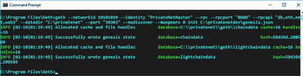

##### 使用自定义配置启动 geth 以运行私有网络节点

现在您已经生成了创世区块，您可以使用与之前相同的参数启动 geth，除了`init`命令：

```
C:\program files\geth>geth --networkid 10101010 
--identity "PrivateNetMaster" --rpc 
--rpcapi="db,eth,net,web3,personal,web3" 
--datadir "C:\privatenet" --port "30303" 
--nodiscover --maxpeers 0
```

|  |
| --- |

##### 提示

您可能需要关闭任何指向 MAINNET 或 TESTNET 运行的 geth 实例，以及任何运行的钱包实例，这取决于您如何配置端口号。

|  |
| --- |

如果 geth 成功启动，您应该看到一个与图 8.4 截图相似的屏幕。您会注意到屏幕上没有显示任何进度—没有生成区块。我相信您知道原因。这是因为您的私有网络只有一个节点，而且它还没有开始挖掘！

在您的新区块链上还没有任何新账户。在开始挖掘之前，您必须至少创建一个 Etherbase（或 coinbase）账户。

##### 图 8.4。针对您创建的私有网络启动 geth 后的输出

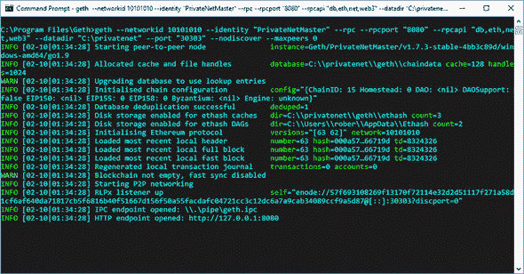

##### 创建 Etherbase 账户

通过打开一个新的命令行控制台然后像往常一样启动 geth attach 连接到私有网络节点。当 geth 控制台打开时，它将在`instance`和`datadir`输出中分别显示您的私有网络的名称和数据目录，这确认您已经连接到私有网络节点：

```
C:\Program Files\Geth>geth attach ipc:\\.\pipe\geth.ipc
Welcome to the Geth JavaScript console!

instance: Geth/PrivateNetMaster/v1.7.3-stable-4bb3c89d/windows-amd64/go1.9
at block: 1 (Mon, 26 Jun 2017 09:31:42 BST)
 datadir: C:\privatenet
 modules: admin:1.0 debug:1.0 eth:1.0 miner:1.0 net:1.0 personal:1.0 rpc:1.0
 txpool:1.0 web3:1.0
```

现在您可以像在第三章中看到的创建一个账户，第 3.4.3 节（在“PASSWORD OF ETHERBASE ACCOUNT”文本的地方输入您自己的密码）：

```
>personal.newAccount("PASSWORD OF ETHERBASE ACCOUNT")
"0x3f9e54337cce348607b76200fc19f3f6e3e8e358"
```

您可以使用`miner`对象的`setEtherbase`方法将此账户设置为 Etherbase 账户。将您创建的账户的地址作为输入传递：

```
>miner.setEtherbase("0x3f9e54337cce348607b76200fc19f3f6e3e8e358")
```

在开始挖掘之前，您可以创建额外的账户。此刻，创建一个额外的账户。您将使用它与私有网络上的`SimpleCoin`互动（在这里也输入您自己的密码，而不是文本“PASSWORD OF ACCOUNT 2”）：

```
>personal.newAccount("PASSWORD OF ACCOUNT 2")
"0x336a008e3a3b099bcd125cd54fc193070fe1d177"
```

##### 开始挖掘以在 Etherbase 账户上获取以太币

现在您可以像在第三章的 CPU 挖掘部分看到的那样开始挖掘：

```
>miner.start() 
```

让矿工运行几秒钟，然后在主 geth 外壳中检查输出。您会看到 DAG 被生成（如果需要，参阅第三章，第 3.3.4 节来刷新您对 DAG 的记忆），如图 8.5 截图所示。

##### 图 8.5。一旦您第一次启动挖掘，DAG 就会生成。

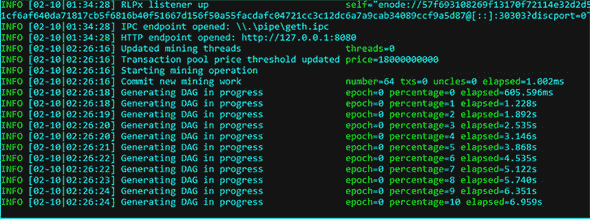

如果您在交互式外壳中检查 Etherbase 账户的余额，它仍然会是零：

```
> eth.getBalance(eth.coinbase).toNumber();
0
```

几秒钟后，您应该在主 geth 外壳中看到第一个区块正在挖掘，如图 8.6 截图所示。

|  |
| --- |

##### 注意

您可能会想知道这些初始区块是从哪里来的，因为您还没有提交任何交易。即使内存池中没有可用的交易，矿工也会总是尝试创建一个区块。创建一个空区块是完全合法的，并且在交易活动低落的时期可能会发生。然而，如您所知，矿工通过收集交易费尽可能地在区块中包含更多交易，所以空区块在实际中很少见，并且在私有网络中主要出现。

|  |
| --- |

##### 图 8.6. 在生成了 DAG 并创建了第一个区块之后

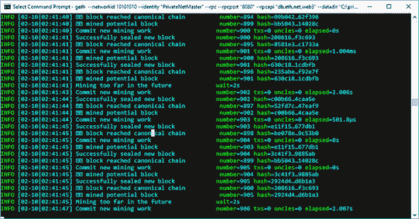

Etherbase 的余额现在将显示以太币（以 Wei 表示）

```
>eth.getBalance(eth.coinbase).toNumber();
5000000000000000000
```

如果你想要，你可以停止挖矿：

```
>miner.stop()
```

你已经创建了本地的私有网络。现在你可以尝试在上面部署`SimpleCoin`。

#### 8.4.3. 在私有网络上部署 SimpleCoin

在私有网络上工作与在公共网络上工作完全相同，所以你应该能够自己部署合约。但你需要检查确保一切按预期进行。表 8.8 显示了你在私有网络中的账户。

##### 表 8.8. 私有网络中的账户

| 账户 | 地址 |
| --- | --- |
| 主账户 | 0x3f9e54337cce348607b76200fc19f3f6e3e8e358 |
| 账户 2 | 0x336a008e3a3b099bcd125cd54fc193070fe1d177 |

确保账户 2 有一些以太币，这样你就可以从它那里部署。你可以从通过挖矿获得以太币的主账户那里获取一些：

```
> personal.unlockAccount(eth.coinbase, "PASSWORD OF ETHERBASE ACCOUNT");
> eth.sendTransaction({from:eth.coinbase, 
to:eth.accounts[1], value: web3.toWei(2.0, "ether")})
```

你现在可以通过在 OS 命令行界面运行你在第 8.3.3 节创建的脚本来从账户 2 部署合约，如下所示：

```
C:\Ethereum\SimpleCoinWithNode>node deploySimpleCoin.js
```

尽管你没有收到任何错误信息，但似乎有些地方出了问题：合约地址显示为未定义。记住，当你在 TESTNET 上部署时，几秒钟后你得到了这个输出：

```
Contract mined! address: 0x4291f37a727d32e5620a0a4ed61d27ffdad757af
 transactionHash: 0x2b7d2a015ca3397c1ec2b2d8e14b6c8ca7e3c06340d759a10d0e5358
 43532fe6
```

但是现在你没有收到合约地址的确认。如果你检查主 geth 壳体的输出，你会看到屏幕在

```
INFO [06-26|09:19:52] Submitted contract creation fullhash=
 0x2db88eadcd908f8c66294f2d427825e46bf820f089277f436ed5165f739efbbd
 contract=0xd144854e0d90e49726fab8e613115c217ee5262c
```

思考一下可能导致这个问题的问题。是的，你说对了：没有挖矿在进行！为了完成部署交易，这需要被挖矿。

回到 geth 交互式控制台并重新开始挖矿：

```
> miner.start()
```

（记住，之前你已经通过`miner.stop()`停止了挖矿。）预期的完成信息将立即出现：

```
Contract mined! address: 0xd144854e0d90e49726fab8e613115c217ee5262c
 transactionHash: 0x2db88eadcd908f8c66294f2d427825e46bf820f089277f436ed5165f
 739efbbd
```

如果你现在检查`simpleCoinInstance`，它包含了合约地址：

```
...

  address: "0xd144854e0d90e49726fab8e613115c217ee5262c",
  transactionHash:
 "0x2db88eadcd908f8c66294f2d427825e46bf820f089277f436ed5165f739efbbd",
  Transfer: function(),

  allEvents: function(),
  coinBalance: function(),
  transfer: function()
}
```

既然你已经部署了合约，如果你想要节省电力并保持 CPU 冷却，你可以停止挖矿。记住，与合约互动时，挖矿必须开启；否则，交易将永远无法完成。

作为一个练习，尝试在没有任何挖矿的情况下将一些 SimpleCoins 从主账户移动到账户`2`，然后检查你两个账户的币余额。你会证明只有在重新开启挖矿后交易才会完成。

### 8.5. 通过在模拟网络上部署来提高开发效率

尽管在私有网络上运行合约可以相对加快开发速度，特别是如果你适当地配置了挖矿难度级别，但你仍然需要正确管理私有网络。例如，用于开发或测试的账户必须有一些以太币，即使只是测试以太币，以确保你能完成交易。此外，测试网络至少有一个节点必须持续进行挖矿。

提高开发周期效率的一种方法是将你的合约部署到模拟网络。一个模拟网络，如 Ganache，在内存中运行，通常在开发者计算机上运行，并在适用的范围内模拟或绕过以太坊网络的所有基础架构方面，如账户管理、交易费用、挖矿和连接性。通过在 Ganache 上部署你的合约，你只能专注于你的合约的功能开发和测试，这样做可以显著加快你的开发周期。但是，一旦合约从功能角度来看运行正常，你仍然需要在私有网络上重新测试它，最终在公共测试网络上测试，以确保合约从基础设施角度来看也是健全的。

#### 8.5.1. 安装和启动 Ganache

结果证明，安装和设置 Ganache 比设置私有网络要简单：Ganache 是用 JavaScript 编写的，它使用`Ethereumjs`来模拟客户端行为，并且作为 Node.js 包分发，这使得它的安装变得简单。

假设你有一个 Node.js 实例（在撰写本文时，你必须至少有版本 6.9.1），你可以使用 Node.js 控制台安装 Ganache，如下所示：

```
C:\Ethereum\SimpleCoinWithNode\>npm install -g ganache-cli@6.1.8
```

就这样！现在如果你正在运行 geth，应该停止它，然后从一个新的操作系统控制台启动 Ganache：

```
c:\>ganache-cli
```

启动时，Ganache 将列出它将要支持的账户，如图 8.7 中的屏幕快照所示。

##### 图 8.7. 启动时显示的 Ganache 账户和相关私钥

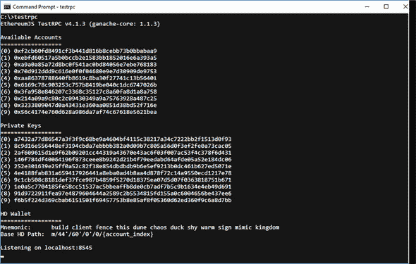

#### 8.5.2. 在 Ganache 上部署 SimpleCoin

因为 Ganache 正在模拟以太坊网络，所以你不能使用 geth 控制台在它上面部署`SimpleCoin`的合约。你现在新的控制台连接到（模拟的）以太坊网络，就是 Node.js 控制台。

现在你可以像在公共或私有测试网络上部署`SimpleCoin`一样精确地部署它，如下面的列表所示，这是从列表 8.3 稍作修改以适应 Ganache 的。

##### 列表 8.5. 部署 SimpleCoinOnGanache.js

```
const fs = require('fs');
const solc = require('solc');

const Web3 = require('web3');
const web3 = new Web3(
new Web3.providers.HttpProvider("http://localhost:8545"));

const account2 = web3.eth.accounts[1];
const sender = account2;

const initialSupply = 10000;

const source = fs.readFileSync(
'c:/Ethereum/SimpleCoin/SimpleCoin.sol', 'utf8');
const compiledContract = solc.compile(source, 1);
const abi = compiledContract.contracts[':SimpleCoin'].interface;
const bytecode = '0x' + compiledContract.contracts[':SimpleCoin'].bytecode;
const gasEstimate = web3.eth.estimateGas({ data: bytecode }) + 100000;

const SimpleCoinContractFactory = web3.eth.contract(JSON.parse(abi));

const simpleCoinInstance = SimpleCoinContractFactory.new(initialSupply, {
    from: sender,
    data: bytecode,
    gas: gasEstimate
   }, function (e, contract){
    console.log(e, contract);
    if (typeof contract.address !== 'undefined') {
         console.log('Contract mined! address: ' 
         + contract.address 
         + ' transactionHash: ' + contract.transactionHash);
    }
 });
```

如果你有一个正在运行的 geth 实例，停止它。确保 Ganache 在单独的操作系统外壳中运行。否则，再次以

```
C:\>ganache-cli
```

然后以这种方式运行部署脚本：

```
C:\Ethereum\SimpleCoinWithNode>node deployingSimpleCoinOnGanache.js
```

与此同时，观察运行 Ganache 的操作系统外壳。你应该看到以下内容：

```
Listening on localhost:8545
eth_accounts
eth_estimateGas
eth_sendTransaction

  Transaction: 0x25a3ee4ef5f71e72ab1800a78782d42676aec61503eaab1ef8beaf
2e54993038
  Contract created: 0xdc6d598f56cf80201d95b4e9494e83bab8aa479e
  Gas usage: 509317
  Block Number: 1
  Block Time: Wed Feb 21 2018 01:49:20 GMT+0000 (GMT Standard Time)

eth_newBlockFilter
eth_getFilterChanges
eth_getTransactionReceipt
eth_getCode
eth_uninstallFilter 
```

然后你几乎立即在 Node.js 控制台中看到这个：

```
Contract mined! address: 0xedaa9632746aa82b0f1f73185c38a437643116af
 transactionHash: 0xfa4d8a6e526d53ace153b2619c47f9e29359125dbf28e4d97d8f5af0
 cdd051d7
```

你能找出在公共或私有网络上部署合约与在 Ganache 上部署合约之间的区别吗？是的，你说得对：

+   在 Ganache 上的部署是瞬间的，而在网络上的部署则有些延迟。

+   与在公共或私有网络上部署合约时相反，你不需要解锁部署合约的账户。

在我们继续之前，这里有一个练习给你。尝试在 Ganache 上通过交互或脚本将硬币转移到两个账户之间。

### 8.6. 通过 web UI 更顺畅地与 SimpleCoin 交互

到目前为止，你已经通过各种开发工具与部署在以太坊上的智能合约进行了交互，如图 8.8 所示：手动通过 Ethereum 钱包和 Remix（带有注入的 Web3 选项）以及通过 geth 控制台或 Node.js 控制台发出的显式的 Web3.js 指令。最终用户也可以通过 Web3.js 从 web UI 间接地与以太坊合约交互。在本节中，你将为`SimpleCoin`构建一个 web UI，并且，作为一个结果，完成一个最小化的端到端去中心化应用（DApp）的第一次构建。

##### 图 8.8. 可以通过开发工具（如以太坊钱包和 Remix）与以太坊智能合约进行交互，也可以通过从 geth 控制台或 Node.js 控制台发出的显式的 Web3.js 指令执行合约操作。还可以从 HTML web UI 隐式地执行相同的 Web3.js 指令。

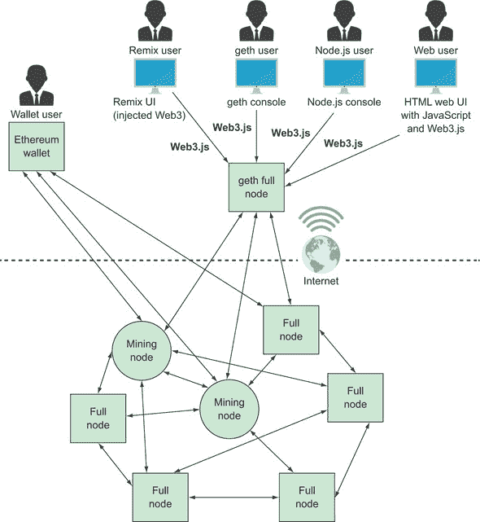

#### 8.6.1. 为 SimpleCoin 构建一个简约的 web UI

为了保持简单，你将首先把 web UI 连接到在 Ganache 上部署的`SimpleCoin`的一个实例。如果你关闭了 Ganache，请重新启动它，并在其上重新部署`SimpleCoin`，按照第 8.4.3 节中的步骤操作。

一旦`SimpleCoin`部署完成，你应该像之前一样看到一个类似的确认信息：

```
Contract mined! address: 0xedaa9632746aa82b0f1f73185c38a437643116af
 transactionHash: 0xfa4d8a6e526d53ace153b2619c47f9e29359125dbf28e4d97d8f5af0
 cdd051d7
```

|  |
| --- |

##### 注意

记下合约地址。你很快就需要在你要写的 JavaScript 代码中使用它。

|  |
| --- |

你可以用一小段 HTML 代码和一个处理账户间币转移的 JavaScript 脚本构建一个简约的 web UI。总之，你需要实现两个文件：

+   simplecoin.js

+   simplecoin.html

##### Simplecoin.js

处理账户间币转移的 JavaScript 代码，如列表 8.6 所示，与本章中你已经执行多次的代码类似——例如，早先在列表 8.2 中看到的。确保你用列表 8.6 中的合约地址替换你之前在 Ganache 上部署的合约的地址。

##### 列表 8.6. simplecoin.js

```
var web3 = new Web3(
new Web3.providers.HttpProvider("http://localhost:8545"));

var abi = "[{\"constant\":false,\"inputs\":[{\"name\":\"_to\",\"type\":\
"address\"},{\"name\":\"_amount\",\"type\":\"uint256\"}],\"name\":\
"transfer\",\"outputs\":[],\"payable\":false,\"type\":\"function\"},{\
"constant\":true,\"inputs\":[{\"name\":\"\",\"type\":\"address\"}],\"name\
":\"coinBalance\",\"outputs\":[{\"name\":\"\",\"type\":\"uint256\"}],\
"payable\":false,\"type\":\"function\"},{\"inputs\":[{\"name\":\
"_initialSupply\",\"type\":\"uint256\"}],\"payable\":false,\"type\":\
"constructor\"},{\"anonymous\":false,\"inputs\":[{\"indexed\":true,\"name\
":\"from\",\"type\":\"address\"},{\"indexed\":true,\"name\":\"to\",\"type\
":\"address\"},{\"indexed\":false,\"name\":\"value\",\"type\":\"uint256\
"}],\"name\":\"Transfer\",\"type\":\"event\"}]";
var SimpleCoinContractFactory = web3.eth.contract(JSON.parse(abi));
var simpleCoinContractInstance = SimpleCoinContractFactory.at(
'0xedaa9632746aa82b0f1f73185c38a437643116af');                   *1*
var accounts = web3.eth.accounts;

function refreshAccountsTable() {                                *2*
     var innerHtml = 
        "<tr><td>Account</td><td>Balance</td>";                  *3*

     for (var i = 0; i < accounts.length; i++) {                 *4*
            var account = accounts[i];
            var balance = 
                simpleCoinContractInstance
                 .coinBalance(account);                          *5*
            innerHtml = innerHtml + 
              "<tr><td>" + 
              account + "</td><td>" 
              + balance + "</td></tr>";
     }

     $("#accountsBalanceTable").html(innerHtml);
}

function transferCoins() {                                       *6*
     var sender = $("#from").val();
     var recipient = $("#to").val();
     var tokensToTransfer = $("#amount").val();
     simpleCoinContractInstance.transfer(                        *7*
        recipient, 
        tokensToTransfer, 
        {from:sender,gas:200000},
        function(error, result){
           if(!error)
              refreshAccountsTable();                            *8*
           else
              console.error(error);
        }
     );
}

$( document ).ready(function() {                                 *9*
     refreshAccountsTable();
});
```

+   ***1*** **用你刚刚在 Ganache 上部署的 SimpleCoin 合约的地址替换这里的内容。**

+   ***2*** **报告更新后的账户余额**

+   ***3*** **动态构建 HTML 账户余额表**

+   ***4*** **遍历所有账户以构建账户余额 HTML。**

+   ***5*** **调用币余额获取器**

+   ***6*** **从 UI 获取输入，并将其传递给币转移合约函数**

+   ***7*** **调用币转移合约函数**

+   ***8*** **成功的转移后的回调会刷新账户余额表。**

+   ***9*** **在打开页面时渲染账户余额表**

在你的电脑上创建一个文件夹，例如命名为 C:\Ethereum\SimpleCoinWebUI。在这个文件夹中，创建一个名为 simplecoin.js 的文件，并复制列表 8.6 中的代码。

##### Simplecoin.html

收集输入并显示币转移操作结果所需的 HTML 页面很基础。它包含几个文本框来收集输入和一个按钮来触发转移。除了基本的 HTML 之外，你还需要引用 Web3.js 和 jQuery JavaScript 库以及你刚刚创建的 simplecoin.js 脚本。你可以使用 Bower（[`bower.io/`](https://bower.io/)）这个用于构建网站的包管理器，在本地导入 Web3.js 和 jQuery。如下安装 Bower：

```
C:\Ethereum\SimpleCoinWebUI>npm install -g bower
```

现在在当前目录下导入 Web3.js 和 JQuery 库：

```
C:\Ethereum\SimpleVotingWebUI>bower install web3#0.20.6
C:\Ethereum\SimpleVotingWebUI>bower install jquery
```

至此，Bower 已经将 Web3 和 jQuery 下载到 bower_components 文件夹中的相应目录：

```
bower_components
   |--web3
   |--jquery
```

你现在可以参考如下所示的 JavaScript 库，该列表包含你需要的整个 HTML 代码。

##### 列表 8.7\. simplecoin.html

```
<html>
<head>   
   <script src="bower_components/web3/dist/web3.min.js"></script>

   <script src="bower_components/jquery/dist/jquery.min.js"></script>
   <script src="./simplecoin.js"></script>
</head>
<body>
   <table>
      <tr><b>SimpleCoin</b></tr>
       <tr><table border="0" cellpadding="0" width="200"
     id='accountsBalanceTable'> </table></tr>
       <tr/>
       <tr/>
       <tr>Transfer coins</tr>
       <tr>
            <table border="0" cellpadding="0" width="200" id='transferCoins'> 
               <tr>
                 <td>From:</td><td><input type="text" id="from" width="400"
     /></td>
                 <td>To:</td><td><input type="text" id="to" width="400"
     /></td>
                 <td>Amount:</td><td><input type="text" id="amount" /></td>
                 <td><button onclick="transferCoins()">Transfer</button></td>
               </tr>
            </table>
       </tr>
   </table>
</body>
</html>
```

在 SimpleCoinWebUI 文件夹中，创建一个名为 simplecoin.html 的文件。将列表 8.7 的代码复制进去。

#### 8.6.2\. 运行 SimpleCoin 网络用户界面

用你的浏览器打开 simplecoin.html。你会看到如图 8.9 所示的屏幕。

##### 图 8.9\. SimpleCoin 网络用户界面

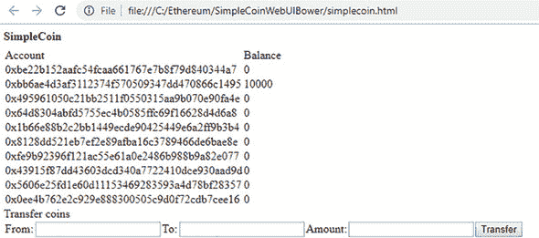

屏幕显示 Ganache 支持的所有账户的余额。如列表 8.5 所示的部署脚本指定，`accounts[1]`（即合同所有者）有 10,000 SimpleCoin 代币，其他账户的余额为零。

通过 UI 进行转移是简单的。分别在“从”和“到”文本框中指定源地址和目标地址，在“数量”文本框中输入你想转移的代币数。然后点击“转移”按钮。作为一个练习，执行这个转移：

+   来自：0xbb6ae4d3af3112374f570509347dd470866c1495

+   到：0x495961050c21bb2511f0550315aa9b070e90fa4e

+   数量：150

点击“转移”后，`transfer()`合同函数被调用，如果操作成功完成，相关的回调（映射到本地的`refresh-AccountsTable()`JavaScript 函数）将更新账户余额表，如图 8.10 所示。

##### 图 8.10\. 在成功的币转移后，源账户和目标账户的余额发生了变化。

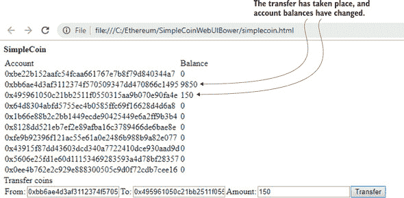

### 总结

+   像以太坊钱包和 Remix 这样的工具允许你部署合同并进行操作，但它们隐藏了客户端与以太坊网络之间的通信。

+   你可以使用显式的 Web3.js 指令从 geth 的控制台部署合同。

+   你也可以通过 geth 的控制台执行合同操作的 Web3.js 指令。

+   由于 geth 控制台的限制，从它部署合约并在其中执行操作是一个既费力又耗时的人工过程，不易于自动化。

+   从 Node.js 编译和部署合约更为容易，这也允许您完全自动化构建和部署 Web3.js 脚本。

+   您可以通过在完全由开发团队控制的私有以太坊网络上部署合约来改善开发周期。

+   您可以通过在 Ganache 等模拟网络上部署合约来进一步优化开发周期，它能够模拟账户并绕过高延迟操作，如挖矿。

+   可以通过 HTML 用户界面执行智能合约操作，使用与 geth 或 Node.js 控制台相同的 Web3.js 指令。
