## 第三部分

你可以将第三部分视为本书的核心。在学习了前两部分的所有基础内容后，你准备好过渡到现实世界的以太坊。在第九章中，你将熟悉更广泛的生态系统，其中包括其他元素，如以太坊名称服务（ENS）；去中心化存储网络，如 IPFS 和 Swarm；以及预言机和其他开发框架。然后，你将开始使用专业开发工具。

在第十章中，你将学习如何使用 JavaScript Mocha 框架测试智能合约，在第十一章中，你将使用 Truffle 框架改进开发周期，该框架将允许你轻松编译、测试和部署你的合约。最后，在第十二章中，你将综合运用所学知识，从头开始构建一个端到端的投票 Dapp。

完成这一部分后，你将实现一个重要里程碑：你将深入理解以太坊的运作方式，并对其生态系统有全面的了解。如果你渴望建立自己的 Dapp，我强烈建议你继续阅读，以便学习第四部分的更高级概念。

## 第九章。以太坊生态系统

|  |
| --- |

**本章内容涵盖**

+   以太坊生态系统的全局鸟瞰

+   使用 ENS 的分布式地址解析

+   在 Swarm 和 IPFS 上的去中心化内容存储

+   通过预言机的外部数据访问

+   Dapp 框架和 IDE

|  |
| --- |

在之前的章节中，你学习了以太坊平台的主要组成部分以及如何使用 Remix IDE 和 geth 控制台等简单工具来实现和部署去中心化应用。然后，你通过使用 Node.js 部分自动化部署，提高了开发效率。你进一步通过在私有网络和 Ganache 上部署和运行智能合约，以及逐步减少和几乎消除了以太坊平台的基础设施对运行和测试周期的影响，从而提高了效率。

迄今为止你所使用的工具集相当基础，但它帮助你理解了智能合约的构建和部署过程中的每一个步骤。你还学习了交易的整个生命周期，从它的创建、通过 Web3 调用、传播到网络、挖掘，最终持久化在区块链上。虽然你可能会发现这些工具对于快速入门和详细学习各种概念很有帮助，但如果你决定定期开发以太坊应用程序，你会使用另一套工具。

本章为您提供了更广泛的以太坊生态系统的概述，既从平台的角度也从开发工具集的角度。您将了解到以太坊平台的更多组件以及允许您更轻松地开发和部署 Dapps 的其他 IDE 和框架。但在我们开始探索完整的以太坊生态系统之前，我将回顾一下平台和开发工具集的当前视图。

### 9.1. 核心组件

图 9.1 总结了您迄今为止关于以太坊平台和开发工具集的所有知识。

##### 图 9.1. 您迄今为止学习的以太坊平台的核心组件：geth、以太坊钱包、MetaMask、Ganache、Remix、solc 和 Web3.js。

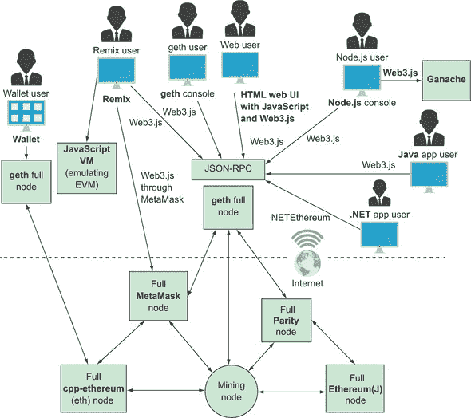

虽然您已经安装了 Go Ethereum 客户端 (geth) 和以太坊钱包，但您知道您还可以安装其他客户端，例如 cpp-ethereum (eth)、Parity、Ethereum(J) 或 pyethapp。其中大多数都带有相关的钱包。您还可以决定使用 MetaMask 连接外部 MetaMask 节点（实际上，如稍后您将看到的，是一个 Infura 节点）或使用 Ganache 连接模拟节点。

您使用 Remix（浏览器 Solidity）在 Solidity 中开发了您的智能合约。需要时，您将代码移动到文本文件并使用 solc 编译器编译它们。从理论上讲，您可以使用其他 EVM 语言（如 Serpent 或 LLL）实现智能合约，但目前 Solidity 被广泛认为是最高可靠性和最安全的语言。时间将告诉我们 Serpent 是否会有所回归，或者像 Viper 这样的新替代方案是否会开始获得动力。

您最初通过交互式 geth 控制台与网络（包括您部署的合约）交互。然后，您转向 Node.js 以获得更好的可扩展性和自动化。

Web3.js 是一个针对 JavaScript 的特定高级 API，它封装了低级的 JSON-RPC API。还有针对其他语言的其他高级 API，例如 web3.j（用于 Java）、NETEthereum（用于 .NET）和 Ethereum.ruby（用于 ruby）。

### 9.2. 完整生态系统的鸟瞰图。

图 9.2 提供了当前以太坊生态系统的全面视图，您可以看到一套额外的开发 IDE 和框架，例如 Truffle，旨在改善开发体验。像 meteor 和 Angular 这样的 UI 框架并不是以太坊特定的，但它们被广泛采用来构建现代 Dapp UI。此外，像 Mocha 和 Jasmine 这样的通用测试框架正在成为 Dapp 开发环境的一个常见特征。

您还可以看到一些额外的基础设施元素：

+   **以太坊名称服务 (ENS)**—这是一个用于将诸如 `roberto.manning.eth` 等人读名字解析为以太坊地址（如 `0x829bd824b016326a401d083b33d092293333a830`）的智慧合约。

+   *Swarm 和 IPFS*—这两个是为去中心化内容存储而竞争的网络，以太坊区块链交易可以通过哈希 ID（或通过 ENS 解析为哈希的友好名称）引用。Swarm 直接隶属于以太坊旗下，是了解以太坊的；IPFS 是一个通用技术无关的协议，提供类似功能。

+   *预言机框架*—这些是智能合约框架（如 Oraclize），通过确保数据真实性和在整个以太坊网络上一致处理数据的方式，访问现实世界数据。

+   *Whisper*—这是一个去中心化消息网络，为以太坊智能合约提供异步点对点通信，其主要特点是有弹性且私密。Whisper API 允许合约发送具有不同安全性和私密性的消息，从纯文本和完全可追踪到加密且几乎无法追踪（所谓的*暗消息*）。

    ##### 图 9.2\. 当前以太坊生态系统的全面视图，以粗体显示我们尚未涵盖的项目

    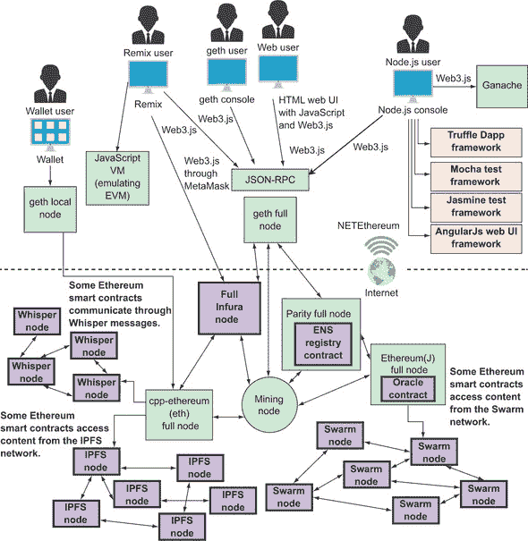

+   *Infura 节点*—这是由 Infura 托管的一组以太坊节点，Infura 是 ConsenSys（也是 Truffle 背后的公司）拥有的服务。Infura 作为云服务向客户提供节点，内置安全和隐私功能。与传统的云服务提供商一样，Infura 允许初创企业和独立开发者专业地构建以太坊应用程序，而无需购买物理服务器。MetaMask 连接到这些节点。

接下来的几节将详细探讨 ENS、Swarm、IPFS 和预言机框架。

Whisper 属于消息导向协议领域。这是一个高级主题，所以我不会进一步介绍。但是，如果你有消息导向应用程序的经验，并且渴望了解更多，我鼓励你查看 GitHub 上以太坊维基上的 Whisper 文档 ([`mng.bz/nQP4`](http://mng.bz/nQP4) 和 [`github.com/ethereum/wiki/wiki/Whisper`](https://github.com/ethereum/wiki/wiki/Whisper))。

从概念上讲，Infura 节点的工作方式与其他完整以太坊节点完全一样。不过，请注意，Infura 客户端支持 JSON-RPC 标准的子集，所以如果你对进一步探索它们感兴趣，你应该查看它们的 technical documentation。

在关闭本章之前，我将简要介绍构建 Dapps 的主要开发工具。当我进入下一章时，我将重点介绍 Truffle，这是主要的智能合约开发 IDE，我将通过实际操作示例进行详细介绍。

### 9.3\. 使用 ENS 进行去中心化地址解析

以太坊名称服务，也称为 ENS，管理去中心化的地址解析，提供了一种去中心化和安全的方式来引用资源地址，例如通过人类可读的域名来引用账户和合约地址。与互联网域名类似，以太坊域名是一个分层的点分隔名。域名中的每个部分（由点分隔）都称为一个标签。标签包括右侧的*根域名*，例如 eth，紧邻其左侧的*域名*，以及进一步向左的嵌套子*子域名*，如图 9.3 所示 figure 9.3。

##### 图 9.3。ENS 名称的结构。您可以看到最右侧的根域名 eth，紧邻其左侧的域名，以及从右向左的嵌套子域名。

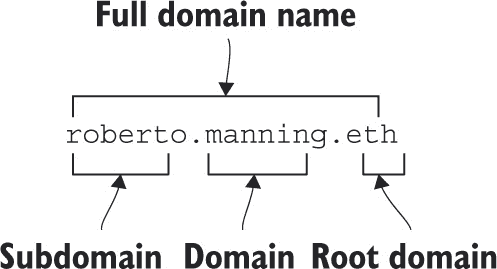

例如，您可以将以太币发送到 `roberto.manning.eth`（这是 eth 的子域名）而不是 `0xe6f8d18d692eeb02c3321bb9a33542903073ba92`，或者您可以使用 `simplecoin.eth` 引用一个合约，而不是使用其原始部署地址：`0x3bcfb560e66094ca39616c98a3b685098d2e7766`，如图 9.4 所示 figure 9.4。ENS 还允许您通过友好名称引用其他资源，例如 Swarm 和 IPFS 的内容哈希（我们将在下一节中介绍）。

##### 图 9.4。ENS 将名称解析为外部（用户）地址、合约地址和 Swarm 内容哈希。从域名本身无法判断它是否映射到一个地址或 Swarm 哈希。正如您稍后所看到的，一个域名必须明确映射到一个特定的名称解析器，以映射到一个地址或 Swarm 哈希（或其他资源标识符）。


ENS 被封装成一个智能合约，由于其逻辑和状态存储在区块链上，并且因此在整个以太坊网络中分散存储，所以它被认为比像互联网域名服务（DNS）这样的集中式服务更安全。ENS 的另一个优势是，它不仅在基础设施层面上是去中心化的，而且在治理层面上也是去中心化的：域名不由中央权威机构管理，而是可以直接由感兴趣的各方通过注册商注册。注册商是一个管理特定根域（如 eth）的智能合约，域名分配给在相关注册商合约上执行的开放拍卖的胜出者，他们也将成为子域的所有者。

#### 9.3.1。ENS 设计

ENS 系统由三个主要组件组成：

+   注册商—这是一个管理域名所有权的合约。你必须通过注册商认领一个域名，并将其与你的一个账户关联，然后才能注册与它关联的具体全域名。特定的注册商处理每个根域名，例如.eth，这是与以太坊主网地址关联的名称的根域名，或者.swarm，这是与 swarm 内容哈希关联的名称的根域名。请注意，你必须通过管理.test 根域名的测试注册商来执行指向 TESTNET 以太坊地址的域名所有权，这是一个与管理和.eth 根域名的注册商分开的注册商。

+   解析器—这些是实现以太坊改进提案（EIP）137 中指定的通用 ABI 接口的智能合约，你可以在这里查阅： [`eips.ethereum.org/EIPS/eip-137`](http://eips.ethereum.org/EIPS/eip-137)。解析器将域名翻译成资源标识符。每个解析器都针对一种特定的资源类型。例如，有一个针对以太坊地址（称为公共解析器）的解析器，另一个针对 IPFS 内容哈希的解析器，等等。

+   注册表—简而言之，这是一个域名（或子域名）名称与域名解析器的映射。

ENS 注册表的简单设计，如图 9.5 所示，使其容易扩展，因此你可以引用实现任何复杂度的地址转换规则的自定义解析器。此外，它可以在未来支持新的资源类型，而不需要对注册表进行任何修改和重新部署：新资源类型的域名将指向新的解析器。图 9.6 显示了域名解析过程。

##### 图 9.5 ENS 注册表设计。ENS 注册表合约是一个资源类型与相关域名解析器合约之间的映射。将来，它可以通过将域名（与新资源类型关联）指向新解析器来支持新的资源类型。域名所有权通过特定的注册商注册。

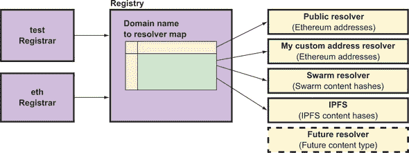

##### 图 9.6 域名解析过程：1. 查询注册表以确定正确的解析器；2. 请求相关解析器将域名翻译成地址。

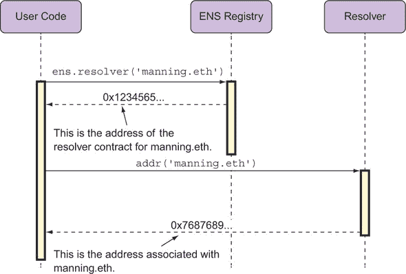

正如你在图 9.6 中所看到的，域名解析是一个两步过程：

1.  你要查询注册表以确定与你要解析的域名关联的正确解析器，注册表将返回相关解析器的合约地址。

1.  你请求相关解析器将域名翻译成资源标识符，例如以太坊地址或 Swarm 哈希。

存储在注册表上的每个映射记录都包含表 9.1 所示的信息。

##### 表 9.1 ENS 注册表映射记录

| 字段 | 描述 | 示例 |
| --- | --- | --- |
| 域名 | 出于性能和隐私原因，使用域名的哈希值，称为 Namehash，而不是域名本身。如果你想了解更多，请阅读侧边栏。 | 0x98d934feea78b34... (Roberto.manning.eth 的 Namehash) |
| 域名所有者 | 拥有域名地址的外部（用户）账户或合同账户的地址 | 0xcEcEaA8edc0830C... |
| 域名解析器 | 能够解析相关资源类型的域名地址的解析器合同地址 | 0x455abc566... (公共解析器地址) |
| 生存时间 | 这指定了映射记录在注册表中应保持的时间。它可以是无限期或一个特定的持续时间。 | 6778676878 (UNIX epoch 过期日期) |
|  |

**Namehash**

出于性能原因，为了保护域名所有者的隐私，ENS 针对域名 32 字节的哈希而不是其明文字符串表示形式工作。这个哈希是通过一个称为*Namehash*的递归算法确定的，如果应用于例如`roberto.manning.eth`，则按照以下方式工作：

1.  将完整域名拆分为由点分隔的标签；从最后一个到第一个顺序排列；并添加一个空标签作为第一个项目：

    ```
                labels = ['', 'eth', 'manning', 'roberto']
    ```

1.  选择第一个项目。因为它是空的，所以通过将其设置为 32 个'0'字节来确定相关的 namehash。与完整域名的增加部分对应的 namehash 称为*节点*。到目前为止，你已经有了以下内容：

    ```
       node =
    0x0000000000000000000000000000000000000000000000000000000000000000
    ```

1.  选择第二个标签（`'eth'`）并通过应用`keccak256`散列函数确定其关联的标签散列：

    ```
        labelHash = keccak256('eth') =
    0x4f5b812789fc606be1b3b16908db13fc7a9adf7ca72641f84d75b47069d3d7f0 
    ```

1.  通过将前一个节点与当前标签散列连接起来进行哈希，确定与第二个标签关联的节点：

    ```
        node = keccak256(node + labelhash) = 
    keccak256(
    0x000000000000000000000000000000000000000000000000000000000000000004f5b81278
     9fc606be1b3b16908db13fc7a9adf7ca72641f84d75b47069d3d7f0) = 
     0x93cdeb708b7545dc668eb9280176169d1c33cfd8ed6f04690a0bcc88a93fc4ae
    ```

1.  选择第三个条目`('manning')`，并重复步骤 3 和 4。

1.  选择第四个条目`('roberto')`，并重复步骤 3 和 4。最后，`roberto.manning.eth`的 namehash 是

    ```
     0x5fd962d5ca4599b3b64fe09ff7a630bc3c4032b3b33ecee2d79d4b8f5d6fc7a5
    ```

    你可以从表中获取 Namehash 算法输出，该算法用于散列`roberto` `.manning.eth`。**散列 Roberto.manning.eth 的 Namehash 算法步骤**

    | 步骤 | 标签 | 标签散列 | keccak256 (节点+标签散列) | 节点 |
    | --- | --- | --- | --- | --- |
    | 1 | '' | N/A | N/A | 0x000000000000... |
    | 2 | 'eth' | 0x4f5b812789fc... | keccak256 (0x0000... 0x4f5b812789f...) | 0x93cdeb708b7... |
    | 3 | 'manning' | 0x4b2455c1404... | keccak256 (0x93cde... 4b2455c...) | 0x03ae0f9c3e92... |
    | 4 | 'roberto' | 0x6002ea314e6 | keccak256 (0x03e0... 6002ea3...) | 0x5fd962d5ca4599b3b6 |

    以下是从 Nick Johnson 的 ENS 工具库`ensutils.js`中的 JavaScript 实现的过程（下一节有更多详细信息），你可以在 geth 控制台或 Node.js 控制台中运行：

    ```
    function namehash(name) {
        var node =
    '0x0000000000000000000000000000000000000000000000000000
     000000000000';                                          *1*
        if (name !== '') {
            var labels = name.split(".");                      *2*
            for(var i = labels.length - 1; i >= 0; i--) {
                label = labels[i];                             *3*
                labelHash = web3.sha3(label);                  *4*
                node = web3.sha3(node + labelHash.slice(2), 
                {encoding: 'hex'});                            *5*
            }
        }
        return node.toString();                                *6*
    }
    ```

+   ***1*** 空标签' '对应的节点

+   ***2*** 将完整域名拆分为其构成标签

+   ***3*** 获取当前标签

+   ***4*** 计算标签散列

+   ***5*** 将前一个节点与当前标签散列连接（从标签散列中移除'0x'），并使用十六进制编码计算当前节点

+   ***6*** 将最终节点作为字符串返回

|  |
| --- |
|  |

##### 警告

`web3.sha3()`函数创建了一个 keccak256 散列。它并不遵循 SHA-3 标准，正如它的名字所暗示的那样。

|  |
| --- |

#### 9.3.2\. 注册域名

理论足够了！让我们看看如何从 geth 控制台在 Ropsten 测试网络上注册 ENS 实例的域名。

首先，从这里下载 ENS JavaScript 工具库：[`mng.bz/vN9r`](http://mng.bz/vN9r)。将这个 JavaScript 文件放在一个文件夹中，例如，C:\ethereum\ens。

|  |
| --- |

##### 警告

虽然对于学习 ENS 很有用，但 ENS JavaScript 工具库 ensutils.js 和 ensutils-testnet.js 并不适合用于构建生产 Dapp。

|  |
| --- |

现在，从操作系统壳中，像之前多次那样启动 geth 对 TESTNET 网络。 (如果对等节点没有快速定位，记得使用`--bootnodes`选项，就像在第八章开始时那样。) 输入以下内容：

```
C:\Program Files\geth>geth --testnet
```

Geth 将开始同步，如预期那样。从另一个命令行窗口，启动一个交互式控制台：

```
C:\Program Files\geth>geth attach ipc:\\.\pipe\geth.ipc
```

然后在您附加的交互式 geth 控制台上导入 ENS 工具库：

```
>loadScript('c:/ethereum/ens/ensutils-testnet.js');
```

在 TESTNET 网络上注册域名意味着在`.test`根域名上注册，而不是与 MAINNET（公共生产网络）关联的`.eth`。这意味着您必须使用测试注册商。

我将要注册的域名是`roberto.manning.test`。选择一个类似的三标签域名，并相应地调整我即将给出的指示。

##### 检查域名所有权

首先，我必须检查是否还有其他人已经拥有`manning`域名。如果有，我就无法注册我的完整域名（`roberto.manning.test`）；我得请求当前所有者为我操作。

这就是您可以在测试注册商上检查`manning`域名是否可用的方法：

```
>var domainHash = web3.sha3('manning');
> 
>var domainExpiryEpoch = testRegistrar.expiryTimes(domainHash)
.toNumber() * 1000;
>var domainExpiryDate = new Date(domainExpiryEpoch);
```

检查`domainExpiryDate`的值（通过在提示符下输入它）。如果它早于今天，域名是免费的；否则，您必须选择另一个域名并重复检查。

|  |
| --- |

##### 注意

您可能想知道，在不太可能的情况下，`manning`的拥有权尚未注册，但另一个具有相同`web.sha3()`哈希的名称已被注册会发生什么。如果这种情况发生，您将无法注册`manning`，因为它会向注册商显示出已被占用。

|  |
| --- |

##### 注册域名所有权

在检查账户空闲之后，您可以通过将账户注册到测试注册商之一来认领它；例如，`eth.accounts[0]`。 (确保`accounts[0]`有足够的以太币来执行交易，通过像往常一样检查：`eth.getBalance(eth.accounts[0]);` 也替换您的`accounts[0]`密码。) 输入以下内容：

```
>personal.unlockAccount(eth.accounts[0], 'PASSWORD_OF_YOUR_ACCOUNT_0');
>var tx1 = testRegistrar.register(domainHash,
eth.accounts[0], {from: eth.accounts[0]});
```

检查`tx1`的值，然后检查相关交易是否已经挖矿，前往 Ropsten etherscan： [`ropsten.etherscan.io`](https://ropsten.etherscan.io)。注意在 MAINNET 上注册域名所有权是一个更复杂的过程。（更多详情请参见[`docs.ens.domains/en/latest/`](https://docs.ens.domains/en/latest/)）

##### 注册域名

一旦域名所有权交易被挖矿，就是设置您在表 9.1 中看到的域名映射配置的时候了。您已经通过注册域名所有权通过注册商设置了某些配置（域名账户所有者）。现在您必须配置解析器和域名将被映射到的目标地址。

您可以将您的域名映射到公共解析器（您知道，它将域名映射到给定的以太坊地址）通过 ENS 注册表如下：

```
>tx2 = ens.setResolver(namehash('manning.test'),
publicResolver.address, {from: eth.accounts[0]});
```

在 Ropsten etherscan 上检查`tx2`是否已挖矿，然后配置公共解析器将您的域名指向目标地址（例如，您的测试`accounts[1]`），如下所示：

```
>publicResolver.setAddr(namehash('manning.test'),
eth.accounts[1], {from: eth.accounts[0]});
```

##### 注册子域名

注册子域名的所有权与注册域名的所有权略有不同，因为您不是通过注册商进行操作，而是通过 ENS 注册表。将子域名的所有权`Roberto.manning`分配给`accounts[2]`，如下所示：

```
>ens.setSubnodeOwner(namehash('manning.test'),
web3.sha3('roberto'), eth.accounts[2], {from: eth.accounts[0]});
```

|  |
| --- |

##### 警告

运行交易的账户必须是`'manning.test'`域的所有者：`accounts[0]`。

|  |
| --- |

使用`accounts[2]`，`'roberto.manning.test'`子域的所有者，您现在可以像往常一样将其映射到公共解析器：

```
>ens.setResolver(namehash('roberto.manning.test'),
publicResolver.address, {from: eth.accounts[2]});
```

最后，您可以配置公共解析器将您的域名指向目标地址（例如，您的测试`accounts[3]`），如下所示：

```
>publicResolver.setAddr(namehash('manning.test'),
eth.accounts[3], {from: eth.accounts[2]});
```

#### 9.3.3. 解析域名

将域名解析为地址是直接的。首先解析`'manning.test'`：

```
>var domainName = 'manning.test';
>var domainNamehash = namehash(domainName);
>var resolverAddress = ens.resolver(domainNamehash);
>resolverContract.at(resolverAddress).addr(namehash(domainNamehash));
```

您将看到

```
0x4e6c30154768b6bc3da693b1b28c6bd14302b578
```

您可以验证这是您的`accounts[1]`地址，如预期那样：

```
> eth.accounts[1]
```

这是解析域名的一个快捷方式：

```
>getAddr(domainName);
0x4e6c30154768b6bc3da693b1b28c6bd14302b578
```

如果您有兴趣了解更多关于 ENS 的信息—例如，通过提交揭示出价在 MAINNET 上获取.eth 域名—我鼓励您查阅由 ENS 的创建者 Nick Johnson 编写的官方文档。您可以在[`docs.ens.domains/en/latest/`](https://docs.ens.domains/en/latest/)找到它。

### 9.4. 去中心化内容存储

去中心化应用程序的一个常见用例是存储一系列文档，例如，证明通过应用程序交易的商品的来源。一个典型的例子是钻石，传统上它们附有纸质证书，显示它们来自合法的矿山和贸易商。对于更复杂的供应链，例如在国际贸易金融领域（[`en.wikipedia.org/wiki/Trade_finance`](https://en.wikipedia.org/wiki/Trade_finance)），涉及到供应商、供应商银行、航运公司、最终客户及其银行等多个方，文件可能更加庞大。直接在区块链上存储等效的电子文档可以工作，但有两个原因使其不是理想的解决方案：

+   电子文档将使引用它的交易膨胀，从而导致处理速度变慢。

+   更大的交易需要更多的燃料（gas）来处理，因此成本更高。

一种替代方案是将电子文档存储在区块链外的数据库中，在交易中只包含每份文档的加密哈希值，以证明其内容。这个解决方案并不完美，因为区块链外的数据库将是集中式的资源，不易被以太坊节点访问。即使去中心化应用程序能够访问存储文档的数据库，但拥有这样一个集中式的仓库与去中心化应用程序的精神是相悖的。

一个理想的解决方案将基于去中心化的存储仓库。这正是部分与以太坊相关的 Swarm 平台旨在提供的。另一个有效的替代方案将是使用现有的 IPFS 分布式存储网络。让我们探讨这两种选项。

#### 9.4.1 Swarm 概览

Swarm 是一个内容分发平台，其主要目标是向以太坊 Dapps 提供去中心化和冗余的存储。它专注于持有和公开智能合约数据和代码，以及区块链数据。

通过 P2P 网络在 Swarm 中进行存储，使其抵抗分布式拒绝服务（DDoS）攻击和审查，并提供容错性，保证零停机，因为它没有单点故障。如图 9.7 所示的 P2P Swarm 网络架构与以太坊网络类似：每个节点运行一个管理本地存储并通过名为*bzz*的通用标准协议与同行节点通信的 Swarm 客户端。目前，只有一个客户端实现可用，是用 Go 语言编写的，并包含在您可以从 Go Ethereum 网站下载的 Geth & Tools 包中。与以太坊网络的主要区别在于，所有以太坊节点都有区块链数据库的相同副本，而每个 Swarm 节点包含不同的数据集，如图 9.7 所示。

##### 图 9.7\. Swarm 网络的架构图。Swarm 网络由运行 Swarm 客户端的节点组成，类似于以太坊网络，每个节点都运行一个以太坊客户端。与以太坊节点不同，所有以太坊节点都拥有区块链数据的相同副本，而每个 Swarm 节点包含一组不同的数据。

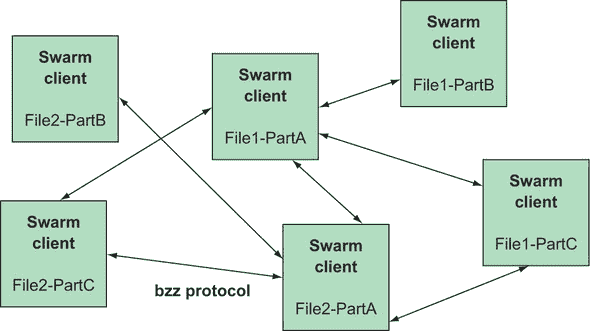

Swarm 节点与一个称为*swarm 基础账户*的以太坊账户关联。swarm 基础账户地址的（keccak 256 位）哈希值确定*swarm 基础地址*，即 Swarm 网络中的 Swarm 节点地址。Swarm 网络与特定的以太坊网络相关联。例如，主生产 Swarm 网络与 MAINNET 相关联，Swarm 网络与 Ropsten 以太坊网络相关联。由于 Swarm 是 Ethereum 技术栈的一部分，它充分利用了生态系统的其他组件，如 ENS。

当内容上传到 Swarm 时，它被分解成 4KB 大小的*块*，这些块散布在 Swarm 网络的各个部分。上传过程如图 9.8 所示。

它包括以下步骤：

1.  调用者将内容（通常是文件）上传到分布式预像归档（DPA），这是存储和检索网关。

1.  数据包访问（DPA）调用一个名为*块分割器*的组件。

1.  块分割器

    1.  将内容分割成 4KB 大小的块，称为块

    1.  计算其块的加密哈希值

1.  块（或区块）的哈希值存储在一个名为 chunks-index 的文档中。

1.  如果 chunks-index 文档大于 4KB，它将被分割成块，其哈希值随后放置在另一个文档中。这个过程一直持续到块被组织成一个树结构，顶部是一个根索引文档，中间是一层索引块，底部是内容块，如图 9.9 所示。这种数据结构是一个默克尔树，这是区块链数据库用来链接其区块的相同数据结构。

    ##### 图 9.8。Swarm 上传过程：1. 调用者将文件上传到分布式预图像档案网关；2. DPA 将文件发送到块分割器；3. 块分割器将文件切成 4 KB 块并计算每个块的哈希值；4. 块哈希值放置在块索引文档中；5. 块索引文档被切成块，并重新组织成 Merkle 树结构，其根哈希称为根键；6. 块分割器将每个块根据其哈希值存储到网络存储中；7. 网络存储将 4 KB 块分布在 Swarm 网络中；8. 块分割器将根键返回给 DPA；9. 最后，DPA 将根键返回给调用者。

    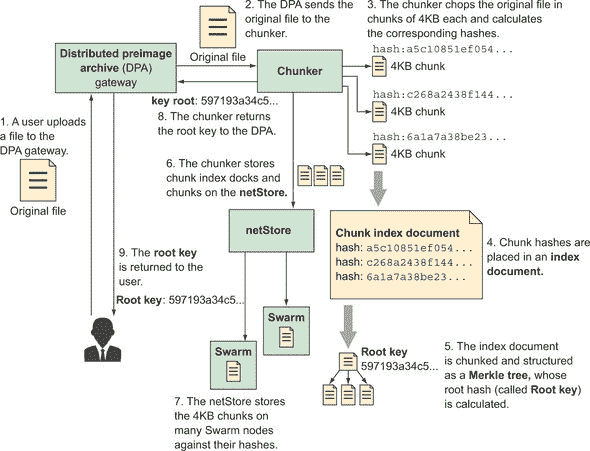

1.  块分割器根据其哈希键在每个块上存储块。

1.  网络存储是 Swarm 网络上分布式哈希表（DHT）的一个实现，因此块存储在许多 Swarm 节点上。由于这个分布式哈希表的键是一个加密哈希键，它是底层内容的一种表示，这种存储数据的方式也被称为内容可寻址存储（CAS）。

1.  块分割器返回根索引文档的哈希键，称为*根键*，并将其交还给 DPA。

1.  最终，DPA 将根键返回给调用者。这将在稍后用于从 Swarm 下载原始文件。

##### 图 9.9。块和块索引 Merkle 树结构。顶部的文档包含初始块索引文档（包含所有 4 KB 块的哈希值）的块哈希。中间层由初始块索引文档的块组成。最底层包含原始文件的 4 KB 块。

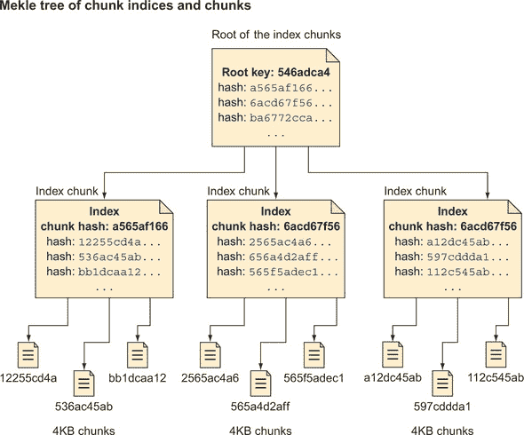

下载过程经历一个类似的流程，但顺序相反，如图 9.10 所示：

1.  调用者将根键交给 DPA。

1.  DPA 调用块分割器，它提供了根键。

1.  块分割器从网络存储中检索与根键关联的根块，然后遍历树结构，直到从 Swarm 网络中检索到所有块。当块从它们的网络存储位置（它们存储在的具体 Swarm 节点）流向块分割器时，它们会在每个经过的 Swarm 节点中缓存，因此如果请求相同的内容，后续下载通常会更快。

1.  块分割器从块中重建文件，并将其返回给数据包协议器。

1.  数据包协议器将请求的文件返回给调用者。

从操作角度来看，Swarm 平台的可持续性基于旨在鼓励和奖励提供底层存储资源的参与者的货币激励。存储在需要它的参与者和提供它的参与者之间进行交易，因此它倾向于被高效地分配。

##### 图 9.10\. Swarm 下载过程：1\. 调用者将根密钥交给 DPA；2\. DPA 调用分块器，并提供根密钥；3\. 分块器从 netStore 检索与根密钥关联的根块，然后遍历树，直到它从 Swarm 网络检索到所有的块；4\. 分块器从块中重构文件并将其返回给 DPA；5\. DPA 将请求的文件返回给调用者。

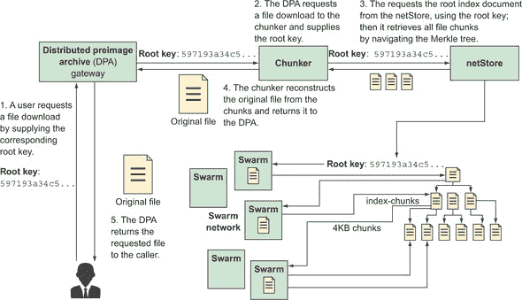

#### 9.4.2\. 使用 Swarm 上传和下载内容

在本节中，我将向您展示如何将内容上传到 Swarm，获取其根密钥，然后使用根密钥从 Swarm 下载内容。

##### 连接到 Swarm

你必须首先做的步骤是从未经 Geth & Tools 归档（或安装程序）链接下载的 Swarm 客户端，swarm.exe，从 Go Ethereum 网站下载。如果你从 Geth & Tools 存档链接（或安装程序）下载了 geth，你应该已经在运行 geth 的相同文件夹中已经有了 swarm.exe。否则，回到 Go Ethereum 网站下载 Geth & Tools 1.8.12 包，我相信这是仍然包含 swarm.exe 的最新存档。解压缩它并将 swarm.exe 复制到您放置 geth.exe 的相同文件夹中。在我的案例中，我将其放在这里：C:\Program Files\geth。

现在针对 TESTNET 启动 geth。 (如果对等节点没有快速定位，请记得使用 `--bootnodes` 选项，正如你在第八章开始时所做的那样。) 输入以下内容：

```
C:\Program Files\geth>geth --testnet
```

正如所预期的，geth 将开始同步。从另一个命令提示符窗口，启动一个交互式控制台：

```
C:\Program Files\geth>geth attach ipc:\\.\pipe\geth.ipc
```

然后，从交互式控制台获取您的测试网 `accounts[1]` 的地址：

```
> eth.accounts[1]
"0x4e6c30154768b6bc3da693b1b28c6bd14302b578"
```

您将在此账户下运行 Swarm 客户端，通过打开一个新的操作系统控制台，从放置 swarm 可执行文件的文件夹执行以下命令（相应地替换您的 Ethereum 测试网文件夹）：

```
C:\Program Files\geth>swarm –datadir
 C:\Users\rober\AppData\Roaming\Ethereum\testnet
 --bzzaccount 0x4e6c30154768b6bc3da693b1b28c6bd14302b578
```

表 9.2 解释了启动 Swarm 客户端时我使用的选项。

##### 表 9.2\. 启动 Swarm 客户端时使用的选项

| 选项 | 目的 |
| --- | --- |
| --datadir | 指定与要使用的环境相关的 datadir 路径——在我们的案例中，是 TESTNET (Ropsten) |
| --bzzaccount | 指定要使用的 Ethereum 账户——在我们的案例中，是 TESTNET accounts[1] |

正如你在 图 9.11 中看到的，系统会要求你通过提供其密码来解锁 `accounts[1]`。输入要求的密码，客户端将输出类似于 图 9.12 截图中的内容启动。

##### 图 9.11\. 解锁用于启动 Swarm 客户端的 Ethereum 账户


在你的 Swarm 客户端与多个对等节点（默认最多 25 个）同步之前，可能需要几分钟时间。输出类似于以下内容表示已经找到了有能力的对等节点：

```
INFO [03-11|19:49:47] Peer faa9a1ae is capable (0/3)
INFO [03-11|19:49:47] found record <faa9a1aef3fb3b0792420a59f929907d86c0937d
 b9310d6835a46f44301faf05> in kaddb
INFO [03-11|19:49:47] syncronisation request sent with address: 00000000
 -00000000, index: 0-0, session started at: 0, last seen at: 0, latest
 key: 00000000

INFO [03-11|19:49:47] syncer started: address: -, index: 0-0, session
 started at: 933, last seen at: 0, latest key:
INFO [03-11|19:49:47] syncer[faa9a1ae]: syncing all history complete
INFO [03-11|19:49:50] Peer d3f2a5c8 is capable (0/3)
```

##### 图 9.12\. Swarm 启动输出


##### 上传内容

现在你已经连接到 Swarm 网络，你可以将一些示例文本上传到网络上。打开一个新的操作系统控制台，并通过 curl 向你的 Swarm 客户端提交这个 HTTP 请求：

```
C:\Users\rober>curl -H "Content-Type: text/plain" 
 --data-binary "my sample text" http://localhost:8500/bzz:/
```

你将立即得到一个显示与提交的内容相关联的根密钥的响应：

```
eab8083835dec1952eae934eef05dda96dadbcd5d0685251e8c9faab1d0a0f58
```

##### 下载内容

为了从 Swarm 获取内容，你现在可以提交一个新的请求，包括你获得的根密钥：

```
C:\Users\rober>curl
 http://localhost:8500/bzz:/eab8083835dec1952eae934eef05dda96dadbcd5d068
 5251e8c9faab1d0a0f58/
```

如预期的那样，你会得到你之前提交的文字：

```
my sample text
```

官方文档是了解 Swarm 更多信息和尝试更多高级功能的绝佳资源：[`mng.bz/4OBv`](http://mng.bz/4OBv)。但是你也应该知道，Swarm 计划已经被一些去中心化网络社区的成员批评，认为它复制了 IPFS 的努力，而 IPFS 是一个具有类似目标但用途更广泛的计划。下一节解释了 IPFS 和争议的原因。

#### 9.4.3 IPFS 概览

IPFS 代表星际文件系统，从它的名字你可以猜测到，它是一个超媒体分发协议，旨在支持一种去中心化的存储和分享文件的方式。有了 Swarm，存储是分布在一个 P2P 网络上的，你可以把它看作是一个分布式文件系统。IPFS 存储文件的方式提供了与 Swarm 网络相同的优势，比如零停机时间和抵抗 DDoS 攻击及审查。

文件并不是完整地存储在一个单一的网络位置；它们被分解为*块*，然后被转换成 IPFS 对象并散布在网络上。IPFS 对象是一个包含两个属性的简单结构：

```
{
     Data—Byte array containing data in binary form
     Links—Array of Link objects, which link to other IPFS objects
}
```

其中链接对象具有以下结构：

```
{
      Name—String representing the name of the link
      Hash—Hash of the linked IPFS object 
      Size—Full size of linked IPFS document and all of its linked IPFS
 objects
}
```

每个 IPFS 对象都是由其哈希值引用的。

一个小文件分解为单个文件块的 IPFS 对象示例如下。

##### 列表 9.1 与单个块的 IPFS 对象关联

```
{
    "Links":[],                               *1*
    "Data":"\u0008\u0002\u0012\u0019
 This is some sample text.\u0018\u0019"     *2*
}
```

+   **1** **由于文件由一个块组成，所以没有指向其他 IPFS 对象的链接。**

+   **2** **文件中包含的不结构化二进制数据（最大 256KB）。**

一个大型文件的 IPFS 对象示例，大于 256KB 并分解为多个块，如下面的列表所示。

##### 列表 9.2 IPFS 文件大于 256KB，分成多个块

```
{
"Links":[                                               *1*
  {
     "Name":"",                                         *2*
     "Hash":
 "QmWXuN4UW2ZJ2fo5fj8xt7raMKvsihJJibUpwmtEhbHBci",    *3*
     "Size":262158                                      *4*
   },
   {     
      "Name":"",
      "Hash":"QmfHm32CQnagmHvNV5X715wxEEjgqADWpCeLPYvL9JNoMt",
       "Size":262158
   },
   . . .
   {
       "Name":"",
       "Hash":"QmXrgsJQGVxg7iH2tgQF8BV9dEhRrCVngc9tWg8VLFn7Es",
       "Size":13116
    }
],
  "Data":"\u0008\u0002\u0018@ \u0010 \u0010 \u0010 \u0010 f"
}
```

+   **1** **这个文件被分成了多个 256KB 的块，每个块对应于链接列表中的一个条目。**

+   **2** **块名**

+   **3** **块哈希**

+   **4** **块大小（256KB）**

列表中引用的每个块都由一个如列表 9.1 所示的文档表示。IPFS 客户端上传文件到 IPFS 的工作流程在图 9.13 中说明。

让我们详细跟随上传工作流程的步骤：

1.  用户将文件上传到 IPFS 节点。

1.  IPFS 节点将文件分解为一定大小的块（通常是 256KB）。

1.  对每个文件块创建一个 IPFS 对象。这看起来像所示在列表 9.1 中的那个。为每个 IPFS 对象计算加密哈希，并与它关联。

1.  为文件创建一个 IPFS 对象。这包含到所有文件块关联的 IPFS 对象的链接，看起来像列表 9.2 中显示的 IPFS 对象。为这个 IPFS 对象计算加密哈希。

    ##### 图 9.13\。IPFS 上传过程：1\. 用户将文件上传到 IPFS 节点；2\. IPFS 节点将文件分解为 256 KB 的块；3\. 为每个文件块创建一个 IPFS 对象；4\. 为文件创建一个 IPFS 对象，其中包含到所有文件块关联的 IPFS 对象的链接；5\. 每个块存储在不同的网络位置，并且在每个节点上维护一个索引，该索引持有块哈希和相应的网络位置之间的映射。

    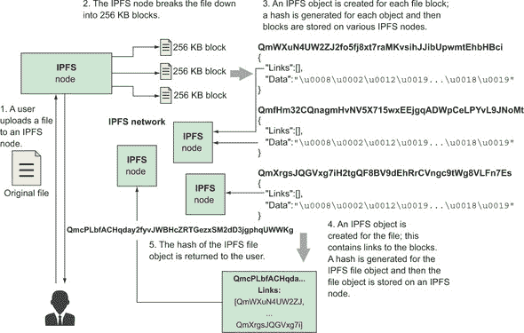

1.  每个块存储在不同的网络位置，并且在每个节点上维护一个索引，该索引持有块哈希和相应的网络位置之间的映射。您可能已经意识到内容以其自己的加密哈希键引用，正如 Swarm 平台的情况一样，因此您还可以将 IPFS 视为内容可寻址存储（CAS）。

考虑到内容以其哈希值引用，这种设计主要集中在高效管理不可变文件。例如，因为其哈希必须只指向一个网络位置，所以网络上只需要存在文档的一个副本，因此消除了重复。

但是，IPFS 也通过跟踪通过版本控制它们的变化来管理可变文档。当文件更改时，只需对其更改的块进行哈希、存储在网络上、索引，而未受影响的块将被重用。下载过程的工作流程显示在图 9.14 中。

以下是工作流程的详细步骤：

##### 图 9.14\。IPFS 文件下载过程：1\. 查询 IPFS 与某个 IPFS 文件对象哈希键关联的文件；2\. IPFS 客户端从相应的 IPFS 节点请求文件对象；3\. 请求的节点返回 IPFS 文件对象；4\. IPFS 客户端扫描 IPFS 文件对象 Links 属性上的每个链接；5\. 每个请求的 IPFS 节点返回相应的 IPFS 块对象；6\. 在提供请求的 IPFS 节点上重新组合原始文件，并将其返回给调用者。


1.  用户查询与某个 IPFS 文件对象哈希键关联的 IPFS 文件。

1.  IPFS 客户端通过在本地 IPFS 索引上查找来检索与提供的哈希键关联的 IPFS 文件对象的网络位置，然后从相应的 IPFS 节点请求文件对象。

1.  请求的节点返回 IPFS 文件对象。

1.  IPFS 客户端扫描 IPFS 文件对象 Links 属性下的每个链接。对于每个链接，它从本地索引中检索与 IPFS 对象键关联的网络位置，然后使用网络位置检索相应的 IPFS 块对象。

1.  每个请求的 IPFS 节点返回相应的 IPFS 块对象。

1.  原始文件在响应请求的 IPFS 节点上重新组合，然后返回给调用者。

与 Swarm 相反，IPFS 没有直接激励其 P2P 参与者为网络文件存储资源做出贡献，它依赖于基于比特币区块链的独立但相关的 FileCoin 计划来奖励活跃参与者。

如果你想要了解更多关于 IPFS 的信息，下载客户端并尝试一下[`ipfs.io/docs/getting-started/`](https://ipfs.io/docs/getting-started/)。我建议你也看看 Git 书籍《去中心化网络入门》，其中有很多关于如何安装 IPFS 客户端以及如何通过上传和下载文件等常见操作与网络互动并检查 IPFS 对象的教程：[`mng.bz/QQxQ`](http://mng.bz/QQxQ)。（点击绿色的阅读按钮访问内容。）

#### 9.4.4. Swarm 与 IPFS

在此阶段，你认为 Swarm 是否在复制 IPFS 的努力，正如一些去中心化网络成员所争论的那样？既然你已经了解了这两个去中心化内容管理基础设施，你可能自己可以判断 Swarm 计划是否值得。表 9.3（#ch09table03），总结了这两个平台的的主要特性，可能帮助你回答这个问题。

##### 表 9.3. Swarm 与 IPFS 对比

| 特性 | Swarm | IPFS |
| --- | --- | --- |
| 存储架构 | 去中心化 | 去中心化 |
| 网络架构 | P2P | P2P |
| 可访问存储内容 | 是 | 是 |
| 块/区块大小 | 4 KB | 256 KB |
| 与以太坊的本地集成 | 是 | 否 |
| 激励策略 | 内置 | 外部（通过 FileCoin） |

Swarm 平台的粉丝认为，其更小的区块大小，允许更低的传输延迟，以及与以太坊更深入的集成，本身就是 Swarm 存在的两个关键原因。你可以在各种论坛上找到 Swarm 与 IPFS 之间差异的进一步分析，例如以太坊问答论坛：[`mng.bz/Xg0p`](http://mng.bz/Xg0p)。

### 9.5. 通过预言机访问外部数据

传统的网络应用程序消耗各种外部服务，通常是通过执行 REST API 调用或调用遗留的 Web 服务。你可能会惊讶地听说这在 Dapp 世界是不可能的。按设计，以太坊合约不能访问外部资源。这是为了避免两组主要问题：

+   *信任问题*——参与者可能会对数据的真实性及其进入区块链前的潜在操纵持谨慎态度。

+   *技术问题*——数据提供者可能难以服务于来自以太坊网络的成千上万的并发请求，因此会妥协区块创建和验证过程。

您如何将外部数据引入智能合约，以便绕过以太坊基础设施施加的限制，并确信数据的 authenticity？ 通过预言机实现。简而言之，*预言机* 是区块链网络与外部世界之间的桥梁。它负责从外部数据提供者获取查询的数据，然后将其与一个 *真实性证明* 一同返回给请求合约。按照这种方式安排流程，您可以将预言机视为一个仅仅发挥促进作用的中间人。尽管它是一个集中点，但请求合约不需要信任预言机，因为预言机在没有使其与真实性证明（最终用户可以验证）无效的情况下，无法修改其返回的数据。（#ch09fig15）展示了典型预言机基础数据喂养解决方案的主要组成部分：

+   *合约*——执行查询以检索某些数据。

+   *预言机*——通过解决查询并从数据提供者获取数据，将合约连接到相关数据提供者。

    ##### 图 9.15. 预言机是区块链网络与外部世界之间的桥梁。它负责从外部数据提供者获取所需的数据，并将其与真实性证明一起返回给请求合约。

    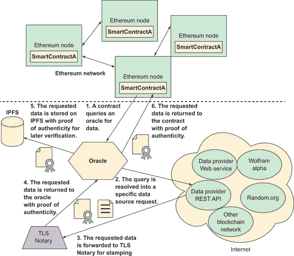

+   *一组数据源*——这些可能包括 REST API、遗留的 Web 服务、在线随机生成器或在线计算器，例如。

+   *TLSNotary*——该服务生成在线数据的加密真实性证明。

+   *IPFS 存储*——这是数据和真实性证明一起存储的地方，以供以后离线区块链验证，如有需要。

#### 9.5.1. 喂养预言机

您可以使用两种主要策略来喂养预言机，以便消费者相信其数据：

1.  *独立参与者可以喂养预言机*。在这种情况下，预言机通过共识模型聚合来自不同参与者的原始数据，然后将数据提供给消费者。

1.  *一个数据提供者可以喂养一个预言机*。在这种情况下，预言机向消费者提供原始数据的副本，并附有该数据的真实性证明。

##### Oracle 喂养独立参与者

当独立参与者喂养预言机时，经过共识生成的批准数据集，例如通过平均数值或选择最频繁的非数值。这种数据喂养方式，以去中心化的方式进行，并受到共识的约束，似乎很自然地符合去中心化应用程序的精神。但它有各种缺点：

+   可能需要大量的数据提供者来生成一个可靠的数据集。

+   预言机提供商依赖于数据提供者不断跟上新的数据请求。

+   所有的数据提供者可能期望得到支付，不管他们的数据质量如何。这可能会证明对预言机提供商来说很昂贵。

##### 由单一数据源提供的预言机

当一个单一的数据源喂养一个预言机时，它通过与数据真实性证明文档一起返回数据给客户端，从而展示暴露的数据是真实且未被篡改的。像 TLSNotary 这样的服务可以生成该文档，它基于各种技术，比如可审计的虚拟机和可信执行环境。

Oraclize 提供了从单一数据源喂养智能合约最受欢迎的框架之一。与由多个参与者喂养的预言机相比，这个解决方案有两个主要优点：

1.  Dapp 开发者和用户不需要信任 Oraclize，因为他们可以独立地通过合约代码内的链上验证和链下通过网络验证工具来验证数据的真伪。

1.  数据提供者不需要实现新的数据分发方式，除了他们当前的 Web 服务或 Web API，来喂养去中心化应用。

不多说了！我现在将向你展示如何构建你的第一个预言机消费者合约。

#### 9.5.2\. 使用 Oraclize 构建一个数据驱动的合约

如果你想要将一个合约连接到 Oraclize，你必须

+   导入一个名为 oraclizeAPI.sol 的 Solidity 文件，可以从 Oraclize GitHub 仓库获取

+   继承你的合约自一个叫做 usingOraclize 的基合约

你的合约，如图 9.3 所示的示例预言机（来自 Oraclize 文档），应该包含

+   一个或多个*状态变量*，持有请求的外部数据的最新副本；在这个例子中，ETHXBT（以太坊对比特币的汇率）

+   一个`update()`函数，终端用户可以调用它通过请求 Oraclize 来刷新外部数据的本地副本。

+   一个名为`__callback`的回调函数，它从 Oraclize 产生的结果交易中被调用

##### 列表 9.3\. 通过 Oraclize 从 Kraken 交易所获取 ETHXBT 率的合约

```
pragma solidity ⁰.4.0;
import "github.com/oraclize/ethereum-api/
 oraclizeAPI.sol";                                         *1*

contract KrakenPriceTicker is usingOraclize {                *2*

    string public ETHXBT;                                    *3*

    event newOraclizeQuery(string description);              *4*
    event newKrakenPriceTicker(string price);                *5*

    function KrakenPriceTicker() {                           *6*
        oraclize_setProof(proofType_TLSNotary 
            | proofStorage_IPFS);                            *7*
        update();                                            *8*
    }

    function __callback(bytes32 myid, 
        string result, bytes proof) {                        *9*
        if (msg.sender != oraclize_cbAddress()) throw;
        ETHXBT = result;                                     *10*
        newKrakenPriceTicker(ETHXBT);                        *11*
        update();                                            *12*
    }

    function update() payable {                              *13*
        if (oraclize.getPrice("URL") > this.balance) {       *14*
            newOraclizeQuery("Oraclize query was NOT sent, 
 please add some ETH to cover for the query fee");
        } else {

            newOraclizeQuery("Oraclize query was sent, 
 standing by for the answer..");
            oraclize_query(60, "URL",
      "json(https://api.kraken.com/0/public/Ticker?pair=ETHXBT).result.XETHXXB
      T.c.0");                                                *15*
        }
    }

} 
```

+   ***1*** **从他们的 GitHub 仓库导入 Oraclize 客户端代码**

+   ***2*** **继承自基合约 usingOraclize**

+   ***3*** **持有外部数据的状态变量：从 Kraken 获取的以太坊对比特币的汇率**

+   ***4*** **记录事件，事件表明数据查询是否已发送给 Oraclize**

+   ***5*** **记录事件，表明 Oraclize 是否已返回请求的数据**

+   ***6*** **合约构造函数**

+   ***7*** **指定请求的数据应伴随 TLSNotary 证明，并且证明应该存储在 IPFS 上**

+   ***8*** **在合约创建时设置 ETHXBT 状态变量**

+   ***9*** **当 Oraclize 将请求的数据返回给合约时调用的回调**

+   ***10*** **用 Oraclize 返回的值更新 ETHXBT 状态**

+   ***11*** **记录 Oraclize 返回的请求数据**

+   ***12*** **触发新的更新，使合约持续刷新 ETHXBT**

+   ***13*** **触发 ETHXBT 的更新，如前所述，可以由终端用户或内部调用**

+   ***14*** **检查合约是否有足够的以太币资助向 Oraclize 的数据请求**

+   ***15*** **向 Oraclize 的数据请求查询**

##### Oraclize 数据请求

仔细观察更新方法中向 Oraclize 引擎的数据请求：

```
oraclize_query(60, "URL",
     "json(https://api.kraken.com/0/public/Ticker?pair=ETHXBT)
.result.XETHXXBT.c.0");
```

数据请求是通过调用`oraclize_query()`函数实现的，该函数继承自`usingOraclize`基合约，并带有如图 9.16 所示的一组参数：

+   *请求延迟*—在检索数据之前应等待的秒数（也可以是一个未来的绝对时间戳）

+   数据源类型*—Oraclize 支持各种数据源类型，但我们主要关注以下类型：

    +   *URL*—网站或 HTTP API 端点

    +   *IPFS*—IPFS 文件的标识符（内容哈希）

+   *查询*—这是一个单独的参数或参数数组，其值取决于数据源类型。例如，对于 URL 类型的请求，如果您只提供一个参数（数据源的 URL），则假设这是一个 HTTP GET 请求。如果您提供两个参数，第二个参数被认为是 HTTP POST 请求的正文。对于 IPFS 类型的请求，您应该提供的唯一参数是 IPFS 内容哈希。

##### 图 9.16. `oraclize_query()`参数


正如您在图 9.16 中所看到的，结果通过结果解析器从查询中提取，这取决于被调用数据源的性质。 表 9.4 总结了支持的解析器。

##### 表 9.4. Oraclize 查询结果解析器

| 解析器类型 | 解析器标识符 | 描述 |
| --- | --- | --- |
| JSON 解析器 | json | 将结果转换为 JSON 对象，您可以从中提取特定的属性 |
| XML 解析器 | xml | 通常用于解析遗留的 Web 服务结果 |
| HTML 解析器 | html | 适用于 HTML 抓取 |
| 二进制助手 | binary | 使用 slice(offset, length)从二进制结果中提取项目 |

##### 结果回调函数

既然你已经学会了如何进行数据请求，我们将看看 Oraclize 引擎是如何响应结果的。正如你在图 9.15 中看到的，当处理请求时，Oraclize 引擎从相关数据源抓取结果，然后它创建一个结果交易，将其发送回以太坊网络。这个交易也被称为*Oraclize 回调交易*，因为在其执行过程中，它通过调用其`__callback`函数来回调进行请求的预言合约：

```
    function __callback(bytes32 myid, string result, bytes proof) {
        if (msg.sender != oraclize_cbAddress()) throw;
        ETHXBT = result;
        newKrakenPriceTicker(ETHXBT);
        update();
    }
```

当你从结果交易中调用`__callback`函数时，ETHXBT 状态变量的值会更新。然后你可以在代码的其余部分使用它。

#### 9.5.3. 运行数据感知合约

如果你想要运行来自列表 9.3 的数据意识合约，你需要 Oraclize Remix 插件，它直接引用了 oraclizeAPI.sol 文件，包括使用来自 GitHub 的 Oraclize 合约：http://mng.bz/y1ry。

会出现一个对话框，警告“Remix 即将加载位于 https://remix-plugin.oraclize.it 的“Oraclize”扩展。您确定要加载这个外部扩展吗？”点击确定。

我鼓励你尝试一下 KrakenPriceTicker.sol，你可以在屏幕左侧的 Gist 菜单中找到它，已经设置好了（Gist > KrakenPriceTicker）。在运行它之前

+   检查并确保在 Solidity 版本面板（在设置选项卡中）中的编译器版本设置为 0.4.24+commit.e67f0147。

+   检查并确保环境设置为 JavaScript VM（在运行选项卡上）。

这样做之后，执行以下操作：

1.  打开运行标签并点击部署。

1.  点击 KrakenPriceTicker 下拉菜单，位于底部的已部署合约面板中。

1.  点击更新。（如果你想要模拟合约调用的行为，你也可以在屏幕顶部的值字段设置，例如设置为 20 Finney，但在 Remix 中这并不必要。）此时，ETHXBT 的值得到更新。

1.  点击 ETHXBT 按钮查看汇率值。

### 9.6. Dapp 框架和 IDE

可以通过四种工具类别来改善 Dapp 开发周期：

+   开发 IDE

+   开发框架

+   测试框架

+   Web UI 框架

#### 9.6.1. 开发 IDE

开发 IDE 和开发框架是帮助您加快开发周期的工具。尽管 IDE 和开发框架提供类似的功能，但前者更专注于代码编辑和编译，而后者提供了强大的部署能力。

在几个月的时间里，以太坊工作室似乎是开发以太坊 Dapps 的事实上的 IDE，因为它提供了良好的代码编辑能力，集成了 Web3，并具有平滑的合约部署功能。但是随后，以太坊背后的公司 ether.camp 停止了对它的支持。因此，建议开发者转而使用通用代码编辑工具，如 Sublime、Atom、Visual Studio Code、Vi 和 Emacs，并配置了相关的 Solidity 插件。

#### 9.6.2. 开发框架

以太坊开发框架的目的是简化开发周期，让开发者能够专注于编写代码，而不是花费大部分时间编译、重新部署和手动重新测试它。

自以太坊平台推出以来，出现了各种第三方的智能合约框架：

+   Truffle

+   Populus

+   Dapp（原名 Dapple）

+   Embark

##### Truffle

Truffle 可能是最先进的以太坊开发框架，它主要专注于简化 Solidity 合约的构建、测试、打包和部署。它作为 Node.js 包分发并提供一个 REPL 控制台。

Truffle 的主要卖点是迁移——这个框架管理智能合约部署的脚本和配置的方式。这是您在接下来的几章中将会使用的框架。

##### Populus

Populus 在功能上与 Truffle 相似，它旨在通过在特定文件结构下工作的智能合约项目来简化编译-测试-部署周期。它提供了配置管理，使您能够顺利地从 Ganache 之类的内存区块链，过渡到私有内部网络，最终过渡到公共网络。Populus 与其他框架相比的独特之处在于，它允许开发者在 Python 中编写单元测试或部署说明。

##### Embark

Embark 旨在成为一个与平台无关的 Dapp 框架，以简化任何去中心化应用程序的开发和部署。这个框架简化了多合约 Dapp 的管理，并且您可以配置它在检测到代码更改时自动部署合约。它通过 IPFS 协议（和 Swarm）支持去中心化存储，并通过 Whisper 协议支持去中心化消息传递。

##### Dapp

Dapp 框架主要面向 Linux 世界，并通过 Nix 包管理器分发。这个框架的重点是按照以太坊智能合约打包规范（[`github.com/ethereum/EIPs/issues/190`](https://github.com/ethereum/EIPs/issues/190)）对合约打包以及通过 IPFS 协议进行合约代码存储的去中心化，我们在第 9.4 节中介绍了 IPFS 协议。Dapp 还通过 ethrun 和 ds-test 提供单元测试设施。

决定采用哪个开发框架可能很困难，因为所有这些框架都提供类似的编译-测试-部署功能，尽管以略微不同的方式提供。听起来可能很显然，但确定哪个最适合您需求的最佳方式是尝试它们全部。

由于以太坊平台倾向于 JavaScript，因此几个通用的 JavaScript 框架自然成为了以太坊生态系统的常见特征。让我们看看为什么您应该考虑在您的开发环境中包括 JavaScript 测试和 UI 框架。

#### 9.6.3. 测试框架

使用通用的 JavaScript 测试框架（例如 Truffle 或 Embark 的单元测试功能），提供了

+   更高级的单元测试功能，例如，支持异步调用、连续集成系统的退出状态值、超时处理、测试用例的元生成以及更多关于断言库使用的扩展性。

+   更好的系统测试自动化：您可以通过私有或公共测试网络自动化涉及端到端交互的测试，并且它们可以处理超时、重试以及与智能合约通信的其他用例。

开发去中心化应用程序最流行的两个 JavaScript 单元测试框架是 Mocha 和 Jasmine，您将在接下来的几章中使用 Mocha。现在让我们转向 Web UI 框架。

#### 9.6.4\. Web UI 框架

尽管 UI 是 Dapp 的一个重要组成部分，因为它将最终用户与后端智能合约连接起来，但以太坊平台尚未完全支持任何技术来开发以太坊应用程序的展示层。因为您可以在纯 html5 网页的 JavaScript 中包含和引用 web3.js，所以通过网页暴露 Dapp 似乎是一个简单的途径。

由于优秀的前端 JavaScript 框架众多，很难推荐任何一个特定的框架。但值得一提的是，像 Meteor、Angular、Vue 以及最近兴起的 React 等框架在以太坊社区中越来越受欢迎。就我们而言，我们将坚持使用基于纯 HTML 和 JavaScript 的简约解决方案，但随意使用您选择的框架来美化 UI 代码。

### 总结

+   前几章介绍了对以太坊生态系统的一个受限视图，限于以下内容：

    +   **核心基础设施组件**—Go Ethereum (geth)客户端、以太坊钱包、MetaMask 和 Ganache

    +   **核心开发工具**—Solidity（EVM 智能合约语言）、Remix（在线 Solidity IDE）、solc（Solidity 编译器）、JSON-RPC（低级以太坊客户端 API）、Web3.js（用 JavaScript 编写的的高级以太坊客户端 API）、Node.js（非以太坊特定的 JavaScript 运行时）

+   以太坊生态系统包括一组更广泛的基础设施组件，如 ENS（用于去中心化名称解析到地址）、Swarm 和 IPFS（用于去中心化内容存储）、Whisper（用于去中心化消息传递）、预言机（用于从公共基于 web 的数据提供商导入数据）以及 Infura（用于托管以太坊节点）。

+   以太坊名称服务（ENS），也称为 ENS，提供了一种去中心化和安全的方式来通过人类可读的域名引用资源地址，如账户和合约地址。它的目标与互联网 DNS 类似。

+   将相对较大的内容存储在区块链上是不推荐的，因为这既笨拙又昂贵。一个更好的解决方案是使用去中心化存储系统，如 Swarm 和 IPFS。

+   Swarm 基于以太坊技术栈，并且对以太坊网络有感知，通常它是存储可以基于加密哈希标识符在以太坊区块链上引用的离链内容的偏好解决方案。

+   IPFS 是一种内容存储的技术中立协议，提供了一个更广为人知且经过测试的解决方案，代价是性能较差和与以太坊的集成不够紧密。

+   预言机，如 Oraclize，允许智能合约从以太坊网络之外的来源导入数据，并伴随有真实性的证明。

+   以太坊生态系统还包括一套更广泛的开发工具，如 Truffle，主要的智能合约框架；通用的 JavaScript 测试框架，如 Mocha 和 Jasmine；以及 JavaScript 网页用户界面框架，如 Angular、ReactJS 和 Meteor。

## 第十章. 使用 Mocha 对智能合约进行单元测试

|  |
| --- |

**本章内容概述**

+   安装并设置 Mocha，一个 JavaScript 单元测试框架

+   使用 Mocha 对`SimpleCoin`进行单元测试

+   编写执行负检查的测试，验证预期异常是否被抛出

+   编写执行正检查的测试，验证逻辑成功执行

|  |
| --- |

在前面的章节中，你已经学习了如何使用平台提供的简单工具来开发一个以太坊 Dapp。你能够通过一些努力，构建一个端到端的 Dapp，包括一个简单的网页用户界面和一个智能合约层（包括库），并将其部署到公共测试网络。你通过 Remix 甚至纯文本编辑器编写了 Solidity 和 Web3.js 代码，并最初在 geth 控制台，后来在 Node.js 上手动启动了简单的部署脚本。

虽然这种开发 Dapp 的方式在学习时是可以接受的，但当你开始花更多时间开发去中心化应用，尤其是如果你是专业做这行的话，这种方式并不高效。正如你在专门介绍以太坊生态系统的章节中学到的，有各种第三方开发工具可供选择，以提高代码编辑能力，帮助你单元测试你的合约并加快开发周期。

在本章中，我将介绍 Mocha，一个 JavaScript 单元测试框架，它将允许你轻松自动化你的合约的单元测试。在下一章中，你将学习如何设置 Truffle，通过它你将自动化你的 Dapp 的构建和部署。最后，你还将把 Mocha 测试集成到 Truffle 中，使它成为你的完全集成的开发环境。

你将通过编写一个针对`SimpleCoin`的单元测试套件来学习 Mocha。在开始之前，我会简要地告诉你如何安装这个框架并设置工作目录。

### 10.1. 安装 Mocha

Mocha 是通过 Node.js 执行的，所以你必须使用`npm`来安装它。因为你要为各种智能合约编写测试，全局安装是最好的。（根据你的安全配置，你可能需要以管理员身份运行它。）以下是安装步骤：

```
c:\>npm install --global mocha
```

这就完成了！下一步是为你自己的`SimpleCoin`测试准备一个工作目录。

### 10.2. 在 Mocha 中设置 SimpleCoin

你应该将针对以太坊智能合约的测试放置在一个为 Node.js 配置好的工作目录中，并设置有以太坊包如 Web3 和 Ganache。为你要写的`SimpleCoin`单元测试创建一个工作目录。我创建的我的目录是 C:\Ethereum\mocha\SimpleCoin。

现在在这个文件夹中为 Node.js 创建一个 package.json 配置文件，并将测试脚本设置为 Mocha，如下面的列表所示。

##### 列表 10.1. package.json

```
{
  "name": "simple_coin_tests",
  "version": "1.0.0",
  "description": "unit tests for simple coin",
  "scripts": {
    "test": "mocha"
  }
}
```

你也可以通过打开一个操作系统终端，移动到你创建的工作目录，并运行以下命令来交互式地创建它：

```
C:\Ethereum\mocha\SimpleCoin>npm init
```

一旦你创建了目录和配置文件，你可以快速尝试 Mocha 如何执行测试。创建一个 dummyTests.js 文件，包含下面列表中的示例测试。

##### 列表 10.2\. dummyTests.js

```
var assert = require('assert');                               *1*
describe('String', function() {                               *2*
  describe('#length()', function() {                          *3*
    it('the length of the string "Ethereum" should be 8', 
      function() {                                            *4*
      assert.equal(8, 'Ethereum'.length);                     *5*
    });
  });
});
```

+   ***1*** **导入默认的断言库**

+   ***2*** **命名测试套件**

+   ***3*** **命名被测试的功能**

+   ***4*** **描述具体的测试**

+   ***5*** **实际测试**

你可以按照以下方式运行这个测试文件：

```
C:\Ethereum\mocha\SimpleCoin>npm test dummyTests.js
```

然后你会得到这个输出：

```
> simple_coin_tests@1.0.0 test C:\Ethereum\mocha\SimpleCoin
> mocha "dummyTests.js"

  String
    #length()
      √the length of the string "Ethereum" should be 8

  1 passing (9ms)
```

正如你可能注意到的，测试脚本顶部引用的断言库是框架提供的默认断言库。如果你愿意，你可以安装并引用以下断言框架中的任何一个：

+   应该.js ([`shouldjs.github.io/`](https://shouldjs.github.io/))

+   期望.js ([`github.com/Automattic/expect.js/`](https://github.com/Automattic/expect.js/))

+   Chai.js ([www.chaijs.com/](http://www.chaijs.com/))

+   更好的断言([`github.com/tj/better-assert`](https://github.com/tj/better-assert))

+   意外的([`github.com/unexpectedjs/unexpected`](https://github.com/unexpectedjs/unexpected))

测试工作目录几乎准备好了。在你可以用它来测试智能合约之前，你必须安装以下节点包：solc、Web3 和 Ganache。如果你还没有全局安装它们，你可以按照以下方式进行安装：

```
C:\>npm install -g solc
C:\>npm install -g web3@0.20.0
C:\>npm install -g ganache-cli@6.1.8
```

另外，你也可以像以下方式只在测试目录中安装这些包：

```
C:\Ethereum\mocha\SimpleCoin>npm install solc
C:\Ethereum\mocha\SimpleCoin>npm install web3@0.20.0
C:\Ethereum\mocha\SimpleCoin>npm install ganache-cli@6.1.8
```

### 10.3\. 为 SimpleCoin 编写单元测试

你已经准备好用`SimpleCoin`编写一些测试了。现在，我将向你展示如何在 Mocha 中单元测试一个 solidity 合约。这并不是一个关于单元测试的教程，尽管如此，但我将假设你已经具备单元测试的基本知识或经验。如果你对单元测试一无所知，但希望了解更多关于这个主题的信息，我可以推荐两本非常好的书籍，它们将为你打下坚实的基础：由 Lasse Koskela 编写的《Effective Unit Testing》和由 Michael Feathers 和 Robert C. Martin 合著的《The Art of Unit Testing》，这两本书都由 Manning 出版。

你将针对`SimpleCoin`扩展版本提供的功能创建测试，这个版本是在第五章中实现的。我重复了下一个列表中的内容，以便你的方便，你可以将其放在以下文件中：c:\Ethereum\mocha\SimpleCoin\SimpleCoin.sol。

##### 列表 10.3\. SimpleCoin.sol，来自第五章的最新代码

```
pragma solidity ⁰.4.24;
contract SimpleCoin {
    mapping (address => uint256) public coinBalance;
    mapping (address => mapping (address => uint256)) public allowance;
    mapping (address => bool) public frozenAccount;
    address public owner;

    event Transfer(address indexed from, address indexed to, uint256 value);
    event FrozenAccount(address target, bool frozen);

    modifier onlyOwner {
        require(msg.sender == owner);
        _;
    }

    constructor(uint256 _initialSupply) public {
        owner = msg.sender;
        mint(owner, _initialSupply);   
    }

    function transfer(address _to, uint256 _amount) public {
        require(coinBalance[msg.sender] > _amount);
        require(coinBalance[_to] + _amount >= coinBalance[_to] );
        coinBalance[msg.sender] -= _amount;  
        coinBalance[_to] += _amount;   
        emit Transfer(msg.sender, _to, _amount);  
    }  

    function authorize(address _authorizedAccount, uint256 _allowance)
        public returns (bool success) {
        allowance[msg.sender][_authorizedAccount] = _allowance;
        return true;
    }

    function transferFrom(address _from, address _to, uint256 _amount) 
        public returns (bool success) {
        require(_to != 0x0);                             
        require(coinBalance[_from] > _amount); 
        require(coinBalance[_to] + _amount >= coinBalance[_to] ); 
        require(_amount <= allowance[_from][msg.sender]);     
        coinBalance[_from] -= _amount;                          
        coinBalance[_to] += _amount;                         
        allowance[_from][msg.sender] -= _amount;
        emit Transfer(_from, _to, _amount);
        return true;
    }

    function mint(address _recipient, uint256  _mintedAmount) 
        public onlyOwner {
        coinBalance[_recipient] += _mintedAmount;
        emit Transfer(owner, _recipient, _mintedAmount);
    }

    function freezeAccount(address target, bool freeze) 
        public onlyOwner  {
        frozenAccount[target] = freeze; 
        emit FrozenAccount(target, freeze);
    }
}
```

#### 10.3.1\. 测试计划

对 Solidity 合约进行单元测试意味着验证合约公开的所有方法，包括合约构造函数，是否如预期那样运行，既包括有效的输入也包括无效的输入。首先，我会帮助你验证构造函数是否按照预期初始化了合约。你会通过正确设置合约所有者的值和根据执行部署交易所用的账户以及传递给构造函数参数的值来设置初始状态来实现。

然后我会展示给你一系列针对任何合约函数所需的典型正面和负面检查的测试。所谓*正面*检查是指验证成功逻辑执行的检查：一个被授权用户调用，并传递所有修饰符定义的约束内有效输入的合约函数，且输入被函数逻辑接受，能够成功执行。

我所说的*负面*检查是指那些验证未授权调用者或无效输入时预期抛出异常的检查：

+   一个通过修饰符限制为特定调用者的合约函数，如果调用者没有权限调用它，将抛出预期异常。

+   一个合约函数如果接收到不符合额外修饰符或`require`条件定义的其他约束的输入，将抛出预期异常。

一旦你熟悉了这类测试，你就能针对任何合约函数编写测试了。你可以从测试`SimpleCoin`的构造函数开始。在研究这个的过程中，我也会给你一个关于如何初始化和结构化你的测试的一般性建议。

#### 10.3.2 单元测试构造函数

正如你所知，测试代码意味着执行被测试的代码，然后验证关于应该发生的事情的假设。你只在合约部署时执行合约构造函数的代码，所以你的测试必须部署`SimpleCoin`，然后验证构造是否正确执行，具体是通过检查以下内容：

+   合约所有者与部署交易的发件人同一账户。

+   合约所有者的代币余额与传递给构造函数的初始供应量相同。

单元测试通常应尽可能快速运行，因为你很可能在开发周期内多次执行它们。在企业应用中，延迟的主要来源是访问环境资源，如文件系统、数据库和网络。最常见减少或消除此类延迟的方式是使用隔离（或模拟）框架来模拟对这些资源的访问，如 Java 应用的 jMock 和 EasyMock，以及.net 应用的 Moq、NMock 和 Rhino Mocks。

当涉及到 Ethereum Dapp 时，延迟的主要来源是交易处理（包括挖掘和区块创建）以及区块在整个 Ethereum 网络中的传播。因此，自然地，我们会在类似 Ganache 这样的 mock 网络上对合约进行单元测试，这种网络模拟了 Ethereum 平台的某些基础设施方面，而没有连接到它。

这意味着你的第一个测试，针对`SimpleCoin`的构造函数，必须在 Ganache 上部署`SimpleCoin`，然后执行我描述过的功能检查（关于合约所有者和所有者账户余额）。实际上，为了确保测试之间没有干扰，每个测试都将从零开始重新部署`SimpleCoin`。

将`SimpleCoin`部署到 Ganache 上... 等等—你已经在第八章做过这个了！第八章你可以将列表 8.5 用于单元测试。你可以将脚本几乎保持原样，直到`SimpleCoinContractFactory`的实例化。唯一的修改是`SimpleCoin.sol`的路径，现在是 c:\Ethereum\mocha\SimpleCoin。以下是脚本：

```
const fs = require('fs');
const solc = require('solc');
const Web3 = require('web3');
const web3 = new Web3(
   new Web3.providers.HttpProvider("http://localhost:8545"));
var assert = require('assert');

const source = fs.readFileSync(
   'c:/Ethereum/mocha/SimpleCoin/SimpleCoin.sol', 
   'utf8');                                             *1*
const compiledContract = solc.compile(source, 1);
const abi = compiledContract.contracts[':SimpleCoin'].interface;

const bytecode = '0x' + compiledContract.contracts[':SimpleCoin'].bytecode;
const gasEstimate = web3.eth.estimateGas({ data: bytecode }) + 100000;

const SimpleCoinContractFactory = web3.eth.contract(JSON.parse(abi));
```

+   ***1*** **simplecoin.sol 的位置现在在 c:/Ethereum/mocha/SimpleCoin。**

现在你已经处理了第一个测试的基础设施（非功能性）部分，可以专注于其功能性部分了。不过，请记住，脚本最初的这几行还没有部署`SimpleCoin`；它们只是实例化了合约工厂。

遵循列表 10.2 中 mock 测试的模式，你可以通过 Mocha 的`describe()`和`it()`语句开始记录你第一个测试的目的：

```
describe('SimpleCoin', function() {                    *1*
  describe('SimpleCoin constructor', function() {      *2*
    it('Contract owner is sender', function(done) {    *3*
    ...
    });
  });
});
```

+   ***1*** **描述你正在创建的整个测试套件**

+   ***2*** **描述你的第一个测试部分，关注 SimpleCoin 的构造函数**

+   ***3*** **描述你的第一个测试**

是时候编写你第一个测试的核心部分了，它将如我之前所述，检查合约所有者是否与部署交易的发送者是同一个账户。你可以用*AAA 布局*来结构化测试，包括以下三个部分，也如图 10.1 所示：

+   *Arrange*—为被测试函数设置输入并实例化测试所需的对象

+   *Act*—调用被测试函数

+   *Assert*—验证测试假设

```
describe('SimpleCoin', function() {
  this.timeout(5000);
  describe('SimpleCoin constructor', function() {
    it('Contract owner is sender', function(done) {
        //arrange 
        let sender = web3.eth.accounts[1];                        *1*
        let initialSupply = 10000;                                *1*

         //act
         let simpleCoinInstance = 
              SimpleCoinContractFactory.new(initialSupply, {      *2*
              from: sender, data: bytecode, gas: gasEstimate}, 
              function (e, contract){ 
              if (typeof contract.address !== 'undefined') {
                    //assert
                    assert.equal(contract.owner(), sender);       *3*

                    done();                                       *4*
              }
        });
    });
 });
});
```

+   ***1*** **此测试的输入是部署交易的发送者和初始供应量。**

+   ***2*** **通过合约部署触发被测试函数，即 SimpleCoin 的构造函数**

+   ***3*** **在成功部署后，验证合约所有者是交易发送者**

+   ***4*** **向 Mocha 示意测试完成**

##### 图 10.1 AAA 测试单元典型结构：Arrange（设置测试输入和被测试对象）；Act（调用被测试函数）；Assert（验证测试预期结果）

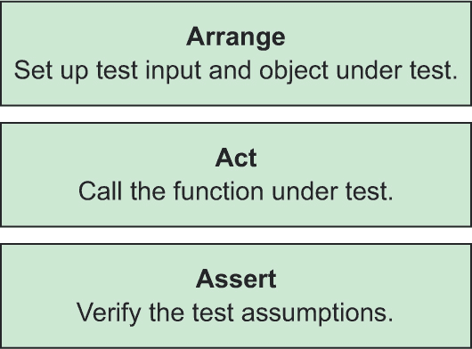

你现在准备好运行你的第一个单元测试，完整的测试代码如下所示。你可以将此脚本放在以下文件中：c:\Ethereum\mocha\SimpleCoin\SimpleCoinTests.js。

##### 列表 10.4。SimpleCoinTests.js

```
const fs = require('fs');
const solc = require('solc');
const Web3 = require('web3');
const web3 = new Web3(
   new Web3.providers.HttpProvider("http://localhost:8545"));
var assert = require('assert');

const source = fs.readFileSync(
   'c:/Ethereum/mocha/SimpleCoin/SimpleCoin.sol', 'utf8');
const compiledContract = solc.compile(source, 1);
const abi = compiledContract.contracts[':SimpleCoin'].interface;
const bytecode = '0x' + compiledContract.contracts[':SimpleCoin'].bytecode;
const gasEstimate = web3.eth.estimateGas({ data: bytecode }) + 100000;

const SimpleCoinContractFactory = web3.eth.contract(JSON.parse(abi));

describe('SimpleCoin', function() {
  this.timeout(5000);
  describe('SimpleCoin constructor', function() {
    it('Contract owner is sender', function(done) {
        //arrange 
        let sender = web3.eth.accounts[1]; 
        let initialSupply = 10000; 

        //act
        let simpleCoinInstance = SimpleCoinContractFactory.new(initialSupply, {
            from: sender, data: bytecode, gas: gasEstimate}, 
            function (e, contract){ 
            if (typeof contract.address !== 'undefined') {
                    //assert
                    assert.equal(contract.owner(), sender);
                    done();
            }
        });
    });
 });
});
```

在运行脚本之前，打开一个新的控制台并启动 Ganache：

```
c:\>ganache-cli
```

现在回到你之前执行伪测试的控制台，并运行你的新测试脚本：

```
C:\Ethereum\mocha\SimpleCoin>npm test SimpleCoinTests.js
```

你会看到类似于图 10.2 的输出。

##### 图 10.2。你的第一个 Mocha 测试的输出，显示测试套件的名称、测试部分的名称以及你个别测试的描述。测试通过！

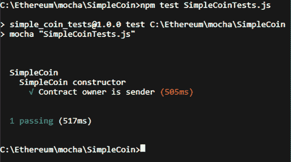

测试通过，这意味着合同所有者确实是部署交易的发送者。好消息！你可以继续下一个测试。

在离开构造函数之前，你应该测试合同所有者的余额是否等于通过`initialSupply`参数提供的初始供应量。在`SimpleCoin`构造函数的`describe()`部分添加以下`it()`块：

```
it('Contract owner balance is equal to initialSupply', function(done) {
    //arrange 
    let sender = web3.eth.accounts[1];
    let initialSupply = 10000;

    //act
    let simpleCoinInstance = SimpleCoinContractFactory.new(initialSupply, {
        from: sender, data: bytecode, gas: gasEstimate},
        function (e, contract){
            if (typeof contract.address !== 'undefined') {
                //assert
                assert.equal(
                  contract.coinBalance(contract.owner()), 
                  initialSupply);            *1*
                done();
                }
     });
});
```

+   ***1*** 这是与之前测试不同的唯一一行。它验证合同所有者的余额是否等于初始供应量。

|  |
| --- |

##### 注意

你可能会想知道为什么我没有在之前的测试中添加同样的断言行。通常，保持每个单元测试专注于一个特定事物是个好习惯。鉴于这个测试与验证合同所有权无关，我决定创建一个完全独立的测试。正如我之前提到的，你也应该将每个测试完全隔离，以避免可能使无关测试无效的交叉依赖和副作用。这就是为什么你应该在每次测试都重新部署`SimpleCoin`的原因——这样做，你可以确信测试是真正隔离的。

|  |
| --- |

现在重新运行测试脚本：

```
C:\Ethereum\mocha\SimpleCoin>npm test SimpleCoinTests.js
```

从图 10.3 的输出中可以看出，两个测试都通过了。此外，如果你查看 Ganache 控制台，你可以验证在运行这个测试会话时，`SimpleCoin`确实部署了两次——一次用于每个测试，如图 10.4 所示。

##### 图 10.3。包括两个构造函数测试的修订测试套件。两个都通过了。

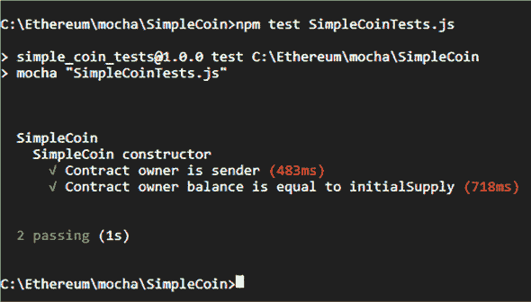

##### 图 10.4。测试执行期间的 Ganache 输出。每次测试执行都会重新部署`SimpleCoin`。

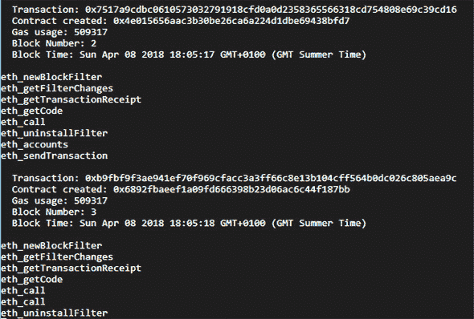

#### 10.3.3。测试是否只有授权的调用者可以调用一个函数

我们现在将转到通常针对每个合同函数编写的一组测试。如果你查看列表 10.3，你会注意到`mint()`和`freezeAccount()`通过`onlyOwner`修改器限制它们的执行仅限于合同所有者：

```
function mint(address _recipient, uint256  _mintedAmount) 
    onlyOwner public {
       ...
function freezeAccount(address target, bool freeze) 
    onlyOwner public { 
```

对于这些函数，你应该编写的一个测试是验证如果尝试从不是合同所有者的账户调用它们，是否会抛出异常。以下是针对`mint()`编写此类测试的方法：

```
  describe('mint', function() {
     it('Cannot mint from non-owner account', function(done) {
        //arrange 

        let sender = web3.eth.accounts[1];                         *1*
        let initialSupply = 10000;

        let minter = web3.eth.accounts[2];                         *2*
        let recipient = web3.eth.accounts[3];
        let mintedCoins = 3000;

        let simpleCoinInstance = simpleCoinContractFactory
            .new(initialSupply, {
                  from: sender, 
                  data: bytecode, 
                  gas: gasEstimate},                               *1*
                function (e, contract){
                    if (typeof contract.address !== 'undefined') {
                        //act and assert
                        assert.throws(                             *3*
                           ()=> {
                              contract.mint(recipient, mintedCoins,
                                  {from:minter,
                                   gas:200000});                   *2*
                           },
                           /VM Exception while processing transaction/
                        );
                        done();
                    }
            });
     });
});
```

+   ***1*** **合约交易的发送者（合约所有者）**

+   ***2*** **调用 mint()的账户不是合约所有者。**

+   ***3*** **验证当调用 mint()时抛出了异常，因为 mint()的调用者不是合约所有者**

正如你所见，你通过以下断言语句来验证调用函数时是否抛出异常：

```
assert.throws(
       ()=> contract.functionBeingTested(),
     /Expected exception/
);
```

你将在接下来的几节中多次使用这个技术。

#### 10.3.4。测试输入约束是否满足

即使调用者被授权调用函数，他们也必须为其提供有效输入。你应该验证，如果他们不这样做，任何违反函数修饰符或 require 条件的异常都会被抛出。

回想一下，`transfer()`函数在执行代币转移之前通过各种`require`语句进行输入验证：

```
    function transfer(address _to, uint256 _amount) public {
        require(_to != 0x0); 
        require(coinBalance[msg.sender] > _amount);
        require(coinBalance[_to] + _amount >= coinBalance[_to] );
        coinBalance[msg.sender] -= _amount;  
        coinBalance[_to] += _amount;   
        Transfer(msg.sender, _to, _amount);  
    }
```

理想情况下，你应该为每个`require`语句编写一个测试。我会向你展示如何针对第二个`require`语句编写测试：

```
require(coinBalance[msg.sender] > _amount);
```

这个约束防止发送者发送比他们自己拥有的更多的代币。如果他们试图这样做，会抛出异常。你可以通过使用前面看到的相同的`assert.throws`语句来验证这种情况是否发生：

```
describe('transfer', function() {
  it('Cannot transfer a number of tokens higher than that of tokens owned', 
    function(done) {
     //arrange 
     let sender = web3.eth.accounts[1];
     let initialSupply = 10000;
     let recipient = web3.eth.accounts[2];
     let tokensToTransfer = 12000;                             *1*

     let simpleCoinInstance =
       SimpleCoinContractFactory.new(initialSupply, {
         from: sender, data: bytecode, gas: gasEstimate}, 
         function (e, contract){
           if (typeof contract.address !== 'undefined') {
           //act and assert
           assert.throws(                                      *2*
            ()=>{
               contract.transfer(recipient, tokensToTransfer, {
               from:sender, gas:200000});
            },
            /VM Exception while processing transaction/        *3*
           );
           done();
          }
       });
    });
});
```

+   ***1*** **设置的转让金额高于当前余额**

+   ***2*** **验证抛出了异常**

+   ***3*** **预期的异常**

`transfer()`函数还有两个其他的`require`语句。我鼓励你为它们编写类似的测试。

#### 10.3.5。从授权账户进行有效输入的调用测试

在你编写进行负检查的测试，这样你就可以确信没有未经授权的账户或账户输入无效时调用函数，是时候编写一个正面的测试，证明当授权账户调用函数并为其提供有效输入时逻辑成功执行了。例如，你可以针对`transfer()`函数编写一个新测试，处理成功的代币转账。在这种情况下，你必须验证发送者账户的余额已经减少了转账金额，而接收者账户的余额已经增加了相同的金额：

```
it('Successful transfer: final sender and recipient balances are correct', 
  function(done) {
    //arrange 
    let sender = web3.eth.accounts[1];
    let initialSupply = 10000;
    let recipient = web3.eth.accounts[2];
    let tokensToTransfer = 200;                         *1*

    let simpleCoinInstance = 
      SimpleCoinContractFactory.new(initialSupply, {
        from: sender, data: bytecode, gas: gasEstimate},
        function (e, contract){
          if (typeof contract.address !== 'undefined') {

            //act
            contract.transfer(recipient, tokensToTransfer, {
              from:sender,gas:200000});

            //assert
            const expectedSenderBalance = 9800;         *2*
            const expectedRecipientBalance = 200;       *2*

            let actualSenderBalance = 
              contract.coinBalance(sender);             *3*
            let actualRecipientBalance = 
              contract.coinBalance(recipient);          *3*

            assert.equal(actualSenderBalance, 
                       expectedSenderBalance);          *4*
            assert.equal(actualRecipientBalance, 
                       expectedRecipientBalance);       *4*

            done();
        }
     });
});
```

+   ***1*** **设置要转让的金额**

+   ***2*** **预期转账后的发送者和接收者余额**

+   ***3*** **转账后的实际发送者和接收者余额**

+   ***4*** **验证实际发送者和接收者的余额等于预期的余额**

将你针对`transfer()`编写的两个测试添加到你之前开始编写的针对构造函数的测试脚本中，然后重新运行它：

```
C:\Ethereum\mocha\SimpleCoin>npm test SimpleCoinTests.js 
```

正如你在图 10.5 中看到的，测试输出现在显示了两个部分：一个是为构造函数测试的，另一个是为`transfer()`测试的。所有测试都通过了。

##### 图 10.5。修改后的测试套件的输出，包括对`transfer()`函数的测试。现在你可以看到两个部分：一个是为构造函数测试的，另一个是为`transfer()`测试的。所有测试都通过了。

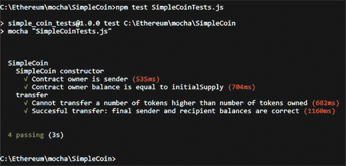

为了进行阳性检查，您还可以编写一个针对没有修饰符和输入验证的`authorize()`函数的测试：

```
    function authorize(address _authorizedAccount, uint256 _allowance) 
        public returns (bool success) {
        allowance[msg.sender][_authorizedAccount] = _allowance; 
        return true;
    }
```

因此，最明显的测试是一个验证设置的额度是否符合预期的测试：

```
describe('authorize', function() {
  it('Successful authorization: the allowance of the authorized 
      account is set correctly', 
    function(done) {
      //arrange 
      let sender = web3.eth.accounts[1];
      let initialSupply = 10000;
      let authorizer = web3.eth.accounts[2];
      let authorized = web3.eth.accounts[3];
      let allowance = 300;                                             *1*

      let simpleCoinInstance = SimpleCoinContractFactory.new(
         initialSupply, {
        from: sender, data: bytecode, gas: gasEstimate}, 
        function (e, contract){
           if (typeof contract.address !== 'undefined') {

                 //act
             let result = contract.authorize(authorized, allowance, {
               from:authorizer,gas:200000});                           *2*

             //assert
             assert.equal(contract.allowance(authorizer, 
                       authorized), 300);                              *3*
             done();
                    }
            });
    });
 });
```

+   ***1*** **设置额度数量**

+   ***2*** **授权账户使用指定的额度**

+   ***3*** **验证授权账户分配的额度是预期的额度**

#### 10.3.6. 一个有点挑战的小任务

现在我们已经涵盖了所有典型的测试，接下来请回顾一下`transferFrom()`函数。该函数允许一个账户在其他账户授权的额度内转移一定数量的代币：

```
    function transferFrom(address _from, address _to, uint256 _amount) 
        public returns (bool success) {
        require(_to != 0x0);  
        require(coinBalance[_from] > _amount); 
        require(coinBalance[_to] + _amount >= coinBalance[_to] ); 
        require(_amount <= allowance[_from][msg.sender]);  
        coinBalance[_from] -= _amount; 
        coinBalance[_to] += _amount; 
        allowance[_from][msg.sender] -= _amount;
        Transfer(_from, _to, _amount);
        return true;
    }
```

查看其代码，你可能至少想要测试这四个场景：

+   授权账户不能转移超过授权人的代币数量。

+   一个账户不能从没有对任何账户授权任何额度的账户转移代币。

+   一个账户不能从没有对其授权任何额度的账户转移代币。

+   一个授权账户可以在额度内转移一定数量的代币，授权人的最终余额减少了授权账户转移的代币数量，接受者的余额增加了同样的数量。

您可能已经注意到这些测试与您已经编写的测试相似，所以我这里不会重复。但我鼓励您尝试这些测试，然后将您的测试与我提供的测试进行比较，您可以在附录 C 的列表 C.1 中找到我的测试。

#### 10.3.7. 完整的测试套件

您可以在附录 C 的列表 C.1 中看到所有测试，包括我跳过的那些。您还可以在提供的代码的 SimpleCoinTest.js 文件中找到它们。在将这些测试添加到 SimpleCoinTests.js 之后，您可以像下面这样运行整个套件：

```
C:\Ethereum\mocha\SimpleCoin>npm test SimpleCoinTests.js
```

输出在图 10.6 中，测试被很好地分组在各个部分中...并且全部通过。

##### 图 10.6. 运行整个测试套件。输出显示测试被分组在各个部分中...并且它们都通过了。

| --- | --- | --- |

本节为您提供了一个关于可能想要针对您正在开发的合约编写的典型测试的思路。您可以在表 10.1 中找到总结。

##### 表 10.1. 本节介绍的测试目的

| 函数 | 测试 | 目的 |
| --- | --- | --- |
|  |
| 构造函数 | 合约所有者是发送者 | 测试合约所有权 |
| 构造函数 | 所有者余额=供应量 | 测试从构造函数参数设置正确的状态 |
| 铸币 | 非所有者账户不能铸币 | 测试当非授权账户调用该函数时是否抛出异常 |
| 转账 | 不能转移超过拥有的代币 | 测试是否通过无效输入违反修饰符或 require 条件而抛出异常 |
| 转账 | 成功的转账 | 在有效账户且输入有效的情况下执行交易后，测试合约状态 |

我呈现的测试套件涵盖了最明显的测试用例，但绝不是全面的。就像编程一样，单元测试是一门艺术，而不是一门精确的科学。你总是要牢记测试的覆盖率（你的合约的所有功能是否被测试覆盖了？所有逻辑分支是否被测试覆盖了？）和准确度（每个函数的每个边界条件是否被测试了？）之间的权衡，以及它们的成本（实现和维护）。理想情况下，你可能希望有最大的覆盖率和准确度，但你可能没有足够的时间和资源来实现和维护所有必要的测试。在这种情况下，你可能会希望关注关键区域，特别是那些涉及 Ether 风险的功能。

### 概要

+   你可以相对容易地使用 Mocha，一个通用的 JavaScript 测试框架，来编写以太坊合约单元测试。

+   你可以使用`npm`这个 Node.js 包管理器快速安装 Mocha。

+   你可以使用`describe()`来描述 Mocha 单元测试包和组，使用`it()`来描述个别测试。

+   你的测试应该涵盖负面检查，验证当函数从一个未授权账户或输入无效时被调用时，期望的异常是否被抛出。

+   你的测试应该涵盖正面检查，验证当函数从一个授权账户且输入有效时被调用，合约状态是否成功通过函数逻辑进行了修改。

+   你也应该针对构造函数编写测试，以验证合约所有者和合约状态是否被正确初始化。

## 第十一章。使用 Truffle 改善开发周期

|  |
| --- |

**本章内容**

+   安装 Truffle，一个智能合约框架

+   在 Truffle 内设置和编译以太坊合约

+   通过 Truffle 的迁移来简化合约部署

+   使用 Truffle 简化合约单元测试

|  |
| --- |

在上一章中，你开始将单元测试集成到你的开发环境中，使用 Mocha。但你可能注意到了，单元测试脚本看起来并不理想。它的设置相当复杂，包括编译`SimpleCoin`和创建合约工厂的明确指示。每个测试还包括一个引用合约工厂的明确部署语句。主要缺点是，所有这种基础设施代码使单元测试的主要目标——关注合约的功能方面——变得分散。另一个缺点是，如果你想要创建一个新的测试套件来覆盖不同的合约，你必须复制所有这种基础设施代码。

如果你有一个方法来简化合约的部署，那岂不是很好？这就是 Truffle 的主要目标，它是一个以太坊合约开发框架，专注于简化部署并因此简化单元测试。

在本章中，您将设置 Truffle，然后使用它来改进编译 -> 部署 -> 测试周期。主要关注学习如何使用这个工具，所以，为了避免被合同特定问题分心，您将再次重复使用我们古老的`SimpleCoin`合同。如果您急于实现新功能，请耐心等待：在下一章中，您将使用 Truffle 从头开始开发一个全新的 Dapp！

### 11.1. 在 Truffle 中设置 Truffle

您可以使用 Node.js `npm`轻松安装 Truffle，然后开始创建项目。安装我使用的 4.1.15 版本，如下所示：

```
C:>npm install -g truffle@4.1.15
```

|  |
| --- |

##### 警告

为了使我代码顺利运行，请不要安装 Truffle 5.0.0。我的代码是针对版本 4.1.15 编写的，不太可能在版本 5.0.0 下正确运行。

|  |
| --- |

### 11.2. 在 Truffle 中移动 SimpleCoin

您将从一个最小项目开始，然后通过整个开发生命周期（包括以下步骤）在 Truffle 中集成`SimpleCoin`：

+   在 Truffle 中设置`SimpleCoin`

+   编译合同

+   部署合同

+   单元测试合同

#### 11.2.1. 在 Truffle 中设置 SimpleCoin

为`SimpleCoin` Truffle 项目创建一个工作目录。我是这样创建我的目录的：

```
C:\Ethereum\Truffle\SimpleCoin
```

打开一个操作系统外壳，并移动到这个目录：

```
C:\>cd Ethereum\Truffle\SimpleCoin
```

现在您可以初始化 Truffle 项目：

```
C:\Ethereum\Truffle\SimpleCoin>truffle init
```

Truffle 将创建以下目录结构并预先填充一些文件：

```
/contracts
    Migrations.sol
/migrations
    1_initial_migration.js
/test
truffle.js
truffle-config.js
```

表 11.1 提供了每个目录的描述。

##### 表 11.1. Truffle 目录结构

| 目录/文件名 | 描述 |
| --- | --- |
| /contracts | 您想要编译和部署的 Solidity 合同文件目录。 |
| /contracts/Migrations.sol | Truffle 用于部署项目合同的特殊合同。 |
| /migrations | 执行*迁移*（稍后详细介绍）的 JavaScript 配置文件。 |
| /test | Truffle 可以通过单元测试自动测试放置在此文件夹中的 Solidity 合同代码和 JavaScript 应用程序代码。 |
| truffle.js | Linux 或 macOS 上的 Truffle 项目配置文件。 |
| truffle-config.js | Windows 上的 Truffle 项目配置文件。 |
|  |

##### 警告

如果您在 Windows 上运行，请保留 truffle-config.js 并删除 truffle.js。如果您在 Linux 或 macOS 上运行，您可以删除 truffle-config.js 并使用 truffle.js。在本书的其余部分，我将提到 truffle.js——您很快就会明白为什么。

|  |
| --- |

#### 11.2.2. 编译 SimpleCoin

从 C:\Ethereum\mocha\SimpleCoin\SimpleCoin.sol 复制最新版本的`SimpleCoin`到 C:\Ethereum\Truffle\SimpleCoin\Contracts\SimpleCoin.sol。在将文件复制后，将 SimpleCoin.sol 中的 pragma solidity 指令降级到 0.4.23，因为在撰写本文时，最新的 Truffle 版本使用的是 solc 0.4.23。

您通过所谓的*迁移*在 Truffle 中进行合约部署，我稍后会解释。您通过以下列表中显示的`Migrations`合约执行这些操作，该合约在您使用`truffle init`命令初始化项目时自动生成在合约文件夹中。

##### 列表 11.1\. contracts/Migrations.sol

```
pragma solidity ⁰.4.23;

contract Migrations {
  address public owner;
  uint public last_completed_migration;

  constructor() public {
    owner = msg.sender;
  }

  modifier restricted() {
    if (msg.sender == owner) _;
  }

  function setCompleted(uint completed) public restricted {
    last_completed_migration = completed;
  }

  function upgrade(address new_address) public restricted {
    Migrations upgraded = Migrations(new_address);
    upgraded.setCompleted(last_completed_migration);
  }
}
```

现在您可以启动编译

```
C:\Ethereum\Truffle\SimpleCoin>truffle compile
```

您将看到与以下类似的输出：

```
Compiling .\contracts\SimpleCoin.sol...
Writing artifacts to .\build\contracts
```

编译成功后，Truffle 在项目文件夹相对路径下创建了一个新目录，/build/contracts。该目录包含编译产物，如表 11.2 所述，您将在部署阶段使用。

##### 表 11.2\. 编译产物

| 艺术作品 | 目的 |
| --- | --- |
| Migrations.json | Migrations.sol 的 ABI 接口和字节码 |
| SimpleCoin.json | SimpleCoin.sol 的 ABI 接口和字节码 |

#### 11.2.3\. Truffle 的问题

如果您在此阶段开始遇到问题，可能是因为您在 Windows 中工作，或者有编译器版本问题。您需要一个解决方案，以便在本章中完成工作。本部分提供了一些建议，帮助您解决此类问题。

##### Truffle 在 Windows 上

如果您在 Windows 中工作，当运行任何 Truffle 命令时可能会遇到问题。特别是，如果您在 Windows 命令提示符中运行 Truffle compile，您可能会遇到图 11.1 中显示的神秘的 Microsoft JScript 运行时错误。

##### 图 11.1\. 在 Windows 中运行 Truffle 命令时生成的错误


错误发生是因为 Windows 无法正确区分 npm 文件夹中的 Truffle.cmd 命令文件（通常位于 C:\Users\YOURNAME\AppData\Roaming\npm）和您 Truffle 项目文件夹中的 truffle.js 文件。您有四个选项来解决此问题：

+   使用名为 truffle-config.js 的配置文件，而不是 truffle.js，如早期设置部分所述。将 truffle.js 从您的 Truffle 项目文件夹中删除。

+   如果您出于任何原因想要使用名为 truffle.js 的配置文件，而不是 truffle-config.js，请使用 Git Bash 而不是标准命令提示符。

+   显式调用 truffle.cmd，例如，`truffle.cmd compile`。

+   转到 truffle.cmd 所在的目录，并将其复制为另一个名称，例如，truff.cmd。然后运行`truff compile`，而不是 Truffle compile。如果您决定使用这个解决方法，请在本章剩余时间里输入*truff*，而不是 Truffle。

##### 解决 Truffle 编译错误

如果您遇到编译错误，可能是因为您正在运行旧版本的编译器，或者即使您最近升级了它，Truffle 也在引用旧版本的编译器。具体来说，在执行`truffle compile`命令后，您可能会收到一些由于在 solc 0.4.22 中引入的新构造函数语法而导致的编译错误消息。您有两个选项来解决问题。最佳的方法是卸载 Truffle，然后通过输入

```
C:\Ethereum\Truffle\SimpleCoin>npm uninstall truffle -g
```

跟随

```
C:\Ethereum\Truffle\SimpleCoin>npm install truffle@4.1.15 -g
```

现在如果你重新执行`truffle compile`，你应该最多只收到一些与`Migrations`合约相关的警告（在`contracts\Migrations.sol`文件中）。这可能仍然实现在一个旧的构造函数约定中，这取决于你正在运行的 Truffle 版本。如果你正在运行 Truffle 4.1.15 或更高版本，你应该不会有任何问题；`Migrations.sol`文件应该已经被自动生成为如列表 11.1 中所示。如果你正在运行一个较旧的版本并且想要消除警告，请替换

```
constructor() public {
  owner = msg.sender;
}
```

与

```
function Migrations() public {
  owner = msg.sender;
}
```

如果你重新编译，你应该不会再收到任何警告：

```
C:\Ethereum\truffle\SimpleCoin>truffle compile
Compiling .\contracts\Migrations.sol...
Writing artifacts to .\build\contracts
```

修复编译问题的第二种方法，我会将其作为最后的手段，那就是重新安装 solc，但只安装到项目文件夹中：

```
C:\Ethereum\Truffle\SimpleCoin>npm install solc@0.4.24
```

#### 11.2.4\. 通过迁移将 SimpleCoin 部署到模拟网络客户端

迁移是一个部署脚本。如前所见，迁移脚本位于`migrations`目录中。用以下列表中显示的脚本替换 2_deploy_contracts.js 的内容。

##### 列表 11.2\. 2_deploy_contracts.js：`SimpleCoin`的迁移脚本

```
var SimpleCoin = artifacts.require("SimpleCoin")       *1*

module.exports = function(deployer) {                  *2*
    deployer.deploy(SimpleCoin, 10000);                *3*

};
```

+   ***1*** `artifacts.require`类似于 Node.js 的`require`，你必须用合约名（而不是合约文件名）来初始化它。

+   ***2*** 您必须将`module.exports`属性设置为一个接受部署者对象的函数，该对象是执行部署任务的组件。

+   ***2*** `SimpleCoin`的初始供应量为 10,000 个代币。

在第一次迁移执行期间，你还需要部署`Migrations`合约。这个合约通过它自己的迁移脚本部署，如下所示的列表中显示，包含在这个文件中：C\Ethereum\Truffle\SimpleCoin\migrations\1_initial_migration.js。

##### 列表 11.3\. 1_initial_migration.js：`Migrations`的迁移脚本

```
var Migrations = artifacts.require(“Migrations”)   

module.exports = function(deployer) { 
    deployer.deploy(Migrations);
};
```

一旦你将迁移脚本放置在`migrations`目录中，打开一个单独的操作系统终端，然后移动到项目文件夹：

```
C:\>cd Ethereum\Truffle\SimpleCoin
```

您将`SimpleCoin`部署到 Ganache，这是您已经在第八章和第十章中见过的模拟 Ethereum 客户端。Ganache 是 Truffle 框架的一部分。如果您还没有安装它，您可以通过 npm 像往常一样进行安装：

```
C:\Ethereum\truffle\SimpleCoin>npm install -g ganache-cli@6.1.8
```

然后，在安装完成后，启动它：

```
C:\>cd Ethereum\Truffle\SimpleCoin>ganache-cli
```

确保`truffle.js`（或在 Windows 上的`truffle-config.js`）配置为指向 Truffle Develop，如以下列表所示，而不是指向公共测试网络。如以下列表所示修改其内容。

##### 列表 11.4\. truffle.js（或 truffle-config.js）：Truffle 指向 Test Develop

```
module.exports = {
  networks: {
    development: {
      host: "localhost",
      port: 8545,
      network_id: "*" // Match any network id
    }
  }
};
```

|  |
| --- |

**从特定账户部署**

默认情况下，您的智能合约将由 Truffle 从 accounts[0] 部署，这是默认的交易发送者。如果您希望部署交易从另一个账户提交，您必须在 truffle.js 文件中的 `from` 属性中指定完整地址，如下所示：

```
module.exports = {
  networks: {
    development: {
      host: "localhost",
      port: 8545,
      from: "0xf17f52151ebef6c7334fad080c5704d77216b732",   *1*
      network_id: "*" // Match any network id
    }
  }
};
```

+   ***1*** **这是 Ganache 的 accounts[1]，如 Ganache 启动屏幕上所示。**

|  |
| --- |

回到上一个控制台并运行

```
C\Ethereum\Truffle\SimpleCoin>truffle migrate
```

然后您将得到如下输出：

```
Using network 'development'.
Running migration: 1_initial_migration.js
  Deploying Migrations...
  ... 0x5823254426b34ec4220be899669e562d4691a72fa68fa1956a8eb87f9f431982
  Migrations: 0x8cdaf0cd259887258bc13a92c0a6da92698644c0
Saving successful migration to network...
  ... 0xd7bc86d31bee32fa3988f1c1eabce403a1b5d570340a3a9cdba53a472ee8c956
Saving artifacts...
Running migration: 2_deploy_contracts.js
  Deploying SimpleCoin...
  ... 0x21c4120f9f231ea5563c2a988de55440139ba087651d3d292f06ae65434580f7
  SimpleCoin: 0x345ca3e014aaf5dca488057592ee47305d9b3e10
Saving successful migration to network...
  ... 0xf36163615f41ef7ed8f4a8f192149a0bf633fe1a2398ce001bf44c43dc7bdda0
Saving artifacts...
```

这显示了 `SimpleCoin` 已在 Ganache 的模拟网络上成功部署。如果您更喜欢在同一个操作系统 shell 中运行模拟网络客户端和 Truffle 命令，可以使用一个名为 Truffle Develop 的单独控制台。如果您想了解更多，请查看侧边栏。本书的其余部分，您将使用两个分开的控制台：一个运行 Ganache，另一个启动 Truffle 命令。

|  |
| --- |

**从 Truffle Develop 控制台执行 Truffle 命令**

您可以从 Truffle 项目文件夹以如下方式启动 Truffle Develop：

```
C\Ethereum\Truffle\SimpleCoin>truffle develop
```

这将启动一个类似于 Ganache（和 TestRPC）的模拟网络客户端，但端口为 9545，这意味着，如果您正在运行 Ganache，您不需要关闭它。

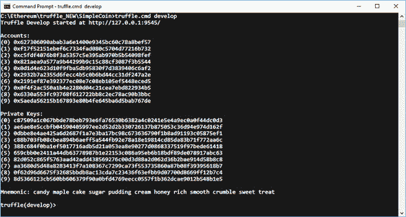

Truffle Develop 启动屏幕

但是，如果您想使用 Truffle Develop，需要将 truffle.js 配置更改为指向端口 9545：

```
module.exports = {
  networks: {
    development: {
      host: "localhost",
      port: 9545,
      network_id: "*" // Match any network id
    }
  }
};
```

现在，您将能够直接从 Truffle Develop 控制台运行 Truffle 命令，例如 `migrate`：

```
Truffle(develop)>migrate
```

您将看到与之前完全相同的输出。

|  |
| --- |

#### 11.2.5\. 将 SimpleCoin 部署到公共测试或生产网络

尽管在本章中您只会将合约部署到 Ganache（或 TestRPC），但迟早您可能会想将其部署到公共测试网络或生产网络。如果是这样，您必须修改您的 truffle.js（或 truffle-config.js）文件并包括测试网络和实时网络的配置，如下所示：

```
module.exports = {
    networks: {
       development: {
       host: "localhost",
       port: 8545,
       network_id: "*"
    },
    live: {
        host: "localhost", 
        port: 80,
        network_id: 1,        
    },
    ropsten: {
        host: "localhost", 
        port: 80,
        network_id: 3,        
    }  
}};
```

此配置假设您正在运行一个本地的 geth 节点（主机指向 localhost），默认的 Web 3 提供者将由 Truffle 实例化：

```
new Web3.providers.HttpProvider("http://<host>:<port>")
```

但是，如果您决定使用不同的提供者，例如指向 Ropsten Infura 网络的 HDWalletProvider，您必须显式配置提供者属性：

```
networks: {
  ...
  ropsten: {
    provider: new HDWalletProvider(mnemonic, "https://ropsten.infura.io/"),
    network_id: '3',
  },
  ...
```

同时，请注意，在公共网络上部署时，您可能需要指定其他设置，例如燃料限制、燃料价格以及合约应通过哪个账户部署。如果是这样，您可以根据表 11.3 描述添加相关的配置属性，但我建议您在继续之前咨询官方文档：[`mng.bz/mmgy`](http://mng.bz/mmgy)。

##### 表 11.3\. truffle.js 配置属性

| 属性 | 用途 |
| --- | --- |
| gas: | 燃料限制（默认 = 4712388） |
| gasPrice: | 燃料价格（默认 = 100,000,000,000 wei） |
| 从: | 部署交易的发件人地址（和合约所有者） |
| 提供者: | 默认是 web3，如前所解释。 |

一旦你适当地配置了 truffle.js（或 truffle-config.js），你可以像以下这样将部署踢到 Ropsten 网络：

```
C\Ethereum\Truffle\SimpleCoin>truffle migrate --network ropsten
```

而且，正如你可能已经猜到的，你将像以下这样部署到 MAINNET：

```
C\Ethereum\Truffle\SimpleCoin>truffle migrate --network live
```

#### 11.2.6 测试 SimpleCoin

Truffle 支持清洁室测试（clean-room testing），这意味着如果一个合约已经在 Ganache 上部署，那么在每个测试文件被处理开始时，其状态都将重新初始化。如果合约已经在一个公共网络上部署，那么在每个测试文件被处理开始时，迁移将重新执行，有效地在测试执行之前从头重新部署合约。通常，在开发过程中，针对 Test Develop 运行单元测试更为合适，因为它们可以快达 90%。建议在开发的后期阶段运行测试在私有网络上，最终在公共网络上，以确保你已经测试了与真实网络通信的应用方面。

使用 Truffle 可以编写两类不同的测试：

+   Solidity 测试—从测试合约测试合约逻辑

+   JavaScript 测试—从外部的 Web3.js 调用测试合约，这些调用通过与实际调用相同的基础设施进行

你必须把所有测试脚本，无论是用 Solidity 还是 JavaScript 编写的，都放在 Truffle 项目的测试目录中。我们将几乎完全专注于 JavaScript 测试，因为 Solidity 测试是用来测试合约之间的交互，这是一个更高级的课题，超出了本书的范围。但我将给你一些关于使用 Solidity 测试的基础知识。

#### 11.2.7 编写 Solidity 测试

你通过自定义测试合约来实现 Solidity 测试，其代码你必须放置在项目测试目录中的.sol 文件里。Solidity 测试必须能够运行针对

+   Truffle 提供的断言库

+   任何其他的断言库

+   Ganache（或 TestRPC）

+   任何以太坊客户端（不仅仅是 geth）和网络类型（私有和公共）

你应当像 TestSimpleCoin.sol 中那样结构一个 Solidity 测试合约，正如列表 11.5 所展示的那样。你必须遵循这些指南和约定：

+   你必须导入一个断言库来检查相等性、不等性和空性。Truffle 提供的默认断言库是 Truffle/Assert.sol。

+   你必须导入 Truffle/DeployedAddresses.sol 库，这样测试运行器才能访问通过迁移部署的合约的地址。Deployed-Addresses 库在每次测试合约运行时都会重新编译，以确保测试环境的清洁。

+   你必须导入正在测试的合约。

+   测试合约的名字必须以 Test（大写的 T）开始，这样测试运行器才能容易地识别它。

+   测试函数的名字必须以 test（小写的 t）开始。

+   测试函数必须返回一个布尔值。通常，这个值通过一个断言函数，如`Assert.equal()`返回。

##### 列表 11.5\. TestSimpleCoin.sol 测试合约

```
pragma solidity ⁰.4.2;

import "Truffle/Assert.sol";                                  *1*
import "Truffle/DeployedAddresses.sol";                       *2*
import "../contracts/SimpleCoin.sol";                         *3*

contract TestSimpleCoin {                                     *4*

  function testInitialBalanceUsingDeployedContract() public {
    SimpleCoin simpleCoin = SimpleCoin(
      DeployedAddresses.SimpleCoin());                        *5*

    uint expected = 10000;

    Assert.equal(simpleCoin.coinBalance(tx.origin), expected, 
      "Owner should have 10000 SimpleCoin initially");        *6*
  }
}
```

+   ***1*** **导入断言库**

+   ***2*** **导入 DeployedAddresses 合约**

+   ***3*** **导入被测试的合约：SimpleCoin**

+   ***4*** **测试合约**

+   ***5*** **SimpleCoin 实例在部署地址**

+   ***6*** **验证测试假设**

首先，将 TestSimpleCoin.sol 放在测试文件夹中，并确保 Test Develop（或 TestRPC）仍在运行。（如果它没有运行，请在另一个控制台中重新启动它。）然后你可以通过执行以下命令来运行 Solidity 测试：

```
C\Ethereum\Truffle\SimpleCoin>truffle test 
```

你将得到与这个类似的输出：

```
Using network 'development'.

Compiling .\contracts\SimpleCoin.sol...
Compiling .\test\TestSimpleCoin.sol...
Compiling Truffle/Assert.sol...
Compiling Truffle/DeployedAddresses.sol...

  TestSimpleCoin
    √ testInitialBalanceUsingDeployedContract (48ms)

  1 passing (530ms)
```

|  |
| --- |

##### 警告

根据你的 solc 编译器版本，你可能会得到一些警告，特别是关于代码引发事件的周围。

|  |
| --- |

如我之前提到的，合约之间的测试是一个超出本书范围的高级主题，所以我不会进一步介绍 Solidity 测试。下一节将完全致力于 Truffle 下的 JavaScript 测试。

#### 11.2.8\. 编写 JavaScript 测试

你还记得你花在编写 Mocha 测试上的努力吗？并没有白费：Truffle 支持 Mocha JavaScript 测试，但与以太坊的集成更深。这意味着你可以

+   无需在您的测试文件中为诸如 web3.js 之类的以太坊库添加`require`语句

+   可以隐式地引用通过迁移部署的合约，而无需手动编译和部署它们

+   可以隐式地引用账户，而无需硬编码以太坊地址

+   可以在 Truffle 内部运行测试并将它们集成到 Truffle 协调的任何持续集成作业中

要在 Truffle 中运行你之前在 Mocha 中编写的 JavaScript 测试，你需要做一些小的改动，特别是如果你想要确保它们以干净室模式执行：

+   用`contract()`调用替换`describe()`调用，这确保所有合约都重新部署到以太坊客户端，并以*干净*的合约状态运行测试。

+   使用`artifacts.require()`引用 solidity 合约，就像你之前编写迁移脚本时一样。

+   用一个承诺链替换你之前在 Mocha 测试中的异步部署调用中的回调部分，承诺链中的第一个承诺是一个已部署合约的承诺，随后的承诺通过`then()`语句链接。

我将在这里展示如何重写一些测试，以便你可以更好地理解我给出的指导方针意味着什么。我从针对`SimpleCoin`构造器的第一个测试开始。为了方便，我在下面的列表中重复了你在 Mocha 中原始编写的代码，这样你就不必翻页。

##### 列表 11.6\. 原始 Mocha 测试，验证构造器，检查合约所有权

```
var assert = require('assert');

const source = fs.readFileSync('c:/Ethereum/mocha/SimpleCoin/SimpleCoin.sol', 'utf8');
const compiledContract = solc.compile(source, 1);
const abi = compiledContract.contracts[':SimpleCoin'].interface;
const bytecode = '0x' + compiledContract.contracts[':SimpleCoin'].bytecode;
const gasEstimate = web3.eth.estimateGas({ data: bytecode }) + 100000;

const SimpleCoinContractFactory = web3.eth.contract(JSON.parse(abi));

describe('SimpleCoin', function() {
  this.timeout(5000);
  describe('SimpleCoin constructor', function() { 
    it('Contract owner is sender', function(done) {

        //arrange 
        let sender = web3.eth.accounts[1]; 
        let initialSupply = 10000; 

        //act
        let simpleCoinInstance = SimpleCoinContractFactory.new(initialSupply, { 
            from: sender, data: bytecode, gas: gasEstimate}, 
            function (e, contract){ 
            if (typeof contract.address !== 'undefined') {
                //assert
                assert.equal(contract.owner(), sender);
                done();
            }
            });
    });
 });
});
```

现在创建一个名为 testSimpleCoin.js 的文件，并将其放在 test 目录中。用以下列表中的代码填充它。

##### 列表 11.7\. Truffle 构造函数测试验证合约所有权

```
const SimpleCoin = artifacts.require(
   "./SimpleCoin.sol");                                 *1*

contract('SimpleCoin', function(accounts) {             *2*
  contract('SimpleCoin.Constructor', 
    function(accounts) {                                *3*
    it("Contract owner is sender", 
       function() {                                     *4*
       return SimpleCoin.deployed()                     *5*
       .then(function(instance) {                       *6*
           return instance.owner();                     *7*
        })
       .then(function(contractOwner) {                  *8*
          assert.equal(contractOwner.valueOf(), 
          accounts[0],                                  *9*
          "accounts[0] wasn't the contract owner");     *10*
       });
    });
  });
});
```

+   ***1*** **引用 SimpleCoin，待测试的代码**

+   ***2*** **测试套件的名称**

+   ***3*** **测试部分的名称**

+   ***4*** **测试的描述**

+   ***5*** **获得通过之前设置的迁移部署的 SimpleCoin 合约实例的承诺**

+   ***6*** **将 SimpleCoin 实例的承诺链接到新函数**

+   ***7*** **获得 SimpleCoin 实例所有者的承诺**

+   ***8*** **将 SimpleCoin 实例所有者的承诺链接到新函数**

+   ***9*** **在承诺链中执行的最后函数执行测试断言。**

+   ***10*** **测试失败时显示的错误信息**

|  |
| --- |

##### 注意

正如我在部署部分所提到的，默认情况下，合约是在 Truffle 中从`accounts[0]`部署的。这就是为什么在测试中，你要比较合约所有者地址`contractOwner.valueOf()`和`accounts[0]`的原因。

|  |
| --- |

你肯定注意到了 Mocha 和 Truffle 测试之间的一些区别，如表 11.4 中列出的那些。

##### 表 11.4\. Mocha 和 Truffle 测试之间的区别

| Mocha 测试 | Truffle 测试 |
| --- | --- |
| Mocha 的测试脚本以相对较长的设置开始，在这个过程中，我们完成了部署 SimpleCoin 所需的所有必要低级步骤。 | Truffle 的测试几乎没有设置，并且立即引用已部署的 SimpleCoin 实例（通过迁移框架）。 |
| Mocha 的测试执行基于与 SimpleCoin 实例部署相关联的回调。 | Truffle 的测试执行基于从部署的 SimpleCoin 实例承诺开始的承诺链。 |
| 一旦你掌握了 SimpleCoin 实例（或其承诺），Mocha 的测试代码似乎更简洁、更有针对性。 | 在获得 SimpleCoin 实例之后，Truffle 的代码通过各种步骤来获取合约所有者，随后将其与预期值进行比较。 |

总之，得益于 Truffle 的迁移框架，测试无需进行太多设置即可访问`SimpleCoin`实例。另一方面，在引用`SimpleCoin`实例之后，Mocha 的测试似乎比 Truffle 的测试更简洁。

让我们运行测试！当你重新执行 Truffle 测试命令时，将同时运行 Solidity 和 JavaScript 测试，并且你会得到如下输出：

```
C:\Ethereum\Truffle\SimpleCoin>Truffle test
Using network 'development'.

Compiling .\contracts\SimpleCoin.sol...
Compiling .\test\TestSimpleCoin.sol...
Compiling Truffle/Assert.sol...
Compiling Truffle/DeployedAddresses.sol...

  TestSimpleCoin
    √ testInitialBalanceUsingDeployedContract (49ms)

  Contract: SimpleCoin
    Contract: SimpleCoin.Constructor
      √ Contract owner is sender

  2 passing (1s)
```

你可以重写一个验证所有者余额是初始供应的构造函数测试。在 testSimpleCoin.js 中添加以下`it()`块：

```
it("Contract owner balance is equal to initialSupply", function() {
    return SimpleCoin.deployed()
    .then(function(instance) {
        return instance.coinBalance(accounts[0]);
    }).then(function(contractOwnerBalance) {
        assert.equal(contractOwnerBalance.valueOf(), 
          10000, 
          "the contract owner balance is not equal to the full supply of 
 10000");
    });
});  
```

|  |
| --- |

##### 注意

也许你会记得，`SimpleCoin`的迁移脚本（名为 2_deploy_contracts.js，在列表 11.2 中展示）将初始供应设置为 10,000。这就是为什么合约所有者余额要与 10,000 进行比较。

|  |
| --- |

重新运行测试：

```
C:\Ethereum\Truffle\SimpleCoin>Truffle test
```

```
  TestSimpleCoin

    √ testInitialBalanceUsingDeployedContract (49ms)

  Contract: SimpleCoin

    Contract: SimpleCoin.Constructor

      √ Contract owner is sender

      √ Contract owner balance is equal to initialSupply

  3 passing (1s)
```

##### 使用 await/async 改进 JavaScript 测试

在本书网站上提供的名为 testSimpleCoin_ALL_sync.js 的文件中，你可以找到一个完整的 Truffle 测试套件，相当于你之前在 Mocha 中编写的测试套件。我鼓励你详细查看测试并比较相关测试。

你会得出结论，理想的测试结构是一种类似于混血的生物，它结合了 Truffle 测试的简单设置和 Mocha 回调中的简单直接代码。确实有一种方法可以实现这种混血，那就是通过 JavaScript 的`async/await`语法。

|  |
| --- |

##### 注意

JavaScript 的`async/await`语法允许你通过类似于同步编程的语法执行异步处理——比典型的异步编程技术（如回调或承诺链）简单得多。如果你对学习更多关于 JavaScript 异步编码感兴趣，我推荐 John Resig 等人出版的《JavaScript 忍者秘籍》。

|  |
| --- |
|  |

##### 警告

为了使用`async/await`，你必须运行在 Node.js 8.0 或更高版本上。我还建议你安装 Truffle 4.0 或更高版本。

|  |
| --- |

这是使用`async/await`的第一个构造函数测试，验证合约所有权的样子：

```
const SimpleCoin = artifacts.require("./SimpleCoin.sol");

contract('SimpleCoin', function(accounts) {
  contract('SimpleCoin.Constructor', function(accounts) {
    it("Contract owner is sender", async function() {

      let simpleCoinInstance = 
        await SimpleCoin.deployed();                     *1*
      let contractOwner = 
        await simpleCoinInstance.owner();                *2*

      assert.equal(contractOwner.valueOf(), 
         accounts[0], 
         "accounts[0] wasn't the contract owner");       *3*
        });
    });
});
```

+   ***1*** **获取已部署的 SimpleCoin 实例**

+   ***2*** **获取合约所有者**

+   ***3*** **验证合约所有者是否符合预期**

正如你所看到的，通过将初始测试版本的承诺链替换为基于`async/await`的语句，代码看起来就像一个简单的同步实现一样简单。你正好达到了你想要的效果：

+   最小（零）`SimpleCoin`合约设置

+   简单测试实现

将这个测试放在一个新文件中——例如，命名为 testSimpleCoin_asyncawait.js。将其放在测试文件夹中并像往常一样运行它（在这样做之前，删除测试文件夹中的 testSimpleCoin.js 和 TestSimpleCoin.sol，这样它们就不会被执行）：

```
C:\Ethereum\Truffle\SimpleCoin>truffle test
```

你会得到这个输出：

```
Using network 'development'.

  Contract: SimpleCoin
    Contract: SimpleCoin.Constructor
      √ Contract owner is sender

  1 passing (53ms)
```

我挑战你将之前版本的第二构造函数测试转换为基于`async/await`的语句，该测试验证所有者余额是否为初始供应。别看，在你和我比较你的解决方案之前写下你的实现！

你完成了吗？你的测试看起来是不是和这个类似？

```
it("Contract owner balance is equal to initialSupply", async function() {
    let simpleCoinInstance = await SimpleCoin.deployed();
    let contractOwnerBalance = 
        await simpleCoinInstance.coinBalance(accounts[0]);

    assert.equal(contractOwnerBalance.valueOf(), 
        10000, 
        "the contract owner balance is not equal to the full supply of 
 10000");
});
```

如果你仍然不相信从基于承诺链的测试转移到基于`async/await`的测试的好处，我会给你展示一个更戏剧性的比较。这是一个基于承诺链的测试版本，测试成功的`transfer()`操作：

```
contract('SimpleCoin.transfer', function(accounts) {
  it("Succesful transfer: final sender and recipient balances are correct", function() {
    //arrange 
    let sender = web3.eth.accounts[0];
    let recipient = web3.eth.accounts[1];
    let tokensToTransfer = 200;

    const expectedSenderBalance = 9800;
    const expectedRecipientBalance = 200;

    //act
    return SimpleCoin.deployed()                            *1*
    then(function(instance) {
      simpleCoin = instance;
        return simpleCoin.transfer(recipient, 
               tokensToTransfer, {from: sender});           *2*
    }).then(function() {
         return simpleCoin.coinBalance(sender);             *3*
    }).then(function(balance) {
         sender_ending_balance = balance.toNumber();        *4*
         return simpleCoin.coinBalance(recipient);          *5*
    }).then(function(balance) {
         recipient_ending_balance = balance.toNumber();     *6*

      //assert
      assert.equal(sender_ending_balance, 
          expectedSenderBalance, 
             "Amount wasn't correctly taken from the sender");
      assert.equal(recipient_ending_balance, 
          expectedRecipientBalance, 
             "Amount wasn't correctly sent to the receiver");
    });                                           
  });               
});
```

+   ***1*** **获取部署的 SimpleCoin 实例的承诺**

+   ***2*** **获取在执行转移操作后你正在测试的 SimpleCoin 实例的承诺**

+   ***3*** **获取发送者余额的承诺**

+   ***4*** **将发送者余额分配给一个变量**

+   ***5*** **获取接收者余额的承诺**

+   ***6*** **将接收者余额分配给一个变量**

正如你所看到的，需要通过承诺在分配变量之前引用余额，使得测试相当复杂。这是这个测试的等效`async/await`版本：

```
contract('SimpleCoin.transfer', function(accounts) {
  it("Succesful transfer: final sender and recipient balances are correct", 
 async function() {
    //arrange 
    let sender = web3.eth.accounts[0];
    let recipient = web3.eth.accounts[1];
    let tokensToTransfer = 200;

    const expectedSenderBalance = 9800;
    const expectedRecipientBalance = 200;

    let simpleCoinInstance = await SimpleCoin.deployed();

    //act
    await simpleCoinInstance.transfer(recipient, 
        tokensToTransfer, {from: sender});
    let sender_ending_balance = 
        await simpleCoinInstance.coinBalance(sender);    
     let recipient_ending_balance = 
        await simpleCoinInstance.coinBalance(recipient);                

    //assert
    assert.equal(sender_ending_balance.valueOf(), 
        expectedSenderBalance, 
        "Amount wasn't correctly taken from the sender");
    assert.equal(recipient_ending_balance.valueOf(), 
        expectedRecipientBalance, 
        "Amount wasn't correctly sent to the receiver");

  });               
});
```

这样不是更清晰吗？我对你能不经解释就能理解这个测试版本如此自信，以至于我决定根本不需要注释代码。如果你安装了 Node.js 8（或更高版本），你肯定应该考虑使用`async/await`而不是承诺链来编写你的测试。我鼓励你尝试并将 testSimpleCoin_ALL_sync.js 文件中找到的所有基于链承诺的 Truffle 测试转换为等效的`async/await`版本。

### 总结

+   编写 Mocha 测试时，你通常必须在脚本顶部提供相当复杂的初始化代码，以通过各种步骤（包括 solc 编译）部署你的合约，这些步骤包括 solc 编译。你的测试被放置在与合约部署调用相关联的回调中。

+   Truffle 是一个简化合约编译、部署和测试的合约开发环境。

+   Truffle 通过迁移来进行合约部署，基于简单的配置。

+   编写 Truffle 测试时，你不需要为合约编译和部署提供任何初始化代码，但必须基于承诺链编写异步代码的测试，这可能不如等效的 Mocha 测试易读。

+   使 Truffle 测试更具可读性的一种方法是使用`async/` `await`来编写它们。但这样做，你必须将 Node.js 升级到 8 或更高版本。

## 第十二章. 综合应用：构建一个完整的投票 Dapp

|  |
| --- |

**本章内容**

+   设计和实现一个展示 Solidity 大部分特性的投票合约，如修改器和事件

+   在 Truffle 中集成投票合约，进行一体化编译、测试和部署

+   实现一个通过 truffle-contract JavaScript 库无缝连接到合约的异步 Web UI

+   从 Truffle 部署到公共测试网络

|  |
| --- |

在上一章中，你开始享受到使用 Truffle 改进开发周期的好处：

+   合约编译变得像执行一个简单的`truffle compile`命令一样简单。你不需要明确指示 solc 编译器将它的输出推送到特定的文件中，以便以后用于部署。

+   得益于 Truffle 基于最小化配置的迁移功能，合约部署变得比以往任何时候都要简单。Truffle 在幕后做了所有艰苦的工作，包括打包编译输出，并将合约 ABI 和字节码提供给部署交易。不再需要手动复制和粘贴长文本！

+   此外，测试也比你通过 Mocha 执行时要简单得多。你不需要复杂的初始化来在每次测试中部署合约，并且可以基于 async/await 编写异步 JavaScript 来保持测试逻辑。

我决定通过`SimpleCoin`来介绍 Truffle，以便专注于工具的功能，避免因介绍新概念而分心。另外，通过让你用 Truffle 重写之前在 Mocha 中编写的相同的`SimpleCoin`单元测试，我可以更明确地比较一个框架与另一个框架的优缺点。

在本章中，我们将再进一步。既然你已经相对熟悉 Truffle 了，我相信你准备好利用这个框架从零开始构建一个全新的 Dapp，包括一个智能合约、一些单元测试和一个 Web UI。我们会从简单的开始：我会给你一些背景知识，介绍投票合约应提供哪些功能，并帮助你设计和实现它。当你完成合约后，我会引导你通过在开发环境中部署它并进行单元测试的常规步骤。然后我会展示如何通过从 Truffle 编译过程中生成的文件导入 ABI 来简化以太坊 Dapp 的 Web UI——在这里也不再需要复制和粘贴 ABI 和地址了！

这一章很长，但我希望你能一直保持兴趣直到最后，尤其是如果你渴望了解更多的话。完成这一章后，你将知道大多数从开始到结束开发 Dapp 所需的工具。现在开始吧！

### 12.1. 定义投票 Dapp 的需求

一个投票 Dapp 可以是简单的，也可以是复杂的，这取决于你希望支持哪些选举的要求。投票可以是对少数预选提案（或候选人）的投票，也可以是对选民自己动态提出的潜在大量提案的投票。选民可以是少数人，全部已知于组织协调选举的组织，或者可以包括某个行政区域内或整个国家的所有居民。在后一种情况下，可能需要一个注册过程，以便高效和透明地运行选举过程。结果可能由简单多数决定：得到更多投票的提案获胜。或者它可能需要一个合格多数（或法定人数）：只有当提案获得预定义的最小百分比的投票时，才能通过。选票可以是秘密的，也可以是公开的。投票可以委托给其他个人，或者保持完全直接。这只是投票过程可以包括的选项和变体的一个子集。随着技术的发展，投票过程可以变得更加复杂。例如，选民可以将他们的投票分成几个部分，每个部分分配给不同的提案，或者可以以类似的方式进行拆分，但每部分委托给不同的人。

您可能雄心勃勃，试图设计一个超通用的应用程序，可以满足所有可能性。为了我们的目的，并且为了使本章的长度合理，我将把投票应用程序的限制在有限的一组要求上：

+   您将在一个小组织内编写投票 Dapp。所有该组织都知道的选民，通过他们的以太坊地址白名单，可以在提案注册会议期间提交新提案，并在投票会议期间对提案进行投票。

+   投票不是秘密的；每个选民都能够看到其他人的投票。

+   胜者由简单多数决定；得到更多投票的提案获胜。

正如您可能在第一章中记忆的那样，即使是这样一个简单的投票 Dapp 也比中心化的应用有一个主要的优势：Dapp 去中心化了投票处理和存储，因此使得篡改的可能性比投票运行在中心化应用中要小得多。

图 12.1 显示了整个投票过程的工作流程。让我们快速看一下：

1.  投票管理员注册了一个*白名单*，其中包含通过他们的以太坊地址识别的选民。

1.  投票管理员开始提案注册会议。

1.  在注册会议有效期间，注册选民有权注册他们的提案。

1.  投票管理员结束提案注册会议。

1.  投票管理员开始投票会议。

1.  注册选民为他们最喜欢的提案投票。

1.  投票管理员结束投票会议。

1.  投票管理员计票。

1.  任何人都可以查看获胜提案的最终细节。

##### 图 12.1。投票过程的工作流程。一些步骤由管理员执行，其他步骤由选民执行。

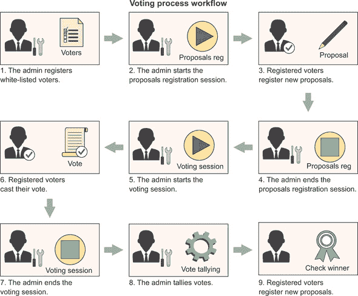

如果您急于开发一个更通用的投票 Dapp，在本章末尾，我会给您一些指导，帮助您进入尖端电子投票领域。不过，现在，我们将坚持我概述的约束条件。

### 12.2。开发计划

在您开始动手之前，我会让您了解一下您要经历的构建投票 Dapp 的所有步骤。您可以在图 12.2 中得到一个更直观的开发周期想法，但这里有一个步骤列表：

1.  创建一个新的 Truffle 项目。

1.  根据初步要求设计和实现`SimpleVoting`，投票合约。

1.  在 Ganache 上编译并部署`SimpleVoting`。

1.  为`SimpleVoting`编写并执行单元测试。

1.  创建一个 web UI，通过读取 Truffle 输出的 ABI 和合约地址连接到投票合约。

1.  通过 web UI 运行投票工作流。

1.  将 Dapp 部署到公共测试网络。

##### 图 12.2。Dapp 开发计划，包括从创建 Truffle 项目到最终部署到公共测试网络的所有步骤


### 12.3。启动 Truffle 项目

说够了——是时候开始行动了！在你以太坊项目的目录中创建一个新的目录——C:\Ethereum\truffle\SimpleVoting——然后打开一个操作系统外壳，初始化一个 Truffle 项目：

```
C:\Ethereum\truffle\SimpleVoting>truffle init 
```

像往常一样，你应该得到如图 12.3 所示的输出。

##### 图 12.3. Truffle 项目初始化

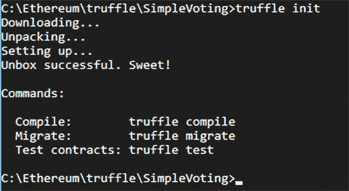

如果你正在使用 Windows，记得删除 truffle.js；否则，删除 truffle-config.js。最初，你将在 Ganache 上部署，正如上一章中所做的那样，所以确保 truffle.js（或 truffle-config.js）按照如下方式配置：

```
module.exports = {
  networks: {
    development: {
      host: "localhost",
      port: 8545,
      network_id: "*" // Match any network id
    }
  }
};
```

现在你准备创建投票合约！

### 12.4. 实现投票合约

我相信你可以根据之前概述的要求自己尝试实现合约。为什么不试试然后稍后回来这里呢？

你已经回来了吗？继续阅读。可以说，参与选举最重要的实体是提案、选民和投票工作流程。让我们看看如何建模它们。

#### 12.4.1. 建模提案、选民和工作流程

在提案注册会议期间，一个注册选民创建一个提案并将其动态添加到现有提案列表中。`Proposal`类型应该暴露出其作者提供的一个（`string`）描述和（`uint`）对其投票的数量。你不想捕获作者，因为他们可能希望保持匿名：

```
struct Proposal {
    string description;   
    uint voteCount; 
}
```

你想关于选民捕捉哪些数据？关于选民是否已注册（只允许白名单账户投票）、他们是否已经投票（以防止重复投票）以及如果他们已经投票，他们为哪个提案投票了？试试这个：

```
struct Voter {
    bool isRegistered;
    bool hasVoted;  
    uint votedProposalId;   
}
```

你可以用以下枚举轻松表示我之前在这个部分描述的投票工作流程：

```
enum WorkflowStatus {
    RegisteringVoters, 
    ProposalsRegistrationStarted,
    ProposalsRegistrationEnded,
    VotingSessionStarted,

    VotingSessionEnded,
    VotesTallied
}
```

#### 12.4.2. 合约状态

至于大多数合约，你感兴趣的是将合约部署交易提交者的以太坊地址分配为管理角色。这将成为（在构建时）投票管理员：

```
address public administrator;
```

从选举开始，主要有两个过程：提案注册会议，在此期间任何注册选民都有权提交提案，以及紧接着开始的投票会议。投票管理员负责启动和结束每个会议，假设基于商定的开始和结束时间。你将用这个状态变量捕捉投票工作流程的状态：

```
WorkflowStatus public workflowStatus;
```

显然，合约最重要的状态与选民和提案有关：

1.  一个`Voter`映射将选民地址（它们的标识符）与选民对象关联：

    ```
    mapping(address => Voter) public voters;
    ```

1.  一个`Proposal`数组捕获注册的提案

    ```
    Proposal[] public proposals;
    ```

提案 ID 的数组索引隐式地表示了它。

一旦计票完成，你想捕捉获胜提案的 ID：

```
uint private winningProposalId;
```

这个状态变量不应该直接暴露给 Dapp 用户，因为它的值应该在投票统计后才通过 getter 函数揭示。

#### 12.4.3. 函数修改器

你需要定义的状态变量来确定函数调用者的身份和投票工作流的状态。正如你所知，你可以创建函数修改器来检查函数应该被调用的条件。你可以创建一个函数修改器来检查调用者是否是投票管理员

```
modifier onlyAdministrator() {
    require(msg.sender == administrator, 
      "the caller of this function must be the administrator");
    _;
 }
```

或者他们是注册选民：

```
 modifier onlyRegisteredVoter() {
    require(voters[msg.sender].isRegistered, 
      "the caller of this function must be a registered voter");
    _;
  }
```

你可以创建其他函数修改器来验证投票者是否正在被注册

```
 modifier onlyDuringVotersRegistration() {
    require(workflowStatus == WorkflowStatus.RegisteringVoters, 
      "this function can be called only before proposals registration has 
 started");
    _;
 }    
```

或者提案注册会话是否处于活动状态：

```
modifier onlyDuringProposalsRegistration() {
   require(workflowStatus == WorkflowStatus.ProposalsRegistrationStarted, 
     "this function can be called only during proposals registration");
   _;
}
```

同样，你可以实现修改器来验证提案注册是否已经结束（`onlyAfterProposalsRegistration`），投票会话是否处于活动状态（`onlyDuringVotingSession`）或已经结束（`onlyAfterVotingSession`），或者投票统计是否已经完成（`onlyAfterVotesTallied`）。你会发现所有这些修改器对于简化你即将实现函数的逻辑都会很有用。

#### 12.4.4. 事件

由于区块链操作从触发到完成需要几秒钟，从用户的角度来看，在执行完成后立即收到通知是有用的。因此，在每个操作结束时，投票合约将发布一个事件，改变合约的状态。这也会在每次工作流状态变更时发生，以便客户端（如 UI）可以相应地更新他们的屏幕。合约将发布这些事件：

```
event VoterRegisteredEvent (address voterAddress); 
event ProposalsRegistrationStartedEvent ();
event ProposalsRegistrationEndedEvent ();
event ProposalRegisteredEvent(uint proposalId);
event VotingSessionStartedEvent ();
event VotingSessionEndedEvent ();
event VotedEvent (address voter, uint proposalId);
event VotesTalliedEvent ();

event WorkflowStatusChangeEvent (
   WorkflowStatus previousStatus,
   WorkflowStatus newStatus
);
```

#### 12.4.5. 构造函数

在合约构建时，你应该识别出合约交易的发送者并使他们成为投票管理员。你还应该设置初始的工作流状态：

```
constructor() public {
    administrator = msg.sender;
    workflowStatus = WorkflowStatus.RegisteringVoters;
}
```

#### 12.4.6. 函数

如果你回顾图 12.1 中的投票过程工作流，你会看到投票管理员负责注册选民：

```
function registerVoter(address _voterAddress) 
    public onlyAdministrator onlyDuringVotersRegistration {

    require(!voters[_voterAddress].isRegistered, 
       "the voter is already registered");

    voters[_voterAddress].isRegistered = true;
    voters[_voterAddress].hasVoted = false;
    voters[_voterAddress].votedProposalId = 0;

    emit VoterRegisteredEvent(_voterAddress);
}
```

投票管理员还负责开始和结束提案注册会话（以及类似地，开始和结束投票会话）：

```
function startProposalsRegistration() 
    public onlyAdministrator onlyDuringVotersRegistration {
    workflowStatus = WorkflowStatus. ProposalsRegistrationStarted;

    emit ProposalsRegistrationStartedEvent();
    emit WorkflowStatusChangeEvent(
        WorkflowStatus. RegisteringVoters, workflowStatus);
}

function endProposalsRegistration() 
    public onlyAdministrator onlyDuringProposalsRegistration {
    workflowStatus = WorkflowStatus.ProposalsRegistrationEnded;

    emit ProposalsRegistrationEndedEvent();        
    emit WorkflowStatusChangeEvent(
        WorkflowStatus.ProposalsRegistrationStarted, workflowStatus);
}
```

正如你所看到的，你之前定义的函数修改器已经使代码简化到只有一行以及发布几个事件。

当提案注册会话处于活动状态时，注册选民会使用这个函数提交提案：

```
function registerProposal(string proposalDescription) 
   public onlyRegisteredVoter 
      onlyDuringProposalsRegistration {           *1*
   proposals.push(Proposal({                      *2*
        description: proposalDescription,
        voteCount: 0
    }));

   emit ProposalRegisteredEvent(proposals.length - 1);
}
```

+   ***1*** **检查调用者是否是注册用户以及提案注册会话是否处于活动状态**

+   ***2*** **创建提案并将其添加到提案数组中**

同样，在这个案例中，函数修改器执行了检查调用者是否是注册选民以及提案注册会话是否处于活动状态的艰苦工作。函数本身的逻辑是 minimal 的：它使用提供的描述创建一个新的提案并将其添加到提案数组中。

一旦启动了投票会议，注册选民可以使用这个函数来投票：

```
function vote(uint proposalId) 
    onlyRegisteredVoter 
    onlyDuringVotingSession public {                   *1*
    require(!voters[msg.sender].hasVoted, 
      "the caller has already voted");                 *2*

    voters[msg.sender].hasVoted = true;                *3*
    voters[msg.sender].votedProposalId = proposalId;   *3*

    proposals[proposalId].voteCount += 1;              *4*

    emit VotedEvent(msg.sender, proposalId);
}
```

+   ***1*** **检查调用者是否为注册选民，且投票会议是否开放**

+   ***2*** **检查调用者是否尚未投票**

+   ***3*** **标记调用者已投票并记录其投票**

+   ***4*** **将投票分配给选定的提案。（注意，以太坊没有并发问题，因为当创建新块时，交易是按顺序在矿工的 EVM 上处理的。）**

管理员结束投票会议之后，他们可以使用以下函数来统计投票，该函数找出获胜提案的 ID，并将其分配给之前定义的状态变量：

```
function tallyVotes() 
    onlyAdministrator 
    onlyAfterVotingSession 
    onlyBeforeVotesTallied public {                           *1*
    uint winningVoteCount = 0;
    uint winningProposalIndex = 0;

    for (uint i = 0; i < proposals.length; i++) {             *2*
        if (proposals[i].voteCount > winningVoteCount) {
           winningVoteCount = proposals[i].voteCount;
           winningProposalIndex = i;                          *3*
        }
    }

    winningProposalId = winningProposalIndex;                 *4*
    workflowStatus = WorkflowStatus.VotesTallied;             *5*

    emit VotesTalliedEvent();
    emit WorkflowStatusChangeEvent(
        WorkflowStatus. VotingSessionEnded, workflowStatus);   *6*
}
```

+   ***1*** **验证管理员在投票会议结束并且尚未调用此函数后才调用该函数**

+   ***2*** **遍历提案以找到投票数最多的那个**

+   ***3*** **记录到目前为止的获胜提案的数组索引**

+   ***4*** **将获胜提案的数组索引分配给相应的状态变量**

+   ***5*** **标记已统计的投票**

+   ***6*** **发布工作流状态变更事件**

创建一组视图——只读函数，返回当前合约状态的一个切片，供 UI 和其他客户端使用，这是方便的。例如，在提案注册会议期间和之后，可以使用这些只读函数检查提案的数量和它们的描述：

```
function getProposalsNumber() public view
    returns (uint) {
        return proposals.length;
}

function getProposalDescription(uint index) public view 
    returns (string) {
        return proposals[index].description;
}  
```

投票统计完成后，可以通过以下函数检索最终结果（获胜提案的 ID、描述和投票数）：

```
function getWinningProposalId() onlyAfterVotesTallied 
    public view
        returns (uint) {
        return winningProposalId;
}

function getWinningProposalDescription() onlyAfterVotesTallied 
    public view
        returns (string) {
        return proposals[winningProposalId].description;
}  

function getWinningProposalVoteCounts() onlyAfterVotesTallied 
    public view
        returns (uint) {
        return proposals[winningProposalId].voteCount;
}
```

任何人都应该有权查看获胜提案，不仅仅是管理员或选民，因此不应该有任何修改器。

还方便编写其他函数来验证调用者的身份。例如，你可以编写一个函数来检查一个地址是否为注册选民

```
function isRegisteredVoter(address _voterAddress) public view
    returns (bool) {
    return voters[_voterAddress].isRegistered;
}
```

或者管理员：

```
function isAdministrator(address _address) public view 
    returns (bool){
    return _address == administrator;
}
```

当前投票工作流状态的视图也可能很有用：

```
function getWorkflowStatus() public view
    returns (WorkflowStatus) {
    return workflowStatus;       
}
```

#### 12.4.7. 完整的投票合约

您可以在附录 D 中的列表 D.1 中看到完整的合约。我鼓励你在将其放入 Truffle 之前，在 Remix 中输入它并对其进行测试。

### 12.5. 编译并部署 SimpleVoting

将网站上的列表 D.1 中的代码放在名为 SimpleVoting.sol 的文件中，该文件位于以下文件夹：C:\Ethereum\truffle\SimpleVoting\contracts。现在，前往迁移文件夹：C:\Ethereum\truffle\SimpleVoting\migrations。创建一个名为 2_deploy_contracts.js 的新文件，并将其内容放入以下列表中，该列表是从你之前为`SimpleCoin`编写的迁移配置改编而来的：

##### 列表 12.1. 2_deploy_contracts.js：SimpleVoting 的迁移配置

```
var SimpleVoting = artifacts.require("SimpleVoting");

module.exports = function(deployer) {
  deployer.deploy(SimpleVoting);
};
```

现在你可以启动编译了

```
C:\Ethereum\Truffle\SimpleVoting>truffle compile
```

您将看到类似以下输出：

```
Compiling .\contracts\SimpleVoting.sol...
Writing artifacts to .\build\contracts
```

|  |
| --- |

##### 注意

如果您遇到编译问题，请查看第十一章，第 11.2.3 节，“解决 truffle 编译错误。”

|  |
| --- |

成功编译后，在新的操作系统控制台中启动 Ganache：

```
C:\Ethereum\truffle\SimpleVoting>ganache-cli
```

然后回到您用于执行 Truffle 命令的操作系统控制台，执行迁移：

```
C:\Ethereum\truffle\SimpleVoting>truffle migrate
```

您将看到以下输出：

```
Using network 'development'.

Running migration: 1_initial_migration.js
  Deploying Migrations...
  ... 0xf3ab00eef045a34e2208f6f4dfa218950f7d1a0d30f3f32982febdff55db6a92
  Migrations: 0x2f90a477697c9a0144acf862ab7dd98372dd7b33
Saving successful migration to network...
  ... 0x7af1903172cab2baac3c05f7ff721c8c54aa0f9f34ad64c3a26495bb591c36c9
Saving artifacts...
Running migration: 2_deploy_contracts.js
  Deploying SimpleVoting...
  ... 0x37ecb76d6cd6051c5d122df53db0063d1336e5b3298150b50d62e8ae845e9bbb
  SimpleVoting: 0xaf18e4e373b90709cc08a231ce24015a0da4f8cc
Saving successful migration to network...
  ... 0x19ac99d629c4053bf699c34c83c47288666afe6fa8994b90438d0e78ec204c96
Saving artifacts...
```

### 12.6\. 编写单元测试

到现在为止，您应该知道如何在 Truffle 中编写单元测试。请注意，`SimpleVoting`的工作流程比`SimpleCoin`的更复杂，如第 12.1 节所述。例如，注册提案或投票等操作只能在管理员已开启相关会话后发生，因此您应该确保一些测试旨在验证这些约束是否得到尊重。 表 12.1 显示了您测试应覆盖的小样本。

##### 表 12.1\. `SimpleVoting`的单元测试示例

| 测试用例 |
| --- |
| 只有管理员才能注册选民。 |
| 你不能两次注册同一个选民。 |
| 只有管理员才能开始提案注册会话。 |
| 只有管理员在开始提案注册会话后才能结束会话。 |
| 只有注册选民才能提交提案。 |
| 只有在管理员开始提案注册会话后，注册选民才能提交提案。 |
| 投票会话开始前，注册选民不能投票。 |

这些测试用例中的每一个通常都需要您编写至少一个*负测试*，证明如果基础条件不满足，则会抛出异常，以及一个*正测试*，验证当所有约束都满足时功能是否按预期工作。例如，如果您想测试“只有在开始后，管理员才能结束提案注册会话”，您应该编写这些测试（代码如下所示：列表 12.2）：

+   负测试：验证如果除管理员以外的选民尝试结束提案注册会话，则会抛出异常。

+   负测试：验证管理员如果在提案注册会话尚未开始时尝试结束会话，则会抛出异常。

+   正测试：验证管理员在提案注册会话开始后可以成功结束会话。

##### 列表 12.2\. testSimpleVoting.js：测试结束提案注册会话

```
const SimpleVoting = artifacts.require("./SimpleVoting.sol");

contract('SimpleVoting', function(accounts) {     
  contract('SimpleVoting.endProposalRegistration - 
    onlyAdministrator modifier ', 
    function(accounts) {
     it("The voting administrator should be able to end the proposal 
 registration session only after it has started", 
       async function() {                                              *1*
       //arrange 
       let simpleVotingInstance = await SimpleVoting.deployed();
       let votingAdministrator = await simpleVotingInstance.administrator();

       let nonVotingAdministrator = web3.eth.accounts[1];     

       try {
            //act
            await simpleVotingInstance.endProposalsRegistration(

              {from: nonVotingAdministrator});
            assert.isTrue(false);                                      *2*
       }
       catch(e) {
            //assert
            assert.isTrue(votingAdministrator != nonVotingAdministrator);
            assert.equal(e, "Error: VM Exception while processing 
 transaction: revert - the caller of this function 
 must be the administrator");                                        *3*
       }
     });
  });

  contract('SimpleVoting.endProposalRegistration - 
    onlyDuringProposalsRegistration modifier', 
    function(accounts) {
     it("An account that is not the voting administrator must not be able 
 to end the proposal registration session", 
       async function() {                                              *4*
       //arrange 
       let simpleVotingInstance = await SimpleVoting.deployed();
       let votingAdministrator = await simpleVotingInstance.administrator();

       try {
         //act
            await simpleVotingInstance.endProposalsRegistration(
              {from: votingAdministrator});
            assert.isTrue(false);                                      *5*
       }
       catch(e) {
            //assert
            assert.equal(e, "Error: VM Exception while processing 
 transaction: revert - this function can be called only 
 during proposals registration");                                    *6*
       }
     });                                   
  });

  contract('SimpleVoting.endProposalRegistration - successful', 
    function(accounts) {
     it("An account that is not the voting administrator must 
 not be able to end the proposal registration session", 
       async function() {                                              *7*
       //arrange 
       let simpleVotingInstance = await SimpleVoting.deployed();
       let votingAdministrator = await simpleVotingInstance.administrator();

       await simpleVotingInstance.startProposalsRegistration(
          {from: votingAdministrator});
       let workflowStatus = await simpleVotingInstance.getWorkflowStatus();
       let expectedWorkflowStatus = 1;

       assert.equal(workflowStatus.valueOf(), expectedWorkflowStatus, 
          "The current workflow status does not correspond 
 to proposal registration session started"); 

       //act
       await simpleVotingInstance.endProposalsRegistration(
         {from: votingAdministrator});
       let newWorkflowStatus = await simpleVotingInstance
         .getWorkflowStatus();
       let newExpectedWorkflowStatus = 2;

       //assert
       assert.equal(newWorkflowStatus.valueOf(), newExpectedWorkflowStatus,
         "The current workflow status does not correspond 
            to proposal registration session ended");                *8*

       });
     });
});
```

+   ***1*** **第一个负测试**

+   ***2*** **如果执行到这行代码，意味着没有异常抛出，测试应该失败。**

+   ***3*** **如果预期异常被抛出，测试通过。**

+   ***4*** **第二个负测试**

+   ***5*** **如果执行到这行代码，意味着没有异常抛出，测试应该失败。**

+   ***6*** **如果预期异常被抛出，测试通过。**

+   ***7*** **正面测试，验证成功结果**

+   ***8*** **如果工作流状态更改为期望的值，则测试通过。**

如果你想运行这些单元测试，将列表 12.2 中的代码复制到一个名为 testSimpleVoting.js 的文件中，该文件位于测试文件夹内：C:\Ethereum\truffle\SimpleVoting\test。我建议你使用来自本书网站的文件。然后，你可以像往常一样执行它们。

```
C:\Ethereum\truffle\SimpleVoting>truffle test
```

你会看到熟悉的输出，如图 12.4 中的屏幕截图所示。

##### 图 12.4. SimpleVoting 单元测试的输出，结束提案注册会话


### 12.7. 创建网页 UI

投票网站需要两个网页：一个用于投票管理员，一个用于选民。你将通过以下步骤创建网站：

1.  准备所需的依赖项，例如必要的 JavaScript 库和智能合约 ABI 的 json 文件。

1.  设置一个网络服务器，以便你可以在网页上读取本地 JSON 文件。

1.  编写管理员页面 HTML。

1.  编写管理员页面 JavaScript。

1.  编写选民页面 HTML。

1.  编写选民页面 JavaScript。

1.  运行管理员和选民网页。

#### 12.7.1. 准备 UI 依赖项

首先，打开一个新的操作系统命令提示符，并为投票网页创建一个新的目录，比如：C:\Ethereum\SimpleVotingWebUI。以防你在第八章中没有全局安装 Bower，在这个目录中局部安装它：

```
C:\Ethereum\SimpleVotingWebUI>npm install bower
```

现在将 Web3.js 和 JQuery 库导入当前目录，就像你在第八章中做的那样。这次，你还将安装 truffle-contract 库，这个库可以让你从`truffle compile`的输出中无缝导入 ABI 和合约地址：

```
C:\Ethereum\SimpleVotingWebUI>bower install web3#0.20.6

C:\Ethereum\SimpleVotingWebUI>bower install jquery

C:\Ethereum\SimpleVotingWebUI>bower install truffle-contract
```

众所周知，Bower 会将这些库下载到 bower_components 文件夹内的相应目录中：

```
bower_components
   |-- web3
   |-- jquery
   |-- truffle-contract
```

现在你将能够从你的 JavaScript 代码中引用这些本地副本 of Web3.js，jQuery 和 truffle-contract。

要从网页 UI 调用`SimpleVoting`合约，你需要引用其 ABI。Truffle 在合约编译期间生成这个文件，名为 SimpleVoting.json，位于此文件夹：C:\Ethereum\truffle\SimpleVoting\build\contracts。在你的网页 UI 目录内创建一个名为 contracts 的文件夹：C:\Ethereum\SimpleVoting-WebUI\contracts。现在将其复制到该文件夹中。

你可能还记得，当你创建`SimpleCoin`的网页 UI 时，你将 ABI 手动复制到页面 JavaScript 中：

```
var abi = "[{\"constant\":false,\"inputs\":[{\"name\":\"_to...
var SimpleCoinFactory = web3.eth.contract(JSON.parse(abi));
var simpleCoinInstance = SimpleCoinFactory.at('0x773dc5fc8fc3e...');
```

现在你试图改进构建网页 UI 的过程，理想情况下，你希望直接从 SimpleVoting.json 中导入合约 ABI。但网络浏览器不允许你从硬盘驱动器读取 JSON 文件，所以以下 JavaScript 在直接从你的硬盘驱动器加载时将无法执行：

```
window.onload = function() {
     $.getJSON("./contracts/SimpleVoting.json", function(json) {
         SimpleVoting = TruffleContract( json );         
       ...
```

同样的 JavaScript 如果通过 Web 服务器提供给浏览器，也会按预期工作。请注意，Dapp Web UI 是通过传统的 Web 服务器提供的，所以您必须设置一个以准备真实的部署。

|  |
| --- |

##### 警告

如果您对您的合约进行修改（例如，您添加了一个新函数），在重新编译它（使用`truffle compile`）并重新部署它（使用`truffle migrate`）之后，您必须再次从 Truffle 的 build\contracts 文件夹中复制 SimpleVoting.json 到您的 Web 项目合约文件夹中。如果您关闭 Ganache，当您重新启动它时，`Simple-Voting`的部署实例将不存在，因此最好使用`truffle migrate --reset`强制进行新的干净迁移，然后将 SimpleVoting.json 文件复制到您的 Web 项目中。

|  |
| --- |

#### 12.7.2. 使用 Node.js 设置一个最小化的 Web 服务器

您可以轻松地使用 Connect 和 ServerStatic 这两个 Node.js 包来设置一个简单的 Web 服务器，它只处理静态页面，包括纯 HTML 和 JavaScript，如 Stack Overflow 文章“使用 Node.js 作为简单 Web 服务器”所述（[`mng.bz/oNR2`](http://mng.bz/oNR2)）。

首先，将它们安装到您的 Web UI 目录中：

```
C:\Ethereum\SimpleVotingWebUI>npm install connect serve-static
```

然后，创建一个名为 webserver.js 的文件，里面包含以下代码：

```
var connect = require('connect');
var serveStatic = require('serve-static');
connect().use(serveStatic(__dirname)).listen(8080, function(){
    console.log('Web server running on 8080...');
});
```

最后，启动网站：

```
C:\Ethereum\SimpleVotingWebUI>node webserver.js
```

您应该看到一个初始化消息：

```
Server running on 8080...
```

现在，您将能够通过本地主机的 8080 端口的 HTTP 连接浏览 SimpleVotingWebUI 文件夹中的任何 HTML 页面。例如，创建一个名为`test.html`的伪页面，内容如下：

```
<html>
<table><tr><td><b>test</b></td></tr></table>
</html>
```

然后通过浏览器访问：http://localhost:8080/test.html。

现在您已经设置了一个 Web 服务器，接下来要创建 SimpleVoting 网站。您将从管理页面开始。

#### 12.7.3. 编写管理页面 HTML

管理网页应通过以太坊地址认证用户。只允许投票管理员地址使用该页面。

|  |
| --- |

##### 注意

当运行在 Ganache 上时，任何密码都将有效。但是当您移动到公共测试网络时，只有与管理员公钥关联的有效密码将被接受以执行合约功能。

|  |
| --- |

投票管理员将使用此页面来

+   注册选民

+   开始和结束提案注册会议

+   开始和结束投票会议

+   计票

您可以从图 12.5 中了解到这个页面的布局。

虽然您可以在本书网站上查看这个网页的整个 HTML，并且我鼓励您下载并对其进行实验（SimpleVotingWebUI 文件夹），但我将突出显示您在管理页面和选民页面中会发现的最具重复性的元素：

+   JavaScript 包含文件

+   显示当前投票工作流程状态的表格行

+   管理员地址和密码字段

+   输入字段，如用于选民注册的地址

+   触发智能合约函数调用的按钮

+   反馈消息单元格，以显示 JavaScript 验证输入产生的错误消息或合约返回的消息

##### 图 12.5。管理网页。投票管理员将使用此页面注册选民、启动和结束提案注册会话、启动和结束投票会话，以及计票选票

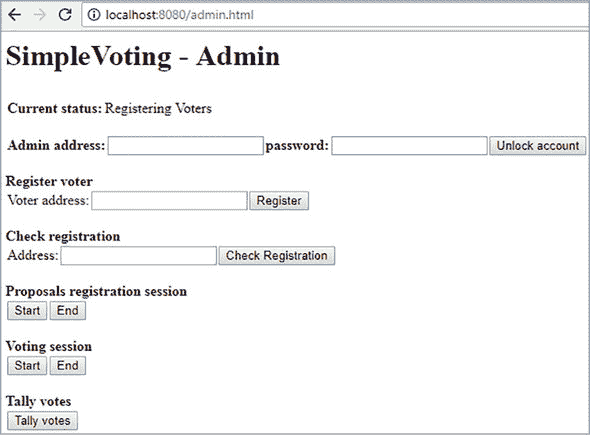

##### Javascript Includes

这些是 admin.html 页面引用的 JavaScript 文件：

```
<head>   
     <script src="bower_components/web3/dist/web3.min.js"></script>
     <script src="bower_components/jquery/dist/jquery.min.js"></script>
     <script src="bower_components/truffle-contract/dist/truffle-contract.js"></script>     
     <script src="./simplevoting.js"></script>
</head>
```

正如你所看到的，管理页面引用了 Web3.js、jQuery 和 truffle-contract，通过它们各自的 Bower 下载文件夹。为了简单起见，避免代码重复，我决定将管理员和选民网页所需的全部 JavaScript 放在一个名为 simplevoting.js 的单个文件中。我将在下一节中向您展示它。

##### 显示当前工作流状态的文本

在页面顶部，一行显示投票工作流当前的状态；例如，“注册选民”或“提案注册会话开启：”

```
<table border="0" cellpadding="0" id='currentStatus'> 
     <tr>
            <td><b>Current status:</b></td>

                        <td id='currentWorkflowStatusMessage'></td>
            <td></td>
            <td></td>
     </tr>     
</table>
```

这从两个角度来看都是有用的：

+   它提醒用户他们处于哪个处理步骤，因此可以防止他们尝试错误的操作。

+   从技术角度来看，工作流描述在页面加载时从投票合约中获取，因此正确的渲染确认合约正在按预期运行。

##### 管理员地址和密码字段

页面通过输入字段捕获管理员地址和密码：

```
<table border="0" cellpadding="0" id='user'> 
     <tr>
         <td><b>Admin address:</b></td>
         <td><input type="text" id="adminAddress" width="400" /></td>
         <td><b>password:</b></td>
         <td><input type="text" id="adminPassword" width="400" /></td>
         <td><button onclick="unlockAdmin()">Unlock account</button></td>
         <td id='adminMessage'></td>
      </tr>     
</table>
```

此输入用于

+   通过点击“解锁账户”解锁管理员账户（如果密码正确，指定的账户将被解锁，用户可以在三分钟后再次锁定之前在页面上执行操作。）

+   认证账户为管理员，以便用户被允许访问网页功能

+   将地址作为与该网页关联的合约函数调用的发送者，这些调用到管理员账户都是受限制的，这样他们才能得到授权

|  |
| --- |

##### 注意

当连接到 Ganache 时，无需解锁管理员账户即可在页面上执行操作，但当你连接到测试网络时，你必须这样做。

|  |
| --- |

##### 其他输入字段

输入字段还捕获与页面提供的功能相关的输入，例如注册选民；例如，选民地址字段：

```
<td>Voter address:</td>
<td><input type="text" id="voterAddress" width="400" /></td>
```

##### 触发智能合约函数调用的按钮

一些按钮，如与选民注册相关的按钮，会触发一个 JavaScript 函数（在这个例子中是`registerVoter()`），它收集相关的输入（在这个例子中是选民地址），并将其与管理员地址一起包含在合约调用中：

```
<td><button onclick="registerVoter()">Register</button></td>
```

其他按钮，如启动投票会议的按钮，会触发一个 JavaScript 函数（`startVotingSession()`），在创建并提交相关合约调用之前，除了管理员地址外不接受任何输入：

```
<table border="0" cellpadding="0" id='proposalsRegistration'> 
     <tr>
         <td><button onclick="startProposalsRegistration()">Start</button></td>
 <td><button onclick="endProposalsRegistration()">End</button></td>
 <td id='proposalsRegistrationMessage'></td>
      </tr>     
</table>
```

##### 反馈消息单元格

在大多数按钮旁边都有一个单元格，用来显示 JavaScript 验证输入或合约调用返回的错误或成功消息：

```
<td id='voterRegistrationMessage'></td>
```

如我之前提到的，你可以在书籍网站上找到`admin.html`页面的完整 HTML。我鼓励你在运行代码之前检查代码。

#### **12.7.4** **编写管理员页面 JavaScript**

在开始这一节之前，我想清楚地说明我将介绍基于异步调用的 JavaScript 代码，原因有两个：

+   在 Web 应用程序中编写异步 JavaScript 是最佳实践。

+   如果你想要从安全角度推荐使用 Web3 提供商，比如 Mist 或 MetaMask，它们只支持对以太坊合约的异步调用。

|  |
| --- |

##### 注意

我相信即使你不太熟悉异步 JavaScript，你也应该能够理解这一部分。但是如果你遇到困难，我也实现在这里将要介绍的代码的同步版本，你可以在书籍网站上找到。

|  |
| --- |

我将只介绍管理员通过注册选民地址的 JavaScript。这是一个有趣的用例，因为它需要大多数管理员操作所需的常用功能，比如

+   在页面加载时连接到合约

+   在页面加载时显示投票工作流状态

+   解锁管理员账户

+   验证用户输入；例如，检查管理员地址是否有效，或者管理员尝试的操作是否与当前工作流状态兼容。

+   执行合约交易

+   处理合约事件

一旦你理解了这个用例，你应该能够自己实现管理员的其他功能。我鼓励你这样做，然后与你从书籍网站上找到的我提供的代码进行比较。让我们一步一步来。

##### 连接到投票合约

连接网页到投票合约的 JavaScript 代码与你在第八章中为连接到`SimpleCoin`编写的代码类似，但多亏了 truffle-contract

+   合约 ABI 直接从`SimpleVoting.json`读取，这是一个`truffle compile`生成的文件，无需硬编码。

+   合约地址不再硬编码，也从 Simple-Voting.json 中读取，特别是其网络字典部分；每次 ganache 重启时，都会添加一个新的网络条目，而合约地址在执行`truffle` `migrate`时更新：

    ```
    "networks": {
        "1526138147842": {      "events": {},
          "links": {},
          "address": "0xaf18e4e373b90709cc08a231ce24015a0da4f8cc",
          "transactionHash":
           "0x37ecb76d6cd6051c5d122df53db0063d1336e5b3298150b50d62e8ae845e9bbb"
        },
       ...
        "1526683622193": {                                    *1*
          "events": {},
          "links": {},
          "address": 
             "0xdaef7d6211bc0c0639178f442c68f468494b7ea2",    *2*
          "transactionHash":
           "0xea66f69e35ccc77845405dbc183fc0c3ce831cd977f74c5152d6f97a55ebd8af"
    }
    ```

    +   **1** **在 Ganache 重启时生成的网络条目**

    +   **2** **在迁移（部署）合约时更新合约地址**

代码看起来是这样的：

```
var SimpleVoting;                                    *1*

window.onload = function() {

     $.getJSON("./contracts/SimpleVoting.json", 
         function(json) {                            *2*
         SimpleVoting = TruffleContract( json );     *3*

            SimpleVoting.setProvider(
               new Web3.providers.HttpProvider(
                 "http://localhost:8545"));          *4*
```

+   **1** **用于存储部署投票合约实例引用的变量**

+   **2** **读取 SimpleVoting.json**

+   **3** **通过 truffle-contract 引用 SimpleVoting，从 SimpleVoting.json 导入合约 ABI**

+   **4** **设置 Web3 指向本地以太坊客户端（目前为 Ganache）**

如我在第 12.7.1 节中提到的，试图直接从磁盘浏览 admin.html 页面上的 jQuery 指令读取 SimpleVoting.json 将会失败，但如果您通过之前创建的网站浏览，它将会工作：

```
http//localhost:8080/admin.html
```

##### 显示投票工作流状态

投票工作流状态（“注册选民”、“提案注册开始”等）在页面加载时显示，并在每次状态改变时刷新，使用这个 JavaScript 函数：

```
function refreshWorkflowStatus()
{          
    SimpleVoting.deployed()                                *1*
    .then(instance => instance.getWorkflowStatus())        *2*
    .then(workflowStatus => {
       var workflowStatusDescription;

       switch(workflowStatus.toString())                   *3*
       {
          case '0':
             workflowStatusDescription = "Registering Voters";
             break;
          case '1':
             workflowStatusDescription = "Proposals Registration Started";
             break;
          ...     
          default:
               workflowStatusDescription = "Unknown Status";
      }

    $("#currentWorkflowStatusMessage").html(
     workflowStatusDescription);                           *4*
     });
}
```

+   ***1*** **引用已部署的合约**

+   ***2*** **从合约中获取工作流状态 ID**

+   ***3*** **确定相关的状态描述**

+   ***4*** **将状态描述绑定到应该显示它的 HTML 表格单元格上**

正如您所知道的，因为合约函数`getWorkflowStatus()`是一个只读视图，其调用被视为普通调用，不会生成区块链交易。因此，您不需要指定调用者，也不需要设置其他交易细节，如燃料限制。

您将在两个地方调用工作流状态函数。第一个是在代码块设置`SimpleVoting`引用到投票合约实例的末尾，这发生在页面加载时：

```
$.getJSON("./contracts/SimpleVoting.json", function(json) { ...

    ...
    refreshWorkflowStatus();
});
```

另一个是在与“工作流状态事件”相关的事件处理程序中，该事件是投票合约在每次状态改变时发布的。我们稍后研究那个。

##### 解锁管理员账户

正如您可能记得的，要调用任何改变合约状态的合约函数，进而生成一个区块链交易，您需要解锁调用者（此时成为交易发送者）的账户。在执行这个网页上的任何改变状态的操作之前，比如通过点击相应按钮注册选民或启动投票会议，您需要解锁管理员账户。这个解锁过程是通过以下函数实现的：

```
function unlockAdmin()
{
     var adminAddress = $("#adminAddress").val();
     var adminPassword = $("#adminPassword").val();

     var result = web3.personal.unlockAccount(
        adminAddress, adminPassword, 180);               *1*
     if (result)
            $("#adminMessage").html('The account has been unlocked');
     else
            $("#adminMessage").html('The account has NOT been unlocked');
}
```

+   ***1*** **账户解锁，持续三分钟**

正如您可能回忆起来的，我已经将这个函数的执行注册到了“解锁账户”按钮的点击事件上：

```
<td><button onclick="unlockAdmin()">Unlock account</button></td>
```

因此，您必须在执行任何状态改变操作之前点击这个按钮。但如果您更喜欢，可以移除这个按钮，在生成交易的任何合约调用之前调用这个函数。例如，您可以在您 JavaScript 的`registerVoter()`函数中的合约调用`instance.registerVoter()`之前放置它：

```
function registerVoter() 
{
...
unlockAdmin(adminAddress, adminPassword);
SimpleVoting.deployed()                         
.then(instance => instance.registerVoter(voterToRegister, ...
```

##### 验证用户输入

至于集中式应用程序，验证用户输入并在将其传递给外部函数调用之前避免不良输入产生异常是一个好习惯。为了实现这一点，您`registerVoter()` JavaScript 函数的前几行用于从 HTML 捕获用户输入并检查它：

```
function registerVoter() {

   $("#voterRegistrationMessage").html('');
   var adminAddress = 
      $("#adminAddress").val();                             *1*
   var voterToRegister = 
      $("#voterAddress").val();                             *1*

   SimpleVoting.deployed()
   .then(instance => instance.isAdministrator(   
       adminAddress))                                       *2*
   .then(isAdministrator =>  {          
       if (isAdministrator)
       {
          return SimpleVoting.deployed()
          .then(instance => 
                 instance.isRegisteredVoter(
                       voterToRegister))                    *3*
          .then(isRegisteredVoter => {
               if (isRegisteredVoter)
                 $("#voterRegistrationMessage")
                    .html(
                    'The voter is already registered');     *4*
               else
               {
                ...
               }
            });
       }
       else
       {
          $("#voterRegistrationMessage")
               .html(
               'The given address does not correspond 
                  to the administrator');                   *4*
       }

   });
}
```

+   ***1*** **从 HTML 中获取管理员和选民地址**

+   ***2*** **检查指定的地址是否属于管理员**

+   ***3*** **检查指定的地址是否属于已注册选民**

+   **4** **显示验证错误信息**

正如你所见，你可以调用一些合约只读视图函数来验证你随后提交给交易生成函数的输入。你也可能希望验证 JavaScript`registerVoter()`函数是否在工作流正确步骤（选民注册）被调用，以避免在尝试在提案注册会话已经启动时注册选民时收到合约端异常：例如：

```
return SimpleVoting.deployed()
          .then(instance => instance.getWorkflowStatus())
          .then(workflowStatus => {
                 if (workflowStatus > 0)
                    $("#voterRegistrationMessage")
                    .html('Voters registration has already ended');
                 else
          {
          ...
```

你进行了大量的验证。现在你可以更有信心地调用合约`registerVoter()`，因为它不会抛出异常。

|  |
| --- |

##### 注意

你可能会想知道，如果用户能够修改 JavaScript 并绕过验证，他们是否可能黑掉这个 Dapp。这是毫无意义的。JavaScript 输入验证的目的不是为了提供一个安全层，而是为了避免用户在交易被合约端验证代码撤销时产生不必要的交易费用。例如，尝试通过绕过执行`isAdministrator()`检查的 JavaScript 来从非管理员账户注册选民，最终会导致合约端的`onlyAdministrator`函数修饰符抛出异常。

|  |
| --- |

##### 调用生成交易合约函数

趁你在这里，我会告诉你更多关于围绕合约交易执行的 JavaScript 代码，比如`instance.registerVoter()`。正如你所知，调用一个改变合约状态的函数，你正在生成一个区块链交易。在这种情况下，你必须提供

+   交易发送者

+   交易详情，如至少气体限制

+   在成功完成时回调处理错误，或在成功完成时返回结果

你可以在`registerVoter()`调用中看到所有这些细节：

```
SimpleVoting.deployed()                         *1*
.then(instance => instance.registerVoter(
   voterToRegister,                             *2*
       {from:adminAddress, gas:200000}))        *3*
.catch(e => $("#voterRegistrationMessage")
   .html(e));                                   *4*
```

+   **1** **引用已部署的合约**

+   **2** **调用 registerVoter 函数**

+   **3** **指定交易发送者和气体限制。（通常你将其设置为允许交易顺利完成的最小金额，你可以在测试期间找到该值。）**

+   **4** **处理合约调用错误**

##### 处理合约事件

在离开这个关于管理员页面 JavaScript 的部分之前，我想向你展示如何处理合约发布的工作流状态变更事件。这将允许你，例如，更新页面顶部的当前工作流状态描述，并显示管理员添加的每个选民的注册确认信息。

首先，你必须声明一个变量来引用合约`WorkflowStatusChangeEvent`事件类型：

```
var workflowStatusChangeEvent;
```

你会在页面加载时实例化这个变量，在设置合约引用之后：

```
window.onload = function() {
    $.getJSON("./contracts/SimpleVoting.json", function(json) {
    ...
    SimpleVoting.deployed()
    .then(instance => instance
 .WorkflowStatusChangeEvent())                     *1*
    .then(workflowStatusChangeEventSubscription => {
             workflowStatusChangeEvent = 
                workflowStatusChangeEventSubscription;

       workflowStatusChangeEvent
 .watch(function(error, result){                *2*
          if (!error)
              refreshWorkflowStatus();                   *3*
          else
              console.log(error);
       });                
    });     
   ...
```

+   **1** **引用合约 WorkflowStatusChangeEvent 事件**

+   **2** **使用合约事件注册处理器**

+   **3** **处理事件时，调用客户端函数刷新 UI**

正如你所看到的，每次工作流状态改变时，都会调用刷新其描述的函数。合同事件，通知选民注册确认的`VoterRegisteredEvent()`，以完全相同的方式处理，唯一的区别是，UI 是内联刷新，而不是通过客户端函数：

```
SimpleVoting.deployed()
.then(instance => instance.VoterRegisteredEvent())
.then(voterRegisteredEventSubscription => {
       voterRegisteredEvent = voterRegisteredEventSubscription;     

       voterRegisteredEvent.watch(function(error, result) {
       if (!error)
           $("#voterRegistrationMessage")
           .html('Voter successfully 
              registered');                 *1*
       else
          console.log(error);
       });                 
});
```

+   ***1*** **刷新 voterRegistrationMessage 标签**

#### 12.7.5. 编写投票页面 HTML

你可以在图 12.6 中看到的投票页面与管理员页面有很多共同之处。如我前面所说，投票页面的主要目的是注册提案并对它们进行投票。值得强调的是动态更新的提案表，每次选民添加新提案时，该表都会更新：

```
<tr><table border="0" cellpadding="0" width="600" id='proposalsTable'> </table></tr>
```

##### 图 12.6. 投票页面截图

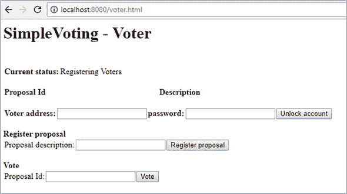

#### 12.7.6. 编写投票页面 JavaScript

让我们看看提案表是如何更新的。如果你查看 simplevoting.js 中的`register-Proposal()`函数，你会注意到它与我们在早些时候研究的`registerVoter()`有很多相似之处。主要区别是，与合同在提案注册时引发的`ProposalRegisteredEvent()`事件相关联的事件处理程序不仅通过刷新相关 HTML 标签来确认注册已经完成。此外，它调用一个函数，生成一个动态的 HTML 表格列表，列出迄今为止所有添加的提案：

```
...
proposalRegisteredEvent.watch(function(error, result) {
    if (!error)
    {
       $("#proposalRegistrationMessage")
         .html('The proposal has been 
            registered successfully');      *1*
       loadProposalsTable();                *2*
    }
    else
       console.log(error);
});
```

+   ***1*** **刷新提案注册确认标签**

+   ***2*** **刷新列出迄今为止所有注册提案的表格**

这就是提案表动态刷新的方式：

```
function loadProposalsTable() {
     SimpleVoting.deployed()
     .then(instance => instance.getProposalsNumber())
     .then(proposalsNumber => {

          var innerHtml = "<tr><td><b>Proposal ID</b></td><td><b>Description</b></td></tr>";

          j = 0;
          for (var i = 0; i < proposalsNumber; i++) {
             getProposalDescription(i)
             .then(description => {
                 innerHtml = innerHtml + "<tr><td>" + (j++) + 
                     "</td><td>" + description + "</td></tr>";
                 $("#proposalsTable").html(innerHtml);
         });
         }
    });          
}

function getProposalDescription(proposalId)
{
    return SimpleVoting.deployed()
       .then(instance => instance.getProposalDescription(proposalId));
}
```

#### 12.7.7. 运行管理员和投票网页

既然你理解了两个网页的代码，是时候运行它们了。我会引导你完成整个投票工作流，这样你就能看到应用程序从开始到结束是如何工作的。

##### preliminaries

在开始之前，请确保 Ganache 在控制台中运行。我建议你用一个指令启动它，将输出重定向到日志文件，这将在后面派上用场：

```
C:\Ethereum\truffle\SimpleVoting>ganache-cli > c:\temp\ganache.log
```

因为你重新启动了 Ganache，你必须重新部署`SimpleVoting`（在另一个控制台）：

```
C:\Ethereum\truffle\SimpleVoting>truffle migrate --reset
```

接下来，将 SimpleVoting.json 从 Truffle 的 build\contracts 文件夹复制到网站的 contracts 文件夹。现在你可以重新启动网站（在另一个控制台）：

```
C:\Ethereum\SimpleVotingWebUI>node webserver.js
Server running on 8080...
```

##### 注册选民

浏览管理员网页

```
http://localhost:8080/admin.html
```

你会看到我之前给你看的图 12.5 中的屏幕。你可能会注意到初始当前状态是“注册选民”，如预期的那样，正如你在图 12.7 中看到的：

##### 图 12.7. 在启动时管理员网页上显示的初始工作流状态


除非你的 truffle.js 配置为从特定账户运行迁移，否则它们将对`accounts[0]`执行，你知道，这将成为投票管理员。因为你在 Ganache 上部署，查看你重定向输出的`ganache.log`文件：

```
Ganache CLI v6.1.0 (ganache-core: 2.1.0)

Available Accounts
==================
(0) 0xda53708da879dced568439272eb9a7fab05bd14a

(1) 0xf0d14c6f6a185aaaa74010d510b975ca4caa1cad
(2) 0x5d6449a4313a5d2dbf7ec326cb8ad204c97413ae
...
```

将与账户（0）对应的地址复制到管理员地址文本框中，因为你正在对 Ganache 进行操作，所以将密码字段留空，如图 12.8 所示[#ch12fig08]。然后你可以注册选民地址。

##### 图 12.8. 将管理员账户复制到相应的文本框中


因为很快你将运行一些选民功能，我建议你从 Ganache 的启动屏幕上以选民的身份注册（1）、（2）、（3）...。在注册账户（1）时，你需要在选民地址文本框中输入相应的地址，如图 12.9 所示[#ch12fig09]。

##### 图 12.9. 输入选民地址


在提交选民注册交易之前，你必须解锁管理员账户，所以点击“解锁账户”。你会得到一个账户已解锁的确认信息。然后点击“注册”。如果一切顺利，你应该在“注册”按钮旁边看到一个确认信息；否则，你会看到一个错误信息。

使用 Ganache 日志文件中的其他账户地址注册几个选民。如果你在接下来的三分钟内这样做，你不需要在注册账户之前再次解锁管理员账户。

|  |
| --- |

##### 注意

如我前面所说，当在 Ganache 上运行时，你不需要输入任何管理员密码，甚至不需要解锁相应的账户，因为所有账户都是无限期解锁的。但为了以后更顺利地过渡到公共测试网络，最好习惯账户解锁操作。

|  |
| --- |

如果你想验证这些账户确实已注册，你可以使用检查注册验证区域。例如，为了验证账户（1）是否是注册选民，请在地址文本框中输入相应的地址并点击检查注册。你应该看到图 12.10 中显示的类似确认信息。

##### 图 12.10. 检查账户是否已注册为选民


在我们转移到下一个工作流程步骤之前，我建议你看看如果你尝试去

+   在管理员地址文本框中指定一个不同的账户来注册一个选民；例如，账户（4）

+   执行一个在这个阶段不应该发生的操作；例如，你点击“计票”按钮

你应该收到相应的错误信息。

##### 启动提案注册会话

一旦你注册了一些选民，可以通过点击屏幕相关区域的“开始”来启动提案注册会话。这将调用 JavaScript `start-Proposals-Registration()`函数，该函数又会调用`start-Proposals-Registration()`合约函数。合约函数将引发`WorkflowStatusChangeEvent`事件，负责刷新工作流状态标签到“提案注册开始”的客户端 JavaScript `refreshWorkflow-Status()`函数将处理该事件，如图 12.11 所示。

##### 图 12.11. 当你启动提案注册会话后，当前状态标签将被刷新相应的状态描述。


##### 注册提案

在此阶段，选民被允许注册提案。在另一个浏览器标签中打开选民网页：http://localhost:8080/voter.html。

你会看到一个类似于图 12.6 的屏幕，有一个小区别：当前状态将是“提案注册开始”，如图管理员页面所示。这确认页面正确连接到投票合约。

现在在 Ganache 账户（1）下注册一个提案，该账户是一个有效的注册用户。在选民地址文本框中输入相应的地址，留密码空白，就像对管理员一样。然后输入一个提案描述，例如，“提案零”。如果你想在点击注册之前，可以检查如果你在这个阶段提交一个反对提案 ID = 0 的投票会发生什么。你应该会收到一个错误信息。

现在点击注册。你会在按钮旁边得到一个确认信息。你也会在屏幕顶部看到你输入的提案及其相关 ID，从合约返回，如图 12.12 所示。

继续注册更多提案，使用你注册的所有选民账户。如果你愿意，你可以针对同一个账户注册多个提案，因为你没有对此设置任何限制。你也可以尝试注册一个针对管理员账户或者你没有作为用户注册的某个账户的提案，看看会发生什么。

##### 图 12.12. 注册新提案

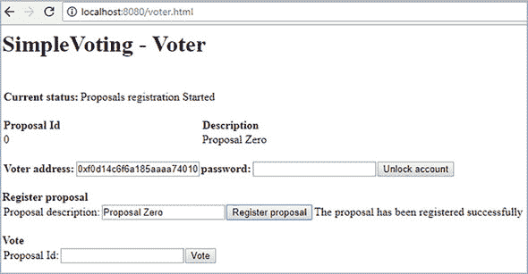

##### 结束提案注册会话

注册几个提案后，你可以结束提案注册会话。回到管理页面，如果管理员账户地址仍然在相关文本框中，点击提案注册会话区域内的“结束”。你会在按钮旁边和一个新工作流状态在当前状态区域看到一个确认信息，如图 12.13 所示。

##### 图 12.13. 结束提案注册会话


像往常一样，你可以尝试进行在这个阶段不应该发生的动作。例如，尝试结束投票会话。

##### 开始投票会话

开始投票会话的时刻到了！点击相应的投票会话旁边的开始，屏幕顶部的当前状态描述将相应地更改为“投票会话已开始。”

##### 投票

回到选民屏幕。您会看到屏幕顶部的状态也已更改为“投票会话已开始。”这证实了它已经被`WorkflowStatusChangeEvent`事件刷新，该事件在`startVotingSession()`函数的末尾由合约发布，并且选民页面的 JavaScript 进行了处理。在此阶段，您允许投票。

在选民地址文本框中输入一个选民账户的地址，然后在屏幕顶部的提案 ID 中选择一个，放入提案 ID 文本框中。然后点击投票。您会在投票按钮旁边看到一个确认信息。如果您再次尝试投票，您将看到投票合约阻止您重复投票的异常。继续通过您之前注册的账户进行各种投票。

##### 结束投票会话

在您从不同的注册账户中完成投票后，您可以像开始时那样结束投票会话：回到管理页面，将鼠标悬停在投票注册区域，然后点击结束。和往常一样，您会在屏幕顶部看到一个确认信息和状态改变。如果您现在试图回到选民页面，并通过一个您没有使用的注册账户投票，您将无法投票。

##### 统计选票

现在是真相大白的时候：是时候统计选票了！在管理页面，点击统计选票。除了常规的确认信息和状态描述阶段，您会在屏幕底部看到一个新的表格出现，总结投票结果。`WorkflowStatusChangeEvent`事件的处理者生成了这个表格，并对投票统计的状态 ID 进行了特定的检查。

如果您回到选民页面，您会在屏幕底部看到相同的结果表格，正如您在图 12.14 中可以验证的那样。因为两个页面都在监听同一个事件，所以会出现相同的表格。

##### 图 12.14。投票统计后的选民页面

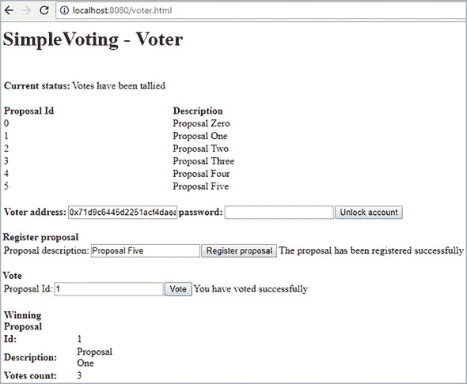

恭喜你！你已经设计、实现、测试并运行了一个完整的投票 Dapp。你应该认为这是一个重要的成就。这是你在本书中第一次从零开始构建完整的 Dapp，涵盖了从智能合约到 web UI 的所有层次。从第一章开始，当你开始学习区块链和 Dapp 等新概念，并尝试使用 SimpleCoin 的简单胚胎版本进行实验，你已经走了一段很长的路。现在你应该对智能合约有了很好的理解，知道如何用 Solidity 编写它们，如何用 Web3.js 与它们通信，以及如何创建一个简单的 web UI 以更轻松地与它们交互。在离开这一章之前，你将在公共测试网络上部署 Dapp 并检查一切是否如预期工作。

#### 12.7.8. 部署到公共网络

以下是将 SimpleVoting 部署到公共测试网络 Ropsten 的步骤：

1.  停止 Ganache。

1.  启动配置为指向 Ropsten 的 geth。

1.  配置 Truffle 以指向 Ropsten 网络，并从你的一个 Ropsten 账户部署。

1.  解锁你将用于部署的 Ropsten 账户。

1.  执行 Truffle 迁移到 Ropsten。

1.  检查 UI 是否仍然正确工作。

##### 停止 Ganache

你应该能够自己完成大部分工作，但以防万一，让我带你一步步完成这些步骤。从简单的一个开始：按下 CTRL+C 或关闭 Ganache 窗口。

##### 启动 Ropsten 上的 geth

你已经做过几次了，但我可以节省你一些翻页时间。你可以在下面的代码中看到完整的命令，通过一些种子节点连接到 Ropsten，包括执行快速同步的选项，以防你有一段时间没有连接到测试网络。此外，我突出了最后两个参数，它们使 geth 通过 RPC 在端口 8545 上进行通信，并允许跨源资源共享（CORS），以便你的网页的 JavaScript 可以直接与 geth 通信：

```
C:\Program Files\geth>geth --testnet –-bootnodes
"enode://145a93c5b1151911f1a232e04dd1a76708dd12694f952b8a180ced40e8c4d25a908
a292bed3521b98bdd843147116a52ddb645d34fa51ae7668c39b4d1070845@188.166.147
.175:30303,enode://2609b7ee28b51f2f493374fee6a2ab12deaf886c5daec948f122bc837
16aca27840253d191b9e63a6e7ec77643e69ae0d74182d6bb64fd30421d45aba82c13bd@13
.84.180.240:30303,enode://94c15d1b9e2fe7ce56e458b9a3b672ef11894ddedd0c6f247e
0f1d3487f52b66208fb4aeb8179fce6e3a749ea93ed147c37976d67af557508d199d9594c35f
09@188.166.147.175:30303" 
--verbosity=4 --syncmode "fast" --cache=1024 --rpc --rpcport 8545
--rpccorsdomain "http://localhost:8080" --rpcapi "eth,net,web3,personal"
```

|  |
| --- |

##### 注意

如果你的 geth 客户端似乎没有与公共测试网络同步，将控制台连接到 geth 并手动添加此 GitHub 页面上指定的 Ropsten 对等节点：[`mng.bz/6jAZ`](http://mng.bz/6jAZ)。

|  |
| --- |

##### 配置 Truffle 以指向 Ropsten

在上一章中，我解释了如何让 Truffle 指向测试或主网络。按照以下方式修改你的 truffle.js（或 truffle-config.js）文件：

```
module.exports = {
  networks: {
    development: {
      host: "localhost",
      port: 8545,
      network_id: "*" // Match any network id
    },
    ropsten: {
      host: "localhost", 
      port: 8545,                                    *1*
      network_id: 3,    
      from: 
 "0x70e36be8ab8f6cf66c0c953cf9c63ab63f3fef02",     *2*
      gas: 4000000                                   *3*
    }      
  }
};
```

+   ***1*** **与 geth 打开的用于 RPC 通信的端口相匹配（如前所述）**

+   ***2*** **用你想要用于部署的 Ropsten 账户替换这个账户。**

+   ***3*** **这应该足够的燃料来部署 SimpleVoting。**

确保你选择用于部署 SimpleVoting 的 Ropsten 账户里有一些（测试）以太币！

##### 解锁用于部署的账户

要解锁你为部署指定的 Ropsten 账户，首先打开一个新的控制台并将其连接到 geth：

```
C:\Program Files\geth>geth attach ipc:\\.\pipe\geth.ipc
```

一旦启动了 geth JavaScript 控制台，以下方式解锁部署者地址（300 秒内有效）：

```
> web3.personal.unlockAccount("0x70e36be8ab8f6cf66c0c953cf9c63ab63f3fef02", "YOUR_PASSWORD", 300);
true
```

##### 执行一个 Truffle 迁移到 Ropsten

要在除开发网络之外的其他网络上执行迁移，你必须通过 `--network` 选项显式提供它（在一个单独的控制台中）：

```
C:\Ethereum\truffle\SimpleVoting>truffle migrate --network ropsten
```

| ├─── |
| --- |

##### 警告

在尝试进行此操作之前，请确保你的 geth 客户端已与 Ropsten 完全同步。你可以通过与 [`ropsten.etherscan.io/`](https://ropsten.etherscan.io/) 上的最新 Ropsten 区块进行对比，查看客户端控制台显示的内容。

| ├─── |
| --- |

如果你的 geth 客户端正在积极连接到 Ropsten，并且你已经正确配置了所有内容，你应该会看到一些输出，确认部署已经完成：

```
Running migration: 1_initial_migration.js
  Deploying Migrations...
  ... 0x8ec9c0b3e1d996dcd2f6f8b0ca07f8ce5e5d15bd0cc2eea3142f351f53070499
  Migrations: 0xeaf67f4ce8a26aa432c106c2d59b7dbeaa3108d8
Saving successful migration to network...
  ... 0xadffddd1afe362a802fc6a80d9c60dc2e4a85f9e850ff3c252307ec9255988af
Saving artifacts...
Running migration: 2_deploy_contracts.js
  Deploying SimpleVoting...
  ... 0xbe1ca60296cc8fb94a6e97c74bf6c20547b2ed7705e8db84d51e17f38904fa09
  SimpleVoting: 0x3a437f22d092b6ae37d543dcb765de4366c00ecc
Saving successful migration to network...
  ... 0x37f90733539ba00f946ef18b456b5f7d6b362f93e639583d789acd36c033e5d2
Saving artifacts...
```

##### 检查 UI 仍然可以工作

如果你回顾一下 simplevoting.js 的第一行代码，初始化部分查看的是来自 `localhost:8545` 的 `web3` 提供者。Geth 暴露的 RPC 端口号码与之前 Ganache 暴露的相同，所以一切应该还是照常工作，对吧？我们一起来看看！首先，将 Truffle 构建后的 SimpleVoting.json 文件复制到网站的 contracts 文件夹中。然后尝试像之前一样浏览 admin.html。（确保网站仍在运行；否则，使用：`node webserver.js` 重启它。）输入以下内容：

```
http://localhost:8080/admin.html
```

是的！页面正确加载，并显示了预期的“注册选民”初始状态。现在你可以完成整个工作流程，从选民注册到投票计数，就像在 Ganache 上运行时一样。在这样做之前，确保 TESTNET 管理员和选民账户有足够的以太币来执行相关操作。

| ├─── |
| --- |

##### 注意

记住，当你在 TESTNET 上进行操作时，你必须在每个操作中解锁相关的账户。另外，无论你是以管理员账户还是选民账户进行操作，你都需要等待相关交易被挖掘，所以确认需要更长的时间（大约 15 秒）。

| ├─── |
| --- |
| ├─── |

##### 警告

如果你的 UI 似乎没有响应，并且你没有收到你所尝试操作完成的确认，请在浏览器的开发工具的控制台中检查可能的错误。例如，在 Chrome 上，你可以点击 F12 然后从顶部菜单选择控制台。如果问题与账户解锁有关，可能是由于 Web3 在这一领域的更改。如果是这种情况，你可以从附加的 Geth 控制台解锁管理员或选民账户，正如你在前面的章节中看到的那样，而不是使用解锁账户按钮。

| ├─── |
| --- |

### 12.8. 思考题

我希望您觉得这一章对于将您在前几章中学到的所有内容联系起来很有用。至此，您应该感到自信，可以开始构建您自己的 Dapp，并且您应该已经准备好迎接新的挑战。如果您渴望在继续学习智能合约设计和安全的先进主题之前，再稍微练习一下您新获得的技能，我已经为您准备了一个小计划，您可以使用它作为改进 SimpleVoting 的跳板。我考虑了两个改进集：

+   技术改进

+   功能性改进

#### 12.8.1\. 可能的技术改进

我设计 SimpleVoting 的主要目标是一次性展示完整的 Ethereum Dapp 开发生命周期，因此我决定尽可能简化它，以便主要关注大局。此外，我理解并非所有读者在网页开发和持续集成方面都有相同的背景和经验，因此我在这两个领域避免了引入相对先进的技术。如果您想要改进网页用户界面，有很多方面可以改进，包括这两个方面：

+   使用标准的 Web3 提供商

+   使用网页构建工具自动化构建和部署

##### 使用标准 Web3 提供商

您的应用程序不应该通过普通的网络浏览器提供服务，而应该通过提供增强安全性的标准 Web3 提供商（如 Mist 或 MetaMask）提供服务。这些提供商要求您异步调用合约函数，因此，重新实现您的 SimpleVoting.js 以使用异步特性也将为此目的带来好处。在您相应地重新实现 JavaScript 代码之后，您可以通过替换这一行来检测标准提供商：

```
SimpleVoting.setProvider(
  new Web3.providers.HttpProvider(
  "http://localhost:8545"));
```

替换为：

```
var web3Provider;
if(typeof web3 != 'undefined')
     web3Provider = new Web3(web3.currentProvider);     *1*
else
     web3Provider = new Web3(
       new Web3.providers.HttpProvider(
       "http://localhost:8545"));                       *2*

SimpleVoting.setProvider(web3Provider);
```

+   **1** **如果可用，则使用标准提供商（如 MetaMask 或 Mist）**

+   **2** **如果无可用提供商，则实例化默认提供商**

您如何提供一个标准提供商？首先，记得登录。然后，假设您按照第三章中解释的方式安装了 MetaMask 浏览器插件 chapter 3，在 SimpleVoting.js 的顶部做出我建议的代码更改，最后在管理或选民页面上浏览。通过这样做，Web3 提供商将被设置为 MetaMask。

##### 使用网页构建工具自动化构建和部署

如果您有使用网页构建工具的经验，您可能会发现每次更改后都要从 Truffle 的 build\contracts 中复制 SimpleVoting.json 到网页项目 contracts 文件夹中有点烦人。您可能会想知道 Truffle 是否支持构建管道。它确实支持，实际上，您可以将您喜欢的构建工具（如 Webpack 或 Grunt）插入其中。

Truffle 文档网站还包括一个 Webpack Truffle Box([`truffleframework.com/boxes/webpack`](https://truffleframework.com/boxes/webpack))，这是一个使用 Webpack 支持开发的模板项目。您可以使用它作为构建 Webpack 集成的起点，或者至少了解它是如何工作的。

#### 12.8.2\. 可能的功能性改进

当前的投票应用程序在功能上是有意限制的。在管理员注册选民（一个接一个）之后，选民可以注册（可能很多）提案，然后对其中一个进行投票。获胜提案是基于简单多数决定的：得到最多票数的那个提案。此外，你记录了每个选民选择的提案，所以没有匿名性。以下是一些可以丰富投票 Dapp 功能性的方法：

+   允许管理员批量注册选民。

+   允许选民将他们的投票权委托给另一个已注册选民。

+   用合格多数决定获胜提案。

+   实现基于代币的投票。

+   实现无记名投票。

##### 批量注册选民

管理员可以一次性批量注册选民，而不是一个一个注册，节省了行政时间和交易成本。你可以通过一个新函数接收一个地址数组来实现这一改进。

##### 投票委托

选民可以将他们的投票权委托给另一个已注册选民。然后，委托人将无法投票，而被委托人将为众多选民委托的投票数投票。

以下是一些开始实施时的提示：

+   你可以按照以下方式更改选民结构：

    ```
    Voter
    {
        HasVoted: boolean,
        CanVote: Boolean,
        NumVotes: int
    }
    ```

+   你可以添加一个新函数，以便调用者可以将他们的投票权委托给另一个已注册选民。这将与`SimpleCoin`的`authorize`函数类似，以将允许额度分配给另一个账户：

    ```
    delegateVote(address delegatedVoter)
    ```

+   函数的实现应该改变委托人（`CanVote = false`）和被委托人（`NumVotes +=1`）的状态。

+   为了轻松检查选民是否仍有投票权，你可以围绕`CanVote`属性实现一个`canvote`修饰符。

##### 用合格多数决定获胜提案

你可以引入合格多数的概念。为了获胜，提案应达到预定义的法定人数：投出选票的最小百分比。

+   你会引入一个新变量来定义法定人数，并在构造函数中初始化：

    ```
    uint quorum
    ```

+   你会修改`tallyVotes()`函数，只有在达到法定人数时，获胜的提案才设置获胜者。

##### 实现基于代币的投票

当前的投票 Dapp 允许选民账户增加某个提案的投票数。这创建了选民和所选提案之间的强耦合，可以通过投票委托稍微减轻这种耦合。此外，被委托的选民将为委托人将全部投票权指派给一个提案。

在加密空间中出现的一个有趣概念是基于代币的投票。它运作方式如下：

+   每位选民分配有一个投票币或代币，类似于我们的`SimpleCoin`。

+   选民然后通过将投票代币转移至提案地址来投票。

因为投票必须要“花费”，这将防止重复投票。事情可能会变得更加复杂。选民可以，例如，执行以下操作之一：

+   通过类似于你在`SimpleCoin`中看到的转账操作，将投票代币全部或部分转让给一个或多个其他选民。（你可以将这看作是原始投票的分数委托。）

+   通过分配特定分数的初始代币来为一个或多个提案投票。

你可以通过实现一个投票代币（类似于`SimpleCoin`）并将其与投票合约相同的方式整合到一起，来构建一个基于代币的投票 Dapp，然后就像在众售合约中整合众售代币一样。

##### 匿名投票

正如你可能记得的，你在每个选民的结构对象的`votedProposalId`属性中记录了每个选民选择的提案 ID。如果你认为可以通过不记录选民选择的提案并增加其投票数来实施匿名投票，那你是对的。正如你所知，投票是通过交易进行的，所有交易都记录在区块链上，可以进行检查，所以很容易找出谁为哪个提案投票。

匿名投票是可能的，但很复杂，因为没有现成的交易匿名功能。这是一个基于先进密码学概念如*零知识证明*的复杂主题，你可能听说过与流行的加密货币如 Zcoin，Zcash 和 Monero 有关。

英国纽卡斯尔大学的一些研究人员基于名为 Open Vote Network 的协议实现了一个以太坊匿名投票 Dapp。他们将自己的论文和代码公开发布在 GitHub 上，^([1])，并附有视频教程和许多关于该主题的学术参考文献。我建议你复习这些材料！

> ¹
> 
> 查看 GitHub 上的“Open Vote Network”[`mng.bz/nQze`](http://mng.bz/nQze)获取更多信息。

### 总结

+   `SimpleVoting` Dapp 智能合约有效地实现了预定义的要求，基于事件和修改器。

+   你可以基于 truffle-contract 构建一个网络 UI，这是一个易于将网页连接到使用 Truffle previously deployed 的合约的 JavaScript 库。

+   `truffle-contract`库从 Truffle 合约编译过程中生成的 JSON 文件中读取合约 ABI 和地址。

+   要从 JSON 文件中读取合约 ABI 和地址，你必须通过一个网络服务器呈现一个网页。你可以通过两个 Node.js 包 Connect 和 ServerStatic 设置一个最小的网络服务器。

+   一旦你实现了一个 Dapp，对其进行了单元测试，部署了它，并在 Ganache，一个模拟以太坊客户端上成功运行了它，你就可以在公共测试网络上部署它。
