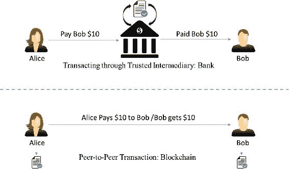
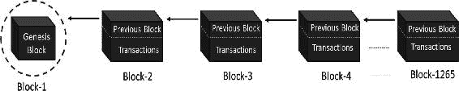
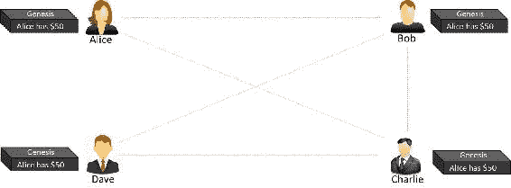
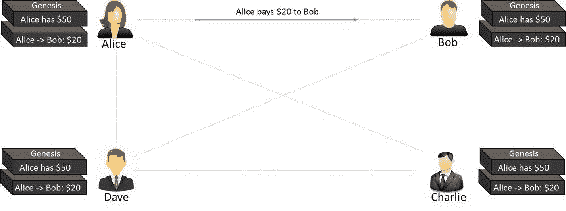
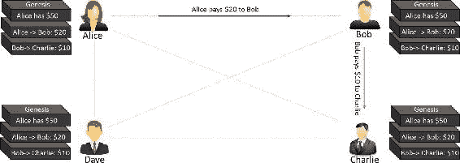
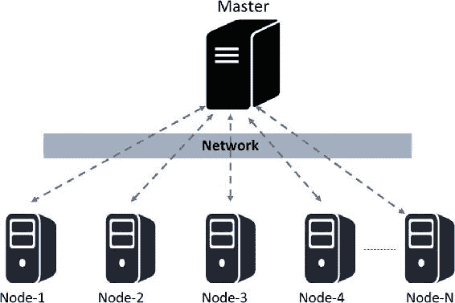
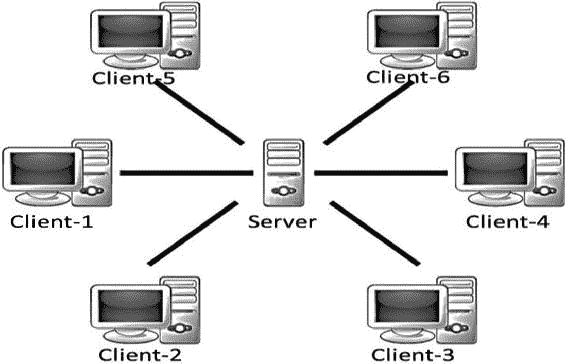
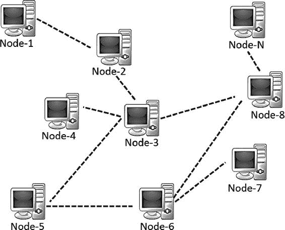
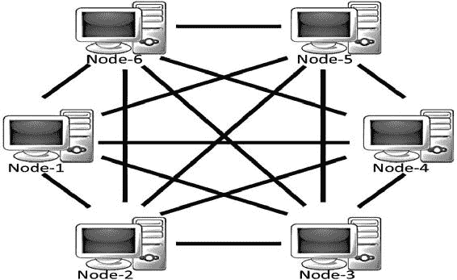
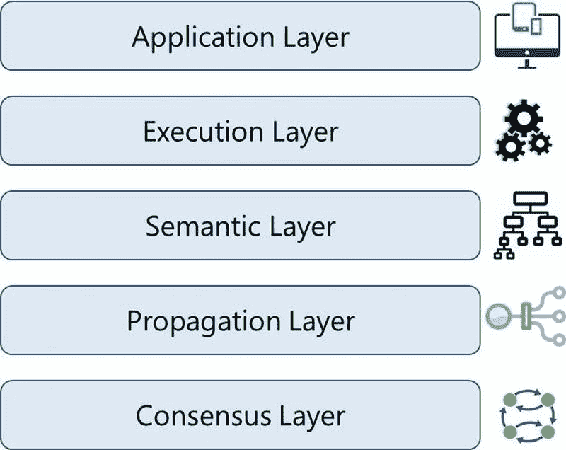

© Bikramaditya Singhal, Gautam Dhameja, Priyansu Sekhar Panda 2018 Bikramaditya Singhal, Gautam Dhameja and Priyansu Sekhar Panda 区块链入门`doi.org/10.1007/978-1-4842-3444-0_1`

# 1. 区块链简介

Bikramaditya Singhal（1），Gautam Dhameja（2）和 Priyansu Sekhar Panda（1）(1)印度卡纳塔克邦班加罗尔(2)德国柏林区块链是已经启动重新设计商业、社会和政治互动以及任何其他价值交换方式的新一波颠覆。同样，这不仅仅是改变，而是一个已经启动的快速现象。截至本文撰写时，已有超过 40 家顶级金融机构和许多不同行业的企业开始探索区块链以降低交易成本、加快交易时间、减少欺诈风险以及消除中介或代理服务。一些企业试图重新构想传统系统和服务的遗产，将它们提升到新的水平，并推出新的服务类型。我们将在整本书中详细介绍区块链。如果你是区块链新手，你可以按照呈现的章节顺序跟进，或者只选择与你相关的章节。本章解释了区块链是什么，它如何发展，以及它在当今世界中的重要性和一些应用和用例。它为您提供了一个从外到内的视角，使您能够更深入地了解区块链。

## 区块链的背景故事

在 20 世纪 70 年代，TCP/IP（传输控制协议/互联网协议）是第一个已知数字颠覆事件，它奠定了互联网的基础。在 TCP/IP 之前，是电路交换的时代，它需要两方之间建立专用的连接才能进行通信。TCP/IP 提出了分组交换的设计，它更加开放，点对点，无需在各方之间预先建立专用的线路。当互联网在 1990 年代初通过万维网（WWW）对公众开放时，它本应该是更加开放和点对点的。这是因为它是建立在开放和去中心化的 TCP/IP 之上的。当任何新技术，尤其是革命性的技术，进入市场时，要么它们自己消失，要么它们产生如此大的影响，以至于它们成为被接受的规范。人们适应了万维网革命，并尽其可能地利用它提供的利益。结果，万维网开始形成可能并非完全如人们想象的方式。它本可以更加开放，更加易于访问，更加点对点。许多新技术和业务开始建立其之上，并变成了今天这样——更加集中。逐渐地，人们习惯了技术所提供的东西。如果国际交易需要数天才能结算，或者太贵，或者可靠性较低，人们都可以接受。让我们更仔细地看看银行系统及其演变。从古老的以物易物时代直到法定货币，交易和结算之间没有真正的区别，因为它们不是两个分开的实体。例如，如果爱丽丝需要支付 10 美元给鲍勃，她只需把一张 10 美元的钞票递给鲍勃，交易就在那里结算了。不需要银行从爱丽丝的账户中扣除 10 美元，并在鲍勃的账户中记入相同的金额，或者作为信任体系以确保爱丽丝不会欺骗鲍勃。然而，与附近身体不在场的人直接交易是困难的。因此，银行系统随着更多服务功能的推出而发展，使世界各地的交易变得可能。在互联网的帮助下，地理位置不再是限制，银行变得比以往任何时候都容易。不仅仅是银行业务：互联网使网上进行许多不同类型的价值交换变得可能。技术使来自印度的人能够与英国的人进行货币交易，但代价较高。这类交易需要数天时间来结算，并且成本高昂。银行总是需要强制信任，确保两方或多方之间的交易安全。如果技术能够在没有这些中介和集中系统的情况下实现信任和安全呢？不知何故，这个技术强制信任的部分一直缺失，这导致了银行、托管服务、清算所、注册机构等许多其他机构的集中系统的发展。区块链证明是互联网革命拼图中的缺失部分，它以一种加密安全的方式实现了一个无需信任的系统。中本聪，这个世界知道他的化名，可能觉得自 1980 年代以来，货币系统没有被技术革命触及。银行形成了维护交易记录、管理互动、强制信任和安全、规范整个系统的集中机构。整个商业都依赖于这些金融机构，它们作为处理支付的可信第三方。金融机构的调解增加了结算交易的成本和时间，同时也限制了交易规模。调解是为了解决争端，但这意味着完全不可撤销的交易是不可能的。这导致了一个局面，即需要信任才能使某人与另一个人交易。当然，这个官僚系统必须改变，以适应经济预期的数字转型。所以，中本聪发明了一种叫做比特币的加密货币，它是由底层技术——区块链所启用的。比特币只是区块链在货币方面的一个应用案例，它解决了基于信任模型的内在弱点。我们将在本书中深入探讨比特币和区块链的基础知识。

## 区块链是什么？

互联网已经革命了许多生活、社会和商业方面。然而，如前一部分所述，过去几十年里，人们和组织之间执行交易的方式并没有太大变化。人们认为区块链是完成互联网拼图的组件，使它更加开放、更容易访问、更加可靠。要理解区块链，你必须从商业和技术两个角度来理解。首先我们在商业交易背景下理解它，以了解其“是什么”，然后深入技术细节，了解其“如何”工作，这在接下来的章节中进行。区块链是一个记录交易价值（不仅仅是金钱！）的点对点系统。这意味着无需像银行、经纪人或其他托管服务这样的可信中介作为可信第三方。例如，如果爱丽丝支付给鲍勃 10 美元，为什么需要通过银行呢？请查看图 1-1。图 1-1 通过中介与点对点交易对比

+   区块链是一个点对点的系统，用于在没有可信第三方的情况下交易价值。

+   它是一个共享的、去中心化的、开放的交易账本。这个账本数据库在大量的节点上进行复制。

+   这种账本数据库是一种只追加的数据库，无法进行更改或修改。这意味着每个条目都是永久性的。在此数据库上的任何新条目都会在托管在不同节点的数据库的所有副本上得到反映。

+   无需可信第三方作为中介来验证、保障和结算交易。

+   它是建立在互联网之上的另一层，并能与其他互联网技术共存。

+   正如 TCP/IP 被设计用来实现一个开放系统一样，区块链技术被设计用来实现真正的去中心化。为了实现这一点，比特币的创造者将其开源，以便它能激发许多去中心化应用。

如图 1-4 所示，典型的区块链可能看起来像这样。图 1-4 区块链数据结构区块链网络上的每个节点都有区块链的完全相同副本，如图 1-4 所示，其中每个区块都是一组交易的集合，因此得名。正如你所看到的，每个区块有两个主要部分。"头部"部分链接回到链中的前一个区块。它的意思是每个区块头部都包含前一个区块的哈希值，这样就没有人可以改变前一个区块中的任何交易。我们将在接下来的章节中进一步探讨这个概念。区块的另一个部分是“主体内容”，它有一个经过验证的交易列表，包括它们的金额、涉及各方的地址以及其他一些详细信息。因此， given 最新的区块，可以访问区块链中的所有前一个区块。让我们考虑一个实际例子，看看交易是如何在网络上进行，账本是如何在网络上更新的，以了解这个系统是如何工作的：假设有三名候选人——Alice、Bob 和 Charlie——他们在区块链网络上互相进行一些货币交易。让我们一步一步地经历这些交易，以了解区块链的开放和分布式特性。步骤 1：假设 Alice 有 50 美元，这是所有交易的发源地，每个节点都意识到了这一点，如图 1-5 所示。图 1-5 创世区块步骤 2：Alice 通过支付 20 美元给 Bob 进行一笔交易。观察区块链在每个节点上是如何更新的，如图 1-6 所示。图 1-6 第一笔交易步骤 3：Bob 通过支付 10 美元给 Charlie 进行另一笔交易，区块链如图 1-7 所示更新。图 1-7 第二笔交易请注意，区块中的交易数据是不可变的。所有交易都是完全不可逆的。任何更改都会导致新的交易，该交易会由所有贡献节点进行验证。每个节点都有自己的区块链副本。如果您脑海中涌现出许多问题，例如“如果 Alice 向 Dave 支付相同金额以双重花费相同金额，或者如果她账户中没有足够的资金进行支付会怎样？”，“安全性是如何得到保证的？”等等，那太好了！我们将在接下来的章节中覆盖这些细节。

## 集中式与分布式系统

我们研究集中化与去中心化之争的原因，正是因为区块链被设计为去中心化，挑战了传统的集中化设计。然而，“去中心化”与“集中化”这两个词并不总是清晰明了。它们定义模糊，在很多地方具有误导性。原因在于，几乎没有任何系统是完全集中化或去中心化的。本书大部分概念和示例灵感来源于以太坊区块链创始人维塔利克·布特林的笔记。那么分布式系统是什么呢？为了不干扰当前的讨论，让我们先来理解它，然后将其排除在外。请注意，无论一个系统是集中化还是去中心化，它仍然可以是分布式的。一个集中化分布式系统是指有一个主节点，负责分解任务或数据并将负载分配给其他节点。另一方面，一个去中心化分布式系统是指没有这样的“主”节点，但计算可能是分布式的。区块链就是这样一个例子，我们将在本书后面查看许多它的图解表示。图 1-8 是集中化分布式系统的一个图文表示。1-8 具有集中控制的分布式系统这种表示与 Hadoop 实现类似，作为例子。虽然由于分布式计算，这种设计中的计算速度更快，但中央集权也带来了局限性。让我们继续讨论集中化与去中心化之争。需要特别强调的是，一个系统是集中化/去中心化的，并不仅仅局限于技术架构。我们想表达的是，一个系统在技术上可以是集中化或去中心化的，但在逻辑上或政治上可能并非如此。让我们来看看这些不同的视角，以便根据要求正确设计系统：技术架构：从技术架构的角度来看，一个系统可以是集中化或去中心化的。我们考虑的是设计一个系统需要使用多少台物理计算机（或节点），它可以在节点失败多少次之前维持整个系统的运行，等等。政治视角：这个视角指的是个人、一群人或者整个组织对一个系统的控制程度。如果一个系统的计算机受到他们的控制，那么这个系统自然而然就是集中化的。然而，如果没有任何特定的个人或群体控制系统，并且每个人在系统上都有平等的权利，那么从政治意义上讲，这是一个去中心化系统！逻辑视角：一个系统可以根据它呈现的方式在逻辑上集中化或去中心化，而不管它在技术上或政治上是否集中化或去中心化。一个可能的类比是，如果你垂直将一个系统（比如计算设备）切成两半，每一半都有服务提供商和消费者，如果它们可以作为独立单元运作，那么它们就是去中心化的；否则就是集中化的。所有上述视角在设计现实生活中的系统时都至关重要，并将其称为集中化或去中心化。让我们讨论一些混合这些视角的例子，以澄清你可能存在的任何混淆：

+   如果你看看企业，它们在架构上是集中的（一个总部），在政治上也是集中的（由 CEO 或董事会管理），在逻辑上也是集中的。

+   我们的交流语言从每个角度来看都是去中心化的——从架构上、政治上以及逻辑上。一般来说，两个人要互相沟通，他们的语言既不受政治影响，也不依赖于其他人的交流语言。

+   像 BitTorrent 这样的 torrent 系统也是从每个角度来看都是去中心化的。任何节点都可以是提供者或消费者，所以即使你把系统切成两半，它仍然可以维持运行。

+   另一方面，内容分发网络（CDN）在架构上是去中心化的，在逻辑上也是去中心化的，但在政治上是集中化的，因为它是由企业所拥有。一个例子是亚马逊云前端（Amazon CloudFront）。

+   现在让我们考虑区块链。区块链的目的是实现去中心化。因此，它从架构上设计上是去中心化的。此外，从政治角度来看，它也是去中心化的，因为没有人控制它。然而，它在逻辑上是集中的，因为有一个共同认可的状态，整个系统表现得像一个单一的全球计算机。

让我们分别探讨这些术语，并加以比较，以便能够理解为什么区块链设计上是去中心化的。

### 集中式系统

如名称所示，集中式系统具有集中的控制和所有的行政权力。这样的系统易于设计、维护、建立信任和治理，但存在许多固有的局限性，如下：

+   它们有一个故障点，因此稳定性较差。

+   它们更容易受到攻击，因此安全性较低。

+   权力的集中可能导致不道德的操作。

+   可扩展性通常较为困难。

一个典型的集中式系统可能如图 1-9 所示。1-9 集中式系统

### 去中心化系统

如名称所示，去中心化系统没有集中的控制，每个节点具有相等的权力。这样的系统难以设计、维护、治理或建立信任。然而，它们不会受到传统集中式系统的局限。去中心化系统具有以下优点：

+   它们没有故障点，因此更加稳定且容错性更高

+   具有抗攻击性，因为没有容易攻击的中央点，因此更加安全

+   具有相等权力的对称系统，因此不道德操作的可能性较小，通常具有民主性质。

一个典型的去中心化系统可能如图 1-10 所示。图 1-10 去中心化系统请注意，分布式系统也可以是去中心化的。一个例子就是区块链！然而，与常见的分布式系统不同，在区块链中没有主节点来细分和委派任务。贡献节点不是处理工作的一部分，而是感兴趣的节点（或者随机选择的节点）完成全部工作。一个典型的去中心化和分布式系统，实际上是一个点对点系统，可能如图 1-11 所示。图 1-11 去中心化和点对点系统

## 区块链的层次结构

截至本文写作时，像以太坊这样的公共区块链变种正处于成熟过程中，在这些区块链上构建复杂应用可能不是一个好主意。请记住，区块链绝不仅仅是一段技术，而是业务原则、经济学、博弈论、密码学以及计算机科学工程的组合。大多数现实世界应用都非常复杂，建议从零开始构建区块链解决方案。本节的目的只是为您提供区块链各层的鸟瞰图，并在接下来的章节中深入探讨核心基础。首先，让我们回顾一下对 TCP/IP 协议栈的基本理解。TCP/IP 堆栈中的分层方法实际上是一个实现开放系统的标准。有抽象层不仅有助于更好地理解堆栈，还有助于构建符合堆栈的合规产品，以实现开放系统。此外，层与层之间的抽象使得系统更加健壮且易于维护。任何对各层的更改都不会影响其他层。再次说明，TCP/IP 类比并不是要混淆区块链层。TCP/IP 是一种通信协议，每个互联网应用程序都会使用，区块链也是如此。进入区块链。目前还没有达成共识的全球标准，可以将区块链组件明确地分为不同的层。需要分层异构架构，但现在这仍然是未来的事情。因此，我们将尝试制定区块链层，以便更好地理解技术并建立数百种区块链/加密货币变种的比较类比。请查看图 1-12 中区块链的高级分层表示。图 1-12 区块链的各种层您可能想知道为什么是五层，而不是更多粒度的层，或更少的层。显然，层不能太多或太少；这将是复杂性、健壮性、适应性等因素之间的权衡，等等。目的实际上不是为了标准化区块链技术，而是为了建立更好的理解。请记住，所有这些层都存在于所有节点上。在本书的第六章，我们将从零开始构建一个去中心化应用程序，并学习在所有这些层上如何通过实际用例理解区块链的功能。

### 应用层

由于区块链的特性，如数据的不可变性、参与者的透明性、对敌意攻击的弹性等，正在构建多种应用。某些应用仅在应用程序层中构建，任意使用区块链的“风味”，还有一些应用在应用程序层中构建，并与区块链的其他层交织在一起。这就是为什么应该将应用程序层视为区块链的一部分。这个层次是您编写所需的 functionality 并将其转化为最终用户应用程序的地方。它通常涉及软件开发的传统技术堆栈，如客户端编程构造、脚本、API、开发框架等。对于将区块链视为后端的应用程序，这些应用程序可能需要在一些 web 服务器上托管，这可能需要 web 应用程序开发、服务器端编程和 API 等。理想情况下，良好的区块链应用程序不应具有客户端-服务器模型，且客户端不应访问任何中心化服务器，这正是比特币的工作方式。您可能已经听说过或已经学习了关于离链网络的概念。这个想法是构建不会为任何事物都使用区块链的应用程序，而是明智地使用它。换句话说，这个概念是为了确保在应用程序层完成繁重的工作，或者在链外处理繁重的存储需求，以便核心区块链轻量且有效，且网络流量不过大。

### 执行层

执行层是区块链网络中发生应用程序层所订购的指令执行的地方。这些指令可能是简单的指令，也可能以智能合约为形式的一组多个指令。无论哪种情况，都需要执行一个程序或脚本来确保交易的正确执行。区块链网络中的所有节点都必须独立执行程序/脚本。在相同输入和条件下，程序/脚本的确定性执行在所有节点上总是产生相同的输出，这有助于避免不一致。在比特币的情况下，这些是简单的脚本，它们不是图灵完备的，只允许执行少数指令集。另一方面，以太坊和超级账本项目允许复杂执行。以太坊的代码或用 Solidity 编写的智能合约被编译成字节码或机器码，在其自己的以太坊虚拟机上执行。超级账本项目为其链码智能合约采取了更简单的方法。它支持在 Docker 镜像内运行编译后的机器码，并支持多种高级语言，如 Java 和 Go。

### 语义层

语义层是一种逻辑层，因为它在交易和区块中存在一定的有序性。无论交易有效还是无效，它都有一组指令穿过执行层但在语义层得到验证。如果是比特币，那么无论是否是合法交易，是否是双重花费攻击，是否被授权进行此交易等，都在这一层得到验证。你将在接下来的章节中了解到比特币实际上以交易的形式表示系统状态。要花费比特币，你必须消耗一个或多个先前的交易，并且没有账户的概念。这意味着当有人进行交易时，他们使用的是之前至少收到他们现在花费金额的交易之一。这个交易必须通过所有节点进行验证，通过遍历先前的交易来看它是否是一个合法的交易。另一方面，以太坊有账户系统。这意味着交易发起人和接收人的账户都会得到更新。在这一层，可以定义系统的规则，如数据模型和结构。与简单交易相比，可能存在一些更复杂的情况。复杂的指令集通常编码在智能合约中。当接收到交易时，调用智能合约会更新系统状态。智能合约是一种特殊的账户，具有可执行代码和私有状态。一个区块通常包含一堆交易和一些智能合约。在这一层定义数据结构，如默克尔树，并在区块头中包含默克尔根，以维护区块头与区块中的交易集（通常是磁盘上的键值存储）之间的关系。此外，数据模型、存储模式、内存/磁盘基础处理等也可以在这一逻辑层定义。除了上述内容外，语义层还定义了区块如何相互链接。区块链中的每个区块都包含前一个区块的哈希值，一直追溯到创世区块。虽然区块链的最终状态是所有层贡献的结果，但区块之间的链接需要在语义层定义。根据用例，你可能希望在这一层实现额外的功能。

### 传播层

之前的层更像是独立现象：与其他系统节点之间的协调并不多。传播层是点对点通信层，它允许节点之间相互发现，并就网络当前状态进行相互对话和同步。当一个交易被发起时，我们知道它会广播到整个网络。类似地，当一个节点想要提出一个有效的区块时，它会被立即传播到整个网络，以便其他节点可以在此基础上构建，将其视为最新的区块。因此，网络中的交易/区块传播是在这一层定义的，它确保了整个网络的稳定性。按设计，大多数区块链在得知新的交易/区块时，会立即将其转发到所有直接连接的节点。在异步的互联网网络中，交易或区块传播经常会遇到延迟问题。一些传播在几秒内发生，一些则需要更长的时间，这取决于节点的处理能力、网络带宽以及一些其他因素。

### 共识层

共识层通常是大多数区块链系统的底层。这一层的主要目的是让所有节点就账本的一致状态达成共识。根据用例的不同，节点之间达成共识可能有不同的方式。区块链的安全性和安全性是在这一层确定的。在比特币或以太坊中，共识是通过适当的激励技术实现的，称为“挖矿”。对于一个公共区块链来说，为了使其自给自足，必须有一些激励机制，不仅有助于保持网络的运行，还有助于强制执行共识。比特币和以太坊使用工作量证明（PoW）共识机制随机选择一个可以提出区块的节点。一旦该区块被提出并传播到所有节点，他们会检查它是否是一个有效的区块，其中包含所有合法的交易，并且 PoW 谜题是否被正确解决；他们会将这个区块添加到自己的区块链副本中，并在其基础上进一步构建。共识协议有许多不同的变体，如权益证明（PoS）、委托权益证明（dPoS）、实用拜占庭容错（PBFT）等，我们将在接下来的章节中详细介绍。

## 区块链为什么重要？

我们研究了中心化和分布式系统的设计方面，并了解到了分布式系统相对于中心化系统的技术优势。我们还学习了区块链的不同层面。作为去中心化的点对点系统，区块链具有一些固有的优势和复杂性。请记住，它并不是一个可以解决世界上所有问题领域的灵丹妙药，但在特定情况下，它是迫切需要的。还有在某些情况下，将现有解决方案区块链化使其更加健壮、透明和有保障。然而，如果不正确地做，它也可能导致灾难！现在让我们从商业和功能的角度来考虑区块链。

### 中心化系统的局限性

如果你快速浏览一下软件发展的大致情况，你会发现许多软件解决方案都是中心化的设计。这并不仅仅是因为它们易于开发和维护，而是因为我们习惯了这样的设计，才能信任系统。我们总是需要一个可信赖的第三方来保证我们不会被骗或成为诈骗的受害者。在没有先前的商业关系的情况下，与某人交易甚至是扩大规模都是困难的。人们可能不会与一个他们从未相识的人做生意。让我们通过一个例子来更好地理解这一点。今天当我们从亚马逊订购东西时，我们会感到安全和放心，因为我们会收到商品。商品的生产者是某人，而购买者是另一个人。那么亚马逊在这里扮演什么角色呢？它作为一个可信的中介发挥作用，并从中获得一些交易提成。买家信任卖家，而信任关系实际上是由这样的可信赖的第三方强加的。区块链提出的是，在现代数字时代，我们实际上并不需要一个第三方来强加信任，而且技术已经成熟到足以处理这个问题。在区块链中，信任是网络的固有部分，我们将在接下来的章节中进一步探讨。让我们快速了解传统中心化系统的几个缺点：

+   信任问题

+   安全问题

+   隐私问题——数据销售隐私正在受到破坏

+   交易的成本和时间因素

分布式系统相对于中心化系统的某些优势可能是：

+   消除中介

+   更容易且真实的交易验证

+   成本降低的同时提高安全性

+   更大的透明度

+   去中心化和不可篡改性

### 区块链采用现状

区块链与比特币一同出现，这是一种数字加密货币，是通过一个简单的邮件列表在 2009 年出现的。它推出后不久，人们就意识到它的真正潜力远远超出了加密货币。一些公司提出了不同风味的区块链产品，如以太坊、超级账本等。微软和 IBM 分别在他们的 Azure 和 Bluemix 云平台上推出了 SaaS（软件即服务）产品。不同的初创公司纷纷成立，许多成熟的公司也开始采取区块链行动，专注于解决一些以前难以解决的商业问题。现在仅仅说区块链具有巨大潜力，几乎可以在每个行业以某种方式引发变革，已经太晚了；革命已经开始。它对金融服务市场产生了巨大影响。很难说出哪家全球银行或金融机构没有在探索区块链。除了金融服务市场，媒体和娱乐、能源交易、预测市场、零售连锁、忠诚度奖励系统、保险、物流和供应链、医疗记录，以及政府和企业应用等领域已经/正在采取行动。截至当前写作，当前的情况是许多初创公司和公司能够看到基于区块链的系统如何真正解决一些痛点，并在许多方面产生益处。然而，设计正确的区块链解决方案是非常具有挑战性的。对于基于区块链的产品或解决方案有一些非常好的想法，但建造它们或实施它们同样困难。有些用例只能建立在公共区块链上。设计一个自给自足的区块链并拥有适当的挖矿生态系统是困难的，而且当涉及到在现有公共区块链上构建非加密货币应用时，除了以太坊外别无选择。无论区块链应用是否只在应用层构建并使用底层作为它们是，或者应用需要从零开始建造，这都是难以决定的事情。也有一些技术挑战。区块链仍然在成熟，可能还需要几年时间才能被主流采用。截至目前，已经有多个提议来解决区块链的可扩展性问题。我们将尝试在这整本书中建立对这些所有方面的深入了解。现在，让我们看看以下章节中的某些具体应用和用例。

## 区块链的应用和用例

在本节中，我们将查看一些已经在各行各业中采取的举措，如金融、保险、银行、医疗保健、政府、供应链、物联网（IoT）和媒体娱乐等。可能性是无限的！在一个中心化系统中难以实现的真正共享经济，使用区块链技术是可能的（例如，Uber、AirBNB 的去中心化版本）。利用这项技术，公民可以拥有自己的身份（自我主权数字身份）并货币化自己的数据。现在，让我们来看一些现有的用例。

+   任何类型的财产或资产，无论是物理的还是数字的，如笔记本电脑、手机、钻石、汽车、房地产、电子注册、数字文件等，都可以在区块链上注册。这可以实现这些资产从一个人到另一个人的交易，维护交易记录，并检查有效性或所有权。此外，公证服务、存在证明、定制保险计划以及许多其他用例都可以开发。

+   有许多金融用例正在区块链上开发，比如跨境支付、股票交易、忠诚度和奖励系统、银行之间的了解你的客户（KYC）等。首次币发行（ICO）是目前最热门的用例之一。ICO 是通过使用加密货币作为数字资产来进行众包的最佳方式。ICO 中的一个币可以被看作是一家企业中的数字股票，这非常容易购买和交易。

+   区块链可以用来启用“群体智慧”来引领并塑造企业、经济和其他各种国家现象，利用集体智慧！基于群体智慧的金融和经济预测、去中心化预测市场、去中心化投票以及股票交易都可以在区块链上实现。

+   确定音乐版税的过程一直都很复杂。互联网使音乐流媒体服务市场渗透率更高，但使版税确定更加复杂。这个问题基本上可以通过区块链来解决，通过维护一个关于音乐版权所有权信息以及媒体内容授权分发的公共账本。

+   这是物联网时代，到处都是数十亿个物联网设备，还有更多的设备将加入这个大军。一大堆不同的品牌、型号和通信协议使得很难有一个中心化系统来控制这些设备并提供一个共同的数据交换平台。这也是区块链可以用来构建物联网设备之间去中心化点对点系统的领域。ADEPT（自主去中心化点对点遥测）是 IBM 和三星的一个联合倡议，已经开发了一个使用比特币底层设计的元素来构建设备分布式网络的平台——去中心化 IOT。ADEPT 使用三种协议：BitTorrent 用于文件共享，以太坊用于智能合约，TeleHash 用于平台中的点对点消息传递。IOTA 基金会是另一个这样的倡议。

+   在政府部门中，区块链也获得了动力。有一些用例是技术去中心化是必要的，但从政治上讲应该由政府管理：土地注册、车辆注册和管理、电子投票等是一些活跃的用例。供应链是区块链另一个有很好用例的领域。供应链一直容易在全球范围内引起争议，因为这些系统保持透明度总是困难的。

## 总结

在本章中，我们介绍了区块链的演变、它的历史、它是什么、设计的好处以及一些相关的用例，为什么它如此重要。在本节中，我们将总结其改变游戏规则的提供，与技术革命保持一致。在 20 世纪 90 年代，互联网的广泛采用改变了人们的经商方式。它消除了在创建和分发信息方面的摩擦。这为新的市场、更多机会和可能性铺平了道路。同样，区块链今天在这里，通过消除三个关键领域的摩擦，将互联网提升到一个新的水平：控制、信任和价值。控制：通过使系统去中心化，区块链实现了控制的分布式。信任：区块链是一个不可变、防篡改的账本。它为所有节点提供了一个单一、共享的真相来源，使系统无需信任。这意味着与任何未知的人或实体进行交易时不再需要信任，而且这是设计固有的。价值：区块链使任何形式的价值观交换成为可能。人们可以在没有中心实体或中介的情况下发行和转让资产。在第二章 2 中，我们将深入探讨区块链的基础知识。

## 参考资料

区块链技术
