© 比克拉马迪亚·辛格尔，高塔姆·达梅贾，普里亚尼斯库·塞卡·潘达 2018 比克拉马迪亚·辛格尔，高塔姆·达梅贾和普里亚尼斯库·塞卡·潘达区块链入门`doi.org/10.1007/978-1-4842-3444-0_2`

# 2. 区块链是如何工作的

比克拉马迪亚·辛格尔^(1 )，高塔姆·达梅贾^(2 )，普里亚尼斯库·塞卡·潘达^(1 )（1）班加罗尔，卡纳塔克邦，印度（2）柏林，柏林，德国我们正站在一场新的数字革命边缘。区块链或许是自互联网本身以来最大的发明！它是下一代互联网交互系统最具前景的技术，并已引起许多行业部门以及学术界的广泛关注。今天，许多组织已经意识到他们需要准备好区块链以维持其在市场中的地位。我们在第一章中已经看了一些用例，但可能性无穷无尽。尽管区块链不是解决所有商业问题的银弹，但它已经开始影响大多数商业功能及其技术实施。为了能够使用区块链解决一些现实世界的商业问题，我们实际上需要对区块链的本质和运作方式有一个精细的了解。为此，需要从商业、技术和法律等多个视角来理解区块链。本章将努力深入探讨区块链技术的核心细节，并全面了解其运作方式。

## 奠定区块链基础

区块链不仅仅是一项技术，它大多与商业功能和用例相结合。在其加密货币实现中，它还与经济原则交织在一起。在本节中，我们将主要关注其技术方面。从技术上讲，区块链是将密码学、博弈论和计算机科学工程的概念巧妙结合在一起的一个杰作，如图 2-1 所示。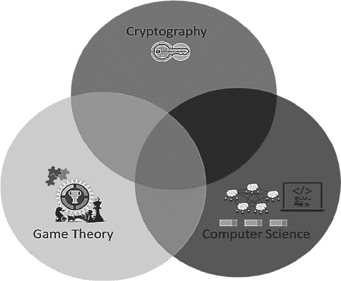图 2-1 区块链的核心让我们从高层次上看看这些组件在区块链系统中的作用，并最终深入到基本原理。在此之前，让我们快速回顾一下传统集中式系统是如何工作的。传统的方法是，将有一个集中的实体来维护一个交易/修改历史。这是为了对整个数据库进行并发控制，并通过中介注入信任。那么这样一个稳定的系统有什么问题呢？一个集中式系统必须被信任，无论涉及的人是否诚实！此外，由于中介和交易时间造成的成本可能更大。现在想想权力的集中；拥有整个系统的完全控制权，使集中式权威能够做几乎任何他们想做的事情。现在，让我们来看看区块链是如何利用密码学、博弈论和计算机科学概念解决这些由于集中式中介而产生的问题的。无论用例如何，交易都使用密码学进行保护。利用密码学，可以确保一个有效的用户正在发起交易，没有人能伪造欺诈性交易。这意味着，从密码学上可以确保爱丽丝绝对不能通过伪造鲍勃的签名来代表他进行交易。那么，如果一个节点或用户试图发起双重支付攻击（例如，一个人只有 10 美元，却试图付给多个人）会怎样？在这里仔细注意——尽管资金不足，仍然可以发起双重支付，这在密码学上是正确的。防止双重支付的唯一方法是让每个节点都知道所有的交易。现在，这导致了一个有趣的问题。既然每个节点都应该维护交易数据库，他们如何达成对共同数据库状态的共识？再次，系统如何对一种或多种计算节点故意试图破坏系统并尝试注入欺诈性数据库状态的情况保持免疫？绝大多数这类问题都属于拜占庭将军问题（稍后描述）。嗯，它因为区块链而变得更加流行，但它已经存在很长时间了。如果你看看数据中心解决方案，或分布式数据库解决方案，拜占庭将军问题是它们为保持容错性而处理的明显和常见问题。这些情况和它们的解决方案实际上来自博弈论。博弈论领域提供了一种截然不同的方法来确定系统将如何行为。博弈论中的技术是有争议的最复杂和最现实的技术。它们通常从不考虑一个节点是否诚实、恶意、道德或有其他任何特征，并相信参与者根据他们获得的优势行动，而不是根据道德价值观。博弈论在区块链中的唯一目的是确保系统稳定（即纳什均衡）并获得参与者之间的共识。不同的商业问题和情况有不同的复杂程度。因此，不同用例下的底层密码学和博弈论共识协议可能会有所不同。然而，保持一致的经过验证的交易日志或数据库的原则是相同的。尽管密码学和博弈论的概念已经存在很长时间了，但正是计算机科学部分通过数据结构和点对点网络通信技术将这些零散的部分缝合在一起。显然，实现数字世界中任何逻辑或数学概念所需的“智能软件工程”是必不可少的。然后，计算机科学工程技术将密码学和博弈论概念融入应用程序中，使用数据结构和网络通信组件使节点之间实现去中心化和分布式计算。

## 密码学

密码学是区块链最重要的组成部分。它当然是一个自身的研究领域，并且基于先进的数学技术，这些技术相当复杂难以理解。我们将在本节中尝试深入了解一些密码学概念，因为不同的问题可能需要不同的密码学解决方案；一种尺寸从未适合所有人。您可能可以跳过一些详细信息或按需参考，但这是确保系统安全的最重要组成部分。由于设计薄弱或密码学实现不当，钱包和交易所已经报道了许多黑客攻击。密码学已经有两千多年的历史了。它是使用加密技术保持事物机密的科学。然而，机密性并不是唯一的目标。密码学的各种其他用途如以下列表所示，我们将在稍后探索：

+   机密性：只有预期的或授权的接收者才能理解信息。它也可以被称为隐私或秘密。

+   数据完整性：数据不能被对手有意或因无意/意外错误而伪造或修改。尽管数据完整性不能防止数据的更改，但它可以提供一种检测数据是否被修改的方法。

+   认证：发送者的真实性得到保证，并可以被接收者验证。

+   不可否认性：发送者发送信息后，不能否认他们发送了该信息。这意味着一个实体（一个人或一个系统）不能拒绝先前的承诺或行为的所有权。

任何以文本消息、数字数据或计算机程序形式存在的信息都可以称为明文。想法是使用加密算法和密钥生成密文。然后可以将密文传输给预期接收者，接收者使用解密算法和密钥解密以获取明文。

### 对称密钥加密

在上一节中，我们了解了 Alice 如何加密一条消息并将密文发送给 Bob。Bob 然后可以解密密文以获取原始消息。如果加密和解密使用相同的密钥，这被称为对称密钥加密。这意味着 Alice 和 Bob 必须就一个称为“共享密钥”的密钥（k）达成一致，然后才能交换密文。所以，过程如下：Alice—发送者：

+   使用加密算法 E 和密钥 k 加密明文消息 m 以准备密文 c

+   c = E(k, m)

+   将密文 c 发送给 Bob

Bob—接收者：

+   使用相同的密钥 k 和解密算法 D 解密密文 c 以获取明文 m

+   m = D(k, c)

你是否注意到发件人和收件人使用了相同的密钥（k）？他们如何就相同的密钥达成一致并相互共享它呢？显然，他们需要一个安全的分发渠道来共享密钥。通常情况下，它看起来如图 2-3 所示。图 2-3 对称加密对称密钥密码学被广泛使用，最常见的用途是安全的文件传输协议，如 HTTPS、SFTP 和 WebDAVS。对称加密系统通常在数据量巨大时更快、更实用。请注意，对称密钥密码学存在两种变体：流密码和块密码。我们将在接下来的章节中讨论这些内容，但在此之前，我们将先了解克克霍夫原则和 XOR 函数，以便理解加密系统的工作原理。

#### 克克霍夫原则和 XOR 函数

克克霍夫原则指出，加密系统应该是安全的，即使系统的所有信息都是公开的，除了密钥。另外，一般的假设是消息传输通道从不安全，消息在传输过程中很容易被拦截。这意味着即使加密算法 E 和解密算法 D 是公开的，并且存在消息在传输过程中可能被拦截的情况，由于存在共享密钥，消息仍然是安全的。因此，在对称加密系统中密钥必须保密。XOR 函数是许多加密和解密算法的基本构建模块。让我们来看一下它，以了解它如何实现密码学。XOR，又称为“异或”，用符号 ⊕ 表示，可以由以下真值表表示（表 2-1）。表 2-1 XOR 真值表

| A | B | A ⊕ B |
| --- | --- | --- |
| 0 | 0 | 0 |
| 1 | 0 | 1 |
| 0 | 1 | 1 |
| 1 | 1 | 0 |

XOR 函数具有以下属性，了解密码学背后的数学很重要：

+   结合性：A ⊕ (B ⊕ C) = (A ⊕ B) ⊕ C

+   交换性：A ⊕ B = B ⊕ A

+   否定：A ⊕ 1 = Ā

+   身份：A ⊕ A = 0

利用这些性质，现在就可以理解如何使用明文“m”和密钥“k”计算密文“c”，然后使用相同的密钥“k”解密密文“c”以获得明文“m”。同样的异或函数用于加密和解密。m ⊕ k = c，c ⊕ k = m。前面的例子是最简单的形式，以便理解加密和解密的方法。请注意，通过与密钥进行异或运算就可以轻松获得原始明文消息，而密钥是一种共享的秘密，只有预期的各方知道。每个人都可能知道这里的加密或解密算法是异或，但不知道密钥。

#### 流密码与分块密码

流加密算法和块加密算法在明文信息的编码和解码方式上有所不同。流加密算法将明文的一个符号转换成密文的一个符号。这意味着加密是逐比特或逐字节地进行的。在逐比特加密的情况下，为了加密明文的每一个比特，会生成并使用不同的密钥。因此，它使用无限长的伪随机比特流作为密钥，并与明文的输入比特进行异或操作来生成密文。为了保持这样的系统安全，伪随机密钥流生成器必须足够安全且不可预测。流加密是对一种已证明完美的加密算法——“一次性密码本”的一种近似，我们稍后会讨论到它。伪随机密钥流是如何生成的呢？它们通常是基于随机种子值，使用数字移位寄存器逐个生成。流加密相对简单且执行速度快。可以在离线时生成伪随机比特，并快速解密，但在大多数情况下，它需要同步。我们了解到，生成密钥流的伪随机数生成器是确保安全性的关键部分——这也是其最大的缺点。伪随机数生成器在过去已经被攻击过很多次，这导致了流加密的弃用。最广泛使用的流加密算法是 RC4（Rivest Cipher 4），它用于 SSL、TLS 和 Wi-Fi WEP/WPA 等众多协议。后来发现 RC4 存在漏洞，Mozilla 和微软建议尽可能不要使用它。另一个缺点是，输入文本的一个比特中的所有信息都包含在其对应的密文比特中，这是扩散性低的问题。如果信息的一个比特在密文输出中分散到多个比特，它可能会有更高的安全性，这在块加密中是这种情况。流加密的例子有一次性密码本、RC4、FISH、SNOW、SEAL、A5/1 等。另一方面，块加密是基于将明文划分为相对较大的固定长度比特组，并使用相同的密钥分别对每个块进行编码的理念。它是一种使用对称密钥的不变变换确定性算法。这意味着当你用相同的密钥加密相同的明文块时，你会得到相同的结果。每个块的常见大小是 64 位、128 位和 256 位，称为块长度，其生成的密文块也是相同的长度。我们选择一个 r 位的密钥 k 来加密每个长度为 n 的块，然后注意到我们将密钥 k 的排列限制在 2^r 的一个非常小的子集上。这意味着“完美加密”的概念不适用。然而，选择 r 位秘密密钥的随机性很重要，因为更多的随机性意味着更多的机密性。为了在块加密密码学中加密或解密消息，我们必须将它们放入一个“操作模式”，它定义了如何将加密的一次块操作反复应用于大于一个块的数据量。嗯，操作模式不仅仅是将数据划分为固定大小的块，它还有更大的作用。我们了解到块加密是一种确定性算法。这意味着具有相同数据的块，当使用相同的密钥加密时，将产生相同的密文——非常危险！它会泄露很多信息。这里的想法是以某种方式将明文块与刚刚创建的密文块混合，使得对于相同的输入块，它们的对应密文输出是不同的。当我们接下来讨论 DES 和 AES 算法时，这将变得更清晰。请注意，不同的操作模式会导致实现不同的属性，从而增加基础块加密的安全性。虽然我们不会深入探讨操作模式的细节，但这里有一些供您参考的操作模式名称：电子密码本（ECB）、密文块链式（CBC）、密文反馈（CFB）、输出反馈（OFB）和计数器（CTR）。与流加密相比，块加密在加密或解密方面要慢一些。与流加密中错误传播较少的情况不同，这里的每一个比特错误都可能导致整个块损坏。相反，块加密具有高扩散性的优点，这意味着每个输入明文比特都分散在几个密文符号中。块加密的例子有 DES、3DES、AES 等。

#### 一次性密钥

这是一个对称流密码，其中明文、密钥和密文都是位串。此外，它完全基于“完全随机”的密钥（而非伪随机）假设，使用它可以实现“完美保密”。另外，根据设计，密钥只能使用一次。这个问题是密钥至少应与明文一样长。这意味着如果你要加密一个 1GB 的文件，密钥也将是 1GB!这在许多实际情况下是不切实际的。示例：表 2-2 使用异或函数的加密示例

| 纯文本 | 1 | 0 | 0 | 1 | 1 | 1 | 0 | 0 | 1 | 0 | 1 | 0 | 1 | 1 | 0 | 1 | 1 | 0 |
| --- | --- | --- | --- | --- | --- | --- | --- | --- | --- | --- | --- | --- | --- | --- | --- | --- | --- | --- |
| 密钥 | 0 | 1 | 0 | 0 | 1 | 1 | 0 | 1 | 1 | 1 | 0 | 0 | 1 | 0 | 1 | 0 | 1 | 1 |
| 密文 | 1 | 1 | 0 | 1 | 0 | 0 | 0 | 1 | 0 | 1 | 1 | 0 | 0 | 1 | 1 | 1 | 0 | 1 |

你可以参考前一部分的异或真值表来找出如何通过将明文与密钥异或来生成密文。注意明文、密钥和密文都是 18 位长。在这里，接收者在收到密文后可以简单地再次与密钥异或得到明文。你可以用自己的表 2-2 试试，你会得到相同的明文。这种一次性密钥的主要问题是实践性，而不是理论性。发送者和接收者如何就一个他们可以使用的秘密密钥达成一致？如果发送者和接收者已经有了一个安全的通道，他们还需要密钥吗？如果他们没有安全的通道（这就是我们使用密码学的原因），那么他们如何安全地共享密钥？这被称为“密钥分发问题”。

#### 数据加密标准

数据加密标准（DES）是一种对称块加密技术。它使用 64 位的块大小和 64 位的密钥进行加密和解密。在 64 位密钥中，8 位用于奇偶校验，技术上 56 位是密钥长度。已经证明它容易受到暴力攻击，并且可能在不到一天的时间内被破解。考虑到摩尔定律，未来它可能会更快地被破解，因此由于密钥长度，其使用已经被大大废弃。它曾经非常流行，并被用于银行应用、ATM 和其他商业应用中，尤其是在硬件实现中而不是软件。我们在此部分提供一个高级描述 DES 加密。在对称密码学中，大量块加密使用一种称为“费斯特征密码”或“费斯特征网络”的设计方案。费斯特征密码由多个轮次处理明文和密钥，每一轮都包括一个替换步骤后跟一个置换步骤。轮次越多，它可能越安全，但加密/解密速度会变慢。DES 基于 16 轮的费斯特征密码。DES 算法的一般步骤序列如图 2-4 所示。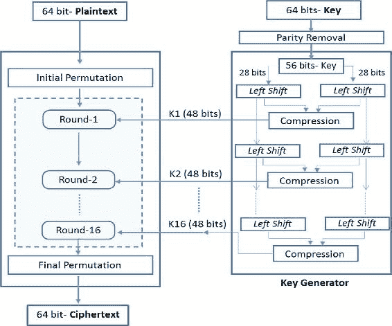图 2-4DES 加密让我们先谈谈密钥生成器，然后我们再进入加密部分。

+   正如前面提到的，密钥也是 64 位长。由于 8 位用于奇偶校验位（更准确地说，是第 8 位、第 16 位、第 24 位、第 32 位、第 40 位、第 48 位、第 56 位和第 64 位），因此只有 56 位用于加密和解密。

+   在去除奇偶校验位之后，56 位的密钥被分成两个 28 位的块。然后在每一轮中，它们以位为单位向左移动。我们知道 DES 使用 16 轮费斯特征网络。注意这里，每一轮都取上一轮左移的位块，然后在当前轮再次左移一位。

+   然后通过压缩机制将两个左移的 28 位块结合起来，输出一个 48 位密钥，称为子密钥，用于加密。同样，在每一轮中，前一轮的两个 28 位块再次左移一位，然后组合并压缩成 48 位密钥。这个密钥随后被输入到该轮的加密函数中。

现在让我们来看看 DES 是如何使用费斯特征网络轮对进行加密的：

+   首先，明文输入被分成 64 位块。如果消息中的位数不能被 64 整除，那么最后一个块将被填充以使其成为一个 64 位块。

+   每个 64 位的输入数据块都要经过一个初始置换（IP）轮。它通过交换输入块中的输入位来重新排列所有 64 位输入，以特定的模式进行置换。它本身并没有实际的加密意义，其目的是为了将明文/密文以字节格式更容易地加载到 DES 芯片中。

+   在 IP 轮之后，64 位块被分成两个 32 位块，一个左块（L）和一个右块（R）。在每一轮中，块被表示为 L[i]和 R[i]，其中下标“I”表示轮次。所以，IP 轮的结果表示为 L[0]和 R[0]。

+   现在，Feistel 轮开始。第一轮取 L[0]和 R[0]作为输入，并按照以下步骤进行：

    +   右侧的 32 位块（R）直接送到左侧，左侧的 32 位块（L）通过与该轮的密钥 k 和右侧的 32 位块（R）进行操作如下：

    +   L[i] = R[i] -1

    +   R[i] = L[i] -1 ⊕ F(R[i] -1, K[i]) 其中“I”是轮数

    +   F()被称为“密码函数”，实际上是每一轮的核心部分。在这个 F()操作中有多个步骤或操作被捆绑在一起。

    +   在第一步，32 位 R 块的操作被扩展并置换以输出一个 48 位块。

    +   在第二步，这个 48 位块然后与同一轮密钥生成器提供的 48 位子密钥进行异或。

    +   在第三步，这个 48 位的异或输出被送入置换盒，将比特减少到 32 位。这个 S 盒中的置换操作是 DES 中唯一的非线性操作，对算法的这种安全性贡献很大。

    +   在第四步中，S-盒的 32 位输出被送入置换盒（P-盒），这只是一个置换操作，输出一个 32 位块，这实际上是 F()密码函数的最终输出。

    +   F()的输出然后与 32 位 L 块进行异或，这是本轮的输入。这个异或输出然后成为本轮的最终 R 块输出。

    +   参考图 2-5 以了解每一轮中发生的各种操作。

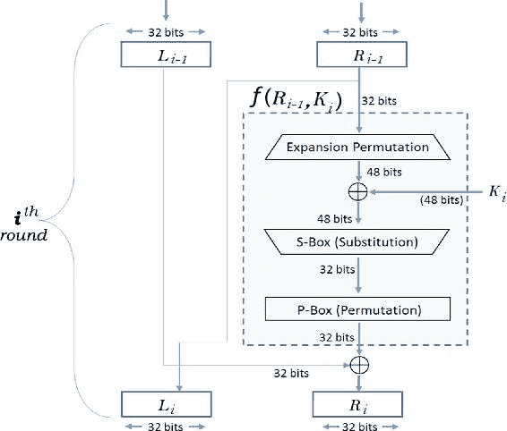图 2-5 DES 的轮函数

+   之前讨论的 Feistel 轮重复 16 次，其中每一轮的输出作为下一轮的输入。

+   一旦所有 16 轮都结束，第 16 轮的输出又被交换，使得左边的变成右块，反之亦然。

+   然后，这两个块组合成一个 64 位块，并通过一个置换操作，这是初始置换函数的逆操作，结果是 64 位密文输出。

我们了解了 DES 算法是如何真正工作的。解密也是以相反的顺序类似地工作。我们不会深入了解那些细节，但留给你去探索。让我们总结一下 DES 的局限性。56 位的密钥长度容易受到暴力攻击，而用于每一轮替换的 S 盒也容易受到密码分析攻击，因为有一些固有的弱点。正因为这些原因，高级加密标准（AES）尽可能地取代了 DES。现在许多应用程序都选择 AES 而不是 DES。

#### 高级加密标准

像 DES 一样，AES 算法也是一种对称分组密码，但它不是基于 Feistel 网络。AES 使用的是更广义上的替换-排列网络。它不仅提供了更高的安全性，还提供了更快的速度！根据 AES 标准，块大小固定为 128 位，可以选择三种密钥：128 位、192 位和 256 位。根据密钥的选择，AES 被称为 AES-128、AES-192 和 AES-256。在 AES 中，加密轮数取决于密钥长度。对于 AES-128，有十轮；对于 AES-192，有 12 轮；对于 AES-256，有 14 轮。在本节中，我们的讨论限于密钥长度 128（即 AES-128），因为其他 AES 变体的过程几乎相同。唯一变化的是“密钥调度”，我们将在本节后面进行探讨。与 DES 不同，AES 加密轮次是迭代的，每轮操作整个 128 位数据块。此外，与 DES 不同，AES 的解密过程与加密过程不太相似。为了了解每轮的处理步骤，请将 128 位块视为 16 个字节，其中每个字节按 4×4 矩阵排列如下所示：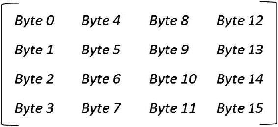这个 4×4 的字节矩阵被称为状态数组。请注意，每轮都消耗一个输入状态数组并生成一个输出状态数组。AES 还使用了一个术语“字”，我们需要在进一步讨论之前对其进行定义。字节由八个位组成，而字由四个字节组成，即 32 位。状态数组中每列的四个字节形成 32 位的字，可以称为状态字。状态数组可以表示如下：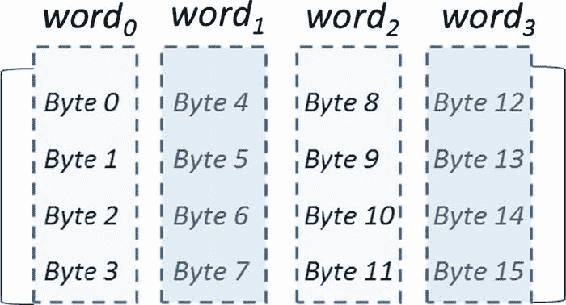另外，每个字节可以用两个十六进制数表示。例如：如果 8 位字节是{00111010}，它可以用“3A”在十六进制表示法中表示。"3"代表左边的四个位“0011”，“A”代表右边的四个位“1010”。现在，为了概括每一轮，每一轮的处理都是在字节级别进行，包括字节级别的替换和字级别排列，因此它是一个替换-排列网络。当我们讨论每轮的各种操作时，将详细介绍这些细节。AES 的整体加密和解密过程可以在图 2-6 中表示。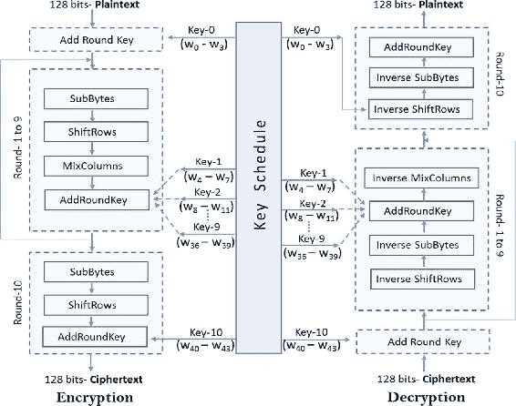图 2-6AES 加密如果仔细观察图 2-6，你会注意到解密过程不仅仅是加密的相反。轮次中的操作顺序不同！轮次函数的所有步骤——SubBytes、ShiftRows、MixColumns、AddRoundKey——都是可逆的。同时，请注意轮次是迭代性质的。第 1 轮到第 9 轮都有四个操作，最后一轮只省略了“MixColumns”操作。现在让我们建立对每轮函数中发生每个操作的高级理解。SubBytes：这是一个替换步骤。在这里，每个字节用两个十六进制数字表示。例如，假设有一个字节{00111010}用两个十六进制数字表示，比如{3A}。为了找到其替换值，参考 S-盒查找表（16×16 表格）以找到 3 行和 A 列对应的值。所以，对于{3A}，相应的替换值将是{80}。这一步为密码提供了非线性特性。ShiftRows：这是一个变换步骤，基于状态数组的矩阵表示。它包括以下移位操作：

+   第一行不进行旋转，保持原样

+   将第二行向左旋转一位字节

+   将第三行向左旋转两位字节

+   将第四行（最后一行）向左旋转三位字节

它可以用以下方式表示：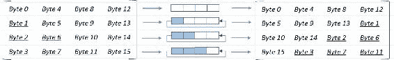MixColumns：这也是一个转换步骤，其中状态的四列都乘以一个固定的多项式（C[x]），并转换成新的列。在这个过程中，每一列的字节映射到一个新值，这个值是列中所有四个字节的一个函数。这通过状态的矩阵乘法实现，如下所示：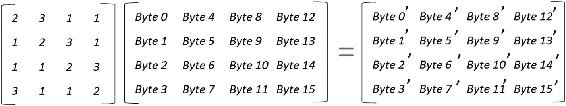矩阵乘法像往常一样，但异或积是异或运算。让我们看一个例子来理解这个过程。字节 0’的计算如下：Byte 0’ = (2 . Byte0) ⊕ (3 . Byte1) ⊕ Byte3 ⊕ Byte4 需要注意的是，这个 MixColumns 步骤，连同 ShiftRows 步骤，为密码提供了必要的扩散性质（一个字节的信息扩散到多个字节）。AddRoundKey：这又是一个转换步骤，其中 128 位轮密钥与状态的 128 位按列优先顺序进行位异或运算。所以，操作是按列进行的，意味着一个单词状态列的四个字节与一个轮密钥的单词进行异或。就像我们表示 128 位明文块一样，128 位密钥也应该以同样的 4 × 4 矩阵表示，如下所示：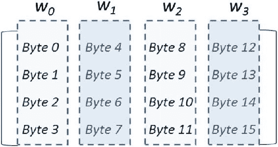128 位密钥这个操作影响一个状态的每一个比特。现在，回想一下，有十个轮次，每个轮次都有自己的轮密钥。由于在轮次开始前有一个“AddRoundKey”步骤，实际上有十一个（10 + 1）AddRoundKey 操作。在一个轮次中，所有 128 位的子密钥，即所有四个子密钥的单词，都与 128 位的输入数据块进行异或。因此，总共我们需要 44 个密钥单词，从 w[0]到 w[43]。这就是为什么 128 位密钥必须通过密钥扩展操作的原因，我们稍后会了解到这一点。注意，这里的密钥单词[w[0], w[1], w[2], w[3]]在与初始输入块进行异或之前，在基于轮次的处理开始之前。剩下的 40 个单词密钥，从 w[4]到 w[43]，在每个轮次中以四个单词一次的方式使用。AES 密钥扩展：AES 密钥扩展算法输入一个 128 位密钥（四单词密钥）并产生 44 个密钥单词的调度。这个算法的目的是设计这个系统，使得密钥的一位变化会显著影响所有的轮密钥。密钥扩展操作设计为每个四单词密钥的分组产生下一个四单词密钥的分组，基于四个单词到四个单词的基础。用图解来解释这个很容易，所以让我们来看看：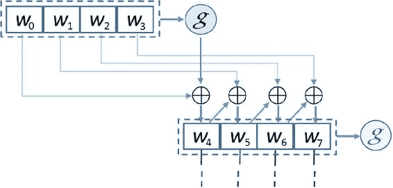图 2-7AES 密钥扩展我们可以通过参考这个图来快速了解密钥扩展过程中发生的操作：

+   初始的 128 位密钥是[w[0], w[1], w[2], w[3]]，安排成四个单词。

+   现在看看扩展后的单词：`w[4]`、`w[5]`、`w[6]`、`w[7]`。注意`w[5]`依赖于`w[4]`和`w[1]`。这意味着每个扩展单词都依赖于紧邻的前一个单词，即`w[i] - 1`，以及四个位置前的单词，即`w[i] - 4`。也试试`w[6]`。正如你所看到的，这里只进行了一个简单的异或操作。

+   那么`w[4]`呢？或者，任何其他四个位置的倍数，比如`w[8]`或`w[12]`？对于这些单词，使用了一个更复杂的函数，称为“g”。它基本上是一个三步函数。第一步，输入的四字块进行循环左移一个字节。例如，`[w[0], w[1], w[2], w[3]]` 变成了 `[w[1], w[2], w[3], w[0]]`。第二步，将四个字节的输入单词（例如，`[w[1], w[2], w[3], w[0]]`）作为输入，并对每个字节应用 S 盒进行字节替换。然后，在第三步，将第二步的结果与称为轮常数`Rcon[]`的某个东西进行异或。轮常数是一个右三个字节总是为零的字符串。例如，`[x, 0, 0, 0]`。这意味着`Rcon[]`的目的是 just perform XOR on the left-most byte of the step 2 output key word。还要注意，每个回合的`Rcon[]`都不同。这样，复杂函数“g”的最终输出就生成了，然后与`w[i] - 4`进行异或，得到`w[i]`，其中“I”是 4 的倍数。

+   这就是 AES 中密钥扩展的过程。

最后一轮的输出状态数组重新排列，形成 128 位密文块。同样，解密过程的顺序不同，我们在 AES 过程图中看到了这一点。目的是让你了解这个算法在高层是如何工作的，在本节中，我们将限制我们的讨论仅涉及加密过程。高级加密标准（AES）由美国国家标准与技术研究院（NIST）制定。它有一个处理时间长的局限性。假设你通过 AES 加密发送一个仅 1 兆字节（8388608 位）的文件。使用 128 位的 AES 算法，这个加密所需的步骤数为 8388608/128 = 65536 个数据块！采用并行处理方法，可以提高 AES 的效率，但当处理大量数据时仍然不太适用。

#### 对称密钥加密技术面临的挑战

对称密钥加密技术存在一些局限性。其中一些局限性如下：

+   在通信之前，发送方和接收方必须共享密钥。这需要一个安全的密钥建立机制。

+   发送方和接收方必须相互信任，因为它们使用相同的对称密钥。如果接收方被攻击者黑客攻击，或者接收方故意将密钥与他人分享，系统将受到威胁。

+   比如说，一个由 n 个节点的大型网络需要管理 n(n-1)/2 密钥对。

+   建议每个通信会话都更换一次密钥。

+   通常需要一个可信赖的第三方来进行有效的密钥管理，这本身就是一个大问题。

### 密码学哈希函数

哈希函数是数学函数中最重要的密码学原语，是区块链数据结构的一个组成部分。它们在许多密码学协议、信息安全应用（如数字签名和消息认证码（MACs））中得到广泛使用。由于它用于非对称密钥加密，我们将在讨论非对称加密之前先讨论它。请注意，本节涵盖的概念可能与学术教材不符，且偏向于区块链生态系统。密码学哈希函数是一类适合密码学的哈希函数，我们将限制我们讨论与此相关的内容。因此，一个密码学哈希函数是一个单向函数，它将任意长度的输入数据转换为固定长度的输出。输出通常被称为“哈希值”或“消息摘要”。它可以表示为如图 2-8 所示。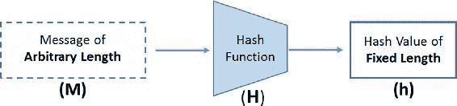图 2-8 哈希函数的基本形式为了使哈希函数能够发挥其设计目的并可用，它们应具有以下核心属性：

+   输入可以是任何大小任意字符串，但输出是固定长度，例如，256 位输出或 512 位输出等。

+   哈希值应当对于任何给定的消息能够有效计算。

+   它是确定性的，意思是当相同的输入提供给相同的哈希函数时，每次都会产生相同的哈希值。

+   从其哈希值反向推导和生成消息是不可行的（尽管不是不可能的！）除非尝试所有可能的消息。

+   消息的任何小变化都应该极大地影响输出哈希，以确保没有人能够在消息进行小变化后的新哈希值与旧哈希值之间建立关联。

除了上述核心属性外，它们还应满足以下安全属性，才能被视为一种密码学协议：

+   碰撞阻力：它意味着找到两个不同的输入，比如 X 和 Y，它们散列到同一个值是不切实际的。这使得散列函数 H()具有碰撞阻力，因为没有人能找到 X 和 Y，使得 H(X) = H(Y)。请注意，这个散列函数是一个压缩函数，因为它将给定的输入压缩到固定大小的输出，这个输出比输入短。所以，输入空间太大（任何大小的事物）与输出空间相比，输出空间是固定的。如果输出是一个 256 位的散列值，那么输出空间最多可以有 2²⁵⁶个值，不会超过这个范围。这暗示必须存在一个碰撞。然而，找到这个碰撞是非常困难的。根据“生日悖论”的理论，我们可以推断，通过使用输出空间的平方根，应该可以找到一个碰撞。所以，通过取 2¹²⁸ + 1 个输入，很可能会找到一个碰撞；但这是一个非常巨大的数字，计算起来非常不切实际！现在让我们讨论一下这种属性可能会有什么用处。在大多数在线存储、云文件存储、块存储、应用商店等地方，都广泛使用“碰撞阻力”这一属性来确保文件的完整性。例如：有人计算文件的 Message Digest 并上传到云存储。后来当他们下载文件时，他们可以再次计算 Message Digest 并进行核对。这样，可以确保文件是否因传输问题或可能因故意的尝试而损坏。正是由于碰撞阻力的属性，没有人能提出一个不同的文件或一个修改过的文件，它散列的值与原始文件相同。

+   预像抵抗性：这一特性意味着从计算角度来看，对一个哈希函数进行逆向工程是不可能的；也就是说，从输出 H(X) 找到输入 X 是不可行的。因此，这一特性也可以被称为“隐藏”特性。在这里要注意，这种情况还有一个微妙的方面。请注意，当 X 可以是世界上任何东西时，这个特性很容易实现。然而，如果 X 只能取有限几个值，并且这个值被对手所知道，他们可以很容易地计算出 X 的所有可能值，找出哪个值能散列出特定的结果。示例：一个实验室决定为实验的成功结果准备消息摘要，这样任何获取到结果数据库访问权限的对手都无法理解其中的内容，因为系统中存储的是散列后的输出。假设实验只有三个可能的结果，比如 OP111、OP112 和 OP113，其中只有一个是成功的，比如说 OP112。因此，实验室决定对它进行散列，计算 H(OP112)，并在系统中存储散列值。尽管对手不能从 H(OP112) 找到 OP112，但他们可以简单地对实验的所有可能结果进行散列，即 H(OP111)、H(OP112) 和 H(OP113)，并看到只有 H(OP112) 与系统中存储的值相匹配。这种情况当然是非常脆弱的！这意味着，当一个哈希函数的输入来自一个有限的取值空间，并且不是来自一个分散的分布时，它是脆弱的。然而，有一个解决办法，如下所述：

+   第二原像抗性：这一属性与“碰撞抗性”略有不同。它意味着，在给定输入 X 及其哈希 H(X)的情况下，找到 Y 使得 H(X) = H(Y)是不可行的。与碰撞抗性属性不同，这里讨论的是给定的 X，它是固定的。这表明如果一个哈希函数已经是碰撞抗性的，那么它也是第二原像抗性的。

有一个从前面提到的属性派生出来的另一个非常有用的属性，这在比特币中相当重要。让我们从技术角度深入探讨一下，当我们进入第三章时，看看比特币是如何利用它进行挖矿的。这个属性的名字叫“谜题友好性”。这个名称暗示了解决问题没有捷径，唯一的方法是遍历输入空间中的所有可能选项。我们在这里不会尝试定义它，而是直接尝试理解它的真正含义。让我们考虑这样一个例子：H(r || X) = Z，其中“r”从一个具有高最小熵的分布中选择，“X”是与“r”连接的输入，“Z”是哈希输出值。这个属性的意思是，对于一个敌手来说，找到一个精确哈希到“Z”的值“Y”是非常困难的。即，H(r' || Y) = Z，这里 r'是输入的一部分，像“r”一样以随机方式选择。这意味着，当输入的一部分被大大随机化时，用快速解决方案破解哈希函数是非常困难的；唯一的方法是测试所有可能的随机值。在前一个例子中，如果“Z”是一个 n 位输出，那么它只是 2^n 可能值中的一个。注意，你的输入的一部分，比如“r”，来自一个高最小熵分布，必须与你的输入 X 连接。现在来看看设计搜索谜题的有趣部分。假设 Z 是一个 n 位输出，是一组 2^n 可能的值，而不仅仅是确切的值。你被要求找到一个 r 的值，当它与 X 一起哈希时，它落在这个 2^n 值的输出集合中；然后它形成了一个搜索谜题。想法是找到所有可能的 r 值，直到它落入了 Z 的范围。注意这里，Z 的大小将输出空间限制在了 2^n 可能的值的一个较小的集合中。输出空间越小，问题越难。显然，如果范围很大，找到其中的一个值就越容易，如果范围相当狭窄，只有少数可能性，那么在这个范围内找到一个值就很难。这是输入到哈希函数中的“r”的美丽之处，它被称为“nonce”。无论你取什么随机值 r，它将与“X”连接，并多次通过同一个哈希函数，直到你得到满足 Z 所需范围的正确的 nonce 值“r”，除了尝试所有可能的值，没有其他的捷径！注意，对于一个 n 位哈希值输出，平均需要 2^n 的努力来破坏预图像和第二预图像阻力，以及 2^n/2 来破坏碰撞阻力。我们讨论了各种哈希函数的基本和安全属性。在接下来的章节中，我们将看到一些重要的哈希函数，并尽可能深入探讨。

#### 不同哈希函数的概述

最早的哈希函数或压缩函数之一是 MD4 哈希函数。它属于消息摘要（MD）系列。MD 系列的其它成员有 MD5 和 MD6，还有许多 MD4 的其他变体，如 RIPEMD。MD 系列算法通过消耗 512 位块产生一个 128 位的消息摘要。它们被广泛用作校验和，以验证数据完整性。许多文件服务器或软件仓库过去常常提供一个预计算的 MD5 校验和，用户可以将其与下载的文件进行比对。然而，在 MD 系列中发现了许多漏洞，因此它被弃用。另一个这样的哈希函数系列是安全哈希算法（SHA）系列。这个系列基本上有四个算法，如 SHA-0、SHA-1、SHA-2 和 SHA-3。这个系列中提出的第一个算法被称为 SHA，但后来随着安全修复和更新，出现了新的版本，因此给它起了一个后缀，变成了 SHA-0。被发现存在一个严重但未公开的安全漏洞，因此被废弃。后来，SHA-1 被提出作为 SHA-0 的替代品。SHA-1 有一个额外的计算步骤，解决了 SHA-0 的问题。SHA-0 和 SHA-1 都是 160 位哈希函数，块大小为 512 位。SHA-1 是由美国国家安全局（NSA）设计，用于数字签名算法（DSA）。它在许多安全工具和互联网协议（如 SSL、SSH、TSL 等）中得到了广泛应用。它还在 Mercurial、Git 等版本控制系统中用于一致性检查，并非真正用于安全。后来，大约在 2005 年，发现了它的密码学弱点，并在 2010 年之后被弃用。我们将在接下来的章节中详细介绍 SHA-2 和 SHA-3。

#### SHA-2

它属于 SHA 家族的哈希函数，但本身就是一个哈希函数家族。它有许多 SHA 变体，如 SHA-224、SHA-256、SHA-384、SHA-512、SHA-512/224 和 SHA-512/256。SHA-256 和 SHA-512 是最基础的哈希函数，其他变体都来源于此。SHA-2 家族的哈希函数在 SSL、SSH、TSL、PGP、MIME 等应用程序中广泛使用。SHA-224 是 SHA-256 的一个截断版本，具有不同的初始值或初始化向量（IV）。请注意，具有不同截断应用的 SHA 变体可以产生相同位长的哈希输出，因此不同 SHA 变体中应用不同的初始化向量，以便能够正确地区分它们。现在回到 SHA-224 的计算，它是一个两步过程。首先，使用与 SHA-256 中默认的不同的 IV 计算 SHA-256 值。其次，将结果的 256 位哈希值截断为 224 位；通常保留左边的 224 位，但选择权在你。SHA-384 是 SHA-512 的截断版本，正如 SHA-224 是 SHA-256 的截断版本一样。同样，512/224 和 SHA-512/256 也都是 SHA-512 的截断版本。你可能会想知道为什么存在“截断”这个概念？请注意，截断不仅限于我们刚才提到的那些，还可能存在其他各种变体。截断的主要原因可能如下：

+   一些应用程序需要特定长度的消息摘要，与默认的长度不同。

+   无论我们使用的是 SHA-2 的哪个变体，我们都可以根据我们希望维持的安全属性选择一个截断级别。示例：考虑到当今的计算能力，当需要抗碰撞性时，我们应该至少保留 160 位，而当只需要抗预图像性时，我们应该至少保留 80 位。这样的安全属性如抗碰撞性会随着截断而降低，但应该选择这样，即找到一个碰撞在计算上是不切实际的。

+   截断也有助于与较旧的应用程序保持向后兼容。例如：SHA-224 提供 112 位的安全性，可以与三 DES（3DES）的密钥长度相匹配。

谈到效率，SHA-256 是基于 32 位单词的，而 SHA-512 是基于 64 位单词的。因此，在 64 位架构上，与 SHA-1 或其他 SHA-256 变体相比，SHA-512 及其所有截断变体可以更快地计算，并且具有更高的安全性。表 2-3 是从 NIST 论文中摘取的表格，简要代表了 SHA-1 和不同 SHA-2 算法的特性。表 2-3SHA-1 & SHA-2 哈希函数一览！A440588_1_En_2_Figg_HTML.jpg 一般来说，如果没有必要，建议不要截断。某些哈希函数可以容忍截断，而有些则不行，这也取决于您的使用方式和上下文。

#### SHA-256 和 SHA-512

如前所述，SHA-256 属于 SHA-2 哈希函数家族，这个函数用于比特币！正如其名，它产生一个 256 位的哈希值，因此得名。所以，根据生日悖论，它可以提供 2¹²⁸位的安全性。回想一下，哈希函数接受任意长度的输入并生成固定大小的输出。任意长度的输入不是直接输入到压缩函数中的，而是在输入到压缩函数之前被分成固定长度的块。这意味着需要一种构建方法，可以通过从任意长度的输入数据构建固定大小的输入块，并通过压缩函数迭代并生成固定长度的输出。有各种类型的构建方法，如 Merkle-Damgård 构建、树构建和吸水构建。已证明，如果底层压缩函数是抗碰撞的，那么使用任何构建方法的整个哈希函数也应该是抗碰撞的。SHA-256 使用的构建方法是 Merkle-Damgård 构建，让我们看看它是如何工作的，如图 2-9 所示。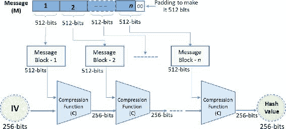图 2-9SHA-256 的 Merkle-Damgård 构建根据图表，以下步骤（以高层次呈现）按照指定顺序执行以计算最终哈希值：

+   如您在图中看到的，消息首先被划分为 512 位的块。当消息不是 512 位的整数倍（这通常是情况），最后一个块的字节数不足，因此需要填充以使其达到 512 位。

+   512 位块进一步分为 16 个 32 位单词的块（16 × 32 = 512）。

+   每个块都要经历 64 轮轮函数，其中每个 32 位单词都要经历一系列操作。轮函数是 XOR、AND、OR、NOT、位左/右移等常见函数的组合，我们在这本书中不会详细介绍这些内容。

与 SHA-256 相似，SHA-512 的步骤和操作也非常相似，因为 SHA-512 也使用了 Merkle-Damgård 构造。主要区别在于 SHA-512 中有 80 个轮函数，词长为 64 位。SHA-512 的块大小为 1024 位，进一步分为 16 个 64 位词的块。消息摘要的输出长度为 512 位，即八个 64 位词的块。当 SHA-512 开始势头强劲，并被许多应用程序采用时，有少数人开始转向 SHA-3 算法以应对未来。SHA-3 只是散列的一种不同方法，并不是 SHA-256 或 SHA-512 的真正替代，尽管它允许调整。我们将在接下来的章节中了解更多关于 SHA-3 的详细信息。

#### RIPEMD

RACE 完整性原语评估消息摘要（RIPEMD）散列函数是 MD4 散列函数的变体，设计考虑几乎相同。因为它在 Bitcoins 中使用，所以我们将在这里简要讨论它。最初的 RIPEMD 为 128 位，后来开发了 RIPEMD-160。这个算法的 128 位、256 位和 320 位版本分别称为 RIPEMD-128、RIPEMD-256 和 RIPEMD-320，但我们将在最受欢迎且广泛使用的 RIPEMD-160 上限制我们的讨论。RIPEMD-160 是一种基于 Merkle-Damgård 构造的密码散列函数。输入被分成 512 位块，当输入位不是 512 的倍数时应用填充。160 位的散列值输出通常表示为 40 位十六进制数。压缩函数由 80 个阶段组成，由两条并行的五轮 16 步的线路组成（5×16=80）。压缩函数对十六个 32 位的词（512 位块）进行操作。注意：Bitcoin 用于生成地址时同时使用 SHA-256 和 RIPEMD-160 散列。RIPEMD-160 用于进一步将 SHA-256 的散列值输出缩短至 160 位。

#### SHA-3

2015 年，Keccak（发音为“ket-chak”）算法被 NIST 标准化为 SHA-3。请注意，目的并不是真的要取代 SHA-2 标准，而是要与之互补共存，尽管在某些情况下可以选择 SHA-3 而不是 SHA-2。由于 SHA-1 和 SHA-2 都是基于 Merkle-Damgård 构造的，因此需要一种不同的哈希函数方法。因此，不使用 Merkle-Damgård 构造是 NIST 设定的标准之一。这是因为新设计不应受到 Merkle-Damgård 构造的限制，如多碰撞。Keccak，即 SHA-3，使用了一种不同的构造方法，称为吸收构造。为了使其向后兼容，要求 SHA-3 能够生成可变长度的输出，如 224、256、384 和 512 位，以及其他任意长度的输出。这样 SHA-3 就成为了一组加密哈希函数，如 SHA3-224、SHA3-256、SHA3-384、SHA3-512 以及两个可扩展输出函数（XOFs），称为 SHAKE128 和 SHAKE256。此外，SHA-3 必须有一个可调整的参数（容量），以允许在安全和性能之间进行权衡。由于 SHAKE128 和 SHAKE256 是 XOFs，它们的输出可以扩展到任何所需的长度，因此得名。以下图表（图 2-10）展示了 SHA-3（Keccak 算法）的高级设计方式。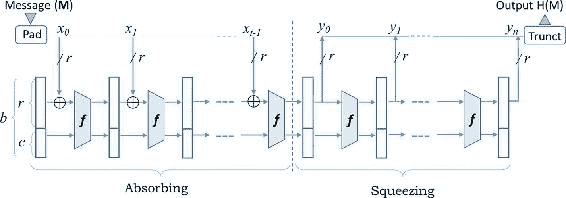图 2-10 SHA-3 的吸收构造一系列在 SHA-3 中发生的过程如下：

+   正如图 2-10 所示，消息首先被划分为大小为 r 位的块(x[i])。如果输入数据不是 r 位的倍数，那么需要进行填充。关于这个 r，你可能会好奇，但不用担心，我们稍后会讲解。现在，让我们关注填充是如何发生的。对于一个不是 r 倍数的消息块 x[i]，并且里面有一些消息 m，填充的发生如下所示：x[i] = m || P 1 {0}* 1“P”是一个预先确定的位串，后面跟着 1 {0}* 1，这意味着一个前导和后导 1 以及一些零（也可能没有零位），这可以使 x[i]成为 r 的倍数。表 2-4 展示了 P 的各种值。表 2-4 SHA-3 变体中的填充！A440588_1_En_2_Figh_HTML.jpg

+   正如图 2-10 所示，SHA-3 吸收构造大致分为两个阶段：第一个阶段是输入的“吸收”阶段，第二个阶段是输出的“压缩”阶段。在吸收阶段，消息块（x[i]）经历算法的各种操作，而在压缩阶段，计算出可配置长度的输出。注意，对于这两个阶段，都使用了同一个名为“Kecaak-f”的函数。

+   对于 SHA3-224、SHA3-256、SHA3-384、SHA3-512 的计算，这是 SHA-2 的有效替换，只使用第一个输出块 y[0] 的前几位进行所需的截断级别。

+   SHA-3 设计为可调整其安全强度、输入和输出大小，这要归功于调节参数。

+   正如您在图中所看到的，“b”代表状态的宽度，并且要求 r + c = b。另外，“b”取决于指数“ℓ”，即 b = 25 × 2^ℓ

+   由于“ℓ”可以取 0 到 6 的值，“b”可以有宽度 {25, 50, 100, 200, 400, 800 和 1600}。建议不要在实际中使用“b”的最小两个值，因为它们只是为了分析和对算法进行密码分析。

+   在方程 r + c = b 中，我们看到的“r”是我们用来预处理消息并划分为长度为“r”的块所用的。这称为“比特率”。另外，参数“c”称为容量，只需满足 r + c = b ∈ {25, 50, 100, 200, 400, 800, 1600} 并计算得出。这样“r”和“c”就被用作在安全和性能之间进行权衡的调节参数。

+   对于 SHA-3，指数值 ℓ 被固定为“6”，所以 b 的值为 1600 位。对于给定的 b = 1600，两个比特率值是允许的：r = 1344 和 r = 1088。这导致两个不同的“c”值。所以，当 r = 1344 时，c = 256，当 r = 1088 时，c = 512。

+   现在让我们看看该算法的核心引擎，即 Keccak-f，也称为“Keccak-f 置换”。每个 Keccak-f 中有“n”轮，其中“n”计算为：n = 12 + 2ℓ。由于 SHA-3 中 ℓ 的值为 6，每个 Keccak-f 将有 24 轮。每一轮都接受“b”位（r + c）的输入并产生同样数量的“b”位输出。

+   在每个轮次中，输入“b”被称为状态。这个状态数组“b”可以表示为一个三维（3-D）数组 b = (5 x 5 × w)，其中词大小 w = 2^ℓ。所以，w = 64 位，这意味着 5 × 5 = 25 个 64 位单词。回想一下，对于 SHA-3，ℓ = 6，所以 b = 5 × 5 x 64 = 1600。三维数组可以如图 2-11 所示展示！A440588_1_En_2_Fig11_HTML.jpg 图 2-11 SHA-3 中的状态数组表示

+   每个轮次由一个由五个步骤组成的序列组成，状态数组在每个步骤中都如 图 2-12 所示被操作！A440588_1_En_2_Fig12_HTML.jpg 图 2-12 每个 SHA-3 轮次的五个步骤

+   不过多详细介绍每个五个步骤，让我们快速了解它们在高级别上做什么：

    +   θ（Theta）步骤：它执行异或操作以提供轻微扩散。

    +   ρ（Rho）步骤：它对每个 25 个单词执行位旋转。

    +   π（Pi）步骤：它对每个 25 个单词执行置换。

    +   χ（Chi）步骤：在这个步骤中，位是通过将它们与其后续的两个位在行中结合来替换的。

    +   Iota（ι）步骤：它将一个轮常数 XOR 到一个状态字中，以打破对称性。

+   Keccak-f 的最后一轮产生了 y[0]输出，这对于 SHA-2 替换模式来说已经足够了，即 224、256、384 和 512 位的输出。注意 y[0]的最不重要位用于所需长度的输出。在可变长度输出的情况下，除了 y[0]之外，y[1]、y[2]、y[3]…的其它输出位也可以使用。

当我们谈论 SHA-3 的实际实现时，发现其在软件中的表现良好（虽然不如 SHA-2），在硬件中表现卓越（优于 SHA-2）。

#### 哈希函数的应用

密码学哈希函数在不同的情况下有许多不同的用途。以下是一些示例用例：

+   哈希函数用于验证信息的完整性和真实性。

+   哈希函数还可以用来在哈希表中索引数据。这可以加快搜索过程。我们不是根据整个数据搜索，而是根据哈希值（假设与整个数据相比，哈希值要短得多）进行搜索，那么显然会更快。

+   它们可以用来安全地验证用户，而不需要在本地存储密码。想象一个你不希望在服务器上存储密码的情况，显然是因为如果敌手黑进服务器，他们无法从存储的哈希值中获取密码。每次用户尝试登录时，输入密码的哈希值会被计算出来并与存储的哈希值进行匹配。安全，不是吗？

+   由于哈希函数是一对一函数，它们可以用来实现伪随机数生成器（PRNG）。

+   比特币使用哈希函数作为工作量证明（PoW）算法。当我们涉及到比特币章节时，我们将详细介绍它。

+   比特币还使用哈希函数生成地址以提高安全和隐私。

+   两个最重要的应用是数字签名和基于哈希的消息认证码（HMACs）的 MACs。

理解哈希函数的工作原理和属性，可以有各种各样的其他用例可以使用哈希函数。注：互联网工程任务组（IETF）在 1999 年采用了 SSL（SSLv3）协议的 3.0 版本，将其重命名为传输层安全（TLS）协议 1.0 版本（TLSv1），并在 RFC 2246 中定义了它。SSLv3 和 TLSv1 在基本操作方面是兼容的。

#### 哈希函数的代码示例

以下是一些不同哈希函数的代码示例。本节旨在为您提供关于如何程序化使用哈希函数的预警。代码示例是用 Python 编写的，但在不同的语言中会非常相似；你只需要找到正确的库函数来使用。

### MAC 和 HMAC

哈希消息验证码（HMAC）是一种验证码。正如其名，验证码的目的是使用对称密钥和哈希函数提供消息验证和完整性。因此，发送方会发送验证码和消息供接收方验证和信任。接收方已经拥有密钥 K（因为使用了对称密钥加密，所以发送方和接收方已经就它达成一致）；他们只是使用它来计算消息的验证码，并与发送的消息一起发送的验证码进行比对。在它的最简单形式中，验证码 = H(密钥 || 消息)。HMAC 实际上是一种将哈希函数转换为验证码的技术。在 HMAC 中，哈希函数可以多次与密钥及其派生密钥一起使用。HMAC 在 RFID 系统、TLS 等广泛使用。在 SSL/TLS（HTTPS 是 SSL/TLS 内部的一个传输层安全协议）中，HMAC 用于允许客户端和服务器验证并确保在传输过程中交换的数据没有被篡改。让我们来看几个广泛使用的重要验证码策略：

+   验证码后加密：这种技术要求在明文上计算验证码，将其附加到数据上，然后一起进行加密。这个方案不能提供密文的完整性。在接收端，必须先进行消息解密才能检查消息的完整性。它确保了明文的完整性，然而。TLS 使用这种验证码方案来确保客户端-服务器通信会话的安全。

+   先加密后验证：这种技术要求对消息或明文进行加密和验证码计算，然后将验证码附加到加密的消息或密文末尾。注意，验证码是在明文上计算的，因此可以确保明文的完整性，但不能确保密文的完整性，这为某些攻击留下了可能性。与之前的方案不同，明文的完整性可以被验证。SSH（安全外壳）使用这种验证码方案。

+   先加密后验证：这种技术要求明文首先进行加密，然后在对密文进行验证。这个密文的验证码随后被附加到密文本身。这个方案确保了密文的完整性，因此可以先检查其完整性，如果有效再进行解密。这种方法可以轻易地过滤掉无效的密文，因此在许多情况下都是高效的。另外，由于验证码是在密文而非明文上，所以不会透露关于明文的信息。这通常是所有方案中最理想的，并且应用更广泛。它被用于 IPsec。

### 非对称密钥加密

不对称密钥加密，也称为“公钥加密”，是由 Diffie 和 Hellman 引入的革命性概念。通过引入数字签名，他们使用这种技术解决了对称加密系统中的密钥分发问题。注意不对称密钥加密并没有消除对称密钥加密的需要。它们通常相互补充；一个的优点可以补偿另一个的缺点。

+   使用加密算法 E 和鲍勃的公钥 Puk[Bob]加密明文消息 m，准备密文 c。

+   c = E(Puk[Bob], m )

+   将密文 c 发送给鲍勃。

鲍勃——接收者：

+   使用解密算法 D 及其私钥 Prk[Bob]解密密文 c，以得到原始明文 m。

+   m = D(Prk[Bob], c)

如图 2-13 所示，这样的系统可以表示如下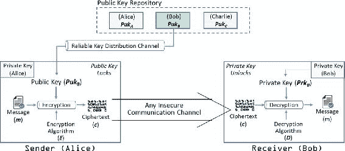2-13 不对称加密用于保密注意，公钥应保存在可以向所有人公开的公共仓库中，而私钥应作为严格保密的秘密保存。公钥加密也提供了一种认证方式。接收者鲍勃可以以同样的方式验证消息 m 的真实性。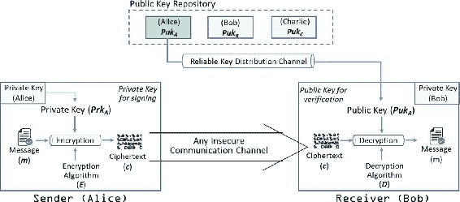2-14 不对称加密用于认证在图 2-14 的示例中，消息是使用爱丽丝的私钥准备的，因此可以确保它只来自爱丽丝。所以，整个消息起到了数字签名的作用。注意，保密和认证都是可取的。为了实现这一点，公钥加密必须使用两次。消息首先应使用发送者的私钥加密以提供数字签名。然后，它应该使用接收者的公钥加密以提供保密性。它可以表示为：

+   c = E[Puk [Bob] , E(Prk [Alice] , m)]

+   m = D[Puk [Alice] , D(Prk [Bob] , c)]

正如你所看到的，解密是按相反的顺序进行的。注意，公钥加密在这里被使用了四次：两次用于加密，两次用于解密。发送者可能通过将私钥应用于从要发送的消息中提取的小块数据来签署消息，而不是对整个消息应用。在现实世界中，像 Google Play 或 Apple App Store 这样的 App 商店要求在软件 App 发布之前，它们应该被数字签名。我们探讨了不对称加密中两个密钥的用途，可以总结如下：

+   公钥是众所周知的，并可供每个人访问。它们可以用来加密消息或验证签名。

+   私钥对个人来说非常私密。它们用来解密消息或创建签名。

在非对称或公钥加密中，不存在密钥分发问题，因为不再需要交换事先约定的密钥。然而，这种方法有一个显著的挑战。一个人如何确保他们用来加密消息的公钥真的是预期接收者的公钥，而不是入侵者或窃听者的呢？为了解决这个问题，引入了一个可信的第三方，称为公钥基础设施（PKI）。通过 PKI，通过数字签名将验证过的公钥嵌入安全证书中，从而确保公钥的真实性。PKI 的操作方式是提供经过验证的公钥。公钥加密方案也可以称为单向函数或陷门函数。这是因为使用公钥“Puk”加密明文“Ptm”是容易的，但反向操作在实际中是不可能的。没有人能够不 knowledge of the secret or private key “Prk”（实际上是需要泄露的信息）从加密的密文“Ctm”中推导出原始明文“Ptm”。此外，就密钥本身而言，它们在数学上是相关的，但通过计算找到一个从另一个是不切实际的。我们讨论了公钥加密的重要目标，如密钥建立、通过数字签名进行身份验证和非否认，以及通过加密实现机密性。然而，并非所有公钥加密算法都可能提供这三种特性。此外，这些算法在所基于的计算问题上有所不同，并相应地分类。某些算法，如 RSA，基于整数分解方案，因为大数的分解是困难的。某些算法基于有限域中的离散对数问题，如 Diffie-Hellman 密钥交换（DH）和 DSA。离散对数问题的泛化版本是椭圆曲线（EC）公钥方案。椭圆曲线数字签名算法（ECDSA）是其一个例子。我们将在下一节中介绍这些算法的大部分内容。

#### RSA

名为 RSA 的算法，以 Ron Rivest、Adi Shamir 和 Leonard Adleman 的名字命名，可能是最广泛使用的加密算法之一。它基于分解非常大的数是实际困难的。在 RSA 中，明文和密文是某些 n（n 为大于 1 的整数）之间的整数。我们将从两个方面讨论 RSA 方案：首先是密钥对的生成，其次是加密和解密的工作原理。由于模运算提供了密钥生成的机制，让我们快速了解一下。

##### 模运算

设 m 为一个正整数，称为模数。如果两个整数 a 和 b 对 m 同余，即：a ≡ b (mod m)，这意味着 a - b = m . k 对于某个整数 k。例子：如果 a ≡ 16 (mod 10)，那么 a 可以有以下解：a = ..., -24, -14, -4, 6, 16, 26, 36, 46。这些数中的任何一个减去 16 都是 10 的倍数。例如，-24 - 16 = -40，它是 10 的倍数。注意，a ≡ 36 (mod 10)也可以有相同的解。根据带余除法定理，只有一个独特的解“a”满足条件：0 ≤ a < m。在例子 a ≡ 16 (mod 10)中，只有值 6 满足条件 0 ≤ 6 < 10。这就是 RSA 算法加密/解密过程中将使用的。

##### 密钥对生成

正如前面所讨论的，私钥和公钥对对于任何参与非对称加密通信的方是必需的。在 RSA 方案中，公钥由(e, n)组成，其中 n 称为模数，e 称为公钥指数。同样，私钥由(d, n)组成，其中 n 是相同的模数，d 是私钥指数。让我们来看这些密钥是如何生成的，以及一个例子：

+   生成一对大的质数 p 和 q。为了便于理解，这里以两个小的质数为例。所以，让这两个质数分别为 p = 7 和 q = 17。

+   计算 RSA 模数(n)为 n = pq。这个 n 应该是一个大数，通常至少为 512 位。在我们的例子中，模数(n) = pq = 119。

+   找到一个公钥指数 e，使得 1 < e < (p - 1)(q - 1)，并且 e 和(p - 1)(q - 1)除以 1 外没有公共因子。这意味着 e 和(p - 1)(q - 1)是互质的。注意，满足这个条件的值可能有多个，可以作为 e 取值，但任何一个都可以。

+   在我们的例子中，(p - 1)(q - 1) = 6 × 16 = 96。所以，e 可以与 96 互质且小于 96。让我们取 e 为 5。

+   现在，数字对(e, n)构成公钥，并应公开。所以，在我们例子中，公钥是(5, 119)。

+   使用 p、q 和 e 计算私钥指数 d，考虑到 d 是模(p - 1)(q - 1)的 e 的逆元。这意味着 d 乘以 e 等于 1 模(p - 1)(q - 1)，且 d < (p - 1)(q - 1)。它可以表示为：

e d ≡ 1 (mod (p − 1)(q − 1))

+   请注意，乘法逆元是私钥和公钥之间的联系。虽然密钥不是相互生成的，但它们之间存在一种关系。

+   在我们的例子中，我们必须找到满足上述等式的 d，这意味着 5d = 1 模 96，同时 d < 96。

+   求解多个 d 值（可以使用欧几里得算法的扩展版本计算），我们可以看到 d=77 满足我们的条件。看数学：77×5=385 且 385−1=384 能被 96 整除因为 4×96+1=385

+   我们可以得出结论，在我们这个例子中，私钥将会是(77, 119)。

+   现在你已经得到了你的密钥对！

##### 使用密钥对进行加密/解密

一旦生成了密钥，加密和解密的过程就相当简单了。背后的数学如下：给定公钥（e, n）和明文消息 m，加密明文消息 m 得到密文消息 c 的过程如下：c = m . e (mod n)。给定私钥（d, n）和密文 c，解密密文消息 c 得到明文消息 m 的过程如下：m = c . d (mod n)。注意 RSA 方案是一个块加密方案，其中输入被划分为小块，RSA 算法可以处理。另外，明文和密文都是从 0 到 n - 1 的整数，对于某个整数 n，发送者和接收者都知道。这意味着输入的明文被表示为整数，当它通过 RSA 并变成密文时，它们又是整数，但不是输入的同一个整数；我们记得我们加密过它们吗？现在，考虑到前一个例子中的同样的密钥对，让我们通过步骤了解它是如何实际工作的：

+   发送者想要给拥有已知公钥的接收者发送一条文本消息，比如说公钥是(e, n)。

+   发送者将文本消息分解为可以表示为小于 n 的一系列数字的块。

+   可以使用明文 c = m e (mod n)找到密文等价物。如果明文(m)是 19，公钥是(5, 119)，e=5，n=119，那么密文 c 将会是 195(mod 119) = 2, 476, 099 (mod 119) = 66，这是余数，20,807 是商，我们不使用。所以，c = 66

+   当接收者在接收端收到密文 66 时，它需要使用 m = c d (mod n)来解密得到明文。

+   接收者已经拥有私钥（d, n），其中 d=77，n=119，并且收到了发送者的密文 c=66。所以，接收者可以轻松地用这些值恢复出明文 m = 6,677(mod 119) = 19

+   对于模运算计算，网上有许多可以使用的计算器，例如：[`comnuan.com/cmnn02/cmnn02008/`](http://comnuan.com/cmnn02/cmnn02008/)

我们研究了 RSA 算法背后的数学原理。现在我们知道，n（假设是一个非常大的数字）是公开可用的。尽管它是公开的，但将这个大数分解以获取素数 p 和 q 是非常困难的。RSA 方案就是基于分解大数的这个实际困难。如果 p 和 q 不够大，或者公钥 e 较小，那么 RSA 的强度就会下降。目前，RSA 密钥通常是 1024 到 2048 位长。请注意，RSA 加密的计算开销随着密钥大小的增加而增加。在数据量巨大的情况下，建议使用对称加密技术，并通过 RSA 等非对称加密技术共享密钥。此外，我们还研究了 RSA 的一个方面，即加密和解密。然而，它也可以通过数字签名用于认证。 just to give a high-level idea, one can take the hash of the data, sign it using their own private key, and share it along with the data. The receiver can check with the sender’s public key and ensure that it was the sender who sent the data, and not someone else. This way, in addition to secure key transport, the public key encryption method RSA also offers authentication using a digital signature. Note here that a different algorithm called digital signature algorithm (DSA) can also be used in such situations that we will learn about in the following section. RSA 广泛应用于 Web 浏览器、电子邮件、VPN 和卫星电视上的 HTTPS。此外，许多商业应用程序或应用商店中的应用也使用 RSA 进行数字签名。SSH 也使用公钥加密；当你连接到一个 SSH 服务器时，它会广播一个可以用来加密发送到该服务器数据的对公钥。然后，服务器可以使用其私钥来解密数据。

#### 数字签名算法

DSA 是由 NSA 设计的，作为数字签名标准（DSS）的一部分，并由 NIST 标准化。请注意，其主要目的是数字签名，而非加密。简单重述一下，RSA 既用于密钥管理也用于认证，而 DSA 只用于认证。另外，与基于大数因式分解的 RSA 不同，DSA 基于离散对数。在较高层次上，DSA 的使用如图 2-15 所示。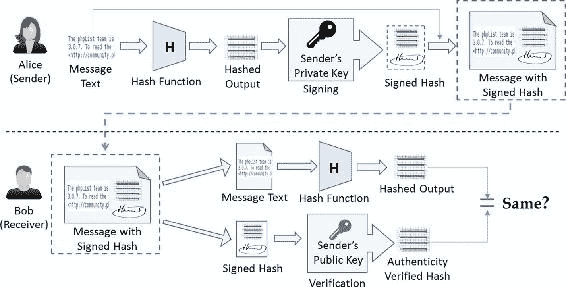图 2-15 数字签名算法（DSA）正如你在图 2-15 中所看到的，消息首先被哈希然后签名，因为这比先签名后哈希更安全。理想情况下，你希望在进行其他任何操作之前验证消息的真实性。所以，消息被签名后，签名的哈希被附在消息上发送给接收者。接收者可以检查消息的真实性并找到哈希值。另外，对消息再次哈希以获取哈希值，并检查两个哈希值是否匹配。这样，DSA 提供了以下安全特性：

+   真实性：由私钥签名，由公钥验证

+   数据完整性：如果数据被更改，哈希值将不匹配。

+   不可否认性：由于发送者已经签名，他们后期不能否认他们没有发送消息。在可能存在数据交换争议的情况下，不可否认性是最受欢迎的属性。例如，一旦电子方式下订单被放置，如果在这种情况下启用了不可否认性，购买者就不能否认购买订单。

典型的 DSA 方案包括三个算法：（1）密钥生成，（3）签名生成，（3）签名验证。

#### 椭圆曲线密码学

椭圆曲线密码学（ECC）实际上是从迪菲-赫尔曼密码学演变而来的。它被发现是实现公钥密码学的替代机制。它实际上指的是一套密码学协议，并且是基于与 DSA 相同的离散对数问题。然而，当应用于椭圆曲线上的点时，人们认为离散对数问题甚至更难。所以，ECC 为给定的密钥大小提供了更高的安全性。一个 160 位的 ECC 密钥被认为与一个 1024 位的 RSA 密钥一样安全。由于 ECC 中的较小密钥尺寸可以提供比其他公钥算法更高的安全性和性能，因此它广泛应用于小型嵌入式设备、传感器和其他物联网设备等。对于 ECC 有极其高效的硬件实现。ECC 是基于有限域上椭圆曲线的一组数学相关的数。另外，它与椭圆无关！从数学角度来看，椭圆曲线满足以下数学方程：y² = x³ + ax + b，其中 4 a³ + 27 b² ≠ 0 随着“a”和“b”的不同值，曲线呈现出不同的形状，如下面的插图所示：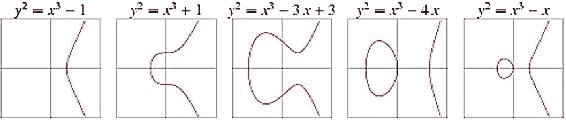椭圆曲线在密码学中使用有几个重要的特性，例如：

+   它们是水平对称的。即，曲线下方的 X 轴是对上方 X 轴的镜像。因此，曲线上的任何点在关于 X 轴反射后仍然保持在曲线上。

+   任何非垂直线最多与曲线相交于三个地方。

+   如果你考虑椭圆曲线上的两个点 P 和 Q，并通过它们画一条线，这条线可能正好在曲线上一处再相交。让我们称它为（-R）。如果你通过（-R）画一条垂直线，它将穿过曲线，比如说 R，这是点（-R）的镜像。现在，第三个性质意味着 P + Q = R。这被称为“点加法”，意味着在椭圆曲线上添加两个点将引导你到达曲线上的另一个点。请参考下面的插图，这些插图表示了这三个性质的图示。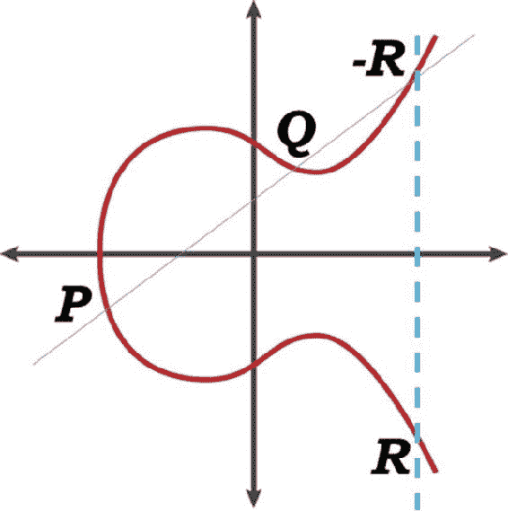

+   所以，你可以对曲线上的任意两个点应用点加法。现在，在前一个项目点中，我们对 P 和 Q 进行了点加法（P + Q），找到了-R，然后最终到达了 R。一旦我们到达 R，我们就可以从 P 到 R 画一条线，并看到这条线再次在图上与第三个点相交。然后我们可以取这个点，沿着一条垂直线移动，直到它再次与图相交。这成为了 P 和 R 的点加法。这个固定 P 的过程和结果点可以继续进行，直到我们想要多久，我们将继续得到曲线上的新点。

+   现在，如果我们对同一个点 P 应用操作，即 P 和 P（称为“点加倍”）。显然，通过 P 可以有无数条直线，所以我们只考虑切线。切线将在曲线上再交叉一个点，从那里垂直线将再次交叉曲线以达到最终值。这可以表示如下：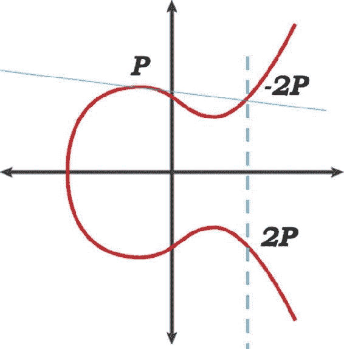

+   很明显，我们可以将点加倍应用“n”次到初始点，每次都会使我们到达曲线上的不同点。第一次将点加倍应用到点 P 时，它使我们到达了结果点 2P，正如你在图中看到的那样。现在，如果同样的操作重复“n”次，我们将到达曲线上的一个点，如下面的图所示：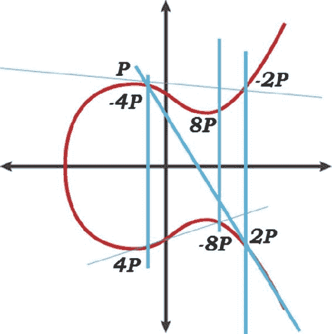

+   在前述场景中，当给出初始点和最终点时，没有办法可以说点加倍被应用了“n”次来达到最终的 resulting point，除非尝试所有的可能的“n”。这是 ECC 的离散对数问题，它指出，给定一个点 G 和 Q，其中 Q 是 G 的倍数，找到“d”使得 Q = dG。这形成了一个没有捷径的一向函数。在这里，Q 是公钥，d 是私钥。你能从公钥 Q 中提取私钥 d 吗？这是椭圆曲线的离散对数问题，计算上难以解决。

+   此外，曲线应该定义在一个有限域上，而不是带我们到无穷大！这意味着 X 轴上的“最大”值必须限制在某个值，所以当达到最大值时， just roll the values over。这个值用 P 表示（在这里图表中没有使用的 P），在 ECC 密码系统中称为“模”值，它也定义了密钥大小，因此是有限域。在 ECC 的许多实现中，选择了“P”的质数。

+   增加“P”的大小会在曲线上提供更多的可用值，从而提供更多的安全性。

+   我们观察到点加法和点加倍构成了寻找用于加密和解密值的基。

所以，为了定义一个 ECC，需要定义以下域参数：

+   曲线方程：y² = x³ + ax + b，其中 4a³ + 27b² ≠ 0

+   P: 指定曲线定义域（模值）上的有限域的质数

+   a 和 b: 定义椭圆曲线的系数

+   G: 曲线上的基点或生成点。这是所有点操作开始的地方，它定义了循环子群。

+   n: 曲线上的点操作次数，直到结果线变为垂直线。因此，它是 G 的阶，即最小的正数，使得 nG = ∞。它通常是质数。

+   h：它被称为“cofactor”，等于曲线的阶除以 n。这是一个整数值，通常接近 1。

请注意，ECC 是一种很好的生成密钥技术，但数字签名和密钥交换通常与其他技术一起使用。例如，椭圆曲线 Diffie-Hellman（ECDH）在密钥交换中相当流行，而 ECDSA 用于数字签名。

#### 椭圆曲线数字签名算法

ECDSA 是一种使用 ECC 进行密钥生成的 DSA 类型。正如其名所示，它的目的是数字签名，而非加密。在较小的密钥尺寸、更好的安全性和更高的性能方面，ECDSA 可以是 RSA 的一个更好的选择。它是比特币中使用的重要密码学组件之一！我们已经了解了数字签名如何用于在发送方和接收方之间建立信任。由于可以通过数字签名验证发送方的真实性和消息的完整性，因此两个未知方可以相互交易。请注意，在开始通信之前，发送方和接收方必须就域参数达成一致。

##### 密钥生成

由于域参数（P, a, b, G, n, h）是预先设定的，因此曲线和基点双方都知道。此外，使它成为有限域的素数 P 也知道（P 通常是 160 位，也可以更大）。所以，比如说，Alice 作为发送方，会执行以下操作来生成密钥：

+   选择一个随机整数 d，范围在 [1, n − 1] 内

+   计算 Q = d G

+   声明 Q 是公钥，将 d 作为私钥保存。

##### 签名生成

一旦密钥生成，发送方 Alice 会使用私钥“d”来签署消息（m）。因此，她会按照指定的顺序执行以下步骤来生成签名：

+   选择一个随机数 k，范围在 [1, n − 1] 内

+   计算 k.G 并找到新的坐标 (x[1], y[1]) 并找到 r = x[1] mod n

如果 r = 0，则重新开始

+   计算 e = SHA-1 (m)

+   计算 s = k ^(−1) (e + d . r) mod n

如果 s = 0，则从第一步开始重新再来

+   Alice 对消息（m）的签名现在将是 (r, s)

##### 签名验证

假设 Bob 是这里的接收方，并且可以访问发送方 Alice 的域参数和公钥 Q。作为一种安全措施，Bob 应该首先验证他拥有的数据，即域参数、签名和 Alice 的公钥 Q 都是有效的。为了验证 Alice 对消息（m）的签名，Bob 将按照指定的顺序执行以下操作：

+   验证 r 和 s 是否是 [1, n − 1] 区间内的整数

+   计算 e = SHA-1 (m)

+   计算 w = s ^(−1) mod n

+   计算 u[1] = e w mod n，并 u[2] = r w mod n

+   计算 X = u[1] G + u[2] G，其中 X 表示坐标，比如说 (x[2], y[2])

+   计算 v = x[1] mod n

+   如果 r = v，则接受签名，否则拒绝它

在本节中，我们探讨了 ECDSA 背后的数学原理。回想一下，我们在生成密钥和签名时使用了随机数。确保生成的随机数实际上是密码学上的随机数至关重要。在许多应用场景中，使用 160 位的 ECDSA 是因为它需要与 SHA-1 哈希函数匹配。在众多应用场景中，ECDSA 被用于数字证书。在其最简单形式中，数字证书包含一个公钥，以及设备 ID 和证书到期日期。这样，证书使我们能够验证公钥属于谁以及设备是否是所考虑网络中的合法成员。这些证书对于防止密钥建立协议中的“伪装攻击”非常重要。许多 TLS 证书基于 ECDSA 密钥对，这种使用持续增长。

#### 非对称密钥加密的代码示例

以下是一些不同公开密钥算法的一些代码示例。本节只是为了给你一个如何不同算法编程的预警。代码示例是用 Python 编写的，但在不同的语言中会非常相似；你只需要找到正确的库函数来使用。

### Diffie-Hellman 密钥交换

我们已经在之前的章节中了解了对称密钥加密技术。回忆一下，将秘密密钥在发送者和接收者之间共享是一个非常大的挑战。作为一个经验法则，我们现在知道，通信通道始终是不安全的。总是可能有伊娃试图在消息传输过程中拦截你的信息，使用各种不同的攻击方式。所以，DH 技术是为了安全地交换加密密钥而开发的。显然，你可能想知道在不安全的通信通道中如何实现安全的密钥交换。好吧，在本节的后面，你将看到 DH 技术实际上并不是在两个方之间共享整个秘密密钥，而是关于一起创建密钥。归根结底，重要的是发送者和接收者都有相同的密钥。然而，要记住的是，这并不是非对称密钥加密，因为密钥交换过程中并不进行加密/解密。实际上，这是我们后来设计非对称密钥加密的基础。我们现在研究这个技术的原因是因为我们已经在上一节中学到的很多数学知识在这里是有用的。在我们深入数学解释之前，首先尝试从高层次理解这个概念。看看下面的图（图 2-16），其中用颜色简单地解释了 DH 算法。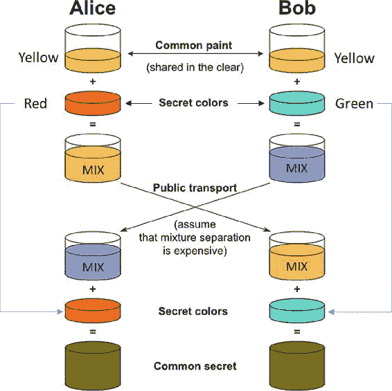图 2-16Diffie-Hellman 密钥交换说明请注意，在第一步中，只有黄色颜色被双方共享，这可能代表任何其他颜色或一个随机数。双方然后将自己的秘密加到里面，进行混合。这个混合物再次通过同一个不安全的通道共享。各方再将自己的秘密加到里面，形成他们最终的公共密钥。在这个用颜色举例的例子中，观察到公共密钥是相同颜色集合的组合。现在让我们看看生成密钥时实际发生的数学步骤：

+   艾丽丝和鲍勃同意 P=23 和 G=9。

+   艾丽丝选择私钥 a=4，计算 9⁴模 23=6 并发送给鲍勃。

+   鲍勃选择私钥 b=3，计算 9³模 23=16 并发送给艾丽丝。

+   艾丽丝计算 16⁴模 23=9。

+   鲍勃计算 6³模 23=9。

如果你遵循这些步骤，你会发现 Alice 和 Bob 都能在他们各自的一端生成相同的秘密密钥，该密钥可用于加密/解密。我们在这个例子中使用了小数字以便理解，但在实际应用中使用大素数。为了更好地理解，让我们通过以下代码片段来看看 DH 算法如何以简单的方式实现：/* 使用 Diffie-Hellman 密钥交换算法计算两个方之间的密钥 */// 返回 a^b mod P 的值 long long int power(long long int a, long long int b, long long int P){    if (b == 1)        return a;    else        return (((long long int)pow(a, b)) % P);}// DH 密钥计算的主程序 int main(){    long long int P, G, x, a, y, b, ka, kb;    // 双方同意公开密钥 G 和 P    P = 23; // 选取一个素数 P    printf("P 的值：%lld\n", P);    G = 9; // 选取 P 的一个原根 G    printf("G 的值：%lld\n\n", G);    // Alice 会选择私钥 a    a = 4; // a 是选择的私钥    printf("Alice 的私钥 a：%lld\n", a);    x = power(G, a, P); // 生成密钥    // Bob 会选择私钥 b    b = 3; // b 是选择的私钥    printf("Bob 的私钥 b：%lld\n\n", b);    y = power(G, b, P); // 生成密钥    // 在交换密钥后生成密钥   ka = power(y, a, P); // Alice 的密钥    kb = power(x, b, P); // Bob 的密钥    printf("Alice 的密钥是：%lld\n", ka);    printf("Bob 的密钥是：%lld\n", kb);    return 0;}注意虽然传统上使用离散对数问题（x^y mod p），但一般过程可以修改以使用椭圆曲线加密。

### 对称密钥加密与非对称密钥加密

我们研究了对称和非对称密钥算法的各个方面和类型。显然，它们的设计目标和含义是不同的。让我们进行比较分析，以便在正确的地方使用正确的算法。

+   对称密钥加密也被称为私钥加密。同样，非对称密钥加密也被称为公钥加密。

+   在对称密钥加密中，密钥交换或分发是一个大问题，与非对称密钥加密不同。

+   非对称加密相当计算密集，因为密钥的长度通常很大。因此，加密和解密的过程较慢。相反，对称加密较快。

+   对称密钥加密适用于长消息，因为加密/解密的速度快。非对称密钥加密适用于短消息，加密/解密的速率慢。

+   在对称密钥加密中，明文和密文中的符号会被置换或替换。而在非对称密钥加密中，明文和密文被视为整数。

+   在很多情况下，当使用对称密钥进行加密和解密时，非对称密钥技术用来共享和商定用于加密的密钥。

+   非对称密钥加密技术在不可信环境中应用最为广泛，当参与方之间没有先前的关系时。由于未知方之间没有先前的机会建立共享密钥，因此通过公钥加密技术来安全地共享敏感数据。

+   对称加密技术无法实现数字签名，而数字签名只能通过非对称加密技术来实现。

+   另一个很好的例子是节点之间进行通信所需的密钥数量。如果你认为在对称密钥加密 needed? This problem of finding the keys needed can be approached as a complete graph problem with order 100\. Like each vertex requires 99 connected edges to connect with everyone, every participant would need 99 keys to establish secured connections with all other nodes.So, in total, the keys needed would be 100 * (100 − 1)/2 = 4,950\. It can be generalized for “n” number of participants as n * (n − 1)/2 keys in total. With an increased number of participant, it becomes a nightmare! However, in the case of asymmetric key cryptography, each participant would just need two keys (one private and one public). For a network of 100 participants, total keys needed would be just 200\. Table 2-5 shows some sample data to give you an analogy on the increased number of keys needed when the number of participants increases.

表 2-5 对称和非对称密钥技术密钥需求比较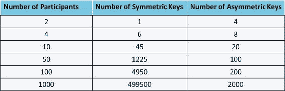

## 博弈论

游戏理论无疑是一个相当古老的概念，并且被用在许多现实生活中的情况来解决复杂问题。我们之所以以高级别覆盖这个话题，是因为它被用于比特币和许多其他区块链解决方案中。这个理论最初是由约翰·冯·诺伊曼引入，用于研究经济决策。后来，由于约翰·福布斯·纳什 Jr 的“纳什均衡”理论而更加普及，我们稍后会深入了解。首先，让我们了解一下游戏理论是什么。游戏理论是关于游戏的理论，这里的游戏不仅仅是孩子们玩的东西。大多数情况下，都是涉及两个或更多方的战略行为。例如：板球锦标赛是一个游戏，法庭上两个冲突的当事方和律师、陪审团是一个游戏，两个兄弟姐妹为冰淇淋争吵是一个游戏，政治选举是一个游戏，交通信号灯也是一个游戏。另一个例子：假设你申请了一份区块链工作，你被选中并提供了工作机会和一定的薪水，但你拒绝了这份工作，认为需求和供应之间存在巨大差距，他们很可能会提高薪水。你现在可能会想，什么不是游戏？好吧，在现实情况下，几乎一切都是游戏。所以，“游戏”可以定义为涉及“相关理性选择”的情况。这意味着任何玩家的前景不仅取决于他们自己的选择，还取决于其他人给出的情况中的选择。换句话说，如果你的命运受到其他人行为的影响，那么你就在一个游戏中。那么游戏理论是什么？游戏理论是研究涉及复杂游戏中的策略。它是根据目标在给定情况下做出最佳移动或选择最佳策略的艺术。为此，一个人必须理解对手的策略以及对手认为你的下一步是什么。让我们举一个简单的例子：有两个兄弟姐妹，一个哥哥和一个弟弟。现在，冰箱里有两块冰淇淋，一个是橙味，另一个是芒果味。哥哥想吃橙味的冰淇淋，但他知道如果他选择那个，弟弟也会要求吃同样的橙味。因此，他选择吃芒果味的冰淇淋，结果如他所料，弟弟想要同样的。现在，哥哥假装牺牲了芒果味的冰淇淋并给了弟弟，自己吃了橙味的。看看这个情况：这对双方来说都是一个双赢的局面，因为这是哥哥的目标。如果哥哥想要，他可以简单地与弟弟争吵并得到橙味的冰淇淋，如果那是他的目标。在第二种情况下，哥哥会考虑在哪里打击，以便弟弟不会受到严重伤害，但足够让他放弃橙味的冰淇淋。这是游戏理论：你的目标是什么，你应该采取的最佳行动是什么？还有一个例子：这次更多地从商业角度出发。想象你是一个向镇上供应蔬菜的供应商。有三种到达镇上的方式，其中一种是常规路线，因为这条路可能更短更好，大家都走这条路。有一天，你看到常规路线因为一些维修活动而被封锁，你无论如何都不能走那条路。你现在只剩下两条路可走。其中一条是到达目的地的短路，但比较窄。另一条是稍长的路，但足够宽。在这种情况下，你必须制定策略，决定走哪两条路。情况可能是有大量的交通在道路上，很多人会试图通过最短路线。这可能导致该路线的交通严重拥堵，并造成巨大的延误。所以，你决定走较长的路，以便按时到达镇上，但代价是燃油多花了一些美元。你确信如果你准时到达并早点以好价格卖出你的蔬菜，你可以很容易地得到补偿。这是游戏理论：对于你心中的目标，你的最佳行动是什么，通常是为了找到一个最优解决方案。在许多情况下，你所扮演的角色和你的目标都在制定策略中起着重要作用。例如：如果你是一个体育活动的组织者，而不是比赛的参与者，那么你的目标可能是希望参与者遵守规则并遵循协议。这是因为你不关心最后谁赢，你只是个组织者。另一方面，参与者会考虑对手的强项和弱点以及组织者制定的规则，从而制定获胜的策略，因为如果你违反规则，可能会受到惩罚。现在，让我们考虑你扮演组织者角色的情况。你应该考虑是否可能存在一种情况，即一名参与者违反规则失去一分，但伤害对手如此之大，以至于他们无法再参赛。所以，你必须考虑参与者可能怎么想，并相应地制定你的规则。让我们再次尝试根据我们从前面例子中学到的知识来定义游戏理论。这是以游戏的形式建模现实生活情况的方法，并分析在给定情况下一个人或实体的最佳策略或移动。几乎生活的每个方面都广泛使用了游戏理论的概念，比如政治、社交媒体、城市规划、竞标、赌博、营销、分布式存储、分布式计算、供应链和金融，这只是举几个例子。使用游戏理论的概念，可以设计出参与者遵守规则的系统，而不假设他们的情感或道德价值。如果你想超越只是构建一个概念证明，并将你的产品或解决方案投入生产，那么你应该将游戏理论作为最重要的元素之一。它可以帮助你建立健壮的解决方案，并让你在不同的有趣场景下进行测试。嗯，许多人已经在用游戏理论的视角思考问题，而不知道那就是游戏理论。然而，如果你掌握了游戏理论的许多工具和技术

### 纳什均衡

在上一节中，我们探讨了不同类型的游戏案例。游戏的分类方法有很多，比如合作/非合作游戏、对称/不对称游戏、零和/非零和游戏、同时/序贯游戏等。更一般地说，让我们在这里关注合作/非合作的角度，因为这和纳什均衡有关。顾名思义，在合作游戏中，玩家之间相互合作，可以联合起来形成一个联盟。此外，可能会有外部力量介入以确保玩家之间的合作行为。另一方面，在非合作游戏中，玩家作为个体竞争，没有机会结成联盟。参与者只关心自己的利益。此外，没有外部力量可以强制执行合作行为。纳什均衡指出，在任何非合作游戏中，如果玩家知道彼此的策略，至少存在一个均衡点，在这个均衡点上，所有玩家都采取最佳策略以获得最大利润，任何玩家改变策略都不会获得额外的好处。如果你知道其他玩家的策略，同时也有自己的策略，如果你不能通过改变自己的策略来获益，那么这就是纳什均衡的状态。因此，纳什均衡中的每一个策略都是对均衡中其他所有策略的最佳反应。注意，一个玩家可能策略性地作为个体获胜，但并不是通过确保对手最差的情况来打败对手。另外，任何游戏如果反复玩下去，最终可能都会达到纳什均衡。在下一节中，我们将通过“囚徒困境”来具体理解纳什均衡。

### 囚徒困境

许多现实生活中的游戏也可以是非零和游戏。囚徒困境就是这样一个例子，它可以被广泛地归类为对称游戏。这是因为，如果你改变了玩家的身份（例如，如果两个玩家“A”和“B”在玩，那么“A”变成了“B”，“B”变成了“A”），而且策略也没有改变，那么回报保持不变。这就是对称游戏。让我们从一个例子开始。假设有两个家伙，鲍勃（Bob）和查理（Charlie），他们因独立销售毒品被捕，地点不同。他们被关在两个不同的牢房里接受审讯。他们被告知，他们将因为这个罪行被判入狱两年。现在，警察们怀疑这两个家伙可能也参与了上周刚刚发生的抢劫案。如果没有抢劫，他们还是要被判两年监狱。所以，警察们必须制定一个策略来找出真相。所以他们做了这样的事情。警察去见鲍勃，给他一个选择，一个很好的选择，如下所述。如果鲍勃承认他的罪行而查理不承认，那么他的刑罚将从两年减少到只有一年，鲍勃将获得五年。然而，如果鲍勃否认而查理承认，那么鲍勃将获得五年，查理只有一年。另外，如果两人都承认，那么两人都将被判入狱三年。同样，同样的选择也给了查理。你们认为他们会怎么做？这种情况被称为囚徒困境。鲍勃和查理都在两个不同的牢房里。他们不能互相交谈，得出他们都否认并因贩毒案件被判两年监狱的情况（在这种情况中这似乎是全局最优解），嗯，即使他们能互相交谈，他们可能也不会真正信任对方。现在鲍勃的脑海中会想些什么呢？他有两个选择，承认或否认。他知道查理会选择对他最好的选项，他自己也不例外。如果他否认而查理承认，那么他将面临五年的监狱困境，而查理只有一年的监狱。他当然不希望陷入这种情况。如果鲍勃承认，那么查理有两个选择：承认或否认。现在鲍勃认为，如果他承认，无论查理做什么，他不会得到超过三年的刑期。让我们为鲍勃陈述这些情况。

+   鲍勃承认而查理否认——鲍勃一年，查理五年（考虑到鲍勃承认的情况下最好的情况）

+   鲍勃承认，查理也承认——鲍勃和查理都三年（考虑到鲍勃承认的情况下最坏的情况）

这种情况被称为纳什均衡，其中每个参与者都采取了考虑到其他参与者选择的最佳行动。这绝对不是全局最优的，但代表了个人的最佳行动。现在，如果你作为一个旁观者来看待这种情况，你可能会说他们都应该否认，然后被判两年。但当你作为游戏参与者参与时，纳什均衡是最终会陷入的。请注意，这是最稳定的阶段，在这个阶段，改变你的决定对你没有任何好处。如图 2-17 所示，这可以形象地表示出来。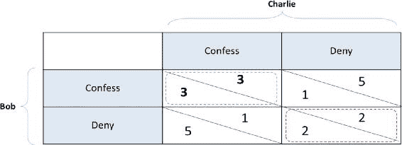图 2-17 囚徒困境——支付矩阵

### 拜占庭将军问题

在前一节中，我们研究了不同类型的游戏，并学习了一些博弈论的概念。现在，我们将讨论一个来自古老时代的问题，这个问题至今仍被广泛用于解决许多计算机科学和现实生活中的问题。拜占庭将军问题曾是拜占庭军队在攻城时遇到的问题。这个情形虽然简单，但很难处理。简单地说，情况是这样的：几个由不同将军指挥的军队包围了一个城市，以期攻克它。取得胜利的唯一机会是所有将军一起进攻。然而，问题是如何达成共识。这意味着要么所有将军都进攻，要么他们都撤退。如果他们中的一些人进攻而另一些撤退，那么他们很可能会在战斗中失利。让我们通过一个数字例子来更好地理解这个情况。假设有一个拜占庭军队的五支部队包围了一个城市。如果至少有三个将军愿意进攻，他们就会进攻城市，否则就会撤退。如果将军中有叛徒，他可以投赞成进攻的将军一票，投赞成撤退的将军一票。他可以这样做的原因是，军队分散在各个部队中，这使得集中协调变得困难。这可能导致两个将军进攻城市，被敌人数量压制并击败。在这种情况下可能会有更复杂的问题：

+   如果有多个叛徒会怎样？

+   将军之间的信息协调将如何进行？

+   如果信使被城市指挥官抓住/杀死/贿赂会怎样？

+   如果一个叛徒将军伪造了一条不同的信息，并愚弄了其他将军会怎样？

+   如何找出诚实的将军和叛徒？

正如你所看到的，对于协调一致地攻击城市，有许多挑战需要解决。这可以像图 2-18 那样，用图片表示。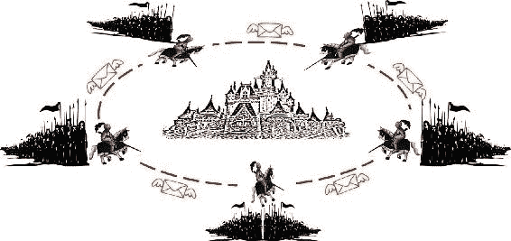图 2-18 拜占庭军队攻击城市现实生活中有许多场景与拜占庭将军问题类似。一群人如何就某些投票议程达成共识，或者如何保持分布式或去中心化数据库的一致状态，或者保持网络中区块链副本的一致状态，都是与拜占庭将军问题类似的例子。然而，请注意，这些不同问题的解决方案在不同的情况下可能会有很大的不同。我们将在本书的后部分探讨比特币如何解决拜占庭将军问题。

### 零和游戏

在博弈论中，零和游戏是非常直接的。在这样的游戏中，一方的收益等于另一方的损失。例子：一个人赢得的正好是另一个人输掉的相同金额，这意味着玩家的选择不能增加或减少给定情况下的可用资源。扑克、国际象棋、围棋等都是零和游戏的几个例子。更进一步泛化，只有一个人赢了，对手输了的游戏，如网球、羽毛球等也是零和游戏。许多金融工具，如掉期、远期和期权，也可以被描述为零和工具。在许多现实生活中的情况下，收益和损失很难量化。因此，零和游戏相比非零和游戏要少见得多。大多数金融交易或贸易以及股市都是非零和游戏。然而，保险是一个零和游戏发挥重要作用的领域。想想保险方案可能是如何运作的。我们向保险公司支付保险费，以防范一些困难的情况，如事故、住院、死亡等。认为我们有保险，我们过着平静的生活，当面临这些艰难的情况时，我们得到了保险公司的相当补偿。确实有一个经济后盾帮助我们生存。请注意，支付保险费的每个人并不一定会遇到事故或住院，而那些确实需要的人相对于他们支付的保险费需要更多的钱。你看，这里的事情是相当平衡的，即使考虑到保险公司的运营费用。再次，保险公司可能会投资我们支付的保险费并从中获得一些回报。尽管如此，这仍然是一个零和游戏。 just to give you a different example, if there is one open position for which an interview drive is happening, then the candidate who qualifies actually does it at the cost of others’ disqualification. This is also a zero-sum game. 你可能会问，研究零和游戏有什么用。仅仅是意识到零和情况在理解和制定任何复杂问题的策略上非常有用。我们可以分析我们是否可以在给定情况下实际获得收益，其中正在发生交易。

### 为什么要研究博弈论

博弈论是一个革命性的跨学科现象，它将心理学、经济学、数学、哲学以及各种其他学术领域汇集在一起。我们说博弈论与现实世界问题相关。然而，问题无穷无尽。博弈论的概念也是无穷无尽的吗？当然！我们每天都在有意识或无意识地使用博弈论，因为我们总是用大脑采取最佳的战略行动，给定一个情境。不是吗？如果是这样，为什么还要研究博弈论呢？嗯，博弈论中有许多例子可以帮助我们以不同的方式思考。有一些理论被开发出来，如纳什均衡，与许多现实生活情境相关。在许多现实世界的情境中，参与者或玩家面临的是类似于“囚徒困境”的决策矩阵。所以，学习这些概念不仅可以帮助我们用更数学的方式制定问题，还可以让我们做出最佳举动。它让我们在每一个给定的互动中识别出每个参与者应该考虑的战略行动的方面。它告诉我们首先要识别游戏的类型；参与者是谁，他们的目标或目标是什么，他们可能采取哪些行动等等，以便能够采取最佳行动。现实生活中的大部分决策都涉及不同的各方；博弈论提供了理性决策的基础。我们在上一节研究的拜占庭将军问题在分布式存储解决方案和数据中心中广泛使用，以在计算节点之间保持数据一致性。

## 计算机科学工程

正如已经提到的，运用计算机科学的概念巧妙地编织了密码学、博弈论等众多组件来构建区块链。在本节中，我们将学习一些在区块链中使用的重要的计算机科学组件。

### 区块链

正如我们将要看到的，区块链实际上是一种区块链数据结构；从某种意义上说，它是由链接在一起的区块组成的链。当我们说一个区块时，它可能只是一个单独的交易或者多个交易组合在一起。我们将从哈希指针开始我们的讨论，这是区块链数据结构的基本构建块。哈希指针是一种加密哈希，指向一个数据块，其中哈希指针是数据块本身的哈希（图 2-19）。与指向下一个块以便你可以找到它的链表不同，哈希指针指向前一个数据块并提供了一种验证数据是否被篡改的方法。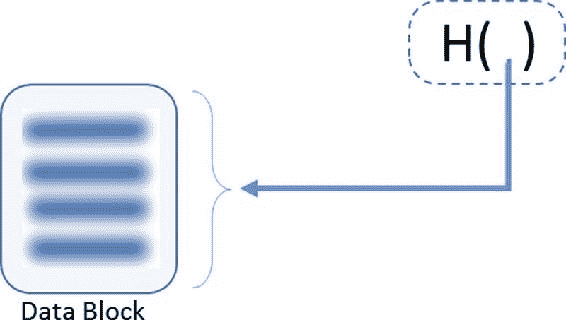图 2-19 交易区块的哈希指针哈希指针的目的是构建一个抗篡改的区块链，可以被认为是单一的真实来源。区块链是如何实现这个目标的？它的工作方式是，将前一个块的哈希存储在当前块的头部，并将当前块及其块头 的哈希存储在下一个块的头部。这样就形成了我们可以看到的区块链（图 2-20）。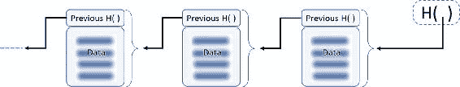图 2-20 通过哈希指针链接的区块链区块正如我们所观察到的，每个区块都指向其前一个区块，称为“父区块”。每一个添加到链中的新区块都成为下一个要添加的区块的父区块。一直到最后一个在区块链中创建的区块，称为“创世区块”。在这种通过哈希链接回的区块设计中，实际上对于某人来说篡改任何区块中的数据是不切实际的。我们已经查看了哈希函数的特性，所以我们知道如果数据被篡改，哈希将不匹配。如果有人还改变了哈希呢？让我们关注图 2-21 来了解这是如何不可能以任何方式篡改数据的。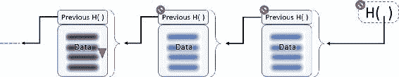图 2-21 任何试图改变头部或区块内容的行为都会破坏整个链。假设你篡改了区块-1234 中的数据。如果你这样做，存储在区块-1235 的头部中的哈希将不匹配。

+   如果你还改变了存储在区块-1235 的头部中的哈希，使其与篡改后的数据完全匹配。换句话说，你在篡改后对数据块-1234 进行哈希处理，并将其新的哈希替换为存储在区块-1235 的头部中的那个。在你这样做之后，区块-1235 的哈希（因为区块-1235 意味着数据和头部一起）会发生变化，并且它与存储在区块-1236 的头部中的那个不匹配。

+   必须一直重复这个过程，直到最终的或者最新的散列值。由于网络中的每个人或许多人已经拥有区块链以及最新散列值的副本，所以不可能同时入侵大多数系统并更改所有散列值。

+   这使得它成为一种防篡改的区块链数据结构。

这明确表示每个区块可以通过其散列值唯一标识。要计算这个散列值，你可以使用我们在密码学部分讨论的 SHA2 或 SHA3 散列函数家族。如果你使用 SHA-256 散列区块，它将产生一个 256 位的散列输出，例如：000000000000000a73b6a2af7bad40ec3fc2a83dafd76ef15f3d1b71a7132765 请注意，其中只有 64 个字符。由于散列输出使用十六进制字符表示，而每个十六进制数字可以用四个位表示，所以输出是 64×4=256 位。你通常会在很多地方看到 256 位散列输出使用 64 个十六进制字符表示。区块的结构，即区块大小、数据和头部部分、区块中的交易数量等，是在设计区块链解决方案时你应该决定的事情。对于现有的区块链，如比特币、以太坊或超级账本，结构已经定义好，你必须理解这些才能在这些平台上进行构建。我们将在本书的后面部分更详细地查看比特币和以太坊的区块链。

### 默克尔树

Merkle 树是一种二进制的密码散列指针树，因此它是一棵二进制散列树。它以其发明者拉尔夫·默克尔（Ralph Merkle）命名。它是另一种在比特币等区块链解决方案中使用的有用的数据结构。Merkle 树通过对配对数据进行散列（通常在叶子级别是交易），然后再次对所有散列输出进行散列直到根节点构建。就像任何其他树一样，它是自底向上构建的。在比特币中，叶子总是区块链中单个块的交易。我们将在稍后讨论使用 Merkle 树的优点，这样您就可以自行决定叶子是否应该是交易或块中的一组交易。典型的 Merkle 树可以表示为图 2-22。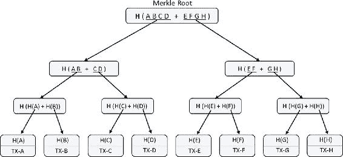图 2-22 Merkle 树表示与哈希指针数据结构类似，Merkle 树也是防篡改的。在树的任何级别篡改都不会与层次结构中存储的哈希匹配，直到根节点。对于对手来说，改变整个树中的所有哈希是非常困难的。它还确保了交易顺序的完整性。如果只更改交易的顺序，那么直到 Merkle 根的树中的哈希也将更改。这里有一个情况。Merkle 树是一棵二进制树，叶子级别应该有偶数个项目。如果叶子项目数是奇数怎么办？一个很好的解决方案是复制最后一个交易哈希。因为我们复制的是哈希，这意味着只是相同的交易，不会产生任何问题，比如双重消费或重复交易。这样，就可以平衡树。在我们讨论的区块链中，如果我们要通过其哈希找到交易，或者检查过去是否发生了交易，我们将如何找到该交易？唯一的方法是持续遍历直到遇到与交易哈希匹配的确切块。这是 Merkle 树可以大有帮助的情况。Merkle 树提供了一种非常高效的方法来验证特定交易是否属于特定块。如果在 Merkle 树（叶子项目）中有“n”个交易，那么此验证只需 Log（n）时间，如图 2-23 所示。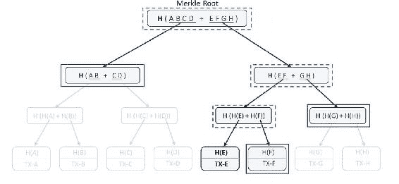图 2-23 Merkle 树中的验证要验证交易或任何其他叶子项目是否属于 Merkle 树，我们不需要所有项目和整个树。相反，只需要其中的一个子集，正如我们在图 2-23 中所看到的那样。一个人只需从要验证的交易开始以及其兄弟（因为它是二叉树，所以会有一个兄弟叶子项），计算这两者的哈希，并查看它们是否与父哈希匹配。然后继续使用该父哈希及其在该级别的兄弟，并将它们一起哈希以获得其父哈希。持续此过程直到顶级根哈希是进行交易验证的最快方法（仅需 Log（n）时间，其中 n 为项目数）。在图中，只需要实线矩形，虚线矩形可以仅通过计算提供实线矩形数据。由于有八个交易元素（n = 8），因此仅需要三次计算（log2 8 = 3）即可进行验证。现在

#### 示例代码片段：默克尔树

本节旨在为您提供一个关于如何以最基本的方式编写默克尔树的代码示例。代码示例使用 Python 编写，但在不同的语言中会非常相似；你只需要找到合适的库函数来使用。

## 综合所有内容

为了到达这一节，我们已经涵盖了区块链的所有必要组成部分，帮助我们了解它实际上是是如何工作的。在经历了它们，即密码学、博弈论和计算机科学工程概念之后，我们可能已经形成了一个关于区块链可能如何工作的概念。尽管这些概念已经存在了很长时间，但没有人能想象到同样的旧东西可以用来构建像区块链这样的变革性技术。让我们快速回顾一下我们到目前为止涵盖的一些基本概念，然后在这些概念上进一步建立理解。以下是它们的内容：

+   密码学函数是单向的，不能被反转。它们是确定性的，给定一个输入会产生相同的输出。对输入的任何更改在再次哈希时会产生完全不同的输出。

+   使用公钥加密技术，可以实现数字签名。它有助于验证签署人的真实性。考虑到私钥是保密的，使用别人的身份伪造签名是不可能的。另外，如果有人已经在任何文件或交易上签字，他们 later cannot deny they did not.

+   利用博弈论原则和最佳实践，可以设计出能在大多数异常情况下持续运行的健壮系统。能够面对拜占庭将军问题的系统需要妥善处理。我们对任何系统设计的方法应该是参与方遵守规则以获得最大回报；偏离协议实际上并不会给他们带来好处。

+   通过使用加密哈希，区块链数据结构提供了一个防篡改的区块链。使用默克尔树使得交易验证更加容易和快速。

带着这些概念在脑海中，现在让我们考虑一个真实的区块链实现。你能想到哪些问题需要解决，才能使这样的去中心化系统正常工作？好吧，有很多问题；其中一些可能对大多数区块链用例都通用，而另一些可能只针对少数特定用例。让我们至少讨论一些需要解决的场景：

+   谁将维护交易的去中心化账本？所有参与者都应该维护，还是只有少数人？那么计算能力不足或没有足够存储空间来容纳交易完整历史的节点呢？

+   如何可能保持分布式账本的一致状态？网络延迟、数据包丢失、故意的黑客攻击等都是不可避免的。系统如何承受所有这些挑战？

+   谁将验证或否定交易？只有少数授权节点验证，还是所有节点一起达成共识？如果有些节点在特定时间不可用怎么办？

+   如果一些计算节点故意想破坏系统或试图拒绝某些交易怎么办？

+   当没有中央实体负责时，你将如何升级系统？在一个去中心化网络中，如果有一些计算节点升级了自己而其余节点没有呢？

实际上，除了刚才提到的内容，还有很多问题需要解决。现在我们将留给你这些问题，但本章结束时应该会澄清大部分这些问题。让我们先从区块链系统可能需要的几个基本构建块开始，以设计任何去中心化解决方案。

### 区块链解决方案的特性

到目前为止，我们只学习了区块链解决方案的技术方面，以了解区块链可能如何工作。在本节中，我们将学习一些区块链期望的属性。

#### 不可变性

它是保持区块链交易原子性的最理想属性。一旦交易被记录，就无法更改。如果交易被广播到网络，那么几乎每个人都会有它的副本。随着时间的推移，当越来越多的区块被添加到区块链时，其不可变性会增加，在一定时间后，它就变得完全不可变。要更改这么多区块的数据是不切实际的，因为它们是经过加密保护的。所以，任何被记录的交易都永远保存在系统中。

#### 抵御伪造

去中心化的解决方案，其中交易是公开的，容易受到各种攻击。尝试伪造是最明显的，尤其是当你交易任何有价值的东西时。可以使用加密散列和数字签名来确保系统抵御伪造。我们已经了解到，伪造他人的签名在计算上是不切实际的。如果你进行一笔交易并签署它的散列值，后来没有人可以更改交易并说你签署了一笔不同的交易。此外，你不能后来声称你从未进行过交易，因为是你签署的。

#### 民主

任何点对点的去中心化系统都应该在设计上是民主的（可能不适用于私有的区块链，这个问题我们稍后再讨论）。系统中不应该有比其他实体更强大的存在。在任何情况下，每个参与者都应享有平等的权利，当大多数达到共识时，做出决定。

#### 抵御双重支付

双重支付攻击在货币和非货币交易中相当常见。在加密货币环境中，双重支付尝试是指你尝试将相同金额支付给多个人。例如：你的账户里有 100 美元，你向两个或更多方支付 90 美元是一种双重支付。这在加密货币（如比特币）中略有不同，因为比特币中没有结余的概念。交易的输入（当你支付给某人时）是另一个交易的输出，你在该交易中至少收到了你要支付的金额。假设鲍勃之前从爱丽丝那里收到了 10 美元，今天鲍勃想付给查理 8 美元，那么他从爱丽丝那里收到 10 美元的交易将是与查理交易的基础。所以，鲍勃不能多次使用相同的输入（爱丽丝支付给他的 10 美元）来支付给其他人以实现双重支付。给你一个不同的例子：如果有人拥有一块土地，并将同一块土地卖给两个人。在集中式系统中，防止双重支付相当容易，因为中央机构了解所有交易。区块链解决方案也应该对这种双重支付攻击免疫。虽然密码学确保了交易的真实性，但它无法帮助防止双重支付。因为从技术上讲，正常交易和双重支付交易都是真实的。所以，防止双重支付的唯一方法就是要知道所有的交易。如果我们了解过去发生的所有交易，我们可以判断一个交易是否是双重支付的尝试。因此，验证交易的节点应该能够访问整个区块链数据，从创世区块开始。

#### 账本的一致状态

我们刚刚讨论的属性确保了账本在某种程度上是一致的。想象一种情况，一些节点故意希望一个交易不通过并被拒绝。或者，如果一些节点以某种方式与账本不同步，因此在离线时没有注意到一些已经发生的交易，那么对他们来说，一个交易可能看起来是欺诈的。所以，如何确保参与者之间的共识是需要非常小心处理的事情。回想一下拜占庭将军的问题。适合特定情况的正确共识在确保去中心化解决方案的稳定性方面起着最重要的作用。我们将在本书的后面学习不同的共识机制。

#### Resilient（弹性）

网络应当足够弹性，以承受临时的节点故障、某些计算节点的暂时不可用、网络延迟和数据包丢失等情况。

#### 可审计

区块链是由通过哈希链接在一起的块组成的链。由于交易块一直追溯到创世块，可审计性已经存在，我们无论如何都要确保它不会断裂。此外，如果有人想验证过去是否发生了交易，那么这样的验证应该更快。

### 区块链交易

当我们提到区块链时，我们是指交易区块链，对吧？所以它始于一个交易，然后这个交易通过一系列步骤，最终存储在区块链上。由于区块链是一种点对点现象，如果你处理的用例每秒钟发生大量交易，你可能不希望用所有交易淹没整个网络。显然，当个人或实体进行交易时，他们只需将交易广播到整个网络。一旦发生这种情况，它必须由多个节点验证。验证后，它再次广播到整个网络，以便将交易包含在区块链中。那么，为什么不是交易链而是区块链呢？如果你的业务案例不涉及大量交易，从某种程度上说，使用交易链可能是有意义的。然而，如果每秒钟有大量交易，那么在交易级别对它们进行哈希处理，保留它们的踪迹，并将它们广播到网络，可能会使系统不稳定。你可能希望将一定数量的交易分组在一个块中，并广播这个块。单独广播交易可能会变得代价高昂。阻止赛百味攻击的另一个好理由是使用区块链而不是交易链。在第三章中，你将详细了解如何使用 PoW 挖掘算法，并随机选择一个节点提出一个块。如果不是这样，人们可能会创建他们自己的节点的复制品，以颠覆系统。在最简化的形式中，区块链交易通过以下步骤进入区块链：

+   每个新交易都广播到网络，以便所有计算节点在交易发生时知道这一事实（确保系统抵抗双重支付）。

+   交易可能由节点验证以接受或拒绝，通过检查其真实性。

+   节点可以将多个交易分组成块，并与网络中的其他节点分享。

+   现在出现了困难的情况。谁会提出他们单独分组的交易块呢？总的来说，新块的生成应该受到控制，但不应以集中式方式进行，并且应该让每个节点具有平等的优先级。每个节点同意的块称为共识，但根据你的用例，有不同的算法来实现同一目标。我们将在下一节讨论不同的共识机制。

+   虽然由于网络延迟、数据包丢失和地理位置等因素，没有全球统一的时间概念，但这样的系统仍然有效，因为区块是按顺序一个接一个地添加的。所以，我们可以认为区块是按照它们到达的顺序进行时间戳标记，并添加到区块链中的。

+   一旦网络中的节点一致接受了一个区块，那么这个区块就会被添加到区块链中，并且它包括紧接在其之前的区块的哈希值。所以这样就通过一个区块 extend 了区块链。

我们已经讨论了区块链数据结构和默克尔树，所以现在理解了它们的价值。回忆一下，当一个节点想要验证一笔交易时，它可以通过默克尔路径更有效地完成。网络中的其他节点不需要共享完整的数据块来证明一个事务属于某个区块的成员资格。从技术上讲，像“布隆过滤器”这样的内存高效且对计算机友好的数据结构，在这种场景下广泛用来测试成员资格。另外，请注意，为了使一个节点能够验证一笔交易，它理想情况下应该拥有整个区块链数据（包括事务及其元数据）的本地副本。你应该根据你的用例选择一个高效的存储机制，节点将基于这个机制进行存储。

### 分布式共识机制

当节点通过拥有完整区块链数据的本地副本来了解所有交易的历史，以防止双重花费，并且它们可以通过数字签名来验证交易的 authenticity，那么共识机制有什么用？想象一下存在一个或多个恶意节点的情况。他们不能说一个无效的交易是有效的，或者相反吗？回顾一下拜占庭将军问题，这在许多去中心化系统中是最有可能发生的。为了克服这些问题，我们需要有一个适当的共识机制。到目前为止，在我们讨论中还没有明确的是谁提出区块。显然，不应该让每个节点同时向其他节点提出区块，因为这只会造成混乱；更不用说账本的一致状态了。另一方面，如果只是交易而不将它们分组到区块中，你可能会认为，如果将每个交易广播到整个网络，并且网络中的每个节点对那些单独的交易进行投票，这将只会使系统复杂化并导致性能下降。所以，将交易分组到区块中是有明显原因的，并且需要在区块层面上进行共识。解决这个问题最好的策略是，一次只能有一个区块提出区块，其余节点应验证区块中的交易，如果交易有效，则将其添加到他们的区块链中。我们知道，每个节点都维护其自己的账本副本，并且没有集中的源可以从中同步。所以，如果任何一个节点提出了一个区块并且其他节点同意，那么所有这些节点都会将该区块添加到它们的 respective 区块链中。在这种设计中，您会希望块创建之间至少有几分钟的间隔，而不应该出现多个块同时到达的情况。现在的问题是：可能是那个幸运的节点来提出一个区块？这是最棘手的部分，也可能导致正确的共识；我们将在不同的共识机制下讨论这个问题。这些共识机制实际上来自博弈论。您的系统应该设计成这样，如果节点遵守规则，它们会获得最大的好处。确保节点诚实行为的一个方面是通过奖励诚实行为和惩罚欺诈活动。然而，这里有一个问题。在像比特币这样的公共区块链中，可以有多种不同的公共身份，它们相当匿名。惩罚这些身份真的很难，因为它们可以选择通过创建新的身份来避免惩罚。另一方面，奖励它们效果很好，因为即使有人有多个身份，他们也可以高兴地获得给予他们的奖励。所以，这取决于你的业务案例：如果身份是匿名的，那么惩罚可能行不通，但如果身份不是匿名的，可能会很好地工作。您可能需要考虑这个奖励/惩罚方面，即使您有一个很好的机制来选择下一个区块的节点。这是因为您永远不知道预先选定的节点是恶意节点还是诚实节点。请记住我们可能经常使用的术语挖掘，它意味着生成新块。共识的目标也是确保网络足够健壮，能够承受各种类型的攻击。无论一个人可能选择的共识算法类型如何，它必须落入拜占庭容错共识模式才能被接受。现在让我们学习一些适用于区块链场景的共识机制，我们可能在不同情况下可以使用。

#### 工作量证明

工作量证明（PoW）共识机制已经存在很长时间了。然而，它在比特币中的使用以及与其他概念的结合使其变得更加流行。我们将在第三章讨论这个共识机制的基础知识，并查看它是如何在比特币中实现的。PoW 算法的背后思想是，在将区块提交给整个网络之前，对交易区块进行一定的工作。PoW 实际上是一段难以通过计算和时间产生的数据，但易于验证。PoW 的旧用途之一是防止电子邮件垃圾邮件。如果发送一封电子邮件之前需要完成一定的工作，那么发送大量电子邮件垃圾将会需要大量的计算。这有助于防止电子邮件垃圾邮件。同样，在区块链中，如果要在产生一个区块之前执行一些计算密集型的工作，那么它可以帮助两种方式：一是它肯定会花费一些时间，二是，如果一个节点试图在区块中注入一个欺诈交易，那么该区块被其他节点拒绝将会对提出区块的节点造成很大的损失。这是因为为了获得 PoW 而进行的计算将没有价值。想想轻松提出一个区块与为了能够提出区块而做一些艰苦的工作的区别。如果几乎不费力，那么提出一个带有欺诈交易的区块并且被拒绝就不会是一个大问题。人们可能只是继续提出这样的区块，希望其中一个可能成功并最终进入区块链。相反，为了提出一个区块而做一些艰苦的工作可以防止节点以一种微妙的方式注入欺诈交易。此外，工作的难度应该是可调整的，以便控制区块生成的速度。你们可能想，如果我们谈论的是需要一些计算和时间的工作，那它必须是什么样的工作呢？这是非常简单但又棘手的工作。这里有一个例子。想象一个问题，你需要找到一个数字，当你对它进行哈希时，哈希输出会以字母“a”开头。你会怎么做？我们已经学习了哈希函数，并知道没有捷径可走。所以你会一直猜测（也许随便取一个数字，然后不断加一）数字，并不断对它们进行哈希，以看看是否符合要求。如果需要增加难度级别，那么可以说它以三个连续的“a”开头。显然，“axxxxxxx”这样的解决方案比“aaaxxxxx”更容易找到，因为后者更有约束性。在刚才给出的例子中，如果有多个不同的节点在解决这样的计算难题，那么你永远不知道哪个节点会先解决它。这可以利用来选择一个随机节点（这次它真的是随机的，因为没有算法）解决难题并提出区块。非常重要的一点是，在公共区块链中，投入计算资源的节点必须因诚实行为而得到奖励，否则很难维持这样的系统。

#### 权益证明 (Proof of Stake, PoS)

权益证明（PoS）算法是另一种流行的分布式共识算法。然而，它的复杂之处在于，它并非关于挖矿，而是关于验证交易区块。由于新币的生成，没有挖矿奖励，只有矿工（更准确地说是验证者，但我们将继续使用“矿工”这个词，以便更容易解释）的交易费用。在 PoS 系统中，验证者必须抵押他们的权益（抵押他们希望保持在权益中的加密货币金额）才能参与验证交易。验证者产生区块的概率与他们权益的比例成正比；质押的金额越多，他们验证新区块交易的机会就越大。矿工只需证明他们拥有特定时间内给定货币系统中所有货币的一定比例。例如，如果一个矿工拥有以太坊网络中所有以太币（ETH）的 2%，他们就能挖掘以太坊 2%的所有交易。相应地，根据您使用的 PoS 算法，决定谁来创建新的交易区块。是的，PoS 算法有多种变体，如简单的 PoS、委托 PoS、基于链的 PoS、BFT 风格的 PoS 和 Casper PoS 等。委托 PoS（DPOS）被 Bitshares 使用，而 Casper PoS 正在开发中，计划用于以太坊。由于在 PoS 系统中块的创建者是确定性的（基于权益金额），它比 PoW 系统快得多。此外，由于没有区块奖励，只有交易费用，所有数字货币都需要在开始时创建，并且总金额是固定的。PoS 系统可能提供更强的恶意攻击防护，因为执行攻击会冒着整个质押金额的风险。另外，由于它不需要燃烧大量电力和消耗 CPU 周期，因此在适用的情况下优先于 PoW 系统。

#### 实用拜占庭容错算法 (Practical Byzantine Fault Tolerance, PBFT)

PBFT 是实用拜占庭容错算法（Practical Byzantine Fault Tolerance）的缩写，这是一种可以考虑用于区块链用例的众多共识算法之一。在众多的区块链项目中，Hyperledger、Stellar 和 Ripple 采用 PBFT 共识。PBFT 也是一种不用于生成挖矿奖励的算法，与 PoS 算法类似。然而，它们各自实现的技术细节是不同的。PBFT 的内部工作原理超出了本书的范围，但在高层次上，请求会被广播到所有拥有自己副本或内部状态的参与节点。当节点接收到请求时，它们会基于自己的内部状态执行计算。计算的结果随后与系统中的所有其他节点分享。所以，每个节点都知道其他节点正在计算什么。考虑到自己的计算结果以及从其他节点接收到的结果，它们做出决定并承诺最终值，这再次在节点之间共享。此刻，每个节点都知道其他所有节点的最终决定。然后，它们全部回应自己的最终决定，基于大多数节点，最终达成共识。这在图 2-24 中有所展示。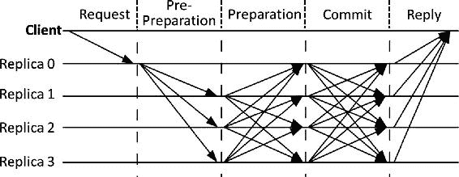图 2-24 PBFT 共识方法 PBFT 与其他共识算法相比，根据所需的努力程度，可能是有效率的。然而，由于这种算法的设计方式，系统中的匿名性可能会受到妥协。即使在不属于区块链环境的系统中，这也是最广泛使用的共识算法之一。

## 区块链应用

在本章中，虽然我们一直在关注区块链的细节，但同样重要的是，我们需要了解区块链解决方案是如何构建的。有些应用程序将区块链视为 Web 服务器后面的后端数据库，而有些则是完全去中心化的，没有中心服务器。例如，比特币区块链就是一个没有服务器可以发送请求的区块链应用程序！每一个交易都被广播到整个网络。然而，在必要的时候，一个基于中心化 Web 服务器的 Web 应用程序也可以被构建出来，并更新比特币区块链。请参阅图 2-25，其中一个比特币节点在给定时间点向可达节点广播交易。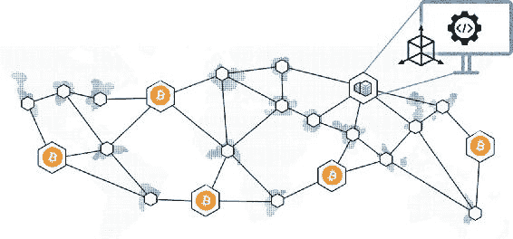图 2-25 比特币区块链节点从软件应用程序的角度来看，每一个节点都是自给自足的，并维护着自己的区块链数据库副本。考虑到比特币区块链作为一个基准，没有中心服务器的区块链应用程序似乎是最纯粹的去中心化应用程序，其中大部分属于“公共区块链”类别。通常，对于这样的公共区块链，使用来自云服务提供商（如微软 Azure、IBM Bluemix 等）的资源并不太受欢迎。然而，对于大多数私有区块链，云服务提供商已经开始变得受欢迎。打个比喻，可能有多个面向不同部门或参与者的 Web 应用程序，它们都有自己的区块链后端，而区块链仍然彼此同步。在这种设置中，尽管技术上实现了去中心化，但政治上仍然可能是中心化的。尽管实施了控制或治理，但由于可以访问单一的真实数据源，系统仍然能够保持透明度和信任。请参阅图 2-26，这可能类似于大多数在云服务提供商上运行的区块链 POC 或应用程序，这些区块链通过使用他们的区块链即服务（BaaS）产品来托管。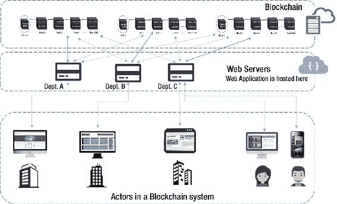图 2-26 基于云的区块链系统并不是所有的部门都需要有自己的不同 Web 应用程序。一个 Web 应用程序可以处理系统中多个不同参与者的请求，并通过适当的访问控制机制处理。让所有系统中的参与者都有自己的区块链副本可能是个好主意。拥有区块链的本地副本不仅有助于维护系统的透明度，而且可能有助于随时访问数据，从而生成数据驱动的洞察。系统中的不同参与者维护的“区块链”由于设计上的共识算法（如 PoW、PoS 等）而保持一致。大多数私有区块链都选择除 PoW 之外的共识算法，以减轻资源消耗，节省电力和计算能力。在私有或联盟区块链中，PoS 共识机制相当常见。由于区块链在业务方面的颠覆性影响，并且没有更好的方法来在他们之间实现透明度，因此基于“按使用付费”模式的云计算区块链解决方案正在逐渐流行。云服务帮助企业在区块链启用的数字化转型之旅中实现飞跃，而无需大量的前期投资。还有基于以太坊区块链网络的去中心化应用程序（DApps）。这些应用程序可能是私有的以太坊，也可能是公共以太坊网络上的无权限应用程序。此外，这些应用程序可能是同一公共以太坊网络上的不同用例。虽然我们将在本书的后面详细介绍以太坊特定的细节，但请查看图 2-27 以了解这些应用程序可能的外观。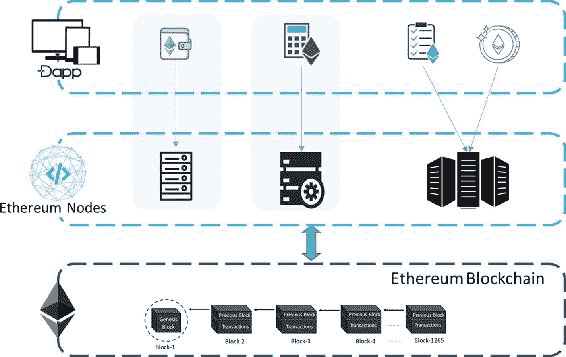图 2-27 以太坊网络上的 DApps 如前所述，开发区块链应用程序仅受您想象力的限制。可以构建纯粹的基于区块链的原生应用程序。将区块链视为只是后端的应用程序也在被构建，还有正在被构建的混合应用程序，它们使用遗留应用程序，并仅将区块链用于特定目的。到目前为止，区块链的可扩展性是最重要的问题之一。尽管可扩展性本身还在研究中，让我们学习一些可扩展性技术。

## 区块链扩容

我们从历史的角度审视了区块链，并发现它是最具颠覆性的技术之一。在本章中，我们从技术角度探讨了区块链的扩容问题，这是大多数区块链平台的固有难题。区块链的设计本质上难以扩容，因此成为学术界和一些以创新为导向的企业的研究课题。如果你看看比特币的普及情况，它的普及并不是用来替代法定货币，而是由于其扩容问题。你不能用比特币买咖啡，然后等一个小时让交易结算。因此，比特币被用作投资者的一种资产类别。比特币区块链网络目前无法容纳像维萨或万事达卡那样多的交易。回顾我们之前学过的共识协议，比如比特币或以太坊的工作量证明（PoW），或者其他一些区块链平台如 Multichain、Hyperledger、Ripple 或 Tendermint 的工作量证明（PoS）和其他拜占庭容错（BFT）共识。所有这些共识算法的首要目标是拜占庭容错。区块链网络中的每个节点（至少是完整节点）都维护着区块链的完整副本，验证所有交易和区块，响应网络中其他节点的请求等，以实现去中心化，这成为了扩容的瓶颈。在这里看到讽刺的地方——我们在集中式系统中增加更多服务器来实现扩容，但在去中心化系统中，同样的方法不适用，因为节点越多，延迟只会增加。虽然去中心化程度可以通过增加去中心化网络中的节点数量来提高，但网络中的交易数量也会增加，这导致了计算和存储资源需求的增加。请记住，这种情况更适用于公共区块链，而不适用于私有区块链。与公共区块链相比，私有区块链可以更容易地扩容，因为控制实体可以定义并设置具有高计算能力和更多带宽的节点规格。此外，将某些任务从区块链卸载并在链外计算可能有助于系统扩容。在本章中，我们将学习一些通用的扩容技术，并在各自的章节中讨论比特币和以太坊特定的扩容技术。请记住，并非所有扩容技术都适用于所有类型的区块链平台或用例。最佳方法是技术上理解这些技术，并在给定情况下使用最合适的一个。

### 离链计算

链下计算是扩展区块链解决方案最有前景的技术之一。其基本思想是限制区块链的使用，在区块链之外完成繁重的工作，只将结果存储在区块链上。要记住，目前还没有关于链下计算应如何进行的标准定义。它严重依赖于具体情况和尝试解决问题的人。此外，不同的区块链版本可能需要不同的链下计算方法。在较高层次上，链下计算就像是区块链之上的另一层，它执行繁重、计算密集型的任务，并明智地使用区块链。显然，通过链下计算你可能无法保留区块链的所有特性，但同样真实的是，对于各种计算需求，你也许并不需要区块链，并且可能只针对特定的痛点使用它。链下计算可以在侧链上进行，可以分散在随机的一组节点之间，也可以是集中的。侧链独立于主区块链。它不仅能很好地扩展区块链，还能隔离侧链上的损害，并防止主区块链受到侧链的任何损害。侧链的一个例子是“闪电网络”，它应该能够以极低的费用快速执行交易，并支持微支付。另一个针对比特币的侧链例子是“零现金”，其首要目标并不是可扩展性，而是隐私。如果你用零现金进行比特币交易，你就无法被追踪，你的隐私将得到保护。我们将把讨论限于通用的扩展技术，而不深入讨论本书中的比特币扩展性。

### 分片区块链状态

分片是多年来一直存在的可扩展性技术之一，并且一直备受数据库领域的关注。人们在不同的用例中用这种技术来解决具体的可扩展性挑战。在我们了解它如何用于扩展区块链之前，首先让我们来了解一下它的含义。在处理大数据集时，磁盘读/写一直是一个瓶颈。当数据跨多个磁盘进行分区时，读/写可以并行进行，延迟显著降低。这种技术称为分片。请查看图 2-29。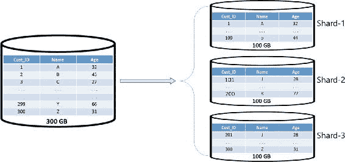图 2-29 数据库分片示例请注意图 2-29 中如何进行水平分区，将一个 300GB 的数据库表分为三个 100GB 的片段，并存储在不同的服务器实例上。这个概念也适用于区块链，其中整个区块链状态被划分为不同的片段，包含它们自己的子状态。嗯，这绝对不像只是做水平分区来分片数据库那么简单。那么，在区块链上下文中，分片实际上是如何工作的呢？想法是节点无需下载并保留整个区块链的副本。相反，它们将下载并保留与它们相关的部分（片段）。这样做的话，它们只能处理与它们存储的数据相关的交易，并且可以并行执行交易。所以，当一个交易发生时，它会被路由到只影响特定分片的特定节点。如果你从不同的角度来看，所有节点都不需要对每个交易进行所有 sorts 的计算和验证。当需要处理特定交易时，可以定义一个分片之间的通信机制或协议。请记住，不同的区块链可能有不同的分片变体。举个例子，你可能为特定情况选择一个特定的分片技术。一个例子可能是需要分片中包含多个唯一账户的情况。换句话说，每个唯一账户在一个分片（更适合具有状态的以太坊式区块链）中，分片中的账户互相交易非常容易。显然，为了使分片工作，需要在分片级别进行额外的提取，节点可以只保留信息的子集。

## 总结

在本章中，我们深入探讨了密码学、博弈论和计算机科学与工程的核心基础知识。学到的概念将帮助您设计自己的区块链解决方案，该方案可能有一些特定的需求。区块链绝非解决所有问题的灵丹妙药。然而，在需要区块链的情况下，很可能会需要不同设计结构的多种区块链解决方案。我们学习了不同的密码学技术来保障交易的安全性以及散列函数的实用性。我们探讨了博弈论如何用来设计健壮的解决方案。我们还学习了诸如区块链数据结构和默克尔树等计算机科学的基本原理。部分概念通过示例代码片段进行了补充，以帮助您在区块链作业中取得快速进展。在下一章中，我们将学习比特币作为区块链用例的具体运作方式。

## 参考文献

密码学的新方向 Diffie, Whitfield; Hellman, Martin E., “密码学的新方向,” IEEE 信息论文献, Vol IT-22, No 6, [`ee.stanford.edu/~hellman/publications/24.pdf`](https://ee.stanford.edu/~hellman/publications/24.pdf) , 1976 年 11 月。克克霍夫原则 Crypto-IT Blog, “Kerckhoff's Principle,” [www.crypto-it.net/eng/theory/kerckhoffs.html](http://www.crypto-it.net/eng/theory/kerckhoffs.html) .分组密码、流密码和费斯特尔密码[`kodu.ut.ee/~peeter_l/teaching/kryptoi05s/streamkil.pdf`](http://kodu.ut.ee/~peeter_l/teaching/kryptoi05s/streamkil.pdf) .[www.cs.utexas.edu/~byoung/cs361/lecture45.pdf](http://www.cs.utexas.edu/~byoung/cs361/lecture45.pdf) .[www.cs.man.ac.uk/~banach/COMP61411.Info/CourseSlides/Wk2.1.DES.pdf](http://www.cs.man.ac.uk/~banach/COMP61411.Info/CourseSlides/Wk2.1.DES.pdf) .[`engineering.purdue.edu/kak/compsec/NewLectures/Lecture3.pdf`](https://engineering.purdue.edu/kak/compsec/NewLectures/Lecture3.pdf) .数字加密标准（DES）[www.facweb.iitkgp.ernet.in/~sourav/DES.pdf](http://www.facweb.iitkgp.ernet.in/~sourav/DES.pdf) .高级加密标准（AES）[www.facweb.iitkgp.ernet.in/~sourav/AES.pdf](http://www.facweb.iitkgp.ernet.in/~sourav/AES.pdf) .AES 标准参考美国国家标准与技术研究所（NIST）, “宣布高级加密标准（AES）,” 《联邦信息处理标准出版物 197》, [`nvlpubs.nist.gov/nistpubs/FIPS/NIST.FIPS.197.pdf`](http://nvlpubs.nist.gov/nistpubs/FIPS/NIST.FIPS.197.pdf) , 2001 年 11 月 26 日。安全哈希标准美国国家标准与技术研究所（NIST）, “宣布高级加密标准（AES）,”《联邦信息处理标准出版物 197》, [`csrc.nist.gov/publications/fips/fips180-4/fips-180-4.pdf`](http://csrc.nist.gov/publications/fips/fips180-4/fips-180-4.pdf) , 2001 年 11 月 26 日。SHA-3 标准：置换式哈希和可扩展输出功能 NIST, “宣布草稿草案联邦信息处理标准（FIPS）202, SHA-3 标准：置换式哈希和可扩展输出功能，和 FIPS 180-4 中适用性条款的修订草稿, 安全哈希标准, 并征求评论,” [`csrc.nist.gov/News/2014/Draft-FIPS-202,-SHA-3-Standard-and-Request-for-Com`](https://csrc.nist.gov/News/2014/Draft-FIPS-202,-SHA-3-Standard-and-Request-for-Com) , 2014 年 5 月 28 日。SHA-3Paar, Christof, Pelzl, Jan, “SHA-3 和 Hash 函数 Keccak,” 《了解密码学—学生和从业者的教科书》, (Springer, 2010), [`pdfs.semanticscholar.org/8450/06456ff132a406444fa85aa7b5636266a8d0.pdf`](https://pdfs.semanticscholar.org/8450/06456ff132a406444fa85aa7b5636266a8d0.pdf) .RSA 算法 Kaliski, Burt, “RSA 公钥密码算法的数学基础,” RSA 实验室, [www.mathaware.org/mam/06/Kaliski.pdf](http://www.mathaware.org/mam/06/Kaliski.pdf) .Milanov, Evgeny, “RSA 算法,” [`sites.math.washington.edu/~morrow/336_09/papers/Yevgeny.pdf`](https://sites.math.washington.edu/~morrow/336_09/papers/Yevgeny.pdf) . 2009 年 6 月。博弈论 Pinkasovitch, Arthur, “为什么博弈论在商业中有用？,” Investopedia, [www.investopedia.com/ask/answers/09/game-theory-business.asp](http://www.investopedia.com/ask/answers/09/game-theory-business.asp) , 2017 年 12 月 19 日。证明权益算法 Buterin, Vitalik, “权益证明设计理念,” Medium, [`medium.com/@VitalikButerin/a-proof-of-stake-design-philosophy-506585978d51`](https://medium.com/@VitalikButerin/a-proof-of-stake-design-philosophy-506585978d51) , 2016 年 12 月 30 日. Ray, James, “权益证明常见问题解答,” 以太坊维基, [`github.com/ethereum/wiki/wiki/Proof-of-Stake-FAQ`](https://github.com/ethereum/wiki/wiki/Proof-of-Stake-FAQ) . 使用锚定侧链实现区块链创新 Back, Adam, Corallo, Matt, Dash Jr, Luke, et al., “使用锚定侧链实现区块链创新,” [`blockstream.com/sidechains.pdf`](https://blockstream.com/sidechains.pdf) .
