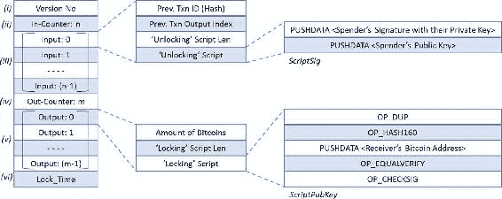

© Bikramaditya Singhal, Gautam Dhameja, Priyansu Sekhar Panda 2018 Bikramaditya Singhal, Gautam Dhameja 和 Priyansu Sekhar Panda 著《区块链入门》`doi.org/10.1007/978-1-4842-3444-0_3`

# 3. 比特币是如何工作的

Bikramaditya Singhal^(1 ), Gautam Dhameja² 和 Priyansu Sekhar Panda¹(1) 印度卡纳塔克邦班加罗尔(2) 德国柏林区块链技术如今非常热门，这要归功于比特币！我们所知的区块链是比特币及其发明者中本聪送给全世界的礼物。如果你在想中本聪是谁，那是一个未知个人或团体使用的名字，他们发明了比特币。我们建议你无需寻找发明者，理解和欣赏比特币背后的美妙技术。了解比特币的技术基础将使你能够理解市场上存在的其他区块链应用。由于比特币多年来证明了区块链技术的健壮性，人们现在相信它并开始探索使用它的其他可能方式。在上一章，我们已经了解了区块链在技术层面是如何工作的，但学习比特币可以让你真正体验到区块链的味道。你可能想将比特币视为区块链技术的加密货币用例。因此，这一章不仅会帮助你理解比特币是如何工作的，还会给你一个如何使用区块链技术构建不同用例的视角，就像比特币一样。在本章中，我们将详细介绍比特币，并在介绍的过程中，通过更多实践洞察阐明许多区块链基础知识。如果你已经熟悉比特币的基础知识，你可以跳过这一章。否则，我们建议你按照呈现的顺序跟随这些概念。这一章解释了比特币是什么，它是如何从技术上设计的，并提供了对比特币某些固有优势和缺点的分析。

## 货币的历史

有没有想过金钱究竟是什么，以及它为何存在？金钱主要是用于交换价值的媒介，即任何有价值的东西。它有一个历史。我们将快速回顾一下历史，以便能够理解金钱是如何演变成今天我们所知的模样，以及比特币是如何将其推向下一个阶段的。并非人人拥有的一切。在过去的好日子里，当时还没有货币或金钱的概念，人们还是想出了如何用他们过剩的东西交换他们需要的别人的东西。那是实物交换系统的日子。小麦换取大米或橙子换柠檬就是这样的系统。这很好，但如果有人需要小麦而另一个人却没有呢？例子：爱丽丝有小麦需要药品，但鲍勃知道她能从拥有橙子的人那里得到，而鲍勃需要小麦。在这种情况下，交换无法进行。所以，他们必须找到第三个人，查理，他可能需要橙子，同样也有过剩的药品。这种情况的图示如图 3-1 所示。图 3-1 原始实物交换系统过去，要找到像查理这样的人是很难的，这个人能如此容易地适配这个拼图；这个问题必须解决。所以，人们开始考虑一个有形价值交换的商品化系统。有一些每个人都需要的东西，比如牛奶、盐、种子、羊等。这个系统几乎行得通！不久之后，人们意识到，这样的商品存储既不方便又困难。最终，发现了可以作为金融工具使用的更好技术，比如金属片。人们更看重稀有金属而不是普通金属。因为它们不会生锈，金和银金属位居榜首。然后，国家开始铸造自己的货币（不同重量的金属硬币），并在其中印上官方印章。尽管金属片和硬币比以前的系统更好，因为一个人可以很容易地存储和携带它们，但它们容易遭到盗窃。寺庙来帮忙，因为人们信任它们，并坚信没有人会从寺庙里偷东西。僧侣会给存金的人一个收据，上面提到收到的黄金/银的数量，作为承认他们的存款并承诺在持票人回来时归还相同数量的承诺。持票人可以在市场上流通收据，以得到他们想要的东西。这就是我们银行系统的开始。收据起了作用，因为法定货币和寺庙扮演了人们信任的中心银行的角色。参考图 3-2 了解这个系统当时的外观。图 3-2 银行时代的开始在刚才提到的系统中，货币总是由某种珍贵金属，如金或银支持。这个系统在政府和国际银行取代寺庙后继续存在。这就是商品货币进入市场，为商品和服务提供一种普遍的价值交换媒介的原因。那些日子里有的货币都是用金/银支持的。渐渐地，“法定货币”由政府作为法定货币引入，这种货币不再由金或银支持。它完全是基于信任的，意思是人们别无选择，只能信任政府。法定货币没有任何内在价值，它只是由政府支持的。今天，我们所知道的货币都是法定货币。因此，当今货币的价值取决于发行和使用该货币的政府的稳定性和表现。那些纸币本身就是货币，银行里没有更有价值的东西。这是银行系统和同时数字世界形成的状态。在 20 世纪 90 年代左右，互联网世界势头正盛，银行系统正在数字化。由于对法定货币仍存在一定的不适感，因为它们容易损坏和被盗，银行保证人们可以完全数字化！这是连纸钞都不需要印刷的时代。货币变成了银行计算机系统中的数字。今天，如果每个账户持有者都去他们各自的银行要求把账户里持有的金额换成纸币，银行会遇到大麻烦！与全球范围内的数字货币相比，流通中的真实货币极其有限。

## 比特币的黎明

在第一章中，我们探讨了互联网革命的科技方面，而在本章的前一部分，我们研究了货币的演变。现在，我们应该将它们并排放置，以了解设计比特币——一种加密货币背后的中本聪的观点。在本节以及本文的其他部分，我们将尝试详细阐述中本聪在关于比特币的论文中的观点。我们了解了寺庙，然后是政府和银行在货币系统中从实物交易系统中扮演的角色。时至今日，情况依然如此。如果你对这些系统稍微放大一点，你会发现使这些系统稳定的关键因素是“信任”元素。人们信任寺庙，然后信任政府和银行。今天互联网上的整个商业活动都依赖于中心化的、值得信赖的第三方来处理支付。尽管互联网被设计成点对点的方式，但人们在其上建立中心化系统，以反映同样的旧做法。技术上来说，在 2000 年代建立一个点对点系统是相当困难的，考虑到当时技术的成熟度。因此，由于中心化，交易成本、交易结算所需时间以及其他问题都是显而易见的。这并不是实物货币的情况，因为实物货币的交易意味着结算。有没有可能存在一种由计算能力支撑的数字货币，就像黄金被用来支撑流通中的货币一样？答案是“是的”，多亏了中本聪的比特币。比特币旨在基于加密证明，而不是基于中介第三方信任，实现两个方之间的电子支付。这之所以可能，是因为技术的进步。在本章中，我们将了解中本聪如何结合密码学、博弈论和计算机科学工程基础知识，在 2008 年设计比特币系统。自 2009 年上线以来，该系统非常稳定，足够健壮，能够承受任何网络攻击。它经住了时间的考验，将自己定位为一种全球货币。

### 什么是比特币？

区块链提供了加密货币：数字货币！就像我们可以不通过银行或其他中心化实体使用实体货币进行交易一样，比特币被设计成无需可信中介就能促进点对点货币交易。让我们先看看它是什么，然后再在本章中学习它是如何真正工作的。比特币是一种去中心化的加密货币，不受任何国家的限制，是一种全球货币。它在技术、逻辑以及政治方面都是去中心化的。交易一旦得到验证，新的比特币就会被挖掘出来，而且最多只能生产出 2100 万个比特币。大约要达到 2100 万个比特币，得等到 2140 年。任何拥有强大计算能力的人都可以参与挖掘并生成新的比特币。所有比特币生成后，就无法铸造新的硬币，只能使用流通中的那些。请注意，比特币没有像国家法定货币那样的固定面值。根据设计，比特币可以有任意价值，精确到八位小数。因此，比特币的最小值是 0.00000001 BTC，称为 1 Satoshi。矿工挖掘交易以生成新硬币，同时也消耗愿意进行交易的人支付的交易费。当硬币总数达到 2100 万个时，矿工将仅为交易费而验证交易。如果有人尝试进行没有交易费的交易，它可能仍会被挖掘，因为这是一个有效的交易（如果有的话），而且矿工更感兴趣的是挖掘奖励，这让他能生成新硬币。您是否想知道是什么决定了比特币的价值？当货币由黄金支持时，它具有很大的意义，并且根据黄金标准很容易评估其价值。当我们说比特币是由人们用于挖掘的计算能力支持时，这并不足以理解它如何获得其价值。这里需要一点经济学知识来理解它。当法定货币首次推出时，它是由黄金支持的。由于人们相信黄金，所以他们相信货币。几十年后，货币不再由黄金支持，完全依赖于政府。人们继续相信它，因为他们自己形成或贡献了形成他们自己的政府。由于政府确保其价值，而人们信任它，所以它获得了那个价值。在国际环境中，特定国家的货币价值取决于各种因素，其中最重要的是“供求关系”。请记住，一些印刷了大量法定货币的国家破产了；他们的经济下滑了！必须保持平衡，要理解这一点，需要更多的经济学知识，这超出了本书的范围。所以，现在让我们回到比特币的话题。当比特币首次推出时，它没有人们相信的官方价格或价值。如果有人用一些美元（美元）出售它，我当初绝不会购买那些。逐渐地，当开始进行交易时，它发展出了一个价格，当时一个比特币甚至不是一美元。由于比特币是通过一个竞争性和去中心化的过程 called “挖掘” 生成的，并且它们以固定的速率生成，总上限为 2100 万个比特币，这使得比特币成为一个稀缺资源。现在，将这个上下文关联到“供求关系”的游戏中，比特币的价值开始膨胀。慢慢地，当整个地球开始相信它时，它的价格甚至从几美元猛涨到几千美元。比特币在用户、商家、初创公司、大型企业等方面的采用率正以前所未有的速度增长，因为它们被用作货币。因此，比特币的价值受到“信任”、“采用”和“供求关系”的高度影响，而其价格由市场决定。现在，问题是为什么比特币的价值如此波动，并且截至撰写本文时波动很大。一个明显的原因是供求关系。我们了解到，流通中的比特币数量有限，总共 2100 万个，而且它们生成的速度随时间减少。由于这个设计，供应和需求之间总是存在差距，从而导致这种波动。另一个原因是比特币从未在一个地方交易。世界上有那么多地方都有那么多交易所，所有这些交易所都有自己的交易价格。您看到的指数从几个交易所收集比特币交易价格，然后平均它们。同样，由于所有这些指数没有从同一组交易所收集数据，甚至它们也不匹配。同样，流动性因素也说明在任何给定时间整个市场流动的比特币数量，也影响比特币价格的波动。到目前为止，比特币绝对是一种高风险资产，但随着时间的推移可能会稳定下来。让我们看看以下可能影响比特币供求和价格的因素列表：

+   人们对比特币的信心以及对不确定性的恐惧

+   媒体对比特币的好坏消息报道

+   有些人拥有比特币，并阻止它们流入市场，而有些人则通过买卖来最小化风险。这就是比特币流动性水平不断变化的原因。

+   大型电子商务巨头接受比特币

+   特定国家对比特币的禁令

如果你现在想知道比特币是否有可能彻底崩溃，那么答案是“是的。”有许多国家的货币体系已经崩溃的例子。好吧，它们崩溃的原因可能有政治和经济因素，比如超级通货膨胀，但这不是比特币的情况，因为无法制造出尽可能多的比特币，而且比特币的总数是固定的。然而，比特币存在技术或密码学失败的可能性。请注意，自 2008 年创立以来，比特币已经经受了时间的考验，并且随着时间的推移，它可能会变得更大，但无法保证！

### 使用比特币

要开始使用比特币，你不需要任何技术知识。你只需要下载一个比特币钱包，然后开始使用。当你在笔记本电脑或手机上下载并安装钱包后，它会生成你的第一个比特币地址（公钥）。你可以生成更多的地址，这是推荐的做法。最佳实践是仅使用比特币地址一次。在比特币中，地址重复使用是不意图的行为，尽管它有效。地址重复使用可能会损害隐私和保密性。例如，如果你重复使用同一个地址，用相同的私钥签署交易，收件人可以很容易且可靠地确定被重复使用的地址是你的。如果同一个地址用于多个交易，它们都可以被追踪，找到你是越来越容易的。要记住的是，比特币并非完全匿名；它被认为是假名，有方法可以追踪交易起源，揭示所有者。你必须向愿意向你转账比特币的人透露你的比特币地址。这非常安全，因为公钥本来就是公开的。我们知道比特币中没有结余的概念，所有记录都作为交易存在。比特币钱包可以轻松计算其可支配余额，因为它们拥有相应公钥的私钥，这些公钥收到了交易。有许多比特币钱包可供选择，来自许多钱包提供商。有移动钱包、桌面钱包、基于浏览器的网络钱包、硬件钱包等，安全性各不相同。在使用比特币时，你必须在钱包安全方面保持极其谨慎。比特币支付是不可逆的。你可能想知道这些钱包有多安全。嗯，不同类型的钱包有不同的安全级别，这取决于你想要如何使用它。许多在线钱包服务遭受了安全漏洞。始终在适用的情况下启用双因素认证是一个好习惯。如果你是比特币的常用户，将少量比特币存放在钱包中，并将剩余部分保存在安全的环境中可能是个好主意。不连接到网络的离线钱包或冷钱包为储蓄提供了最高的安全级别。此外，应为你的钱包建立适当的备份机制，以防你丢失电脑/手机。记住，如果你丢失了私钥，与之关联的所有资金都会丢失。如果你没有作为运行完整节点的矿工加入比特币，那么你可以只是比特币的用户或交易者。你肯定需要一个交易所，从那里你可以用美元或其他被交易所接受的货币购买一些比特币。你应该选择从合法和安全的交易所购买比特币。已经有很多交易所遭受了安全漏洞的例子。

## 比特币区块链

我们在上一章已经介绍了区块链的基本数据结构，并且也覆盖了区块链数据结构的基本构建模块，如哈希技术和非对称加密。在本节中，我们将学习比特币区块链的具体内容。比特币区块链，像任何其他的区块链一样，有着类似的区块链数据结构。比特币核心客户端内部使用谷歌的 LevelDB 数据库来存储区块链数据结构。每个区块都由其哈希值（比特币使用 SHA256 哈希算法）来标识。每个区块的头部部分都包含前一个区块的哈希值。记住，这个哈希值不仅仅是前一个头部的哈希值，而是包括整个区块，包括头部，一直追溯到创世区块。创世区块是任何区块链的开始。通常，比特币区块链如图 3-3 所示。图 3-3 比特币区块链正如你在这个区块链中所看到的，有一个区块头部部分包含了头部信息，还有一个体部分，交易被每块捆绑在一起。每个区块的头部都包含前一个区块的哈希值。所以，链中任何区块的变化都不会那么容易；所有后续的区块都必须要相应地改变。例如：如果有人尝试改变被捕捉在，比如说，区块号码 441 中的先前交易，在改变交易后，这个区块中在区块号码 442 的头部中的哈希值将不匹配，所以它也必须要改变。用新的哈希值改变头部然后就需要你更新序列中下一个区块，即区块号码 443 的头部中的哈希值，这将会一直持续到当前区块，这是艰苦的工作。当我们知道每个节点都有自己的副本，或者至少 51%的节点，是不可能被黑入的，所以这几乎是不可能做到的。在区块链中，只有一个真正的路径可以追溯到创世区块。然而，如果你从创世区块开始，那么可能会出现分叉。当同时提出两个区块并且它们都是有效的，只有一个会成为真正链的一部分，另一个就会被孤立。每个节点都建立在最长的链上，无论它先听到哪个，哪个成为最长的链，它就会基于哪个构建。这种情况可以如图 3-4 所示。图 3-4 真实区块链中的孤立区块观察图 3-4 中，在区块高度 3 时，有两个区块被提出成为区块 3，但只有一个能最终成为最终的区块链，其他的都被孤立出去。很明显，在某个区块高度，有一个或多个区块的可能性，因为在这个高度也可能有一些被孤立的区块，所以区块高度不是唯一标识一个区块的最好方式，区块哈希值是正确的方式。

### 区块结构

比特币区块链的区块结构对所有区块来说是固定的，并具有特定的字段及其相应的必需数据。请查看图 3-5，这是整个区块结构的全景视图，然后我们将在本章后面了解更多关于各个字段的内容。图 3-5 比特币区块链结构

| 字段 | 大小 | 描述 |
| --- | --- | --- |
| 魔数 | 4 字节 | 它有一个固定值 0xD9B4BEF9，表示块的开始，也表明该块来自主网或生产网络。 |
| 区块大小 | 4 字节 | 这指示区块的大小。原始的比特币区块是 1MB，还有一种名为“比特币现金”的新比特币版本，其区块大小为 2MB。 |
| 区块头部 | 80 字节 | 它包含诸如前一个区块的哈希、Nonce、Merkle 根等许多信息。 |
| 交易计数器 | 1–9 字节（可变长度） | 它指示包含在区块内的交易的总数。并非每个交易的大小都相同，每个区块中都有可变数量的交易。 |
| 交易列表 | 数量可变但大小固定 | 它列出了给定区块中进行的所有交易。根据区块大小（1MB 或 2MB），此字段占用区块中的剩余空间。 |

现在让我们放大（表 3-2）到区块的“区块头部”部分，并了解它维护的各种不同字段。表 3-2 区块头部组件

| 字段 | 大小 | 描述 |
| --- | --- | --- |
| 版本 | 4 字节 | 它指示比特币协议的版本号。理想情况下，运行比特币协议的每个节点都应该有相同的版本号。 |
| 前一个区块哈希 | 32 字节 | 它包含链中前一个区块的头部哈希。当将前一个块头中的所有字段组合在一起并用 SHA256 算法进行哈希时，它产生一个 256 位结果，即 32 字节。 |
| Merkle 根 | 32 字节 | 区块中的交易通过设计形成了一个 Merkle 树，Merkle 根是这个 Merkle 树的根哈希。如果区块中的交易被修改，那么当计算时它不会与 Merkle 根匹配。这样确保了保持前一个区块头部的哈希就足以维护安全的区块链。此外，Merkle 树可以帮助确定一个交易是否是区块的一部分，时间复杂度为 O(n)，并且非常快！ |
| 时间戳 | 4 字节 | 在比特币网络中没有全球时间的概念。所以，这个字段用 Unix 时间格式指示区块创建的大致时间。 |
| 难度目标 | 4 字节 | 当这个块被挖掘时，为这个块设置的证明工作（PoW）难度级别 |
| Nonce | 4 字节 | 这是一个在挖矿过程中满足 PoW 谜题的随机数。 |

块字段及其相应的解释如前表所示，足够开始使用，我们将探索仅有几个需要更详细解释的字段。

#### 梅克尔树

我们在上一章中介绍了梅克尔树的概念。在本节中，我们将看看比特币如何使用梅克尔树。比特币区块链中的每个区块都包含所有交易的哈希值，这些交易的梅克尔根包含在该区块的头部。真正地说，当我们说每个区块头包含整个前区块的哈希时，信任的是它只包含前区块头的哈希。尽管如此，这已经足够了，因为头部已经包含了梅克尔根。如果区块中的交易被更改，梅克尔根将不再匹配，这种设计仍然保持了区块链的完整性。梅克尔树是交易哈希值的树数据结构。“叶节点”在梅克尔树中实际上表示交易的哈希值，而树的根是梅克尔根。参考图 3-6。图 3-6 梅克尔树表示注意到七个交易 A、B、C、D、E、F 和 G 的哈希值形成了树的叶。由于有七个交易，但二进制树的总叶节点应该是偶数，最后一个叶节点被重复。每个 32 字节的交易哈希（即 256 位）是通过将交易应用 SHA256 两次计算得出的。同样，两个交易的哈希被连接（62 字节），然后再次用 SHA256 哈希两次以得到 32 字节的父哈希。只有到交易的梅克尔路径足以验证交易是否是任何块的一部分，因此非常有效。因此，实际的区块链可以如图 3-7 所示表示。图 3-7 梅克尔树表示

#### 难度目标

困难度目标是驱动比特币中工作量证明（PoW）的因素。其核心思想是，一旦区块中包含了有效交易，就需要计算该区块头的哈希值，使其小于相同头部中的困难度目标。头部中的随机数从零开始。矿工必须不断递增此随机数并计算头部的哈希值，直到此值小于目标。头部中的四字节难度位（32 位）定义了挖掘该区块所需的目标值（256 位）。随机数应该被找到，以使整个头部的哈希值小于目标值。请记住，目标值越低，找到小于目标的头部哈希值就越困难。由于比特币使用 SHA256，每次对区块头进行哈希时，输出是 0 到 2^（256）之间的任意数。如果用您的随机数哈希值小于目标，该区块将被整个网络接受；反之，您必须尝试不同的随机数，直到满足条件。目前，仍不清楚每个头部的难度位是如何计算困难度目标的。目标可以通过头部中的四字节（8 个十六进制数）难度位使用每个节点默认带有的预定义公式进行推导。下面是计算难度的公式：target = coefficient * 2^((8 * (exponent – 3)))注意，此公式中有“系数”和“指数”项，它们作为四字节难度位的一部分出现。让我们通过一个示例来更好地解释这一点。如果头部中的四字节难度位以十六进制形式表示为 0x1b0404cb，则前两个十六进制数字形成指数项（0x1b），剩余部分形成系数项（在这种情况下是 0x0404cb）。使用这些值计算目标公式：target = 0x0404cb * 2^((0x08 * (0x1b – 0x03)))target = 0x00000000000404CB000000000000000000000000000000000000000000000000 比特币设计为每 2,016 个区块应该需要两周的时间产生，如果做一下数学运算，那么每个区块大约需要十分钟。在这种异步网络中，很难像在 POW 机制中一样精确地编程每个区块需要十分钟。实际上，这是一个区块的平均时间，有时一个比特币区块可能在一分钟内产生，也可能需要 15 分钟。所以，难度被设计为根据找到 2,016 个区块所花费的时间长短而增加或减少。这个时间可以通过每个区块头的时间戳字段中的时间来计算。例如，如果花费了 T 时间来找到 2,016 个区块，这永远不会完全是两周，难度目标公式中的目标值将被乘以(T / 2 周)。因此，结果[难度目标×(T / 2 周)]将根据 T 是少还是多而增加或减少。到目前为止，很明显难度目标是可以调整的；它可以根据之前解释的情况设置得更困难或更容易。也许您想知道，当系统被去中心化时，谁来调整这个难度？您一定会好奇的是，当去中心化的设计发生的任何事情都会在每个节点上都发生。每经过 2,016 个区块，所有的节点都会独立计算新的难度目标值，他们都会根据相同的目标得出相同的结论，因为这已经有一个定义好的公式。为了方便记忆，公式如下：New Target= Old Target * (T / 2 weeks)⇨  New Target= Old Target * (Time taken for 2016 Blocks in Seconds / 12,09,600 seconds)注意，这是（T / 2 周），而不是（2 周/T）。其思想是当需要增加复杂性时，降低难度目标以便花费更长时间。目标哈希越低，要找到小于此目标哈希的哈希就越困难。例如： 如果花了十天来挖掘 2,016 个区块，那么（T / 2 周）将是一个分数。当它与“旧目标”相乘时，进一步降低了目标，并且“新目标”将是小于旧目标的一个值。这将使得找到一个哈希变得困难，并且需要更长的时间。这就是如何在平均情况下维持区块之间的时间为十分钟。想象一下，如果难度目标是固定的而不可调整的会产生什么问题？请记住，随着越来越多的功能更强大的计算机加入区块挖掘，同时提出 10 个，100 个甚至 1000 个区块的情况对于网络来说是不可取的。因此，即使更多功能更强大的计算节点加入比特币网络，仍然调整难度目标，使得提出一个区块的平均时间仍然是十分钟。另外，一个矿工提出一个区块的机会取决于他们所拥有的哈希计算能力与所有矿工的全局哈希计算能力相比。您有没有想过为什么是十分钟，为什么不是十二分钟？或者为什么不是六分钟？只需牢记，对于去中心化异步系统中的所有节点，必须有一定的时间间隔来达成一致。如果没有时间间隔，那么会有很多区块的到来只是有些微小的延迟，并且在优化方面与链式交易相比也没有任何优势。每个交易都是一个广播，每个新的区块也是一个广播。同时，区块链为系统带来的整齐井然性与链式交易相比是非常不可行的。通过区块的概念，可以将来自任何发送方到任何接收方的不相关交易包括在区块中，这是无法通过链式交易进行维护的。一个合法的区块广播比通过验证后的单个交易广播更有效。现在回到十分钟的讨论，它可能会少一些时间或者更长一些，但是两个连续区块之间肯定应该有一定的间隔。想象一下，如果你是一名矿工，正在挖掘区块编号 4567，但是另一位矿工运气不错，已经提出了区块编号 4567，你在解决密码难题时刚刚收到。现在你要做的是验证这个区块，如果它是有效的，就添加到你的本地区块链副本中，然后立即开始挖掘 4568 区块。你不会想要其他人在你验证完区块 4567 后立即提出 4568 区块。由于网络延迟的原因，你可能比其他矿工晚一点收到区块 4567 的消息。现在的问题是：这个十分钟是最佳的选择吗？嗯，这很难用一句话解释，但是十分钟的间隔解决了许多由于异步网络、时延、数据包丢失、系统能力等造成的问题。有可能存在进一步优化到比如说五分钟的可能性，您可以在许多新的加密货币和其他区块链应用方面看到。

### 创世区块

正如你所看到的以下代码，第一个区块，即区块-0，被称为创世区块。记住，创世区块必须被硬编码进区块链应用程序中，比特币亦是如此。你可以将其视为一个特殊的区块，因为它不包含对任何前区块的引用。比特币的创世区块是在 2009 年启动时创建的。如果你打开比特币核心，特别是文件[chainparams.cpp](http://bit.ly/1x6rcwP)，你会看到创世区块是如何被静态编码的。使用命令行参考比特币核心，你可以通过查询创世区块的哈希值获取相同的信息，如下所示：

| 摘要 |
| --- |
| 交易数量 | 1 |
| 输出总量 | 50 BTC |
| 估算交易量 | 0 BTC |
| 交易费用 | 0 BTC |
| 高度 | [0](https://blockchain.info/block-height/0)（主链） |
| 时间戳 | 2009-01-03 18:15:05 |
| 接收时间 | 2009-01-03 18:15:05 |
| 传播者 | [未知](https://blockchain.info/blocks/Unknown) |
| 难度 | 1 |
| 比特数 | 486604799 |
| 大小 | 0.285 kB |
| 权重 | 0.896 kWU |
| 版本 | 1 |
| 随机数 | 2083236893 |
| 区块奖励 | 50 BTC |

表 3-4 哈希信息

| 哈希数 |
| --- |
| 哈希 | [000000000019d6689c085ae165831e934ff763ae46a2a6c172b3f1b60a8ce26f](https://blockchain.info/block/000000000019d6689c085ae165831e934ff763ae46a2a6c172b3f1b60a8ce26f) |
| 前一个区块 | [0000000000000000000000000000000000000000000000000000000000000000](https://blockchain.info/block/0000000000000000000000000000000000000000000000000000000000000000) |
| 下一个区块(s) | [00000000839a8e6886ab5951d76f411475428afc90947ee320161bbf18eb6048](https://blockchain.info/block/00000000839a8e6886ab5951d76f411475428afc90947ee320161bbf18eb6048) |
| 默克尔根 | 4a5e1e4baab89f3a32518a88c31bc87f618f76673e2cc77ab2127b7afdeda33b |

在区块 0 中，只有一个交易，即创世区块交易。创世区块交易是矿工们获得的交易。这种交易没有输入，它们只能生成新的比特币。如果您探索了与这个区块关联的交易，这里就是这样（图 3-8）。图 3-8 区块 0 中的创世区块交易

## 比特币网络

比特币网络是一个点对点网络，正如前面所讨论的。在这种系统中没有集中服务器，每个节点都被平等对待。系统中没有主从现象，也没有层级之分。由于它是运行在互联网本身之上的，所以它使用了与图 3-9 相同的 TCP/IP 协议栈。图 3-9 互联网上的比特币区块链网络上述图表展示了比特币网络是如何在相同的互联网堆栈中共存的。比特币网络在动态性方面相当强大，意味着节点可以随时加入或离开网络，而系统仍然可以正常工作。此外，尽管它本质上是异步的，存在网络延迟和数据包丢失的情况，但系统非常健壮，这要归功于比特币的设计！比特币网络是一个没有失败集中点和也没有中央权威的去中心化网络。在这种设计下，您如何评估比特币网络的大小呢？由于节点可以随时加入或离开，所以没有合适的估算方法。然而，有一些尝试去研究比特币网络，有些人声称有接近 10,000 个节点大部分时间都与网络连接，同时可能有数百万个节点。比特币网络中的每个节点在权威方面都是平等的，并且具有扁平结构，但节点可以是完整节点或轻量级节点。完整节点可以在比特币系统中执行几乎所有允许的活动，比如挖掘交易和广播交易，并提供钱包服务。完整节点还提供路由功能以参与和维护比特币网络。要成为完整节点，你必须下载包含到目前为止所有交易的整个区块链数据库。另外，节点必须永久连接到比特币网络并监听所有发生的交易。重要的是你需要有一个良好的网络连接，良好的存储（至少 200GB），并且至少 2GB 的 RAM 分配给它。这个要求可能会进一步改变，并随着时间的推移需要更多的资源。另一方面，轻量级节点不能挖掘新块，但可以通过简化支付验证（SPV）来验证交易。它们也被称为“瘦客户端”。比特币网络中的大多数节点都是 SPV。它们也可以参与池挖矿，在那里有许多节点一起尝试挖掘新块。轻量级节点可以帮助完整节点验证交易。一个 SPV 的好例子是一个钱包（客户端）。如果你在运行一个钱包，有人给你发送钱，你可以作为比特币网络中的一个节点，下载与你有关的交易，这样你就可以检查给你比特币的人是否真的拥有它们。需要注意的是，SPV 不如完全验证节点安全，因为它通常只包含区块头而不是整个区块。因此，SPV 无法验证交易，因为它们没有区块的交易，并且除了自己的未花费交易输出（UTXO）外，它们也没有全部的未花费交易输出（UTXO）。

### 新节点的网络发现

现在想象一下，当一个新的节点想要加入比特币网络时，它会如何与网络联系？这并不是一个只有 192.168.1.X 网络的局域网，你可以向 IP 192.168.1.255 广播，以便 192.168.1.X 网络上的任何计算机都能收到广播消息。网络交换机被设计来允许这样的广播数据包。然而，记住我们正在谈论的是互联网，比特币就建立在其之上。如果你在伦敦运行一个节点，有可能在伦敦、俄罗斯、爱尔兰、美国和印度还有其他节点，并且它们都通过互联网和一些公共面向的 IP 地址连接起来。这里的问题是，当一个新的节点加入网络时，它如何找出对等节点？并没有某个中央服务器像基于互联网的典型 web 应用那样响应他们的请求。区块链是去中心化的，记住吗？当比特币核心或比特币 J 程序第一次启动时，它并不拥有任何完整节点的 IP 地址。因此，它们配备了多种寻找对等节点的方法。其中一种是 DNS 种子。它们中的一些在程序中硬编码了 DNS 种子。DNS 系统中还维护着一些主机名，它们解析为运行比特币节点的 IP 地址列表。DNS 种子由比特币社区成员维护。一些社区成员通过手动输入 IP 地址和端口号提供静态 DNS 种子。还有一些社区成员提供动态 DNS 种子服务器，可以自动获取运行在默认比特币端口（主网为 8333，测试网为 18333）上的活跃比特币节点的 IP 地址。如果你对 DNS 种子执行 NSLOOKUP，你会得到运行比特币节点的的一堆 IP 地址。客户端（比特币核心或比特币 J）还维护了一个指向一些（不是一台！）稳定比特币节点的硬编码 IP 地址列表。这样的节点可以被称为引导节点，它们的端点源代码本身就已经有了。每次下载二进制文件时，都会下载一个活跃节点的最新列表。一旦建立了比特币节点的连接，就可以很容易地拉取其他在那一刻活跃的比特币节点的列表。下面几幅图展示了新的节点如何成为网络的一部分。

### 比特币交易

比特币交易是比特币系统的基本构建块。比特币交易基本上可以分为两大类：

+   Coinbase 交易：比特币区块链中的每个区块都包含由矿工自己包含的 coinbase 交易，以能够挖出新的比特币。他们无法控制自己能在每个区块中挖出多少个比特币，因为这由网络本身控制。最初是 50 个比特币，然后不断减半，直到达到总共 2100 万个比特币。

+   常规交易：常规交易与一般的货币交易非常相似，其中一个人试图与他们交易的另一个人交易一定数量的货币。在比特币中，一切都是以交易的形式存在的。要花费一定数量的资金，必须消耗之前获得该金额的交易——这些在比特币中就是常规交易。本章我们将重点关注这些常规交易。

每个比特币的所有者可以通过数字签名前一个交易的哈希值来将硬币转让给其他人，其中他们获得了比特币以及接收者的公钥。收款人或接收者已经拥有支付者的公钥，因此他们可以验证交易。下面的图（图 3-15）来自中本聪的白皮书，图解了它是如何工作的。图 3-15 比特币交易注意图表中突出显示的 Owner-2 部分。由于 Owner-1 正在发起这笔交易，他使用自己的私钥签名两个项目的哈希值：一个是他自己收到金额的前一个交易，第二个是 Owner-2 的公钥。使用 Owner-1 的公钥可以轻松验证这笔交易的合法性。同样，当 Owner-2 将比特币转给 Owner-3 时，他将使用自己的私钥签名前一个交易的哈希值（他从 Owner-1 那里收到的交易）以及 Owner-3 的公钥。任何网络的一部分都可以验证这样的交易。显然，因为每笔交易都是广播的，大多数节点都将拥有整个交易历史，以防止双重花费尝试。比特币网络中没有关闭余额的原则，一个人所持有的总金额是他们所拥有的所有公共地址收到的交易的总额。你可以创建尽可能多的公共地址。如果你有十个公共地址，那么无论资金被转到哪个公共地址，你都可以使用你的私钥花费这些交易（未花费的交易或 UTXOs）。如果你需要花费，比如说，五个比特币，你有几个选择：

+   使用之前接收的五个或更多比特币的交易之一。将五个比特币转给收款人，一部分作为交易费，剩余的转给自己。参考图 3-16 图 3-16 带有单个交易输入的比特币交易

+   使用多个你之前接收的交易，这些交易的总和超过五个比特币。将五个比特币转给收款人，一部分作为交易费，剩余的转给自己。参考图 3-17 图 3-17 带有多个交易输入的比特币交易

正如你所看到的，每个交易都将前一个交易作为输入。并没有一个账户维持说你有八个 BTC，并且你可以花费任何低于这个数额的金额；如果你花费了五个 BTC，剩余的余额将是三个 BTC。在比特币中，一切都是一个交易，其中包含输入和输出。如果输出还没有被花费，它们就是未花费交易输出（UTXO）。我们知道网络中的每个交易都被广播到整个网络。无论有人是否在维护节点，他们仍然可以进行交易，并且该交易会被发布到所有可访问的比特币节点。接收比特币节点然后将交易进一步广播到其他节点，整个网络通常会被交易淹没。这有时被称为八卦协议，并在防止双重花费攻击中发挥重要作用。回想一下，防止双重花费的唯一方法就是了解所有交易。第二章中提到，每个节点都会维护一组他们听到的所有交易，并只广播新交易，这些新交易还没有包含在列表中。节点会将这些交易维护在列表中，直到交易进入区块并成为区块链的一部分。这是因为即使一个区块拥有所有有效的交易，并且被提出作为一个有效的区块，它仍然可能因为不是最长链的一部分而被孤立。一旦确认区块现在是最长链的一部分，那么包含在那个区块中的交易就会被从交易列表中删除。比特币网络中的每个完整节点必须维护未花费交易（UTXO）的整个列表，尽管这些交易有数百万个。如果一个交易在 UTXO 列表中，那么它可能不是双重花费的尝试。在确认交易不是双重花费攻击，并且从其他角度也验证了交易的有效性后，节点会广播这样的交易。如果你想知道要搜索数百万个 UTXO 以检查双重花费会多快，你的思路是对的。由于交易输出按它们的哈希值排序，所以在有序哈希列表中搜索项目是非常快速的。现在让我们更深入地思考和挖掘双重花费场景。Alice（A）尝试向 Bob（B）和 Charlie（C）支付相同的交易（交易输入是一个先前交易，并且没有结账余额的概念）是非常可能的。这样的场景将如图 3-18 所示。

+   A 试图向 B 和 C 支付相同的交易。

+   节点 2 收到了交易 A Tx(1234) --> B，节点 3 收到了交易 A Tx(1234) --> C。

+   对于节点 2 和节点 3，他们各自接收到的交易是合法的交易。

+   当 Node-3 尝试将交易 A Tx(1234) --> C 广播给 Node-2 （每个节点都会广播新交易）时，Node-2 会拒绝这个交易，因为它已经有一个与相同输入交易 Tx(1234) 的交易 A Tx(1234) --> B。

+   类似的情况也会发生在其他节点上，它们可能接收到交易“A Tx(1234) --> B”或者“A Tx(1234) --> C”， whichever reached them faster, but not both.

+   在挖矿期间， whichever node gets to propose the block will include the transaction it has. This transaction would be a part of the blockchain and the rest of the nodes that are holding the other transaction would simply drop the transaction with Tx(1234) because it will no longer be a UTXO.

### 共识和区块挖矿

在上一节中，我们看了粒度化的交易。我们将学习如何将这些交易捆绑在一起形成一个区块，并在节点之间达成共识，以便整个网络接受该区块并扩展区块链。请注意，“区块挖掘”是指成功在区块链中创建新区块。在比特币中，分布式 PoW 共识算法有助于通过保持去中心化来挖掘新区块。在这样的网络中实现分布式共识非常困难。虽然对于分布式系统（例如 Facebook、Google、Amazon 等拥有数百万台服务器需要保持数据一致性的系统）而言，几十年来一直存在，但“共识”一词由于比特币而变得非常流行。我们将在本章中深入了解共识和挖掘的细节。首先，只需记住比特币网络中的一切都表示为交易。如果要进行交易，您必须使用一个或多个先前的交易作为输入并进行另一笔交易。我们已经知道，必须使用私钥签名交易，以确保正确的人进行交易。尽管存在这样的密码安全性，但该人能否签署已经花费的交易呢？例如：爱丽丝在交易编号为 1234 的交易中收到了十个比特币。她完全可以使用相同的交易 1234，并将这十个比特币转给鲍勃和查理。由于她将使用她的私钥签名，这意味着这是一笔真实的交易，你认为是什么阻止她进行双重支出的呢？请注意，在比特币中没有办法阻止她尝试进行双重支付，但系统设计得使得这样的尝试不会成功。防止此类尝试的唯一方法是了解所有正在进行的交易。这就是为什么比特币中的所有交易都会广播到整个网络的原因。一旦一笔交易花费，它就不再是未使用交易输出（UTXO）的一部分，并且会生成一个新的交易编号，以成为仅收件人可以花费的 UTXO 的一部分。这是节点可以验证交易的方式。此外，防止双重支付攻击的唯一方法是了解所有交易。当您了解所有交易时，您将知道支出和未使用交易输出。当矿工提出一个新的区块时，要求该区块中的所有交易都有效。这是否意味着提出区块的节点不能包含无效交易？答案是“是的”。他们肯定可以注入一个欺诈性交易，但其他节点将拒绝它。节点通过消耗计算机资源和电力所做的 PoW（我们稍后会详细了解）会徒劳无功！因此，节点永远不希望提出无效区块，这要归功于 PoW 共识。尽管没有全局时间的概念，但请注意，交易被合并在一起形成一个区块，该区块成为区块链的一部分，更多的区块被逐个添加到链中，而且有一个顺序！请仔细注意，区块链保留了交易发生的顺序。通过这种方式，共识发生在区块级别，并一直传播到粒度化的交易。根据我们迄今所了解的内容，现在我们知道比特币网络中的每个节点都有自己的区块链副本，并且没有“全局区块链”；它毕竟是一个去中心化的网络。所有这些区块链副本中的每个节点包含许多交易。同样，每个节点都维护着 UTXO 列表，当有机会（节点是随机选择的，我们将看到如何）提出一个区块时，它们包含尽可能多的交易，直至 1MB 或 2MB 的区块限制。如果该区块成功添加到区块链中，则从 UTXO 列表中删除它们。请注意，由于可能存在某些节点未收到某些交易的可能性，因此每个节点的未处理交易列表可能会有所不同。现在是时候看看 PoW 算法是如何真正工作的了。我们了解了每个区块头中的难度目标字段。每个挖矿节点都试图解决密码难题，希望能幸运地提出一个区块。他们之所以如此渴望提出一个区块，是因为当他们提出的区块成为区块链的一部分时，他们会得到巨大的好处。个人进行的每笔交易都可以为矿工设定一些交易费。我们知道所有节点都维护着尚未成为区块链一部分的交易列表，当他们有机会提出一个区块时，他们会尽可能多地接受交易并形成一个区块。显然，他们会接受能为他们带来最高利润的所有交易，并留下具有最低或无交易费的交易。交易费较低的交易可能需要一些时间才能进入区块，而没有交易费的交易的机会较小。除了交易费外

### 区块传播

比特币使用工作量证明（PoW）挖矿随机选择一个可以提出有效区块的节点。一旦矿工找到一个有效区块，他们就会将该区块广播给整个网络。网络中的区块传播方式与交易相同。每个收到新区块的节点都会进一步广播，以便最终区块能到达网络中的每个节点。请注意，除非节点从其角度看到的最长链的一部分，否则节点不会广播区块。一旦节点收到提议的新区块，它们不仅验证头部并检查哈希值是否在可接受范围内，还要验证区块中包含的每一个交易。到现在为止，对于比特币网络中的一个节点来说，验证一个区块比验证交易要复杂得多。与交易类似，同时提出两个有效区块的可能性存在。在这种情况下，节点会保留两个区块并开始构建来自最长链的那个区块。我们必须明白，区块传播到整个网络并到达每个节点的过程中总是存在延迟。区块大小与所需时间的关系是线性成比例的，这意味着每增加 kB 到区块大小，延迟线性增加。显然，这种网络延迟会影响区块链的增长速度。Decker 和 Wattenhofer 进行的一项测量研究解决了这种情况。参考图 3-19，它显示了区块大小与达到 25%（Line-1）、50%（Line-2）和 75%（Line-3）监控节点的传播时间的关系。图 3-19 区块大小与区块传播时间的关系网络带宽是此类网络延迟的主要原因，而且在全球各个地区的延迟并不一致。在此基础上，我们知道区块的广播数据包要经过许多跃点才能最终到达所有节点。典型的比特币区块大小为 1MB，而具有硬分叉的新比特币变种（比特币现金）的区块大小为 2MB；你可以想象由于延迟而产生的固有限制。根据网络研究，一个月内有超过一百万个比特币节点连接到比特币网络，而且有成千上万的完整节点几乎总是永久连接到网络。

### 综合所有内容

从高层次来看，如果我们只是按照事件发生的顺序记录下来，那么它可能看起来是这样的：

+   所有新交易都会广播给所有节点。

+   每个听到新交易的节点都会收集这些交易并放入一个区块。

+   每个挖矿节点都在寻找一个难度的 PoW，以便将其区块提出给网络。

+   当一个节点幸运地找到 PoW 谜题的正确 nonce 时，它会将区块广播给所有节点。

+   节点只接受非 once 和其中所有交易都是有效且未被花费的提案块。

+   比特币网络节点通过使用已接受块的哈希作为他们将要挖矿的新块的前一个哈希来创建链中下一个块，表达他们对块的接受。

## Bitcoin 脚本

在之前的章节中，我们已经在较高层面上了解了比特币交易。在本节中，我们将深入探讨实际编程构造，这些构造使得交易得以进行。比特币交易的输入和输出都嵌入了脚本。比特币脚本是基于栈的，我们很快就会看到，并且是从左到右进行评估的。请记住，比特币脚本不是图灵完备的，所以你不能真正通过其他图灵完备语言如 C、C++ 或 Java 等做到任何和一切事情。比特币脚本中没有循环的概念，因此脚本的执行时间是不变的，与指令数量成比例。这意味着脚本在有限的时间内执行，并且不可能陷入循环中。此外，最重要的是，脚本肯定会终止。现在我们已经对脚本有所了解，那么它们在哪里运行呢？无论交易是程序化地、通过钱包软件还是通过其他程序进行，脚本都注入到交易中，矿工在挖矿时运行这些脚本。比特币脚本的目的是使网络节点能够确保可用的资金仅由真正拥有它们的有权限的各方声称和花费。

### 再访比特币交易

比特币网络中的交易是价值的转移，它广播给整个网络，并最终存储在区块链的某个区块中。通常，看起来比特币是从一个账户或钱包转移到另一个，但实际上，是从一个交易到另一个交易。嗯，在深入了解之前，请记住比特币地址实际上是参与者公钥的双重哈希输出。公钥首先使用 SHA256 哈希算法，然后使用 RIPEMD160 哈希算法分别生成 160 位的比特币地址。我们在上一章已经介绍了这些哈希技术。现在让我们更详细地了解一下交易。看看以下的交易树（图 3-20），比特币中的交易方式。图 3-20 典型的比特币交易结构请注意，先前交易的输出成为新交易的输入，这个过程将持续下去。在前面的图中，如果你从某个先前的输出中获得了 100K，它就成为了新交易的可花费输入。注意，在 Tx 0 中，你花费了 40K 和 50K 并支付了这些金额，剩余的金额（10K）成为了矿工的手续费。默认情况下，剩余的金额支付给矿工，所以你需要小心，不要忽略这种情况，这种情况总是存在的。在这种情况下，剩余的 10K 金额，你可以将 9K 转移到自己的地址，留下 1K 作为挖矿费用。当一个金额没有被花费，即交易没有作为新交易的输入使用时，它保留为一个未花费交易输出（UTXO），稍后可以花费。显然，之前的都已经花费了。所以，你持有的所有账户（公钥）的 UTXO 总和就是你的钱包余额。暂停片刻，思考一下它是如何被编程的。记住，交易的输入和输出都配备了相关的脚本以使之成为可能。只有通过脚本才能确保你是授权用户进行交易，并且你有从先前交易中接收到的必要金额。这意味着输入和输出都同样重要。交易内容的外观如下：交易输出 = 要转移的比特币金额 + 输出脚本交易输入 = 先前交易输出的引用 + 输入脚本是先查看输出脚本还是输入脚本实际上是一个先有鸡还是先有蛋的问题。但我们先看输出脚本，因为它是下一个交易的输入脚本将要消费的部分。让我们重复并弄清楚这一点，在制作交易时，当前交易的输出脚本只是为了启用未来的交易，该交易可以将其作为输入，但对于这个当前交易来说，是先前的交易的输出脚本让你可以花费它。这就是为什么输出脚本具有接收者的公钥和转移的值（比特币金额）。当输出脚本作为输入使用时，它们的主要目的是检查签名与公钥是否一致。输出脚本也被称为 ScriptPubKey。除非这个输出被花费，否则它保留为一个等待花费的 UTXO。交易输入数据结构中的输入脚本具有如何消耗你试图花费的先前交易的方法。所以，它必须有对那个先前交易的引用。先前交易的哈希和索引号{哈希，索引}可以精确地指出你在哪里收到了你现在要花费的金额。索引的目的是为了识别先前交易中打算的目标输出。如果你是先前交易的接收者，你必须提供你的签名，以声明你是公钥的所有者，该公钥是交易的目标。这将让你花费那个交易。此外，你必须提供你的公钥，它将哈希为先前交易中使用的目标地址。输入脚本也被称为 ScriptSigs。脚本的最终目标是将签名和密钥推送到栈上。典型的比特币交易具有以下字段（表 3-5）。表 3-5 比特币交易字段

| 字段 | 大小 | 描述 |
| --- | --- | --- |
| 版本号 | 4 字节 | 目前为 1。它告诉比特币对等节点和矿工使用哪些规则来验证此交易。 |
| 输入计数器 | 1 - 9 字节 | 正整数（[VI = VarInt](https://en.bitcoin.it/wiki/Protocol_specification#Variable_length_integer%23Protocol%20specification)）。它指示输入总数。 |
| 输入列表 | 可变长度 | 它列出了一个交易的所有的输入。 |
| 输出计数器 | 1 - 9 字节 | 正整数（[VI = VarInt](https://en.bitcoin.it/wiki/Protocol_specification#Variable_length_integer%23Protocol%20specification)）。它指示输出总数。 |
| 输出列表 | 可变长度 | 它列出了一个交易的所有的输出。 |
| 锁定时间 | 4 字节 | 目前未使用。它指示在矿工验证后是否应立即将交易包含在区块链块中，或者在包含在块之前是否需要一定的锁定时间。 |

现在让我们来看一下在前一部分中讨论的同一交易结构的另一种表示。这是为了更详细地了解交易结构及其各个组成部分。现在参考图 3-21。图 3-21 比特币交易的细粒度组件如您在前一图中所见，诸如签名或公钥之类的数据项都嵌入在脚本中，并成为交易的一部分。只需查看比特币交易的细粒度组件，很多您的查询就可以得到解答。脚本中的指令会被推送到栈上并执行，我们将在稍后详细探讨。当比特币节点接收到交易广播时，它们会单独验证这些交易，通过按照以下步骤将前一个交易的输出脚本与当前交易的输入脚本结合来验证：|

+   找到之前的交易，其输出被用作当前交易的输入。 “Prev. Txn ID (Hash)”字段包含那个之前交易的哈希值。|

+   在前一个交易输出中找到确切的索引，在该索引处接收了金额。在一个交易中可能有多个接收者，因此索引用于标识当前交易的发起者，该发起者的地址在前一个交易中被用作接收者。|

+   使用称为“ ScriptSig ”的解锁脚本消耗前一个交易中使用的输出脚本。注意在图 3-21 中，它前面有一个字段，指定了这个解锁脚本的长度。|

+   只需将这个输出脚本附加到输入脚本上来形成验证脚本，并执行这个验证脚本（记住，这是一个基于栈的脚本语言）。

+   金额值实际上存在于输出脚本中，即“ScriptPubKey”。这是一个锁定脚本，它通过锁定交易输出和花费条件来确保只有这笔交易所发送的比特币地址的合法所有者才能以后声称它。注意它前面还有一个锁定脚本长度字段。对于当前交易，这个输出脚本只是为了提供信息，在将来所有者尝试花费它时才会发挥其作用。

+   验证脚本决定了当前交易输入是否有权通过验证签名来花费之前的未花费交易输出（UTXO）。如果验证脚本成功运行，那么可以确认交易是有效的，交易已经完成。

让我们通过图解来探索之前的解释，以获得更好的理解。假设爱丽丝在支付鲍勃，比如说五个比特币。这意味着爱丽丝在前面的某个交易中收到了 5BTC，而这个交易是使用`ScriptPubKey`锁定的。爱丽丝可以通过使用`ScriptSig`解锁并证明她是该交易的合法所有者，然后将其支付给鲍勃。同样，现在如果鲍勃试图支付三个比特币给查理和两个比特币给自己，那么情况就是这样（图 3-22）。图 3-22 比特币脚本的实际示例当比特币网络，更确切地说是矿工，收到爱丽丝的交易时，他们会检查并确认这是一个有效的交易，并通过将其包含在他们的区块中来批准它（好吧，提出区块的人这样做）。当发生这种情况时，这个交易的输出成为鲍勃名下的 UTXO，他可以在稍后花费它。在我们的例子中，鲍勃也把它给了查理。鲍勃是通过消耗之前的交易，用他的签名和公钥解锁它，以证明他是爱丽丝使用的比特币地址的所有者。注意鲍勃的交易中有两个输出。由于他从爱丽丝那里收到了五个 BTC，并且支付给查理三个 BTC，他必须将剩余的两个 BTC 转给自己，这样它就成为了与鲍勃本人绑定的两个 BTC 的 UTXO，他可以在将来花费它。在鲍勃的交易中，三个 BTC 给查理是使用仅查理可以稍后花费的锁定脚本锁定的。你现在是否在思考脚本是如何组合和一起执行的？记住，当前交易的解锁脚本与之前交易的锁定脚本一起运行。正如已经讨论过的，运行脚本是矿工的工作，并且它们不会在钱包软件中发生。在前一个例子中，当鲍勃进行交易时，矿工执行鲍勃交易中的`ScriptSig`解锁脚本，然后立即执行爱丽丝交易中的`ScriptPubKey`锁定脚本。如果顺序执行在基于堆栈的方式中的组合验证脚本成功返回 TRUE，那么鲍勃的交易被所有验证它的节点接受。我们将在下一节中更详细地查看比特币脚本以及比特币脚本虚拟机在执行组合脚本命令期间如何处理栈。然而，在本节中，请看以下例子，它从开发者的角度代表了交易:{    "hash": "a320ba8bbe163f26cafb2092306c153f87c1c2609b25db0c13664ae1afca78ce",  "ver": 1,  "vin_sz": 1,  "vout_sz": 1,  "lock_time": 0,  "size": 51,  "in":[        {           "prev_out":{              "hash":"83cd5e9b704c0a4cb6066e3a1642b483adc8f73a76791c82a73dfa381281d32f",            "n":0         },         "scriptSig":"63883d3d2dea35029d17d25b8a926675def0045c397d3df55b0ae145ef80db7849599b930220ab13bd2dda2ca0a67e2c5cd28030bb9b7b3dcacf176652dac82fe9d5873f3409661281d32f6d35b46906cd562bf8b48f4f938c077bcb29d46b0560fa5c61813d3d2d"      }   ],  "out":        {           "value":"0.08",         "scriptPubKey":"OP_DUP OP_HASH160 b3a2c0d84ec82cff932b5c3231567a0d48ab4c78OP_EQUAL

### 脚本

实际上，脚本是一系列记录在每笔交易中的指令，它描述了下一个人如何获取接收到的比特币以及如何花费它们。比特币使用基于栈的非图灵完备脚本语言，其中指令从左到右处理。请注意，这是设计上的非图灵完备！我们在上一节中查看了输入和输出脚本。现在我们知道输入脚本 ScriptSig 是解锁脚本，有两个组成部分：公钥和签名。公钥之所以被使用，是因为它在之前的交易中对交易进行了哈希，得到了比特币地址。ECDSA 数字签名的目的是证明公钥的所有权，因此可以进一步花费比特币地址。同样，在前一个交易的输出脚本 ScriptPubKey 是为了将交易锁定在比特币地址的合法所有者上。这两个脚本（当前交易的 ScriptSig 和前一个交易的 ScriptPubKey）被组合并运行。看看它们组合后的外观（图[3-23）。图 3-23 组合验证脚本的形成

+   OP_DUP：它只是复制了栈顶的元素。

+   OP_HASH160：它先用 SHA256 哈希，然后用 RIPEMD160 哈希。

+   OP_EQUALVERIFY：如果输入匹配，则返回真，否则返回假，并标记交易无效。

+   OP_CHECKSIG：通过使用输入的公钥本身来对当前交易的哈希进行验证，以检查输入签名是否有效。

要执行这些指令，我们只需将这些指令推入栈中，然后执行。除了栈占用的内存外，不需要额外的内存，这使得比特币脚本变得高效。正如你所见，脚本中有两种指令，一种是数据指令，另一种是操作码。之前的子弹列表条目都是操作码，我们之前看到的组合验证脚本包含了这两种类型的指令。数据指令只是为了将数据推入栈中，实际上并不执行任何功能，而操作码的唯一目的是在栈中执行一些函数，并根据需要弹出。让我们讨论一下在栈 based 实现下，鲍勃的交易是如何执行的。回想一下之前的组合脚本，鲍勃试图在当前交易中花费之前收到的交易给查理（图 3-24）。图 3-24ScriptPubKey 和 CheckSig 的组合脚本相应的基于栈的实现如下（图 3-25）。图 3-25 比特币脚本的基于栈的实现示例尽管之前的基于栈的实现已经很明了，但我们将快速回顾一下这里发生了什么。

+   首先是鲍勃的签名——一个数据指令，因此被推入栈中。

+   然后是他的公钥——又是数据指令，并被推入栈中。

+   然后是 OP_DUP 操作码。它复制栈中的第一个元素，因此鲍勃的公钥被复制，成为了栈的第三个元素。

+   接下来是 OP_HASH160，一个操作码，它先用 SHA256，再用 RIPEMD160 对鲍勃的公钥进行两次哈希处理，最后的 160 位输出替换了鲍勃的公钥，成为了栈顶元素。

+   然后是鲍勃的比特币地址（160 位）——一个数据指令，它被推入栈中。

+   接下来是一个操作码，OP_EQUALVERIFY，它检查栈顶的两个元素是否匹配，如果匹配，则将它们都弹出，否则将抛出错误并终止脚本。

+   然后是另一个操作码 OP_CHECKSIG，它通过将公钥与签名对比来验证所有者的真实性。这个操作码还能消耗两个输入并将它们从栈中弹出。

你可能在想，如果有人试图注入一些欺诈脚本，或者试图滥用它们怎么办。请注意，比特币脚本是标准化的，矿工们也清楚它们。任何不符合标准的东西都会被矿工抛弃，因为它们不会浪费时间执行此类交易。

## 完整节点与 SPV 节点的比较。

在本章中，我们已经对完整节点和 SPV 有所了解。很显然，完整节点和轻量级节点的概念是为了简化比特币的使用，使它们更加适应而实现的。在本节中，我们将深入研究这些变体的技术细节，并了解它们的目的。

### 完整节点

完整节点是比特币网络中最重要的组成部分。它们负责维护并运行比特币，分布在全球各地。正如前面所讨论的，完整节点会下载整个区块链以及所有的交易记录，从创世区块开始，一直到最新的区块。最新的区块定义了区块链的高度。完整节点非常安全，因为它们拥有整个链。对于一个敌手来说，要想成功欺骗一个节点，必须提供一个替代的区块链，这在实际中是不可能的。真正的链是最累积的工作量证明（PoW）链，提出一个新的欺诈区块在计算上是不切实际的。如果一个区块中的所有交易都不有效，敌手所进行的工作量证明（PoW）挖掘将徒劳无功，因为其他矿工会不会在它上面进行挖掘。这样的区块很快就会被孤立。完整节点会在本地构建和维护自己的区块链副本。它们不需要依赖网络进行交易验证，因为它们是自给自足的。它们只是关心其他节点提出的新的区块，以便在验证区块后更新它们的本地副本。因此，我们了解到每个完整节点必须处理所有交易；它们必须存储整个数据库，包括当前正在广播的所有交易，所有已花费的交易，以及未花费交易输出（UTXO）列表；参与维护整个比特币网络；同时它们还必须服务于简化支付验证（SPV）客户端。需要注意的是，比特币软件有许多不同的版本，完整节点所使用的软件在软件架构上差异很大，且采用不同的语言构造编写。然而，最广泛使用的是“比特币核心”（Bitcoin Core）软件；超过四分之三的网络在使用它。

### 简化支付验证（SPV）

比特币设计有一个很好的简单支付验证（SPV）节点的概念，可以用来验证交易而不必运行完整节点。SPV 的工作方式是，在初始同步比特币网络时，仅下载所有块的头部。在比特币中，每个块头都是 80 字节，下载所有块头总的来说并不多，总计只有几 MB。SPV 的目的是提供一个机制，以验证特定交易是否在区块链的某个区块中，而不需要整个区块链数据。每个块头都有 Merkle 根，即块哈希。我们知道每个交易都有一个哈希，这个交易哈希可以通过我们在上一章讨论的 Merkle 树证明与块哈希相关联。一个区块中的所有交易构成了 Merkle 叶节点，而块哈希构成了 Merkle 根。Merkle 树的美妙之处在于，只需要块的一部分就可以证明一个交易实际上是块的一部分。所以，为了确认一个交易，SPV 需要做两件事。首先，它检查交易的 Merkle 树证明以确定它是否是块的一部分；其次，检查该块是否为最长链的一部分，并且在其之后至少还要有六个区块被创建来确认它是最长链的一部分。图 3-26 描述了这一过程。图 3-26 SPV 中的区块头 Merkle 根

+   为了与 SPV 连接的同行，它与许多同行建立 Bloom 过滤器，理想情况下不仅仅是一个同行，因为那个同行可能会执行服务拒绝或欺诈。Bloom 过滤器的目的是只匹配 SPV 感兴趣的交易，而不揭示 SPV 感兴趣的哪些地址或密钥。

+   同行的节点在包含 Merkle 根和指向感兴趣交易 Merkle 路径的 merkleblock 消息中发送回相关交易，如图所示。merkleblock 消息的大小只有几 kB，非常高效。

+   对于 SPV 连接到的同行来说，验证一个交易是否真正属于区块链中的一个区块是很简单的。

+   一旦交易被验证，下一步是检查该区块是否实际上是真正的最长区块链的一部分。

以下（图 3-27）代表了 SPV 与其同行之间的通信步骤。图 3-27 SPV 与比特币网络之间的通信机制

## 比特币钱包

比特币钱包与您日常生活中使用的钱包非常相似，在您可以使用它并且可以随时花费资金这一点上。然而，比特币钱包是一个数字现象。回想一下我们在前一节中使用的例子，爱丽丝向鲍勃支付了一些金额。如果鲍勃没有账户，她该如何操作呢？在比特币设置中，账户或钱包由比特币地址表示。鲍勃必须首先生成一个密钥对（私钥/公钥）。比特币使用 ECDSA 算法与 secp256k1 曲线（不用担心，它只是曲线类型——一个标准的推荐）。首先生成一个随机位串作为私钥，然后确定性地转换为公钥。正如我们在第二章学到的，私钥/公钥在数学上是相关的，公钥可以随时（确定性）从私钥生成。因此，实际上并不需要保存公钥。真正的随机性不可能通过软件实现，因此许多服务器或应用程序使用硬件安全模块（HSMs）来生成真正的随机位，同时也保护私钥。与公钥不同，私钥肯定需要以最大安全性的方式保存。如果您丢失了它们，您无法生成一个签名来证明接收了某些金额的公共密钥（或比特币地址）的所有权。公钥被哈希两次以生成比特币地址，首先使用 SHA256，然后使用 RIPEMD160。这也是确定性的，所以给定一个公钥，生成比特币地址只是几个哈希的问题。请注意，比特币地址实际上并不揭示公钥。这是因为地址是双哈希的公钥，而且根据比特币地址找到公钥是非常困难的。然而，对于拥有公钥的人来说，声称拥有比特币地址是非常容易的。比特币中的哈希技术缩短并模糊了公钥。虽然这使得手动转录变得容易，但它也为可能允许重建私钥的问题提供了安全保护。这是最安全的实现！公钥只在所有者声称交易输出时揭示，而不是在它们被交易给他们的时

## 总结

在本章中，我们学习了前一章讨论的区块链概念是如何组合在一起构建比特币作为区块链技术的一种加密货币用例的。我们涵盖了比特币的演变、历史、它是什么、设计优势以及为什么它如此重要。我们了解了比特币网络、交易、区块、区块链、共识以及这些是如何交织在一起的细枝末节。然后我们学习了钱包解决方案与比特币区块链系统互动的需求。在 20 世纪 90 年代，互联网的广泛采用改变了人们的经商方式。它消除了信息创建和分发的摩擦。这为新的市场、更多机会和可能性铺平了道路。同样，区块链今天在这里，将互联网带到一个全新的水平。比特币只是区块链的一种加密货币应用，可能性无穷无尽。在下一章中，我们将学习以太坊是如何工作的，以及它是如何在一条公共区块链网络上成为各种去中心化应用的事实标准。

## 参考资料

Bitcoin: A Peer-to-Peer Electronic Cash SystemNakamoto, Satoshi, “Bitcoin: A Peer-to-Peer Electronic Cash System,” [`bitcoin.org/bitcoin.pdf`](https://bitcoin.org/bitcoin.pdf) 。关于比特币网络和交易的一切 Bitcoin wiki, [`en.bitcoin.it/`](https://en.bitcoin.it/) 。区块链技术 Crosby, Michael, Nachiappan; Pattanayak, Pradhan, Verma, Sanjeev, Kalyanaraman, Vignesh, “BlockChain Technology: Beyond Bitcoin,” Sutardja Center for Entrepreneurship & Technology, University of California, Berkeley, [`scet.berkeley.edu/wp-content/uploads/BlockchainPaper.pdf`](http://scet.berkeley.edu/wp-content/uploads/BlockchainPaper.pdf) ，2015 年 10 月 16 日。加速比特币的交易处理 Sompolinsky, Yonatan, Zohar, Aviv, “Secure High-Rate Transaction Processing inBitcoin,” Hebrew University of Jerusalem, Israel, School of Engineering and Computer Science, [`eprint.iacr.org/2013/881.pdf`](https://eprint.iacr.org/2013/881.pdf) 。
