© Bikramaditya Singhal, Gautam Dhameja, Priyansu Sekhar Panda 2018 Bikramaditya Singhal, Gautam Dhameja and Priyansu Sekhar Panda 入门区块链`doi.org/10.1007/978-1-4842-3444-0_4`

# 4. 以太坊是如何工作的

Bikramaditya Singhal^(1 ), Gautam Dhameja² and Priyansu Sekhar Panda¹(1) 班加罗尔，卡纳塔克邦，印度(2) 柏林，柏林，德国区块链应用的时代才刚刚开始。以太坊旨在成为构建去中心化应用程序的事实上的区块链平台。我们在前面的章节中已经了解到，公共区块链用例不仅限于加密货币，而且可能性只受限于你的想象力！以太坊已经在许多商业领域取得了突破，并且不仅适用于公共区块链用例，也适用于私有用例。以太坊已经为区块链平台设定了基准，必须好好研究才能想象出如何使用或不使用以太坊构建可用的去中心化应用程序。如今，感谢以太坊，即使对密码学、博弈论、数学或复杂编码、计算机科学基础了解甚少，也完全可以构建区块链应用程序。在第三章中，我们通过深入研究协议以及比特币应用程序来了解比特币是如何工作的。我们见证了加密货币方面是如何与比特币协议紧密交织在一起的。我们了解到比特币不是在区块链上的比特币，而是一个比特币区块链。在本章中，我们将学习以太坊如何在同一区块链平台上成功构建一个能够赋能各种不同区块链用例的抽象基础层。

## 从比特币到以太坊

显然，区块链技术是随着比特币在 2009 年一同出现的。在比特币经过了时间的考验之后，人们开始相信区块链的潜力。现在的应用案例已经超越了银行和金融领域，并涵盖了供应链、零售、电子商务、医疗、能源和政府等其他行业。这是因为不同的区块链解决方案已经被提出，并且解决了具体的商业问题。尽管如此，像以太坊这样的公共区块链平台允许在同一个公共以太坊平台上构建不同的去中心化用例。通过比特币，实现了加密货币的去中心化点对点交易。人们意识到区块链可以用来交易和跟踪任何有价值的东西，不仅仅是加密货币。人们开始探索是否可以使用同样的比特币网络来处理其他用例。举个例子，“存在证明”就是这样一个用例，在该用例中，文档的散列值被注入到比特币区块链网络中，这样任何人都可以后来验证该文档在某个时间点是存在的。Vitalik Buterin 引入了以太坊区块链平台，该平台可以促进不仅仅是货币的交易，还有股票、土地、数字内容、车辆等许多具有内在价值的其他东西。请参阅图 4-1 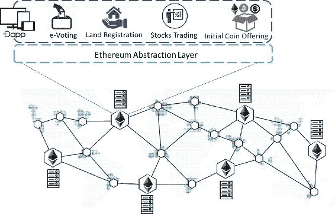图 4-1 一个以太坊平台上的多个去中心化应用与比特币一样，以太坊也是一个具有不同设计哲学的公共区块链平台。最创新的方法是建立一个抽象层，以便来自不同应用程序的交易可以泛化为可以在所有以太坊节点上运行的程序代码。即使在以太坊中，矿工也会生成一种可交易的加密货币以太币，正是因为这种加密货币，公共区块链网络才能自给自足。在以太坊上运行的任何应用程序都必须支付交易费用，最终这些费用会分给运行节点并维持整个网络的矿工。

### 以太坊作为新一代区块链

随着比特币区块链的发展，开发者社区尝试用全新的区块链构建不同的去中心化应用，或者试图修改比特币核心以增加功能集合。不管怎样，这既复杂又耗时。当时可能急需一种不同的设计以及替代协议，这也是以太坊区块链平台出现的原因！目的是在一个以太坊平台上开发许多区块链应用，而不是为每个应用单独建立一个专用区块链。以太坊能够迅速开发出可以相互作用的去中心化应用，确保了足够的安全性。正如前一部分提到的，以太坊通过构建一个抽象的基础层来实现这一点。与比特币不同，以太坊支持图灵完备语言，因此任何人都可以编写智能合约，从编程角度看，它们几乎可以做到任何事情。此外，以太坊的设计是有状态的，并跟踪账户状态，这与比特币的做法大相径庭，在比特币中，所有事物都保留为交易，脚本没有内部持久化内存。借助抽象的基础层，底层复杂性被隐藏在开发者面前，不仅如此，开发者还获得了设计自己的状态转换函数的自由，以便直接传输价值和信息以及交易格式。为了实现这一目标，以太坊的核心创新就是以太坊虚拟机（EVM）。通过 EVM 支持图灵完备语言，使开发者轻松创建区块链应用。就像运行 Java 代码需要 Java 虚拟机（JVM）一样，运行智能合约需要 EVM。现在，只需记住，智能合约是在图灵完备语言中编写的以太坊脚本，在预定义事件发生时自动执行。比特币中的“ScriptSig”和“ScriptPubKey”可以说是智能合约的基本版本。我们在前一章了解到，比特币的指令集非常有限。然而，在以太坊中，几乎可以编写在任何节点上运行的 EVM 上的任何程序。以太坊中的去中心化应用被称为 DApps。作为一个没有中心服务器的全球去中心化计算机系统，DApps 是在没有停机、欺诈或任何形式的监管的情况下运行的应用程序。像比特币这样的点对点电子现金系统很容易在以太坊上作为 DAApp 构建。同样，具有某些内在价值的任何其他资产，如土地、汽车、房屋、选票等，都可以通过各自的 DAapps 以代币形式轻松地在以太坊上交易。与传统的软件开发和部署不同，DApps 不需要托管在后台服务器上。"代码"作为交易的有效负载嵌入其中，然后发送到以太坊网络中的挖矿节点。由于支付了"燃料价格"ETH（以太），这样的交易将被挖矿生态系统考虑。就像在比特币中一样，这些交易会被广播到网络中的其他矿工，使他们可以访问。当达成共识时，交易最终会被放入区块中，并成为区块链的一部分。开发者可以自由编写任何解决方案并在以太坊网络上部署。网络会自动执行那个解决方案，并验证和生成输出。嗯，如果没有成本，网络是不可持续的。每个区块链交易都有一个"燃料价格"，在以太坊网络上编写一些垃圾代码并部署可能会很昂贵！

### 以太坊的设计哲学

以太坊从经过时间考验的比特币核心中借鉴了许多概念，但设计理念不同。以太坊的开发遵循以下原则：

+   简约设计：以太坊区块链被设计得尽可能简单，以便于理解和开发去中心化应用。在共识层面的实现复杂性被降至最低，并在其上层进行管理。因此，开发人员无需担心高级语言编译或参数的序列化/反序列化等问题。

+   开发自由：以太坊平台旨在鼓励在其区块链平台上进行任何形式的去中心化，并不区分或偏爱任何特定的用例。这种自由度之大，以至于开发者可以在智能合约中编写一个无限循环并部署它。显然，只要他们支付交易费（gas 价格），循环就会一直运行，当它耗尽 gas 时，循环最终会终止。

+   没有特性的概念：为了使系统更加通用，以太坊没有为开发者内置特性。相反，以太坊支持图灵完备语言，并让用户按照自己的意愿开发他们自己的特性。从比特币中的“locktime”等基本特性，到完整的用例，一切都可以在以太坊中编码。

## 进入以太坊区块链

我们了解了以太坊区块链背后的目标和其设计哲学。为了能够理解并欣赏这个下一代区块链，并在其上构建去中心化应用，我们将在本节中详细学习以太坊的核心组件。

### 以太坊区块链

以太坊区块链数据结构与比特币的非常相似，不同之处在于区块头包含了更多信息，使其更加健壮，并能正确维护状态。我们将在后面的章节中了解更多关于以太坊状态的内容。在本节中，让我们更多地关注区块链数据结构和头部。在比特币中，区块头中只有一个 Merkle 根，用于一个区块中的所有交易。而在以太坊中，还有两个 Merkle 根，总共有三个 Merkle 根，如下所示：

+   stateRoot: 它帮助维护全局状态。

+   transactionsRoot: 它是用来跟踪和确保一个区块中所有交易的完整性的，与比特币的 Merkle 根类似。

+   receiptsRoot: 它是与区块中的交易相对应的收据树的根哈希。

我们将分别查看区块头信息中各个 Merkle 根的部分。为了更好的理解，请参考图 4-2。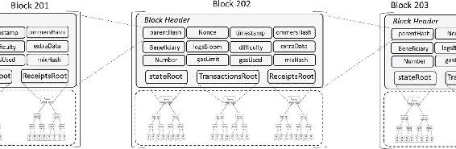图 4-2 以太坊的区块链数据结构每个区块通常包括区块头、交易列表、叔叔列表和可选的 extraData。现在让我们看看这些头部字段，以了解它们的含义和为什么存在于头部。同时请注意，这些字段在不同地方可能会有轻微的变体，或者它们的呈现顺序可能会不同。我们建议你正确理解这些字段，这样当你遇到不同的术语时，就不会感到困扰。

+   parentHash: 父区块头的 Keccak 256 位**哈希**，类似于比特币的风格。

+   timestamp: 当前区块的**Unix 时间戳**。

+   number: 当前区块的**区块号**。

+   Beneficiary: 负责创建当前区块的“author”账户的 160 位**地址**，所有成功挖出区块的手续费都会收集到这个账户。

Section-2: 数据引用

+   transactionsRoot: 本区块中所有交易组成的交易树（trie）的 Keccak 256 位**Merkle 根哈希**。

+   ommersHash: 它也被称为“uncleHash”。这是区块的叔叔段（uncles segment）的哈希，即本区块（已知其父区块的父区块等于当前区块的父区块）的 ommer 列表部分的 Keccak 256 位哈希。

+   extraData: 包含与本区块相关的任意字节数组数据。此数据的大小限制为 32 字节（256 位）。截至当前撰写，此字段可能会变成“extraDataHash”，指向区块内的“extraData”。extraData 可以是原始数据，费用与交易数据相同。

Section-3: 交易执行信息

+   stateRoot: 验证并执行本区块的所有交易后的最终状态的 Keccak 256 位**Merkle 根哈希**。

+   receiptsRoot: 本区块中每笔交易的收据组成的收据树（trie）的 Keccak 256 位**Merkle 根哈希**。

+   logBloom: 每个交易收据的 Bloom 过滤器的累积，即本区块中所有交易的收据 Bloom 的“OR”操作。

+   gasUsed: 本区块中每笔交易的**消耗的气体总量**。

+   gasLimit: 本区块可能使用的**最大气体量**（取决于网络活动的动态值）。

Section-4: 共识子系统信息

+   difficulty: 根据前一个区块的难度和时间戳计算出的本区块的**难度限制**。

+   mixHash: 结合了本区块的 PoW 的“nonce”的 256 位**混合哈希**。

+   nonce：nonce 是一个 64 位的哈希值，与 mixHash 组合在一起，可以用作工作量证明（PoW）的验证。

### 以太坊账户

以太坊账户与比特币账户不同，不是以未花费交易输出（UTXO）的形式存在。在比特币章节中，我们了解到比特币实际上存在于具有所有者（所有者的公钥，20 字节地址）和价值的形式的交易中。如果所有者拥有尝试花费的交易的有效私钥，则所有者可以花费交易。因此，比特币实际上是一个状态转换系统，其中“状态”指的是所有 UTXO 的集合。每次挖掘出一个区块时，都会发生状态改变，因为每个区块都包含一堆交易，每个交易都消耗和产生 UTXO。注意，状态并不是编码在区块内部的。因此，在比特币的设计中，没有账户余额的概念。另一方面，以太坊是有状态的，其基本单位是账户。每个账户都与一个状态相关联，并且通过一个 20 字节的（160 位）地址来识别和引用。以太坊区块链的目的是跟踪状态改变。以太坊账户大致可以分为两种类型：

+   外部拥有账户（EOA）：这些账户也被称为“简单账户”，通常由使用私钥控制这些账户的用户或设备所拥有。EOA 可以通过私钥签名向其他 EOA 或合约账户发送交易。两个 EOA 之间的交易通常是转移任何形式的价值。另一方面，当 EOA 向合约账户发送交易时，目的是激活合约账户内的“代码”。

+   合约账户：这些账户只受其中所包含的代码控制。合约账户内的这种代码被称为“智能合约”。它们通常是在由外部拥有账户（EOA）或其他合约账户发送交易给合约账户时被激活的。尽管合约账户能够通过它们所包含的代码执行复杂的业务逻辑，但它们不能自行发起新的交易，总是依赖于 EOA。它们所能做的只是根据编码在它们“代码”中的逻辑响应其他交易（显然是通过发起交易）。

请查看以下三个场景（图 4-3 至 4-5），以更好地了解 EOA 与合约账户之间的通信。EOA 到 EOA 交易：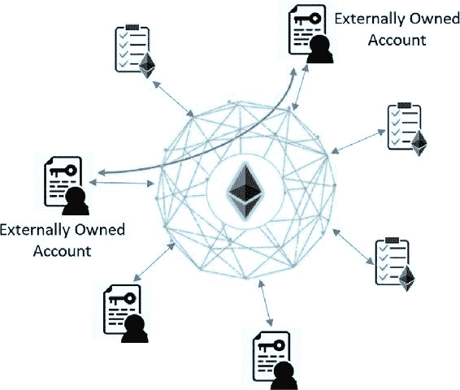图 4-3EOA 到 EOA 交易 EOA 到合约账户交易：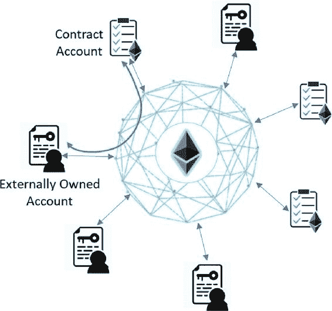图 4-4EOA 到合约账户交易 EOA 到合约账户再到其他合约账户交易：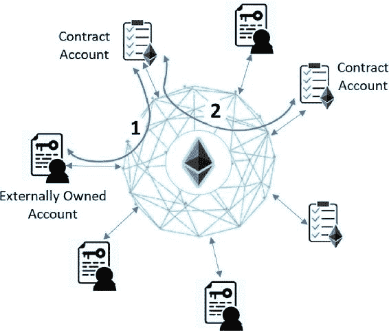图 4-5EOA 到合约账户到合约账户交易为了不让之前的表示混淆，请注意，合约账户是内部的，它们之间的通信也是内部的。与 EOA 账户不同，在 EOA 账户中，EOA 执行的交易会被注入区块链，而合约账户及其之间的交易是内部现象。

#### UTXO 的优势

我们必须明白，比特币的设计初衷是在可能的情况下保持匿名性。当我们把它与以太坊相比较时，UTXO 的以下优势似乎具有很大的意义：

+   更好的隐私：在比特币中，接收交易时建议使用新地址，这有助于加强匿名性。即使使用复杂的统计或机器学习技术，也很难将账户联系起来，尽管并非不可能。

+   潜在的可扩展性更强：关于可扩展性的讨论通常非常主观，取决于上下文、手头上的用例以及许多其他因素。这里的目的只是提到 UTXO 固有的可扩展潜力。并行执行交易非常容易。另外，当某个所有者或其他维护特定币的 Merkle 所有权证明的节点丢失了这些数据时，只有所有者受到影响。相反，当某个账户的 Merkle 树数据丢失时，对该账户的任何操作都将无法进行，即使是向其发送操作。

#### 账户的优势

尽管以太坊在某种程度上是比特币的扩展，但它有着全新的设计，有自己的利弊权衡。让我们来看看与比特币设计相比，以太坊账户的以下优势：

+   显著的空间节省：在比特币中，当多个交易组合在一起形成一个交易时（例如，如果你必须进行 5BTC 交易，但你从未收到至少 5BTC 的交易以供使用，那么你必须捆绑多个交易，使其总金额超过 5BTC），必须对那些个体交易进行多次引用。另外，所有这些交易都必须具有不同的地址，所以与多少个交易，就有多少个地址！然而，在以太坊账户中，对账户的一个引用就足够了。尽管以太坊使用 Merkle Patricia 树（MPT），这比 Merkle 树占用更多的空间，但对于复杂交易，你最终节省了大量的空间。

+   编码简单：除了 UTXO 和不可完成图灵机的脚本外，很难设计复杂的系统。UTXO 要么被花费，要么未花费；不可能有其他状态。这使得编写复杂的业务逻辑变得困难。即使脚本被赋予更多的权力，与仅使用账户相比，它变得更复杂。由于以太坊的目标是超越加密货币并适应不同类型的用例（通过 DApps），基于账户的系统几乎不可避免。

+   轻量级客户端参考：与比特币客户端不同，以太坊客户端应用程序可以通过扫描特定方向的账户状态树轻松快速地访问与账户相关的所有数据。在 UTXO 模型中，通常会有多个引用与任何特定交易相关的多个交易。

#### 账户状态

我们了解到，每个账户都与其关联的状态。我们还查看了以太坊存在的两种账户类型，一种是合约账户，另一种是外部所有账户或 EOA。无论账户类型如何，它们都由块头中的“状态根”Merkle 根跟踪，可能如图 4-6 所示。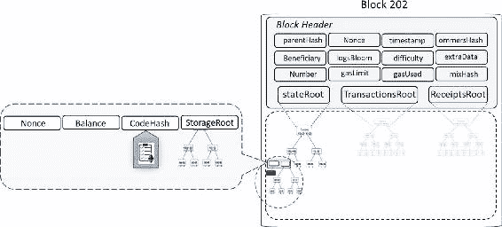图 4-6 缩放账户状态表示

+   账户余额：账户中的“以太”总余额。更精确地说，地址拥有的 Wei 数量（1ETH = 10¹⁸ Wei）

+   代码哈希：这是“代码”的哈希。每个合约账户中都有在 EVM 上执行的“代码”。此代码的哈希存储在此 CodeHash 字段中。对于 EOA 账户， however，没有“代码”，所以 CodeHash 字段包含空字符串的哈希。

+   存储根：它是编码账户存储内容的 Merkle 树的 256 位根哈希。MPT 编码存储内容的哈希。保留此树的根哈希在存储根字段中有助于跟踪账户内容，也有助于确保其完整性。

+   Nonce：这是一个确保每个交易只被处理一次的计数器。对于 EOAs，这个数字代表账户地址的交易数量。对于合约账户，它代表这个账户创建的合约数量。

所以，负责跟踪以太坊区块链状态变化的“state”trie。然而，有点棘手的是，状态并不是直接存储在每一个区块中，而是以每个以太坊节点的 Recursive Length Prefix (RLP) 编码状态数据的形式存储在 MPT 中。因此，为了维护全局状态，以太坊区块链在每个区块中都包括“state roots”，存储该区块创建时哈希树（Merkle root）的根哈希。根据以太坊白皮书，"World State" 是地址（160 位标识符）和账户状态之间的映射。所以，World State 拥有区块链中所有账户的信息，但不是存储在每一个区块中。每个区块只修改状态的一部分。在某种意义上，World State 是在处理每个区块从创世区块开始生成的。某些以太坊节点可以选择通过保留所有历史交易来维护所有历史状态，即状态转换及其输出。这允许客户端随时查询区块链的状态，甚至是历史的，而无需从头重新计算一切。检索状态信息类似于 SQL 中的聚合查询，其中数据随时可用；只需进行聚合。所以，旧状态数据可以很容易地被丢弃（这被称为“修剪”），因为它们在需要时可以重新计算。嗯，状态数据按设计是隐含数据，这意味着状态信息应该只计算。

### Trie 使用

我们学习了三种在区块头中有根的 trie。这些根基本上是指向这三种 trie 的指针。虽然我们在之前的段落中查看了这些 trie 的单行解释，让我们用略有不同的措辞重新访问它们

+   状态 trie：它代表访问区块后的整个状态（全局状态）。

+   交易 trie：它代表了一个区块中的所有交易，按索引键（即，键：0 用于第一个要执行的交易，键：1 用于第二个交易等）。回想一下我们之前覆盖的 MPT 基本原理，并尝试进行关联。

+   收据 trie：它代表每个交易的“收据”。交易的收据是一个如下的 RLP 编码数据结构：

[medstate, gas_used, logbloom, logs] 让我们现在更深入地探讨一下 Receipt trie，因为我们还没有在这个问题上覆盖基础知识。查看 Receipt trie 的 RLP 编码数据结构中的所有字段，并按照以下描述跟进这些字段：

+   medstate: 它是处理交易后的状态 trie 根。成功的交易会更新以太坊状态。

+   gas_used：它是处理交易所使用的总气体量。

+   logs：它是以如下形式的项的列表：

[地址, [主题 1, 主题 2...], 数据]

+   这些列表项是在交易执行期间由 LOG0、LOG1…操作码产生的。 “address”字段是产生日志的合约地址，“topic”字段是四个 32 字节的值，而“data”字段是一个任意大小的字节数组。

+   Logbloom：它由交易中所有日志的地址和主题组成的一个布隆过滤器。这与区块头中的那个是不同的。

### Merkle Patricia Tree

在以太坊中，账户与其各自的状态相对应。所有以太坊账户之间的映射，包括 EOAs 和合约账户及其状态，统称为世界状态。为了存储这种映射数据，以太坊中使用的一种数据结构是 MPT。所以，MPT 是以太坊主要的的数据结构，它也被称为默克尔帕特里夏树。我们在比特币那一章中学过默克尔树，这已经让我们对 MPT 有了半数理解。MPT 实际上是通过对默克尔树和帕特里夏树这两个元素进行组合而得来的。回想一下比特币那一章，默克尔树是一种二进制哈希树，其中叶节点包含数据块的哈希，每个非叶节点包含其子节点的哈希。当实现这样的数据结构时，就可以很容易地检查某个交易是否是一个块的一部分。只需使用整个块中的很少信息，也就是只使用默克尔支线而不是整个树，提供成员资格证明就相当容易。默克尔树促进了在去中心化系统中高效和安全地验证内容。不需要下载每一笔交易和每一个区块，轻客户端只需要下载区块头链，也就是每个区块包含的 80 字节数据，里面只有五样东西：前一个区块头的哈希、时间戳、挖矿难度、满足 PoW 的非 ce 值，以及包含该块所有交易的默克尔树的根哈希。虽然这很有用且有趣，但请注意，除了验证块中交易的成员资格证明之外，你什么也做不了。一个特别的限制是，无法证明关于当前状态的信息（例如，总数字货币持有量、名称注册、金融合同状态）。即使要检查你持有多少比特币，也需要进行大量的查询和验证。另一方面，帕特里夏树是基数树的一种形式。PATRICIA 的名字代表“Practical Algorithm to Retrieve Information Coded In Alphanumeric.”。帕特里夏树促进了高效的插入/删除操作。在帕特里夏树中的键值查找非常高效。键总是编码在路径中。所以，“键”是你从根节点到存储“值”的叶节点的路径。键通常是帮助沿着路径下降的字符串，其中每个字符表示要跟随的子节点，以到达叶节点并找到存储在其中的值。因此，MPT 提供了一种用于存储以太坊中所有（键，值）绑定的经过密码学验证的数据结构。它们是完全确定性的，这意味着具有相同（键，值）绑定的帕特里夏树肯定会一致到最后的字节。具有 O(log(n))复杂性的插入、查找和删除操作相当高效。由于 MPT 中的默克尔部分，节点的哈希用作节点指针，并相应地构建 MPT，其中键等于 SHA3(RLP(值))。虽然默克尔部分提供了一个防篡改和确定性的树结构，但帕特里夏部分提供了有效的信息检索特性。所以，如果你仔细观察，MPT 的根节点变成了整个数据结构的密码学指纹。在以太坊 P2P 网络中，当交易在网络上广播时，收到它们的每个挖矿节点都会将它们组装起来。节点然后形成一个树（也称为字典树）并计算根哈希以包含在区块头中。虽然交易在本地树中存储，但在它们被序列化为列表后发送到其他节点或客户端。接收方必须将它们反序列化以形成交易树，以针对根哈希进行验证。还要注意，在以太坊中，MPT 为了更好地适应以太坊实现进行了少许修改。 instead of binary, hexadecimal is used—X characters from a 16 character “alphabet.” Hence nodes in the tree or trie have 16 child nodes (the 16 character hex alphabet) and a maximum depth of X. Just to let you know, a hex character is referred to as a “nibble” in many places.以 16 个字符的“字母表”中的 X 个字符代替二进制。所以树或字典中的节点有 16 个子节点（16 个字符的十六进制字母表）和 X 的最大深度。需要知道的是，在许多地方，十六进制字符被称为“nibble”。在以太坊中，MPT 的基本思想是对于单一操作，它只会修改最小数量的节点来重新计算根哈希。这样可以将存储和复杂度保持在最小。

### RLP 编码

你们可能已经注意到，在之前的章节中我们提到了 RLP 编码。在本节中，我们将提前告诉你这是关于什么。RLP 代表递归长度前缀。它是以太坊中用于区块、交易和网络协议消息的序列化方法，在通过网络发送数据以及在 Patricia 树中保存状态时用于账户状态数据。通常，当需要存储或传输复杂的数据结构，并在接收端重新构建以进行处理时，对象序列化是一个好的实践。在这种意义上，RLP 与 JSON 和 XML 相似，但 RLP 被认为更加极简主义，空间效率高，实现简单，并保证绝对的字节完美一致性。这就是为什么 RLP 被选为以太坊的主要序列化技术。它的唯一目的是存储嵌套的字节原始数组。它不尝试定义任何特定的数据类型，例如布尔值、浮点数、双精度数、整数等，并且仅设计用于存储嵌套数组的形式结构。RLP 不显式支持键/值映射。因此，建议将此类映射表示为[[k1, v1], [k2, v2], …]，其中 k1, k2…按字典顺序排序（使用字符串的标准排序）。或者，使用更高层次的[Patricia 树](https://github.com/ethereum/wiki/wiki/Patricia-Tree)编码，该编码内嵌有 RLP 编码方案。请记住，RLP 仅用于编码数据的结构，并且完全不知道被编码对象的类型。虽然它有助于减小编码字节的数组大小，但解码端必须知道它试图解码的对象类型。

### 以太坊交易和消息结构

在上一节中，我们研究了区块结构以及区块头中的不同字段。为了使交易能够被矿工或以太坊节点确认，它必须具有一个标准化的结构。一个典型的以太坊交易（例如，我们在这本书后面会看到的通过 sendRawTransaction()传递的交易）包括以下字段：

+   nonce：这是一个整数，只是发送者账户发送的交易数的计数器，即交易序列号。

+   gasPrice：你愿意支付的每单位 gas 的 Wei 数量

+   gasLimit：执行此交易时应使用的最大 gas 量，这也限制了交易执行允许采取的最大计算步骤数

+   To: 接收者的 160 位地址或合约地址。对于用于创建合约的交易（这意味着合约地址尚不存在），它保持为空。

+   Value: 交易发送者要通过交易转移给接收者的总以太币（ Wei 的数量）

+   V, r, s：对应于交易 ECDSA 签名的值；同时也代表这个交易的发送者

+   init: 这实际上不是一个可选字段，只在与用于创建合约的交易一起使用时使用。此字段可以包含一个无限大小的字节数组，用于指定账户初始化程序的 EVM 代码。"init"操作码仅在新合约账户初始化时使用一次，之后就会被丢弃。它在与合约账户关联后返回账户代码的主体。请记住，这种关联是一种永久现象，永远不会改变。

+   Data: 可选字段，可以包含发送给合约或简单账户的消息。默认情况下，它没有特殊功能，但 EVM 有一个操作码——使用该操作码，合约可以访问此数据字段并进行必要的计算并将它们放入存储中。

请注意，上述字段是按照指定顺序提供的，并且除了字段名称外都是 RLP 编码的。所以，以太坊交易实际上是一个带有这些字段的签名数据包。gasPrice 和 gasLimit 字段对于防止服务拒绝攻击很重要。为了防止意外或故意的无限循环或其他计算资源浪费，每个交易都必须设置一个对代码执行可以使用的计算步骤的限制。以太坊交易实际上是“状态转换函数”，因为成功的交易会改变状态。此外，我们已经在之前的“账户状态”一节中查看了这些交易的结果可以被存储。另一方面，以太坊消息类似于交易，但仅由合约账户触发，而不是由 EOA 触发。此外，消息仅限于合约账户之间，因此也被称为“内部交易”。所以，合约具有向其他合约发送消息的能力。通常，当合约在执行其代码时遇到“CALL”或“DELEGATECALL”操作码时，会产生消息。因此，消息在以太坊执行环境中更像是一种函数调用。值得注意的是，消息总是原始的，从不进行序列化或反序列化。消息包含以下字段：

+   Sender: 消息的隐式发送者选项

+   Recipient: 要发送到的接收合约地址

+   Value: 随消息一起传输到合约地址的 Wei 数量

+   Data: 可选字段，但可以包含发送者提供给接收合约的输入数据

+   gasLimit: 限制在消息触发时代码执行可以消耗的最大气体量。它也被称为“startGas。”

我们查看了交易和消息。以太坊交易可以从一个 EOA（普通用户账户）到另一个 EOA，或者从一个 EOA 到合约账户。还存在另一种情况，即由 EOA 发起的交易用于创建合约账户（回想一下我们刚刚讲过的“init”字段）。现在，想想一个交易到底是什么？它无疑是外部世界与以太坊区块链之间的桥梁，但还有更多吗？如果你放大一个交易，你会看到它是由 EOA 签名后发起的指令，然后序列化并提交到区块链。看看图 4-7 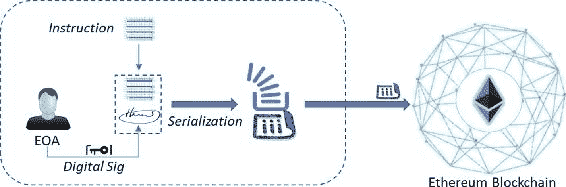图 4-7 交易发起—放大现在交易注入区块链后会发生什么？嗯，如果交易有效，它会在每个以太坊节点上开始执行。在交易执行期间，以太坊设计用来跟踪“子状态”以追踪执行流程。这是因为，如果一个交易由于“燃料耗尽”而没有完成，那么到目前为止的整个执行都需要回滚。此外，交易完成后的立即时间内需要收集执行期间的信息。所以，子状态包含以下内容：

+   自毁设置：在交易完成后将被丢弃的一组账户（如果有的话）。

+   日志系列：以太坊虚拟机代码执行的归档且可索引的“检查点”，用于追踪合约调用。

+   退款余额：交易执行后需要退回到发送者账户的金额。在以太坊中存储费用相当昂贵，因此有一个 SSTORE 指令用作退款计数器。退款计数器从零开始（无退款状态），并在每次交易或合约从存储中删除项目时递增。请注意，这个退款金额与发送者未使用的燃料费退款是不同的，而且是额外的。

在以太坊的早期版本中，无论交易或合约成功执行还是失败，整个燃料都会被消耗。这并不总是有意义的。如果由于某些授权/权限问题或其他问题导致执行停止，执行会停止，但剩余的燃料仍会被消耗。拜占庭更新引入了“revert”代码，类似于异常处理。如果合约需要停止，可以使用“revert”来撤销状态变化，返回失败原因，并将剩余燃料信用回发送者。在成功执行交易或合约后，会发生一个我们将在下一节深入探讨的状态转换。就像我们查看区块链 info 以查看比特币交易的实时状态一样，如果你查看[`etherscan.io`](https://etherscan.io/)获取以太坊信息，你会找到以下内容：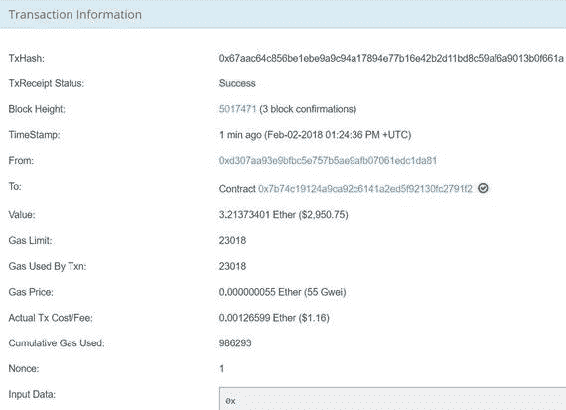

### 以太坊状态交易函数

在上一节中，我们学习了以太坊交易和消息。我们现在知道，每当交易成功时，都会发生状态转换。所以，以太坊的状态转换函数是：APPLY(S,Tx) -> S'     \\ 其中 S 是旧状态，S'是新的状态。看看图 4-8 。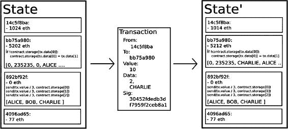图 4-8 以太坊状态转换函数所以，当 Tx 应用于状态 S 以产生变化的状态 S'时，状态转换函数可以定义如下：

+   验证交易是否形成良好。

    +   具有正确的数值。

    +   签名是有效的。

    +   非对齐数与发送者账户中的非对齐数一致。

    如果上述任何一点无效，返回一个错误。

+   计算费用并结账。

    +   计算交易费用为 gasLimit * gasPrice。

    +   从签名中确定发送地址。

    +   从发送者的账户余额中减去费用，并增加发送者的非对齐数。

    如果没有足够的余额来花费，返回一个错误。

+   初始化 GAS = gasLimit，并从中减去一定数量的燃料作为交易费用。

+   将交易价值（可以是任何有价值的东西）从发送者的账户转移到接收者账户。注意这里，交易可能是任何具有内在价值的东西，如土地、车辆、ERC20 代币等，但燃料价格必须是以太币，以便矿工接受交易。如果接收账户尚不存在，则创建它。如果接收账户是一个合约而不是 EOA，那么运行合约的代码，要么运行完成，要么执行耗尽燃料。注意这里，合约代码会在每个节点的 EVM 上作为区块验证过程的一部分执行，以便区块（从而合约执行后输出）成为主区块链的一部分。

+   如果因为发送者钱不够或者代码执行耗尽燃料而转账失败，除了支付费用外，撤销所有状态更改（感谢 MPT 实现），并将费用添加到矿工账户。

+   否则，将剩余的所有燃料费用退还给发送者，并将已经支付给燃料的费用发送给矿工。

### 燃料和交易成本

以太坊上的交易依赖于“燃料”（gas），这是以太坊计算的基本单位。每笔交易，无论是对 EOA（外部账户）还是对合约，都必须有燃料限制（gasLimit）和燃料价格（gasPrice）来计算费用。这笔费用支付给矿工，以补偿他们的资源贡献和工作。显然，矿工可以选择包含交易并收取费用，这与比特币类似。通常，一个计算步骤只需一个燃料单位，但一些计算或存储密集型操作会花费更多。对于每个交易数据字节，大约需要五个燃料单位。举例来说：进行两个数字的加法（使用 EVM opcode ADD）大约需要三个燃料单位；两个数字的乘法（使用 EVM opcode MUL）大约需要五个燃料单位；计算一个哈希（SHA3）大约需要 30 个燃料单位（计算密集型，你看到了）。存储成本也是以类似方式计算，但对于合理的原因相当昂贵。根据设计，交易可以包含无限量的数据。每个非零交易数据的字节需要 68 个燃料单位。在“合约”中存储一个 256 位的词大约需要 20,000 个燃料单位。你可以在以太坊黄皮书[`ethgasstation.info/`](https://ethgasstation.info/)中找到更多操作码及其相应的价格。然后，成本就是将所需的燃料乘以燃料价格。与比特币不同，以太坊的计算成本更为复杂。它考虑了带宽、存储和计算的成本。拥有这样的费用计算机制可以防止以太坊网络遭受攻击者可能只是想注入无限循环进行计算（导致服务拒绝攻击）或通过存储无意义数据来消耗越来越多的空间。交易的总以太币成本实际上取决于交易消耗的燃料量，乘以交易发起者指定的燃料单位价格。另一方面，矿工有一个计算燃料价格的策略，即矿工收取的最少燃料单位价格，使得交易不会被矿工拒绝。那么，你如何计算交易的总成本呢？不是近似值，而是实际成本？交易的总“以太币”成本基于两个因素：燃料使用量（gasUsed）和燃料价格（gasPrice）。总成本 = 燃料使用量 * 燃料价格。燃料使用量是在执行 EVM 操作码时消耗的燃料总量，而燃料价格是用户指定的。如果计算步骤（包括交易、消息以及可能触发的任何子消息）消耗的总燃料量小于或等于燃料限制，那么交易将由矿工处理。然而，如果总燃料超过燃料限制，那么所有更改都将被回滚（尽管这是一个有效的交易），不过矿工仍然可以收取费用。那么，超出部分的燃料会发生什么？在交易执行后，所有未使用的燃料将以以太币的形式退还给发送者。发送者不需要担心超支，因为他们只被收取消耗的燃料费用。这绝对意味着估算时留出充足的燃料上限是非常重要且安全的。建议不要支付过高的燃料价格，而应使用[`ethgasstation.info/`](https://ethgasstation.info/)的平均燃料价格。让我们深入了解在以太坊网络上发起交易时的每一个步骤，以建立对流程的清晰理解：

+   每个交易都必须定义一个“gasLimit”，它愿意花费多少 gas（gasLimit 也称为“startGas”），以及它愿意支付每单位 gas 的费用（gasPrice）。在执行开始时，交易发送者账户中的 Ether 价值为 gasLimit * gasPrice 的 gas 被移除。记住，这并不是交易的总成本（在理想情况下应该比这个数字稍多）。只有在交易之后，其实际成本才确定（gasUsed * gasPrice）从这个（gasLimit * gasPrice）中调整，最初从发送者账户中扣除，并将余额退回到发送者。在交易开始时，这个数额（gasLimit * gasPrice）就被扣除，因为发送者有可能会在交易进行到一半时破产。

+   在交易执行期间的所有操作，包括数据库的读写、消息，以及 E VM 进行的加法、减法、散列等每一步计算，都会消耗一定数量的预定义 gas。

+   一个正常的交易是指在不超出指定的 gasLimit 的情况下成功执行的交易。对于这样的交易，应该还剩下一些 gas，比如说“gas_rem”。在成功执行交易后，交易发送者会收到“gas_rem * gasPrice”的退款，而区块矿工会收到“（gasLimit - gas_rem）* gasPrice”的奖励。

+   如果一个交易在成功完成之前耗尽了 gas，那么所有的执行都会回滚，但交易仍然是有效的。在这种情况下，交易的唯一结果是整个金额“gasLimit * gasPrice”被分配给矿工。

+   在合约账户的情况下，当一个合约向另一个合约发送消息以进行子执行时，它也有选项设置一个 gasLimit。这个选项特别旨在那个消息产生的子执行中，因为有可能被调用合约有一个无限循环。如果子执行耗尽了 gas，那么子执行会被回滚，这可以防止无限循环或故意的 DoS 攻击。无论如何，gas 都会被消耗，并分配给矿工。另外请注意，当一个合约触发了消息时，只有指令会消耗 gas，而消息中的数据不会消耗任何 gas。这是因为从父合约复制的数据不需要再复制，只需通过指针引用即可。

以太坊的第一个版本（Frontier）默认的燃气价格是 0.05e12 WEI（即以太币的最小单位）。在第二个版本（Homestead）中，默认的燃气价格降低到了 0.02e12 WEI。你可能会好奇为什么燃气和以太币不是相互关联的单一单位，这样可以简化很多。然而，这是故意这样设计的，因为燃气的单位很好地与具有自然成本（例如，每项计算的成本）的计算单位对齐，而以太币的价格通常会因市场力量而波动。我们已经知道，参与网络的每一个以太坊节点都会在区块验证协议中运行 EVM。这意味着所有节点都会执行相同的一组交易和合约（虽然冗余但对于共识是必要的）。尽管这种冗余自然会使其变得昂贵，但存在一种激励，不将可以离链完成的计算放在区块链上（博弈论！！！）。通常，任何交易都会收取 21,000 燃气作为“基本费用”，以覆盖从签名计算发送者地址的椭圆曲线操作的成本，以及存储交易的磁盘空间。有方法可以估算交易和合约所需的燃气。例如：“estimateGas”是一个用于估算给定函数燃气需求的 Web3 函数。“geth”客户端的燃气价格预言机是一个助手函数，而“web3.eth.getGasPrice”是一个 Web3 原生函数，用于查找近似的燃气价格。以下是一个可以在“Truffle”中使用的示例代码：

## Ethereum 智能合约

与比特币不同，比特币只是加密货币，而以太坊由于智能合约而变得更加丰富。在之前的章节中，我们在学习合约账户时对智能合约可能是什么有了一个初步的了解。在接下来的章节中，我们将进入智能合约的开发方面，但在这个部分我们将详细探讨它们究竟是什么。首先，让我们来了解一下为什么这样命名？请注意，智能合约中并没有“智能”的东西。当您将智能逻辑编码到其中时，它才是智能的，这也是以太坊的魅力所在，它使您能够这样做。让我们简要总结一下到目前为止关于以太坊智能合约的学习：

+   智能合约位于以太坊区块链内。

+   它们有自己的账户，因此有地址和余额。

+   它们能够发送消息并接收交易。

+   它们在接收到交易时激活，也可以被禁用。

+   像其他交易一样，对它们也适用执行费和存储费。

Ethereum 中的所有代码，包括智能合约，都被编译成一种低级的基于栈的字节码语言，称为 EVM 代码，在 EVM 上运行。用于编写智能合约的流行高级语言有 Solidity、Serpent 和 LLL，各自的编译器将这些高级代码转换为 EVM 字节码。我们来看一下任何外部代理（如 EOA）如何将合约添加到区块链中。由于 Ethereum 中的计算和存储非常昂贵，因此建议逻辑应该尽可能简单和优化地编写。当智能合约部署到以太坊区块链网络时，任何人都能够调用智能合约的函数。这些函数通常编有安全特性，以防止未授权访问；尽管如此，仍然可以尝试，但不会成功。如果你试图想象一个智能合约在以太坊区块链中的一个区块内，它可能如图 4-9 所示。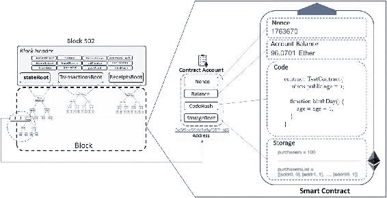图 4-9 与区块相关的以太坊智能合约

### 合约创建

回想一下，我们学过关于智能合约创建交易的内容，这种交易的唯一目的就是创建一个合约。与其它类型的交易相比，它是一种略有不同的交易。所以，在合约创建交易被触发以创建一个合约账户之前，它必须首先初始化所有类型的账户都具有的四个属性：

+   “nonce”最初应设置为零。

+   “Account Balance”应设置为发送者转移的以太币（金额），发送者的账户必须扣除相同金额。

+   “StorageRoot”应该是空的。

+   合约的“codeHash”应设置为空字符串的 Keccak 256 位哈希。

在初始化账户后，可以使用与执行交易一起发送的 init code 创建账户，执行真正的工作。init code 中可能定义了一组操作，其执行可以影响不属于执行状态的几个事件，例如：

+   账户的“存储”可以被更改。

+   可以创建更多的账户。

+   可以触发进一步的消息调用。

## 以太坊虚拟机和代码执行

以太坊是一个可编程区块链，它允许用户通过图灵完备语言创建他们自己的任意复杂度的操作。EVM 是以太坊的执行引擎，为智能合约提供运行时环境。这是以太坊相对于其他区块链系统的主要创新之处。基于 EVM，智能合约技术预计将达到下一个创新水平，游戏即将开始。EVM 在交易执行、改变以太坊状态和实现共识方面也发挥着关键作用。EVM 的设计目标如下：

+   简化：想法是以尽可能简单的低级构造来设计 EVM。这就是为什么将低级操作码的数量保持在最小值，数据类型也是如此，尽管理论上可以使用这些构造方便地编写复杂逻辑。总共有 160 条指令，其中 65 条是逻辑上不同的

+   绝对确定性：确保具有相同输入的指令执行产生相同输出（确定性！）有助于不带任何歧义地维护 EVM 的完整性。确定性以及“计算步骤”的概念有助于估算气体的消耗。

+   空间优化：在去中心化系统中，节省空间是最重要的问题。这就是为什么将 EVM 汇编尽可能紧凑。

+   针对原生操作进行优化：EVM 对某些原生操作进行了优化，例如用于密码学的特定类型的算术操作（模运算），读取区块或交易数据，与“状态”互动等。另一个这样的例子是：256 位（32 字节）的单词长度用于存储密码学哈希值，其中 EVM 在相同的 256 位整数上操作。

+   简单的安全性：在某种程度上，燃料价格有助于确保 EVM 不可滥用。如果没有成本，攻击者可以以每种可能的方式不断攻击系统。尽管在 EVM 上的几乎每个操作都需要一些燃料成本，但应该很容易为 EVM 制定好的燃料成本模型。

我们了解到，以太坊网络中的每个参与节点都在本地运行 EVM，执行所有交易和智能合约，并在本地保存最终状态。EVM 将代码（智能合约）和数据写入区块链，并执行交易代码和用图灵完备语言编写的智能合约代码的指令（操作码）。也就是说，EVM 为以太坊智能合约提供了一个运行时环境（RTE），并确保了代码的安全执行。显然，当通过它们各自的数字签名验证代码或交易时，它们将在 EVM 上执行。因此，只有在 EVM 上成功执行指令后，以太坊状态才能更改。除非将 EVM 与其他网络连接以参与 P2P 网络，否则它可能会与主网络隔离。在一个隔离的沙盒环境中，EVM 可用于测试智能合约。它有助于构建更好的、健壮的、生产准备就绪的智能合约。为了更好地理解智能合约如何利用 EVM 工作，我们应该了解如何在任何 EVM 语言（如 Solidity、Serpent 和未来可能出现的一些语言）中组织、存储和操作数据。您可能希望将 EVM 视为一种数据库引擎。尽管我们不会深入探讨 Solidity 编程的基本原理，但我们将在此部分中了解它如何与 EVM 交互。请参阅图 4-11。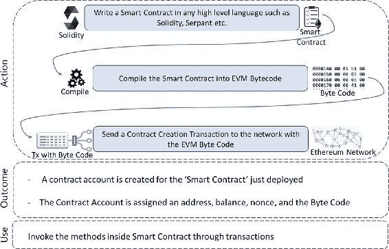图 4-11 智能合约的部署和使用现在让我们了解 EVM 中的内存管理。请查看 EVM 遵循以下三种策略：

+   存储（持久性）

    +   键值存储映射（即 256 位到 256 位单词映射）。这意味着键和值都是 256 位（即 32 字节）。

    +   从合约内部，无法枚举存储。

    +   在任意时刻，合同的状态可以由称为“状态变量”的合同级变量确定，这些变量始终在“存储”中，且不能在运行时更新。这意味着存储的结构仅在合同创建时设置一次，并且不能更改。然而，它们的内容可以通过“sendTransaction”调用进行更改。

    +   存储的读/更新是一项昂贵的操作。

    +   合约无法读取、写入或更新不属于它们的任何其他存储。

    +   SSTORE/SLOAD 是常用的指令。示例：SSTORE 指令从栈中弹出两个项目，将第一个项目视为索引，并将第二个项目插入到合同的存储中该索引位置。

+   内存（易失性）

    +   它类似于通用计算机系统中任何代码或应用程序执行的 RAM 要求，用于存储临时值。

    +   合约在执行过程中可以使用任意数量的内存，通过付费来实现，执行完成后，该内存空间会被清理。执行期间的输出可以推送到可以用于未来执行的持久存储中。

    +   内存实际上是一个连续的字节数组，与存储不同。它以 256 位（32 字节）的块分配。

    +   以没有空格开始，以 32 字节块为单位占用空间。

    +   没有“memory”关键字，智能合约语言（如 Solidity）预期要在存储中声明变量以持久化。

    +   在智能合约层面不能使用内存；它只能在方法中使用。

    +   函数参数几乎总是存储在内存中。

    +   MSTORE/MLOAD 是频繁使用的指令。

+   栈

    +   EVM 是基于栈的，因此遵循后进先出（Last-in, First-Out）的原则，栈用于执行计算。

    +   栈条目也是 256 位单词，用于模仿 256 位的伪寄存器。它们用于持有“值”类型的局部变量，并将参数传递给指令或函数、内存操作和其他算法操作。

    +   允许最多有 1024 个元素，并且几乎免费使用。

    +   栈操作的大部分限制在栈顶。执行方式与比特币脚本的执行方式相当相似。

当 EVM 正在运行，并且通过交易注入字节码以执行时，其完整的计算状态可以由以下元组定义：[区块状态，交易，消息，代码，内存，栈，pc，gas]。你现在必须能够识别出所有这些字段。它们是我们讨论过的三种内存（区块状态字段代表全局状态，用于存储）。PC 字段类似于要执行的栈中指令的指针。在以太坊中，应用程序二进制接口（ABI）是一种抽象，不是[核心以太坊协议](https://github.com/ethereum/yellowpaper)的一部分，但用作访问智能合约中的字节码的标准做法。虽然任何人都可以为他们的合约定义自己的 ABI 并遵守它以获得所需的输出，但使用 Solidity 更容易。ABI 的目的如下：

+   如何在智能合约内部调用哪些函数以及如何调用

+   应该以二进制格式传递给智能合约函数作为输入的信息

+   在调用该函数后，期望的函数执行输出二进制格式

有了 ABI 规范，两种用不同语言编写的程序之间交互起来很容易（尽管可能不必要）。

## 以太坊生态系统

我们学习了理解以太坊如何真正工作的核心组件。以太坊有一些固有的限制，如下所示：

+   EVM 很慢；不建议用于大型计算。

+   区块链上的计算和存储是昂贵的；建议使用离链计算，并使用 IPFS/Swarm 进行存储。

+   可扩展性是一个问题；有多种技术可以解决它，但它们取决于你正在处理的商业案例。

+   私有区块链更有可能蓬勃发展。

现在让我们来看看以太坊技术堆栈，以高级别了解以太坊生态系统。

### Swarm

它不仅是分布式存储平台，以 P2P 方式存储静态文件，而且还是分发服务。Swarm 确保了以太坊区块链数据、DApp 代码等的充分去中心化和冗余存储。与 WWW 不同，Swarm 上的上传不是集中到一个 web 服务器。它旨在实现零停机时间，并且具有 DDoS 抵抗和容错性。

### Whisper

它是一个允许 DApps 相互通信的通信协议。它提供了分布式但私有的消息功能。它支持单播、多播和广播消息。

### DApp

DApp 通常有两个组件，前端和后端组件。后端代码在实际的区块链上运行，由智能合约编写。前端代码和用户界面可以用任何语言编写，比如 HTML、CSS 和 JavaScript，只要它能调用其后端。另外，前端可以托管在去中心化存储上，如 SWARM 或 IPFS，而不是中心化的 web 服务器。用户界面组件将缓存在某种去中心化的 BitTorrent 类似云上，并根据需要由 ÐApp 浏览器拉取。就像任何应用商店一样，用户可以在浏览器中浏览分布式 DApp 目录。最终用户可以在他们的浏览器中安装任何感兴趣的 DApp。

### 开发组件

有许多开发组件用于在以太坊上开发去中心化应用程序并与之交互。以下是一些流行组件，但还有更多供您探索。我们只需了解它们是什么，并在接下来的章节中深入探讨这些主题。

#### Web3.js

这是开发 DApp 的重要元素。

#### Truffle

Truffle 提供了创建、编译、部署和测试区块链应用程序的构建块。

#### Mist 钱包

我们在之前的章节中了解到，与区块链应用程序交互需要一个钱包，这对于以太坊也适用。为了存储、接收和发送以太币，用户需要一个钱包。Mist 钱包是一个基于 UI 的解决方案，可以用来连接以太坊区块链。使用 Mist 钱包，可以创建账户、设计和部署合约、跨账户传输以太币，以及查看交易详情。内部依赖“geth”客户端（即 GoEthereum 客户端）来无缝执行所有操作。

## 摘要

在本章中，我们涵盖了以太坊区块链的核心组件，并了解了设计考量。我们能够区分以太坊设计与比特币区块链的不同，并理解了以太坊区块链如何在一个平台上促进不同用例的开发。我们深入探讨了智能合约以及以太坊虚拟机（EVM）如何以去中心化方式执行它。我们将在第五章中更深入地探讨区块链的一般开发方面，然后在第六章中建立对以太坊开发的坚实基础。

## 参考文献

以太坊白皮书[`github.com/ethereum/wiki/wiki/White-Paper`](https://github.com/ethereum/wiki/wiki/White-Paper)。以太坊黄皮书[`ethereum.github.io/yellowpaper/paper.pdf`](https://ethereum.github.io/yellowpaper/paper.pdf)。以太坊是如何工作的[`medium.com/@preethikasireddy/how-does-ethereum-work-anyway-22d1df506369`](https://medium.com/@preethikasireddy/how-does-ethereum-work-anyway-22d1df506369)。Patricia 树[`dl.acm.org/citation.cfm?id=321481`](https://dl.acm.org/citation.cfm?id=321481)。以太坊中的 Merkle 证明[`blog.ethereum.org/2015/11/15/merkling-in-ethereum/`](https://blog.ethereum.org/2015/11/15/merkling-in-ethereum/)。以太坊中的燃料和交易[`ethdocs.org/en/latest/contracts-and-transactions/account-types-gas-and-transactions.html`](http://ethdocs.org/en/latest/contracts-and-transactions/account-types-gas-and-transactions.html)。以太坊事件和日志的技术简介[`media.consensys.net/technical-introduction-to-events-and-logs-in-ethereum-a074d65dd61e`](https://media.consensys.net/technical-introduction-to-events-and-logs-in-ethereum-a074d65dd61e)。以太坊内部[`github.com/comaeio/porosity/wiki/Ethereum-Internals`](https://github.com/comaeio/porosity/wiki/Ethereum-Internals)。
