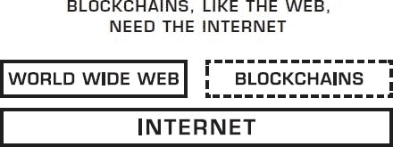
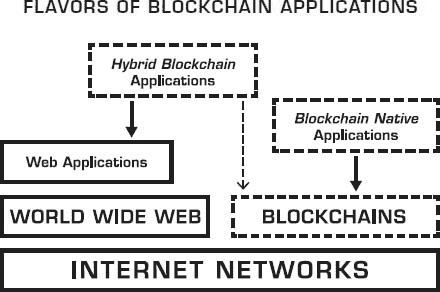
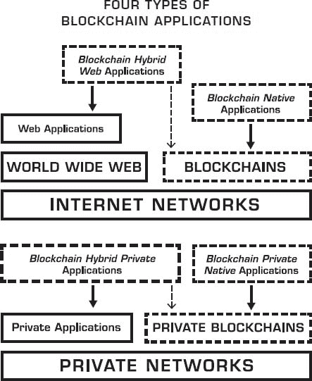
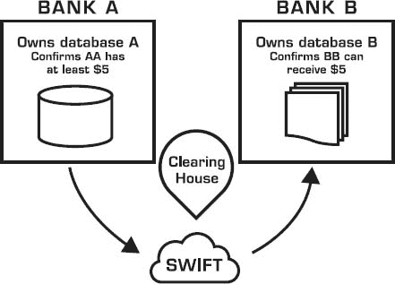
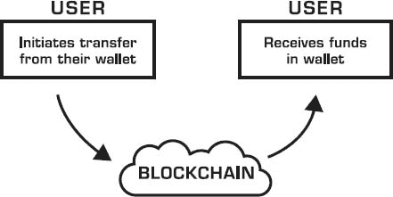
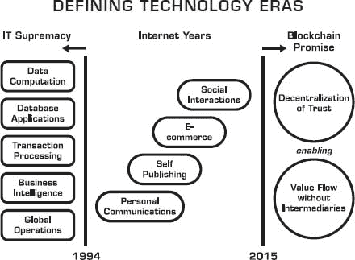

# 1

区块链是什么？

> “如果你在没有解释的情况下无法理解它，那么在解释的情况下你也无法理解它。”
> 
> ——村上春树

密切关注。这一章可能是书中最重要的章节，因为它试图提供区块链的基础解释。这是本书承诺为您提供区块链整体视角的第一阶段。

理解区块链是棘手的。在欣赏他们的潜力之前，你需要理解他们的信息。除了他们的技术能力外，区块链还带有哲学、文化和意识形态的基础，也必须被理解。

除非你是软件开发者，否则区块链不是你只需打开并使用的产品。区块链将使其他产品得以实现，而你可能不知道它们背后有区块链，正如你不知道当前在 Web 上访问内容的复杂性一样。

一旦你开始自己想象区块链的可能性，同时不再思考尝试理解它们，你将进入利用它们的成熟阶段的另一阶段。

我相信理解区块链背后的知识转移要比了解它们将如何应用容易。这就像学习驾驶汽车一样。我可以教你如何驾驶一辆车，但无法预测你会把它开到哪里。只有你自己知道你的具体业务或情况，也只有你自己能弄清楚区块链如何应用，在你了解它们能做什么之后。当然，我们首先会一起进行道路测试和赛道驾驶，以给你一些启示。

## 访问中本聪的论文

当蒂姆·伯纳斯-李在 1990 年创建了第一个世界 Wide Web 网页时，他写道：“当我们链接网络上的信息时，我们使自己能够发现事实、创造想法、买卖东西，以及以一种无法想象在模拟时代的方式建立新的关系。”

在那简短的声明中，伯纳斯-李一次性预测了搜索、出版、电子商务、电子邮件和社交媒体，所有这一切都由刚刚创造了某件壮丽事物的人所预见。中本聪在 2008 年的论文《比特币：一个点对点的电子现金系统》中，¹找到了这种先见之明的比特币等价物，可以说是现代基于区块链的加密货币创新的根源。

论文摘要描述了比特币的基础，并解释了其基本原则：

+   纯粹的*点对点*电子现金版本将允许在线支付直接从一方发送到另一方，而不需要通过金融机构。

+   不需要*可信第三方*来防止双重支付。

+   我们提出了一种*解决方案*，用于通过*点对点网络*解决双重支付问题。

+   网络通过将交易散列到一个基于散列的工作量证明的持续链中来**时间戳**交易，形成*一个不能在没有重新执行工作量证明的情况下更改的记录*。

+   最长的链不仅作为证明见证的事件序列的证据，也是来自最大 CPU 能力的证明。只要*大多数 CPU 能力由不合作攻击网络的节点控制*，它们就会生成最长的链并超越攻击者。

+   网络本身需要的结构最小。消息是以最佳努力的方式广播的，并且*节点可以随时离开和重新加入网络，接受最长的工作量证明链作为他们在离开期间发生的事情的证明*。

如果你是一个非技术读者，你专注于斜体部分，你将开始掌握要点。请重新阅读上面的几点，直到你内化了 Nakamoto 的序列逻辑！认真地说。你需要相信并接受，通过让网络执行信任职责，而没有中央干预或指导，验证点对点交易是完全可能的。

用 Nakamoto 的论文的表述来说，我们应该留下这些观点：

+   点对点的电子交易和互动

+   没有金融机构

+   加密证明，而不是中央信任

+   将信任放在网络中，而不是放在中央机构中

结果显示，“区块链”就是 behind Bitcoin 的那项技术发明，也是使其成为可能的原因。带着 Satoshi 的摘要 still in your mind，让我们用三个不同但又互补的区块链定义来深入了解：一个技术定义，一个商业定义，还有一个法律定义。

从技术角度看，区块链是一个维护分布式账本的后台数据库，该账本可以公开检查。

从商业角度来看，区块链是一个无需中介协助，在 peers 之间移动交易、价值、资产的交换网络。

从法律角度来说，区块链验证交易，取代了之前可信的实体。

| **TECHNICAL** | 公开维护分布式账本的后台数据库。 |
| --- | --- |
| **BUSINESS** | 用于在 peers 之间移动价值的交换网络。 |
| **LEGAL** | 不需要中介协助的交易验证机制。 |

Blockchain Capabilities = Technical + Business + Legal。

## 网络，再次来临

过去并不是准确预测未来的指南针，但了解我们来自哪里可以帮助我们获得启迪性的视角和更好的背景，了解我们正在走向何方。区块链仅仅是互联网技术历史的延续，以 Web 为代表，它继续着其渗透我们世界、商业、社会和政府的旅程，并且这些旅程的几个周期和阶段往往只能在后视镜中看得见。

虽然互联网最初在 1983 年推出，但正是万维网给我们带来了其划时代的进化时刻，因为它使任何能够访问互联网的全球任何人都能公开、即时地获取信息和基于信息的服务。

就像全球数十亿人目前连接到 Web 一样，数百万，然后是数十亿人将会连接到区块链。如果区块链使用的传播速度超过历史上 Web 用户的增长，我们不应该感到惊讶。

到 2016 年年中，全球 74 亿人口中有 47%的人有互联网连接。1995 年，这个数字还不到 1%。直到 2005 年，全球才有 1 亿 Web 用户。相比之下，手机的使用增长更快，2002 年超过了固定电话，2013 年超过了全球人口。至于网站，2016 年，其总数约为 1 亿。很可能，区块链将发展成为几种不同的形式，并且像在 Wordpress 或 Squarespace 上启动网站一样易于配置。

区块链的使用增长在 Web 的发展轨迹上具有优势，因为它的起点沿着四个方面得到了放大：Web 用户、手机用户、网站所有者，以及任何从连接中受益并成为“智能设备”的“事物”。这意味着区块链的使用将依靠这四个类别，而不是单纯地寻求新用户。

## 一个还是几个区块链？

对于区块链，没有先前的范例。它不是 TCP/IP，即互联网网络协议的新版本。它也不是另一个整个互联网。2015 年，一些支持单一比特币区块链的人哀叹存在多个区块链。人们通过一种一维视角（比特币最大化主义²）来看待区块链，这种视角与看待互联网相似。是的，只有一个互联网是好的，因为它可能永远不会像现在这样传播。但区块链是一个不同的结构。它更像是建立在互联网之上的一种新协议，正如万维网通过自己的技术标准建立在互联网之上。

区块链部分是数据库，部分是开发平台，部分是网络使能器，因此我们需要很多这样的实例及其变体。作为互联网之上的一个覆盖层，区块链可以采取多种实施形式。区块链可以被视为一个信任层，一个交换媒介，一个安全管道，一套去中心化能力，甚至更多。

话说回来，Web 的早期年份和今天区块链的发展在技术如何被采用方面有很多相似之处。

让我们不要忘记，大多数公司完全理解 Web 的潜力大约需要三年时间（1994-1997 年大致），在其商业化初期之后，Web 在 1983 年推出后七年才发挥作用。毫无疑问，区块链将在 2015-2018 年期间保持半神秘、半复杂的现象，正如比特币在 2009-2012 年三年沉寂之后才更加为公众所知。

## 区块链应用简介

没有互联网，Web 就无法存在。同样，没有互联网，区块链也无法存在。Web 使互联网更有用，因为人们更感兴趣的是使用信息，而不是弄清楚如何将计算机连接在一起。区块链应用需要互联网，但它们可以绕过 Web，给我们另一个更加去中心化、或许更加公平的版本。这是区块链技术最大的承诺之一。

构建区块链应用的方式不止一种。你可以本地区域链上构建它们，或者将它们与现有的 Web 应用程序混合，我们将这种风格称为“混合区块链应用”。

由于互联网包括公共版本和几个私有版本，区块链也将遵循这一路径。因此，我们将有公共和私有区块链。一些将本地区域链上构建，而其他可能是混合实现，作为现有 Web 或私有应用程序的一部分。

## 区块链的叙事是强大的

一个技术或趋势有强大影响力的标志是它是否有强的叙事性。故事和叙事的区别在哪里？故事通常是连贯且为人所知的，而叙事为与该趋势互动的每个人创造更多个别的故事。

约翰·哈格尔很好地解释了这种区别：³

> *故事是自包含的——它们有开始、中间和结束。而叙事则是开放式的——结果未解决，尚未确定。第二，故事是关于我，讲故事的人，或者其他人；它们不是关于你的。相比之下，叙事的解决取决于你的选择和行动——你将决定结果。*

互联网有一个强大的叙事。如果你问不同的人他们如何使用互联网，或者它对他们的意义是什么，你无疑会听到不同的答案，因为每个人都会根据自己的互联网使用方式的适应性将其变为自己的。

区块链有一个强大的叙事，因为它激发了我们的想象力。

根据哈格尔的说法，叙事提供以下具体好处：

1.  **差异化** – 它能帮助你从人群中脱颖而出

1.  **利用** – 它能调动公司外部的力量

1.  **分布式创新** —— 它激发意料之外的创新方向

1.  **吸引力** —— 它通过你设定的机会和挑战吸引人们

1.  **人际关系** —— 它激发了他人的持续关系，使他们陷入了你的叙事的魔咒

约翰·哈格尔进一步阐述说，“这涉及到与他人的联系和调动，超越边界的...”用“区块链”替换省略号，你将得到一个强大基础，为强大且持久的区块链叙事奠定基础。

## 元技术

区块链是一种元技术，因为它影响其他技术，而且它本身由几种技术组成。它是构建在互联网之上的计算机和网络的叠加。当你检查区块链的建筑层时，你会发现它由几部分组成：一个数据库、一个软件应用程序、连接在一起的计算机、访问它的客户端、一个在其上进行开发的软件环境、监控它的工具，以及其他部分（将在第六章中介绍）。

[区块链](https://wiki.example.org/blockchain)不仅仅是一种新的技术。它是一种挑战现有软件技术的类型，因为它有潜力取代或补充现有的做法。本质上，这是一种改变其他技术的科技。

上次我们见证这样的催化技术可以追溯到网络的出现。网络也改变了我们编写软件应用程序的方式，并带来了新的软件技术，挑战并取代了之前的技术。1993 年，超文本标记语言（HTML）改变了出版。1995 年，Java 这种网络编程语言改变了编程。几年前，传输控制协议/互联网协议（TCP/IP）这种计算机网络协议已经开始通过使网络完全互操作，全球范围内改变网络。

从软件开发的角度来看，区块链声称最大的范式转变之一是挑战传统数据库的功能和垄断，正如我们所知。因此，我们需要深入理解区块链如何使我们重新思考现有的数据库构建。

区块链正在改变我们编写应用程序的方式，通过一种新的脚本语言形式，可以编程业务逻辑作为在区块链上强制执行的智能合约。

## 软件、博弈论和密码学

理解区块链的另一种方式是将其视为 1)博弈论、2)密码学科学和 3)软件工程等已知领域的三合一。单独来看，这些领域已经存在很长时间了，但首次，它们在区块链技术中和谐地交汇并变形。

博弈论是“研究智能理性决策者之间冲突与合作数学模型的学科”。⁴ 而这与区块链有关，因为比特币区块链最初由中本聪构思，必须解决一个被称为拜占庭将军问题的知名博弈论难题。⁵ 解决这个问题的方法是减轻少数不道德的将军成为叛徒并谎称协调攻击以确保胜利的企图。这通过执行一个验证编写这些信息所付出工作的过程来实现，并通过限制查看未篡改信息的时间要求来确保其有效性。实现“拜占庭容错”很重要，因为它从假设你不能信任任何人开始，然后通过在旅程中信任网络来提供保证交易安全到达的保证，同时抵御潜在的攻击。

这种达到交易最终性安全的新方法有着根本性的含义，因为它质疑了当前可信中间人的存在和作用，这些中间人持有验证交易的 traditional authority。这使我们思考存在主义问题：如果我们能够在交易从一位同伴传到另一位同伴的过程中，通过信任内置于网络中的信任来达到同样的可信度，那么我们为什么需要一个中心权威来确保中心信任呢？

密码学在区块链网络中多处被用来提供安全性，其基础是三个基本概念：散列、密钥和数字签名。所谓“散列”是一种独特的指纹，它帮助验证某些信息是否被篡改，而无需实际查看这些信息。密钥至少由两个组合而成：一个公钥和一个私钥。打个比喻，想象一扇需要两把钥匙才能打开的门。在这种情况下，公钥由发送者用来加密只能由私钥所有者解密的信息。你绝不能透露你的私钥。数字签名是一种数学计算，用来证明（数字）信息或文档的真实性。

密码学基于公/私钥的霸权，这是区块链的阴阳两面：公开可见性，但私人审查。这有点像你的家庭住址。你可以公开你的家庭住址，但这并不会透露出你家庭内部的样子。你需要你的私钥来进入你的私人住所，既然你已经宣称那个地址属于你，就没有其他人可以声称一个类似的地址是他们自己的。

虽然密码学概念已经存在一段时间，但软件工程师们正在大快朵颐地将它与游戏理论创新相结合，以产生区块链的整体结构，其中看似的不确定性通过压倒性的数学确定性来减轻。

## 数据库与账本

我们有了可以不通过第三方进行验证的交易。现在，你可能在想——那数据库呢？我们一直认为数据库是可信的，可以持有资产的仓库。

在区块链的情况下，账本是一个不可反驳的记录，它持有通过区块链网络验证的交易注册。

让我们说明这种情况的影响：数据库与（区块链）账本。

当你开立银行账户时，你实际上已经将权威委托给了银行。“账户”上的事。实际上，他们为你提供了这种“访问”和活动可见性的幻觉。每次你想转账、付账或存款，银行都在明确地为你提供访问权限，因为你让他们在处理你的事务上具有隐含的信任。但这种“访问”也是一种幻觉。它实际上是对一个数据库记录的访问，该记录显示你有这么多的钱。他们通过让你认为你“拥有”那些钱来迷惑你。但他们拥有更高的权威，因为他们拥有指向那个条目、显示你有钱的数据库，而你假设你确实拥有那些钱。

银行业务复杂，但我试图简化上述插图，以强调一个事实：特定的银行拥有控制层级，用于授予或拒绝他们对持有的货币的访问权限。对于金融机构可能持有的任何数字资产（股票、债券、证券），相同的概念也适用，这是为了你的利益。

进入区块链时代。

在其最基本的形式中，上述复杂性可以不存在。用户可以通过特殊钱包向另一个人发送资金，而区块链网络负责认证、验证和转账，通常在 10 分钟内完成，无论是否有加密货币交易所参与。

这是区块链最简单的魔力。这就是我建议任何打算参与实施区块链的人，通过下载众多可用版本之一，或者在你居住的地方注册一个本地比特币交易所，用自己的钱包体验这种交易的原因。一旦你这样做，你就会意识到“没有中介”的真正含义，你将开始质疑我们为什么还需要当前的中介。

## 回顾过去，以便我们能展望未来

那么，区块链在整个技术演变各个时代的背景下如何定位呢？

2003 年，尼古拉斯·G·卡尔在《哈佛商业评论》上发表了一篇具有开创性的文章《IT 无关紧要》，震撼了信息技术企业界，并质疑了它们的战略相关性。他写道：

> *使资源真正具有战略意义—赋予它成为持续竞争优势基础的能力—不是普遍性而是稀缺性。你只有通过拥有或做到竞争对手无法做到的事情，才能超越对手。到现在，IT 的核心功能—数据存储、数据处理和数据传输—已经对所有人可用且负担得起。*

尽管自那篇文章之后，卡尔的文章又引发了两年激烈的争论，但墙上的字已经显露，与网络作为一个强大的新计算平台的兴起相吻合。网络让 CIO 们措手不及，至少让大多数 CIO 们混乱了三年，尤其是其中许多人更专注于 2000 年日期合规问题。实际上，网络的到来标志着 IT 的衰落已经开始，因为网络为那些早期掌握它的人提供了某些竞争优势。

如图所示，IT 统治的结束被互联网年代所取代，而互联网年代又将迎来区块链的承诺。

从另一个角度看，描绘网络发展的各个阶段，可以看出技术的连续性，即区块链是另一个新阶段，专注于点对点、基于信任的资产交易。让我们回顾一下自 1994 年以来互联网带给我们的关键小革命：个人通信、自我出版、电子商务和社交网络。回顾起来，这四个阶段每个都是由它们颠覆的功能定义的：邮局、印刷媒体、供应链/实体店和现实世界。

| │ **阶段** | **目标** | **颠覆** | **结果** |
| --- | --- | --- | --- |
| │ --- | --- | --- | --- |
| │ **通信** | 与世界上任何人都联系起来 | 邮局 | 个人通信 |
| │ **出版** | 传播思想 | 印刷媒体 | 自我出版 |
| │ **商业** | 贸易 | 供应链和实体店 | 电子商务 |
| │ **社交互动** | 与朋友连接 | 现实世界 | 社交网络 |
| │ **资产交易** | 管理你所拥有的 | 现有的保管人 | 基于信任的服务 |

这种情况的讽刺在于，基于区块链的应用程序可以取代任何网络应用。尽管我们认为网络给我们带来了信息发布、通信和电子商务，但那些功能将受到基于点对点协议且由区块链技术支撑的新版本的威胁。

## 解开区块链的神秘面纱

让我们继续揭示区块链的许多层面！如果有一个主要观点我将不断强调，那就是强调区块链不是一个项目、事物、趋势或特征。它是一起发生的许多部分，其中一些相互协作，其他则独立运作。

大约在 1995 年互联网开始商业化时，我们经常将其描述为多目的的现象。在我之前的一本书《开启数字市场》中，在 1997 年，我描述互联网具有“五个多重身份”，并补充说“每一个都必须通过发展不同的策略来利用。” 网络同时是一个网络、一个开发平台、一个交易平台、一个媒介和一个市场。（我们当时没有看到社区/社交网络方面，因为它是后来出现的。）

区块链将这种多功能性进一步发挥。它同时展现出以下十个属性：

1.  加密货币

1.  计算基础设施

1.  交易平台

1.  去中心化数据库

1.  分布式会计账本

1.  开发平台

1.  开源软件

1.  金融服务市场

1.  点对点网络

1.  信任服务层

让我们逐一深入它们，作为建立对区块链基础理解的第一步。

### *1. 数字货币*

数字货币功能可能是区块链中最“显眼”的元素，尤其是如果该区块链是公开的，例如比特币（BTC）或以太坊（ETH）。加密货币通常是对区块链可行的操作和安全的经济代理。有时它由一个代币表示，这是另一种与基础加密货币相关的表示形式。

加密货币的一个挑战性问题是其价格波动，这足以让大多数消费者望而却步。在 2014 年的一篇描述稳定加密货币方法的论文中，罗伯特·萨姆斯引用了尼克·萨博的话：“比特币的主要波动来自于投机的波动，而这又是由于对其未来真正的不确定性。更有效的流动性机制并不能减少真正的不确定性*.*” 随着加密货币获得更多的接受和理解，其未来将变得更加不确定，从而导致更加稳定和渐进的采用曲线。

加密货币可以作为一种“生产”角色，用于补偿成功验证交易时获得奖励的矿工。加密货币也可以作为一种“消费”角色，用于支付运行智能合约（例如，以太坊的 ETH）的小费用，或作为交易费用等值物（例如，瑞波币的 XRP 或比特币的 BTC）。这些经济激励和成本是为了防止区块链被滥用。在更高级的使用案例中，代币可以作为一种内部价值单位，例如在分布式自治组织（DOAs）中，这一主题将在本书的第五章和第七章中详细介绍。

在区块链本身的操作之外，数字货币就像任何其他货币一样。它可以在交易所交易，也可以用来购买或销售商品和服务。在区块链网络内，加密货币非常高效，但它每次进入传统货币（也称为“法币”）的现实世界时都会遇到摩擦。

### ② 去中心化计算基础设施

区块链也可以被看作是一种将多台计算机绑定在一起的设计方法，这些计算机共同遵循相同的“共识”过程来发布或记录它们所持有的信息，所有相关交互都通过密码学进行验证。

从物理角度来说，网络计算机服务器实际上是支撑区块链的真正力量。但开发者无需设置这些服务器，这也是区块链的神奇之处。与 Web 中发送 HTTP（超文本传输协议）请求到服务器不同，区块链应用中，网络向区块链发送请求。

### ③ 交易平台

区块链网络可以验证与数字化货币或资产相关的各种价值交易。每次达成共识时，一笔交易就会被记录在一个“区块”中，这是一个存储空间。区块链跟踪这些交易，以后可以验证它们确实发生过。因此，区块链就是一个巨大的事务处理平台，能够处理微交易和大额交易。

如果我们把区块链与其他事务处理网络相提并论，首先想到的就是它们的处理吞吐量，即每秒交易数（TPS）。作为参考，2015 年，VISA 在其 VisaNet 上平均处理了 2000 TPS，最高处理率为 4000 TPS，最高处理能力为 56000 TPS。2015 年，PayPal 处理了总计 49 亿笔支付，⁷ 相当于 155 TPS。截至 2016 年，比特币区块链的处理速度远低于这些数字，徘徊在 5-7 TPS，但随着侧链技术的进步和比特币区块大小的预期增加，其前景有望大幅超过这一数字。还有一些区块链的处理速度比比特币快。例如，以太坊在 2015 年开始时速度为 10 TPS，到 2017 年接近 50-100 TPS，到 2019 年目标为 50000-100000 TPS。⁸ 私有区块链甚至更快，因为它们的网络安全要求较低，我们在 2016 年看到了 1000-10000 TPS，2017 年增加到 2000-15000 TPS，2019 年之后可能达到无限的上限。最后，将区块链的输出与集群数据库技术相结合，可能会进一步提高这些事务处理吞吐量上限，从而带来积极的发展。

### ④ 去中心化数据库

区块链颠覆了数据库/事务处理范式。2014 年，我曾断言区块链就是新的数据库，并警告开发者准备好重新编写一切。

区块链就像一个你可以将任何数据半公开存储的地方，在一个线性容器空间（区块）中。任何人都可以验证你放置了这些信息，因为容器上有你的签名，但只有你（或一个程序）可以解锁容器内的内容，因为只有你持有这些数据的私钥，是安全的。

所以区块链在很大程度上类似于数据库，不同之处在于存储的信息中，其“头部”是公开的。诚然，区块链并不是非常高效的数据库，但那没有关系。它们的任务并不是要取代大型数据库，而是软件开发者的任务，他们需要弄清楚如何重写他们的应用程序，以利用区块链的状态转换能力。

### **5. 共享、分布式会计账本**

区块链也是一个分布式、公开、时间戳的资产账本，跟踪其网络上处理过的每一笔交易，使用户的计算机能够验证每笔交易的有效性，以确保不会有任何重复计数。这个账本可以跨多方共享，也可以是私有的、公开的或半私有的。

尽管作为交易的分布式账本是一种流行的描述区块链的方式，有些人认为它是杀手级应用，但这只是它众多特征中的一个。

### **6. 软件开发平台**

对于开发者来说，区块链首先是一组软件技术。是的，它们有一个潜在的政治和社会基础（去中心化），但它们带来的是技术上的创新。这个新的开发工具集对软件工程师来说是一个令人兴奋的事件。区块链包括构建新一代应用程序的技术，这些应用程序是去中心化和加密安全的。因此，区块链是一种新的构建应用程序的方式。

此外，区块链可以有各种 API，包括事务脚本语言、P2P 节点通信 API 以及检查网络上的事务的客户端 API。我将在本书的第六章更详细地介绍软件开发方面。

### **7. 开源软件**

大多数健壮的区块链都是开源的，这意味着不仅软件的源代码是公开的，还意味着可以在核心软件之上以协作的方式发生创新。

例如，比特币的核心协议是开源的。自其创造者中本聪最初开发以来，它一直由一群“核心开发者”维护，他们一直在不断完善它。此外，成千上万的独立开发者与互补的产品、服务和应用程序一起创新，利用比特币协议的健壮性。

区块链软件是开源的，这是一个强大的特性。区块链的核心越开放，围绕它的生态系统就会越强大。

### **8. 金融服务市场**

货币是基于加密货币的区块链的核心。当加密货币像任何货币一样被对待时，它可以成为金融工具的一部分，从而导致各种新金融产品的开发。

区块链为下一代金融服务提供了令人难以置信的创新发展环境。随着加密货币波动的减弱，这些将变得流行。衍生品、期权、掉期、合成工具、投资、贷款和其他许多传统工具将拥有它们的加密货币版本，因此创造了一个新的金融服务业交易市场。

### **9. 点对点网络**

区块链没有“中心”可言。从架构上讲，区块链的基础层是一个点对点网络。区块链通过节点位置的点对点处理推动去中心化。网络就是计算机。你在点对点级别互相验证交易。本质上，区块链可以被看作是一个真正去中心化的薄计算云。

任何用户都可以瞬间与另一个用户进行交易，无论他们在宇宙中的哪个地方，还是营业时间。不需要中介来过滤、阻止或延迟任何两个或更多用户之间的交易，或消耗交易的节点。网络上的任何节点都允许根据他们对网络其他地方交易的 knowledge 提供服务。

除了创建一个技术性的点对点网络，区块链还创造了一个用户市场。区块链网络及其上应用创造了自己的（分布式）经济，有各种大小和活力。因此，区块链带来了其自身的经济模型，这是本书后面将详细讨论的关键特性。

### **10. 信任服务层**

所有区块链通常将信任视为服务的一个原子单位。本质上，它是一个功能和服务交付。但信任不仅仅适用于交易。它扩展到数据、服务、流程、身份、业务逻辑、协议条款或物理对象。它适用于几乎所有可以被数字化为带有内在或相关价值的（智能）资产。

现在，想象一下这些 10 个强大特性和功能可能催生的创新混合。通过将它们结合起来，你将开始想象区块链惊人的赋能力量。

## 状态转换和状态机—它们是什么？

区块链并非适用于所有事物。并非所有事物都适合区块链范式。区块链是一种“状态机”，这也是一个需要理解的概念。

在技术术语中，一个状态仅仅意味着“在特定时间点存储的信息”。状态机是一种计算机或设备，它能够记住在某个特定时间点某物的状态。基于某些输入，这个状态可能会改变，并为这些实施的变化提供结果输出。跟踪这些状态的转换是很重要的，而这正是区块链做得很好且不可篡改的地方。相比之下，数据库的记录是可变的，因为它可以被多次重写。并非所有的数据库都有审计跟踪，即使有，审计跟踪也可能被破坏或丢失，因为它不是防篡改的。在区块链中，状态的转换历史是关于该状态信息的一个持久部分。在以太坊区块链中，存储了一个独特的“状态树”，表示每个地址的当前余额，以及一个“交易列表”，表示当前区块与之前区块之间的交易。

状态机是实现必须具有容错性的分布式系统的良好选择。

## **共识算法**

理解区块链范式转变的严重性在于对“去中心化共识”概念的基本理解，这是基于密码学的计算革命的关键原则。

去中心化共识打破了旧的集中式共识范式，即过去一个中心数据库统治交易有效性的情况。一个去中心化方案（区块链协议就是基于此），将权威和信任转移到一个去中心化的虚拟网络，并使其节点能够持续地在公共“区块”上顺序记录交易，创建出一个独特的“链”，即区块链。每个连续的区块都包含对前一个区块的“哈希”（一个独特的指纹），因此通过哈希码使用密码学来确保交易来源的认证，并消除了对中心中介的需求。密码学与区块链技术的结合确保了同一笔交易永远不会被重复记录。重要的是，在这种解耦程度上，共识逻辑与应用程序本身是分离的，因此应用程序可以被编写为有机地去中心化，这是应用程序软件架构中引发各种系统变革创新的火花，无论它们是与金钱还是非金钱相关的。

你可以将共识视为去中心化架构的第一个层次。它是 governing a blockchain’s operation 的基础协议。

共识算法是区块链的核心，它代表提交交易的方法或协议。这是重要的，因为我们需要信任这些交易。作为一名商业用户，你不需要理解这些算法确切的运作方式，只要你相信它们的安全性和可靠性。

比特币启动了工作量证明（POW）共识方法，可以认为它是这些算法的老大。POW 基于流行的实用拜占庭容错⁹算法，允许根据给定状态安全地提交交易。实现共识的 POW 替代方案是权益证明。¹⁰还有其他共识协议，如 RAFT、DPOS 和 Paxos，但我们不会深入比较它们，因为它们最终会被视为标准的管道设施。更重要的是建立在算法之上的工具和中间件技术的健壮性，以及围绕它们的增值玩家生态系统。

工作量证明算法的一个缺点是它不环保，因为它需要大量来自专用机器的处理能力，产生过多的能源。POW 的强大竞争者将是权益证明（POS）算法，它依赖于虚拟挖矿和基于代币的投票的概念，这个过程不需要像 POW 那样强烈的计算机处理，而且承诺以更经济的方式实现安全性。

最后，在讨论共识算法时，你需要考虑“授权”方法，它决定了谁有权控制和参与共识过程。授权的三种流行选择是：

1.  公共（例如，工作量证明 POW、权益证明 POS、委托权益证明 DPOS）

1.  私有（使用私钥在受限的区块链内建立权威）

1.  半私有（例如，基于联盟，以联邦方式使用传统的拜占庭容错）

## 第一章的关键思想

1.  区块链是互联网之上的一层技术，就像万维网一样。

1.  区块链有技术、商业和法律定义。

1.  密码学证明是区块链信任的方法，用于确认交易双方之间事务的有效性和最终性。

1.  区块链将重新定义现有中介的角色（如果他们愿意改变），同时创建新的中介，因此它将颠覆传统价值的边界。

1.  区块链具有十大特性，它们都需要整体理解。

## 笔记
