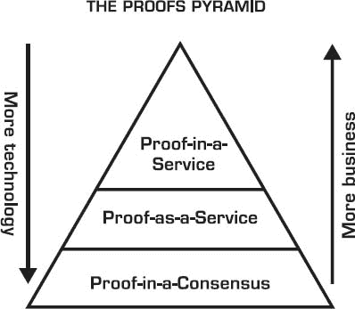

# 2

区块链信任如何渗透

> *“我无法理解人们为什么害怕新思想。我害怕的是旧思想。”*
> 
> –约翰·凯奇

达成共识是区块链操作的核心。但区块链以一种去中心化方式做到了这一点，打破了旧的集中式共识范式，即一个中心数据库曾经统治着交易的有效性。基于去中心化方案（区块链就是基于此）将权威和信任转移给去中心化网络，并使其节点能够持续地在公共“区块”上顺序记录他们的交易，创建出独特的“链”——区块链。

当然，区块链注定会几乎影响到所有事物。但挑战在于要知道如何、何时以及会产生什么影响。第一章对于阐述区块链技术的多种能力至关重要，为理解其应用铺平了道路，并使你相信点对点交易*可以*在区块链上完成，除了区块链本身，没有已知的第三方中介。

区块链不是一只单 trick 的马。它是一个多头的怪兽，具有多种形式。

如果你将其视为一种技术，那么你就会将其作为一种技术来实施。如果你将其视为一种商业变革的推动者，那么你就会考虑商业流程。如果你洞察到其法律含义，那么你将会被其新的治理特征所鼓舞。而如果你将其视为一张设计新可能性的白纸，这些可能性要么之前不存在，要么挑战现有的遗产，那么你将会非常富有创造性地梦想出这些新的机会。

在诞生之初，区块链（以及比特币）是一项挑战现状的技术，并没有预设的对现状的偏爱。中本聪的论文中没有提到与现有世界的整合。后来那些解释和以多种不同方式应用比特币的人，才将其视为一个事后想法。

在宏观层面，区块链技术的未来将会以可能与互联网的发展方式不尽相同的方式展开，从市场部署和接受的角度来看。

## 新的信任层

区块链颠覆并重新定义了我们关于信任的普遍接受信念。

如果我们当我们从商业交易的角度考虑信任时，排除了精神、哲学和情感的内涵，我们会想到以下含义：*依赖、可预测性、信心、真理、保证、信用、确定性、坚定、责任和依赖*。

作为公民或商人，让我们挑选几个我们每天都会互动的、普遍信任的机构：银行、政府、信用卡公司和公用事业公司。

我们通常信任这些组织，因为它们中的大多数在大多数时候都做得很好，并且它们用我们的信任来交付服务。银行不会偷我们的钱，而且只要我们愿意，它们会让我们随时取款。政府用征收的税款提供服务。信用卡公司让我们借钱，附带随地广泛使用的便利。只要我们继续支付账单，公用事业公司就会提供电力、水或电信服务。

你可能会认为这幅画面没有什么问题。然而，对于这些组织中的每一个，我们也可以想到一些例子，在这些例子中，我们似乎授予他们的信任也可能被侵蚀、滥用、忽视、遗忘，或者有时变得过于昂贵。

银行会延迟清算我们的支票，即使在我们购买东西时他们可以立即从我们的账户中扣款。政府轻易地浪费我们的税款，但我们看不到这一点，或者很容易证明它。信用卡公司向我们收取 23%的利息，即使基准利率仅为 1%。公用事业公司让我们面临服务中断或降级，而不对我们进行补偿；更糟糕的是，他们可以很少提前通知地更改他们的费率或条款。

这里有一个因果关系在起作用。这些机构可以摆脱这些极端案例（不幸的影响），因为我们 otherwise 95% 的时间都信任他们，我们对他们的信任失败持宽容态度。那么区块链与这一切有什么关系呢？

区块链对节省我们上述“坏”情况中 5%的时间不会有多少帮助。但是，我们将主张区块链可以在提高剩余 95%的时间中交易的透明度方面做很多事情，以便消除（或至少减轻）信任失败的不幸影响。通过向我们提供更多关于他们信任层的信息，组织会失败得更少，这不仅仅是因为他们会更加警惕，或者害怕被质疑，还因为它们可以分散潜在的失败，允许我们成为早期预警系统的一部分，因此，这应该会导致降低他们的整体风险。

区块链提供了一定程度的透明度和获取真相的途径，这可以防止信任的破裂。如果这项新技术能够重新定义中介曾经执行的信任功能，并产生类似的结果，同时带来额外的好处呢？区块链以真相和透明度为基础层提供支持。但大多数受信任的机构并不提供透明度或真相。这将是一次有趣的遭遇。

## 信任的去中心化—这意味着什么？

有了区块链，信任的列车正在驶向新的目的地。它正在从人类和中心组织转移到计算机和去中心化组织，通过一个基于区块链的底层去中心化共识协议来管理其交付。

之前的范式是引导我们的注意力转向可信的权威，并允许他们处理我们的交易、我们的数据、我们的法律地位、我们的财产和我们的财富。

在新的范式中，一些中心信任过程的部分将被分配到可以提供该信任功能的区块链上。如果传统的“信任检查”已经成为一个特定过程或服务的成本高昂、摩擦丰富的元素，也许区块链能提供一个解决方案。

核心问题是：区块链能给我们带来 Trust 2.0，一种更好的信任形式，它并不总是依赖于可能变得太大而不能失败的、过于官僚看不清风险的、或变化太慢的中心中介吗？

以下是如果我们相信去中心化信任的未来，我们将需要相信的七个原则：

1.  将区块链称为一个用于信任去中介化的工具是不准确的。实际上，它们只实现了一个信任再中介化。

1.  区块链实现了一定程度的信任解耦。区块链挑战了一些现有信任参与者的角色，并重新分配了他们的一些职责，有时削弱了他们的权威。

1.  区块链并没有消除信任。它转移了它。它使它四处移动。

1.  信任总是需要的。随着区块链的变化，信任是如何交付的，以及如何获得信任。无论谁赢得了信任，都赢得了这种关系，这包括信任一个区块链。

1.  区块链去中心化信任，为多个单独无害但集体强大的实体铺平了道路，这些实体验证它。

1.  区块链颠覆了信任的现有经济学，因为传递信任的成本现在分布化了。

1.  中心化信任使我们疏远，分布式信任将使我们团结在一起。

这可能听起来很抽象，但区块链的一个关键愿望是成为基于信任服务的一个“拨号音”。这意味着我们将能够像今天搜索信息、服务或产品一样简单地检查和验证事实、数据、流程、事件或任何事物的真实性。

拨号或搜索信任将随着我们完善“信任逻辑”的迭代而变得可能。

我们已经完善了网络逻辑。你将你的电脑连接到互联网，它就能工作。你走到一个 Wi-Fi 热点，它就能找到你的电脑。你上车后，它通过蓝牙与你的智能手机连接。所有这些都能神奇地工作，因为我们已经找到了连接网络背后的逻辑，并使连接对用户无缝和简单。

我们接下来需要弄清楚的逻辑是*信任逻辑*。这将是关于将信任嵌入硬件或软件系统中，并使这些连接背后的产品和服务能够轻松相互交互。想想当它们在没有人类协助的情况下执行某些操作时，众多的事物和提供商会变得多么智能。

透明度和寻求真相是信任的互补特性。透明度问：我们能看见它吗？真相问：我们能验证它吗？

## 如何在 Airbnb 为陌生人设计信任

那么 Airbnb 和基于区块链的信任有什么关系？*有很大关系*。

有一个来自 Airbnb 的教训，它已经掌握了让陌生人睡在你家而无需害怕的艺术。一开始，将两个陌生人相互匹配并促成一笔交易是非常类似于区块链促进两个（或更多）互不相识的方之间的点对点互动的。

两种情况共同之处是什么润滑了交易，使其得以有序和值得信赖地进行。这个共同点是关于分享身份和声誉细节。在 Airbnb 的情况下，客人分享了很多关于自己的信息——这是一个关键步骤，帮助房东获得信任。在区块链上，身份和声誉是有效锁定点对点交易的两个主要入门级因素。

Airbnb 的联合创始人 Joe Gebbia 说：“结果证明，一个设计良好的声誉系统是建立信任的关键。我们还学到，建立适当的信任需要适当的披露。”

尽管 Airbnb 设计了人类信任的要素，但区块链设计了一个并行交易信任要素，其中人类也是其中的一部分，但幕后操作，并且这个人类在区块链上通过他们的身份和声誉状态表示。

最终，Airbnb 也可以应用用户的区块链身份和声誉来补充他们当前的声誉和身份验证过程。如果区块链提供了一个坚固的替代方案，并且可以转移到其他服务，为什么还要重新发明呢？

## 基于证明的信任服务谱系

证明某事发生的重负是区块链的特色。证明方法的层次从作为共识协议一部分的内嵌（如工作量证明或权益证明），到证明即服务（如证明一个身份或所有权），到一个证明在服务，证明某事是另一个服务的一部分（如土地登记或婚礼登记）。

下面是一个涵盖了一些我们可能遇到的证明相关服务示例的表格。我们可以期待在证明即服务和证明在服务类别中出现许多创新。

| 证明在服务 (Proof-IN-A-SERVICE) |
| --- |

|

+   婚礼登记

+   土地登记

+   供应链

+   资产登记

|

+   交易对手方交易

+   会计审计

+   投票

+   不动产转让

|

| 证明即服务 (Proof-AS-A-Service) |
| --- |

|

+   资产证明

+   身份证明

+   真实性证明

+   个体性证明

|

+   所有权证明

+   物理地址证明

+   来源证明

+   收据证明

|

| 证明在共识 (Proof-IN-A-CONSENSUS) |
| --- |

|

+   工作量证明

+   权益证明

|

+   权威证明

+   存在证明

|

## **区块链格局**

理解区块链市场将如何演变的一种方法是按照三个连续的架构层来描绘它。我再次借鉴了我在 20 世纪 90 年代末期用来解释互联网的一个流行的分段方法：

+   基础设施与协议

+   中间件与服务

+   终端用户应用

一般而言，这种叙述是这样的。首先，你需要一套强大的基础设施能力作为基础元素。对于互联网，TCP/IP、HTTP、SMTP 等作为构建块的例子。对于区块链，将是不同风味的区块链协议作为基础设施铺设。然后，你需要大量的介于软件和服务之上构建或提供的中间件。中间件扩展了基础设施元素的功能，使其更容易构建应用程序。它就像是基础设施与应用之间的粘合剂。最后，成千上万的应用程序将在依赖基础设施、中间件软件和服务的基础上蓬勃发展。

理想情况下，底层两层越成熟，应用程序的开发就越容易。就发展而言，这三个层次并不是清晰地按照顺序依次创建的。即使基础设施和中间件层还没有完全建立，开发者也开始构建应用程序。然后，一切都在这个景观描述的各种层次上通过迭代演变。

## **好处与间接好处**

那么，区块链技术的优势是什么？它解决了什么问题？

创业公司和企业家不需要询问。他们已经像鸭子一样适应了这项新技术，并正在忙于创造新的商业解决方案，这些解决方案想要取代现有的解决方案，并采用不同的规则。

企业是提问的人，因为对于它们来说，好处并不一定显而易见。对于大型公司来说，区块链最初表现为一个问题。这是它们没有计划的事情。

关于质疑区块链好处的悲哀真相是：如果你满足于现状，那么你会认为区块链没有增加任何价值。确实，区块链不是万能的，但如果它正是你在保护的东西，而你却忽视了区块链，那么总有一天，当一家基于区块链的公司开始影响你的现有业务时，你可能会意识到你的判断错误。

区块链可能最初受到了 Bernadette Jiwa 所概述的幸运饼干原理的影响：“人们并不是因为幸运饼比货架上的其他饼干味道更好而买它。他们买它是为了在餐后享受到的乐趣。营销人员花大部分时间推销饼干，而他们应该做的是找到创造更好幸运的方法。当然，你的工作是制作一个好的饼干，尽可能好，但你还必须花时间想办法讲述一个伟大的故事。”

对于开发者来说，区块链有含义。他们在吃饼干之前找到了里面的财富故事。但对于广大用户和许多企业来说，比特币、区块链或加密货币并没有太多的意义（至少目前是这样），因为他们只是被卖了饼干。

工程师通常想要解决一个技术问题。但解决技术问题如果不解决最终用户的问题，用户会问：“这是一个在寻找问题的解决方案吗……因为我看不到这个问题。”

最终用户的心态只是想要一个简单的解决方案来工作。最终用户不在乎是谁创造了某种技术新颖性，或者是谁梦想出来的。商业利益相关者也是这个等式的一部分，因为他们知道问题会让他们付出金钱，他们欢迎解决这些问题的方案。

一般来说，区块链的好处可以细看长列表：

+   **节省成本：**直接或间接。

+   **速度：**消除时间延迟。

+   **透明度：**向正确的人提供正确的信息。

+   **更好的隐私：**通过更细粒度的控制保护消费者、企业。

+   **降低风险：**更好的可见性、较低的暴露度、较少的欺诈、较少的篡改。

+   **访问：**更公平的访问。

+   **生产力：**更多的工作产出。

+   **效率：**处理或报告更快。

+   **品质：**错误更少或满意度更高。

+   **成果：**利润和增长。

区块链不是一种流程改进技术，但它将用于改进流程，因为改进现有流程比发明新流程更容易。至少，这是普遍的观念，也是大型组织中盛行的**modus operandi**（工作方式）。

是的，你可以通过 1.5 倍或 2 倍的改进，这是一个值得尊敬的成就，但如果你能通过 10 倍的改进呢？

初创公司和大型公司对区块链的看法有一种奇怪的二分法。初创公司认为它是解决一切问题的方案，而大型公司则认为它是痛苦，因为它挑战现有的流程。

## **解释一些基本功能**

### **智能财产**

智能属性是区块链操作的本地方案要求。要理解它，想想它的两个先驱，“数字文件”和“数字资产”。数字资产是产品的数字化版本，包括特定的使用权利，通常附带价值。没有权利，它不被认为是资产，只是一个“数字文件”。数字资产的例子包括一首歌、一本电子书、一张照片或一个标志。在比特币发明之前，数字资产作为货币是没有意义的，因为双重花费（或双重发送）问题尚未解决，这意味着欺诈可能会占主导地位。作为一个平行现象，当你从你的智能手机向某人发送照片时，你仍然保留一个副本，你们俩都是那张图片的所有者。这在货币世界或具有真实价值或权利的资产上是不可以接受的，这些资产不能与多个所有者共享。

智能属性将数字资产的概念进一步延伸，它将资产与区块链链接起来，使其永远不能被双重花费、双重拥有或双重发送。如果你是这些数字资产的创造者或所有者，想象一下如果你能以不可撤销的方式绑定你的所有权（或权利），除非你决定转让或出售它们，否则无法撤销。而且所有这些都处于你自己的控制之下，而不是别人的控制之下。

因此，你将创建一个智能属性，这是一个知道谁拥有它的资产或物品。智能属性不一定是仅数字产品。它可以是一个物理对象或物品，通过显式或隐式的链接与区块链相连。有这样的例子成千上万，包括一个锁、一辆车、一个冰箱，甚至你的房子。区块链可以用作与你的加密签名链接的可审计数据库，你的智能属性基于其内容与唯一的数字指纹相连。

现在想象一下这些能力带来的可携带性、灵活性和可发现性方面，它们成为去中心化点对点交易、金融交易或商业活动的绝佳润滑剂。智能属性是专为区块链轨道设计的新的数字位形式。

### **时间戳**

时间戳是一个基本功能，它可以在区块链上永久记录某个特定动作发生的时间。例如，这可以是记录一项资产所有权的变更，或者是一个动作的发生，如一次医疗检查或一笔特定的交易。这有助于在稍后日期证明或验证一个事件实际上是在那个特定时间发生的。一旦在区块链上记录，时间戳是不可反驳且不可更改的，因此在寻求真相时很有用。

### **多签名交易**

多签名（也称为多签）是一种需要多个签名来确认交易状态或批准的过程。这相当于在纸质协议上需要多个签名使其有效，但这种情况在区块链上会自动且快速地发生。这种方法更加强大的一点是，你可以在多个签名之间插入业务逻辑，这样每个签名都可以触发一个新的动作，从而在这些交易中创建托管服务。

### **智能合约**

智能合约是区块链技术的核心组成部分。如果你不理解智能合约，那么你就不能理解区块链的力量。它们与允许信息在网络上公开发布和链接的 HTML 标记语言的发明一样具有革命性。智能合约承诺在区块链的头部编程我们的世界，并有可能取代一些目前由昂贵或速度慢的传统中介执行的功能。

这个概念最早是由 Nick Szabo 在 1994 年提出的，^(2)但在 2009 年比特币区块链技术出现之前，它经历了一个长期的不活跃和不受关注的孕育期，因为那时没有平台可以强制执行智能合约。自 2015 年以来，智能合约越来越受欢迎，尤其是自从以太坊使编程它们成为其区块链力量的基本原则以来。

像任何新兴的流行词汇一样，一个术语越流行，它传播得就越广，被使用的频率也越高，但同时也可能被误用和滥用。对不同的人而言，它可能意味着很多不同的事情。关于智能合约，这里有一些事实：

1.  **1. 智能合约不同于传统的合同协议。**如果我们坚持 Nick Szabo 的原始想法，智能合约通过“数字手段”控制现实世界的有价值财产，从而使协议违约变得昂贵。因此，智能合约可以强制执行特定要求的功能性实现，并可以证明某些条件得到满足或未得到满足。这些可以是非常严格的实施，例如，如果汽车付款没有按时支付，汽车会被数字锁住，直到收到付款。

1.  **2. 智能合约不同于 Ricardian 合同**。由 Ian Grigg 普及的 Ricardian 合同，^(3)是可以通过跟踪各方之间实际协议的责任来表示语义的。这些也可以在区块链上实施，有无智能合约都可以。通常，多签名是 Ricardian 合同执行的一部分。

1.  **3. 智能合约不是法律。** 智能合约作为计算机程序，只是 enabling technology，但它们行动的后果可以成为法律协议的一部分，例如智能合约可以将股份所有权从一方转移到另一方。截至 2016 年，关于智能合约的全面法律影响还在进行中。智能合约的结果可以用作审计跟踪，以证明是否遵循了法律协议的条款。

1.  **4. 智能合约不包括人工智能。** 智能合约是运行在区块链上的代表业务逻辑的软件代码，它们由一些外部数据触发，从而修改其他数据。它们更像是事件驱动的构件，而不是人工智能。

1.  **5. 智能合约与区块链应用不同。** 智能合约通常是去中心化（区块链）应用的一部分。特定应用可能会有几个合约。例如，如果智能合约中满足某些条件，那么程序将被允许更新数据库。

1.  **6. 智能合约相对容易编程。** 编写一个简单的合约是容易的，特别是如果你使用特定的智能合约语言（例如，以太坊的 Solidity），它让你用几行代码就能写出复杂的过程。但是还有更多高级的智能合约实现，它们使用“预言机”。预言机是向智能合约发送可操作信息的数据源。

1.  **7. 智能合约不仅面向开发者。** 下一代的智能合约将包括用户友好的入口，比如网页浏览器。这将使得任何商务用户都能通过图形用户界面，或者可能是基于文本的语言输入，来配置智能合约。

1.  **8. 智能合约是安全的。** 即使在以太坊实现中，智能合约也是作为准图灵完备程序运行的。这意味着它们的执行具有最终性，并且不会无限循环地冒险。

1.  **9. 智能合约具有广泛的应用范围。** 就像 HTML 一样，其应用取决于编写它们的开发者。智能合约非常适合与现实世界的资产、智能财产、物联网（IoT）以及金融服务工具进行交互。它们的应用不仅限于货币交易。它们适用于几乎所有随时间改变状态的事物，并且可以附加价值。

具有智能合约经验的开发者将受到需求。学习智能合约可以让人们进入区块链领域，而不必直接深入了解区块链的内部机制。许多智能合约语言是 C++、Java 或 Python 的衍生品，这三种是最流行的软件语言，这使得学习它们变得容易得多。

智能合约是区块链技术架构中被低估的一部分。然而，它们承诺将为未来的区块链提供动力。

如果信任是区块链的原子单位，那么智能合约就是将各种各样的信任编程到具体应用中。很快，数以百万计的智能合约将会涌向区块链，用逻辑表示我们这个世界，这是我们期待的一个很好的演变。

### *智能预言机*

预言机是一个有趣的概念，与智能合约有关。你可以将它们视为智能合约可以用来修改其行为的链下数据源。智能预言机包含现实世界的信息表示，如身份、地址或证书，它们也可能具有类似代理的属性，指导智能合约以某种方式行为。

它们之所以能和谐地工作，是因为其中一个是区块链上的（智能合约），另一个是链下的（智能预言机）。例如，一个涉及知识你的客户（KYC）功能的智能合约可以与包含身份信息的智能预言机进行交互。或者，如果一名警察想要检查驾驶执照的状态，而不是拨打机动车辆数据库，他们可以检查区块链，并获得有关执照有效性的最新信息，其到期，或其他与司机有关的信息。设想一下，机动车辆部门不必维护昂贵的中央数据库，而是成为智能预言机，并将数据发布到区块链上。数据将会被加密，只有持有正确密钥的当局才能访问它们，但这个过程将会更加高效，维护成本也会更低。^(4)

## 信任的区块链能*启用什么*？

我已经提出了一种实用的方法来记住区块链所涉及的内容。只需想到单词 ATOMIC，你就会记得每个字母代表什么：

### 资产、信任、所有权、货币、身份、合约

事实上，区块链提供了：

+   可编程*资产*

+   可编程*信任*

+   可编程*所有权*

+   可编程*货币*

+   可编程*身份*

+   可编程*合约*

综合起来，这六大概念是理解区块链在特定情境中可以如何被应用的强大催化剂。

让我们扩展一些这些主题。

### *数字资产的创建与实时流动*

数字资产可以在不因中介存在而产生结算延迟的区块链网络上创建、管理和转移。不需要人类或中央数据库的干预来强制验证性是一个基本的新奇之处。

### *在交易与互动中嵌入信任规则*

通过在交易中插入代表信任的规则，区块链变成了一个通过网络逻辑验证交易而不是通过数据库条目或中央权威的新方法。因此，创建了一种新的“信任因子”，它是交易的一部分。

### *时间戳、权利与所有权证明*

区块链允许对代表权利或所有权的文件进行时间戳标记，因此提供无法反驳的、加密安全的证明。这反过来又可以使各种应用能够建立在这些新的无缝验证能力之上。

### **业务逻辑的自我执行与自我强制**

由于验证是由区块链的黑盒完成的，而信任组件是交易的一部分，最终结果是一个自我清算的交易。资产的清算和结算合二为一。

### **选择性透明与隐私**

这是通过加密技术实现的，它将导致新的去中心化数据隐私和安全水平，其中交易可以被验证而不必透露它们所有者的一切信息。透明度揭示了企业的伦理，所以它会受到抵制。但透明度的提高也可以提供信任的增加。

### **抵抗单点故障或审查**

因为区块链由几个去中心化的计算机和资源组成，没有单点故障；因此，这个网络比中心控制的基础设施更具弹性。而且区块链通常具有抗审查性，这是因为数据存储、加密和网络边缘的去中心化 peer 控制。

## **身份所有权与代表**

无论匿名、假名或真实身份都可以在区块链上唯一映射，向我们承诺拥有自己的身份，而不是由谷歌或 Facebook 控制。

基于区块链的身份愿景承诺将赋予用户完全控制自己身份的权力。

这个承诺可能导致简单的、单一的或无缝的登录方式，能让互联网用户直接穿过入口和访问点的迷宫，解锁个人信息，访问服务，以及与数字资产进行交易。

在最简单的情况下，区块链可以用来唯一地验证你的身份，以不可反驳和不可变的方式，因为你的“钥匙”就是你的身份。但如果你需要多个钥匙而不是一个，因为每个服务都需要不同的一个怎么办？想象一下，如果你有五把钥匙打开你的房子，根据不同的日子或入口点，你可能需要使用不同的钥匙。或者，如果你在世界各地有五套不同的房子，你肯定会找到一种方法来保管你的钥匙。这是完全可能的，但也很繁琐。

在网上，我们已经在努力记住多个密码，或者记在笔记里，并且总是担心可能被黑或者忘记。我预计区块链辅助的身份和访问解决方案能帮助我们找到比当前更好的解决方案。

在一个理想的世界，为什么我们的线上和线下身份不能融合？为什么我们要接受我们的驾驶执照只在物理环境（大多数情况下）有效，而我们的线上身份（Facebook 或其他）在机场安检或银行无效？当然，新发行的护照在机场自助服务机上扫描时，已经开始弥补这一鸿沟，我们通过视网膜扫描或其他信息来三角定位我们的身份。

在区块链领域，有多种方法正在解决身份和个人安全问题，包括让我们访问数据和服务。一些需要新的硬件解决方案，其他的是基于软件的，还有一些与商业对企业解决方案集成。

1.  **硬件**。这个类比类似于展示护照，或其他政府发行的身份证明，比如驾驶执照。那张卡片让我们可以旅行，或授权我们驾驶汽车。在区块链上，一些解决方案也正在将生物识别数据结合起来增加认证混合。例子：ShoCard，Case。

1.  **软件**。最接近的类比是我们在日常上网时通常执行的基于 OAuth 的身份验证，比如用我们的 Facebook，Twitter 或 Google ID 登录网站。但有了区块链解决方案，角色就反了：你首先自我注册身份，然后你再链接到你的社交账户。例子：Netki，OneName，BitID，Identifi。

1.  **集成优先。** 相对于前两种方法通常从消费者开始，这一部分是从确定与现有商业解决方案的集成需求开始的。例子：Cambridge Blockchain，Trunomi，uPort，Tradle，Ripple KYC Gateway。

区块链身份方案有机会，但前路充满不确定性。在消费者方面，它们能否取代我们与 Facebook，Google 或 Twitter 的链接，并引诱我们从中开始？而在商业方面，它们能否取代已经根深蒂固的解决方案，如 SWIFT 的 3SKey 多银行，多网络个人身份解决方案，或 Markit 的 KYC？

对于基于区块链的解决方案，简单性要求和达到大量用户的标准很高。它们正在对抗数以百万计的 Google，Facebook 和 Twitter 用户，或数以千计的金融机构已经在使用 SWIFT 或 Markit。

当然，区块链行业可能有自己的解决方案。为什么我们要每次在新加密货币交易所注册时都经历重复的客户身份识别过程？让我们不要犯物理世界同样的错误。

当涉及到区块链解决方案的实施和演变时，有一些问题和挑战：

### **消费者问题**

哪些应用将推动这些新身份表示形式的出现？在 Facebook 和 Google 的世界里，它们具体的应用（例如，社交媒体或文档访问）推动我们的使用。但在区块链上，大多数身份解决方案提供商都在急于在将它们固定到将推动使用的应用程序之前提供解决方案。

+   一个自行管理的在线个人身份层能否取代目前使用 Facebook 或 Google 来验证我们的身份和信息访问的事实标准？

+   用户愿意自行管理随着更高安全规则和访问级别而来的复杂性吗？

+   在身份的背景下，“可携带性”真正意味着什么？它将导致管理多个身份，这会成为与密码管理相似的噩梦吗？

+   零知识技术在保护交易机密和个体隐私方面的作用是什么？

+   智能手机的角色是什么？它能否成为我们的“数字护照”，因为它已经变成我们的数字钱包？

### 商业考量*

如果我们丢失了我们的安全卡片或私钥会发生什么？能否信任普通用户像在家保护自己的财产一样轻松地自行管理他们对数据的访问权限？

+   我们需要新类型的证书机构来为这些身份系统提供它们的认可标记吗？

+   我们是否可以以更细粒度的方式配置信息访问，以便点对点安全规则可以取代基于防火墙的解决方案？

+   当前的“了解你的客户”（KYC）实践与这些新的身份解决方案有何关系，这些新的身份解决方案是否将为促进反洗钱（AML）和反恐活动提供更加安全的层次？

+   这将推动更多的消费者或商业应用程序？

+   是否存在法律或监管障碍需要解决以使这些解决方案的全面部署成为可能？

### *伦理问题*

改变习惯是技术采用的最大障碍之一，这个领域也不例外。我们还不确定是否完全转向数字身份会招致一些滥用，还是减少摩擦，并增加总用户参与度。

+   数据与身份的分离是一件好事吗？它是否创造了多个伪身份和人格？

+   交易历史对我们的声誉有何影响？评估我们的在线声誉是否将成为新的消费者信用评分等价物？

+   匿名是一个好事情，还是这个名称可能被滥用以达到恶意目的？

+   这是否会打开市场以促进金融包容性，还是它会提高采用门槛？

## 去中心化数据安全

区块链为平衡数据、身份和基于交易的隐私与安全带来了一些解决方案。

我们在大型/中心组织内部看到了安全和隐私泄露事件（例如，Target、Sony、Blue Cross、Ashley Madison 以及土耳其政府），这使我们开始怀疑 Web 或大型数据库是否真的安全。客户信息、公民和交易历史的隐私可能会受到侵犯，这对应用程序数据和在线身份的安全有影响。

区块链及其基于区块链的去中心化应用程序出现了。它们的出现为数据安全带来了潜在的解决方案，因为加密安全加密成为区块链应用程序的一个标准部分，特别是与数据部分相关。默认情况下，一切都被加密。由于去中心化了信息架构的元素，每个用户都可以拥有自己的私有数据，而中心仓库对数据丢失或泄露的脆弱性较低，因为它们只存储加密信息以及指向分布式存储位置的编码指针，这些位置分布在分布式计算机网络中。因此，黑客无法重建或理解他们可能掌握的任何部分信息。至少，这是这个愿景背后的理论，并且正在努力将其变为现实。

在这个去中心化技术的新世界中，安全、隐私和数据所有权要求是设计的一部分，而不是事后考虑。它们是首要的。

但是区块链并不完美。由于其与三个关键领域相关的固有设计，它们也引入了安全挑战：

+   区块链上的共识引擎

+   计算架构的去中心化

+   点对点客户端

公共区块链中的共识是公开进行的，理论上可能受到所谓的 Sybil 攻击（尽管目前还没有发生）。去中心化计算架构的趋势需要一种与传统 Web 架构不同的计划和编写应用程序的新思维方式。最后，每次您下载一个位于您个人计算机或智能手机上的软件客户端，并且它“监听”网络时，您都可能开放安全风险，除非它被很好地实现。

我们还必须意识到，物联网设备也可能会受到潜在的安全漏洞的攻击，因为潜在的漏洞正在从中心推向边缘，只要有计算资源的地方就会存在边缘。

幸运的是，目前正在研究一些解决方案，例如私有区块链、零知识证明和环签名，但本书的范围之内不会进入这些技术领域。

另一个好消息是，我们不需要重新发明去中心化的安全、去中心化的数据以及如何编写去中心化应用程序，因为有一些新平台提供了这些基本构建块作为它们核心提供的部分。

如果您是一名开发者，对未来影响的建议是：

1.  在编写应用程序时确保应用程序内部数据的安全

1.  去中心化用户数据以保护它

1.  学习区块链和去中心化技术

1.  在新的/薄云架构上编写智能合约（无服务器）

1.  重新思考您的客户的身份所有权

安全和隐私需要成为初始设计的一部分，而不是事后考虑。

## ANONYMITY & UNTRACEABLE COMMUNICATION

区块链通过用户选择实现了用户匿名，这是监管机构和金融报告当局最头疼的特点，尤其是在消费者应用中。他们当然会想到洗钱、非法贸易和与恐怖主义有关的活动，用户可以隐藏在伪匿名身份下，在被发现之前长时间躲在雷达之下。显然，这不是公共区块链或运行它们的去中心化应用程序的设计目标，尽管对于正常人来说这是边缘情况，但它们可以被视为政策制定者和政府机构的障碍。

在不忽视保护犯罪分子和不良行为者潜在风险的情况下，有许多情况下，无法追踪的通讯是可取的，有充分和正当的理由。

大卫·肖姆，数字现金和隐私技术的发明者说：“无法追踪的通讯是自由探索、自由表达的基础，而且越来越是网上隐私的一般需求，包括人与人之间的通讯。为了满足这些需求，一个系统应该支持，理想情况下在一个组合的匿名集合中，最常用的用例：聊天、照片/视频分享、动态关注、搜索、发帖、支付，所有这些都有各种类型的潜在的匿名认证。”

1994 年，凯文·凯利在《失控》一书中写道：

> 一个相当好的社会需要的不仅仅是匿名。一个在线文明需要在线匿名、在线身份、在线认证、在线声誉、在线信任持有者、在线签名、在线隐私和在线访问。所有这些都是任何开放社会的基本要素。

令人沮丧的是，到 2016 年，我们仍然远远落后于那个“相当好、开放、在线社会”的愿景。区块链可以帮助，因为太多的网络公司集中并劫持了本可以更加分散的服务。

人们希望我们可以调和匿名性和可追溯性要求，在这两者之间找到一个好的平衡，这样“作恶者”可以从网络中被根除，同时保留大多数“良民”操作的正常性。^(5)

## BLOCKCHAIN AS CLOUD

我们可以将区块链视为一种共享的基础设施，就像一种公共服务。如果你思考当前互联网基础设施是如何被支付的，我们通过向互联网服务提供商支付月费来补贴它。随着公共区块链的增多，我们开始在它们上运行数百万智能合约和验证服务，我们可能也会通过支付微交易来补贴它们的运营，这些交易费用、智能合约通行费、捐赠按钮或按使用量收费的方案形式。

区块链就像在分布式云中的某个虚拟计算机，它是虚拟的，不需要设置服务器。无论谁打开一个区块链节点都在运行服务器，但不是用户或开发者。

所以，区块链就像一个网络计算机械的基础设施。有了这个想法，我们可以很容易地想象计算机程序如何运行在这个新基础设施上。

但我们不应该字面地采用云计算类比。区块链基础设施并不取代云计算。它解绑了云计算，并使其部分民主化。

更有可能的是，区块链基础设施类似于云计算基础设施的一层。如果字面上将区块链虚拟机的功能与亚马逊网络服务或 DigitalOcean 等典型云服务进行比较，区块链虚拟机可能过于昂贵，但它们肯定对于在区块链虚拟机上执行逻辑的智能合约或去中心化应用程序（也称为 Dapps）有用。顺便说一下，我们也许还可以看到一个未来，在区块链过于昂贵或缓慢的情况下，客户端节点可以直接相互通信。

当你在云中运行应用程序（例如，在亚马逊网络服务或微软 Azure 上），你的账单会根据时间、存储、数据传输和计算速度需求组合来计算。与虚拟机成本的新奇之处在于，你是在为在区块链上运行业务逻辑付费，否则它是在物理服务器上运行（在现有的云基础设施上），但你不必担心设置这些服务器，因为它们是由其他用户管理的，这些用户通过挖矿获得报酬来运行这些基础设施。

因此，区块链云有一种微价值定价模型，它与传统云计算堆栈平行，但通过一个新的层次。这不是云计算的物理解绑，而是一种在并行但更薄的云上基于加密的交易验证和状态转换记录的新分层。

但运行在此新基础设施上的应用程序面临挑战：你需要做一些工作。这项工作体现在遵循一种新型的去中心化应用程序范式，该范式遵循一种新层次结构，由 Gavin Wood 命名为“web3”。^(6) Web3 是一种在区块链上运行的架构。以以太坊为主要例子，web3 架构包括：1) 高级浏览器作为客户端，2) 区块链账本作为共享资源，3) 运行智能商业逻辑程序的虚拟计算机网络，通过与区块链共识引擎交互来处理交易或切换某些值。这种新范式实际上体现了基于加密的去中心化计算的未来发展方向，它是现有 Web 应用程序架构的一个变种，该架构包括在浏览器内运行 Javascript 和服务器端代码，后者在公司的服务器上运行。

在这里发生的事情放在更广阔的背景下看是什么情况呢？让我们来客观地看看。我们正在见证各种技术领域的去层化：

+   应用程序编程接口（API）现在来自一个加密安全（区块链）的公共基础设施。

+   区块链被用作一种新型的数据库，例如，作为永久存储不可变加密密钥（或散列）的分布式哈希表（DHT），这些密钥指向存储在链外的更大数据值。

+   一种新型的浏览器将允许用户启动去中心化应用程序（Dapps），而不仅仅是网页（例如，以太坊的 Mist）。

+   万维网原始的超文本协议正在通过一个名为星际文件系统（IPFS）的新超媒体协议进行增强，这是一个点对点分布式文件系统，它使用相同的文件系统连接所有计算设备。

+   合同法正在被削弱，例如通过追踪一方对另一方责任的 Ricardian 合同（例如，OpenBazaar 正在将其整合到他们的点对点电子商务协议中）。

这对大型企业有深远的意义。商业用户也将能够在自己的智能合约、点对点应用程序（P2P）和其他去中心化应用程序（Dapps）上使用开放区块链，而不需要求助于 IT 部门，就像软件即服务（SaaS）一样，它是一个特洛伊木马，使员工能够自行注册服务，而不会打扰公司的基础设施（直到执行某些集成时）。

这种新型的 SaaS 将成为可能，因为一个新的基础设施层可以通过点对点和共享成本的方式出现。而且，这种新计算基础设施的成本可能与今天的互联网接入成本一样便宜，按每用户相对成本计算。如果是这样，这将进一步扩大应用程序的可能性。

薄云为用户和开发者带来了自由和灵活性。它将允许任何人在不担心建立基础设施的情况下，为所有权、商业、合同法、交易格式和状态转换函数创建自己的业务逻辑。

我们必须完全接受薄云作为区块链基础设施的结果，并且我们必须在上面创新具有创造性的应用程序。

## GETTING TO MILLIONS OF BLOCKCHAINS

1994 年，当互联网到来时，网站是新颖的，直到大约 1998 年，我们一直保持着一份《财富》500 强公司有或没有网站的名单。在大多数公司加入网络之前，大约花了三年时间。然后，许多这些早期网站受到了批评，因为它们大多是精美的宣传册或信息表，我们一直将亚马逊视为实际上在互联网上开展业务的少数公司之一。

快进到 2016 年及以后。区块链将成为新的网站，形象地说。是的，区块链很 geeky（挑战在于消除这种 geekiness），但每家公司都注定要拥有或参与各种区块链，无论是私有的、半私有的还是公开的。

使用网站的类比，公司可以利用熟悉的门户网站方式来提供一系列区块链服务，以便为新用户提供方便，同时展示区块链的 capabilities。

第一步是找出适合区块链的内容，从你当前的运营开始。正如你创建第一个网站时所问的，“我们可以在上面发布什么信息？”一样，你可以先尝试回答一些问题，以发现可能的区块链用例，涉及可能的点对点价值交换服务。

当我们想象一下，当中本聪在 2009 年发布了第一个比特币区块链的代码时，它只由两台计算机和一个令牌组成，这是几乎难以想象的。然后，它开始增长，因为任何人都可以下载一个软件程序，作为另一个相同的节点连接到网络，运行相同的代码。它逐渐发展成为一种自我增长的网络类型。公共区块链就是这样增长的。

比特币就是那个第一个公共区块链，它激励了很多人。以太坊是另一个迅速增长的重要公共区块链，已经确立了自己作为第二大重要的公共、多用途区块链的地位。

公共区块链与私有区块链之间的主要区别之一是，公共区块链通常具有通用目的，通常使用成本较低，而私有区块链具有更具体的用途，因为成本由较少的所有者承担，所以设置成本更高。我们还可以期待出现特殊目的的公共区块链，例如，承诺提供完全隐私的 Zcash 区块链。

随着公共、私人、半私人、特殊目的和其他类型的区块链的普及，一个由数百万个区块链组成的世界将是可实现的。

## 第二章的关键观点

1.  区块链为实施交易信任提供了新的范式。我们应该开阔思维，接受信任将由机器计算，而不是由人类验证的事实。

1.  通过增加透明度要求，即通过分享身份和声誉信息来实现信任。

1.  证明某事已经发生将由区块链来完成。将有数百万个此类案例，其访问方式将与我们使用谷歌搜索信息的方式相媲美。

1.  匿名性、身份、去中心化数据和安全是适合区块链发展的 evolving 问题。

1.  智能合约和智能财产是区块链运作的关键基础，它们开启了应用的可能性。开发者将争相创建基于智能合约的应用，而无需担心学习区块链的内部元素。

## 注释
