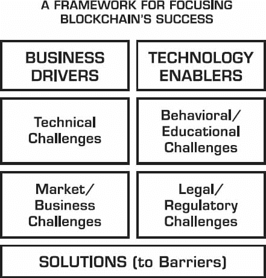

# 3

障碍、挑战和心理障碍

> *“当变革的风吹来时，有些人建造墙，而其他人建造风车。”*
> 
> ——中国谚语

曾经，一个年轻人去见一位智者，并对他说：

> *“我寻求建议，因为我被自卑感折磨，再也不想活了。每个人都告诉我我是个失败者和傻瓜。我请求您，主人，帮帮我！”*
> 
> *智者看着年轻人，匆忙回答：“原谅我，但我现在非常忙，无法帮助你。有一件特别紧急的事情我需要处理...”说到这里，他停顿了一下，思考了一下，然后补充道：“但如果你同意帮我，我会很高兴回报你的。”*
> 
> *“哦...当然，主人！”年轻人喃喃自语，痛苦地意识到他的担忧再次被当作无关紧要的事情。智者说：“很好，”并从手指上取下一枚带有美丽宝石的小戒指。*
> 
> *“骑上我的马，去市场广场！我急需出售这只戒指以偿还债务。尽量为它争取一个合理的价格，但不要接受任何低于一枚金币的东西！现在就出发，尽快回来！”*
> 
> *年轻人拿起戒指，疾驰而去。当他到达市场广场时，他把它展示给各种商人看，他们一开始很感兴趣地检查它。但一听说它只能用黄金交换，他们立刻失去了兴趣。一些商人公开嘲笑这个年轻人；其他人则简单地转身离开。只有一个年长的商人对他说，一枚金币对这样的戒指来说太高了，他更可能只收到铜币，或者最好的情况，可能是银币。*
> 
> *当他听到这些话时，年轻人非常沮丧，因为他想起了老人的指示，不要接受任何低于黄金的东西。已经在整个市场上寻找了数百人，希望能找到买家，但他失败了，于是他骑上马出发了。他彻底失败了，非常沮丧，于是他回到智者那里寻求建议。*
> 
> *“主人，我无法完成您的请求，”他说。“最多我能得到几枚银币，但您告诉我不要接受低于黄金的东西！但人们告诉我这只戒指并不值那么多。”*
> 
> *智者回应道：“这是一个非常重要的观点，我的孩子！在尝试出售戒指之前，最好先确定它真正的价值！还有谁能比珠宝商更擅长这件事呢？骑马去找他，看看他愿意出多少钱。不管他出多少钱，都不要卖给他！相反，立刻回来找我。”*
> 
> *年轻人再次骑上马，前往珠宝店。后者用放大镜长时间地检查戒指，然后在小天平上称重。最后，他转向年轻人说：*
> 
> “告诉你的主人，我现在最多只能给它 58 枚金币。但如果他给我一些时间，我会用 70 枚金币买下这枚戒指。”
> 
> “70 枚金币？！”年轻人惊叫道。他笑了笑，感谢了珠宝商，然后全速跑去找智者。当后者从现在充满活力的年轻人那里听到这个故事时，他告诉他：“记住，我的孩子，你就像这枚戒指一样。珍贵而独特！只有真正的专家才能认识到你的真正价值。那么你为什么还要浪费时间在市场上徘徊，听任何愚蠢之人的意见呢？”

这个寓言让我想起了比特币、加密货币和区块链技术的起伏。在它们寻求合法性和认可的旅程中，它们遭遇了大量的怀疑和低于其价值的估值，这主要是在与那些不能完全欣赏它们真正价值的部分观众相遇时发生的。

区块链会遇到阻力，会被误解和拒绝，直到它被广泛接受。这是这本书中一个严肃的章节。如果你单独阅读它，你可能会决定区块链永远不会成功。希望你在“傻瓜市场”上不要轻视它，就像上面的故事所暗示的那样。

是的，挑战和未知的东西有很多，但我们曾在 1994 年至 1998 年互联网的早期阶段遇到过类似的盲点和不确定性。快进 15 至 20 年后，人们对互联网的看法发生了改变。它被普遍接受为几乎没有什么是不可能的。随便挑一件事。很可能就有与之相关的网络解决方案或选项，然而这样的市场渗透率在早期是想都想不到的。

现在的区块链同样充满了激情和怀疑。互联网最终被证明是一个伟大的工具，因为热情的群体战胜了怀疑者。但这并不是偶然的，也不是仅仅因为热情或时间的流逝。这是因为，早期市场参与者能够识别出互联网商业化的挑战，并且一个接一个地解决，使得进入门槛不断降低，机会变得更大，更容易触及。

我亲眼见证了这一点，那是 1994 年的互联网，我参与了早期商业化的倡导，当时我加入了 CommerceNet，其唯一目的是帮助消除采用的障碍，传播其愿景，并通过在技术、教育、法律和监管方面的工作，使互联网的早期发展更加顺利。区块链的发展无疑将重复互联网的历史。

## 用框架方法攻击区块链

让我们通过催化剂-障碍-解决方案框架全面地看待区块链。这个框架包括准确描绘催化剂：业务驱动和技术支持。然后，我们可以提出包括技术、业务/市场、法律/监管和行为/教育挑战的障碍。最后，我们有责任逐一解决这些障碍的解决方案。

这里需要的现实情况不应该有任何幻想。如果我们忽视这些障碍背后的 issues，很多它们不会自己解决，也不会消失，但我们需要在正确的方向上继续推动进步。

这个框架背后的信息是帮助我们关注重要的事情。当业务驱动强大，技术支持就绪，以及找到挑战解决方案时，进步就会发生。

这里有一个这些挑战的表格，分为四个部分。

| 技术 | 市场/商业 |
| --- | --- |

|

+   不发达的生态系统基础设施

+   缺乏成熟应用

+   开发者稀缺

+   不够成熟的中间件和工具

+   可扩展性

+   遗留系统

+   数据库的权衡

+   隐私

+   安全

+   标准不足

|

+   将资产转移到区块链

+   项目想法质量

+   足够用户基数

+   初创企业质量

+   风险资本

+   加密货币波动

+   引导新用户

+   少数示范应用公司

+   合格人才不足

+   成本问题

+   创新者困境^(1)

|

| **行为/教育** | **法律/监管** |
| --- | --- |

|

+   对潜在价值理解不足

+   有限的执行愿景

+   变更管理

+   信任网络

+   最佳实践不多

+   低实用性因素

|

+   规定不明确

+   政府干预

+   合规要求

+   炒作

+   税收和报告

|

## 技术挑战

软件工程师和科学家喜欢面对技术挑战。这激励他们进一步尝试解决，无论它们有多难。

### *不发达的生态系统基础设施*

作为一个起点，每个区块链都需要自己的技术基础设施，以及围绕它的充满活力的生态系统，有多个参与者支持它。在技术方面，协议本身是最低要求，虽然它需要通过软件工具和服务来增强其实用性，但直接影响区块链市场进展的是围绕技术的玩家生态系统。没有采用，影响有限。

> *就像整个互联网作为一个生态系统运作一样，区块链生态系统也将遵循同样的解放路径，导致一系列互联的区块链，即使在此期间，它也会感觉像乐队的一些部分缺失了.*

一个充满活力的生态系统包括以下每个部分的各种参与者：

+   完整的*技术栈*，包括基础设施、中间件和软件应用

+   **初创公司**，通过创建新产品和开拓新市场进行创新

+   **解决方案和服务提供商**，为 enterprises 提供端到端的实施

+   **资助者和风险投资**，与企业家和科学家共同承担风险

+   **倡导者**、影响者、分析师、志愿者、支持者、地方社区

+   **开发者和技术人员**，他们致力于核心技术和扩展技术领域

+   **用户**，他们被引导去尝试产品，既作为消费者又是企业客户

### **缺乏成熟应用**

当新的基础技术出现时，新应用需要时间才能出现。在我们看到雄心勃勃和创新性的 Web 应用之前，已经过去很长时间了，而很多早期的应用并不那么创新，因为它们试图复制已经在现实世界中完成的事情。尽管如此，复制是一个好的第一步，因为它允许人们在期望较低时获得经验。

作为一个极端案例，几乎任何软件应用都可以用一些区块链和去中心化的元素重新编写，但这并不意味着这样做是个好主意。

也许 2016 年的区块链相当于 1995 年 Web 应用普及阶段的我们。那时，Java 虚拟机尚不可用，但当它出现时，它开启了一场雪崩式的机遇，并使创建大规模 Web 应用变得更容易。Java 编程语言的出现意味着 Java 应用可以在任何 Java 虚拟机（JVM）上运行，而不管计算机架构如何。一些如以太坊的区块链具有类似的“虚拟机”功能，这允许程序在没有开发者意识到内置计算机架构的情况下在区块链上执行。

区块链的另一个批评是没有所谓的“杀手应用”，这些应用应该能在消费者之间激发指数级的使用。我们当然期待明显的应用作为他人的灯塔，但还有一种观点支持多种杀手应用，而不仅仅是单一的一个。在这种后来的情景下，传统的“长尾”市场特征将占主导地位。

### **开发者的稀缺**

将需要数千名软件开发者来推动所有行业的发展。到 2016 年中，大约有 5000 名开发者致力于为加密货币、比特币或区块链编写软件。^(2)可能有另外 20000 人涉足过那种技术，或者编写过以某种方式连接到区块链的前端应用。与全球 900 万 Java 开发者（2016 年）^(3)和全球约 1850 万软件开发者（2014 年）^(4)相比，这些数字相形见绌。

幸运的是，区块链是用与已经流行的语言和脚本相似的编程语言编写的，如 Java、Javascript、C++、Node.js、Python、Golang 或 Haskell。^(5)这种熟悉度是程序员开始与区块链技术互动时的一个积极特征。

什么将帮助提高开发者数量？

+   更多关于区块链的市场意识，以激发更高水平的兴趣。

+   加密货币认证联盟（C4）等认证计划的普及。^(6)

+   提供正式的学术学位，如塞浦路斯尼科西亚大学提供的数字货币理学硕士。

+   区块链提供商的培训项目。

### *不成熟的中间件和工具*

区块链中间件和软件工具非常重要。中间件就像区块链基础设施和应用程序构建之间的胶水。软件开发工具促进整个软件开发项目。

直到 1998 年，编写 Web 应用程序并不那么容易，需要手动将几款软件组装在一起。在那段时间，Web 应用程序的部署存在几个问题，包括缺乏健壮的事务管理和状态相关功能、可扩展性、部署、应用可管理性以及安全性。随后，Netscape 推出了著名的集成“Netscape 应用服务器”，这是一个软件能力的集成套件，包括各种需求组件和工具，开箱即用。这种简化对像鱼儿得水一样的程序员来说是个福音，让他们开始专注于编写 Web 应用程序，而不是担心组装所需的组件和兼容性问题。那些早期的 Netscape 时代标志着现代 Web 应用程序架构时代的开始，这个时代一直延续到现在。

一旦我们开始看到完整、开箱即用的产品，承诺简化开始、开发和部署区块链应用程序的过程，我们就会知道一个新的阶段已经开始了。

### 可扩展性

区块链的可扩展性是一个将继续争论的问题，尤其是关于公共比特币区块链。可扩展性的挑战是两方面的：

1.  通常有多种方式可以扩展任何技术，区块链也不例外。许多工程师可能不同意最佳扩展方法，这种情况可能导致长时间讨论和实施延迟。

1.  截至 2016 年，区块链可扩展性的某些方面仍需要持续的科学研究，因为这片新领域正处在新的前沿的边缘。

扩展技术系统是一个永无止境的挑战。这是一个移动目标，因为随着你的成长，扩展的需求也在演变；因此，你不需要解决你还没有的问题。你通常在问题出现之前就解决了它，时机正好。你不需要为 100 万用户设计解决方案，而你仍然只服务于最初的 1000 个用户。

作为参考，在最初的发明超过 30 年后，我们仍在设计和完善互联网的可扩展性。2020 年拥有 500 亿个节点不是一个设计问题，在 1983 年或 1995 年。但现在，网络规模显著增长，我们已经有数十亿用户，我们可以更容易地解决下一个可扩展性目标。

扩展区块链将不同于我们继续扩展互联网的方式，从概念上讲。有很多聪明的工程师、科学家、研究人员和设计师都准备应对这个挑战并解决这个问题。

使区块链的可扩展性变得更加复杂的是，需要在去中心化和安全之间保持必要的平衡。在一种与安全性相关的经济模型中扩展去中心化网络是一个前所未有的新领域。

### *遗留系统*

通常，与企业遗留系统相关的有两个问题：

1.  与现有应用程序的集成。

1.  知道该更换哪些部件。

技术整合遗留系统或其他应用始终是 IT 实施的挑战。因此，开发现有系统之外的用例和项目可能会更容易，因为你至少最初会避免集成噩梦。

### *与数据库的交易*

理解涉及数据库和区块链的交易和明智选择的关键能力需要完善。这始于对每种方法的优点和缺点的清晰理解（见第一章和第二章）。

找到区块链特别擅长的事情之间的正确平衡，并将由此产生的好处与后端数据库或现有应用相结合，是你需要不断寻找的部分魔力。我们仍在学习这些边界是什么，就像摆锤一样，我们可能会过度偏向一侧，然后到另一侧，然后找到一个中间地带。

与此话题相关的是存储区块链数据以满足交易、历史、分析和合规报告要求的问题。

### *隐私*

在公共区块链中，任何交易的可见性默认是开放和透明的。这意味着任何人都可以追踪交易的路径，包括它所持有的价值，以及它的起源和目的地地址。这种透明度在私有区块链实施中是难以启动的。然而，现在通过加密值，实现交易保密是可能的，通过零知识证明方案隐藏身份也是可能的。

### *安全性*

区块链的安全性问题将是永恒的话题。我们还在适应通过共识来确定交易最终性（无论共识的形式如何），而不是更确定性的“数据库提交”方式。

大型组织，尤其是银行，对于将其内部需求采用公共区块链并不特别感兴趣，他们以可能存在的潜在安全问题为理由。一旦你对可能对交易最终性造成破坏的潜在场景产生丝毫疑虑，立刻就可以提出针对公共区块链全面安全性的技术论点。这足以形成一个阻止因素，让人们远离公共区块链，尽管可以提出支持其安全性的论点。

### *缺乏标准*

有一句古老的谚语：*标准的好处是可供选择的标准太多*。在其早期阶段，区块链技术正相反地面临着这个问题。

标准通常以两种方式出现。它们要么通过市场采用成为*事实上的标准*，要么由标准委员会或联盟团体*预先制定并达成一致*。

标准带来许多好处，包括一些网络效应、更容易的互操作性、共享的实施知识、潜在的降低成本和总体风险的减少。标准可以应对不同的层次，针对技术、平台或与流程相关的领域。

但这里有一个关于标准的警告。你通常不会在标准上进行竞争。它们倾向于使竞争环境平等化，并允许公司通过实施这些标准的方式在自己的条款上进行竞争。你的竞争优势可能来自于你实施的速度，或者你超越这些标准的创新能力。区块链将为标准的应用提供同样的机遇和陷阱。标准将是必要的，但不足以保证成功。

## 市场/商业挑战

一些市场和商业挑战与宏观环境相关，而其他的则更具体于组织内部。

### *将资产转移到区块链上*

区块链是一种超级快速的铁路，可以运输数字资产。但，第一个挑战在于在火车开始快速行驶之前将其放置在轨道上。你可以直接在区块链上创建新资产，或者将其转移到区块链上。每种方法都引入了不同的考虑因素，尽管可能更容易先创建本地资产，因为这样可以稍后才担心与现有系统的完全集成问题。

### *项目想法的质量*

首次体验很重要，但如果你的初始入口点似乎没有明显的回报，也许这些项目的质量和野心水平是有问题的。如果项目犹豫不决，那么回报也将同样保守。

### *用户的临界质量*

这适用于消费和 B2B 市场。许多消费应用程序需要数十万甚至数百万用户才能被认为是成功的。在 B2B 方面，您需要让价值链的所有成员在给定的区块链上保持一致和参与，才能开始获得相应的价值，并且完成这些类型的承诺需要时间。

### **初创公司的质量**

区块链初创公司与其他科技初创公司并无不同。它们将涵盖各种质量类型，只有少数能够成功可行地发展。有许多初创公司是生态系统活力的标志，即使有 90–95%的它们不会成功。即使初创公司失败，也会产生经验丰富的企业家，他们通过工作变得更加老练，这使得他们在下一次尝试时更加擅长自己的技艺。我们应该庆祝初创公司的发展，无论每个新企业的初始质量如何。

### **风险投资**

风险资本的可用性对于资助围绕区块链技术应用的创新孵化、生产和加速至关重要。专业的风险资本家擅长资助风险并支持企业家实现他们的目标。我们应该预期逐渐增加的风险资本流向区块链初创公司，这将是一个健康的迹象。

除了风险投资，通过自发行加密货币或加密代币的众筹也是另一种融资选择。这种方法由于外部问责制控制较低，存在一些风险和不确定性。虽然对某些情况可行，但成功率并不比风险资本支持的初创公司好。

### **加密货币的波动性**

加密货币的波动性是使用和信心的阻碍因素，但预计波动性将逐渐稳定，随着每种加密货币背后技术的不断成熟和市场采用。最终，不良行为者和投机者将逐渐变得微不足道，对加密货币的整体健康影响甚微。

### **吸引新用户**

大多数用户无法处理增加的使用复杂性，尤其是当底层技术复杂（如区块链）时。早期的区块链应用程序可能用户体验不佳，但最终，用户可能甚至不知道他们使用背后有区块链。

### **少数海报应用公司**

区块链领域的亚马逊和易贝在哪里？这些公司成为参考点和原型模型，因为它们是首批证明你可以在区块链上构建一个可行业务的证明点。我们将需要见证这类公司的出现，并看到它们通过市场采用实现成功。

### **公司内部缺乏合格人才**

需要一段时间才能将数千名员工转化为有经验的区块链倡导者。组织内部也需要形成一个有经验的支持者和专家的临界质量，这样他们才能自行开展各种区块链实验并创建解决方案，而不需要许可，正如网络应用程序和想法最终成为大多数企业第二自然一样。

### 成本问题

开始涉足区块链技术并不昂贵，因为大部分都是通过开源许可免费获得的。然而，全面实施将带来额外的成本，这和典型的信息技术相关项目和部署的成本类似。一些首席信息官（CIOs）可能不愿意在紧张的预算中增加开支，除非已经证明了早期投资的回报。

### 创新者的困境

在你的商业模式内创新是困难的，因为你通常会试图把所有事情都和它联系起来，导致视野短浅和有限。这尤其适用于你的业务具有信任相关功能（如清算所）的情况。当前的中介将面临最大的变革挑战，因为区块链直接挑战了他们的价值主张核心。他们需要有创造力，并且敢于在整合区块链功能到他们的产品中，并创造性地发展新的价值主张元素的同时颠覆自己。他们需要意识到，自我伤害总比被人致命打击要好。这种转变不会容易，因为改变商业模式在大型组织中可能由于各种因素而难以实现。

## 法律/监管障碍

通常来说，当面对新技术时，监管机构和政策制定者的反应有三种不同的方式：

1.  什么也不做，让市场自行成熟和发展。

1.  控制扼流点。例如，这些扼流点可能是加密货币交易所或软件提供商，它们将需要获得许可。

1.  在交易点或其过程中插入自动监管。这可能涉及为通过后门、信息排放管或直接从交易中扣除等方式提供直接数据报告留出空间。

### 不明确的法规

只要监管机构的位置不明确，区块链空间内涉及的人都将继续存在混乱和不确定性。区块链是一项影响众多领域的革命性技术，从各种不同方向可能会出现不同风格的监管。这可能会增加混乱。正如互联网在其早期年份被留下来独自绽放一样，建议在区块链技术成熟之前不要对其进行干预。

监管最终会来到区块链领域，但迟到总比过早好。监管者需要面对的一个基本范式转变是，信任现在更加开放，且不受他们通常监管的“中心控制”。信任的本质正在改变，但监管者习惯于监管“信任提供者”。当信任提供者是区块链，或者是一种不符合之前中心节点监管模式的全新中介时，他们是否会学会调整？特别是，区块链默认是去中心化的，因此相比中心化的实体，监管去中心化实体更加困难。因此，我们需要看到监管方面的创新。例如，区块链或许可以获得认证。

值得注意的是，一百多年后，我们仍在对汽车的一些方面进行规范，例如，要求白天开启灯光，强制使用安全带，或限制二氧化碳排放量。这些规定显然不是汽车工业最初几年的部分，但它们是在多年的观察和经验之后考虑的。想象一下，如果监管机构在 1910 年，即福特 T 型车推出两年后，就要求自动日间传感器或充气气囊会怎样。那时甚至没有人想到这些需求；这些能力背后的基本技术甚至还没有发明。这里的教训是，当新技术处于采用的初级阶段时，我们实际上并不知道我们需要规范什么。

### 政府干预*

主要针对比特币，一些政府对于不由主权国家机构支持的钱币感到不安。一些国家和中央银行在比特币的早期年份发布了关于比特币使用的官方警告，包括俄罗斯、中国和欧盟。区块链不是比特币，但它允许创建和分发加密货币，以及具有真实价值的资产。除非政治家和政策制定者对区块链的使用更加放心，否则区块链的操作将继续受到政府的严密审视。

政府可能会向市场、政策制定者以及通常作为其代理的法律执行机构发送错误的信号。此外，政府过度干预的做法可能会阻碍区块链技术领域私营部门领导力的发展，而这一领域以创新成果著称。当然，政府监管可能适用于消费者保护和某些其他标准，但过早干预通常无助于解决问题。

### 合规要求*

合规是一项重要的活动，尤其是对于那些每年花费数十亿美元以保持对最新法律法规的了解的金融服务提供商来说。

合规与不合规都是昂贵的，这构成了侵蚀利润率的间接费用。合规可能在一些领域带来突破，这些领域可能包括：

+   接受以加密货币支持的代币作为真实价值。

+   认识到已经通过区块链的交易的最终性。

+   允许与智能合约建立必要的法律联系。

+   通过区块链允许点对点对手方进行验证。

### **炒作**

很难描述或达成共识，什么构成了炒作或不构成炒作。有时对炒作的看法与炒作本身一样具有破坏性。过度的炒作对新技术的传播是有害的，尽管市场在炒作预期上几乎总是过度反应，然后回归现实，接着相应地进行调整。最常见的炒作形式通常来自技术提供商，他们在市场营销方法上过于热情。

### **税务和报告**

早期的区块链平台专注于交易，而不是报告。然而，这些平台需要更好的税务和报告功能，以便其输出可以输入到传统的会计系统中。将会有解决这个领域的解决方案。

## **行为/教育挑战**

### **对潜在价值的理解不足**

对围绕区块链的基本能力缺乏全面理解将阻止任何明智的高管看到其潜在价值的全部。这个挑战只能通过共同努力了解区块链及其潜力来解决。这是我撰写《商业区块链》的动力。

### **有限的高管视野**

一些高管只会看到他们想看到的东西，要么是因为他们没有花足够的时间全面研究区块链，或者可能是因为他们害怕学习它以避免处理其业务潜在的干扰。要全面理解区块链的众多可能性确实需要一些时间。害怕区块链的高管会将他们的愿景调整到适合他们自己的现实，这种现实通常是用限制性的颜色描绘的。

### **变更管理**

区块链是关于业务流程重新工程——至少，如果你想要收获更根本的利益。快速或简单的项目可能没有达到所需变化的深度，以获得更多的收益。在大型组织中完成变革是困难的。

### **信任网络**

区块链的怀疑论者可能会想：我们已经相互信任，我们有一百年历史的机构来执行那种信任，那我们为什么要把信任放在网络上呢？

信任执行数学计算的计算机网络而不是一个“已知、可信赖”的你可以看到的方 party，这需要我们不习惯的新思维模式。最终，我们会接受这样一个事实，即*信任在网络中*——这是一种新的信任形式。让我们记住，在 Web 的早期年份（1994-1998），银行并没有完全信任互联网支付。我们必须通过专门的“支付网关”，这些网关专门用来执行信任功能，同时使它们与不想接触不可信技术的银行系统分离。很快，使用信用卡在 Web 上支付变得广泛接受，大多数当前的 Web 用户可能不会记得这些充满忧虑和恐惧的早期日子，尽管与信任区块链的相似性非常明显。

我们最初会对区块链作为信任服务交付网络的可用性感到焦虑，但最终它们会被人们视为理所当然，就像今天世界上大部分地区对互联网访问的看待一样。

### *最佳实践稀少*

鉴于区块链实施经验的稀缺，真正的最佳实践寥寥无几。在最初狂热地寻找用例之后，分享最佳实践和基准化将会成为下一个热门活动。

### *低易用性因素*

比特币最初的易用性并不算太好，这从自 2010 年以来涌现出的数十个软件钱包应用中可以看出。基于网页的托管加密货币交易所提供了更易用的用户界面，通过类似于在线银行熟悉的外观和感觉。尽管后者因为缺乏去中心化而受到批评，但它们确实提供了推动用户采用的理想的易用性。

基于区块链的应用下一代将分为两种类型：它们要么是去中心化应用（如 OpenBazaar），要么看起来像是具有后端去中心化的常规 Web 应用。在任何情况下，它们的易用性都将与它们所 addressing 的特定功能紧密相关。例如，它将是一个金融交易应用，或者是一个土地注册应用，而区块链将在不向用户过度展示的情况下执行其工作，仅在让他们从中获益时可见。

## 第三章的关键思想

1.  区块链面临的挑战众多，但与 1997 年互联网所处的状况并没有太大不同，当时我们逐一攻破这些障碍，其中一些障碍自然而然地消失了。

1.  区块链的演变面临技术、商业/市场、法律/监管以及行为/教育方面的挑战。

1.  一些最重要的挑战包括可扩展性（技术方面）、创新（商业方面）、信任网络（行为方面）以及现代监管（法律方面）。

1.  正如我们在互联网发明 30 年后继续其规模扩展一样，我们也将继续解决并更新区块链的可扩展性需求。

1.  正如我们在汽车安全法规发明之初无法预见其未来的更新方式一样，我们将在区块链演化的整个生命周期中继续更新其监管要求。

## 注释
