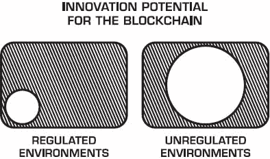
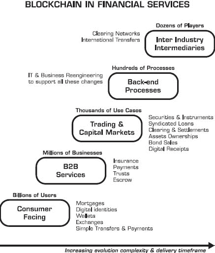

# 4

金融科技中的区块链

> “开发新商业模式最糟糕的地方就是在你现有的商业模式内部。”
> 
> ——克莱顿·克里斯滕森

金融机构将面临挑战，取决于他们愿意多大程度上弯曲他们的商业模式来适应区块链的重量。他们的默认立场只会稍微打开大门，期望让尽可能多的好处渗透进来，而最小的开门量。挑战者（主要是初创公司）将试图尽可能多地踢开那扇门，期望能推翻在位者。

金融服务业中区块链的技术创新很大程度上是由初创公司推动的。但是，像任何其他行业一样，金融机构也可以通过应用这项技术进行创新。对于银行来说，初创公司就像一个奇怪的生物。它们首先会被仔细审查并保持近距离，但互利共生并不会自动带来好处。实际上，大型组织与大多数初创公司相距甚远。它们最初的兴趣就像是在动物园参观动物。试金石是将技术带回家，看它是否能经得起驯化的考验。

任何大型组织在面临大量外部创新时，如果这些创新超出了其内部吸收或利用的能力，都会面临挑战。

行业活动来自两个不同的方向。一方面，初创公司和科技产品和服务公司正在进入市场。另一方面，组织将开始研究市场，并生成一系列用例和目标领域的长列表。挑战在于将合适的技术和商业方法与选定的用例、项目和倡议相匹配。

银行将被要求亲自接触新技术并学习。他们还需要让思维变得肮脏，即使这意味着要承担失败的风险。他们早期获得的越基础的经验，他们就越能从最初的工作快速进展到更具突破性的任务。

这一章节并不为特定的组织提供具体的解决方案。相反，它概述了金融服务组织可以如何思考区块链。如何思考区块链是有用的，因为它允许你揭示你自己的策略。毕竟，你比任何人都更了解你的业务。

## 受到互联网和金融科技攻击

要理解区块链将如何影响金融机构，我们必须回顾它们与互联网的近期历史，同时也要看看采用技术前瞻性产品方法的金融科技公司的出现，这些公司通过提供竞争性服务。

自 1950 年代末期大型计算机早期引入以来，银行一直依赖信息技术（IT），但“FinTech”这一术语直到大约 2013 年才流行起来。讽刺的是，技术在银行运营中始终扮演着关键角色，然而可以争论说银行在互联网方面并没有进行太多创新。传统上，银行的 IT 重点是运行后台操作（包括客户账户和交易），支持分支零售职能，连接自动取款机，处理来自销售点零售网关的支付，与合作伙伴或银行间网络全球互联，并交付包括简单贷款到复杂交易工具在内的各种金融产品。

1994 年，互联网到来，随之而来的是为任何服务提供替代前端入口的潜力。然而，大多数银行抵制了这一创新窗口，因为它们深陷于在零售分支内提供服务，或通过一对一的商业关系提供服务。他们没有看到互联网作为更大变革的催化剂，因此它们按照自己的节奏适应互联网，并根据自己有限的认识来调整。快进到 2016 年，互联网商业化超过 20 年，可以说银行只给他们的客户提供了互联网银行（后来增加了移动访问）、在线经纪和在线账单支付。现实是，客户不再经常（或根本不）去分行，他们也不再舔邮票来支付账单。与此同时，FinTech 正在增长；这是对银行缺乏根本性创新的一种全面回应。

PayPal 是典型的支付颠覆者。成千上万的金融科技公司效仿 PayPal，开始提供替代性的金融服务解决方案。到 2015 年底，PayPal 拥有 1.79 亿活跃用户，总支付量为 2820 亿美元。PayPal 是“一个真正全球性的平台，在 200 多个市场可用，允许客户使用超过 100 种货币收款，从他们的银行账户中以 57 种货币提款，并在他们的 PayPal 账户中以 26 种货币持有余额。”^(1)

PayPal 与全球数百个本地银行有直接合作关系，因此可以说它是唯一一个几乎不存在边界的全球金融服务提供商。PayPal 的成功有着根本性的意义：它证明，只需建立起与现有银行机构的桥梁和通道，替代性金融服务公司就能变得可行。顺带一提，2014 年，Apple Pay 效仿 PayPal，通过多功能智能手机抢占销售点时刻，将自己再次置于银行和客户之间。如果你和世界上任何一位银行家谈谈，他们都会承认 Apple Pay 和 PayPal 是吃掉他们利润的令人烦恼的竞争例子，他们无法阻止它们的攻势。

到 2015 年，已有超过 190 亿美元的风险投资注入金融科技初创公司。^(2) 其中许多公司专注于几个热门领域：贷款、财富管理和支付。一些初创公司甚至提供仅限移动端的全面银行服务，这种方法对千禧一代有吸引力。这证明可以从零开始创建一种新型的银行，而不必承担遗留问题的负担。

有趣的是，金融科技初创公司最初并没有直接攻击现有企业，因为知道这样做风险大且成本高。相反，它们的切入点是在相邻的、未受挑战的、被忽视的或服务不足的领域；它们最初看起来像是避免与现有企业发生冲突。初创公司从小做起，看起来无害。它们被忽视，直到它们突然变得重要且无法阻挡。

这个背景很重要。区块链可能会效仿金融科技迄今为止的轨迹，将立足点转变为重要的滩头阵地或完全成熟的业务。一些基于区块链的初创公司已经开始慢慢攻击金融服务市场内的痛点，为现有玩家提供解决方案，而其他公司则遵循合作过程，共同培育共享基础设施或服务解决方案。还有一些初创公司忽略现有企业，为空白市场提供新解决方案。

那些不从历史中学习的人注定要重蹈覆辙。如果银行不像对待互联网那样进行更激进的适应，它们将遭受后果。如果金融科技是关于挑战银行的支付系统，那么区块链不仅承诺继续解构银行，而且似乎有意颠覆从跨境到清算所的一系列传统机构间流程。

对于金融机构来说，区块链技术的未来将通过两条平行的路径开始。这是一个关于喜与忧的故事。在坏消息方面，一些区块链初创公司将追求他们的业务，以金融科技的方式。但好消息是，区块链技术非常适合简化和优化许多银行业务操作。

如果你是一个乐观主义者，可能会有第三种结果。银行和整个金融服务行业可能会决定彻底重新塑造自己。在那难以实现的场景中，会有赢家和输家，整体板块的一部分可能会缩小——但长远来看可能会更加强大。

区块链不会预示银行的终结，但创新必须比 1995-2000 年的互联网发展得更快。早期的区块链年份是形成性和重要的，因为它们是这种新技术的训练场，谁训练得好就会赢。强者不会消失。银行应该不仅仅将区块链视为一种成本节约的手段。它很大程度上是关于找到可以增长他们营业额的新机会。

## 为什么不能有一个全球银行？

对于怀疑论者来说，这听起来像是一个修辞性的问题，因为比特币注定要成为新型无边界的全球金融体系的神经基础。比特币的愿景是一个全球去中心化的货币网络，用户处于它的边缘。

我们应该问这个问题——既然比特币是全球化和普遍的，为什么没有真正的全球比特币银行呢？

这是一个棘手的问题，因为比特币的哲学是关于去中心化的，而银行则是一切关于中心化管理的关系。然而，一个没有国界和交易限制的全球银行对于希望在全球任何地方都能像使用信用卡一样轻松进行国际交易的用户来说将会很有趣。

但不幸的是：这个虚构的全球银行永远不会存在，因为地方监管障碍太高且现实。现有的初创公司或银行没有动力或愿望成为那个“超级”银行。优步（拼车服务）面临的全球出租车卡特尔的挑战与每个全球金融服务体系内在的监管、合规和法律障碍的复杂性和精细性相比将相形见绌。

你知道为什么汇丰银行虽然在 72 个国家运营，却并不是真正的世界领先全球银行吗？你知道为什么 Coinbase 虽然是最大的、在 27 个国家唯一可用的比特币交易所，却并不是真正的“世界”领先比特币交易所吗？

对于这两个问题有一个常见的答案：监管限制。这意味着你的账户功能受限于你所属的国家，就像传统银行账户一样。作为一个用户，你并没有真正全球化的感觉。汇丰银行和 Coinbase 可能是全球性公司，但他们的客户并没有无国界服务的特权。

幸运的是，在一个纯粹的比特币世界里，潜在的全球银行就是*你*，如果你拥有一个加密货币钱包的话。一个本地的加密货币钱包规避了一些现有银行和银行式加密货币交易所（cryptocurrency exchanges）需要遵守的法律程序，但并未触犯任何法律。你可以把“你的银行”带到任何你旅行的地方，只要这个钱包拥有进入非加密货币地球世界的本地通道和桥梁，那么你口袋里就有一个全球银行的版本。

关于消费者基于加密货币交易的发展背景，这一点很重要，因为它表明我们可以通过区块链本身实现另一种形式的连接，实现类似 SWIFT 的效果。世界上大约有 50 家加密货币交易所在不同的地方，它们并没有明显地连接在一起，然而它们通过区块链无缝连接。这是区块链是一个没有边界的全球网络的一个重要证实。尽管银行厌恶比特币及其区块链，但它们应该将这些能力视为一个展示，如果允许区块链成为全球网络，那么一切皆有可能。

有人可能会认为，由区块链支持的加密货币网络可能比货币本身更重要。新的去中心化网络还允许交易任何与加密货币代币（区块链上的一种代理附着形式）相连的数字资产、金融工具或实物资产。无论使用独立的钱包，还是经纪账户，用户已经可以访问各种熟悉的金钱操作：购买、销售、支付、收款、转账、储蓄或借款。碰巧的是，PayPal 提供同样的功能。

也许有一天，我们每个人都可能成为自己的虚拟银行。先进的加密货币钱包可能成为加密货币金融网络世界中的浏览器，成为这些新货币交易入口点。希望监管者能与技术同步发展，而不是采取过于强硬的手段，只要用户不是坏演员，支付他们的税款，不进行非法活动。

达到全球银行的地位并非易事。历史提醒我们，仅仅依靠在线银行是不足以打造一家全球银行的。在 1995 年至 2000 年间，曾有过几次尝试，建立仅限互联网的银行，^(4) 从世界第一家互联网银行 Security First Network Bank (SFNB)开始，但每次尝试都限于它们创建的司法管辖区。SFNB、CompuBank、Net.B@nk、Netbank AG、Wingspan、E-LOAN、Bank One、VirtualBank 等都是例子，但它们没有挺过 2000 年的互联网泡沫破裂。

新一代的仅在线/移动银行和金融服务初创公司，如 Atom、Tandem、Mondo、ZenBanx、GoBank、Moven 和 Number26，确实提供了一项挑战传统银行的新一代服务。但是，如果这些服务中的任何一项想要成为全球性的，它们仍然需要克服当地的金融监管障碍。

如果你今天是千禧一代，你不会犹豫不决地不使用传统银行，因为吸引你的大多数服务都是由替代金融服务公司提供的，这主要是由于过去十年中涌现的创新金融科技初创公司。一个典型的“千禧一代金融堆栈”包括一系列新的金融科技服务，而只有传统银行最创新的产品。^(5)

通常，我们使用传统的银行网络来转移各种类型的货币。我可以看到一个未来，我们将使用区块链基础设施来转移任何货币，包括加密货币和国家货币。这意味着传统货币可能会比加密货币在传统在线银行账户中被接受的速度更快地进入加密货币钱包和交易所经纪账户。

## 银行作为后端

一个可能的未来场景是银行作为后端运行，或者作为一个侧窗，因为我们将通过智能手机、应用程序、加密货币账户或 Web 服务在外部进行交易和转移资金。虽然一个真正全球性的银行或交易所可能不会很快出现，但我们需要全球银行的感觉和行为。

在这个方案中，银行成为金融入口和出口，但它们不会成为你钱包的中心。

我们将银行账户链接到外部服务和应用程序越多，我们就越意识到我们生活在一个去中心化银行的世界。这一趋势已经开始，而且这不仅仅是轶事，因为它经常发生并且影响越来越大。

以下是一些例子：

+   如果你经营一场有门票的活动并从参与者那里收钱，你可以将那个活动的支付过程链接到你的银行账户并快速收到付款。例如，这是通过将 Eventbrite 通过 PayPal（作为支付处理器）链接到你的账户来实现的。

+   如果你的加密货币交易账户与你的银行账户相连，你可以在不到 10 分钟内，只需支付几美分的费用，就能将钱转移到世界各地，然后你（或收款人）可以将钱来回转账到银行账户。大多数交易所提供多种存取款方式，包括电汇、支票、汇票、西联汇款、支票、借记卡、维萨卡、贝宝或虚拟维萨卡，其中很多是免费的。这些交易所中的一些甚至提供实时外币兑换服务，支持多种加密货币和流行货币之间兑换，如美元、加拿大元、欧元、英镑和日元。这已经超过了普通银行用户不亲自访问分行能完成的操作能力。

+   如果你正在运行一个众筹活动（如在 Kickstarter 上），你也必须关联你的银行账户。在成功活动的结束时，你的收益会自动存入那个账户。

+   当你将你的 ApplePay 账户与几秒钟内结账和支付商品时，实际上钱直接来自你的银行或信用卡账户之一。

+   当你乘坐 Uber 时，Uber 会向你发起一个请求，自动从你的信用卡中扣款。

+   一个 Venmo 账户让你能立即从朋友那里收到钱，也让你能将那个余额转回你的银行账户（反之亦然）。

这些例子虽然不多，但很重要。所有这些情况的核心和现实是，我们作为消费者，用这些新的辅助服务做的事情比直接从我们的银行账户做的事情更有趣。更重要的是，银行本身不会允许我们完成这些连接所使能的事情，这就是我们必须通过这些新的中介的原因。这些新服务正在使我们摆脱传统银行账户的受限功能。

零售商已经对这种双层分离有所体验一段时间了，通过他们的销售点终端从客户那里收款，并自动存入他们的银行账户。那是他们版本的链接服务，但现在这已经扩大到消费者。

与此同时，地方和全球连接之间的天平正在摇摆。传统上，银行有强大的地方根基，因为它们就是这么开始的。后来，他们通过建立 proprietary（专有的）且相对昂贵维护的网络，在巨大的费用和努力下，建立了它们之间的全球连接。但随着比特币和区块链作为全球轨道的出现，我们已经拥有强大且无缝跨越边界的全球网络，我们现在通过添加本地根基和本地用户，来补充这些新网络的覆盖范围，通过你的银行账户。突然之间，你的传统银行账户看起来不再像是一个全球金融网络的云端节点。

强烈地在本地区运营已经消除了银行加入更开放的全球金融服务网络的能力——除非通过入口和出口——并且不再作为主要的货币高速公路运行。如果银行继续允许更多的入口和出口进入加密货币的新世界，它们将面临被排除在外的情况。否则，它们将自己变成岛屿。

尽管监管为消费者提供了一些个人保护利益，但自然的监管反应是为了竞争原因而继续为本地入口设立更高的障碍，这导致用户倾向于更多全球化和无缝的服务，因为游戏现在是通过网络的间隙发生的。

银行业的去中心化已经到来。它只是还没有均匀分布。

## BLOCKCHAIN INSIDE REGULATIONS VERSUS PERMISSIONLESS INNOVATION

无许可区块链（对任何人开放且公开的区块链）和许可区块链（在私人环境中运行，通过邀请制模式）之间的区别与随后出现的创新程度有关。

创新的默认状态和起始位置是无许可的。因此，许可和私有区块链实施将具有减弱的创新潜力。至少在真正意义上，这不是因为技术原因，而是因为监管原因，因为这两个方面是相互关联的。

我们在金融服务部门看到第一个这样的案例展开，该部门似乎正在全面拥抱区块链；但他们按照自己的解释来拥抱它，即让它生活在他们必须生活的监管限制内。他们真正谈论的是“应用创新”，而不是创造它。因此，最终结果将是创新的缩减版。

那就是一个事实，我将这种情况称为“受监管的困境”，这是一种对创新者困境的双关语。就像创新者的困境一样，受监管的公司很难摆脱他们必须运营其中的现有规定。因此，当他们看到技术时，他们能做的就是在其监管者的满意度区域内实施它。尽管区块链有着革命性的前景，但银行无法超越自己，因此他们只能引导区块链生活在他们受限、受监管的世界中。

在监管框架之外开始创新无论是比喻上还是实际上都要容易得多。很少有银行会这样做，因为这更困难。

巴克莱银行区块链创新小组负责人西蒙·泰勒总结道：“我并不不同意最佳用例将会在受监管的金融服务之外。正如云计算和大数据的最佳用户并非是现有的蓝筹组织。尽管如此，他们的好奇心对于资金和推动整个领域的发展是有价值的。”我强烈同意；有一些银行随着他们对这项新技术的理解和经验的成熟，将以有意义的方式贡献区块链的创新潜力。

对银行来说一个结束性的忠告是，激进的创新可以是一个竞争优势，但只有当它被这样看待时才成立。否则，创新就会被调低以适应他们自己的现实，这通常是在限制性的色彩中描绘的。

看到银行在区块链上取得成功会很有用，但他们需要在理解区块链能做什么方面更进一步。他们需要弄清楚他们如何能更好地服务客户，而不仅仅是更好地服务自己。银行应该通过构想我们尚未考虑到的用例来创新，最好是在不明显的类别中。

## 金融服务领域区块链公司的概览

2015 年底，我发表了一份详细的金融服务领域区块链公司的概览，^(6)，共涵盖了 27 个类别的 268 个条目。我随后通过发布另一份流行的幻灯片演示文稿^(7)对该领域进行分析，该演示文稿在发布后一个月内在 Slideshare 上获得了 17.5 万次查看。

针对金融服务目标化的区块链公司可以分为三个部门：

+   基础设施与基础协议

+   中间件与服务

+   应用与解决方案

下面的表格详细介绍了各种参与者和市场力量。

| 应用与解决方案 |
| --- |

|

+   经纪服务

+   加密货币交易所

+   软件钱包

+   硬件钱包

+   商人和零售服务

+   金融数据提供商

+   贸易融资解决方案

+   合规与身份

+   支付集成

|

+   交易平台

+   经纪服务

+   工资单

+   保险

+   投资

+   贷款

+   全球/本地货币服务

+   资本市场解决方案

+   自动柜员机

|

| 中间件与服务 |
| --- |

|

+   技术服务提供商

+   区块链平台

+   软件开发环境

|

+   通用 API

+   特殊目的 API

+   智能合约工具

|

| 基础设施与基础协议 |
| --- |

|

+   公共共识区块链

+   私人共识区块链

|

+   微交易基础设施

+   矿工

|

## 金融服务中区块链的应用

从内部实施角度来看，金融服务中区块链的发展将根据主要应用领域的渐进式分割而发生：

+   面向消费者的产品

+   B2B 服务

+   交易和资本市场

+   后台流程

+   跨行业中介服务

以下图表展示了这些类别如何随着实施时间的增加而变得更为复杂。

值得强调的是，一些开始出现的实际方法正指向未来：

+   2015 年 11 月，ConsenSys 展示了一个基于底层身份、声誉和总账组件的两方总回报掉期金融合同，并在 Microsoft Azure 云平台上运行。

+   2016 年 2 月，Clearmatics 宣布正在开发一个针对场外衍生品的新的清算平台，名为去中心化清算网络（DCN）。它允许一个清结算成员的联盟自动执行合同估值、保证金、交易压缩和结算，无需中央对手方（CCP）或第三方中介。^(8)

+   2016 年 3 月，世界上最大的 40 家银行展示了一个使用五种不同区块链技术的固定收益交易测试系统（作为 R3 CEV 财团的一部分）。

+   2016 年 3 月，Cambridge Blockchain 设计了一个包括在区块链上进行对手方验证的灾难债券交易流程，并有一个自动工作流，使用户能够在保持隐私的同时选择性地透露其身份的有限属性，以进行交易前的身份验证和合规性要求。

上述每个案例的共性在于，这些交易是从头到尾基于点对点进行的，没有中央中介或清算所。交易双方无需相互了解或需要第三方中介交易。去中心化和点对点交易最终性是区块链创新的关键，必须保留以最大化区块链实施的影响。通常，交易对方的身份和声誉会通过钱包地址或内置的反洗钱/了解你的客户（AML/KYC）证明或抵押品要求自动在区块链上验证。然后，将交易条款输入智能合约并发布在区块链上，同时将相关的监管协议（例如国际掉期和衍生品协会（ISDA）主协议）存储在去中心化的点对点文件分发协议（例如在行星文件系统）上。最后一步报告可以输入到执行合规性要求的标准数据库中，尽管如果使用中心化数据库，点对点的纯度会降低。

有许多应用场景，区块链或分布式共识记账解决方案将是合适的。冒未能列举所有的风险，以下是最受影响的最大的部分：

+   bonds（债券）

+   swaps（掉期）

+   derivatives（衍生品）

+   commodities（商品）

+   unregistered/registered securities（未注册/注册证券）

+   over-the-counter markets（场外市场）

+   collateral management（抵押品管理）

+   syndicated loans（银团贷款）

+   仓库收据

+   回购市场

## 金融服务行业的战略问题

**主题 1：区块链触及银行业的核心，它们能够应对吗？**

在第二章中，我们介绍了单词*ATOMIC*，以记住区块链在六个相互关联的领域的可编程性：*资产、信任、所有权、货币、身份、合同*。将这些概念与区块链是关于*去中心化、去中介化、分布式账本*的事实相结合，您很快就会意识到这些主题是银行业务的核心部分。当一种单一的技术触及到您业务模型的几乎每个核心部分时，您需要关注，因为它将是一次具有挑战性的遭遇。银行将需要应用严格的思维来阐明它们针对这些主要区块链参数的计划和立场。它们不能忽视当它们的核心受到威胁时会发生什么。

**主题 2：跟随，引领，还是跳跃？**

金融服务机构可以采取三个战略方向。建议它们选择所有这三个方向。

1.  **1. 跟随**。通过参与联盟、标准组织或开源项目，金融机构可以享受合作方法带来的好处，以找出区块链能做出贡献的地方。其中一些努力可能会导致润滑银行间关系，而其他努力将使成员接触到可用的技术和最佳实践，这些可以引进组织内部。

1.  **2. 引领**。这涉及到在内部分享并实施区块链如何简化业务各个环节的多个倡议。在这方面，需要积极构建内部能力，无论是内部还是借助外部服务提供商。

1.  **3. 跳跃**。这可能是最难启动的阶段，因为它将关注于思考超出业务模型边界并在新创新领域内。这种方向与前面几个方向之间有一个关键的结果相关区别：跳跃应该在新领域产生新的收入（顶线增长），而另外两个更可能专注于节省成本或优化运营。

**主题 3：监管，监管，再监管**

世界上金融服务业监管机构的多样性堪比冰淇淋口味的多样性。在全球 150 个国家中存在 200 多个监管机构，其中许多一直在关注区块链，并考虑与之相关的监管更新。

想象一下，如果这些机构中的每一个都发布自己类型的区块链规定，没有协调，或者没有充分考虑此类政策的全局影响。不仅会一片混乱，而且区块链技术行业可能会因此产生的巨大混乱而被扼杀。

美国商品期货交易委员会（CFTC）专员 J. Christopher Giancarlo 在 2016 年 3 月一次由 The Depository Trust & Clearing Corporation (dtCC) 组织的会议上强调了这个观点。他说：

“*然而，这种投资面临的风险是，当监管真的到来时，它将来自十个不同的方向，带着不同的限制，在技术发展到成熟之前就扼杀了关键的技术发展。*”

当互联网到来时，政府和政策制定者足够聪明，没有过早地对其进行监管，这促进了其发展。面对金融服务机构现实的状况是，一旦涉及到区块链，它们将再次受到监管机构的摆布。

银行处于进退两难之地：区块链是全球性的，但监管迫使它们专注于服务当地需求。监管保护了它们，但同时也有可能伤害到它们（如果监管不进化的话）。

**主题 4：合法化区块链交易**

区块链广泛采用的核心在于，基于区块链的处理交易必须被认定为在合规要求内具有法律约束力和可接受性。这可能需要重新审视记录保存或合规规则，或者至少确保新法规不特别阻止机构使用区块链来运行这些交易，或者至少允许它们尝试这项技术以继续展示其新能力，并了解其可能带来的发展方向。

一个怀疑性的问题可能是：如果信任是区块链的关键推动力，银行之间已经互相信任，那么我们为什么需要一个“信任网络”？答案在于，当我们审视当前信任系统的运行成本时，我们会发现这些成本已经变得过高。这在一定程度上是由于监管，一定程度上是由于每家金融服务机构专有系统之间所需的复杂集成。再加上结算延迟间接造成的损失，最终你得到的是一个高额的成本区间，亟待削减。

**主题 5：银行想要更好的银行间网络吗？**

每家银行都有自己的专有系统，它们需要使用自己拥有或控制的私有网络来移动它们所持有的资金。众所周知，监管和多方中介步骤是银行间结算需要数天才能清算的主要原因。

凭借其强大的单一账本愿景，区块链在质疑银行是否可以继续依赖彼此相互独立的专有系统。一个更加同质化，但同时也更加开放可穿越的全球交易审计线索，可能提供独特的洞察力和降低风险。在一份通讯中，金融科技和密码学认证的反洗钱和风险专家胡安·兰诺斯告诉我：

*“*今天的反洗钱（AML）范式是基于对客户进行深入的尽职调查，而对（公司内部）交易监控则相对较少。区块链技术使得以前无法实现的高度增强的交易分析成为可能。在区块链时代之前，受监管的金融机构只能进行公司内部交易分析，并且必须通过模拟或文档方式共享信息。区块链能够实现的跨行业和跨司法管辖区的网络分析，超越了传统行业和监管边界。现在，我们可以用减少的客户知识验证要求（从而促进金融包容性）换取区块链提供的增强行为透明度*。”*

关键问题在于执法机构和监管机构是否能够接受这种范式转变。从长远来看，合规的大部分可能会转向智能化，因为区块链网络提供了更多的透明度和分析监督。

***主题 6：银行能重新定义自己吗，还是他们只会稍作改进？***

以下是困境的总结。银行不想改变银行业。初创企业想要改变银行业。区块链想要改变世界。

银行将需要决定他们是否将区块链视为一系列的创可贴，或者他们是否愿意寻找新的机会补丁。这就是为什么我一直倡导他们应该拥抱（或购买）新的加密货币交易所，这不仅仅是因为这些交易所能够进行比特币交易，而是因为它们是新一代已经找到了如何快速、可靠地转移资产、金融工具或数字资产的金融网络，本质上绕过了当前金融服务业所依赖的网络塔和费用桥梁。

## 第四章的主要观点

1.  如果我们要求金融服务业机构全面拥抱区块链，那将是过于苛刻的。实际上，他们最初会做的是挑选出他们喜欢的内容，而忽略他们不喜欢的那部分。

1.  虽然全球银行或交易所的成立不会很快实现，但全球银行的感觉和行为是必要的。区块链可以帮助实现。

1.  金融服务部门需要暂时推迟新法规的实施，同时更新现有法规，以适应区块链带来的创新。

1.  试金石在于在没有中央清算所的情况下进行交易。在区块链上以点对点的方式验证身份和验证对手方是可以实现的，这是组织应该努力完善的首选方法。

1.  金融机构面临着战略决策，它们必须有勇气实现飞跃，而不仅仅是从一个竞技场的下一个级别开始，并满足于此。

## 注释
