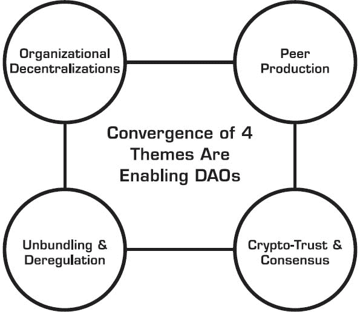

# 5

灯塔行业与新中介

> “ fool you are to say you learn by your experience! I prefer to profit by others’ mistakes, and avoid the price of my own.”
> 
> –奥托·冯·布里辛斯克亲王

本章讨论了区块链在银行和资本市场之外的几种行业中的影响。

在企业领域之外，还有更大、全球性的问题，这些问题是区块链的潜在目标，它们与经济、产业、政府或社会有关。其中一些问题有着哲学或意识形态的基础。挑选世界上关于不满或问题的各种口味，可能就有基于去中心化的替代解决方案，这种解决方案无疑与区块链有关。

如果你想要看看区块链上的真正创新，那么共同因素指向那个方程中没有既得利益者。新的初创公司不关心现有的中央服务，并试图利用区块链的去中心化特性建立更好的服务。

这里有一个关于区块链的新范例：数据和程序是公开的。确切地说，是半公开的，因为信息是加密安全的，只有有权访问的人才能看到。这意味着任何人都可以在区块链上发布数据。以前，所有重要的事情都隐藏在隐藏的数据库中，或是一个物理服务柜台后，我们必须去某个地方验证某事。现在，我们将学会暴露数据，而没有安全顾虑地打破数据库。

你需要相信，你可以在公共基础设施上安全地运行程序，这种基础设施在某些方面比传统计算环境更安全。区块链基础设施具有多种内置冗余，非常具有弹性。

## 新中介

受到技术威胁的旧中介总是难以被打败。他们不会简单地屈服。他们在缩小的时候仍在坚持战斗。报纸、有线电视提供商和旅行社就是一些例子。

区块链攻击了一些旧的中介：中央对手清算所、公证人、担保服务以及任何具有内置信任组件的服务。虽然区块链逐渐削弱了这些现有中介的某些功能，但它也使新参与者的创建成为可能。

最初，区块链服务看起来像是“替代”主流的提供，但互联网服务就是从这样的状态开始的。随着采用率的提高，这些替代选择成为主流。

解耦是新兴中介出现的主要原因。解耦移除了一些功能层，为利用这些功能的新中介创造了弱点。围绕核心解耦的内容不再保护核心。

万维网是一个新的中介平台，取代了报纸、娱乐媒体和旅行社。

新的基于区块链的中介会是谁呢？

**信任证明权威**

很快，我们将能够获得“一切事物的证明”。这个愿景是：信任检查应该是一个无摩擦的过程，就像你在谷歌上搜索一样简单。

我们可以想象到一大批基于区块链的服务将变成新的“信任权威”。你首先对某件事进行时间戳标记。其他人可以验证你所做的事情。以下是一些启发性的例子：

+   **身份验证**：通过基于区块链的证书机构验证你的身份。

+   **存在证明**：录制音频/视频、拍照或接收文件，并分享这些证明。

+   **预言机即商业**：预言机将成为参考权威，因为它们包含始终更新的有用信息。

+   **智能合约即服务**：直接从你的浏览器访问智能合约目录（例如，Pax Directory）

+   **购买证明**：验证你购买了某些东西，比如 licensed arm、彩票、药物或钓鱼许可证。

+   **位置证明**：证明你在一个特定的地点。

+   **所有权证明**：回答这个问题，这个东西是谁的？

+   **销售线索生成证明**：帮助确保你没有购买不可信的营销线索，没有欺诈。

### **DAO 即将到来**

去中心化治理的一种表现形式是分布式自治组织（DAO）的出现，其治理和运营基于区块链。可以说，这可能是商业去中心化的典范。在不久的将来，任何人都可以未经授权为 DAO“工作”，并从中获得经济利益。

分布式自治组织/公司（DAO/DAC）的概念是加密技术革命的理想主义成果。它的根源起源于奥里·布拉夫曼在《海星与蜘蛛》（2007 年）中所描述的组织去中心化主题，以及约柴·本克勒在《网络的财富》（2007 年）中适当地描述的“同伴生产”主题。但是这两个主题最近被丹·拉里默观察到的加密货币相关技术的出现所补充，他注意到比特币是原始的 DAC，维塔利克·布特林进一步将这一结构泛化为 DAO，指出 DAO 具有“内部资本”。众筹的去监管和服务解包是两个相互配对的主题，它们与这种混合反应相结合，而加密技术治理层的技术和基于信任的自动化则允许 DAO“在没有人类参与的情况下运行，受不可腐蚀的一套商业规则的控制”。^(1)

我们仍然缺少真实的体验和对运营 DAO 现实的深入了解。当然，不是所有的 DAO 都会按照食谱诞生。DAO 原则将会有变体和纯度的不同，这是出于实际考虑。

那么，你如何实现这一点，以及从运营/实际角度来看，这个谜团的哪些部分需要解决呢？

我们能够利用加密技术并不意味着 DAO 就会成功。

虽然从规划的第一天就瞄准去中心化自治组织（DAO）是可能的，但也可以逐步发展成 DAO，同样可行的是将 DAO 的某些结构部分整合到传统组织中。如果 DAO 是自主代理通过人工智能或智能程序完成工作的实际涅槃，那么我们可以设想一个进化序列的路径，其中每个后续阶段都建立在之前一个阶段的功能之上，根据以下进化过程：

+   **参与性** – 用户独立自愿地参与松散的任务

+   **协作性** – 用户协作并将价值共同导向共同的目标或任务

+   **合作性** – 用户期望获得一些共享收益

+   **分布式** – 通过在更广泛的网络上传播这些功能来开始其传播

+   **去中心化** – 通过赋予边缘更多权力来达到进一步的可扩展性

+   **自主性** – 自主代理、智能程序以及（后来）更高水平的 artificial intelligence 和 AI 算法在组织的中心、边缘和动脉提供自我维持运营和价值创造。

你需要系统地考虑各种事项，作为逐步解决的实施清单：

1.  **范围是什么？** 用户是这个进化的中心，支持这些用户行动的建筑结构骨架也是如此。注意，参与性、协作性、合作性功能是基于用户的，而分布式、去中心化、自主性功能是基于架构的。

1.  **所有权份额类型**。参与 DAO 有三种方式。你可以购买股份、加密货币或代币；它们可以被授予给你；或者你可以赚取它们。赚取这部分很有趣，因为它涉及到一些积极或被动的工作。积极工作的例子包括为特定项目交付赏金，如寻找漏洞、开发软件、道德黑客或 DAO 需要的任何任务。被动工作通常是通过分享来完成的，比如分享你的计算机处理周期、互联网访问、存储，甚至你的数据。

1.  **价值单位**。你为你的股份所获得的东西也可以有多种形式。当然，传统工具是股份（或股份/认股期权），但价值也可以以积分、代币、奖励或加密货币的形式出现。请注意，代币可能有多个目的，因为它们可以代表产品使用权或与某些内在价值相关的所有权。

1.  **治理透明度**。正确地做好治理并不容易，但这必须去做。自治并不等同于无政府状态，因此你需要考虑组成治理的各种部分，无论利益相关者是积极参与（例如，投票，管理，制定规则，检查规则，决策，报告，法规），还是被动参与（例如，感到有力量，被重视，受尊重，公平地得到补偿^(2)）。不管怎样，治理的透明度必须占主导地位。

1.  **增值收益**。在传统意义上，我们已经有利润分享或股息参与作为集体收益再分配的一种形式。但在 DAO 中，这些利益可能包括投票/特殊权利，或被授予某种特殊地位。最终，必须通过内部资本增值发生价值增长，无论是以加密货币还是以某种加密安全令牌化的形式。

1.  **基于加密的技术**。区块链和基于加密货币的协议和平台只是共识机制的推动者。通常，这些都是开源的、去中心化的共识和去中心化的信任协议，它们使所有交易和智能程序的不可争辩性、可验证性和真实性成为可能。这些协议可以是通用目的的（例如，以太坊，比特币），也可以是特殊目的的（例如，La’ZooZ 用于去中心化交通或 MaidSafe 用于去中心化存储）。技术平台应该包括三个附加的功能组件：a) 用户数据层，假设数据归用户所有，并且 DAO 只能以特定的汇总或盲形式访问；b) 智能程序，实际上是交易引擎；c) 各种应用程序编程接口（API），以便与与 DAO 相关的辅助价值服务或合作伙伴进行接口。

DAO 的一个关键目标是价值创造或生产，为了实现这一目标，需要有用户行动和这些行动对组织整体价值的影响之间的特定链接，这一点由其下层的加密货币价值所象征。创新和创造力的企业家精神需要在这里发挥作用，商业模型也将在此处制定。

没有价值链接的使用是浪费，这将导致反作用力失败。是的，这是一个警告。许多这样的 DAO 在其创立阶段将是理论性的。加密货币众筹只能让 DAO 走上启动之路。说到底，新的 DAO 就像一家初创公司。它需要产品/市场匹配、商业模式实现，以及大量用户（客户）的参与才能推进。在早期，会做出许多假设，DAO 可能看起来像一个科幻项目，直到产品或服务触及市场力量现实的考验，决定其可行性。“成功的证明”将是市场可持续性，而不是众筹的成功。

尽管 DAO 备受追捧，但要达到 DAO，是一个逐步构建的过程，不能人为加速。DAC/DAO 在实施上有纯度的不同。将会有公司只有一部分是 DAC 或像 DAC 一样运营的情况。

## 灯塔产业

### *政府和治理*

政府和治理相关的应用程序非常适合区块链技术。我们将它们分为三个部分：

1.  现有的国家级、州级、省级、县级、市级或地方政府辖区

1.  国家或组织的虚拟治理

1.  公司治理

现有的“实体”政府将一些服务转移到区块链上，将其视为从目前提供的电子服务演变而来。

| 传统政府的一些基于区块链的服务 |
| --- |

|

+   婚姻登记

+   采购拍卖

+   护照发行

+   福利领取

+   土地注册

+   许可证

+   出生证明

|

+   财产所有权

+   机动车注册

+   专利

+   税收

+   投票

+   政府债券

+   文件和合规

|

然而，政府实施这些服务将需要很长时间。他们无疑会首先分析这些项目的全面影响和后果，然后评估可扩展性需求。他们对这些服务的期望会非常高，因为一旦启动，政府服务就不能失败。较小国家、县或城市在尝试早期项目时可能会有优势，因为它们可以避免潜在的区块链可扩展性限制。

借助虚拟治理，BitNation 提供了可能的例子。它是一个涵盖法律、保险、社会、安全和外交服务的 DIY 大杂烩。它包括一个全球公共公证服务，任何人都可以将他们的法律文件记录在区块链上，并通过在区块链上永久时间戳的方式提交它们。

爱沙尼亚已经实施了 BitNation 公共公证服务。例如，如果一对夫妇在 BitNation 公共公证处结婚，^(3) 这意味着他们并不是在爱沙尼亚或其他任何管辖区结婚。他们只在“区块链管辖区”结婚。^(4)

乌克兰正在开创一个基于区块链的选举平台（运行在以太坊上），该平台将允许进行包括政治初选、选举、在线请愿或公投在内的多级别选举。^(5)

对于传统公司来说，BoardRoom^(6)是一个开箱即用的董事会治理平台，它依靠区块链来管理通过表格提案进行的去中心化共识，这些提案可以进行投票和通过民主集会执行。它最有趣的一个功能是从治理决策到资金清算的直接链接。该平台的创建者 Nick Dodson 表示：“它允许基于预设规则，在投票通过决议后，将资金支付给收款方，从而将收款时间从几周缩短到即时清算。”

如果你想将你的公司注册在区块链上并管理其治理事务，Otonomos^(7)可以让你在新加坡、香港或英国“订购”一家新公司。你可以在控制板上方便地分配股本给股东、任命董事、向员工发放期权或向投资者发放可转换债券（通过智能合约），而无需触摸任何纸张。

DIY 政府 2.0 的另一个潜在应用是：假设一个国家的实际政府正在失败，担忧的公民可以创建一个更加公平、去中心化和透明的影子区块链治理。至少有 50 个失败、脆弱或腐败的国家可以从改进的区块链治理中受益。^(8)

***医疗保健***

当我们审视健康产业的范围时，很容易假设区块链的能力将是一把银弹，可以解决医疗记录和患者数据隐私方面的挑战。

编制一个可移植且集成的医疗记录是一个古老且难以解决的问题。我们无法期望区块链解决与医疗保健和技术相关的所有问题。尤其是如果区块链方法与现有法律产生冲突，监管障碍不容小觑。

这个理论很有吸引力：将你的医疗记录安全地发布在区块链上，并确信你或授权人员可以随时随地访问。爱沙尼亚政府就是这么做的——这是区块链技术在医疗领域的一个好案例。通过与分布式账本结合使用 Guardtime 的大规模无钥匙数据认证，公民携带他们的身份证明，实时解锁他们的医疗记录。从那时起，区块链确保了清晰的产权链条，并记录了接触这些记录的所有人员，同时确保合规流程得到维护。^(9)

其他医疗用途可能包括：

+   通过多签名过程和二维码的结合，我们可以向授权的医疗服务提供者授予我们医疗记录或其部分的具体访问权限。

+   在大数据中分享我们的患者数据，同时匿名化以保证隐私得到维护。这在研究中有帮助，并且可以相互比较类似病例。

+   记录并时间戳标记医疗程序或事件的交付，以减少保险欺诈，促进合规并验证所提供服务的真实性。

+   记录关键医疗设备维护的历史，例如，一个 MRI 扫描仪，提供一个永久的审计跟踪。

+   携带一个包含我们完整电子病历的安全钱包，或者我们的存储 DNA，并在紧急情况下允许其访问。

+   验证药品的来源，以消除非法药物制造。

+   “CaseCoins：”创建特定代币，围绕解决某种特定疾病创建加密货币市场，例如 FoldingCoin，一个参与者分享他们的处理能力以帮助治愈疾病的项目，并得到代币资产的奖励。^(10)

***能源***

区块链应用可以帮助实现电力分配网更有效的管理，低成本的点对点或机器之间的微交易，创建次级市场，或基于规则的支付。

德国能源公司 RWE 正在考虑将电动汽车充电站与区块链连接（通过 Slock.it，该平台运行在以太坊上）。这个服务允许用户给他们的车充电，并按微交易片支付。充电站处理用户身份验证、支付处理和忠诚度积分分配作为一项单一的不变交易。这简化了账单，提供了更简单的会计，这是能源市场中的一个现有瓶颈。^(11)

TransActive Grid 是一个 LO3 Energy 和 ConsenSys 的合资企业，已经开发了一个业务逻辑层，提供本地能源生成的实时计量，使居民能够向邻居购买和销售可再生能源。这个项目的第一次演示发生在 2016 年 3 月，在纽约市布鲁克林区 10 个客户之间进行，引起了其他 130 人的兴趣。^(12)

埃森哲揭示了一个与监测电力使用的其他家用小工具协同工作的智能插头原型的概念验证，当需求高或低时，它会寻找能源价格，然后如果找到更便宜的来源，就使用修改后的区块链切换供应商。这可以帮助许多收入较低的人，他们通过仪表支付电力。^(13)

网格唯一性^(14)正在使用区块链来验证能源交易。该公司旨在发展中的国家，在那里它想让按使用量付费的太阳能更安全。它的最终目标是建立一个可以应用于电网上任何类型交易的能源系统区块链平台。

## 第五章的关键思想

1.  区块链的影响故事在她进一步传播到各种行业、政府和横向案例之前是不会完整的。

1.  虽然区块链逐渐削弱了一些现有中介的功能，但它也使新参与者的创建成为可能。

1.  很快，我们将能够像搜索一切内容的谷歌搜索一样，轻松获得“万物证明”。

1.  在金融服务、政府、医疗保健和能源之外，下一个可能经历基于区块链创新活动增加的行业是区块链。

1.  分布式自治组织（DAO）是区块链的一个重要应用，但其在实际应用中的实施仍处于初级阶段。

## 注释
