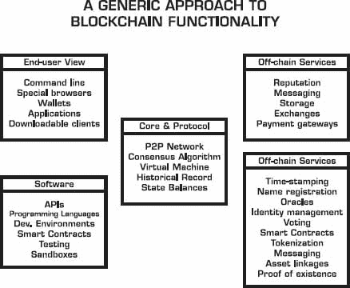

# 6

实施区块链技术

> “想象力比知识更重要。因为知识局限于我们所知和理解的一切，而想象力则包容整个世界。”
> 
> ——阿尔伯特·爱因斯坦

一个技术越基础，它产生的影响就越大。区块链技术不是一个过程改进技术。在其完全部署潜力下，它更像是一种颠覆性技术；因此，在实施时必须给予这种潜力。

大多数主要的区块链平台都是通过一种透明、开源、协作的方式开发的，包括一定程度的去中心化贡献工作。这产生了两个结果：a) 所谓的“制造香肠”的过程并不总是美好的，b) 在最终发布之前，实施和部署的妥协比例外更为平常。直到区块链技术发展成熟（大约在 2018-2020 年左右），你将需要管理沿着这条道路铺设的各种实施挑战。

我们可能会得出与互联网早期几年类似的情况。许多早期的商业失败了，有些是因为技术上的弱点，有些是因为业务模型假设过于夸张（这是市场经验不足的结果），还有一些是因为两者都有。最终，互联网和网络技术发展、改进，并使更强大的实施成为可能。

有了区块链，我们可以采取保守的方法，等待技术成熟，然后在不确定性消除时参与。俗话说，早起的鸟儿有虫吃，但第二个老鼠有奶酪吃。一些公司无疑会走这条路，而其他公司则可能更倾向于成为愿意为更大的或更早的回报而承担风险的先锋和创新者。

实施区块链的两种持续方法：a) 在现有组织内部，作为一种附加技术；或者 b) 在组织外部，由一个可能不那么关注现有流程的初创公司进行。本章重点介绍组织内部区块链实施的前期步骤。第三章、第四章和第五章中提到的许多想法突出了初创公司的创新工作。在本章的后期，我们还将涵盖前两者混合的组织间机会。

## 组织内部应对区块链的策略

在大型组织内部实施区块链没有正确或错误的方式。有各种各样的方法。初创公司从一张白纸开始，没有包袱。但一个组织可能被其现有状况所束缚。古老的谚语“是的，上帝在六天内创造了世界，但那是因为他没有一个已安装的基础”再次成为真理。

让大型组织了解区块链及其影响并非一蹴而就的项目。

一个特定问题（区块链）在高级管理层中获得动力、理解和认知需要一段时间，它通常出现在首席执行官优先议程的过程中。这通常发生在进步员工的兴趣高涨和外部市场压力的结合之后。

突然间，一个或少数几个处于领导地位的员工开始拥有区块链话题，并开始持续思考它。组织可能会有这样的问题：

+   我们应该如何组织起来应对区块链，为什么？

+   我们如何开发用例、策略和实施方法？

+   我们从概念验证如何发展到全面部署？

+   我们从区块链中预期哪些有记录的好处——战略层面还是操作层面？

+   我们在学习什么教训，犯什么错误？

+   我们衡量自己的哪些基准？

+   我们能分享哪些最佳实践，以便我们在努力中更加有效？

+   在未来一年里，我们希望能实现什么目标？

## 区块链沙皇

沙皇比喻的起源可以追溯到 20 世纪 90 年代初的重建时期，当时迈克尔·哈默和詹姆斯·钱皮在他们的小说《企业重建》中提倡了“重建沙皇”的角色。重建沙皇是那个将成为公司内重建工作的集结点的个人。

在重建定义中，重建沙皇是“一个负责在公司内发展重建技术和工具，并实现公司各个独立重建项目之间协同的个体。”^(1)

值得注意的是，重建沙皇并不“制造”重建。那是“重建领导者”的角色，他们得到沙皇的支持。继续哈默和钱皮的重建沙皇的角色，“重建沙皇有两个主要职能：一是支持和帮助每个流程所有者和重建团队；二是协调所有正在进行的重建活动。”

我在 1995 年的最后一年在惠普公司工作，担任公司加拿大运营部的重组沙皇。这个职位直接向首席执行官汇报，因为重组是最高级别的企业行动，具有最高优先级的议程。当时，我通过协助公司内各个实施团队的沙皇管理着十几项重组项目，并遵循哈默和钱皮的方法和实践，取得了巨大成功。

作为历史参考，重工程专员职位有一个政府相关的先例。1993 年，克林顿总统任命伊拉·马加齐纳（Ira Magaziner）为美国互联网专员（2），在那时，白宫提名了 11 个专员职位。值得注意的是，专员职位后来在乔治·W·布什（2001-2009 年）总统和巴拉克·奥巴马（2009-2016 年）总统时期激增至 33 个和 38 个。3

重工程时代的区别早期区块链时期在于，“重工程”的“食谱”大部分已经写好，大量的工作是关于实施。在 20 世纪 90 年代初，底层催化剂技术是信息技术，它稳定可靠，与企业区块链技术在 2016 年仍在成长和成熟的情况不同。然而，重工程专员的精神和意图对于区块链来说仍然完全适用。

遵循流程重工程的做法是商业信仰最纯粹的形式，我希望区块链倡议和投资也能得到同样的待遇。

在这种背景下，“区块链专员”应具备贵公司业务运营的经验，并理解通过技术实施来重工程业务流程的角色。这个人也可以成为公司内部和外部发言人。理想情况下，这个角色不应该由研究部门的分析师来填补，但只要他们有运营经验，他们可以是创新团队的一部分。区块链专员将负责消除组织内的障碍，促进教育，策划和分享最佳实践，并监督组织内各种实施的进展。这个工作很难，因为它涉及找到并消除旧流程，而不是自动化或优化目前所做的。

## 组织模型

那么，你该如何内部组织呢？有各种选择。

一些公司正在资助一个“区块链实验室”实体，其中包括可以“亲自动手”的软件工程师，一旦想法浮出水面并需要展示。这些实验室通常有内部重点，即“展示和销售”，或向公司内的其他业务单元和部门教育区块链的可能性。他们的挑战通常不在于想法的孵化，而在于这些想法如何在其他部门和业务单元内部实施和落实，这些部门和业务单元是真正的实施操场。

一些其他组织已经形成了一个内部区块链任务小组，由各个业务部门的关键利益相关者组成，他们定期会面和沟通。这种方法的问题是，这些利益相关者可能知识水平或动力不一致，他们可能对给定方向意见不一。这个小组的角色可能更多的是分享和集体学习，而不是影响。

另一种方法是在各个小组内通过共同流程发现想法，但在实验室中为他们开发概念验证，然后与业务部门一起实施最佳候选人。

无论采用哪种方法，它们都会从至少一个强大的区块链倡导者那里受益，这个人是一个受尊敬的思想领袖，一个大胆的沟通者，以及区块链技术的热情支持者。

## 区块链功能架构

理解区块链范围的一种方法是研究它们所拥有的全面功能。本节描述了一个拟议的通用构建块方法，该方法是通过分析市场上存在的各种方法而得出的。

2016 年，这些部分看起来很多，但会有整合，我们逐渐开始少谈引擎盖下的是什么，而更多地从更高层次的能力出发。最终，这种技术基础设施将被视为理所当然，大部分技术将采用“即插即用”的方式，而不是像早期方法那样的宜家盒子。

以下是一些区块链技术的构建块：

让我们深入了解一下这些部件的每一个。

## 核心与协议

### **点对点网络**

点对点（P2P）网络是由连接在一起作为节点的计算机组成的集合，形成一个不断扩展的拓扑结构。它是区块链的一个基本基础元素。每个节点运行相同的软件，因此为整个网络提供固有的冗余，这意味着如果一个节点宕机或无响应，其他节点的工作总是在补偿。本质上，P2P 网络很难被彻底摧毁。你必须把每一个节点都摧毁。

### **共识算法**

决定“什么”或“多少”节点可以参与验证交易的权限方面的各种方法也是共识算法配置的一部分，它们帮助确定结果是公共、私有还是半私有的共识形式。挖矿可能与这个过程无关。密钥和签名是此功能的一部分。

区块链早期的发展充满了关于哪种共识最好的热烈讨论，但随着这些技术的成熟，特别是在 2018 年以后，共识算法的类型将是一个无关紧要的话题，只要它是有效的、安全的，并且得到良好的支持。

### **虚拟机**

这是一个从流行的 Java 虚拟机（JVM）方法借鉴的概念，但在区块链开发背景下由以太坊开创。虚拟机描绘了处理内部状态和计算的协议部分。可以将其视为一个大型去中心化计算机（实际上由几个 P2P 机器组成），包含有关数百万账户的信息，更新内部数据库，执行代码，彼此互动。用智能合约语言编写的程序编译成虚拟机，要创建合约，你需要发送包含你的代码的交易。

### *历史记录*

交易实际上记录在按顺序的数据块中（因此称为区块链），因此有一个历史性的、只追加的这些交易的日志，该日志持续维护和更新。一个误区是区块链是一个分布式账本。在技术意义上，它不是，但它充当一个，因为交易区块的集合等同于一个分布式账本。然而，你可以根据区块链提供的的历史记录构建不可变的分布式账本应用程序。

### *状态余额*

比特币并不是围绕账户设计的，尽管账户是思考进行中的交易的一种更常见方式，因为我们习惯于将银行交易视为如此。在底层，比特币使用一种称为未花费交易输出（UTXO）的方法，一个将未花费交易作为输出，可以在新交易中作为输入链接的概念。其他区块链使用不同的方法来跟踪状态余额。Ripple 有一个包含网络各处持有的当前余额的快照的账本，而不是历史事件的链。在以太坊中，状态由称为“账户”的对象组成，每个账户的状态转换是账户间直接的价值和信息传输。

## 区块链软件开发

组成区块链软件开发的各个部分包括：

+   API（应用程序编程接口）

+   各种客户端实现（例如，C++、Python、Go、Java、Haskell）

+   集成开发环境和快速应用开发框架

+   智能合约语言和脚本

+   测试工具

+   沙盒环境

## 链上服务

+   时间戳

+   命名注册

+   预言机

+   身份管理（在线、合法、假名等）

+   投票

+   智能合约管理

+   代币化

+   消息传递

+   资产链接

+   存在证明

## 最终用户视图

+   命令行

+   特殊浏览器

+   钱包

+   应用

+   可下载的客户端（作为应用程序的入口点）

## 离链服务

+   声誉

+   消息传递

+   存储（DHTs、文件系统）

+   交易所（用于代币、资产、货币）

+   支付网关

## 其他期望的区块链特性

+   加密交易（保密传输）

+   监控（统计和分析）

+   审计

+   安全

## 编写去中心化应用程序

由于区块链的共识过程本质上是去中心化的，因此它们能够启用一种新的去中心化应用程序。去中心化应用程序在技术上、政治上或两者都可能是去中心化的。

现实情况是，去中心化应用程序并非适用于所有事物，也不是所有事物都适合去中心化应用程序范式。然而，有很多应用程序适合区块链分布式范式，这为开发者、创造者和有远见的人提供了大量的机会。

去中心化应用程序首先为自己创建所有权、交易要求和逻辑的规则。

编写去中心化应用程序有各种复杂的水平。

1.  使用加密货币作为货币单位支付服务费用。

1.  使用区块链服务作为一个特性，例如，用来注册资产或验证流程的真实性，通常是通过 API 完成的。

1.  使用区块链上的智能合约来运行某些业务逻辑，如果满足某些条件，就会返回特定的值，例如，金融衍生品。在这种情况下，有一个数字资产，其所有权和移动由区块链管理。

1.  以一种更根本的方式使用区块链，使得应用程序在没有区块链的情况下无法运行。通常，你会设置一个特定的点对点网络，具有节点，例如，OpenBazaar，作为一个去中心化的电子商务应用程序。

1.  使用你自己的区块链（可能与其他人共享），不使用经济代币或货币单位。大多数受许可的区块链在企业中发挥作用。

1.  使用你自己的区块链（或其他区块链），包括代币或货币单位，创建一个经济价值网络，例如，MaidSafe⁴，它在一个用户点对点网络上创建了一个未使用计算资源的市场。

## 12. 区块链平台的特性

如果你需要评估给定的区块链平台，以下特性很重要：

1.  **1. 可编程性**。有哪些特定的编程语言可用？

1.  **2. 可扩展性**。区块链可以增长多少节点？是否会有上限？

1.  **3. 可升级性**。开发人员提供区块链改进和升级的记录如何？

1.  **4. 交易管理性**。所有交易是否有实时透明度？

1.  **5. 可见性**。你是否有完整的区块链活动视图？

1.  **6. 成本效益**。部署该技术的成本是多少？

1.  **7. 安全性**。对区块链安全性的文档信心水平如何？

1.  **8. 速度/性能**。验证交易的速度上限是多少？

1.  **9. 高可用性**。它的正常运行时间记录如何？

1.  **10. 可扩展性**。你能通过各种附加组件来扩展基本区块链功能吗？

1.  **11. 互操作性**。它与其他区块链或相关技术良好互操作吗？

1.  **12\. 开源。**代码是开源的吗？来自各种开发者的协作和贡献水平如何？

## 13 位 CIO 和公司高管的策略

### *问题 1：区块链重新定义遗留系统*

大型公司总是与其遗留应用程序作斗争，因为这些应用程序在新技术到来时可能会成为拖累。即使您认为企业 IT 在使用模块化云能力、容器化技术以促进运营部署，或采用敏捷和快速开发实践的现代软件环境中是安全的，区块链又是另一种“现代技术”，它需要被吸收并整合到任何软件开发团队的工具集中。

### *问题 2：区块链是一个战略性的 IT 平台*

正如在第一章中明确指出，并在本章前面部分进行扩展那样，区块链在其完整形式下，是一个新的主要软件开发平台。因此，它的重要性日益凸显。战略性的意思是，它不仅仅是为了降低成本和提高交易延迟。战略性的意思是，它需要找到能够给您带来竞争优势的战略用途。具体来说，私人和公共区块链的交集将产生一些非常创新的应用程序，但这种开发只有在内部组织的应用公共区块链技术达到一定水平时才变得可能。

### *问题 3：需要哪些能力？*

全面在公司内推广区块链解决方案需要 5 类能力：教育、探索、设计、开发和管理。

**教育：**学习区块链的基本功能以及它通常能做什么。

**探索：**通过回答区块链适用于哪些领域以及我们能用它做什么来识别机会。

**设计：**我们将需要什么解决方案功能来解决我们在探索阶段看到的潜力？它将如何影响我们所做的工作，包括业务流程、合同和法律要求？

**开发：**软件开发、集成以及技术的部署。

**管理：**持续的软件维护、支持、迭代发展、新功能和更新。

大多数公司无法在这些领域中都发展专业知识，但它们可能与外部公司合作，为这些步骤的特定方面提供支持。知道如何编程区块链将是一种必要的竞争力，与编程 Web 应用程序一样重要。

### *问题 4：选择哪些合作伙伴？*

每个组织根据其资源和能力处于不同的起点，所以选择的方法将取决于您特定的情况。以下表格将各种方法进行分类：

| 方法 | 如何实施 | 示例 |
| --- | --- | --- |
| IT 服务 | 我们将为您构建任何东西 | 大型的 IT 公司 |
| 区块链 | 你直接与区块链的工具和服务工作 | Bitcoin, Ethereum |
| 开发平台 | IT 专业人员的框架 | Eris, BlockApps |
| 解决方案 | 行业特定的 | Clearmatics, DAH, Chain |
| API & 叠加 | 手工组装组件 | Open Assets, Tierion |

### **第五个问题：后端集成**

当区块链应用程序开始达到完全部署水平时，它们最终需要与各种后端系统集成，就像客户面向的 Web 和移动应用程序必须与企业现有的系统集成一样。然而，区块链也有潜力取代一些后端流程，所以你必须考虑这种可能的情况。但请记住，在没有内部集成的某些新领域开始实施区块链解决方案会更容易。如果你的起点包括你的现有系统，那么你本质上可能会将实施范围延长多达 18-24 个月。那么，为什么不考虑从零开始，吸引想要尝试新事物的新的客户呢？

### **第六个问题：区块链作为共享服务平台**

除了内部应用程序和用例，还将有许多新的机会来创建共享区块链服务，无论是垂直层面（例如，某个特定的金融服务应用程序），还是水平层面（例如，通用的记录验证服务）。

### **第七个问题：颠覆还是建设？**

对于初创公司来说，区块链无疑是一种颠覆性技术，但大型公司除非被迫，否则不喜欢自我颠覆。在大型公司内部，首先可能出现的情况是将区块链技术应用于加强现有运营，通过实现新的效率级别或降低成本。然而，这可能还不够。如果你停留在建设性/防御性阶段，外部的颠覆威胁仍然会存在。

### **第八个问题：区块链作为新的数据库**

本书中反复出现的主题是将区块链作为数据库，所以你不妨拥有尽可能多的区块链专家开发者，就像拥有数据库专家开发者一样。知道何时使用传统数据库，何时使用区块链将很重要，知道如何优化它们的联合操作将更加重要。

### **第九个问题：区块链平台**

2016 年，我们看到许多组件和选择，“手工组装”仍然需要。我们可能正处于类似编写 HTML 代码、一页一页构建网页的阶段。开箱即用的区块链将是一个受欢迎的进化，尽管区块链即服务是那个方向的一步。

### **第十一个问题：如何获取教育**

你可以主动向各个部门普及区块链技术，或者等待市场继续泛泛地教育所有人。如果没有紧迫感，这可能意味着你还没有花时间了解区块链的全部潜力，或者区块链没有由正确的人领导，而这个人将负责在各个业务部门之间激发所需的火花。

### *问题 11：死胡同与端到端的验证概念*

概念验证（POC）在一些大型公司中很受欢迎，作为一种方式，让你在不完全湿身的情况下涉足新技术。但风险在于，它们可能是畏缩不前的实验，看不到承诺，而且可能走进死胡同，因为它们并不总是让你看到潜在的好处。最好实施一个端到端的较小区块链项目，在那里你可以看到结果并体验真实的用户使用全生命周期。话说回来，POC 可以用作缩小承诺项目组合的手段，但你需要超越它们。

### *问题 12：业务流程与技术*

我一直认为，实施区块链是 80%关于业务流程的改变和 20%关于弄清楚其背后的技术。当然，这假设你有足够的雄心壮志去改变业务流程所需的坚韧。如果你认为区块链技术还不成熟，或者有一些稍后可能解决弱点，那么利用这段时间开始重新设计你的业务流程，等你完成时技术就会准备好。

### *问题 13：用例饱和*

寻找用例的头脑风暴作为初步切入点是好的，但不够。风险在于认为用例是可抛弃的。你尝试了，如果你不喜欢，你就扔掉。用例可能导致某些结果，也许不会。术语“用例”假设必须符合现有流程，所以门槛不高，不足以做出更困难的选择，超越显而易见，进入创新发现潜力。下一部分探讨如何戴着创新帽子思考区块链。

## 决策框架

通常，首先浮现在脑海的问题是：“区块链在解决什么问题？”这是一个好问题，但自我设限，因为它假设区块链只能解决已知问题。

如果区块链能创造新的机会，而不是解决现有问题呢？那么，你需要改变思维方式来走向那个方向。互联网最初是解决世界贸易抱怨的具体问题，但它为我们提供了电子商业作为全球贸易的新版本。如果你问问报纸，他们可能认为他们没有任何问题，但互联网挑战了他们的行业。社交媒体不是为解决问题，而是人际关系的增强。

我们可以将区块链的影响归类为三个大类：

1.  解决问题

1.  创造机遇

1.  应用能力

### *解决问题*

问题类别多种多样。它迫使人们思考区块链是否有立即的应用可能影响：

**成本节约：** 后台？中台？客户服务？

**生产力：** 产出增加？

**效率：** 更快处理？合规/报告赋能？

**时间延误：** 更快的结算？更快的结算？

**质量：** 错误减少？满意度提高？

**结果：** 收入增长？利润增加？

**风险：** 欺诈减少？风险暴露降低？

尽管上述内容不是严格意义上的“问题”列表，但它确实是任何组织希望简化的基本业务参数列表。在这种情况下，区块链是一个看不见的推动者，它并没有改变业务的外部可见部分太多。相反，它更像是一个内部的黑箱，比以前做得更好。

希望你能确信，仅仅询问区块链解决什么问题是一个自我设限的问题。例如，如果你看看围绕银行在金融科技领域的初创创新，你会看到有很多案例，这些新公司并没有真正解决银行存在的问题，但它们以不同的方式处理特定的市场或服务。因此，关键时刻是通过重新定义机遇来竞争，例如，点对点借贷、非传统的按揭贷款、非常快的审批周期、高效的机器人投资等等。

### *创造机遇*

更难以确定机遇，因为这需要应用创新、富有创造力，以及进行深刻变革。这些目标更难以实现，因为涉及到业务流程的改变，而且改变它们需要更长的时间。总结起来，区块链是关于 80%的业务流程改变，和 20%的技术实施。

创造新的机遇包括进入区块链使能的新市场和/或提供以前不可能的服务。它需要一个更有想象力的过程，去梦想什么是可能的，什么是以前没有做过的。它需要跳出传统思维框，以及对区块链在其强烈适应领域能 enable 的事物有深刻的理解。

*新服务机遇：*

+   新中介

+   新网络

+   新市场

+   新结算所

+   新权威

这些新的机遇也可能发展成为围绕三个空间的新市场：在你自己的组织内部、两个或多个组织之间的协作空间，或者完全新的不与内部流程最初接口的领域。可以说，任何在外部完成的事情可能都更容易解决，因为你最初不受核心整合要求的束缚。

+   **内部：** 我们能吸引新的客户群体吗？

+   **外部：** 我们能进入我们核心业务之外的新市场吗？

+   **协作性：** 我们能就某个空白领域展开合作吗？

### *应用能力*

第三种类型的思考涉及从底层应用区块链的能力。

在这些情况下，对区块链能力的深刻理解将引导你发现将区块链应用于自己业务的实施想法。对于理解区块链，比对理解某个人的业务容易得多。

以下是一些区块链使能的通用功能：

+   重新思考中介

+   打包服务

+   解包服务

+   新的价值流动

+   去中心化治理

+   新的法律框架

+   在区块链上运行智能合约

+   分享分布式账本

+   创建/发行数字资产

+   在交易和互动中嵌入信任规则

+   时间戳

+   实施数字签名

+   对数据/文件进行公证以产生证据

+   创建业务流程、事件或活动的记录

+   验证数据/所有权/文件/资产的真实性

+   确认交易的真实性

+   确保合同条件被无可争议地满足

+   对账户进行调节

+   完成金融结算

+   在应用程序中嵌入数字身份

+   提供支付托管或保管服务

+   使智能设备能够安全地进行交易

例如，你不能直接将区块链与数据库进行比较，并说：“数据库在这方面做得更好，因此我们不需要区块链交易。” 区块链是一种新的范式。相反，首先在区块链上运行智能合约，并问自己它能做什么，然后反向工作，看看如何将其与你的业务联系起来。

当考虑你的区块链战略时，你需要同时处理三个要素：问题解决、机遇发现和能力实现。这是组织区块链战略的理智三合一。

## 第六章的关键思想

1.  管理内部区块链策略需要一些集中的努力和领导。

1.  “区块链沙皇”方法对于大型组织中启动和协调不同努力是非常有效的。

1.  区块链实施将具有许多新的架构和功能组件，这些组件需要和谐地工作。

1.  公司需要根据自身的竞争能力和选择的外部合作伙伴来决定采取哪些实施方法。

1.  你不仅应该将区块链视为一个解决问题的技术。实际上，它是一种让你能够创新和瞄准新机遇的技术。

## 备注
